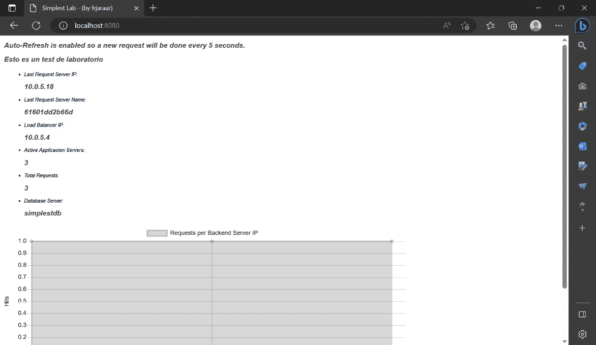

# 第七章：7

# 使用 Swarm 进行编排

作为开发人员，你可以基于微服务创建应用程序。使用容器将你的应用程序分发到不同的组件，可以为它们提供不同的功能和能力，如**可扩展性**或**弹性**。使用 Docker Compose 等工具，单独的环境操作比较简单，但当容器能够在不同主机的集群范围内运行时，事情就变得复杂了。在本章中，我们将学习如何通过 **Docker Swarm** 来协调应用容器，提供一整套管理可扩展性、网络和弹性的功能。我们将回顾如何在 Docker 容器引擎中实现协调需求，并且如何实现每个应用程序的具体需求。

本章将覆盖以下主题：

+   部署 Docker Swarm 集群

+   使用 Docker Swarm 提供高可用性

+   为你的应用创建任务和服务

+   堆栈和其他 Docker Swarm 资源的回顾

+   使用 Docker Swarm 进行网络配置和暴露应用

+   更新应用程序的服务

# 技术要求

我们将使用开源工具构建、分享并运行一个简单但功能完善的 Docker Swarm 环境。本章包含的实验将帮助你理解所呈现的内容，并且它们已发布在 https://github.com/PacktPublishing/Containers-for-Developers-Handbook/tree/main/Chapter7。 本章的 *Code In Action* 视频可以在 [`packt.link/JdOIY`](https://packt.link/JdOIY) 找到。

# 部署 Docker Swarm 集群

**Docker Swarm** 是 Docker 公司开发的编排平台。它可能是最简单的编排解决方案，用于开始部署你的容器化应用程序。它已包含在 Docker 容器运行时中，不需要额外的软件来部署、管理和提供完整且安全的 Docker Swarm 集群解决方案。不过，在我们学习如何操作之前，先来探索一下 Docker Swarm 的架构。

## 理解 Docker Swarm 的架构

Docker Swarm 的架构基于**控制平面**、**管理平面**和**数据平面**（或**工作负载平面**）的概念。控制平面监督集群的状态，管理平面提供所有平台管理功能，最后，数据平面执行用户定义的任务。可以使用多个网络接口将这些平面相互隔离（但对你作为开发者来说，这应该是完全透明的）。这个模型在其他协调器中也存在，例如 Kubernetes（简化为**角色节点**）。不同的角色将用于定义集群内节点的工作。Docker Swarm 与其他协调器的主要区别在于，这些角色可以轻松地在节点之间互换；因此，控制/管理平面节点只需一个命令即可转换为工作负载就绪的节点。Docker Swarm 使用**传输层安全性**（**TLS**）加密网络来安全地管理所有控制平面通信。内部**证书授权**（**CA**）及其证书将由 Docker Swarm 完全管理。

重要提示

大多数容器编排平台将定义**主节点**为用于管理平台的节点，而**工作节点**最终将执行所有工作负载。这些角色也可以共享，主节点可以执行一些特定任务。Docker Swarm 允许我们通过命令行完全更改节点的角色，而无需重新安装或重新创建节点。

我们将使用**服务**的概念来定义集群中的工作负载。服务具有不同的属性，用于修改和管理流量如何传递到应用程序的工作负载。我们将定义**副本**的数量，以确保服务被认为是活跃的。协调器将负责确保此数量的副本始终在运行。考虑到这一点，要扩展或缩减服务，我们只需修改认为健康所需的副本数。当集群节点发生故障时，Docker Swarm 会将任务调度到其他可用主机上。

使用许多不同容器化组件的应用程序将需要多个服务才能运行，这使得定义它们之间的通信变得至关重要。Docker Swarm 将同时管理工作负载状态和网络层（**覆盖网络**）。还可以为服务通信启用加密。为了确保所有服务副本都可访问，Docker Swarm 会管理一个内部 DNS 并在所有健康副本之间进行负载均衡服务请求。

集群还将管理应用程序服务的滚动升级，每当组件发生变化时，Docker Swarm 提供了针对特定需求的不同部署方式。此功能使我们能够通过简单地替换或降级服务来执行维护任务（如更新），避免任何可能的停机。

我们可以通过以下几点总结 Docker Swarm 的所有功能：

+   Docker Swarm 是内置的 Docker 容器运行时，无需额外软件即可部署容器编排集群。

+   一个控制平面、一个管理平面和一个数据平面被部署来分别监督集群状态、管理所有任务，并执行我们应用程序的进程。

+   集群节点可以是**控制和管理平面**的一部分（具有管理角色），仅执行分配的工作负载（具有工作者或计算角色），或同时具备这两种角色。我们可以通过 Docker 客户端命令行轻松地将节点的角色从管理者更改为工作者。

+   一个应用程序的工作负载被定义为服务，通过若干健康的副本来表示。当任何副本未能满足服务的要求时，编排器将自动监督执行一个调节过程。

+   所有集群的控制平面和服务通信（覆盖网络）由 Docker Swarm 管理，默认通过 TLS 提供控制平面的安全性，并为服务提供加密功能。

+   Docker Swarm 提供了内部服务发现和在所有服务副本之间的同质负载均衡。我们定义了在更改任何内容或工作负载特性时，服务副本将如何进行更新，而 Docker Swarm 会管理这些更新。

现在我们可以继续本节内容，学习如何部署 Docker Swarm 集群及其架构。作为开发者，你可以运用自己的知识，决定哪些集群特性和资源将帮助你在该编排器的监督下运行应用程序。

## Docker Swarm 管理节点

如本节前面所述，控制平面由一组主机提供。这些主机在 Swarm 中被称为**管理节点**。这些集群中的节点对于提供所有控制平面的功能至关重要。它们都管理 Docker Swarm 集群环境。一个内部的键值数据库用于维护所有在集群中创建和管理的对象的元数据。

为了为集群提供高可用性，我们部署了多个管理节点，并将共享该键值存储，以防某个管理节点发生故障。一个管理节点充当领导者，负责将所有对象的更改写入其数据存储中。其他管理节点将把这些数据复制到它们自己的数据库中。好处是，所有这些都是由 Docker Swarm 内部管理的。它实现了**Raft 共识算法**来管理和存储所有集群状态。这确保了信息在多个管理节点之间的均匀分配。

在 Docker Swarm 集群中，第一个创建的节点自动成为集群的领导节点，并且每当领导节点失败时，都会触发选举过程。所有健康的管理节点会在内部投票选举新的领导节点；因此，在选举新的领导节点之前，必须达成共识。这意味着我们至少需要*N/2+1*个健康的管理节点才能选举出新的领导节点。我们需要部署奇数个管理节点，并且这些节点会维护集群的健康状态，提供 Docker Swarm HTTP API，并在健康的、可用的计算节点上调度工作负载。

默认情况下，所有管理节点与工作节点之间的通信都会通过 TLS（相互 TLS）加密。我们无需管理任何加密过程；内部的 CA 会被部署，且服务器证书会自动轮换。

现在我们了解了集群是如何管理的，让我们来回顾一下应用程序如何在计算节点上执行。

## Docker Swarm 工作节点

管理节点的领导者会查看平台的状态，并决定在哪里运行新的任务。所有节点都会报告其状态和负载，以帮助领导者决定执行服务副本的最佳位置。工作节点与管理节点通信，向其报告正在运行的容器的状态，这些信息会传递到领导节点。

工作节点只会执行容器；它们永远不会参与任何调度决策，并且它们是数据平面的一部分，所有服务的内部通信都在此管理。这些通信（覆盖网络）基于 UDP VXLAN 隧道，并且可以加密，尽管默认情况下没有启用加密，因为加密会带来一些额外的开销。

重要说明

需要知道的是，Docker Swarm 的管理节点也具有工作节点的角色。这意味着默认情况下，任何工作负载都可以在管理节点或工作节点上运行。我们将使用额外的机制，如工作负载位置，来避免在管理节点上执行应用程序的容器。

现在我们可以继续并学习如何创建一个简单的集群。

## 创建 Docker Swarm 集群

Docker Swarm 的功能完全嵌入在 Docker 容器运行时中，因此我们无需额外的二进制文件来创建集群。

要创建一个 Docker Swarm 集群，我们将从初始化开始。我们可以选择任何主机接口来创建集群，如果没有选择，默认会使用第一个可用的接口。我们将在集群节点上执行`docker swarm init`命令，执行该命令的节点将成为领导节点。重要的是要理解，即使只有一个节点（领导节点），我们也能拥有一个完全功能的集群，尽管在这种情况下，我们无法为应用程序提供高可用性。默认情况下，任何管理节点，包括领导节点，都可以运行任何应用程序的工作负载。

一旦创建了 Docker Swarm 集群，Docker 容器运行时将开始以**swarm 模式**工作。此时，一些新的 Docker 对象将变得可用，这对你作为开发人员来说，可能会让你更感兴趣地部署自己的集群：

+   **Swarm**：该对象代表集群本身，具有其独特的属性。

+   **节点**：集群中的每个节点都由一个**节点对象**表示，无论它是领导者、管理节点还是工作节点。为每个节点添加一些标签非常有用，可以帮助内部调度器将工作负载分配到特定节点（请记住，所有节点都可以运行任何工作负载）。

+   **服务**：服务代表最小的工作负载调度单元。我们将为每个应用组件创建一个服务，即使它只运行一个单独的容器。我们绝不会在 Docker Swarm 集群中运行独立的容器，因为这些容器将不会由调度器进行管理。

+   **机密**：这些对象允许我们安全地存储各种敏感数据（最大可达 500 KB）。机密将在服务容器中挂载并使用，集群将管理并存储其内容。

+   **配置**：配置对象的作用类似于机密，但它们以明文形式存储。需要理解的是，配置和机密在集群中是分布式的，这一点非常重要，因为容器将运行在不同的主机上。

+   **堆栈**：这是一种新类型的对象，用于在 Docker Swarm 中部署应用程序。我们将使用 Compose YAML 文件语法来描述所有应用组件及其存储和网络配置。

重要提示

Docker Swarm 集群平台不需要像 Kubernetes 那样消耗大量资源；因此，可以在你的笔记本电脑上部署一个三节点集群进行测试。你将能够验证应用程序的运行方式，并在某些应用组件失败或集群节点完全离线时保持服务级别。我们使用独立的 Docker Swarm 集群，以便使用特殊对象，如**机密**或**配置**。

正如我们在本节之前提到的，我们可以通过执行 `docker swarm init` 来创建一个 Docker Swarm 集群，但许多参数可以修改默认行为。我们将回顾一些最重要的参数，以让你了解集群的隔离性和安全性：

+   `--advertise-addr`：我们可以使用此选项定义用于启动集群的接口。所有其他节点将使用此 IP 地址加入刚创建的集群。默认情况下，将使用第一个接口。此选项将允许我们设置用于宣布控制平面的接口。

+   `--data-path-addr` 和 `--data-path-port`：我们可以通过使用这些参数设置主机特定接口的 IP 地址和端口，来为应用程序隔离数据平面。流量可以加密，这对您的应用程序是完全透明的。Docker Swarm 将管理此通信；由于加密/解密过程，可能会有一些开销。

+   `--listen-addr`：默认情况下，Docker Swarm API 将监听所有主机接口，但我们可以通过定义的接口来安全地回答 API。

+   `--autolock`：Docker Swarm 将存储所有数据在 `/var/lib/docker/swarm` 下（默认情况下，取决于您的运行时根数据路径）。此目录包含 CA，用于创建所有节点证书，以及 Docker Swarm 自动创建的快照，以在发生故障时保留数据。此信息必须是安全的，`--autolock` 选项允许我们锁定内容，直到提供密码为止。

重要说明

锁定 Docker Swarm 内容可能会影响集群的高可用性。这是因为每次重启 Docker 运行时时，您必须使用解锁操作来检索目录的内容，并且您将被要求输入自动锁定的密码。因此，由于需要手动干预，组件的自动重启被打破了。

当初始化 Docker 集群时，会创建一对集群令牌。这些令牌应该用于将额外的节点加入到集群中。一个令牌用于加入新的管理节点，另一个令牌仅用于集成工作节点。请记住，如果管理节点失败，可以随时更改节点的角色。以下代码展示了如何呈现这些令牌：

```
$ docker swarm init
Swarm initialized: current node (s3jekhby2s0vn1qmbhm3ulxzh) is now a manager.
```

要将工作节点添加到此集群中，可以运行以下命令：

```
     docker swarm join --token SWMTKN-1-17o42n70mys1l3qklmew87n82lrgymtrr65exmaga9jp57831g-4g2kzh4eoec2973l7hc561bte 192.168.65.4:2377
```

要将管理器添加到此集群中，请运行 `docker swarm join-token manager` 并按照提示操作。

我们使用 `docker swarm join`，后跟 `--token` 和适用于新管理器或工作节点的适当令牌。此令牌将显示在集群初始化时，但可以随时通过简单使用 `docker swarm join-token` 来检索。默认情况下，每 90 天会触发令牌的自动轮换。

Docker Swarm 节点可以通过执行 `docker swarm leave` 随时离开集群。重要的是要理解，失去一个管理节点可能会使您的集群处于危险之中。在更改其角色为工作节点或将其从集群中删除时，请特别小心管理节点。

重要说明

通过使用 `docker swarm update` 可以修改一些 Swarm 对象属性，例如自动锁定或证书过期。

在下一节中，我们将了解为 Docker Swarm 集群提供高可用性所需的内容及我们应用程序的要求。

# 使用 Docker Swarm 提供高可用性

如果我们使用奇数个管理节点，Docker Swarm 调度器将提供开箱即用的**高可用性**。用于管理内部数据库的**Raft 协议**要求节点数量为奇数，以保持其健康。如前所述，本章讨论的完全功能集群的最小健康管理器数量为*N/2+1*。然而，无论有多少个管理器在工作，您的应用程序功能可能不会受到影响。即使没有满足所需的最小管理节点数量，工作节点也会继续工作。应用程序的服务将继续运行，除非容器发生故障。在这种情况下，如果管理器不可用，您的容器将无法被集群管理，因此应用程序将受到影响。理解这一点非常重要，因为它是为这些情况做好集群准备的关键。

尽管您的集群实现了完全的高可用性，但您仍然需要为您的应用程序做好准备。默认情况下，系统会提供弹性支持。这意味着，如果一个正在运行的容器发生故障，将会创建一个新的容器来替代它，但即使您运行的是完全无状态的服务，这仍然可能会影响到您的应用程序。

服务集成了**任务**或**实例**，它们最终代表一个容器。因此，我们必须设置服务所需的副本数（或任务数），以确保服务被认为是健康的。运行工作负载的 Docker 容器运行时将通过执行容器镜像中包含的健康检查或执行时定义的健康检查（使用 Compose YAML 文件格式编写的服务定义）来检查容器是否健康。

当然，**副本**的数量会在出现故障时影响服务的中断。因此，您应该通过执行多个副本来为这种情况做好应用程序的准备，例如，确保服务有超过一个副本。当然，这要求您从一开始就考虑应用程序组件的逻辑。例如，即使您的应用程序完全无状态，并使用有状态服务（如数据库），您可能也需要考虑如何为该组件提供高可用性或至少容错性。数据库可以在容器内运行，但其逻辑可能需要做一些调整。有时，您可以将 SQL 数据库替换为分布式的 NoSQL 数据库解决方案。

在之前的应用示例中，包含了数据库组件，但我们没有考虑使用卷管理有状态数据的问题（即使是使用分布式解决方案），但每个有状态的应用应该能够从一个集群节点迁移到另一个节点。这也影响到必须附加到容器上的相关卷，无论它们运行在哪个节点，只要节点接收到任务。我们可以使用远程存储文件系统解决方案，如 NFS，或在节点之间同步文件系统或文件夹。作为开发者，你不必管理基础设施，但你必须准备好你的应用程序，例如，验证某些文件的存在。你还应该问自己，如果多个副本尝试访问你的数据，会发生什么情况？这种情况肯定会破坏数据库，例如。其他调度器，如 Kubernetes，为这些情况提供了更有趣的解决方案，我们将在 *第八章* 中学习，*使用 Kubernetes 调度器部署应用程序*。

Docker Swarm 节点可以从工作节点提升为管理节点，反之亦然，管理节点可以被**降级**为工作节点。我们还可以对节点进行**排空**和**暂停**，这可以让我们将所有容器完全从一个节点迁移到另一个可用的工作节点，并分别禁用在定义的节点中调度。所有这些操作都是基础设施管理的一部分。你至少应该验证当触发排空操作时，应用程序会如何表现，当你的容器从一个节点停止并在另一个节点启动时，应用的组件会如何管理这种情况？这会如何影响那些使用了一些受影响服务的组件容器？作为开发者，这是你必须在应用逻辑和代码中解决的问题。

接下来，让我们学习如何在 Docker Swarm 中调度我们的应用。

# 为你的应用创建任务和服务

首先你应该知道的是，我们永远不会在 Docker Swarm 集群上调度容器。我们始终会运行**服务**，它是 Docker Swarm 集群中最小的部署单元。

每个服务由若干个副本定义，在 Docker Swarm 中称为**任务**。最后，每个任务将运行一个容器。

重要提示

Docker Swarm 基于 Moby 的**SwarmKit**项目，该项目旨在运行任何类型的任务集群（例如虚拟机）。Docker 通过在调度器中实现 SwarmKit 创建了 Docker Swarm，但它特别用于运行容器。

我们将使用**声明性模型**在我们的 Docker Swarm 集群中安排服务，通过设置我们服务的期望状态。Docker Swarm 将持续关注它们的状态，并在任何故障时采取纠正措施。例如，如果运行的副本数量不正确，因为一个容器已失败，Docker Swarm 将创建一个新的来纠正服务的状态。

让我们继续创建一个简单的`webserver`服务，使用`nginx:alpine`容器镜像：

```
$ docker service create --name webserver nginx:alpine
k40w64wkmr5v582m4whfplca5
overall progress: 1 out of 1 tasks
1/1: running   [==================================================>]
verify: Service converged
```

我们刚刚定义了服务的名称以及要用于关联容器的镜像。默认情况下，服务将创建一个副本。

我们可以通过简单执行`docker service ls`来验证服务的状态，以列出所有 Docker Swarm 服务：

```
$ docker service ls
ID             NAME        MODE         REPLICAS   IMAGE          PORTS
k40w64wkmr5v   webserver   replicated   1/1        nginx:alpine
```

正如您可能注意到的，创建了一个服务 ID（对象 ID），我们可以使用在*第二章*和*第四章*中学到的任何操作，用于列出、检查和移除 Docker 对象。

我们可以使用`docker node ps`来验证服务的容器运行在哪个节点。这将列出与服务相关联的运行在集群中的所有容器：

```
$ docker node ps
ID             NAME          IMAGE          NODE             DESIRED STATE   CURRENT STATE           ERROR     PORTS
og3zh7h7ht9q   webserver.1   nginx:alpine   docker-desktop   Running         Running 7 minutes ago
```

在本示例中，一个容器正在`docker-desktop`主机（Docker Desktop 环境）上运行。我们没有为发布我们的 Web 服务器指定端口；因此，它将完全在内部工作，并且对用户不可达。当我们没有设置其他任何内容时，只部署了一个副本，因为使用了默认值。因此，要创建一个真正的服务，通常需要指定以下信息：

+   需要下载图像的存储库

+   我们的服务需要的健康副本/容器数量以被视为处于活动状态

+   如果服务必须在外部可达，则发布的端口

也很重要的是要提到，Docker Swarm 服务可以是复制的（默认情况下，如我们在前面的示例中看到的）或全局的（在所有集群节点上运行）。

**复制的服务**将创建多个副本，称为**任务**，每个任务将创建一个容器。作为开发者，您可以准备您应用程序的逻辑以运行多个副本，从而提供简单但有用的高可用性（这将帮助您在发生故障时失去一半的服务）。这将减少故障的影响，并且在需要引入更改时真正有助于升级过程。

另一方面，**全局服务**将在每个集群节点上运行你的服务的一个副本。这非常强大，但如果你能够将应用程序的负载分布到不同的进程中，它可能会降低集群的整体性能。这种类型的服务用于部署监控和日志记录应用程序，它们作为代理，自动分布到所有节点上。需要注意的是，Docker Swarm 会在加入集群的任何节点上为每个服务调度一个任务。当你需要在集群上运行类似代理的应用程序时，可以使用全局服务。

作为开发者，你应该考虑哪种服务类型最适合你的应用程序，并使用 `--mode` 参数创建适当的 Docker Swarm 服务。

重要提示

你可能认为将分布式数据库（如 MongoDB 或任何简单的键值存储）或队列管理解决方案（如 RabbitMQ 或 Apache Kafka）作为全局服务运行，以确保其可用性是个好主意，但你必须注意正在运行的容器的最终数量。全局服务不保证容器/进程的奇数数量，如果你将新节点加入集群，它可能会破坏你的应用程序。每次加入新节点时，都会创建一个新的容器作为全局服务的一部分。

我们可以使用标签来为某些服务定义位置。它们会同时影响所有副本。例如，我们可以创建一个只能在标记为 `web` 的节点上运行的全局服务：

```
$ docker service create --detach \
--name global-webserver --mode global \
--constraint node.labels.web=="true" nginx:alpine
n9e24dh4s5731q37oboo8i7ig
```

Docker Desktop 环境类似于一个单节点 Docker Swarm 集群；因此，如果存在适当的标签 `web`，全局服务应该正在运行：

```
$ docker service ls
ID             NAME               MODE         REPLICAS   IMAGE          PORTS
n9e24dh4s573   global-webserver   global       0/0        nginx:alpine
k40w64wkmr5v   webserver          replicated   1/1        nginx:alpine
```

让我们为唯一的集群节点添加标签：

```
$ docker node update --label-add web="true" docker-desktop
docker-desktop
$ docker node inspect docker-desktop \
--format="{{.Spec.Labels}}"
map[web:true]
```

Docker Swarm 自动检测到节点标签的变化，并为我们调度了全局服务容器：

```
$ docker service ls
ID             NAME               MODE         REPLICAS   IMAGE          PORTS
n9e24dh4s573   global-webserver   global       1/1        nginx:alpine
k40w64wkmr5v   webserver          replicated   1/1        nginx:alpine
```

如你所见，Docker Swarm 允许我们更改任何服务的默认位置。让我们回顾一些可用的选项，以便将应用程序的任务放置在特定的节点或节点池中：

+   `--constraint`：此选项指定我们的服务容器应该运行的位置。它使用标签，就像我们在前面的例子中看到的那样。我们可以通过使用 `docker` `service inspect` 来验证服务的放置要求：

    ```
    $ docker service inspect global-webserver \
    --format="{{.Spec.TaskTemplate.Placement}}"
    --placement-pref: Sometimes, we are looking for a preferred location, but we need to ensure that the application will execute even if this doesn’t exist. We will use a placement preference in such situations.
    ```

+   `--replicas-max-per-node`：在某些情况下，设置位置的另一种方式是避免每个集群节点上的副本数量超过特定值。这将确保例如副本不会在同一主机上争夺资源。

通过使用放置约束或首选位置，你可以确保你的应用程序运行在具有 GPU 或更快磁盘的特定节点上。

重要提示

作为开发者，你应该设计你的应用程序以便几乎可以在任何地方运行。你需要向 Docker Swarm 管理员询问任何位置标签或偏好设置，并在部署中使用它们。这些基础设施特性可能会影响你的应用程序运行方式，因此你必须了解它们。

我们也可以执行 `Completed`，并且不会执行其他容器。Docker Swarm 允许执行全局任务或副本任务，分别为 `global-job` 和 `replicated-job` 服务类型。

Docker Swarm 服务可以随时更新，例如更改容器镜像或其他属性，比如它们在集群节点中的调度位置。

要更新任何可用服务的属性，我们将使用 `docker service update`。在以下示例中，我们只会更新服务的副本数量：

```
$ docker service update webserver --replicas=2
webserver
overall progress: 2 out of 2 tasks
1/2: running   [==================================================>]
2/2: running   [==================================================>]
verify: Service converged
$ docker service ls
ID             NAME               MODE         REPLICAS   IMAGE          PORTS
n9e24dh4s573   global-webserver   global       1/1        nginx:alpine
k40w64wkmr5v   webserver          replicated   2/2        nginx:alpine
```

现在我们已经为 `webservice` 服务运行了两个副本或实例，我们可以验证 Docker Swarm 如何检查和管理任何故障：

```
$ docker node ps
ID             NAME                                         IMAGE          NODE             DESIRED STATE   CURRENT STATE           ERROR     PORTS
g72t1n2myffy   global-webserver.s3jekhby2s0vn1qmbhm3ulxzh   nginx:alpine   docker-desktop   Running         Running 3 hours ago
og3zh7h7ht9q   webserver.1                                  nginx:alpine   docker-desktop   Running         Running 16 hours ago
x2u85bbcrxip   webserver.2                                  nginx:alpine   docker-desktop   Running         Running 2 minutes ago
```

使用 `docker` 运行时客户端，我们可以列出所有正在运行的容器（因为我们只使用一个节点的集群，`docker-desktop` 主机，所以可以这样操作）：

```
$ docker ps
CONTAINER ID   IMAGE          COMMAND                  CREATED         STATUS         PORTS     NAMES
cfd1b37cca93   nginx:alpine   "/docker-entrypoint.…"   9 minutes ago   Up 9 minutes   80/tcp    webserver.2.x2u85bbcrxiplsvtmj08x69z5
9bc7a5df593e   nginx:alpine   "/docker-entrypoint.…"   3 hours ago     Up 3 hours     80/tcp    global-webserver.s3jekhby2s0vn1qmbhm3ulxzh.g72t1n2myffy0abl1bj57m6es
3d784315a0af   nginx:alpine   "/docker-entrypoint.…"   16 hours ago    Up 16 hours    80/tcp    webserver.1.og3zh7h7ht9qpv1xkip84a9gb
```

我们可以终止一个 `webserver` 服务的容器，并验证 Docker Swarm 会创建一个新的容器来恢复服务的状态：

```
$ docker kill webserver.2.x2u85bbcrxiplsvtmj08x69z5
webserver.2.x2u85bbcrxiplsvtmj08x69z5
```

在检测到故障后的**1 秒钟**，将会运行一个新的容器：

```
$ docker service ls
ID             NAME               MODE         REPLICAS   IMAGE          PORTS
n9e24dh4s573   global-webserver   global       1/1        nginx:alpine
k40w64wkmr5v   webserver          replicated   2/2        nginx:alpine
```

我们可以验证 Docker Swarm 如何管理容器问题：

```
$ docker service ps webserver
ID             NAME              IMAGE          NODE             DESIRED STATE   CURRENT STATE           ERROR                         PORTS
og3zh7h7ht9q   webserver.1       nginx:alpine   docker-desktop   Running         Running 16 hours ago
x02zcj86krq7   webserver.2       nginx:alpine   docker-desktop   Running         Running 4 minutes ago
x2u85bbcrxip    \_ webserver.2   nginx:alpine   docker-desktop   Shutdown        Failed 4 minutes ago    "task: non-zero exit (137)"
```

上面的代码片段展示了一个简短的历史记录，包含了失败的容器 ID 和为保持服务健康而创建的新容器。

正如你可能已经注意到的，Docker Swarm 中创建的容器都有与服务相关的前缀，后面跟着实例编号。这些有助于我们在需要执行节点维护任务时，识别哪些服务可能会受到影响。我们可以列出当前的容器，查看服务的任务是如何执行的：

```
$ docker container ls
CONTAINER ID   IMAGE          COMMAND                  CREATED          STATUS          PORTS     NAMES
52779dbe389e   nginx:alpine   "/docker-entrypoint.…"   13 minutes ago   Up 13 minutes   80/tcp    webserver.2.x02zcj86krq7im2irwivwzvww
9bc7a5df593e   nginx:alpine   "/docker-entrypoint.…"   4 hours ago      Up 4 hours      80/tcp    global-webserver.s3jekhby2s0vn1qmbhm3ulxzh.g72t1n2myffy0abl1bj57m6es
3d784315a0af   nginx:alpine   "/docker-entrypoint.…"   16 hours ago     Up 16 hours     80/tcp    webserver.1.og3zh7h7ht9qpv1xkip84a9gb
```

你必须记住我们正在运行容器；因此，服务可以继承我们与容器一起使用的所有参数（参见 *第四章*，*运行 Docker 容器*）。一个有趣的点是，我们可以使用 Go 模板格式作为变量，将一些 Docker Swarm 内部键值包括进来，应用到我们的部署中：

+   `.Service.ID`、`.Service.Name` 和 `.Service.Labels` 键。使用这些服务标签可能会很有趣，特别是当你想在应用程序中标识或包含一些信息时。

+   `.Node.ID` 和 `.Node.Hostname`。

+   `.Task.ID`、`.Task.Name` 和 `.Task.Slot`，如果你想在某些应用程序的组件中管理容器的行为，这些可能会很有用。

让我们看一个快速示例，看看如何使用这些变量：

```
$ docker exec webserver.2.x02zcj86krq7im2irwivwzvww hostname
52779dbe389e
$ docker exec webserver.1.og3zh7h7ht9qpv1xkip84a9gb hostname
3d784315a0af
```

现在我们用一个新的主机名更新我们的服务：

```
$ docker service update --hostname="{{.Node.Hostname}}" webserver
webserver
overall progress: 2 out of 2 tasks
1/2: running   [==================================================>]
2/2: running   [==================================================>]
verify: Service converged
```

我们现在可以验证容器的主机名已经发生了变化。

让我们继续定义一个完整的应用程序，就像我们在独立环境中使用 Compose 时那样，只不过这次是跨集群运行。

# 审查堆栈和其他 Docker Swarm 资源

Docker Swarm 允许我们通过运行堆栈来部署具有多个服务的应用程序。这个新对象在 Compose YAML 文件中定义了应用程序的结构、组件、通信和与外部资源的交互。因此，我们将使用**基础设施即代码**（**IaC**）在 Docker Swarm 编排器之上部署我们的应用程序。

重要说明

虽然我们使用的是 Compose YAML 文件，但并非所有的`docker-compose`键都可用。例如，`depends_on`键在堆栈中不可用，因为它们不包含任何依赖声明。这就是为什么在代码中准备应用程序逻辑如此重要的原因。健康检查将让你决定在某些组件失败时如何断开某些电路，但你应该在依赖组件上包括状态验证，例如当它们需要一些时间来启动时。Docker Compose 在独立服务器上运行应用程序的容器，而 Docker Swarm 堆栈则将应用程序的服务（容器）部署到整个集群中。

在堆栈 YAML 文件中，我们将声明应用程序的网络、卷和配置。我们可以通过一些修改使用任何 Compose 文件。实际上，如果你使用了一个不允许的键，Docker Swarm 模式下的 Docker 容器运行时会通知你并失败。其他键，例如`depends_on`，在使用 Docker Swarm 时的`docker-compose`文件中会被省略。这里是一个使用*第五章*的 Compose YAML 文件的示例，*创建多容器应用程序*。我们将使用`docker` `stack deploy`：

```
$ docker stack deploy --compose-file  docker-compose.yaml test
Ignoring unsupported options: build
Creating network test_simplestlab
Creating service test_lb
Creating service test_db
Creating service test_app
```

如你所见，容器运行时通知我们一个不支持的键，`Ignoring unsupported options: build`。你可以使用 Compose YAML 文件来构建、推送，然后在应用程序中使用容器镜像，但你必须为你的镜像使用一个注册表。通过使用注册表，我们可以确保所有容器运行时都能获取到镜像。你可以下载镜像，将它们保存为文件，并将其复制到所有节点，但这不是一个可复现的过程，并且可能需要一些时间和精力来同步所有更改。使用注册表来维护所有可用镜像似乎是一个非常合理的做法。

现在我们可以查看已部署的堆栈及其服务：

```
$ docker stack ls
NAME      SERVICES   ORCHESTRATOR
test      3          Swarm
$ docker service ls
ID             NAME               MODE         REPLICAS   IMAGE                                 PORTS
4qmfnmibqqxf   test_app           replicated   0/1        myregistry/simplest-lab:simplestapp   *:3000->3000/tcp
asr3kwfd6b8u   test_db            replicated   0/1        myregistry/simplest-lab:simplestdb    *:5432->5432/tcp
jk603a8gmny6   test_lb            replicated   0/1        myregistry/simplest-lab:simplestlb    *:8080->80/tcp
```

注意到`REPLICAS`列显示所有服务为`0/1`；这是因为我们使用了一个虚拟的注册表和仓库。在这个示例中，容器运行时不会拉取镜像，因为我们使用的是一个不存在的内部注册表，但这仍然展示了如何部署一个完整的应用程序。与注册表交互可能需要使用`--with-registry-auth`来应用某些身份验证到我们的服务上。如果你使用的是私有注册表，应该使用凭证来拉取与每个服务关联的镜像。

你可能也已经意识到，所有服务的名称前缀都带有栈的名称，正如我们在*第五章*《*创建多容器应用程序*》中学习的那样。

现在，让我们快速回顾一下集群范围内的配置管理。如我们所料，跨集群运行的应用程序可能需要大量的同步工作。每当我们创建一个带有某些配置或持久数据的服务时，都需要确保它在任何主机上都可用。Docker Swarm 通过管理集群内所有配置的同步帮助我们完成这一任务。Docker Swarm 提供了两种类型的对象来管理配置：机密和配置。由于我们已经学习了如何使用 Compose 来处理机密和配置，这里将简要回顾一下，因为我们将在本章的实验中使用它们。

## 机密

`tmpfs` 在 Linux 主机上）。这确保了容器终止时信息会被删除。它可以被视为易失性的，因此仅在运行中的容器中可用。默认情况下，机密作为文件挂载，路径为`/run/secrets/<SECRET_NAME>`，并包含机密对象的内容。该路径可以更改，文件权限和所有权也可以修改。

我们可以在环境变量中使用机密，这没问题，因为它们仅在容器内部可见。然而，你也可以使用机密来存储完整的配置文件，即使其中并非所有内容都需要加密。机密只能包含 500 KB 的数据，因此，如果你认为不够，可能需要将配置拆分为不同的机密。

机密可以像其他 Docker 容器对象一样被创建、列出、删除、检查等，但不能被更新。

重要说明

由于机密是加密的，`docker secret inspect` 将显示它们的标签和其他相关信息，但数据本身是不可见的。需要理解的是，机密不能被更新，因此如果需要，应该重新创建它们（删除并重新创建）。

## 配置

**配置**类似于机密对象，但它们没有加密且可以更新。这使得它们成为轻松重新配置应用程序的完美选择，但请记住，始终删除任何敏感信息，例如包含密码可见的连接字符串、令牌等，这些信息可能被攻击者用来利用你的应用程序。配置对象也以明文形式存储在 Docker Swarm Raft 日志数据库中；因此，攻击者如果能访问 Docker Swarm 信息，就可以查看它们（记住，这些信息可以通过密码保护）。这些文件的最大大小为 500 KB，但你可以包括二进制文件。

配置对象将像绑定挂载的文件一样，挂载到容器内，归主进程用户所有，并具有所有读取权限。与密钥一样，配置挂载文件的权限和所有权可以根据自己的需求进行更改。

在这两种情况下，Docker Swarm 会在集群范围内同步这些对象，我们无需额外操作。

重要提示

在这两种情况下，你可以决定密钥或配置文件的挂载路径及其所有者和权限。请注意你赋予文件的权限，并确保仅授予读取文件所需的最小权限。

现在我们将了解如何将我们的应用程序在内部和外部发布，以及应用程序的服务如何在集群范围内宣布。

# 使用 Docker Swarm 进行网络连接和应用暴露

我们已经了解了容器运行时如何通过设置网络命名空间和附加到主机桥接网络接口的虚拟接口，为容器提供网络功能。所有这些功能和过程在 Docker Swarm 中也能正常工作，但主机之间的通信也是必需的，这正是 overlay 网络的作用。

## 理解 Docker Swarm 的 overlay 网络

为了管理整个集群的通信，将提供一个新的网络驱动程序**overlay**。overlay 网络通过在所有集群主机之间设置 UDP VXLAN 隧道来工作。这些通信可以加密，但会有一些额外的开销，Docker Swarm 会为所有容器设置路由层。Docker Swarm 只负责 overlay 网络，而容器运行时将管理所有其他本地范围的网络。

一旦初始化了 Docker Swarm 集群，两个新网络将会出现，`docker_gwbridge`（桥接）和 `ingress`（overlay），它们有不同的功能。第一个用于互联所有容器运行时，第二个用于管理所有服务流量。如果在创建服务时没有提供额外的网络，则默认情况下，所有服务将会连接到 `ingress` 网络。

重要提示

如果你在使用 Docker Swarm 时遇到问题，检查防火墙是否阻止了 overlay 网络通信；`2377`/TCP（集群管理流量）、`7946`/TCP-UDP（节点间通信）和`4789`/UDP（overlay 网络）流量应被允许。

所有连接到同一 overlay 网络的服务将可以被其他连接到同一网络的服务访问。我们还可以运行连接到这些网络的容器，但请记住，独立容器不会由 Docker Swarm 管理。默认情况下，所有 overlay 网络将是未加密且不可连接的（独立容器无法连接）；因此，我们需要在创建 overlay 网络时，传递`--opt encrypted --attachable`参数与`--driver overlay`（创建 overlay 网络所必需）一起，以加密它们并使其可连接。

我们可以创建不同的叠加网络来隔离我们的应用程序，因为连接到一个网络的容器将无法看到连接到另一个网络的容器。建议在生产环境中隔离应用程序，并在需要时通过将服务连接到多个网络来定义任何允许的通信。可以使用子网或子网内的 IP 地址范围等配置来创建自定义网络，但请记得指定`--driver`参数以确保创建叠加网络。

现在让我们看看如何访问和发布我们的服务。

## 使用服务发现和内部负载均衡

Docker Swarm 提供了自己的内部 IPAM 和 DNS。每个服务都会从连接的网络范围内获得一个 IP 地址，并为其创建一个 DNS 条目。还提供了内部负载均衡功能，将请求分发到服务的副本。因此，当我们访问服务的名称时，可用的副本将接收我们的流量。然而，作为开发者，你无需管理任何内容——Docker Swarm 会为你处理一切——但你必须确保应用程序的组件连接到适当的网络，并且使用正确的服务名称。内部负载均衡器接收流量并将请求路由到服务的任务容器。切勿在应用程序中使用容器的 IP 地址，因为它可能会发生变化（容器会终止并创建新的容器），但服务的 IP 地址在你重新创建服务之前会保持不变（即删除并重新创建一个新的服务）。服务的 IP 地址由内部 IPAM 从特定的地址集分配。

## 发布你的应用程序

你可能会问，默认创建的叠加`ingress`网络怎么样？嗯，这个网络将用于发布我们的应用程序。正如我们在独立环境中学到的那样，容器可以连接到一个网络并在内部暴露其进程的端口，但我们也可以通过使用`–publish`选项将其暴露到外部。在 Docker Swarm 中，我们也有相同的行为。如果没有暴露端口，镜像中声明的端口将被内部发布（你可以覆盖端口定义，但可能无法访问你的应用程序）。然而，我们也可以将服务的容器公开到外部，暴露其进程到`30000-32767`范围内的随机端口或一个特定定义的端口（如往常一样，每个容器可以发布多个端口）。

所有节点都会参与叠加的`ingress`网络，发布的容器端口将在所有可用主机上使用端口 NAT 进行连接。Docker Swarm 使用网状结构提供内部 OSI 三层路由，引导请求到所有可用服务的任务。因此，我们可以在任何集群主机上通过定义的发布端口访问我们的服务，即使它们没有正在运行的服务容器。

可以使用外部负载均衡器来分配 IP 地址，并将客户端的请求转发到特定的集群主机（足以为我们的服务提供高可用性）。

让我们通过创建一个新服务并将容器端口 `80` 发布到主机端口 `1080` 来快速查看一个示例：

```
$ docker service create --name webserver-published \
--publish published=1080,target=80,protocol=tcp \
--quiet nginx:alpine
gws9iqphhswujnbqpvncimj5f
```

现在，我们可以验证它的状态：

```
$ docker service ls
ID             NAME                  MODE         REPLICAS   IMAGE                                 PORTS
gws9iqphhswu   webserver-published   replicated   1/1        nginx:alpine                          *:1080->80/tcp
```

我们可以在任何集群主机上测试端口 `1080`（我们在 Docker Desktop 上只有一台主机）：

```
$ curl 0.0.0.0:1080 -I
HTTP/1.1 200 OK
Server: nginx/1.23.4
Date: Fri, 12 May 2023 19:05:43 GMT
Content-Type: text/html
Content-Length: 615
Last-Modified: Tue, 28 Mar 2023 17:09:24 GMT
Connection: keep-alive
ETag: "64231f44-267"
Accept-Ranges: bytes
```

正如我们所看到的，容器可在主机的端口上访问。实际上，在一个拥有多个主机的集群中，这个端口在所有主机上都可以访问，这是 Docker Swarm 中发布应用的默认机制。不过，在这个编排器中还有其他方法可以发布应用：

+   `host` 模式允许我们仅在实际运行服务容器的节点上设置端口。使用此模式，我们可以通过设置标签来指定一组集群主机，在这些主机上运行服务实例，然后使用外部负载均衡器将客户端的流量转发到这些主机。

+   `dnsrr` 模式允许我们避免使用服务的虚拟 IP 地址；因此，不会设置来自 IPAM 的 IP 地址，服务的名称将直接与容器的 IP 地址相关联。我们可以使用 `--endpoint-mode` 参数来管理发布模式，在创建服务时使用它。在 `dnsrr` 模式下，内部 DNS 将使用 **轮询解析**。集群内部的客户端进程每次请求服务名称时，都会解析到不同的容器 IP 地址。

现在我们已经学习了如何将运行在 Docker Swarm 集群中的应用发布，以便集群内部和外部的应用可以使用，让我们继续回顾如何自动更新服务容器和其他属性。

# 更新您的应用服务

在本节中，我们将回顾 Docker Swarm 如何帮助我们的应用在推送更改时保持稳定性和可用性。重要的是要理解，不管我们使用什么平台来运行容器，都需要能够修改应用内容，以修复问题或添加新功能。在生产环境中，这可能会更加受限，但自动化应该也能做到这一点，确保供应链的安全。

Docker Swarm 提供了一个滚动更新功能，可以在不打断当前副本的情况下部署新更改，并且在更新出错时会自动切换回旧的配置（回滚）。

作为开发者，你必须考虑哪种更新方法最适合你的应用程序。记住，如果你想避免任何停机，应该部署多个副本。通过设置更新并行度（`--update-parallelism`）、容器更新之间的延迟时间（`--update-delay`）以及部署变更的顺序（`--update-order`）——这允许我们在启动新容器之前停止之前的容器（默认），或者做相反的操作——我们可以确保在应用变更时服务的健康状况。理解这一点非常重要：你的应用程序必须允许你同时运行多个容器副本，因为这可能需要同时访问一个卷。记住，如果你的进程不允许这样做，这可能会破坏你的应用数据（例如，数据库可能会损坏）。

当我们的服务部署了多个副本时，例如一个无状态的前端服务，决定在升级过程中遇到问题时应该怎么做是非常重要的。

默认情况下，Docker Swarm 将在开始监控每个任务更新的状态之前等待五秒钟。如果你的应用程序需要更多时间才能被认为是健康的，你可能需要通过使用`--update-monitor`参数设置一个合适的值。

更新过程默认按以下方式工作：

1.  Docker Swarm 停止第一个服务的容器（第一个副本/任务；容器的后缀显示任务编号）。

1.  然后，更新将为这个停止的任务触发。

1.  一个新的容器开始更新任务。

1.  然后，可能会出现两种情况：

    +   如果过程顺利，任务的更新会返回`RUNNING`。然后，Docker Swarm 会等待定义的更新间隔时间，并再次触发下一个服务任务的更新过程。

    +   如果过程失败，例如容器没有正确启动，更新任务会返回`FAILED`，当前的服务更新过程会被暂停。

1.  当服务更新过程暂停时，我们必须决定是手动回滚到先前的版本（配置、容器镜像等——实际上是自上次正确更新以来部署的任何更改），还是再次执行新的更新。

1.  我们将使用`--update-failure-action`参数来自动化处理在更新过程中出现问题时的过程。这个选项允许我们在某些容器失败的情况下，仍然*继续*更新，*暂停*更新过程（默认），或者在发生任何错误时自动触发*回滚*。

强烈建议你测试部署和更新，以便清楚地了解在失败的情况下你的应用程序可能会受到哪些影响。

所有定义更新过程的选项在回滚过程中也适用；因此，即使在触发服务更改时，我们也有许多选项来管理应用程序的稳定性。

在接下来的部分中，我们将为 Docker Swarm 准备一个应用程序，并回顾本章学习的一些功能。

# 实验室

以下实验将帮助你在 Docker Swarm 集群上部署一个简单的演示应用程序，以回顾这个容器编排器提供的最重要功能。实验代码可在本书的 GitHub 仓库中找到，链接是 [`github.com/PacktPublishing/Containers-for-Developers-Handbook.git`](https://github.com/PacktPublishing/Containers-for-Developers-Handbook.git)。确保你获取到最新版本，只需执行 `git clone https://github.com/PacktPublishing/Containers-for-Developers-Handbook.git` 下载所有内容，或者如果你之前已经下载过该仓库，只需执行 `git pull`。更多实验也包括在 GitHub 中。所有在这些实验中使用的命令和内容都位于 `Containers-for-Developers-Handbook/Chapter7` 目录下。

我们将从部署我们自己的 Docker Swarm 集群开始。

## 部署单节点 Docker Swarm 集群

在这个实验中，我们将使用 Docker Desktop 环境创建一个单节点的 Docker Swarm 集群。

重要说明

部署一个单节点集群足以回顾本章学习的最重要功能，但当然，我们无法将服务任务移到其他节点。如果你对这种情况感兴趣，并想回顾高级容器调度场景，可以根据本章文件夹中 `multiple-nodes-cluster.md` Markdown 文件中描述的任何方法部署多节点集群。

要创建一个单节点的 Docker Swarm 集群，我们将按照以下步骤进行：

1.  使用 `docker` CLI 和 `swarm` 对象。在本示例中，我们将使用默认的 IP 地址值来初始化一个 Docker Swarm 集群：

    ```
    $ docker swarm init
    docker swarm join-token manager and follow the instructions.
    ```

1.  我们现在可以验证当前的 Docker Swarm 节点：

    ```
    $ docker node ls
    ID                            HOSTNAME         STATUS    AVAILABILITY   MANAGER STATUS   ENGINE VERSION
    pyczfubvyyih2kmeth8xz9yd7 *   docker-desktop   Ready     Active         Leader           20.10.22
    ```

1.  创建了 Overlay 和特定的桥接网络，我们可以通过列出可用的网络轻松验证：

    ```
    $ docker network ls
    NETWORK ID     NAME              DRIVER    SCOPE
    75aa7ed7603b   bridge            bridge    local
    9f1d6d85cb3c   docker_gwbridge   bridge    local
    07ed8a3c602e   host              host      local
    7977xslkr9ps   ingress           overlay   swarm
    cc46fa305d96   none              null      local
    ```

1.  这个集群只有一个节点，因此该节点是管理节点（领导者），同时也充当工作节点（默认情况下）：

    ```
    $ docker node inspect docker-desktop \
    --format="{{ .Status }}"
    {ready  192.168.65.4}
    $ docker node inspect docker-desktop \
    --format="{{ .ManagerStatus }}"
    {true reachable 192.168.65.4:2377}
    ```

这个集群现在已经准备好运行 Docker Swarm 服务了。

## 回顾 Docker Swarm 服务的主要功能

在这个实验中，我们将通过运行一个复制的全局服务来回顾一些最重要服务的特性：

1.  我们将通过使用 Docker Hub 的 `nginx:alpine` 容器镜像来创建一个简单的 `webserver` 服务：

    ```
    $ docker service create --name webserver nginx:alpine
    m93gsvuin5vly5bn4ikmi69sq
    overall progress: 1 out of 1 tasks
    1/1: running   [==================================================>]
    docker service ls:

    ```

    $ docker service ls

    ID             名称        模式         副本数   镜像         端口

    m93gsvuin5vl   webserver   复制模式   1/1        nginx:alpine

    $ docker service ps webserver

    ID             名称         镜像         节点             期望状态   当前状态                错误     端口

    webserver.1 并且它运行在 docker-desktop 节点上；我们可以通过列出该节点上的容器来验证相关容器：

    ```
    $ docker container ls
    CONTAINER ID   IMAGE          COMMAND                  CREATED         STATUS         PORTS     NAMES
    63f1dfa649d8   nginx:alpine   "/docker-entrypoint.…"   3 minutes ago   Up 3 minutes   80/tcp    webserver.1.l38u6vpyq5zo9qfyc70g2411x
    ```

    跟踪与服务关联的容器很容易。我们仍然可以直接使用容器运行时运行容器，但这些容器不会由 Docker Swarm 管理。

    ```

    ```

1.  现在我们通过添加一个新任务来复制这个服务：

    ```
    $ docker service update --replicas 3 webserver
    webserver
    overall progress: 3 out of 3 tasks
    1/3: running   [==================================================>]
    2/3: running   [==================================================>]
    3/3: running   [==================================================>]
    docker service ps webserver again:

    ```

    $ docker service ps webserver

    ID              名称              镜像              节点              期望状态        当前状态               错误        端口

    l38u6vpyq5zo   webserver.1   nginx:alpine   docker-desktop   运行中         大约一个小时前运行

    j0at9tnwc3tx   webserver.2   nginx:alpine   docker-desktop   运行中         4 分钟前运行

    vj6k8cuf0rix   webserver.3   nginx:alpine   docker-desktop   运行中         4 分钟前运行

    ```

    ```

1.  每个容器都有自己的 IP 地址，我们在发布服务时会访问每一个。我们通过查看服务的日志来验证所有容器是否正确启动：

    ```
    $ docker service logs webserver --tail 2
    webserver.1.l38u6vpyq5zo@docker-desktop    | 2023/05/14 09:06:44 [notice] 1#1: start worker process 31
    webserver.1.l38u6vpyq5zo@docker-desktop    | 2023/05/14 09:06:44 [notice] 1#1: start worker process 32
    webserver.2.j0at9tnwc3tx@docker-desktop    | 2023/05/14 09:28:02 [notice] 1#1: start worker process 33
    webserver.2.j0at9tnwc3tx@docker-desktop    | 2023/05/14 09:28:02 [notice] 1#1: start worker process 34
    webserver.3.vj6k8cuf0rix@docker-desktop    | 2023/05/14 09:28:02 [notice] 1#1: start worker process 32
    webserver service:

    ```

    $ docker service update \

    --publish-add published=8080,target=80 webserver

    webserver

    总体进度：3/3 任务完成

    1/3: 正在运行   [==================================================>]

    2/3: 正在运行   [==================================================>]

    3/3: 正在运行   [==================================================>]

    ```

    We can review the service’s status again and see that the instances were recreated:

    ```

    $ docker service ps webserver

    ID              名称              镜像              节点              期望状态        当前状态               错误        端口

    u7i2t7u60wzt   webserver.1       nginx:alpine   docker-desktop   运行中         26 秒前运行

    l38u6vpyq5zo    \_ webserver.1   nginx:alpine   docker-desktop   已关机       29 秒前关机

    i9ia5qjtgz96   webserver.2       nginx:alpine   docker-desktop   运行中         31 秒前运行

    j0at9tnwc3tx    \_ webserver.2   nginx:alpine   docker-desktop   已关机       33 秒前关机

    9duwbwjt6oow   webserver.3       nginx:alpine   docker-desktop   运行中         35 秒前运行

    80 已分配给一个随机主机端口）：

    ```
    $ docker service ls
    ID             NAME        MODE         REPLICAS   IMAGE          PORTS
    curl:

    ```

    $ curl localhost:8080 -I

    HTTP/1.1 200 OK

    服务器：nginx/1.23.4

    ...

    使用 curl 命令访问多个服务的副本。

    ```

    ```

    ```

    ```

1.  现在我们可以再次检查日志：

    ```
    $ docker service logs webserver --tail 2
    ...
    webserver.2.afp6z72y7y1p@docker-desktop    | 10.0.0.2 - - [14/May/2023:10:36:11 +0000] "HEAD / HTTP/1.1" 200 0 "-" "curl/7.81.0" "-"
    ...
    webserver.3.ub28rsqbo8zq@docker-desktop    | 10.0.0.2 - - [14/May/2023:10:38:11 +0000] "HEAD / HTTP/1.1" 200 0 "-" "curl/7.81.0" "-"
    ...
    ```

    正如您可能已经注意到的那样，多个副本已被访问；因此，内部负载均衡按预期工作。

1.  我们通过删除创建的服务来结束这个实验：

    ```
    $ docker service rm webserver
    webserver
    ```

本实验展示了如何部署和修改一个简单的复制服务。您可能会对部署您自己的全局服务并查看它们之间的差异感兴趣。

现在我们将使用 Compose YAML 文件运行一个简单的应用程序。

## 使用 Docker 部署完整应用程序

在这个实验中，我们将使用堆栈对象运行一个完整的应用程序。仔细查看我们将用来部署应用程序的 YAML 文件：

1.  我们首先创建一些我们将在堆栈中使用的秘密对象：

    ```
    $ echo demo|docker secret create dbpasswd.env -
    2tmqj06igbkjt4cot95enyj53
    $ docker secret create dbconfig.json dbconfig.json
    echo to create the secret and included only the demo string inside the dbpasswd.env secret, while we included a complete JSON file in the dbconfig.json secret. These secret names can be changed because we will use the full format to reference them in the Compose file.
    ```

1.  为了使用我们自己的数据结构创建一个初始数据库，我们添加了一个新的配置 `init-demo.sh`，以覆盖镜像中包含的文件：

    ```
    $ docker config create init-demo.sh init-demo.sh
    services section will contain all the services to create. First, we have the lb service:

    ```

    版本： "3.9"

    服务：

    lb:

    镜像： frjaraur/simplestlab:simplestlb

    环境：# 这些环境定义是明文的，因为它们不管理任何敏感数据

    - APPLICATION_ALIAS=app # 我们使用服务的名称

    - APPLICATION_PORT=3000

    网络：

    simplestlab:

    端口：

    - target: 80

    发布端口：8080

    协议：tcp

    ```

    After the `lb` service, we have the definition for the database. Each service’s section includes the container image, the environment variables, and the networking features of the service:

    ```

    db:

    image: frjaraur/simplestlab:simplestdb

    environment: # Postgres 镜像允许使用密码文件。

    - POSTGRES_PASSWORD_FILE=/run/secrets/dbpasswd.env

    networks:

    simplestlab:

    secrets:

    - dbpasswd.env

    configs: # 我们加载一个 initdb 脚本来初始化我们的演示数据库。

    - source: init-demo.sh

    target: /docker-entrypoint-initdb.d/init-demo.sh

    mode: 0770

    volumes:

    - pgdata:/var/lib/postgresql/data

    ```

    Notice that this component includes `secrets`, `configs`, and `volumes` sections. They allow us to include data inside the application’s containers. Let’s continue with the `app` service:

    ```

    app:

    image: frjaraur/simplestlab:simplestapp

    secrets: # 密钥用于将数据库连接集成到我们的应用程序中。

    - source: dbconfig.json

    target: /APP/dbconfig.json

    mode: 0555

    networks:

    simplestlab:volumes:

    pgdata: # 这个卷应当从可供其他主机使用的网络资源挂载，或者在节点之间同步内容

    ```

    At the end of the file, we have the definitions for `networks`, `configs`, and `secrets` included in each service definition:

    ```

    networks:

    simplestlab:

    configs:

    init-demo.sh:

    external: true

    secrets:

    dbpasswd.env:

    external: true

    dbconfig.json:

    external: true

    ```

    You may notice that all secrets and configs are defined as external resources. This allows us to create them outside of the stack. It is not a good idea to include the sensitive content of secrets in cleartext in your Compose YAML files.
    ```

重要提示

我们没有使用网络卷，因为我们使用的是单节点集群，因此不需要它。但如果您计划在集群中部署更多节点，则必须准备网络存储或集群范围的同步解决方案，以确保数据在数据库组件运行的地方都可用。否则，您的数据库服务器将无法正确启动。

1.  现在我们可以将 Compose YAML 文件部署为 Docker stack：

    ```
    $ docker stack deploy -c docker-compose.yaml chapter7
    Creating network chapter7_simplestlab
    Creating service chapter7_db
    Creating service chapter7_app
    Creating service chapter7_lb
    ```

1.  我们验证已部署 stack 的状态：

    ```
    $ docker stack ps chapter7
    ID             NAME             IMAGE                              NODE             DESIRED STATE   CURRENT STATE           ERROR     PORTS
    zaxo9aprs42w   chapter7_app.1   frjaraur/simplestlab:simplestapp   docker-desktop   Running         Running 2 minutes ago
    gvjyiqrudi5h   chapter7_db.1    frjaraur/simplestlab:simplestdb    docker-desktop   Running         Running 2 minutes ago
    tyixkplpfy6x   chapter7_lb.1    frjaraur/simplestlab:simplestlb    docker-desktop   Running         Running 2 minutes ago
    ```

1.  现在我们查看哪些端口可用于访问我们的应用程序：

    ```
    $ docker stack services chapter7
    ID             NAME           MODE         REPLICAS   IMAGE                              PORTS
    dmub9x0tis1w   chapter7_app   replicated   1/1        frjaraur/simplestlab:simplestapp
    g0gha8n57i7n   chapter7_db    replicated   1/1        frjaraur/simplestlab:simplestdb
    chapter7 application stack using our browser (http://localhost:8080):
    ```



图 7.1 – 应用程序可通过 http://localhost:8080 访问

在使用 `docker stack rm chapter7` 删除应用程序之前，您可能会想尝试扩展和缩小应用程序组件，并更改一些内容（您已部署代码、配置和密钥）。这将帮助您实验 Docker Swarm 如何管理滚动更新和回滚。

这个实验帮助您理解了如何将 Docker Compose 文件参数化，以将一个完整的应用程序部署到 Docker Swarm 集群中。

# 总结

在这一章中，我们介绍了 Docker Swarm 的基本使用方法。我们学习了如何部署一个简单的集群，并利用 Docker Swarm 的功能来运行我们的应用程序。我们学习了如何使用 Compose YAML 文件来部署 stacks，并通过服务和任务完全定义一个应用程序，最终执行其容器。Docker Swarm 管理集群范围内复杂的网络通信，帮助我们发布应用程序供用户或其他应用程序访问。它还提供了机制，确保即使触发组件更新（例如更改容器镜像），我们的应用程序也能保持可用。

在下一章，我们将学习 Kubernetes 的基础知识，这是目前最流行、最先进的容器编排工具。
