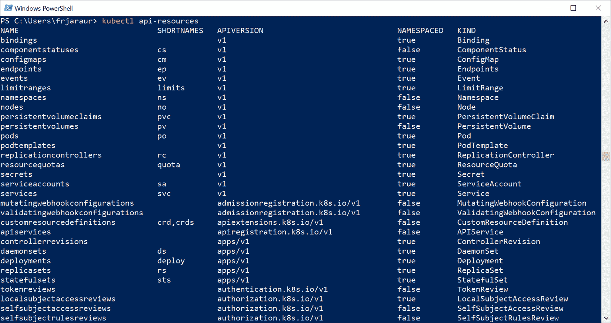
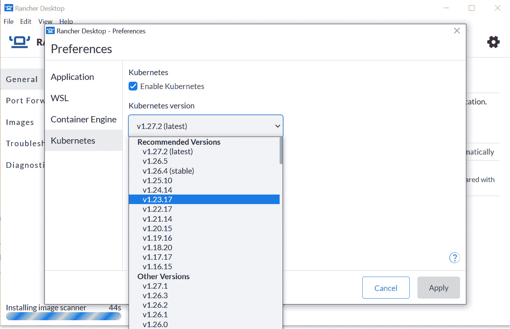
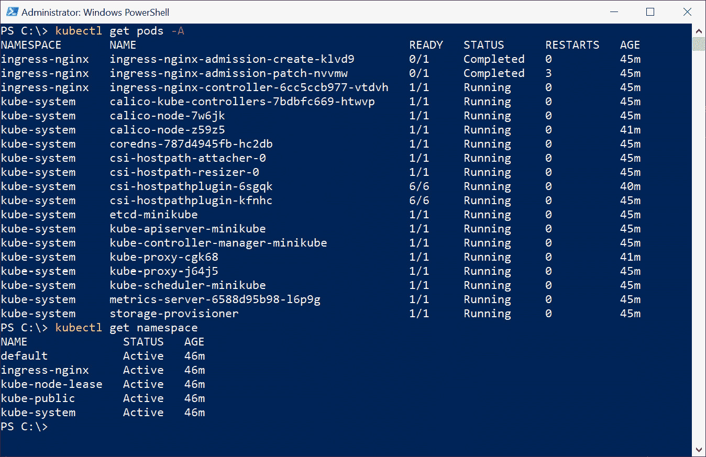

# 第八章：8

# 使用 Kubernetes 编排器部署应用

在工作站或笔记本电脑上为你的应用开发容器，确实能通过运行其他应用的组件来改善开发过程，让你专注于自己的代码。这种简单的独立架构在开发阶段非常适用，但它并不为你的应用提供 **高可用性**（**HA**）。在集群范围内部署容器编排器将帮助你保持应用的健康运行。在上一章中，我们简要回顾了 Docker Swarm，它更简单，是进入更复杂的编排器平台的好入门平台。在本章中，我们将学习如何在 **Kubernetes** 上准备并运行我们的应用，Kubernetes 现在被认为是运行集群容器的标准。

在本章中，我们将涵盖以下内容：

+   介绍 Kubernetes 的主要特点

+   理解 Kubernetes 的高可用性（HA）

+   使用 `kubectl` 与 Kubernetes 交互

+   部署一个功能齐全的 Kubernetes 集群

+   创建 Pods 和 Services

+   部署编排资源

+   使用 Kubernetes 提高应用的安全性

# 技术要求

本章的实验可以在 [`github.com/PacktPublishing/Containers-for-Developers-Handbook/tree/main/Chapter8`](https://github.com/PacktPublishing/Containers-for-Developers-Handbook/tree/main/Chapter8) 找到，在这里你将看到一些扩展的解释，这些内容在本章的正文中被省略，以便更易于跟进。关于本章的 *Code In Action* 视频可以在 [`packt.link/JdOIY`](https://packt.link/JdOIY) 找到。

现在，让我们从了解 Kubernetes 的主要特点开始，看看为什么这个编排器如此受欢迎。

# 介绍 Kubernetes 的主要特点

我们可以毫无疑问地说，Kubernetes 已经成为基于容器部署应用的新标准。然而，它的成功并非一蹴而就；Kubernetes 于 2015 年作为一个社区项目启动，基于 Google 自有的工作负载编排器 **Borg**。Kubernetes GitHub 仓库中的第一次提交发生在 2014 年，一年后，发布了第一个版本。两年后，Kubernetes 凭借其强大的社区成为主流。我必须说，你可能不会单独使用 Kubernetes；你将部署多个组件，以实现一个完全功能的平台，但这并不是什么坏事，因为你可以根据具体需求定制 Kubernetes 平台。此外，Kubernetes 默认与云平台有很多集成，因为它从一开始就考虑到了这些平台。例如，云存储解决方案可以无需额外组件即可使用。

让我们稍作停顿，简单比较一下 Kubernetes 的特点与 Docker Swarm 的区别。

## 比较 Kubernetes 和 Docker Swarm

我必须声明，个人而言，我对 Kubernetes 的初步印象并不好。对我来说，它提供了许多功能来解决一些简单的任务，而这些任务当时我可以通过 Docker Swarm 解决。然而，随着应用程序变得越来越复杂，你需要更多的功能，Docker Swarm 最终变得过于简单，因为它并没有太多发展。Docker Swarm 对于简单项目来说表现良好，但微服务架构通常需要复杂的交互和大量的可移植性功能。Kubernetes 的学习曲线非常陡峭，并且它在不断发展，这意味着你几乎每天都需要跟进该项目。Kubernetes 的核心功能通常会在每个新版本中得到改进，许多可插拔功能和附加项目也会不断出现，这使得该平台的生态系统日益增长。

我们将看到 Docker Swarm 编排模型与 Kubernetes 模型之间的一些差异。我们可以从集群中工作负载的定义开始。我们在*第七章*《使用 Swarm 进行编排》中提到过，Docker Swarm 并不调度容器；实际上，它调度的是**服务**。在 Kubernetes 中，我们调度的是**Pods**，这是这个编排系统中的最小调度单元。一个 Pod 可以包含多个容器，尽管大多数情况下它只运行一个。我们将在本章后面深入探讨并学习更多关于 Pods 的内容。

## 探索控制平面

容器编排器应提供一个**控制平面**来处理所有管理任务，提供调度能力，以便在数据平面上执行我们的应用工作负载，并提供集群范围的网络功能。Kubernetes 控制平面组件旨在管理每个集群组件，调度工作负载，并审查平台中出现的事件。它还管理节点组件，实际通过容器运行时执行容器。Kubernetes 遵循与 Docker Swarm 相似的管理者-工作者模型，定义了两种不同的节点角色。管理节点将管理控制平面组件，而工作节点将执行控制平面节点分配的任务。

现在，让我们回顾一些关键进程。

### 了解关键进程

以下是 Kubernetes 控制平面中运行的关键进程列表：

+   **kube-apiserver**：API 服务器是与所有其他组件和用户进行交互的组件。组件之间没有直接的通信，因此 kube-apiserver 在每个 Kubernetes 集群中都是至关重要的。所有集群管理通过暴露该组件的 API 提供，我们可以使用不同的客户端与集群进行交互。不同的端点使我们能够检索和设置 Kubernetes 资源。

+   **etcd**：这是一个为所有集群组件提供数据存储的组件。它是一个键值存储，可以通过其 HTTP REST API 进行访问。这个可靠的键值存储包含敏感数据，但如前所述，只有 kube-apiserver 组件可以访问它。

+   **kube-scheduler**：负责将工作负载分配给节点上部署的容器运行时。为了决定哪些节点运行不同的容器，kube-scheduler 会向 kube-apiserver 请求集群中所有节点的硬件资源和可用性信息。

+   **kube-controller-manager**：不同的控制器进程在 Kubernetes 集群内运行，负责维护平台和运行在其中的应用程序的状态。kube-controller-manager 负责管理这些控制器，并将不同的任务委派给每个控制器：

    +   **节点控制器**管理节点的状态。

    +   **job 控制器**负责管理工作负载的任务，并创建 Pod 来运行它们。

    +   **端点控制器**创建端点资源以暴露 Pod。

    +   **服务账户控制器**和**令牌控制器**管理账户和 API 访问令牌授权。

+   **cloud-controller-manager**：这是一个独立的组件，管理与底层云提供商 API 交互的不同控制器：

    +   **节点控制器**管理部署在云提供商上的节点的状态和健康状况。

    +   **路由控制器**通过使用特定 API 在云提供商中创建路由，以访问你部署的工作负载。

    +   **服务控制器**管理云提供商的负载均衡器资源。你不会在本地数据中心部署这个组件，因为它是为云集成设计的。

接下来，让我们回顾一下**节点组件**，它们负责执行并展示工作负载进程。

### 理解节点组件。

节点组件运行在工作节点上（如同在 Docker Swarm 中，管理节点也可以具有工作角色）。让我们深入了解一下它们：

+   **容器运行时**：运行容器的运行时是关键，因为它将为我们执行所有工作负载。Kubernetes 调度器将在每个主机上调度 Pod，它们为我们运行容器。

+   **kubelet**：我们可以将 kubelet 视为 Kubernetes 的集成代理。所有具有工作角色的节点都必须运行 kubelet，以便与控制平面通信。事实上，控制平面将管理与工作节点的通信，以接收每个工作节点的健康状况和运行负载的状态。kubelet 只会管理部署在 Kubernetes 集群中的容器；换句话说，你仍然可以在工作节点的容器运行时中执行容器，但这些容器不会由 Kubernetes 管理。

+   **kube-proxy**：这个组件负责 Kubernetes 的通信。需要在此提及的是，Kubernetes 本身并没有提供完整的网络功能，这个组件仅管理 Kubernetes 集群内的服务资源集成。要实现一个完全功能的集群，还需要其他通信组件。可以公平地说，kube-proxy 在工作节点级别工作，发布集群内的应用程序，但为了访问部署在其他集群节点上的其他服务，还需要更多的组件。

重要提示

**服务资源**（或简称 **Service**）旨在使应用程序的 Pods 可访问。有多种选项可以将我们的应用程序发布到内部或外部供用户使用。服务资源将获得自己的 IP 地址来访问相关 Pods 的端点。我们可以将服务资源视为逻辑组件。我们将使用服务来访问我们的应用程序，因为 Pods 可能会消失并被重新创建，获得新的 IP 地址，但服务将始终保持可见，并具有指定的 IP 地址。

当需要时，工作节点可以被替换；我们可以在需要时执行维护任务，将工作负载从一个节点移动到另一个节点。然而，控制平面组件不能被替换。为了实现 Kubernetes 的高可用性（HA），我们需要执行多个控制平面组件的副本。在 etcd 的情况下，我们必须拥有奇数个副本，这意味着至少需要三个副本才能实现 HA。这个要求使我们需要至少三个管理节点（或 Kubernetes 术语中的主节点）来部署具有 HA 的 Kubernetes 集群，尽管其他组件可以通过两个副本提供 HA。相反，工作节点的数量可以变化，这真的取决于你应用程序的 HA，尽管始终推荐至少两个工作节点。

### Kubernetes 网络

需要记住的是，Kubernetes 的网络架构与 Docker Swarm 模型有所不同。Kubernetes 本身并不提供集群范围的通信，但提供了一个标准化接口，即 **容器网络接口**（**CNI**）。Kubernetes 定义了一组规则，任何集成通信接口的项目都必须遵循这些规则：

+   使用 `localhost` 来解决它们的内部通信问题。当多个容器需要协同工作时，这确实简化了通信。

+   **主机到容器通信**：每个主机可以使用其容器运行时与本地运行的 Pods 进行通信。

+   **Pod 到 Pod 通信**：这些通信在本地工作，但无法跨集群工作，Kubernetes 强制要求通信必须在没有任何 **网络地址转换**（**NAT**）的情况下进行。这是 CNI 必须解决的问题。

+   **Pod 到 Service 的交互**：Pod 永远不会相互通信，因为它们的 IP 地址可能会随着时间变化。我们将使用 Services 来暴露 Pods，而 Kubernetes 会管理它们的 IP 地址，但 CNI 必须在集群范围内管理它们。

+   **发布服务**：发布应用程序有多种方法，但它们通过 Service 类型和 Ingress 资源来解决，集群范围的通信必须包含在 CNI 中。

由于不允许使用 NAT，这种模型声明了一个平面网络，在 Kubernetes 部署中包含 CNI 后，Pods 可以彼此看到。这与 Docker Swarm 完全不同，在 Docker Swarm 中，应用程序或项目可以运行在隔离的网络中。在 Kubernetes 中，我们需要实现额外的机制来隔离我们的应用程序。

有许多 CNI 插件可用于实现这些集群范围的通信。你可以使用任何一个，但有些比其他的更受欢迎；以下列表显示了推荐的一些插件及其关键特性：

+   **Flannel** 是一个简单的覆盖网络提供者，开箱即用效果非常好。它在节点之间创建 VXLAN 来传播 Pods 的 IP 地址到集群范围，但它不提供网络策略。这些是 Kubernetes 资源，可以限制或允许 Pods 的连接性。

+   **Calico** 是一个网络插件，支持不同的网络配置，包括非覆盖网络和覆盖网络，可以使用或不使用 **边界网关协议**（**BGP**）。该插件提供网络策略，并且足以满足几乎所有小型环境的需求。

+   **Canal** 默认在 SUSE 的 Rancher 环境中使用。它结合了 Flannel 的简单性和 Calico 的策略功能。

+   **Cilium** 是一个非常有趣的网络插件，因为它将 **扩展伯克利数据包过滤器**（**eBPF**）Linux 内核特性集成到 Kubernetes 中。这个网络提供商适用于多集群环境，或者当你想将网络可观察性集成到你的平台时。

+   **Multus** 可用于在你的集群中部署多个 CNI 插件。

+   云服务提供商提供了他们自己的云特定的 CNI，使我们能够实现不同的网络场景，并在我们自己的私有云基础设施中管理 Pods 的 IP 地址。

CNI 插件应该在 Kubernetes 控制平面启动后始终部署，因为一些组件（如内部 DNS 或 kube-apiserver）需要在集群范围内可访问。

### 命名空间范围隔离

Kubernetes 通过使用 **命名空间** 提供项目或应用程序的隔离，命名空间允许我们对资源进行分组。Kubernetes 提供了集群范围和命名空间范围的资源：

+   **集群范围** 的资源是集群范围内可用的资源，我们可以将它们大多数视为集群管理资源，由集群管理员拥有。

+   **命名空间范围** 的资源是那些仅限于命名空间级别的资源。例如，Services 和 Pods 是在命名空间级别定义的，而节点资源则是集群范围可用的。

命名空间资源是隔离应用程序并限制用户访问资源的关键。Kubernetes 提供不同的认证和授权方法，虽然我们可以集成和结合额外的组件，如外部**轻量级目录访问协议**（**LDAP**）或微软的 Active Directory。

### 内部解析

内部 DNS 基于`SERVICE_NAME.NAMESPACE.svc.cluster.local`。

### 将数据附加到容器

Kubernetes 包含不同类型的资源来将存储附加到我们的工作负载：

+   `emptyDir`）、主机存储和**网络文件系统**（**NFS**），以及其他远程存储解决方案。其他非常重要的类卷资源包括 Secrets 和 ConfigMaps，分别可用于管理集群范围内的敏感数据和配置。

+   **持久卷**是当你在本地数据中心进行生产工作时的首选解决方案。存储供应商提供自己的驱动程序，将**网络附加存储**（**NAS**）和**存储区域网络**（**SAN**）解决方案集成到我们的应用程序中。

+   **投影卷**用于映射一个独特 Pod 容器目录中的多个卷。

为我们的应用程序提供持久存储是容器编排器中的关键，Kubernetes 与不同的动态配置解决方案集成得非常好。

### 发布应用程序

最后，我们将介绍**Ingress**资源的概念。这些资源通过将服务资源与特定应用程序的 URL 关联起来，简化并保障了在 Kubernetes 中运行应用程序的发布。需要一个 Ingress 控制器来管理这些资源，我们可以在这个组件中集成多种不同的选项，如 NGINX、Traefik，甚至更复杂的解决方案，如 Istio。值得注意的是，许多网络设备供应商也准备了自己的 Kubernetes 平台集成，提升了性能和安全性。

现在，我们已经快速了解了 Kubernetes，接下来可以深入探讨该平台的组件和功能。

# 理解 Kubernetes 的高可用性（HA）

使用 HA 部署我们的应用程序需要一个具有 HA 的 Kubernetes 环境。至少需要三个 etcd 副本和其他控制平面组件的两个副本。一些生产架构将 etcd 部署在专用主机上，而其他组件则部署在额外的主节点上。这完全隔离了键值存储与其余控制平面组件，提升了安全性，但也增加了环境的复杂性。通常，你会找到三个主节点和足够的工作节点来部署你的生产应用程序。

Kubernetes 安装配置并管理其自己的内部 **证书颁发机构** (**CA**)，然后为不同的控制平面和 kubelet 组件部署证书。这确保了 kube-apiserver 与其他组件之间的 TLS 通信。下图展示了单主节点场景下的 Kubernetes 不同组件架构：


图 8.1 – 带有高可用性的 Kubernetes 集群架构

工作节点是用于运行工作负载的节点。根据 Kubernetes 的安装方式，如果主节点同时运行 kubelet 和 kube-proxy 组件，你也可以在主节点上运行特定的工作负载。我们可以使用不同的亲和性和反亲和性规则来确定哪些节点最终应该执行集群中的容器。

然而，仅仅复制控制平面并不能为你的应用程序提供高可用性或弹性。你需要一个 CNI 来管理容器之间在集群范围内的通信。内部负载均衡将请求路由到 Kubernetes 集群中已部署的 Pods。

在不同的主机上运行应用程序需要合适的存储解决方案。每当容器使用容器运行时启动时，所需的卷应该被附加。如果你在本地部署，你可能会在你的基础设施中使用 **容器存储接口** (**CSI**)。然而，作为开发者，你应该考虑你的存储需求，你的基础设施管理员会为你提供最佳的解决方案。不同的提供商会提供文件系统、块存储或对象存储，你可以选择最适合你的应用程序的存储方案。所有这些都将在集群范围内工作，并帮助你提供高可用性。

最后，你必须考虑你的应用程序组件如何与多个副本一起工作。你的基础设施为容器提供了弹性，但你的应用程序逻辑必须支持复制。

运行生产集群可能会很困难，但部署自己的集群来学习 Kubernetes 是如何工作的，我真的推荐给任何想在这些容器架构上部署应用程序的人。第一次创建 Kubernetes 集群时，推荐使用 **kubeadm**。

## Kubeadm Kubernetes 部署

Kubeadm 是一个可以轻松部署完全功能的 Kubernetes 集群的工具。事实上，我们甚至可以使用它来部署生产就绪的集群。

我们将从第一个部署节点初始化集群，执行 `kubeadm init`。这将创建并触发引导过程以部署集群。我们执行此操作的节点将成为集群的领导节点，我们只需执行 `kubeadm join`，即可加入新的主节点和工作节点。这极大简化了部署过程；创建集群所需的每个步骤都是自动化的。首先，我们将创建控制平面组件；因此，`kubeadm join` 将在其余指定的主节点上执行。一旦主节点安装完成，我们将加入工作节点。

Kubeadm 作为一个二进制文件安装在你的操作系统中。这里需要特别注意的是，Kubernetes 的主节点角色仅在 Linux 操作系统上可用。因此，我们不能仅通过 Microsoft Windows 或 macOS 节点来安装 Kubernetes 集群。

这个工具不仅仅是安装一个新的集群。它还可以用来修改当前 kubeadm 部署的集群配置或将其升级到更新的版本。这是一个非常强大的工具，了解如何使用它是很有帮助的，但不幸的是，这超出了本书的范围。可以简要地说，有许多命令行参数可以帮助我们完全定制 Kubernetes 的部署，例如用于管理控制平面内部通信的 IP 地址、Pods 的 IP 地址范围以及要使用的认证和授权模型。如果你有时间和硬件资源，建议使用 kubeadm 创建一个至少两节点的集群，以便了解部署过程和 Kubernetes 集群上默认部署的组件。

这是使用 kubeadm 工具进行 Kubernetes 部署过程的链接：[`kubernetes.io/docs/setup/production-environment/tools/kubeadm`](https://kubernetes.io/docs/setup/production-environment/tools/kubeadm)。在本书中，我们不会使用 kubeadm 来部署 Kubernetes。我们将使用 Docker Desktop、Rancher Desktop 或 Minikube 工具，它们提供完全自动化的部署，能够即刻在我们的笔记本电脑或台式电脑上工作。

Docker 或任何其他容器运行时只关心容器。我们在*第七章*，*使用 Swarm 进行编排* 中学到了 Docker 如何提供命令行来管理 Docker Swarm 集群，但这在 Kubernetes 中不起作用，因为它是一个完全不同的平台。kube-apiserver 组件是管理员和最终用户唯一可以访问的组件。Kubernetes 社区项目提供了自己的工具来管理 Kubernetes 集群及其上部署的资源。因此，在下一小节中，我们将学习 `kubectl` 的基础知识，这是我们在本书中将用来管理集群中的配置、内容和工作负载的工具。

# 使用 kubectl 与 Kubernetes 交互

在本节中，我们将学习`kubectl`命令行的基础知识。它是官方的 Kubernetes 客户端，可以通过添加插件扩展其功能。

该工具的安装过程相当简单，因为它是一个用 Go 语言编写的单一二进制文件；因此，我们可以从官方 Kubernetes 二进制文件库下载它。要从此库下载，必须在 URL 中包含要使用的发布版本。例如，[`dl.k8s.io/release/v1.27.4/bin/linux/amd64/kubectl`](https://dl.k8s.io/release/v1.27.4/bin/linux/amd64/kubectl) 将链接到 Kubernetes 1.27.4 的`kubectl` Linux 二进制文件。你可以使用来自不同发布版本的二进制文件来管理 Kubernetes 集群，尽管建议保持客户端和 Kubernetes 服务器版本的一致性。如何为每个平台安装该工具，请参见 https://kubernetes.io/docs/tasks/tools/#kubectl。由于我们将在*实验室*部分使用 Microsoft Windows，我们将使用以下链接来安装该工具的二进制文件：[`kubernetes.io/docs/tasks/tools/install-kubectl-windows`](https://kubernetes.io/docs/tasks/tools/install-kubectl-windows)。

让我们通过学习使用此工具执行命令的语法来开始`kubectl`：

```
kubectl [command] [TYPE] [NAME] [flags]
```

`TYPE`表示`kubectl`可以与许多不同的 Kubernetes 资源一起使用。我们可以使用单数、复数或缩写形式，且它们将以不区分大小写的方式使用。

在学习`kubectl`的一些用法之前，首先要了解的是如何配置访问任何集群。默认情况下，`kubectl`命令使用每个用户主目录下`.kube`目录中的`config`配置文件。我们可以通过添加`--kubeconfig <FILE_PATH_AND_NAME>`参数或设置`KUBECONFIG`变量来改变使用的配置文件位置。通过更改`kubeconfig`文件的内容，我们可以轻松地拥有不同的集群配置。然而，这种路径更改实际上并不必要，因为配置文件结构允许不同的上下文。每个上下文用于唯一地配置一组用户和服务器值，允许我们配置一个包含身份验证信息和 Kubernetes 集群端点的上下文。

重要提示

通常，你会通过 FQDN（或其解析后的 IP 地址）访问 Kubernetes 集群。这个名称或其 IP 地址将被负载均衡到所有 Kubernetes 集群的可用 kube-apiserver 实例；因此，集群服务器前会设置负载均衡器。在我们的本地环境中，我们将使用与集群关联的简单 IP 地址。

让我们来看一下配置文件的样子：

```
apiVersion: v1
kind: Config
clusters:
- cluster:
    certificate-authority-data: BASE64_CLUSTER_CA or the CA file path
    server: https://cluster1_URL:6443
  name: cluster1
contexts:
- context:
    cluster: cluster1
    user: user1
  name: user1@cluster1
current-context: user1@cluster1
users:
- name: user1
  user:
    client-certificate-data: BASE64_USER_CERTIFICATE or the cert file path
    client-key-data: BASE64_USER_KEY or the key file path
```

我们可以添加多个服务器和用户，并将它们链接到多个上下文中。我们可以通过使用`kubectl config` `use-context CONTEXT_NAME`在定义的上下文之间切换。

我们可以使用 `kubectl api-resources` 来获取定义集群中可用的资源类型。这很重要，因为 `kubectl` 命令行从 Kubernetes 集群中检索数据，因此它的行为会根据终端点的不同而发生变化。以下截图展示了样本 Kubernetes 集群中的 API 资源：



图 8.2 – 样本集群中的 Kubernetes API 资源

如你所见，有一列表示 Kubernetes 资源是否是命名空间限定的。这显示了资源必须定义的范围。资源可以具有集群范围，定义并在集群级别使用，也可以是命名空间限定的，在这种情况下，它们存在于 Kubernetes 命名空间内并按命名空间分组。Kubernetes 命名空间是允许我们在集群内隔离和分组资源的资源。定义在命名空间内的资源在命名空间内是唯一的，因为我们将使用命名空间来标识它们。

有许多 `kubectl` 命令可用，但在本节中我们将重点介绍其中的一些命令：

+   `create`：此操作允许我们从文件或终端 `stdin` 创建 Kubernetes 资源。

+   `apply`：此操作用于创建和更新 Kubernetes 中的资源。

+   `delete`：我们可以使用 `kubectl delete` 删除已创建的资源。

+   `run`：此操作可用于快速部署简单的工作负载并定义容器镜像。

+   `get`：我们可以使用 `kubectl get` 获取任何 Kubernetes 资源的定义。创建或检索任何 Kubernetes 对象需要有效的授权。我们还可以使用 `kubectl describe`，它会提供被检索集群资源的详细描述。

+   `edit`：我们可以修改一些资源的属性，以便在集群中进行更改。这也会改变我们应用程序的行为。

我们可以通过**命令式**或**声明式**方法配置 Kubernetes 资源：

+   在命令式配置中，我们通过命令行描述 Kubernetes 资源的配置，使用我们的终端进行操作。

+   通过使用声明式配置，我们将创建一个描述资源配置的文件，然后将该文件的内容创建或应用到 Kubernetes 集群中。这种方法是可重复的。

现在我们对 Kubernetes 组件、安装过程、如何与集群交互以及运行功能性 Kubernetes 平台的要求有了基本的了解，接下来让我们看看如何轻松部署我们自己的环境。

# 部署一个功能性的 Kubernetes 集群

在本节中，我们将回顾不同的 Kubernetes 部署方法，以满足不同的需求。作为开发者，你不需要部署生产环境，但理解这个过程并能够创建一个最简环境来测试你的应用程序是非常重要的。如果你真的对整个过程感兴趣，建议你查看 Kelsey Hightower 的 GitHub 仓库，*Kubernetes the Hard Way*（https://github.com/kelseyhightower/kubernetes-the-hard-way）。在这个仓库中，你将找到逐步手动部署 Kubernetes 集群的完整过程。理解集群是如何创建的，真的有助于解决问题，尽管这超出了本书的范围。在这里，我们将回顾一些自动化的 Kubernetes 解决方案，你可以专注于代码而非平台本身。我们将从最流行的容器桌面解决方案开始这一节。

## Docker Desktop

在本书中，我们使用 Docker Desktop 创建并运行容器，使用的是 **Windows Subsystem for Linux**（**WSL**）终端。Docker Desktop 还包含一个单节点的 Kubernetes 环境。让我们通过以下步骤开始使用它：

1.  点击 **设置** | **启用 Kubernetes**。下图显示了如何在 Docker Desktop 环境中设置 Kubernetes：


图 8.3 – Docker Desktop 设置区域，可以启用 Kubernetes 集群

在启用 Kubernetes 集群后，Docker Desktop 启动环境。下图显示了 Kubernetes 启动的时刻：


图 8.4 – Kubernetes 在 Docker Desktop 环境中的启动

1.  一旦启动，我们可以通过 WSL 终端使用 `kubectl` 命令行来访问集群。正如你可能注意到的，我们没有安装任何额外的软件。Docker Desktop 通过将所需的文件附加到我们的 WSL 环境中，为我们集成了命令。

    Kubernetes 集群的状态显示在 Docker Desktop GUI 的左下角，如下图所示：


图 8.5 – Kubernetes 状态在 Docker Desktop 中显示

1.  我们可以通过执行 `kubectl` `get nodes` 来验证部署的 Kubernetes 集群中包含的节点数量：

    ```
    $ kubectl get nodes
    NAME             STATUS   ROLES           AGE   VERSION
    docker-desktop   Ready    control-plane   45m   v1.25.4
    ```

    请注意，为此环境还添加了一个 Kubernetes 配置文件：

    ```
    $ ls -lart ~/.kube/config
    -rw-r--r-- 1 frjaraur frjaraur 5632 May 27 11:21 /home/frjaraur/.kube/config
    ```

这非常简单，现在我们有一个功能完备的 Kubernetes 集群。这个集群不可配置，但它是你准备应用部署和进行测试所需的一切。这个解决方案不允许我们决定要部署哪个版本的 Kubernetes，但我们可以随时通过 Docker Desktop 的 Kubernetes **设置** 页面重置环境，这在我们需要从头开始时非常有用。它可以部署在 Microsoft Windows（使用 **虚拟机**（**VM**）和 Hyper-V 或 WSL，推荐使用 WSL，因为它消耗的资源更少）、macOS（支持 Intel 和 Apple Silicon 架构）或 Linux（使用带 **内核虚拟机**（**KVM**）的虚拟机）上。

Docker 为我们准备了一些包含所有 Kubernetes 组件的镜像，并在我们启用 Docker Desktop 中的 Kubernetes 时为我们部署它们。默认情况下，所有为此目的创建的容器都在 Docker Desktop GUI 中隐藏，但我们可以通过 Docker 命令行查看它们。如果你使用 Docker 命令行创建应用程序，这种 Kubernetes 解决方案非常合适，因为从构建到协调执行所需的一切都已提供。我们可以使用不同类型的 Kubernetes 卷，因为在*第十章*，*在 Kubernetes 中利用应用数据管理*中，有 `storageClass` 资源。不过，在此 Kubernetes 部署中省略了一些内容，这可能会影响你的工作，因此了解它的局限性是很有帮助的：

+   环境内部的 IP 地址不能更改。

+   你无法 ping 容器；这是由于 Docker Desktop 的网络设置，且它也会影响容器的运行时。

+   不提供 CNI；因此，无法应用网络策略。

+   默认情况下未提供 Ingress 资源。其实这并不是问题，因为其他桌面 Kubernetes 环境也不会提供它，但你可能需要部署自己的 Ingress，并修改你的 `/etc/hosts` 文件（或 Microsoft Windows 中的等效文件 `C:\Windows\system32\drivers\etc\hosts`）以访问你的应用程序。在*第十一章*，*发布应用程序* 中，我们将了解 Ingress 资源和控制器。

这些是在使用 Docker Desktop 部署 Kubernetes 时你会遇到的较重要问题。启用 Kubernetes 后，性能会受到影响，且你需要至少 4 GB 的空闲内存和四个 **虚拟** **核心**（**vCores**）。

如官方文档所述，Docker Desktop 不是一个开源项目，它的授权基于 *Docker 订阅服务协议*。这意味着对于小型企业（即员工少于 250 人且年收入低于 1000 万美元）、个人使用、教育和非商业性开源项目，它是免费的；否则，对于专业用途，则需要付费订阅。

我们现在将回顾另一种桌面解决方案，用于部署简化的 Kubernetes 环境。

## Rancher Desktop

这个解决方案来自 SUSE，它确实为你提供了在笔记本电脑或台式计算机上体验 Kubernetes Rancher 部署的体验。Rancher Desktop 可以在 Windows 系统上安装，使用 WSL 或虚拟机，或在 macOS 和 Linux 上，仅使用虚拟机。它是一个开源项目，包含了 Moby 组件、`containerd` 以及其他借助 Rancher 经验的组件，允许开发新的不同项目，比如**RancherOS**（一个容器导向的操作系统）或**K3s**（一个轻量级的认证 Kubernetes 发行版）。Rancher Desktop 具有一些有趣的功能：

+   我们可以选择为环境使用哪种容器运行时。这是一个关键区别，使得使用 `containerd` 直接测试你的应用程序变得非常重要。

+   我们可以设置要部署的 Kubernetes 版本。

+   可以定义用于虚拟机的资源（在 Mac 和 Linux 上）。

+   它提供了 Rancher 控制面板，当你的服务器环境也运行 Kubernetes 和 Rancher 时，它与基础设施完美结合。

以下截图展示了我们如何在 Rancher Desktop GUI 中的**偏好设置**区域设置 Kubernetes 发布。通过这种方式，我们可以使用不同的 API 发布测试我们的应用程序，这在将应用程序移动到预发布或生产阶段之前非常有趣。每个 Kubernetes 发布都提供了自己的 API 资源集；你应该阅读每个发布说明，以了解 API 版本和资源的变化，这些变化可能会影响你的项目——例如，某些*beta*资源现在可能已包含在发布中，或某些资源已被弃用。以下截图展示了可以在 Rancher Desktop 中部署的 Kubernetes 发布：



图 8.6 – 可以选择不同的 Kubernetes 发布

正如我们在 Docker Desktop 中看到的，Rancher Desktop 也提供了一个简单的按钮来完全重置 Kubernetes 集群。以下截图展示了**故障排除**区域，在这里我们可以重置集群：


图 8.7 – Rancher Desktop GUI 中的故障排除区域

Rancher Desktop 还部署了基于 Traefik 的 Ingress 控制器。这个控制器将帮助我们发布应用程序，正如我们在 *第十一章* 中学习的，*发布应用程序*。我们可以通过在**Kubernetes** **偏好设置**部分取消选中**Traefik**选项来移除这个组件并部署我们自己的 Ingress 控制器，但默认提供一个还是很有趣的。

通过点击 Rancher Desktop 通知图标并选择**打开集群仪表盘**，可以访问 Rancher Dashboard。Rancher Dashboard 以图形化方式提供对许多 Kubernetes 资源的访问，这对于初学者来说非常有用。以下截图显示了 Rancher Dashboard 主页面，在这里你可以查看和修改不同的已部署 Kubernetes 资源：


图 8.8 – Rancher Dashboard 主页面

我们可以通过在 WSL 终端中检查其版本来验证 Kubernetes 环境：

```
$ kubectl version --short
Flag --short has been deprecated, and will be removed in the future. The --short output will become the default.
Client Version: v1.27.2
Kustomize Version: v5.0.1
Server Version: v1.27.2+k3s1
```

重要说明

我们可以使用 `nerdctl` 并加上 `-–namespace k8s.io` 参数，在不使用外部注册表的情况下构建 Kubernetes 环境的镜像。这样，镜像将直接可用于我们的部署。

有趣的是，这种 Kubernetes 实现与 Kubernetes 预期的网络功能保持一致；因此，我们可以通过 ping Pods 和 Services，甚至从 WSL 环境访问 Service 端口。通过在主机定义中添加 `.localhost` 后缀，它还使我们的应用程序可访问（我们将在*第十一章*《发布应用程序》一章中深入探讨这个选项）。然而，这个集群仍然是一个独立节点，我们无法测试在某些故障或节点之间迁移时应用程序的行为。如果你真的需要测试这些功能，我们需要进一步操作，部署其他节点并使用其他解决方案。

Docker Desktop 和 Rancher Desktop 都提供基于 GUI 的 Kubernetes 部署，但通常，如果不需要任何 GUI，我们甚至可以部署更轻量的解决方案。

我们现在将回顾 Minikube，它可能是最完整且可插拔的解决方案。

## Minikube

Minikube Kubernetes 环境非常可配置，并且比其他解决方案消耗更少的硬件资源，允许我们每个集群部署多个节点，甚至在单个计算机主机上部署多个集群。我们可以使用 Docker、QEMU、Hyperkit、Hyper-V、KVM、Parallels、Podman、VirtualBox 或 VMware Fusion/Workstation 创建一个 Kubernetes 集群。我们可以使用许多不同的虚拟化解决方案，甚至容器运行时，Minikube 可以在 Microsoft Windows、macOS 或 Linux 操作系统上部署。

以下是 Minikube 的一些功能：

+   它支持不同的 Kubernetes 版本

+   可以使用不同的容器运行时

+   一个直接的 API 端点改进了镜像管理

+   高级 Kubernetes 自定义配置，如添加 **feature gates**

+   它是一个可插拔的解决方案，因此我们可以包括像 Ingress 这样的插件，以扩展 Kubernetes 功能

+   它支持与常见 CI 环境的集成

Kubernetes 部署非常简单，对于 Linux 系统只需要一个二进制文件。可以使用不同的参数来设置环境。让我们回顾一些最重要的：

+   `start`：此操作创建并启动一个 Kubernetes 集群。我们可以使用`--nodes`参数来定义要部署的节点数量，使用`--driver`来指定创建集群时使用的方法。虚拟硬件资源也可以通过使用`--cpu`和`--memory`来定义；默认情况下，将使用 2 个 CPU 和 2GB 内存。我们甚至可以选择特定的 CNI 进行部署，使用`--cni`参数（`auto`，`bridge`，`calico`，`cilium`，`flannel`和`kindnet`可用，但我们也可以添加自己的 CNI 清单路径）。

+   `status`：此操作显示 Minikube 集群的状态。

+   `stop`：此命令停止正在运行的 Minikube 集群。

+   `delete`：此操作删除之前创建的集群。

+   `dashboard`：可以作为插件部署一个开源的 Kubernetes Dashboard，使用`minikube dashboard`即可访问。

+   `service`：此选项非常有用，可以公开部署的应用服务。它返回一个服务 URL，可以用来访问该服务。

+   `mount`：我们可以使用此选项将主机目录挂载到 Minikube 节点中。

+   `ssh`：我们可以通过使用`minikube` `ssh <NODE>`来访问部署的 Kubernetes 主机。

+   `node`：此操作允许我们管理集群节点。

+   `kubectl`：此命令运行与集群版本匹配的`kubectl`二进制文件。

+   `addons`：Minikube 的最佳功能之一是我们可以通过插件扩展其功能，以管理集群的附加存储选项（例如，定义一个特定的`csi-hostpath-driver`，或者指定要使用的默认存储类`default-storageclass`，或者动态`storage-provisioner`等选项），Ingress 控制器（`ingress`，`ingress-dns`，`istio`，和`kong`），以及安全（`pod-security-policy`）。我们甚至可以自动部署 Kubernetes Dashboard 或指标服务器，从所有运行中的工作负载中恢复指标。

要创建一个包含两个节点（一个主节点和一个工作节点）的集群，我们只需执行`minikube start --nodes 2`。让我们来看一下这个操作：

```
PS > minikube start --nodes 2 `
--kubernetes-version=stable `
--driver=hyperv
* minikube v1.30.1 on Microsoft Windows 10 Pro 10.0.19045.2965 Build 19045.2965
* Using the hyperv driver based on user configuration
* Starting control plane node minikube in cluster minikube
...
* Done! kubectl is now configured to use "minikube" cluster and "default" namespace by default
```

部署完成后，我们可以使用`kubectl`查看集群状态：

```
PS > kubectl get nodes
NAME           STATUS   ROLES           AGE   VERSION
minikube       Ready    control-plane   25m   v1.26.3
minikube-m02   Ready    <none>          22m   v1.26.3
```

Minikube 是一个非常可配置的解决方案，提供常见的 Kubernetes 功能。在我看来，它在性能和功能方面是最优秀的。

重要提示

在 Microsoft Windows 上部署 Minikube Kubernetes 需要管理员权限，特别是当你使用 Hyper-V 时。因此，你需要以管理员身份打开 PowerShell 或命令提示符，但这可能还不够。还必须包括 PowerShell 的 Hyper-V，并且我们需要在 PowerShell 控制台中执行`Enable-WindowsOptionalFeature -Online -FeatureName Microsoft-Hyper-V-Tools-All –All`来启用它。

## 替代的 Kubernetes 桌面部署

目前，还有一些其他有趣的选项，它们使用的硬件资源甚至更少，但它们提供的功能不如 Minikube 丰富。让我们讨论一些不错的尝试候选项：

+   **kind**：这个解决方案利用 Docker 运行时安装，通过容器及其自定义镜像来部署 Kubernetes。它基于 kubeadm 部署，并且在 Linux 桌面系统中运行得非常顺畅，这些系统通常不会安装 Docker Desktop 来运行容器。

+   **K3s**：这个 Kubernetes 部署是 Rancher Desktop Kubernetes 功能的基础。它使用定制的二进制文件部署一个轻量级的环境，消耗更少的内存。如果你使用前沿功能，这可能会影响应用程序的部署，因为这些功能可能无法使用。这个解决方案来自 Rancher-SUSE，后者还提供 K3D，通过容器部署 Kubernetes。

+   `containerd`。它仍处于初期阶段，但如果你在应用开发中不使用任何 Docker 工具，目前它似乎是一个不错的解决方案。

我们现在可以继续深入探讨 Pods 和 Services 的概念。

# 创建 Pods 和 Services

在这一部分中，我们将学习在 Kubernetes 编排平台中用于部署应用程序的资源。我们将从学习容器是如何在 Pods 内部实现的开始。

## Pods

`localhost`；因此，我们只能使用每个端口一次。与 Pod 相关联的卷也在容器之间共享。我们可以将 Pod 看作是一个小型的虚拟机，其中不同的进程（容器）一起运行。当 Pod 中的所有容器都正常运行时，Pod 被视为处于健康状态。

由于 Pods 可以包含多个容器，我们可以考虑使用 Pod 来部署具有多个组件的应用程序。与 Pod 相关联的所有容器都运行在同一个集群主机上。通过这种方式，我们可以确保所有应用程序组件一起运行，它们之间的通信也会更快。由于 Pods 是 Kubernetes 中最小的单位，我们只能整体扩展或缩减 Pods；因此，所有包含的容器也会多次执行，这可能并不是我们需要的。并非所有应用组件都应该遵循相同的扩展规则；因此，最好为一个应用程序部署多个 Pods。

以下图示展示了一个 Pod。它包含两个容器，因此，它们共享同一个 Pod 的 IP 地址和卷：


图 8.9 – 包含两个容器的 Pod 结构图

我们可以通过使用主机的命名空间（主机的网络、**进程间通信**或 **IPC**、进程等）来运行共享主机资源的 Pods。我们应该限制这种类型的 Pod，因为它们可以直接访问主机的进程、接口等。

以下示例展示了一个声明性文件，用于执行一个示例 Pod：

```
apiVersion: v1
kind: Pod
metadata:
    name: examplepod
  labels:
    example: singlecontainer
  spec:
      containers:
      - name: examplecontainer
        image: nginx:alpine
```

我们可以使用 JSON 或 YAML 文件来定义 Kubernetes 资源，但 YAML 文件更受欢迎；因此，在准备部署文件时，你需要特别注意缩进。为了将此 Pod 部署到我们的 Kubernetes 集群中，我们只需执行`kubectl create -f <PATH_TO_THE_FILE>`。

重要提示

当你访问一个 Kubernetes 集群时，一个命名空间会与您的个人资料或上下文关联。默认情况下，关联的命名空间是`default`；因此，如果我们没有指定任何 Kubernetes 命名空间作为创建资源的参数，`default`命名空间将被使用。我们可以通过执行`kubectl config use-context --current --namespace <NEW_NAMESPACE>`来更改当前上下文的命名空间，使其适用于后续的所有命令。每个资源的命名空间可以在该资源的 YAML 清单中的`metadata`键下指定：

`...`

`metadata:`

`name: podname`

`namespace: my-namespace`

`...`

我们可以通过修改容器镜像的行为来修改容器的任何方面，正如我们在*第四章*中学到的，*运行* *Docker 容器*。

如果你不确定可用的键，或者正在学习如何使用新的 Kubernetes 资源，你可以使用`kubectl explain <RESOURCE>`来获取可用键及其预期值的准确描述：

```
PS > kubectl explain pod
KIND:     Pod
VERSION:  v1
DESCRIPTION:
     Pod is a collection of containers that can run on a host. This resource is
...
 FIELDS:
   apiVersion   <string>
     APIVersion defines the versioned schema of this representation of an
 ...
   spec <Object>
     ...
   status       <Object>
     …
```

我们可以继续添加键以获得更具体的定义——例如，我们可以检索`pod.spec.containers.resources`下的键：

```
PS > kubectl explain pod.spec.containers.resources
KIND:     Pod
...
RESOURCE: resources <Object>
 ...
DESCRIPTION:
     Compute Resources required by this container. Cannot be updated. More info:
     https://kubernetes.io/docs/concepts/configuration/manage-resources-containers/
 ...
FIELDS:
   claims       <[]Object>
     Claims lists the names of resources, defined in spec.resourceClaims, that
     are used by this container.
 ...
    limits       <map[string]string>
     Limits describes the maximum amount of compute resources allowed. More
   ...
   requests     <map[string]string>
     Requests describes the minimum amount of compute resources required. If
   ...
```

每个描述都显示了扩展信息，并附有指向 Kubernetes 文档的链接。

重要提示

我们可以通过使用`kubectl explain pod --recursive`一次性检索特定资源的所有可用键。这个选项真的帮助我们完全自定义资源。

我们可以使用 NGINX Web 服务器来测试真实的 Pod 部署。为此，按照以下步骤操作：

1.  我们将使用命令式模式与`kubectl run`：

    ```
    PS > kubectl run webserver --image=docker.io/nginx:alpine `
    --port 80
    pod/webserver created
    ```

1.  现在我们可以列出 Pods 来验证 webserver 是否正在运行：

    ```
    PS > kubectl get pods
    NAME        READY   STATUS              RESTARTS   AGE
    webserver   0/1     ContainerCreating   0          5s
    ```

1.  如我们所见，它正在启动。几秒钟后，我们可以验证我们的 web 服务器是否正在运行：

    ```
    PS > kubectl get pods -o wide
    NAME        READY   STATUS    RESTARTS   AGE     IP           NODE       NOMINATED NODE   READINESS GATES
    -o wide to modify the command’s output. As you can see, we now have the associated IP address.
    ```

1.  我们可以进入`minikube`节点并验证 Pod 的连通性。以下截图显示了与集群节点的交互：


图 8.10 – 测试来自 minikube 节点的连通性

1.  如果我们现在删除 Pod 并创建一个新的 Pod，我们可以轻松地看到新的 Pod 会获得一个新的 IP 地址，因此，我们的应用可能需要不断更改 IP 地址：

    ```
    PS > kubectl delete pod webserver
    pod "webserver" deleted
    PS > kubectl run webserver `
    --image=docker.io/nginx:alpine --port 80
    pod/webserver created
    PS > kubectl get pods -o wide
    NAME        READY   STATUS    RESTARTS   AGE   IP           NODE       NOMINATED NODE   READINESS GATES
    webserver   1/1     Running   0          4s    10.244.0.4   minikube   <none>           <none>
    ```

这是一个实际问题，这也是我们永远不使用 Pod IP 地址的原因。现在我们来讨论 Services，以及它们如何帮助我们解决这个问题。

## Services

**服务** 是 Kubernetes 中的抽象对象；它们用于暴露一组 Pods，从而为应用组件提供服务。它们会从 Kubernetes 的内部 IPAM 系统中获取一个 IP 地址，我们将使用这个地址来访问关联的 Pods。我们还可以将服务与外部资源关联，使其对用户可访问。Kubernetes 提供了不同类型的服务，可以将它们发布到集群内部或集群外部。让我们快速回顾一下不同的服务类型：

+   `ClusterIP`：这是默认的服务类型。Kubernetes 会从定义的服务 IP 地址范围中分配一个 IP 地址，容器可以通过其 IP 地址或名称访问此服务。运行在同一命名空间中的容器将能够简单地使用服务的名称，而其他容器则需要使用其 Kubernetes FQDN（`SERVICE_NAME.SERVICE_NAMESPACE.svc.cluster.local`，其中 `cluster.local` 是 Kubernetes 集群本身的 FQDN）。这是由于 Kubernetes 的内部 **服务发现** (**SD**)，它为所有服务在集群范围内创建 DNS 条目。

+   `Headless`：这些服务是 `ClusterIP` 类型的一种变体。它们不接收 IP 地址，服务的名称将解析为所有关联 Pods 的 IP 地址。我们通常使用无头服务来与非 Kubernetes SD 解决方案进行交互。

+   `NodePort`：当我们使用 `NodePort` 服务时，我们将一组主机端口与服务的 `clusterIP` 定义的 IP 地址关联。这使得服务能够从集群外部进行访问。我们可以从客户端计算机连接到定义端口中的任何集群主机，Kubernetes 将通过内部 DNS 将请求路由到服务，关联到 `ClusterIP` 地址，无论哪个节点接收到请求。因此，关联该服务的 Pods 将接收来自客户端的网络流量。

+   `LoadBalancer`：`LoadBalancer` 服务类型用于在外部负载均衡器中发布定义好的服务。它使用外部负载均衡器的 API 来定义到达集群所需的规则，实际上，该模型使用 `NodePort` 服务类型来实现集群范围内访问服务。此服务类型主要用于在云提供商的 Kubernetes 集群中发布服务，尽管一些厂商也在本地提供此功能。

我们已经看到了如何将服务发布到 Kubernetes 集群外部，以便其他外部应用程序甚至我们的用户使用，但我们也可以做相反的操作。我们可以通过使用 `External` 服务类型，将我们实际网络中的外部服务包含到 Kubernetes 集群内。

以下架构表示一个 `NodePort` 服务，我们在该服务中发布端口 `7000`，并将其附加到端口 `5000`，在本示例中的容器中暴露：


图 8.11 – NodePort 服务架构

在这个示例中，来自用户的外部请求会负载均衡到端口`7000`，该端口监听所有集群主机。所有来自用户的流量会被内部负载均衡到端口`5000`，使其在所有服务分配的 Pod 上都能使用。

以下示例展示了一个 Kubernetes 服务的清单，这是通过使用**命令式方法**仅检索输出得到的：

```
PS >   kubectl  expose  pod  webserver  -o yaml  `
--port 80  --dry-run=client
apiVersion: v1
kind: Service
metadata:
  creationTimestamp: null
  labels:
    run: webserver
  name: webserver
spec:
  ports:
  - port: 80
    protocol: TCP
    targetPort: 80
  selector:
    run: webserver
status:
  loadBalancer: {}
```

在这个示例中，服务资源没有被创建，因为我们添加了`-o yaml`参数以显示 YAML 格式的输出，并使用了`–dry-run=client`。这个选项显示了执行创建命令时返回的输出结果，该命令是针对 kube-apiserver 执行的。

接下来，让我们学习如何在集群中部署工作负载，因为 Pod 不提供弹性；它们作为未管理的独立工作负载运行，缺乏控制器。

# 部署编排资源

现在我们已经知道如何使用命令式和声明式模式来部署 Pod，我们将定义可以管理 Pod 生命周期的新资源。直接使用`kubectl`命令行执行的 Pod 如果容器终止，将不会被重新创建。为了控制 Kubernetes 集群中的工作负载，我们需要部署额外的资源，由 Kubernetes 控制器进行管理。这些控制器是控制循环，它们监控不同 Kubernetes 资源的状态，并在需要时进行更改或请求更改。每个控制器都会跟踪一些资源，并尽力保持它们的定义状态。Kubernetes 的 kube-controller-manager 管理这些控制器，以保持不同集群资源的整体期望状态。每个控制器都可以通过 API 访问，我们将使用`kubectl`与它们进行交互。

在本节中，我们将学习 Kubernetes 控制器的基础知识，并深入了解如何在*第九章*中使用它们，*实现* *架构模式*。

## 副本集

最简单的可以保持应用程序定义状态的资源是副本集。它会保持一组副本 Pod 的运行。为了创建副本集，我们将使用 Pod 清单作为模板来创建多个副本。让我们来看一个简单的示例：

```
apiVersion: apps/v1
kind: ReplicaSet
metadata:
  name: replicated-webserver
spec:
  replicas: 3
  selector:
    matchLabels:
      application: webserver
  template:
     metadata:
         application: webserver
     spec:
       containers:
       - name: webserver-container
         image: docker.io/nginx:alpine
```

这个副本集将运行三个具有相同`docker.io/nginx:alpine`镜像的 Pod；`template`部分定义了这三个 Pod 资源的规格，每个 Pod 一个容器。副本集通过使用在 Pod 的`template`部分定义的`application`标签及其`webserver`值，来识别需要管理的 Pod。

当我们部署这个副本集时，集群会创建这三个 Pod，每当其中任何一个 Pod 终止时，控制器会管理这个变化并触发新的 Pod 创建。

我们将继续审查更多资源，但请记住，`template`部分嵌入在更一般的定义中的基本概念适用于所有资源。

## 部署

我们可以将 Deployment 视为 ReplicaSet 的进化版本。它允许我们更新这些副本，因为一个 Deployment 管理着一组副本，但只运行其中一个。每次我们创建一个新的 Deployment 时，都会创建一个关联的 ReplicaSet。当我们更新这个 Deployment 时，会创建一个新的 ReplicaSet，带有新的定义，反映前一个资源的更改。

## DaemonSets

使用 DaemonSet，我们可以确保所有集群节点都有一个工作负载副本，但我们无法在 DaemonSet 中定义副本的数量。

## StatefulSets

StatefulSet 允许我们在工作负载中使用更高级的特性。它使我们能够管理 Pods 的顺序和唯一性，确保每个副本获得自己唯一的资源集，例如卷。尽管 Pods 是从相同的模板部分创建的，但 StatefulSet 为每个 Pod 维护不同的身份。

## 作业

一个 Job 会一次创建一个或多个 Pods，但它会持续创建，直到创建的 Pod 数量达到定义的成功终止数量。当一个 Pod 退出时，控制器会验证所需完成的 Pod 数量是否已达到，如果没有，它会创建一个新的 Pod。

## CronJobs

我们可以通过使用 CronJobs 来调度 Pods，因为它们负责调度任务。当执行时间到达时，会创建一个 Job，并触发创建定义的 Pods。正如我们在*第九章*《实现架构模式》中所学到的那样，CronJobs 清单包括两个`template`部分——一个用于创建作业，另一个用于定义如何创建 Pods。

## ReplicationControllers

我们可以将 ReplicationControllers 视为当前 ReplicaSet 资源类型的前身。它们的工作方式与我们保持一定数量的 Pod 副本活跃类似，但它们在分组监控的 Pods 时有所不同，因为 ReplicationControllers 不支持基于集的选择器。这个选择器方法使 ReplicaSets 能够获取由其自身清单之外创建的 Pods 的状态管理；因此，如果一个已运行的 Pod 符合 ReplicaSet 标签的选择，它将自动被包括在复制 Pod 池中。

现在我们对允许我们创建跨集群编排资源的不同资源有了概览，接下来可以学习一些 Kubernetes 的功能，这些功能可以提高我们应用程序的安全性。

# 使用 Kubernetes 提高应用程序的安全性

在容器中运行的应用程序提供了许多全新的功能。我们可以在主机上同时运行多个应用程序版本；它们可以在几秒钟内启动和停止。我们可以轻松地扩展组件，不同的应用程序可以共存，甚至不需要彼此之间的交互。应用程序的弹性也继承自容器运行时的特性（例如，退出的容器会自动重新启动）。

然而，我们也可以通过在 Kubernetes 中运行应用程序来提升它们的性能。每个 Kubernetes 集群由多个容器运行时共同运行并协调工作。容器运行时通过内核命名空间和**控制组**（**cgroups**）隔离主机的资源，但 Kubernetes 增加了一些有趣的功能：

+   **命名空间**：命名空间是 Kubernetes 资源，它们将其他资源分组并设计用于在多个用户之间分配 Kubernetes 资源，这些用户按团队或项目进行分组。

+   **认证策略**：来自 Kubernetes 客户端的请求可以使用不同的认证机制，如客户端证书、持有者令牌或身份验证代理来进行认证。

+   **授权请求**：用户在通过认证、授权和不同的准入控制器后，向 Kubernetes API 发出请求。授权阶段涉及授予访问 Kubernetes 资源和功能的权限。请求的属性会根据策略进行评估，并决定是允许还是拒绝。请求中提供的用户、组、API、请求路径、命名空间、动词等都用于这些验证。

+   `root`，或者简单地将最终结果用户更改为非特权用户，以保持集群安全。

+   使用`kubectl`检查是否有某些动词可供我们使用，或者是否可以通过模拟其他用户来检查：

    ```
    $ kubectl auth can-i create pods –namespace dev
    yes
    $ kubectl auth can-i create svc -n prod –as dev-user
    no
    ```

+   **Secrets 和 ConfigMaps**：我们已经在*第七章*《使用 Swarm 进行编排》中学习了如何在编排环境中部署某些配置。在 Kubernetes 中，我们也有 Secrets 和 ConfigMaps 资源，但如果允许，用户可以检索它们（RBAC）。理解 Secrets 是以 Base64 格式打包的非常重要；因此，如果我们没有准备合适的角色，敏感数据可能会被访问。kubelet Kubernetes 组件将自动为你挂载 Secrets 和 ConfigMaps，我们可以在应用程序部署中将它们作为文件或环境变量使用。Kubernetes 可以加密静态的 Secrets，以确保操作系统管理员无法从 etcd 数据库文件中检索它们，但此功能默认是禁用的。

+   `securityContext`配置文件，这是至关重要的，因为我们可以确保一个 Pod 不会以 root 身份运行，或者不会在任何定义的命名空间中使用特权容器或非只读容器。

+   **网络策略**：Kubernetes 默认部署一个扁平化网络，因此所有容器都能相互访问。为了避免这种情况，Kubernetes 还提供了 NetworkPolicies 和 GlobalNetworkPolicies（在集群级别应用）。并非所有的 CNI 都能够实现这一功能。Kubernetes 仅提供 **自定义资源**（**CR**）类型，这些类型将用于实现 **网络策略**。请确保你的网络提供程序能够实现这些策略，以便能够使用此功能（许多流行的 CNI 插件如 Calico、Canal 和 Cilium 完全支持）。强烈建议实现一些默认的全局策略，拒绝所有外部访问，并在命名空间级别允许每个应用所需的通信。网络策略定义了入站和出站规则。这些规则在连接级别工作，因此我们没有原始的数据包日志（尽管一些 CNI 插件提供了日志功能）。我们将在 *第十一章* *发布应用* 中学习如何按照最佳实践实现这些规则。

现在我们已经概览了 Kubernetes 中可用的一些最重要功能，这些功能帮助我们保护应用程序和整个集群，我们可以继续进行一些简单的实验，涵盖 Kubernetes 环境的基本使用。

# 实验

现在，我们将进行一个简短的实验环节，帮助我们学习和理解如何使用 Minikube 部署本地 Kubernetes 环境，并测试其中的一些资源类型来验证集群。

本书实验的代码可在其 GitHub 仓库 https://github.com/PacktPublishing/Containers-for-Developers-Handbook.git 中找到。通过执行 `git clone https://github.com/PacktPublishing/Containers-for-Developers-Handbook.git` 来下载所有内容，或如果你已经下载过该仓库，则执行 `git pull` 获取最新版本。所有实验中使用的命令和内容都位于 `Containers-for-Developers-Handbook/Chapter8` 目录下。

我们将通过部署一个包含两个节点（一个主节点和一个工作节点）的 Minikube 集群开始。我们将为每个节点分配 3 GB 的 RAM，这足以在某些集群节点宕机时测试应用程序的行为，但对于日常使用来说，你可能不需要两个节点。

## 部署一个包含两个节点的 Minikube 集群

在这个实验中，我们将在本地部署一个完全功能的 Kubernetes 集群，用于测试目的。我们将继续在一台拥有 16 GB RAM 的 Windows 10 笔记本电脑上进行操作，这对于本书中的实验来说已经足够了。请按照以下步骤操作：

1.  安装 Minikube。首先，从 https://minikube.sigs.k8s.io/docs/start/ 下载 Minikube，选择合适的安装方法，并按照操作系统的简单安装步骤进行安装。我们将使用 Hyper-V，因此必须在桌面电脑或笔记本电脑上启用并运行它。

1.  一旦 Minikube 安装完成，我们将打开一个管理员 PowerShell 终端。使用 Hyper-V 部署 Minikube 需要以管理员权限执行。这是由于 Hyper-V 层的原因；因此，如果您使用 VirtualBox 作为虚拟化程序或 Linux 作为操作系统，则不需要管理员权限（其他虚拟化程序也可以使用，例如 KVM，它与 Minikube 配合得非常好）。如果需要删除 Minikube 集群，管理员权限也是必需的。一旦 PowerShell 终端准备好，我们执行以下命令：

    ```
    minikube start –nodes 2 –memory 3G –cpus 2 `
    --kubernetes-version=stable –driver=hyperv `
    --cni=calico `
    minikube start:
    ```

    ```
    PS C:\Windows\system32> cd c:\
    PS C:\>  minikube start –nodes 2 –memory 3G `
    --cpus 2 –kubernetes-version=stable `
    --driver=hyperv –cni=calico `
    --addons=ingress,metrics-server,csi-hostpath-driver
    * minikube v1.30.1 on Microsoft Windows 10 Pro 10.0.19045.2965 Build 19045.2965
    * Using the hyperv driver based on user configuration
    * Starting control plane node minikube in cluster minikube
    * Creating hyperv VM (CPUs=2, Memory=3072MB, Disk=20000MB) …
    * Preparing Kubernetes v1.26.3 on Docker 20.10.23 ...
      - Generating certificates and keys ...
    ...
      - Using image registry.k8s.io/metrics-server/metrics-server:v0.6.3
    * Verifying ingress addon...
    ...
    * Starting worker node minikube-m02 in cluster minikube
    ...
    * Done! kubectl is now configured to u"e "minik"be" cluster a"d "defa"lt" namespace by default
    kubectl get nodes:

    ```

    PS C:\> kubectl get nodes

    NAME           STATUS   ROLES           AGE   VERSION

    minikube       Ready    control-plane   23m   v1.26.3

    minikube-m02 节点没有显示任何角色。这是因为 Kubernetes 中的一切都是通过标签进行管理的。记住，我们之前看到如何使用选择器来识别哪些 Pods 属于特定的 ReplicaSet。

    ```

    ```

1.  我们可以查看节点标签并为工作节点创建一个新标签。这将向我们展示如何通过使用标签修改资源的行为：

    ```
    PS C:\> kubectl get nod– --show-labels
    NAME           STATUS   ROLES           AGE   VERSION   LABELS
    minikube       Ready    control-plane   27m   v1.26.3   beta.kubernetes.io/arch=amd64,beta.kubernetes.io/os=linux,kubernetes.io/arch=amd64,kubernetes.io/hostname=minikube,kubernetes.io/os=linux,minikube.k8s.io/commit=08896fd1dc362c097c925146c4a0d0dac715ace0,minikube.k8s.io/name=minikube,minikube.k8s.io/primary=true,minikube.k8s.io/updated_at=2023_05_31T10_59_55_0700,minikube.k8s.io/version=v1.30.1,node-role.kubernetes.io/control-plane=,node.kubernetes.io/exclude-from-external-load-balancers=,topology.hostpath.csi/node=minikube
    node-role.kubernetes.io/worker. This label is not required, and that’s why it is not included by default, but it is good to include it to identify nodes in the node cluster review (kubectl get nodes).
    ```

1.  我们现在通过使用 `kubectl` label、`<RESOURCE> <LABEL_TO_ADD>` 为工作节点添加一个新标签：

    ```
    PS C:\> kubectl label node minikube-m02  `
    node-role.kubernetes.io/worker=
    node/minikube-m02 labeled
    PS C:\> kubectl get nodes
    NAME           STATUS   ROLES           AGE   VERSION
    minikube       Ready    control-plane   33m   v1.26.3
    kubectl label to add any label to any resource. In the specific case of node-role.kubernetes.io, it is used by Kubernetes to show the ROLES column, but we can use any other label to identify a set of nodes. This will help you in a production cluster to run your applications in nodes that best fit your purposes – for example, by selecting nodes with fast solid-state disks, or those with special hardware devices. You may need to ask your Kubernetes administrators about these nodes’ special characteristics.
    ```

我们现在将展示如何使用已部署的 Kubernetes 集群。

## 与 Minikube 部署集群进行交互

在这个实验中，我们将与当前集群进行交互，回顾并创建一些新资源：

1.  我们将从列出集群中所有部署的 Pods 开始，使用 `kubectl get pods --A`。这将列出集群中所有的 Pods。由于我们作为管理员连接，在 Minikube 安装后我们能够列出它们。以下截图展示了 `kubectl get pods -A` 的输出，接着是使用 `kubectl` `get namespaces` 命令列出的当前命名空间：



图 8.12 – kubectl get pods –A 和 kubectl get namespace 命令的输出

1.  让我们通过使用 `kubectl create` `ns chapter8` 来创建一个新的命名空间 `chapter8`：

    ```
    PS C:\> kubectl create ns chapter8
    chapter8 namespace by adding --namespace or just --n to kubectl get pods:

    ```

    PS C:\> kubectl get pods -n chapter8

    ingress-nginx 命名空间。我们将使用 kubectl get all 列出该命名空间中部署的所有资源，正如以下截图所示：

    ```

    ```


图 8.13 – kubectl get all –n ingress-nginx 的输出

现在，我们知道如何筛选与特定命名空间关联的资源。

1.  现在，让我们通过使用命令式格式在 `chapter8` 命名空间中创建一个简单的 Pod。我们将执行 `kubectl run webserver --image=nginx:alpine` 来运行一个包含一个容器的 Pod，使用 `docker.io/nginx:alpine` 镜像：

    ```
    PS C:\> kubectl run webserver --image=nginx:alpine `
    -n chapter8
    pod/webserver created
    PS C:\> kubectl get pods -n chapter8
    NAME        READY   STATUS    RESTARTS   AGE
    kubectl command talks with the Kubernetes API using the credentials from our local kubeconfig file (this file is located in your home directory in the .kube directory; you can use $env:USERPROFILE\.kube in Microsoft Windows), and kube-apiserver gets this information from etcd before it is presented in our terminal. The following screenshot shows part of the output we get by using kubectl get pod <PODNAME> -o yaml. The –o yaml modifier shows the output from a current resource in the YAML format. This really helps us to understand how objects are created and managed by Kubernetes:
    ```


图 8.14 – kubectl get pods --namespace chapter8 -o yaml webserver 的输出

1.  让我们通过使用`kubectl get pods -o wide`来查看是哪个节点执行了我们的 Pod，该命令显示扩展信息，或者通过从 YAML 输出中筛选`hostIP`键：

    ```
    PS C:\> kubectl get pods -n chapter8 -o wide
    NAME        READY   STATUS    RESTARTS   AGE   IP          NODE           NOMINATED NODE   READINESS GATES
    webserver   1/1     Running   0          27m   10.244.205.194   minikube-m02   <none>           <none>
    ```

    这也可以通过使用 JSON 路径模板（https://kubernetes.io/docs/reference/kubectl/jsonpath/）来完成：

    ```
    PS C:\> kubectl get pods -n chapter8 `
    -o jsonpath='{ .status.hostIP }' webserver
    172.19.146.184
    ```

重要说明

你可以看到节点名称也可以在`spec`部分（`spec.nodeName`）中找到，但这一部分是 Pod 规格呈现的地方。我们将在下一章学习如何通过直接修改 Kubernetes 中的在线清单来改变工作负载的行为。`status`部分是只读的，因为它显示了资源的实际状态，而`metadata`或`spec`部分的一些内容可以被修改——例如，可以通过添加新的标签或注释来修改。

在本章的实验结束前，我们将通过添加一个`NodePort`服务来暴露已部署的 Pod，这将引导我们的请求到正在运行的 Web 服务器 Pod。

## 使用 NodePort 服务暴露 Pod

在这个快速实验中，我们将使用命令式模型部署一个`NodePort`服务，以暴露已经部署的 Web 服务器 Pod：

1.  由于我们没有在`webserver` Pod 中定义容器端口，Kubernetes 将无法知道哪个端口必须与服务关联；因此，我们需要传递`--target-port 80`参数，以指定服务应连接到监听的 NGINX 容器端口。我们将使用端口`8080`作为服务端口，并让 Kubernetes 为我们选择一个`NodePort`端口：

    ```
    PS C:\> kubectl expose pod webserver -n chapter8 `
    --target-port 80 --port 8080 --type=NodePort
    chapter8 namespace:

    ```

    PS C:\> kubectl get all -n chapter8

    名称                就绪   状态    重启次数    存活时间

    pod/webserver   1/1     运行中    0          50m

    名称                类型        集群-IP       外部-IP    端口（S）        存活时间

    32317 与服务的端口 8080 相关联，该端口与 webserver Pod 的端口 80（NGINX 容器在该端口上监听）相关联。

    ```

    ```

1.  现在我们可以在任何主机上访问已发布的`NodePort`端口，即使该主机没有运行任何与服务相关的 Pod。我们可以使用任何 Minikube 集群节点的 IP 地址，或者使用`minikube service -n chapter8 webserver`命令自动在关联的 URL 中打开默认的 Web 浏览器。

    以下屏幕截图显示了两种情况的输出。首先，我们使用`kubectl get nodes –o wide`获取了主机的 IP 地址。我们使用 PowerShell 的`Invoke-WebRequest`命令访问了节点的 IP 地址与`NodePort`发布端口的组合。然后，我们使用 Minikube 的内置 DNS 解析了服务的 URL，通过使用`minikube`服务：


图 8.15 – kubectl get nodes 的输出，使用集群节点进行不同测试，以及 Minikube 服务 URL 解析

正如您所见，我们使用了主节点和工作节点的 IP 地址进行了测试，它们可以正常工作，尽管 Pod 只在工作节点上运行。此输出还显示了通过使用 Minikube 的集成服务解析来测试服务有多么容易。它自动打开了我们的默认网络浏览器，我们可以直接访问我们的服务，如下面的屏幕截图所示：


图 8.16 – 默认网络浏览器访问 Web 服务器服务的 NodePort 端口

1.  现在，我们可以移除本章中创建的所有资源。首先移除 Pod，然后移除 Service，最后移除命名空间是很重要的。先移除命名空间将触发级联删除所有关联资源，如果 Kubernetes 无法删除某些资源可能会出现一些问题。在这个简单的实验中永远不会发生，但在删除命名空间本身之前移除命名空间内的资源是一个良好的做法：

    ```
    PS C:\> kubectl delete service/webserver pod/webserver -n chapter8
    service "webserver" deleted
    pod "webserver" deleted
    PS C:\> kubectl delete ns chapter8
    namespace "chapter8" deleted
    ```

您现在已经准备好在下一章中学习更高级的 Kubernetes 主题了。

# 总结

在这一章中，我们探索了 Kubernetes，这是最流行和扩展的容器编排器。我们进行了整体架构审查，描述了每个组件以及我们如何实现具有高可用性的环境，并学习了一些最重要的 Kubernetes 资源的基础知识。为了能够准备我们的应用程序在 Kubernetes 集群中运行，我们学习了一些应用程序，这些应用程序将帮助我们在我们的台式计算机或笔记本电脑上实现完全功能的 Kubernetes 环境。

在下一章中，我们将深入探讨我们将用于部署应用程序的资源类型，审查有趣的用例和示例，并学习应用于我们应用程序组件的不同架构模式。

# 第三部分：应用程序部署

这部分将描述应用程序在生产环境中的运行情况，我们将使用不同的模型和 Kubernetes 特性来帮助我们安全地交付可靠的应用程序。

这部分包括以下章节：

+   *第九章*, *实施架构模式*

+   *第十章*, *在 Kubernetes 中利用应用程序数据管理*

+   *第十一章*, *发布应用程序*

+   *第十二章*, *获取应用程序洞察*
