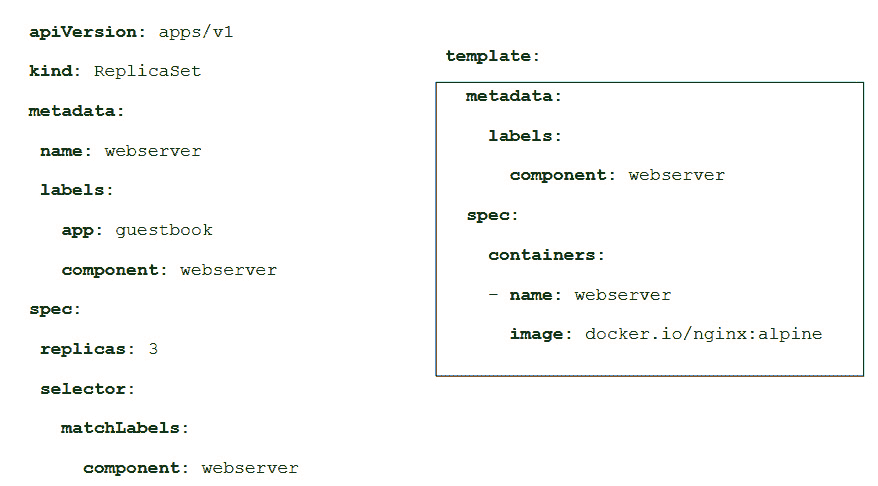

# 第九章：9

# 实现架构模式

Kubernetes 是生产环境中最流行的容器调度器。该平台提供了不同的资源，允许我们以高韧性和分布式的方式部署应用程序，同时平台本身具有高可用性。在本章中，我们将学习这些资源如何提供不同的应用架构模式，并结合用例和最佳实践来实施它们。我们还将回顾不同的应用数据管理选项，并学习如何管理应用程序的健康，以最有效的方式应对可能出现的健康和性能问题。在本章的最后，我们将回顾 Kubernetes 提供的安全模式，以提高应用程序的安全性。本章将为您提供一个关于哪些 Kubernetes 资源最适合您应用需求的良好概览。本章将涵盖以下主题：

+   将 Kubernetes 资源应用于常见应用模式

+   理解高级 Pod 应用模式

+   验证应用健康状况

+   资源管理与可扩展性

+   使用 Pods 提升应用安全性

# 技术要求

本章的实验可以在 [`github.com/PacktPublishing/Containers-for-Developers-Handbook/tree/main/Chapter9`](https://github.com/PacktPublishing/Containers-for-Developers-Handbook/tree/main/Chapter9) 找到，您将在那里找到一些扩展的解释，这些内容在本章中被省略，以便更容易理解。本章的 *Code In Action* 视频可以在 [`packt.link/JdOIY`](https://packt.link/JdOIY) 找到。

本章将从回顾 *第八章*，《使用 Kubernetes 调度器部署应用》，开始，并介绍一些常见的用例。

# 将 Kubernetes 资源应用于常见应用模式

Kubernetes 容器调度器基于由不同控制器管理的资源。默认情况下，我们的应用程序可以使用以下其中之一来运行容器中的进程：

+   Pods

+   ReplicaSets

+   ReplicaControllers

+   Deployments

+   StatefulSets

+   DaemonSets

+   Jobs

+   CronJobs

此列表显示了每个 Kubernetes 安装中允许的标准或默认资源，但我们可以创建自定义资源来实现任何非标准或更具体的应用行为。在本节中，我们将学习这些标准资源，以便我们能够决定哪个最适合我们的应用需求。

## Pods

Pods 是在 Kubernetes 集群中部署工作负载的最小单元。一个 Pod 可以包含多个容器，我们有不同的机制来实现这一点。

默认情况下，以下内容适用于 Pod 内运行的所有容器：

+   它们共享网络命名空间，因此它们都指向相同的本地主机，并使用相同的 IP 地址运行。

+   它们都在同一主机上调度。

+   它们共享可以在容器级别定义的命名空间。我们将为每个容器定义资源限制（使用 cgroups），尽管我们也可以在 Pod 级别定义资源限制。Pod 资源限制将应用于所有容器。

+   附加到 Pod 的卷对所有在 Pod 内运行的容器都是可用的。

所以，我们可以看到 Pods 是一组一起运行的容器，它们共享内核命名空间和计算资源。

你会发现许多 Pods 只运行一个容器，这完全是可以接受的。容器在不同 Pods 之间的分布取决于你的应用程序组件的分布。你需要问自己，某些进程是否必须一起运行。例如，你可以将需要快速通信的两个容器放在一起，或者你可能需要在不共享远程数据卷的情况下跟踪其中一个容器创建的文件。但非常重要的是要理解，所有在 Pod 中运行的容器是一起扩展和复制的。这意味着，Pod 的多个副本将执行相同数量的容器副本，因此应用程序的行为可能会受到影响，因为相同类型的进程会多次运行，并且它们也会同时访问你的文件。例如，这会破坏你的数据库中的数据，或者可能导致数据不一致。因此，你需要明智地决定是否将应用程序的容器分布到不同的 Pods 中，或者将它们一起运行。

Kubernetes 会通过执行 Pod 定义的探针来跟踪每个容器在 Pod 中的状态。每个容器应该有自己的探针（存在不同类型的探针，我们将在*验证应用程序健康*部分学习）。但是此时，我们必须理解，Pod 内所有容器的健康状况会控制整个 Pod 的行为。如果其中一个容器崩溃，整个 Pod 会被标记为不健康，从而触发定义的 Kubernetes 事件和资源行为。因此，我们可以并行执行多个服务容器，或者通过执行一些预处理来准备我们的应用程序，例如填充一些最小的文件系统资源、二进制文件、权限等等。这些在实际应用程序进程之前运行的容器称为 `initContainers`（它是定义它们的关键字），并且会在其他容器之前按顺序运行；因此，如果这些初始容器中的任何一个失败，Pod 将无法按预期运行。

重要说明

Kubernetes 1.25 版本引入了 `kubectl debug` 操作，后跟 Pod 的名称，你的终端应该连接到该 Pod（共享内核命名空间）。我们将在 *实验室* 部分提供一个快速示例。

让我们回顾一下如何编写创建 Pod 所需的清单：


图 9.1 – Pod 清单

所有 Kubernetes 的清单文件至少包含 `apiVersion`、`kind` 和 `metadata` 这三个键，它们分别用于定义将使用哪个 API 版本来访问关联的 API 服务器路径，定义我们正在定义的资源类型，以及描述资源在 Kubernetes 集群内唯一标识的信息。我们可以通过 Kubernetes API 使用 JSON 或 YAML 键层次结构访问所有资源清单信息；例如，要获取 Pod 的名称，我们可以使用 `.metadata.name` 来访问其键。资源的属性通常应写入 `spec` 或 `data` 部分。Kubernetes 角色、角色绑定（在集群和命名空间范围内）、服务帐户以及其他资源没有包含 `data` 或 `spec` 键来声明其功能。我们甚至可以创建自定义资源，使用自定义定义来声明其属性。在默认的工作负载资源中，我们总是会使用 `spec` 部分来定义资源的行为。

请注意，在前面的代码片段中，`containers` 键是一个数组。这允许我们定义多个容器，正如我们之前提到的，初始容器也是如此；在两种情况下，我们都将定义一个容器列表，并且我们至少需要容器运行时必须使用的镜像和容器的名称。

重要提示

我们可以使用 `kubectl explain pod.spec.containers --recursive` 来检索定义资源下 `spec` 部分的所有现有键。`explain` 操作允许你直接从 Kubernetes 集群中检索每个资源的所有键；这很重要，因为它不依赖于你 `kubectl` 二进制文件的版本。该操作的输出还显示哪些键可以在运行时更改，一旦资源在集群中创建。

在这里需要特别提到的是，Pod 本身没有集群范围的自动修复功能。这意味着，当你运行一个 Pod，并且它由于某种原因（任何容器被认为不健康）被认为不健康时，它不会在集群中的其他主机上执行。Pod 包含 `restartPolicy` 属性来管理 Pod 死亡后的行为。我们可以将该属性设置为 `Always`（始终重启容器的 Pod）、`OnFailure`（仅在容器失败时重启）、或 `Never`。新的 Pod 永远不会在其他集群主机上重新创建。我们需要更高级的资源来管理集群范围内容器的生命周期，这些将在后续章节中讨论。

Pod 用于运行应用程序或其组件的测试，但我们从不使用它们来运行实际的服务，因为 Kubernetes 只是保持它们运行；它不管理它们的更新或重新配置。让我们回顾一下副本集是如何解决在需要保持应用程序容器持续运行时的这些问题。

## 副本集（ReplicaSets）

ReplicaSet 是一组应该同时运行的 Pods，用于应用的组件（或者如果应用只有一个组件，则用于应用本身）。为了定义一个 ReplicaSet 资源，我们需要编写以下内容：

+   一个 `selector` 部分，用于定义哪些 Pods 是资源的一部分

+   维持资源健康所需的副本数量

+   一个 Pod 模板，用于定义当集合中的某个 Pod 死亡时，如何创建新的 Pods

让我们回顾一下这些资源的语法：



图 9.2 – ReplicaSet 清单

如你所见，`template` 部分描述了 ReplicaSet 中 `spec` 部分的 Pod 定义。这个 `spec` 部分还包括 `selector` 部分，用于定义哪些 Pods 会被包含。我们可以使用 `matchLabels` 来包含来自 Pods 的精确标签键值对，使用 `matchExpressions` 来包括一些高级规则，如定义的标签是否存在，或者其值是否包含在字符串列表中。

重要说明

ReplicaSet 资源的选择器也适用于正在运行的 Pods。这意味着你需要注意那些唯一标识你应用组件的标签。ReplicaSet 资源是有命名空间的，因此我们可以在实际创建 ReplicaSet 之前使用 `kubectl get pods --show-labels` 来确保正确的 Pods 会被包含在集合中。

在 Pod 模板中，我们将定义要附加到 ReplicaSet 创建的不同容器上的卷，但需要理解的是，这些卷对于所有副本都是共享的。因此，所有容器副本都会附加相同的卷（实际上，运行它们的主机挂载这些卷，kubelet 会将它们提供给 Pods 的容器），如果你的应用不允许这种情况，可能会产生问题。例如，如果你正在部署数据库，运行多个副本并附加相同的卷可能会破坏你的数据文件。我们应该确保我们的应用可以同时运行多个复制进程，如果不能，请确保在 `accessMode` 键中应用适当的 `ReadWriteOnce` 模式标志。我们将在 *第十章*，*在 Kubernetes 中利用应用数据管理* 中深入探讨这个键、它的重要性以及它对我们工作负载的意义。

ReplicaSets 中最重要的键是 `replicas` 键，它定义了应该运行的活动健康 Pods 数量。这允许我们对应用的进程数量进行扩展或缩减。与 ReplicaSet 关联的 Pods 的名称将遵循 `<REPLICASET_NAME>-<POD_RANDOM_UNIQUE_GENERATED_ID>` 格式。这有助于我们理解哪些 ReplicaSet 创建了它们。我们还可以通过使用 `kubectl get pod –o yaml` 来查看 ReplicaSet 的创建者。`metadata.OwnerReferences` 键显示了最终创建每个 Pod 资源的 ReplicaSet。

我们可以使用以下任一方法修改正在运行的 ReplicaSet 资源的副本数：

+   使用`kubectl`直接编辑 Kubernetes 中正在运行的 ReplicaSet 资源：`edit <REPLICASET_NAME>`

+   使用`kubectl patch`修补当前的 ReplicaSet 资源

+   使用`kubectl`的`scale`命令，设置副本数：`kubectl scale rs --replicas <``NUMBER_OF_REPLICAS> <REPLICASET_NAME>`

虽然更改副本数会自动生效，但其他更改则效果不佳。在 Pod 模板中，如果我们更改用于创建容器的镜像，资源会显示此更改，但当前关联的 Pods 不会改变。这是因为 ReplicaSets 并不管理这些更改；我们需要使用更高级的 Deployment 资源来进行操作。要在 ReplicaSet 中使任何更改生效，我们需要手动重新创建 Pods，可以通过删除当前 Pods（使用`kubectl delete pod <REPLICASET_POD_NAMES>`）或将副本数缩减为零，待所有 Pods 删除后再扩容。任何一种方法都会创建新的副本，使用新的 ReplicaSet 定义。

重要提示

你可以使用`kubectl delete pod --selector <LABEL_SELECTOR>`，结合创建当前 ReplicaSet 时使用的标签选择器，删除所有关联的 Pod 资源。

默认情况下，ReplicaSets 不会发布任何 Service；我们需要创建一个 Service 资源来访问部署的容器。当我们创建与 ReplicaSet 关联的 Service（使用 Service 的标签选择器与相应 ReplicaSet 的标签），所有 ReplicaSet 实例都可以通过 Service 的`ClusterIP`地址访问（默认的 Service 模式）。所有副本会接收相同数量的请求，因为内部负载均衡提供了轮询访问。

我们在生产环境中可能不会单独使用 ReplicaSets，因为我们已经看到，任何对其定义的更改都需要我们进行额外的操作，而在像 Kubernetes 这样的动态环境中，这并不理想。

在我们讨论 Deployments（用于部署 ReplicaSets 的高级资源）之前，我们将快速回顾一下 ReplicationControllers，它们与 ReplicaSets 非常相似。

## ReplicationControllers

ReplicationController 是 Kubernetes 中用于 Pod 复制的原始方法，但现在它已几乎完全被 ReplicaSet 资源所取代。我们可以将 ReplicationController 看作是一个可配置性较低的 ReplicaSet。如今，我们不再直接创建 ReplicationController，因为我们通常会创建 Deployments 来部署运行在 Kubernetes 上的应用组件。我们了解到，ReplicaSets 有两种选择关联标签的方式。`labelSelector` 键可以是简单的标签查询（`matchLabels`），也可以是使用 `matchExpressions` 的更高级规则。ReplicationController 清单只能查找 Pods 中的特定标签，这使得它们更易于使用。Pod 模板部分在 ReplicaSets 和 ReplicationControllers 中看起来相似。然而，ReplicationControllers 和 ReplicaSets 之间也有一个根本性的区别。我们可以通过使用滚动更新操作来执行应用程序的升级。这些操作对于 ReplicaSets 不可用，但通过使用 Deployments，升级功能在这些资源中得以提供。

## Deployments

我们可以说，Deployment 是一个高级版的 ReplicaSet。它通过允许我们通过创建新的 ReplicaSet 资源来升级 Pod 的规格，从而增加了我们之前错过的生命周期管理部分。这是生产中使用最广泛的工作负载管理资源。Deployment 资源创建并管理不同的 ReplicaSet 资源。当创建一个 Deployment 资源时，一个关联的 ReplicaSet 也会动态创建，遵循 `<DEPLOYMENT_NAME>-<RS_RANDOM_UNIQUE_GENERATED_ID>` 命名法。这个动态创建的 ReplicaSet 将创建与之关联的 Pods，遵循描述的命名规则，因此我们会在定义的命名空间中看到类似 `<DEPLOYMENT_NAME>-<RS_RANDOM_UNIQUE_GENERATED_ID>-<POD_RANDOM_UNIQUE_GENERATED_ID>` 的 Pod 名称。这将帮助我们跟踪哪个 Deployment 生成了哪个 Pod 资源。Deployment 资源管理着完整的 ReplicaSet 生命周期。为此，每当我们更改任何 Deployment 模板的规格键时，会创建一个新的 ReplicaSet 资源，并触发新的关联 Pods 的创建。Deployment 资源会跟踪所有关联的 ReplicaSets，这使得我们能够轻松地回滚到先前的版本，而不必包含最新的资源修改。这对于发布新的应用更新非常有用。每当更新的资源出现问题时，我们可以在几秒钟内回滚到任何先前的版本，这得益于 Deployment 资源——事实上，我们可以回滚到任何先前存在的 ReplicaSet 资源。我们将在*第十三章*，*管理应用生命周期*中深入探讨滚动更新。

以下代码片段展示了这些资源的语法：


图 9.3 – 部署清单

`strategy`键允许我们决定新容器是否在旧容器死亡之前尝试启动（`RollingUpdate`值，默认使用此值），或者完全重新创建相关的 ReplicaSet（`Recreate`值），当只有一个容器能够在特定时刻以写模式访问附加卷时需要使用这种方法。

我们将使用 Deployments 来部署无状态或有状态的应用程序工作负载，其中不需要任何特殊的存储附加，并且所有副本可以按相同的方式处理（所有副本都是一样的）。Deployments 非常适合用于部署具有静态内容的 Web 服务和动态 Web 服务，当会话持久性由不同的应用组件管理时。我们不能使用 Deployment 资源来部署我们的应用容器，特别是在每个副本必须附加其特定数据卷，或需要按顺序执行进程的情况下。

现在我们将学习 StatefulSet 资源如何帮助我们解决这些特定情况。

## StatefulSets

StatefulSet 资源旨在管理有状态的应用程序组件——这些组件的持久化数据必须在副本之间保持唯一。这些资源还允许我们在执行进程时为不同的副本提供顺序。每个副本将获得一个唯一的有序标识符（从 0 开始的序号），并且它将用于增加或减少副本的数量。

以下代码片段展示了一个 StatefulSet 资源的示例：


图 9.4 – StatefulSet 清单

上面的代码片段展示了`template`部分，包括了 Pod 资源和卷资源。

每个 Pod 的名称将遵循`<STATEFULSET_NAME>-<REPLICA_NUMBER>`的格式。例如，如果我们创建一个名为`database`的 StatefulSet 资源，且有三个副本，那么相关的 Pods 将为`database-0`，`database-1`和`database-2`。这种命名结构同样适用于 StatefulSet 的`volumeClaimTemplates`模板部分中定义的卷。

请注意，我们还在之前的代码片段中包含了`serviceName`键。应创建一个无头服务（没有`ClusterIP`）以在 Kubernetes 内部 DNS 中引用 ReplicaSet 的 Pod，但这个键告诉 Kubernetes 创建所需的 DNS 条目。在所示的示例中，第一个副本将作为`database-0.database.NAMESPACE.svc.<CLUSTER_NAME>`发布到集群 DNS，所有其他副本将遵循相同的命名规则。这些名称可以集成到我们的应用程序中，以创建应用程序集群，甚至配置默认负载均衡机制以外的高级负载均衡机制（用于 ReplicaSets 和 Deployments）。

当我们使用 StatefulSet 资源时，Pods 会按顺序创建，这可能会在需要删除某些副本时引入额外的复杂性。我们需要确保正确执行可能解决副本之间依赖关系的进程；因此，如果我们需要删除一个 StatefulSet 副本，缩减副本数量比直接删除副本更安全。记住，我们必须准备好让应用程序完全管理唯一副本，这可能需要一些应用程序进程来删除某个应用程序的集群组件。例如，在运行多个实例的分布式数据库时，这种情况是典型的，去除一个实例需要数据库更改，但这同样适用于任何 ReplicaSet 清单的更新。你必须确保更改按正确的顺序应用，通常，最好是先缩减到零副本，然后再扩展到所需的副本数。

在前面代码片段中呈现的 StatefulSet 示例中，我们指定了`volumeClaimTemplate`部分，它定义了动态配置卷所需的属性。我们将在*第十章*，*在 Kubernetes 中利用应用程序数据管理*中学习动态存储配置的工作原理，但理解这一点很重要：此`template`部分会通知 Kubernetes API，每个副本都需要其自己的有序卷。动态配置的这一要求通常会与`StorageClass`资源的使用相关联。

一旦这些卷（与每个副本相关联）被配置并使用，删除一个副本（无论是通过使用`kubectl delete pod`命令直接删除，还是通过缩减副本数量）都不会删除相关联的卷。你可以确信，通过 ReplicaSet 部署的数据库永远不会丢失数据。

重要提示

ReplicaSet 相关的卷不会被自动删除，这使得这些资源对于任何工作负载都很有吸引力，特别是在你需要确保删除资源时不会删除数据的情况下。

我们可以使用 StatefulSet 来确保一个复制的服务被唯一管理。像 Hashicorp 的 Consul 这样的软件在多个预定义节点上以集群方式运行；我们可以通过容器将其部署在 Kubernetes 之上，但 Pod 需要按顺序部署，并且每个 Pod 都需要特定的存储，就好像它们是完全不同的主机一样。在数据库服务中也必须采用类似的方法，因为它们进程的复制可能会导致数据损坏。在这些情况下，我们可以使用 StatefulSet 复制的资源，但应用程序应该管理不同部署副本之间的集成，以及扩缩容过程。Kubernetes 仅提供了底层架构，确保数据的唯一性和副本的执行顺序。

## DaemonSets

DaemonSet 资源将在每个 Kubernetes 集群节点上执行一个关联的 Pod。这确保了任何新加入的节点将自动获得自己的副本。

以下代码片段展示了一个 DaemonSet 清单示例：


图 9.5 – DaemonSet 清单

正如您可能已经注意到的，我们使用标签选择器来匹配和关联 Pods。在前面的示例中，我们还介绍了 `tolerations` 键。让我们快速介绍一下 `NoSchedule`（只有具有适当容忍度的 Pods 才能在该节点上运行）、`PreferNoSchedule`（Pods 除非没有其他节点可用，否则不会在该节点上运行）和 `NoExecute`（如果 Pods 没有适当的容忍度，它们将从节点上驱逐）。污点和容忍度必须匹配，这使我们能够为特定任务专门分配节点，避免在其上执行其他工作负载。kubelet 将使用动态污点来驱逐 Pods，当集群节点出现问题时—例如，当内存使用过多或磁盘空间不足时。在我们的示例中，我们添加了一个容忍度，以便在具有 `node-role.kubernetes.io/control-plane=NoSchedule` 污点的节点上执行 DaemonSet Pods。

DaemonSets 通常用于部署应该在所有节点上运行的应用程序，例如那些作为软件代理运行的应用程序，用于监控或日志记录目的。

重要提示

尽管不常见，但确实可以使用静态 Pods 来运行节点特定的进程。这是 Kubernetes 基于 kubeadm 的部署使用的机制。静态 Pods 是与节点关联的 Pods，由 kubelet 直接执行，因此它们不受 Kubernetes 管理。您可以通过它们的名称来识别这些 Pods，因为它们包含主机的名称。执行静态 Pods 的清单位于 kubeadm 集群的 `/etc/kubernetes/manifests` 目录中。

在这一点上，我们必须提到，迄今为止呈现的所有工作负载管理资源都没有提供一个机制来运行不应该在执行期间维持的任务。接下来我们将回顾 Job 资源，这些资源专门为此目的而创建。

## Jobs

Job 资源负责执行一个 Pod，直到我们获得成功的终止。Job 资源还通过使用模板选择器跟踪一组 Pods 的执行。我们配置所需的成功执行次数，当所有所需的 Pod 执行成功完成时，Job 资源将被视为*完成*。

在 Job 资源中，我们可以配置并行性，以便同时执行多个 Pod，并能够更快地达到所需的成功执行次数。与 Job 相关的 Pods 将一直保留在我们的 Kubernetes 集群中，直到我们删除相关的 Job 或手动移除它们。

一个 Job 可以被挂起，这将删除当前活动的 Pods（正在执行的），直到我们重新恢复它。

我们可以使用 Jobs 执行一次性任务，但它们通常与周期性执行相关联，感谢 `CronJob` 资源。另一个常见的使用场景是在 Kubernetes 集群中直接执行应用程序的一些一次性任务。在这种情况下，您的应用程序需要能够内部访问 Kubernetes API（`default` 命名空间中的 `kubernetes` 服务），并且具有创建 Jobs 的适当权限。通常通过将允许此类操作的命名空间 `Role` 与执行应用程序 Pod 的 `ServiceAccount` 资源关联来实现。这种关联是通过使用命名空间 `RoleBinding` 来建立的。

以下代码片段展示了一个 `Job` 清单示例：


图 9.6 – Job 清单

在这里，我们通过设置 `completions` 和 `backoffLimit` 键，定义了成功完成的次数和将 Job 标记为失败的失败次数。至少需要三个 Pods 成功退出，才能达到四次失败的限制。可以通过设置 `parallelism` 键（默认值为 `1`）来并行执行多个 Pods，以加快完成速度。

*TTL-after-finished* 控制器提供了一个 `ttlSecondsAfterFinished` 键。由于此键基于日期时间参考，因此维护集群的时间并确保与我们所在时区一致非常重要。

Jobs 通常在 CronJobs 中使用，用于定义应该在某些时间段内执行的任务——例如，执行备份。让我们学习如何实现 CronJobs，以便我们能够定期安排 Jobs 执行。

## CronJobs

CronJob 资源用于在特定时间安排 Jobs。以下代码片段展示了一个 `CronJob` 清单示例：


图 9.7 – CronJob 清单

为了能够查看已执行的 Pods（与创建的 Jobs 相关联）的日志，我们可以设置 `failedJobsHistoryLimit` 和 `successfulJobsHistoryLimit`，以指定要保留的 Jobs 数量，从而能够查看 Pods 的日志。请注意，我们将示例 Job 设置为每日执行，时间为 00:00，使用常见的*Unix Crontab*格式，如下所示：


图 9.8 – Unix Crontab 格式

`schedule` 键定义了何时创建 Job，以及关联的 Pods 何时运行。请记得始终对您的值加上引号，以避免出现问题。

重要说明

CronJob 资源使用 Unix Crontab 格式，因此可以使用诸如 `@hourly`、`@daily`、`@monthly` 或 `@yearly` 等值。

CronJobs 可以被暂停，如果我们将 `suspend` 键的值更改为 `true`，将会影响任何新的 Job 创建。要重新启用 CronJob，我们需要将此键更改为 `false`，这将继续按照正常的时间表创建新的 Jobs。

CronJobs 的一个常见用例是执行部署在 Kubernetes 上的应用程序的备份任务。通过这个解决方案，我们可以避免将内部应用程序暴露到外部，如果用户访问不是必需的。

现在我们了解了可以用来部署工作负载的不同资源，让我们快速回顾一下它们将如何帮助我们为应用程序提供弹性和高可用性。

## 使用 Kubernetes 资源确保弹性和高可用性

Pod 资源开箱即用提供弹性，因为我们可以配置它们在进程失败时总是重新启动。我们可以使用 `spec.restartPolicy` 键来定义它们应何时重新启动。需要理解的是，这个选项仅限于主机范围，因此 Pod 只会尝试在其先前运行的主机上重新启动。Pod 资源并不提供集群范围的高可用性或弹性。

Deployments，因此 ReplicaSets 和 StatefulSets 都是为实现全局弹性而设计的，因为弹性不依赖于主机。Pod 仍然会尝试在它之前运行的节点上重新启动，但如果无法运行，它将被调度到一个新的可用节点。这将允许 Kubernetes 管理员在节点上执行维护任务，将工作负载从一个主机迁移到另一个主机，但如果应用程序没有为这种迁移做好准备，可能会对其产生影响。换句话说，如果你的进程只有一个副本，它们会在几秒钟（或几分钟，具体取决于镜像的大小和进程启动所需的时间）内停止，这将影响你的应用程序。解决方案很简单：部署多个副本的应用程序 Pod。然而，重要的是要理解，你的应用程序需要为多个副本进程并行工作做好准备。

StatefulSets 的副本永远不会使用相同的存储卷，但 Deployments 并非如此。所有副本将共享存储卷，你必须意识到这一点。共享静态内容将非常顺利，但如果多个进程试图同时写入同一个文件，如果你的代码没有处理并发问题，可能会遇到问题。

DaemonSets 的工作方式不同，我们不需要管理任何复制；每个节点上只会运行一个 Pod，但它们也会共享存储卷。由于这种资源的特性，在这种情况下不常见包含共享存储卷。

但即使我们的应用程序以复制方式运行，我们也不能确保所有副本同时停止，除非配置了 **Pod 中断策略**。我们可以配置一个最小可用 Pod 数量，确保不仅提供弹性，还能实现高可用性。我们的应用程序会受到一定影响，但它将继续提供服务（高可用性）。

要配置中断策略，我们必须使用`PodDisruptionBudget`资源为我们的应用程序提供所需的逻辑。通过配置`minAvailable`或`maxUnavailable`键，我们可以设置在任何情况下我们的应用程序工作负载所需的 Pod 数量。我们可以使用整数（Pod 的数量）或配置的副本百分比。`PodDisruptionBudget`资源使用选择器在命名空间中的 Pod 之间进行选择（这些选择器我们已经用于创建 Deployments、ReplicaSets 等）。以下代码片段展示了一个示例：

```
apiVersion: policy/v1
kind: PodDisruptionBudget
metadata:
  name: webserver-pdb
spec:
  minAvailable: 2
  selector:
    matchLabels:
      app: webserver
```

在这个示例中，正在监控至少两个带有`app=webserver`标签的 Pod。我们将在 Deployment 中定义副本数，但`PodDisruptionBudget`资源不会允许我们将副本缩减到少于两个副本。因此，即使我们决定执行`kubectl drain node1`（假设在此示例中，`webserver` Deployment 与`app=webserver` Pod 的标签匹配，且`node1`和`node2`各有一个副本），仍将运行两个副本。`PodDisruptionBudget`资源是命名空间级的，因此我们可以通过执行`kubectl get poddisruptionbudgets`来查看命名空间中的所有这些资源。

在接下来的部分中，我们将回顾一些有趣的想法，使用 Pod 特性来解决常见的应用架构模式。

# 理解高级 Pod 应用模式

在本节中，我们将讨论一些使用简单 Pod 的有趣模式。我们将要回顾的所有模式都是基于 Kubernetes 为 Pod 提供的特殊机制，这些机制允许容器在 Pod 内运行时共享内核命名空间，从而使容器能够挂载相同的卷，并通过 localhost 进行互联。

## 初始化容器

一个容器内可以运行多个 Pod。Pod 允许我们隔离不同的应用程序进程，将它们分别维护在不同的容器中。这有助于我们，例如，维护可以由不同的代码库和构建工作流表示的不同镜像。

初始化容器在主应用容器（如果我们并行运行多个容器）之前运行。这些初始化容器可以用于设置作为卷呈现的共享文件系统上的权限、创建数据库模式或任何有助于初始化应用程序的过程。我们甚至可以使用它们在进程开始之前检查依赖关系，或通过从外部源检索文件来预置所需的文件。

我们可以定义多个初始化容器，它们将按顺序逐个执行，所有容器必须成功完成，才能启动实际的应用容器。如果任何一个初始化容器失败，Pod 也会失败，尽管这些容器没有与之关联的探针来验证它们的状态。它们执行的过程必须包含故障检查，以防出现问题。

理解 Pod 所消耗的总 CPU 和内存资源是从 Pod 初始化开始计算的，因此需要检查初始化容器。你需要确保 Pod 的资源使用保持在定义的限制范围内（包括所有并行运行容器的资源使用）。

## Sidecar 容器

使用`kubectl patch`命令来修改正在运行的 Deployment 资源清单。

一些现代监控应用程序设计为与 Kubernetes 集成，也使用 sidecar 容器来部署应用程序特定的监控组件，从应用程序获取指标并将其暴露为一个新的服务。

接下来我们要审查的几个模式基于这个 sidecar 容器的概念。

## 大使容器

**大使**应用程序模式旨在卸载常见的客户端连接任务，帮助遗留应用程序在不改变旧代码的情况下实现更先进的功能。通过这种设计，我们可以通过增加负载均衡、API 网关和 SSL 加密来改善应用程序的路由、通信安全性和弹性。

我们可以通过在 Pod 中添加特殊容器来部署这个模式，这些容器设计用于提供轻量的反向代理功能。通过这种方式，大使容器可用于部署服务网格解决方案，拦截应用程序进程通信，确保与其他应用组件的互联互通，强制加密通信，并管理应用程序路由等功能。

## 适配器容器

**适配器**容器模式的使用场景之一是当我们希望在不改变遗留应用程序代码的情况下进行监控或获取日志。为了避免这种情况，我们可以在应用程序的 Pod 中添加第二个容器，从应用程序获取指标或日志，而无需修改任何原始代码。这还允许我们统一日志内容或将其发送到远程服务器。经过精心设计的容器会将进程的标准输出和错误输出重定向到前台，这样我们可以查看它们的日志，但有时应用程序无法重定向日志或会生成多个日志。我们可以将它们合并为一个日志，或通过添加第二个进程（适配器容器）来重定向其内容，该容器会格式化日志（添加一些自定义列、日期格式等），并将结果重定向到标准输出或远程日志组件。此方法不需要对主机资源的特殊访问，并且对于应用程序来说可能是透明的。

**Prometheus** 是一个非常流行的开源监控解决方案，并在 Kubernetes 环境中扩展。它的主要组件会轮询代理组件并从中获取指标，常常使用这种适配器容器模式来展示应用程序的指标，而无需修改其标准行为。这些指标会在应用程序 Pod 的不同端口暴露，Prometheus 服务器会连接到该端口以获取指标。

让我们了解 Kubernetes 如何验证容器的健康状况，以决定 Pod 的状态。

# 验证应用程序健康

在这一部分，我们将回顾应用程序 Pods 如何被认为是健康的。Pods 总是从 `Pending` 状态开始，一旦主容器被认为健康，它们会继续进入 `Running` 状态。如果 Pod 执行一个服务进程，它将保持在 `Running` 状态。如果 Pod 与一个 Job 资源关联，它可能会成功结束（`Succeeded` 状态）或失败（`Failed` 状态）。

如果我们移除一个 Pod 资源，它将进入 `Terminating` 状态，直到从 Kubernetes 中完全移除。

重要说明

如果 Kubernetes 无法获取 Pod 的状态，它的状态将为 `Unknown`。这通常是由于主机的 kubelet 和 API 服务器之间的通信问题。

Kubernetes 会审查容器的状态来设置 Pod 的状态，容器可以是 `Waiting`、`Running` 或 `Terminated`。我们可以使用 `kubectl describe pod <POD_NAME>` 来查看这些阶段的详细信息。让我们快速回顾一下这些状态：

+   `Waiting` 表示 `Running` 之前的状态，在这个阶段会出现所有的容器执行前的流程。此阶段，容器镜像会从镜像仓库拉取，并准备不同的卷挂载。如果 Pod 无法运行，它将进入 `Pending` 状态，这表明在部署工作负载时出现了问题。

+   `Running` 表示容器运行正常，没有任何问题。

+   `Terminated` 状态是在容器停止时被考虑的状态。

如果 Pod 配置了 `restartPolicy` 属性，类型为 `Always` 或 `OnFailure`，那么所有容器将在停止的节点上重新启动。这就是为什么如果节点宕机，Pod 资源既不提供高可用性也不提供弹性。

让我们通过**探针**的执行来回顾一下 Pod 状态是如何在这些阶段中被评估的。

## 理解探针的执行

kubelet 会定期执行探针，通过在容器内执行某些代码或直接执行网络请求。根据我们需要检查的应用组件类型，提供了不同类型的探针：

+   `exec`：该方法在容器内部执行一个命令，kubelet 会验证该命令是否正确退出。

+   `httpGet`：这种方法可能是最常见的，因为现代应用程序通过 REST API 暴露服务。此检查的响应必须返回 2XX 或 3XX（重定向）代码。

+   `tcpSocket`：此探针用于检查应用程序的端口是否可用。

+   `grpc`：如果我们的应用程序通过现代**谷歌远程过程调用**（**gRPCs**）被使用，我们可以通过这种方式验证容器的状态。

探针必须返回有效值才能认为容器是健康的。不同的探针可以在它们的生命周期中依次执行。我们来看看可用的不同选项，以验证容器的进程是否正在启动或服务应用程序本身。

### 启动探针

`Always` 或 `OnFailure` 在其`restartPolicy`键中。

如果我们的进程在准备好之前需要很长时间，我们将设置这些探针——例如，当我们启动一个数据库服务器并且它必须处理之前的数据事务才能准备好，或者当我们的进程已经集成了一些顺序检查，最终执行主进程之前。

### 存活探针

`restartPolicy`值。当在进程内部管理主进程的失败很困难时，它们将被使用。通过`livenessProbe`键集成一个外部检查，来验证主进程是否健康，可能会更为简单。

### 就绪探针

`selector`部分在此探针成功结束之前不会将此 Pod 标记为准备好接收请求。当探针失败时，同样会将其从可用端点列表中移除。

就绪探针对于管理 Pod 的流量至关重要，因为我们可以确保应用程序组件能正确处理请求。此探针应始终设置，以改善我们的微服务交互。

在`spec.containers`级别，有一些常用的键可以帮助我们自定义不同探针类型的行为。例如，我们可以配置需要多少次失败检查才能将探针视为失败（`failureThreshold`）或探针类型执行之间的时间间隔（`periodSeconds`）。我们还可以通过设置`initialDelaySeconds`键来配置这些探针启动前的延迟，尽管推荐先了解应用程序的工作方式，并调整探针以适应我们的初始顺序。在本章的*实验室*部分，我们将回顾一些刚才讨论过的探针。

现在我们已经知道 Kubernetes（kubelet 组件）如何验证集群中启动或运行的 Pods 的健康状态，我们还必须理解它们在被认为`Completed`或`Failed`时的*停止*顺序。

## Pods 的终止

我们可以使用`terminationGracePeriodSeconds`键来设置如果 Pod 的进程需要很长时间才能结束，kubelet 会等待多久。当 Pod 被删除时，kubelet 会向它发送`SIGTERM`信号，但如果花费的时间太长，kubelet 将在`terminationGracePeriodSeconds`配置的时间达到时，向所有仍在运行的容器进程发送`SIGKILL`信号。这个时间阈值也可以在探针级别进行配置。

要立即删除一个 Pod，我们可以通过使用`kubelet delete pod <POD_NAME> --force`并结合`--grace-period=0`来强制并更改此 Pod 级别定义的宽限期。如果你不了解其工作原理，强制删除 Pod 可能会对你的应用程序造成意想不到的后果。kubectl 客户端发送`SIGKILL`信号，并且不等待确认，通知 API 服务器 Pod 已经终止。当 Pod 属于 StatefulSet 时，这可能是危险的，因为 Kubernetes 集群将尝试执行一个新的 Pod，而不确认它是否已经被终止。为了避免这些情况，最好是先缩减副本数，然后再扩展副本以进行完全重启。

当我们更新应用的某些组件，甚至当它们因错误失败时，我们的应用可能需要执行一些特定的进程来管理不同组件之间的交互。我们可以在容器启动或停止时包含一些触发器—例如，在集群化应用中重新配置新的主进程。

## 容器生命周期钩子

Pod 中的容器可以在其规格中包含**生命周期钩子**。有两种类型可用：

+   **PostStart**钩子可以用来在容器创建*之后*执行一个进程。

+   **PreStop**钩子在容器被终止*之前*执行。宽限期从 kubelet 接收到停止操作时开始，因此，如果定义的进程花费时间过长，这个钩子可能会受到影响。

当我们的应用需要时，Pods 可以手动进行扩展或缩减，只要得到支持，但我们还可以进一步管理副本的自动化。接下来的部分将展示如何实现这一点。

# 资源管理和可扩展性

默认情况下，Pods 在没有计算资源限制的情况下运行。这对于了解应用程序的行为是可以的，而且它有助于你定义其需求和限制。

Kubernetes 集群管理员还可以定义配额，这些配额可以在不同级别进行配置。通常会在命名空间级别定义这些配额，您的应用将受到 CPU 和内存限制。但这些配额也可以识别一些特殊资源，如 GPU、存储，甚至可以在命名空间中部署的资源数量。在这一部分，我们将学习如何在 Pod 和容器中限制资源，但在部署之前，您应始终询问 Kubernetes 管理员是否在命名空间级别应用了任何配额，以准备好遵守这些配额。有关资源配额配置的更多信息，可以在 Kubernetes 官方文档中找到：[`kubernetes.io/docs/concepts/policy/resource-quotas`](https://kubernetes.io/docs/concepts/policy/resource-quotas)。

我们将使用`spec.resources`部分来定义与 Pod 相关的限制和请求。让我们来看看它们如何工作：

+   `spec.resources.requests.memory`和`spec.resources.requests.cpu`分别允许我们定义在任何集群主机上运行 Pod 所需的最小资源。

+   `spec.resources.limits.memory`和`spec.resources.limits.cpu`分别配置最大内存和可分配的 CPU 数量。

资源可以在 Pod 或容器级别定义，并且它们必须相互兼容。所有容器资源限制的总和不得超过 Pod 的资源值。如果我们省略 Pod 资源，则将使用定义的容器资源的总和。如果任何容器没有资源定义，则将使用 Pod 的限制和请求。容器的等效键为`spec.containers[].resources`。

内存限制和请求将以字节为单位进行配置，我们可以使用后缀如`ki`、`Mi`、`Gi`和`Ti`表示以 1,000 为倍数的内存，或使用`k`、`M`和`T`表示以 1,024 为倍数的内存。例如，要指定 100 MB 的内存限制，我们将使用`100M`。当达到允许的内存限制时，`OOMKiller`将在执行主机中触发，Pod 或容器将被终止。

对于 CPU，我们将定义允许或请求的 CPU 数量（无论是物理 CPU 还是虚拟 CPU），如果我们正在定义请求限制。当 CPU 限制达到时，容器或 Pod 将无法获得更多的 CPU 资源，这可能会使您的 Pod 被认为是不健康的，因为检查会失败。CPU 资源必须以整数或小数形式进行配置，并且我们可以添加`m`作为后缀来表示毫核；因此，0.5 个 CPU 也可以写作`500m`，而 0.001 个 CPU 将表示为`1m`。

重要提示

当我们使用 Linux 节点时，可以请求并限制巨大页资源，这使我们能够定义内核为内存块分配的页大小。必须使用特定的键名；例如，`spec.resources.limits.hugepages-2Mi`使我们能够定义为 2 MiB 巨大页分配的内存块限制。

你的管理员可以为某些 `LimitRange` 资源做准备，这些资源将定义与 Pod 资源相关的限制和请求的约束。

现在我们知道如何限制和请求资源，我们可以通过增加限制来垂直扩展工作负载。而水平扩展则需要复制 Pods。接下来我们将继续学习如何动态地水平扩展与运行中工作负载相关的 Pods。

重要提示

**垂直 Pod 自动扩展**也是 Kubernetes 内部的一个项目。它不太流行，因为垂直扩展会影响当前的 Deployments 或 StatefulSets，因为它需要扩展运行中副本的资源数量。这使得垂直扩展应用起来更为复杂，通常更好的做法是精细化管理应用中的资源，使用水平 Pod 自动扩展，它不会修改当前的副本规格。

## 水平 Pod 自动扩展

**HorizontalPodAutoscaler** 作为控制器工作。当工作负载的负载增加或减少时，它会增加或减少 Pod 的副本数量。自动扩展仅适用于 Deployments（通过扩展和修改其 ReplicaSets）和 StatefulSets。为了衡量与特定工作负载相关的资源消耗，我们需要在集群中加入一个工具，例如 **Kubernetes Metrics Server**。这个服务器将用于管理标准度量指标。可以通过其清单文件轻松部署，地址为 [`github.com/kubernetes-sigs/metrics-server`](https://github.com/kubernetes-sigs/metrics-server)。如果你在笔记本电脑或台式机上使用 Minikube，它也可以作为可插拔的附加组件运行。

我们将定义一个 `HorizontalPodAutoscaler`（`hpa`）资源；控制器将检索并分析 `hpa` 定义中指定的工作负载资源的度量。

可以为 `hpa` 资源使用不同类型的度量指标，虽然最常用的是 Pod 的 CPU 消耗。

可以定义与 Pod 相关的度量指标，控制器会检查这些度量指标并通过结合这些度量与集群可用资源和 Pod 状态的算法进行分析（[`kubernetes.io/docs/tasks/run-application/horizontal-pod-autoscale/#algorithm-details`](https://kubernetes.io/docs/tasks/run-application/horizontal-pod-autoscale/#algorithm-details)），然后决定是否需要扩展关联的资源（Deployment 或 StatefulSet）。

要定义一个 `hpa` 资源，我们需要设置一个度量指标来进行分析，并指定一个副本的范围（最大和最小副本数）。当该值达到时，控制器会检查当前的副本数，如果还有空间创建新的副本，则会创建新的副本。`hpa` 资源可以以命令式或声明式格式定义。例如，要管理最少两个 Pods 和最多十个 Pods，当当前 Pods 的 CPU 使用率超过 50% 时，可以使用以下语法：

```
kubectl autoscale <RESOURCE_TYPE> <RESOURCE_NAME> --cpu-percent=50 --min=2 --max=10
```

当资源的 CPU 消耗超过 50% 时，会创建一个副本；当该指标低于此值时，会减少一个副本；但是，我们永远不会执行超过 10 个副本或少于两个副本。

重要说明

我们可以通过添加 `–o yaml` 来查看用于创建任何资源的清单。清单将显示出来，我们可以验证其值。例如，我们可以使用 `kubectl autoscale deploy webserver --cpu-percent=50 --min=2 --max=10 -o yaml`。

如果我们想在创建资源之前查看值，可以添加 `--dry-run=client` 参数，只显示清单，而不实际创建资源。

由于 `hpa` 资源是命名空间的，我们可以通过执行 `kubectl get hpa -A` 获取所有已部署的 `hpa` 资源。

通过这一点，我们已经看到 Kubernetes 如何通过使用特定的资源提供开箱即用的弹性、高可用性和自动扩展功能。在下一节中，我们将学习它如何提供一些有趣的安全功能，帮助我们提升应用程序的安全性。

# 提升应用程序安全性与 Pods

在 Kubernetes 集群中，我们可以将分布在集群中的应用程序工作负载分类为特权或非特权。除非严格必要，否则应始终避免为普通应用程序使用特权工作负载。在本节中，我们将帮助你通过在工作负载清单中声明需求，定义应用程序的安全性。

## 安全上下文

在安全上下文中，我们定义了 Pod 或其中包含的容器所需的特权和安全配置。安全上下文允许我们配置以下安全功能：

+   `runAsUser`/`runAsGroup`：这些选项管理运行容器中主进程的 `userID` 和 `groupID` 属性。我们可以通过使用 `supplementalGroups` 键添加更多的组。

+   `runAsNonRoot`：该键可以控制是否允许进程以 `root` 身份运行。

+   `fsGroup`/`fsGroupChangePolicy`：这些选项管理 Pod 中包含的卷的权限。`fsGroup` 键将设置作为卷挂载的文件系统的所有者，以及任何新文件的所有者。我们可以使用 `fsGroupChangePolicy` 仅在权限与配置的 `fsGroup` 不匹配时应用所有权更改。

+   `seLinuxOptions`/`seccompProfile`：这些选项允许我们通过配置特定的 SELinux 标签和 `seccomp` 配置文件来覆盖默认的 SELinux 和 `seccomp` 设置。

+   `capabilities`：内核能力可以添加或移除（`drop`），以仅允许特定的内核交互（容器共享主机的内核）。你应避免在应用程序中使用不必要的能力。

+   `privileged`/`AllowPrivilegeEscalation`: 我们可以通过将`privileged`键设置为`true`来允许容器内部的进程以`privileged`身份（拥有所有能力）执行，或者通过将`AllowPrivilegeEscalation`设置为`true`来允许进程获得权限，即使`privileged`键被设置为`false`。在这种情况下，容器进程并不具备所有能力，但它们会允许内部进程像拥有`CAP_SYS_ADMIN`能力一样运行。

+   `readOnlyRootFilesystem`: 总是非常好的做法是将容器的根文件系统设置为只读模式运行。这将不允许进程对容器内的任何内容进行更改。如果你理解应用程序的需求，你将能够识别出可能需要更改的任何目录，并添加适当的卷以正确运行你的进程。例如，通常会将`/tmp`添加为单独的临时文件系统（`emptyDir`）。

其中一些键可用于容器或 Pod 级别，或两者都有。使用`kubectl explain pod.spec.securityContext`或`kubectl explain pod.spec.containers.securityContext`来获取每个作用域中可用选项的详细列表。你必须了解所使用的作用域，因为 Pod 规范适用于所有容器，除非在容器作用域下存在相同的键——在这种情况下，将使用容器作用域中的值。

让我们回顾一下可以准备的最佳设置，以提升我们的应用程序安全性。

## 安全最佳实践

以下列表展示了一些常用的安全设置。如果你是开发者，可以通过确保为你的 Pods 启用以下安全措施来提升应用程序的安全性：

+   `runAsNonRoot`必须始终设置为`true`，以避免在容器中使用`root`。确保还配置`runAsUser`和`runAsGroup`，并将它们设置为大于`1000`的 ID。你的 Kubernetes 管理员可以为你的应用程序推荐一些 ID。这将有助于在集群范围内控制应用程序 ID。

+   始终禁用所有能力，只启用应用程序所需的能力。

+   除非绝对必要，否则不要为应用程序使用特权容器。通常，只有与监控或内核相关的应用程序需要特殊权限。

+   识别应用程序所需的文件系统，并始终将`readOnlyRootFilesystem`设置为`true`。这个简单的设置提高了安全性，禁止了任何意外的更改。所需的文件系统可以作为卷挂载（有很多选项可用，我们将在*第十章*，“在 Kubernetes 中利用应用数据管理”中学习）。

+   向你的 Kubernetes 管理员询问是否有一些 SELinux 设置需要考虑并应用于你的 Pods。这同样适用于`seccomp`配置文件。管理员可能已经配置了默认配置文件。请向管理员了解这种情况，以避免任何系统调用问题。

+   管理员可能已经在使用诸如 Kyverno 或 OPA Gatekeeper 之类的工具来提高集群安全性。在这些情况下，他们可以通过在 Kubernetes 集群中使用**准入控制器**来强制执行安全上下文设置。这些功能的使用超出了本书的范围，但您可以向管理员询问在您的 Kubernetes 平台中执行应用程序所需的合规规则。

在接下来的部分中，我们将回顾如何通过准备多组件应用程序来实现本章中学习的一些 Kubernetes 特性，该应用程序在之前的章节中已经使用过（*Chapter 5*，*创建多容器应用程序*，以及*Chapter 7*，*使用 Swarm 进行编排*），在 Kubernetes 上运行。

# 实验

本节将向您展示如何在 Kubernetes 中部署`simplestlab`三层应用程序。我们已经为您准备了所有组件的清单，这些清单遵循了本章中解释的技术和 Kubernetes 资源。您将能够验证不同选项的使用，并能够根据本章描述的内容和最佳实践进行操作。

这些实验的代码可以在本书的 GitHub 存储库中找到：[`github.com/PacktPublishing/Containers-for-Developers-Handbook.git`](https://github.com/PacktPublishing/Containers-for-Developers-Handbook.git)。通过简单执行 `git clone` [`github.com/PacktPublishing/Containers-for-Developers-Handbook.git`](https://github.com/PacktPublishing/Containers-for-Developers-Handbook.git) 来下载其所有内容，或者如果您之前已经下载了存储库，则执行 `git pull` 更新至最新版本。所有清单和运行`simplestlab`所需的步骤都位于`Containers-for-Developers-Handbook/Chapter9`目录中。

在 GitHub 上的实验中，我们将通过定义适当的资源清单在 Kubernetes 上部署`simplestlab`应用程序，该应用程序在之前的章节中已经使用过。

+   **数据库**组件将使用 StatefulSet 资源部署。

+   **应用程序后端**组件将使用 Deployment 资源部署。

+   **负载均衡器**（或**展示器**）组件将使用 DaemonSet 资源部署。

在其清单中，我们已经包含了本章中学习的一些机制，用于检查组件的健康状况、复制其进程，并通过不允许其作为 root 用户执行等功能来提高其安全性。让我们从回顾和部署数据库组件开始：

1.  我们将使用一个 StatefulSet 来确保复制其进程（扩展）永远不会成为我们数据的问题。重要的是要理解，新的副本将空白地开始，没有数据，并加入到可用端点池中，这可能会成为一个问题。这意味着在这些条件下，Postgres 数据库不可扩展，因此此组件部署为 StatefulSet，以保持其数据，即使在手动复制的情况下也是如此。此示例仅提供了弹性，因此不要扩展此组件。如果您需要部署具有高可用性的数据库，则需要像 MongoDB 这样的分布式数据库。完整的数据库清单可以在 `Chapter9/db.satatefulset.yaml` 中找到。这里是来自此文件的一个小节选：

    ```
    apiVersion: apps/v1
    kind: StatefulSet
    metadata:
      name: db
      labels:
        component: db
        app: simplestlab
    spec:
      replicas: 1
      selector:
        matchLabels:
          component: db
          app: simplestlab
      template:
        metadata:
          labels:
            component: db
            app: simplestlab
        spec:
          securityContext:
            runAsNonRoot: true
            runAsUser: 10000
            runAsGroup: 10000
            fsGroup: 10000
    ...
      volumeClaimTemplates:
      - metadata:
          name: postgresdata
        spec:
          accessModes: [ "ReadWriteOnce" ]
          #storageClassName: "csi-hostpath-sc"
          resources:
            requests:
              storage: 1Gi
    ```

    在这里，我们定义了用于创建 Pod 的模板以及用于 VolumeClaims 的单独模板（我们将在 *第十章* 中讨论它们）。这确保每个 Pod 都将获得自己的卷。创建的卷将被挂载到数据库容器中作为 `/data` 文件系统，其大小将为 1,000 MB（1 GiB）。不会创建其他容器。设置并传递了 `POSTGRES_PASSWORD` 和 `PGDATA` 环境变量到容器中。它们将用于为 Postgres 用户创建密码和数据库数据的补丁。用于容器的镜像是 `docker.io/frjaraur/simplestdb:1.0`，并将使用端口 `5432` 来公开其服务。Pod 仅在 Kubernetes 网络内部公开其服务，因此您永远无法从远程客户端访问这些服务。我们指定了一个副本，并且控制器将通过搜索带有 `component=db` 和 `app=simplestlab` 标签的 Pod 将这些 Pod 与此 StatefulSet 关联起来。我们通过仅检查到端口 `5432` 的 TCP 连接来简化数据库的探测。我们在 Pod 级别定义了安全上下文，这将默认应用于所有容器：

    ```
         securityContext:
            runAsNonRoot: true
            runAsUser: 10000
            runAsGroup: 10000
            fsGroup: 10000
            fsGroupChangePolicy: OnRootMismatch
    ```

1.  数据库进程将作为 `10000:10000` 的 `user:group` 运行，因此它们是安全的（不需要 root）。如果将容器设置为只读，我们本可以更进一步，但在这种情况下我们没有这样做，因为 Docker 的官方 Postgres 镜像；然而，使用完全只读文件系统会更好。

    Pod 将获得一个 IP 地址，但如果 Pod 由于任何原因重新创建，此 IP 地址可能会更改，这使得 Pod 的 IP 地址在这种动态环境下无法使用。我们将使用一个 Service 来将一个 *固定的* IP 地址与 Service 关联，然后与与 Service 相关的 Pod 的端点关联起来。

1.  以下是从 Service 清单中提取的内容（您可以在 `Chapter9/db.service.yaml` 中找到）：

    ```
    apiVersion: v1
    kind: Service
    metadata:
      name: db
    spec:
      clusterIP: None
      selector:
        component: db
        app: simplestlab
     ...
    ```

    该 Service 通过使用选择器（`components=db`和`app=simplestlab`标签）与 Pods 关联，Kubernetes 将流量路由到适当的 Pods。当 TCP 数据包到达 Service 的端口`5432`时，它会负载均衡到所有可用 Pod 的端点（在这种情况下，我们只有一个副本），端口为`5432`。在这两种情况下，我们使用了端口`5432`，但你必须理解，`targetPort`指的是容器端口，而端口键指的是 Service 的端口，它们可以是完全不同的。我们使用的是无头 Service，因为它与 StatefulSets 及其轮询模式解析非常兼容。

1.  使用 StatefulSet 定义和 Service，我们可以部署数据库组件：

    ```
    PS Chapter9> kubectl create -f .\db.statefulset.yaml
    statefulset.apps/db created
    PS Chapter9> kubectl create -f .\db.service.yaml
    service/db created
    PS Chapter9> kubectl get pods
    NAME   READY   STATUS    RESTARTS   AGE
    app component.
    ```

1.  该应用程序（后端组件）作为`Deployment`工作负载进行部署。让我们来看一下其清单的一个片段：

    ```
    apiVersion: apps/v1
    kind: Deployment
    metadata:
      name: app
      labels:
        component: app
        app: simplestlab
    spec:
      replicas: 3
      selector:
        matchLabels:
          component: app
          app: simplestlab
      template:
        metadata:
          labels:
            component: app
            app: simplestlab
        spec:
          securityContext:
            runAsNonRoot: true
            runAsUser: 10001
            runAsGroup: 10001
    ```

    你可以在`Chapter9/app.deployment.yaml`文件中找到完整的清单。

1.  对于该组件，我们定义了三个副本，因此会在集群中部署三个 Pods。此组件使用`docker.io/frjaraur/simplestapp:1.0`镜像。我们已配置了两个安全上下文，其中一个是在 Pod 级别：

    ```
         securityContext:
            runAsNonRoot: true
            runAsUser: 10001
            runAsGroup: 10001
    ```

    第二个用于强制容器使用只读文件系统：

    ```
           securityContext:
              readOnlyRootFilesystem: true
    ```

1.  在这里，我们为`readinessProbe`使用了`httpGet`，但仍然保留`tcpSocket`用于`livenessProbe`。我们将`/healthz`作为应用程序的健康检查端点，用于检查其健康状态。

1.  在此组件中，我们为应用容器添加了资源部分：

    ```
           resources:
              requests:
                cpu: 10m
                memory: 20M
              limits:
                cpu: 20m
                memory: 30Mi
    ```

    在这种情况下，我们要求 Kubernetes 至少分配 10 毫核心 CPU 和 20M 内存。`limits`部分描述了最大 CPU（20 毫核心）和内存（30Mi）。如果内存限制被达到，Kubelet 将触发 OOM-Killer 过程并杀死容器。当 CPU 限制达到时，内核不会再为容器提供更多的 CPU 周期，这可能导致探针失败，进而导致容器崩溃。这个组件是无状态的，并且完全以只读模式运行。

重要提示

在完整的 YAML 文件清单中，你将看到我们使用了环境变量来传递敏感数据。始终避免通过环境变量传递敏感数据，因为任何能够访问你的清单文件的人都能读取这些数据。我们将学习如何在*第十章*中包含敏感数据，*在 Kubernetes 中利用应用数据管理*。

1.  我们还将为访问`app` `Deployment`工作负载添加一个 Service：

    ```
    apiVersion: v1
    kind: Service
    metadata:
      name: app
    spec:
      selector:
        app: simplestlab
        component: app
      ports:
        - protocol: TCP
          port: 3000
          targetPort: 3000
    ```

1.  我们创建了这两个 Kubernetes 资源：

    ```
    PS Chapter9> kubectl create -f .\app.deployment.yaml `
    -f .\app.service.yaml
    deployment.apps/app created
    service/app created
    PS Chapter9> kubectl get pods
    NAME                  READY   STATUS    RESTARTS   AGE
    db-0                  1/1     Running   0          96s
    app-585f8bb87-r8dqh   1/1     Running   0          41s
    app-585f8bb87-wsfm7   1/1     Running   0          41s
    configMap with these special configurations for NGINX; you will find it as Chapter9/ lb.configmap.yaml. This configuration will allow us to run as user 101 (nginx). We created this configMap before the actual DaemonSet; although it is possible to do the opposite, it is important to understand the requirements and prepare them before the workload deployment. This configuration allows us to run NGINX as non-root on a port greater than 1024 (system ports). We will use port 8080 to publish the loadbalancer component.Notice that we added a `proxy_pass` sentence to reroute the requests for `/` to `http://app:3000`, where `app` is the Service’s name, resolved via internal DNS. We will use `/healthz` to check the container’s healthiness.
    ```

1.  让我们来看一下 DaemonSet 清单的一个片段：

    ```
    apiVersion: apps/v1
    kind: DaemonSet
    metadata:
      name: lb
      labels:
        component: lb
        app: simplestlab
            image: docker.io/nginx:alpine
            ports:
            - containerPort: 8080
            securityContext:
              readOnlyRootFilesystem: true
            volumeMounts:
            - name: cache
              mountPath: /var/cache/nginx
            - name: tmp
              mountPath: /tmp/nginx
            - name: conf
              mountPath: /etc/nginx/nginx.conf
              subPath: nginx.conf
    ...
          volumes:
          - name: cache
            emptyDir: {}
          - name: tmp
            emptyDir: {}
          - name: conf
            configMap:
              name: lb-config
    ```

    请注意，我们添加了`/var/cache/nginx`和`/tmp`作为`emptyDir`卷，如前所述。该组件也将是无状态的，并且以只读模式运行，但必须创建一些临时目录作为`emptyDir`卷，这样可以在不允许整个容器文件系统的情况下写入数据。

1.  创建了以下安全上下文：

    +   在 Pod 级别：

        ```
             securityContext:
                runAsNonRoot: true
                runAsUser: 101
                runAsGroup: 101
        ```

    +   在容器级别：

        ```
               securityContext:
                  readOnlyRootFilesystem: true
        ```

1.  最后，我们有了 `Service` 定义，在这里我们将使用 `NodePort` 类型来快速暴露我们的应用程序：

    ```
    apiVersion: v1
    kind: Service
    metadata:
      name: lb
    spec:
      type: NodePort
      selector:
        app: simplestlab
        component: lb
      ports:
        - protocol: TCP
          port: 80
          targetPort: 8080
          nodePort: 32000
    ```

1.  现在，让我们部署所有的 `lb` 组件（前端）清单：

    ```
    PS Chapter9> kubectl create -f .\lb.configmap.yaml
    configmap/lb-config created
    PS Chapter9> kubectl create -f .\lb.daemonset.yaml
    daemonset.apps/lb created
    PS Chapter9> kubectl create -f .\lb.service.yaml
    32000. Your browser should access the application and show something like this (if you’re using Docker Desktop, you will need to use http://localhost:32000):
    ```


图 9.9 – simplestlab 应用程序 Web 图形用户界面

你可以在 `Chapter9` 代码库中找到关于扩展和缩减应用程序后端组件的额外步骤。本章中包含的实验将帮助你理解如何使用不同的 Kubernetes 资源来部署应用程序。

# 总结

在本章中，我们了解了可以帮助我们在 Kubernetes 中部署应用工作负载的资源。我们查看了运行复制进程的不同选项，并验证其健康状态，以提供弹性、高可用性和自动扩展。我们还学习了一些 Pod 特性，这些特性可以帮助我们实现高级模式并提高整体应用程序的安全性。现在，我们已经准备好使用最佳模式部署我们的应用程序，并应用和自定义 Kubernetes 提供的资源，同时知道如何实施适当的健康检查，并在平台中限制资源消耗。

在下一章，我们将深入探讨管理 Kubernetes 中的数据以及如何将其呈现给我们的应用程序的选项。
