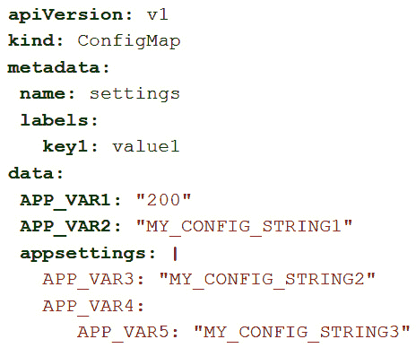
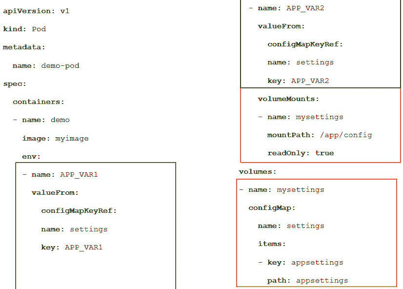
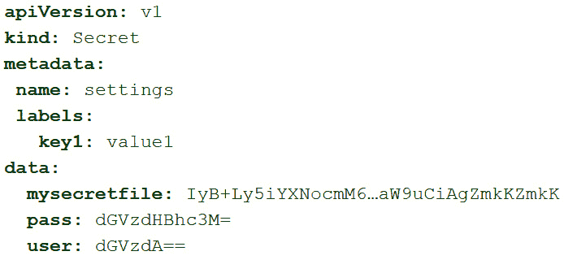
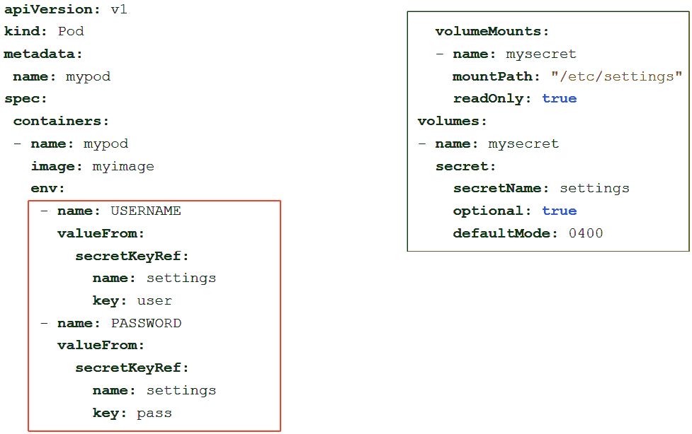
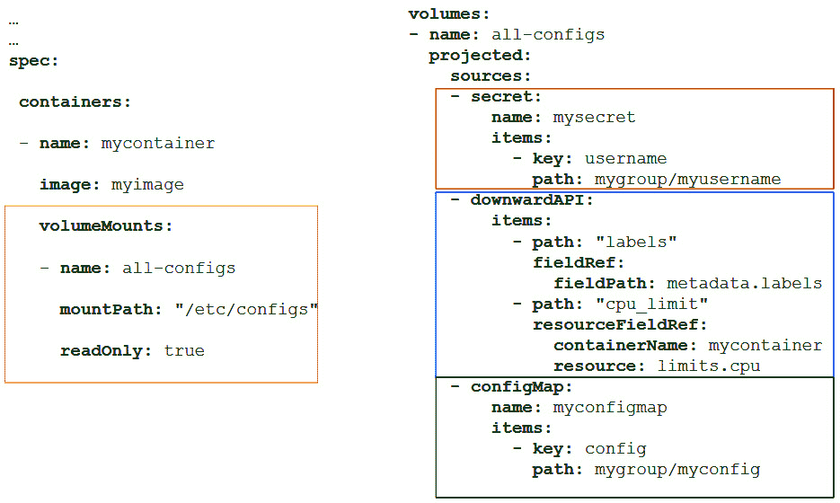
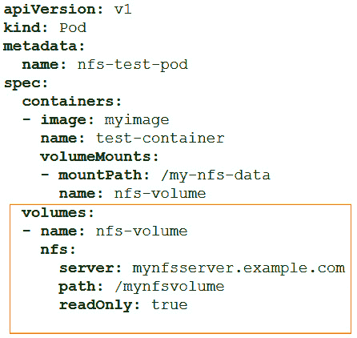
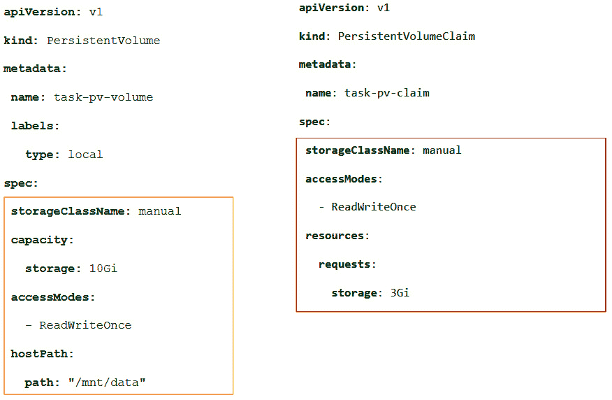
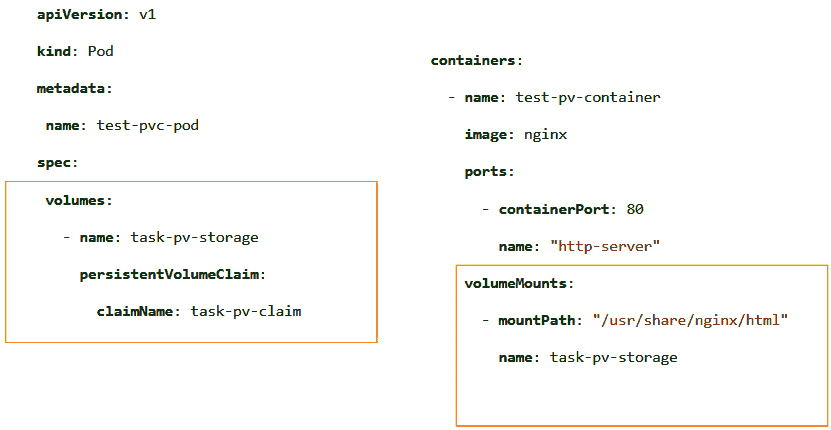
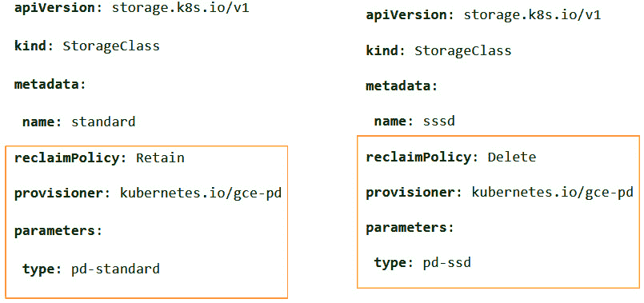
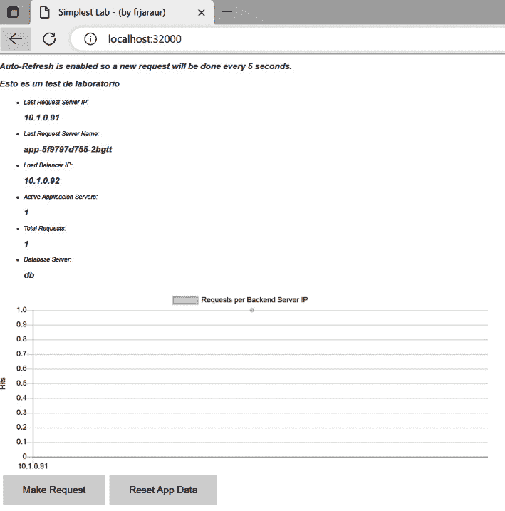

# 10

# 在 Kubernetes 中利用应用程序数据管理

在 Kubernetes 中部署应用程序有助于通过使用副本实例来管理弹性、**高可用性** (**HA**) 和可扩展性。但如果不了解应用程序的实际工作方式以及如何管理其数据，这些功能都无法使用。本章中，我们将回顾如何创建和管理 **Secrets**、**ConfigMaps** 和不同的 **volume** 选项。虽然 Secret 和 ConfigMap 资源将用于在容器内集成不同的身份验证选项，但卷用于管理应用程序的数据，正如我们在 *第八章*中简要介绍的内容，*使用 Kubernetes 编排器部署应用程序*。应用程序可以是有状态的、无状态的，或像通常情况那样是两者的组合。本章将介绍管理数据的不同选项，并将其与应用程序生命周期分开。

本章回顾了以下主要概念：

+   理解应用程序中的数据

+   使用 ConfigMaps 应用配置

+   使用 Secret 资源管理敏感数据

+   管理无状态和有状态数据

+   使用 **PersistentVolume** (**PV**) 资源增强 Kubernetes 中的存储管理

# 技术要求

您可以在 [`github.com/PacktPublishing/Containers-for-Developers-Handbook/tree/main/Chapter10`](https://github.com/PacktPublishing/Containers-for-Developers-Handbook/tree/main/Chapter10) 找到本章的实验，其中包含了一些在章节内容中省略的详细说明，目的是为了更容易跟随。您可以在 [`packt.link/JdOIY`](https://packt.link/JdOIY) 找到本章的 *Code In Action* 视频。

由于您应用程序所使用的数据非常重要，我们将首先回顾在 Kubernetes 中可以使用的不同选项和资源。

# 理解应用程序中的数据

**微服务架构**通过将功能分布到不同的模块中来提高应用程序的性能和弹性，这使得我们能够对其进行横向扩展或缩减，并在某些组件故障时继续提供部分功能。但功能的分布意味着与每个组件相关的数据也会分布，并在多个组件需要时共享它。还需要理解的是，应用程序必须允许在不破坏数据的情况下进行扩展，以防多个副本同时访问相同的数据。将应用程序组件作为容器运行将帮助我们分布进程，保持每个副本中相同的数据内容，并快速启动和停止进程。容器运行时将定义的卷附加到容器，但它不管理应用程序的逻辑。这就是为什么在准备应用程序在容器编排环境中运行时，理解数据如何使用是至关重要的。

容器编排器将为你提供将配置注入容器的机制，并保持这些配置在所有容器副本中同步。这些配置可以作为容器中的文件或环境变量使用。你必须明白，如果你的应用程序使用明文配置，在攻击者进入容器后，你将无法保护它们。这种情况始终存在，即使你在将配置注入容器之前加密它们。如果你的代码以明文方式读取配置内容，它始终是可以访问的，因为权限足够允许你的进程读取配置，并且容器将使用主进程用户来附加任何新进程（通过`docker exec`或`kubectl exec`）。如果你使用环境变量，任何在容器内运行的进程都能轻松读取它们。但这些并不意味着你的信息在容器内部不安全。不同的机制，如 RBAC，允许我们限制从编排平台对容器的访问，但访问集群节点将覆盖平台的安全性。你永远不应该从集群节点执行命令。你的容器编排器管理员可能会为你提供一个完整的**持续部署**（**CD**）解决方案，或者你也可以使用平台客户端（命令行或图形界面）来访问。

向应用程序的容器注入数据可以通过以下任何机制实现：

+   `arguments` 是任何 Pod 资源的关键。你永远不应通过这种方法传递敏感数据。

+   **环境变量**：使用环境变量包含信息是很常见的做法。一些编程语言甚至有标准化的命名法来直接操作变量；无论如何，您的应用程序必须准备好使用它们。在包括敏感数据时，也应该避免这种方法，除非它与 Secret 资源结合使用，正如我们将在下一节中学习到的。

+   **ConfigMaps**：这些资源是将配置添加到我们的工作负载中的最佳选择。我们可以使用它们将文件添加到容器内部，确保它们在任何节点上运行实例时都能可用。容器编排工具将管理并同步其内容的任何更改。它们也可以用于设置一些带有值的变量，并将它们用作环境变量。

+   **Secrets**：Secret 资源是管理 Kubernetes 或 Docker Swarm 平台中敏感数据的合适方法。然而，它们在每个平台中封装的方式存在很大差异。Docker Swarm 对其内容进行加密，且我们甚至无法检索其内容，而 Kubernetes 使用 Base64 格式在集群中存储内容。可以启用加密来保护在 etcd 中存储的 Secret 资源，但默认情况下是未启用的。这只会影响 etcd 数据库，而正常用户不应能访问该数据库，但如果您对存储在 Secret 资源中的数据感到担忧，可以向您的 Kubernetes 管理员询问相关配置。使用 Secret 资源来添加敏感文件（如密码、身份验证令牌、证书，甚至是容器镜像注册表连接字符串）或将变量呈现给容器是非常常见的做法。

+   **Volumes**：Volumes 不是用来注入数据的，而是用来在容器执行期间存储数据的。它们可以是短暂的或持久的，用于在执行之间持久化数据。在 Kubernetes 中，我们将 Volumes 视为集成到 Kubernetes 平台代码中的存储资源。许多云存储解决方案从 Kubernetes 开发之初就已集成，因为它是设计的一部分，尽管也可以使用主机绑定挂载、临时目录、NFS 和其他本地解决方案。ConfigMap 和 Secret 资源也属于 Volumes，但由于它们的内容不同，我们会对它们进行不同的处理。

+   **向下 API**：尽管向下 API 被认为是一个 Volume 资源，但由于其使用方式，我们可以将其视为完全不同的概念。您可以通过使用向下 API 挂载来自当前命名空间资源的元数据，以便在应用程序中使用，向下 API 会自动管理向 Kubernetes API 发出的必要请求来获取这些信息。

+   **PVs**: PV 是由 Kubernetes 管理员提供的存储，用于满足应用组件的 **PersistentVolumeClaim** (**PVC**) 资源的存储需求。每当创建 PVC 资源时，如果存在符合所需大小和属性的空闲 PV 资源，则会将其绑定。

重要提示

还存在 **Projected Volumes** 的概念，这是容器内同一目录中集成的不同卷的特定映射。此功能允许我们在同一目录中定位 Secret 和 ConfigMap 资源。

我们将学习如何通过使用 ConfigMaps 来包含非敏感信息，将数据注入并在容器内使用。

# 使用 ConfigMaps 应用配置

在本节中，我们将学习如何使用 ConfigMap 资源，在容器内挂载文件或作为环境变量，并为我们应用的进程呈现信息。

ConfigMap 资源的内容存储在 Kubernetes 的 etcd 键值存储中。因此，内容大小不能超过 1 MB。这些资源的清单没有 `spec` 部分。相反，我们可以使用 `data` 或 `binaryData`（用于 Base64 内容）键来定义内容。以下截图显示了一个 ConfigMap 清单示例：



图 10.1 – ConfigMap 资源清单

在所示的截图中的代码中，我们声明了两种类型的配置。`APP_VAR1` 和 `APP_VAR2` 以键值对的形式定义，而 `appsettings` 部分定义了一个完整的配置文件，可以被挂载。请注意，管道符号 (`|`) 用于定义 `appsettings` 键。这允许我们将所有后续内容包含为键的值。在编写 YAML 文件时务必注意缩进，以避免文件内容出现问题。

让我们看看如何在 Pod 中使用这些配置：



图 10.2 – 使用 ConfigMap 资源的 Pod 资源清单

在前面截图中显示的 Pod 清单中，我们展示了两种使用 ConfigMap 资源中声明信息的机制。我们使用了 `settings` ConfigMap 中的键值对作为环境变量。但是 `settings` ConfigMap 中 `appsettings` 键的内容被作为 `demo` 容器中的一个卷展示。在这种情况下，将创建一个 `/app/config/appsettings` 文件，其内容来自 `appsettings` 键。请注意，我们使用 `ReadOnly` 键来定义挂载的文件不可写。

在这个例子中，我们没有使用最简单的挂载配置文件的机制。让我们看看如何简单地添加一个完整的配置文件，使用`kubectl create configmap <CONFIGMAP_NAME> --from-file=<CONFIGURATION_FILE>`创建。我们将以`appsettings.json`文件为例，文件内容可以是任何内容，且是使用`kubectl create cm` `appsettings –from-file=appsettings.json`创建的：

```
apiVersion: v1
kind: Pod
metadata:
  name: mypod
spec:
  containers:
  - name: mypod
    image: myregistry/myimage
    volumeMounts:
    - name: config
      mountPath: "/app/config/appsettings.json"
      subPath: appsettings.json
      readOnly: true
  volumes:
  - name: config
    configMap:
      name: appsettings
```

在这种情况下，我们使用了`subPath`键来设置配置文件的文件名和完整路径。

配置文件可以随时更新，除非我们使用了`immutable`键（默认为`false`），在这种情况下，我们需要重新创建资源。要修改内容或任何允许的键（使用`kubectl explain configmap`查看），我们可以使用以下任意方法：

+   使用`kubectl edit`在线编辑并修改其值。

+   通过使用`kubectl patch`修补文件（[`kubernetes.io/docs/tasks/manage-kubernetes-objects/update-api-object-kubectl-patch`](https://kubernetes.io/docs/tasks/manage-kubernetes-objects/update-api-object-kubectl-patch)）。

+   通过使用`kubectl replace –f <MANIFEST_FILE>`替换资源文件。这是首选方法，因为所有更改都可以通过存储清单文件来追踪（使用**GitOps**方法论，正如我们将在*第十三章*中学习的，*管理应用生命周期*）。

配置映射资源将会在正在运行的工作负载中更新，除非它们的值作为环境变量被使用，或者通过`subPath`键挂载到容器中，在这种情况下将不会更新。非常重要的是理解 Kubernetes 如何在应用工作负载中管理更新。即使配置被更新，也取决于你的应用如何使用它、何时加载以及这些更改如何影响容器进程。如果你的进程只在启动时读取配置，那么你需要重新创建应用的 Pods。因此，确保新配置生效的唯一方法是重新创建容器。根据你为配置使用的工作负载，你只需要删除或缩放资源，以便使配置更改生效。

重要提示

我们可以使用`kubectl create cm <CONFIGMAP_NAME> --from-literal=KEY=VALUE`直接创建包含键值对的配置映射资源。

我们可以将注解添加到 ConfigMap 资源中，并更新它们以触发工作负载的更新。这将确保您的 Pods 会被重新创建，从而 ConfigMap 会立即更新。默认情况下，当 ConfigMap 被更新时，Kubernetes 会定期更新使用此配置的 Pods 中的内容。如果您使用 `subPath` 键挂载内容，则此自动更新机制不起作用。然而，请注意，更新文件内容并不意味着更新您的应用程序；它取决于应用程序的工作方式以及配置刷新频率。

Kubernetes 还允许我们在运行时将信息包含在 Pods 中。我们将使用向下 API 将 Kubernetes 数据注入 Pods，相关内容将在下一节中学习。

## 使用向下 API 注入配置数据

我们将使用向下 API 挂载端点来注入关于当前 Pod 资源的信息。通过这种方式，我们可以导入诸如 Pod 名称（`metadata.name`）、注解、标签和服务账户等信息。例如，可以通过环境变量传递信息或将其挂载为卷文件。

假设一个 Pod 拥有以下注解：

```
...
metadata:
  annotations:
    environment: development
    cluster: cluster1
    location: Berlin
...
```

我们可以通过卷定义和其中的 `mountPath` 参数将此信息挂载到 Pod 的容器中：

```
...
  containers:
  ...
    volumeMounts:
        - name: podinfo
          mountPath: /etc/pod-annotations
  volumes:
    - name: podinfo
      downwardAPI:
        items:
          - path: "annotations"
            fieldRef:
              fieldPath: metadata.annotations
...
```

请注意，我们正在将注解注入到 `/etc/pod-annotations` 文件中。我们可以使用静态数据（手动添加）或动态信息（从 Kubernetes 中获取）。

接下来，我们来看一下如何通过使用 Secrets 来包含敏感数据。

# 使用 Secret 资源管理敏感数据

我们应始终避免将敏感信息添加到应用镜像中。密码、连接字符串、令牌、证书或许可证信息都不应写入容器镜像中；所有这些内容必须在运行时包含。因此，代替使用以明文存储的 ConfigMap 资源，我们将使用 Secrets。Kubernetes Secret 资源内容采用 `base64` 格式描述。它们并未加密，任何有权限访问的人都可以读取其数据。这包括任何可以在同一命名空间中创建 Pod 的用户，因为 Secret 可以被包含并因此被读取。只有适当的 RBAC 资源访问权限才能确保 Secret 的安全。因此，重要的是要理解，应该通过适当的 Kubernetes **角色**和 **角色绑定**（Kubernetes RBAC）来避免访问您的 Secret 资源。此外，默认情况下，Kubernetes 不会加密 etcd 中的 Secrets，因此不应允许在文件系统级别访问键值数据文件。Secrets 是命名空间级资源，因此我们能够在命名空间级别管理 Kubernetes 访问权限。Kubernetes 管理员应确保在集群级别的适当访问。

我们将使用 Secret 资源作为 **卷**（呈现文件，如证书或令牌）、**环境变量**（当查看在线 Pod 资源清单时，内容被隐藏）或作为 **认证** 来访问远程注册表（本地或云服务）。

我们可以使用 `kubectl create secret generic <SECRET_NAME> --from-file=<SENSITIVE_DATA_FILE>` 或 `kubectl create secret generic <SECRET_NAME> --from-literal=SECRET_VARIABLE_NAME=SECRET_VALUE`。`--from-file` 或 `--from-literal` 参数可以多次使用，以添加多个数据键。可以创建以下类型的 Secret 资源：

+   `generic`：这是最常见的类型，可以用于包含任何敏感文件或值。

+   `tls`：这表示包含其内容的 `SSL_CERT_FILE` 变量，或者在配置中使用关联的 `.cert` 和 `.key` 文件。

+   `docker-registry`：这些资源可以包含 `dockercfg` 或 `dockerconfigjson` 内容。它们将用于配置从注册表拉取镜像的配置文件。

默认情况下，Kubernetes 为每个服务帐户自动创建一个 Secret。这些 Secret 资源包含一个关联的令牌，可用于从应用程序组件与 Kubernetes API 交互。此令牌用于对您的进程进行认证和授权。

如果您的 Kubernetes 管理员配置了与您应用程序的命名空间相关联的 **ResourceQuota** 资源，请向他们询问，因为像许多其他资源一样，Secret 也可能会受到数量限制。因此，在创建大量 Secret 时，您可能会受到限制，并且需要考虑包含的信息。Secret 内容的大小也限制为 1 MB，这通常足够用于传递敏感配置。如果需要更多空间，您可能需要使用适当的 Volumes 或 PVs。

让我们来看一个快速示例。我们使用 `kubectl create secret settings --from-literal=user=test --from-literal=pass=testpass --from-file=mysecretfile --dry-run=client -o yaml` 来生成以下 Secret 清单：



图 10.3 – Secret 清单

我们现在将使用 Pod 中的 Secret 值作为环境变量，并作为卷进行挂载：



图 10.4 – Secret 资源使用示例

在前面的截图中，我们使用了 `user` 和 `pass` 两次。首先，我们将它们的值作为环境变量添加，但我们也将它们作为卷挂载到 `/etc/settings` 中。在此示例中，创建了三个文件：`/etc/settings/user`、`/etc/settings/pass` 和 `/etc/settings/mysecretfile`。每个文件的内容在 Secret 中进行了定义。请注意，我们使用 `defaultMode` 键定义了文件权限，并且我们将卷挂载为只读模式。如果我们仅需将 Secret 挂载为文件，并且需要此文件位于特定路径下，我们使用 `subPath` 键定义文件的名称。例如，如果我们使用 `kubectl create secret generic example --from-file=mysecretfile`，我们可以按如下方式挂载它：

```
   volumeMounts:
   - name: mysecret
     mountPath: "/etc/settings/mysecretfile"
     subPath: mysecretfile
```

我们永远不会将 Secret 文件清单以明文形式存储在代码库中。在上传之前，你可以使用任何第三方工具加密其内容。另一方面，更好的解决方案可能是像 `SealedSecret` 这样的工具，它会为你生成 Secret。在 `SealedSecret` 清单中，数据是加密的，你可以在代码库中管理它而不会遇到任何问题。`SealedSecret` 实体在 Kubernetes 集群内工作，因此只有你的 `SealedSecret` 实例能够解密你的数据（通过证书交换加密）。你的数据将安全加密，并且在需要时会自动解密。

你可以使用更复杂的解决方案，如 **Hashicorp 的 Vault** 来管理 Kubernetes Secret 资源。这个解决方案提供了许多功能，可以帮助你管理多个平台的敏感数据，不仅仅是 Kubernetes，但如果你计划在高可用环境中使用它，可能需要大量的硬件资源和管理。

云服务提供商有自己的软件工具，用于在 Kubernetes 集群上部署敏感数据。它们提供与云 **身份与访问管理** (**IAM**) 的不同访问控制集成，如果你计划使用云平台进行生产环境部署，这可能是更好的解决方案。在部署 Secrets 到你的环境中时，向 Kubernetes 管理员询问最佳解决方案总是很有帮助的。

**投影卷**允许我们将多个资源（仅 Secrets、ConfigMaps、向下 API 或 ServiceAccount 令牌允许）挂载到容器的目录中。以下示例展示了如何挂载一个 Secret、一个容器规格和一个 ConfigMap 资源：



图 10.5 – 投影卷示例

现在我们已经了解了如何使用 Kubernetes 资源集群范围内注入配置和敏感数据，我们将继续审查如何存储来自应用程序的数据。我们将从卷开始，卷是 Kubernetes 核心中包含的存储解决方案。

# 管理无状态和有状态数据

当我们考虑存储应用程序的数据时，我们必须考虑数据是否应该持久化，还是临时的。如果数据在 Pod 重新创建时必须持久化，我们必须考虑到数据应该在整个集群范围内可用，因为容器可能在任何工作节点上运行。Kubernetes 不存储容器的状态。如果您的应用程序通过使用文件管理其状态，您可以使用卷，但如果不可能这样做——例如，因为多个实例同时工作——我们应该实现一种机制，例如数据库来存储其状态，并使其对所有实例可用。

存储可以是基于文件系统、基于块或基于对象。这也适用于 Kubernetes 数据卷，因此在深入了解 Kubernetes 为卷提供不同解决方案之前，让我们快速回顾一下这些存储类型概念：

+   **基于文件系统的存储**：当我们使用基于文件系统的存储（或文件存储）时，我们通过将所有数据保存在本地或远程操作系统提供的文件和子文件夹的分层结构中来管理它。我们使用访问控制列表来决定用户是否能够读取或修改文件的内容。

    文件系统非常常见且易于使用。我们每天都在工作站上本地使用它们，或通过 NAS、**通用 Internet 文件系统**（**CIFS**）甚至云特定的解决方案远程使用它们。对于有限数量和有限大小的文件，文件系统存储效果很好，但对于大文件可能存在问题。在这些解决方案中，文件被索引化，这限制了当我们有大量文件时的使用。它也不易扩展，并且在多个进程远程访问同一文件时难以管理文件锁，尽管它对本地存储非常有效。

+   **块存储**：块存储（或块设备）通过将数据分割成指定大小的小块，这些小块可以分布在不同的物理本地设备上来使用。块设备可以在本地或远程（SAN 或甚至云提供的解决方案）使用，并且可以直接使用或使用不同的文件系统选项格式化，这取决于底层操作系统。此存储解决方案比文件系统更快，并且可以通过使用分布式设备实现高可用性和韧性。但冗余性不便宜，因为它基于块的复制。应用程序必须准备好使用块设备，并且块存储不常用，因为它在很大程度上依赖于基础架构。它非常适合虚拟化和为其准备的数据库解决方案。

+   **对象存储**：对象存储是一种解决方案，它将数据划分为单独的单元，这些单元存储在底层存储后端（块设备或文件系统）中。我们可以使用分布式后端，从而提高容错性和高可用性。文件通过 ID 唯一标识，使用 ACL 管理数据访问变得更加容易。它还提供冗余和版本控制。最初它是为云提供商的发布存储开发的，但现在在数据中心中也非常普遍。它通常通过 REST API（HTTP/HTTPS）进行访问，这使得它可以轻松地集成到我们的应用程序中。如今，许多备份解决方案已经为对象存储后端做好了准备，因为它们适合存储大文件和大量数据项。

Kubernetes 包括一些驱动程序，允许我们将经过审核的存储解决方案挂载为卷，但我们将使用 PVC 资源以获得更先进的效果。

## 使用卷来存储数据

在 Kubernetes 中，卷通过将其定义添加到 `.spec.volumes` 键来使用。Kubernetes 支持不同类型的卷，Pod 资源可以同时使用任意数量的卷类型。我们有临时（或短暂的）卷，这些卷只会在 Pod 执行期间存在，而数据可以通过非短暂卷来持久化。与 Pod 关联的所有卷可以挂载到所有容器内运行的任何挂载点（来自容器文件系统的目录）。使用这些卷，我们可以持久化应用程序的数据。

虽然 `.spec.volumes` 键允许我们定义要包含在 Pod 挂载命名空间中的卷，但我们将使用 `.spec.containers[*].volumeMounts` 来定义每个容器如何以及在哪里使用这些卷。

让我们回顾一下几种最流行的卷类型：

+   `emptyDir`：`emptyDir` 定义要求 kubelet 组件在主机上创建一个空的临时目录，该目录将跟随关联容器的生命周期。当 Pod 被删除时，容器释放该存储，kubelet 将其删除。默认情况下，`emptyDir` 类型的卷会在主机的文件系统上创建，但可以使用 `medium` 子键定义存储应创建的位置。通过使用 `sizeLimit` 键，也可以限制其大小。需要注意的是，这些卷是在主机上创建的，因此必须小心其内容和大小。例如，永远不要使用它们来存储无限量的日志。并且要记住，一旦 Pod 被删除或重新创建，它们将被移除。

+   `hostPath`：这些卷允许我们将定义的主机存储包含在 Pod 中。这是一个重要的安全隐患，除非你的应用需要监控或修改主机的文件，否则必须避免使用。通过设置`type`键，可以使用不同类型的`hostPath`卷。默认情况下，如果 Pod 启动时目录不存在，它将被创建，但我们也可以创建或使用特定的文件、套接字、块设备，甚至特殊类型的文件。由于`hostPath`卷应受到限制，因此你必须将其使用情况告知 Kubernetes 管理员。

+   `iscsi`：如果你已经在使用`hostPath`。目前，使用`iscsi`卷并不常见，因为它要求所有工作节点完全相同（所有集群主机中的磁盘设备名称必须完全相同）。你可以使用节点标签指定工作负载的运行位置，但这使得它们对底层基础设施过于固定。

+   `nfs`：NFS 卷类型允许我们在 Pod 中包含远程 NFS 文件系统。除非你从 Pod 的进程中移除它，否则挂载的文件系统内容会被保持。我们指定服务器和暴露的路径，并可以通过将`readOnly`键设置为`true`来以只读模式挂载它。下图展示了一个快速示例，显示了所需的键：



图 10.6 – 展示在 Pod 中挂载 NFS 卷的清单

+   `PersistentVolumeClaim`：这是最先进的卷定义，需要一个完整的章节来描述其使用方式。我们将在下一小节学习如何使用它们。

+   `ephemeral`：这些卷可以被认为类似于`emptyDir`，因为它们旨在提供在 Pod 运行期间的临时存储，但它们的不同之处在于我们可以将 PVC 资源作为临时卷或本地存储进行集成。当卷挂载到 Pod 时，它们可以是空的，也可以已经包含一些内容。

很多云提供商的卷已经从基于 Kubernetes 核心的存储转向使用外部 PV 动态供应器的现代 PVC 管理。将存储供应从 Kubernetes 代码中拆分出来，使硬件存储制造商、云提供商和中间件软件开发者能够准备自己的解决方案，并将其发展到 Kubernetes 开发周期之外。我们现在将学习 PV 和 PVC 资源如何帮助我们改善 Kubernetes 中的存储管理。

# 在 Kubernetes 中通过 PV 资源增强存储管理

PV 资源表示可以在 Kubernetes 中使用的存储单元。PV 可以通过存储提供后端手动或动态创建。

到目前为止看到的卷定义是命名空间级别的，而 PV 资源是由 Kubernetes 管理员在集群级别定义的。我们使用它们来定义存储容量（大小），使用`capacity.storage`键，并定义它的访问模式，使用`accessMode`键。让我们快速回顾这些模式，因为我们的应用可能需要特定的数据访问，特别是当我们运行多个副本进程时：

+   `ReadWriteOnce`：此模式仅为第一个附加该存储的 Pod 提供写模式。其他 Pod（无论是副本还是定义在其他不同工作负载中的 Pod）只能对数据进行读取访问。

+   `ReadOnlyMany`：在此模式下，所有 Pod 将以只读模式挂载卷。

+   `ReadWriteMany`：当在不同 Pod 中运行的进程需要同时写入 PV 时，使用此选项。您必须确保应用程序管理写数据时的锁，以避免数据损坏。

您需要注意的是，`accessMode`并不会在卷挂载后强制执行写保护。如果您需要确保某些 Pod 挂载时是只读模式，必须使用`readOnly`键。

在 PV 资源中可以定义多个访问模式，但在挂载时仅使用其中一种。这有助于集群绑定 PV，但它将根据每个卷请求的规格来适配。

重要提示

此模式还会影响应用程序的更新方式，特别是在发起滚动更新时。默认情况下，Deployment 资源会在旧 Pod 停止之前先启动新 Pod 实例，以保持应用程序的运行。但是，`ReadWriteOnce`访问模式只允许旧 Pod 访问存储，而新 Pod 则会永远等待挂载。在这种情况下，可能需要改变默认的滚动更新行为，以确保旧进程完全停止并释放卷，之后新进程再开始使用附加的存储。

为了使用可用的 PV，我们将使用 PVC 资源，可以将其视为对存储的请求。这些资源是命名空间级别定义的，因为它们将被我们的工作负载使用。作为开发人员，您将为应用程序请求存储，定义一个带有所需`capacity.storage`和`accessMode`键的 PVC。当这两个选项与已创建并空闲的 PV 资源匹配时，它们会绑定，并且存储将附加到 Pod 上。实际上，卷会附加到运行 Pod 的主机上，kubelet 会使其在 Pod 内可用。

可以使用标签通过`selector.matchLabels`和适当的标签来固定 PVC 和 PV 的子集。以下截图展示了一个作为本地`hostPath`变量创建的`PersistentVolume`示例：



图 10.7 – PV 和 PVC 清单

如果创建了 PVC，但没有可用的 PV 满足 PVC 的定义要求，它将永远保持未绑定状态，等待创建或释放一个 PV 在 Kubernetes 集群中。

当一个 Pod 使用 PVC 并且绑定到 PV 时，在 Pod 释放它并删除 Pod 之前，存储不能被移除。以下截图展示了一个 Pod 如何使用 PVC：



图 10.8 – 使用与 PV 关联的 PVC 的 Pod 清单

如果底层文件系统是 `xfs`、`ext3` 或 `ext4`，则可以调整 PV 的大小。根据存储后端，我们可以克隆 PV 内容，甚至创建快照，这对于调试应用程序出现问题时的数据集，或进行备份可能非常有用。

节点亲和性可以用于将特定的集群节点与特定目录或甚至磁盘设备一起使用，并将 PV 挂载到该目录所在的节点。作为开发人员，除非您的 Kubernetes 管理员要求您使用此功能，否则应避免使用节点亲和性，因为它会使您的工作负载依赖于基础设施。

PV 可以由您的 Kubernetes 管理员手动配置，也可以通过动态方式配置，使用与存储后端交互的容器存储接口集成解决方案来为您创建卷。多个存储解决方案可以在您的集群中共存，这些解决方案可能提供不同的存储能力。无论您的平台使用动态配置还是手动创建卷，我们都可能访问更快的后端、更具韧性的后端，或者具有特定管理功能的后端。

重要提示

重要的是要理解，将 PVC 与合适的 PV 匹配可能会导致磁盘空间的浪费。当 PVC 请求 5 Gi 而可用的 PV 大小为 10 Gi 时，它们会被绑定，尽管它们的大小不匹配。这意味着我们只会使用可用空间的 50%。这就是动态配置如此重要的原因，因为它创建与所需大小完全匹配的 PV，然后它们会被绑定，从而数据完美地适配到配置的存储中。

我们将使用 StorageClass 资源按能力对 PV 进行分类。Kubernetes 管理员将把创建的 PV 资源与任何已配置的 StorageClass 资源关联。可以定义默认的 StorageClass 来关联所有没有 `spec.storageClassName` 键的 PV。每当我们创建 PVC 资源时，我们可以定义一个特定的 StorageClass，或者等待集群从默认的 StorageClass 为我们的声明分配一个 PV。

现在我们了解了存储管理的基本概念，我们可以快速查看存储的配置和退役过程。

## 存储的配置和退役

Kubernetes 不管理如何在存储后端创建或销毁 PV。它只是通过 REST API 与它们的接口交互，以检索和跟踪存储的变化和状态。

**动态配置** 需要一些 Kubernetes 管理工作。Kubernetes 管理员将部署 **容器存储接口**（**CSI**）解决方案，并将它们附加到特定的 StorageClass 资源，使用户能够使用它们。每个 StorageClass 资源都有自己调用提供者的参数，因此将根据使用的机制创建不同的 PV 资源。

以下截图显示了两个 StorageClass 资源，使用 `kubernetes.io/gce-pd` API 端点来创建标准和 SSD（快速硬盘）PV：



图 10.9 – 标准存储和 SSD 存储的 StorageClass 清单

注意 `reclaimPolicy` 键，它管理当 Pod 释放一个 PV 并且该 PV 被重新使用时，提供者的行为：

+   `Retain` 策略不会修改 PV 中的内容，因此当数据不再需要时，我们需要手动从提供者后台移除该 PV。

+   `Recycle` 策略基本上会删除卷中的所有内容（例如，通过从挂载 PV 的 Pod 发出 `rm -rf /volumedata/*` 命令）。这仅在 NFS 和 `hostPath` 提供者中受支持。

+   `Delete` 策略将完全删除 PV 及其内容，通过请求提供者 API 删除关联的卷。

重要提示

使用 PV 和 PVC 资源可以让我们准备好应用程序的工作负载，使其能够在任何 Kubernetes 基础设施上运行。我们只需修改 `StorageClassName` 来适应部署平台上现有的任何 StorageClass。

我们现在将回顾一些实验，以帮助我们更好地理解本章的某些内容。

# 实验

在本节中，我们将使用一些已呈现的资源来改进我们的 `simplestlab` 应用程序。我们将在 Secret 资源中包含敏感数据，在 ConfigMap 资源中包含 NGINX 配置，并通过 StorageClass 资源实现一个 PV 资源和一个 PVC 资源，为我们的 StatefulSet 资源提供存储。

本书的所有实验代码可以在其 GitHub 仓库中找到，链接为 [`github.com/PacktPublishing/Containers-for-Developers-Handbook.git`](https://github.com/PacktPublishing/Containers-for-Developers-Handbook.git)。通过执行 `git clone https://github.com/PacktPublishing/Containers-for-Developers-Handbook.git` 下载所有内容，或者如果你已经下载了仓库，则执行 `git pull` 来确保你有最新的版本。所有清单文件和为 `simplestlab` 应用程序添加存储的步骤都位于 `Containers-for-Developers-Handbook/Chapter10` 目录下。

本节将向你展示如何在为 Kubernetes 准备的 `simplestlab` 第三层应用程序中实现不同的卷解决方案，详见 *第九章*，*实现* *架构模式*。

以下是您将在 *第十章* GitHub 仓库中找到的任务：

+   我们将通过为应用程序需要的任何敏感数据添加 Secret 资源来提高 `simplestlab` 应用程序的安全性。我们将审查每个应用程序组件，创建所需的 Secret 资源，并修改组件的清单以包含新创建的资源。这包括一些数据库组件所需的数据库初始化脚本。

+   我们还将为 `lb` 应用程序组件准备不同的 ConfigMap 资源，并验证这些更改如何影响应用程序行为。

您可以使用以下任一 Kubernetes 桌面环境：

+   Docker Desktop

+   Rancher Desktop

+   Minikube

这些实验可以在其中任何一个上运行，当然，也可以在任何其他 Kubernetes 环境中运行。您可能会遇到它们的默认存储类问题，但文件中有一些评论可以进行更改。我们将从改进 `simplestlab` 应用程序在 Kubernetes 上的部署开始：

1.  `simplestlab` 应用程序是一个非常简单的三级应用程序（负载均衡器可以呈现额外的静态内容，但为了实验目的没有添加）。为了提高安全性，我们将为所有所需的用户身份验证添加 Secret 资源。

    该应用由三个组件组成：

    +   一个 `db` 组件：Postgres 数据库

    +   一个 `app` 组件：Node.js 后端应用

    +   一个 `lb` 组件：NGINX 前端静态内容

    我们在它们的清单中包括了本章中学习的一些存储解决方案。

1.  让我们首先看看数据库组件。由于我们已经使用了 StatefulSet 资源，已配置 PVC 资源，但数据库容器中以明文形式呈现了 `postgres` 用户密码。我们添加了一个 Secret 资源来包含此密码，并且我们还包括了一个完整的数据库初始化脚本，它将帮助我们准备数据库。在之前的实验中，此组件是通过容器镜像中包含的脚本初始化的。在这种情况下，我们可以通过修改此脚本并替换 Secret 来管理应用程序的数据库创建。您必须知道，我们无法使用此机制来修改先前已初始化的数据库。这就是我们预期从头开始部署此组件的原因。

    这是创建的两个 Secret 清单：

    +   `dbcredentials.secret.yaml`，其内容如下所示：

        ```
        apiVersion: v1
        data:
          POSTGRES_PASSWORD: Y2hhbmdlbWU=
        kind: Secret
        metadata:
          name: dbcredentials
        ```

    +   `initdb.secret.yaml`：此 Secret 是通过包含 `init-demo.sh` 脚本的内容创建的：

        ```
        $ cat init-demo.sh
        #!/bin/bash
        set -e
        psql -v ON_ERROR_STOP=1 --username "$POSTGRES_USER" <<-EOSQL
            CREATE USER demo with PASSWORD 'd3m0' ;
            CREATE DATABASE demo owner demo;
            GRANT ALL PRIVILEGES ON DATABASE demo TO demo;
            \connect demo;
            CREATE TABLE IF NOT EXISTS hits
            (
              hitid serial,
              serverip varchar(15) NOT NULL,
              clientip varchar(15) NOT NULL,
              date timestamp without time zone,
              PRIMARY KEY (hitid)
            );
            ALTER TABLE hits OWNER TO demo;
        initdb.secret.yaml Secret manifest:

        ```

        $ kubectl create secret generic initdb \

        --from-file=init-demo.sh --dry-run=client \

        -o yaml |tee initdb.secret.yaml

        apiVersion: v1

        data:

        init-demo.sh: IyEvYmluL2Jhc2gKc2V0IC1lCgpwc3FsIC12IE9OX0VSUk9SX1NUT1A9MSAt....pZCkKICAgICk7CiAgICBBTFRFUiBUQUJMRSBoaXRzIE9XTkVSIFRPIGRlbW87CkVPU1FMCg==

        kind: Secret

        metadata:

        creationTimestamp: null

        name: initdb

        ```

        ```

    +   在这两种情况下，值都以 Base64 格式编码。它们没有加密，我们可以验证：

        ```
        $ kubectl apply -f dbcredentials.secret.yaml
        $ kubectl get secret dbcredentials \
        -ojsonpath="{.data.POSTGRES_PASSWORD}"|base64 -d
        StatefulSet manifest was modified:

        ```

        API 版本：apps/v1

        类型：StatefulSet

        元数据：

        名称：db

        标签：

        组件：db

        应用程序：simplestlab

        规格：

        副本：1

        ...

        卷：

        - 名称：initdb-secret

        密钥：

        secretName：initdb

        可选：true

        容器：

        - 名称：database

        镜像：docker.io/frjaraur/simplestdb:1.0

        ...

        环境：

        - 名称：POSTGRES_PASSWORD

        valueFrom：

        secretKeyRef：

        名称：dbcredentials

        键：POSTGRES_PASSWORD

        - 名称：PGDATA

        值：/data/postgres

        volumeMounts：

        - 名称：postgresdata

        mountPath: /data

        - 名称：initdb-secret

        mountPath: "/docker-entrypoint-initdb.d/"

        只读：true

        ...

        volumeClaimTemplates：

        - 元数据：

        名称：postgresdata

        规格：

        访问模式：[ "ReadWriteOnce" ]

        #storageClassName: "csi-hostpath-sc"

        资源：

        请求：

        存储：1Gi

        ```

        The full manifest file can be found in the `Chapter10/db.statefulset.yaml` file.
        ```

    +   我们创建了数据库的所有组件：

        ```
        $ kubectl create -f dbcredentials.secret.yaml \
        -f initdb.secret.yaml
        secret/dbcredentials created
        secret/initdb created
        $ kubectl create -f db.statefulset.yaml
        statefulset.apps/db created
        $ kubectl create -f db.service.yaml
        service/db created
        ```

        服务完全未修改。

    +   我们通过连接到数据库服务器并显示其用户来检查是否已创建用户：

        ```
        $ kubectl exec -ti db-0 -- psql -U postgres
        psql (15.3)
        Type "help" for help.
        postgres=# \du
                                           List of roles
         Role name |                         Attributes
        | Member of
        -----------+------------------------------------------------------------+-----------
         demo      |
        | {}
         postgres  | Superuser, Create role, Create DB, Replication, Bypass RLS | {}
        postgres=# \q
        POSTGRES_PASSWORD variable, and now it’s taken from the Secret we created.We also included `initdb-secre`t as a volume, and it’s mounted in the `/docker-entrypoint-initdb.d` directory. Notice that we didn’t use `subPath` because this directory is empty. You can change the content of the Secret and it will be synced inside the containers, but this will not change the authentication values in the database because it is an initialization script. You can modify it to enforce the change of the password via SQL.
        ```

    +   现在我们可以查看通过使用模板创建的 PVC（因为它是一个 StatefulSet）以及相关的 PV：

        ```
        $ kubectl get pvc
        NAME                STATUS   VOLUME
        CAPACITY   ACCESS MODES   STORAGECLASS   AGE
        postgresdata-db-0   Bound    pvc-4999f00b-deb3-4cec-97a0-3a289c4457d9   1Gi        RWO            hostpath
        168m
        $ kubectl get pv pvc-4999f00b-deb3-4cec-97a0-3a289c4457d9
        NAME                                       CAPACITY   ACCESS MODES   RECLAIM POLICY   STATUS   CLAIM      STORAGECLASS   REASON   AGE
        pvc-4999f00b-deb3-4cec-97a03a289c4457d9   1Gi        RWO  Delete     Bound    default/postgresdata-db-0   hostpath                168m
        ```

    +   在 Docker Desktop 中定义了一个 StorageClass 资源，并且我们默认使用它：

        ```
        $ kubectl get sc
        NAME                 PROVISIONER          RECLAIMPOLICY   VOLUMEBINDINGMODE   ALLOWVOLUMEEXPANSION   AGE
        appcredentials Secret. This method does not generate a YAML manifest, which may be a problem because you will need to store your passwords somewhere. If you need to store all your manifest in your code repository, which is always recommended, you must always encrypt your Secret manifests:

        ```

        $ kubectl create secret generic appcredentials \

        --from-literal=dbhost=db \

        --from-literal=dbname=demo \

        --from-literal=dbuser=demo \

        --from-literal=dbpasswd=d3m0

        secret/appcredentials 已创建

        ```

        The values for these variables must be the ones used in the initialization script.
        ```

    +   让我们审查包含在应用程序中加载数据库身份验证的更改：

        ```
        apiVersion: apps/v1
        kind: Deployment
        metadata:
          name: app
        ...
              containers:
              - name: app
                image: docker.io/frjaraur/simplestapp:1.0
                ports:
                - containerPort: 3000
                env:
                - name: dbhost
                  valueFrom:
                    secretKeyRef:
                      name: appcredentials
                      key: dbhost
                - name: dbname
                  valueFrom:
                    secretKeyRef:
                      name: appcredentials
                      key: dbname
        ...
        ```

        完整的清单文件可以在 `Chapter10/app.deployment.yaml` 文件中找到。

    +   我们刚刚从之前创建的 Secret 中包含了所有必需的环境变量。我们部署了应用程序清单：

        ```
        $ kubectl create -f app.deployment.yaml
        -f app.service.yaml
        deployment.apps/app created
        service/app created
        ```

        现在我们验证容器中包含的内容：

        ```
        $ kubectl exec -ti app-5f9797d755-2bgtt – env
        ...
        dbhost=db
        dbname=demo
        dbuser=demo
        dbpasswd=d3m0
        ...
        $ kubectl get pods
        NAME                   READY   STATUS    RESTARTS   AGE
        app-5f9797d755-2bgtt   1/1     Running   0          100s
        app-5f9797d755-gdpw7   1/1     Running   0          100s
        app-5f9797d755-rzkqz   1/1     Running   0          100s
        db-0                   1/1     Running   0          179m
        ```

    +   现在我们可以继续处理前端组件。在此应用程序部署的早期版本中，我们已经使用 ConfigMap 资源配置了 NGINX 负载均衡器。

        这是带有特殊配置的 ConfigMap 资源的内容，用于我们的 NGINX 负载均衡器：

        ```
        apiVersion: v1
        kind: ConfigMap
        metadata:
          name: lb-config
          labels:
            component: lb
            app: simplestlab
        data:
          nginx.conf: |
            user  nginx;
            worker_processes  auto;
            error_log  /tmp/nginx/error.log warn;
            pid        /tmp/nginx/nginx.pid;
            events {
              worker_connections  1024;
            }
            http {
              server {
                listen 8080; # specify a port higher than 1024 if running as non-root user
                location /healthz {
                    add_header Content-Type text/plain;
                    return 200 'OK';
                }
                location / {
                  proxy_pass http://app:3000;
                }
              }
            }
        ```

    +   我们部署所有的 `lb` 清单：

        ```
        $ kubectl create -f lb.daemonset.yaml \
        -f lb.configmap.yaml -f  lb.service.yaml
        daemonset.apps/lb created
        configmap/lb-config created
        service/lb create
        ```

    +   我们审查所有应用程序组件的状态和应用于 NGINX 组件的配置：

        ```
        $ kubectl get pods
        NAME                   READY   STATUS    RESTARTS   AGE
        app-5f9797d755-2bgtt   1/1     Running   0          5m52s
        app-5f9797d755-gdpw7   1/1     Running   0          5m52s
        app-5f9797d755-rzkqz   1/1     Running   0          5m52s
        db-0                   1/1     Running   0          3h4m
        lb-zcm6q               1/1     Running   0          2m2s
        $ kubectl exec lb-zcm6q -- cat /etc/nginx/nginx.conf
        user  nginx;
        worker_processes  auto;
        ...    location / {
              proxy_pass http://app:3000;
            }
          }
        }
        $
        ```

    +   现在，我们可以在任何 Kubernetes 集群主机的端口 32000 上访问我们的应用程序。您的浏览器应该访问该应用程序并显示类似以下内容（如果您使用 Docker Desktop，则需要使用 [`localhost:32000`](http://localhost:32000)）：



图 10.10 – simplestlab 应用程序 Web GUI

通过这一最后步骤，您完全部署了 `simplestlab` 应用程序的三个组件。在 GitHub 存储库的 `Chapter10` 文件夹中，您将找到额外的步骤以添加新的应用程序组件实例并修改负载均衡器组件以连接到此新后端。

这些实验将帮助您了解 Secret 资源如何提高应用程序的安全性，以及如何为不同的应用程序需求实现不同的卷类型。

# 摘要

在这一章中，我们回顾了如何在 Kubernetes 集群中管理数据，Kubernetes 目前是最流行的容器编排工具，你可能会在大多数项目中使用它。我们学习了如何在应用程序的容器中包含配置和敏感数据，以及如何使用不同的 Kubernetes 资源来管理无状态和有状态存储。在本章的最后，我们学习了如何为我们的应用程序使用动态数据卷配置，这非常适合微服务模型，在微服务中，自动化对底层基础设施的资源抽象至关重要。本章非常重要，因为它教会了你如何在微服务和基于容器的环境中管理数据。

我们将在下一章中继续讨论，在这一章中，我们将学习如何使用最佳安全实践发布我们的应用程序，隔离所有后台组件与用户和其他应用程序之间的关系。
