# 11

# 发布应用程序

在 Kubernetes 上运行应用程序通过将其进程作为容器运行，为应用程序的所有组件增加了弹性。这有助于我们提供稳定性，并在不影响用户的情况下更新这些组件。尽管 Kubernetes 提供了大量资源来简化应用程序的集群管理，但我们确实需要了解使用这些资源会如何影响我们的应用程序被用户访问的方式。

在本章中，我们将学习如何发布我们的应用程序，使其可供用户访问。这将涉及将某些 Pods 或容器发布以提供服务，但有时我们也可能需要调试应用程序以解决出现的问题。

到本章结束时，我们将了解 **NetworkPolicy 资源** 如何帮助我们隔离部署在集群中的工作负载，并回顾使用 **服务网格** 解决方案来提高应用程序组件之间的整体安全性。

本章将涵盖以下主题：

+   理解 Kubernetes 发布应用程序的集群范围特性

+   为调试代理和转发应用程序

+   使用主机网络命名空间发布应用程序

+   使用 Kubernetes 的 NodePort 特性发布应用程序

+   通过 LoadBalancer 服务提供对服务的访问

+   理解 Ingress 控制器

+   提高我们应用程序的安全性

本章将通过回顾 Kubernetes 开箱即用的不同选项，开始讲解如何将应用程序交付给用户。

# 技术要求

你可以在 [`github.com/PacktPublishing/Containers-for-Developers-Handbook/tree/main/Chapter11`](https://github.com/PacktPublishing/Containers-for-Developers-Handbook/tree/main/Chapter11) 找到本章的实验，其中包含一些扩展的解释，这些内容在章节内容中被省略，以便更容易跟随。本章的 *Code In Action* 视频可以在 [`packt.link/JdOIY`](https://packt.link/JdOIY) 找到。

# 理解 Kubernetes 发布应用程序的集群范围特性

Kubernetes 是一个容器编排器，允许用户在整个集群中运行其应用程序的工作负载。 我们在*第九章*，*实施架构模式*中回顾了使用不同 Kubernetes 资源部署应用程序时可以使用的不同模式。 Pod 是我们应用程序的最小部署单元，并且具有动态 IP 地址，因此我们无法将它们用于发布我们的应用程序。 动态性影响了所有组件的内部和外部暴露 - 虽然 Kubernetes 成功地使容器的创建和删除变得简单，但使用的 IP 地址将持续变化。 因此，我们需要一个中间组件，即服务资源，来管理任何类型客户端与应用程序组件相关的后端运行的 Pod 的交互。 我们也可以让服务资源指向外部资源（例如，`ExternalName` 服务类型）。

重要说明

理解一个应用程序的组件并不是所有的组件都需要在集群外或者甚至命名空间范围内可访问是至关重要的。 在本章中，我们将学习发布应用程序以便在 Kubernetes 集群内外访问的不同选项和机制。 作为开发者，您必须知道并理解应用程序的哪些组件将作为应用程序的前端，因此必须可访问，哪些应该作为后端并且可以访问，并在每种情况下使用适当的机制。 

我们将使用 Kubernetes 服务资源根据需要在应用的 Pod 内部或外部发布。我们永远不会直接连接到 Pod 的发布端口。 Pod 的端口将使用标签与服务资源关联。 创建中间资源以关联服务与 Pod、EndpointSlices 和 Endpoint 资源。 创建这些资源是在创建服务并定位相关的 Pod 时自动进行的。 EndpointSlices 指向 Endpoint 资源，后者在后端 Pod（或外部服务）更改时进行更新。

让我们通过一个示例看看这是如何工作的。 我们将在实际创建其 Pod 之前创建一个服务资源。 以下代码片段显示了一个服务资源清单的示例：

```
apiVersion: v1
kind: Service
metadata:
  name: myservice
spec:
  selector:
   myapp: test
  ports:
    - protocol: TCP
      port: 80
      targetPort: 8080
```

如果我们使用上述 YAML 清单创建服务资源并检索创建的端点，我们将看到哪些 Pod（及其 IP 地址）与后端相关联。 让我们查看当前关联的端点：

```
$ kubectl get endpoints myservice
NAME        ENDPOINTS   AGE
myservice   <none>      29s
```

端点列表为空，因为我们没有任何关联的后端 Pod（带有 `myapp=test` 标签）。 让我们使用 `kubectl run` 创建一个带有此标签的简单 Pod：

```
$ kubectl run mypod1 --labels myapp=test \
--image=nginx:alpine
pod/mypod1 created
```

现在让我们再次查看关联的 Pod：

```
$ kubectl get endpoints myservice
NAME        ENDPOINTS         AGE
myservice   10.1.0.113:8080   5m58s
```

请注意，我们没有为 Pod 指定任何端口，因此关联可能是错误的（实际上，`docker.io/nginx:alpine`镜像为进程定义了端口`80`）。Kubernetes 不会验证这些信息；它只是创建资源之间所需的链接。

EndpointSlice 资源由 Kubernetes 管理，并且会在创建新的 Pod 或旧的 Pod 失败时动态更新（实际上，后端 Endpoint 资源会发生变化，并且更新会传播）。如果你遇到 Service 没有响应，但 Pods 却在运行，这可能是你需要检查的内容。

这只是创建一个简单的**ClusterIP** Service 的示例，这是默认选项。我们已经在*第九章*《实现架构模式》中学习了不同的 Service 资源类型，但快速回顾一下那些允许我们发布应用程序的类型可能仍然很重要。

+   **ClusterIP**：这是默认类型，用于在内部发布 Service。Kubernetes 的内部 DNS（CoreDNS 组件）会为该 Service 资源的 IP 地址创建一个 FQDN（由 Service 池的内部 IPAM 分配）。

+   **Headless**：这些 Services 没有关联的 IP 地址，尽管它们也有 FQDN。在这种情况下，所有与 Endpoint 资源关联的 Pods 的 IP 地址都会被解析。

+   `30000`-`32767`端口范围。理解 NodePort Services 具有 ClusterIP 地址，并通过内部 Service 的 FQDN 进行关联，这一点很重要。

+   **LoadBalancer**：这种类型的 Service 资源与外部云或本地软件或硬件负载均衡器（或它在你的云基础设施中创建负载均衡器）集成，用于将用户流量路由到应用程序的 Pods。在这种情况下，会创建一个 NodePort（以及其关联的 ClusterIP），以将流量从外部负载均衡器路由到后端的 Endpoint 资源。当创建 LoadBalancer Service 资源时，Kubernetes 将使用其与云基础设施的集成来创建所需的负载均衡器，或应用指向关联 NodePort 的特定配置。

重要说明

我们使用 ClusterIP 和 Headless Services 进行内部使用，而在需要公开应用程序时使用 NodePort 和 LoadBalancer Services。但这并不完全准确，因为我们也可以使用**Ingress Controllers**来发布应用程序，而不需要使用 NodePort 或 LoadBalancer 资源。这有助于将应用程序与底层基础设施进行抽象。

让我们继续探索 Kubernetes 平台提供的不同选项，通过引入 **Ingress Controller** 概念来发布应用程序。Ingress Controller 是一个 Kubernetes 控制器，我们可以将其添加到集群中以实现反向代理功能。这将允许我们使用 ClusterIP 服务资源来暴露我们的应用程序，因为来自用户的流量将完全通过这个代理组件内部路由到服务，再到达相关的 Pods。这个代理通过使用 **Ingress** 资源动态配置。这些资源允许我们定义应用程序的主机头并将其与服务资源链接起来。作为开发人员，你的工作是为前端应用程序的组件创建适当的 Ingress 资源。

最后，让我们介绍 Kubernetes `/api/v1/namespaces/default/pods` 路径。

出于调试目的，我们还可以使用 `kubectl port-forward`，它将特定的服务代理到我们的桌面计算机客户端。请注意，在生产环境中不应允许使用这两种方法，`proxy` 或 `port-forward`，因为它们直接暴露重要资源，绕过了我们的 Kubernetes 和负载均衡器基础设施安全。

在下一节中，我们将使用 `kubectl proxy` 功能来访问服务资源并访问我们的应用程序。

# 调试时的代理和转发应用程序

在本节中，我们将学习如何直接在桌面计算机上发布 Kubernetes API，并访问集群中创建的任何服务（如果我们有适当的权限），以及如何使用 `port-forward` 功能将服务直接转发到我们的客户端计算机。

## Kubernetes 客户端代理功能

我们使用 `kubectl proxy` 来启用 Kubernetes 代理功能。一些重要选项帮助我们管理 Kubernetes API 的访问方式和位置。我们使用以下选项来定义 Kubernetes API 的发布位置：

+   `--address`：此选项允许我们定义用于发布 Kubernetes API 的客户端主机 IP 地址。默认情况下使用 `127.0.0.1`。

+   `--port` 或 `-p`：此选项用于设置 Kubernetes API 可用的具体端口。默认值是 `8001`，虽然我们可以通过使用 `-p=0` 让 Kubernetes 使用随机端口，但建议始终定义一个特定端口。

+   `--unix-socket` 或 `-u`：此选项用于定义 Unix 套接字而非 TCP 端口，这在限制文件系统级别的套接字访问时更为安全。

以下选项用于保护 Kubernetes API 访问：

+   `--accept-hosts` 和 `--accept-paths`：这些选项允许我们确保只有特定的主机头和 API 路径会被允许。例如，我们可以使用以下正则表达式模式 `'^localhost$,¹²⁷\.0\.0\.1$,^\[::1\]$'` 来确保仅允许本地访问，并配合 `--accept-hosts` 参数使用。

+   `--reject-methods`：我们可以通过拒绝特定的 API 方法来阻止它们。例如，我们可以通过使用`kubectl` `proxy --reject-methods='PATCH'`来禁用对任何 Kubernetes 资源的修补。

+   `--reject-paths`：我们可以使用此选项指定某些路径被拒绝。例如，我们可以通过使用`–-reject-paths='^/api/.*/pods/.*/exec,'`来禁用向 Pod 资源附加新进程（相当于`kubectl exec`）。

需要理解的是，尽管我们已经看到了一些确保安全的选项，但 Kubernetes 代理功能不应在生产环境中使用，因为如果有人通过代理端口访问 API，可能绕过 RBAC 系统。用于创建代理的用户身份验证将允许任何人通过暴露的 API 访问。

此方法仅应在自己的 Docker Desktop、Rancher Desktop 或 Minikube 中用于调试，暴露 Kubernetes 远程开发环境。如果你不是在使用自己的 Kubernetes 环境，你的 Kubernetes 管理员必须为你启用此方法。如果你仍然无法访问代理的 Kubernetes API，必须通过查看防火墙设置来确保操作系统允许访问指定端口。

现在我们已经回顾了如何使用此方法发布 Kubernetes API，接下来让我们通过一个快速示例来访问已创建的服务资源：

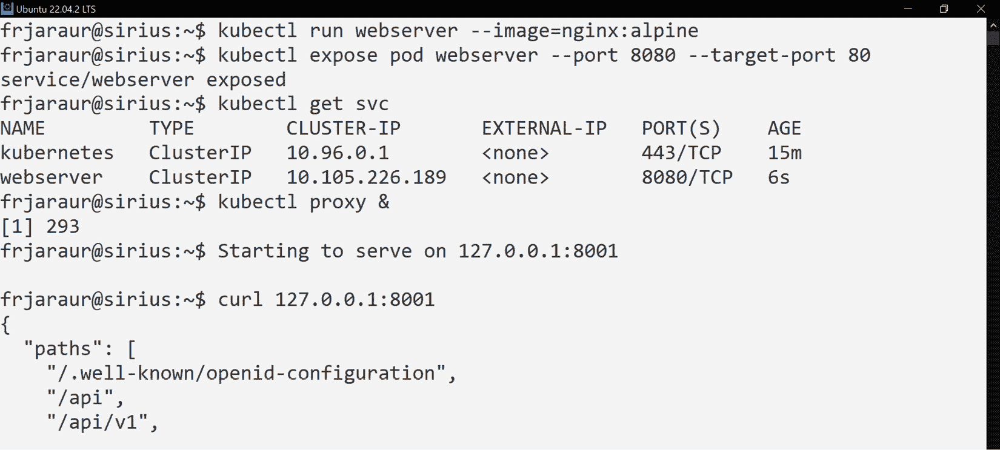

图 11.1 – 使用 NGINX 创建简单的 webserver 服务并暴露 Kubernetes API

重要提示

请注意，我们使用`&`在后台执行了`kubectl proxy`。这样做是为了能够继续在当前终端中操作。`kubectl proxy`操作会在前台运行，并且会一直运行，直到我们按下*Ctrl* + *C*终止该进程。要结束后台执行，我们可以使用以下步骤：

`$` `jobs`

`[1]+ 运行 kubectl` `proxy &`

`$` `kill %1`

现在我们可以访问 Kubernetes API，我们可以直接通过代理端口访问 ClusterIP 服务资源，但首先让我们回顾一下服务资源：

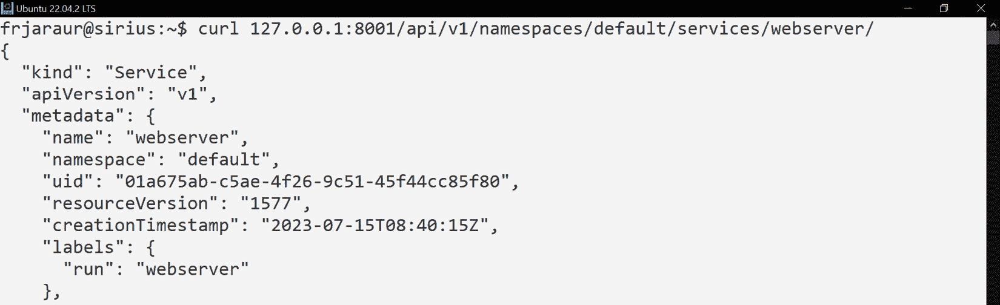

图 11.2 – 使用 Kubernetes 代理访问 webserver 服务资源

我们为`webserver`服务资源配置了端口`8080`。Kubernetes 代理将使用以下 URI 格式发布服务资源（Kubernetes API）：

`/``api/v1/namespaces/<NAMESPACE>/services/<SERVICE_NAME>:<SERVICE_PORT>/proxy/`

因此，`webserver`服务可以通过`/api/v1/namespaces/default/services/webserver:8080/proxy/`访问，并且我们可以访问 NGINX 的默认`index.xhtml`页面，如下图所示：

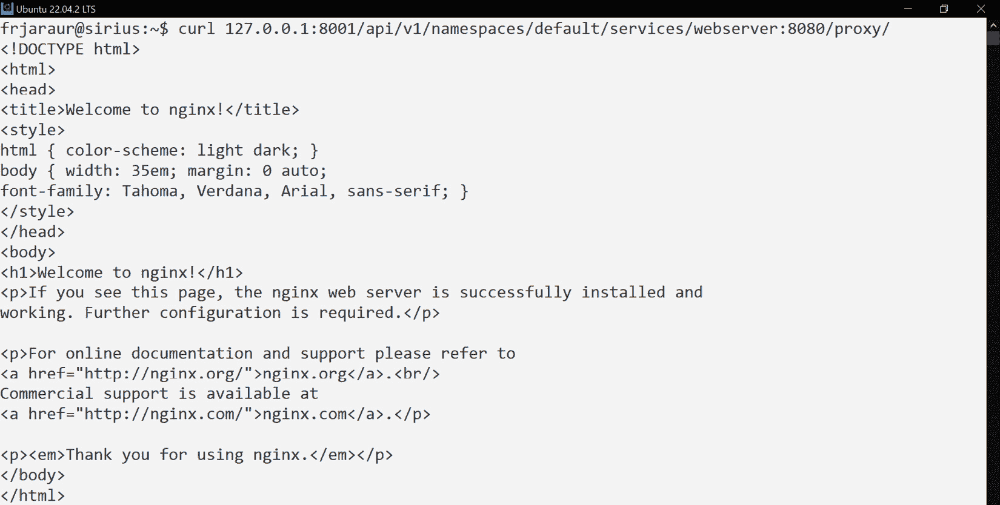

图 11.3 – 使用 kubectl proxy 功能访问 webserver 服务

该服务是可以访问的，我们已经成功到达了`webserver`服务的默认页面。现在，让我们来看看如何将服务的端口转发到我们的桌面计算机，而不需要实现复杂的路由基础设施。

## Kubernetes 客户端端口转发功能

我们可以使用 `kubectl port-forward` 来将服务、部署、ReplicaSet、StatefulSet，甚至是 Pod 资源的端口直接转发，而无需访问整个 Kubernetes API。在这种情况下，使用透明的 NAT 将后端端口转发到我们桌面计算机上定义的端口，通过执行 `kubectl` 命令行客户端来实现。

让我们看一下这如何工作，使用上一节中定义的 `webserver` 服务作为示例：

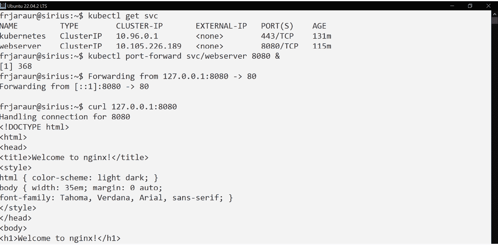

图 11.4 – 使用端口转发发布 webserver 服务资源示例

正如这个例子所示，转发任何监听指定端口的 Kubernetes 资源是相当简单的。我们可以通过使用 `[LOCAL_PORT:]RESOURCE_PORT` 来指定应用程序附加的本地端口。请注意，当在具有多个 IP 地址的多网卡主机上工作时，使用 `--address` 参数选择本地 IP 地址非常重要。这将通过附加接口并定义适当的防火墙规则，仅允许我们的主机来提高整体安全性。默认情况下，使用 `localhost`，这意味着只要我们是唯一能够访问桌面计算机的用户，它将保持安全。

在下一节中，我们将讨论如何直接使用主机的内核网络命名空间来发布 Pod 资源。

# 使用主机网络命名空间发布应用程序

到目前为止，我们已经看到了通过代理或将端口转发到桌面计算机的不同方法，来访问 ClusterIP 服务资源或 Pods（使用不同工作负载类型创建）。然而，有时应用程序需要直接连接到主机的接口，而不是通过容器运行时创建的桥接接口。在这种情况下，Pod 中的容器将使用主机的网络命名空间，这使得容器内部的进程能够控制主机，因为它们可以访问主机的所有接口和网络流量。这可能是危险的，必须仅用于管理和监控主机的接口。

## 使用 hostNetwork 键

要使用主机的网络命名空间，我们将`hostNetwork`键设置为`true`。Pod 现在将获得与主机相关的所有 IP 地址，包括与该主机中运行的容器相关的所有虚拟接口的 IP 地址。但在发布应用程序时，特别重要的一点是，它们将可以通过主机的任何 IP 地址进行访问，并在 Pod 的`spec`部分定义的`ports`键所定义的端口上等待请求。让我们通过执行一个带有前述`hostNetwork`键的 NGINX Pod 来看一下这如何运作。我们将使用`cat`（重定向到`kubectl`）来快速创建一个 Pod 资源，使用`nginx/nginx-unprivileged:stable-alpine3.18`镜像（该镜像使用无特权端口`8080`）：

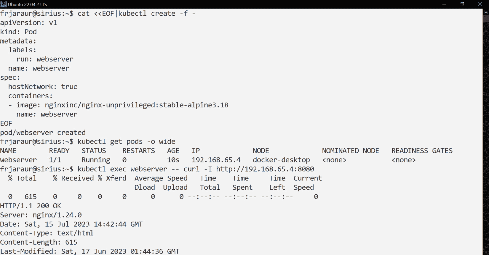

图 11.5 – 使用 hostNetwork 暴露 Pod

通过这种方式，您的 NGINX web 服务器将在其运行的主机的 IP 地址上可访问（在这个例子中是 IP 地址`192.168.65.4`，这是我们的 Docker Desktop 工作节点和主节点的地址）。以下代码片段展示了如何使用主机的接口创建`webserver`应用程序，以及如何获取 NGINX 进程的内容：

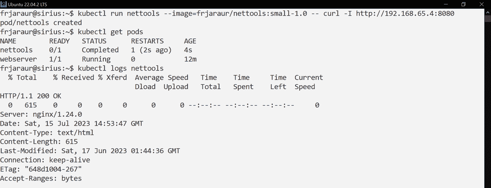

图 11.6 – 使用主机的 IP 地址访问 webserver 应用程序

请注意，我们在`webserver` Pod 内部执行了`curl`二进制文件。在这个示例中，我们使用的是 Docker Desktop 与`frjaraur/nettools`镜像（由我开发和维护），来验证应用程序是否可访问。

在这个例子中，我们只使用了 Pod 中的一个端口；事实上，我们甚至没有在 Pod 的容器中声明端口，因此容器镜像中定义的所有端口都会被使用。使用`hostNetwork`时，镜像中定义的所有端口都会被暴露，如果你不想将某些特定的 Pod 暴露到外部（例如，如果你的应用程序有一个内部 API 或管理界面，而你不希望能够外部访问），这可能会成为问题。如果你自己管理平台，可以通过修改主机的防火墙来管理访问，但这可能会比较棘手。在这种情况下，我们可以在容器级别使用`hostPort`键，而不是在 Pod 资源级别使用`hostNetwork`。我们将在下一节中探讨这个问题。

## 使用`hostPort`

`hostPort`键用于 Pod 的`containers`部分，在这里我们定义要暴露的端口，可以是内部端口或外部端口。通过`hostPort`，我们只能暴露需要的端口，其余端口可以保持内部访问。让我们看一个示例，定义`webserver` Pod 中的两个容器：

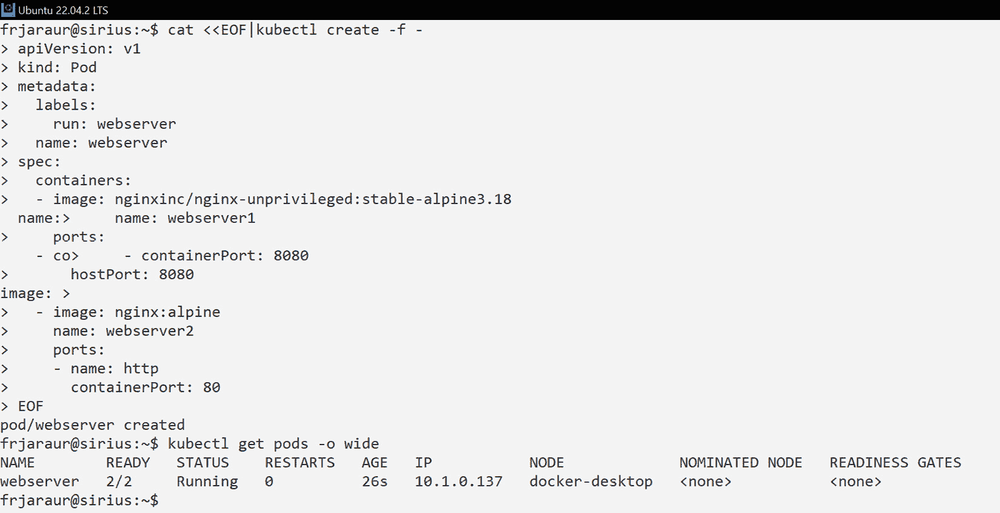

图 11.7 – 一个示例，包含两个容器，但仅有一个在主机级别暴露

在前面的截图中，我们有两个容器。让我们再次使用 `frjaraur/nettools` 镜像，尝试通过 `curl` 访问这两个端口，来验证它们是否可达：

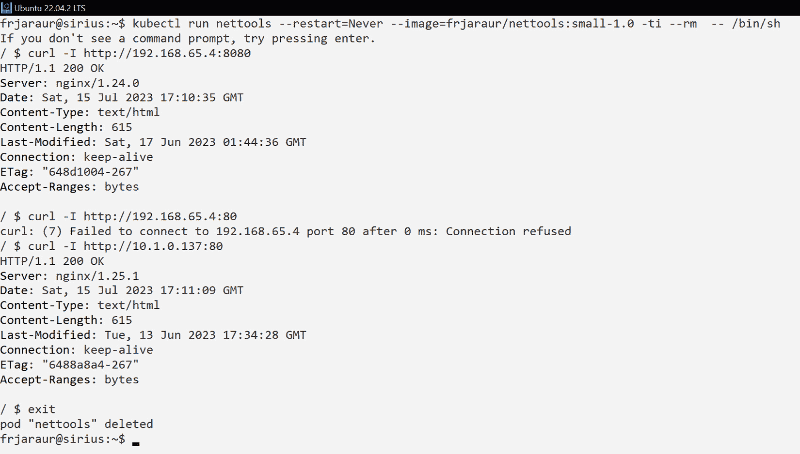

图 11.8 – 访问 web 服务器服务的端口 8080 和 80

在前面的截图中，我们可以看到，只有端口 `8080` 可以通过主机的 IP 地址访问。端口 `80` 仅在 Kubernetes 集群内本地可达。

`hostNetwork` 和 `hostPort` 都不应在没有 Kubernetes 管理员监督的情况下使用。两者都代表了安全漏洞，除非应用程序严格需要，否则应避免使用。它们通常用于监控或管理工作负载，当我们需要管理或监控主机的 IP 地址时使用。

既然我们已经了解了在主机级别的不同选项，让我们继续回顾与 Service 资源相关的 NodePort 机制。

# 使用 Kubernetes 的 NodePort 功能发布应用程序

正如我们在本章开头提到的，在*理解 Kubernetes 特性以发布集群范围的应用程序*部分中，每个 NodePort 服务资源都有一个相关联的 ClusterIP 地址。这个 IP 地址用于内部负载均衡所有客户端请求（来自 Kubernetes 集群的内部和外部客户端）。Kubernetes 将这个内部负载分配给所有可用的 Pod 副本。所有副本具有相同的权重，因此它们将接收相同数量的请求。ClusterIP 地址使得运行在 Pod 内的应用程序能够在内部访问。为了让它们在外部可用，NodePort 服务类型通过 NAT 在所有集群节点上附加定义的端口。以下架构表示请求到达 Kubernetes 集群内运行的应用程序的路径：

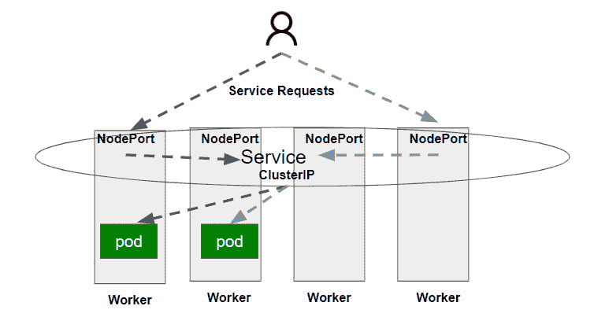

图 11.9 – NodePort 简化的通信架构

Endpoint 资源用于将 Pod 的后端与服务的 ClusterIP 进行映射。该资源使用 Service YAML 清单中的标签选择器动态配置。以下是一个简单示例：

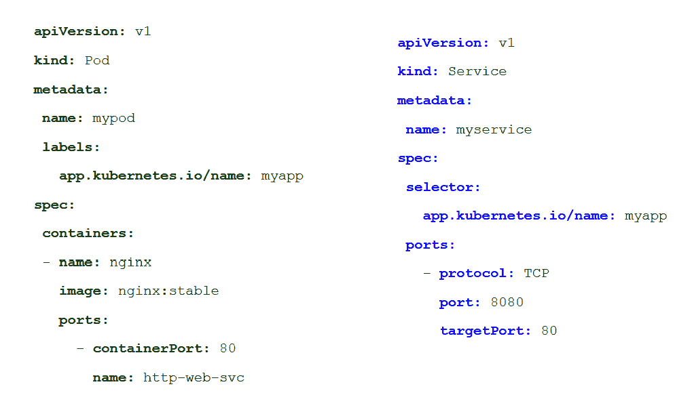

图 11.10 – 简单的 Pod 和 NodePort YAML 清单

上面的截图展示了最常见的服务资源使用方式。通过这个清单，会创建一个 EndpointSlice 资源，利用选择器部分定义的标签，将应用程序的 Pod 与服务关联。注意，使用这些标签选择器会创建指向在同一命名空间中运行的后端 Pod 资源的 EndpointSlice 资源。但是，我们也可以创建没有动态 Pod 附加的服务资源。例如，这种场景可能有用，例如将运行在 Kubernetes 外部的外部服务与内部服务资源连接起来（这就是`ExternalName`服务资源类型的工作方式），或者从另一个命名空间访问服务，就好像它在当前命名空间上部署一样。由于 kube-proxy 组件，内部 Pod 得以被访问，它会将流量注入到 Pod 的容器中。尽管服务可以在集群范围内访问，但这只会发生在实际 Pod 运行的节点上。

使用标签选择器的 EndpointSlice 资源将创建 Endpoint 资源，因此，它们的状态更新会传播。失败的 Pod 资源将从实际服务中弃用，且请求不会被路由到这些后端，因此 Kubernetes 只会将流量路由到健康的 Pod。这是最流行和推荐的使用服务资源的方式，因为通过这种方式，您的资源与基础设施无关。

让我们通过创建一个`webserver` Pod 并使用`kubectl expose`以 NodePort 模式发布 Web 服务，快速查看 Endpoint 资源创建的工作原理：

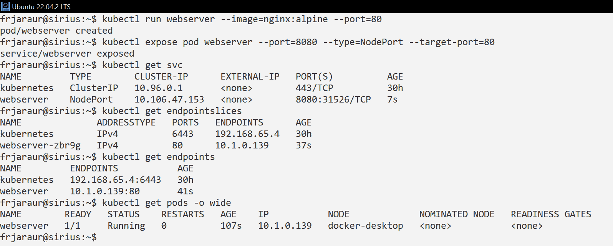

图 11.11 – 使用命令式格式暴露 Pod

在上面的例子中，我们创建了一个 Pod，然后通过使用`30000`到`32767`范围将其暴露给服务资源的端口。我们还检索了一个端点列表和创建的动态配置。我们使用`kubectl expose <WORKLOAD_TYPE> <WORKLOAD_NAME>`格式语法创建了服务。这使用标签选择器来创建服务资源，从实际工作负载中获取标签，因此创建了一个 EndpointSlice 资源，将可用的 Pod 附加到服务。

在这个例子中，`webserver`应用程序将通过`docker-desktop`节点的 IP 地址进行访问，如果你使用 WSL2 进行执行，可能需要额外的配置。这是因为在这个基础架构中，我们需要声明一个 NAT IP 地址来转发到你的桌面计算机。如果使用 Hyper-V 或 Minikube 作为 PC 上的 Kubernetes 环境，则不需要这种配置。在远程 Kubernetes 集群中，您必须确保主机的 IP 地址和端口可以从您的计算机访问。

重要提示

由于 NodePort 服务使用主机的端口，这些端口必须在每个节点的防火墙中允许。你的 Kubernetes 管理员可能已在 Kubernetes 平台节点上配置了多个接口，并应告知你使用哪些 IP 地址使应用程序可访问。

如果你的工作负载运行在云基础设施上，可能需要额外的步骤来允许访问你的服务资源，因此这通常不是发布应用程序的最佳选择。

在下一节中，我们将回顾 LoadBalancer 服务类型，该类型是专门为云环境创建的，但现在也可以在本地基础设施中使用，这得益于像 MetalLB 这样的软件负载均衡器。

# 使用 LoadBalancer 服务提供对你的服务的访问

LoadBalancer 类型的服务需要外部设备来集成你的应用程序。这种类型的服务资源包括一个 NodePort 和其 ClusterIP IP 地址。外部设备提供一个 LoadBalancer IP 地址，该地址将被负载均衡到集群节点的 IP 地址和关联的 NodePort。这个配置完全由 Kubernetes 为你管理，但你必须为你的基础设施定义一个合适的 `spec` 部分。这种类型的资源依赖于实际的基础设施，因为它将使用来自软件定义网络基础设施的 API 来路由和发布应用程序的服务。LoadBalancer 服务资源最初是为 Kubernetes 云平台准备的，但现在在现代本地数据中心中更常见，尤其是那些具有软件定义网络和 API 管理设备的环境，尽管它们需要对底层平台有较好的了解才能使用。如前所述，每个 LoadBalancer 服务资源都会动态分配一个 IP 地址，这可能需要在你的云基础设施上进行额外的管理，甚至可能会产生额外的费用。

云提供商决定如何对服务进行负载均衡。根据使用的云平台，NodePort 部分有时可以省略，因为如果平台供应商定义了，可能会提供直接路由。

本地虚拟云基础设施，如 OpenStack，可以集成到我们的 Kubernetes 平台中，以管理这种类型的服务资源，因为它们也是 Kubernetes 核心的一部分。但如果你不使用 OpenStack 或其他本地虚拟云基础设施，可以通过像 MetalLB ([`metallb.org/`](https://metallb.org/)) 这样的解决方案，在任何裸金属基础设施上运行一个 Kubernetes 兼容且动态可配置的负载均衡器。

如果你希望获得最大的兼容性并避免使用特定厂商的资源，则不推荐使用这种类型的服务资源。它确实依赖于底层基础设施，并可能需要在平台上进行额外的配置。

如果你作为开发人员需要实现一个类型为 LoadBalancer 的服务（或者你只是对它们的定义感到好奇），可以使用 Minikube，因为它能够在桌面计算机上实现此功能，而无需任何外部要求来进行协商。Docker Desktop 会将 LoadBalancer 的 IP 地址报告为 `localhost`，因此你可以直接使用 `127.0.0.1` IP 地址连接到给定的服务。

让我们通过一个简单的例子来看这个是如何工作的。我们将首先启动一个新的 Minikube 集群环境（确保在启动 Minikube 之前停止 Docker Desktop 或 Rancher Desktop 实例），然后我们将执行 `minikube start` 和 `minikube tunnel` 命令：

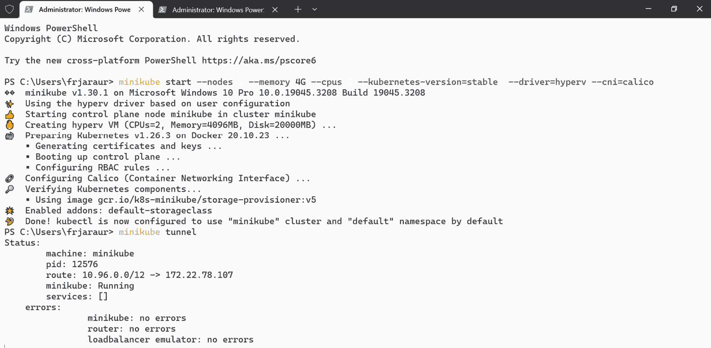

图 11.12 – 从管理员控制台执行 Minikube 集群

我们将打开另一个控制台，但这次我们将连接到 Kubernetes 集群，因此不需要以管理员身份执行命令。我们创建一个 Pod，然后使用命令式模式暴露它，类型为 LoadBalancer。

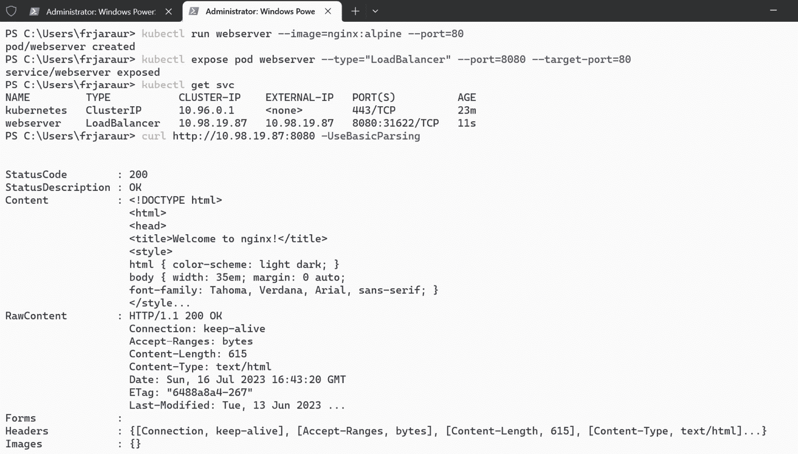

图 11.13 – 在 Minikube 中创建 LoadBalancer 服务

请注意，我们有一个新的列显示外部 IP 地址。在这种情况下，它是一个真实外部负载均衡器设备的仿真，为新的服务清单提供了特定的 IP 地址。实际上，Minikube 会从 Kubernetes 节点创建一个通道到你的桌面计算机，使得 Pod 可以通过分配的负载均衡 IP 地址 `(EXTERNAL-IP)` 和服务端口进行访问。在这种情况下，我们可以通过 `http://10.98.19.87:8080` 访问 NGINX Web 服务器。然后，我们使用 `curl` 测试应用程序的可访问性（`curl` 是 Windows PowerShell 的 `Invoke-WebRequest` 命令的别名）。

LoadBalancer 服务类型对平台基础设施的依赖使得这种类型过于特定，难以在日常使用中广泛应用，且可能在并非所有 Kubernetes 集群中都可用。因此，兼容性最好的解决方案是使用 Ingress 控制器，正如我们在接下来的章节中将学习的那样。

# 理解 Ingress 控制器

**Ingress 控制器**是一种软件，提供负载均衡、SSL 终止和基于主机的虚拟路由。它是一个反向代理，运行在 Kubernetes 集群中，管理一个反向代理网络组件，可以在 Kubernetes 集群内部或外部运行，类似于任何其他网络基础设施设备。Ingress 控制器的作用就像部署在 Kubernetes 集群中的其他控制器，尽管它并不由集群本身管理。我们必须手动部署这个控制器，因为它不是 Kubernetes 核心的一部分。如果需要，我们可以在集群中部署多个 Ingress 控制器，并定义默认使用哪个控制器（如果没有指定）。

Ingress 控制器在 HTTP/HTTPS 应用程序（OSI 第 7 层，应用层）中表现非常好，但我们也可以发布 TCP 和 UDP 应用程序（OSI 第 4 层，传输层），尽管这需要更多的配置，并且可能不是最佳选项。在这种情况下，最好使用外部负载均衡器并将流量路由到 NodePort 服务资源，因为 TCP 和 UDP Ingress 资源将需要额外的端口来分配传入流量。

Kubernetes 管理员使用 **IngressClass 资源** 来声明平台上可用的不同 Ingress 控制器。每个 Ingress 控制器都与一个 IngressClass 资源相关联。作为开发人员，你必须创建 Ingress 资源，这是反向代理你的应用工作负载所需的定义。

部署 Ingress 控制器有多种选择：云服务提供商和许多软件供应商已经开发了他们自己的解决方案，你可以将它们中的任何一种包含到你的 Kubernetes 设置中，但你必须理解它们的特定功能和特点。你可以在 Kubernetes 文档中查看可用的解决方案，链接为：[`kubernetes.io/docs/concepts/services-networking/ingress-controllers/#additional-controllers`](https://kubernetes.io/docs/concepts/services-networking/ingress-controllers/#additional-controllers)，并在准备应用程序之前向你的 Kubernetes 管理员询问你平台上可用的 Ingress 控制器。在你的 Ingress 资源中可能需要做一些小调整。接下来的部分，我们将讨论最常见的选项，默认包含在一些 Kubernetes 解决方案中的 **Kubernetes NGINX Ingress Controller**。

## 部署 Ingress 控制器

部署 Ingress 控制器时，我们只需按照所选解决方案的具体指示操作。安装给定软件到你的集群中可能有不同的方法，但我们将遵循最简单的方式：部署一个包含所有必需资源的 YAML 文件（[`raw.githubusercontent.com/kubernetes/ingress-nginx/controller-v1.8.1/deploy/static/provider/cloud/deploy.yaml`](https://raw.githubusercontent.com/kubernetes/ingress-nginx/controller-v1.8.1/deploy/static/provider/cloud/deploy.yaml)）。在使用该 URL 之前，请确保检查最新的可用版本，并参考特定的安装说明。撰写本书时，NGINX 控制器版本 `1.8.1` 是最新的版本。在这个例子中，我们使用了云端 YAML 文件，尽管如果你已经安装了一个完全功能的 Kubernetes 环境，你也可以选择裸金属选项（该版本使用 NodePort 而不是 LoadBalancer 类型）。让我们通过一个简单的例子来操作：

1.  我们从在 Docker Desktop 环境中运行 `kubectl apply` 开始：

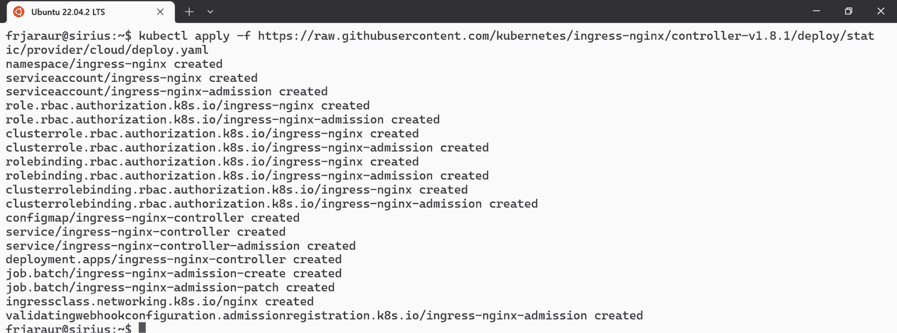

图 11.14 – 部署流行的 Kubernetes NGINX Ingress Controller

如前面的截图所示，Ingress Controller 工作所需的许多资源已经创建。一个新的命名空间 `ingress-nginx` 已创建，且一些 Pod 已经在其中运行：

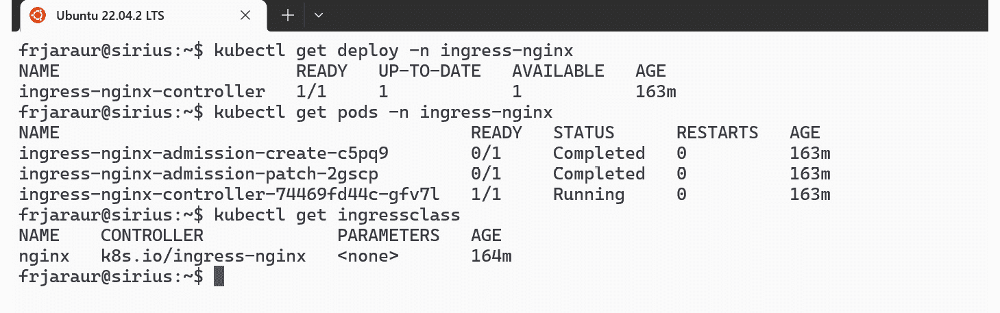

图 11.15 – 部署、Pod 和 IngressClass 资源已创建

在前面的截图中，我们可以看到创建了一个 `IngressClass` 资源。我们可能需要将其配置为默认。

1.  让我们检查已部署的 Ingress Controller。我们首先检查为访问 Deployment 资源而创建的 Service 资源，使用 `kubectl` `get svc`：

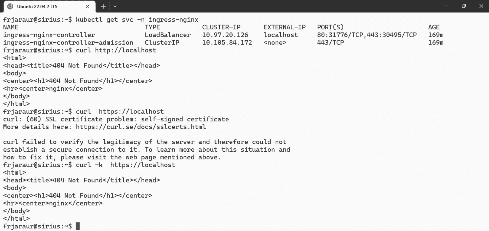

图 11.16 – 验证已部署的 Ingress Controller

请注意前面截图中，Service 资源被创建为 `LoadBalancer` 类型。它获得了 `localhost` IP 地址（我们在此示例中使用的是 Docker Desktop），这意味着我们应该能够直接使用 `curl` 通过 `localhost` 访问 NGINX Ingress Controller 后端。该 Service 正在监听端口 `80` 和 `443`，我们能够访问这两个端口（我们通过给 `curl` 添加 `-k` 参数，以避免验证相关的自动签名和不受信任的 SSL 证书）。

使用 Ingress Controllers 可以提高安全性，当我们添加 SSL 证书以实现应用程序暴露组件与用户之间，或甚至不同组件之间使用与 Service 资源关联的 Ingress URL 的 SSL 隧道时。

现在让我们继续学习如何使用 Ingress 资源管理应用程序的行为。

## Ingress 资源

与任何其他资源一样，我们需要定义 `apiVersion`、`kind`、`metadata` 和 `spec` 键及其对应的部分。最重要的部分是 `.spec.rules`，它定义了一组主机规则，用来动态配置由 Ingress Controller 部署的反向代理。让我们看一个基本的示例：

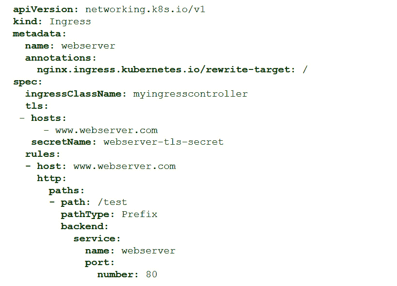

图 11.17 – Ingress 资源示例

在前面的截图中，我们可以看到 `ingressClassName` 键，它指示将使用的 Ingress Controller。`rules` 部分定义了一组主机头和与不同后端关联的路径。在我们的示例中，要求包含 [www.webserver.com](http://www.webserver.com) 主机头；如果请求未包含该头，它们将被重定向到默认后端（如果已定义），或显示 `404` 错误（页面未找到）。`backend` 部分描述了将接收应用程序请求的 Service 资源。

让我们使用上一节创建的 `webserver` 服务资源快速运行一个示例。它将在端口 `8080` 上监听，因此我们创建一个带有虚假主机名的 Ingress 资源，并使用 `curl -H "host: <FAKE_HOST>" http://localhost` 来验证其可访问性（我们使用 `localhost`，因为它的 IP 地址是与 `LoadBalancer` 服务关联的）。

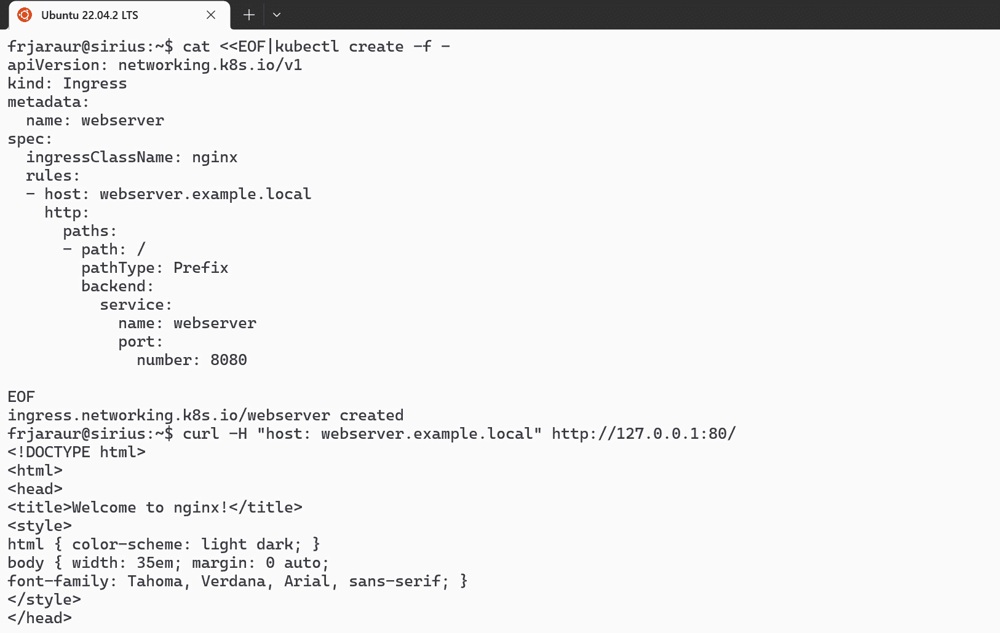

图 11.18 – 用于 Web 服务器服务示例的 Ingress Web 服务器资源

安全功能在 `.spec.tls` 部分实现，在这里我们将主机与其密钥和证书链接，并集成到一个 Secret 资源中。这个 Secret 必须包含在你定义 Ingress 资源的命名空间中，并且是 `tls` 类型。这些 Secrets 中的 `data` 部分必须包含生成证书的密钥和生成的证书本身。我们将在 *实验* 部分通过一个示例学习如何创建它。

我们可以拥有一个包含多个主机规则的 Ingress 资源，每个主机有多个路径，尽管将每个主机分开到不同的 Ingress 资源中以便于管理，并为不同的后端服务资源设置多个路径是更常见的做法。这个组合代表了一个典型的微服务架构，其中每个应用功能由不同的后端服务提供。

`annotations` 部分可以用来指示 Ingress 控制器进行特殊配置。以下是我们可以通过注解为 Kubernetes NGINX Ingress 控制器管理的一些最重要的配置：

+   `nginx.ingress.kubernetes.io/rewrite-target`：通常我们会在 Ingress 资源中集成一些重写规则，用于重写应用程序的 URI 路径。这里也有一些选项用于重定向 URL。

+   `nginx.ingress.kubernetes.io/auth-type` 和 `nginx.ingress.kubernetes.io/auth-secret`：这将允许我们在 Ingress 层面为我们的应用程序使用基本认证。

+   `nginx.ingress.kubernetes.io/proxy-ssl-verify`：如果我们的服务资源后端使用 TLS，那么有许多注解可以管理 NGINX 如何与它们连接。

+   `nginx.ingress.kubernetes.io/enable-cors`：我们可能需要在应用程序中启用**跨域资源共享**（**CORS**），以允许一些外部路由和 URL。这里还有其他一些有趣的选项，用于管理和保护 CORS 行为。

+   `nginx.ingress.kubernetes.io/client-body-buffer-size`：限制客户端请求的大小以避免整体性能问题是很常见的，但你的应用程序可能需要更大的响应。

除了这些选项外，还有许多其他选项可供选择，您可能需要向您的 Kubernetes 和基础设施管理员寻求建议。可供选择的范围包括集成外部身份验证后端、限制请求速率以防止**分布式拒绝服务**（**DDoS**）攻击、重定向和重写 URL、启用 SSL 通透，甚至管理金丝雀应用程序部署，将部分请求路由到工作负载后端的更新版本。有些选项可以在 Ingress 控制器级别进行定义，这将影响所有的 Ingress 资源。有关可用注解的完整列表，请参阅以下页面：[`kubernetes.github.io/ingress-nginx/user-guide/nginx-configuration/annotations/`](https://kubernetes.github.io/ingress-nginx/user-guide/nginx-configuration/annotations/)。

理解这里提到的选项非常重要，因为它们可能与其他 Ingress 控制器提供的选项有所不同（至少，它们肯定会使用其他注解键）。一些 Ingress 控制器，例如 Kong，还为后端服务实现了 API 管理，如果这些服务涉及许多交互，这将非常有用。请向你的 Kubernetes 管理员咨询有关平台上部署的 Ingress 控制器。

我们在这里涵盖了基础知识，但像往常一样，请注意，您的 Ingress 资源可能需要一些小调整才能完全实现您的平台要求。例如，在 OpenShift 中，可以启用 Ingress 控制器，但默认情况下，Kubernetes 将使用 OpenShift Route，这是 Red Hat 实现的用于在 Kubernetes 中发布应用的 L7 反向代理。Ingress 控制器和 OpenShift Route 非常相似（即使它们的资源看起来也很相似），但如果您的应用需要在 OpenShift 集群上运行，您应该进一步查看相关的特定信息。如果在您的应用上可以同时使用这两种实现，以下链接可能有助于您决定使用哪个：[`cloud.redhat.com/blog/kubernetes-ingress-vs-openshift-route`](https://cloud.redhat.com/blog/kubernetes-ingress-vs-openshift-route)。

默认情况下，Kubernetes 实现了一个扁平网络，应用之间没有任何访问边界。这对横向流量（东-西流量）没有任何限制，这种配置可能导致严重的安全问题。在接下来的章节中，我们将回顾一些安全改进，以帮助我们安全地发布应用。

# 改进我们应用程序的安全性

在 Kubernetes 中，应用流量默认是自由流动的。部署了一个扁平网络来覆盖 Pod 到 Pod 以及 Service 到 Pod 的通信——请记住，Pod 内的容器共享一个公共 IP 地址。运行在 Kubernetes 集群中的 Pod 会彼此看到，即使它们运行在不同的节点和命名空间中，保护一个应用免受另一个应用的影响也需要额外的工作。

听起来可能有些奇怪，但运行在不同命名空间中的应用程序可以彼此看到。实际上，如果它们有相关联的 Service 资源，就可以轻松通过内部 DNS 解析其关联的 IP 地址并访问其进程。

在下一部分，我们将学习如何使用 NetworkPolicy 资源定义我们的应用程序通信，并让 Kubernetes 为我们阻止任何不必要的连接。

## 网络策略

NetworkPolicy 资源（也称为 `netpol`）允许我们管理 OSI 第 3 层和第 4 层的通信（分别为 IP 和端口访问）。Kubernetes 将 NetworkPolicy 资源作为核心的一部分提供，但其实现依赖于集群中部署的 CNI。因此，使用实现此功能的 CNI（如 Calico、Canal 或 Cilium 等）至关重要。

NetworkPolicy 资源定义了 Pod 通信的所有方面：出口（输出流量）和入口（输入流量）。正如我们稍后将看到的，NetworkPolicy 是通过使用 `.spec.podSelector` 部分应用于特定 Pod 集合的。NetworkPolicy 资源是命名空间范围的，因此 `podSelector` 允许我们决定哪些 Pods 会受到规则定义的影响。可以对 Pod 应用多个规则，您的 Kubernetes 管理员可能已包括一些影响整个集群的 `GlobalNetworkPolicy` 资源，因此您应该询问是否有任何集群默认规则需要允许某些出口或入口流量。在您的集群中，通常默认仅允许 DNS 流量，禁止所有其他出口流量。如果您的集群是这种情况，您将需要在应用程序的清单中声明所有的出口（以及入口）通信。我们来看一个简单的例子，展示如何在 NetworkPolicy 中声明出口和入口通信：

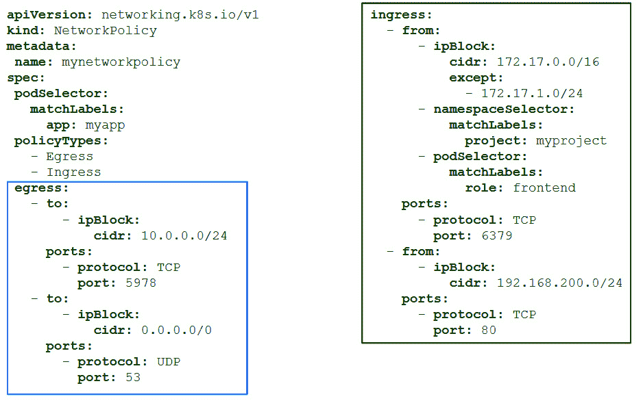

图 11.19 – 包含出口和入口规则的 NetworkPolicy 资源清单

让我们回顾一下前面代码片段中一些最重要的键和值。`.spec.podSelector` 部分声明了当前命名空间中（如果 `metadata` 部分没有声明）哪些 Pods 会受到此策略的影响。在 `policyTypes` 键下，我们可以看到定义的策略类型列表。在这里需要澄清的是，出口通信是由 Pod 发起的，而入口通信是指进入 Pod 的通信。如果同时声明了出口和入口类型，而仅为其中之一声明了部分（如前面的例子中的 `egress` 或 `ingress` 部分），则未声明的部分将被视为空，意味着该类型的通信将**完全不被允许**。本例中的 `egress` 部分是要应用的一系列规则。我们再仔细看一下：

+   第一条规则允许从选定的 Pods（带有 `app=myapp` 标签）到 `10.0.0.0/24` 子网中任何主机的端口 `5978` 的外发通信。

+   第二条规则允许向任何主机的 UDP 端口 `53` 进行外发通信（Kubernetes 内部和外部 DNS）。

在 `ingress` 部分，也声明了两条规则：

+   第一条规则允许从 `172.17.0.0/16` 子网（但不包括 `172.17.1.0/24` 子网）中的主机、带有 `project=myproject` 标签的命名空间中的 Pods 以及当前命名空间中带有 `role=frontend` 标签的 Pods 访问选定 Pods（带有 `app=myapp` 标签）的端口 `6379`。我们可以说，*Kubernetes 完全是* *关于标签*。

+   第二条入站规则允许来自 `192.168.200.0/24` 子网中的主机访问选定 Pods 的端口 `80`。

这些规则看起来可能很复杂，但实际上实施起来非常简单。

如果你计划将应用程序的所有组件部署在特定命名空间中，可能值得允许所有 Pods 之间的所有外发和入站通信。但在生产环境中这样做并不是一个好主意，因为这样只有攻击者横向移动到其他命名空间时才会被阻止，但如果你某个 Pod 中出现安全问题，可能会影响同一命名空间中的其他 Pods。在准备 NetworkPolicy 资源或调试应用程序时，允许所有命名空间内部的东西-West 流量也可能是必要的。以下的 YAML 清单允许所有内部通信，并且仅将前端组件暴露给外部：

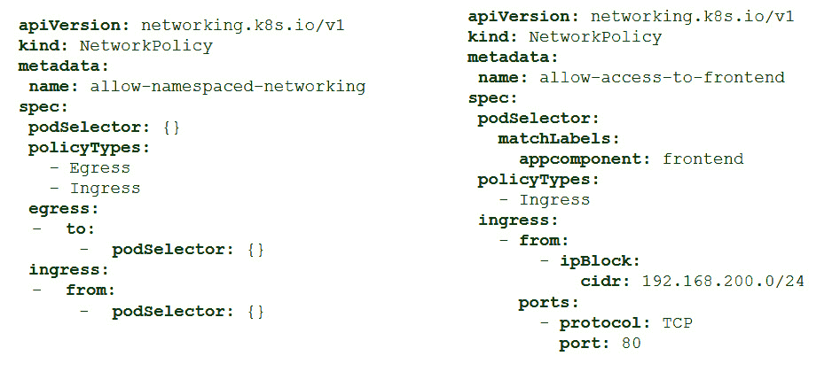

图 11.20 – 示例清单，允许所有命名空间通信并允许对特定 Pod 的端口 80 进行访问。

上面的截图显示了两个清单：

+   左侧的清单声明了一个 NetworkPolicy 资源，允许当前命名空间中所有 Pods 之间的所有通信。由于 `podSelector` 为空，因此规则适用于命名空间中的所有 Pods。

+   右侧的清单允许从 `192.168.200.0/24` 子网中的主机访问带有 `appcomponent=frontend` 标签的 Pod（`podSelector` 适用于该 Pod）上的端口 `80`。

重要说明

NetworkPolicy 资源在连接级别应用，并且默认情况下不会留下任何连接痕迹，这在尝试修复组件之间的某些连接问题时可能会很不方便。一些 CNI 插件，如 Calico，允许记录 Pods 之间的连接。这需要在 Kubernetes 环境中额外的权限。如果需要调试应用程序，可以向 Kubernetes 管理员询问是否可以提供一些连接痕迹。在某些情况下，最好从一个允许并记录命名空间中所有连接的 NetworkPolicy 开始。

作为开发者，你需要负责创建和维护应用程序的资源清单，因此，也包括应用程序所需的 NetworkPolicy 资源。如何组织这些资源由你决定，但建议使用具有描述性的名称，并将多个规则按每个应用程序组件分组在一个清单中。通过这种方式，你可以精细调整每个组件的配置。在*实验*部分，我们为你准备了一个具体的练习，帮助你通过只允许受信任的访问来保护应用程序。

NetworkPolicies 允许你彻底隔离所有应用程序的组件，尽管它们可能很难实现，但这个解决方案确实提供了极高的粒度，并且不依赖于底层基础设施。你只需要一个支持此功能的 Kubernetes CNI。

在接下来的章节中，我们将回顾服务网格解决方案如何通过在所有应用程序的 Pod 上注入小型、轻量级的代理来提供更复杂的安全功能。

## 服务网格

通过实施 NetworkPolicies，我们强制执行一些类似防火墙的连接规则，限制应用程序工作负载之间的互联，但这可能还不够。服务网格被视为一个基础设施层，它连接服务并管理它们如何相互交互。服务网格用于管理东西向和南北向流量到后台服务，在某些情况下，甚至可以替代 Ingress 控制器，前提是服务网格解决方案已在 Kubernetes 中部署。

最流行的服务网格解决方案是**Istio**（一个开源解决方案，属于**云原生计算基金会**（**CNCF**）），尽管还有一些其他值得提及的选项，如 Linkerd、Consul Connect 和 Traefik Mesh。如果你正在使用云 Kubernetes 平台，可能会有自己的云提供商解决方案可用。

服务网格解决方案能够为你的应用程序添加 TLS 通信、流量管理和可观察性，而无需修改其代码。如果你在寻找一个透明的安全和管理层，使用服务网格解决方案可能是完美的选择，但它也增加了高度的复杂性和一定的平台开销。

服务网格解决方案在你所有的应用程序工作负载上部署一个小型代理。这些代理会拦截你应用程序的所有网络流量，并应用规则来允许或禁止你的应用程序进程之间的通信。

本书的范围不包括服务网格的实现和使用，但值得调查一下你的 Kubernetes 管理员是否在平台上部署了服务网格解决方案，这可能需要实现特定于服务网格的资源。

正如本节前面提到的，NetworkPolicy 资源通过禁用未经授权的通信来隔离应用的工作负载，这可能为生产环境提供足够的安全性。这些资源高度可配置，你需要负责定义应用各个组件之间所需的通信，并准备所需的 YAML 清单文件，以完整实现所有应用通信。在接下来的 *实验* 部分，我们将看到本章中学到的一些内容在实际操作中的应用，尝试发布前几章使用的 `simplestlab` 应用。

# 实验

在本节中，我们将展示如何实现 `simplestlab` Tier-3 应用的 Ingress 资源，该应用为 Kubernetes 环境准备，相关内容在 *第九章*《*实现架构模式*》中进行了介绍，并在 *第十章*《*在 Kubernetes 中利用应用数据管理*》中得到了改进。所有资源的清单文件已经为你准备好，存放在本书的 GitHub 仓库中，地址为 [`github.com/PacktPublishing/Containers-for-Developers-Handbook.git`](https://github.com/PacktPublishing/Containers-for-Developers-Handbook.git)，可以在 `Chapter11` 文件夹中找到。通过执行 `git clone` 命令下载所有内容，确保你获取到最新版本，或者如果你之前已经下载过该仓库，可以使用 `git pull` 更新。所有运行 `simplestlab` 应用所需的清单文件和步骤都位于 `Containers-for-Developers-Handbook/Chapter11/simplestlab` 目录下，而 Ingress 和 NetworkPolicy 资源的清单文件则直接位于 `Chapter11` 文件夹中。

这些实验将帮助你学习和理解 Kubernetes 中 Ingress 和 NetworkPolicy 资源的工作原理。你将部署一个 Ingress 控制器，使用 HTTP 和 HTTPS 协议发布 `simplestlab` 示例应用，并创建一些 NetworkPolicy 资源来仅允许适当的连接。Ingress 控制器实验可以在 Docker Desktop、Minikube 和 Rancher 上运行，但对于 NetworkPolicy 资源部分，你需要使用支持此类资源的 Kubernetes CNI，例如 Calico。每个 Kubernetes 桌面或平台的实现方式不同，它们以不同的方式管理并展示各自的网络基础设施。

这是你在本章 GitHub 仓库中可以找到的任务：

1.  首先，我们将部署 Kubernetes NGINX Ingress 控制器（如果你在实验平台中没有自己的 Ingress 控制器）。

1.  我们将部署为 `simplestlab` 应用准备的所有清单文件，这些文件位于 `simplestlab` 文件夹内。我们将使用 `kubectl create -f simplestlab` 命令。

1.  一旦所有组件准备就绪，我们将使用为此任务准备的清单文件创建一个 Ingress 资源。

1.  在 GitHub 仓库中，你将找到有关部署更高级的 Ingress 清单的说明，包含自签名证书以及加密客户端通信的内容。

1.  在 GitHub 仓库中还有一个 NetworkPolicy 实验，帮助你了解如何通过兼容的 CNI（如 Calico）使用此功能来保护应用程序。

在第一个任务中，我们将部署我们自己的 Ingress 控制器。

## 通过部署你自己的 Ingress 控制器来改善应用程序访问

对于此任务，我们将使用 Docker Desktop，它提供了良好的负载均衡器服务实现。这些 Service 资源将附加本地 IP 地址，便于连接已发布的服务。我们将使用基于 LoadBalancer 服务类型的 Kubernetes NGINX Ingress 控制器的云部署（[`kubernetes.github.io`](https://kubernetes.github.io)），其清单描述如下：[`raw.githubusercontent.com/kubernetes/ingress-nginx/controller-v1.8.1/deploy/static/provider/cloud/deploy.yaml`](https://raw.githubusercontent.com/kubernetes/ingress-nginx/controller-v1.8.1/deploy/static/provider/cloud/deploy.yaml)。如果你使用的是完全裸金属基础设施，可以使用裸金属 YAML（[`raw.githubusercontent.com/kubernetes/ingress-nginx/controller-v1.8.1/deploy/static/provider/baremetal/deploy.yaml`](https://raw.githubusercontent.com/kubernetes/ingress-nginx/controller-v1.8.1/deploy/static/provider/baremetal/deploy.yaml)）并按照 [`kubernetes.github.io/ingress-nginx/deploy/baremetal/`](https://kubernetes.github.io/ingress-nginx/deploy/baremetal/) 中的附加说明进行 NodePort 路由配置。

重要提示

仓库中提供了两个 YAML 文件的本地副本，分别为 `kubernetes-nginx-ingress-controller-full-install-cloud.yaml` 和 `kubernetes-nginx-ingress-controller-full-install-baremetal.yaml`。

完成此步骤后，按照以下步骤进行操作：

1.  我们只会部署云版本，在 YAML 文件中以一系列连接的清单提供。我们将使用 `kubectl apply` 来部署控制器：

    ```
    Chapter11$ kubectl apply -f https://raw.githubusercontent.com/kubernetes/ingress-
    nginx/controller-v1.8.1/deploy/static/provider/cloud/deploy.yaml
    namespace/ingress-nginx created
    serviceaccount/ingress-nginx created
    serviceaccount/ingress-nginx-admission created
    role.rbac.authorization.k8s.io/ingress-nginx created
    role.rbac.authorization.k8s.io/ingress-nginx-admission created
    clusterrole.rbac.authorization.k8s.io/ingress-nginx created
    clusterrole.rbac.authorization.k8s.io/ingress-nginx-admission created
    rolebinding.rbac.authorization.k8s.io/ingress-nginx created
    rolebinding.rbac.authorization.k8s.io/ingress-nginx-admission created
    clusterrolebinding.rbac.authorization.k8s.io/ingress-nginx created
    clusterrolebinding.rbac.authorization.k8s.io/ingress-nginx-admission created
    configmap/ingress-nginx-controller created
    service/ingress-nginx-controller created
    service/ingress-nginx-controller-admission created
    deployment.apps/ingress-nginx-controller created
    job.batch/ingress-nginx-admission-create created
    job.batch/ingress-nginx-admission-patch created
    ingressclass.networking.k8s.io/nginx created
    validatingwebhookconfiguration.admissionregistration.k8s.io/ingress-nginx-admission created
    ```

1.  我们可以查看已创建的工作负载资源：

    ```
    Chapter11$ kubectl get all -n ingress-nginx
    NAME                                            READY   STATUS       RESTARTS   AGE
    pod/ingress-nginx-admission-create-9cpnb        0/1     Completed   0          13m
    pod/ingress-nginx-admission-patch-6gq2c         0/1     Completed   1          13m
    pod/ingress-nginx-controller-74469fd44c-h6nlc   1/1     Running     0          13m
    NAME                                         TYPE           CLUSTER-IP       EXTERNAL-IP   PORT(S)                      AGE
    service/ingress-nginx-controller             LoadBalancer   10.100.162.170   localhost      80:31901/TCP,443:30080/TCP   13m
    service/ingress-nginx-controller-admission   ClusterIP      10.100.197.210   <none>        443/TCP                      13m
    NAME                                       READY   UP-TO-DATE   AVAILABLE   AGE
    deployment.apps/ingress-nginx-controller   1/1     1            1           13m
    NAME                                                  DESIRED    CURRENT   READY   AGE
    replicaset.apps/ingress-nginx-controller-74469fd44c   1         1         1       13m
    NAME                                       COMPLETIONS   DURATION   AGE
    job.batch/ingress-nginx-admission-create   1/1           7s          13m
    ingress-nginx-controller Service is attached to the localhost IP address, so we can check its availability at http://localhost:80 and https://localhost:443 (exposed ports):

    ```

    Chapter11$ curl http://localhost

    <html>

    <head><title>404 未找到</title></head>

    <body>

    <center><h1>404 未找到</h1></center>

    <hr><center>nginx</center>

    </body>

    –k 参数用于避免证书验证：

    ```
    Chapter11$ curl https://localhost
    curl: (60) SSL certificate problem: self-signed certificate
    More details here: https://curl.se/docs/sslcerts.xhtml
    curl failed to verify the legitimacy of the server and therefore could not
    establish a secure connection to it. To learn more about this situation and
    how to fix it, please visit the web page mentioned above.
    Chapter11$ curl -k https://localhost
    <html>
    <head><title>404 Not Found</title></head>
    <body>
    <center><h1>404 Not Found</h1></center>
    <hr><center>nginx</center>
    </body>
    </html>
    ```

    ```

    ```

Ingress 控制器现在已部署并在监听，`404` 错误表明 `localhost` 主机没有关联的 Ingress 资源（实际上甚至没有配置默认资源，但 Ingress 控制器响应正确）。

## 使用 Ingress 控制器在 Kubernetes 上发布 simplestlab 应用程序

在这个实验中，我们将部署 `simplestlab`，一个非常简化的三级应用，位于 `simplestlab` 目录中，并且我们将发布其前端组件 `lb`，无需 TLS 加密。你可以按照以下步骤进行：

1.  应用程序的清单已经为您编写；我们只需要使用 `kubectl` 创建一个适当的命名空间，然后部署所有相关资源：

    ```
    Chapter11$ kubectl create ns simplestlab
    namespace/simplestlab created
    Chapter11$ kubectl create -n simplestlab \
    -f simplestlab/
    deployment.apps/app created
    service/app created
    secret/appcredentials created
    service/db created
    statefulset.apps/db created
    secret/dbcredentials created
    secret/initdb created
    configmap/lb-config created
    daemonset.apps/lb created
    simplestlab namespace:

    ```

    Chapter11$ kubectl get all -n simplestlab

    NAME                       READY   STATUS    RESTARTS   AGE

    pod/app-5f9797d755-5t4nz   1/1     正在运行   0          81 秒

    pod/app-5f9797d755-9rzlh   1/1     正在运行   0          81 秒

    pod/app-5f9797d755-nv58j   1/1     正在运行   0          81 秒

    pod/db-0                   1/1     正在运行   0          80 秒

    pod/lb-5wl7c               1/1     正在运行   0          80 秒

    NAME          TYPE        CLUSTER-IP      EXTERNAL-IP   PORT(S)    AGE

    service/app   ClusterIP   10.99.29.167    <none>        3000/TCP   81 秒

    service/db    ClusterIP   None            <none>        5432/TCP   81 秒

    service/lb    ClusterIP   10.105.219.69   <none>        80/TCP     80 秒

    NAME                DESIRED   CURRENT   READY   UP-TO-DATE   AVAILABLE   NODE SELECTOR   AGE

    daemonset.apps/lb   1         1         1       1            1            <none>          80 秒

    NAME                  READY   UP-TO-DATE   AVAILABLE   AGE

    deployment.apps/app   3/3     3            3           81 秒

    NAME                             DESIRED   CURRENT   READY   AGE

    replicaset.apps/app-5f9797d755   3         3         3       81 秒

    NAME                  READY   AGE

    lb 组件没有暴露。它正在监听端口 80，但使用了 ClusterIP，因此该服务仅在集群内部可用。

    ```

    ```

1.  我们现在将创建一个 Ingress 资源。`ingress` 目录中有两个清单文件。我们将使用 `simplestlab.ingress.yaml`，该文件将在没有自定义 TLS 加密的情况下进行部署：

    ```
    Chapter11$ cat ingress/simplestlab.ingress.yaml
    apiVersion: networking.k8s.io/v1
    kind: Ingress
    metadata:
      name: simplestlab
      annotations:
        # nginx.ingress.kubernetes.io/rewrite-target: /
    spec:
      ingressClassName: nginx
      rules:
      - host: simplestlab.local.lab
        http:
          paths:
          - path: /
            pathType: Prefix
            backend:
              service:
                name: lb
                port:
                  number: 80
    ```

1.  我们将仅部署之前创建的清单：

    ```
    Chapter11$ kubectl create \
    -f ingress/simplestlab.ingress.yaml -n simplestlab
    ingress.networking.k8s.io/simplestlab created
    Chapter11$ kubectl get ingress -n simplestlab
    NAME CLASS HOSTS ADDRESS PORTS AGE
    curl:

    ```

    Chapter11$ curl -H "host: simplestlab.local.lab" http://localhost/

    <!DOCTYPE html>

    <html>

    <head>

    …

    </head>

    <body>

    …

    </body>

    </html>

    </body>

    simplestlab 应用程序现在已可用并且可以访问。

    ```

    ```

1.  我们可以更改 `/etc/hosts` 文件（或等效的 MS Windows `c:\system32\drivers\etc\hosts` 文件）。添加以下行，并打开网页浏览器访问 `simplestlab` 应用程序：

    ```
    127.0.0.1 simplestlab.local.lab
    ```

    这需要 root 或管理员权限，因此使用 `curl` 并带有 `-H` 或 `--header` 参数来检查应用程序可能会更为方便。

重要说明

您可以使用浏览器扩展程序来修改请求头，或使用包括 [nip.io](http://nip.io) 的 FQDN，这将在 *第十三章*中讨论，*管理应用程序生命周期*。例如，如果您使用 MS Edge，可以直接添加 `simple-modify-headers` 扩展程序（对于其他浏览器和操作系统，您也能找到类似的扩展）。配置此扩展的更多信息可以在本章的 GitHub `Readme.md` 文件中找到。

应用程序将在[`localhost`](http://localhost)可用（请注意，我们在`simple-modify-headers`扩展配置中定义了 URL 模式为`http://locahost/*`）：

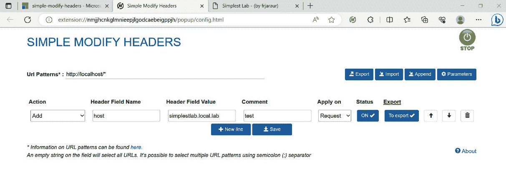

图 11.21 – 简单修改标题 Edge 扩展配置

1.  扩展配置完成后，我们可以使用[`localhost`](http://localhost)访问`simplestlab`应用程序：

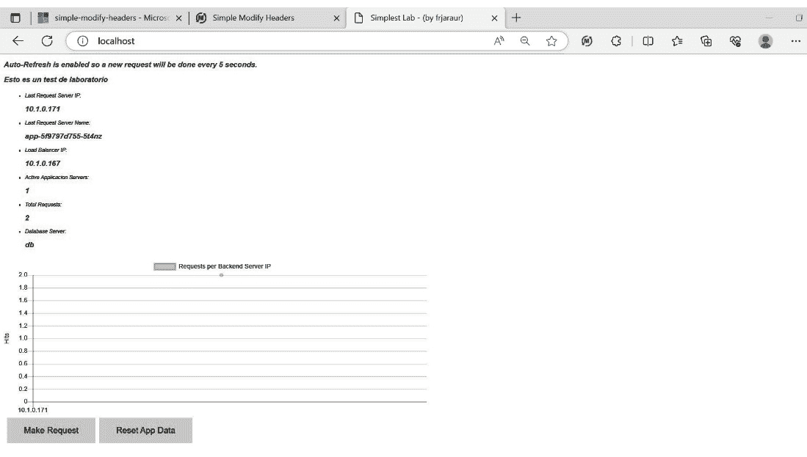

图 11.22 – 由于 Ingress 控制器，simplestlab 应用程序可访问

在 GitHub 存储库中，您将找到有关如何向 Ingress 资源添加 TLS 以提高应用程序安全性以及如何使用 Calico 作为 CNI 与 Minikube 实现 NetworkPolicy 资源的说明。

这些实验室帮助您了解如何通过隔离应用程序的组件并仅暴露和发布用户和其他应用程序组件所需的内容来提高应用程序的安全性。

# 总结

在本章中，我们学习了如何为我们的用户和其他部署在同一集群内部或外部的组件发布我们的应用程序。我们考察了不同的机制，但最终，决定哪些应用程序组件应该被暴露和访问是由您决定的。

在本章中，我们回顾了一些快速解决方案，用于在我们的桌面计算机上直接调试和发布服务资源，使用`kubectl`客户端。我们还研究了不同的服务类型，这些类型对于在远程 Kubernetes 开发集群上本地访问远程应用程序可能很有用。我们讨论了 LoadBalancer 服务是 Kubernetes 核心的一部分，并且为云平台做好了准备，因此在本地部署可能会很困难，这就是为什么推荐的交付应用程序的选项是创建自己的 Ingress 资源清单。Ingress 控制器将帮助您在任何 Kubernetes 平台上发布应用程序。您将使用 Ingress 资源定义应用程序的发布方式，并根据部署在您的 Kubernetes 平台上的 Ingress 控制器调整其语法。

在本章末尾，我们介绍了 NetworkPolicy 资源和服务网格概念，通过删除任何不受信任和未定义的通信方式，提供了改善应用程序安全性的手段。接着是一些实验室来测试我们所学到的内容。

在下一章中，我们将回顾一些有用的机制和工具，用于监控和收集应用程序的性能数据。
