# 12

# 获取应用程序洞察

到目前为止，本书中我们已经看到如何使用软件容器实现应用程序，以及 Kubernetes 如何帮助我们在生产环境中运行它们，并确保安全性和高可用性。我们可以运行并管理自己的 Kubernetes 环境，为任何 Kubernetes 环境准备我们的应用程序；为了定制部署到特定平台，我们只需要做少量的修改。在本章中，我们将学习如何获取访问我们应用程序的 Kubernetes 资源权限，以及可以用于识别应用程序问题的不同工具。我们将回顾**Prometheus**，这是 Kubernetes 世界中用于监控应用程序组件健康状况、交互和资源的流行工具。我们还将探索**Loki**，这是一个开源日志平台，具有高度的可扩展性、可配置性，并且容易与 Kubernetes 集成。在本章结束时，我们将了解一些可用于应用程序的**仪器化**选项。

这是本章内容的总结：

+   理解你的应用程序的行为

+   获取访问你的 Kubernetes 资源的权限

+   监控你的应用程序的指标

+   记录应用程序的重要信息

+   对你的应用程序进行负载测试

+   向应用程序代码中添加仪器化

# 技术要求

你可以在[`github.com/PacktPublishing/Containers-for-Developers-Handbook/tree/main/Chapter12`](https://github.com/PacktPublishing/Containers-for-Developers-Handbook/tree/main/Chapter12)找到本章的实验室，在那里你会找到一些本章内容中省略的扩展解释，以便让内容更容易跟随。本章的*Code In Action*视频可以在[`packt.link/JdOIY`](https://packt.link/JdOIY)找到。

# 理解你的应用程序的行为

如果你不知道应用程序是如何工作的，理解其行为可能会非常困难。这听起来似乎很显而易见，但你对应用程序了解得越深入，就能更好地实施不同的机制，以随时验证它的状态。

作为开发人员，你需要问自己，在哪里添加监控端点或标志是最合适的。但你的应用程序也应当通过外部第三方工具进行监控，这引出了以下几种监控机制：

+   **内部应用程序指标**：在项目结束时实现监控点可能会很困难，但如果你从一开始就引入它们，并且测量事务之间的时间，你将能够获得应用程序的整体性能视图。

+   **内部健康检查**：健康检查对于识别应用程序何时失败至关重要，但我们可以进一步提升。我们可以有一些简单的错误/OK 快速测试，这些测试可以频繁执行，帮助 Kubernetes 保持应用程序的正常运行。

+   **外部应用程序指标**：某些组件，如数据库，可能允许你查询可以导出并供外部组件使用的某些指标。

+   **外部健康检查**：这些健康检查用于提供应用程序行为的全面概述。它们可能很复杂，涉及多个组件，并且可能会触发一些警报或创建事件，帮助我们管理应用程序的状态。

我们还没有讨论这些机制如何实现。虽然在应用程序中包含一些指标可能需要我们对代码进行一些修改，添加一些带有度量值的条目，或者创建需要提取的度量源，其他方面则可以通过使用外部工具，在应用程序代码之外来实现。

在容器中运行应用程序可以帮助你实现这里描述的任何模型。但*绝对不要*在应用程序容器中包含并行检查进程。这不是容器的正确使用方式。记住，我们在*第一章*《使用 Docker 的现代基础设施与应用程序》中引入了容器的概念：容器是主进程，在主机中独立运行，共享内核给所有其他容器。运行多个进程并不是一个好的实践，因为你需要确保每个进程在容器停止时收到 SIGTERM 或 SIGKILL 信号，如果你创建了多个进程并让它们在容器的命名空间中独立运行（类似于 PID 命名空间，但没有依赖关系），这可能会变得很棘手。

在本章中，我们将学习如何实现不同的模型来监控、记录，甚至跟踪我们应用程序的进程。但让我们先从回顾如何从我们自己应用程序的工作负载中检索和管理 Kubernetes 资源开始，这是我们后面将使用的某些工具的关键。

# 获取对 Kubernetes 资源的访问权限。

有时，你的应用程序需要管理某些 Kubernetes 资源。让我们考虑以下几种情况：

+   默认的 Kubernetes 自动扩展不符合我们的需求。

+   我们需要创建一些由事件触发的资源——例如，当我们的应用程序启动时。

在这些场景中，我们的应用程序进程需要从 Kubernetes API 获取信息并创建一些资源。如果我们考虑这个工作流，至少我们的 Pods 需要能够访问 Kubernetes API 服务器的 IP 地址，并且具有执行所需操作和资源的适当权限。在本节中，我们将学习如何从应用程序进程中创建和管理 Kubernetes 对象。

首先，我们需要记住一些来自*第八章*的概念，*使用 Kubernetes 调度器部署应用程序*。在那一章中，我们讨论了 Kubernetes 如何通过使用不同的身份验证和授权策略来提高应用程序的安全性。你可能需要向你的 Kubernetes 管理员询问一些 Kubernetes 平台的见解，但你很可能会在你的环境中使用**基于角色的访问控制**（**RBAC**），因为目前所有 Kubernetes 平台都使用这种机制。这意味着所有 Kubernetes API 请求都必须通过**角色授权系统**进行授权。Kubernetes 将使用客户端证书、持有者令牌或身份验证代理通过身份验证插件来验证 API 请求，当客户端请求经过身份验证时，授权系统将允许或拒绝这些请求。

默认情况下，在命名空间中运行的所有 Pods 都将继承一个服务账户及其令牌，用于在 Kubernetes 集群内验证应用程序进程的身份。由于这种行为不安全，因此 Kubernetes 管理员通常会避免这种情况。但是无论如何，我们将使用 Pod 定义中包含的服务账户及其关联令牌来标识进程并验证对指定资源和操作的访问权限。

在 Kubernetes 集群中，RBAC API 声明了角色及其绑定，用于将 Kubernetes 资源与允许的操作配对。该角色系统将包括命名空间授权（Role 和 RoleBinding 资源）和集群级别授权（ClusterRole 和 ClusterRoleBinding 资源），它们帮助我们提供精细化访问控制。

Role 和 ClusterRole 资源定义了表示附加权限的规则；因此，如果某个权限没有规则定义，则会被拒绝。我们将在它们的清单定义中匹配资源和允许的动词。我们将使用 ClusterRole 资源来定义集群范围的权限，或从更高层次定义命名空间范围的权限，这使得我们可以在多个命名空间中重用它们。

让我们看一个角色的示例，以及如何通过 RoleBinding 将其与 ServiceAccount 资源关联：

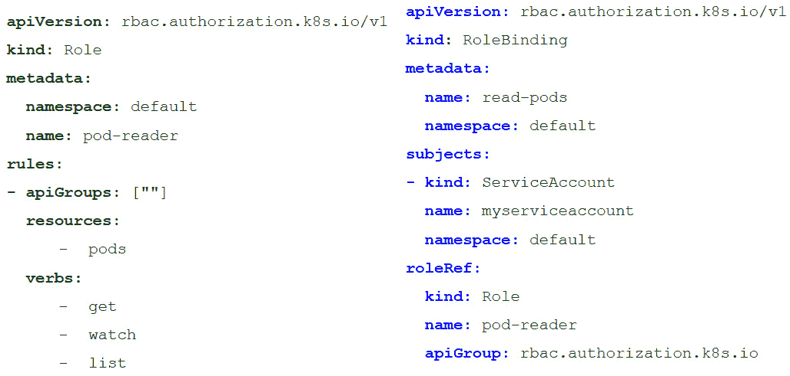

图 12.1 – 角色和 RoleBinding 资源，允许我们在命名空间中列出和读取 Pods

请注意，在这两个资源中，我们都定义了 `namespace`，因为我们使用了命名空间范围的资源（如果我们将其部署到当前命名空间，则可以省略）。在角色资源中，我们定义了允许的 `verbs` 或动作列表，以及 `resources`，即这些动作将应用的资源（你可以使用 `kubectl api-resources -o wide` 来检索每个 Kubernetes 资源可用的动作）。当我们有不同的资源，它们的名称相同，但属于不同的 API 时，`apiGroups` 键就会被使用。让我们通过一个快速示例来演示这个配置。我们将在 `default` 命名空间中创建角色和角色绑定资源：

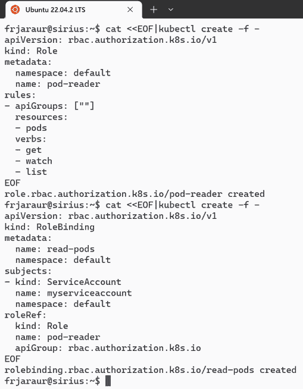

图 12.2 – 创建资源以便可以在命名空间中列出和读取 Pods

重要说明

我们可以使用 `kubectl create role pod-reader --verb=get,list,watch --resource=Pods` 来创建前面代码片段中的 `pod-reader` 角色资源。

我们已经将角色绑定资源应用于特定的服务账户，但它尚不存在。让我们在继续之前创建它：


图 12.3 – 创建 `myserviceaccount` ServiceAccount 资源

我们有一个角色，它允许我们列出、查看和获取任何命名空间中的 Pods（但仅应用于当前的 `default` 命名空间），并且有一个角色绑定将该角色资源与 `default` 命名空间中定义的服务账户 `myserviceaccount` 关联。我们现在将运行一个使用此服务账户的 Pod，并获取当前 Pods 的列表。我们将运行一个包含 `kubectl` 命令行的容器镜像。我们包含了 `myserviceaccount` 服务账户资源，并将 `get pod` 作为镜像的参数：

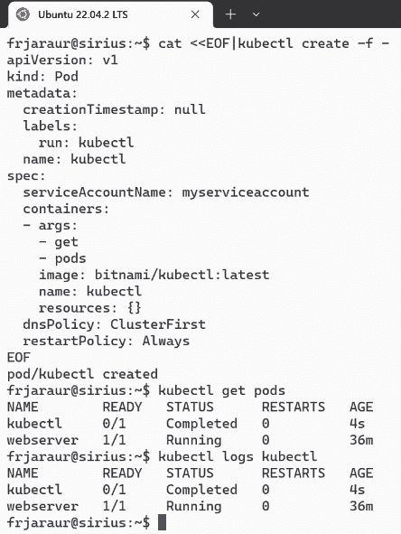

图 12.4 – 创建一个列出当前命名空间中所有 Pods 的 Pod

在前面的代码片段中，我们创建了一个 Pod，其容器将使用 `myserviceaccount` 服务账户与 Kubernetes API 进行交互。请注意，我们刚刚从 Pod 中检索了日志，并且从执行的 `kubectl get pods` 命令行中得到了输出。执行时所有正在运行的 Pods 都被列出。让我们尝试使用一个不使用此服务账户的新 Pod：

```
frjaraur@sirius:~$ kubectl run kubectl2 \
--image=bitnami/kubectl:latest -- get pods
pod/kubectl2 created
```

现在，我们可以从这个新 Pod 中检索日志：

```
$ kubectl logs kubectl2
Error from server (Forbidden): pods is forbidden: User "system:serviceaccount:default:default" cannot list resource "pods" in API group "" in the namespace "default"
```

如你所见，这次新 Pod 无法访问 Kubernetes API（默认使用了 `default` 服务账户，而该账户没有权限列出命名空间中的 Pods）。

当你创建自定义资源并需要细粒度访问时，访问 Kubernetes API 可能变得复杂，但请确保管理 RBAC 访问的原则是相同的。

重要说明

你可以实现自己的 `Kubeconfig` 文件来与应用程序一起使用。Kubernetes 提供了与服务账户令牌的开箱即用集成，但你可以使用 Secret 资源来包含认证文件并在应用程序中使用它。当你从统一的控制平面集群管理不同的 Kubernetes 集群时，这尤其有用。

在这些示例中，我们没有使用 NetworkPolicy 资源，但你需要确保你的 Pod 可以访问 Kubernetes API 服务器 Pod。这些 Pod 将使用控制平面主机的 IP 地址和端口 `6443`，尽管这可能在不同的 Kubernetes 平台之间有所不同（请向你的 Kubernetes 管理员确认这些要求）。如果你的平台管理员配置了 GlobalNetworkPolicy 资源，你可能需要为你的部署添加一些 **egress** 规则。

在这个例子中，我们使用了 kubectl Kubernetes 客户端，但你会发现有适用于不同编程语言的客户端库和模块，这使得集成更加安全。如果你的代码仅管理必需的资源，攻击者将无法利用错误的 RBAC 配置。另一方面，添加新功能可能需要重新编译代码，但这是值得的。这里有一个指向当前文档的链接，你可以在其中找到有关客户端库的更多信息：[`kubernetes.io/docs/reference/using-api/client-libraries/`](https://kubernetes.io/docs/reference/using-api/client-libraries/)。在本书撰写时，C、.NET、Go、Perl、Python、Java、JavaScript 和 Ruby 等语言得到官方支持。如果你需要使用 Rust 等其他语言，可以找到一些社区项目正在开发用于访问 Kubernetes 的库。

现在，让我们介绍 Kubernetes 操作符的概念，它将帮助我们在 Kubernetes 中部署和操作应用程序。在本章中我们将使用其中的一些操作符，在此之前了解其基础知识是非常有趣的。

## 理解 Kubernetes 操作符

**Kubernetes 操作符**是一个与 Kubernetes 集成运行的软件，用于管理应用程序及其组件。它们使用我们在本章中所学的概念，按需监控并创建资源，以支持你的应用程序。

Kubernetes 操作符旨在自动化人类操作员管理应用程序时必须执行的大多数重复任务。市面上有许多经过充分文档化的 Kubernetes 操作符示例，它们将帮助你执行诸如部署高可用性数据库、使用单个 YAML 清单管理具有多个组件的复杂应用程序等任务。这些都是你可能会期望 Kubernetes 操作符为某个特定应用程序所执行的一些任务：

+   自动部署应用程序及其所有组件

+   管理和创建应用程序所需的 Kubernetes **CustomResourceDefinitions**（**CRDs**）

+   备份和恢复功能，帮助你通过简单的步骤恢复应用程序

+   完全托管的应用程序升级，涵盖所有内部应用程序组件，如数据库架构迁移

+   当您的应用程序需要分布式控制平面，或者必须管理应用程序组件之间的主从关系（或主从结构）时，选择一个领导者

正如您所看到的，运维人员是管理复杂应用程序部署的关键，而将它们集成到 Kubernetes 中使得管理变得更加简便。数据库管理有很多好的例子，主要由最重要的软件数据库供应商创建，其他软件类别也有类似的例子。您可以在[`operatorhub.io`](https://operatorhub.io)找到所需内容。在接下来的部分，我们将使用**Prometheus Operator**来部署和管理 Prometheus 监控工具。

如果您没有找到符合您应用程序要求的 Kubernetes 运维操作符，您可以使用任何可用于不同语言的**软件开发工具包**（**SDKs**）来编写您自己的运维操作符（[`kubernetes.io/docs/concepts/extend-kubernetes/operator/#writing-operator`](https://kubernetes.io/docs/concepts/extend-kubernetes/operator/#writing-operator)）。

到目前为止，我们已经学习了如何查询 Kubernetes 中某些资源的状态以及如何在应用程序中管理它们。在接下来的部分，我们将学习如何使用**第三方应用程序**来监控我们的应用程序。

# 监控您的应用程序指标

分析应用程序的指标是了解如何为用户或其他应用程序提供服务的关键。在这一部分，我们将学习如何使用**Prometheus**监控应用程序，这是一个非常适合 Kubernetes 生态系统的监控解决方案。

Prometheus 是一个开源的监控解决方案，自 2016 年以来由**云原生计算基金会**（**CNCF**）托管。它用于收集、存储和呈现指标，并通过阈值向用户发出警报。它可以集成到任何基础设施中，尽管它与 Kubernetes 配合使用时表现非常好。它已经包含在一些 Kubernetes 平台的部署中，因此它被认为是 Kubernetes 社区的标准。

Prometheus 包括一个易于查询的数据模型，使用其专有的**Prometheus 查询语言**（**PromQL**），该语言通过键值对标识的不同来源存储随着时间记录的指标。默认情况下，Prometheus 将通过 HTTP 请求拉取不同的端点，虽然推送数据也是可用的，但较少使用。这些端点通常被称为**targets**，可以自动发现或手动配置，这使得 Prometheus 在需要动态性支持的 Kubernetes 集群中非常适用。

尽管 Prometheus 提供了一个图形工具，但通常将其作为数据源集成到更先进的仪表盘工具中，例如**Grafana**，或通过 API（使用 PromQL 查询）直接消费其数据。

本书不会深入讲解这个工具，因为它超出了本书的范围，但我们将回顾一些其组件、快速安装以及如何为你的应用程序实现一些监控端点。

## 探索 Prometheus 架构

Prometheus 基于至少五个不同的组件：

+   **Prometheus 服务器**：这是核心组件。它从 Prometheus 导出器获取指标数据，并将来自 **Pushgateway** 的数据添加进去。所有这些数据都存储在其自己的 **时间序列数据库**（**TSDB**）中，并可以通过 HTTP API 访问，这个 API 也是由 Prometheus 服务器组件管理的。它还会检查不同配置的阈值。

+   **Pushgateway**：有些设备或组件无法被抓取。Pushgateway 组件允许你直接将数据推送到 Prometheus，而不是等待 Prometheus 拉取。不同的库适用于常见的编程语言，如 Java、Go、Python 和 Ruby 等，也有其他社区支持的库。

+   **Alertmanager**：Alertmanager 处理来自 Prometheus 服务器生成的所有警报。可以使用不同的通知后端，如电子邮件或 Webhook。

+   **Prometheus Web UI**：提供的 Web UI 使我们能够查询存储的指标、快速绘制数据图表，并查看不同配置目标的状态。

+   **Prometheus 导出器**：这些组件是平台可扩展性的关键。许多客户端库在不同的编程语言中得到了官方支持（还有一些是非官方支持的），允许我们为应用程序创建指标。当 Prometheus 抓取你的端点时，客户端库会呈现数据，并将其存储在服务器中以供稍后访问或阈值验证。你可以在 GitHub 的 Prometheus 组织内找到官方支持的 Prometheus 导出器（[`github.com/orgs/prometheus/repositories?q=exporter&type=all`](https://github.com/orgs/prometheus/repositories?q=exporter&type=all)）。

Prometheus 可以通过在 Kubernetes 集群内部运行（在自己的命名空间内，或者甚至在应用程序的命名空间内，不推荐这样做）或在外部不同的基础设施中运行（例如虚拟机），来监控运行在 Kubernetes 中的应用程序。建议在 Kubernetes 集群内部运行 Prometheus，因为这样你可以使用内部通信，而不必将导出器暴露出去，以便从集群外部拉取数据。这将提高安全性，即使你通过 HTTP 协议而非 HTTPS 协议在内部暴露导出器。将 Prometheus 部署在 Kubernetes 中将允许我们作为 Kubernetes 操作员来部署 Prometheus，这将帮助我们实现目标的自动发现，并且轻松管理完整的监控平台。所有组件都会为我们安装，我们只需配置它们的部署方式。

## 安装 Prometheus

为了安装 Prometheus 监控平台，我们将使用 **Helm**，它是一个可以让我们轻松自定义和部署一组清单的工具。我们将在 *第十三章*《管理应用生命周期》中深入学习如何使用 Helm 打包应用。在这种情况下，这些清单包括 **kube-prometheus** 平台组件（[`github.com/prometheus-operator/kube-prometheus`](https://github.com/prometheus-operator/kube-prometheus)）。kube-prometheus 社区项目安装了一个适合集群使用的监控平台，包含以下组件：

+   **Prometheus Operator**，它将创建自己的 CRDs 并管理服务发现集成。

+   **Prometheus** 和 **Alertmanager**，具有高可用性，均作为 StatefulSets 部署。包括一组默认的警报，帮助您开始监控 Kubernetes 环境。

+   **Prometheus node-exporter**，作为 DaemonSet 部署到所有 Kubernetes 集群节点。此导出器将包含与主机相关的指标，如 CPU、内存和磁盘空间。

+   **Prometheus Adapter for Kubernetes Metrics APIs**，它会自动将所有 Kubernetes Metrics Server 的指标集成到 Prometheus 中。

+   **kube-state-metrics**，它连接到 Kubernetes API 服务器并获取不同资源（如 Pods、Deployments 等）的状态，并将这些状态以指标的形式提供给 Prometheus。默认情况下，会为您创建并配置重要的指标。

+   **Grafana**，作为平台的一部分部署，用于增强 Grafana 仪表盘中的 Prometheus 图表。包括一组默认仪表盘，以向您展示平台的工作原理。

重要提示

kube-prometheus 项目中包含的默认警报和仪表盘来自 **kubernetes-mixin** 项目（[`github.com/kubernetes-monitoring/kubernetes-mixin`](https://github.com/kubernetes-monitoring/kubernetes-mixin)），该项目提供了一套良好文档化的规则和简单的 Kubernetes 监控仪表盘。

作为开发人员，您可能不会使用该平台提供的许多仪表盘和指标，但它将帮助您了解如何实现自己的指标和规则，并使用您的数据创建仪表盘。

安装 `kube-prometheus-stack` 非常简单。我们有一个现成的 Helm Chart（Helm 特定的包）。我们只需添加 Prometheus 社区 Helm Charts 仓库，更新仓库缓存，并在集群中安装 Helm Chart 发布版本。

重要提示

如果你使用的是 Rancher Desktop，Helm 会预装在你的命令行工具中；但在其他平台上，可能需要先安装才能使用它。Helm 支持 Windows、macOS 和 Linux，不同平台有不同的安装方法。我们建议直接使用二进制文件，这样你可以随时更新它并在需要时使用不同的版本。如果你使用的是 Windows，可以使用 `Get-Content` 下载它，并将其添加到 `PATH` 中：

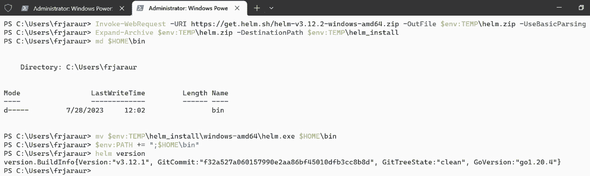

图 12.5 – 使用 gc 下载所需包来安装 Helm 二进制文件

安装完 Helm 后，我们只需使用 `helm install` 并加上 `--create-namespace` 参数，告诉 Helm 为我们创建一个新的命名空间。在这个示例中，我们使用 Minikube 作为 Kubernetes 环境：

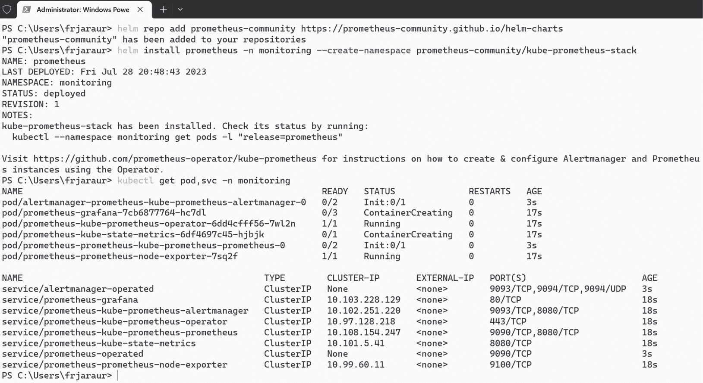

图 12.6 – 使用 Helm 安装 Prometheus 堆栈

几秒钟后，Prometheus 堆栈将启动并运行。此时，我们可以检查平台的 Pod 和 Service 资源：

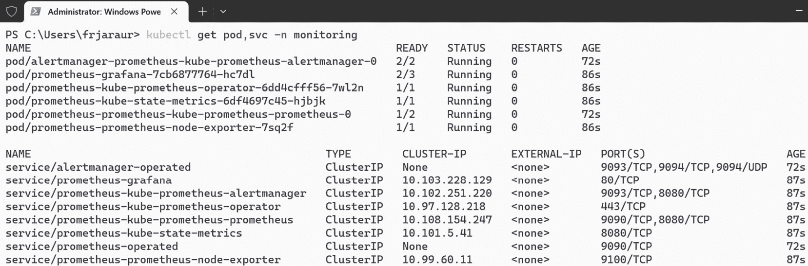

图 12.7 – Prometheus 堆栈的 Pod 和 Service 资源

这个小型安装仅用于本地使用——这样你可以在桌面计算机上为自己的应用程序开发监控。请注意，我们甚至没有包括 PersistentVolume，因此每次重启环境时数据都会丢失。在安装级别可以进行很多定制以满足你的特定需求，但在配置自己的 Helm 值 YAML 文件之前，你应该先阅读文档 ([`github.com/prometheus-community/helm-charts/blob/main/charts/kube-prometheus-stack/values.yaml`](https://github.com/prometheus-community/helm-charts/blob/main/charts/kube-prometheus-stack/values.yaml))。

## 审查 Prometheus 环境

在本节中，我们将了解 Prometheus 的 GUI 和功能。我们可以通过使用 `prometheus-stack-grafana` Service 来进入 Prometheus：

1.  为了快速查看，我们将使用 `port-forward` 访问 Grafana web UI：

    ```
    PS C:\Users\frjaraur> kubectl -n monitoring `
    port-forward service/prometheus-operated 9090:9090
    Forwarding from 127.0.0.1:9090 -> 9090
    Forwarding from [::1]:9090 -> 9090
    http://localhost:8080 in your browser to access Prometheus. If you click on Status, you will see the available pages related to the monitored endpoints:
    ```

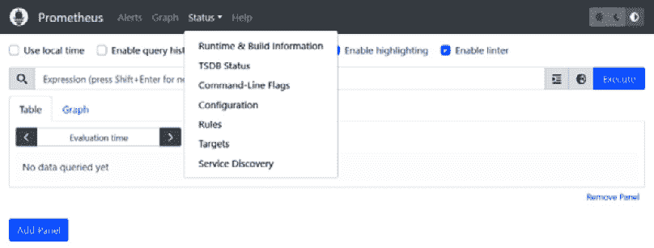

图 12.8 – Prometheus GUI 显示状态部分

1.  现在，我们可以进入 **Targets** 部分，查看当前 Prometheus 平台监控的目标：

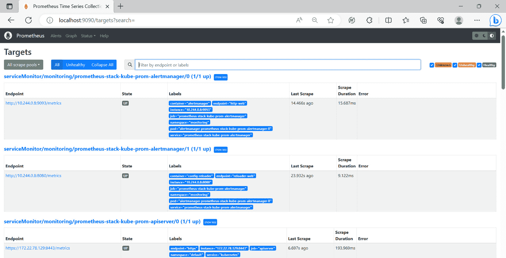

图 12.9 – Prometheus GUI 显示 Targets 部分

1.  我们可以使用右侧的过滤器，取消选中 **Healthy** 目标，以查看当前哪些目标处于不可用状态：

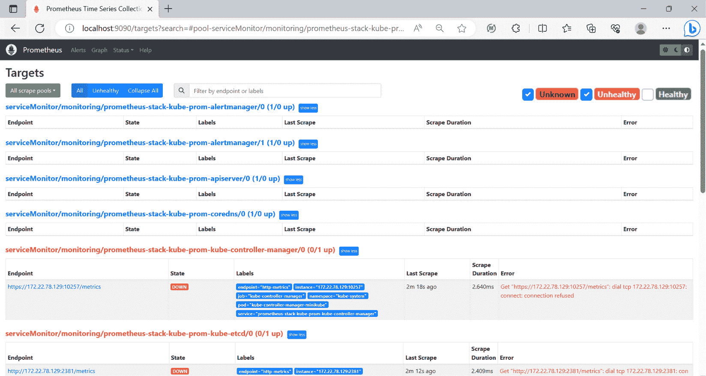

图 12.10 – Prometheus GUI 显示 Targets 部分中的不健康目标

别担心——这是正常的。Minikube 并未公开所有 Kubernetes 指标，因此某些监控端点将不可用。

1.  让我们查看当前通过点击`container_cpu_usage_seconds_total`指标获取的一些指标：

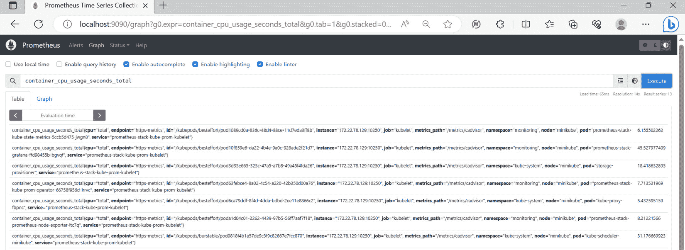

图 12.11 – Prometheus GUI 显示带有查询的图形部分指标

请注意，我们只获取来自**kube-system**和**monitoring**（为栈本身创建的）命名空间的指标。

1.  让我们在默认命名空间上快速创建一个 Web 服务器部署，并验证它是否出现在监控平台中：

    ```
    PS C:\Users\frjaraur> kubectl create deployment `
    webserver --image=nginx:alpine --port=80
    deployment.apps/webserver created
    ```

    几秒钟后，新的 Web 服务器 Pod 将出现在 Prometheus **Graph** 部分：

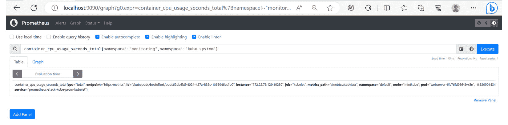

图 12.12 – 使用 CPU 过滤的 Kubernetes 容器列表

请注意，在这种情况下，我们使用了一个新的 PromQL 查询，`container_cpu_usage_seconds_total{namespace!~"monitoring",namespace!~"kube-system"}`，在其中我们移除了来自`monitoring`和`kube-system`命名空间的任何指标。这些指标通过 Prometheus Adapter for Kubernetes Metrics APIs 组件自动包含。

重要提示

关于 Kubernetes 指标或 Pod 指标的知识超出了本章的范围。我们使用 Prometheus 来展示如何传递您的应用程序指标。本节中提到的每个导出器或集成都有其文档，您可以在其中找到可用指标的信息。PromQL 和 Prometheus 本身的使用也超出了本书的范围。您可以在[`prometheus.io/docs`](https://prometheus.io/docs)上找到非常有用的文档。为了监控我们的应用程序并获取其活动硬件资源消耗，我们不需要部署 Alertmanager 组件，这将减少您桌面环境的要求。

Prometheus 使用标签来过滤资源。选择良好的指标和标签约定将帮助您设计应用程序监控。仔细查看[`prometheus.io/docs/practices/naming`](https://prometheus.io/docs/practices/naming)，文档中解释了良好的命名和标签策略。

现在我们已经了解了 Prometheus 界面的基础知识，接下来可以回顾 Prometheus 服务器如何获取基础设施和应用程序数据。

## 了解 Prometheus 如何管理指标数据

让我们回顾一下 Prometheus Operator 如何配置目标：

1.  我们将获取 Prometheus 栈部署创建的新 CRD：

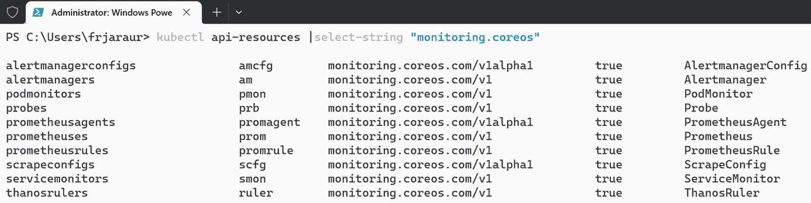

图 12.13 – 可用 Kubernetes API 资源的过滤列表

Prometheus Operator 将使用 **PodMonitor** 和 **ServiceMonitor** 资源按时间间隔查询相关的端点。因此，要监控我们的应用程序，我们需要创建一个自定义的度量导出器，用于提供应用程序的度量数据，并创建一个 PodMonitor 或 ServiceMonitor 来将其暴露给 Prometheus。

1.  让我们快速了解一下已经暴露的一些度量标准。我们将在这里回顾一下 Node Exporter 组件。与该监控组件关联的 Service 资源可以通过以下命令轻松获取：

    ```
    PS C:\Users\frjaraur> kubectl get svc `
    -n monitoring prometheus-prometheus-node-exporter `
    -o jsonpath='{.spec}'
    app.kubernetes.io/name=prometheus-node-exporter label.
    ```

1.  让我们暴露这个 Pod 并查看展示的数据：

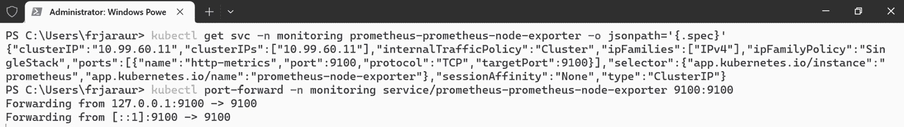

图 12.14 – 通过端口转发功能暴露 Prometheus Node Exporter

1.  现在，我们可以打开一个新的 PowerShell 终端，并使用 `Invoke-WebRequest` 来检索数据，或者使用任何网页浏览器（你将获得一个中间网页，表明度量数据可以在 `/metrics` 路径下找到）：

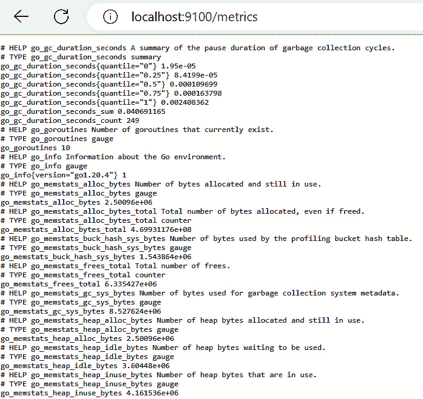

图 12.15 – Node Exporter 提供的度量数据，通过本地端口 9100 的端口转发暴露

Node Exporter 组件的度量数据是通过一个关联的 Service 资源在内部发布的。这就是我们应该如何创建监控端点。我们可以在这里使用两种不同的架构：

+   将我们的监控组件集成到应用程序的 Pod 内部，使用新的容器和 sidecar 模式

+   运行一个独立的 Pod 来部署监控组件，并通过 Kubernetes 覆盖网络在内部检索数据

你必须记住，运行在 Pod 内的容器共享一个公共的 IP 地址，并且总是会一起调度。这可能是主要的区别，也可能是你选择前面列表中第一个选项的原因。运行一个不同的 Pod 还需要在两个 Pod 之间进行一些依赖追踪和节点亲和模式（如果我们希望它们一起运行在同一个主机上）。在这两种情况下，我们都需要一个 PodMonitor 或 ServiceMonitor 资源。

接下来，我们将快速了解 Prometheus 如何在我们为应用程序创建新的导出器时，自动抓取这些导出的度量数据。

## 使用 Prometheus 抓取度量数据

Prometheus 的安装会创建一个新的资源 `Prometheus`，它代表一个 Prometheus 实例。我们可以列出集群中的 Prometheus 实例（我们使用了 `-A` 来包括所有命名空间进行搜索）：

```
PS C:\Users\frjaraur> kubectl get Prometheus -A
NAMESPACE    NAME           VERSION   DESIRED   READY   RECONCILED   AVAILABLE   AGE
monitoring   prometheus-kube-prom-prometheus   v2.45.0   1         1       True         True        17h
```

如果我们查看这个资源，我们会发现有两个有趣的键决定了要监控哪些资源。让我们获取 `Prometheus` 资源的 YAML 清单并回顾一些有趣的键：

```
PS C:\Users\frjaraur> kubectl get Prometheus -n monitoring prometheus-kube-prom-prometheus  -o yaml
apiVersion: monitoring.coreos.com/v1
kind: Prometheus
...
spec:
  podMonitorNamespaceSelector: {}
  podMonitorSelector:
    matchLabels:
      release: prometheus-stack
…
  serviceMonitorNamespaceSelector: {}
  serviceMonitorSelector:
    matchLabels:
      release: prometheus-stack
```

这个`Prometheus`资源包括了修改 Prometheus 本身行为的重要键值（例如 `scrapeInterval`、数据 `retention` 和 `evaluationInterval`）。从前面的代码片段中，我们可以看到，如果所有命名空间中的 ServiceMonitor 资源包含 `release=prometheus-stack` 标签，它们都会被监控。PodMonitors 也需要这样做，因此我们只需为我们的新应用监控创建一个 ServiceMonitor 资源。以下是一个示例：

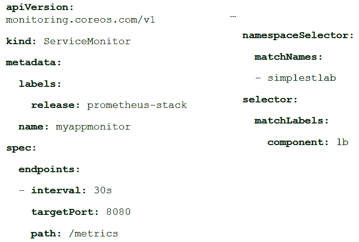

图 12.16 – ServiceMonitor 示例清单

在*实验室*部分，我们将为我们的应用程序添加一些开源监控端点（来自[`grafana.com/oss/prometheus/exporters/`](https://grafana.com/oss/prometheus/exporters/)的**Postgres exporter**）。

现在，让我们回顾一些配置良好日志记录策略的快速概念，适用于我们的应用程序。

# 记录应用程序的重要信息

在本节中，我们将概述不同的日志记录策略，并讨论如何实现一个开源的、支持 Kubernetes 的解决方案，例如**Grafana Loki**。

在*第四章*中，*运行 Docker 容器*，我们讨论了可用于应用程序的策略。作为经验法则，运行在容器中的进程应该始终记录标准输出和错误输出。这使得所有进程更容易（或至少为所有进程同时准备了一个好的解决方案）。然而，您的应用程序可能需要针对不同用例采用不同的**日志记录策略**。例如，您不应将任何敏感信息记录到标准输出中。虽然本地日志记录在开发应用程序时可能很有帮助，但在开发或生产环境中，这可能会非常棘手（甚至仅限于 Kubernetes 管理员可用）。因此，我们应使用卷或外部日志采集平台。使用卷可能需要额外的访问权限，以便您可以从存储后端恢复日志，因此外部平台将是一个更好的方法来满足您的日志记录需求。事实上，如果您的应用程序运行在 Kubernetes 中，使用外部平台可以让您的生活更轻松。有很多 Kubernetes 就绪的日志记录平台，允许您将所有容器日志推送到后端，您可以在其中管理并为不同用户添加适当的视图。这将解决日志记录敏感数据的问题，因为它可能在调试过程中需要使用，但只能对某些信任的用户可见。您可能需要询问 Kubernetes 管理员，因为您的 Kubernetes 平台可能已经有一个正在运行的日志记录解决方案。

在本章中，我们将讨论如何在 Kubernetes 环境中使用 Grafana Loki 来读取并转发应用程序的容器日志，并将其发送到统一的后端，在那里我们可以使用 Grafana 等额外工具来查看应用程序的数据。

Grafana Loki 可以使用不同的模式进行部署，具体取决于你的平台规模和预期的日志数量。为了开发和准备你的应用程序日志，我们将使用最小化安装，就像我们之前使用 Prometheus 一样。我们将使用**单体**模式（[`grafana.com/docs/loki/latest/fundamentals/architecture/deployment-modes/`](https://grafana.com/docs/loki/latest/fundamentals/architecture/deployment-modes/)），在这种模式下，Loki 的所有微服务将一起运行在单个容器镜像中。Loki 能够管理大量日志，并且使用对象存储后端。对于我们作为开发者的需求来说，这不需要，我们将仅使用由我们自己的 Kubernetes 平台提供的本地存储（文件系统模式）。

虽然 Grafana Loki 提供了服务器端的功能，**Grafana Promtail** 将作为代理工作，读取、准备并将日志发送到 Loki 后端。

我们不关心 Grafana Loki 或 Prometheus 如何工作或如何定制化。本章的目的是学习如何使用它们来监控和记录我们的应用程序进程，所以我们将安装 Loki 并配置 Promtail 从 Kubernetes 部署的应用程序中获取日志。

## 安装和配置 Loki 与 Promtail

让我们继续在 Kubernetes 集群中安装 Grafana Loki，这样我们就能管理所有平台日志。之后，我们将准备好安装 Promtail 来检索并推送日志到 Loki 服务器：

1.  我们将再次使用`helm`在不同的命名空间中安装 Grafana Loki。最简单的安装方法是使用单一二进制文件图表方法和文件系统存储（[`grafana.com/docs/loki/latest/installation/helm/install-monolithic`](https://grafana.com/docs/loki/latest/installation/helm/install-monolithic)）：

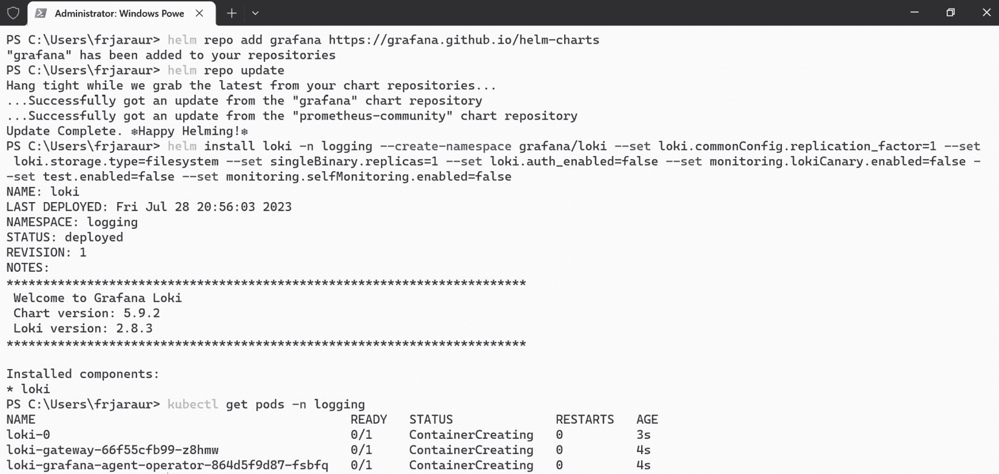

图 12.17 – 使用 Helm 安装 Grafana Loki

1.  我们使用了以下设置来应用单体模式并移除 API 身份验证：

    ```
    --set loki.commonConfig.replication_factor=1 --set loki.commonConfig.storage.type=filesystem --set singleBinary.replicas=1 --set loki.auth_enabled=false --set monitoring.lokiCanary.enabled=false --set test.enabled=false --set monitoring.selfMonitoring.enabled=false
    ```

    所有这些标志将帮助你减少测试环境所需的硬件资源。

1.  它现在已启动并运行。让我们在安装 Promtail 组件之前快速查看服务资源：

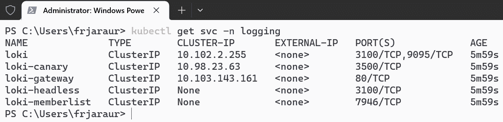

图 12.18 – Grafana Loki 服务资源

我们已经查看了 Loki 服务，因为我们将配置 Promtail 将所有检索到的日志信息发送到`loki-gateway` 服务，该服务在 `logging` 命名空间中的端口 `80` 上可用。

1.  Helm 可以通过执行 `helm show values <CHART>` 显示用于安装 Helm Chart 的默认值。因此，我们可以通过执行 `helm show values grafana/promtail` 来获取 `grafana/promtail` Chart 的默认值。输出内容非常庞大，显示了所有的默认值，但我们只需要查看客户端配置。该配置适用于 Promtail，并定义了将从不同来源读取的日志发送到哪里：

    ```
    PS C:\Users\frjaraur> helm show values `
    grafana/promtail
    …
    config:
    …
      clients:
        - url: http://loki-gateway/loki/api/v1/push
    defaultVolumeMounts key in the chart values YAML file). All the files included will be read and managed by the Promtail agent and the data extracted will be sent to the URL defined in config.clients[].url. This is the basic configuration we need to review because, by default, Kubernetes logs will be included in the config.snippets section. Prometheus, Grafana Loki, and Promtail are quite configurable applications, and their customization can be very tricky. In this chapter, we are reviewing the basics for monitoring and logging your applications with them. It may be very useful for you to review the documentation of each mentioned tool to extend these configurations.
    ```

1.  默认情况下，Promtail 会将所有数据发送到 `http://loki-gateway`，如果我们在日志命名空间中运行该工具，并且与 Grafana Loki 一起使用，就会看到它存在于 Kubernetes 集群中。接下来，我们将使用日志命名空间并使用默认值安装 Promtail：

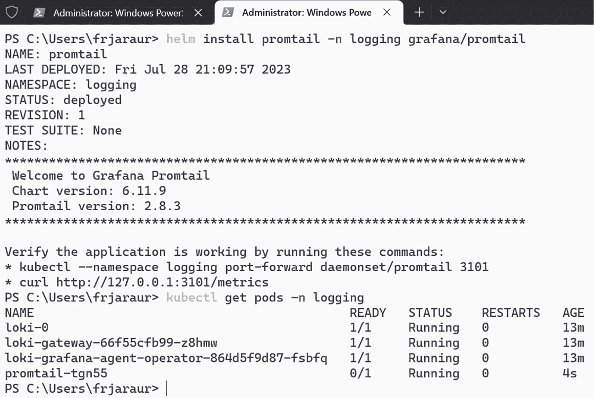

图 12.19 – 使用 Helm Chart 安装 Promtail

1.  安装完成后，我们可以在 Grafana 中查看所有 Kubernetes 集群的日志。但首先，我们需要在 Grafana 中配置 Prometheus（监控）和 Loki（日志）数据源。我们将使用端口转发来公开 Grafana 服务：

    ```
    PS C:\Users\frjaraur> kubectl port-forward `
    -n monitoring service/prometheus-grafana 8080:80
    Forwarding from 127.0.0.1:8080 -> 3000
    admin username with the prom-operator password), accessible at http://localhost:8080, we can configure the data sources by navigating to Home | Adminsitration | Datasources:
    ```

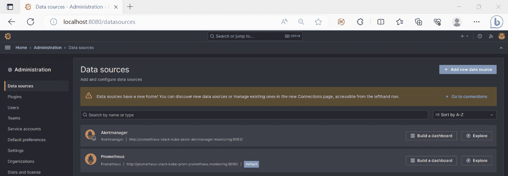

图 12.20 – Grafana – 数据源配置

1.  请注意，使用 `kube-prometheus-stack` Chart 部署 Grafana 时，Prometheus 和 Alertmanager 数据源已经为我们配置好了。我们将为 Loki 配置一个新的数据源：

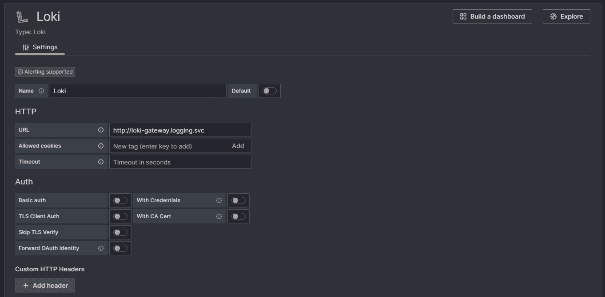

图 12.21 – Grafana Loki 数据源配置

1.  点击 **保存并测试** – 就这样！你可能会收到一个错误信息，提示“**数据源已连接，但未收到标签。请确认 Loki 和 Promtail 已正确配置**”。这表示我们还没有可用于数据索引的标签；这通常发生在你刚刚安装完 Promtail 组件时。如果等几分钟，标签就会变得可用，一切都会正常工作。无论如何，我们可以通过点击 **探索** 按钮，在 **数据源** | **设置** 页面开头来验证 Loki 数据。**探索** 部分允许我们直接从任何 Loki 类型的数据源中检索数据。在我们的示例中，我们将 Loki 作为数据源的名称，并可以选择 Promtail 生成的标签，使用来自我们容器的信息：

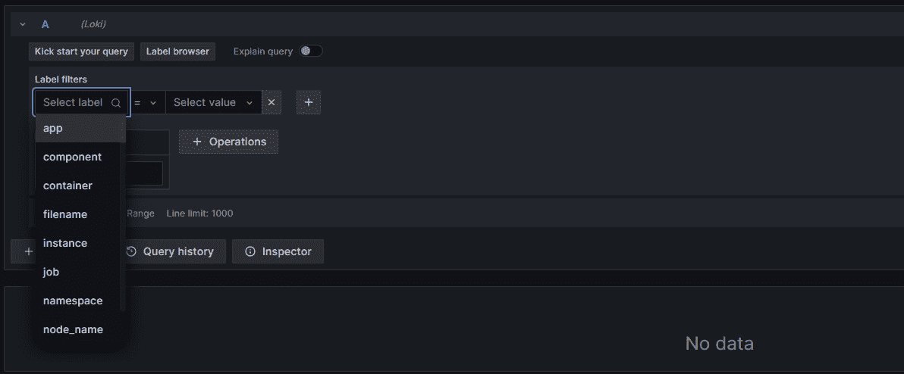

图 12.22 – 探索 Loki 数据源

1.  我们只需选择命名空间标签和列表中的相应值，即可检索来自 `kube-system` 命名空间的所有日志：

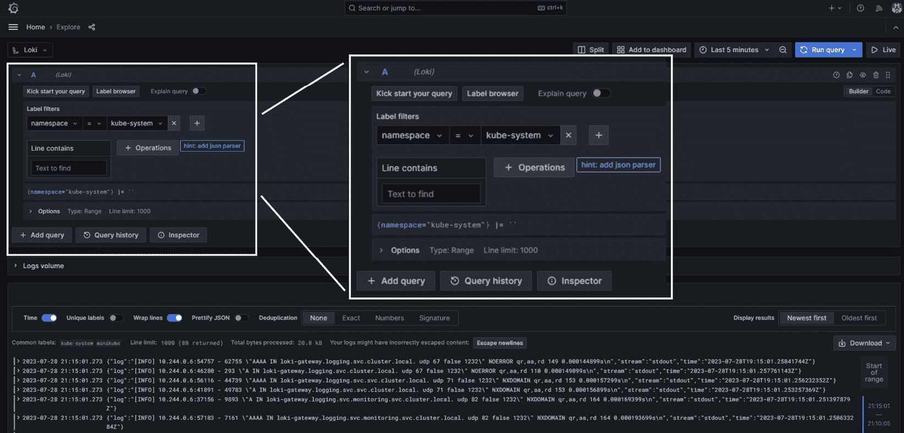

图 12.23 – 探索来自 kube-system 命名空间的所有 Pod 资源的日志

你将能够根据当前标签进行筛选，并增加非常有用的操作，如分组、计数某些字符串出现的次数、搜索特定的正则表达式等。提供了许多选项，它们对你作为开发者会非常有用。你可以将不同应用组件的所有日志集中在一个统一的仪表板中，甚至准备你自己的应用仪表板，混合不同的数据源来展示指标和日志。

Prometheus、Loki 和 Grafana 是非常强大的工具，我们在这里只能涵盖基础内容。你可以通过查看 Grafana 文档 ([`grafana.com/docs/grafana/latest/dashboards/use-dashboards/`](https://grafana.com/docs/grafana/latest/dashboards/use-dashboards/)) 来创建仪表板。Grafana 社区提供了许多仪表板示例 ([`grafana.com/grafana/dashboards/`](https://grafana.com/grafana/dashboards/))。我们将在*实验室*部分为 `simplestlab` 应用创建一个功能齐全的仪表板。

下一部分将介绍一些负载测试机制，并回顾如何使用开源工具**Grafana k6**。

# 对你的应用进行负载测试

**负载测试**是我们通过测量应用在不同压力情况下的表现来审视应用如何工作的任务。作为开发者，你总是需要考虑你的应用在这些压力情境下如何应对，并尝试回答以下一些问题：

+   我的应用能否在高用户负载下正常运行？

+   在这种情况下，我的应用组件将如何受到影响？

+   扩展某些组件是否能维持整体性能，还是会导致其他组件出现问题？

在应用上线之前进行测试，帮助我们预测应用的表现。**自动化**是模拟大量请求的关键。

在负载测试或**性能测试**中，我们试图给应用施加压力并增加它的工作负载。我们可以出于不同的原因对应用进行测试：

+   理解我们的应用在预期负载下的行为

+   确定应用能够承受的最大负载

+   尝试发现可能随着时间推移出现的内存或性能问题（内存泄漏、存储资源的耗尽、缓存等）

+   测试我们的应用在某些情况下如何自动扩展，以及不同组件将如何受到影响

+   在开发环境中确认一些配置更改，确保它们在生产环境中进行之前不会出现问题

+   测试应用在不同位置的表现，特别是那些网络速度不同的地方

所有这些测试点都可以通过一些脚本技术和自动化来交付。根据我们正在测试的应用程序，我们可以使用一些著名的、简单但有效的工具，如 **Apache JMeter**（[`jmeter.apache.org`](https://jmeter.apache.org)）或更简单的 **Apache Bench**（[`httpd.apache.org/docs/2.4/programs/ab.xhtml`](https://httpd.apache.org/docs/2.4/programs/ab.xhtml)）。这些工具可以模拟应用程序请求，但它们永远不会像真实的网页浏览器一样行为，而 **Selenium**（[`www.selenium.dev`](https://www.selenium.dev)）则会。该工具包括一个 **WebDriver** 组件，模拟 **万维网联盟**（**W3C**）的浏览体验，但它可能在集成到自动化过程中时比较复杂（不同版本和与不同语言的集成可能非常耗时）。Grafana 提供了 k6，它是一个开源工具，几年前由 Load Impact 创建，现在是 Grafana 工具生态系统的一部分。它是一个非常小巧的工具，使用 Go 编写，并可以通过 JavaScript 进行配置，这使得它非常定制化。

重要提示

Grafana k6 的功能可以通过使用扩展来扩展，尽管你需要重新编译 k6 二进制文件以包含它们（[`k6.io/docs/extensions`](https://k6.io/docs/extensions)）。

Grafana k6 测试可以集成到 **Grafana SaaS 平台**（**Grafana Cloud**）或你自己的 Grafana 环境中，尽管在编写本书时，某些功能仅在云平台中提供。

安装这个工具非常简单；它可以在 Linux、macOS 和 Windows 上运行，并适用于在容器中运行，这使得它非常适合在 Kubernetes 中作为 Job 资源运行。

要在 Windows 上安装此工具，请以管理员权限打开 PowerShell 控制台并执行 `winget` `install k6`：

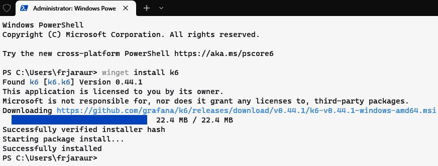

图 12.24 – 在 Windows 上安装 Grafana k6

让我们通过编写一个简单的 JavaScript `check` 脚本来快速看看它的使用方法：

```
import { check } from "k6";
import http from "k6/http";
export default function() {
  let res = http.get("https://www.example.com/");
  check(res, {
    "is status 200": (r) => r.status === 200
  });
};
```

现在我们可以测试这个示例脚本，模拟五个虚拟用户运行 10 秒钟，使用 k6 命令行：

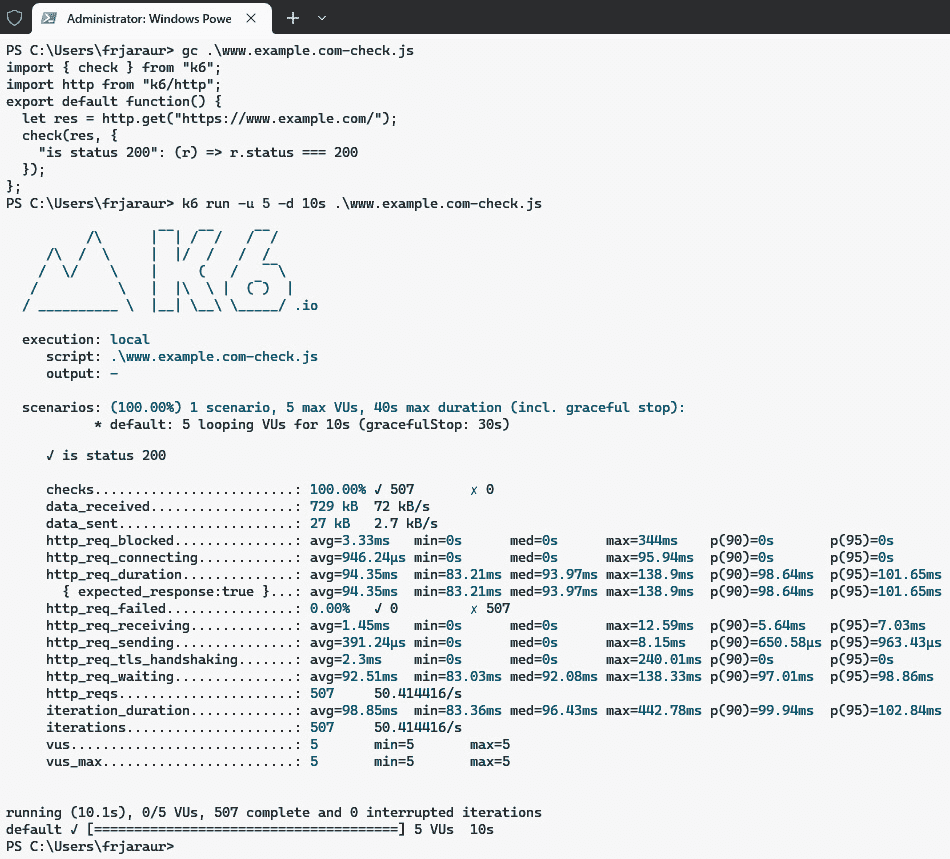

图 12.25 – 执行 k6 测试脚本

在前面的示例中，我们正在验证从页面返回的 `200` 代码。现在我们可以使用 5,000 个虚拟用户在相同的时间内进行测试，这可能会在后台引发性能问题。结果可以与不同的分析工具集成，如 Prometheus、Datadog 等。如果你已经熟悉 Prometheus 和 Grafana，你可能会喜欢 k6。

在 [`k6.io/docs/examples`](https://k6.io/docs/examples) 中有一些很好的使用示例，Grafana 文档中列出了不同的用例：

+   单个和复杂的 API 请求

+   HTTP 和 OAuth 身份验证与授权

+   令牌的关联、动态数据和 Cookie 管理

+   POST 数据参数化和 HTML 表单以及结果解析

+   数据上传或抓取网站

+   HTTP2、WebSockets 和 SOAP 的负载测试

我们可以通过添加一些内容解析，并在测试执行过程中增加或减少虚拟用户的数量，来创建一个更复杂的示例：

```
import http from 'k6/http';
import { sleep, check } from 'k6';
import {parseHTML} from "k6/html";
export default function() {
    const res = http.get("https://k6.io/docs/");
    const doc = parseHTML(res.body);
    sleep(1);
    doc.find("link").toArray().forEach(function (item) {
        console.log(item.attr("href"));
     });
}
```

在前面的代码片段中，我们正在查找所有的 `link` 字符串，并检索它们的 `href` 值：

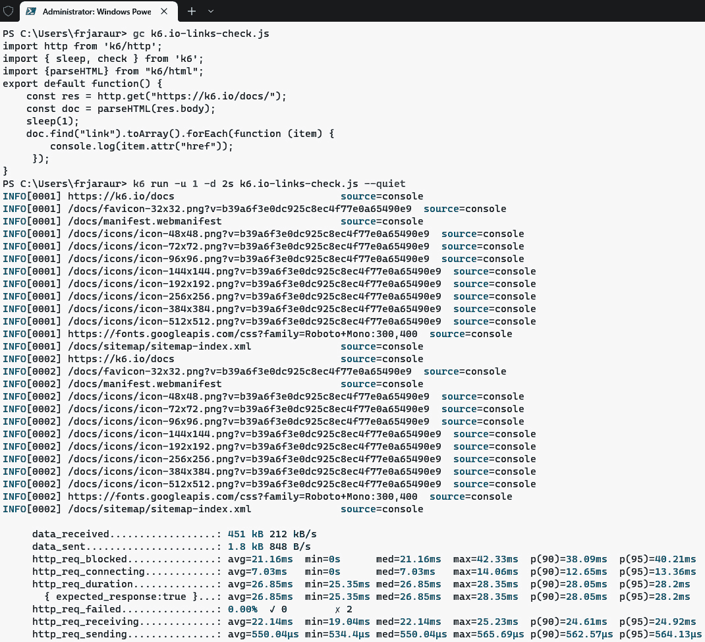

图 12.26 – 执行一个 k6 测试脚本，解析“链接”字符串

Grafana k6 非常可配置。我们可以定义阶段，在这些阶段中可以改变探针在检查过程中的行为，并且有许多复杂的功能完全超出了本书的范围。我们建议您阅读该工具的文档，以更好地理解其功能并根据需求进行定制。

现在我们将进入仪表化部分。在下一节中，我们将学习如何将一些追踪技术集成到我们的应用可观察性策略中。

# 向应用程序的代码中添加仪表化

当您编写应用程序时，应该容易准备适当的监控端点和足够的监控工具，以便检索应用程序的指标。可观察性帮助我们理解应用程序，而不需要真正了解其内部代码。在这一节中，我们将探索一些提供追踪、指标和日志的工具，这些工具帮助我们了解应用程序，而无需积极地知道应用程序的功能。**监控**和**日志记录**是观察任务的一部分，但在不同的背景下。我们积极知道从哪里检索监控和日志信息，但有时，我们需要进一步探讨——例如，当我们运行第三方应用程序或没有足够的时间将监控端点添加到应用程序时。即使在开始规划应用程序时，也很重要为监控做好准备。同样，日志记录部分也是如此——您必须为应用程序提供良好的日志记录信息，而不仅仅是通过进程的输出。

在应用程序的各个组件中分配相同类型的追踪、日志记录和监控将帮助您理解应用程序中发生的事情，并跟踪每个请求在应用程序流程中所采取的不同步骤。获取的追踪、指标和日志数据被视为您应用程序的遥测数据。

**OpenTelemetry** 已成为标准的可观察性框架。它是开源的，并提供不同的工具和 SDK，帮助实现遥测解决方案，轻松地从应用中检索追踪、日志和指标。这些数据可以集成到 Prometheus 和其他可观察性工具中，如 Jaeger。

OpenTelemetry 平台的主要目标是为你的应用程序添加可观察性，而无需任何代码修改。目前支持 Java、Python、Go 和 Ruby 编程语言。与 Kubernetes 中使用 OpenTelemetry 的最简单方式是使用 **OpenTelemetry Operator**。这个 Kubernetes Operator 将为我们部署所需的 OpenTelemetry 组件，并创建关联的 CRD，允许我们配置环境。这个实现将会部署收集器的组件，这些组件将接收、处理、过滤并将遥测数据导出到指定的后端，并创建 **OpenTelemetryCollector** 和仪表资源定义。

部署 OpenTelemetry Collector 有四种不同的方式或模式：

+   **Deployment 模式** 允许我们像控制一个简单应用程序在 Kubernetes 中运行一样控制收集器，它适用于监控简单的应用程序。

+   **DaemonSet 模式** 将会作为代理在每个集群节点上运行一个收集器副本。

+   **StatefulSet 模式**，如预期的那样，当你不想丢失任何追踪数据时，这种模式将非常适合。可以执行多个副本，每个副本将拥有一份数据集。

+   **Sidecar 模式** 将会把一个收集器容器附加到应用程序的工作负载上，如果你经常创建和删除应用程序（非常适合开发环境），这种模式更为合适。如果你使用不同的语言并且希望为每个应用组件选择特定的收集器，它还提供了更精细的配置。我们可以通过特殊的注解来管理为特定 Pod 使用哪个收集器。

让我们通过 OpenTelemetry 社区快速运行一个演示环境（[`github.com/open-telemetry/opentelemetry-demo/`](https://github.com/open-telemetry/opentelemetry-demo/)）。这个演示部署了一个网上商店示例应用程序、Grafana、Jaeger 以及获取应用程序度量和追踪所需的 OpenTelemetry 组件。

重要说明

**Jaeger** 是一个分布式追踪平台，它将应用程序的流程和请求映射并分组，帮助我们理解工作流和性能问题，分析我们的服务及其依赖关系，并在应用程序出现故障时追踪根本原因。你可以在项目的 URL 找到它的文档：[`www.jaegertracing.io/`](https://www.jaegertracing.io/)。

完整的演示通过 Helm Chart (`open-telemetry/opentelemetry-demo`) 安装。我们可以在任何命名空间上部署它，但所有组件将一起运行。所展示的演示提供了一个非常好的概览，说明我们可以在 Docker Desktop、Rancher Desktop 或 Minikube 中将哪些内容包含到桌面环境中（也许在其他 Kubernetes 环境中也能工作），尽管它没有遵循一些现代的 OpenTelemetry 最佳实践来添加追踪和管理收集器。这个演示没有部署 Kubernetes OpenTelemetry Operator，而是将 OpenTelemetry Collector 作为一个简单的部署进行部署。

在下一节中，我们将安装演示并审查已部署的应用和工具。

## 审查 OpenTelemetry 演示

在本节中，我们将安装并审查 OpenTelemetry 项目准备的即用型演示的一些重要功能。该演示将部署一个简单的 web 商店应用及管理和检索来自不同组件的追踪数据所需的工具（更多有用的信息可以在 [`opentelemetry.io/docs/demo`](https://opentelemetry.io/docs/demo) 找到）：

1.  首先，我们将按照 [`opentelemetry.io/docs/demo/kubernetes-deployment/`](https://opentelemetry.io/docs/demo/kubernetes-deployment/) 上描述的简单步骤安装演示。我们将添加 OpenTelemetry 项目的 Helm Chart 仓库，然后使用演示包中包含的默认值执行 `helm install`：

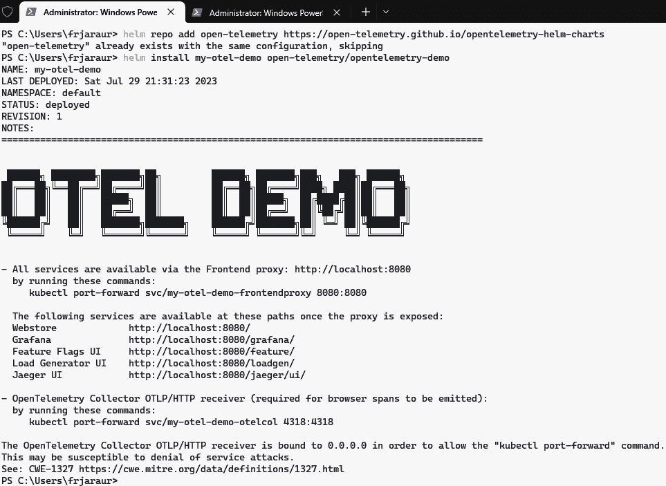

图 12.27 – OpenTelemetry 演示应用部署

如你所见，部署了不同的 web UI。我们可以快速查看创建的不同 Pods：

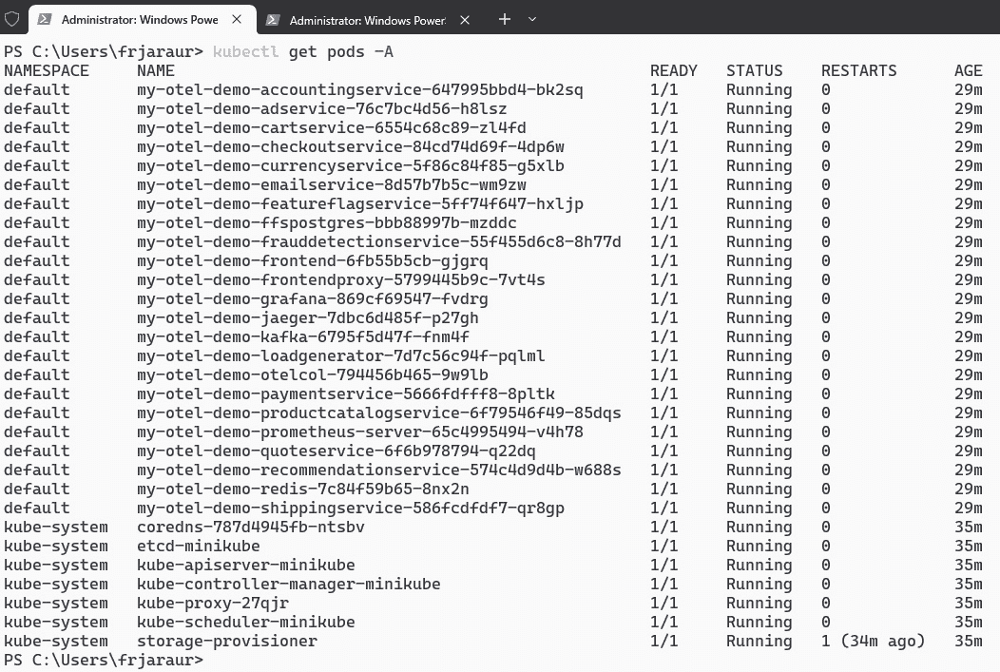

图 12.28 – OpenTelemetry 演示应用运行的 Pods

```
that OpenTelemetry Collector has been deployed using a deployment that will monitor all the applications instead of selected ones. Please read the OpenTelemetry documentation (https://opentelemetry.io/docs) and specific guides available for the associated Helm Charts (https://github.com/open-telemetry/opentelemetry-operator and https://github.com/open-telemetry/opentelemetry-helm-charts/tree/main/charts/opentelemetry-operator).
```

1.  我们将使用端口转发，以便快速轻松地访问所有可用的演示 web UI。通过演示 Helm Chart 部署的反向代理，所有的 web UI 都可以通过 localhost 在不同路径下同时访问。web 商店应用将可以在 `http://localhost:8080` 访问：

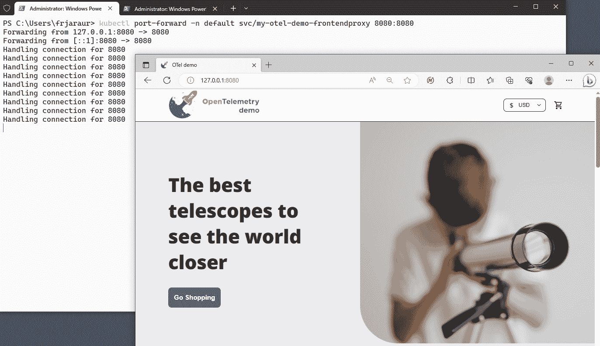

图 12.29 – 使用端口转发 kubectl 功能访问的 web 商店演示应用

演示 web 商店展示了望远镜的目录，并将模拟购物体验。

1.  我们现在可以在 `http://localhost:8080/jaeguer/ui` 访问 Jaeger：

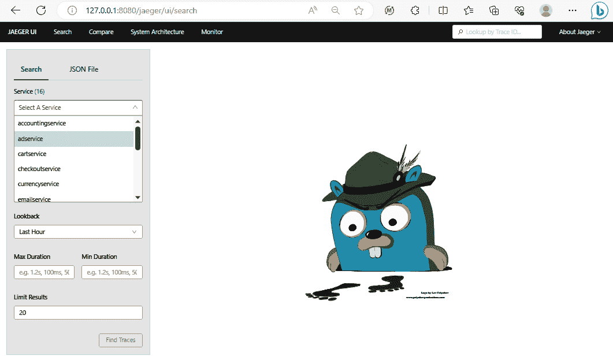

图 12.30 – Jaeger UI 使用端口转发 kubectl 功能

1.  在 Jaeger UI 中，我们可以选择要查看的服务，不同的追踪数据会出现在右侧面板：

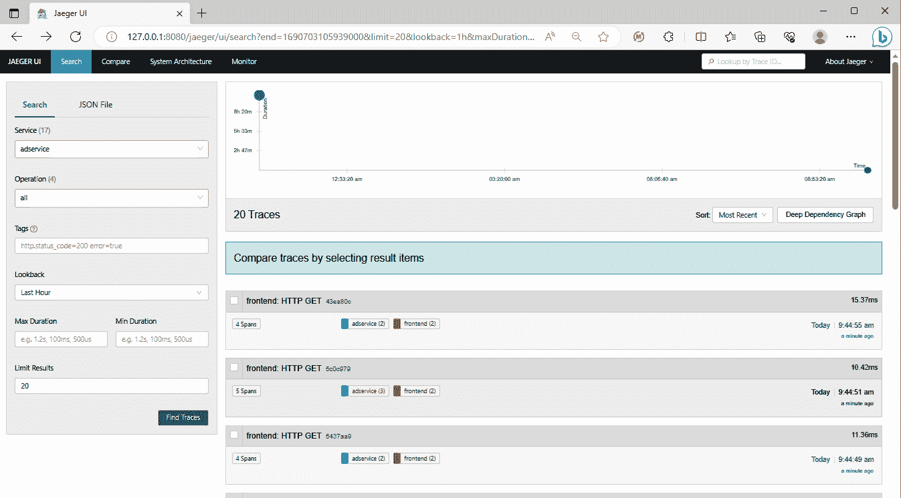

图 12.31 – Jaeger UI 显示不同应用服务的追踪信息

1.  **系统架构** 标签下也提供了架构概述，以便你可以验证不同应用组件之间的关系：

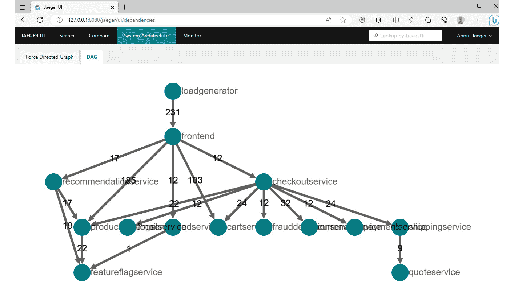

图 12.32 – Jaeger UI 显示应用程序组件

请注意，这里有一个负载生成工作负载，它正在为我们创建合成请求，以便能够从演示环境中检索一些统计信息和追踪数据。

1.  演示部署还安装了 Grafana 和 Prometheus。Grafana 用户界面可以通过 `http://localhost:8080/grafana` 访问，Prometheus 和 Jaeger 数据源已为我们配置好：

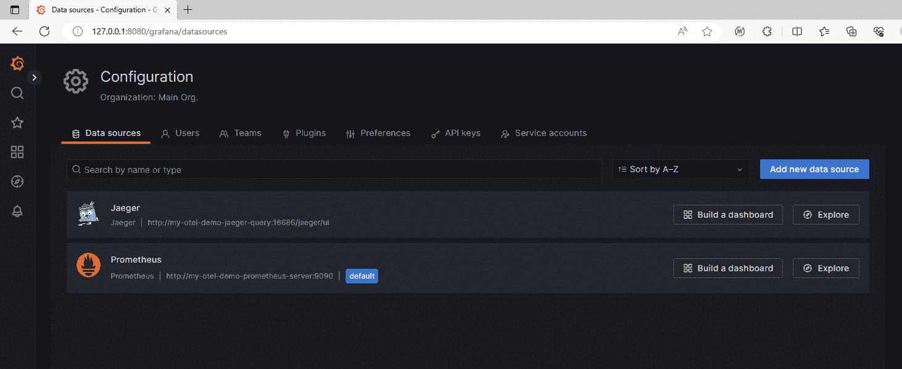

图 12.33 – Grafana 用户界面，显示已配置的数据源

因此，我们可以使用 Grafana 绘制来自这两个数据源的数据，并创建一个应用程序仪表板。OpenTelemetry 的团队为我们准备了一些仪表板，显示应用程序的度量指标和跟踪信息：

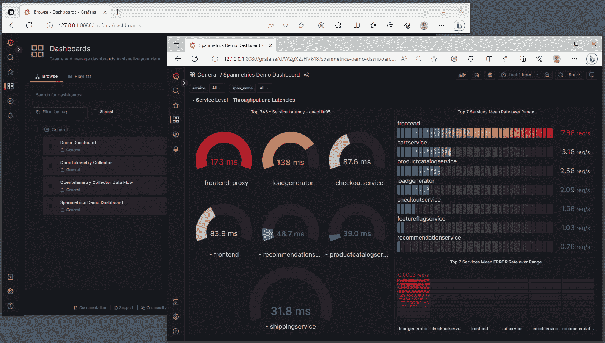

图 12.34 – Grafana 的仪表板页面和 Spammetrics 演示仪表板，显示每个服务的当前请求量

我们本可以在此场景中加入 Grafana Loki，添加一些日志条目，并最终创建一个自定义仪表板，包含所有相关的度量指标、跟踪和日志条目。Grafana 平台甚至可以将某些数据库作为数据源，从而改善我们应用程序健康状况的整体概览。

# 实验

本节将向你展示如何使用 Kubernetes 中的 `simplestlab` 三层应用程序实现本章中介绍的一些技术。我们将部署一个完整的可观测性平台，包括 Grafana、Prometheus 和 Loki，并为我们的应用程序组件准备一些导出器。

这些实验室的代码可以在本书的 GitHub 仓库中找到，地址是 [`github.com/PacktPublishing/Containers-for-Developers-Handbook.git`](https://github.com/PacktPublishing/Containers-for-Developers-Handbook.git)。通过执行 `git clone https://github.com/PacktPublishing/Containers-for-Developers-Handbook.git` 下载所有内容，或如果你之前已下载过该仓库，则执行 `git pull` 确保你获得最新版本。所有运行实验室所需的清单和步骤都包含在 `Containers-for-Developers-Handbook/Chapter12` 目录中。实验所需的所有清单都包含在代码仓库中。下载相关 GitHub 后，`Chapter12` 目录中提供了详细的运行实验室的说明。让我们简要了解一下要执行的步骤：

1.  首先，我们将在桌面计算机上创建一个 Minikube Kubernetes 环境。我们将部署一个包含一个节点的简单集群，并启用 ingress 和 metrics-server 插件：

    ```
    Chapter12$ minikube start --driver=hyperv /
    --memory=6gb --cpus=2 --cni=calico /
    simplestlab application, which we used in previous chapters, on Kubernetes. The following steps will be executed inside the Chapter12 folder:

    ```

    Chapter12$ kubectl create ns simplestlab

    Chapter12$ kubectl create -f .\simplestlab\ /

    集群中的 simplestlab 应用程序。

    ```

    ```

1.  接下来，我们将在我们的 Kubernetes 桌面平台上部署一个功能完整的监控和日志记录环境。为此，我们将首先部署 Kubernetes Prometheus 栈。我们准备了一个自定义的`kube-prometheus-stack.values.yaml`值文件，包含适合部署小型环境（包括 Grafana 和 Prometheus）的内容。我们已在`Chapter12/charts`目录中提供了所需的 Helm Charts。在这种情况下，我们将使用`kube-prometheus-stack`子目录。要部署解决方案，我们将使用以下命令：

    ```
    Chapter12$ helm install kube-prometheus-stack /
    --namespace monitoring --create-namespace /
    hosts file (/etc/hosts or c:\windows\system32\drivers\etc\hosts) to include the Minikube IP address for grafana.local.lab and simplestlab.local.lab. We will now be able to access Grafana, published in our ingress controller, at https://grafana.local.lab.Then, we will deploy Grafana Loki to retrieve the logs from all the applications and the Kubernetes platform. We will use a custom values file (`loki.values.yaml`) to deploy Loki that’s included inside `Chapter12` directory. The file has already been prepared for you with the minimum requirements for deploying a functional Loki environment. We will use the following command:

    ```

    helm install loki --namespace logging /

    Chapter12/charts/promtail 目录。我们将保持默认值不变，因为与 Loki 的通信仅限于内部：

    ```
    container_cpu_usage_seconds_total and container_memory_max_usage_bytes metrics, which were retrieved using  Prometheus, and the simplestlab application logs in Loki thanks to the Promtail component.
    ```

    ```

    ```

1.  到本章实验结束时，我们将修改我们的`simplestlab`应用，添加一些 Prometheus 导出器来监控不同的应用组件，这将帮助我们定制这些组件，以达到最佳性能。我们将集成一个 Postgres 数据库导出器和 NGINX 导出器，后者用于`simplestlab`的`loadbalancer`组件。两者的集成清单已为你准备好，位于`Chapter12/exporters`目录中。

1.  必须配置 Prometheus 来轮询这些新的目标——Postgres 数据库和 NGINX 导出器。我们将为每个目标准备一个 ServiceMonitor 资源，告知 Prometheus 从这些新源中获取指标。这些 ServiceMonitor 资源清单包含在`Chapter12/exporters`目录中。以下是为 NGINX 组件准备的清单：

    ```
    apiVersion: monitoring.coreos.com/v1
    kind: ServiceMonitor
    metadata:
      labels:
        component: lb
        app: simplestlab
        release: kube-prometheus-stack
      name: lb
      namespace: simplestlab
    spec:
      endpoints:
      - path: /metrics
        port: exporter
        interval: 30s
      jobLabel: jobLabel
      selector:
        matchLabels:
          component: lb
          app: simplestlab
    ```

1.  关于如何在 Grafana 中使用这些新指标绘制数据的简单查询的详细信息，可以在本章的`Readme.md`文件中找到，该文件位于本书的 GitHub 仓库中。

本章为你准备的实验室将概述如何为你的应用程序实现一个简单的监控和日志记录解决方案，并准备一些指标来回顾你的一些应用组件的性能。

# 总结

在本章中，我们学习了如何为在 Kubernetes 中的应用工作负载实现一些监控、日志记录和追踪的工具和技术。我们还快速浏览了负载测试任务，概述了你应从探针中预期的内容。我们讨论了 Grafana、Prometheus 和 Loki 等工具，但我们在本章讨论的原则可以应用于任何你使用的监控、日志记录或追踪工具。

监控应用程序消耗的硬件资源量，并在统一环境中查看应用程序组件的日志，可以帮助你了解应用程序的限制和需求。如果你测试应用程序在高负载下的表现，它可以帮助改进应用程序的逻辑，并预测在意外情况下的性能。手动添加跟踪到代码中，或使用本章中看到的一些自动化机制，将有助于通过理解洞察和集成，推动应用程序的进一步开发。

在下一章中，我们将把到目前为止所见的所有概念整合到应用生命周期管理中。

# 第四部分：改进应用开发工作流

在本部分中，我们将回顾一些知名的应用生命周期管理阶段和最佳实践。我们将讨论如何通过容器化来改进这些阶段，并回顾一些持续集成和持续部署的逻辑模式。

本部分包含以下章节：

+   *第十三章*，*管理应用生命周期*
