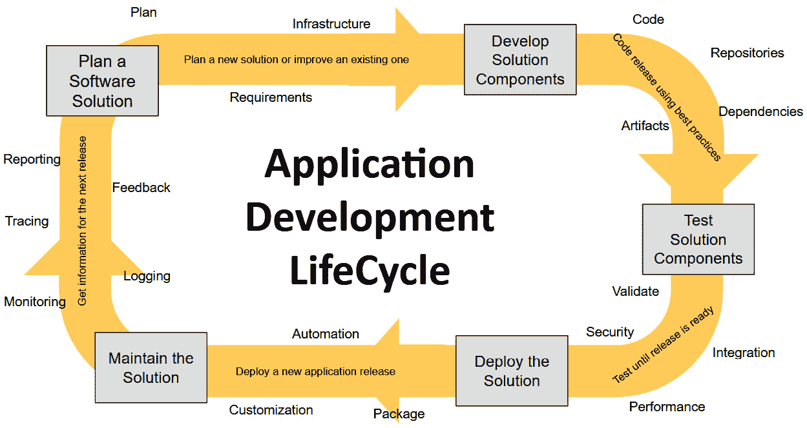
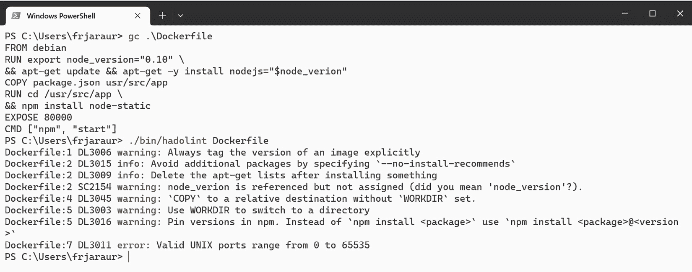
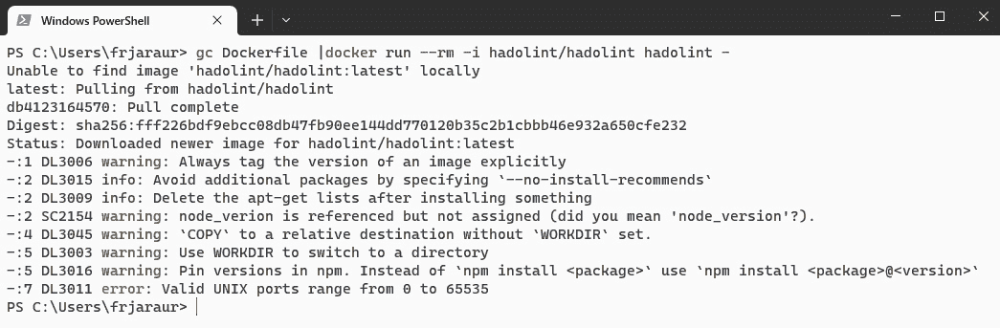
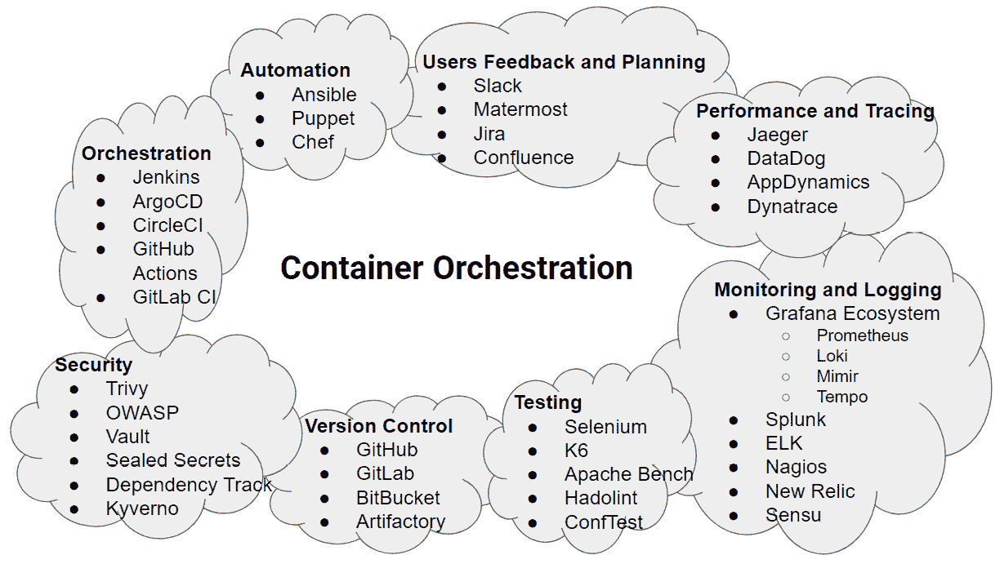
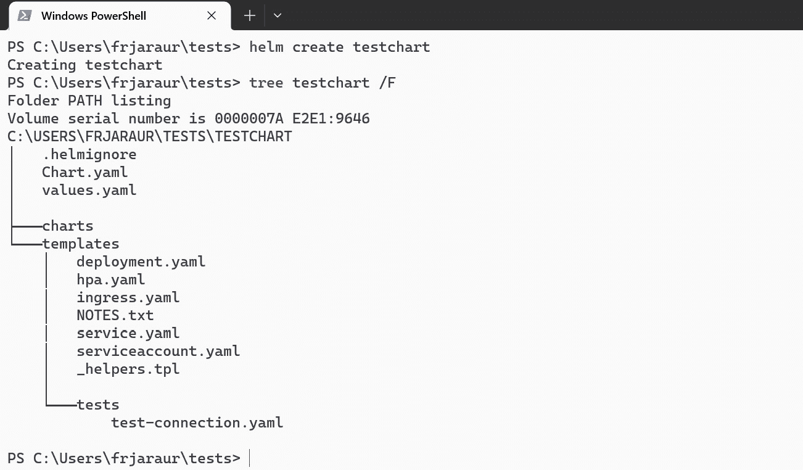
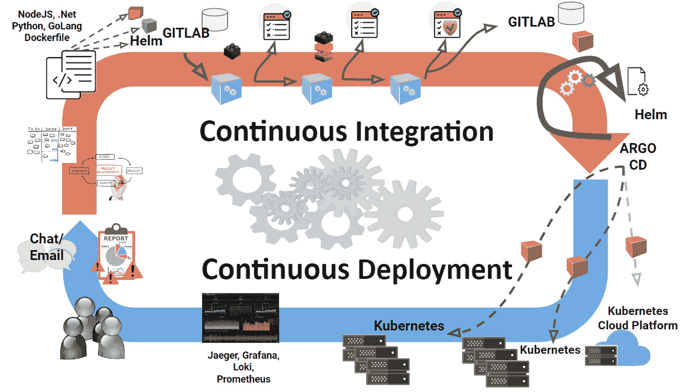

# 13

# 管理应用生命周期

本书回顾了一些现代架构和微服务概念，理解容器如何适应这种新的应用开发逻辑，并介绍了如何使用不同的容器来创建应用程序，以提供其不同的功能。这个概念真的改变了游戏规则：我们可以使用不同的部署策略来实现应用程序的组件，并根据需要扩展或缩减过程。我们使用容器注册中心来存储和管理新的工件和容器镜像，这些镜像又用于创建容器。容器运行时允许我们运行这些组件。然后，我们介绍了编排，它让我们轻松管理应用的可用性和更新。容器编排需要新的资源来解决这些新架构中出现的各种问题。在本章中，我们将探讨如何将所有这些部分结合起来，管理应用生命周期。接着，我们将学习如何通过自动化这些操作来提供一个完整的应用**供应链**，在 Kubernetes 上运行**持续集成/持续交付**（**CI/CD**）。

以下是本章涵盖的主要主题：

+   回顾应用生命周期

+   将我们应用的安全性左移

+   理解 CI 模式

+   自动化持续应用部署

+   使用 Kubernetes 编排 CI/CD

# 技术需求

本章的实验室内容可以在[`github.com/PacktPublishing/Containers-for-Developers-Handbook/tree/main/Chapter13`](https://github.com/PacktPublishing/Containers-for-Developers-Handbook/tree/main/Chapter13)找到，那里包含了一些扩展的解释，这些内容在本章中被省略，以便更容易跟随。此章的*Code In Action*视频可以在[`packt.link/JdOIY`](https://packt.link/JdOIY)找到。

# 回顾应用生命周期

当我们谈论应用程序如何创建和演变时，必须考虑所有相关的创作和维护过程。应用生命周期包括以下阶段：

1.  软件解决方案的**规划**

1.  应用组件的**开发**

1.  不同的**测试**阶段，包括组件集成和性能测试

1.  解决方案的**部署**

1.  **维护**

如我们所见，整个应用生命周期涉及了大量的人、流程和工具。然而，本书将只涵盖那些可以通过软件容器技术解决的问题。我们可以使用以下架构图来将上述流程放置在更广泛的背景中：



图 13.1 – 基本应用生命周期架构图

现在让我们思考一下，哪些阶段可以使用软件容器来实现。

## 规划软件解决方案

这一阶段涵盖了软件解决方案的早期阶段，即一个想法转变为项目的过程。它包括收集和分析用户、客户及其他项目相关方的**需求**。这些需求始终需要验证，以确保最终开发解决方案的特性。根据项目的规模，可能会需要对目前市场上可用的替代方案以及解决方案的可行性进行探索，可能会因此暂停该过程。项目的成功通常与规划阶段的有效性直接相关，在这个阶段，不同的团队提出架构、基础设施、软件框架和其他可能对最终解决方案至关重要的资源。

重要提示

本书中展示的所有内容都适用于在云环境或本地数据中心基础设施上工作。你可以使用桌面计算机来开发你的应用程序代码，并且可以通过不同的项目阶段使用各种工作流与不同的基础设施平台进行交互，正如我们将在本章中学习的那样。

为项目制定一个良好的**时间表**总是至关重要的，而使用容器有助于改善交付时间，因为容器不需要专门或过于具体的基础设施。你甚至可以在一个平台上启动项目，然后迁移到一个完全不同的平台。容器减少了任何摩擦，消除了基础设施供应商的锁定。

在这一阶段，你还需要为你的应用程序决定**架构**。将应用程序划分为小型、代码独立但能够协作的服务，可以让不同的开发团队并行工作，这将始终加快项目的交付速度。使用微服务架构可以让你作为开发者专注于特定的功能，并按照定义的规范交付你的组件，以确保正确的集成。如果需要，还必须为应用程序的任何进程进行扩展或缩减的逻辑准备，并确保组件的**高可用性**（**HA**）和韧性。这将为你的解决方案增加灵活性，并提高用户的整体可用性。

## 开发应用程序的组件

这一阶段涉及为你的应用程序编写代码。当你开发微服务应用程序时，可以选择最适合的编程语言，但你必须注意所使用的依赖关系中的问题，并理解使用某些组件而不是其他组件所带来的风险。使用开源库或框架总是需要对维护者的活动和其代码的成熟度有良好的了解。

在微服务模型中，你的应用程序提供其 API，资源和其他组件使用它们。如果计划启用多个实例，必须确保应用程序的逻辑允许这种情况。为避免基础设施摩擦并提供最大可用性，确保应用程序在不同情况下运行，管理其依赖关系，并启用一些熔断器。你需要弄清楚当某些组件出现故障时，处理过程的行为，如何在丢失连接并恢复时重新连接，如果决定在云平台或不同集群中执行应用程序的组件时会发生什么，等等。

## 测试你的应用程序

一旦开发完成，测试阶段的选择将被触发。由于这是一个迭代过程，你可以交付应用程序的某些组件（甚至完整解决方案），但直到所有测试返回正面结果之前，应用程序都不会真正完成。我们在准备和执行测试时必须始终考虑以下原则：

+   测试必须满足预期要求

+   测试应由第三方团队执行，这些团队未参与应用程序的设计或开发，以保持测试的独立性

+   自动化有助于在不同的迭代中在相同的情况下重现测试

+   测试必须在小组件或一组一起运行的组件上执行

让我们看看一些测试类型以及容器如何将它们集成：

+   **单元测试**：这种测试类型测试应用程序的*单个*组件。通常在*开发阶段*生成和执行，因为开发人员需要知道他们的代码是否按预期工作。根据组件代码的复杂性和请求返回的对象，它们可能会被包括在容器探针中。如果返回的状态无效，则该组件将不被认为是健康的，尽管可以在验证返回数据时包括进一步的模式匹配。如果你正在开发一个通过 API 工作的组件，应该考虑有一个始终返回有效值的测试请求，或者使用模拟数据。单元测试有助于在修复问题时验证代码的有效性，它们还使你的代码更加模块化（微服务）。每个组件都应包含自己的单元测试，我们还可以根据定义的标准进行一些代码质量验证。

+   **集成测试**：这些测试验证你的软件解决方案中*不同*组件是如何协同工作的。它们帮助我们识别组件之间的问题，并修复所有组件的交付和交互。因此，这类测试需要在不同组件的开发者之间进行安排，并且需要一致地规划。如果我们的应用程序组件在容器中运行，那么准备 Docker Compose 或某些 Kubernetes 清单以在开发环境中同时运行所有必需的组件将变得非常容易——尽管这些测试也可以在远程 CI/CD 平台上自动化执行，正如我们稍后在本章的 *Kubernetes 中的 CI/CD 编排* 部分中所看到的那样。如果某些组件对于应用程序的健康至关重要，它们的端点或探针可以集成到监控平台中，以确保一切按预期工作。

+   **回归测试**：这些测试验证新的更改不会引入新的问题或破坏整体项目。在这些测试中使用容器可以显著改善整体过程。我们可以使用新的容器镜像构建进行前进，或使用先前的镜像进行回滚。如果你的代码在发布之间发生了重大变化，比如因为升级到了新的 Python 或 Java 版本而导致完全不同的开发平台，可能会比较棘手，但使用容器可以使这一过程变得顺畅简单。回归测试帮助我们解决与代码进展或更改（解决方案的演变）相关的任何问题，这些更改可能会破坏当前应用程序的行为。

+   `depends_on` 键，但建议在你的代码中解决任何依赖顺序问题，因为常用的容器编排器不包含这种键，通常需要其他机制来管理依赖关系。你可以包含额外的 `init` 容器或侧车容器，它们将在其他容器启动之前检查所需的组件。

+   **压力测试**：这些测试验证你的应用程序组件在压力或高负载下的表现。我们在 *第十二章*中学到了如何使用第三方工具进行测试。这些工具可以部署在容器中并自动化生成成千上万的请求，测试应用程序的组件。如果我们已经处理了应用程序组件的监控，我们可以很好地概览我们进程的硬件需求，并利用这些信息在容器编排集群中最小化资源使用。

+   **性能测试**：一旦你整合了所有组件并测试了每个组件的需求，你可以进一步验证应用程序在不同环境下的表现。例如，你可以测试应用程序在多个前端组件的情况下如何运行，或者研究如何在多个数据库之间分配负载。你可以在容器内准备应用程序和测试，按需扩展或缩减某些组件，并分析性能结果。这可以让你自动分配负载，并为你的软件解决方案增添动态性——但你需要确保代码能够支持某些组件的多个实例同时运行。例如，你可以有多个分布式 NoSQL 数据库实例或多个静态前端实例，但无法同时运行多个数据库实例并写入同一数据文件。这也适用于你的应用程序代码。如果你不阻止文件，无法同时执行多个写入同一文件的进程，因为只有一个进程可以完全访问它。另一个例子是允许来自不同实例的用户请求，而不通过中央数据库管理响应。你必须将请求进行原子化，或者集成机制将请求分发到不同实例。

+   **验收测试**：在交付解决方案之前，你应始终定义**用户验收测试**（**UATs**），因为这些测试可以确保你的代码符合项目初期提出的需求。根据解决方案的复杂性，这一阶段可以包括多个测试（如 alpha 测试、beta 测试）。在这些测试中可能会出现新的问题，因此可能需要进行多次迭代。交付的自动化和使用软件容器带来的简便性，都有助于你在短时间内为用户提供不同的测试环境。

测试阶段对于项目非常重要，因为它有助于提高软件交付的质量和可靠性，提前识别并修复问题，增加项目的可见性，提高利益相关者的信任度和用户满意度。我们还可以减少解决方案的维护成本，因为它在设计和测试时考虑了所有要求，并进行了多次验证，因此在影响生产之前，出现的错误应该已经被解决。另一方面，测试总是费时的，但通过使用容器进行不同的测试，将减少成本（因为测试所需的环境更少）和每次测试所花费的时间（因为我们可以同时部署多个版本并行测试）。

## 部署解决方案

在这个阶段，我们实际上将我们的软件解决方案部署到生产环境中。这个解决方案通常会经历多个环境，直到此步骤完成。例如，我们可以有一个预生产环境来验证某些版本，以及**质量保证**（**QA**）环境，在这些环境中可以进行其他更具体的测试。使用容器使得这些测试阶段的部署变得简单——我们只需更改配置；所有容器镜像将保持一致。将容器作为新的**部署工件**可以简化流程。让我们快速介绍一些容器的打包解决方案：

+   **Helm charts**：这个打包解决方案仅适用于 Kubernetes。Helm chart 只是一个打包好的清单集，其中包含修改应用程序及其组件部署的变量。现在，兼容版本 3 的 Helm charts 是主流。Helm 的旧版本在一段时间前被弃用，使用了 Tiller 特权组件来部署清单，这可能会影响集群的完整性和安全性。较新的版本简化了应用程序的部署方式，无需在 Kubernetes 集群中创建任何 Helm 特定的资源。Helm charts 非常流行，软件供应商为其应用程序提供了自己支持的 chart 仓库，用户可以直接从互联网上将其应用程序安装到自己的 Kubernetes 集群中。

+   `kubectl` 命令行包括 Kustomize 功能，使得它开箱即用，无需在环境中包含新的二进制文件。

+   **Cloud-Native Application Bundle**（**CNAB**）：CNAB 比 Helm 和 Kustomize 更进一步。它的设计目标是包含我们的应用程序运行所需的基础设施和服务。多个工具协同工作，提供基础设施（由 Porter 组件集成 Helm、HashiCorp Terraform 和云提供商的 API）和应用程序（由 Duffle 和 Docker 管理）。这个解决方案目前并未广泛使用，许多组件已被弃用，但值得一提的是，它可以为你提供将软件解决方案（即基础设施和应用程序一起）完全打包的一些思路。

+   **Kubernetes 操作员**：Kubernetes 操作员是部署和管理特定应用程序部署的控制器，近年来已变得非常流行。操作员会在 Kubernetes 集群内部署自己的特定控制器，以管理应用实例。Kubernetes 操作员旨在自我管理应用程序管理和升级中的所有复杂部分。作为用户，你只需要为实例定义某些必需的值，操作员会处理所需组件和依赖项的安装，并在其生命周期内管理任何升级。如果你计划使用 Kubernetes 操作员开发应用程序，确保包含所有应用程序的清单、依赖项以及使应用程序能够启动所需的自动化。第三方 Kubernetes 操作员作为黑盒在 Kubernetes 集群中运行，可能不会包含你期望的所有功能，因此在部署第三方 Kubernetes 操作员之前，阅读文档可能是值得的。

使用微服务架构部署应用程序可以让你整合不同组件的发布。根据你的软件解决方案，你可能会使用一个完整的部署，或者为应用程序的每个组件使用多个小型部署。无论哪种方式，解决方案必须提供项目规划阶段用户和利益相关者所要求的所有功能。

## 维护应用程序

我们可能会认为解决方案的部署是最后一个阶段，但事实并非如此。一旦应用程序进入生产环境，可能需要新增功能、对现有功能进行改进，并且不可避免地会出现新的错误。如果你的应用程序被监控，你可以在实际错误出现之前获得有关不同组件状态的反馈。**日志记录**有助于识别问题，而追踪则可以帮助你改进代码。

但无论如何，应用程序的生命周期继续进行，新项目可能会开始增加新功能，同时修复当前版本中的问题。单体架构需要多个环境来进行这些过程。与此同时，处理两个版本将加倍环境维护的工作量。微服务架构使我们能够根据不同的组件分配工作，从而减少需要为每个组件建立独立环境的需求。更重要的是，我们可以一次更改一个组件，专注于解决特定问题，或者让不同的团队管理每个应用组件，并安排不同的发布时间。这些团队使用最适合其需求功能的编程语言开发代码，同时考虑发布时机和与应用程序的适当集成。然而，值得注意的是，每个团队还需要跟踪其实现中的漏洞和安全问题。

在本书中，我们学习了一些安全实践，这些实践将在我们在容器内工作时（*第二章* 和 *第三章*）以及与容器编排工具一起使用时（*第六章*，*第七章*，和 *第八章*）使我们的应用程序更安全。**左移安全**超越了这些建议，包括从项目一开始就注重安全。我们可以将左移安全视为一种实践，意味着我们不会等到应用程序已经开发、构建并打包完毕后，才去解决软件安全漏洞。在下一部分，我们将学习如何从应用程序生命周期的最初阶段开始处理安全问题，从而显著提高解决方案的整体安全性。

# 将我们的应用程序安全性向左移动

**左移安全**是指在应用程序开发的早期阶段尽早开始进行安全检查的实践。这并不意味着我们在其他阶段不应用任何安全措施，而是指安全性将从应用程序生命周期的最初阶段开始得到改善。左移安全使我们能够在应用程序进入生产环境之前识别出任何漏洞和其他问题。将安全性左移的好处包括以下几点：

+   它通过在开发初期阶段就发现并修复错误，改善了软件解决方案的交付

+   它将应用程序安全性分布到不同的阶段，在每个阶段采取不同的措施，从代码阶段开始，直到应用程序最终部署到基础设施上

+   不同的团队可以实施不同的安全策略和机制，进一步促进组织内安全文化的建设

+   它通过减少因安全性差导致推迟应用程序交付的时间和成本，从而缩短了整体开发周期

现在，让我们了解一些不同的软件开发生命周期方法论，以及它们如何影响安全性。

## 软件生命周期方法论

让我们在这里介绍一些软件生命周期方法论，帮助我们理解在开发阶段加速推进时，安全性的重要性：

+   **瀑布模型**：在此模型中，各个阶段必须*线性*进行，因此一个新阶段必须在前一个阶段结束后开始。该模型在我们不预期有许多需求变动，且项目任务明确时非常有效。然而，该模型缺乏灵活性，使得实施变更变得困难，问题通常会被隐藏，直到项目结束时才暴露。

+   **敏捷模型**：在这个模型中，我们通过*迭代*各个阶段来改进最终的软件解决方案。灵活性和快速响应是这个模型的关键。迭代允许引入新的变化并解决在前一次审查中发现的问题。这个模型的主要问题是它需要各个阶段之间有大量的协作，因此可能不适用于大型项目，但微服务架构非常适合这种开发模型。

+   **螺旋模型**：该模型可以被视为瀑布模型和敏捷模型的*混合体*。最终的软件解决方案将是不同迭代的结果，可以看作是一个完整的软件开发周期。在每一次迭代中，我们从头开始，收集用户需求、设计解决方案、开发代码、进行测试、实施并维护解决方案，然后再进入下一个迭代。敏捷和螺旋开发模型让我们可以在下一次迭代前审查和解决问题，这不仅加快了开发过程，也使解决方案更加安全。

在这些方法中，尤其是敏捷方法已经彻底改变了软件的开发和交付方式。它们的采用使团队能够更快速地工作，并在用户要求新特性时迅速调整软件解决方案。然而，在这种情况下，安全团队可能成为瓶颈。这些团队在软件解决方案进入生产之前进行审查，旨在识别并解决任何漏洞和安全问题，以防恶意用户在生产环境中发现这些问题。如果我们将应用程序拆解成小块（即微服务），那么安全审查任务所需的工作量将乘以拆解后的各个小块数量，即使它们很小。当我们意识到大多数用于审查单体应用程序安全性的传统工具无法在像 Kubernetes 这样的高度分布式和动态环境中使用时，情况变得更糟。

事实上，软件容器和开源解决方案已经在数据中心和云平台中得到广泛应用，以至于我们在部署第三方软件解决方案时，几乎无法了解其内部内容。即使是软件供应商，也会将开源产品嵌入到自己的复杂软件解决方案中。因此，我们不能继续在基础设施和应用层面上使用陈旧的安全方法。

## 应用层的安全性

如前所述，将应用程序的安全性左移意味着尽可能早地将安全机制和最佳实践融入我们的软件开发模型中。但这并不意味着我们将安全问题完全交给开发人员。我们将在测试阶段准备自动化的安全验证，并在开发环境和生产集群中实施安全政策。这将确保每个人都知道已应用的安全措施以及如何实施它们。DevSecOps 团队准备基础设施和应用规则，并与所有开发团队共享。基础设施规则包括在执行环境中强制执行的所有政策，通常是 Kubernetes 云或本地平台。这些政策可能包括，例如，拒绝任何特权容器，拒绝没有资源限制的 Pods，拒绝访问主机文件系统。但请注意，这些规则不属于代码的一部分，尽管它们确实影响应用程序的执行。

如果我们从应用程序的角度考虑安全性，我们可以应用多种技术：

+   **软件组成分析**（**SCA**）：当我们将开源库或其他组件添加到代码中时，我们无意中为应用程序增加了风险。SCA 工具帮助我们识别这些风险，在某些情况下，通过补丁和更新来缓解这些风险。虽然 **静态应用程序安全测试**（**SAST**）工具（我们接下来会讨论）用于在开发周期中查找漏洞，检查代码中的问题，但 SCA 工具提供了持续的漏洞监控。

+   **SAST**：这些测试用于在代码实际编译之前发现漏洞，因此它们在开发阶段的早期执行。运行这些测试的工具会在我们的代码中搜索已知的不安全模式，并将其报告给我们。任何硬编码的机密数据和配置错误将作为问题在分析中被报告。

+   **动态应用程序安全测试**（**DAST**）：这些测试在应用程序运行时执行，即在测试阶段。它们涉及对应用程序组件进行模拟攻击的执行。这些测试可能包括代码注入或格式错误的请求，这些请求可能在某些时刻使你的应用程序崩溃。

这三种测试在将应用程序迁移到生产环境之前，非常有价值地帮助识别漏洞，但在谈论“安全左移”时，SAST 和 SCA 是重点。当自动化到位时，我们可以持续执行这些测试，并使用 **集成开发环境**（**IDE**）插件，在问题实际存入代码之前帮助发现问题。首先，我们可以为特定的编程语言使用任何合适的代码检查工具。接下来我们将讨论这些工具。

## 引入代码检查工具

**代码检查工具**是用来分析我们的代码，寻找问题的工具。根据给定检查工具的质量，它可以从简单的代码改进到更高级的问题进行识别。通常会为不同的编程语言使用特定的代码检查工具。你可以查看你喜欢的 IDE 中可用的扩展。

代码检查工具帮助我们减少开发阶段的代码错误，改善代码风格、构建一致性和性能。

一个简单的代码检查工具将执行以下操作：

+   检查语法错误

+   验证代码标准

+   检查 *代码异味*（代码中表明某些地方可能出错的常见标志）

+   验证安全性检查

+   让你的代码看起来像是由一个人编写的

你应该在代码环境中包含检查工具，但具体选择将取决于你使用的编程语言。优秀的代码检查工具可以根据它们关注的方面进行分类，如下所述：

+   **标准化编码**：例如 SonarLint、Prettier、StandardJS、Brakeman 和 StyleCop。一些编程语言如 .NET 甚至包括它们自己的代码检查工具（Format）。

+   **安全性**：GoSec、ESLint 或 Bandit（Python 模块）。

更重要的是，一些代码检查工具在使用适当的配置时，可以同时用于这两个方面。你可以访问 [`owasp.org/www-community/Source_Code_Analysis_Tools`](https://owasp.org/www-community/Source_Code_Analysis_Tools) 来查看额外的代码分析工具。

让我们通过一个使用 Dockerfile 检查工具 **Hadolint**（[`github.com/hadolint/hadolint`](https://github.com/hadolint/hadolint)）的快速示例来看看。我们将简单地检查一个有效的 Dockerfile，它没有包含我们在*第一章*中学到的最佳实践，*《现代基础设施与 Docker 应用》*。让我们看看下面的屏幕截图：



图 13.2 – 本地 Hadolint 安装检查简单的 Dockerfile

但这里的好处是，我们可以将这个检查工具或任何其他检查工具，包含在容器镜像中，并为我们可能遇到的任何语言准备一组现成的检查工具。让我们看看如何在容器中使用 `docker run –i hadolint/hadolint` `hadolint -` 来实现：



图 13.3 – 基于 Docker 的 Hadolint 执行检查简单的 Dockerfile

重要提示

有一些工具，如**Conftest**（[`www.conftest.dev/`](https://www.conftest.dev/)），可以与不同的**基础设施即代码**（**IaC**）解决方案集成，并在将基础设施脚本部署到平台之前用于验证这些脚本。

代码检查工具可以在我们的开发过程中自动执行，以提高安全性。我们将在讲解 CI/CD 工作流时看到它的实际应用。

在接下来的部分中，我们将介绍简单的方法和实践，了解 CI 如何帮助我们管理应用程序的生命周期。

# 理解 CI 模式

CI 指的是自动化将多个贡献者（甚至多个项目）的代码更改集成到单个项目中的实践。这些自动化过程可能每天发生一次，也可能每小时发生多次。我们可以将 CI 视为软件供应链的一部分，在这里我们构建我们的应用程序（或其组件）并在进入生产之前执行不同的测试。这个过程的第二部分是将应用程序或其组件部署到生产环境中，尽管在特殊情况下也可以使用一些中间环境来测试解决方案的质量或认证（例如，将我们的解决方案与来自供应商的第三方解决方案集成发布）。

在这一部分，我们将按照最直观的逻辑顺序审查一些用于 CI 的最常见模式。开发人员应始终获取他们的代码的最新版本来开始开发新功能，或者重新创建新组件，或者修复新版本。因此，我们将通过从**版本控制系统**（**VCS**）中拉取代码来开始我们的开发过程。

## 代码的版本控制

VCS 是一个工具，可以随时间存储文件和目录的更改，使我们能够以后恢复特定版本。从开发者的角度来看，这个工具至关重要，因为它允许多个开发人员共同工作，并跟踪应用程序代码随时间所做的更改。对代码和创建的构件进行版本控制使我们能够运行特定的集成测试，并部署我们代码的特定发布版本。

这些工具通常以*客户端-服务器*模式运行。用户使用相关命令进行推送和拉取更改。VCS 存储和管理这些更改。一旦所有更改都同步（提交），您就可以继续构建应用程序的构件。如果使用解释性脚本语言，则可能不需要此步骤，尽管可能会创建一些字节码构件以加速应用程序的执行。我们可以自动化此过程，并在特定情况下触发代码的编译 - 例如，当我们提交（同步代码）时。因此，每次仅仅提交我们的代码时，我们就会获得一个带有所有依赖项的**二进制构件**。但是，我们可以进一步在我们的代码仓库上创建不同的分支，以允许不同的用户同时与代码交互或解决不同的代码功能。一旦完成所有所需的更改，我们可以将这些分支 consol 统合到一个共同的分支，并再次构建构件。根据最终产品、找到的问题和所需的功能，这个过程可能很复杂，但是可以使用自动化来创建一个更容易遵循和重现的常规工作流。

当一个项目由多个开发者或团队共同开发时，必须进行一定类型的管理，以避免更改之间的冲突。版本控制系统（VCS）提供了机制来解决当多个开发者同时更改相同文件时不同拉取请求之间的不兼容问题。`MAJOR.MINOR.PATCH` 版本语法，其中 `MAJOR` 表示可能会破坏与之前版本的兼容性的更改，`MINOR` 表示添加了某些功能且没有破坏兼容性，而 `PATCH` 用于解决某些问题，但实际上并没有修改任何先前的功能。另一方面，分支名称可以用来引用在代码中发现的任何问题及其解决方案。

在这个早期阶段，我们可以使用代码检查工具添加一些 **验证测试**，以确保代码语法的正确性、代码质量以及安全功能（如有效的外部依赖项）的存在，并排除任何可能已经进入代码的敏感信息。

如果我们使用容器，我们的代码应至少包含一个 **Dockerfile**，以便创建我们的容器镜像文件。该文件也需要进行版本管理，因此它将存储在我们的代码仓库中（即版本控制系统）。验证测试可以自动化并执行，以验证某些模式，例如用户执行容器的主要进程或暴露的端口。

因此，CI 管道是一组旨在自动化软件应用程序代码验证、构建和集成的工作流过程。相应地，我们在这里简要介绍 DevOps 的概念。

## 引入 DevOps 方法论。

**DevOps** 是一种通过整合和自动化软件开发的某些阶段、与应用程序运行的系统的操作和维护任务以及应用程序本身的相关操作，来改善软件工程的方法论。我们应该把 DevOps 看作是一种文化，它*超越*了你组织中的小组或团队；它适用于整个组织，目的是最小化开发、部署和维护阶段之间的时间和摩擦。

以下列表显示了 DevOps 方法的一些关键特性：

+   自动化软件生命周期中的尽可能多的任务。

+   不同团队之间的协作，作为这种文化的一部分，使事情变得更加高效。

+   持续的任务修订和反馈、自动化以及代码质量，所有这些都是改进软件开发流程的关键。

+   监控和日志记录是应用程序生命周期的一部分，它们对于提高性能和发现代码问题非常重要。

由于 DevOps 涉及大量任务和学科，市面上有许多工具可以帮助你完成不同任务和阶段。例如，对于版本控制系统和代码库，你可以使用非常流行的**云服务**，如 GitHub（2018 年被微软收购）、Atlassian 的 Bitbucket 或 GitLab 等。如果你在寻找**本地解决方案**，你可以使用开源工具，如 Gitea、GitLab 或 Azure DevOps Server。为你的组织选择合适的工具可能会很复杂，因为许多工具提供了多种功能。以下示意图展示了与应用开发阶段相关的部分流行 DevOps 工具，并显示它们最佳的适用位置：



图 13.4 – 最受欢迎的 DevOps 工具

重要提示

最近推出了一种新的方法论，重点关注开发、部署和维护过程的安全性，称为**DevSecOps**。该方法论强调将安全性作为不同团队文化的一部分，延伸至整个过程。这也是我们回顾“左移安全”实践的原因，左移安全是 DevSecOps 的一部分，更接近开发团队。DevSecOps 文化打破了传统的思维方式，以往只有一个单独的团队负责安全，并且仅在软件进入生产环境前的最后阶段参与开发过程，验证代码。

一旦代码同步并验证通过，我们就能构建我们的软件解决方案。接下来我们将讨论这一过程。

## 构建工件

根据编程语言及其依赖项的不同，准备不同版本的环境可能会很棘手。例如，从一个较旧的 Node.js 版本迁移到较新的版本，可能需要独立的构建环境，即使该语言是解释型的，而非编译型的。

想象一种情况，不同的代码开发人员需要在同一环境中同时编译他们的软件。这将是一场完全的混乱，且来自不同版本的错误会接踵而至。自动化可以让我们打包环境并使用合适的环境来构建软件。但我们可以进一步通过使用软件容器来实现，因为这些环境只需要在运行时存在，特别是在需要时。我们可以利用软件容器来构建我们的软件，使用所需的构建环境。成功构建并验证新工件后，完整构建过程的容器镜像会被存储在容器镜像注册中心。

更重要的是，我们可以准备一个完整的工作流程，其中所有代码都通过我们的规则进行验证（代码语法、代码质量、非特权执行等），然后工作流程触发代码的构建，最后，使用生成的容器镜像触发不同的测试（单元测试、集成测试、压力测试、性能测试等）。如果某个应用程序的执行不来自这个标准化的构建工作流程，我们可以禁止其在生产环境中的执行。作为开发人员，你可以在笔记本电脑上编写代码并测试你的应用程序，但在实际部署到生产环境之前，你必须通过所有公司验证检查，在共享环境或平台上进行测试（有时甚至在质量或认证阶段之前）。

## 测试你的应用程序组件

如前所述，自动化不同的测试可以让我们在任何测试失败时中断工作流程，避免进入下一步。为了通过容器实现这一点，我们可以使用 Docker Compose（例如）准备一些集成的流程，验证它们如何协同工作。这可以在你自己的桌面环境中完成，或者使用共享服务，借助定义的任务触发组件的执行。这些任务也可以在 Docker Compose 格式中定义，并与代码一起存储。有些工具如 Jenkins 可以帮助我们定义这些自动化作业，并在不同的系统上执行它们。这个工具是一个非常流行的 CI/CD 协调工具，旨在管理不同系统上的构建任务，并可以扩展到整合容器的使用，从而简化整体工作流程。我们可以通过使用唯一的容器运行时，利用软件容器，而不是为不同的语言或编译器拥有不同的节点和单独的发布版本。

## 监控构建过程和测试

为了理解变化如何改善或对我们的应用程序产生负面影响，我们需要持续测量不同测试的性能和输出。我们必须始终确保监控工作流程过程，因为这将通过不同测试的迭代帮助我们改进整体开发过程。流行的 CI 协调工具总是会测量构建时间，我们可以检索执行链式作业时所花费的时间，因此我们将能够追踪代码中的某个变化（例如，添加新的依赖项）如何影响构建并相应地修改测试。

## 分享开发过程中的信息

DevOps 文化强调沟通变更、交换反馈以及共享有关出现问题的信息，以确保参与过程的所有团队达成一致。自动化将避免许多误解；所有操作都应该是可重现的，因此如果我们没有更改任何内容，期望结果应该是相同的。所有更改必须可追溯，以便我们能迅速识别与特定更改相关的问题并应用适当的修补程序。正如我们在*图 13**.4*中所看到的，有许多工具可以帮助我们保持团队的知情。一项好的实践是实现自动通知，每当开发任务执行时（如代码更改、验证测试等），由不同工具自动发送通知。

## 从代码中排除配置

尽管这可能显而易见，但我们应该将应用程序的任何配置或敏感信息排除在代码之外。最好包括一组默认值以及一些文档，说明如何更改这些值，但请记住，您的应用程序将经历多个阶段，可能还有不同的环境。在本书中，我们探讨了多种机制，用于在容器中包含敏感信息和配置（*第二章*，*第四章*，以及*第五章*）。绝不应包含证书，即使它们只是用于从自签名或公司服务器下载某些工件的简单步骤。重要的是要理解，有时需要为配置使用版本控制。如果您更改了代码中变量的使用方式，可能会导致回滚到先前版本时失败。在这种情况下，您可能还需要将配置存储在版本控制系统中。但请记住，这个仓库的受众可能与存储代码的仓库不同。自动化帮助我们跟踪不同版本的代码和相应配置，并确保每个任务顺利进行。

在我们回顾了开发过程的第一部分（即应用程序的编码、编译和验证）之后，我们可以进入交付阶段。

# 自动化持续应用部署

在本节中，我们将讨论软件开发过程的第二部分——产品交付。许多组织将所有精力投入到持续集成（CI）中，而将是否在生产环境中执行软件的决定交给人工来做。

CD 管道从工件和代码仓库获取更改，包括所需的配置，并以流畅和持续的方式将它们部署到生产环境中。为了实现这一目标，我们需要以某种方式将所有这些工件和配置打包成可复现且可部署的状态，旨在保持我们系统的最大稳定性和可靠性。以下列表展示了使用 CD 的一些最显著的好处：

+   我们降低了部署新版本的风险，因为自动化确保了在出现问题时能够快速回滚

+   自动化可以使用蓝绿部署和金丝雀部署，在较旧的进程仍在提供服务的同时启用新的应用程序发布。

+   由于应用程序生命周期所带来的信任度，**市场上线时间**（**TTM**）缩短和成本降低是可以可靠预期的

虽然 CI 自动化了构建和测试阶段，但 CD 则继续这个过程并更进一步，自动化整个生命周期中打包、部署和测试的工作。

尽管持续集成（CI）的好处主要面向开发人员，但我们可能认为持续交付（CD）更侧重于运维团队。然而，在 DevOps 文化中，很多阶段是两个团队共享的。使用 CD 的主要好处甚至扩展到最终用户，因为应用程序始终保持更新，并且在变更之间不会发生停机。此外，新功能的添加也更少遇到阻力。用户可以通过定义的渠道提供反馈（请参见*图 13.4*），而监控、日志记录和追踪软件使我们能够丰富这些反馈，然后循环重新开始，不断改进应用程序的代码。

如果我们思考如何实现 CD 自动化的不同阶段，容器非常适合这一需求，因为我们可以为不同环境打包容器镜像和应用程序的配置，并部署软件解决方案。如果出现错误，容器运行时提供**弹性**，而容器编排工具则允许我们在几秒钟内回滚到之前的版本，并告知我们部署过程中遇到的问题。如前所述，蓝绿部署和金丝雀部署使我们能够逐步部署新版本，或仅通过少数用户进行测试，以避免发生大规模停机。

重要提示

现代应用程序生命周期模型，如**GitOps**，通过将存储库定义为**真相源**（**SOT**）来管理软件发布的部署。我们应用程序内部的任何更改，甚至是 Kubernetes 集群本身，都被视为不同步的情况，需要手动干预或自动触发器来应用适当的更改并将情况与所需配置（SOT）同步。在这种情况下，我们将根据应用程序的所需状态自定义如何在每个环境中执行部署包。资源升级或回滚将被执行，以将当前状态与所需状态同步。

监控新部署的实际性能对于在大多数用户仍在使用旧版本的情况下限制对新版本的访问至关重要。如果我们要继续使用新版本，我们必须有可靠的**性能基线**，以充分了解变更如何影响我们应用程序的服务。尽管我们可能已经成功通过了所有性能测试，但部署新版本可能会在真实用户访问时显示不同的行为。在测试阶段测试越好，真实用户体验与自动化测试之间的差距就越小，这降低了发布新版本的风险。

**日志记录**也很重要。我们使用日志搜索设计良好的错误模式。您公司的日志标准化可用于轻松为所有应用程序组件实施常见模式，并为所有进程提供单一的日志控制平面，这将使跨多个日志轻松查找错误，并验证某些请求如何在特定时间段影响不同组件。

在生产环境中进行跟踪*不*推荐，除非您有专门用于此目的的项目实例，或者您正在审查关键错误。

检索**用户反馈**是完整应用程序生命周期的最后一步。用户反馈，连同应用程序组件的监控和日志记录（最终跟踪）一起，进入应用程序生命周期流程的下一次迭代，以改善其整体性能和行为，然后流程重新开始。

我们在*第十二章*中审查了一些开源监控、日志记录和跟踪工具，*获得应用洞察*。要获得用户反馈，任何故障跟踪软件都可以，但它与完整的 DevOps 范式集成得越顺畅，越好。在*图 13**.4*中，我们展示了一些最常见和流行的 DevOps 工具。所有严肃的代码存储库都包括一个**问题跟踪系统**，您可以将用户的评论和问题与实际的代码提交对齐，解决这些问题或添加请求的功能。

正如您所想，一些工具可以部署到 Kubernetes 中并进行集成。下一节将展示一个示例 DevOps 环境，在这个环境中，我们将使用*图 13.4*中展示的一些工具来提供完整的应用程序生命周期管理平台。

# 使用 Kubernetes 协调 CI/CD

本节将帮助我们理解在 Kubernetes 集群中准备和管理的应用程序的完整生命周期。让我们从回顾 CI 部分开始。

## 了解工作流中的 CI 组件

我们工作流中的 CI 部分是我们编码、构建和测试解决方案的地方。

在项目开始时，会收集用户需求。随后，在开发阶段，您可以使用自己喜欢的代码编辑器。根据您使用的编程语言，可能需要进行编译，这就要求您安装编译器。您也可以使用软件容器来执行实际的编译步骤。这样，您将能够同时使用不同版本的代码编译器，享受不同环境和工具集，而不需要实际安装任何一个。事实上，在一台计算机上管理多个版本的代码环境可能会很棘手。使用容器构建应用程序代码将帮助您决定在每个阶段（构建应用程序的构件以及用于测试或生产的运行）哪些容器镜像最适合您的需求。

接下来，在 CI 工作流中，您将构建二进制文件并准备应用程序组件的 Dockerfile。可以为单个组件创建多个 Dockerfile，指定是否包括某些调试工具或标志，这些工具或标志在测试阶段可能非常有用。

接下来，您需要构建容器镜像。生产镜像必须是干净的，仅包含运行应用程序进程所需的二进制文件和库。您可以为应用程序在编码环境中构建代码构件和容器镜像进行测试，尽管您可能已经有了一个共享的环境来执行这些任务。

使用容器后，您可以使用 Docker Compose 本地测试每个应用程序组件（单元测试），甚至是完整的应用程序堆栈（集成测试）。在这种情况下，您需要访问其他应用程序组件的容器镜像和一些模拟配置，这些配置将帮助您更轻松地运行示例环境。通常会包含一些模拟的默认值，也许还有一些测试连接字符串、认证和令牌（这些将在执行过程中被真实值覆盖）。拥有*示例值*在团队合作中至关重要，其他开发者可能需要执行您的构件并调整其参数以满足他们的需求。

根据你所在的开发阶段，你可能会在代码的特定分支上工作。代码分支通常用于修复问题或开发新功能，允许多个开发人员在不同的资源上并行编码。一旦某个问题得到解决并成功测试，代码就可以提交、推送，并最终合并到主代码中。

你可能有自己的代码流程，但很可能它与你这里描述的流程非常相似（步骤的顺序可能不同，但最终主要代码应包含你的更改），而且你可能会应用类似的步骤来添加一些新功能或修复问题。

将新代码推送到代码库时，将触发自动化机制，这些机制使用标签和标签来创建适当的工件（如二进制文件、库和容器镜像），帮助你追踪相关的更改以及包括的问题或功能。这使得你可以使用自己构建的工件，或使用自动化系统根据你的构建规则和代码中包含的 Dockerfiles 创建的工件。建议使用自动化构建环境创建的工件，因为你的 DevOps 团队很可能已经创建了一个完整的供应链，这一步只是一个更长过程的开始，在这个过程中他们将使用这些自动创建的工件。

代码库很可能会在你本地基础设施上的 Kubernetes 之上运行，尽管你也可以选择使用 SaaS 服务。根据不同步骤所需的集成，完全将云解决方案与本地工具集成可能会很困难，因为这样可能会带来一定的风险，比如某些数据中心凭证存储在你的云平台上（例如，从云代码库到你本地 Kubernetes 集群的集成）。你应始终确保所有平台集成的最小所需权限，无论它们是运行在云端还是你自己的数据中心。

一旦你的代码推送到代码仓库，可以配置不同的触发器，首先验证代码的质量、项目中所包含的依赖项的成熟度和安全性，以及代码本身和构建的二进制文件的安全性。为了完成这些任务，可以使用*图 13**.4*中展示的不同工具。例如，我们可以配置一些带有编程语言代码检查器和规则的容器镜像，并执行注入我们代码进行验证的容器。该过程可以在任何测试未通过时停止，或者在检查结束时通知我们有关代码改进的建议，无论是小改动还是大改进。这些任务可以作为作业配置在我们喜欢的 CI/CD 编排环境中，可能还会运行在 Kubernetes 上，以利用集群容器运行时的可用性。*图 13**.4*中展示了一些最流行的 CI/CD 编排工具，但许多高级代码仓库已经包括了自己的任务管理功能，这简化了执行完整 CI/CD 工作流所需的工具数量。例如，我们可以使用 GitLab 来存储和版本化代码，存储和管理构建产物（构建的产物和容器镜像），并执行不同的 CI/CD 任务。我们将在*实验*部分通过完整示例看到这些平台的实际应用。

如前所述，可以触发连续的验证任务（测试），作为最终步骤，我们可以构建一个准备好生产环境的容器镜像。此时，可以执行新的测试，验证新组件发布与其他应用组件的集成，并验证解决方案的性能。根据所需的集成，整个流水线（即定义不同的串联任务以执行）可能会很复杂。通常建议将任务进行分组，并准备不同过程的输出，以提供易于阅读的报告。*图 13**.4*中验证组提到的大多数工具提供了总结报告，这些报告可以解析，查找任何应停止工作流的错误。与流水线相关的任务可以在容器中执行（Kubernetes 上的隔离 Pod），并且这些容器的日志应该在 CI/CD 编排工具中可用，因为这些容器将是易失性的。

根据应用的复杂性，可能值得在执行测试之前先打包所需的组件。你可能不会在 Kubernetes 环境中执行简单的清单，而是会使用 Helm Charts 或 Kustomize 为你的整个应用或每个组件创建包。

重要提示

一些工具，如**Argo CD**，可以将 Helm 图表用作应用程序部署的模板。尽管我们并不直接使用 Helm 图表来部署应用程序，但该过程将使用它来管理和操作与您的应用程序相关的 Kubernetes 资源。这就是为什么将应用程序准备为包总是值得的原因：它允许其他人轻松部署您的完整应用程序或其中的一些组件，而无需真正了解内容的细节。

在我们继续之前，让我们看看 Helm 的一些重要功能，以及如何创建一个简单的清单包。

## 使用 Helm 打包我们的应用程序资源清单

**Helm** 是一个工具，它使用模板化的 YAML 文件和自动化脚本打包 Kubernetes 资源清单，允许我们通过简单的命令行和配置文件完全配置和部署应用程序。

使用 Helm 图表，我们可以一次性替换所有应用程序资源清单，或者仅替换那些已经更改的部分，并通过简单的路径随时将其回滚到之前的版本。Helm 会跟踪所有对 Helm 实例所做的更改，并能够通过应用先前存储的发布版本来恢复这些更改。

当我们执行 `helm create <NAME_OF_THE_CHART>` 时，Helm 会创建一个包含一些示例清单和其他文件的目录结构，这些文件用于创建一个新的 Helm 图表包：



图 13.5 – Helm 图表文件结构

在这段代码中，我们使用了 `helm create` 来创建 Helm 图表树结构。您可能注意到 `charts` 目录的存在。一个 Helm 图表可以包含其他 Helm 图表作为依赖项。这样，我们可以创建一个 `Chart.yaml` 文件，描述您的包及其版本的依赖关系。在您的 `Chart.yaml` 文件中，您将找到两个版本控制属性：

+   `version` 键，表示包的发布版本号

+   `appVersion` 键，用于标识您的应用程序发布版本

重要提示

Helm 图表可以上传到仓库进行存储并与其他用户共享。通过这种方式，任何被授权拉取并执行包含清单的 Helm 图表的用户都可以部署您的应用程序。许多供应商和开源项目提供他们的 Helm 图表，作为部署其应用程序的一种方式，一些社区驱动的仓库托管着成千上万的图表，供您在项目中使用。两个最受欢迎的仓库是 *ArtifactHub* ([`artifacthub.io`](https://artifacthub.io)) 和 *Bitnami 应用程序* *堆栈* ([`bitnami.com/stacks/helm`](https://bitnami.com/stacks/helm))。

一些关键变量的管理和组合背后的魔法，比如实例名称，包含在`_helpers.tpl`文件中，组合后的变量将用于`templates`目录中的所有 YAML 清单文件。我们将包含所有使应用程序或其组件能够正常工作的清单。所有的 PersistentVolumeClaims、Deployments、StatefulSets、DaemonSets、Secrets 和 ConfigMaps 都应该被包括在内。事实上，如果我们的应用程序需要特定的权限，我们还必须包括 ServiceAccounts 以及相应的 Role 和 RoleBinding 清单。默认包含的`values.yaml`文件用于验证通过`helm`命令创建的清单，这些清单会使用一组默认值。这是另一个可以在我们管道中包含的验证测试，测试可以在创建 Helm 图表包之前进行。如果这个`values.yaml`文件实现了所有必需的值（一个模拟版本），管道过程可以继续并创建 Helm 图表包。Helm 图表的文件也应该使用版本控制系统进行管理，因此我们将它们存储在我们的代码仓库中。是否使用不同的仓库取决于您作为开发人员的决定，但如果我们使用不同的仓库来管理应用程序组件和部署它们的 Helm 图表的不同版本，那会更好。

在*实验室*部分，您将通过使用`simplestlab`应用程序的完整示例进行操作。我们为每个应用程序的组件准备了一个 Helm 图表，以及一个部署完整应用程序的伞形图表。

在继续描述应用程序生命周期的管道链的其余部分之前，让我们总结一下到目前为止描述的步骤：

1.  编写代码并将其推送到代码仓库。我们的代码应至少包含一个用于构建应用程序组件容器镜像的 Dockerfile。尽管不是强制要求，但建议为存储 Helm 图表文件维护一个单独的代码仓库。这样，您可以对应用程序代码和 Helm 图表代码遵循相同的代码工作流，但将每个仓库隔离开来可以让我们管理代码和 Helm 图表包的不同版本。

1.  将使用相关的 linter 来验证代码，确保其质量、符合组织的编码规范、其依赖关系以及内在安全性（除非是模拟的，否则不要包含敏感信息）。

1.  不同的制品将会在你的代码仓库中创建并存储。当代码构建完成时，生成的制品（如二进制文件和库文件）将被存储（在我们的示例中，是在 GitLab 中）。如果制品在组件之间共享，例如二进制文件和客户端库等，那么存储这些制品是非常重要的。容器镜像也会存储在 GitLab 中，因为 GitLab 还提供了镜像注册表功能。你可以为每种制品使用不同的仓库，但 GitLab 是一个很好的通用解决方案，因为它提供了代码、制品和容器镜像的存储。

1.  当所有的制品（构建和容器镜像）都创建完成后，我们可以自动执行单元测试，或者将生成的发布镜像（包括修复或新功能）拉取到开发计算机上进行测试，甚至可以两者兼顾。

1.  集成测试可能需要打包应用程序的组件。如果是这种情况，则会触发 Helm 图表代码的验证，随后创建包。有时，我们只是更改应用程序的容器镜像（即，我们更改一些代码，触发新的制品构建并创建新的镜像），而不实际更改应用程序的 Helm 图表。因此，始终保持跟踪 Helm 图表包模板的更改，并将其存放在与应用程序代码不同的仓库中是非常有用的。你可能需要在不更改模板化部署清单的情况下升级应用程序代码。在这种情况下，我们只需要用于部署新容器镜像的自定义值和`Chart.yaml`文件中的`appVersion`键。这是一个好的做法，因为你将能够同时跟踪你的包和应用程序的发布。

1.  一旦容器镜像正确创建并存储在镜像注册表中，且 Helm 图表包创建完成，应用程序就可以进行部署了。可以使用容器镜像触发额外的漏洞测试。一些工具，如 AquaSec 的 Trivy，会使用**材料清单**（**BOM**），即列出所有包含在容器镜像层中的文件，并利用它们自己的漏洞数据库和基于互联网的漏洞数据库来搜索已知问题。

现在我们继续处理管道的第二部分。如你所见，我们通常会提到完整的 CI/CD 工作流，因为 CI 和 CD 经常是自动连接在一起的。

## 将 CD 添加到工作流中

通过直接使用 Docker Compose 或 Kubernetes 清单，或者通过 Helm 图表包执行不同的集成和性能测试，Helm 图表包提供了一个更具可定制性的解决方案。

CI/CD 工作流继续进行测试，如下所示：

1.  不同测试的部署是通过存储在代码仓库中的自定义值文件触发的。需要理解的是，我们绝不应该在代码仓库中以明文存储敏感数据。相反，应该使用像 HashiCorp 的 Vault 或 Bitnami 的 SealedSecrets 这样的解决方案，在加密下存储敏感数据。这两种解决方案都支持在部署阶段进行数据解密。

1.  应用程序的性能和工作流任务指标可以集成到你喜欢的仪表板环境中。大多数阶段中的测试会提供有用的总结，列出已执行的验证任务，我们可以通过这些总结很好地概览新添加更改的影响。日志将突出显示来自任务或应用程序进程的任何错误。我们应该将这些错误分开显示在不同的仪表板中，因为它们可能有不同的终端用户。

1.  一旦所有测试通过，我们就可以准备在生产环境中部署新的版本。是否自动触发此过程取决于你们组织如何管理生产环境中的更改。如果你的应用程序采用 GitOps 模型进行管理，可以将你的配置仓库用作单一数据源（SOT），CI/CD 编排器将把更改推送到 Kubernetes 平台。应用程序组件的当前状态可能需要升级到新版本或回滚到旧版本，以便同步应用程序的期望状态。此模型允许通过更改其部署配置来管理所有应用程序。

重要说明

**GitOps** 模型通过使用自定义值仓库作为**单一数据源**（**SSOT**）来触发交付流程，从而扩展了仓库的使用，以改进基础设施和应用程序更改的跟踪。我们可以包括自动化，要求在部署之前解决特定的安全配置、应用程序或基础设施的依赖关系，或者任何其他应用程序正常工作的需求。所有对代码及用于部署应用程序的值所做的更改都被跟踪，使得更新和回滚变得比以往任何时候都更加容易。

1.  自动化部署我们的应用程序需要访问和授权我们的 Kubernetes 环境。我们将在 CI/CD 平台中为部署用户提供所需的凭据。我们可以使用 Argo CD 实现一个简单的 GitOps 工作模型。通过这种方式，在自定义包参数中进行简单的更改将触发使用更新的清单部署新版本。结果，新的应用程序版本将交付，包含给定的修复或新增的功能。

1.  部署的新版本将在维护阶段保持，直到发布新版本来替代它。监控应用程序并从用户那里获取并分析反馈将结束这一迭代。该过程将重新开始，团队会计划实施新请求的功能和解决尚未解决的最新版本中的问题。以下架构图表示前面提到的工作流：



图 13.6 – 用于交付新应用程序版本的工作流架构

我们将在接下来的*实验室*部分回顾一些前面提到的阶段，使用部署在 Minikube 桌面环境上的 GitLab 平台。

# 实验室

在这个实验室中，我们将通过安装和配置 GitLab 和 Argo CD，在一个测试环境中重现一个非常简化的供应链，采用自动化和 GitOps 部署模型来构建、测试和部署 `simplestlab` 应用程序。你可以使用一个完全可用的 Kubernetes 平台（无论是云上还是本地）或简化的 Kubernetes 桌面环境。该过程的详细步骤已在本书的 GitHub 仓库中说明，位于 `Chapter13` 文件夹，但以下是该过程的总结以及你在其中找到的一些显著配置：

1.  首先，我们将准备实验室所需的工具（Helm、`kubectl` 和 Argo CD CLI），并且我们还将使用一些环境变量，以便更轻松地配置每个应用程序的 Ingress 资源和 CA 证书。

1.  你将找到完整的 `simplestlab` 应用程序的 Helm 图表，以及一些用于部署该应用程序的值配置。文件中使用的具体值将取决于你的环境，我们已经提供了解释以帮助你理解。你可以使用本地配置来测试和部署 Helm 图表。

1.  我们将部署并使用 GitLab 来存储所有应用程序代码、Helm 图表、容器镜像和应用程序配置。包括创建组、子组、仓库以及所需用户的步骤。

1.  `Chapter13` 仓库中包含的代码和 Helm 图表文件夹带有一个 `.gitlab-ci.yml` 文件，该文件描述并准备 CI 自动化，用于验证我们的 Dockerfile 是否通过 **Hadolint**（一个 Docker 语法检查工具），最后使用 **Kaniko**（一个从 Dockerfile 内部的容器或 Kubernetes 集群中构建容器镜像的工具）来构建镜像。这个工具不依赖于 Docker 容器运行时，并且在用户空间内完全执行 Dockerfile 中的每个命令，这对安全性非常有利。这样，我们就可以在任何标准 Kubernetes 集群中构建镜像。

1.  我们将使用 `git` 命令、不同的分支和标签来触发示例管道中包含的不同自动化操作，涵盖代码和 Helm 图表。

1.  自动化过程使用不同的容器镜像标签创建`dev`和`release`镜像。开发镜像将被添加到代码库中，而发布镜像将被视为生产环境准备就绪，并存储在单独的容器镜像库中。

1.  Helm charts 采用伞式结构创建；因此，`simplestlab` chart 一次性部署所有组件。此 chart 包括不同应用组件的依赖关系，这些依赖关系应该在部署前解决。我们将通过本地示例来看这个过程，并接着自动化 Helm chart 的创建。

1.  Argo CD 提供了 CD 部分。虽然 GitLab 可以直接部署到 Kubernetes 集群上，但 Argo CD 遵循 GitOps 模型工作。我们将配置 Argo CD 以检查`values`仓库中的任何更改，并使用存储在 GitLab 中的资源（容器镜像、Helm charts 和部署应用所需的文件）来部署应用。我们将简要讨论本实验中的步骤，并建议你参考`Chapter13/Readme.md`文件中的完整描述。

    我们为你准备了三个主要目录：

    +   `ArgoCD`：包含 Argo CD 组件的安装和我们将用来部署`simplestlab`应用的 Application 资源。

    +   `GitLab`：包含 GitLab 组件的安装。

    +   `simplestlab`：此目录包含用于部署`simplestlab`应用实例的所有代码、Helm charts 和配置值。

    我们将需要以下工具在环境中：

    +   `base64`字符串（如果你没有`Base64`工具）

    +   `kubectl`：用于连接我们的 Kubernetes 集群。

    +   `Base64`：用于解码某些字符串

安装这些工具的详细步骤包含在代码库中。我们将通过设置 Minikube 环境来开始实验。我们将使用 Linux 和 Docker 来运行此环境，以便能够设置一个固定的 IP 地址。如果你决定花时间进行实验，并且希望在启动和停止 Minikube 环境时保持设置不变，这会帮助你。请按以下步骤操作：

1.  使用以下命令行启动`minikube`：

    ```
    Chapter13$ minikube start --driver=docker \
    --memory=8gb --cpus=4 \
    --addons=ingress,metrics-server --cni=calico \
    --insecure-registry="172.16.0.0/16" \
    simplestlab application using a directory to avoid conflicts between different Git environments because you downloaded this repository from GitHub:

    ```

    每次启动实验时，Simplestlab_WORKSPACE 文件夹及其子文件夹（如果有的话）中的.git 文件夹都会被使用。我们将使用这些文件夹推送一些代码更改到 Code/simplestapp 中，推送 Helm charts 到 HelmCharts 目录中，并推送包含在 Values 文件夹中的部署值。

    ```

    ```

1.  按照代码库中包含的说明安装 GitLab。我们已准备好一个设置脚本，帮助你自定义用于通过 Helm 部署 GitLab 的配置文件。该 chart 包含在`chapter13/GitLab`目录下。

1.  安装完成后，我们将查看使用凭据创建的密钥，并登录到发布在[`gitlab.172.31.255.254.nip.io`](https://gitlab.172.31.255.254.nip.io)上的 GitLab 网页 UI。

重要提示

我们使用了 [nip.io](http://nip.io) 域名来简化您环境中所有的合格域名。您可以在 [`nip.io/`](https://nip.io/) 阅读更多关于这个简化域名的内容。

我们将在 Minikube 设置中包含 GitLab 环境，以允许 Kubernetes 下载镜像。完整的步骤描述见 GitLab 仓库。

1.  然后，我们将使用安装脚本和 Helm 安装 Argo CD。该脚本会根据您的环境定制一个值文件，我们将用它通过 `Chapter13/ArgoCD` 目录中的 Helm chart 部署 Argo CD。

1.  详细步骤可在代码仓库中找到。安装完成后，您将能够访问 Argo CD，网址为 [`argocd.172.31.255.254.nip.io`](https://argocd.172.31.255.254.nip.io)。您将使用管理员用户，并使用从部署秘密中获取的密码，按照代码仓库中描述的流程进行操作。

1.  然后，我们将把 `SimplestLab/Code` 目录中的代码上传到 GitLab。但首先，我们将在 GitLab 中创建一个具有开发者权限的用户（`coder` 用户）。该用户将仅用于拉取和推送代码，而没有特权访问权限。有关创建此用户和管理代码、Helm charts、镜像以及部署应用所需值的不同项目的步骤，已在代码仓库中描述。

重要说明

在 GitLab 中，将为不同的项目声明不同的权限。我们简化了环境，将一些项目设置为 `Public`。请按照 `Chapter13` 仓库中的详细说明进行操作。

1.  使用此 `coder` 用户，我们将把 `Chapter13/Simplestlab/Code/simplestapp` 目录中的 `simplestapp` 组件代码推送到我们的 GitLab 实例。

1.  Docker 镜像构建的自动化是通过我们代码仓库中存在的 `.gitlab-ci.yml` 文件触发的。该文件描述了验证和构建自定义镜像的自动化过程和步骤。我们在文件中包含了三个阶段：

    +   `test`（基本上是验证我们的 Dockerfile 语法）

    +   `security`（在构建镜像之前审核要包含的文件内容）

    +   `build`（使用 Kaniko 而不是 Docker 来提高安全性，避免使用 Kubernetes 主机的 Docker 或 `containerd` 引擎）

    该过程的详细描述可以在代码仓库中包含的 `Readme.md` 文件中找到。

重要说明

为了避免将 GitLab 环境的 SSL 证书添加到我们的客户端环境中，我们将配置 Git 跳过 SSL 验证（步骤已包括在代码仓库中）。

1.  该自动化将使用以下变量来执行 `.gitlab-ci.yaml` 文件中定义的任务：

    +   `PROJECTGROUP_USERNAME`: `coder`

    +   `PROJECTGROUP_PASSWORD`: `C0der000`

    +   `LABS_LOCAL_GITLAB_CERTIFICATE`: 完整的 GitLab TLS 证书链的 `Base64` 解码值，可以通过以下命令获取：

        ```
        Code project repository
        ```

    +   `Images` 项目仓库

    我们将创建 `dev` 和 `main` 两个代码分支，修改一些代码，将其推送到 GitLab，并在分支之间切换，以查看更改是否会触发构建过程。一旦准备好构建发布镜像，我们将用发布名称标记提交，推送到 GitLab，并验证自动化管道如何在 GitLab 中的镜像项目内创建相应的发布镜像。这些任务的步骤已包含在 `Chapter13/Readme.md` 文件中，请仔细遵循，并在不同的 GitLab 项目（`Code` 和 `Images`）中查看管道结果和生成的文件。在继续下一步之前，请熟悉这些流程，接下来我们将推送并构建 Helm charts，以便部署不同应用组件。

1.  现在我们将管理 Helm charts 的代码文件及其相关项目的仓库。我们为你设置了三个 Helm charts，每个组件一个（`simplestlab-db`、`simplestlab-app` 和 `simplestlab-lb`），以及一个包含其他 charts 作为依赖项的 umbrella chart。因此，必须创建四个项目仓库：

    +   `simplestlab`：此 chart 定义了用于一次性部署所有组件的 umbrella Helm chart 以及其 Ingress 资源。我们没有在任何其他组件上添加 Ingress 资源。

    +   `simplestlab-app`：描述了应用程序后端组件的 Deployment 资源部署。

    +   `simplestlab-db`：描述了数据库组件 StatefulSet 部署。

    +   `simplestlab-lb`：描述了负载均衡器 DaemonSet 部署。

    本项目应设置为 `Public`，因为我们不会在 Argo CD 中声明任何凭证。你将在生产和开发平台上使用凭证和 `Private` 仓库，但这在演示环境中肯定需要更多的配置。

重要提示

`simplestlab` umbrella chart 依赖于 `simplestlab-app`、`simplestlab-db` 和 `simplestlab-lb` charts。对这些项目的任何更改都需要在 `simplestlab` umbrella chart 上更新 Helm chart 依赖项。在使用已准备好的 CI/CD 环境时，你需要再次运行 `simplestlab` umbrella chart 项目管道，以重新构建这些依赖项。如果你想手动更新它们，可以在 `HelmCharts/simplestlab` 目录下执行 Helm 依赖项更新。我们在 `Chart.yaml` 文件中准备了各种场景，以防你想在本地测试（请查看 `Chapter13/Simplestlab/Values/simplestlab/values.yaml` 文件中的注释）。

一旦 Helm charts 项目仓库创建完成，我们就可以将 Helm charts 的代码推送到它们对应的 GitLab 仓库。Charts 的代码位于`Chapter13/Simplestlab/HelmCharts`。将每个组件的代码推送到相应的仓库。

1.  我们在 charts 代码中包含了 `.gitlab-ci.yaml` 文件，用于 GitLab 自动化。该文件描述了三个阶段：

    +   `test`（使用自己的 linter 验证 Helm chart）

    +   `dependencies`（用于验证是否声明了 chart 依赖项）

    +   `build`（将代码打包成 Helm chart `.tgz` 文件）

重要提示

我们需要包括两个新变量，`DOCKERHUB_USERNAME`（你的 Docker Hub 用户名）和`DOCKERHUB_PASSWORD`（你的 Docker Hub 密码）。这些变量应仅在`HelmChart/SimplestLab`主 chart 中定义。此仓库是`公开`的，任何人都可以读取你的密码，但你正在使用自己的演示环境。你可以将此密码设置为`私有`，但你需要准备一些用户名身份验证（新用户或甚至是此处的开发人员用户），并将其包含在 Argo CD OCI 仓库中。

1.  GitLab 自动化文件将触发两种类型的包构建过程：

    +   `HelmChart`项目仓库。

    +   `simplestlab` chart。

    我们将创建`dev`和`main`代码分支，并在将代码推送到 GitLab 时验证构建过程。修改并推送代码的步骤可以在`Chapter13/Readme.md`文件中找到。`simplestlab`主 chart 将被推送到 Docker Hub，我们准备好使用它，但首先我们需要将`values.yaml`文件添加到`Values`项目仓库中。

1.  我们将创建一个`Simplestlab/values/simplestlab`仓库，用于管理一个简单的值文件，该文件将用于通过`简易实验室`的主 Helm chart 部署`simplestlab`应用。该文件包含不同的部分：

    +   `simplestlab-lb`：定义了在部署`simplestlab-lb` Helm chart 时要覆盖的值，该 chart 作为依赖项添加到主 chart 中。

    +   `simplestlab-app`：定义了在部署`simplestlab-app` Helm chart 时要覆盖的值，该 chart 作为依赖项添加到主 chart 中。

    +   `simplestlab-db`：定义了在部署`simplestlab-db` Helm chart 时要覆盖的值，该 chart 作为依赖项添加到主 chart 中。

    +   `App`组件（`__dbhost: db__`）。正确的数据已被注释：`__dbhost: simplestlab-simplestlab-db__`。因此，当首次创建 Argo CD 应用时，应用组件和负载均衡器组件将失败。直到你在`values` YAML 文件中更改正确的值，此问题才会在负载均衡器组件中修复。

    +   第二个测试将部署一个新配置，通过部署全新的`nginx.conf` ConfigMap 来修复负载均衡器组件。要实现此目标，请取消注释`nginxConfig`键，在`simplestlab-lb`中进行修改。缩进非常关键；取消注释所有行（可以保留`###################################`这一行）。

    当在 Argo CD 中创建应用资源时，开始与不同报告的同步，每次更改 Helm chart 包或值文件时，配置错误将会反映在 Argo CD 环境中。

1.  在 `Values` 项目中创建一个 `simplestlab` 值仓库（`Project`），并将 `Chapter13/Simplestlab/values/simplestlab` 文件推送到这个新仓库中。

1.  我们现在将把应用集成到 Argo CD 中。我们将使用 Argo CD CLI 来管理我们 Kubernetes 集群与 Argo CD 的集成。为了将 Kubernetes 与 Argo CD 连接，创建一个具有集群权限的 ServiceAccount 资源，以便在整个集群范围内管理应用。关于集成 Minikube Kubernetes 集群的详细说明已包含在 `Chapter13` 仓库中。按照这些说明进行操作，然后登录到 Argo CD，创建以下仓库：

    +   `coder` 作为用户名，`c0der000` 作为密码。

    +   `simplestlab-chart` 包。

    +   `simplestlab-chart` 包已上传至 Docker Hub，作为 Argo CD 在自签名证书问题上的一种解决方法 ([`github.com/argoproj/argo-cd/issues/12371`](https://github.com/argoproj/argo-cd/issues/12371))。

    指令中提供了截图，帮助你完成设置过程。

1.  一旦在 Argo CD 中创建了仓库，我们可以创建一个 Argo CD 应用资源。由于 Argo CD GUI 不允许我们使用多个仓库，因此我们无法同时使用一个代码仓库来存储值文件，另一个仓库来存储 Helm chart 包的制品。在这种情况下，我们需要通过 YAML 文件来准备应用资源。我们在 `Chapter13/ArgoCD/Applications` 中为你提供了一个 YAML 文件。`minikube-simplestlab.yaml` 文件包括了值文件仓库（[`gitlab.172.31.255.254.nip.io/simplestlab/values/simplestlab.git`](https://gitlab.172.31.255.254.nip.io/simplestlab/values/simplestlab.git)）和 Helm chart 仓库（[docker.io/frjaraur](http://docker.io/frjaraur)）。如果你已经按照所有步骤操作，你也可以使用自己的 Helm chart 仓库。我的仓库是公开的，你可以随时使用它。`Applications` 清单包括了应用部署的源和目标环境——在我们的例子中是 Minikube 实验环境。

    我们将使用 `kubectl` 创建这个新资源：

    ```
    Chapter13$ kubectl create \
    Chapter13 repository.
    ```

重要说明

我们在 Argo CD 应用资源中包含了 `simplestlab` 命名空间。该命名空间应在应用实际部署之前创建。

1.  接下来，我们更改数据库主机实验室。你首先会注意到应用的 `App` 组件无法正常工作。这是因为连接字符串错误（请查看 `Chapter13/Simplestlab/Values/simplestlab/values.yaml` 文件中的注释）。将 `dbhost` 键更改为 `simplestlab-simplestlab-db` 并在 Argo CD 中验证更改。

1.  验证由 Helm chart 模板自动创建的新名称（这些名称本可以被修复，但这是一个常见的错误，我们可以通过这个例子来看到如何解决它）：

    ```
    Chapter13$ kubectl get svc -n simplestlab
    NAME                          TYPE        CLUSTER-IP      EXTERNAL-IP   PORT(S)    AGE
    simplestlab-simplestlab-app   ClusterIP   10.96.6.93      <none>        3000/TCP   2d14h
    simplestlab-simplestlab-db    ClusterIP   10.98.159.97    <none>        5432/TCP   2d14h
    dbhost value in the values.yaml file:

    ```

    envVariables:

    dbhost: simplestlab-simplestlab-db

    ```

    ```

1.  提交新的更改并通过 Git 将文件推送到 GitLab 仓库。

    这些更改会在几秒钟内在 Argo CD 上显示。我们没有配置自动同步，因此我们将看到值的配置错误（不同步）。集群中的当前值与配置文件中期望的值不同。我们只需继续同步应用程序（屏幕截图已包含在仓库中）。这将创建一个新的 Secret 资源。我们将删除 `App` 组件的 Pods，新的更改将应用于此组件。

1.  一旦第一个问题解决，你会发现一个新的错误，因为 `Loadbalancer` 组件无法访问 `App` 组件。因此，接下来我们需要修复 `Loadbalancer` 组件。在这种情况下，我们将修改 `Nginx ___Lb___` 所需的 `__nginx.conf__` 文件。它作为 ConfigMap 资源包含，并由 values 文件中的 `___nginxConfig___` 键管理。我们需要更改应用程序后端服务的名称（`___App___` 组件）。默认情况下，它使用 `___app___`，如你在 `___simplest-lb___` Helm 图表中的默认值文件（`SimplestLab/HelmCharts/simplestlab/values.yaml`）中所见。

    我们首先验证 `App` 组件服务的名称：

    ```
    Chapter13$ kubectl get svc -n simplestlab
    NAME                          TYPE        CLUSTER-IP      EXTERNAL-IP   PORT(S)    AGE
    simplestlab-simplestlab-app   ClusterIP   10.96.6.93      <none>        3000/TCP   2d14h
    simplestlab-simplestlab-db    ClusterIP   10.98.159.97    <none>        5432/TCP   2d14h
    Chapter13/Simplestlab/Values/simplestlab/values.yaml file. This time, you will need to uncomment the nginxConfig key. Please be very careful with the indentation as it may break the integration with Argo CD. If the application isn’t synced, verify the values fail because it may contain some unexpected characters.We uncomment the `___nginxConfig___`  key value prepared for you. After uncommenting the value, you should have something like this:

    ```

    # 第二次测试更新 -- 取消注释此部分

    nginxConfig: |

    user  nginx;

    worker_processes  auto;

    error_log  /tmp/nginx/error.log warn;

    pid        /tmp/nginx/nginx.pid;

    events {

    worker_connections  1024;

    }

    http {

    server {

    listen 8080;

    location /healthz {

    add_header Content-Type text/plain;

    return 200 'OK';

    }

    location / {

    proxy_pass http://simplestlab-simplestlab-app:3000;

    }

    }

    }

    ```

    ```

1.  我们提交并推送新的更改。Argo CD 会在几秒钟内显示这些更改，我们将同步资源并删除与 DaemonSet 关联的 `Lb` Pod，以修复 NGINX 配置问题。同步和删除 Pod 后，新的 Pod 会正常工作，Argo CD 会显示应用程序为健康且已同步。

我们现在已经到达了这个漫长而复杂实验的结尾，但我们将其分成了不同的阶段，以便更容易跟随。你可以更改你的配置、代码或 Helm 图表，并触发管道或 GitOps 集成来管理你的应用程序状态和行为。我们无法在一个实验中解释所有我们所做的配置，这些配置使得整个工作流程能够顺利运作；我们给了你一些有用的提示，你可以深入研究，探索已经准备好的配置和脚本步骤。

跟随实验时，最好包含在*第十一章*中创建的 NetworkPolicy 资源，以及在*第十二章*中准备的 NGINX 和 Postgres Prometheus 导出器。完成本实验后，你将理解不同的自动化是如何工作的，并且能够使用任何其他流行的 DevOps 工具创建自己的自动化，因为基本概念是相同的，无论你是使用云解决方案还是在自己的数据中心部署 DevOps 工具。

# 总结

在本章中，我们描述了使用软件容器的应用程序生命周期。我们使用了本书至今学习的大部分内容来准备一个 CI/CD 工作流，同时快速回顾了基于容器创建应用程序的不同阶段。我们还介绍了一些由 DevOps 团队用来实现和自动化应用程序完整供应链的最受欢迎的应用程序，并在*实验室*部分学习了如何使用它们。这个最终实验展示了应用程序生命周期中涉及的不同阶段。我们编写了应用程序代码，准备了容器镜像作为应用程序的工件，并准备了 Helm 图表，用于在 Kubernetes 中部署应用程序。最后，我们通过 Argo CD 触发了应用程序在 Kubernetes 集群中的执行，以在配置完成后交付应用程序。所有的变更都会被追踪，自动化和编排功能帮助我们快速且可靠地交付变更。现在，你已经准备好运用本书的内容创建你自己的供应链，或使用其他常见的 DevOps 工具创建的供应链。祝你好运，在使用软件容器准备和交付应用程序的过程中取得成功！
