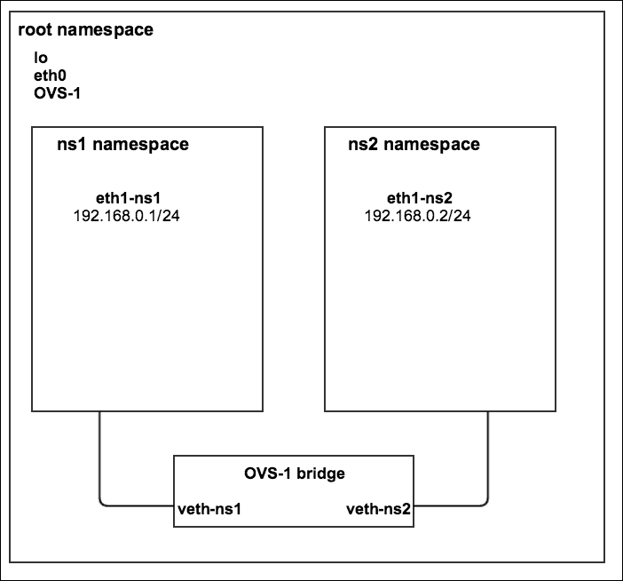
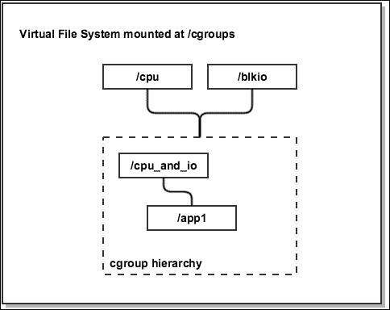
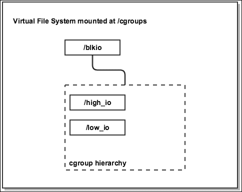
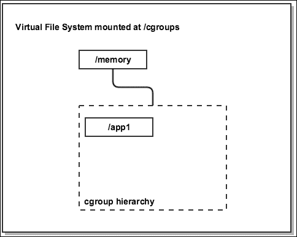

# 第一章. Linux 容器简介

如今，在某种形式的 Linux 容器中部署应用程序已成为一种广泛采用的做法，主要得益于工具的演变和其提供的易用性。尽管 Linux 容器或操作系统级虚拟化在某种形式上已经存在超过十年，但这项技术需要一段时间才能成熟并进入主流应用。其原因之一是，基于虚拟机监控程序的技术（如 KVM 和 Xen）在那段时间内能够解决 Linux 内核的大多数限制，且它所带来的开销并未被视为一个问题。然而，随着内核命名空间和**控制组**（**cgroups**）的出现，通过使用容器实现的*轻量级虚拟化*才变得可行。

本章将涵盖以下主题：

+   操作系统内核的演变及其早期的限制

+   容器与平台虚拟化之间的区别

+   与命名空间和控制组相关的概念和术语

+   使用网络命名空间和控制组进行进程资源隔离与管理的示例

# 操作系统内核及其早期的限制

当前 Linux 容器的状态是早期操作系统设计者试图解决的问题的直接结果——以最有效的方式管理内存、I/O 和进程调度。

在过去，只有单个进程可以被调度执行，如果在进行 I/O 操作时发生阻塞，会浪费宝贵的 CPU 周期。解决这个问题的方法是开发更好的 CPU 调度器，以便能够以*公平*的方式分配更多的工作，从而最大限度地利用 CPU。尽管现代的调度器，比如 Linux 中的**完全公平调度器**（**CFS**），在为每个进程分配公平的时间方面做得非常好，但仍然有很强的需求能够对进程及其子进程进行更高或更低的优先级控制。传统上，这可以通过 `nice()` 系统调用或者实时调度策略来实现，但这也存在粒度或控制程度上的限制。

同样，在虚拟内存出现之前，多个进程会从共享的物理内存池中分配内存。虚拟内存提供了一种每个进程的内存隔离形式，意味着进程会有自己的地址空间，并通过交换空间扩展可用内存，但仍然没有一个好的方式来限制每个进程及其子进程可以使用的内存量。

更加复杂的是，在同一物理服务器上运行不同的工作负载通常会对所有正在运行的服务产生负面影响。内存泄漏或内核恐慌可能导致某个应用程序使整个操作系统崩溃。例如，内存密集型的 Web 服务器与 I/O 密集型的数据库服务一起运行时，会变得非常有问题。为了避免这种情况，系统管理员通常会将不同的应用程序分配到一组服务器上，使得一些机器处于低利用率状态，尤其是在一天中的某些时段，当工作量不大时。这与单个运行中的进程因 I/O 操作阻塞而浪费 CPU 和内存资源是类似的问题。

解决这些问题的方法是使用基于虚拟机监控程序的虚拟化、容器技术，或者两者的结合。

# Linux 容器的案例

虚拟机监控程序作为操作系统的一部分，负责管理虚拟机的生命周期，自上世纪 60 年代末期的主机时代起便存在。大多数现代虚拟化实现，如 Xen 和 KVM，都可以追溯到那个时期。大约在 2005 年，这些虚拟化技术的广泛应用的主要原因是需要更好地控制和利用日益增长的计算资源集群。虚拟机与宿主操作系统之间增加一层安全性也是一个好的卖点，尤其对注重安全性的人来说，尽管像所有新技术一样，仍然出现了一些安全事件。

尽管如此，完全虚拟化和半虚拟化的采用显著改善了服务器的利用方式和应用的配置方式。事实上，像 KVM 和 Xen 这样的虚拟化技术至今仍被广泛使用，尤其是在多租户云和像 OpenStack 这样的云技术中。

在之前所述问题的背景下，虚拟机监控程序提供了以下好处：

+   能够在同一物理服务器上运行不同的操作系统

+   更精细的资源分配控制

+   进程隔离——虚拟机上的内核恐慌不会影响宿主操作系统

+   独立的网络栈以及按虚拟机控制流量的能力

+   通过简化数据中心管理并更好地利用可用服务器资源，从而降低资本和运营成本。

今天反对使用任何形式的虚拟化技术的主要原因可以说是同一操作系统中使用多个内核所带来的开销。如果宿主操作系统能够提供这种隔离级别，而不需要 CPU 的硬件扩展，或不使用如 QEMU 之类的仿真软件，甚至不需要像 KVM 这样的内核模块，那么从复杂性角度来看，效果会更好。仅为了为单个 Web 服务器实现隔离而运行整个操作系统在虚拟机上，并不是最有效的资源分配方式。

在过去十年里，Linux 内核进行了多次改进，以实现类似功能，但减少了开销——最显著的变化就是内核命名空间和 cgroups。LXC 是首批利用这些变化的技术之一，自内核版本 2.6.24 和 2008 年左右开始。尽管 LXC 并不是最早的容器技术，但它帮助推动了我们今天所看到的容器革命。

使用 LXC 的主要优点包括：

+   比运行虚拟机监控程序的开销和复杂性要小

+   每个容器占用更小的系统资源

+   启动时间在毫秒范围内

+   原生内核支持

值得一提的是，容器的安全性本身并不如在虚拟机和宿主操作系统之间使用虚拟机监控程序那样强。然而，近年来，通过使用 **强制访问控制** (**MAC**) 技术，如 SELinux 和 AppArmor、内核能力和 cgroups，已经取得了显著进展，大大缩小了这一差距，后续章节将展示这些技术的应用。

# Linux 命名空间——LXC 的基础

命名空间是轻量级进程虚拟化的基础。它们使得进程及其子进程可以对底层系统有不同的视图。这是通过增加 `unshare()` 和 `setns()` 系统调用，以及为 `clone()`、`unshare()` 和 `setns()` 系统调用传递的六个新的常量标志来实现的：

+   `clone()`：这会创建一个新进程并将其附加到一个新的指定命名空间

+   `unshare()`：这将当前进程附加到一个新的指定命名空间

+   `setns()`：这将一个进程附加到已存在的命名空间

当前 LXC 使用六种命名空间，并且还在开发更多：

+   挂载命名空间，通过 `CLONE_NEWNS` 标志指定

+   UTS 命名空间，通过 `CLONE_NEWUTS` 标志指定

+   IPC 命名空间，通过 `CLONE_NEWIPC` 标志指定

+   PID 命名空间，通过 `CLONE_NEWPID` 标志指定

+   用户命名空间，通过 `CLONE_NEWUSER` 标志指定

+   网络命名空间，通过 `CLONE_NEWNET` 标志指定

让我们更详细地看一下每个优点，并通过一些用户空间的示例帮助我们更好地理解系统背后的运作原理。

## 挂载命名空间

挂载命名空间首次出现在 2002 年的内核 2.4.19 版本中，为进程及其子进程提供了一个独立的文件系统挂载点视图。当挂载或卸载文件系统时，所有进程都会察觉到变化，因为它们共享同一个默认命名空间。当 `CLONE_NEWNS` 标志传递给 `clone()` 系统调用时，新进程会获得调用进程挂载树的副本，并可以对其进行修改，而不会影响父进程。从那时起，默认命名空间中的所有挂载和卸载操作将会在新命名空间中可见，但在每个进程的挂载命名空间中的变化不会被外部进程察觉。

`clone()` 原型如下：

```
#define _GNU_SOURCE 
#include <sched.h> 
int clone(int (*fn)(void *), void *child_stack, int flags, void *arg); 

```

一个示例调用，在新的挂载命名空间中创建一个子进程，代码如下：

```
child_pid = clone(childFunc, child_stack + STACK_SIZE, CLONE_NEWNS | SIGCHLD, argv[1]); 

```

当子进程被创建时，它会执行 `childFunc` 函数，该函数将在新的挂载命名空间中执行其工作。

`util-linux` 包提供了实现 `unshare()` 调用的用户空间工具，这些工具有效地将指定的命名空间从父进程中分离出来。

举个例子：

1.  首先打开一个终端，并在 `/tmp` 下创建一个目录，如下所示：

    ```
    root@server:~# mkdir /tmp/mount_ns
    root@server:~#

    ```

1.  接下来，通过向 `unshare` 传递挂载标志，将当前的 `bash` 进程移动到自己的挂载命名空间中：

    ```
    root@server:~# unshare -m /bin/bash
    root@server:~#

    ```

1.  `bash` 进程现在处于一个独立的命名空间中。让我们检查该命名空间的关联 inode 编号：

    ```
    root@server:~# readlink /proc/$$/ns/mnt
    mnt:[4026532211]
    root@server:~#

    ```

1.  接下来，创建一个临时的挂载点：

    ```
    root@server:~# mount -n -t tmpfs tmpfs /tmp/mount_ns
    root@server:~#

    ```

1.  同时，确保你能在新创建的命名空间中看到挂载点：

    ```
    root@server:~# df -h | grep mount_ns
    tmpfs           3.9G     0  3.9G   0% /tmp/mount_ns 
    root@server:~# cat /proc/mounts | grep mount_ns
    tmpfs /tmp/mount_ns tmpfs rw,relatime 0 0
    root@server:~#

    ```

    正如预期的那样，挂载点可见，因为它是我们创建的命名空间的一部分，当前的 `bash` 进程正是从这个命名空间中运行的。

1.  接下来，启动一个新的终端会话并显示该会话中的命名空间 inode ID：

    ```
    root@server:~# readlink /proc/$$/ns/mnt
    mnt:[4026531840]
    root@server:~#

    ```

    注意它与另一个终端上的挂载命名空间的区别。

1.  最后，检查新的终端中挂载点是否可见：

    ```
    root@server:~# cat /proc/mounts | grep mount_ns
    root@server:~# df -h | grep mount_ns
    root@server:~#

    ```

毫不奇怪，挂载点在默认命名空间中不可见。

### 注意

在 LXC 的上下文中，挂载命名空间非常有用，因为它们提供了一种不同文件系统布局的方式，允许它存在于容器内部。值得一提的是，在挂载命名空间之前，可以使用 `chroot()` 系统调用实现类似的进程隔离，但 `chroot` 并没有像挂载命名空间那样提供每个进程的独立隔离。

## UTS 命名空间

**Unix 时间共享**（**UTS**）命名空间为主机名和域名提供隔离，使得每个 LXC 容器都能保持其自己的标识符，正如 `hostname -f` 命令返回的那样。大多数依赖于正确设置主机名的应用程序都需要这个功能。

要在新的 UTS 命名空间中创建一个 `bash` 会话，可以再次使用 `unshare` 工具，该工具使用 `unshare()` 系统调用来创建命名空间，并使用 `execve()` 系统调用来执行 `bash`：

```
root@server:~# hostname
server
root@server:~# unshare -u /bin/bash
root@server:~# hostname uts-namespace
root@server:~# hostname
uts-namespace
root@server:~# cat /proc/sys/kernel/hostname
uts-namespace
root@server:~#

```

正如前面的输出所示，命名空间中的主机名现在是 `uts-namespace`。

接下来，从另一个终端检查主机名，确保它没有发生变化：

```
root@server:~# hostname
server
root@server:~#

```

正如预期的那样，主机名仅在新的 UTS 命名空间中发生了变化。

要查看 `unshare` 命令实际使用的系统调用，可以运行 `strace` 工具：

```
root@server:~# strace -s 2000 -f unshare -u /bin/bash
...
unshare(CLONE_NEWUTS)                   = 0
getgid()                                = 0
setgid(0)                               = 0
getuid()                                = 0
setuid(0)                               = 0
execve("/bin/bash", ["/bin/bash"], [/* 15 vars */]) = 0
...

```

从输出中我们可以看到，`unshare` 命令确实使用了 `unshare()` 和 `execve()` 系统调用，并使用 `CLONE_NEWUTS` 标志来指定新的 UTS 命名空间。

## IPC 命名空间

**进程间通信**（**IPC**）命名空间为一组 IPC 和同步设施提供隔离。这些设施提供了一种在线程和进程之间交换数据和同步操作的方式。它们提供诸如信号量、文件锁和互斥锁等原语，是容器中实现真正进程隔离所必需的。

## PID 命名空间

**进程 ID**（**PID**）命名空间为进程提供了一个 ID，允许该 ID 在默认命名空间中已存在，例如 ID 为 `1`。这使得初始化系统可以在容器中运行，并与其他进程一起运行，而不会与同一操作系统上的其他 PID 冲突。

为了演示这个概念，打开 `pid_namespace.c` 文件：

```
#define _GNU_SOURCE 
#include <stdlib.h> 
#include <stdio.h> 
#include <signal.h> 
#include <sched.h> 

static int childFunc(void *arg) 
{ 
    printf("Process ID in child  = %ld\n", (long) getpid()); 
} 

```

首先，我们包含头文件并定义`childFunc`函数，`clone()`系统调用将使用该函数。该函数通过`getpid()`系统调用打印子进程的 PID：

```
static char child_stack[1024*1024]; 

int main(int argc, char *argv[]) 
{ 
    pid_t child_pid; 

    child_pid = clone(childFunc, child_stack + 
    (1024*1024),      
    CLONE_NEWPID | SIGCHLD, NULL); 

    printf("PID of cloned process: %ld\n", (long) child_pid); 
    waitpid(child_pid, NULL, 0); 
    exit(EXIT_SUCCESS); 
} 

```

在 `main()` 函数中，我们指定栈的大小并调用 `clone()`，传递子函数 `childFunc`、栈指针、`CLONE_NEWPID` 标志和 `SIGCHLD` 信号。`CLONE_NEWPID` 标志指示 `clone()` 创建一个新的 PID 命名空间，`SIGCHLD` 标志通知父进程其子进程何时终止。如果子进程尚未终止，父进程将会阻塞在 `waitpid()` 调用上。

编译并使用以下命令运行程序：

```
root@server:~# gcc pid_namespace.c -o pid_namespace
root@server:~# ./pid_namespace
PID of cloned process: 17705
Process ID in child  = 1
root@server:~#

```

从输出中，我们可以看到子进程在其命名空间内的 PID 为 `1`，在其他地方为 `17705`。

### 注意

请注意，代码示例中省略了错误处理以简化内容。

## 用户命名空间

用户命名空间允许一个命名空间中的进程拥有与默认命名空间中不同的用户和组 ID。在 LXC 的上下文中，这使得一个进程可以在容器内以`root`身份运行，而在外部拥有一个非特权 ID。这增加了一层薄薄的安全性，因为一旦从容器中逃逸，进程将变为一个非特权用户。这是可能的，因为内核 3.8 引入了非特权进程创建用户命名空间的能力。

要在非特权用户下创建一个新的用户命名空间并在其中拥有`root`，我们可以使用`unshare`工具。让我们从源代码安装最新版本：

```
root@ubuntu:~# cd /usr/src/
root@ubuntu:/usr/src# wget https://www.kernel.org/pub/linux/utils/util-linux/v2.28/util-linux-2.28.tar.gz
root@ubuntu:/usr/src# tar zxfv util-linux-2.28.tar.gz
root@ubuntu:/usr/src# cd util-linux-2.28/
root@ubuntu:/usr/src/util-linux-2.28# ./configure
root@ubuntu:/usr/src/util-linux-2.28# make && make install
root@ubuntu:/usr/src/util-linux-2.28# unshare --map-root-user --user sh -c whoami
root
root@ubuntu:/usr/src/util-linux-2.28#

```

我们还可以使用带有 `CLONE_NEWUSER` 标志的 `clone()` 系统调用，在用户命名空间中创建一个进程，如下程序所示：

```
#define _GNU_SOURCE 
#include <stdlib.h> 
#include <stdio.h> 
#include <signal.h> 
#include <sched.h> 

static int childFunc(void *arg) 
{ 
    printf("UID inside the namespace is %ld\n", (long) 
    geteuid()); 
    printf("GID inside the namespace is %ld\n", (long) 
    getegid()); 
} 

static char child_stack[1024*1024]; 

int main(int argc, char *argv[]) 
{ 
    pid_t child_pid; 

    child_pid = clone(childFunc, child_stack +  
    (1024*1024),        
    CLONE_NEWUSER | SIGCHLD, NULL); 

    printf("UID outside the namespace is %ld\n", (long)       
    geteuid()); 
    printf("GID outside the namespace is %ld\n", (long)      
    getegid()); 
    waitpid(child_pid, NULL, 0); 
    exit(EXIT_SUCCESS); 
} 

```

编译和执行后，作为`root`运行时，输出看起来类似于这个 - UID 为 `0`：

```
root@server:~# gcc user_namespace.c -o user_namespace
root@server:~# ./user_namespace
UID outside the namespace is 0
GID outside the namespace is 0
UID inside the namespace is 65534
GID inside the namespace is 65534
root@server:~#

```

## 网络命名空间

网络命名空间提供网络资源的隔离，例如网络设备、地址、路由和防火墙规则。这有效地创建了网络栈的逻辑副本，允许多个进程在多个命名空间中监听同一个端口。这是 LXC 网络的基础，并且在很多其他用例中也能派上用场。

`iproute2` 包提供了非常有用的用户空间工具，我们可以用它来实验网络命名空间，并且几乎所有 Linux 系统默认都安装了它。

总是存在默认的网络命名空间，称为根命名空间，所有网络接口最初都会分配到该命名空间。要列出属于默认命名空间的网络接口，可以运行以下命令：

```
root@server:~# ip link
1: lo: <LOOPBACK,UP,LOWER_UP> mtu 65536 qdisc noqueue state UNKNOWN mode DEFAULT group default
 link/loopback 00:00:00:00:00:00 brd 00:00:00:00:00:00
2: eth0: <BROADCAST,MULTICAST,UP,LOWER_UP> mtu 9001 qdisc pfifo_fast state UP mode DEFAULT group default qlen 1000
 link/ether 0e:d5:0e:b0:a3:47 brd ff:ff:ff:ff:ff:ff
root@server:~#

```

在这种情况下，有两个接口——`lo` 和 `eth0`。

要列出它们的配置，我们可以运行以下命令：

```
root@server:~# ip a s
1: lo: <LOOPBACK,UP,LOWER_UP> mtu 65536 qdisc noqueue state UNKNOWN group default
 link/loopback 00:00:00:00:00:00 brd 00:00:00:00:00:00
inet 127.0.0.1/8 scope host lo
valid_lft forever preferred_lft forever
inet6 ::1/128 scope host
 valid_lft forever preferred_lft forever
2: eth0: <BROADCAST,MULTICAST,UP,LOWER_UP> mtu 9001 qdisc pfifo_fast state UP group default qlen 1000
 link/ether 0e:d5:0e:b0:a3:47 brd ff:ff:ff:ff:ff:ff
inet 10.1.32.40/24 brd 10.1.32.255 scope global eth0
valid_lft forever preferred_lft forever
inet6 fe80::cd5:eff:feb0:a347/64 scope link
 valid_lft forever preferred_lft forever
root@server:~#

```

同时，要列出根网络命名空间中的路由，可以执行以下命令：

```
root@server:~# ip r s
default via 10.1.32.1 dev eth0
10.1.32.0/24 dev eth0  proto kernel  scope link  src 10.1.32.40
root@server:~#

```

让我们创建两个新的网络命名空间，分别命名为 `ns1` 和 `ns2`，并列出它们：

```
root@server:~# ip netns add ns1
root@server:~# ip netns add ns2
root@server:~# ip netns
ns2
ns1
root@server:~#

```

现在我们有了新的网络命名空间，可以在其中执行命令：

```
root@server:~# ip netns exec ns1 ip link
1: lo: <LOOPBACK> mtu 65536 qdisc noop state DOWN mode DEFAULT group default
    link/loopback 00:00:00:00:00:00 brd 00:00:00:00:00:00
root@server:~#

```

上述输出显示，在 `ns1` 命名空间中，只有一个网络接口——回环接口 `lo`，且处于 `DOWN` 状态。

我们还可以在命名空间内启动一个新的 `bash` 会话，并以类似的方式列出接口：

```
root@server:~# ip netns exec ns1 bash
root@server:~# ip link
1: lo: <LOOPBACK> mtu 65536 qdisc noop state DOWN mode DEFAULT group default
 link/loopback 00:00:00:00:00:00 brd 00:00:00:00:00:00
root@server:~# exit
root@server:~#

```

这样比逐个指定每个命令要更方便。两个网络命名空间如果没有连接到任何东西，将不会有太多用处，所以让我们将它们连接起来。为此，我们将使用一个名为 Open vSwitch 的软件桥接器。

Open vSwitch 的工作原理就像一个普通的网络桥接器，然后它会在我们定义的虚拟端口之间转发帧。虚拟机，如 KVM、Xen、LXC 或 Docker 容器，可以通过它进行连接。

大多数基于 Debian 的发行版（如 Ubuntu）都提供该软件包，所以让我们安装它：

```
root@server:~# apt-get install -y openvswitch-switch
root@server:~#

```

这将安装并启动 Open vSwitch 守护进程。现在是时候创建桥接器了，我们将它命名为 `OVS-1`：

```
root@server:~# ovs-vsctl add-br OVS-1
root@server:~# ovs-vsctl show
0ea38b4f-8943-4d5b-8d80-62ccb73ec9ec
Bridge "OVS-1"
 Port "OVS-1"
 Interface "OVS-1"
 type: internal
ovs_version: "2.0.2"
root@server:~#

```

### 注意

如果你想尝试最新版本的 Open vSwitch，可以从 [`openvswitch.org/download/`](http://openvswitch.org/download/) 下载源代码并编译。

新创建的桥接器现在可以在根命名空间中看到：

```
root@server:~# ip a s OVS-1
4: OVS-1: <BROADCAST,UP,LOWER_UP> mtu 1500 qdisc noqueue state UNKNOWN group default
link/ether 9a:4b:56:97:3b:46 brd ff:ff:ff:ff:ff:ff
inet6 fe80::f0d9:78ff:fe72:3d77/64 scope link
 valid_lft forever preferred_lft forever
root@server:~#

```

为了连接这两个网络命名空间，我们首先为每个命名空间创建一对虚拟接口：

```
root@server:~# ip link add eth1-ns1 type veth peer name veth-ns1
root@server:~# ip link add eth1-ns2 type veth peer name veth-ns2
root@server:~#

```

上述两个命令创建了四个虚拟接口——`eth1-ns1`、`eth1-ns2` 和 `veth-ns1`、`veth-ns2`。这些名称是任意的。

要列出属于根网络命名空间的所有接口，请运行：

```
root@server:~# ip link
1: lo: <LOOPBACK,UP,LOWER_UP> mtu 65536 qdisc noqueue state UNKNOWN mode DEFAULT group default
link/loopback 00:00:00:00:00:00 brd 00:00:00:00:00:00
2: eth0: <BROADCAST,MULTICAST,UP,LOWER_UP> mtu 9001 qdisc pfifo_fast state UP mode DEFAULT group default qlen 1000
link/ether 0e:d5:0e:b0:a3:47 brd ff:ff:ff:ff:ff:ff
3: ovs-system: <BROADCAST,MULTICAST> mtu 1500 qdisc noop state DOWN mode DEFAULT group default
link/ether 82:bf:52:d3:de:7e brd ff:ff:ff:ff:ff:ff
4: OVS-1: <BROADCAST,UP,LOWER_UP> mtu 1500 qdisc noqueue state UNKNOWN mode DEFAULT group default
link/ether 9a:4b:56:97:3b:46 brd ff:ff:ff:ff:ff:ff
5: veth-ns1: <BROADCAST,MULTICAST> mtu 1500 qdisc noop state DOWN mode DEFAULT group default qlen 1000
link/ether 1a:7c:74:48:73:a9 brd ff:ff:ff:ff:ff:ff
6: eth1-ns1: <BROADCAST,MULTICAST> mtu 1500 qdisc noop state DOWN mode DEFAULT group default qlen 1000
link/ether 8e:99:3f:b8:43:31 brd ff:ff:ff:ff:ff:ff
7: veth-ns2: <BROADCAST,MULTICAST> mtu 1500 qdisc noop state DOWN mode DEFAULT group default qlen 1000
link/ether 5a:0d:34:87:ea:96 brd ff:ff:ff:ff:ff:ff
8: eth1-ns2: <BROADCAST,MULTICAST> mtu 1500 qdisc noop state DOWN mode DEFAULT group default qlen 1000
link/ether fa:71:b8:a1:7f:85 brd ff:ff:ff:ff:ff:ff
root@server:~#

```

让我们将 `eth1-ns1` 和 `eth1-ns2` 接口分配到 `ns1` 和 `ns2` 命名空间：

```
root@server:~# ip link set eth1-ns1 netns ns1
root@server:~# ip link set eth1-ns2 netns ns2

```

同时，确认它们是否能从每个网络命名空间内部看到：

```
root@server:~# ip netns exec ns1 ip link
1: lo: <LOOPBACK> mtu 65536 qdisc noop state DOWN mode DEFAULT group default
link/loopback 00:00:00:00:00:00 brd 00:00:00:00:00:00
6: eth1-ns1: <BROADCAST,MULTICAST> mtu 1500 qdisc noop state DOWN mode DEFAULT group default qlen 1000
link/ether 8e:99:3f:b8:43:31 brd ff:ff:ff:ff:ff:ff
root@server:~#
root@server:~# ip netns exec ns2 ip link
1: lo: <LOOPBACK> mtu 65536 qdisc noop state DOWN mode DEFAULT group default
link/loopback 00:00:00:00:00:00 brd 00:00:00:00:00:00
8: eth1-ns2: <BROADCAST,MULTICAST> mtu 1500 qdisc noop state DOWN mode DEFAULT group default qlen 1000
link/ether fa:71:b8:a1:7f:85 brd ff:ff:ff:ff:ff:ff
root@server:~#

```

请注意，现在每个网络命名空间都分配了两个接口——`loopback` 和 `eth1-ns*`。

如果我们从根命名空间列出设备，应该会看到我们刚刚移动到 `ns1` 和 `ns2` 命名空间的接口不再可见：

```
root@server:~# ip link
1: lo: <LOOPBACK,UP,LOWER_UP> mtu 65536 qdisc noqueue state UNKNOWN mode DEFAULT group default
link/loopback 00:00:00:00:00:00 brd 00:00:00:00:00:00
2: eth0: <BROADCAST,MULTICAST,UP,LOWER_UP> mtu 9001 qdisc pfifo_fast state UP mode DEFAULT group default qlen 1000
link/ether 0e:d5:0e:b0:a3:47 brd ff:ff:ff:ff:ff:ff
3: ovs-system: <BROADCAST,MULTICAST> mtu 1500 qdisc noop state DOWN mode DEFAULT group default
link/ether 82:bf:52:d3:de:7e brd ff:ff:ff:ff:ff:ff
4: OVS-1: <BROADCAST,UP,LOWER_UP> mtu 1500 qdisc noqueue state UNKNOWN mode DEFAULT group default
link/ether 9a:4b:56:97:3b:46 brd ff:ff:ff:ff:ff:ff
5: veth-ns1: <BROADCAST,MULTICAST> mtu 1500 qdisc noop state DOWN mode DEFAULT group default qlen 1000
link/ether 1a:7c:74:48:73:a9 brd ff:ff:ff:ff:ff:ff
7: veth-ns2: <BROADCAST,MULTICAST> mtu 1500 qdisc noop state DOWN mode DEFAULT group default qlen 1000
link/ether 5a:0d:34:87:ea:96 brd ff:ff:ff:ff:ff:ff
root@server:~#

```

现在是时候将两个虚拟管道的另一端——`veth-ns1` 和 `veth-ns2` 接口连接到桥接器了：

```
root@server:~# ovs-vsctl add-port OVS-1 veth-ns1
root@server:~# ovs-vsctl add-port OVS-1 veth-ns2
root@server:~# ovs-vsctl show
0ea38b4f-8943-4d5b-8d80-62ccb73ec9ec
Bridge "OVS-1"
 Port "OVS-1"
 Interface "OVS-1"
 type: internal
 Port "veth-ns1"
 Interface "veth-ns1"
 Port "veth-ns2"
 Interface "veth-ns2"
ovs_version: "2.0.2"
root@server:~#

```

从上述输出中可以看出，桥接器现在有两个端口——`veth-ns1` 和 `veth-ns2`。

最后要做的就是启用网络接口并分配 IP 地址：

```
root@server:~# ip link set veth-ns1 up
root@server:~# ip link set veth-ns2 up
root@server:~# ip netns exec ns1 ip link set dev lo up
root@server:~# ip netns exec ns1 ip link set dev eth1-ns1 up
root@server:~# ip netns exec ns1 ip address add 192.168.0.1/24 dev eth1-ns1
root@server:~# ip netns exec ns1 ip a s
1: lo: <LOOPBACK,UP,LOWER_UP> mtu 65536 qdisc noqueue state UNKNOWN group default
link/loopback 00:00:00:00:00:00 brd 00:00:00:00:00:00
inet 127.0.0.1/8 scope host lo
 valid_lft forever preferred_lft forever
inet6 ::1/128 scope host
 valid_lft forever preferred_lft forever
6: eth1-ns1: <BROADCAST,MULTICAST,UP,LOWER_UP> mtu 1500 qdisc pfifo_fast state UP group default qlen 1000
link/ether 8e:99:3f:b8:43:31 brd ff:ff:ff:ff:ff:ff
inet 192.168.0.1/24 scope global eth1-ns1
 valid_lft forever preferred_lft forever
inet6 fe80::8c99:3fff:feb8:4331/64 scope link
 valid_lft forever preferred_lft forever
root@server:~#

```

同样，对于 `ns2` 命名空间：

```
root@server:~# ip netns exec ns2 ip link set dev lo up
root@server:~# ip netns exec ns2 ip link set dev eth1-ns2 up
root@server:~# ip netns exec ns2 ip address add 192.168.0.2/24 dev eth1-ns2
root@server:~# ip netns exec ns2 ip a s
1: lo: <LOOPBACK,UP,LOWER_UP> mtu 65536 qdisc noqueue state UNKNOWN group default
link/loopback 00:00:00:00:00:00 brd 00:00:00:00:00:00
inet 127.0.0.1/8 scope host lo
 valid_lft forever preferred_lft forever
inet6 ::1/128 scope host
 valid_lft forever preferred_lft forever
8: eth1-ns2: <BROADCAST,MULTICAST,UP,LOWER_UP> mtu 1500 qdisc pfifo_fast state UP group default qlen 1000
link/ether fa:71:b8:a1:7f:85 brd ff:ff:ff:ff:ff:ff
inet 192.168.0.2/24 scope global eth1-ns2
 valid_lft forever preferred_lft forever
inet6 fe80::f871:b8ff:fea1:7f85/64 scope link
 valid_lft forever preferred_lft forever
root@server:~#

```



这样，我们通过 Open vSwitch 桥接器建立了 `ns1` 和 `ns2` 网络命名空间之间的连接。为了确认，让我们使用 `ping` 命令：

```
root@server:~# ip netns exec ns1 ping -c 3 192.168.0.2
PING 192.168.0.2 (192.168.0.2) 56(84) bytes of data.
64 bytes from 192.168.0.2: icmp_seq=1 ttl=64 time=0.414 ms
64 bytes from 192.168.0.2: icmp_seq=2 ttl=64 time=0.027 ms
64 bytes from 192.168.0.2: icmp_seq=3 ttl=64 time=0.030 ms
--- 192.168.0.2 ping statistics ---
3 packets transmitted, 3 received, 0% packet loss, time 1998ms
rtt min/avg/max/mdev = 0.027/0.157/0.414/0.181 ms
root@server:~#
root@server:~# ip netns exec ns2 ping -c 3 192.168.0.1
PING 192.168.0.1 (192.168.0.1) 56(84) bytes of data.
64 bytes from 192.168.0.1: icmp_seq=1 ttl=64 time=0.150 ms
64 bytes from 192.168.0.1: icmp_seq=2 ttl=64 time=0.025 ms
64 bytes from 192.168.0.1: icmp_seq=3 ttl=64 time=0.027 ms
--- 192.168.0.1 ping statistics ---
3 packets transmitted, 3 received, 0% packet loss, time 1999ms
rtt min/avg/max/mdev = 0.025/0.067/0.150/0.058 ms
root@server:~#

```

Open vSwitch 允许为网络接口分配 VLAN 标签，从而实现命名空间之间的流量隔离。这在你有多个命名空间并希望它们之间实现连接时非常有用。

以下示例演示如何为 `ns1` 和 `ns2` 命名空间标记虚拟接口，以便这两个网络命名空间之间的流量不可见：

```
root@server:~# ovs-vsctl set port veth-ns1 tag=100
root@server:~# ovs-vsctl set port veth-ns2 tag=200
root@server:~# ovs-vsctl show
0ea38b4f-8943-4d5b-8d80-62ccb73ec9ec
Bridge "OVS-1"
 Port "OVS-1"
 Interface "OVS-1"
 type: internal
 Port "veth-ns1"
 tag: 100
 Interface "veth-ns1"
 Port "veth-ns2"
 tag: 200
 Interface "veth-ns2"
ovs_version: "2.0.2"
root@server:~#

```

现在，两个命名空间应当被隔离在各自的 VLAN 中，且 `ping` 命令应当失败：

```
root@server:~# ip netns exec ns1 ping -c 3 192.168.0.2
PING 192.168.0.2 (192.168.0.2) 56(84) bytes of data.
--- 192.168.0.2 ping statistics ---
3 packets transmitted, 0 received, 100% packet loss, time 1999ms
root@server:~# ip netns exec ns2 ping -c 3 192.168.0.1
PING 192.168.0.1 (192.168.0.1) 56(84) bytes of data.
--- 192.168.0.1 ping statistics ---
3 packets transmitted, 0 received, 100% packet loss, time 1999ms
root@server:~#

```

我们还可以使用我们在挂载和 UTC 命名空间示例中看到的 `unshare` 工具来创建一个新的网络命名空间：

```
root@server:~# unshare --net /bin/bash
root@server:~# ip a s
1: lo: <LOOPBACK> mtu 65536 qdisc noop state DOWN group default
link/loopback 00:00:00:00:00:00 brd 00:00:00:00:00:00
root@server:~# exit
root@server

```

## 使用 cgroups 进行资源管理

Cgroups 是内核特性，允许对单个进程或一组进程（称为 **任务**）的资源分配进行细粒度控制。在 LXC 环境中，这非常重要，因为它使得为任何给定容器分配内存、CPU 时间或 I/O 限制成为可能。

我们最关心的 cgroups 在下表中描述：

| **子系统** | **描述** | **定义在** |
| --- | --- | --- |
| `cpu` | 为任务分配 CPU 时间 | `kernel/sched/core.c` |
| `cpuacct` | 记录 CPU 使用情况 | `kernel/sched/core.c` |
| `cpuset` | 为任务分配 CPU 核心 | `kernel/cpuset.c` |
| `memory` | 为任务分配内存 | `mm/memcontrol.c` |
| `blkio` | 限制设备的 I/O 访问 | `block/blk-cgroup.c` |
| `devices` | 允许/拒绝对设备的访问 | `security/device_cgroup.c` |
| `freezer` | 挂起/恢复任务 | `kernel/cgroup_freezer.c` |
| `net_cls` | 标记网络数据包 | `net/sched/cls_cgroup.c` |
| `net_prio` | 优先级网络流量 | `net/core/netprio_cgroup.c` |
| `hugetlb` | 限制 HugeTLB | `mm/hugetlb_cgroup.c` |

Cgroups 以层次结构的形式组织，表示为**虚拟文件系统**（**VFS**）中的目录。类似于进程层次结构，每个进程都是 `init` 或 `systemd` 进程的后代，cgroups 会继承其父级的一些属性。系统上可以存在多个 cgroups 层次结构，每个层次表示单个或一组资源。可以拥有组合两个或更多子系统的层次结构，例如，内存和 I/O，分配给某个组的任务将对这些资源应用限制。

### 注意

如果你对内核中不同子系统的实现感兴趣，可以安装内核源代码并查看表格第三列中显示的 C 文件。

以下图示有助于可视化一个包含两个子系统——CPU 和 I/O——的单一层次结构：



Cgroups 可以通过两种方式使用：

+   通过手动操作挂载的 VFS 上的文件和目录

+   使用各种软件包提供的用户空间工具，如 Debian/Ubuntu 上的 `cgroup-bin` 和 RHEL/CentOS 上的 `libcgroup`

让我们来看几个实际的例子，了解如何使用 cgroups 来限制资源。这将帮助我们更好地理解容器是如何工作的。

### 限制 I/O 吞吐量

假设我们有两个应用程序在一台服务器上运行，且它们是高度 I/O 绑定的：`app1` 和 `app2`。我们希望白天将更多的带宽分配给 `app1`，而晚上则分配给 `app2`。这种 I/O 吞吐量优先级调整可以通过使用 `blkio` 子系统来实现。

首先，让我们通过挂载 `cgroup` VFS 来附加 `blkio` 子系统：

```
root@server:~# mkdir -p /cgroup/blkio
root@server:~# mount -t cgroup -o blkio blkio /cgroup/blkio
root@server:~# cat /proc/mounts | grep cgroup
blkio /cgroup/blkio cgroup rw, relatime, blkio, crelease_agent=/run/cgmanager/agents/cgm-release-agent.blkio 0 0
root@server:~#

```

接下来，创建两个优先级组，这些组将属于同一个 `blkio` 层级：

```
root@server:~# mkdir /cgroup/blkio/high_io
root@server:~# mkdir /cgroup/blkio/low_io
root@server:~#

```

我们需要获取 `app1` 和 `app2` 进程的 PID，并将它们分配到 `high_io` 和 `low_io` 组：

```
root@server:~# pidof app1 | while read PID; do echo $PID >> /cgroup/blkio/high_io/tasks; done 
root@server:~# pidof app2 | while read PID; do echo $PID >> /cgroup/blkio/low_io/tasks; done
root@server:~#

```



我们创建的 blkio 层级

`tasks` 文件是我们定义应应用限制的进程/任务的地方。

最后，让我们为 `high_io` 和 `low_io` cgroups 设置 10:1 的比例。这些 cgroups 中的任务将立即仅使用分配给它们的资源：

```
root@server:~# echo 1000 > /cgroup/blkio/high_io/blkio.weight
root@server:~# echo 100 > /cgroup/blkio/low_io/blkio.weight
root@server:~#

```

`blkio.weight` 文件定义了进程或进程组可用的 I/O 访问权重，值的范围从 100 到 1000。在这个例子中，`1000` 和 `100` 的值创建了 10:1 的比例。

通过这样设置，低优先级的应用程序 `app2` 将仅使用大约 10% 的 I/O 操作，而高优先级的应用程序 `app1` 将使用大约 90%。

如果你在 Ubuntu 上列出 `high_io` 目录的内容，你将看到以下文件：

```
root@server:~# ls -la /cgroup/blkio/high_io/
drwxr-xr-x 2 root root 0 Aug 24 16:14 .
drwxr-xr-x 4 root root 0 Aug 19 21:14 ..
-r--r--r-- 1 root root 0 Aug 24 16:14 blkio.io_merged
-r--r--r-- 1 root root 0 Aug 24 16:14 blkio.io_merged_recursive
-r--r--r-- 1 root root 0 Aug 24 16:14 blkio.io_queued
-r--r--r-- 1 root root 0 Aug 24 16:14 blkio.io_queued_recursive
-r--r--r-- 1 root root 0 Aug 24 16:14 blkio.io_service_bytes
-r--r--r-- 1 root root 0 Aug 24 16:14 blkio.io_service_bytes_recursive
-r--r--r-- 1 root root 0 Aug 24 16:14 blkio.io_serviced
-r--r--r-- 1 root root 0 Aug 24 16:14 blkio.io_serviced_recursive
-r--r--r-- 1 root root 0 Aug 24 16:14 blkio.io_service_time
-r--r--r-- 1 root root 0 Aug 24 16:14 blkio.io_service_time_recursive
-r--r--r-- 1 root root 0 Aug 24 16:14 blkio.io_wait_time
-r--r--r-- 1 root root 0 Aug 24 16:14 blkio.io_wait_time_recursive
-rw-r--r-- 1 root root 0 Aug 24 16:14 blkio.leaf_weight
-rw-r--r-- 1 root root 0 Aug 24 16:14 blkio.leaf_weight_device
--w------- 1 root root 0 Aug 24 16:14 blkio.reset_stats
-r--r--r-- 1 root root 0 Aug 24 16:14 blkio.sectors
-r--r--r-- 1 root root 0 Aug 24 16:14 blkio.sectors_recursive
-r--r--r-- 1 root root 0 Aug 24 16:14 blkio.throttle.io_service_bytes
-r--r--r-- 1 root root 0 Aug 24 16:14 blkio.throttle.io_serviced
-rw-r--r-- 1 root root 0 Aug 24 16:14 blkio.throttle.read_bps_device
-rw-r--r-- 1 root root 0 Aug 24 16:14 blkio.throttle.read_iops_device
-rw-r--r-- 1 root root 0 Aug 24 16:14 blkio.throttle.write_bps_device
-rw-r--r-- 1 root root 0 Aug 24 16:14 blkio.throttle.write_iops_device
-r--r--r-- 1 root root 0 Aug 24 16:14 blkio.time
-r--r--r-- 1 root root 0 Aug 24 16:14 blkio.time_recursive
-rw-r--r-- 1 root root 0 Aug 24 16:49 blkio.weight
-rw-r--r-- 1 root root 0 Aug 24 17:01 blkio.weight_device
-rw-r--r-- 1 root root 0 Aug 24 16:14 cgroup.clone_children
--w--w--w- 1 root root 0 Aug 24 16:14 cgroup.event_control
-rw-r--r-- 1 root root 0 Aug 24 16:14 cgroup.procs
-rw-r--r-- 1 root root 0 Aug 24 16:14 notify_on_release
-rw-r--r-- 1 root root 0 Aug 24 16:14 tasks
root@server:~#

```

从前面的输出可以看到，只有某些文件是可写的。这取决于各种操作系统设置，例如正在使用的 I/O 调度器。

我们已经看到 `tasks` 和 `blkio.weight` 文件的用途。以下是 `blkio` 子系统中最常用文件的简短描述：

| **文件** | **描述** |
| --- | --- |
| `blkio.io_merged` | 总共合并到请求中的读/写、同步或异步操作数 |
| `blkio.io_queued` | 在任何给定时间排队的读/写、同步或异步请求的总数 |
| `blkio.io_service_bytes` | 传输到或从指定设备的字节数 |
| `blkio.io_serviced` | 发往指定设备的 I/O 操作数量 |
| `blkio.io_service_time` | 请求调度与请求完成之间的总时间（单位：纳秒），针对指定设备 |
| `blkio.io_wait_time` | 指定设备的 I/O 操作在调度器队列中等待的总时间 |
| `blkio.leaf_weight` | 类似于 `blkio.weight`，可以应用于 **完全公平队列** (**CFQ**) I/O 调度器 |
| `blkio.reset_stats` | 向此文件写入一个整数将重置所有统计信息 |
| `blkio.sectors` | 传输到或从指定设备的扇区数 |
| `blkio.throttle.io_service_bytes` | 传输到或从磁盘的字节数 |
| `blkio.throttle.io_serviced` | 向指定磁盘发出的 I/O 操作次数 |
| `blkio.time` | 分配给设备的磁盘时间（以毫秒为单位） |
| `blkio.weight` | 为 cgroup 层级指定权重 |
| `blkio.weight_device` | 与`blkio.weight`相同，但指定一个块设备来应用限制 |
| `tasks` | 将任务附加到 cgroup |

### 提示

需要记住的一点是，直接写入这些文件进行更改不会在服务器重启后保持不变。在本章的后面，您将学习如何使用用户空间工具生成持久化配置文件。

### 限制内存使用

`memory`子系统控制分配给进程的内存量以及进程可用的内存。这在多租户环境中尤其有用，因为在这种环境下，需要更好的控制每个用户进程可以使用多少内存，或者限制内存消耗较大的应用程序。像 LXC 这样的容器化解决方案可以使用`memory`子系统来管理实例的大小，而无需重启整个容器。

`memory`子系统执行资源会计，例如跟踪匿名页面、文件缓存、交换缓存和一般层级会计的利用率，这些都带来了一定的开销。因此，某些 Linux 发行版默认禁用`memory` cgroup。如果下面的命令失败，您需要通过指定以下 GRUB 参数并重启来启用它：

```
root@server:~# vim /etc/default/grub
RUB_CMDLINE_LINUX_DEFAULT="cgroup_enable=memory"
root@server:~# grub-update && reboot

```

首先，让我们挂载`memory` cgroup：

```
root@server:~# mkdir -p /cgroup/memory
root@server:~# mount -t cgroup -o memory memory /cgroup/memory
root@server:~# cat /proc/mounts | grep memory
memory /cgroup/memory cgroup rw, relatime, memory, release_agent=/run/cgmanager/agents/cgm-release-agent.memory 0 0
root@server:~#

```

然后将`app1`的内存设置为 1GB：

```
root@server:~# mkdir /cgroup/memory/app1
root@server:~# echo 1G > /cgroup/memory/app1/memory.limit_in_bytes
root@server:~# cat /cgroup/memory/app1/memory.limit_in_bytes
1073741824
root@server:~# pidof app1 | while read PID; do echo $PID >> /cgroup/memory/app1/tasks; done
root@server:~#

```



app1 进程的内存层级

类似于`blkio`子系统，`tasks`文件用于指定我们要添加到 cgroup 层级中的进程的 PID，`memory.limit_in_bytes`指定要分配的内存大小（以字节为单位）。

`app1`的内存层级包含以下文件：

```
root@server:~# ls -la /cgroup/memory/app1/
drwxr-xr-x 2 root root 0 Aug 24 22:05 .
drwxr-xr-x 3 root root 0 Aug 19 21:02 ..
-rw-r--r-- 1 root root 0 Aug 24 22:05 cgroup.clone_children
--w--w--w- 1 root root 0 Aug 24 22:05 cgroup.event_control
-rw-r--r-- 1 root root 0 Aug 24 22:05 cgroup.procs
-rw-r--r-- 1 root root 0 Aug 24 22:05 memory.failcnt
--w------- 1 root root 0 Aug 24 22:05 memory.force_empty
-rw-r--r-- 1 root root 0 Aug 24 22:05 memory.kmem.failcnt
-rw-r--r-- 1 root root 0 Aug 24 22:05 memory.kmem.limit_in_bytes
-rw-r--r-- 1 root root 0 Aug 24 22:05 memory.kmem.max_usage_in_bytes
-r--r--r-- 1 root root 0 Aug 24 22:05 memory.kmem.slabinfo
-rw-r--r-- 1 root root 0 Aug 24 22:05 memory.kmem.tcp.failcnt
-rw-r--r-- 1 root root 0 Aug 24 22:05 memory.kmem.tcp.limit_in_bytes
-rw-r--r-- 1 root root 0 Aug 24 22:05 memory.kmem.tcp.max_usage_in_bytes
-r--r--r-- 1 root root 0 Aug 24 22:05 memory.kmem.tcp.usage_in_bytes
-r--r--r-- 1 root root 0 Aug 24 22:05 memory.kmem.usage_in_bytes
-rw-r--r-- 1 root root 0 Aug 24 22:05 memory.limit_in_bytes
-rw-r--r-- 1 root root 0 Aug 24 22:05 memory.max_usage_in_bytes
-rw-r--r-- 1 root root 0 Aug 24 22:05 memory.move_charge_at_immigrate
-r--r--r-- 1 root root 0 Aug 24 22:05 memory.numa_stat
-rw-r--r-- 1 root root 0 Aug 24 22:05 memory.oom_control
---------- 1 root root 0 Aug 24 22:05 memory.pressure_level
-rw-r--r-- 1 root root 0 Aug 24 22:05 memory.soft_limit_in_bytes
-r--r--r-- 1 root root 0 Aug 24 22:05 memory.stat
-rw-r--r-- 1 root root 0 Aug 24 22:05 memory.swappiness
-r--r--r-- 1 root root 0 Aug 24 22:05 memory.usage_in_bytes
-rw-r--r-- 1 root root 0 Aug 24 22:05 memory.use_hierarchy
-rw-r--r-- 1 root root 0 Aug 24 22:05 tasks
root@server:~#

```

内存子系统中的文件及其功能如下表所示：

| **文件** | **描述** |
| --- | --- |
| `memory.failcnt` | 显示内存限制命中的总次数 |
| `memory.force_empty` | 如果设置为`0`，则释放任务占用的内存 |
| `memory.kmem.failcnt` | 显示内核内存限制命中的总次数 |
| `memory.kmem.limit_in_bytes` | 设置或显示内核内存硬限制 |
| `memory.kmem.max_usage_in_bytes` | 显示最大内核内存使用量 |
| `memory.kmem.tcp.failcnt` | 显示 TCP 缓冲区内存限制命中的次数 |
| `memory.kmem.tcp.limit_in_bytes` | 设置或显示 TCP 缓冲区内存的硬限制 |
| `memory.kmem.tcp.max_usage_in_bytes` | 显示最大 TCP 缓冲区内存使用量 |
| `memory.kmem.tcp.usage_in_bytes` | 显示当前 TCP 缓冲区内存 |
| `memory.kmem.usage_in_bytes` | 显示当前的内核内存 |
| `memory.limit_in_bytes` | 设置或显示内存使用限制 |
| `memory.max_usage_in_bytes` | 显示最大内存使用量 |
| `memory.move_charge_at_immigrate` | 设置或显示移动费用的控制 |
| `memory.numa_stat` | 显示每个 NUMA 节点的内存使用情况 |
| `memory.oom_control` | 设置或显示 OOM 控制 |
| `memory.pressure_level` | 设置内存压力通知 |
| `memory.soft_limit_in_bytes` | 设置或显示内存使用的软限制 |
| `memory.stat` | 显示各种统计信息 |
| `memory.swappiness` | 设置或显示交换的级别 |
| `memory.usage_in_bytes` | 显示当前内存使用情况 |
| `memory.use_hierarchy` | 设置从子进程回收内存 |
| `tasks` | 将任务附加到 cgroup 中 |

限制进程可用的内存可能会触发 **内存不足**（**OOM**）杀手，进而杀死正在运行的任务。如果这不是期望的行为，并且你希望进程被挂起，等待内存释放，则可以禁用 OOM 杀手：

```
root@server:~# cat /cgroup/memory/app1/memory.oom_control
oom_kill_disable 0
under_oom 0
root@server:~# echo 1 > /cgroup/memory/app1/memory.oom_control
root@server:~#

```

`memory` cgroup 在 `memory.stat` 文件中提供了广泛的记账统计信息，这些信息可能会引起关注：

```
root@server:~# head /cgroup/memory/app1/memory.stat
cache 43325     # Number of bytes of page cache memory
rss 55d43       # Number of bytes of anonymous and swap cache memory
rss_huge 0      # Number of anonymous transparent hugepages
mapped_file 2   # Number of bytes of mapped file
writeback 0     # Number of bytes of cache queued for syncing
pgpgin 0        # Number of charging events to the memory cgroup
pgpgout 0       # Number of uncharging events to the memory cgroup
pgfault 0       # Total number of page faults
pgmajfault 0    # Number of major page faults
inactive_anon 0 # Anonymous and swap cache memory on inactive LRU list

```

如果你需要在`app1`内存层级中启动一个新任务，你可以将当前的 shell 进程移动到`tasks`文件中，所有在这个 shell 中启动的其他进程将成为其直接后代，并继承相同的 cgroup 属性：

```
root@server:~# echo $$ > /cgroup/memory/app1/tasks
root@server:~# echo "The memory limit is now applied to all processes started from this shell"

```

### cpu 和 cpuset 子系统

`cpu` 子系统将 CPU 时间调度到 cgroup 层级及其任务中。与 CFS 的默认行为相比，它提供了对 CPU 执行时间的更细粒度控制。

`cpuset` 子系统允许将 CPU 核心分配给一组任务，类似于 Linux 中的 `taskset` 命令。

`cpu` 和 `cpuset` 子系统提供的主要好处是为高度依赖 CPU 的应用提供更好的每个处理器核心利用率。它们还允许在某些时间段内将负载分配给通常空闲的核心。在多租户环境中，运行许多 LXC 容器时，`cpu` 和 `cpuset` cgroup 允许创建不同的实例大小和容器类型，例如每个容器仅暴露一个核心，并分配 40% 的调度工作时间。

作为示例，假设我们有两个进程 `app1` 和 `app2`，我们希望 `app1` 使用 60% 的 CPU 时间，`app2` 仅使用 40%。我们首先挂载 `cgroup` VFS：

```
root@server:~# mkdir -p /cgroup/cpu
root@server:~# mount -t cgroup -o cpu cpu /cgroup/cpu
root@server:~# cat /proc/mounts | grep cpu
cpu /cgroup/cpu cgroup rw, relatime, cpu, release_agent=/run/cgmanager/agents/cgm-release-agent.cpu 0 0

```

然后我们创建两个子层级：

```
root@server:~# mkdir /cgroup/cpu/limit_60_percent
root@server:~# mkdir /cgroup/cpu/limit_40_percent

```

同时为每个任务分配 CPU 份额，其中 `app1` 将获得 60% 的调度时间，`app2` 将获得 40%：

```
root@server:~# echo 600 > /cgroup/cpu/limit_60_percent/cpu.shares
root@server:~# echo 400 > /cgroup/cpu/limit_40_percent/cpu.shares

```

最后，我们将 PID 移动到`tasks`文件中：

```
root@server:~# pidof app1 | while read PID; do echo $PID >> /cgroup/cpu/limit_60_percent/tasks; done
root@server:~# pidof app2 | while read PID; do echo $PID >> /cgroup/cpu/limit_40_percent/tasks; done
root@server:~#

```

`cpu` 子系统包含以下控制文件：

```
root@server:~# ls -la /cgroup/cpu/limit_60_percent/
drwxr-xr-x 2 root root 0 Aug 25 15:13 .
drwxr-xr-x 4 root root 0 Aug 19 21:02 ..
-rw-r--r-- 1 root root 0 Aug 25 15:13 cgroup.clone_children
--w--w--w- 1 root root 0 Aug 25 15:13 cgroup.event_control
-rw-r--r-- 1 root root 0 Aug 25 15:13 cgroup.procs
-rw-r--r-- 1 root root 0 Aug 25 15:13 cpu.cfs_period_us
-rw-r--r-- 1 root root 0 Aug 25 15:13 cpu.cfs_quota_us
-rw-r--r-- 1 root root 0 Aug 25 15:14 cpu.shares
-r--r--r-- 1 root root 0 Aug 25 15:13 cpu.stat
-rw-r--r-- 1 root root 0 Aug 25 15:13 notify_on_release
-rw-r--r-- 1 root root 0 Aug 25 15:13 tasks
root@server:~#

```

以下是每个项的简要说明：

| **文件** | **描述** |
| --- | --- |
| `cpu.cfs_period_us` | 以微秒为单位的 CPU 资源重新分配 |
| `cpu.cfs_quota_us` | 任务在一个`cpu.cfs_period_us`周期内的运行时长，以微秒为单位 |
| `cpu.shares` | 任务可用的 CPU 时间的相对份额 |
| `cpu.stat` | 显示 CPU 时间统计信息 |
| `tasks` | 将任务附加到 cgroup 中 |

`cpu.stat` 文件特别重要：

```
root@server:~# cat /cgroup/cpu/limit_60_percent/cpu.stat
nr_periods 0        # number of elapsed period intervals, as specified in
 # cpu.cfs_period_us
nr_throttled 0      # number of times a task was not scheduled to run
 # because of quota limit
throttled_time 0    # total time in nanoseconds for which tasks have been
 # throttled
root@server:~#

```

为了演示`cpuset`子系统的工作方式，假设我们创建一个名为`app1`的`cpuset`层次结构，其中包含 CPU 0 和 1，`app2` cgroup 将只包含 CPU 1：

```
root@server:~# mkdir /cgroup/cpuset
root@server:~# mount -t cgroup -o cpuset cpuset /cgroup/cpuset
root@server:~# mkdir /cgroup/cpuset/app{1..2}
root@server:~# echo 0-1 > /cgroup/cpuset/app1/cpuset.cpus
root@server:~# echo 1 > /cgroup/cpuset/app2/cpuset.cpus
root@server:~# pidof app1 | while read PID; do echo $PID >> /cgroup/cpuset/app1/tasks limit_60_percent/tasks; done
root@server:~# pidof app2 | while read PID; do echo $PID >> /cgroup/cpuset/app2/tasks limit_40_percent/tasks; done
root@server:~#

```

要检查`app1`进程是否绑定到 CPU 0 和 1，我们可以使用：

```
root@server:~# taskset -c -p $(pidof app1)
pid 8052's current affinity list: 0,1
root@server:~# taskset -c -p $(pidof app2)
pid 8052's current affinity list: 1
root@server:~#

```

`cpuset app1`层次结构包含以下文件：

```
root@server:~# ls -la /cgroup/cpuset/app1/
drwxr-xr-x 2 root root 0 Aug 25 16:47 .
drwxr-xr-x 5 root root 0 Aug 19 21:02 ..
-rw-r--r-- 1 root root 0 Aug 25 16:47 cgroup.clone_children
--w--w--w- 1 root root 0 Aug 25 16:47 cgroup.event_control
-rw-r--r-- 1 root root 0 Aug 25 16:47 cgroup.procs
-rw-r--r-- 1 root root 0 Aug 25 16:47 cpuset.cpu_exclusive
-rw-r--r-- 1 root root 0 Aug 25 17:57 cpuset.cpus
-rw-r--r-- 1 root root 0 Aug 25 16:47 cpuset.mem_exclusive
-rw-r--r-- 1 root root 0 Aug 25 16:47 cpuset.mem_hardwall
-rw-r--r-- 1 root root 0 Aug 25 16:47 cpuset.memory_migrate
-r--r--r-- 1 root root 0 Aug 25 16:47 cpuset.memory_pressure
-rw-r--r-- 1 root root 0 Aug 25 16:47 cpuset.memory_spread_page
-rw-r--r-- 1 root root 0 Aug 25 16:47 cpuset.memory_spread_slab
-rw-r--r-- 1 root root 0 Aug 25 16:47 cpuset.mems
-rw-r--r-- 1 root root 0 Aug 25 16:47 cpuset.sched_load_balance
-rw-r--r-- 1 root root 0 Aug 25 16:47 cpuset.sched_relax_domain_level
-rw-r--r-- 1 root root 0 Aug 25 16:47 notify_on_release
-rw-r--r-- 1 root root 0 Aug 25 17:13 tasks
root@server:~#

```

控制文件的简要描述如下：

| **文件** | **描述** |
| --- | --- |
| `cpuset.cpu_exclusive` | 检查是否其他`cpuset`层次结构共享当前组中定义的设置 |
| `cpuset.cpus` | 允许在该`cpuset`中的进程执行的 CPU 物理编号列表 |
| `cpuset.mem_exclusive` | `cpuset`是否应独占其内存节点 |
| `cpuset.mem_hardwall` | 检查每个任务的用户分配是否保持独立 |
| `cpuset.memory_migrate` | 检查当`cpuset.mems`中的值发生变化时，内存中的页是否应迁移到新的节点 |
| `cpuset.memory_pressure` | 包含由进程创建的内存压力的运行平均值 |
| `cpuset.memory_spread_page` | 检查文件系统缓冲区是否应均匀分布在内存节点之间 |
| `cpuset.memory_spread_slab` | 检查内核的文件 I/O 操作的 slab 缓存是否应均匀分布在`cpuset`中 |
| `cpuset.mems` | 指定此 cgroup 中的任务可以访问的内存节点 |
| `cpuset.sched_load_balance` | 检查内核是否应通过将进程从过载的 CPU 迁移到较少使用的 CPU 来平衡`cpuset`中的 CPU 负载 |
| `cpuset.sched_relax_domain_level` | 包含内核应尝试平衡负载的 CPU 范围的宽度 |
| `notify_on_release` | 检查释放后层次结构是否应接收特殊处理，且没有进程在使用它 |
| `tasks` | 将任务附加到 cgroup |

### cgroup 冻结子系统

`freezer`子系统可用于挂起当前运行任务的状态，以便对其进行分析，或创建一个可以用于将进程迁移到其他服务器的检查点。另一个使用场景是当某个进程对系统产生负面影响时，需要暂时暂停该进程，同时不丢失当前的状态数据。

下一个示例展示了如何挂起`top`进程的执行，检查其状态，然后恢复它。

首先，挂载`freezer`子系统并创建新的层次结构：

```
root@server:~# mkdir /cgroup/freezer
root@server:~# mount -t cgroup -o freezer freezer /cgroup/freezer
root@server:~# mkdir /cgroup/freezer/frozen_group
root@server:~# cat /proc/mounts | grep freezer
freezer /cgroup/freezer cgroup rw,relatime,freezer,release_agent=/run/cgmanager/agents/cgm-release-agent.freezer 0 0
root@server:~#

```

在一个新的终端中，启动`top`进程并观察它如何定期刷新。回到原始终端，将`top`的 PID 添加到`frozen_group`任务文件中，并观察其状态：

```
root@server:~# echo 25731 > /cgroup/freezer/frozen_group/tasks
root@server:~# cat /cgroup/freezer/frozen_group/freezer.state
THAWED
root@server:~#

```

要冻结进程，请执行以下命令：

```
root@server:~# echo FROZEN > /cgroup/freezer/frozen_group/freezer.state
root@server:~# cat /cgroup/freezer/frozen_group/freezer.state
FROZEN
root@server:~# cat /proc/25s731/status | grep -i state
State:      D (disk sleep)
root@server:~#

```

请注意，`top`进程的输出不再刷新，并且在检查其状态文件时，您可以看到它现在处于阻塞状态。

要恢复执行，执行以下命令：

```
root@server:~# echo THAWED > /cgroup/freezer/frozen_group/freezer.state
root@server:~# cat /proc/29328/status  | grep -i state
State:  S (sleeping)
root@server:~#

```

检查`frozen_group`层次结构会得到以下文件：

```
root@server:~# ls -la /cgroup/freezer/frozen_group/
drwxr-xr-x 2 root root 0 Aug 25 20:50 .
drwxr-xr-x 4 root root 0 Aug 19 21:02 ..
-rw-r--r-- 1 root root 0 Aug 25 20:50 cgroup.clone_children
--w--w--w- 1 root root 0 Aug 25 20:50 cgroup.event_control
-rw-r--r-- 1 root root 0 Aug 25 20:50 cgroup.procs
-r--r--r-- 1 root root 0 Aug 25 20:50 freezer.parent_freezing
-r--r--r-- 1 root root 0 Aug 25 20:50 freezer.self_freezing
-rw-r--r-- 1 root root 0 Aug 25 21:00 freezer.state
-rw-r--r-- 1 root root 0 Aug 25 20:50 notify_on_release
-rw-r--r-- 1 root root 0 Aug 25 20:59 tasks
root@server:~#

```

以下表格描述了几个感兴趣的文件：

| **文件** | **描述** |
| --- | --- |
| `freezer.parent_freezing` | 显示父状态。如果 cgroup 的祖先中没有一个是`FROZEN`则显示`0`；否则显示`1`。 |
| `freezer.self_freezing` | 显示自身状态。如果自身状态为`THAWED`则显示`0`；否则显示`1`。 |
| `freezer.state` | 将 cgroup 的自身状态设置为`THAWED`或`FROZEN`。 |
| `tasks` | 将任务附加到 cgroup。 |

### 使用用户空间工具管理 cgroups 并持久化更改

通过直接操作目录和文件来处理 cgroup 子系统是原型设计和测试更改的快速便捷方式，但这也有一些缺点，即所做的更改不会在服务器重启后持续，且错误报告或处理不多。

为了解决这个问题，有一些提供用户空间工具和守护程序的软件包非常易于使用。让我们看几个例子。

要在 Debian/Ubuntu 上安装工具，请运行以下命令：

```
root@server:~# apt-get install -y cgroup-bin cgroup-lite libcgroup1
root@server:~# service cgroup-lite start

```

在 RHEL/CentOS 上，执行以下操作：

```
root@server:~# yum install libcgroup
root@server:~# service cgconfig start

```

要挂载所有子系统，请运行以下命令：

```
root@server:~# cgroups-mount
root@server:~# cat /proc/mounts | grep cgroup
cgroup /sys/fs/cgroup/memory cgroup rw,relatime,memory,release_agent=/run/cgmanager/agents/cgm-release-agent.memory 0 0
cgroup /sys/fs/cgroup/devices cgroup rw,relatime,devices,release_agent=/run/cgmanager/agents/cgm-release-agent.devices 0 0
cgroup /sys/fs/cgroup/freezer cgroup rw,relatime,freezer,release_agent=/run/cgmanager/agents/cgm-release-agent.freezer 0 0
cgroup /sys/fs/cgroup/blkio cgroup rw,relatime,blkio,release_agent=/run/cgmanager/agents/cgm-release-agent.blkio 0 0
cgroup /sys/fs/cgroup/perf_event cgroup rw,relatime,perf_event,release_agent=/run/cgmanager/agents/cgm-release-agent.perf_event 0 0
cgroup /sys/fs/cgroup/hugetlb cgroup rw,relatime,hugetlb,release_agent=/run/cgmanager/agents/cgm-release-agent.hugetlb 0 0
cgroup /sys/fs/cgroup/cpuset cgroup rw,relatime,cpuset,release_agent=/run/cgmanager/agents/cgm-release-agent.cpuset,clone_children 0 0
cgroup /sys/fs/cgroup/cpu cgroup rw,relatime,cpu,release_agent=/run/cgmanager/agents/cgm-release-agent.cpu 0 0
cgroup /sys/fs/cgroup/cpuacct cgroup rw,relatime,cpuacct,release_agent=/run/cgmanager/agents/cgm-release-agent.cpuacct 0 0

```

注意从前面的输出中 cgroups 的位置 - `/sys/fs/cgroup`。这是许多 Linux 发行版上的默认位置，在大多数情况下各个子系统已经被挂载。

要验证正在使用的 cgroup 子系统，可以使用以下命令检查：

```
root@server:~# cat /proc/cgroups
#subsys_name  hierarchy  num_cgroups  enabled
cpuset  7  1  1
cpu  8  2  1
cpuacct  9  1  1
memory  10  2  1
devices  11  1  1
freezer  12  1  1
blkio  6  3  1
perf_event  13  1  1
hugetlb  14  1  1

```

接下来，让我们创建一个`blkio`层级，并使用`cgclassify`将一个已运行的进程添加到其中。这与之前手动创建目录和文件的操作类似：

```
root@server:~# cgcreate -g blkio:high_io
root@server:~# cgcreate -g blkio:low_io
root@server:~# cgclassify -g blkio:low_io $(pidof app1)
root@server:~# cat /sys/fs/cgroup/blkio/low_io/tasks
8052
root@server:~# cgset -r blkio.weight=1000 high_io
root@server:~# cgset -r blkio.weight=100 low_io
root@server:~# cat /sys/fs/cgroup/blkio/high_io/blkio.weight
1000
root@server:~#

```

现在，我们已经定义了`high_io`和`low_io` cgroups，并向它们添加了一个进程，让我们生成一个配置文件，以便稍后重新应用这个设置：

```
root@server:~# cgsnapshot -s -f /tmp/cgconfig_io.conf
cpuset = /sys/fs/cgroup/cpuset;
cpu = /sys/fs/cgroup/cpu;
cpuacct = /sys/fs/cgroup/cpuacct;
memory = /sys/fs/cgroup/memory;
devices = /sys/fs/cgroup/devices;
freezer = /sys/fs/cgroup/freezer;
blkio = /sys/fs/cgroup/blkio;
perf_event = /sys/fs/cgroup/perf_event;
hugetlb = /sys/fs/cgroup/hugetlb;
root@server:~# cat /tmp/cgconfig_io.conf
# Configuration file generated by cgsnapshot
mount {
 blkio = /sys/fs/cgroup/blkio;
}
group low_io {
 blkio {
 blkio.leaf_weight="500";
 blkio.leaf_weight_device="";
 blkio.weight="100";
 blkio.weight_device="";
 blkio.throttle.write_iops_device="";
 blkio.throttle.read_iops_device="";
 blkio.throttle.write_bps_device="";
 blkio.throttle.read_bps_device="";
 blkio.reset_stats="";
 }
}
group high_io {
blkio {
 blkio.leaf_weight="500";
 blkio.leaf_weight_device="";
 blkio.weight="1000";
 blkio.weight_device="";
 blkio.throttle.write_iops_device="";
 blkio.throttle.read_iops_device="";
 blkio.throttle.write_bps_device="";
 blkio.throttle.read_bps_device="";
 blkio.reset_stats="";
 }
}
root@server:~#

```

要在`high_io`组中启动一个新进程，我们可以使用`cgexec`命令：

```
root@server:~# cgexec -g blkio:high_io bash
root@server:~# echo $$
19654
root@server:~# cat /sys/fs/cgroup/blkio/high_io/tasks
19654
root@server:~#

```

在上面的例子中，我们在`high_io cgroup`中启动了一个新的`bash`进程，通过查看`tasks`文件确认。

要将一个已运行的进程移动到`memory`子系统中，首先我们创建`high_prio`和`low_prio`组，并使用`cgclassify`移动任务：

```
root@server:~# cgcreate -g cpu,memory:high_prio
root@server:~# cgcreate -g cpu,memory:low_prio
root@server:~# cgclassify -g cpu,memory:high_prio 8052
root@server:~# cat /sys/fs/cgroup/memory/high_prio/tasks
8052
root@server:~# cat /sys/fs/cgroup/cpu/high_prio/tasks
8052
root@server:~#

```

要设置内存和 CPU 限制，可以使用`cgset`命令。与此相反，记住我们使用`echo`命令手动将 PID 和内存限制移动到`tasks`和`memory.limit_in_bytes`文件中：

```
root@server:~# cgset -r memory.limit_in_bytes=1G low_prio
root@server:~# cat /sys/fs/cgroup/memory/low_prio/memory.limit_in_bytes
1073741824
root@server:~# cgset -r cpu.shares=1000 high_prio
root@server:~# cat /sys/fs/cgroup/cpu/high_prio/cpu.shares
1000
root@server:~#

```

要查看 cgroup 层级的外观，可以使用`lscgroup`实用工具：

```
root@server:~# lscgroup
cpuset:/
cpu:/
cpu:/low_prio
cpu:/high_prio
cpuacct:/
memory:/
memory:/low_prio
memory:/high_prio
devices:/
freezer:/
blkio:/
blkio:/low_io
blkio:/high_io
perf_event:/
hugetlb:/
root@server:~#

```

上述输出确认了存在`blkio`、`memory`和`cpu`层级及其子层级。

完成后，可以使用`cgdelete`删除层级结构，这将删除 VFS 上相应的目录：

```
root@server:~# cgdelete -g cpu,memory:high_prio
root@server:~# cgdelete -g cpu,memory:low_prio
root@server:~# lscgroup
cpuset:/
cpu:/
cpuacct:/
memory:/
devices:/
freezer:/
blkio:/
blkio:/low_io
blkio:/high_io
perf_event:/
hugetlb:/
root@server:~#

```

要完全清除 cgroups，可以使用`cgclear`实用工具，它将卸载 cgroup 目录：

```
root@server:~# cgclear
root@server:~# lscgroup
cgroups can't be listed: Cgroup is not mounted
root@server:~#

```

### 使用 systemd 管理资源

随着 `systemd` 作为初始化系统的广泛采用，引入了新的方法来操作 cgroups。例如，如果内核启用了 CPU 控制器，`systemd` 会默认为每个服务创建一个 cgroup。通过在 `systemd` 配置文件中添加或移除 cgroup 子系统，可以更改这种行为，配置文件通常位于 `/etc/systemd/system.conf`。

如果服务器上运行着多个服务，默认情况下，CPU 资源会被平均分配给它们，因为 `systemd` 对每个服务分配相等的权重。要改变这种行为，我们可以编辑其服务文件，定义 CPU 配额、分配的内存和 I/O。

以下示例演示了如何为 nginx 进程更改 CPU 配额、内存和 I/O 限制：

```
root@server:~# vim /etc/systemd/system/nginx.service
.include /usr/lib/systemd/system/httpd.service
[Service]
CPUShares=2000
MemoryLimit=1G
BlockIOWeight=100

```

要应用这些更改，首先重新加载 `systemd`，然后重新启动 nginx：

```
root@server:~#  systemctl daemon-reload
root@server:~#  systemctl restart httpd.service
root@server:~# 

```

这将创建并更新 `/sys/fs/cgroup/systemd` 中所需的控制文件，并应用限制。

# 总结

内核命名空间和 cgroups 的出现使得将进程组隔离到一个自包含的轻量级虚拟化包中成为可能；我们称之为容器。在本章中，我们看到容器提供了与其他基于完整虚拟化技术（如 KVM 和 Xen）相同的功能，而无需在同一操作系统中运行多个内核。LXC 充分利用了 Linux 的 cgroups 和命名空间，达到了这种隔离和资源控制的水平。

通过本章所获得的基础知识，你将能更好地理解底层的运作原理，这将使得排查故障和支持 Linux 容器的整个生命周期变得更加容易，正如我们在接下来的章节中所做的那样。
