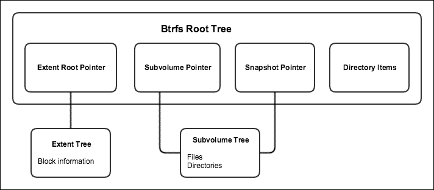

# 第三章：使用原生和 Libvirt 工具的命令行操作

LXC 支持多种后备存储用于其根文件系统。在 第二章， *在 Linux 系统上安装和运行 LXC* 中，我们使用了默认的 `dir` 类型，该类型在 `/var/lib/lxc/containername/rootfs` 下创建一个目录。使用默认存储在某些情况下可能足够，但为了利用更多高级功能，如容器快照和备份，还可以使用其他类型，如 LVM、Btrfs 和 ZFS。

除了容器快照，LXC 还提供了通过 cgroups 控制资源使用的工具，能够在容器启动前、启动时和启动后执行程序，并冻结/挂起正在运行的 LXC 实例的状态。

作为 LXC 工具的替代方案，我们还将查看一组不同的用户空间工具和库，用于创建和管理容器，特别是 libvirt 提供的工具。

本章将涵盖以下主题：

+   使用 LVM 作为后备存储构建容器

+   LXC 在 Btrfs 上

+   使用 ZFS 后备存储

+   自动启动容器

+   添加容器钩子

+   从主机访问文件并探索实例的运行文件系统

+   冻结正在运行的容器

+   限制容器资源使用

+   使用 libvirt 库和工具构建容器

# 使用 LVM 后备存储

**逻辑卷管理器**（**LVM**）使用 Linux 内核中的设备映射框架，该框架允许将物理块设备映射到更抽象的虚拟块设备上。这种抽象允许将各种块设备聚合到逻辑卷中，从而更好地控制资源。通过 LVM，可以通过向称为 **物理卷**（**PVs**）的资源池中添加更多块设备来扩展文件系统的大小。PVs 包含块设备。然后可以从 PV 中切出 **卷组**（**VGs**）。VG 可以在 PV 之间拆分、合并或移动，如果 PV 中有足够的块，则可以在线调整其大小。VG 可以拥有一个或多个 **逻辑卷**（**LVs**）。LV 可以跨多个磁盘并承载文件系统。如果需要添加更多磁盘空间，可以向 PV 中添加新的块设备，然后扩展 VG 和 LV。

LVM 允许创建快照，这是 LXC 利用的功能，它创建一个 LV 作为原始 LV 的克隆。通过此功能，我们可以快速克隆容器，正如我们接下来所看到的那样。

下图展示了 LVM 布局以及用于管理卷的用户空间工具：


首先让我们从安装 LVM 包开始。在 Ubuntu 上，可以通过以下命令来完成：

```
root@ubuntu:~# apt-get install lvm2

```

在 CentOS 上同样运行：

```
[root@centos ~]# yum install lvm2

```

接下来，让我们检查一下我们将要使用的块设备，在本例中为 `xvdb`：

```
root@ubuntu:~# fdisk -l /dev/xvdb 
Disk /dev/xvdb: 80.5 GB, 80530636800 bytes
255 heads, 63 sectors/track, 9790 cylinders, total 157286400 sectors
Units = sectors of 1 * 512 = 512 bytes
Sector size (logical/physical): 512 bytes / 512 bytes
I/O size (minimum/optimal): 512 bytes / 512 bytes
Disk identifier: 0x00000000
Disk /dev/xvdb doesn't contain a valid partition table
root@ubuntu:~#

```

要创建 LVM 类型的分区，我们将使用`fdisk`工具，按照这里的步骤进行：

1.  按`n`键创建一个新分区。

1.  然后选择`p`为主分区。

1.  接下来，选择分区号`1`。

1.  只需按两次*Enter*键使用默认值。

1.  接下来，按`p`打印出定义的分区。

1.  按`L`列出所有可用的类型。

1.  输入`t`来选择分区。

1.  选择`8e`作为 Linux LVM 类型，并按*Enter*键应用。

1.  再次使用`p`打印出更改。

1.  最后，按`w`保存更改：

    ```
     root@ubuntu:~# fdisk /dev/xvdb 
    Device contains neither a valid DOS partition table, nor 
          Sun, SGI or OSF disklabel 
    Building a new DOS disklabel with disk identifier    
          0x115573cb. 
    Changes will remain in memory only, until you decide to 
          write them. 
    After that, of course, the previous content won't be 
          recoverable. 
    Warning: invalid flag 0x0000 of partition table 4 will be  
          corrected by w(rite) 
    Command (m for help): p 
    Disk /dev/xvdb: 80.5 GB, 80530636800 bytes 
    255 heads, 63 sectors/track, 9790 cylinders, total 
          157286400 sectors 
    Units = sectors of 1 * 512 = 512 bytes 
    Sector size (logical/physical): 512 bytes / 512 bytes 
    I/O size (minimum/optimal): 512 bytes / 512 bytes 
    Disk identifier: 0x115573cb 
    Device Boot Start End Blocks Id System 
    Command (m for help): n 
    Partition type: 
    p primary (0 primary, 0 extended, 4 free) 
    e extended 
    Select (default p): p 
    Partition number (1-4, default 1): 1 
    First sector (2048-157286399, default 2048): 
    Using default value 2048 
    Last sector, +sectors or +size{K,M,G} (2048-157286399,    
          default 157286399): 
    Using default value 157286399 
    Command (m for help): t 
    Selected partition 1 
    Hex code (type L to list codes): 8e 
    Changed system type of partition 1 to 8e (Linux LVM) 
    Command (m for help): p 
    Disk /dev/xvdb: 80.5 GB, 80530636800 bytes 
    255 heads, 63 sectors/track, 9790 cylinders, total 
          157286400 sectors 
    Units = sectors of 1 * 512 = 512 bytes 
    Sector size (logical/physical): 512 bytes / 512 bytes 
    I/O size (minimum/optimal): 512 bytes / 512 bytes 
    Disk identifier: 0x115573cb 
    Device Boot Start  End      Blocks    Id  System 
    /dev/xvdb1  2048  157286399 78642176  8e  Linux LVM 
    Command (m for help): w 
    The partition table has been altered! 
    Calling ioctl() to re-read partition table. 
    Syncing disks. 
    root@ubuntu:~#

    ```

定义好 LVM 分区后，我们来创建 PV：

```
root@ubuntu:~# pvcreate /dev/xvdb1 
Physical volume "/dev/xvdb1" successfully created 
root@ubuntu:~#

```

这样，`xvdb1`分区现在成为了 LVM 的一部分。接下来是创建 VG，我们将其命名为`lxc`，因为这是 LXC 使用的默认 VG：

```
root@ubuntu:~# vgcreate lxc /dev/xvdb1 
Volume group "lxc" successfully created 
root@ubuntu:~#

```

## 使用 LVM 存储后端创建 LXC 容器

要使用 LVM 存储后端创建容器，我们需要在命令行中指定它，并指定所需的根文件系统大小：

```
root@ubuntu:~# lxc-create --bdev lvm --fssize 10G --name lvm_container --template ubuntu 
Logical volume "lvm_container" created 
Checking cache download in /var/cache/lxc/trusty/rootfs-amd64 ... 
Installing packages in template: apt-transport-https,ssh,vim,language-pack-en 
Downloading ubuntu trusty minimal ... 
... 
[root@centos ~]# lxc-create --bdev lvm --fssize 3G --name lvm_container --template centos 
...

```

从前面截断的输出中可以看到，`lxc-create`命令创建了一个名为`lvm_container`的新 LV，并在其上构建了容器文件系统。

我们通过`pvs`、`vgs`和`lvs`命令列出创建的容器和 LVM 卷：

```
root@ubuntu:~# lxc-ls -f 
NAME STATE AUTOSTART GROUPS IPV4 IPV6 
lvm_container STOPPED 0 - - - 
root@ubuntu:~# pvs 
PV VG Fmt Attr PSize PFree 
/dev/xvdb1 lxc lvm2 a-- 75.00g 65.00g 
root@ubuntu:~# vgs 
VG #PV #LV #SN Attr VSize VFree 
lxc 1 1 0 wz--n- 75.00g 65.00g 
root@ubuntu:~# lvs 
LV VG Attr LSize Pool Origin Data% Move Log Copy% Convert 
lvm_container lxc -wi-a---- 10.00g 
root@ubuntu:~#

```

如预期所示，我们可以看到之前创建的 PV 和 VG，以及 LXC 添加的 LV。

让我们启动容器，并确保它正在运行：

```
root@ubuntu:~# lxc-start -n lvm_container 
root@ubuntu:~# lxc-ls -f 
NAME          STATE  AUTOSTART GROUPS IPV4 IPV6 
lvm_container RUNNING 0 - - - 
root@ubuntu:~#

```

检查容器配置文件时，我们可以看到根文件系统的后端存储被设置为`lvm`：

```
root@ubuntu:~# cat /var/lib/lxc/lvm_container/config | grep -vi ^# | grep lxc 
lxc.include = /usr/share/lxc/config/ubuntu.common.conf 
lxc.rootfs = /dev/lxc/lvm_container 
lxc.rootfs.backend = lvm 
lxc.utsname = lvm_container 
lxc.arch = amd64 
lxc.network.type = veth 
lxc.network.link = lxcbr0 
lxc.network.flags = up 
lxc.network.hwaddr = 00:16:3e:60:96:a2 
root@ubuntu:~#

```

查看设备映射器在`/dev/lxc`和`/dev/mapper`中创建的新块设备，它们是`/dev/dm-0`的链接：

```
root@ubuntu:~# ls -la /dev/lxc/ 
total 0 
drwxr-xr-x 2 root root 60 Sep 13 18:14 . 
drwxr-xr-x 15 root root 4020 Sep 13 18:25 .. 
lrwxrwxrwx 1 root root 7 Sep 13 18:14 lvm_container -> ../dm-0 
root@ubuntu:~# ls -la /dev/mapper/ 
total 0 
drwxr-xr-x 2 root root 100 Sep 13 18:35 . 
drwxr-xr-x 15 root root 4040 Sep 13 18:35 .. 
crw------- 1 root root 10, 236 Aug 30 15:17 control 
lrwxrwxrwx 1 root root 7 Sep 13 18:14 lxc-lvm_container -> ../dm-0 
root@ubuntu:~# ls -la /dev/mapper/lxc-lvm_container 
lrwxrwxrwx 1 root root 7 Sep 13 18:14 /dev/mapper/lxc-lvm_container -> ../dm-0 
root@ubuntu:~#

```

让我们创建一个第二个较小的容器，并观察设备映射器的效果：

```
root@ubuntu:~# lxc-create --bdev lvm --fssize 5G --name lvm_container_2 --template debian 
Logical volume "lvm_container_2" created 
debootstrap is /usr/sbin/debootstrap 
Checking cache download in /var/cache/lxc/debian/rootfs-jessie-amd64 ... 
... 
root@ubuntu:~# lvs 
LV VG Attr LSize Pool Origin Data% Move Log Copy% Convert 
lvm_container lxc -wi-ao--- 10.00g 
lvm_container_2 lxc -wi-a---- 5.00g 
root@ubuntu:~# 
root@ubuntu:~# ls -la /dev/lxc/ 
total 0 
drwxr-xr-x 2 root root 80 Sep 13 18:35 . 
drwxr-xr-x 15 root root 4040 Sep 13 18:35 .. 
lrwxrwxrwx 1 root root 7 Sep 13 18:14 lvm_container -> ../dm-0 
lrwxrwxrwx 1 root root 7 Sep 13 18:35 lvm_container_2 -> ../dm-1 
root@ubuntu:~# ls -la /dev/mapper/ 
total 0 
drwxr-xr-x 2 root root 100 Sep 13 18:35 . 
drwxr-xr-x 15 root root 4040 Sep 13 18:35 .. 
crw------- 1 root root 10, 236 Aug 30 15:17 control 
lrwxrwxrwx 1 root root 7 Sep 13 18:14 lxc-lvm_container -> ../dm-0 
lrwxrwxrwx 1 root root 7 Sep 13 18:35 lxc-lvm_container_2 -> ../dm-1 
root@ubuntu:~#

```

注意到这次容器的构建速度更快，因为根文件系统已经被缓存到磁盘中，并且存在两个块设备`dm-0`和`dm-1`。

让我们获取更多关于 LXC 为两个容器创建的 LV 的信息：

```
root@ubuntu:~# lvdisplay 
--- Logical volume --- 
LV Path             /dev/lxc/lvm_container 
LV Name             lvm_container 
VG Name             lxc 
LV UUID             oBiCEC-mHE7-FHGY-ikUI-tg10-rouD-NBWHVt 
LV Write Access     read/write 
LV Creation host, time ubuntu, 2016-09-13 18:14:42 +0000 
LV Status            available 
# open               1 
LV Size              10.00 GiB 
Current LE           2560 
Segments             1 
Allocation           inherit 
Read ahead sectors   auto 
- currently set to   256 
Block device         252:0 
--- Logical volume --- 
LV Path              /dev/lxc/lvm_container_2 
LV Name              lvm_container_2 
VG Name              lxc 
LV UUID              ED06VK-xzWv-lGPL-Myff-gN3P-AD2l-8zTRko 
LV Write Access      read/write 
LV Creation host, time ubuntu, 2016-09-13 18:35:52 +0000 
LV Status            available 
# open               0 
LV Size              5.00 GiB 
Current LE           1280 
Segments             1 
Allocation           inherit 
Read ahead sectors   auto 
- currently set to   256 
Block device         252:1 
root@ubuntu:~#

```

注意到有两个 LV 及其各自的属性。

## 在 LVM 存储后端上创建容器快照

现在我们有支持快照的存储后端容器，接下来我们来试验一下`lxc-copy`工具。`lxc-copy`工具可以创建现有容器的副本，这些副本可以是原始容器的完整克隆，意味着整个根文件系统都会被复制到新容器中，或者是快照，采用**写时复制**（**COW**）。

让我们从创建第二个容器的快照开始，并观察 LV 的变化：

```
root@ubuntu:~# lxc-copy --snapshot --name lvm_container_2 --newname container_2_copy
Logical volume "container_2_copy" created
root@ubuntu:~# lxc-ls -f
NAME             STATE AUTOSTART GROUPS IPV4 IPV6
container_2_copy STOPPED 0 - - -
lvm_container    RUNNING 0 - 10.0.3.129 -
lvm_container_2  STOPPED 0 - - -
root@ubuntu:~# lvs
LV               VG Attr LSize Pool Origin Data% Move Log Copy% Convert
container_2_copy lxc swi-a-s-- 5.00g lvm_container_2 0.00
lvm_container    lxc -wi-ao--- 10.00g
lvm_container_2  lxc owi-a-s-- 5.00g
root@ubuntu:~#

```

从前面的输出中可以注意到`s`属性，表示该容器是一个快照，而`Origin`列显示了`lvm_container_2`，这是我们克隆的容器。COW（写时复制）是一种快速创建容器快照的好方法，能够节省磁盘空间，仅记录快照后发生的新变化。

相反，如果我们不为 `lxc-copy` 指定 `--snapshot` 属性，我们可以创建原始容器文件系统的完整副本：

```
root@ubuntu:~# lxc-copy --name lvm_container_2 --newname container_2_hard 
Logical volume "container_2_hard" created 
root@ubuntu:~# lvs 
LV               VG  Attr LSize Pool Origin Data% Move Log Copy% Convert 
container_2_copy lxc swi-a-s-- 5.00g lvm_container_2 0.11 
container_2_hard lxc -wi-a---- 5.00g 
lvm_container    lxc -wi-ao--- 10.00g 
lvm_container_2  lxc owi-a-s-- 5.00g 
root@ubuntu:~#

```

观察新克隆容器没有 `s` 属性，并且 `Origin` 列现在为空，这表示它是完整的副本，而不是快照。

## 使用 truncate、dd 和 losetup 创建块设备

对于本章中的示例，最好使用诸如 Rackspace 或 Amazon 之类的云服务提供商，因为它们提供免费套餐，并且能够按需添加或阻塞设备。然而，如果无法使用块设备进行测试，您可以借助一些工具创建逻辑块设备并使用它。无需多言，这仅适用于测试，并且由于此类抽象所带来的额外开销，不应在生产环境中实施。

让我们展示如何创建一个块设备，并在其上创建一个 PV 供 LVM 使用：

1.  首先，让我们创建一个文件，作为新软件块设备的基础，可以使用 `truncate` 或 `dd` 命令，并指定大小为 5 GB：

    ```
     root@ubuntu:~# truncate --size 5G xvdz.img 
     root@ubuntu:~#

    ```

    上述命令在磁盘上创建了一个常规的 5 GB 文件：

    ```
     root@ubuntu:~# ls -la xvdz.img 
     -rw-r--r-- 1 root root 5368709120 Sep 13 19:01 xvdz.img 
     root@ubuntu:~#

    ```

1.  接下来，我们将使用 `loop` 内核模块和 `losetup` 工具，通过将环回设备与之前创建的常规文件关联，来创建一个新的块设备。

    首先，我们加载内核模块：

    ```
     root@ubuntu:~# modprobe loop

    ```

1.  然后，找到第一个未使用的可用环回设备：

    ```
     root@ubuntu:~# losetup --find 
     /dev/loop0 
     root@ubuntu:~#

    ```

1.  将环回设备与映像文件关联：

    ```
     root@ubuntu:~# losetup /dev/loop0 xvdz.img 
     root@ubuntu:~# losetup --all 
     /dev/loop0: [ca01]:30352 (/root/xvdz.img) 
     root@ubuntu:~#

    ```

1.  现在，我们可以将 `/dev/loop0` 作为常规块设备使用。让我们在其上创建 LVM PV：

    ```
     root@ubuntu:~# pvcreate /dev/loop0 
     Physical volume "/dev/loop0" successfully created 
     root@ubuntu:~#

    ```

1.  或者，我们可以使用 `dd` 命令：

    ```
     root@ubuntu:~# dd if=/dev/zero of=/block_device bs=1k 
          count=500000 
     500000+0 records in 
     500000+0 records out 
     512000000 bytes (512 MB) copied, 2.33792 s, 219 MB/s 
     root@ubuntu:~# losetup --find 
     /dev/loop1 
     root@ubuntu:~#

    ```

    请注意，`loop1` 现在是下一个可用的环回设备：

    ```
     root@ubuntu:~# losetup /dev/loop1 /block_device 
     root@ubuntu:~# pvcreate /dev/loop1 
     Physical volume "/dev/loop1" successfully created 
     root@ubuntu:~#

    ```

1.  现在列出环回设备，显示其中两个与我们通过 `truncate` 和 `dd` 创建的常规文件关联：

    ```
     root@ubuntu:~# losetup --all 
     /dev/loop0: [ca01]:30352 (/root/xvdz.img) 
     /dev/loop1: [ca01]:38291 (/block_device) 
     root@ubuntu:~#

    ```

1.  最后，若要移除环回设备，请运行以下命令：

    ```
     root@ubuntu:~# losetup -d /dev/loop1
     root@ubuntu:~# losetup -d /dev/loop0
     root@ubuntu:~# losetup --all
     root@ubuntu:~#

    ```

# 使用 Btrfs 后备存储

**B 树文件系统**（**Btrfs**）是一个 COW 文件系统，提供现代功能，如动态 inode 分配、压缩和在线文件系统碎片整理——最重要的是，适用于本书目的，可写和只读的快照。

不深入讨论 Btrfs 的设计，下面的图示展示了文件系统的主要组件：



每个 Btrfs 文件系统包含一个 **Btrfs 根树**，它记录 **Extent Tree** 和 **Subvolume Tree** 的根块。根块指针会随着每次事务的进行而更新，指向由事务创建的新根。前面图示中的 **Extent Tree** 管理磁盘空间，并包含设备上块的信息。**Subvolume Tree** 记录快照，这些快照是子卷。

请注意，子卷与 LVM 中的 LV 是不同的，因为 Btrfs 子卷并不是一个实际的块设备。

让我们看几个例子，了解如何在 LXC 中使用 Btrfs 后备存储：

1.  首先，让我们安装 Btrfs 支持工具。

    在 Ubuntu 上，运行以下命令：

    ```
     root@ubuntu:~# apt-get -y install btrfs-tools

    ```

    在 CentOS 上，通过以下命令进行安装：

    ```
     [root@centos ~]# yum install -y btrfs-progs

    ```

1.  如果尚未加载，请加载内核模块：

    ```
     root@ubuntu:~# modprobe btrfs 
     root@ubuntu:~# lsmod | grep btrfs 
     btrfs       840205  0 
     raid6_pq    97812   1     btrfs 
     xor         21411   1     btrfs 
     libcrc32c   12644   2     xfs,btrfs 
     root@ubuntu:~#

    ```

1.  使用 Btrfs 时，我们不需要在块设备上创建分区，因此可以直接创建文件系统：

    ```
     root@ubuntu:~# mkfs -t btrfs /dev/xvdd 
     fs created label (null) on /dev/xvdd 
     nodesize 16384 leafsize 16384 sectorsize 4096 size 75.00GiB 
     Btrfs v3.12 
     root@ubuntu:~#

    ```

    注意 `xvdd` 块设备上的文件系统类型：

    ```
     root@ubuntu:~# file -s /dev/xvdd 
     /dev/xvdd: BTRFS Filesystem sectorsize 4096, nodesize 16384, 
          leafsize 16384,   
          UUID=58ef810a-c009-4302-9579-a2a9ed7f7ced, 114688/80530636800 
          bytes used, 
          1 devices 
     root@ubuntu:~#

    ```

1.  要获取有关文件系统的更多信息，我们可以使用 `btrfs` 工具：

    ```
     root@ubuntu:~# btrfs filesystem show 
     Label: none uuid: 9c84a092-4791-4031-ad16-2cb8488c5633 
     Total devices 1 FS bytes used 331.25MiB 
     devid 1 size 75.00GiB used 3.04GiB path /dev/xvdb 
     Btrfs v3.12 
     root@ubuntu:~#

    ```

1.  让我们挂载块设备，以便实际使用它：

    ```
     root@ubuntu:~# mkdir btrfs_c1 
     root@ubuntu:~# mount /dev/xvdd btrfs_c1 
     root@ubuntu:~# cat /proc/mounts | grep btrfs 
     /dev/xvdd /root/btrfs_c1 btrfs rw,relatime,ssd,space_cache 0 0 
     root@ubuntu:~#

    ```

1.  挂载设备后，让我们展示子卷和磁盘空间使用情况：

    ```
     root@ubuntu:~# btrfs subvolume show /root/btrfs_c1/ 
     /root/btrfs_c1 is btrfs root 
     root@ubuntu:~# 
     root@ubuntu:~# btrfs filesystem df /root/btrfs_c1 
     Data, single: total=1.01GiB, used=309.14MiB 
     System, DUP: total=8.00MiB, used=16.00KiB 
     System, single: total=4.00MiB, used=0.00 
     Metadata, DUP: total=1.00GiB, used=22.09MiB 
     Metadata, single: total=8.00MiB, used=0.00 
     root@ubuntu:~#

    ```

## 使用 Btrfs 后端存储创建 LXC 容器

现在我们已经准备好后端存储，让我们通过指定 Btrfs 后端存储和根文件系统位置来创建一个新的 LXC 容器：

```
root@ubuntu:~# lxc-create --bdev btrfs --lxcpath=btrfs_c1 --name btrfs_container --template ubuntu 
Checking cache download in /var/cache/lxc/trusty/rootfs-amd64 ... 
Copy /var/cache/lxc/trusty/rootfs-amd64 to btrfs_c1/btrfs_container/rootfs ... 
Copying rootfs to btrfs_c1/btrfs_container/rootfs ... 
... 
root@ubuntu:~# lxc-ls --lxcpath=/root/btrfs_c1 -f 
NAME STATE AUTOSTART GROUPS IPV4 IPV6 
btrfs_container STOPPED 0 - - - 
root@ubuntu:~#

```

请注意，我们为容器的根文件系统使用了与 `/var/lib/lxc` 默认路径不同的路径。我们通过 `--lxcpath` 参数指定它指向 Btrfs 卷。每次运行 LXC 命令时，我们需要传递相同的路径，或者可以通过 `lxc-config` 命令更新容器的默认路径：

```
root@ubuntu:~# lxc-config lxc.lxcpath 
/var/lib/lxc 
root@ubuntu:~# echo "lxc.lxcpath = /root/btrfs_c1" >> /etc/lxc/lxc.conf 
root@ubuntu:~# lxc-config lxc.lxcpath 
/root/btrfs_c1 
root@ubuntu:~#

```

现在我们可以列出所有正在运行的 Btrfs 容器，而无需显式指定路径：

```
root@ubuntu:~# lxc-ls -f 
NAME STATE AUTOSTART GROUPS IPV4 IPV6 
btrfs_container STOPPED 0 - - - 
root@ubuntu:~#

```

容器的根文件系统和配置文件位于 Btrfs 卷上：

```
root@ubuntu:~# ls -la btrfs_c1/btrfs_container/ 
total 20 
drwxrwx--- 1 root root 24 Sep 13 20:08 . 
drwxr-xr-x 1 root root 30 Sep 13 20:07 .. 
-rw-r--r-- 1 root root 714 Sep 13 20:08 config 
drwxr-xr-x 1 root root 132 Sep 13 18:18 rootfs 
root@ubuntu:~#

```

为了确保容器的根目录位于 Btrfs 文件系统上，让我们列出所有子卷：

```
root@ubuntu:~# btrfs subvolume list /root/btrfs_c1/ 
ID 257 gen 9 top level 5 path btrfs_container/rootfs 
root@ubuntu:~#

```

## 在 Btrfs 后端存储上创建容器快照

使用 Btrfs 创建 COW 快照与 LVM 类似：我们需要指定后端存储、容器根文件系统的位置以及新容器的名称：

```
root@ubuntu:~# lxc-copy --lxcpath=/root/btrfs_c1 -s -n btrfs_container -N btrfs_cow_clone 
root@ubuntu:~# lxc-ls --lxcpath=/root/btrfs_c1 -f 
NAME            STATE AUTOSTART GROUPS IPV4 IPV6 
btrfs_container STOPPED 0 - - - 
btrfs_cow_clone STOPPED 0 - - - 
root@ubuntu:~#

```

让我们看看克隆操作后对 Btrfs 文件系统的影响：

```
root@ubuntu:~# btrfs subvolume list /root/btrfs_c1/ 
ID 257 gen 12 top level 5 path btrfs_container/rootfs 
ID 259 gen 12 top level 5 path btrfs_cow_clone/rootfs 
root@ubuntu:~# ls -la btrfs_c1/ 
total 20 
drwxr-xr-x 1 root root 60 Sep 13 20:23 . 
drwx------ 6 root root 4096 Sep 13 19:58 .. 
drwxrwx--- 1 root root 24 Sep 13 20:08 btrfs_container 
drwxrwx--- 1 root root 24 Sep 13 20:23 btrfs_cow_clone 
root@ubuntu:~#

```

从前面的输出中可以看到，我们现在在 Btrfs 文件系统上有两个子卷和目录。

在启动容器之前，确保 `lxc.rootfs` 配置选项指向正确的根文件系统：

```
root@ubuntu:~# cat btrfs_c1/btrfs_container/config | grep -vi ^# | grep lxc 
lxc.include = /usr/share/lxc/config/ubuntu.common.conf 
lxc.rootfs = /root/btrfs_c1/btrfs_container/rootfs 
lxc.rootfs.backend = btrfs 
lxc.utsname = btrfs_container 
lxc.arch = amd64 
lxc.network.type = veth 
lxc.network.link = lxcbr0 
lxc.network.flags = up 
lxc.network.hwaddr = 00:16:3e:f2:a9:04 
root@ubuntu:~#

```

### 提示

在某些 Linux 发行版和 LXC 版本中，`lxc.rootfs` 可能指向错误的容器文件系统位置，从而导致启动失败。如果是这种情况，请更改路径并重新启动容器。

如果一切正常，我们启动容器并确保它们正在运行：

```
root@ubuntu:~# lxc-start --lxcpath=/root/btrfs_c1 -n btrfs_cow_clone 
root@ubuntu:~# lxc-start --lxcpath=/root/btrfs_c1 -n btrfs_container 
root@ubuntu:~# lxc-ls -f 
NAME            STATE AUTOSTART GROUPS IPV4 IPV6 
btrfs_container RUNNING 0 - 10.0.3.137 - 
btrfs_cow_clone RUNNING 0 - 10.0.3.136 - 
root@ubuntu:~#

```

为了进行清理，首先停止容器，卸载 Btrfs 块设备，并恢复 LXC 默认路径：

```
root@ubuntu:~# lxc-stop --lxcpath=/root/btrfs_c1 -n btrfs_cow_clone 
root@ubuntu:~# lxc-stop --lxcpath=/root/btrfs_c1 -n btrfs_container 
root@ubuntu:~# umount /root/btrfs_c1 
root@ubuntu:~# echo "lxc.lxcpath = /var/lib/lxc" > /etc/lxc/lxc.conf 
root@ubuntu:~# lxc-config lxc.lxcpath 
/var/lib/lxc 
root@ubuntu:~#

```

# 使用 ZFS 后端存储

ZFS 既是一个文件系统，又是一个 LVM。它由一个存储池组成，管理多个块设备，并为文件系统提供虚拟存储接口，之后可以轻松扩展。以下图示展示了 ZFS 的总体结构及其组件：


与 LVM 类似，多个块设备可以聚合成一个 **存储池**，从中可以划分出不同的目录。

ZFS 提供的主要功能包括由于透明校验和的实现而带来的数据可靠性、自动压缩和去重、并行常数时间目录操作，以及在 LXC 环境下最重要的功能：COW 快照和克隆。

让我们在 Ubuntu 上安装用户空间工具：

```
root@ubuntu:~# apt-add-repository ppa:zfs-native/daily 
root@ubuntu:~# apt-get update 
root@ubuntu:~# apt-get install ubuntu-zfs

```

在 CentOS 上，软件包名称不同：

```
[root@centos ~]# yum update 
[root@centos ~]# reboot 
[root@centos ~]# yum localinstall --nogpgcheck http://archive.zfsonlinux.org/epel/zfs-release.el7.noarch.rpm 
[root@centos ~]# yum install kernel-devel 
[root@centos ~]# yum install zfs

```

接下来，加载内核模块并确保它正在使用：

```
root@ubuntu:~# modprobe zfs 
root@ubuntu:~# lsmod | grep zfs 
zfs      3089200 0 
zunicode 331170  1 zfs 
zcommon  66797   1 zfs 
znvpair  89131   2 zfs,zcommon 
spl      106271  3 zfs,zcommon,znvpair 
zavl     15236   1 zfs 
root@ubuntu:~#

```

让我们创建一个名为`lxc`的池，因为这是 LXC 在创建容器根文件系统时使用的 ZFS 后端的默认名称：

```
root@ubuntu:~# zpool create -f lxc xvdb

```

将`xvdb`替换为你想要使用的块设备名称。

让我们列出新创建的池并检查其状态：

```
root@ubuntu:~# zpool list 
NAME SIZE ALLOC FREE EXPANDSZ FRAG CAP DEDUP HEALTH ALTROOT 
lxc 74.5G 51.5K 74.5G - 0% 0% 1.00x ONLINE - 
root@ubuntu:~# zpool status 
pool: lxc 
state: ONLINE 
scan: none requested 
config: 
NAME STATE READ WRITE CKSUM 
lxc ONLINE 0 0 0 
xvdb ONLINE 0 0 0 
errors: No known data errors 
root@ubuntu:~#

```

一切看起来不错，让我们查看挂载点：

```
root@ubuntu:~# zfs list 
NAME USED AVAIL REFER MOUNTPOINT 
lxc 56.5K 72.2G 19K /lxc 
root@ubuntu:~# 
root@ubuntu:~# df -h | grep -w lxc 
lxc 73G 0 73G 0% /lxc 
root@ubuntu:~#

```

到此为止，我们已经准备好将 ZFS 作为 LXC 的后端存储来使用。

## 使用 ZFS 后端存储创建 LXC 容器

让我们通过指定后端存储和根文件系统路径来创建一个新的 LXC 容器，就像我们在 LVM 和 Btrfs 中做的那样：

```
root@ubuntu:~# lxc-create --bdev zfs --lxcpath=/lxc --name zfs_container --template ubuntu
Checking cache download in /var/cache/lxc/trusty/rootfs-amd64 ...
Installing packages in template: apt-transport-https,ssh,vim,language-pack-en
Downloading ubuntu trusty minimal ...
... 
root@ubuntu:~# lxc-ls --lxcpath=/lxc -f
NAME          STATE AUTOSTART GROUPS IPV4 IPV6
zfs_container STOPPED 0 - - -
root@ubuntu:~#

```

### 注意

请注意，由于我们使用的是自定义路径作为容器的根文件系统，每个 LXC 命令都需要传递`--lxcpath`参数。通过在系统范围的 LXC 配置文件中指定新的路径，可以避免这种情况，就像我们在本章的 Btrfs 部分中看到的那样。

请注意，根文件系统位于 ZFS 卷上：

```
root@ubuntu:~# ls -la /lxc/
total 5
drwxr-xr-x 3 root root 3 Sep 14 13:57 
drwxr-xr-x 23 root root 4096 Sep 14 13:54 ..
drwxrwx--- 3 root root 4 Sep 14 14:02 zfs_container
root@ubuntu:~#

```

## 在 ZFS 后端存储上创建容器快照

让我们基于刚刚创建的容器做一个快照。确保原始容器已停止，并指定根文件系统的位置：

```
root@ubuntu:~# lxc-copy --lxcpath=/lxc -s -n zfs_container -N zfs_cow_clone 
root@ubuntu:~# lxc-ls --lxcpath=/lxc -f 
NAME STATE AUTOSTART GROUPS IPV4 IPV6 
zfs_container STOPPED 0 - - - 
zfs_cow_clone STOPPED 0 - - - 
root@ubuntu:~#

```

1.  克隆目录位于 ZFS 文件系统上：

    ```
     root@ubuntu:~# ls -la /lxc 
     total 6 
     drwxr-xr-x 4 root root 4 Sep 14 14:03 . 
     drwxr-xr-x 23 root root 4096 Sep 14 13:54 .. 
     drwxrwx--- 3 root root 4 Sep 14 14:02 zfs_container 
     drwxrwx--- 3 root root 4 Sep 14 14:03 zfs_cow_clone 
     root@ubuntu:~#

    ```

1.  接下来，启动两个容器并确保它们处于运行状态：

    ```
     root@ubuntu:~# lxc-start --lxcpath=/lxc --name zfs_container 
     root@ubuntu:~# lxc-start --lxcpath=/lxc --name zfs_cow_clone 
     root@ubuntu:~# lxc-ls --lxcpath=/lxc -f 
     NAME STATE AUTOSTART GROUPS IPV4 IPV6 
     zfs_container RUNNING 0 - 10.0.3.238 - 
     zfs_cow_clone RUNNING 0 - 10.0.3.152 - 
     root@ubuntu:~#

    ```

1.  最后，让我们清理一下。首先，停止容器：

    ```
     root@ubuntu:~# lxc-stop --lxcpath=/lxc --name zfs_cow_clone 
     root@ubuntu:~# lxc-stop --lxcpath=/lxc --name zfs_container 
     root@ubuntu:~#

    ```

1.  接下来，尝试销毁两个容器：

    ```
     root@ubuntu:~# lxc-destroy --lxcpath=/lxc --name zfs_cow_clone 
     Destroyed container zfs_cow_clone 
     root@ubuntu:~# lxc-destroy --lxcpath=/lxc --name zfs_container 
     cannot destroy 'lxc/zfs_container': filesystem has children 
     use '-r' to destroy the following datasets: 
     lxc/zfs_container@zfs_cow_clone 
     lxc-destroy: lxccontainer.c: container_destroy: 2376 Error destroying 
          rootfs for    
          zfs_container 
     Destroying zfs_container failed 
     root@ubuntu:~#

    ```

1.  克隆被销毁了，但原始容器失败了。这是因为我们首先需要清理在快照原始容器时创建的子 ZFS 数据集：

    ```
     root@ubuntu:~# zfs destroy lxc/zfs_container@zfs_cow_clone 
     root@ubuntu:~# lxc-destroy --lxcpath=/lxc --name zfs_container 
     Destroyed container zfs_container 
     root@ubuntu:~# lxc-ls --lxcpath=/lxc -f 
     root@ubuntu:~#

    ```

1.  最后，删除 ZFS 池：

    ```
     root@ubuntu:~# zpool destroy lxc 
     root@ubuntu:~# zpool status 
     no pools available 
     root@ubuntu:~# zfs list 
     no datasets available 
     root@ubuntu:~#

    ```

到此为止，ZFS 中没有任何数据集或池。

# 自动启动 LXC 容器

默认情况下，LXC 容器在服务器重启后不会启动。要更改这一点，我们可以使用`lxc-autostart`工具和容器配置文件：

1.  为了演示这一点，首先让我们创建一个新的容器：

    ```
     root@ubuntu:~# lxc-create --name autostart_container --template 
          ubuntu 
     root@ubuntu:~# lxc-ls -f 
     NAME STATE AUTOSTART GROUPS IPV4 IPV6 
     autostart_container STOPPED 0 - - - 
     root@ubuntu:~#

    ```

1.  接下来，将`lxc.start.auto`段添加到其配置文件中：

    ```
     root@ubuntu:~# echo "lxc.start.auto = 1" >> 
          /var/lib/lxc/autostart_container/config 
     root@ubuntu:~#

    ```

1.  列出所有配置为自动启动的容器：

    ```
     root@ubuntu:~# lxc-autostart --list 
     autostart_container 
     root@ubuntu:~#

    ```

1.  现在，我们可以再次使用`lxc-autostart`命令来启动所有配置为自动启动的容器，在这种情况下只有一个容器：

    ```
     root@ubuntu:~# lxc-autostart --all
     root@ubuntu:~# lxc-ls -f
     NAME                STATE AUTOSTART GROUPS IPV4 IPV6
     autostart_container RUNNING 1 - 10.0.3.98 -
     root@ubuntu:~#

    ```

1.  另两个有用的自动启动配置参数是给启动添加延迟，以及定义一个组，使多个容器可以作为一个单元启动。停止容器并将以下内容添加到配置选项中：

    ```
     root@ubuntu:~# lxc-stop --name autostart_container 
     root@ubuntu:~# echo "lxc.start.delay = 5" >> 
          /var/lib/lxc/autostart_container/config 
     root@ubuntu:~# echo "lxc.group = high_priority" >> 
          /var/lib/lxc/autostart_container/config 
     root@ubuntu:~#

    ```

1.  接下来，让我们再次列出配置为自动启动的容器：

    ```
     root@ubuntu:~# lxc-autostart --list 
     root@ubuntu:~#

    ```

    注意，在前面的输出中没有显示任何容器。这是因为我们的容器现在属于一个自动启动组。让我们指定它：

    ```
     root@ubuntu:~# lxc-autostart --list --group high_priority
     autostart_container 5
     root@ubuntu:~#

    ```

1.  同样，启动属于给定自动启动组的所有容器：

    ```
     root@ubuntu:~# lxc-autostart --group high_priority 
     root@ubuntu:~# lxc-ls -f 
     NAME                STATE AUTOSTART GROUPS IPV4 IPV6 
     autostart_container RUNNING 1 high_priority 10.0.3.98 - 
     root@ubuntu:~#

    ```

    要使`lxc-autostart`在服务器重启后自动启动容器，首先需要启动它。可以通过将前述命令添加到`crontab`中，或者创建一个初始化脚本来实现。

1.  最后，为了清理，运行以下命令：

    ```
     root@ubuntu:~# lxc-destroy --name autostart_container 
     Destroyed container autostart_container 
     root@ubuntu:~# lxc-ls -f 
     root@ubuntu:~#

    ```

# LXC 容器钩子

LXC 提供了一种方便的方式，在容器生命周期内执行程序。以下表格总结了可用于启用此功能的各种配置选项：

| **选项** | **描述** |
| --- | --- |
| `lxc.hook.pre-start` | 在容器的终端、控制台或挂载点加载之前，在主机命名空间中运行的钩子 |
| `lxc.hook.pre-mount` | 在容器的文件系统命名空间中运行的钩子，但在设置 `rootfs` 之前 |
| `lxc.hook.mount` | 在挂载完成后，但在 `pivot_root` 之前，容器中运行的钩子 |
| `lxc.hook.autodev` | 在挂载完成且所有挂载钩子运行之后，但在 `pivot_root` 之前，容器中运行的钩子 |
| `lxc.hook.start` | 在容器初始化之前，容器内运行的钩子 |
| `lxc.hook.stop` | 在容器关闭后，在主机的命名空间中运行的钩子 |
| `lxc.hook.post-stop` | 在容器关闭后，在主机命名空间中运行的钩子 |
| `lxc.hook.clone` | 在容器被克隆时运行的钩子 |
| `lxc.hook.destroy` | 在容器被销毁时运行的钩子 |

为了演示这一点，让我们创建一个新的容器，并编写一个简单的脚本，当容器启动时，将四个 LXC 变量的值输出到文件中：

1.  首先，创建容器并将 `lxc.hook.pre-start` 选项添加到其配置文件中：

    ```
     root@ubuntu:~# lxc-create --name hooks_container --template 
          ubuntu 
     root@ubuntu:~# echo "lxc.hook.pre-start =   
          /var/lib/lxc/hooks_container/pre_start.sh" >> /var/lib
          /lxc/hooks_container/config 
     root@ubuntu:~#

    ```

1.  接下来，创建一个简单的 bash 脚本并使其可执行：

    ```
     root@ubuntu:~# vi /var/lib/lxc/hooks_container/pre_start.sh 
     #!/bin/bash 
     LOG_FILE=/tmp/container.log 
     echo "Container name: $LXC_NAME" | tee -a $LOG_FILE 
     echo "Container mounted rootfs: $LXC_ROOTFS_MOUNT" | tee -a 
          $LOG_FILE 
     echo "Container config file $LXC_CONFIG_FILE" | tee -a $LOG_FILE 
     echo "Container rootfs: $LXC_ROOTFS_PATH" | tee -a $LOG_FILE 
     root@ubuntu:~# 
     root@ubuntu:~# chmod u+x /var/lib/lxc/hooks_container
          /pre_start.sh 
     root@ubuntu:~#

    ```

1.  启动容器并检查 bash 脚本应写入的文件的内容，确保脚本已被触发：

    ```
     root@ubuntu:~# lxc-start --name hooks_container 
     root@ubuntu:~# lxc-ls -f 
     NAME            STATE AUTOSTART GROUPS IPV4 IPV6 
     hooks_container RUNNING 0 - 10.0.3.237 - 
     root@ubuntu:~# cat /tmp/container.log 
     Container name: hooks_container 
     Container mounted rootfs: /usr/lib/x86_64-linux-gnu/lxc 
     Container config file /var/lib/lxc/hooks_container/config 
     Container rootfs: /var/lib/lxc/hooks_container/rootfs 
     root@ubuntu:~#

    ```

从前面的输出中，我们可以看到，当我们启动容器时，脚本被触发了，并且 LXC 变量的值被写入了临时文件。

# 从主机操作系统附加目录并探索容器的运行文件系统

LXC 容器的根文件系统在主机操作系统中作为常规目录树可见。我们可以直接通过在该目录中进行更改来操作运行中的容器中的文件。LXC 还允许通过绑定挂载将主机操作系统中的目录挂载到容器内部。绑定挂载是对目录树的另一种视图，它通过在不同的挂载点下复制现有的目录树来实现。

1.  为了演示这一点，让我们创建一个新的容器、目录，并在主机上创建一个文件：

    ```
     root@ubuntu:~# mkdir /tmp/export_to_container 
     root@ubuntu:~# hostname -f > /tmp/export_to_container/file 
     root@ubuntu:~# lxc-create --name mount_container --template 
          ubuntu 
     root@ubuntu:~#

    ```

1.  接下来，我们将使用容器配置文件中的 `lxc.mount.entry` 选项，告诉 LXC 从主机挂载哪个目录，并指定容器内的挂载点：

    ```
     root@ubuntu:~# echo "lxc.mount.entry = /tmp/export_to_container/   
          /var/lib/lxc/mount_container/rootfs/mnt none ro,bind 0 0" >>    
          /var/lib/lxc/mount_container/config 
     root@ubuntu:~#

    ```

1.  一旦容器启动，我们可以看到容器内的 `/mnt` 现在包含了我们之前在主机操作系统 `/tmp/export_to_container` 目录中创建的文件：

    ```
     root@ubuntu:~# lxc-start --name mount_container
     root@ubuntu:~# lxc-attach --name mount_container
     root@mount_container:~# cat /mnt/file
     ubuntu
     root@mount_containerr:~# exit
     exit
     root@ubuntu:~#

    ```

1.  当 LXC 容器处于运行状态时，一些文件仅能在宿主操作系统的`/proc`中看到。要查看容器的运行目录，首先获取其 PID：

    ```
     root@ubuntu:~# lxc-info --name mount_container 
     Name:        mount_container 
     State:       RUNNING 
     PID:         8594 
     IP:          10.0.3.237 
     CPU use:     1.96 seconds 
     BlkIO use:   212.00 KiB 
     Memory use:  8.50 MiB 
     KMem use:    0 bytes 
     Link:        vethBXR2HO 
     TX bytes:    4.74 KiB 
     RX bytes:    4.73 KiB 
     Total bytes: 9.46 KiB 
     root@ubuntu:~#

    ```

    拿到 PID 后，我们可以检查容器的运行目录：

    ```
     root@ubuntu:~# ls -la /proc/8594/root/run/ 
     total 44 
     drwxr-xr-x 10 root root 420 Sep 14 23:28 . 
     drwxr-xr-x 21 root root 4096 Sep 14 23:28 .. 
     -rw-r--r-- 1 root root 4 Sep 14 23:28 container_type 
     -rw-r--r-- 1 root root 5 Sep 14 23:28 crond.pid 
     ---------- 1 root root 0 Sep 14 23:28 crond.reboot 
     -rw-r--r-- 1 root root 5 Sep 14 23:28 dhclient.eth0.pid 
     drwxrwxrwt 2 root root 40 Sep 14 23:28 lock 
     -rw-r--r-- 1 root root 112 Sep 14 23:28 motd.dynamic 
     drwxr-xr-x 3 root root 180 Sep 14 23:28 network 
     drwxr-xr-x 3 root root 100 Sep 14 23:28 resolvconf 
     -rw-r--r-- 1 root root 5 Sep 14 23:28 rsyslogd.pid 
     drwxr-xr-x 2 root root 40 Sep 14 23:28 sendsigs.omit.d 
     drwxrwxrwt 2 root root 40 Sep 14 23:28 shm 
     drwxr-xr-x 2 root root 40 Sep 14 23:28 sshd 
     -rw-r--r-- 1 root root 5 Sep 14 23:28 sshd.pid 
     drwxr-xr-x 2 root root 80 Sep 14 23:28 udev 
     -rw-r--r-- 1 root root 5 Sep 14 23:28 upstart-file-bridge.pid 
     -rw-r--r-- 1 root root 4 Sep 14 23:28 upstart-socket-bridge.pid 
     -rw-r--r-- 1 root root 5 Sep 14 23:28 upstart-udev-bridge.pid 
     drwxr-xr-x 2 root root 40 Sep 14 23:28 user 
     -rw-rw-r-- 1 root utmp 2688 Sep 14 23:28 utmp 
     root@ubuntu:~#

    ```

    ### 提示

    确保将 PID 替换为宿主机上 `lxc-info` 输出的 PID，因为它与前面的示例不同。

为了在容器的根文件系统中进行持久化更改，可以修改 `/var/lib/lxc/mount_container/rootfs/` 中的文件。

# 冻结一个运行中的容器

LXC 利用 `freezer` cgroup 来冻结容器内运行的所有进程。这些进程将处于阻塞状态，直到被解冻。冻结容器在系统负载高时很有用，可以释放一些资源，而不需要实际停止容器并保持其运行状态。

确保你有一个正在运行的容器，并通过`freezer` cgroup 检查其状态：

```
root@ubuntu:~# lxc-ls -f 
NAME            STATE AUTOSTART GROUPS IPV4 IPV6 
hooks_container RUNNING 0 - 10.0.3 
root@ubuntu:~# cat /sys/fs/cgroup/freezer/lxc/hooks_container/freezer.state 
THAWED 
root@ubuntu:~#

```

注意当前正在运行的容器显示为已解冻。让我们冻结它：

```
root@ubuntu:~# lxc-freeze -n hooks_container 
root@ubuntu:~# lxc-ls -f 
NAME            STATE AUTOSTART GROUPS IPV4 IPV6 
hooks_container FROZEN 0 - 10.0.3.237 - 
root@ubuntu:~#

```

容器状态显示为冻结状态，让我们检查 cgroup 文件：

```
root@ubuntu:~# cat /sys/fs/cgroup/freezer/lxc/hooks_container/freezer.state 
FROZEN 
root@ubuntu:~#

```

要解冻容器，运行以下命令：

```
root@ubuntu:~# lxc-unfreeze --name hooks_container 
root@ubuntu:~# lxc-ls -f 
NAME            STATE AUTOSTART GROUPS IPV4 IPV6 
hooks_container RUNNING 0 - 10.0.3.237 - 
root@ubuntu:~# cat /sys/fs/cgroup/freezer/lxc/hooks_container/freezer.state 
THAWED 
root@ubuntu:~#

```

我们可以通过在另一个控制台上运行 `lxc-monitor` 命令，同时冻结和解冻容器来监控状态变化。容器状态的变化将如下所示：

```
root@ubuntu:~# lxc-monitor --name hooks_container 
'hooks_container' changed state to [FREEZING] 
'hooks_container' changed state to [FROZEN] 
'hooks_container' changed state to [THAWED]

```

# 限制容器资源使用

在第一章，*Linux 容器介绍*中，我们了解了如何通过直接操作 cgroup 层次结构中的文件或使用用户空间工具轻松地限制进程资源。

类似地，LXC 也提供了同样简便易用的工具。

让我们从设置容器的可用内存为 512 MB 开始：

```
root@ubuntu:~# lxc-cgroup -n hooks_container memory.limit_in_bytes 536870912 
root@ubuntu:~#

```

我们可以通过直接检查容器的 `memory` cgroup 来验证新设置是否已应用：

```
root@ubuntu:~# cat /sys/fs/cgroup/memory/lxc/hooks_container/memory.limit_in_bytes
536870912
root@ubuntu:~#

```

更改该值只需要再次运行相同的命令。让我们将可用内存更改为 256 MB，并通过附加到容器并运行 free 工具来检查容器：

```
root@ubuntu:~# lxc-cgroup -n hooks_container memory.limit_in_bytes 268435456 
root@ubuntu:~# cat /sys/fs/cgroup/memory/lxc/hooks_container/memory.limit_in_bytes 
268435456 
root@ubuntu:~# lxc-attach --name hooks_container 
root@hooks_container:~# free -m 
 total used free shared buffers cached 
Mem: 256   63   192  0      0       54 
-/+ buffers/cache: 9 246 
Swap: 0 0 0 
root@hooks_container:~# exit 
root@ubuntu:~#

```

如前所示，容器的可用内存只有 256 MB。

我们还可以将一个 CPU 核心绑定到容器。下一个示例中，我们的测试服务器有两个核心。让我们允许容器只在核心 0 上运行：

```
root@ubuntu:~# cat /proc/cpuinfo | grep processor 
processor : 0 
processor : 1 
root@ubuntu:~# 
root@ubuntu:~# lxc-cgroup -n hooks_container cpuset.cpus 0 
root@ubuntu:~# cat /sys/fs/cgroup/cpuset/lxc/hooks_container/cpuset.cpus 
0 
root@ubuntu:~# lxc-attach --name hooks_container 
root@hooks_container:~# cat /proc/cpuinfo | grep processor 
processor : 0 
root@hooks_container:~# exit 
exit 
root@ubuntu:~#

```

通过附加到容器并检查可用的 CPU，我们看到只有一个呈现出来，正如预期的那样。

为了使更改在服务器重启后生效，我们需要将它们添加到容器的配置文件中：

```
root@ubuntu:~# echo "lxc.cgroup.memory.limit_in_bytes = 536870912" >> /var/lib/lxc/hooks_container/config 
root@ubuntu:~#

```

设置其他各种 cgroup 参数的方法类似。例如，我们来查看容器的 CPU 份额和块 IO：

```
root@ubuntu:~# lxc-cgroup -n hooks_container cpu.shares 512 
root@ubuntu:~# lxc-cgroup -n hooks_container blkio.weight 500 
root@ubuntu:~# lxc-cgroup -n hooks_container blkio.weight 
500 
root@ubuntu:~#

```

有关所有可用 cgroup 选项的完整列表，请参阅第一章，*Linux 容器介绍*，或者探索挂载的 cgroup 层次结构。

# 使用 libvirt 构建和运行 LXC 容器

Libvirt 是一组库和语言绑定，用于以标准和统一的方式与各种虚拟化技术进行交互。这些技术包括 KVM、XEN、QEMU、OpenVZ，当然还有 LXC。Libvirt 使用 XML 文件来定义虚拟化实体（如 LXC 容器），并描述其属性，如可用内存、块设备、网络、初始化系统以及其他元数据。它支持多种存储驱动程序，如 LVM、本地和网络文件系统、iSCSI 等。

Libvirt 提供了一种与主流 LXC 项目以及我们目前看到并使用的工具集完全独立的方式来处理 Linux 容器。它实现了构成 LXC 的内核特性，并暴露了自己的工具和库，用于与容器进行交互，而无需安装其他包。在第四章，*LXC 代码与 Python 的集成* 中，我们将看到如何使用 libvirt API 编写 Python 程序，但现在我们先来探索它提供的工具集。

## 在 Debian 和 CentOS 上从包安装 libvirt

Ubuntu 和 CentOS 都提供 libvirt 包，尽管版本相比上游版本较旧。为了获取最新版本，我们将在下一节从源代码编译它。

### 提示

为了充分利用本章中的示例并避免冲突和错误，我建议您使用一个全新的虚拟机或新的云实例。

要在 Ubuntu 上安装包，请运行以下命令：

```
root@ubuntu:~# apt-get update && apt-get -y install libvirt-bin python-libvirt virtinst cgmanager cgroup-lite 
root@ubuntu:~#

```

安装完成后，确保 libvirt 守护进程正在运行：

```
root@ubuntu:~# /etc/init.d/libvirt-bin status 
libvirt-bin start/running, process 15987 
root@ubuntu:~#

```

在 CentOS 上，包的名称不同：

```
[root@centos ~]# yum install libvirt 
[root@centos ~]# 

```

安装包完成后，启动 libvirt 服务并确保其正在运行：

```
[root@centos ~]# service libvirtd start
Redirecting to /bin/systemctl start libvirtd.service
[root@centos ~]# systemctl status libvirtd
  libvirtd.service - Virtualization daemon
Loaded: loaded (/usr/lib/systemd/system/libvirtd.service; enabled; vendor preset: enabled)
Active: active (running) since Thu 2016-09-15 19:42:50 UTC; 59s ago
Docs: man:libvirtd(8)
http://libvirt.org
Main PID: 10578 (libvirtd)
CGroup: /system.slice/libvirtd.service
|-10578 /usr/sbin/libvirtd
|-10641 /sbin/dnsmasq --conf-file=/var/lib/libvirt/dnsmasq/default.conf --leasefile-ro --dhcp-script=/usr/libexec/libvi...
|-10642 /sbin/dnsmasq --conf-file=/var/lib/libvirt/dnsmasq/default.conf --leasefile-ro --dhcp-script=/usr/libexec/libvi...
Sep 15 19:42:50 centos systemd[1]: Started Virtualization daemon.
Sep 15 19:42:51 centos dnsmasq[10641]: started, version 2.66 cachesize 150
Sep 15 19:42:51 centos dnsmasq[10641]: compile time options: IPv6 GNU-getopt DBus no-i18n IDN DHCP DHCPv6 no-Lua TFTP no-co...et auth
Sep 15 19:42:51 centos dnsmasq-dhcp[10641]: DHCP, IP range 192.168.122.2 -- 192.168.122.254, lease time 1h
Sep 15 19:42:51 centos dnsmasq[10641]: reading /etc/resolv.conf
Sep 15 19:42:51 centos dnsmasq[10641]: using nameserver 173.203.4.8#53
Sep 15 19:42:51 centos dnsmasq[10641]: using nameserver 173.203.4.9#53
Sep 15 19:42:51 centos dnsmasq[10641]: read /etc/hosts - 5 addresses
Sep 15 19:42:51 centos dnsmasq[10641]: read /var/lib/libvirt/dnsmasq/default.addnhosts - 0 addresses
Sep 15 19:42:51 centos dnsmasq-dhcp[10641]: read /var/lib/libvirt/dnsmasq/default.hostsfile
Hint: Some lines were ellipsized, use -l to show in full.
[root@centos ~]#

```

在本章的其余示例中，我们将使用从源代码编译的最新版本的 libvirt 在 Ubuntu 上进行操作。

## 从源代码安装 libvirt

在 Ubuntu 上，确保您的系统是最新的：

```
root@ubuntu:~# apt-get update && apt-get upgrade && reboot
```

接下来，安装必要的前提包，以便我们能够从 `git` 获取源代码并进行构建：

```
root@ubuntu:~# apt-get install build-essential automake pkg-config git bridge-utils libcap-dev libcgmanager-dev cgmanager git cgmanager cgroup-lite
root@ubuntu:~# apt-get install libtool libxml2 libxml2-dev libxml2-utils autopoint xsltproc libyajl-dev libpciaccess-dev libdevmapper-dev libnl-dev gettext libgettextpo-dev ebtables dnsmasq dnsmasq-utils

```

安装所有包之后，克隆主 `git` 分支中的源代码：

```
root@ubuntu:~# cd /usr/src/ 
root@ubuntu:/usr/src# git clone git://libvirt.org/libvirt.git 
root@ubuntu:/usr/src# cd libvirt/ 
root@ubuntu:/usr/src/libvirt#

```

生成配置文件，编译并安装二进制文件：

```
root@ubuntu:/usr/src/libvirt# ./autogen.sh 
root@ubuntu:/usr/src/libvirt# make 
root@ubuntu:/usr/src/libvirt# make install 
root@ubuntu:/usr/src/libvirt# 

```

更新必要的链接和缓存，以获取最新的共享库：

```
root@ubuntu:/usr/src/libvirt# ldconfig 
root@ubuntu:/usr/src/libvirt# 

```

启动 libvirt 守护进程并检查其版本：

```
root@ubuntu:~# libvirtd -d 
root@ubuntu:~# libvirtd --version 
libvirtd (libvirt) 2.3.0 
root@ubuntu:~#

```

## 使用 libvirt 定义 LXC 容器

要构建一个容器，我们需要在 libvirt 将使用的 XML 文件中定义其属性。一旦定义，libvirt 会启动一个名为 `libvirt_lxc` 的辅助进程，负责创建实际的容器，启动第一个进程并处理 I/O。根据安装类型、版本和发行版的不同，其位置可能有所不同，我们来查找它。

在 Ubuntu 上运行：

```
root@ubuntu:~# find / -name libvirt_lxc 
/usr/lib/libvirt/libvirt_lxc 
root@ubuntu:~#

```

在 CentOS 上，位置会有所不同：

```
[root@centos ~]# find / -name libvirt_lxc
/usr/libexec/libvirt_lxc
[root@centos ~]#

```

如前所述，libvirt 支持许多不同的虚拟化管理程序，并为适配所有虚拟化管理程序使用了虚拟化管理程序的标准 URI。URI 指向 libvirt 将与之通信的虚拟化管理程序。要列出当前配置的 URI，请运行以下命令：

```
root@ubuntu:~# virsh uri 
qemu:///system 
root@ubuntu:~#

```

从前面的输出可以看到，默认的 URI 是 QEMU。要与 LXC 配合使用，我们需要将其更改。为此，请运行以下命令：

```
root@ubuntu:~# export LIBVIRT_DEFAULT_URI=lxc:/// 
root@ubuntu:~# virsh uri 
lxc:/// 
root@ubuntu:~#

```

在会话期间，默认的虚拟化程序将是 LXC。你可以通过命令行选项显式告诉 libvirt 使用什么。例如，要列出所有 LXC 容器，可以运行以下命令：

```
root@ubuntu:~# virsh --connect lxc:/// list -all 
Id Name State 
---------------------------------------------------- 
root@ubuntu:~#

```

在我们定义并构建容器之前，我们需要一个根文件系统。让我们使用 `debootstrap` 来构建一个：

```
root@ubuntu:~# apt-get install debootstrap 
root@ubuntu:~# debootstrap --arch=amd64 --include="openssh-server vim" stable /root/container http://httpredir.debian.org/debian/ 
I: Retrieving Release 
I: Retrieving Packages 
I: Validating Packages 
... 
I: Configuring systemd... 
I: Base system installed successfully. 
root@ubuntu:~#

```

根文件系统准备好后，让我们定义容器属性：

```
root@ubuntu:~# vim libvirt_container1.xml 
<domain type='lxc'> 
 <name>libvirt_container1</name> 
 <uuid>902b56ed-969c-458e-8b55-58daf5ae97b3</uuid> 
 <memory unit='KiB'>524288</memory> 
 <currentMemory unit='KiB'>524288</currentMemory> 
 <vcpu placement='static'>1</vcpu> 
 <os> 
 <type arch='x86_64'>exe</type> 
 <init>/sbin/init</init> 
 </os> 
 <features> 
 <capabilities policy='allow'> 
 </capabilities> 
 </features> 
 <clock offset='utc'/> 
 <on_poweroff>destroy</on_poweroff> 
 <on_reboot>restart</on_reboot> 
 <on_crash>destroy</on_crash> 
 <devices> 
 <emulator>/usr/local/libexec/libvirt_lxc</emulator> 
 <filesystem type='mount' accessmode='passthrough'> 
 <source dir='/root/container'/> 
 <target dir='/'/> 
 </filesystem> 
 <interface type='bridge'> 
 <mac address='00:17:4e:9f:36:f8'/> 
 <source bridge='lxcbr0'/> 
 <link state='up'/> 
 </interface> 
 <console type='pty' /> 
 </devices> 
</domain>

```

该文件大部分内容不言自明且有很好的文档说明。我们将域类型定义为 `lxc`，内存和 CPU 属性，根文件系统的位置，最重要的是，`libvirt_lxc` 辅助进程的位置。在网络部分，我们定义了一个 MAC 地址和主机桥接的名称。并非所有选项都需要指定，如果省略，libvirt 会创建合理的默认值。在本章后面，我将演示如何从使用 LXC 工具构建的 LXC 容器生成此文件。

文件准备好后，让我们定义容器：

```
root@ubuntu:~# virsh define libvirt_container1.xml 
Domain libvirt_container1 defined from libvirt_container1.xml 
root@ubuntu:~# virsh list --all 
Id Name State 
---------------------------------------------------- 
- libvirt_container1 shut off 
root@ubuntu:~#

```

我们看到容器已经定义，但处于关机状态：

## 使用 libvirt 启动和连接 LXC 容器

我们之前定义的容器指定了 `lxcbr0` 桥接。我们需要先创建它，才能启动容器：

```
root@ubuntu:~# brctl addbr lxcbr0 && ifconfig lxcbr0 up

```

现在我们有了定义好的容器和桥接，来连接它，让我们启动它：

```
root@ubuntu:~# virsh start libvirt_container1 
Domain libvirt_container1 started 
root@ubuntu:~# virsh list --all 
Id Name State 
---------------------------------------------------- 
2618 libvirt_container1 running 
root@ubuntu:~#

```

在我们可以连接到容器的控制台之前，我们需要将其添加到允许的终端中。为此，我们可以 `chroot` 进入容器的文件系统并编辑 `securetty` 文件：

```
root@ubuntu:~# chroot container
root@ubuntu:/# echo "pts/0" >> /etc/securetty
root@ubuntu:/# exit
exit
root@ubuntu:~#

```

让我们连接到控制台：

```
root@ubuntu:~# virsh console libvirt_container1 
Connected to domain libvirt_container1 
Escape character is ^] 
systemd 215 running in system mode. (+PAM +AUDIT +SELINUX +IMA +SYSVINIT +LIBCRYPTSETUP +GCRYPT +ACL +XZ -SECCOMP -APPARMOR) 
Detected virtualization 'lxc-libvirt'. 
Detected architecture 'x86-64'. 
Welcome to Debian GNU/Linux 8 (jessie)! 
... 
[ OK ] Reached target Graphical Interface. 
Starting Update UTMP about System Runlevel Changes... 
[ OK ] Started Update UTMP about System Runlevel Changes. 
Debian GNU/Linux 8 server-33 console 
ubuntu login:

```

## 使用 libvirt 将块设备附加到正在运行的容器

Libvirt 提供了一种便捷的方式将块设备附加到已经运行的容器上。为了演示这一点，让我们从一个常规文件创建一个块设备，就像本章前面所演示的，使用 `truncate` 和 `losetup` 命令：

```
root@ubuntu:~# truncate --size 5G xvdz.img 
root@ubuntu:~# modprobe loop 
root@ubuntu:~# losetup --find 
/dev/loop0 
root@ubuntu:~# losetup /dev/loop0 xvdz.img 
root@ubuntu:~# losetup --all 
/dev/loop0: [ca01]:1457 (/root/xvdz.img) 
root@ubuntu:~#

```

我们的新块设备现在是 `/dev/loop0`。让我们在上面创建文件系统，挂载它，并创建一个测试文件：

```
root@ubuntu:~# mkfs.ext4 /dev/loop0 
root@ubuntu:~# mount /dev/loop0 /mnt/ 
root@ubuntu:~# echo test > /mnt/file 
root@ubuntu:~# umount /mnt 

```

现在是定义块设备的时候了：

```
root@ubuntu:~# vim new_disk.xml 
<disk type='block' device='disk'> 
 <driver name='lxc' cache='none'/> 
 <source dev='/dev/loop0'/> 
 <target dev='vdb' bus='virtio'/> 
</disk>

```

在前面的配置文件中，我们定义了驱动程序为 `lxc`，我们刚刚创建的块设备的路径，以及将在容器内呈现的设备名称，这里是 `vdb`。现在是时候附加设备了：

```
root@ubuntu:~# virsh attach-device libvirt_container1 new_disk.xml 
Device attached successfully 
root@ubuntu:~#

```

让我们连接到容器并确保块设备存在：

```
root@ubuntu:~# virsh console libvirt_container1 
Connected to domain libvirt_container1 
Escape character is ^] 
root@ubuntu:~# ls -la /dev/vdb 
brwx------ 1 root root 7, 0 Sep 22 15:13 /dev/vdb 
root@ubuntu:~# mount /dev/vdb /mnt 
root@ubuntu:~# cat /mnt/file 
test 
root@ubuntu:~# exit 
exit 
root@ubuntu:~#

```

要分离块设备，我们可以同样运行以下命令：

```
root@ubuntu:~# virsh detach-device libvirt_container1 new_disk.xml --live 
Device detached successfully 
root@ubuntu:~#

```

## 使用 libvirt LXC 进行网络配置

Libvirt 提供了一个默认网络，使用 `dnsmasq` 并配置为自动启动。要列出所有网络，请运行以下命令：

```
root@ubuntu:~# virsh net-list --all 
Name State Autostart Persistent 
---------------------------------------------------------- 
default active yes yes 
root@ubuntu:~#

```

为了检查默认网络的配置，让我们将其导出为 XML 格式：

```
root@ubuntu:~# virsh net-dumpxml default 
<network> 
 <name>default</name> 
 <uuid>9995bf85-a6d8-4eb9-887d-656b7d44de6d</uuid> 
 <forward mode='nat'> 
 <nat> 
 <port start='1024' end='65535'/> 
 </nat> 
 </forward> 
 <bridge name='virbr0' stp='on' delay='0'/> 
 <mac address='52:54:00:9b:72:83'/> 
 <ip address='192.168.122.1' netmask='255.255.255.0'> 
 <dhcp> 
 <range start='192.168.122.2' end='192.168.122.254'/> 
 </dhcp> 
 </ip> 
</network> 
root@ubuntu:~#

```

从输出结果来看，很明显默认网络会创建一个名为 `virbr0` 的桥接，并显示 `dnsmasq` 中配置的网络范围。如果我们更愿意使用自己的网络，可以在一个新的 XML 文件中描述其属性：

```
root@ubuntu:~# vim lxc_net.xml 
<network> 
 <name>lxc</name> 
 <bridge name="br0"/> 
 <forward/> 
 <ip address="192.168.0.1" netmask="255.255.255.0"> 
 <dhcp> 
 <range start="192.168.0.2" end="192.168.0.254"/> 
 </dhcp> 
 </ip> 
</network> 
root@ubuntu:~#

```

在这个示例中，桥接的名称将是 `br0`，并将使用不同的子网。让我们定义它并列出网络：

```
root@ubuntu:~# virsh net-define lxc_net.xml 
Network lxc defined from lxc_net.xml: 
root@ubuntu:~# virsh net-list --all 
Name State Autostart Persistent 
---------------------------------------------------------- 
default active yes yes 
lxc active no no 
root@ubuntu:~#

```

我们可以通过运行以下命令来确认两个网络已创建桥接：

```
root@ubuntu:~# brctl show 
bridge name bridge id STP enabled interfaces 
br0 8000.525400628c5e yes br0-nic 
lxcbr0 8000.76ccc8474468 no vnet0 
virbr0 8000.5254009b7283 yes virbr0-nic 
root@ubuntu:~#

```

请注意，`lxcbr0` 是我们之前手动创建的那个。每个网络将启动一个 `dnsmasq` 进程：

```
root@ubuntu:~# pgrep -lfa dnsmasq 
22521 /sbin/dnsmasq --conf-file=/usr/local/var/lib/libvirt/dnsmasq/default.conf --leasefile-ro --dhcp-script=/usr/local/libexec/libvirt_leaseshelper 
22522 /sbin/dnsmasq --conf-file=/usr/local/var/lib/libvirt/dnsmasq/default.conf --leasefile-ro --dhcp-script=/usr/local/libexec/libvirt_leaseshelper 
22654 /sbin/dnsmasq --conf-file=/usr/local/var/lib/libvirt/dnsmasq/lxc.conf --leasefile-ro --dhcp-script=/usr/local/libexec/libvirt_leaseshelper 
22655 /sbin/dnsmasq --conf-file=/usr/local/var/lib/libvirt/dnsmasq/lxc.conf --leasefile-ro --dhcp-script=/usr/local/libexec/libvirt_leaseshelper 
root@ubuntu:~#

```

为了构建一个将成为某个已定义网络一部分的容器，我们需要在 XML 文件中更改桥接的名称，登录容器并配置网络接口。

## 从现有 LXC 容器生成配置文件并使用 libvirt

Libvirt 提供了一种方法，将我们在本章开始时使用的 LXC 工具构建的现有 LXC 容器的配置文件转换为 libvirt 可以使用的格式。

为了演示这一点，让我们使用 `lxc-create` 创建一个新的 LXC 容器：

```
root@ubuntu:~# apt-get install -y lxc=2.0.3-0ubuntu1~ubuntu14.04.1 lxc1=2.0.3-0ubuntu1~ubuntu14.04.1 liblxc1=2.0.3-0ubuntu1~ubuntu14.04.1 python3-lxc=2.0.3-0ubuntu1~ubuntu14.04.1 cgroup-lite=1.11~ubuntu14.04.2 lxc-templates=2.0.3-0ubuntu1~ubuntu14.04.1 bridge-utils debootstrap 
root@ubuntu:~# lxc-create --name lxc-container --template ubuntu 
root@ubuntu:~# lxc-ls -f 
NAME STATE AUTOSTART GROUPS IPV4 IPV6 
lxc-container STOPPED 0 - - - 
root@ubuntu:~#

```

在新的容器准备好后，让我们将其配置文件转换为 libvirt 支持的 XML 规范：

```
root@ubuntu:~# virsh domxml-from-native lxc-tools /var/lib/lxc/lxc-container/config | tee -a lxc-container.xml 
<domain type='lxc'> 
 <name>lxc-container</name> 
 <uuid>1ec0c47d-0399-4f8c-b2a4-924834e369e7</uuid> 
 <memory unit='KiB'>65536</memory> 
 <currentMemory unit='KiB'>65536</currentMemory> 
 <vcpu placement='static'>1</vcpu> 
 <os> 
 <type arch='x86_64'>exe</type> 
 <init>/sbin/init</init> 
 </os> 
 <features> 
 <capabilities policy='allow'> 
 </capabilities> 
 </features> 
 <clock offset='utc'/> 
 <on_poweroff>destroy</on_poweroff> 
 <on_reboot>restart</on_reboot> 
 <on_crash>destroy</on_crash> 
 <devices> 
 <emulator>/usr/local/libexec/libvirt_lxc</emulator> 
 <filesystem type='mount' accessmode='passthrough'> 
 <source dir='/var/lib/lxc/lxc-container/rootfs'/> 
 <target dir='/'/> 
 </filesystem> 
 <interface type='bridge'> 
 <mac address='00:16:3e:0f:dc:ed'/> 
 <source bridge='lxcbr0'/> 
 <link state='up'/> 
 </interface> 
 </devices> 
</domain> 
root@ubuntu:~#

```

命令的输出是容器的新配置文件，保存为 XML 格式的 `lxc-container.xml` 文件。我们可以使用这个文件通过 `virsh` 启动容器，而不是使用 `lxc-start`。在此之前，我们需要先指定控制台类型：

```
root@ubuntu:~# sed -i "/<\/devices>/i <console type='pty' \/>" lxc-container.xml 
root@ubuntu:~#

```

定义新的容器：

```
root@ubuntu:~# virsh define lxc-container.xml 
Domain lxc-container defined from lxc-container.xml 
root@ubuntu:~#

```

并启动它：

```
root@ubuntu:~# virsh start lxc-container 
Domain lxc-container started 
root@ubuntu:~# virsh list --all 
Id Name State 
---------------------------------------------------- 
18062 lxc-container running 
22958 libvirt_container1 running 
24893 libvirt_container2 running 
root@ubuntu:~#

```

## 使用 libvirt 停止和删除 LXC 容器

让我们停止所有正在运行的 libvirt 容器：

```
root@ubuntu:~# virsh destroy lxc-container 
Domain lxc-container destroyed 
root@ubuntu:~# virsh destroy libvirt_container1 
Domain libvirt_container1 destroyed 
root@ubuntu:~# virsh destroy libvirt_container2 
Domain libvirt_container2 destroyed 
root@ubuntu:~# virsh list --all 
Id Name State 
---------------------------------------------------- 
- libvirt_container1 shut off 
- libvirt_container2 shut off 
- lxc-container shut off 
root@ubuntu:~#

```

要完全删除容器，我们需要取消定义它们：

```
root@ubuntu:~# virsh undefine lxc-container 
Domain lxc-container has been undefined 
root@ubuntu:~# virsh undefine libvirt_container1 
Domain libvirt_container1 has been undefined 
root@ubuntu:~# virsh undefine libvirt_container2 
Domain libvirt_container2 has been undefined 
root@ubuntu:~# virsh list --all 
Id Name State 
---------------------------------------------------- 
root@ubuntu:~#

```

# 总结

LXC 支持多种文件系统后端存储。在本章中，我们探讨了如何使用 LVM、Btrfs 和 ZFS 后端存储来创建 COW 快照。我们还研究了如何从常规文件中创建块设备以进行测试。

我们展示了如何设置容器自启动、创建生命周期中执行程序的钩子，以及如何将主机操作系统中的目录和文件暴露给 LXC。

LXC 使用 cgroup 机制来控制和分配资源给容器。对这些资源的更改会存储在配置文件中，并可以根据需要进行持久化。我们探索了如何使用提供的工具集来实现这一点。

最后，我们介绍了另一种使用 libvirt 和 `virsh` 命令来创建和管理 LXC 的方法。

在下一章中，您将学习如何使用 LXC API 和 libvirt 的 Python 绑定来创建和管理容器。
