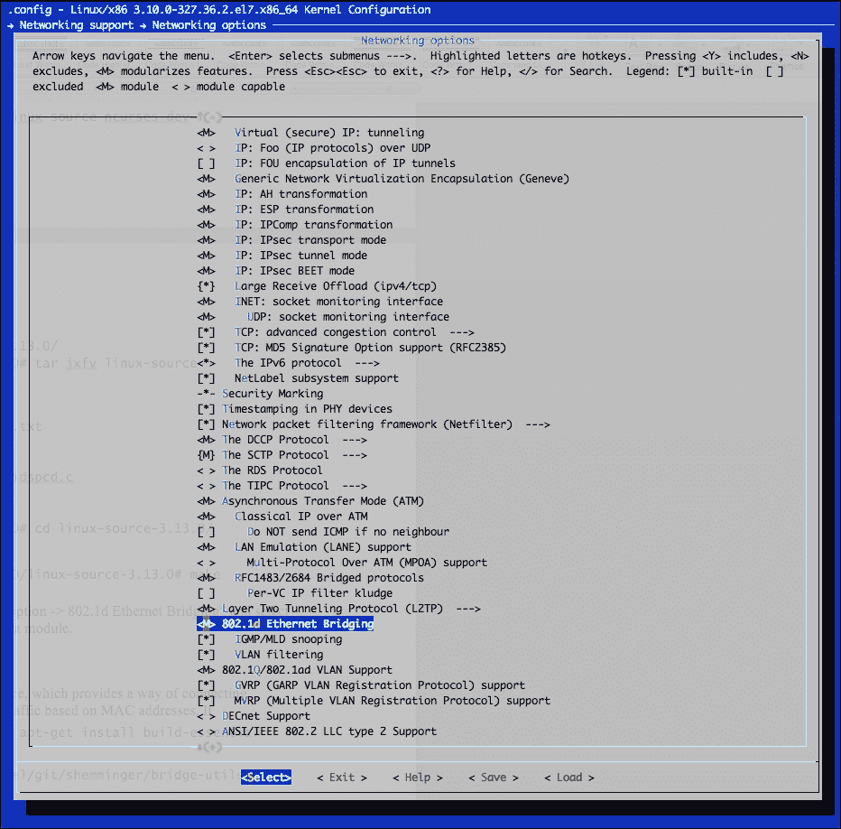
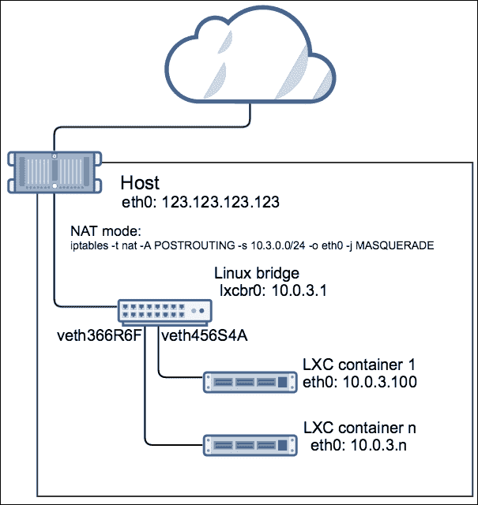
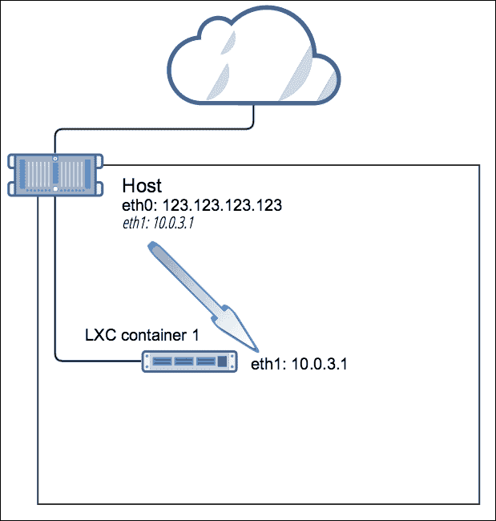

# 第五章：使用 Linux 桥接和 Open vSwitch 在 LXC 中的网络

要为新建的容器启用网络连接，我们需要一种方法将容器网络命名空间中的虚拟网络接口连接到主机，并在需要时为其他容器或互联网提供路由。Linux 提供了一个软件桥接，允许我们以多种方式将 LXC 容器*连接*在一起，正如我们将在本章中探讨的那样。

有两种流行的软件桥接实现——`bridge-utils`包提供的 Linux 桥接和 Open vSwitch 项目。这些通过将交换机的控制平面和管理平面分离，进一步扩展了 Linux 桥接的基本功能，从而实现了流量控制并提供硬件集成等功能。

默认情况下，当我们从提供的模板构建容器时，模板脚本会通过在主机操作系统上使用`iptables`中的**网络地址转换**（**NAT**）规则来配置网络桥接。在这种模式下，容器从 LXC 启动的`dnsmasq`服务器获取 IP 地址。然而，我们可以通过容器的配置文件完全控制我们希望使用的桥接、模式或路由。

在本章中，我们将探讨以下主题：

+   安装和配置 Linux 桥接

+   安装和创建 Open vSwitch 交换机

+   使用 NAT、直连、VLAN 等模式在 LXC 中配置网络

# Linux 中的软件桥接

连接 LXC 或任何其他类型的虚拟机（如 KVM 或 Xen）、虚拟化管理层，或者在 LXC 的情况下，主机操作系统，要求能够在容器/虚拟机与外部世界之间桥接流量。Linux 中的软件桥接自内核版本 2.4 起便已被支持。为了利用这一功能，必须通过设置**网络支持** | **网络选项** | **802.1d 以太网桥接**为“是”来启用桥接，或者在配置内核时作为内核模块进行启用。

要检查内核中编译了哪些桥接选项，或作为模块提供哪些选项，请运行以下命令：

```
root@host:~# cat /boot/config-`uname -r` | grep -ibridge
# PC-card bridges
CONFIG_BRIDGE_NETFILTER=y
CONFIG_NF_TABLES_BRIDGE=m
CONFIG_BRIDGE_NF_EBTABLES=m
CONFIG_BRIDGE_EBT_BROUTE=m
CONFIG_BRIDGE_EBT_T_FILTER=m
CONFIG_BRIDGE_EBT_T_NAT=m
CONFIG_BRIDGE_EBT_802_3=m
CONFIG_BRIDGE_EBT_AMONG=m
CONFIG_BRIDGE_EBT_ARP=m
CONFIG_BRIDGE_EBT_IP=m
CONFIG_BRIDGE_EBT_IP6=m
CONFIG_BRIDGE_EBT_LIMIT=m
CONFIG_BRIDGE_EBT_MARK=m
CONFIG_BRIDGE_EBT_PKTTYPE=m
CONFIG_BRIDGE_EBT_STP=m
CONFIG_BRIDGE_EBT_VLAN=m
CONFIG_BRIDGE_EBT_ARPREPLY=m
CONFIG_BRIDGE_EBT_DNAT=m
CONFIG_BRIDGE_EBT_MARK_T=m
CONFIG_BRIDGE_EBT_REDIRECT=m
CONFIG_BRIDGE_EBT_SNAT=m
CONFIG_BRIDGE_EBT_LOG=m
# CONFIG_BRIDGE_EBT_ULOG is not set
CONFIG_BRIDGE_EBT_NFLOG=m
CONFIG_BRIDGE=m
CONFIG_BRIDGE_IGMP_SNOOPING=y
CONFIG_BRIDGE_VLAN_FILTERING=y
CONFIG_SSB_B43_PCI_BRIDGE=y
CONFIG_DVB_DDBRIDGE=m
CONFIG_EDAC_SBRIDGE=m
# VME Bridge Drivers
root@host:~#

```

在 Ubuntu 和 CentOS 系统上，桥接作为内核模块提供。要验证它们是否已加载，请运行以下命令：

```
root@ubuntu:~# lsmod | grep bridge
bridge                110925  0
stp                    12976  1 bridge
llc                    14552  2 stp,bridge
root@ubuntu:~#

```

要获取更多关于`bridge`内核模块的信息，请执行以下命令：

```
[root@centos ~]# modinfo bridge
filename:       /lib/modules/3.10.0-327.28.3.el7.x86_64/kernel/net/bridge/bridge.ko
alias:          rtnl-link-bridge
version:        2.3
license:        GPL
rhelversion:    7.2
srcversion:     905847C53FF43DEFAA0EB3C
depends:        stp,llc
intree:         Y
vermagic:       3.10.0-327.28.3.el7.x86_64 SMP mod_unloadmodversions
signer:         CentOS Linux kernel signing key
sig_key:        15:64:6F:1E:11:B7:3F:8C:2A:ED:8A:E2:91:65:5D:52:58:05:6E:E9
sig_hashalgo:   sha256
[rootcentos ~]# 

```

如果你使用的发行版没有将桥接编译进内核，或者没有作为模块提供，或者如果你想尝试不同的内核选项，你需要首先获取内核源代码。

要在 Ubuntu 上安装它，可以通过运行以下命令来完成：

```
root@ubuntu:~# cd /usr/src/
root@ubuntu:/usr/src# apt-get install linux-source ncurses-dev
root@ubuntu:/usr/src# cd linux-source-3.13.0/
root@ubuntu:/usr/src/linux-source-3.13.0# tar jxfv linux-source-3.13.0.tar.bz2
root@ubuntu:/usr/src/linux-source-3.13.0# cd linux-source-3.13.0/

```

在 CentOS 上，使用`yum`安装内核源代码：

```
[root@bridge ~]# yum install kernel-devel ncurses-devel

```

要使用`ncurses`菜单配置内核，请运行以下命令：

```
root@ubuntu:/usr/src/linux-source-3.13.0/linux-source-3.13.0# make menuconfig

```

转到**网络支持** | **网络选项** | **802.1d 以太网桥接**，并选择**Y**以将桥接功能编译到内核中，或选择**M**将其编译为模块。

内核配置菜单如下所示：



选择完成后，构建新的内核包并安装：

```
root@bridge:/usr/src/linux-source-3.13.0/linux-source-3.13.0# make deb-pkg
 CHK     include/config/kernel.release
make KBUILD_SRC=
SYSHDR  arch/x86/syscalls/../include/generated/uapi/asm/unistd_32.h
SYSHDR  arch/x86/syscalls/../include/generated/uapi/asm/unistd_64.h
...
dpkg-deb: building package `linux-firmware-image-3.13.11-ckt39' 
in `../linux-firmware-image-3.13.11-ckt39_3.13.11-ckt39-1_amd64.deb'.
dpkg-deb: building package `linux-headers-3.13.11-ckt39' 
in `../linux-headers-3.13.11-ckt39_3.13.11-ckt39-1_amd64.deb'.
dpkg-deb: building package `linux-libc-dev' 
in `../linux-libc-dev_3.13.11-ckt39-1_amd64.deb'.
dpkg-deb: building package `linux-image-3.13.11-ckt39' 
in `../linux-image-3.13.11-ckt39_3.13.11-ckt39-1_amd64.deb'.
dpkg-deb: building package `linux-image-3.13.11-ckt39-dbg' 
in `../linux-image-3.13.11-ckt39-dbg_3.13.11-ckt39-1_amd64.deb'.
root@ubuntu:/usr/src/linux-source-3.13.0/linux-source-3.13.0# ls -la ../*.deb
-rw-r--r-- 1 root root    803530 Oct 19 18:04 ../linux-firmware-image-3.13.11-ckt39_3.13.11-ckt39-1_amd64.deb
-rw-r--r-- 1 root root   6435516 Oct 19 18:04 ../linux-headers-3.13.11-ckt39_3.13.11-ckt39-1_amd64.deb
-rw-r--r-- 1 root root  39640242 Oct 19 18:07 ../linux-image-3.13.11-ckt39_3.13.11-ckt39-1_amd64.deb
-rw-r--r-- 1 root root 363727500 Oct 19 18:37 ../linux-image-3.13.11-ckt39-dbg_3.13.11-ckt39-1_amd64.deb
-rw-r--r-- 1 root root    768606 Oct 19 18:04 ../linux-libc-dev_3.13.11-ckt39-1_amd64.deb
root@ubuntu:/usr/src/linux-source-3.13.0/linux-source-3.13.0#

```

要使用新内核，安装这些包并重启。

### 注意

有关如何从源代码编译和安装 Linux 内核的更多信息，请参考您的发行版文档。

## Linux 桥接

内置的 Linux 桥接是一个软件层 2 设备。OSI 层 2 设备提供了一种将多个以太网段连接在一起并基于 MAC 地址转发流量的方式，实质上创建了独立的广播域。

让我们从源代码开始在 Ubuntu 上安装最新版本：

```
root@ubuntu:~# cd /usr/src/
root@ubuntu:/usr/src# apt-get update && apt-get install build-essential automakepkg-config git
root@ubuntu:/usr/src# git clone git://git.kernel.org/pub/scm/linux/kernel/git/shemminger/bridge-utils.git
Cloning into 'bridge-utils'...
remote: Counting objects: 654, done.
remote: Total 654 (delta 0), reused 0 (delta 0)
Receiving objects: 100% (654/654), 131.72 KiB | 198.00 KiB/s, done.
Resolving deltas: 100% (425/425), done.

Checking connectivity... done. 
root@ubuntu:/usr/src# cd bridge-utils/
root@ubuntu:/usr/src/bridge-utils# autoconf
root@ubuntu:/usr/src/bridge-utils# ./configure && make && make install
root@ubuntu:/usr/src/bridge-utils# brctl --version
bridge-utils, 1.5
root@ubuntu:/usr/src/bridge-utils#

```

从前面的输出中，我们可以看到我们首先克隆了`git`仓库中的`bridge-utils`项目，然后编译了源代码。

在 CentOS 上编译桥接软件的过程与我们在上一节中做的类似；首先我们安装所需的先决包，然后进行配置和编译，如下所示：

```
[root@centos ~]# cd /usr/src/
[root@centossrc]#
[root@centossrc]# yum groupinstall "Development tools"
[root@centossrc]# git clone git://git.kernel.org/pub/scm/linux/kernel/git/shemminger/bridge-utils.git
Cloning into 'bridge-utils'...
remote: Counting objects: 654, done.
remote: Total 654 (delta 0), reused 0 (delta 0)
Receiving objects: 100% (654/654), 131.72 KiB | 198.00 KiB/s, done.
Resolving deltas: 100% (425/425), done.
Checking connectivity... done. 

[root@centossrc]# cd bridge-utils
[root@centos bridge-utils]# autoconf
[root@centos bridge-utils]# ./configure && make && make install
[root@centos bridge-utils]# brctl --version
bridge-utils, 1.5
[root@centos bridge-utils]#

```

调用`brctl`命令而不带任何参数可以显示可用的操作：

```
root@ubuntu:/usr/src/bridge-utils# brctl
Usage: brctl [commands]
commands:
 addbr  <bridge>    add bridge
 delbr  <bridge>    delete bridge
 addif  <bridge><device>  add interface to bridge
 delif  <bridge><device>  delete interface from bridge
 hairpin     <bridge><port> {on|off}  turn hairpin on/off
 setageing  <bridge><time>    set ageing time
 setbridgeprio  <bridge><prio>    set bridge priority
 setfd  <bridge><time>    set bridge forward delay
 sethello  <bridge><time>    set hello time
 setmaxage  <bridge><time>    set max message age
 setpathcost  <bridge><port><cost>  set path cost
 setportprio  <bridge><port><prio>  set port priority
 show  [ <bridge> ]    show a list of bridges
 showmacs  <bridge>    show a list of mac addrs
 showstp  <bridge>    show bridge stp info
 stp  <bridge> {on|off}  turn stp on/off
root@ubuntu:/usr/src/bridge-utils#

```

## Linux 桥接和 Ubuntu 上的 LXC 包

让我们安装 LXC 包和依赖项。要检查系统中配置的存储库中可用的最新包版本，请运行以下命令：

```
root@ubuntu:~# apt-cache madison lxc
 lxc | 2.0.4-0ubuntu1~ubuntu14.04.1 | http://us-east-1.ec2.archive.ubuntu.com/ubuntu/ trusty-backports/main amd64 Packages
lxc | 1.0.8-0ubuntu0.3 | http://us-east-1.ec2.archive.ubuntu.com/ubuntu/ trusty-updates/main amd64 Packages
lxc | 1.0.7-0ubuntu0.7 | http://security.ubuntu.com/ubuntu/ trusty-security/main amd64 Packages
lxc | 1.0.3-0ubuntu3 | http://us-east-1.ec2.archive.ubuntu.com/ubuntu/ trusty/main amd64 Packages
lxc | 1.0.3-0ubuntu3 | http://us-east-1.ec2.archive.ubuntu.com/ubuntu/ trusty/main Sources
lxc | 1.0.8-0ubuntu0.3 | http://us-east-1.ec2.archive.ubuntu.com/ubuntu/ trusty-updates/main Sources
lxc | 2.0.4-0ubuntu1~ubuntu14.04.1 | http://us-east-1.ec2.archive.ubuntu.com/ubuntu/ trusty-backports/main Sources
lxc | 1.0.7-0ubuntu0.7 | http://security.ubuntu.com/ubuntu/ trusty-security/main Sources
root@ubuntu:~#

```

输出来自一个 Amazon EC2 实例，显示最新的 LXC 版本为`2.0.4-0ubuntu1~ubuntu14.04.1`。让我们安装它并观察输出：

```
root@ubuntu:/usr/src/bridge-utils# apt-get install -y lxc=2.0.4-0ubuntu1~ubuntu14.04.1 lxc1=2.0.4-0ubuntu1~ubuntu14.04.1 liblxc1=2.0.4-0ubuntu1~ubuntu14.04.1 python3-lxc=2.0.4-0ubuntu1~ubuntu14.04.1 cgroup-lite=1.11~ubuntu14.04.2 lxc-templates=2.0.4-0ubuntu1~ubuntu14.04.1
...
Setting up lxc1 (2.0.4-0ubuntu1~ubuntu14.04.1) ...
lxc-net start/running
Setting up lxc dnsmasq configuration.
...
root@ubuntu:/usr/src/bridge-utils#

```

请注意，包安装并配置了`dnsmasq`服务，这是由于`lxc`包中`lxc1.postinst`脚本部分的包依赖关系。这在 Ubuntu 上非常方便，但如果您运行的发行版不支持此功能，或者您是从源代码编译 LXC，您始终可以手动安装它。只有在您希望`dnsmasq`动态分配 IP 地址给容器时，才需要这样做。您始终可以为 LXC 容器配置静态 IP 地址。

从前面的输出中，我们还可以观察到该包启动了`lxc-net`服务。让我们通过检查其状态来深入了解：

```
root@ubuntu:/usr/src/bridge-utils# service lxc-net status
lxc-net start/running
root@ubuntu:/usr/src/bridge-utils#

```

此外，还请查看`init`配置文件：

```
root@ubuntu:/usr/src/bridge-utils# cat /etc/init/lxc-net.conf
description "lxc network"
author "Serge Hallyn<serge.hallyn@canonical.com>"
start on starting lxc
stop on stopped lxc
pre-start exec /usr/lib/x86_64-linux-gnu/lxc/lxc-net start
post-stop exec /usr/lib/x86_64-linux-gnu/lxc/lxc-net stop
root@ubuntu:/usr/src/bridge-utils#

```

我们可以看到`init`脚本启动了`lxc-net`服务。让我们看看它提供了什么：

```
root@ubuntu:/usr/src/bridge-utils# head -24 /usr/lib/x86_64-linux-gnu/lxc/lxc-net
#!/bin/sh -
distrosysconfdir="/etc/default"
varrun="/run/lxc"
varlib="/var/lib"
# These can be overridden in /etc/default/lxc
#   or in /etc/default/lxc-net
USE_LXC_BRIDGE="true"
LXC_BRIDGE="lxcbr0"
LXC_ADDR="10.0.3.1"
LXC_NETMASK="255.255.255.0"
LXC_NETWORK="10.0.3.0/24"
LXC_DHCP_RANGE="10.0.3.2,10.0.3.254"
LXC_DHCP_MAX="253"
LXC_DHCP_CONFILE=""
LXC_DOMAIN=""
LXC_IPV6_ADDR=""
LXC_IPV6_MASK=""
LXC_IPV6_NETWORK=""
LXC_IPV6_NAT="false"
root@bridge:/usr/src/bridge-utils#

```

从前面脚本的前几行中，我们可以看到它设置了 LXC 网络的默认值，例如 Linux 桥接的名称和将由`dnsmasq`服务分配的子网。它还指向了我们可以用来覆盖这些选项的默认 LXC 网络文件。

让我们来看看默认的`lxc-net`文件：

```
root@ubuntu:/usr/src/bridge-utils# cat /etc/default/lxc-net  | grep -vi ^#
USE_LXC_BRIDGE="true"
LXC_BRIDGE="lxcbr0"
LXC_ADDR="10.0.3.1"
LXC_NETMASK="255.255.255.0"
LXC_NETWORK="10.0.3.0/24"
LXC_DHCP_RANGE="10.0.3.2,10.0.3.254"
LXC_DHCP_MAX="253"
root@ubuntu:/usr/src/bridge-utils#

```

Ubuntu 上的 LXC 被打包成这样的方式，它也为我们创建了桥接：

```
root@ubuntu:/usr/src/bridge-utils# brctl show
bridge name  bridge id           STP enabled  interfaces
lxcbr0       8000.000000000000   no
root@ubuntu:/usr/src/bridge-utils#

```

注意，桥接的名称—`lxcbr0`—是`/etc/default/lxc-net`文件和`/usr/lib/x86_64-linux-gnu/lxc/lxc-net`脚本中指定的名称。

## CentOS 上的 Linux 桥接和 LXC 包

不幸的是，并非所有 Linux 发行版都在打包 LXC 时附带了构建桥接、配置和启动`dnsmasq`的额外功能，正如我们在之前的 Ubuntu 部分中看到的那样。从源代码构建 LXC，如第二章所述，*在 Linux 系统上安装和运行 LXC*，或使用 CentOS 的包，将不会自动创建 Linux 桥接，或配置并启动`dnsmasq`服务。

让我们在 CentOS 上更详细地探讨这个问题，通过使用`centos`模板构建一个名为`bridge`的 LXC 容器：

```
[root@centos ~]# yum install lxc lxc-templates
[root@centos ~]# lxc-create --name bridge -t centos
Host CPE ID from /etc/os-release: cpe:/o:centos:centos:7
Checking cache download in /var/cache/lxc/centos/x86_64/7/rootfs ...
Downloading centos minimal ...
Loaded plugins: fastestmirror, langpacks
...
Container rootfs and config have been created.
Edit the config file to check/enable networking setup.
...
[root@centos ~]#

```

让我们检查在安装`lxc`包并构建容器后是否创建了桥接：

```
[root@centos ~]# brctl show
[root@centos ~]#

```

如果我们尝试启动容器，将会遇到以下错误：

```
[root@centos ~]# lxc-ls -f
bridge 
[root@centos ~]# lxc-start --name bridge
lxc-start: conf.c: instantiate_veth: 3105 failed to attach 'veth5TVOEO' to the bridge 'virbr0': No such device
lxc-start: conf.c: lxc_create_network: 3388 failed to create netdev
lxc-start: start.c: lxc_spawn: 841 failed to create the network
lxc-start: start.c: __lxc_start: 1100 failed to spawn 'bridge'
lxc-start: lxc_start.c: main: 341 The container failed to start.
lxc-start: lxc_start.c: main: 345 Additional information can be obtained by setting the --logfile and --logpriority options.
[root@centos ~]#

```

上述输出显示容器正在尝试连接一个名为`virbr0`的桥接，但该桥接并不存在。该名称在以下文件中定义，并随后分配给容器的配置：

```
[root@centos ~]# cat /etc/lxc/default.conf
lxc.network.type = veth
lxc.network.link = virbr0
lxc.network.flags = up 
[root@centos ~]# cat /var/lib/lxc/bridge/config  | grep -vi "#" | sed '/^$/d' | grep network
lxc.network.type = veth
lxc.network.flags = up
lxc.network.link = virbr0
lxc.network.hwaddr = fe:6e:b6:af:24:2b 
[root@centos ~]#

```

为了成功启动容器，我们必须首先创建 LXC 期望的桥接：

```
[root@centos ~]# brctl addbr virbr0

```

然后重新启动容器并检查桥接：

```
[root@centos~]# lxc-start --name bridge
[root@centos~]# brctl show
bridge name    bridge id             STP enabled   interfaces
virbr0         8000.fe1af1cb0b2e     no            vethB6CRLW
[root@centos ~]#

```

`vethB6CRLW`接口是 LXC 容器呈现给主机的虚拟接口，并连接到`virbr0`桥接端口：

```
[root@centos ~]# ifconfig vethB6CRLW
vethB6CRLW: flags=4163<UP,BROADCAST,RUNNING,MULTICAST>mtu 1500
inet6 fe80::fc1a:f1ff:fecb:b2e  prefixlen 64  scopeid 0x20<link>
ether fe:1a:f1:cb:0b:2e  txqueuelen 1000  (Ethernet)
 RX packets 14  bytes 2700 (2.6 KiB)
 RX errors 0  dropped 0  overruns 0  frame 0
 TX packets 8  bytes 648 (648.0 B)
 TX errors 0  dropped 0 overruns 0  carrier 0  collisions 
        0
[root@centos ~]#

```

上述输出显示了我们之前构建的`bridge`容器的虚拟接口的当前配置，如主机操作系统所看到的。

## 使用`dnsmasq`服务在容器中获取 IP 地址

在 Ubuntu 上安装`lxc`包后启动的`dnsmasq`服务应类似于以下内容：

```
root@bridge:/usr/src/bridge-utils# pgrep -lfaww dnsmasq
12779 dnsmasq -u lxc-dnsmasq --strict-order --bind-interfaces 
--pid-file=/run/lxc/dnsmasq.pid --listen-address 10.0.3.1 
--dhcp-range 10.0.3.2,10.0.3.254 --dhcp-lease-max=253 
--dhcp-no-override --except-interface=lo --interface=lxcbr0 
--dhcp-leasefile=/var/lib/misc/dnsmasq.lxcbr0.leases 
--dhcp-authoritative
root@bridge:/usr/src/bridge-utils#

```

### 注意

请注意，`dhcp-range`参数与`/etc/default/lxc-net`文件中定义的内容相匹配。

让我们创建一个新的容器并探索其网络设置：

```
root@bridge:/usr/src/bridge-utils# lxc-create -t ubuntu --name br1
Checking cache download in /var/cache/lxc/trusty/rootfs-amd64 ...
Installing packages in template: apt-transport-https,ssh,vim,language-pack-en
Downloading ubuntu trusty minimal ...
...
##
# The default user is 'ubuntu' with password 'ubuntu'!
# Use the 'sudo' command to run tasks as root in the container.
##
root@bridge:/usr/src/bridge-utils# lxc-start --name br1
root@bridge:/usr/src/bridge-utils# lxc-info --name br1
Name:           br1
State:          RUNNING
PID:            1773
IP:             10.0.3.65
CPU use:        1.66 seconds
BlkIO use:      160.00 KiB
Memory use:     7.27 MiB
KMem use:       0 bytes
Link:           veth366R6F
 TX bytes:      1.85 KiB
RX bytes:      1.59 KiB
Total bytes:   3.44 KiB 
root@bridge:/usr/src/bridge-utils#

```

请注意，在主机操作系统上创建的虚拟接口名称—`veth366R6F`，这是`lxc-info`命令输出中的名称。该接口应作为端口添加到桥接中。让我们使用`brctl`工具确认这一点：

```
root@bridge:/usr/src/bridge-utils# brctl show
bridge name  bridge id          STP enabled   interfaces
lxcbr0       8000.fe7a39cee87c  no            veth366R6F
root@bridge:/usr/src/bridge-utils#

```

列出主机上的所有接口可以显示与容器关联的桥接和虚拟接口：

```
root@bridge:~# ifconfig
eth0      Link encap:EthernetHWaddr bc:76:4e:10:6a:31
inet addr:10.208.131.214  Bcast:10.208.255.255  Mask:255.255.128.0
inet6addr: fe80::be76:4eff:fe10:6a31/64 Scope:Link
 UP BROADCAST RUNNING MULTICAST  MTU:1500  Metric:1
 RX packets:322 errors:0 dropped:0 overruns:0 frame:0
 TX packets:337 errors:0 dropped:0 overruns:0 carrier:0
 collisions:0 txqueuelen:1000
 RX bytes:14812 (14.8 KB)  TX bytes:14782 (14.7 KB)
lo        Link encap:Local Loopback
inet addr:127.0.0.1  Mask:255.0.0.0
inet6addr: ::1/128 Scope:Host
 UP LOOPBACK RUNNING  MTU:65536  Metric:1
 RX packets:9 errors:0 dropped:0 overruns:0 frame:0
 TX packets:9 errors:0 dropped:0 overruns:0 carrier:0
 collisions:0 txqueuelen:0
 RX bytes:668 (668.0 B)  TX bytes:668 (668.0 B)
lxcbr0    Link encap:EthernetHWaddr fe:7a:39:ce:e8:7c
inet addr:10.0.3.1  Bcast:0.0.0.0  Mask:255.255.255.0
inet6addr: fe80::fc7a:39ff:fece:e87c/64 Scope:Link
 UP BROADCAST RUNNING MULTICAST  MTU:1500  Metric:1
 RX packets:53 errors:0 dropped:0 overruns:0 frame:0
 TX packets:57 errors:0 dropped:0 overruns:0 carrier:0
 collisions:0 txqueuelen:0
 RX bytes:4268 (4.2 KB)  TX bytes:5450 (5.4 KB)
veth366R6F Link encap:EthernetHWaddr fe:7a:39:ce:e8:7c
inet6addr: fe80::fc7a:39ff:fece:e87c/64 Scope:Link
 UP BROADCAST RUNNING MULTICAST  MTU:1500  Metric:1
 RX packets:53 errors:0 dropped:0 overruns:0 frame:0
 TX packets:58 errors:0 dropped:0 overruns:0 carrier:0
 collisions:0 txqueuelen:1000
 RX bytes:5010 (5.0 KB)  TX bytes:5528 (5.5 KB)
root@bridge:~#

```

注意分配给`lxcbr0`接口的 IP 地址—它与传递给`dnsmasq`进程的`listen-address`参数相同。让我们首先通过连接到容器来检查容器内的网络接口和路由：

```
root@bridge:~# lxc-attach --name br1
root@br1:~# ifconfig
eth0      Link encap:EthernetHWaddr 00:16:3e:39:cf:e9
inet addr:10.0.3.65  Bcast:10.0.3.255  Mask:255.255.255.0
inet6addr: fe80::216:3eff:fe39:cfe9/64 Scope:Link
 UP BROADCAST RUNNING MULTICAST  MTU:1500  Metric:1
 RX packets:58 errors:0 dropped:0 overruns:0 frame:0
 TX packets:53 errors:0 dropped:0 overruns:0 carrier:0
 collisions:0 txqueuelen:1000
 RX bytes:5528 (5.5 KB)  TX bytes:5010 (5.0 KB)
lo        Link encap:Local Loopback
inet addr:127.0.0.1  Mask:255.0.0.0
inet6addr: ::1/128 Scope:Host
 UP LOOPBACK RUNNING  MTU:65536  Metric:1
 RX packets:0 errors:0 dropped:0 overruns:0 frame:0
 TX packets:0 errors:0 dropped:0 overruns:0 carrier:0
 collisions:0 txqueuelen:0
 RX bytes:0 (0.0 B)  TX bytes:0 (0.0 B)
root@br1:~# route -n
Kernel IP routing table
Destination     Gateway         Genmask         Flags Metric Ref    Use Iface
0.0.0.0         10.0.3.1        0.0.0.0         UG    0      0        0 eth0
10.0.3.0        0.0.0.0         255.255.255.0   U     0      0        0 eth0
root@br1:~#

```

`dnsmasq`为`eth0`接口分配的 IP 地址位于`10.0.3.0/24`子网中，默认网关是主机上桥接接口的 IP 地址。容器之所以自动获得 IP 地址，是因为其接口配置文件：

```
root@br1:~# cat /etc/network/interfaces
# This file describes the network interfaces available on your system
# and how to activate them. For more information, see interfaces(5).
# The loopback network interface
auto lo
iface lo inet loopback
auto eth0
iface eth0 inetdhcp
root@br1:~#

```

正如前面的输出所示，`eth0` 配置为使用 DHCP。如果我们宁愿使用静态分配的地址，只需更改该文件并指定我们想要使用的任何 IP 地址。使用 `dnsmasq` 配合 DHCP 进行 LXC 网络连接并非必需，但它可以提供便利。

让我们通过不分配 `/etc/default/lxc-net` 文件中的前一百个 IP 来更改 `dnsmasq` 提供的 IP 范围：

```
root@bridge:/usr/src/bridge-utils# sed -i 's/LXC_DHCP_RANGE="10.0.3.2,10.0.3.254"/LXC_DHCP_RANGE="10.0.3.100,10.0.3.254"/g' /etc/default/lxc-net 
root@bridge:/usr/src/bridge-utils# grep LXC_DHCP_RANGE /etc/default/lxc-net
LXC_DHCP_RANGE="10.0.3.100,10.0.3.254"
root@bridge:/usr/src/bridge-utils#

```

在重新启动 `dnsmasq` 后，观察作为 `dhcp-range` 参数传递的新 DHCP 范围：

```
root@bridge:/usr/src/bridge-utils# pgrep -lfaww dnsmasq
4215 dnsmasq -u lxc-dnsmasq --strict-order --bind-interfaces 
--pid-file=/run/lxc/dnsmasq.pid --listen-address 10.0.3.1 
--dhcp-range 10.0.3.100,10.0.3.254 --dhcp-lease-max=253 
--dhcp-no-override --except-interface=lo --interface=lxcbr0 --dhcp-leasefile=/var/lib/misc/dnsmasq.lxcbr0.leases 
--dhcp-authoritative
root@bridge:/usr/src/bridge-utils#

```

下次我们使用 Ubuntu 模板构建容器时，分配给容器的 IP 地址将从第四个八位组的 `100` 开始。如果我们想将前 `100` 个 IP 用于手动分配，使用这种方式很方便，正如我们接下来所看到的那样。

## 在 LXC 容器中静态分配 IP 地址

在容器内部分配 IP 地址与配置常规 Linux 服务器没有什么不同。在容器内运行以下命令：

```
root@br1:~# ifconfig eth0 10.0.3.10 netmask 255.255.255.0
root@br1:~# route add default gw 10.0.3.1
root@br1:~# ping -c 3 10.0.3.1
PING 10.0.3.1 (10.0.3.1) 56(84) bytes of data.
64 bytes from 10.0.3.1: icmp_seq=1 ttl=64 time=0.053 ms
64 bytes from 10.0.3.1: icmp_seq=2 ttl=64 time=0.073 ms
64 bytes from 10.0.3.1: icmp_seq=3 ttl=64 time=0.074 ms 
--- 10.0.3.1 ping statistics ---
3 packets transmitted, 3 received, 0% packet loss, time 1998ms
rtt min/avg/max/mdev = 0.053/0.066/0.074/0.013 ms
root@br1:~#

```

为使更改持久化，按如下方式编辑文件，然后停止并启动容器：

```
root@br1:~# cat /etc/network/interfaces
auto lo
iface lo inet loopback
auto eth0
 iface eth0 inet static
 address 10.0.3.10
 netmask 255.255.255.0
 gateway 10.0.3.1
root@br1:~# exit
root@ubuntu:~#lxc-stop --name br1 && lxc-start --name br1

```

让我们使用 `brctl` 工具查看桥接了解哪些 MAC 地址：

```
root@ubuntu:~# brctl showmacs lxcbr0
port no   mac addr           is local?   ageing timer
1         fe:7a:39:ce:e8:7c   yes         0.00
root@ubuntu:~#

```

请注意，这是 `veth366R6F` 虚拟接口和桥接的 MAC 地址，正如之前在主机上通过 `ifconfig` 输出所列示的那样。

## LXC 网络配置选项概览

让我们查看之前构建的 `br1` 容器的网络配置：

```
root@ubuntu:~# cat /var/lib/lxc/br1/config | grep -vi "#" | sed  '/^$/d' | grep -i network
lxc.network.type = veth
lxc.network.link = lxcbr0
lxc.network.flags = up
lxc.network.hwaddr = 00:16:3e:39:cf:e9
root@ubuntu:~#

```

需要注意的是 `lxc.network.hwaddr` 选项。它是容器内部的 `eth0` 的 MAC 地址，是动态生成的。所有配置选项都可以在容器创建之前或之后进行更改。

下表简要描述了容器可用的网络配置选项：

| **选项** | **描述** |
| --- | --- |
| `lxc.network.type` | 要使用的网络虚拟化类型 |
| `lxc.network.link` | 主机上的接口 |
| `lxc.network.flags` | 对接口执行的操作 |
| `lxc.network.hwaddr` | 设置容器接口的 MAC 地址 |
| `lxc.network.mtu` | 设置容器接口的 **最大传输单元** (**MTU**) |
| `lxc.network.name` | 指定接口名称 |
| `lxc.network.ipv4` | 分配给容器的 IPv4 地址 |
| `lxc.network.ipv4.gateway` | 用作默认网关的 IPv4 地址 |
| `lxc.network.ipv6` | 分配给容器的 IPv6 地址 |
| `lxc.network.ipv6.gateway` | 用作默认网关的 IPv6 地址 |
| `lxc.network.script.up` | 指定在创建和配置网络后执行的脚本 |
| `lxc.network.script.down` | 指定在销毁网络之前执行的脚本 |

> 表 5.1

我们将在本章稍后更详细地探讨此表中的大多数选项。

## 手动操作 Linux 桥接

让我们通过展示一些如何手动操作 Linux 桥接的例子，完成对它的探索。

我们可以通过运行以下命令，首先显示主机上的桥接器：

```
root@ubuntu:~# brctl show
bridge name    bridge id          STP enabled  interfaces
lxcbr0         8000.000000000000   no
root@ubuntu:~#

```

要删除桥接器，首先需要将接口关闭：

```
root@ubuntu:~# ifconfig lxcbr0 down
root@ubuntu:~# brctl delbr lxcbr0
root@ubuntu:~# brctl show
root@ubuntu:~#

```

接下来，让我们创建一个新的桥接器，并将主机操作系统中暴露的容器接口之一`veth366R6F`添加到该桥接器中：

```
root@ubuntu:~# brctl addbr lxcbr0
root@ubuntu:~# brctl show
bridge name   bridge id          STP enabled  interfaces
lxcbr0        8000.000000000000   no 
root@ubuntu:~# brctl addif lxcbr0 veth366R6F
root@ubuntu:~# brctl show
bridge name    bridge id          STP enabled  interfaces
lxcbr0         8000.fe7a39cee87c   no          veth366R6F
root@ubuntu:~#

```

桥接器已创建，但与之关联的接口需要启动，如下所示错误：

```
root@ubuntu:~# ifconfig lxcrb0
lxcrb0: error fetching interface information: Device not found 
root@ubuntu:~# ifconfig lxcbr0 up
root@ubuntu:~# ifconfig lxcbr0
lxcbr0    Link encap:EthernetHWaddr fe:7a:39:ce:e8:7c
inet6addr: fe80::fc7a:39ff:fece:e87c/64 Scope:Link
 UP BROADCAST RUNNING MULTICAST  MTU:1500  Metric:1
 RX packets:0 errors:0 dropped:0 overruns:0 frame:0
 TX packets:6 errors:0 dropped:0 overruns:0 carrier:0
 collisions:0 txqueuelen:0
 RX bytes:0 (0.0 B)  TX bytes:508 (508.0 B)
root@ubuntu:~#

```

最后，让我们给容器可以用作默认网关的桥接器分配一个 IP 地址：

```
root@bridge:~# ifconfig lxcbr0 10.0.3.1 netmask 255.255.255.0
root@bridge:~#

```

## Open vSwitch

**Open vSwitch** (**OVS**) 是一种软件交换机，允许更高级的网络配置，如策略路由、**访问控制列表** (**ACLs**)、**服务质量** (**QoS**) 管控、流量监控、流管理、VLAN 标签、GRE 隧道等。OVS 可以作为 Linux 桥接器的替代品。在下一章中，我们将使用 OVS 和 GRE 隧道构建一个软件定义网络，将一组 LXC 容器隔离开，但现在让我们演示如何以类似于 Linux 桥接器的方式安装和配置它。

让我们首先在 Ubuntu 上安装这个包：

```
root@ubuntu:~# apt-get install openvswitch-switch
...
Setting up openvswitch-common (2.0.2-0ubuntu0.14.04.3) ...
Setting up openvswitch-switch (2.0.2-0ubuntu0.14.04.3) ...
openvswitch-switch start/running
... 
root@ubuntu:~# ovs-vsctl --version
ovs-vsctl (Open vSwitch) 2.0.2
Compiled Dec  9 2015 14:08:08
root@ubuntu:~#

```

OVS 使用一个内核模块，该模块应该被加载：

```
root@ubuntu:~# lsmod | grep switch
openvswitch            70989  0
vxlan                  37611  1 openvswitch
gre                    13796  1 openvswitch
libcrc32c              12644  1 openvswitch
root@ubuntu:~#

```

接下来，让我们确认没有配置任何交换机：

```
root@bridge:~# ovs-vsctl show
4cf17055-87a7-4b01-a8eb-4a551c842342
ovs_version: "2.0.2"
root@bridge:~#

```

安装包后启动以下进程：

```
root@bridge:~# pgrep -lfa switch
9424 ovsdb-server /etc/openvswitch/conf.db -vconsole:emer 
-vsyslog:err -vfile:info --remote=punix:/var/run/openvswitch/db.sock 
--private-key=db:Open_vSwitch,SSL,private_key 
--certificate=db:Open_vSwitch,SSL,certificate 
--bootstrap-ca-cert=db:Open_vSwitch,SSL,ca_cert --no-chdir 
--log-file=/var/log/openvswitch/ovsdb-server.log 
--pidfile=/var/run/openvswitch/ovsdb-server.pid --detach --monitor
9433 ovs-vswitchd: monitoring pid 9434 (healthy)
9434 ovs-vswitchdunix:/var/run/openvswitch/db.sock -vconsole:emer 
-vsyslog:err -vfile:info --mlockall --no-chdir 
--log-file=/var/log/openvswitch/ovs-vswitchd.log 
--pidfile=/var/run/openvswitch/ovs-vswitchd.pid --detach --monitor
root@bridge:~#

```

`ovsdb-server` 是一个数据库引擎，使用 JSON RPC，并且可以独立于 OVS 运行。`ovsdb-server` 接受来自 `ovs-vswitchd` 守护进程的连接，后者可以创建和修改桥接、端口、网络流等。作为一个快速示例，我们可以列出 `ovsdb-server` 进程管理的数据库以及它包含的各种表：

```
root@ubuntu:~# ovsdb-client list-dbs
Open_vSwitch
root@ubuntu:~# ovsdb-client dump | grep table
Bridge table
Controller table
Flow_Sample_Collector_Set table
Flow_Table table
IPFIX table
Interface table
Manager table
Mirror table
NetFlow table
Open_vSwitch table
Port table
QoS table
Queue table
SSL table
sFlow table
root@ubuntu:~#

```

`ovs-vswitchd` 进程是主要的 OVS 应用程序，控制主机操作系统上的所有交换机。

现在是时候创建一个交换机并命名为`lxcovs0`：

```
root@ubuntu:~# ovs-vsctl add-br lxcovs0
root@ubuntu:~# ovs-vsctl show
4cf17055-87a7-4b01-a8eb-4a551c842342
 Bridge "lxcovs0"
 Port "lxcovs0"
 Interface "lxcovs0"
 type: internal
ovs_version: "2.0.2"
root@ubuntu:~#

```

接下来，分配一个 IP 地址并将容器的虚拟接口连接到它，方法是创建一个端口：

```
root@ubuntu:~# ifconfig lxcovs0 192.168.0.1 netmask 255.255.255.0
root@ubuntu:~# ovs-vsctl add-port lxcovs0 veth366R6F
root@ubuntu:~# ovs-vsctl show
4cf17055-87a7-4b01-a8eb-4a551c842342
Bridge "lxcovs0"
 Port "lxcovs0"
 Interface "lxcovs0"
 type: internal
 Port "veth366R6F"
 Interface "veth366R6F"
ovs_version: "2.0.2"
root@ubuntu:~# 

```

`veth366R6F` 接口属于我们在本章早些时候创建的 `br1` 容器。为了测试连接性，进入容器，并将 IP 地址和默认网关更改为 OVS 网络的端口：

```
root@ubuntu:~# lxc-attach --name br1
root@br1:~# ifconfig eth0 192.168.0.10 netmask 255.255.255.0
root@br1:~# route add default gw 192.168.0.1

```

为避免与 Linux 桥接器发生冲突，请确保销毁桥接器并卸载内核模块：

```
root@ubuntu:~# ifconfig lxcbr0 down
root@ubuntu:~# brctl delbr lxcbr0
root@ubuntu:~# modprobe -r bridge
root@ubuntu:~#

```

# 连接 LXC 到主机网络

连接 LXC 容器到主机网络有三种主要模式：

+   使用主机操作系统上的物理网络接口，这需要为每个容器分配一个物理接口：

+   使用一个虚拟接口，通过 NAT 连接到主机软件桥接器

+   与主机共享相同的网络命名空间，在容器中使用主机网络设备

容器配置文件提供了`lxc.network.type`选项，如我们之前在表 5.1 中看到的。让我们来看一下该配置选项的可用参数：

| **参数** | **描述** |
| --- | --- |
| `none` | 容器将共享主机的网络命名空间。 |
| `empty` | LXC 只会创建回环接口。 |
| `veth` | 在主机上创建一个虚拟接口，并连接到容器网络命名空间中的接口。 |
| `vlan` | 创建一个 VLAN 接口，该接口与通过 `lxc.network.link` 指定的设备连接。VLAN ID 通过 `lxc.network.vlan.id` 选项指定。 |
| `macvlan` | 允许一个物理接口与多个 IP 地址和 MAC 地址关联。 |
| `phys` | 使用 `lxc.network.link` 选项将主机上的物理接口分配给容器。 |

让我们更详细地探讨网络配置。

## 使用 none 网络模式配置 LXC

在此模式下，容器将与主机共享相同的网络命名空间。让我们配置本章开始时创建的 `br1` 容器以使用该模式：

```
root@ubuntu:~# vim /var/lib/lxc/br1/config
# Common configuration
lxc.include = /usr/share/lxc/config/ubuntu.common.conf
# Container specific configuration
lxc.rootfs = /var/lib/lxc/br1/rootfs
lxc.rootfs.backend = dir
lxc.utsname = br1
lxc.arch = amd64
# Network configuration
lxc.network.type = none
lxc.network.flags = up

```

停止并重新启动容器以使新的网络选项生效，并附加到容器：

```
root@ubuntu:~# lxc-stop --name br1 && lxc-start --name br1
root@ubuntu:~# lxc-attach --name br1
root@br1:~#

```

让我们检查容器内部的接口配置和网络路由：

```
root@br1:~# ifconfig
eth0      Link encap:EthernetHWaddr bc:76:4e:10:6a:31
inet addr:10.208.131.214  Bcast:10.208.255.255  Mask:255.255.128.0
inet6addr: fe80::be76:4eff:fe10:6a31/64 Scope:Link
 UP BROADCAST RUNNING MULTICAST  MTU:1500  Metric:1
 RX packets:35205 errors:0 dropped:0 overruns:0 frame:0
 TX packets:35251 errors:0 dropped:0 overruns:0 carrier:0
 collisions:0 txqueuelen:1000
 RX bytes:1621243 (1.6 MB)  TX bytes:1486058 (1.4 MB)
lo        Link encap:Local Loopback
inet addr:127.0.0.1  Mask:255.0.0.0
inet6addr: ::1/128 Scope:Host
 UP LOOPBACK RUNNING  MTU:65536  Metric:1
 RX packets:9 errors:0 dropped:0 overruns:0 frame:0
 TX packets:9 errors:0 dropped:0 overruns:0 carrier:0
 collisions:0 txqueuelen:0
 RX bytes:668 (668.0 B)  TX bytes:668 (668.0 B)
lxcovs0   Link encap:EthernetHWaddr b2:e1:c6:c8:e6:40
inet addr:192.168.0.1  Bcast:192.168.0.255  Mask:255.255.255.0
inet6addr: fe80::b0e1:c6ff:fec8:e640/64 Scope:Link
 UP BROADCAST RUNNING  MTU:1500  Metric:1
 RX packets:18557 errors:0 dropped:0 overruns:0 frame:0
 TX packets:678 errors:0 dropped:0 overruns:0 carrier:0
 collisions:0 txqueuelen:0
 RX bytes:6190048 (6.1 MB)  TX bytes:5641977 (5.6 MB) 
root@br1:~# route -n
Kernel IP routing table
Destination     Gateway         Genmask         Flags Metric Ref    Use Iface
0.0.0.0         10.208.128.1    0.0.0.0         UG    0      0        0 eth0
10.208.0.0      10.208.128.1    255.240.0.0     UG    0      0        0 eth0
10.208.128.0    0.0.0.0         255.255.128.0   U     0      0        0 eth0
root@br1:~#

```

不出所料，容器内部的网络接口和路由与主机操作系统上的相同，因为两者共享相同的根网络命名空间。

让我们在附加到容器时检查网络连接：

```
root@br1:~# ping 8.8.8.8
PING 8.8.8.8 (8.8.8.8) 56(84) bytes of data.
64 bytes from 8.8.8.8: icmp_seq=1 ttl=48 time=11.7 ms
64 bytes from 8.8.8.8: icmp_seq=2 ttl=48 time=11.8 ms
root@br1:~# exit
root@ubuntu:~#

```

### 提示

在此模式下停止容器将导致主机操作系统关闭，因此请小心。

## 使用空网络模式配置 LXC

`empty` 模式只会在容器中创建回环接口。配置文件看起来类似于以下输出：

```
root@ubuntu:~# vim /var/lib/lxc/br1/config
# Common configuration
lxc.include = /usr/share/lxc/config/ubuntu.common.conf
# Container specific configuration
lxc.rootfs = /var/lib/lxc/br1/rootfs
lxc.rootfs.backend = dir
lxc.utsname = br1
lxc.arch = amd64
# Network configuration
lxc.network.type = empty
lxc.network.flags = up

```

重新启动容器并附加到它，以便我们验证回环接口是唯一存在的设备：

```
root@ubuntu:~# lxc-stop --name br1 && sleep 5 && lxc-start --name br1
root@ubuntu:~# lxc-attach --name br1
root@br1:~#

```

让我们检查容器内部的接口配置和网络路由：

```
root@br1:~# ifconfig
lo        Link encap:Local Loopback
inet addr:127.0.0.1  Mask:255.0.0.0
inet6addr: ::1/128 Scope:Host
 UP LOOPBACK RUNNING  MTU:65536  Metric:1
 RX packets:0 errors:0 dropped:0 overruns:0 frame:0
 TX packets:0 errors:0 dropped:0 overruns:0 carrier:0
 collisions:0 txqueuelen:0
 RX bytes:0 (0.0 B)  TX bytes:0 (0.0 B)
root@br1:~# route -n
Kernel IP routing table
Destination     Gateway         Genmask         Flags Metric Ref    Use Iface
root@br1:~# exit
root@ubuntu:~#

```

如预期的那样，只有回环接口存在，且未配置任何路由。

## 使用 veth 模式配置 LXC

NAT 模式是使用 LXC 模板脚本或 libvirt 用户空间工具创建容器时的默认网络模式。在此模式下，容器可以使用主机上应用的 `iptables` 规则通过 IP 伪装访问外部世界。我们在前几章看到的所有示例都使用了 `veth` 模式。

在此模式下，LXC 会在主机上创建一个虚拟接口，命名类似 `veth366R6F`。这是容器虚拟连接的一端，应该连接到软件桥接器。连接的另一端是容器内部的接口，默认名为 `eth0`。

以下示意图有助于可视化网络配置：



LXC 的 veth 模式

这里显示的是容器的配置：

```
root@ubuntu:~# cat /var/lib/lxc/br1/config
# Common configuration
lxc.include = /usr/share/lxc/config/ubuntu.common.conf
# Container specific configuration
lxc.rootfs = /var/lib/lxc/br1/rootfs
lxc.rootfs.backend = dir
lxc.utsname = br1
lxc.arch = amd64
# Network configuration
lxc.network.type = veth
lxc.network.link = lxcovs0
lxc.network.flags = up
lxc.network.hwaddr = 00:16:3e:39:cf:e9
root@ubuntu:~#

```

`lxc.network.link` 选项指定虚拟接口应该连接的主机网络设备，在这种情况下是先前创建的 `lxcovs0` OVS 交换机。

请注意，在主机上应用的 `iptables` 伪装规则：

```
root@ubuntu:~# iptables -L -n -t nat
Chain PREROUTING (policy ACCEPT)
target     prot opt source               destination
Chain INPUT (policy ACCEPT)
target     prot opt source               destination
Chain OUTPUT (policy ACCEPT)
target     prot opt source               destination
Chain POSTROUTING (policy ACCEPT)
target     prot opt source               destination
MASQUERADE  all  --  10.0.3.0/24         !10.0.3.0/24
root@ubuntu:~#

```

### 提示

如果由于某种原因`iptables`规则不存在，或者你希望构建一个位于不同子网中的容器，可以使用`iptables -t nat -A POSTROUTING -s 10.3.0.0/24 -o eth0 -j MASQUERADE`命令添加新规则。

## 使用物理模式配置 LXC

在此模式下，我们通过`lxc.network.link`配置选项指定主机的物理接口，该接口将分配给容器的网络命名空间，并使主机无法使用该接口。

以下图表帮助可视化网络配置：



物理模式下的 LXC

让我们看看配置文件：

```
root@ubuntu:~# vim /var/lib/lxc/br1/config
# Common configuration
lxc.include = /usr/share/lxc/config/ubuntu.common.conf
# Container specific configuration
lxc.rootfs = /var/lib/lxc/br1/rootfs
lxc.rootfs.backend = dir
lxc.utsname = br1
lxc.arch = amd64
# Network configuration
lxc.network.type = phys
lxc.network.link = eth1
lxc.network.ipv4 = 10.208.131.214/24
lxc.network.hwaddr = bc:76:4e:10:6a:31
lxc.network.flags = up
root@ubuntu:~#

```

我们指定`phys`作为网络模式，`eth1`作为将被移动到容器命名空间中的主机接口，以及`eth1`的 IP 和 MAC 地址。让我们先查看主机上的所有网络接口：

```
root@ubuntu:~# ip a s
1: lo: <LOOPBACK,UP,LOWER_UP>mtu 65536 qdiscnoqueue state UNKNOWN group default
 link/loopback 00:00:00:00:00:00 brd 00:00:00:00:00:00
 inet 127.0.0.1/8 scope host lo
 valid_lft forever preferred_lft forever
 inet6 ::1/128 scope host
 valid_lft forever preferred_lft forever
2: eth0: <BROADCAST,MULTICAST,UP,LOWER_UP>mtu 1500 qdiscpfifo_fast state UP group default qlen 1000
 link/ether bc:76:4e:10:57:b8 brdff:ff:ff:ff:ff:ff
 inet 192.168.167.122/24 brd 192.237.167.255 scope global eth0
 valid_lft forever preferred_lft forever
 inet6 fe80::be76:4eff:fe10:57b8/64 scope link
 valid_lft forever preferred_lft forever
3: eth1: <BROADCAST,MULTICAST,UP,LOWER_UP>mtu 1500 qdiscpfifo_fast state UP group default qlen 1000
 link/ether bc:76:4e:10:6a:31 brdff:ff:ff:ff:ff:ff
 inet 10.208.131.214/17 brd 10.208.255.255 scope global eth1
 valid_lft forever preferred_lft forever
 inet6 fe80::be76:4eff:fe10:6a31/64 scope link
 valid_lft forever preferred_lft forever
4: lxcbr0: <BROADCAST,MULTICAST,UP,LOWER_UP>mtu 1500 qdiscnoqueue state UNKNOWN group default
 link/ether 52:26:ad:1d:1a:7f brdff:ff:ff:ff:ff:ff
 inet 10.0.3.1/24 scope global lxcbr0
 valid_lft forever preferred_lft forever
 inet6 fe80::5026:adff:fe1d:1a7f/64 scope link
 valid_lft forever preferred_lft forever
5: ovs-system: <BROADCAST,MULTICAST>mtu 1500 qdiscnoop state DOWN group default
 link/ether c2:05:a1:f4:7f:89 brdff:ff:ff:ff:ff:ff
6: lxcovs0: <BROADCAST,UP,LOWER_UP>mtu 1500 qdiscnoqueue state UNKNOWN group default
 link/ether b2:e1:c6:c8:e6:40 brdff:ff:ff:ff:ff:ff
 inet6 fe80::b0e1:c6ff:fec8:e640/64 scope link
 valid_lft forever preferred_lft forever
root@ubuntu:~# 

```

注意，`eth1`接口现在出现在主机上。让我们重启`br1`容器，并再次列出主机上的接口：

```
root@ubuntu:~# lxc-stop --name br1 && lxc-start --name br1
root@ubuntu:~# ip a s
1: lo: <LOOPBACK,UP,LOWER_UP>mtu 65536 qdiscnoqueue state UNKNOWN group default
 link/loopback 00:00:00:00:00:00 brd 00:00:00:00:00:00
 inet 127.0.0.1/8 scope host lo
 valid_lft forever preferred_lft forever
 inet6 ::1/128 scope host
 valid_lft forever preferred_lft forever
2: eth0: <BROADCAST,MULTICAST,UP,LOWER_UP>mtu 1500 qdiscpfifo_fast state UP group default qlen 1000
 link/ether bc:76:4e:10:57:b8 brdff:ff:ff:ff:ff:ff
 inet 192.168.167.122/24 brd 192.237.167.255 scope global eth0
 valid_lft forever preferred_lft forever
 inet6 fe80::be76:4eff:fe10:57b8/64 scope link
 valid_lft forever preferred_lft forever
4: lxcbr0: <BROADCAST,MULTICAST,UP,LOWER_UP>mtu 1500 qdiscnoqueue state UNKNOWN group default
 link/ether 52:26:ad:1d:1a:7f brdff:ff:ff:ff:ff:ff
 inet 10.0.3.1/24 scope global lxcbr0
 valid_lft forever preferred_lft forever
 inet6 fe80::5026:adff:fe1d:1a7f/64 scope link
 valid_lft forever preferred_lft forever
5: ovs-system: <BROADCAST,MULTICAST>mtu 1500 qdiscnoop state DOWN group default
 link/ether c2:05:a1:f4:7f:89 brdff:ff:ff:ff:ff:ff
6: lxcovs0: <BROADCAST,UP,LOWER_UP>mtu 1500 qdiscnoqueue state UNKNOWN group default
 link/ether b2:e1:c6:c8:e6:40 brdff:ff:ff:ff:ff:ff
 inet6 fe80::b0e1:c6ff:fec8:e640/64 scope link
 valid_lft forever preferred_lft forever
root@ubuntu:~#

```

`eth1`接口不再显示在主机上。让我们连接到容器并检查其接口：

```
root@ubuntu:~# lxc-attach --name br1
root@br1:~# ip a s
1: lo: <LOOPBACK,UP,LOWER_UP>mtu 65536 qdiscnoqueue state UNKNOWN group default
 link/loopback 00:00:00:00:00:00 brd 00:00:00:00:00:00
 inet 127.0.0.1/8 scope host lo
 valid_lft forever preferred_lft forever
 inet6 ::1/128 scope host
 valid_lft forever preferred_lft forever
3: eth1: <BROADCAST,MULTICAST,UP,LOWER_UP>mtu 1500 qdiscpfifo_fast state UP group default qlen 1000
 link/ether bc:76:4e:10:6a:31 brdff:ff:ff:ff:ff:ff
 inet 10.208.131.214/24 brd 10.208.131.255 scope global eth1
 valid_lft forever preferred_lft forever
 inet6 fe80::be76:4eff:fe10:6a31/64 scope link
 valid_lft forever preferred_lft forever
root@br1:~#

```

现在，`eth1`接口成为容器的一部分，具有与主机原始`eth1`接口相同的 IP 和 MAC 地址，因为我们在容器的配置文件中显式指定了它们。

如果我们需要多个容器使用`phys`模式，那么我们就需要那么多物理接口，但这并不总是可行的。

## 使用 vlan 模式配置 LXC

`vlan`网络模式允许我们在容器的网络命名空间内创建一个**虚拟局域网**（**VLAN**）标记接口。VLAN 是一个广播域，在数据链路层与网络的其余部分隔离。

`lxc.network.link`配置选项指定容器应从主机连接到的接口，而`lxc.network.vlan.id`是容器接口将应用于网络流量的标签。

当主机上运行多个容器，并且需要在容器子集之间隔离流量时，这种模式非常有用，从而实现逻辑上的网络分离。我们在第一章中通过 VLAN 标签演示了类似的概念，*Linux 容器简介*。

要创建一个将标记以太网数据包的容器，配置应类似于以下内容：

```
root@ubuntu:~# cat /var/lib/lxc/br1/config
# Common configuration
lxc.include = /usr/share/lxc/config/ubuntu.common.conf
# Container specific configuration
lxc.rootfs = /var/lib/lxc/br1/rootfs
lxc.rootfs.backend = dir
lxc.utsname = br1
lxc.arch = amd64
# Network configuration
lxc.network.type = vlan
lxc.network.vlan.id = 100
lxc.network.link = eth1
lxc.network.flags = up
root@ubuntu:~#

```

我们指定 VLAN ID `100`和`eth1`作为容器将配对的接口。重启容器并连接到它：

```
root@ubuntu:~# lxc-stop --name br1 && lxc-start --name br1
root@ubuntu:~# lxc-attach --name br1
root@br1:~#

```

让我们检查容器中的`eth0`接口，确保它已配置为使用 VLAN ID `100`标记数据包：

```
root@br1:~# ip -d link show eth0
10: eth0@if3: <BROADCAST,MULTICAST,UP,LOWER_UP>mtu 1500 qdiscnoqueue state UP mode DEFAULT group default
 link/ether bc:76:4e:10:6a:31 brdff:ff:ff:ff:ff:ff promiscuity 0
vlan protocol 802.1Q id 100 <REORDER_HDR>
root@br1:~#

```

注意`eth0`接口被命名为`eth0@if3`。这里，`if3`意味着容器的接口与主机接口 ID 为`3`的接口配对，在我们的例子中是`eth1`。我们可以通过在主机上运行以下命令来查看这一点：

```
root@br1:~# exit
root@ubuntu:~# ip -d link show eth1
3: eth1: <BROADCAST,MULTICAST,UP,LOWER_UP> mtu 1500 qdisc pfifo_fast state UP mode DEFAULT group default qlen 1000
 link/ether bc:76:4e:10:6a:31 brd ff:ff:ff:ff:ff:ff promiscuity 0
root@ubuntu:~#

```

现在，你可以配置容器内的`eth0`接口，使其属于与主机上`eth1`接口相同的子网。

## 配置 LXC 使用 macvlan 模式

`macvlan`网络模式允许将主机上的单个物理接口与多个具有不同 IP 和 MAC 地址的虚拟接口关联。`macvlan`可以在以下三种模式下操作：

+   **私有**：此模式不允许 LXC 容器之间进行通信

+   **虚拟以太网端口聚合器** (**VEPA**)：此模式不允许 LXC 容器之间进行通信，除非有一个作为反射中继的交换机

+   **桥接**：此模式创建一个简单的桥接（与 Linux 桥接或 OVS 不同），允许容器之间相互通信，但将它们与主机隔离开来。

让我们配置`br1`容器，使用`macvlan`的`bridge`模式：

```
root@ubuntu:~# cat /var/lib/lxc/br1/config
# Common configuration
lxc.include = /usr/share/lxc/config/ubuntu.common.conf
# Container specific configuration
lxc.rootfs = /var/lib/lxc/br1/rootfs
lxc.rootfs.backend = dir
lxc.utsname = br1
lxc.arch = amd64
# Network configuration
lxc.network.type = macvlan
lxc.network.macvlan.mode = bridge
lxc.network.link = lxcmacvlan0
lxc.network.flags = up

```

我们通过`lxc.network.link`指定的设备是我们接下来要创建的桥接接口：

```
root@ubuntu:~# iplink add lxcmacvlan0 link eth1 type macvlan mode bridge
root@ubuntu:~# ifconfig lxcmacvlan0 up
root@ubuntu:~# ip -d link show lxcmacvlan0
12: lxcmacvlan0@eth1: <BROADCAST,MULTICAST,UP,LOWER_UP>mtu 1500 qdiscnoqueue state UNKNOWN mode DEFAULT group default
 link/ether ae:de:56:01:2f:b6 brdff:ff:ff:ff:ff:ff promiscuity 0
macvlan  mode bridge
root@ubuntu:~#

```

在`macvlan`桥接接口启用后，我们可以启动容器并检查其网络接口：

```
root@ubuntu:~# lxc-stop --name br1 && lxc-start --name br1
root@ubuntu:~# lxc-attach --name br1
root@br1:~# ip -d link show eth0
13: eth0@if3: <BROADCAST,MULTICAST,UP,LOWER_UP>mtu 1500 qdiscnoqueue state UNKNOWN mode DEFAULT group default
 link/ether aa:6e:cb:74:0c:fc brdff:ff:ff:ff:ff:ff promiscuity 0
macvlan  mode bridge
root@br1:~#

```

请注意，容器中`eth0`接口的`if3` ID 与主机上的`eth1` ID 相匹配。现在我们可以为`eth0`接口分配一个与主机上`eth1`相同子网的 IP 地址，并能够访问同一子网中的其他容器。此模式类似于使用 Linux 桥接或 OVS，但没有它们各自的开销。同时请注意，容器将无法直接与主机通信。

# 总结

在本章中，你熟悉了 Linux 桥接，并学会了如何将 LXC 容器连接到它。我们还了解了 Open vSwitch 作为 Linux 桥接的替代方案。接着我们探索了 LXC 提供的各种网络配置选项，并查看了几个示例。

本章结束时，我们演示了如何使用 NAT、VLAN、直接连接以及更先进的节点（如 MAC VLAN）将 LXC 连接到主机网络和其他容器。

在下一章中，我们将把到目前为止获得的所有知识付诸实践，构建一个使用 LXC 和 HAProxy 的高可用、可扩展的应用程序部署。
