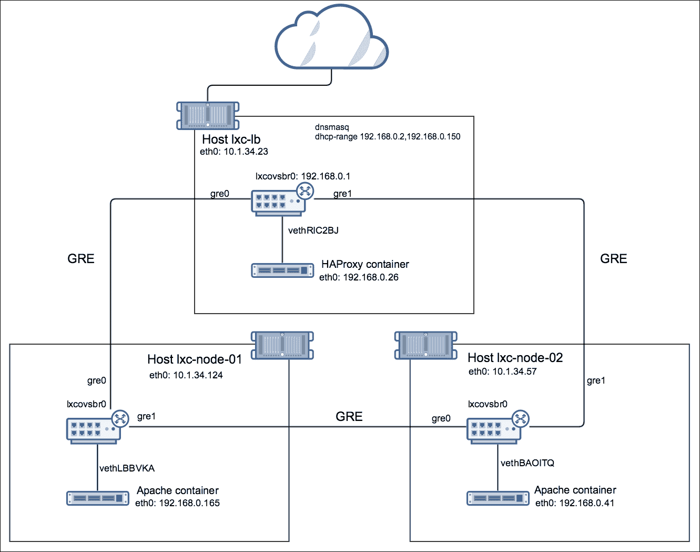

# 第六章 使用 LXC 进行集群化和横向扩展

在 LXC 容器中运行应用程序提供了一种方便的资源分配和限制方式，正如我们在前面的章节中所看到的那样。LXC 也非常适合创建应用程序集群，例如，一个可以横向或纵向扩展的 Web 服务器集群。

横向扩展是向集群或执行共同任务的资源组中添加更多计算能力的一种方式。通常，这是通过添加更多的服务器、虚拟机，或在 LXC 的情况下，添加更多容器来运行应用程序来实现的。相反，纵向扩展是通过为物理服务器、虚拟机或容器添加更多硬件或虚拟资源（如 CPU 和内存）来实现的。

在本章中，我们将利用你迄今为止所学到的所有知识，做以下事情：

+   创建一个简单的 Apache 集群，在最小根文件系统上运行 LXC，并使用 libvirt

+   使用 Open vSwitch 和 GRE 隧道网格实现带有 Apache 和 HAProxy 的多节点 Web 集群

+   演示如何通过重用现有 LXC 实例的文件系统来添加更多容器

# 使用 LXC 扩展应用程序

LXC 非常适合替代虚拟机，因为它可以容纳一个完整的 Linux 发行版根文件系统，在这种情况下，唯一与宿主操作系统共享的组件是内核。应用程序可以安装在容器的根文件系统中，使宿主机或其他容器无法共享它们。如果我们想运行相同应用程序及其依赖项的不同版本，或完全不同的 Linux 发行版，这种隔离是非常有用的。

另一方面，libvirt LXC 允许从一个二进制文件执行单个进程或一组进程，这个二进制文件由所有容器共享，并来自宿主操作系统。在这种情况下，容器共享宿主文件系统，并且只抽象出某些目录。这对于某些应用场景非常有帮助，比如当应用程序可能不需要自己的专用文件系统时，例如，如果容器中的 Linux 发行版与宿主操作系统相同。扩展此类应用程序的关键是确保服务已安装在宿主机上，并且必要的配置文件在容器的最小根文件系统中存在。然后，我们可以复制容器的配置文件和最小根文件系统，并在没有太多更改的情况下启动它。

在接下来的两节中，我们将探讨这两种情况。我们将首先通过 libvirt 构建最小根文件系统的 Apache 容器，并使用 HAProxy 进行负载均衡，然后转向使用 LXC 构建 Apache 集群，并通过 Open vSwitch 与 GRE 隧道网格实现专用文件系统和网络隔离。

## 在最小根文件系统中使用 libvirt LXC 扩展 Apache

在这一部分，我们将展示如何使用 libvirt LXC 和为每个容器创建最小的根文件系统，在同一主机上运行多个 Apache 服务器。Apache 的二进制文件和库将被容器共享。尽管这种方法可能不适用于 Apache，而更适合简单的单线程进程，但它将帮助我们以更实际的方式展示这一概念。

在这个例子中，我们将使用 Ubuntu，但相同的指令适用于 CentOS，正如我们在第二章，*在 Linux 系统上安装和运行 LXC*中所展示的那样。以下是该示例的步骤：

1.  让我们从更新操作系统开始，确保它运行的是最新的内核：

    ```
    root@ubuntu:~# apt-get update && apt-get upgrade --yes && reboot
    root@lxc:~# lsb_release -a 2>/dev/null
    Distributor ID:   Ubuntu
    Description:      Ubuntu 16.04.1 LTS
    Release:    16.04
    Codename:   xenial
    root@ubuntu:~# 
    root@ubuntu:~# uname -r
    4.4.0-38-generic
    root@ubuntu:~#

    ```

1.  截至本写作时，Ubuntu Xenial 上的最新 libvirt 包如下所示：

    ```
    root@ubuntu:~# apt-cache policy libvirt-bin
    libvirt-bin:
     Installed: 
     Candidate: 1.3.1-1ubuntu10.5
     Version table:
     *** 1.3.1-1ubuntu10.5 500
     500 http://rackspace.clouds.archive.ubuntu.com/ubuntu  
                xenial-updates/main amd64 Packages
     100 /var/lib/dpkg/status
     1.3.1-1ubuntu10 500
     500 http://rackspace.clouds.archive.ubuntu.com/ubuntu 
                xenial/main amd64 Packages
    root@ubuntu:~#

    ```

1.  接下来，安装 libvirt 包：

    ```
    root@ubuntu:~# apt-get install libvirt-bin virtinst
    root@ubuntu:~# dpkg --list | grep libvirt
    ii  libvirt-bin      1.3.1-1ubuntu10.5       amd64         
          programs for the libvirt library
    ii  libvirt0:amd64     1.3.1-1ubuntu10.5     amd64        
          library for interfacing with different virtualization systems
    ii  python-libvirt      1.3.1-1ubuntu1       amd64        
          libvirt Python bindings
    root@ubuntu:~#

    ```

1.  方便的是，libvirt 为我们创建了桥接：

    ```
     root@ubuntu:~# brctl show
    bridge name      bridge id          STP enabled  interfaces
    virbr0           8000.5254003d3c43  yes          virbr0-nic
    root@ubuntu:~#

    ```

1.  我们将使用 `default` libvirt 网络；让我们确保它存在：

    ```
    root@ubuntu:~# export LIBVIRT_DEFAULT_URI=lxc:///
    root@ubuntu:~# virsh net-list --all
     Name              State      Autostart     Persistent
    ----------------------------------------------------------
     default           active     yes           yes
    root@ubuntu:~#

    ```

1.  要检查 libvirt 使用的 `default` 网络和网关，请运行以下命令：

    ```
    root@ubuntu:~# virsh net-dumpxml default
    <network>
    <name>default</name>
    <uuid>6585ac5b-3d81-4071-bb61-3aa22007834e</uuid>
    <forward mode='nat'>
    <nat>
    <port start='1024' end='65535'/>
    </nat>
    </forward>
    <bridge name='virbr0' stp='on' delay='0'/>
    <mac address='52:54:00:3d:3c:43'/>
    <ip address='192.168.122.1' netmask='255.255.255.0'>
    <dhcp>
    <range start='192.168.122.2' end='192.168.122.254'/>
    </dhcp>
    </ip>
    </network>
    root@ubuntu:~#

    ```

1.  libvirt 工具包还启动了 `dnsmasq`，如果我们配置它们使用 DHCP，它将为 LXC 容器分配网络设置：

    ```
    root@ubuntu:~# ps axfww
    5310 ?        Ssl    0:00 /usr/sbin/libvirtd
     5758 ?        S      0:00 /usr/sbin/dnsmasq 
          --conf-file=/var/lib/libvirt/dnsmasq/default.conf 
          --leasefile-ro 
          --dhcp-script=/usr/lib/libvirt/libvirt_leaseshelper
     5759 ?        S      0:00  \_ /usr/sbin/dnsmasq 
          --conf-file=/var/lib/libvirt/dnsmasq/default.conf 
          --leasefile-ro 
          --dhcp-script=/usr/lib/libvir/libvirt_leaseshelper

    ```

1.  我们将使用默认的 `dnsmasq` 配置，但让我们确保 DHCP 范围与 `libvirt-net` 在前面的输出中所知道的范围匹配：

    ```
    root@ubuntu:~# cat /var/lib/libvirt/dnsmasq/default.conf 
          | grep -vi "#"
    strict-order
    user=libvirt-dnsmasq
    pid-file=/var/run/libvirt/network/default.pid
    except-interface=lo
    bind-dynamic
    interface=virbr0
    dhcp-range=192.168.122.2,192.168.122.254
    dhcp-no-override
    dhcp-lease-max=253
    dhcp-hostsfile=/var/lib/libvirt/dnsmasq/default.hostsfile
    addn-hosts=/var/lib/libvirt/dnsmasq/default.addnhosts
    root@ubuntu:~#

    ```

### 为容器创建最小的根文件系统

对于这个例子，我们不会使用提供的模板，也不会使用 `debootstrap` 命令来构建完整的文件系统，而是创建一个最小的目录结构来托管 Apache 配置文件和容器。其他部分将与主机操作系统位于相同的 `mount` 命名空间中，除了几个我们将绑定到容器的目录。

按照以下步骤为容器创建最小的根文件系统：

1.  首先，创建目录；复制必要的文件并在主机上安装 Apache：

    ```
    root@ubuntu:~# cd /opt/
    root@ubuntu:/opt# mkdir -p containers/http1/etc
    root@ubuntu:/opt# mkdir -p containers/http1/var/www/html
    root@ubuntu:/opt# apt-get install --yes apache2
    ...
    root@ubuntu:/opt# cp -r /etc/apache2/ /opt/containers/http1/etc/
    root@ubuntu:/opt# cp -r /etc/passwd  /opt//containers/http1/etc/
    root@ubuntu:/opt# cp -r /etc/shadow  /opt//containers/http1/etc/
    root@ubuntu:/opt# cp -r /etc/group  /opt//containers/http1/etc/
    root@ubuntu:/opt# cp -r /etc/mime.types /opt//containers/http1/etc/
    root@ubuntu:/opt# cp -r /etc/init.d/ /opt//containers/http1/etc/
    root@ubuntu:/opt# cp -r /etc/resolv.conf /opt/containers/http1/etc/
    root@ubuntu:/opt# cp -r /etc/fstab /opt/containers/http1/etc/
    root@ubuntu:/opt# cp -r /etc/apache2/ /opt/containers/http1/etc/
    root@ubuntu:/opt# cp -r /etc/network/ /opt/containers/http1/etc/

    ```

1.  接下来，创建 Apache 的 `index.html` 页面，并配置 Web 服务器使用自己独特的 PID 文件，这将使我们以后能够启动多个 Apache 进程：

    ```
    root@ubuntu:/opt# echo "Apache in LXC http1" > 
          /opt/containers/http1/var/www/html/index.html
    root@ubuntu:/opt# cd containers/
    root@ubuntu:/opt/containers# sed -i 
          's/\${APACHE_PID_FILE}/\/var\/run\/apache2\/apache2_http1.pid/g'    
          http1/etc/apache2/apache2.conf

    ```

1.  配置网络接口文件以使用 DHCP，这样我们就可以利用之前 `libvirtd` 启动的 `dnsmasq` 服务器：

    ```
    root@ubuntu:/opt/containers# cat http1/etc/network/interfaces
    auto lo
    iface lo inet loopback
    auto eth0
    iface eth0 inet dhcp
    root@ubuntu:/opt/containers#

    ```

### 定义 Apache libvirt 容器

为了使用 libvirt 构建 LXC 容器，我们需要创建一个包含容器属性的配置文件。根据前面步骤创建的目录结构以及主机上安装的 Apache，我们可以定义容器的配置文件。当我们在第三章，*使用原生和 libvirt 工具的命令行操作*中谈到 libvirt 时，已经看到过类似的配置。要查看配置，请运行以下命令：

```
root@ubuntu:/opt/containers# cat http1.xml
<domain type='lxc'>
<name>http1</name>
<memory>102400</memory>
<os>
<type>exe</type>
<init>/opt/containers/startup.sh</init>
</os>
<vcpu>1</vcpu>
<on_poweroff>destroy</on_poweroff>
<on_reboot>restart</on_reboot>
<on_crash>destroy</on_crash>
<devices>
<emulator>/usr/lib/libvirt/libvirt_lxc</emulator>
<filesystem type='mount'>
<source dir='/opt/containers/http1/etc/apache2/'/>
<target dir='/etc/apache2'/>
</filesystem>
<filesystem type='mount'>
<source dir='/opt/containers/http1/var/www/html/'/>
<target dir='/var/www/html'/>
</filesystem>
<filesystem type='mount'>
<source dir='/opt/containers/http1/etc/'/>
<target dir='/etc'/>
</filesystem>
<interface type='network'>
<source network='default'/>
</interface>
<console type='pty'/>
</devices>
</domain>
root@ubuntu:/opt/containers#

```

前面配置中的新变化是，我们不再指定`/sbin/init`作为初始化系统的类型，而是配置 libvirt 使用自定义脚本—`startup.sh`。该脚本可以是任何我们喜欢的脚本；在此情况下，它将启动容器中的网络配置，配置 shell，执行`dhclient`从`dnsmasq`获取网络设置，然后启动 Apache 和 bash：

```
root@ubuntu:/opt/containers# cat startup.sh
#!/bin/bash
export PATH=$PATH:/usr/local/sbin:/usr/local/bin:/sbin:/bin:/usr/sbin:/usr/bin:/root/bin
export PS1="[\u@\h \W]\\$"
echo "Starting Networking" >> /var/log/messages
/etc/init.d/networking start
/sbin/dhclient eth0
echo "Starting httpd" >> /var/log/messages
/etc/init.d/apache2 start
/bin/bash
root@ubuntu:/opt/containers#

```

接下来，设置脚本为可执行：

```
root@ubuntu:/opt/containers# chmod u+x startup.sh
root@ubuntu:/opt/containers#

```

容器的根目录应该如下所示：

```
root@ubuntu:/opt/containers# ls -la http1
total 16
drwxr-xr-x 4 root root 4096 Oct 31 17:25 .
drwxr-xr-x 3 root root 4096 Oct 31 17:32 ..
drwxr-xr-x 4 root root 4096 Oct 31 17:27 etc
drwxr-xr-x 3 root root 4096 Oct 31 17:25 var
root@ubuntu:/opt/containers#

```

只有两个目录！我们现在准备定义容器：

```
root@ubuntu:/opt/containers# virsh define http1.xml
Domain http1 defined from http1.xml
root@ubuntu:/opt/containers#

```

### 启动 Apache libvirt 容器

所有必要的组件就位后，让我们启动容器并确认它正在运行：

```
root@ubuntu:/opt/containers# virsh start http1
Domain http1 started
root@ubuntu:/opt/containers# virsh list --all
Id    Name                           State
----------------------------------------------------
19032 http1                          running
root@ubuntu:/opt/containers# ps axfww
...
10592 ?      S     0:00 /usr/lib/libvirt/libvirt_lxc --name http1 
--console 23 --security=apparmor --handshake 26 --veth vnet1
10594 ?      S     0:00  \_ /bin/bash /opt/containers/startup.sh
10668 ?      Ss    0:00      \_ /sbin/dhclient eth0
10694 ?      Ss    0:00      \_ /usr/sbin/apache2 -k start
10698 ?      Sl    0:00      |   \_ /usr/sbin/apache2 -k start
10699 ?      Sl    0:00      |   \_ /usr/sbin/apache2 -k start
10697 ?      S     0:00      \_ /bin/bash
root@ubuntu:/opt/containers#

```

在列出宿主上的进程时，注意容器是如何从`libvirt_lxc`脚本启动的，它是`startup.sh`脚本的父进程，后者又启动了 Apache。

连接到容器并确保它能够从`dnsmasq`获取 IP 地址和默认网关：

```
root@ubuntu:/opt/containers# virsh console http1
[root@ubuntu /]#ip a s
1: lo: <LOOPBACK,UP,LOWER_UP> mtu 65536 qdisc noqueue state UNKNOWN group default qlen 1
 link/loopback 00:00:00:00:00:00 brd 00:00:00:00:00:00
 inet 127.0.0.1/8 scope host lo
 valid_lft forever preferred_lft forever
 inet6 ::1/128 scope host
 valid_lft forever preferred_lft forever
14: eth0@if15: <BROADCAST,MULTICAST,UP,LOWER_UP> mtu 1500 qdisc noqueue state UP group default qlen 1000
 link/ether 52:54:00:92:cf:12 brd ff:ff:ff:ff:ff:ff link-netnsid 0
 inet 192.168.122.216/24 brd 192.168.122.255 scope global eth0
 valid_lft forever preferred_lft forever
 inet6 fe80::5054:ff:fe92:cf12/64 scope link
 valid_lft forever preferred_lft forever
[root@ubuntu /]#ip r s
default via 192.168.122.1 dev eth0
192.168.122.0/24 dev eth0  proto kernel  scope link  src 192.168.122.10
[root@ubuntu /]# Ctrl + ]

```

让我们从宿主操作系统连接到 Apache：

```
root@ubuntu:/opt/containers# curl 192.168.122.216
Apache in LXC http1
root@ubuntu:/opt/containers#

```

### 注意

`192.168.122.70`是`dnsmasq`分配给容器的 IP 地址；你可能需要将其替换为系统上的正确地址。

## 使用 libvirt LXC 和 HAProxy 扩展 Apache

扩展 Apache 与 libvirt LXC 和 HAProxy 时，请按照以下步骤进行：

1.  只运行一个 Apache 容器时，让我们通过复制`http1`容器的简单目录结构和 libvirt 配置来快速创建第二个容器：

    ```
    root@ubuntu:/opt/containers# cp -r http1 http2
    root@ubuntu:/opt/containers# cp http1.xml http2.xml
    root@ubuntu:/opt/containers#

    ```

1.  我们需要更改的只有容器的名称、Apache 的 PID 文件和其索引文件：

    ```
    root@ubuntu:/opt/containers# sed -i 's/http1/http2/g' 
          http2.xml 
    root@ubuntu:/opt/containers# sed -i 's/http1/http2/g' 
          http2/etc/apache2/apache2.conf 
    root@ubuntu:/opt/containers# echo "Apache in LXC http2" >    
          /opt/containers/http2/var/www/html/index.html

    ```

1.  定义新容器并检查包含根文件系统和两个容器配置文件的目录结构：

    ```
    root@ubuntu:/opt/containers# virsh define http2.xml
    Domain http2 defined from http2.xml 
    root@ubuntu:/opt/containers# ls -la
    total 28
    drwxr-xr-x 4 root root 4096 Oct 31 19:57 .
    drwxr-xr-x 3 root root 4096 Oct 31 17:32 ..
    drwxr-xr-x 4 root root 4096 Oct 31 17:25 http1
    -rw-r--r-- 1 root root  868 Oct 31 17:31 http1.xml
    drwxr-xr-x 4 root root 4096 Oct 31 19:56 http2
    -rw-r--r-- 1 root root  868 Oct 31 19:57 http2.xml
    -rwxr--r-- 1 root root  418 Oct 31 19:44 startup.sh
    root@ubuntu:/opt/containers#

    ```

1.  让我们启动新容器并确保两个实例都在运行：

    ```
    root@ubuntu:/opt/containers# virsh start http2
    Domain http2 started 
    root@ubuntu:/opt/containers# virsh list --all
    Id    Name                           State
    ----------------------------------------------------
     10592 http1                          running
     11726 http2                          running
    root@ubuntu:~#

    ```

1.  要获取有关 Apache 容器的更多信息，请运行以下命令：

    ```
    root@ubuntu:~# virsh dominfo http1
    Id:             15720
    Name:           http1
    UUID:           defd17d7-f220-4dca-9be9-bdf40b4d9164
    OS Type:        exe
    State:          running
    CPU(s):         1
    CPU time:       35.8s
    Max memory:     102400 KiB
    Used memory:    8312 KiB
    Persistent:     yes
    Autostart:      disable
    Managed save:   no
    Security model: apparmor
    Security DOI:   0
    Security label: libvirt-defd17d7-f220-4dca-9be9-bdf40b4d9164
          (enforcing) 
    root@ubuntu:~# virsh dominfo http2
    Id:             16126
    Name:           http2
    UUID:           a62f9e9d-4de3-415d-8f2d-358a1c8bc0bd
    OS Type:        exe
    State:          running
    CPU(s):         1
    CPU time:       36.5s
    Max memory:     102400 KiB
    Used memory:    8300 KiB
    Persistent:     yes
    Autostart:      disable
    Managed save:   no
    Security model: apparmor
    Security DOI:   0
    Security label: libvirt-a62f9e9d-4de3-415d-8f2d-358a1c8bc0bd 
          (enforcing)
    root@ubuntu:~#

    ```

    ### 注意

    `dominfo`输出提供了关于容器内存和 CPU 利用率的有用信息，我们可以用来进行监控、警报和自动扩展，正如我们在第七章，*容器化世界中的监控与备份*中所看到的那样。请注意，`OS 类型`设置为`exe`，因为容器的初始化系统是一个脚本。

1.  让我们测试新容器中 Apache 的连通性；根据需要替换实例的 IP：

    ```
    root@ubuntu:/opt/containers# curl 192.168.122.242
    Apache in LXC http2
    root@ubuntu:/opt/containers#

    ```

1.  由于所有容器都连接到相同的桥接网络，宿主操作系统可以访问这两个 Apache 进程。为了从宿主操作系统外部访问它们，我们可以在服务器上安装 HAProxy，并将容器的 IP 地址作为其后端服务器：

    ```
    root@ubuntu:~# echo "nameserver 8.8.8.8" > /etc/resolv.conf
    root@ubuntu:~# apt-get install --yes haproxy
    root@ubuntu:~# cat /etc/haproxy/haproxy.cfg
    global
     log /dev/log  local0
     log /dev/log  local1 notice
     chroot /var/lib/haproxy
     stats socket /run/haproxy/admin.sock mode 660 level admin
     stats timeout 30s
     user haproxy
     group haproxy
     daemon
     ca-base /etc/ssl/certs
     crt-base /etc/ssl/private
     ssl-default-bind-ciphers 
                ECDH+AESGCM:DH+AESGCM:ECDH+AES256:DH+AES256:ECDH+AES128 
                :DH+AES:ECDH+3DES:DH+3DES:RSA+AESGCM:RSA+AES
                :RSA+3DES:!aNULL:!MD5:!DSS
     ssl-default-bind-options no-sslv3
    defaults
     log  global
     mode  http
     option  httplog
     option  dontlognull
    timeout connect 5000
     timeout client  50000
     timeout server  50000
    frontend http
     bind :80
     reqadd X-Forwarded-Proto:\ http
     default_backend http_nodes
    backend http_nodes
     mode http
     balance roundrobin
     option httpclose
     option forwardfor
     option redispatch
     option httpchk GET /
     cookie JSESSIONID prefix
     server http1 192.168.122.216:80 check inter 5000
     server http1 192.168.122.242:80 check inter 5000
    root@ubuntu:~# 

    ```

    在 HAProxy 配置的`backend`部分的服务器行中指定的 IP 地址是 libvirt LXC 容器的地址。根据需要更新文件。

    在配置的 `frontend` 部分，我们告诉 HAProxy 监听端口 `80` 并绑定到所有接口。在 `backend` 部分，我们指定了两个 LXC 容器的 IP 地址。您可能需要将容器的 IP 地址替换为 `dnsmasq` 在您的系统上提供的那些地址。

1.  重新启动 HAProxy，因为在 Ubuntu 上，包安装后它会自动启动：

    ```
    root@ubuntu:~# service haproxy restart
    root@ubuntu:~#

    ```

1.  然后，确保 HAProxy 正在运行，并且在主机上监听端口`80`：

    ```
    root@ubuntu:~# pgrep -lfa haproxy
    1957 /usr/sbin/haproxy-systemd-wrapper -f /etc/haproxy
          /haproxy.cfg -p /run/haproxy.pid
    1958 /usr/sbin/haproxy -f /etc/haproxy/haproxy.cfg -p   
          /run/haproxy.pid -Ds
    1960 /usr/sbin/haproxy -f /etc/haproxy/haproxy.cfg -p    
          /run/haproxy.pid -Ds
    root@ubuntu:~# 
    root@ubuntu:~# netstat -antup | grep -i listen | grep -w 80
    tcp      0     0 0.0.0.0:80      0.0.0.0:*                  
          LISTEN      1960/haproxy
    tcp6       0      0 :::80        :::*                    
          LISTEN      9693/apache2
    root@ubuntu:~# 

    ```

1.  我们配置了 HAProxy 使用轮询法来选择后端节点；现在，让我们连接几次并确认每次都连接到了每个 LXC 容器中的 Apache：

    ```
    root@ubuntu:~# curl localhost
    Apache in LXC http1 
    root@ubuntu:~# curl localhost
    Apache in LXC http2
    root@ubuntu:~#

    ```

1.  最后，我们可以停止其中一个容器，并确保 HAProxy 将其从轮询中移除：

    ```
    root@ubuntu:~# virsh destroy http2
    Domain http2 destroyed
    root@ubuntu:~# virsh list --all
     Id    Name                           State
    ----------------------------------------------------
     15720 http1                          running
     -     http2                          shut off
    root@ubuntu:~# curl localhost
    Apache in LXC http1
    root@ubuntu:~# curl localhost
    Apache in LXC http1
    root@ubuntu:~#

    ```

Apache 可能不是在同一主机上运行多个容器的最佳应用程序。不过，它有助于展示如何在最小的 LXC 容器中扩展应用程序，如何在代理后使用 libvirt LXC，或如何构建一个多租户环境。使用来自所有容器的共享二进制文件的附加好处是，升级这些文件时无需对每个 LXC 实例进行更改，而只需对主机操作系统进行更改，这些更改将在该服务器的所有容器中可见。前述设置可能看起来很简单，但它提供了一种强大的方法来扩展轻量级 LXC 容器中的服务，而不会占用太多磁盘空间。

## 通过完整的 LXC 根文件系统和 OVS GRE 隧道扩展 Apache

在某些场景下，在同一主机上运行多个容器，并为每个容器提供最小文件系统是很好的，但接下来我们将重点介绍一个更复杂的多服务器部署示例。下图展示了我们将在本节中构建的部署结构：



使用 LXC 和 GRE 隧道的多服务器 LXC 部署

我们将使用三台服务器——`lxc-lb`、`lxc-node-01` 和 `lxc-node-02`。每台服务器都会安装 LXC 和 OVS。`lxc-lb` 主机将托管一个运行 HAProxy 的容器，稍后还会在服务器本身上运行 HAProxy。`lxc-node-01` 和 `lxc-node-02` 服务器将有容器运行 Apache。所有 LXC 实例将在一个专用的私有网络上通过连接到 OVS 的 GRE 隧道网状结构进行通信。OVS GRE 网状结构将在容器与主机之间，以及潜在的其他容器和它们的网络之间创建网络隔离。所有容器将从在 `lxc-lb` 主机上运行的 `dnsmasq` 获取网络配置。

对于这个部署，我们将使用来自 AWS 的三台 EC2 实例，运行最新的 Ubuntu Xenial 版本。

### 配置负载均衡主机

配置负载均衡主机，请按照以下步骤操作：

1.  让我们从 `lxc-lb` 服务器开始。检查可用的 LXC 版本并安装最新版本：

    ```
    root@lxc-lb:~# apt-get update && apt-get upgrade --yes && reboot
    root@lxc-lb:~# apt-cache policy lxc
    lxc:
     Installed: (none)
     Candidate: 2.0.5-0ubuntu1~ubuntu16.04.2
     Version table:
     2.0.5-0ubuntu1~ubuntu16.04.2 500
     500 http://us-east-1.ec2.archive.ubuntu.com/ubuntu 
                    xenial-updates/main amd64 Packages
     2.0.0-0ubuntu2 500
     500 http://us-east-1.ec2.archive.ubuntu.com/ubuntu   
                    xenial/main amd64 Packages
    root@lxc-lb:~# 
    root@lxc-lb:~# apt-get install --yes lxc
    ... 
    root@lxc-lb:~# dpkg --list | grep lxc
    ii          liblxc1      2.0.5-0ubuntu1~ubuntu16.04.2    
          amd64       Linux Containers userspace tools (library)
    ii          lxc          2.0.5-0ubuntu1~ubuntu16.04.2    
          all         Transitional package for lxc1
    ii          lxc-common   2.0.5-0ubuntu1~ubuntu16.04.2    
          amd64       Linux Containers userspace tools (common tools)
    ii          lxc-templates  2.0.5-0ubuntu1~ubuntu16.04.2    
          amd64       Linux Containers userspace tools (templates)
    ii          lxc1           2.0.5-0ubuntu1~ubuntu16.04.2    
          amd64       Linux Containers userspace tools
    ii          lxcfs          2.0.4-0ubuntu1~ubuntu16.04.1    
          amd64       FUSE based filesystem for LXC
    ii          python3-lxc    2.0.5-0ubuntu1~ubuntu16.04.2    

          amd64         
          Linux Containers userspace tools (Python 3.x bindings)
    root@lxc-lb:~# 
    root@lxc-lb:~# lxc-create --version
    2.0.5
    root@lxc-lb:~#

    ```

1.  安装 LXC 包和模板后，我们也得到了 Linux 桥接，但我们不会使用它：

    ```
    root@lxc-lb:~# brctl show
    bridge name       bridge id           STP enabled interfaces
    lxcbr0            8000.000000000000   no
    root@lxc-lb:~#

    ```

1.  接下来，安装 OVS 并创建一个名为 `lxcovsbr0` 的新桥接：

    ```
    root@lxc-lb:~# apt-get install --yes openvswitch-switch
    ...
    root@lxc-lb:~# ovs-vsctl add-br lxcovsbr0
    root@lxc-lb:~# ovs-vsctl show
    482cf359-a59e-4482-8a71-02b0884d016d
     Bridge "lxcovsbr0"
     Port "lxcovsbr0"
     Interface "lxcovsbr0"
     type: internal
     ovs_version: "2.5.0"
    root@lxc-lb:~#

    ```

1.  默认的 LXC 网络使用`10.0.3.0/24`子网；我们将其替换为`192.168.0.0/24`。这样可以在已有 LXC 网络的情况下启动一个新的网络并隔离某些容器集合，同时也有助于展示这一概念：

    ```
    root@lxc-lb:~# cat /etc/default/lxc-net | grep -vi "#"
    USE_LXC_BRIDGE="true"
    LXC_BRIDGE="lxcbr0"
    LXC_ADDR="10.0.3.1"
    LXC_NETMASK="255.255.255.0"
    LXC_NETWORK="10.0.3.0/24"
    LXC_DHCP_RANGE="10.0.3.2,10.0.3.254"
    LXC_DHCP_MAX="253" 
    root@lxc-lb:~# cat /etc/lxc/default.conf
    lxc.network.type = veth
    lxc.network.link = lxcbr0
    lxc.network.flags = up
    lxc.network.hwaddr = 00:16:3e:xx:xx:xx
    root@lxc-lb:~#

    ```

1.  将默认的 Linux 桥接名称替换为我们刚刚创建的 OVS 桥接，并更改网络：

    ```
    root@lxc-lb:~# sed -i 's/lxcbr0/lxcovsbr0/g' /etc/default/lxc-net
    root@lxc-lb:~# sed -i 's/10.0.3/192.168.0/g' /etc/default/lxc-net
    root@lxc-lb:~# sed -i 's/lxcbr0/lxcovsbr0/g' /etc/lxc/default.conf

    ```

1.  `dnsmasq`服务配置为`10.0.3.0/24`网络，但重启后，它应该会监听我们之前指定的新的子网。让我们重启服务器以确保更改会生效：

    ```
    root@lxc-lb:~# pgrep -lfa dnsmasq
    10654 dnsmasq -u lxc-dnsmasq --strict-order --bind-interfaces
          --pid-file=/run/lxc/dnsmasq.pid --listen-address 10.0.3.1 
          --dhcp-range 10.0.3.2,10.0.3.254 --dhcp-lease-max=253 
          --dhcp-no-override --except-interface=lo --interface=lxcbr0 
          --dhcp-leasefile=/var/lib/misc/dnsmasq.lxcbr0.leases 
          --dhcp-authoritative
    root@lxc-lb:~#
    root@lxc-lb:~# reboot

    ```

1.  如预期所示，`dnsmasq`现在将提供来自`192.168.0.0/24`子网的 IP 地址：

    ```
    root@lxc-lb:~# pgrep -lfa dnsmasq
    1354 dnsmasq -u lxc-dnsmasq --strict-order --bind-interfaces 
          --pid-file=/run/lxc/dnsmasq.pid --listen-address 192.168.0.1 
          --dhcp-range 192.168.0.2,192.168.0.254 --dhcp-lease-max=253 
          --dhcp-no-override --except-interface=lo --interface=lxcovsbr0 
          --dhcp-leasefile=/var/lib/misc/dnsmasq.lxcovsbr0.leases 
          --dhcp-authoritative
    root@lxc-lb:~#

    ```

1.  检查 OVS 桥接；它应该已经启动并配置了 IP 地址：

    ```
    root@lxc-lb:~# ip a s lxcovsbr0
    4: lxcovsbr0: <BROADCAST,MULTICAST,UP,LOWER_UP> mtu 1500 qdisc 
          noqueue state UNKNOWN group default qlen 1
     link/ether ee:b0:a2:42:22:4e brd ff:ff:ff:ff:ff:ff
     inet 192.168.0.1/24 scope global lxcovsbr0
     valid_lft forever preferred_lft forever
     inet6 fe80::ecb0:a2ff:fe42:224e/64 scope link
     valid_lft forever preferred_lft forever
    root@lxc-lb:~#

    ```

### 创建负载均衡器容器

创建负载均衡器容器，请按照以下步骤进行：

1.  我们将使用 Ubuntu 模板来创建 HAProxy 容器的根文件系统：

    ```
    root@lxc-lb:~# lxc-create --name haproxy --template ubuntu
    root@lxc-lb:~# lxc-start --name haproxy
    root@lxc-lb:~#

    ```

1.  OVS 桥接现在应该已经将容器接口添加为端口——在本例中为`vethUY97FY`：

    ```
    root@lxc-lb:~# ovs-vsctl show
    482cf359-a59e-4482-8a71-02b0884d016d
     Bridge "lxcovsbr0"
     Port "lxcovsbr0"
     Interface "lxcovsbr0"
     type: internal
     Port "vethUY97FY"
     Interface "vethUY97FY"
     ovs_version: "2.5.0"
    root@lxc-lb:~# 
    root@lxc-lb:~# ip a s vethUY97FY
    6: vethUY97FY@if5: <BROADCAST,MULTICAST,UP,LOWER_UP> mtu 1500 qdisc 
          noqueue master ovs-system state UP group default qlen 1000
     link/ether fe:d1:f3:ca:9e:83 brd ff:ff:ff:ff:ff:ff link-netnsid 0
     inet6 fe80::fcd1:f3ff:feca:9e83/64 scope link
     valid_lft forever preferred_lft forever
    root@lxc-lb:~#

    ```

1.  连接到新容器，确保它已从同一主机上运行的 DHCP 服务器获得 IP 地址：

    ```
    root@lxc-lb:~# lxc-attach --name haproxy
    root@haproxy:~# ifconfig
    eth0      Link encap:Ethernet  HWaddr 00:16:3e:76:92:0a
     inet addr:192.168.0.26  Bcast:192.168.0.255  
                    Mask:255.255.255.0
     inet6 addr: fe80::216:3eff:fe76:920a/64 Scope:Link
     UP BROADCAST RUNNING MULTICAST  MTU:1500  Metric:1
     RX packets:16 errors:0 dropped:0 overruns:0 frame:0
     TX packets:12 errors:0 dropped:0 overruns:0 carrier:0
     collisions:0 txqueuelen:1000
     RX bytes:1905 (1.9 KB)  TX bytes:1716 (1.7 KB)
    lo        Link encap:Local Loopback
     inet addr:127.0.0.1  Mask:255.0.0.0
     inet6 addr: ::1/128 Scope:Host
     UP LOOPBACK RUNNING  MTU:65536  Metric:1
     RX packets:0 errors:0 dropped:0 overruns:0 frame:0
     TX packets:0 errors:0 dropped:0 overruns:0 carrier:0
     collisions:0 txqueuelen:1
     RX bytes:0 (0.0 B)  TX bytes:0 (0.0 B)
    root@haproxy:~# route -n
    Kernel IP routing table
    Destination   Gateway       Genmask       Flags Metric Ref  Use Iface
    0.0.0.0       192.168.0.1   0.0.0.0       UG    0      0     0  eth0
    192.168.0.0   0.0.0.0       255.255.255.0 U     0      0     0  eth0
    root@haproxy:~#

    ```

1.  容器应该能够连接到主机和互联网。我们在继续之前先测试一下：

    ```
    root@haproxy:~# ping -c 3 192.168.0.1
    PING 192.168.0.1 (192.168.0.1) 56(84) bytes of data.
    64 bytes from 192.168.0.1: icmp_seq=1 ttl=64 time=0.218 ms
    64 bytes from 192.168.0.1: icmp_seq=2 ttl=64 time=0.045 ms
    64 bytes from 192.168.0.1: icmp_seq=3 ttl=64 time=0.046 ms
    --- 192.168.0.1 ping statistics ---
    3 packets transmitted, 3 received, 0% packet loss, time 2000ms
    rtt min/avg/max/mdev = 0.045/0.103/0.218/0.081 ms
     root@haproxy:~# ping google.com -c 3
    PING google.com (216.58.217.110) 56(84) bytes of data.
    64 bytes from iad23s42-in-f14.1e100.net (216.58.217.110): icmp_seq=1 
          ttl=48 time=2.55 ms
    64 bytes from iad23s42-in-f14.1e100.net (216.58.217.110): icmp_seq=2 
          ttl=48 time=2.11 ms
    64 bytes from iad23s42-in-f14.1e100.net (216.58.217.110): icmp_seq=3 
          ttl=48 time=2.39 ms
    --- google.com ping statistics ---
    3 packets transmitted, 3 received, 0% packet loss, time 2002ms
    rtt min/avg/max/mdev = 2.113/2.354/2.555/0.191 ms
     root@haproxy:~# exit
    exit
    root@lxc-lb:~#

    ```

如果连接不可用，请确保`dnsmasq`服务器正确分配了 IP 地址，并且容器连接到了 OVS 桥接，且桥接接口本身已经启动并配置了 IP 地址。

### 构建 GRE 隧道

**通用路由封装**（**GRE**）是一种隧道协议，允许通过**互联网协议**（**IP**）建立虚拟点对点网络。我们可以使用它在三个主机上的 OVS 交换机之间创建一个网络网状结构，从而将 LXC 容器连接到一个隔离的网络。每个服务器（或者在这个例子中的 EC2 实例）将彼此连接。OVS 提供了一种方便的方式来建立 GRE 隧道。

仍然在负载均衡器主机上，创建两个到其他两台服务器的 GRE 隧道，并根据需要替换 IP 地址：

```
root@lxc-lb:~# ovs-vsctl add-port lxcovsbr0 gre0 -- set interface gre0 type=gre options:remote_ip=10.1.34.124
root@lxc-lb:~# ovs-vsctl add-port lxcovsbr0 gre1 -- set interface gre1 type=gre options:remote_ip=10.1.34.57
root@lxc-lb:~#

```

### 注意

请注意，前面提到的 IP 地址是实际服务器的地址，而不是容器的地址。

现在，列出桥接上的所有端口将显示 GRE 端口：

```
root@lxc-lb:~# ovs-vsctl show
482cf359-a59e-4482-8a71-02b0884d016d
Bridge "lxcovsbr0"
 Port "gre1"
 Interface "gre1"
 type: gre
 options: {remote_ip="10.1.34.57"}
 Port "vethRIC2BJ"
 Interface "vethRIC2BJ"
 Port "lxcovsbr0"
 Interface "lxcovsbr0"
 type: internal
 Port "gre0"
 Interface "gre0"
 type: gre
 options: {remote_ip="10.1.34.124"}
ovs_version: "2.5.0"
root@lxc-lb:~#

```

由于我们正在 OVS 之间创建网络网状结构，可能会发生数据包循环。为了防止拓扑循环，我们需要在 OVS 上启用**生成树协议**（**STP**）。STP 是一种二层协议，在创建冗余和互联的交换机连接时防止网络环路。要在 OVS 交换机上启用它，请执行以下命令：

```
root@lxc-lb:~# ovs-vsctl set bridge lxcovsbr0 stp_enable=true
root@lxc-lb:~#

```

完成所有前述步骤后，第一个主机已经配置完成。在接下来的部分，我们将以类似的方式配置其余的服务器。

### 配置 Apache 节点

配置 Apache 节点，请按照以下步骤进行：

1.  在第一个 Apache 节点上，安装 LXC 和 OVS，并创建桥接：

    ```
    root@lxc-node-01:~# apt-get update && apt-get --yes upgrade && reboot
    root@lxc-node-01:~# apt-get install --yes lxc
    root@lxc-node-01:~# apt-get install --yes openvswitch-switch
    root@lxc-node-01:~# ovs-vsctl add-br lxcovsbr0
    root@lxc-node-01:~# ifconfig lxcovsbr0 up

    ```

1.  替换桥接名称并更改子网：

    ```
    root@lxc-node-01:~# sed -i 's/lxcbr0/lxcovsbr0/g' 
          /etc/lxc/default.conf
    root@lxc-node-01:~# sed -i 's/lxcbr0/lxcovsbr0/g' 
          /etc/default/lxc-net
    root@lxc-node-01:~# sed -i 's/10.0.3/192.168.0/g' 
          /etc/default/lxc-net

    ```

1.  创建到另外两个服务器的 GRE 隧道，并根据需要替换 IP：

    ```
    root@lxc-node-01:~# ovs-vsctl add-port lxcovsbr0 gre0 -- set 
          interface gre0 type=gre options:remote_ip=10.1.34.23
    root@lxc-node-01:~# ovs-vsctl add-port lxcovsbr0 gre1 -- set 
          interface gre1 type=gre options:remote_ip=10.1.34.57
     root@lxc-node-01:~# ovs-vsctl show
    625928b0-b57a-46b2-82fe-77d541473f29
     Bridge "lxcovsbr0"
     Port "gre0"
     Interface "gre0"
     type: gre
     options: {remote_ip="10.1.34.23"}
     Port "gre1"
     Interface "gre1"
     type: gre
     options: {remote_ip="10.1.34.57"}
     Port "lxcovsbr0"
     Interface "lxcovsbr0"
     type: internal
     ovs_version: "2.5.0"
    root@lxc-node-01:~#

    ```

1.  在桥接器上启用 STP：

    ```
    root@lxc-node-01:~# ovs-vsctl set bridge lxcovsbr0 stp_enable=true
    root@lxc-node-01:~#

    ```

1.  接下来，让我们创建一个名为`apache`的 Ubuntu 容器：

    ```
    root@lxc-node-01:~# lxc-create --name apache --template ubuntu
    root@lxc-node-01:~# lxc-start --name apache

    ```

1.  是时候以类似方式配置最后一个节点了：

    ```
    root@lxc-node-02:~# apt-get update && apt-get upgrade --yes && reboot
    root@lxc-node-02:~# apt-get install --yes lxc
    root@lxc-node-02:~# apt-get install --yes openvswitch-switch
    root@lxc-node-02:~# ovs-vsctl add-br lxcovsbr0
    root@lxc-node-02:~# ifconfig lxcovsbr0 up
    root@lxc-node-02:~# sed -i 's/lxcbr0/lxcovsbr0/g' 
          /etc/lxc/default.conf
    root@lxc-node-02:~# sed -i 's/lxcbr0/lxcovsbr0/g' 
          /etc/default/lxc-net
    root@lxc-node-02:~# sed -i 's/10.0.3/192.168.0/g' 
          /etc/default/lxc-net

    ```

1.  创建 GRE 隧道：

    ```
    root@lxc-node-02:~# ovs-vsctl add-port lxcovsbr0 gre0 -- set 
          interface gre0 type=gre options:remote_ip=10.1.34.23
     root@lxc-node-02:~# ovs-vsctl add-port lxcovsbr0 gre1 -- set 
          interface gre1 type=gre options:remote_ip=10.1.34.124
     root@lxc-node-02:~# ovs-vsctl show
    7b8574ce-ed52-443e-bcf2-6b1ddbedde4c
     Bridge "lxcovsbr0"
     Port "gre0"
     Interface "gre0"
     type: gre
     options: {remote_ip="10.1.34.23"}
     Port "gre1"
     Interface "gre1"
     type: gre
     options: {remote_ip="10.1.34.124"}
     Port "lxcovsbr0"
     Interface "lxcovsbr0"
     type: internal
     ovs_version: "2.5.0"
    root@lxc-node-02:~#

    ```

1.  同时，在交换机上启用 STP：

    ```
    root@lxc-node-02:~# ovs-vsctl set bridge lxcovsbr0 stp_enable=true
    root@lxc-node-02:~#

    ```

1.  最后，创建并启动 Apache 容器：

    ```
    root@lxc-node-02:~# lxc-create --name apache --template ubuntu
    root@lxc-node-02:~# lxc-start --name apache

    ```

### 安装 Apache 和 HAProxy，并测试连接性

配置好所有服务器，启动容器，建立 GRE 隧道后，让我们测试每个 LXC 实例之间的连接性。由于所有容器都属于同一网络，并通过 GRE 隧道与 OVS 交换机互联，它们应该能够相互通信。最重要的是，Apache 容器将通过在`lxc-lb`服务器上运行的`dnsmasq`服务通过 DHCP 获取网络配置。

要验证每个容器是否接收到租约，我们可以通过执行以下命令检查`dnsmasq`租约文件：

```
root@lxc-lb:~# cat /var/lib/misc/dnsmasq.lxcovsbr0.leases
1478111141 00:16:3e:84:cc:f3 192.168.0.41 apache *
1478111044 00:16:3e:74:b3:8c 192.168.0.165 * *
1478110360 00:16:3e:76:92:0a 192.168.0.26 haproxy *
root@lxc-lb:~#

```

1.  获取租约可能需要几秒钟；你可能需要多次检查该文件，才能看到任何 IP 记录。一旦所有容器都分配了 IP，我们应该能够在列出每个服务器的容器时看到它们：

    ```
    root@lxc-lb:~# lxc-ls -f
    NAME    STATE   AUTOSTART GROUPS IPV4         IPV6
    haproxy RUNNING 0         -      192.168.0.26 -
    root@lxc-lb:~#
    root@lxc-node-01:~# lxc-ls -f
    NAME   STATE   AUTOSTART GROUPS IPV4          IPV6
    apache RUNNING 0         -      192.168.0.165 -
    root@lxc-node-01:~#
    root@lxc-node-02:~# lxc-ls -f
    NAME   STATE   AUTOSTART GROUPS IPV4         IPV6
    apache RUNNING 0         -      192.168.0.41 -
    root@lxc-node-02:~#

    ```

1.  接下来，让我们在`lxc-lb`服务器上的`haproxy`容器中安装 HAProxy，并测试容器之间的连接性：

    ```
    root@lxc-lb:~# lxc-attach --name haproxy
    root@haproxy:~# ping -c3 192.168.0.165
    PING 192.168.0.165 (192.168.0.165) 56(84) bytes of data.
    64 bytes from 192.168.0.165: icmp_seq=1 ttl=64 time=0.840 ms
    64 bytes from 192.168.0.165: icmp_seq=2 ttl=64 time=0.524 ms
    64 bytes from 192.168.0.165: icmp_seq=3 ttl=64 time=0.446 ms
    --- 192.168.0.165 ping statistics ---
    3 packets transmitted, 3 received, 0% packet loss, time 1999ms
    rtt min/avg/max/mdev = 0.446/0.603/0.840/0.171 ms
     root@haproxy:~# ping -c3 192.168.0.41
    PING 192.168.0.41 (192.168.0.41) 56(84) bytes of data.
    64 bytes from 192.168.0.41: icmp_seq=1 ttl=64 time=1.26 ms
    64 bytes from 192.168.0.41: icmp_seq=2 ttl=64 time=0.939 ms
    64 bytes from 192.168.0.41: icmp_seq=3 ttl=64 time=1.05 ms
    --- 192.168.0.41 ping statistics ---
    3 packets transmitted, 3 received, 0% packet loss, time 2001ms
    rtt min/avg/max/mdev = 0.939/1.086/1.269/0.142 ms
    root@haproxy:~#
    root@haproxy:~# apt-get update && apt-get install haproxy
    ...

    ```

    ### 注意

    如果你在云提供商上构建这个示例部署，并且`apt-get update`挂起，请尝试将 LXC 容器中`eth0`接口的 MTU 设置减少如下：`ifconfig eth0 mtu 1400`。

1.  让我们查看`haproxy.cfg`配置文件：

    ```
     root@haproxy:~# cat /etc/haproxy/haproxy.cfg 
     global 
     log /dev/log local0 
     log /dev/log local1 notice 
     chroot /var/lib/haproxy 
     stats socket /run/haproxy/admin.sock mode 660 level admin 
     stats timeout 30s 
     user haproxy 
     group haproxy 
     daemon 
     ca-base /etc/ssl/certs 
     crt-base /etc/ssl/private 
     ssl-default-bind-ciphers
                ECDH+AESGCM:DH+AESGCM:ECDH+AES256:DH+AES256:ECDH+
                AES128:DH+AES:ECDH+3DES:DH+3DES:RSA+AESGCM:RSA+AES:
                RSA+3DES:!aNULL:!MD5:!DSS 
     ssl-default-bind-options no-sslv3 
     defaults 
     log global 
     mode http 
     option httplog 
     option dontlognull 
     timeout connect 5000 
     timeout client 50000 
     timeout server 50000 
     frontend http 
     bind :80 
     reqadd X-Forwarded-Proto:\ http 
     default_backend http_nodes 
     backend http_nodes 
     mode http 
     balance roundrobin 
     option httpclose 
     option forwardfor 
     option redispatch 
     option httpchk GET / 
     cookie JSESSIONID prefix 
     server http1 192.168.0.165:80 check inter 5000 
     server http1 192.168.0.41:80 check inter 5000 
     root@haproxy:~#

    ```

    HAProxy 的配置几乎与我们在本章前面使用的配置相同。

    ### 注意

    请注意，HAProxy 配置文件中`backend`部分的 IP 地址是运行在`lxc-node-01/02`服务器上的 Apache 容器的 IP。

1.  重启 HAProxy 并确保其正常运行：

    ```
    root@haproxy:~# service haproxy restart
    root@haproxy:~# ps axfww
     PID TTY      STAT   TIME COMMAND
     1 ?         Ss     0:00 /sbin/init
     38 ?        Ss     0:00 /lib/systemd/systemd-journald
     59 ?        Ss     0:00 /usr/sbin/cron -f
     62 ?        Ssl    0:00 /usr/sbin/rsyslogd -n
     143 ?        Ss     0:00 /sbin/dhclient -1 -v -pf 
            /run/dhclient.eth0.pid 
            -lf /var/lib/dhcp/dhclient.eth0.leases -I -df   
            /var/lib/dhcp/dhclient6.eth0.leases eth0
     167 ?        Ss     0:00 /usr/sbin/sshd -D
     168 pts/2    Ss+    0:00 /sbin/agetty --noclear 
            --keep-baud pts/2 115200 38400 9600 vt220
     169 lxc/console Ss+   0:00 /sbin/agetty --noclear 
            --keep-baud console 115200 38400 9600 vt220
     412 ?        Ss     0:00 /usr/sbin/haproxy-systemd-wrapper -f  
            /etc/haproxy/haproxy.cfg -p /run/haproxy.pid
     413 ?        S      0:00  \_ /usr/sbin/haproxy -f 
            /etc/haproxy/haproxy.cfg -p /run/haproxy.pid -Ds
     414 ?        Ss     0:00      \_ /usr/sbin/haproxy -f 
            /etc/haproxy/haproxy.cfg -p /run/haproxy.pid -Ds
    root@haproxy:~#

    ```

    请注意，从前面的输出中可以看到，与本章前面看到的 libvirt LXC 示例不同，现在容器中的初始化进程是父进程。

1.  在另外两个容器中安装 Apache，并为每个容器创建`index.html`页面：

    ```
    root@lxc-node-01:~# lxc-attach --name apache
    root@apache:~# apt-get install --yes apache2
    root@apache:~# echo "Apache on LXC container on host lxc-node-01" > 
          /var/www/html/index.html
    root@lxc-node-02:~# lxc-attach --name apache
    root@apache:~# apt-get install --yes apache2
    root@apache:~# echo "Apache on LXC container on host lxc-node-02" > 
          /var/www/html/index.html

    ```

1.  从`haproxy`容器内，连接到 HAProxy 正在监听的端口`80`，负载均衡器应该将请求转发到 Apache 容器：

    ```
    root@haproxy:~# apt-get install --yes curl
    root@haproxy:~# curl localhost
    Apache on LXC container on host lxc-node-01
    root@haproxy:~# curl localhost
    Apache on LXC container on host lxc-node-02
    root@haproxy:~# exit
    exit
    root@lxc-lb:~#

    ```

1.  我们应该也能够从`lxc-lb`主机连接到 HAProxy，因为主机操作系统可以通过 OVS 交换机与容器通信：

    ```
    root@lxc-lb:~# apt-get install curl
    root@lxc-lb:~# curl 192.168.0.26
    Apache on LXC container on host lxc-node-01
    root@lxc-lb:~# curl 192.168.0.26
    Apache on LXC container on host lxc-node-02
    root@lxc-lb:~#

    ```

    前面的`192.168.0.26`地址是`haproxy`容器的 IP 地址；请根据系统中`dnsmasq`分配的 IP 地址进行替换。

1.  最后，我们可以在`lxc-lb`服务器本身上安装 HAProxy，这将允许我们从外部世界连接到 Apache 服务器，例如，如果`lxc-lb`主机具有公共 IP。在这种情况下，我们完全不需要在容器中运行 HAProxy，尽管我们可以重用相同的配置：

    ```
    root@lxc-lb:~# apt-get install haproxy
    ...
    root@lxc-lb:~#

    ```

    从容器中复制配置（如本节前面所列）并重启 HAProxy：

    ```
    root@lxc-lb:~# service haproxy restart
    root@lxc-lb:~# curl 10.1.34.23
    Apache on LXC container on host lxc-node-01
    root@lxc-lb:~# curl 10.1.34.23
    Apache on LXC container on host lxc-node-02
    root@lxc-lb:~#

    ```

    ### 注意

    请注意，`10.1.34.23` IP 地址是此示例中 `lxc-lb` 服务器的地址。如果您的服务器有多个 IP 地址或公共 IP 地址，可以使用其中任何一个，因为我们已经配置了 HAProxy 绑定到所有接口。

通过这样做，我们建立了一个简单的设置，可以在生产环境中使用，通过添加更多的服务器和容器，并通过 HAProxy 或 Nginx 等负载均衡器来水平扩展服务。

### 扩展 Apache 服务

像前面那样的设置可以通过创建容器文件系统和配置文件的快照来完全自动化，这些快照已经安装了所需的服务；然后使用这些副本按需启动新的容器。

为了演示如何通过添加更多容器来手动扩展 Apache，请按照以下步骤操作：

1.  首先，停止其中一个 Apache 实例：

    ```
    root@lxc-node-01:~# lxc-ls -f
    NAME   STATE   AUTOSTART GROUPS IPV4 IPV6
    apache RUNNING 0         -      -    -
    root@lxc-node-01:~# lxc-stop --name apache

    ```

1.  接下来，复制其根文件系统和 LXC 配置文件：

    ```
    root@lxc-node-01:~# cd /var/lib/lxc
    root@lxc-node-01:/var/lib/lxc# ls -alh
    total 12K
    drwx------  3 root root 4.0K Nov  2 16:53 .
    drwxr-xr-x 43 root root 4.0K Nov  2 15:02 ..
    drwxrwx---  3 root root 4.0K Nov  2 16:53 apache
    root@lxc-node-01:/var/lib/lxc# cp -rp apache/ apache_new
    root@lxc-node-01:/var/lib/lxc#

    ```

1.  更改新容器的名称，并从配置文件中删除 MAC 地址。LXC 会在容器启动时动态分配一个新的地址：

    ```
    root@lxc-node-01:/var/lib/lxc# sed -i 's/apache/apache_new/g' 
          apache_new/config
    root@lxc-node-01:/var/lib/lxc# sed -i '/lxc.network.hwaddr/d' 
          apache_new/config
    root@lxc-node-01:/var/lib/lxc#

    ```

1.  现在，我们在主机上有两个容器：

    ```
    root@lxc-node-01:/var/lib/lxc# lxc-ls -f
    NAME       STATE   AUTOSTART GROUPS IPV4 IPV6
    apache     STOPPED 0         -      -    -
    apache_new STOPPED 0         -      -    -
    root@lxc-node-01:/var/lib/lxc#

    ```

1.  让我们启动这两个容器：

    ```
    root@lxc-node-01:/var/lib/lxc# lxc-start --name apache
    root@lxc-node-01:/var/lib/lxc# lxc-start --name apache_new
    root@lxc-node-01:/var/lib/lxc# lxc-ls -f
    NAME       STATE   AUTOSTART GROUPS IPV4 IPV6
    apache     RUNNING 0         -      -    -
    apache_new RUNNING 0         -      -    -
    root@lxc-node-01:/var/lib/lxc#

    ```

1.  由于我们已经从原始容器复制了整个根文件系统，因此 Apache 服务已在新实例中安装。现在，启动它并确保它正在运行：

    ```
    root@lxc-node-01:/var/lib/lxc# lxc-attach --name apache_new
    root@apache:/# /etc/init.d/apache2 start
    [ ok ] Starting apache2 (via systemctl): apache2.service.
    root@apache:/# ps ax
     PID TTY      STAT   TIME COMMAND
     1 ?        Ss     0:00 /sbin/init
     37 ?        Ss     0:00 /lib/systemd/systemd-journald
     50 ?        Ss     0:00 /sbin/ifup -a --read-environment
     60 ?        Ss     0:00 /usr/sbin/cron -f
     62 ?        Ssl    0:00 /usr/sbin/rsyslogd -n
     97 ?        S      0:00 /bin/sh -c /sbin/dhclient -1 -v -pf 
             /run/dhclient.eth0.pid -lf 
             /var/lib/dhcp/dhclient.eth0.leases -I 
             -df /var/lib/dhcp/dhclient6.eth0.leases eth0 ?
     98 ?        S      0:00 /sbin/dhclient -1 -v -pf 
             /run/dhclient.eth0.pid -lf /var/lib/dhcp/dhclient.eth0.leases 
             -I -df /var/lib/dhcp/dhclient6.eth0.leases eth0
     125 pts/3    Ss     0:00 /bin/bash
     168 ?        Ss     0:00 /usr/sbin/apache2 -k start
     171 ?        Sl     0:00 /usr/sbin/apache2 -k start
     172 ?        Sl     0:00 /usr/sbin/apache2 -k start
     246 pts/3    R+     0:00 ps ax
    root@apache:/#

    ```

这个过程类似的操作可以通过 Jenkins 等服务完全自动化，并分布到不同的服务器上，从而实现服务的自动扩展。我们将在 第七章中更详细地探讨这个设置，*容器化世界中的监控与备份*。

# 概述

使用 LXC 扩展各种工作负载需要一个代理服务，如 HAProxy 或 Nginx，并且实际的服务运行在容器中。通过使用软件定义网络（OVS 和 GRE 隧道），可以实现网络连接和分段。

在本章中，我们介绍了如何在简单的基于 libvirt 的 LXC 容器中运行 Apache，这些容器不需要整个根文件系统，而只需包含主机操作系统中共享的二进制文件和库的最小目录集。我们还在多个服务器上创建了一个负载均衡器后面的 Apache 集群，并演示了通过复制 LXC 容器来简单而有效地扩展它的方法。

在下一章中，我们将继续你所学到的内容，展示如何监控和备份 LXC，并使用 Jenkins 和 Sensu 创建一个自动扩展服务。
