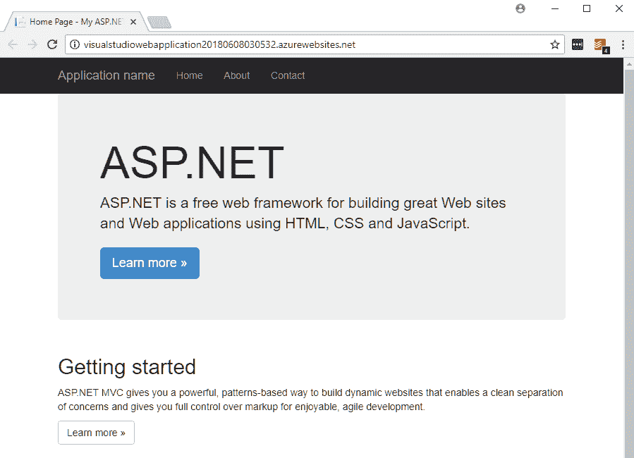
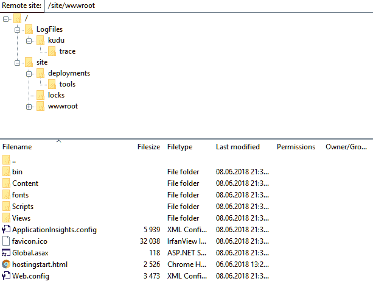
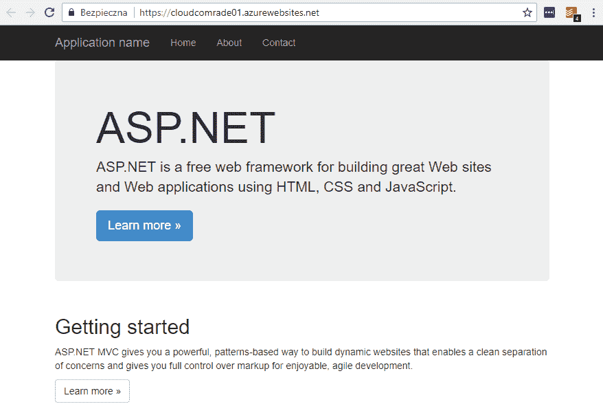

# Azure 应用服务

Azure 应用服务是 Azure 云中最大、最常用的服务之一。它允许轻松开发带有多种功能的 Web 应用程序（例如支持不同平台，包括 .NET、PHP 和 Java），手动和自动扩展，以及不同的性能选项。它是一个通用平台和运行时，支持 WebJobs 和 Azure Functions 等其他服务。

本章内容包括：

+   创建并部署 Azure 应用服务

+   与不同操作系统和平台的兼容性

+   选择合适的 App Service Plan 以及它们的功能

+   使用不同的安全提供商来确保应用服务的安全

+   诊断和监控您的应用程序

# 技术要求

要执行本章的练习，您需要以下内容：

+   访问 Azure 订阅

+   安装了 Azure 开发工作负载的 Visual Studio 2017

+   安装 Visual Studio Code（可通过 [`code.visualstudio.com/`](https://code.visualstudio.com/) 下载）

# 创建并部署 Azure 应用服务

要开始使用 Azure 应用服务，您需要学习如何创建该服务并部署代码。您将看到 Azure 提供了许多不同的方式来完成此操作，每条路径的难易程度取决于您的当前需求和应用程序的具体要求。然而，云和**平台即服务**（**PaaS**）的强大之处在于提供了一个直接且直观的过程，用于配置系统的新组件。

# 使用 Azure 门户创建 Azure 应用服务

首先，我将向您展示如何使用 Azure 门户创建您的第一个 Web 应用。事实上，您只需要鼠标和键盘（因为每个应用都需要一个名称）——这里不需要外部硬件或详细的配置信息，因为 Azure 会为您完成所有操作。

# 从可用服务中选择 Azure Web App

要在 Azure 门户中创建 Azure 应用服务，首先需要在可用服务列表中找到它。最简单的方法是点击 + 创建资源 按钮并搜索 `Web App`：


您也可以选择点击 App Services，而不是使用 + 创建资源 按钮——这会将您带到不同的视图，在那里您可以通过点击 + 添加 按钮来创建一个应用服务。这适用于所有最流行的 Azure 服务，如 SQL 数据库、虚拟机和存储账户。

如您所见，Azure 门户会尽量帮助您找到与搜索字符串最相关的服务。当您点击 Web App 项时，会看到另一个屏幕，其中包含多个类似项，这些项在某种程度上都与您正在搜索的内容相关：


在本次练习中，选择 Web App*，然后点击屏幕右下方的 创建 按钮。

刚开始时，选择最通用的选项来选择服务通常会更容易。当你积累更多经验并且对可用的服务更熟悉时，你会发现 Azure 提供了许多有用的预配置设置（例如集成 Web 应用和 SQL 数据库），这些可以用来缩短开发时间，并在一个地方配置所有服务。

# 配置 Azure Web 应用

当你点击“创建”按钮时，你将看到一个屏幕，你可以在其中输入创建 Web 应用所需的所有信息。所有必填字段都标有*（星号）符号：


如你所见，在创建 Web 应用时，我们几乎需要填写所有字段（关于“应用程序洞察”单选按钮有一个小例外，我们将在接下来的章节中讲解）。让我们单独关注每个字段，以便更好地理解它们是如何工作的：

+   应用名称：此字段表示你应用的域名。选择一个唯一且有效的名称很重要，因为它以后不能更改。请注意，如果需要，你可以轻松地绑定自己的自定义域名。

+   订阅：如果你拥有多个订阅，你将有机会选择适合此特定资源的订阅。通过这种方式，你将能够区分不同项目之间的费用。

+   资源组：在 Azure 中，每个资源必须属于一个逻辑容器，称为资源组。这本身不会产生额外的费用，所以你不必担心创建多个资源组的问题。

+   操作系统：目前，在 Azure 中，你可以使用不同的操作系统（Windows、Linux 或 Docker 容器）来创建 Web 应用。这个选择会影响成本和性能，所以确保你选择了适合你需求的操作系统。

+   应用服务计划/位置：Azure 中的应用服务直接与应用服务计划相关联，应用服务计划根据你选择的选项提供不同的功能和性能。

通常，利用资源组并使用特定的过滤器（如资源的生命周期或给定的环境，例如生产、暂存或测试环境）来分隔资源是一个好习惯。资源组能让你更好地控制已部署的服务，并对谁可以访问某个资源进行更细粒度的控制。

由于你刚开始使用 Azure，你可能还没有创建任何应用服务计划。由于我们不能在没有应用服务计划的情况下创建应用服务，我们现在来进行排序。

# 创建应用服务计划

当你点击“应用服务计划/位置”时，你将看到一个屏幕，其中有一个“+ 创建新计划”按钮，允许你创建一个新的应用服务计划。它应该是这样的：


如你所见，我们需要输入三个字段：

+   应用服务计划：这是你的**应用服务计划**的名称，必须在一个资源组内唯一。

+   位置：通过这个设置，我们可以将我们的**应用服务计划**定位在特定区域。这有时意味着不同的功能可用。

+   定价层级：当你点击此项时，你将看到另一个屏幕，展示不同层级的可用功能。这个选择在功能上非常重要，并且大多数情况下会依赖于你规划的环境特性（例如开发/测试环境、生产应用程序，是否需要部署槽等）：


如你在前面的截图中看到的，我们有三种**应用服务计划**类别：

+   开发/测试：这一层级包括 F、D 和 B 层（分别代表免费、共享和基础）。它们设计用于简单的开发/测试场景以及不需要自动缩放或备份等功能的轻量级网页应用。

+   生产模式：这个模式提供强大的机器和先进的功能，适用于许多实际场景，例如 API、电子商务和热门门户网站。

+   隔离模式：这个模式使用与**生产**层相同的硬件，但提供更多的功能和可能性，使你的网页应用能够隔离于外部访问。这是最昂贵的类别，但在创建无法公开访问的系统时可能会非常有用。

重要的是要记住，F 和 D 层级每天的计算时间是有限的。这意味着一旦超过了处理时间的限制（F 层为 60 分钟，D 层为 240 分钟），你的应用将变得不可用，并会被暂停，直到第二天。

为了这个练习，我建议选择**开发/测试**类别中的任何一个层级。选择好你满意的选项后，你可以点击“应用”按钮。例如，我的配置如下所示：


记住，你可以随时升级（或扩展）你的**应用服务计划**实例，例如，当你需要某个特定功能或应用程序的受欢迎程度增长时。这是云计算相比于本地部署的一大优势，在本地部署中，你必须自己购买并设置新机器。

现在，你可以点击“确定”，你将返回到 Web Appblade 页面，在这里你可以输入缺失的字段。这里，你可以看到我网页应用的完整配置：


现在只需点击**创建**按钮，等待几秒钟即可创建一个新资源。在此期间，Azure 会验证模板和参数，并协调多个底层控制器来创建服务。一旦新资源创建完成，您应该会看到通知，并能在您的资源中看到它。为了快速验证，点击左侧的**所有资源**按钮，并使用例如您创建的**应用服务**的名称进行筛选：


# 使用 Visual Studio 创建 Azure 应用服务

如果您不想使用**Azure 门户**来创建 Web 应用程序，您可以使用 Microsoft Visual Studio，它内置了对许多不同 Azure 服务的集成。

本练习是使用已安装 Azure 工作负载的 Microsoft Visual Studio 2017（15.6.4）创建的。如果您想配置您的实例并确保一切设置正确，请按照 [`docs.microsoft.com/en-us/dotnet/azure/dotnet-tools?view=azure-dotnet&tabs=windows`](https://docs.microsoft.com/en-us/dotnet/azure/dotnet-tools?view=azure-dotnet&tabs=windows) 上的简短教程操作。

在 Visual Studio 中，点击**文件 | 新建 | 项目**。这将显示一个**新建项目**窗口，您可以在其中找到许多用于开始新应用程序的不同模板。因为我们感兴趣的是云项目，所以我们从**云**类别开始：


由于我们在本章中处理的是**应用服务**，我们感兴趣的模板是**ASP.NET Web 应用程序（.NET Framework）**。另一个有效的选项是**ASP.NET Core Web 应用程序**——如果您足够自信可以使用最新的 .NET 版本，可以随意选择，因为我们会涵盖这两种场景。当您对选择满意时，点击**确定**。

下一步是选择合适的模板。在这里，您有多个选项，例如：

+   空模板：最简单的选项，允许您完全控制已安装的包和整体结构

+   Web Forms：用于构建 Web 应用程序的最古老框架，使用许多内置控件并具有数据访问功能

+   MVC：一个众所周知的**模型-视图-控制器**（**MVC**）架构，它取代了**Web Forms**

+   Web API：用于使用 .NET 编程栈创建 RESTful HTTP 服务的模板

+   单页面应用程序：此模板带有许多用于构建客户端交互的附加工具

以上所有选项您应该都比较熟悉。不过，感谢安装了 Azure 工具集，您应该能够访问另外两个模板：

+   Azure API 应用程序：提供与不同 Azure 服务的附加集成，如 Azure AD、API 管理和逻辑应用

+   Azure 移动应用：用于构建移动后端的模板

不过，我们将在本章的后续部分讨论这两者。现在，为了继续操作，让我们选择 MVC，因为这是这里列出的所有模板中最常见且最简单的。使用该模板的默认选项并点击 确定（OK）。

你可能已经注意到一个附加按钮，我之前没有描述过，**更改身份验证**（Change Authentication）。它允许选择用于验证访问你 Web 应用的方式。我们将在接下来的 Azure Web 应用安全性部分中讲解该功能。

几秒钟后，Visual Studio 应该会基于所选模板生成一个项目。我相信它看起来对你来说很熟悉，因为它和从 MVC 模板创建的传统 Web 应用并没有太大区别。我敢肯定，你迫不及待地想看看它是否能正常运行——不要再等了，按下 *F5* 启动应用。

你应该会看到一个类似于我屏幕上的画面：


如你所见，它是一个传统项目开始时会看到的通用模板。问题是，我们如何将其部署到 Azure 以使我们的站点能够在云中运行？

现在，让我们停止本地运行的站点，回到 Visual Studio。在项目图标上右击，你会看到一个上下文菜单。在多个不同的选项中，你可以点击 发布（Publish...）。


由于这是一个云项目，你会看到除了 IIS、FTP 和 文件夹之外的额外选项：

+   App Service：用于将应用程序部署到 PaaS 服务。

+   Azure 虚拟机：用于将应用程序部署到你已配置的虚拟机。

由于本书的主题是 PaaS 服务，我们将不讨论如何将 Web 应用部署到虚拟机。不过，如果你有兴趣这么做，相关的操作指南可以在 [`github.com/aspnet/Tooling/blob/AspNetVMs/docs/create-asp-net-vm-with-webdeploy.md`](https://github.com/aspnet/Tooling/blob/AspNetVMs/docs/create-asp-net-vm-with-webdeploy.md) 上找到。

目前，让我们选择 App Service。你应该能看到两个不同的选项：

+   创建新应用（Create new）：用于将应用程序部署到新创建的 App Service。

+   选择现有： 此选项仅在你已经部署了站点时有效。

因为我们刚刚开始，所以我们关注的选项是 创建新应用（Create new）。点击 发布（Publish...）后，你将看到另一个屏幕，在那里你可以输入所有必填参数。如果你阅读了前一节关于如何使用 Azure 门户创建 App Service 的内容，那么某些字段应该是熟悉的——实际上，你正在做的事情和在门户中操作是一样的。如果你跳过了这一节，强烈建议你返回并阅读相关描述。配置完我的 Web 应用后，我的屏幕如下所示：


请记住，你可以直接从前面的页面创建资源组和 App Service 计划。如果你不喜欢那里列出的选项，你可以点击 **新建...** 按钮，这将引导你完成创建新资源的过程。这也是像 Visual Studio 这样的工具的另一大优势，因为你无需离开编程环境就能使用 Azure。

如果你对当前配置满意，最后一步就是点击 **创建** 按钮，并稍等片刻，直到应用部署完成。此外，Visual Studio 会准备一个发布配置文件，你可以随时重复使用它。我们会查看它，因为它将在本章的下一部分帮助我们。部署完成后，你应该会看到你的 Web 应用自动在默认浏览器中打开：



恭喜！你刚刚创建并部署了你的第一个 App Service。如果你查看 URL，你会看到它包含了你在 Visual Studio 向导中设置的名称。所有 Azure 中的 Web 应用都可以通过以下 URL 格式访问：

`http(s)://{appservicename}.azurewebsites.net`

这也解释了为什么名称必须是唯一的：由于默认情况下，所有作为 Azure Web 应用托管的 Web 应用都是公开可用的，你必须选择一个在其他 URL 中尚未使用的名称。在下一部分，我们将尝试使用 FTP 部署我们的应用，作为使用 Visual Studio 的替代方法。

# 使用 FTP 部署 Azure 应用服务

使用 Visual Studio 进行部署对于测试和开发来说是一个不错的选择，但肯定不能用于生产环境的部署。上传文件到 App Service 最简单的方式是使用 FTP，且该 Azure 资源已集成 FTP。

# 使用用户级凭据部署 Azure 应用服务

当你进入 Azure 门户并选择之前创建的 Web 应用时，查看 **概述** 页面，你将看到许多关于此服务的信息，如当前状态、位置和 URL。在这些信息中，有一个 FTP 部分，包含三个不同的参数：

+   FTP/部署用户名：用于通过 FTP 客户端连接到 Web 应用时所使用的用户名

+   FTP 主机名：用于创建 FTP 连接时应使用的主机

+   FTPS 主机名：与之前相同的主机，但允许安全连接

我的 App Service 目前看起来是这样的：


所有 FTP 信息可以在整个页面的右下角找到。现在我们需要的是用于连接服务器的 FTP 客户端。对于选择这类应用程序，我没有特别的推荐。就个人而言，我偏好使用 FileZilla 来管理我的 FTP 连接和文件传输。然而，你可以使用任何你喜欢的客户端，因为它们在功能上都非常相似。在我们开始将文件上传到服务器之前，还需要一件事，那就是为用户设置密码。要生成新密码，前往 Deployment credentialsblade，位置在 App Servicefeatures 的左侧 DEPLOYMENT 部分：


在这里，你可以设置两个字段：

+   FTP 用户的用户名

+   该用户的密码

你可能会想知道这如何与之前在 Overview 屏幕上找到的用户名相关。区别其实很简单：使用 Deployment credentials，你是在创建一个新的用户，该用户将用于你 Microsoft Azure 帐户关联的所有应用程序和订阅。这意味着你将能够使用相同的凭证来部署每一个 App Service。对于你将遇到的每种场景，这并不是理想的选择，但对于本练习的目的，我们设定一个用户并用于部署。在本节的下一部分，我将向你展示如何从 Visual Studio 生成的发布配置文件中获取凭证。一旦你输入用户名和密码，点击 Save。现在，我们可以打开 FTP 客户端，并使用这些凭证来建立连接。在这里，你可以看到我的配置（请注意，用户名必须采用以下格式：`<appservicename>\<ftpusername>`）：


一旦你连接到服务器，你将看到一个可用目录的列表。最顶层包含以下内容：

+   `LogFiles`: 包含有关运行中的 App Service 的诊断信息文件

+   `site`**:** 你的 Web 应用工作文件存储在这里

我们将在本章的后续部分介绍 `LogFiles`，它涉及监控和诊断应用程序。目前，我们关注的是 `site` 文件夹。当你进入该文件夹时，你会看到其他目录：`deployments`、`locks` 和 `wwwroot`。对于那些曾经使用过 IIS 的朋友来说，最后一个目录应该比较熟悉，因为它是存放 Web 应用程序的最常见文件夹名称。实际上，这就是你的 App Service 的工作目录，所有必要的文件都应上传到此处。这里是一个空的 Web 应用程序的完整目录结构：


现在，你已经了解了 App Service 的结构，你可以部署你的文件并查看它是否能正常工作。如果你愿意，你可以复用之前练习中的项目，或者上传一个全新的网站。

如果你想重新使用文件，你可以再次发布项目，但这次，不是直接发布到 Azure，而是创建一个新的发布配置并使用文件夹作为目标。Visual Studio 完成创建包之后，只需使用 FTP 客户端将文件从输出目录复制到 FTP 位置。

这是我之前项目中的文件，已上传到我的 FTP 服务器：



现在，当我访问我的网站 URL 时，我会看到一个正在运行的应用程序：



很好——你刚刚学会了如何利用应用服务的 FTP 功能，从任何位置和环境部署应用程序。然而，正如我之前提到的，我们正在使用用户级凭据，这些凭据对于你在订阅中部署的所有 web 应用程序都是相同的。那么，如何使用应用级用户名和密码来实现相同的结果呢？

# 使用应用级凭据部署 Azure App Service

使用应用级凭据部署应用程序有两种方式：

+   从 Azure 门户下载它们

+   在 Visual Studio 中配置 WebDeploy

# 从 Azure 门户下载应用级凭据

当你进入你的`应用服务`并点击`概览`面板时，你将看到顶部有一个`获取发布配置`按钮，如下截图所示：


现在，当你点击它时，浏览器将下载一个`.PublishProfile`文件。请打开它查看其内容。这是我从我的 web 应用中获取的一个示例文件：

```
<?xml version="1.0" encoding="UTF-8"?>
 <publishData>
 <publishProfile profileName="cloudcomrade01 - Web Deploy" publishMethod="MSDeploy" publishUrl="cloudcomrade01.scm.azurewebsites.net:443" msdeploySite="cloudcomrade01" userName="$cloudcomrade01" userPWD="LEebknaDdg0KS6SgScLuXlwtzxvwYway7ssoKxCSkCLi6Gw0HRyt2iEGMLbP" destinationAppUrl="http://cloudcomrade01.azurewebsites.net" SQLServerDBConnectionString="" mySQLDBConnectionString="" hostingProviderForumLink="" controlPanelLink="http://windows.azure.com" webSystem="WebSites">
 <databases />
 </publishProfile>
 <publishProfile profileName="cloudcomrade01 - FTP" publishMethod="FTP" publishUrl="ftp://waws-prod-am2-197.ftp.azurewebsites.windows.net/site/wwwroot" ftpPassiveMode="True" userName="cloudcomrade01\$cloudcomrade01" userPWD="LEebknaDdg0KS6SgScLuXlwtzxvwYway7ssoKxCSkCLi6Gw0HRyt2iEGMLbP" destinationAppUrl="http://cloudcomrade01.azurewebsites.net" SQLServerDBConnectionString="" mySQLDBConnectionString="" hostingProviderForumLink="" controlPanelLink="http://windows.azure.com" webSystem="WebSites">
 <databases />
 </publishProfile>
 </publishData>
```

如你所见，这是一个简单的 XML 文件，包含大量有用的信息。我们目前关注的是`userName`和`userPWD`属性。这些就是我们一直在寻找的——在应用服务创建时自动生成的应用级凭据。你可以使用这些凭据，而不是我们之前创建的用户级凭据。

# 在 Visual Studio 中配置 WebDeploy

要查看如何在 Visual Studio 中配置**WebDeploy**，请参考从*使用 Visual Studio 创建 Azure App Service*部分开始的所有步骤，这一部分关于从这个 IDE 发布应用程序。如果你已经完成了这些步骤，再次返回到`发布`屏幕。

如果你想从前一部分导入发布配置文件，则在`发布`屏幕上，点击`新建配置...`按钮，然后选择`导入配置...`选项，这样你就可以选择先前生成的配置文件。

当你点击`配置`按钮时，你将看到另一个窗口，里面包含了你部署的完整配置：


如你所见，它包含了一组完全不同的信息，且不反映你已配置的用户级设置。

请记住用户级凭证和应用级凭证之间的区别。注意，多个具有访问权限的用户可以分别使用自己的用户级凭证。此外，要使用应用级凭证，你至少需要在特定的应用服务上具有**贡献者**角色。如果你只有**阅读者**角色，则无法访问这些凭证。

在应用级凭证和用户级凭证之间的选择完全取决于你交付应用程序的过程。在大多数情况下，你无需检查和设置这些凭证，因为像 Visual Studio 或 Azure DevOps（前身为 Visual Studio Team Services）这样的工具会隐式地获取和使用它们。应用级凭证通常只有在我们需要手动部署时才会使用。

你可以随时从**概述**面板重置应用级凭证（例如，如果当前凭证因为某种安全问题需要被撤销）。在**获取发布配置文件**按钮旁边，你可以找到**重置发布配置文件**选项，它会设置一个新的用户名和密码。

# 使用 Visual Studio Code 创建 Azure 应用服务

Microsoft Visual Studio 不是唯一可以与 Azure 应用服务一起使用的 IDE。由于此 Azure 服务支持不同的技术栈，包括 .NET、JS、PHP、Java 等，你可以轻松利用它的能力来托管不同的使用不同运行时的网站。例如，假设我们有以下 PHP 代码来显示一个 `Hello World` 消息：

```
<?php
echo('Hello world from Azure App Service - PHP here!');
?>
```

这样一个简单的 PHP 应用程序可以在任何支持 PHP 语言的 IDE 中轻松创建。为了完成本次练习，我选择了 Visual Studio Code 这一开源编辑器，因为它可以通过许多不同的插件轻松扩展。为了简化操作，你可以安装以下扩展：


安装此插件后，你将能够轻松地从 IDE 内部部署应用程序，无需前往门户或使用其他方法。要将应用程序推送到云端，你需要进入**AZURE**选项卡并找到**APP SERVICE**部分。

在首次使用这些扩展时，你可能需要进行身份验证。请按照显示的指示操作，Visual Studio Code 将连接到你的订阅。

在我们部署简单的 PHP 应用程序之前，必须先创建一个 Azure 应用服务。为此，你需要点击 **创建新 Web 应用**...按钮：


向导与 Microsoft Visual Studio 略有不同，它更像是命令行，要求你依次提供所有字段和信息。在 Visual Studio Code 中，你需要输入以下内容：

+   Azure 应用服务名称

+   你选择的操作系统

+   运行时版本

在这个特定的示例中，我指定了以下内容：

+   `handsonazure-euw-appservice`

+   Linux

+   PHP 7.2

一旦配置完成，Visual Studio Code 会询问你是否要部署应用程序。选择“确定”，然后选择要部署到的文件夹：


一切设置就绪后，你将看到一个通知，告知你现在可以浏览该网站：


当你点击“浏览网站”按钮时，你将被转发到刚刚部署的 Web 应用程序。请注意，这个扩展允许你直接在 IDE 中管理该服务，并提供不同的功能，包括应用设置、部署槽和 Azure WebJobs（后者在第二章，*Azure WebJobs* 中有描述）。在这里，你可以看到托管在 Azure 中的实际示例：


这里重要的是，通过使用相同的路径，你将能够在不同的 Azure 应用服务中托管多种不同的运行时。无论是 Java 应用程序、Python 脚本，还是 Node.js 后端，它们都被支持，并且可以通过像 Visual Studio Code 这样的 IDE 容易开发。

在使用带有扩展的 Visual Studio Code 时，你可能希望对资源的创建拥有更多控制。要启用“高级创建”，请进入 文件 | 首选项 | 设置 窗口，找到 扩展 部分，然后点击“应用服务：高级创建”复选框。

# 使用不同操作系统和平台

目前，应用服务在选择操作系统、运行时和平台时支持几种不同的配置。以下是使用应用服务运行网站的一些可能选项：

+   .NET Core

+   .NET Framework

+   Node.js

+   PHP

+   Java

+   Python

+   静态 HTML 网站

此外，你还可以选择平台（32 位或 64 位）、HTTP 版本（1.1 或 2.0）以及底层操作系统（Windows、Linux 或容器）。让我们从为应用程序选择合适的操作系统开始。

# 选择操作系统

要选择一个操作系统来运行你的 Web 应用程序，我们必须在 Azure 中创建一个新应用。目前，在创建应用服务后，无法更改此设置。要创建一个新网站，进入 Azure 门户并点击“+ 创建资源”。在新屏幕上，搜索`Web App`并选择第一个显示的项目（或者直接返回到 *从可用服务中选择 Azure Web App* 部分，并执行那里提到的所有步骤）。

在“Web 应用 - 创建”屏幕上，你会看到一个操作系统（OS）字段。你将有三个选项：

+   Windows: 适用于 .NET 应用程序的最常见选项，适合运行 .NET Framework、Java、Node.js 或 PHP 网站。

+   Linux：如果您有用 .NET Core 编写的应用程序，可以利用这个操作系统及其独特的功能。此外，您还可以运行 Java、Node.js、PHP 和 Python 应用程序。

+   Docker：提供 Web 应用容器，我们将在本书后面详细介绍。除了运行所有前述平台，它还允许托管用目前在应用服务中不支持的语言编写的应用程序（例如 Go）。

选择权在您。每个操作系统都有不同的特点：Linux 非常适合运行 Python 应用程序，而 Windows 在处理这种语言时有一些性能问题；另一方面，您可能有许多用 .NET Framework 编写的网站，这些网站已经针对 Windows 系统进行了优化。每个操作系统选项的定价也有所不同。让我们在这里比较 Windows 和 Linux：

|  | 基础 | 标准 | 高级 | 隔离 |
| --- | --- | --- | --- | --- |
| 每小时价格 (Linux) | $0.071 | $0.095 | $0.19 | 不适用 |
| 每小时价格 (Windows) | $0.075 | $0.10 | $0.20 | $0.40 |

如您所见，这两种操作系统之间存在一些小差异。更重要的是，Linux 当前不支持免费和共享层。隔离层目前处于公开预览阶段，不应在生产工作负载中使用，但这当然未来可能会改变。当您考虑了所有优缺点后，便可以创建由您选择的操作系统提供支持的应用服务。

# 选择不同的平台

在上一部分中，您学会了如何选择适合您应用程序的操作系统。当然，这并不是运行网站所需的全部——如果您想部署例如 PHP 代码，您还需要启用特定的语言。为此，请前往您的应用服务（有多种方法可以做到这一点：可以从 Azure 门户左侧菜单中选择“应用服务”，然后选择您的 Web 应用，或从 **资源组** 窗格中选择您创建的资源组）并选择应用程序设置窗格：


一开始，您可能会对这些可用的选项感到有些不知所措，但很快，随着经验的积累，一切都会变得清晰。您可能注意到了这里的“升级以启用链接”——一些功能，如平台或始终开启，仅从 B1 等级开始可用。

记住，“始终开启”功能在某些特定场景中可能变得至关重要，因为它定义了您的应用程序是否始终运行（因此，当没有人使用时，它可以变得空闲）。正如您将在接下来的部分中学到的，设置“始终开启”为开启是运行例如持续 Web 作业或 Azure 函数时所必需的。

目前，我们对所有提到编程语言的选项感兴趣。这些选项包括以下内容：

+   .NET Framework 版本

+   PHP 版本

+   Python 版本

+   Java 版本

默认情况下，你的 App 服务支持两种语言：.NET Framework 版本和 PHP 版本。例如，要运行 Python 或 Java，你必须设置适当的设置为特定版本，例如使用 Java 版本下拉菜单启用 Java 支持。

如前所述，始终根据你为应用程序选择的语言选择正确的操作系统来支持你的 App 服务。虽然可以在 Windows 上运行 PHP 或 Python，但建议选择 Linux，因为许多库和包只能在这个特定的操作系统上运行。

# 使用应用程序设置

应用程序设置页面提供的不仅仅是启用或禁用可用功能。当你向下滚动时，你会看到其他部分，包括以下内容：

+   调试：如果你想启用远程调试，可以将远程调试选项切换为开启。这样你就可以设置你希望用来在本地调试应用程序的 Visual Studio 版本。

+   应用程序设置：此部分包含在应用程序运行时使用的设置。

+   连接字符串：你可以直接在 Azure 门户中为你的网站定义连接字符串。

+   默认文档：如果你希望有一个自定义的默认文档（即应用程序的起始点），你可以在此部分进行设置。

+   处理程序映射：有时你需要为特定的文件扩展名或 URL 指定自定义处理程序。在这里，你可以添加相应的配置来实现。

+   虚拟应用程序和目录：如果你需要在你的 App 服务中拥有多个应用程序，你可以在这里将虚拟路径映射到物理路径。

请记住，.NET 应用程序的应用程序设置在运行时注入，并且会覆盖存储在`web.config`中的现有设置。对于其他平台（如.NET、Java、Node.js），该部分的设置将作为环境变量注入，你可以引用它们。连接字符串也遵循这一规则。

Azure 中的应用程序设置在存储时始终是加密的。而且，你可以通过禁止所有用户访问它们来轻松保护它们。

针对.NET 以外的平台的连接字符串始终以适当的连接类型作为前缀。有四种可能性：`SQLCONNSTR_`、`MYSQLCONNSTR_`、`SQLAZURECONNSTR_`和`CUSTOMCONNSTR_`。

# 不同的 App 服务计划和功能

我们在本章开始时提到过这个话题，所以你应该对接下来要讨论的内容有所了解。正如你记得的那样，当创建 App 服务时，你必须选择（或创建）一个 App 服务计划，该计划定义了可用的性能和附加功能。让我们覆盖所有三个类别，这次重点介绍每个层级之间的差异。

# 开发/测试 App 服务计划

专为开发和测试环境设计的 App 服务计划可以在 Dev / Test 类别中找到：


我们有三种不同的层级可供选择：

+   **F1（免费）**：最基本的选项，使用共享基础设施，提供 1 GB 内存和每天 60 分钟的计算时间。使用共享层时，一些应用服务的功能不可用（例如常开功能，或你选择的平台）。F1 非常适合快速测试或部署用于演示的应用程序。使用此应用服务计划不会收取费用。

+   **D1（共享）**：与 F1 类似，但这还允许为你的应用服务设置自定义域名。更重要的是，你可以比使用免费层时多运行应用四倍的时间。不过，这仍然是共享基础设施，因此一些功能无法使用。

+   **B1**：建议用于运行生产工作负载的第一个层级。它保证了专用的 A 系列机器，并提供更多的内存和存储空间。它还是第一个可以进行扩展的层级——尽管只是手动扩展。**基础**层还提供了额外的版本（B2 和 B3），它们提供了更强的计算能力。

如果你需要在 Azure 中运行符合**服务级别协议**（**SLA**）定义的服务，请记住，不能使用**免费**或**共享**层，因为它们不支持此协议。

# 生产应用服务计划

在这一类别中，选择不同可用功能的选项更多。请记住，在硬件方面，**基础**层提供的性能与**标准**层完全相同：


在这里，我们可以选择以下几种：

+   **标准 (S1)**：与 B1 使用相同的 A 系列。我们在这里得到的是自动扩展、预发布槽、备份以及使用流量管理器的可能性（将在后续章节中描述）。这是大多数生产应用程序的最佳层级，因为它支持蓝绿部署场景，并能处理更大的负载（感谢与流量管理器的集成）。如果你需要更强的计算能力，可以选择 S2 或 S3。

+   **高级 (P1v2)**：这是新推荐的选项，替代了 P1，底层使用新的 Dv2 系列虚拟机。它在扩展方面提供了更好的性能和更高的限制（最多支持 20 个实例，而**标准**层为 10 个实例），并且支持更多的预发布槽。你还可以选择 P2 或 P3。

请记住，特定层级中的最大实例数量取决于可用性。在大多数情况下，这些只是软限制，联系支持后可以提升。

一般来说，**标准**层应满足大多数在性能、可靠性和自动化可能性方面的需求。然而，如果你计划在 Azure 中运行一个非常受欢迎的网站，可能需要**高级**层，因为它提供了更多的灵活性和更好的可扩展性。

需要记住的一个重要事项是，如何扩展会影响定价。通常，您有两种选择：要么向上扩展（将层级更改为更高的一个），要么横向扩展（通过部署多个相同应用实例）。例如，如果您为一个 S1 实例支付 40 美元，当您将其扩展到 10 个实例时，总共需要支付 400 美元——每个实例 40 美元。

# 隔离版应用服务计划

有时您可能需要比 Premium 层提供的更多功能。也许您需要将应用程序从外部网络隔离。也许您只希望为某些特定用户提供访问权限。也许 20 个实例仍然不够。这就是为什么 Azure 引入了隔离版类别：


在这个类别中，我们只有一个层级，分为三个版本：

+   **隔离版 (I1/I2/I3)**：与 Premium 层（Dv2）中的虚拟机相同。还包括大量存储空间来存储您的文件（1 TB）、私有应用访问、集成虚拟网络（例如，您可以访问内部应用程序），以及更稳定的环境。这是最昂贵的层级，但在功能性和提供的特性范围方面提供了最多。

通常情况下，隔离版层级在处理巨大负载时是最稳定的。当 Standard 或 Premium 层级的利用率达到 100%时，它们会迅速变得无响应，而隔离版应用服务则需要更多时间才会返回`HTTP 503 服务不可用`的响应。如果您需要一个非常可靠、不会轻易崩溃的服务，请考虑这一点。

# 使用不同安全提供商保护应用服务

大多数网页应用程序必须以某种方式进行安全保护，要么使用您自己的安全系统，要么使用第三方身份提供商，如 Facebook、Google 或 Twitter。在传统的本地托管应用中，您通常需要自己配置所有内容。PaaS 解决方案，如 Azure 应用服务，已经具备此功能，并且通过身份验证/授权功能轻松访问。在本节中，您将学习如何设置它，以便提示用户登录。

# 在 Azure 门户中配置身份验证/授权

与大多数 PaaS 服务一样，您可以直接从门户配置应用服务的功能。由于这种方式，您可以将所有选项集中在一个地方，并轻松在它们之间切换。

# 使用 Azure Active Directory 保护应用服务

转到您的应用服务，然后在左侧找到“身份验证/授权”面板，位于之前提到的“应用设置”旁边。点击它后，您将看到一个配置屏幕：


如您所见，它目前处于禁用状态。当您将应用服务身份验证功能切换到“开”时，您将看到可用的新选项，您可以通过这些选项为您的网页应用配置身份验证：


将请求未通过身份验证时的操作字段更改为任何可用的值。门户将显示以下信息：

`要启用身份验证 / 授权，请确保所有自定义域已绑定相应的 SSL，并且 .net 版本设置为 "4.5"，管理管道模式设置为 "集成"。`

由于我们现在没有自定义域，因此无需执行任何操作。同样适用于 .NET 版本和管道模式—如果你没有更改应用程序的默认参数，一切应该已经正确设置。现在，让我们选择一个身份验证提供者并进行配置——我们将从 Azure Active Directory 开始。

使用 Azure Active Directory 来与 App Service 配合工作并不需要你成为专家，特别是现在可以让 Azure Portal 为你配置它。然而，如果你想了解更多关于这个服务的信息，最好的起点是它的文档：[`docs.microsoft.com/en-us/azure/active-directory/active-directory-whatis`](https://docs.microsoft.com/en-us/azure/active-directory/active-directory-whatis)。

当你点击 Azure Active Directory 选项时，系统会显示一个新屏幕，你可以在其中配置集成。首先，你需要选择管理模式：

+   关闭：Azure Active Directory 身份验证已禁用。

+   Express：使用 Azure AD 配置 App Service 身份验证的快捷方式。你需要选择一个已有的 Azure Active Directory 应用程序，或者让 Azure Portal 为你创建一个新的应用程序。

+   高级：如果 Express 不足以满足你的需求，你可以自行输入所有必要的参数。通过此选项，你将能够通过提供 Client ID、Issuer URL，以及可选的 Client Secret 来配置集成。所有这些参数都可以在浏览 Azure Active Directory 应用程序时找到。

首先，我建议使用 Express 选项，因为在 Azure Active Directory 中配置应用程序超出了本书的范围。目前，你只需要为应用程序提供一个名称并点击 OK。你将回到前一个屏幕，此时你应该可以看到已经配置了一个身份验证提供者：


现在，点击保存按钮。稍等片刻，一切应该设置完毕，你现在可以访问你的应用程序，看看安全配置是否生效。前往概览面板并点击 URL 链接，或者直接在浏览器中输入它。当加载默认页面时，你不会看到页面内容，而是会被重定向到登录页面。

对于这个特定的练习，我假设你已经部署了你的应用程序。如果没有，请回到前面的章节，使用 Visual Studio 或 FTP 部署你的代码。

由于我们将 Azure Active Directory 配置为身份验证提供者，因此系统会要求用户同意此特定应用程序访问他们的信息。  

# 使用其他身份验证提供者  

如您所见，Azure Active Directory 并不是唯一可用于应用服务的安全提供者。我们可以选择 Facebook、Google，甚至 Twitter 来为我们处理身份验证和授权。当您有一个面向公众的应用程序，供使用不同社交媒体网站的人们使用时，这一点尤其有帮助，因为他们可以使用来自其他应用程序的账户，并在进入您的网站时快速登录。要使用 Azure Active Directory 以外的身份验证提供者，您必须在其中一个提到的门户中创建一个应用程序。实际上，无论您选择 Facebook、Google 还是 Twitter，都没有区别——您需要提供两个字段：  

+   Facebook 的应用 ID 和应用密钥  

+   Google 的客户端 ID 和客户端密钥  

+   Twitter 的 API 密钥和 API 密钥  

本书不会介绍如何在其他身份验证提供者中创建应用程序。然而，您可以在[`developers.facebook.com/docs/apps/register/`](https://developers.facebook.com/docs/apps/register/)、[`developers.google.com/identity/sign-in/web/sign-in`](https://developers.google.com/identity/sign-in/web/sign-in)、[`developer.twitter.com/en/docs/basics/authentication/guides/access-tokens.html`](https://developer.twitter.com/en/docs/basics/authentication/guides/access-tokens.html)找到相关的详细说明。  

# 应用服务的诊断和监控  

本章的最后一部分将展示如何诊断和监控您已部署的应用服务。这些操作在应用程序正常运行时至关重要，因为错误和性能问题总是会出现，特别是在热门服务中。借助 Azure Web Apps 中的多个集成工具，您可以确保始终拥有足够的信息来发现并解决问题。  

# 概览面板  

您可能已经注意到的第一件事是“概览”面板中可见的图表：  

  

它们提供了关于应用程序行为的基本洞察，例如数据传输、请求数量或 HTTP 500 错误。让我们点击任何一个图表——您将看到另一个重要的界面，我们现在来看一下。

# 度量标准  

度量标准面板为您提供更详细的信息，并且能够更好地查看特定参数。在左侧，您可以选择许多不同的度量标准。通过选择多个参数，您可以创建自己的图表。  

请记住，您只能选择相同单位的度量标准——例如，无法将加载的组件数量与平均响应时间连接起来。  

在此屏幕上，您还可以更改图表的时间范围。这在查找相关问题时非常有用（例如，使用 数据输入 和 内存工作集 来检查应用程序处理传入数据所需的内存量）。

# 监控

让我们返回到 应用服务 的主屏幕。在那里，当您向下滚动时，您将看到一个包含更多有用功能的 监控 部分。

点击 日志流 面板。你将看到一个黑色的屏幕，显示以下信息：

`应用程序日志已关闭。您可以通过“诊断日志”设置将其打开。`

显然，目前我们没有此功能。让我们进入 诊断日志 面板。它提供了一些关于日志的有趣功能，包括以下内容：

+   应用程序日志（文件系统）：收集诊断追踪

+   应用程序日志（博客）：与文件系统选项相同，但这次日志存储在 *Azure Storage* 账户中。

+   Web 服务器日志：收集有关 Web 服务器的诊断信息。

+   详细错误消息：如果您觉得当前的消息不足以解决问题，可以启用此功能以获取更多信息。

+   失败请求追踪：收集关于失败请求的信息。

此外，您可以找到所有日志的 FTP 位置，并包含用户登录信息。由于我们需要 应用程序日志 来查看 日志流，因此让我们启用此功能。现在，我们可以返回 日志流 查看我们正在收集的信息：


如果您在 日志流 中看不到任何信息，请确保您已设置正确的日志记录级别。为了获取所有可能的信息，请使用 详细信息。

# 总结

在本章中，您了解了什么是应用服务，以及如何构建并部署一个可以轻松推送到 Azure 的简单应用程序。了解此特定服务的基础知识对理解本书中提到的其他主题至关重要，例如 WebJobs 或 Azure Functions。请始终记住，在测试或开发时，您可以先使用 免费版 来避免为应用程序支付费用，然后在需要时进行扩展。我强烈建议您多尝试一下 Web 应用程序，因为云组件有很多内容，某些其他功能最初并不那么显而易见。我们将在接下来的章节中介绍更高级的功能，如与 Traffic Manager、Azure SQL 数据库的集成和扩展场景。

# 问题

1.  “应用服务”和“Web 应用程序”是否指的是相同的 Azure 服务？

1.  目前在 Azure 中有多少种类别的 应用服务计划？

1.  为什么不应该使用 免费版 和 共享版 来运行生产工作负载？

1.  您可以在 应用服务 中设置多少个身份验证提供程序？

1.  在 基础版、标准版和高级版 之间，硬件有何不同？

1.  您需要启用什么功能才能在 日志流 中查看日志？

1.  您可以将自定义域名附加到 应用服务 中的每个版本上吗？

1.  您可以将多个 应用服务 附加到一个应用服务计划中吗？

1.  App 服务支持哪些操作系统？

1.  创建 App 服务后，是否可以更改操作系统？

1.  是否可以使用 FTPS 将应用程序文件部署到 App 服务？可以在哪找到正确的位置地址？

1.  在 App 服务中，用户级凭据与应用级凭据有什么区别？

1.  扩展和横向扩展有什么区别？

1.  假设你每月为一个 App 服务实例支付 50 美元。如果你将实例规模扩展到 10 个实例，你需要支付多少钱？

1.  在 App 服务中使用 Isolated 层的目的是什么？

1.  是否可以在 App 服务中运行 Go 应用程序？

# 进一步阅读

+   Azure App Service 文档：[`docs.microsoft.com/en-us/azure/app-service/`](https://docs.microsoft.com/en-us/azure/app-service/)

+   Azure App Service 最佳实践：[`docs.microsoft.com/en-us/azure/app-service/app-service-best-practices`](https://docs.microsoft.com/en-us/azure/app-service/app-service-best-practices)

+   Web 应用的参考架构：[`docs.microsoft.com/en-us/azure/architecture/reference-architectures/app-service-web-app/`](https://docs.microsoft.com/en-us/azure/architecture/reference-architectures/app-service-web-app/basic-web-app)

+   部署槽：[`docs.microsoft.com/en-us/azure/app-service/web-sites-staged-publishing`](https://docs.microsoft.com/en-us/azure/app-service/web-sites-staged-publishing)
