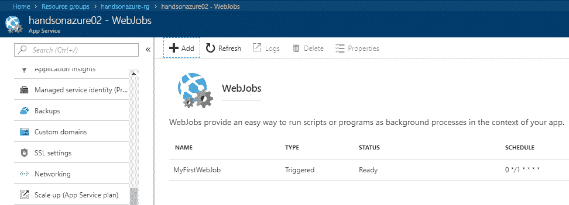
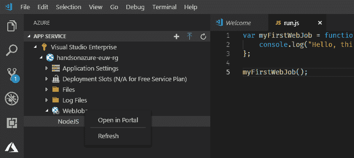

# Azure WebJobs

Azure WebJobs 是 Azure App Service 的基础功能之一。它们可以轻松运行所谓的“作业”，并且可以使用不同的时间间隔，甚至可以无限运行。它们非常灵活，并提供了一个特别的 SDK，使得用户可以高效、快速地与它们进行互动。

本章将涵盖以下主题：

+   如何创建 Azure WebJobs

+   使用不同触发类型（持续触发和定时触发）

+   使用不同的文件类型进行 WebJobs

# 技术要求

执行本章练习时，你将需要以下内容：

+   访问 Azure 订阅

+   安装了 Azure 开发工作负载的 Visual Studio 2017

# 创建 WebJobs

与 WebJobs 一起工作比与 App Services 一起工作要简单得多，因为这是一个更容易配置和使用的服务。事实上，与你一起工作有两种方式：

+   使用 Azure Portal 手动部署作业

+   使用 Visual Studio 开发并手动部署

更重要的是，你可以利用 WebJobs SDK 来准备一个由外部服务触发的应用程序。这部分内容将在本章末尾介绍，并将是本书后续章节中 Azure Functions 的优秀入门。

# 在 Azure Portal 中创建和部署 WebJobs

开始使用 WebJobs 最简单和最快捷的方式是创建一个自定义控制台应用程序，执行一个操作，然后通过 Azure Portal 部署它。通过这个练习，你将理解托管在 App Services 中的作业的主要概念。

# 在 Visual Studio 中创建应用程序

打开 Visual Studio 后，进入 文件 | 新建项目。在 新建项目 窗口中，选择 Windows 经典桌面，然后选择 Console App (.NET Framework)。为你的应用程序命名，并点击 OK：


稍等片刻，你将看到一个空项目，我们可以对其进行修改。我们将尝试以间隔（比如一分钟）触发我们的作业，因此我们需要添加代码，确保作业在给定时间内完成。

首先，让我们仅显示当前日期。在应用程序的`Main()`方法中，添加以下代码：

```
using System;

namespace MyFirstWebJob
{
    class Program
    {
        static void Main()
        {
            Console.WriteLine($"Current date and time is: {DateTime.Now:yyyy-MM-d dddd HH:mm:ss}");
        }
    }
}
```

现在保存并构建你的项目——我们很快就需要编译后的版本。

# 在 Azure Portal 中部署 WebJob

现在，当我们有了 WebJob 的代码后，我们可以尝试将其上传到云端。为此，我们需要 App Service 来托管并执行我们的代码。你可以使用现有的 Web 应用程序或创建一个新的应用程序：

1.  进入你的 App Service，找到 WebJobs 面板。（如果你没有看到它，稍微向下滚动一点——它可以在左侧的设置部分找到）：


如果你不知道如何创建 App Service 或配置它，请查看 第一章，*Azure 应用服务*，在其中我详细描述了如何使用这个 Azure 服务的过程。

1.  由于你当前没有任何作业，点击+ Add 按钮。你将看到一个新屏幕，允许你配置一个新的 WebJob：


可用的字段根据所选的 Type 字段值略有不同。如果你选择了 Triggered 作业，你将看到以下字段：

+   触发器**:** 如果你选择了 Scheduled，一个额外的字段（CRON 表达式）将会出现。另一个选项是 Manual，这确保 WebJob 只能手动触发。

+   CRON 表达式：一个有效的 CRON 表达式，定义了作业运行的时间间隔。

CRON 表达式本身是一个相当复杂的话题，在本书中我们不会深入讨论。如果你还没听说过它们，以下两个链接将对你入门非常有用：[`docs.microsoft.com/en-us/azure/azure-functions/functions-bindings-timer`](https://docs.microsoft.com/en-us/azure/azure-functions/functions-bindings-timer)。

另一种选择是将 Triggered 字段设置为 Continuous。在这种情况下，将只显示一个额外的字段：Scale。决定是否希望始终拥有单一实例的作业，或者将其扩展到所有 App Service 实例。如果你想实现单例模式并且永不扩展作业，这会非常有用。请注意，如果你使用的是 Free 或 Shared 层，它们不支持扩展，因此无法更改此选项。

1.  现在，我们将创建一个 Triggered 作业，看看 App Service 如何执行它。给它命名，并附加在前一部分中创建的控制台应用程序的可执行文件。在这里，你可以找到我的配置：


1.  我决定使用`0 */1 * * * *`的 CRON 表达式，每分钟运行我的作业。当你对配置满意时，点击 OK。片刻后，你应该能看到一个新的 WebJob 被添加到 App Service 并已部署：



你不必将单个文件部署为你的 WebJob。如果你的应用程序有多个文件（如额外的依赖项或静态文件），你可以将它们打包成 ZIP 文件并发布。部署后，它们将被解压并完全可用。

现在，当你点击一个作业时，菜单上方将会显示新的选项。我们想查看输出——为此，请点击 Logs。在新的屏幕上，你将看到此特定 App Service 中可用的作业列表。点击你刚刚添加的作业——应显示最近运行的列表，你可以进行分析。你可以点击任何可用的条目——你将能够看到运行作业的完整日志：


如你所见，作业已运行，并且显示了我们预期的内容——当前的日期和时间。恭喜你——你刚刚创建并部署了你的第一个 WebJob！

请记住，运行连续作业或触发作业需要至少使用基本的 App Service 计划。如果您使用免费或共享层，经过一段时间后，WebJob 将被取消，您需要手动重新启动它。

在接下来的部分中，您将学习如何直接从 Visual Studio 部署 WebJob。

# 从 Visual Studio 部署 WebJobs

在本章的前面部分，您已经看到如何创建一个简单的 WebJob 并从 Azure Portal 发布它。有时，您可能不想离开 IDE 并希望在其中进行部署。幸运的是，Visual Studio 与 Azure 集成，使得这种操作变得非常简单。在之前，我们开始创建一个全新的控制台应用程序，正如我们最开始所做的那样——这将是我们的起点。您可以添加任何您想要的代码——我将使用来自前面练习的代码，它会显示当前的日期和时间。一旦您对提供的功能感到满意，右键单击您的项目图标。

从上下文菜单中，点击“发布为 Azure WebJob...”：


您将看到一个新屏幕，您可以在其中为新 WebJob 选择一个名称及其运行模式。这次，我也选择了一个连续作业，因此选择了“持续运行”。当您点击“OK”时，该向导将为您的项目安装缺失的包并显示发布屏幕：


在这里，您可以创建或导入发布配置文件，这是部署 WebJob 所必需的。我们希望将作业发布到特定的位置，这就是为什么我们选择 Microsoft Azure App Service。在下一个屏幕中，您可以通过使用订阅和资源组字段来筛选并选择适当的 App Service。选择您感兴趣的选项后，点击“OK”。现在，如果您愿意，可以更改不同的属性并部署配置。我建议暂时保留默认值，然后点击“发布”。几秒钟后，您应该会在输出窗口看到一个成功消息：


现在我们可以检查我们的作业是否在 Azure 中可用。进入您的 App Service 中的 WebJobs 板块。您应该能看到您的作业与其他作业一起显示（我使用了与前一部分相同的 Web 应用，因此我有两个 WebJobs 可用）：


看起来一切正常。我相信您已经看到这种方法的一个缺点——我们只能将作业的运行模式定义为按需运行或持续运行。我们这里缺少的是按计划运行作业。在接下来的部分中，我将解决这个问题，因为我们将开始使用 WebJobs SDK，以便更好地控制我们的应用程序。

实际上，可以将连续作业修改为按间隔工作。如果你查看项目，现在应该包含一个名为 `webjob-publish-settings.json` 的文件。其模式和描述可以在这里找到 — [`schemastore.org/schemas/json/webjob-publish-settings.json`](http://schemastore.org/schemas/json/webjob-publish-settings.json)。

# 使用 WebJobs SDK 进行开发

为了简化在 Azure 中使用 WebJobs 并轻松访问其高级功能，可以使用名为 WebJobs SDK 的框架。当安装了 Azure 工作负载的 Visual Studio 中已经自带。你可以创建一个干净的控制台应用程序，或者使用之前练习中使用的应用程序 — 在这个时刻，由你决定。你还需要一个东西 — `Microsoft.Azure.WebJobs` 包，可以通过命令行或 NuGet 包管理器安装：


请注意，可以使用版本为 3.X 的包开发 .NET Core WebJob。然而，由于它们仍处于测试阶段，我不会在本书中涵盖它们。

当一切准备就绪时，我们可以继续并尝试创建一个新的应用程序。使用 WebJobs SDK 编写作业与之前的练习有所不同，但它确实带来了一些有趣的好处：

+   你可以使用与其他 Azure 服务（如队列）集成的一组可用触发器开始工作。

+   你有一个集成的日志记录框架，可以简化监视作业的过程。

+   开发 Azure Functions 的绝佳起点，在本书的后续部分将进行详细介绍。

要开始，你必须启动一个 `JobHost` 实例。它是你应用程序内运行所有作业的容器。（我们也可以称它们为 `functions`，正如文档中描述的那样。）样板代码如下：

```
using Microsoft.Azure.WebJobs;

namespace MyFirstWebJobWebJobsSDK
{
    class Program
    {
        static void Main()
        {
            var config = new JobHostConfiguration();
            var host = new JobHost(config);
            host.RunAndBlock();
        }
    }
}
```

这些三行是你的作业应用程序的实际主机，负责处理其功能。

尝试编译和运行 — 不幸的是，会出现缺少内容的异常，如下所示：


它告诉我们，缺少 Azure 存储账户连接字符串。由于我们尚未涵盖这个主题，你需要在继续之前再完成一个练习。前往 第十一章，*使用 Azure Storage - Tables, Queues, Files, and Blobs*，并阅读第一节。它将指导你创建 Azure 存储账户，并告诉你在哪里找到其连接字符串。一旦完成，将其添加到 `App.config` 中如下：

```
<?xml version="1.0" encoding="utf-8"?>
<configuration>
    <startup> 
        <supportedRuntime version="v4.0" sku=".NETFramework,Version=v4.7" />
    </startup>
  <connectionStrings>
    <add name="AzureWebJobsDashboard" connectionString="DefaultEndpointsProtocol=https;AccountName={NAME};AccountKey={KEY}" />
    <add name="AzureWebJobsStorage" connectionString="DefaultEndpointsProtocol=https;AccountName={NAME};AccountKey={KEY}" />
  </connectionStrings>
</configuration>
```

正如你所见，我已经添加了两个必需的连接字符串 — `AzureWebJobsDashboard` 和 `AzureWebJobsStorage`。现在，当你启动主机时，应该能看到类似以下的内容：


由于我们还没有添加作业，因此找不到任何作业并启用。让我们尝试添加一个并看看它是如何工作的。

如果需要，您可以通过手动设置`JobHostConfiguration`对象的`StorageConnectionString`和`DashboardConnectionString`属性来直接在代码中配置连接字符串。

# 手动调用作业

如果您想手动触发作业，可以使用`[NoAutomaticTrigger]`属性告诉主机这个特定函数不会自动触发。这里有一个我创建并命名为`Manual.cs`的示例：

```
using System.IO;
using Microsoft.Azure.WebJobs;

namespace MyFirstWebJobWebJobsSDK
{
    public class Manual
    {
        [NoAutomaticTrigger]
        public static void ManualFunction(
            TextWriter logger,
            string value)
        {
            logger.WriteLine($"Received message: {value}");
        }
    }
}
```

现在让我们看看如果您从程序的主要点调用它会发生什么：

```
using Microsoft.Azure.WebJobs;

namespace MyFirstWebJobWebJobsSDK
{
    class Program
    {
        static void Main()
        {
            var config = new JobHostConfiguration();
            var host = new JobHost(config);

            host.Call(typeof(Manual).GetMethod("ManualFunction"), new { value = "Hello world!" });

            host.RunAndBlock();
        }
    }
}
```

您应该能够看到以下结果：


# WebJobs 中的自动触发器

默认情况下，WebJobs SDK 提供了有限的触发器集。目前，它仅支持以下触发器：

+   Blob 存储

+   队列存储

+   表存储

所有这些都与 Azure 存储连接，并将在描述 Azure Functions 的章节中进行介绍。幸运的是，我们可以安装额外的 NuGet 包来扩展我们主机的功能。现在，添加`Microsoft.Azure.WebJobs.Extensions`包，以便我们可以使用`TimerTrigger`。当您拥有它时，在`JobHostConfiguration`对象上调用`UseTimers()`方法：

```
using Microsoft.Azure.WebJobs;

namespace MyFirstWebJobWebJobsSDK
{
    class Program
    {
        static void Main()
        {
            var config = new JobHostConfiguration();
            config.UseTimers();

            var host = new JobHost(config);

            host.Call(typeof(Manual).GetMethod("ManualFunction"), new { value = "Hello world!" });

            host.RunAndBlock();
        }
    }
}
```

现在我们可以创建一个新的`Timer.cs`函数，它将按计划触发：

```
using System;
using System.IO;
using Microsoft.Azure.WebJobs;

namespace MyFirstWebJobWebJobsSDK
{
    public class Timer
    {
        public static void TimerFunction(
            [TimerTrigger("* */1 * * * *")] TimerInfo timer,
            TextWriter logger)
        {
            logger.WriteLine($"Message triggered at {DateTime.Now:yyyy-MM-dd HH:mm:ss}");
        }
    }
}
```

当您启动项目时，`TimerFunction`应该被发现并调用：


您可以安装其他包以利用其他绑定，例如`Http`，`Notification Hub`或`SendGrid`。搜索具有`Microsoft.Azure.WebJobs.Extensions`前缀的包。

# 发布作业

发布一个使用 WebJobs SDK 编写的作业与之前的练习相同。右键单击项目，然后单击发布为 Azure WebJob。您将再次被引导完成发布作业包的过程。在结束时，您应该能够在您的 App Service 中看到一个可用的作业：


如果您发现您的作业运行时有问题，请确保所需的连接字符串在 App Service 中可用。为此，请转到“应用程序设置”选项卡，并验证“连接字符串”部分的内容。如果有遗漏的内容，请手动添加一个名称及其值，并将其类型设置为“自定义”。

# Azure WebJobs 的限制

由于 Azure WebJobs 基于 Azure App Services，并且没有办法单独托管它们（您可以使用额外的 App Service 计划来支持它们，但这通常意味着您为服务支付双倍价格），您可能会发现它们的一些限制在您的项目中相当严重。在使用此特定服务时，请记住以下事项：

+   当共同托管 Web App 和 WebJobs 时，一个可能会影响另一个的性能。换句话说，如果您的 WebJob 开始利用过多的 CPU/内存，可能会影响由相同 App Service 计划支持的 Web 应用程序的性能。

+   Azure WebJobs 提供了一组有限的绑定目录——它们目前比 Azure Functions 不那么受欢迎，也没有那么动态地发展。

+   无法使用 Azure WebJobs 的消耗模型；因此，即使它们 90%的时间什么也不做，您也必须支付全价。

# 使用不同的文件类型进行 WebJobs

在处理 WebJobs 时，您不限于使用 EXE 文件。目前，此服务支持以下应用程序：

+   Windows 可执行文件（`.exe`，`.bat`和`.cmd`）

+   Powershell（`.ps1`）

+   Bash（`.sh`）

+   Python（`.py`）

+   PHP（`.php`）

+   Node.js（`.js`）

+   Java（`.jar`）

正如您所看到的，前面的列表与 App Services 中支持的语言相似。现在您应该明白，WebJobs 实际上是 Azure 中 Web Apps 的一个组成部分。让我们尝试一些实际操作——我们将部署一个简单的 Node.js 应用程序，将其发布到 Azure 作为 WebJob。

# 创建并部署 Node.js 应用程序作为 WebJob

JavaScript 是世界上最流行的编程语言之一。Azure 的优势在于它不会阻止您使用其他非微软技术。在开始之前，您必须记住一条重要信息。

运行时执行 WebJobs 的方式要求您遵循特定的约定。在搜索作业时，运行时将搜索名为`run.{job_type}`的文件，其中`job_type`是表示特定编程语言的扩展名（例如`.js`和`.py`）。如果失败，它将尝试查找具有特定扩展名的任何文件。如果这也失败，作业将被跳过。

这是我第一个用 JavaScript 编写的 WebJob 的非常简单的代码：

```
var myFirstWebJob = function() {
 console.log("Hello, this is my first WebJob in Node.js!");
};

myFirstWebJob();
```

您可以使用支持 JavaScript 的任何类型的应用程序来创建它（例如，记事本或 Visual Studio Code）。将文件命名为`run.js`并按照之前描述的方式在 Azure 门户中发布。在这里您可以找到结果：


正如您所看到的，它是自动发现的——不需要任何额外的配置就可以使用 Node.js 运行时运行它。我强烈建议您花点时间，使用其他文件类型测试一下这个功能。

请记住，如果您的应用程序需要额外的文件（例如 Node.js 作业的额外包），您必须将它们打包为 ZIP 包然后部署。

# 从 Visual Studio Code 部署 Node.js Azure WebJob

不幸的是，目前无法直接从 Visual Studio Code 部署 Azure WebJob。但是，如果安装了**Azure App Service**扩展，您可以在 IDE 内快速导航到门户并手动上传代码。

为此，你需要右键点击你的 Azure App Service 中的 WebJobs 部分，并选择“在门户中打开”：



这样做将直接引导你进入 Azure App Service 的实例，在这里你可以通过点击“+ 添加”按钮来添加新的 WebJob：


# 总结

如你所见，Azure WebJobs 是 App Services 的一个非常有用和实用的功能，它让你能够快速开发持续运行或按计划触发的作业。当你拥有一个正常运行的 web 应用时，WebJobs 会展现出其优势，能够托管并异步执行多种不同的操作（例如生成报告或读取队列，之后将数据填充到应用的数据库中）。由于支持多种编程语言，你不必局限于某一特定平台。最后但同样重要的是，WebJobs 是了解 Azure Functions 的一个绝佳入门，Azure Functions 是 Azure 中最受欢迎的服务之一，进一步扩展了 WebJobs 的现有功能。在第三章《将 Web 应用程序作为容器部署》中，你将学习如何将 Web 应用部署为容器，这在托管 web 应用时，进一步扩展了 App Service 的功能。

# 问题

1.  你可以在 Free 或 Shared 层运行 WebJobs 吗？

1.  WebJobs 当前支持哪些运行模式？

1.  你可以使用 WebJobs 运行 Java 应用程序吗？

1.  如何确保运行时能够找到你的作业启动文件？

1.  你能发布一个包含多个文件的 WebJob 吗？如果可以，你该如何操作？

1.  如何确保 WebJob 不会被扩展到多个实例？

1.  WebJob 可以访问托管它的 App Service 的应用设置吗？

# 进一步阅读

+   [`docs.microsoft.com/en-us/azure/app-service/webjobs-sdk-how-to`](https://docs.microsoft.com/en-us/azure/app-service/webjobs-sdk-how-to)
