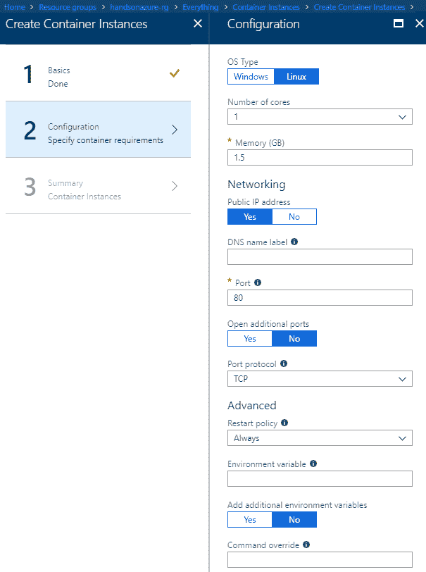

# 第三章：将 Web 应用程序作为容器部署

容器是 IT 行业中最热门的话题之一。它们允许将应用程序部署在“一个盒子”中，这样我们就不必担心它运行在哪个操作系统上或所需的已安装服务。虽然容器有时因对底层资源的冗余抽象而受到批评，但它们为开发和托管应用程序提供了一个稳定的环境。

本章将涉及以下主题：

+   理解容器及其最佳使用场景

+   **Azure Kubernetes 服务**（**AKS**）和使用 PaaS 组件托管 Kubernetes 环境

+   用于可扩展应用程序的 Web 应用容器

+   Azure 容器实例及如何在不管理服务器的情况下管理容器

# 技术要求

要开始在 Azure 中使用容器，您需要以下内容：

+   对 Docker 概念的基本理解 ([`docs.docker.com/get-started/`](https://docs.docker.com/get-started/))

+   Docker 开发环境（取决于您使用的操作系统——[`docs.docker.com/docker-for-mac/`](https://docs.docker.com/docker-for-mac/)、[`docs.docker.com/docker-for-windows/`](https://docs.docker.com/docker-for-windows/)、或 [`docs.docker.com/install/`](https://docs.docker.com/install/))

+   一个 Docker Hub 账户

+   Azure CLI ([`docs.microsoft.com/en-us/cli/azure/install-azure-cli?view=azure-cli-latest`](https://docs.microsoft.com/en-us/cli/azure/install-azure-cli?view=azure-cli-latest))

+   对 Kubernetes 的基本理解 ([`kubernetes.io/docs/home/`](https://kubernetes.io/docs/home/))

+   Kubernetes CLI ([`kubernetes.io/docs/tasks/tools/install-kubectl/`](https://kubernetes.io/docs/tasks/tools/install-kubectl/))

# 使用 AKS

AKS 通过消除需要自己维护或升级资源的步骤，简化了容器化应用程序的部署和管理过程。它是一个托管在 Azure 中的 Kubernetes 服务，提供许多有用的功能，如集成日志记录和监控、身份和安全管理以及虚拟网络集成。在本节中，我们将创建一个托管在 AKS 集群中的简单应用程序，并对其进行扩展和更新。

# 准备应用程序

让我们从 Docker 文档中提供的一个教程应用程序开始：

1.  首先，我们需要 `Dockerfile`，它定义了我们的容器环境应如何构建。它包含诸如 `FROM`（定义将用于容器的镜像）、`WORKDIR`（应用程序的工作目录）、`ADD`（将目录添加到容器中）、`RUN`（运行命令）、`EXPOSE`（暴露容器中的指定端口）、`ENV`（添加环境变量）和 `CMD`（声明入口点）等关键字：

```
FROM python:2.7-slim
WORKDIR /app
ADD . /app
RUN pip install --trusted-host pypi.python.org -r requirements.txt
EXPOSE 80
ENV NAME HandsOnAzure
CMD ["python", "app.py"]
```

1.  我们还需要另外两个文件：

    +   `requirements.txt`：这个文件定义了我们的应用程序需要下载的外部依赖

    +   `app.py`：应用程序的主要文件

如果您熟悉 Docker，您可以准备自己的`Dockerfile`和应用程序；在本节中讲解的内容很基础，您无需完全跟随。

1.  在这里，您可以找到`requirements.txt`的内容：

```
Flask
Redis
```

1.  当然，还有`app.py`，这是我们要运行的脚本。它是一个简单的 Python 应用，使用 Flask 托管一个 Web 应用，并定义了默认路由来暴露一个 HTML 网页。注意，它访问了 Dockerfile 中定义的`HandsOnAzure`环境变量：

```
from flask import Flask
from redis import Redis, RedisError
import os
import socket

# Connect to Redis
redis = Redis(host="redis", db=0, socket_connect_timeout=2, socket_timeout=2)

app = Flask(__name__)

@app.route("/")
def hello():
    try:
        visits = redis.incr("counter")
    except RedisError:
        visits = "<i>cannot connect to Redis, counter disabled</i>"

    html = "<h3>Hello {name}!</h3>" \
           "<b>Hostname:</b> {hostname}<br/>" \
           "<b>Visits:</b> {visits}"
    return html.format(name=os.getenv("NAME", "HandsOnAzure"), hostname=socket.gethostname(), visits=visits)

if __name__ == "__main__":
    app.run(host='0.0.0.0', port=80)
```

1.  现在，您需要再做两件事——构建镜像并检查它是否正常工作。要构建镜像，您需要以下命令：

```
docker build -t {IMAGE_NAME} .
```

1.  在 Docker 获取所有包并构建镜像后，您可以运行它。我使用了`4000`端口，但您可以选择适合您的端口：

```
docker run -p 4000:80 {IMAGE_NAME}
```

1.  如果一切正确，您应该能够看到一个正在运行的应用：


在下一节中，我们将创建一个容器注册表和 Kubernetes 集群来托管一个应用。

# 容器注册表和 Kubernetes 集群

要在 Azure 中使用 Docker 镜像，我们必须将它放入容器注册表中。为此，我们可以使用**Azure 容器注册表**（**ACR**），它是一个用于托管容器镜像的私有注册表。首先，进入 Azure 门户，点击+ 创建资源，搜索`Container Registry`。点击创建后，您将看到一个包含多个服务配置字段的熟悉屏幕。现在以下内容需要澄清：

+   管理员用户：如果您想通过注册表名称和管理员访问密钥登录到您的注册表，您可以启用此功能。默认情况下，它是禁用的。

+   SKU：这定义了注册表的整体性能和可用功能。首先，Basic 层应该足够用了。

以下截图显示了我当前的配置：


如果您对配置满意，可以点击确认。现在我们将推送一个带有应用的镜像到注册表，以便在 Azure 中使用它。

# 将 Docker 镜像推送到 Azure 容器注册表

要将镜像推送到 Azure 容器注册表，我们需要知道镜像的准确名称：

1.  要列出可用的镜像，请使用以下命令：

```
docker images
```

1.  执行该命令的结果是一个列出所有 Docker 可用仓库的列表：


1.  我想将我之前创建的`handsonazurehello`推送到 Azure。为此，我首先需要使用以下命令标记镜像：

```
docker tag handsonazurehello {ACR_LOGIN_SERVER}/handsonazurehello:v1
```

标记的原因是为了为我的容器设置一个版本，并为它赋予推送到私有注册表所需的适当名称。

1.  您可以在概览面板中找到登录服务器：


1.  现在，您可以尝试使用以下命令推送一个镜像：

```
docker push handsonazureregistry.azurecr.io/handsonazurehello:v1
```

1.  当然，您必须推送您的镜像名称和注册表服务器登录。当您执行上面的命令时，您将看到以下结果：

```
$ docker push handsonazureregistry.azurecr.io/handsonazurehello:v1
The push refers to repository [handsonazureregistry.azurecr.io/handsonazurehello]
bbdbf9d56e79: Preparing
128193523190: Preparing
f78e6f8eec4b: Preparing
20f93bdcee9c: Preparing
21b24882d499: Preparing
db9dabc5cfee: Waiting
d626a8ad97a1: Waiting
unauthorized: authentication required
```

1.  仍然有问题——我们正在将容器推送到正确的注册表，但我们尚未进行身份验证。要访问 Azure 容器注册表，我们必须使用 Azure CLI。请使用两个命令：

```
az login
az acr login --name {REGISTRY_NAME}
```

1.  第一个命令用于在 Azure 中进行身份验证，第二个命令将让你与自己的容器注册表实例进行交互。成功身份验证后，你可以重试推送镜像——这次一切应该顺利运行：

```
$ docker push handsonazureregistry.azurecr.io/handsonazurehello:v1
The push refers to repository [handsonazureregistry.azurecr.io/handsonazurehello]
bbdbf9d56e79: Pushed
128193523190: Pushed
f78e6f8eec4b: Pushed
20f93bdcee9c: Pushed
21b24882d499: Pushed
db9dabc5cfee: Pushed
d626a8ad97a1: Pushed
v1: digest: sha256:2e689f437e1b31086b5d4493c8b4ef93c92640ad576f045062c81048d8988aa6 size: 1787
```

1.  你可以在门户中验证它是否可用：


接下来我们需要的是一个 Kubernetes 集群——这就是我们使用 AKS 来配置托管 Kubernetes 服务的原因。

# 使用 AKS 创建 Kubernetes 集群

要创建 Kubernetes 服务，请执行以下步骤：

1.  *前往*门户。

1.  点击 + 创建资源 按钮并搜索 `AKS`。

1.  当你点击 创建时，你应该看到以下屏幕：


如你所见，这里有很多不同的选项和字段。其中一些应该是显而易见的。最初，我建议对大多数字段使用默认值，比如 Kubernetes 版本或 Service principal，因为这些字段只有在你对应用程序有特定需求时才会重要。

要了解更多关于 Azure AD 中应用程序和服务主体对象的信息，可以阅读文档中的这篇简短文章：[`docs.microsoft.com/en-us/azure/active-directory/develop/active-directory-application-objects`](https://docs.microsoft.com/en-us/azure/active-directory/develop/active-directory-application-objects)。

你可以进入不同的标签页，如 Networking 或 Monitoring，查看是否需要更改某些设置——然而，当前的设置应该适用于第一个 AKS 集群。

审核完所有字段后，点击 Review + create 按钮。以下截图展示了我的配置：


当你点击 创建时，你需要稍等片刻，直到部署完成。

创建集群可能需要一些时间，尤其是在你选择同时部署多个机器时。耐心等待！

# 在 AKS 中运行、扩展和更新应用程序

为了在 Azure 的 AKS 中运行和部署应用程序，我们需要 Kubernetes 清单文件，该文件将定义如何部署镜像。然而，在执行这部分操作之前，我们必须先在本地配置 Kubernetes，以便它能够与我们的集群连接。为此，请执行以下步骤：

1.  运行以下命令：

```
kubectl get nodes
```

1.  最初，它会返回以下结果：

```
Unable to connect to the server: dial tcp [::1]:8080: connectex: No connection could be made because the target machine actively refused it.
```

1.  这意味着我们尚未将`kubectl`与我们刚刚创建的 AKS 集群进行配置。为此，请使用以下 Azure CLI 命令：

```
az aks get-credentials --resource-group {RESSOURCE_GROUP} --name {AKS_CLUSTER_NAME}
```

运行它应该会将集群合并为你本地配置中的当前上下文。现在，当你验证连接时，一切应该已经设置好并准备就绪。我们可以回到清单文件——初始版本可以在仓库中的*Chapter03*找到。一般来说，这是一个简单的 YML 文件，用于定义和配置服务及部署。

1.  将文件放入你的应用程序目录中，并使用以下命令进行部署：

```
kubectl apply -f handsonazure.yml
```

1.  稍等片刻，你应该看到进程的状态：

```
$ kubectl apply -f handsonazure.yml
deployment "handsonazurehello-back" created
service "handsonazurehello-back" created
deployment "handsonazurehello" configured
service "handsonazurehello" unchanged
```

1.  现在，我们需要一个命令来获取服务的外部 IP：

```
$ kubectl get service handsonazurehello --watch
NAME TYPE CLUSTER-IP EXTERNAL-IP PORT(S) AGE
handsonazurehello LoadBalancer 10.0.223.94 40.118.7.118 80:30910/TCP 4m
```

1.  最初，你可以看到 `EXTERNAL-IP` 字段为 pending——它应该在一秒钟内改变。现在你可以验证应用的安装情况：


1.  还有一种方法可以获取整个集群的状态。尝试运行以下命令：

```
az aks browse --resource-group {RESOURCE_GROUP} --name {AKS_CLUSTER_NAME}
```

1.  稍等片刻后，你应该能看到整个 Kubernetes 仪表板可以在本地使用。请仔细阅读所有信息，因为它在诊断 AKS 可能出现的问题时非常有帮助：


# 解决身份验证问题

有时 AKS 无法访问 Azure 容器注册表，并且需要创建服务主体，这可以在 pod 部署中使用。要创建它，你需要执行以下脚本：

```
$ az acr show --name {REGISTRY_NAME} --query loginServer --output tsv
{YOUR_REGISTRY_NAME}

$ az acr show --name handsonazureregistry --query id --output tsv
/subscriptions/94f33c43-60b5-4042-ae74-51777f69f99a/resourceGroups/handsonazure-rg/providers/Microsoft.ContainerRegistry/registries/handsonazureregistry
{REGISTRY_ID}

$ az ad sp create-for-rbac --name acr-service-principal --role Reader --scopes {REGISTRY_ID} --query password --output tsv
{PASSWORD}

$ az ad sp show --id http://acr-service-principal --query appId --output tsv
{CLIENT_ID}

$ kubectl create secret docker-registry acr-auth --docker-server {YOUR_REGISTRY_NAME} --docker-username {CLIENT_ID} --docker-password {PASSWORD} --docker-email {DOCKER_ACCOUNT_EMAIL}
```

完整的脚本也可以在本章的源代码中找到。一旦密钥创建完成，你可以修改清单文件并添加`imagePullSecrets`行：

```
containers:
 - name: handsonazurehello
 image: handsonazureregistry.azurecr.io/handsonazurehello:v1
 ports:
 - containerPort: 80
 resources:
 requests:
 cpu: 250m
 limits:
 cpu: 500m
 env:
 - name: REDIS
 value: "handsonazurehello-back"
 imagePullSecrets:
 - name: acr-auth
```

# 扩容集群

在 AKS 中扩容是最简单的操作之一。你只需要进入 Azure 门户，找到你的 AKS 实例，然后点击 Scaleblade：


一旦在那里，你可以根据需求调整集群容量。

确保你有足够数量的节点可供你的应用使用——这些信息可以在 Kubernetes 仪表板中找到。如果机器不足，某些镜像可能无法部署。

# 更新应用程序

在 AKS 中更新应用程序需要做两件事：

+   将新镜像发布到 Azure 容器注册表

+   将新的镜像设置为 AKS 中的当前镜像

当你对应用进行更改时，需要使用两个命令将其更新到注册表中。首先，将其版本更改为新的版本：

```
docker tag handsonazurehello {ACR_LOGIN_SERVER}/handsonazurehello:v2
```

现在你需要做的是将这个版本推送到云端以便使用：

```
docker push
{ACR_LOGIN_SERVER}/handsonazurehello:v2
```

最后一步，告诉 Kubernetes 更新镜像：

```
kubectl set image deployment handsonazurehello handsonazurehello=
{ACR_LOGIN_SERVER}/handsonazurehello:v2
```

为了确保应用在更新过程中完全正常工作，你需要将其扩展到多个 pod。你可以使用以下命令来实现：

`**kubectl scale --replicas=3 deployment/{YOUR_APPLICATION}**`

# Azure 容器实例

虽然 AKS 是一个完整的编排解决方案，但有时你可能更倾向于使用一个轻量级服务，它提供与运行容器相关的最关键功能。这些功能包括不需要配置和管理虚拟机、安全性以及集成的公共 IP 连接性。如果你想运行一个容器化的简单应用程序，比如 WebJob 或网站，**Azure 容器实例**（**ACI**）可以满足你的需求。

# 创建并部署一个应用程序和容器

我们将通过创建一个应用程序来开始我们的 ACI 之旅，这个应用程序将托管在容器中。在上一节中，我们使用了一个简单的 Python 脚本——这次我们将尝试使用 Node.js。

和往常一样，你可以在本章的适当源文件文件夹中找到源文件。

我们需要的第一件事是 `Dockerfile`。如你所记，它包含了如何运行应用程序的指令。以下是本次练习的示例：

```
FROM node:8.9.3-alpine
RUN mkdir -p /bin/
COPY ./app/ /bin/
WORKDIR /bin
RUN npm install
CMD node index.js
```

如果你仔细阅读，你会发现它其实非常简单——它的步骤如下：

1.  安装特定的 Node.js 版本（这次是 **alpine**，它是一个为容器设计的小型发行版）

1.  创建一个新的工作目录

1.  将文件复制到容器中

1.  使用 `npm install` 命令安装所有依赖项

1.  通过提供其起始点来启动应用程序

现在，我们可以使用以下命令创建一个容器：

```
docker build ./ -t {CONTAINER_NAME}
```

稍等片刻，你应该能创建并添加一个新的镜像。如果遇到问题，请确保你在正确的目录中，并且没有重复命名。

记住，你可以随时检查当前可用的镜像及其名称。为此，你可以使用以下 Docker 命令：`docker images`*.* 

现在我们可以验证应用程序的工作情况。要启动它，请使用以下命令：

```
docker run -d -p 8080:80 {CONTAINER_NAME}
```

你可以访问 `localhost:8080`，检查应用程序是否在运行。如果一切配置正确，你应该能在屏幕中央看到 `Welcome to Azure Container Instances!` 消息。

有时，你在使用某些 Web 应用程序并将其本地运行时，可能会遇到问题——出于某种原因，你无法通过指定的端口连接它们。在这种情况下，重新配置应用程序并使用不同的端口通常是一个好主意。

现在我们将把镜像推送到 Azure，以便以后在 ACI 中使用。

# 将镜像推送到 Azure 容器注册中心

你可以在本章的 *容器注册中心和 Kubernetes 集群* 部分找到如何使用 ACI 的完整说明。现在，操作与使用 AKS 时相同——我们需要执行以下操作：

1.  登录到 ACR

1.  为镜像打标签

1.  将其推送到 ACR

你将需要以下三个命令：

```
az acr login --name {ACR_NAME}
docker tag {CONTAINER_NAME} {ACR_LOGIN_SERVER}/{CONTAINER_NAME}:v1
docker push {ACR_LOGIN_SERVER}/{CONTAINER_NAME}:v1

```

推送成功后，我们可以将应用程序部署到 ACI。

# 将应用程序部署到 ACI

我们需要做的第一件事是创建一个 ACI 实例。像往常一样，在 Azure Portal 中点击 + 创建资源，并搜索 `Container Instances`。

您应该会看到类似下面的向导：


这里需要注意的是，在选择容器镜像类型时，必须选择**Private**。选择此选项后，将显示额外的字段，必须填写这些字段。在创建 ACI 时，您需要提供容器镜像。这就是您在将镜像推送到容器注册表时创建的 Docker 标签。在我的例子中是`handsonazureregistry.azurecr.io/handsonazure-aci`。镜像注册表登录服务器就是注册表的登录服务器（您可以在 ACR 的“概述”面板中找到它）。我们还需要另外两样东西——注册表用户名和密码。用户名就是注册表名称，密码可以使用以下命令获取：

```
az acr credential show --name {REGISTRY_NAME}--query "passwords[0].value"
```

要获取密码，必须启用管理员凭据。可以使用以下命令从 CMD 启用管理员凭据：

`**az acr update -n {REGISTRY_NAME} --admin-enabled true**`

现在我们可以进入“配置”部分：



这次，所有这些字段应该都是不言自明的，事实上，在本次操作中，我保留了默认值。您可以根据需要更改它们（例如操作系统或可用内存）。设置完成后，您可以点击**OK**并发布您的容器实例。

如果您在门户中部署容器时遇到问题，您可以始终使用 Azure CLI。下面是与我们在 Azure 门户中做的相同操作的完整命令：

`**az container create --resource-group {RG_NAME}--name {ACI_NAME} --image {ACR_LOGIN_SERVER}/{CONTAINER_NAME}:v1 --cpu 1 --memory 1 --registry-login-server {ACR_LOGIN_SERVER} --registry-username {REGISTRY_NAME} --registry-password {REGISTRY_PASSWORD} --dns-name-label {DNS_LABEL} --ports 80**`

部署完成后，进入 ACI 实例并查看“概述”面板。复制`FQDN`字段的值并将其粘贴到浏览器中。您应该能够看到与本地看到的完全相同的屏幕：


就是这样！如您所见，使用 Azure 容器服务是一种非常快速的方式，通过最少的功能集将应用程序部署到容器中。在接下来的部分，我们将重点介绍在应用服务中利用容器。

# 容器化 Web 应用

您不必使用 AKS 或 ACI 来利用 Azure 中容器的功能——目前还有一种功能可以用来部署用不受支持的语言（如 Go）编写的 Web 应用。**容器化 Web 应用**是**应用服务**的扩展，它使用 Linux 作为底层操作系统，配合 Docker 来运行构建在当前 Azure 不支持的技术栈上的服务。

# 创建一个托管在容器中的 Web 应用

要创建一个运行 Docker 实例的应用服务，你必须遵循与第一章 *Azure 应用服务*相同的步骤，回顾我们在讨论使用 Azure 门户创建 Web 应用时所做的内容。

当你进入 Web 应用创建界面时，请查看操作系统字段：


如你所见，Docker 选项是可用的。点击它后，还需要设置两个字段：

+   应用服务计划/位置：这与“传统”的应用服务相同，但有一个重要的说明。当你选择 Docker 时，所有可供选择的应用服务计划将由 Linux 操作系统提供支持。这将影响定价和功能可用性。

+   配置容器：选择此选项后，你将看到另一个屏幕，显示根据容器设置的多个不同选项。目前，我们有三个不同的选择：单容器、Docker Compose 和 Kubernetes。后两个选项目前处于预览阶段，但我们也会涵盖它们。现在，请选择单容器并使用快速入门选项。

这里是我的配置：


现在，点击创建后，Azure 将在几秒钟内完成新资源的配置。创建完成后，进入新创建的应用服务，并查看左侧的界面。你会发现其中一些已经被禁用：


如你所见，使用 Web 应用容器（Web App for Containers）不允许我们使用诸如 WebJobs 或应用程序洞察（Application Insights）*等功能*。然而，我们仍然能够扩展应用程序、附加自定义域名或设置备份。请注意，另一个界面——容器设置是可用的。当你点击它时，你将看到与应用服务创建时相同的界面：


让我们看看当我们更改容器的镜像时会发生什么。将镜像和可选标签（例如“image:tag”）字段更改为`appsvc/dotnetcore`，然后点击保存。重新启动应用程序后，你应该会看到可见日志中的变化：


此外，当你浏览你的 Web 应用时，你应该会看到一个成功的消息：


现在我们将尝试部署我们自己的代码并查看它是否能正常工作。

# 部署自定义应用程序

在本节中，我们将重点介绍如何在 Web 应用中创建并部署自定义应用程序到我们的 Docker 容器。为了本次练习的目的，我们将重用本章前部分讨论 ACI 时使用的容器镜像。

如果你想准备一个全新的应用程序，请按照*创建和部署应用程序和容器*部分中定义的步骤操作，我们在那里创建了一个 Docker 镜像并将其推送到 Azure 容器注册表。

当你再次进入容器设置面板时，你可以将镜像来源更改为三种不同的选项：

+   Azure 容器注册表：它允许你选择推送到自己实例的 ACR 中的镜像

+   Docker Hub：提供对该存储库中所有镜像的访问

+   私有注册表：你还可以定义一个私有存储库来部署你的镜像

请注意，如果你使用 ACR，其他两个来源也会指向 ACR，因为它充当你自己私有的 Docker Hub，存储着你的镜像。

选择 Azure 容器注册表标签，并根据门户提示填写所有必填字段：


片刻之后，新的镜像应该会重新加载并正常工作。如果你浏览到应用的 URL，应该能够看到更新的内容：


正如你所看到的，我在使用 ACI 时使用的同一个容器镜像，在 Web 应用容器中也是完全可用的。

# 总结

正如你所看到的，在 Azure 中使用容器时，你可以专注于应用的交付和形态，而不是配置或维护。当然，可用的功能不仅限于本章所涵盖的内容——你还可以利用持续部署、网络或数据卷等功能。可用的功能完全取决于你选择的服务——Azure 容器实例和 Web 应用容器是非常简洁的云组件，专注于运行应用，而 AKS 提供了更多高级功能。尽管如此，容器仍然是近几个月最受欢迎的话题，毫无疑问，构建和发展这一技能将有助于你未来的项目。

在下一章中，你将了解另一个服务，它允许你运行容器化应用并在 Azure 云中从微服务架构中获得更多的功能——Azure Service Fabric。

# 问题

1.  什么是 Azure 容器注册表？

1.  什么是 AKS 中的管理员登录功能？

1.  在创建应用服务时，你需要选择哪种操作系统才能运行容器？

1.  你可以在 Web 应用容器中使用来自公共注册表的镜像吗？

1.  你可以在门户中扩展 AKS 吗？

1.  在更新应用时，你如何降低 AKS 中应用的停机时间？

1.  如果 AKS 无法验证你实例的 Azure 容器注册表身份，你需要做什么？

# 深入阅读

+   [`docs.microsoft.com/zh-cn/azure/container-instances/container-instances-orchestrator-relationship`](https://docs.microsoft.com/en-us/azure/container-instances/container-instances-orchestrator-relationship)

+   [`docs.microsoft.com/zh-cn/azure/aks/networking-overview`](https://docs.microsoft.com/en-us/azure/aks/networking-overview)

+   [`docs.microsoft.com/zh-cn/azure/monitoring/monitoring-container-health?toc=%2Fzh-cn%2Fazure%2Faks%2FTOC.json&bc=%2Fzh-cn%2Fazure%2Fbread%2Ftoc.json`](https://docs.microsoft.com/zh-cn/azure/monitoring/monitoring-container-health?toc=%2Fzh-cn%2Fazure%2Faks%2FTOC.json&bc=%2Fzh-cn%2Fazure%2Fbread%2Ftoc.json)
