# 使用 Service Fabric 开发分布式应用和微服务

**Service Fabric** (**SF**) 是一个分布式应用平台，它大大简化了可扩展且可靠的应用开发与部署。它是开发云原生应用的最佳解决方案之一，让用户可以专注于开发，而非维护基础设施和组件之间的连接。它是一个下一代平台，由微软积极开发，最近受到了广泛关注。

本章将涵盖以下主题：

+   微服务架构以及如何在云中使用 SF

+   SF 的基本概念，如服务或角色

+   在 SF 中的服务间通信

+   在 SF 中管理集群并确保其安全

+   监控 SF 中的服务及如何诊断它们

# 技术要求

为了完成本章的练习，你将需要以下内容：

+   带有**Azure 开发**、**ASP.NET**和**Web 开发**工作负载的 Visual Studio 2017

+   Microsoft Azure SF SDK ([`www.microsoft.com/web/handlers/webpi.ashx?command=getinstallerredirect&appid=MicrosoftAzure-ServiceFabric-CoreSDK`](http://www.microsoft.com/web/handlers/webpi.ashx?command=getinstallerredirect&appid=MicrosoftAzure-ServiceFabric-CoreSDK))

+   Node.js ([`nodejs.org/en/`](https://nodejs.org/en/))

# 理解微服务

你可能听说过一种叫做**微服务**的架构。这里没有一个单一的定义可以引用，因此本章的主要目的是更好地理解我们可以称之为微服务的内容，以及如何以这种方式开发应用程序。这与 SF 直接相关，SF 是 Azure 中最大和最先进的服务之一。如果你打算构建一个模块化、松耦合且现代的应用程序，这个云组件专为你设计。

# 单体应用与微服务

我们将通过将微服务与传统应用进行对比来开始我们的微服务之旅，传统应用由多个层次构成，每个层次服务不同的目的：

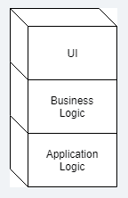

如你所见，我们将这些服务定义为单体应用，其中整个代码库作为一个应用程序部署。这个应用程序有多个职责：

+   提供 UI 服务

+   运行业务逻辑

+   运行额外进程（如作业）

我们也可以从不同的角度来看待它——作为一个处理不同领域功能的单一模块。让我们考虑一个电子商店，其中有以下内容：

+   支付逻辑

+   购物车逻辑

+   订单处理逻辑

+   折扣逻辑

+   许多，许多其他不同领域

现在问题来了——我们的应用程序应该在一个实例中运行这些逻辑，还是应该将其拆分成多个独立的模块，这些模块具有不同的生命周期、不同的运行方式，并且可以单独开发？也许我们还希望根据当前的工作负载或业务需求分别扩展它们。选择总是取决于你的应用程序将面临的需求。然而，如果你希望尝试微服务，SF 是最好的选择，尤其是当你打算使用云原生组件时。

# 微服务方法

你可能会想，微服务架构是否是你愿意选择并使用的架构。在本节中，我将重点介绍这种方法所提供的特定功能，以及如何在编写应用程序时处理这些功能，最终使用 SF。

# 使用不同的语言和框架

有时候，我们希望通过使用不同的编程语言或工具来解决我们的应用程序所面临的不同问题。也许主要用 C#或 Java 编写应用程序，并使用专用语言交付更复杂的功能，如领域特定的计算。也许我们有多个团队在开发不同的特性，每个团队都希望使用不同的框架。

也许整个工作是如此全球化分布，以至于将其拆分为多个较小的包（最终变成服务）是前进的方向。所有这些问题都可以通过使用一个单一应用程序来解决，但在更大规模下，这种方法可能会变得繁琐且不足够。通过利用 Azure 中的 SF 功能，我们可以将多个应用程序（每个应用程序包含多个服务）组织成一个单一平台，从一个地方进行管理并单独部署，从而节省时间和成本。

# 单独扩展和更新服务

我们刚才讨论了如何单独部署每个服务。得益于这种方法，你不必一次性推送整个代码库。我相信你至少有过一个项目，它是如此庞大，以至于将整个项目交付到生产环境的过程难以自动化，并且需要非常长的时间才能完成。在这种情况下，将项目拆分成更小的模块也是有益的。比如说，在上个月，只有一个团队交付了一个新特性；你不必重新进行所有平台测试。更重要的是，如果部署后系统中某个未修改的部分出现问题，你也不需要另一个团队来调查问题。这带来了以下优势：

+   交付商业价值的过程更短、更简单，因此更不容易出错

+   你可以专注于某个特定模块，并且其中的更改通常不会影响其他模块

微服务架构还有一个有趣的特点——你可以单独扩展每个组件。这意味着，如果例如有一个负责处理支付的模块，而你刚刚在网上商店进行了一次大幅度的折扣促销，导致订单量急剧增长，你不必担心订单会压垮它。在这种情况下，你可以做的是简单地扩展该模块，这样你就可以并行处理每个订单，使用尽可能多的实例来满足当前需求。本章稍后会介绍如何根据应用程序的实际结构使用不同的方法来实现这种可扩展性。下面的图表描述了微服务和单体应用程序扩展的区别——前者使你能够单独扩展每个服务，而后者则必须作为一个整体进行扩展：

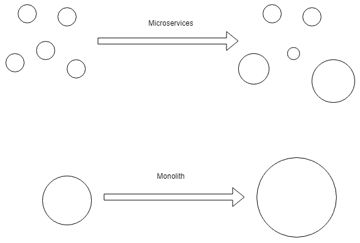

# 使用设计良好的接口和协议

你可能会问，如果我们将应用程序划分为多个较小的模块，我们如何确保它们之间的通信既顺畅、无缝，又能尽量减少延迟？为了满足这样的要求，我们必须参考面向服务架构（SOA）所描述的多种通信模式，而这些模式实际上是微服务的基础。一般来说，你需要利用广泛应用于 IT 行业的、为成千上万的 API、设备和框架所理解的著名协议，如 HTTP 或 TCP。当然，你也可以考虑设计一个自定义的协议或标准——虽然最初这可能是个好主意，但迟早它会成为扩展应用程序的障碍，因为它与更新的服务不兼容。更重要的是，使用流行的序列化方法，如 XML、JSON，或任何容易获取并且有良好文档支持的二进制格式是很重要的。通过遵循这些指南，你可以确保你的微服务架构将易于扩展和集成。

# 处理状态

几乎每个应用程序都有某种状态（当然，也可以开发一个无状态的服务，它不需要在任何地方存储状态，只执行操作/返回结果；我们将在本章稍后讨论这样的服务）。

这个状态必须被管理和共享；在单体应用程序的处理过程中，这个过程非常直接且显而易见——例如，我们有一个数据库，存储着系统多个部分的所有信息。一般来说，它存储在一个地方（当然它可以扩展和共享，但我们不会自己管理这些功能），因此我们不必担心它只被部分更新（如果真的部分更新了，也总有事务来保证一致性）。当然，状态不一定要存储在数据库中——我们可以使用任何类型的存储来保存数据。

使用微服务时，结果表明每个独立的服务都有自己的状态并独立管理它。当我们必须从不同模块查询数据或将数据存储在多个存储形式中时，就会出现问题。为了解决这些问题，可以使用如最终一致性这样的模式。在 SF 中，你可以选择一个状态是应该外部化还是共置的。此外，SF 会确保它的高可用性和持久性。

# 诊断和监控微服务

虽然监控传统应用程序的过程相对直接和简单，但当你拥有数十个或数百个小型服务时，正确的实现方式并不那么明显。这也带来了其他影响，例如：如果一个模块出现故障，实际影响是什么？当你使用单体架构时，应用程序出现任何问题时，你会立即意识到，因为它会直接停止正常工作。而在微服务架构中，如果监控覆盖不到系统的所有领域，你可能会发现难以及时做出反应。在 SF 中，你有多层次的监控，可以按如下方式定义：

+   **应用程序监控**：这跟踪你的应用程序的使用情况。

+   **集群监控**：这允许你监控整个 SF 集群，从而验证整个服务是否按预期运行。

+   **性能监控**：有时候，如果不监控应用程序的性能，可能很难理解其行为。在 SF 中，追踪资源利用率并预测可能的问题更为容易。

+   **健康监控**：在使用微服务时，了解特定模块是否健康至关重要。在 SF 中，你可以利用健康 API 或在 SF Explorer 中提供的健康报告，更好地了解你应用程序的当前状态。

# SF 中的容器、服务和参与者

在开始使用 SF 之前，我们将讨论三个主要主题，帮助你在逻辑和物理上划分应用程序：

+   **容器**：小型、可部署的组件，彼此隔离，使你能够虚拟化底层操作系统

+   **可靠服务**：SD 中可用的一种编程模型，用于编写和管理有状态和无状态的服务

+   **可靠的参与者**：在可靠服务之上的另一种编程模型

# 容器

目前，SF 支持两种类型的容器：

+   **Linux 上的 Docker**

+   **Windows Server 2016 上的 Windows Server 容器**

在 SF 中使用容器时，你可以使用任何编程语言或框架（如你所期望的那样），但与这种模型相关的最重要的事情是，你不必坚持使用内置的编程模型（可靠参与者和可靠服务）。更重要的是，这种方法非常类似于运行所谓的**来宾可执行文件**，你可以将现有的可执行文件部署到 SF 中。

# 创建一个集群

在开始使用容器之前，我们需要创建一个 SF 集群。为此，进入 Azure 门户并点击 + 创建资源。搜索 `Service Fabric Cluster` 并点击创建。你将看到一个熟悉的界面，需要在多个字段中填写集群配置。在 SF 中，创建过程分为四个不同的步骤，我们将逐一介绍。

在第一个屏幕上，你需要输入有关集群的基本信息：

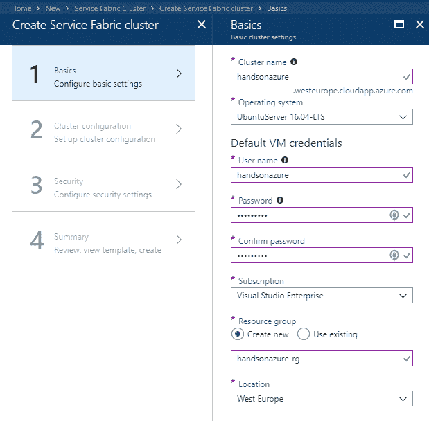

有一个字段可能需要稍作澄清，即 操作系统。如本章开头所提到，SF 支持 Windows 和 Linux 容器，你可以在此处进行选择。选择会影响定价和可用功能，因此你必须确认自己使用的是哪个操作系统。

一旦你对设置满意，就可以继续到下一个屏幕：

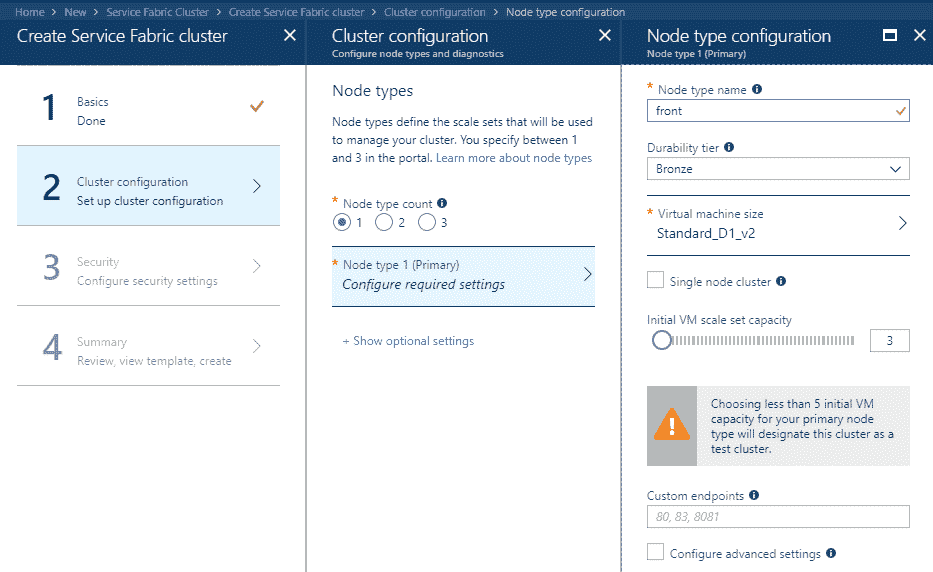

现在我们开始实际的集群配置。你需要做的第一件事是选择 Node 类型计数。为了选择正确的版本，你需要理解它的实际含义。此属性定义了以下内容：

+   虚拟机（VM）大小

+   虚拟机的数量

+   虚拟机的属性

所以，简而言之——如果你需要两种不同类型的机器（例如，你有一个轻量级前端和一个重量级后端），你将选择两种不同的节点类型。

记住，在集群创建后，你始终可以添加或移除节点，但你总是需要至少保留一个节点。

在 Node 类型配置面板上，你需要选择虚拟机的大小及其容量，并为节点选择一个名称。你还可以 配置高级选项，但由于我们刚刚开始使用 SF，我不建议在那里更改任何内容。

使用少于五台虚拟机最初会将集群标记为测试集群。SF 要求你运行五台或更多虚拟机的原因，是为了确保你的解决方案能更好地应对 同时 故障。你仍然可以使用测试集群来运行生产工作负载，但不推荐这么做。

现在点击 OK 继续。倒数第二个屏幕允许你配置集群的安全功能：

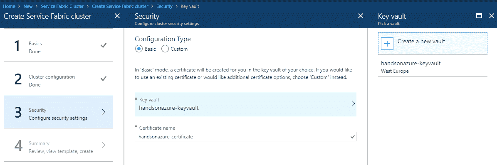

你可以选择 Basic 或 Custom 配置类型——它们的区别在于，使用 Basic 时，系统会为你创建证书，而选择 Custom 时，你可以自己输入证书信息。此外， SF 要求你选择一个密钥保管库（或创建一个新的）来存储证书。

本书不会涵盖 Azure 密钥保管库。如果你想了解更多关于该服务的信息，请查看文档——[`docs.microsoft.com/en-us/azure/key-vault/`](https://docs.microsoft.com/en-us/azure/key-vault/)

当一切设置好并准备就绪时，你可以点击“确定”，然后你将看到包含集群配置摘要的最终屏幕。验证显示的所有信息，如果准备好创建集群，点击“创建”。当你进入创建集群时选择的资源组，你应该会看到与我类似的设置：

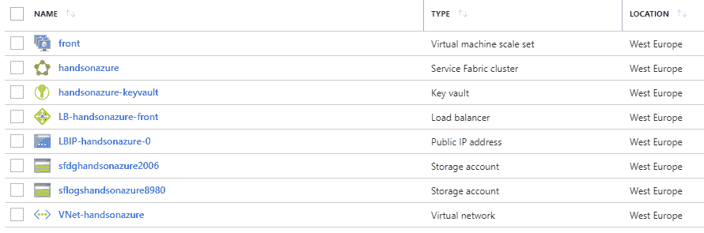

如你所见，它已经包含了许多不同的服务：

+   **虚拟机规模集**：为了确保你能轻松扩展，SF 使用虚拟机规模集来自动化整个过程

+   **Service Fabric 集群**：实际的 SF 服务

+   **负载均衡器**：在你的机器之间分配负载

+   **公共 IP 地址**：使你的应用程序可公开访问

+   **存储账户**：用于存储数据

+   **虚拟网络**：为了确保机器之间的安全和便捷的通信，SF 使用 Azure 虚拟网络将虚拟机规模集中的机器连接起来

现在我们已经配置并运行了一个集群，可以继续部署 Docker 容器。

# 部署容器

要在 SF 中使用 Docker 镜像，我们需要在 Azure 容器注册表中有一个注册表。你可以回到 第三章，*将 Web 应用程序部署为容器*，在那里我详细描述了如何使用 ACR 和 Docker。

现在我们将尝试部署一个简单的 Python 应用程序——首先，我们当然需要 Dockerfile：

```
FROM python:2.7-slim
WORKDIR /app
ADD . /app
RUN pip install -r requirements.txt
EXPOSE 80
ENV NAME World
CMD ["python", "app.py"]
```

此外，我们将创建一个 Python 应用程序，显示简单的文本：

```
from flask import Flask

app = Flask(__name__)

@app.route("/")
def hello():

    return 'This is my first Service Fabric app!'

if __name__ == "__main__":
    app.run(host='0.0.0.0', port=80)
```

现在，运行 `docker build` 命令：

```
docker build -t handsonservicefabricapp .
```

我们将能够通过输入以下命令在本地进行测试和运行：

```
docker run -d -p 4000:80 --name handsonsf handsonservicefabricapp
```

如你所见，一切正常工作——我们可以继续推送镜像并部署它：

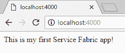

要推送容器镜像，当然你需要一个注册表。如果你想使用 Azure 容器注册表，请参考前一章的详细说明。

现在，你将需要三个 Docker 命令：

+   `docker login`：用于在 ACR 中进行身份验证

+   `docker tag`**:** 创建镜像的别名，并将其放入正确的命名空间

+   `docker push`：将镜像部署到注册表

以下是完整的语法：

```
docker login handsonazureregistry.azurecr.io -u {USERNAME} -p {PASSWORD}
docker tag handsonservicefabricapp handsonazureregistry.azurecr.io/sf/handsonservicefabricapp
docker push handsonazureregistry.azurecr.io/sf/handsonservicefabricapp
```

# 打包服务

为了打包我们的服务，我们将使用 Yeoman 与 SF Yeoman 容器生成器。为此，你需要先安装它们——在命令行中执行以下两个命令：

```
npm install -g yo
npm install -g generator-azuresfcontainer
```

我们还需要做一件事——因为容器镜像将从 ACR 获取，所以我们必须在 `ApplicationManifest.xml` 中配置其凭证。用户名可以在容器注册表的概览面板中找到，而密码则需要运行以下两个命令：

```
az acr login --name {REGISTRY_NAME}
az acr credential show -n {REGISTRY_NAME} --query passwords[0].value
```

现在，我们需要更新 Yeoman 生成的清单，以便它使用我们的凭证：

```
<ServiceManifestImport>
  <ServiceManifestRef ServiceManifestName="HandsOnServicePkg" ServiceManifestVersion="1.0.0" />
  <Policies>
    <ContainerHostPolicies CodePackageRef="Code">
      <PortBinding ContainerPort="80" EndpointRef="HandsOnServiceEndpoint"/>
      <RepositoryCredentials AccountName="{LOGIN}" Password="{PASSWORD}" PasswordEncrypted="false"/>
    </ContainerHostPolicies>
  </Policies>
</ServiceManifestImport>
```

现在，使用以下命令登录到你的集群：

```
sfctl cluster select --endpoint https://{ENDPOINT}:19000 --pem {CERTIFICATE}.pem --no-verify
```

最后，运行 Yeoman 生成的`install.ps1`文件并等待片刻——你的应用程序镜像应该会被部署到云中的 SF 集群，并且完全可用。

若要获取证书，你可以从密钥保管库中的证书选项卡下载。

# 可靠服务

在这一部分中，我们将尝试使用 SF 创建无状态和有状态服务。这次，我们将使用 Visual Studio 创建一个 C#应用程序，并将其部署到我们的集群。你也可以从 Linux 上的可靠服务开始，但这本书不会覆盖这一部分。请参考*进一步阅读*部分，了解相关文档链接。

# 创建一个 SF 应用程序

当你打开 Visual Studio 实例时，进入文件 | 新建项目。在新窗口中搜索 Visual C# | 云模板；你应该能够找到 Service Fabric Application 选项：

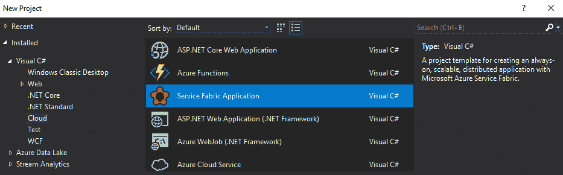

如果你找不到这个选项，请确保你已经安装了 SF SDK。

在下一屏幕上，你将看到许多不同的选项，我们稍后会讨论其中的大多数。现在，选择无状态服务（Stateless Service）并点击确定（OK）：

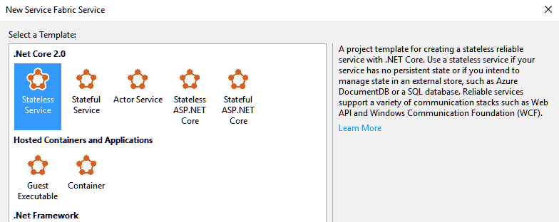

稍等片刻后，你应该能够看到一个无状态服务模板已经通过 SF 构建完成。你现在可以按*F5*来查看它在所有默认值下的工作情况：

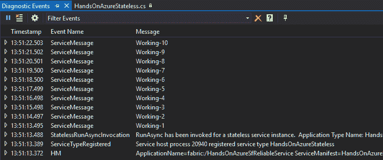

如果你在启动本地 SF 实例时遇到问题，请确保你以管理员身份启动了 Visual Studio。

如你所见，每秒都会发布一条消息——`Working-{N}`。请看一下`RunAsync()`方法：

```
protected override async Task RunAsync(CancellationToken cancellationToken)
{
  long iterations = 0;

  while (true)
  {
    cancellationToken.ThrowIfCancellationRequested();

    ServiceEventSource.Current.ServiceMessage(this.Context, "Working-{0}", ++iterations);

    await Task.Delay(TimeSpan.FromSeconds(1), cancellationToken);
  }
}
```

你将看到它是这些消息的来源。事实上，它是你的服务的起点，当服务启动时会调用它。它还接受一个参数，`cancellationToken`，用于告知你以下任意一种情况：

+   你的代码中发生了致命错误，当前服务处于无效状态

+   集群中发生了硬件故障

+   正在进行升级

+   当前的服务实例不再需要

记得确保`RunAsync()`方法应该返回一个任务。系统会等待直到服务执行完毕，因此如果你发现请求了取消操作，务必尽可能快速地完成。

现在我们尝试添加一个有状态服务——为此，向解决方案中添加一个新的 Service Fabric 应用程序项目，但这次选择有状态服务（Stateful Service）：

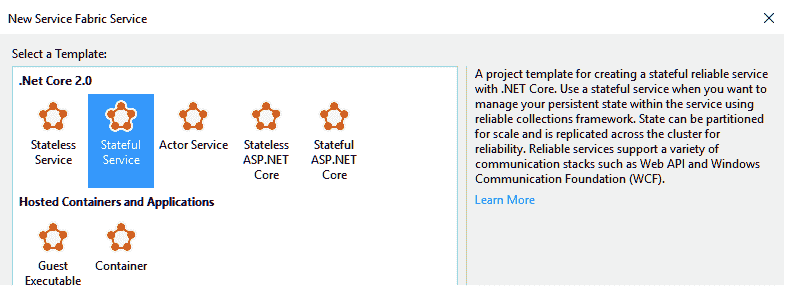

如果你将无状态的`RunAsync()`与有状态的进行对比，你将看到许多不同之处：

```
protected override async Task RunAsync(CancellationToken cancellationToken)
{
  var myDictionary = await this.StateManager.GetOrAddAsync<IReliableDictionary<string, long>>("myDictionary");

  while (true)
  {
    cancellationToken.ThrowIfCancellationRequested();

    using (var tx = this.StateManager.CreateTransaction())
    {
      var result = await myDictionary.TryGetValueAsync(tx, "Counter");

      ServiceEventSource.Current.ServiceMessage(this.Context, "Current Counter Value: {0}",
        result.HasValue ? result.Value.ToString() : "Value does not exist.");

      await myDictionary.AddOrUpdateAsync(tx, "Counter", 0, (key, value) => ++value);

      // If an exception is thrown before calling CommitAsync, the transaction aborts, all changes are
      // discarded, and nothing is saved to the secondary replicas.
      await tx.CommitAsync();
    }

    await Task.Delay(TimeSpan.FromSeconds(1), cancellationToken);
  }
}
```

最重要的是直接引用状态——在有状态服务中，我们有状态管理器，它使你能够查询状态并在事务中执行操作。在之前的例子中，我们从中获取了一个 `IReliableDictionary<>` 类型的字典——这是一个可靠的集合，用来存储数据并将其复制到其他机器上。实际上，它与 `IDictionary<>` 是相同的字典，但这次对集合的操作是异步的，因为数据必须持久化到磁盘上。

记住，你存储在状态管理器中的所有内容都必须是可序列化的。

当你启动应用程序时，你会看到两个服务同时运行：

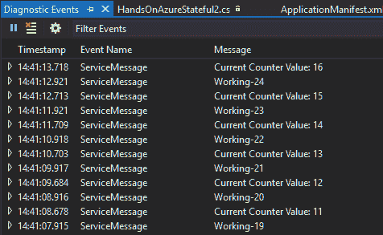

现在我们想将我们的简单应用程序发布到 Azure，看看它是否真的有效。

# 将应用程序部署到云端

如果你查看一下，你会看到我们的解决方案现在包含了三个项目：

+   无状态服务

+   有状态服务

+   SF 项目

现在右键点击 SF 项目，点击“发布...”选项：

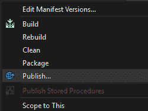

在新屏幕上，你可以配置一些内容，如目标配置文件或应用程序参数文件，但最有趣的是连接端点，它现在是空的。实际上，如果不选择一个选项，你无法继续操作，所以让我们打开下拉菜单，看看我们的选项。在可用选项中，你会看到以下内容：

+   本地集群

+   创建新集群

+   使用试用集群

+   刷新

虽然本地/新集群选项不言自明，但你可能会想知道什么是“试用”选项。当你选择它时，你将获得一个选项来登录到所谓的 **派对集群**。这些是免费的 SF 集群，你可以用它们来稍微玩一下这个服务，了解它的工作原理。你不需要订阅，但一个小时后集群将被关闭。因为我们在本书中学习的是 Azure 中的服务，我不会使用该选项，但如果你决定深入了解 SF，而不仅仅是本章所能提供的内容，随时可以使用它。

当你选择“创建新集群”选项时，屏幕上会出现整个 SF 集群配置。这与门户中看到的非常相似——它具有相同的部分，如集群、证书和虚拟机详情。

从 Visual Studio 创建 SF 集群有一个缺点——你不知道推荐的值是什么，也没有直接参考文档。

以下是我从第一个标签页中的配置：

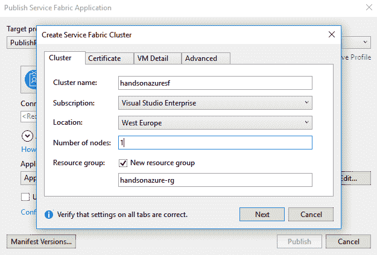

如您所见，我将节点数量设置为`1`——这是因为我不打算部署生产工作负载，并且不需要两种不同特征的虚拟机，因为我的两个服务基本相同。当您点击“下一步”时，您将看到第二个标签，在该标签中您将指定证书密码。如果您保留选中“导入证书”选项，则会自动创建并导入证书：

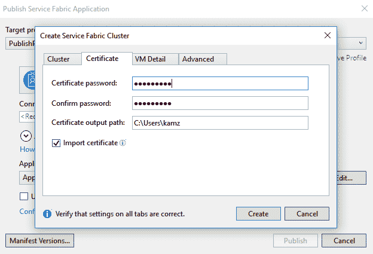

在 SF 中，证书是确保节点到节点以及客户端到节点通信安全的一种方式。这些是 X.509 证书，更重要的是，至少要保持一个有效证书——如果证书无效，甚至可能导致集群停止工作。

下一个标签是 VM 详细信息，您可以在其中指定运行集群的机器的详细信息。在提供了用户名和密码后，您需要选择将用于运行 SF 的操作系统以及每个虚拟机的大小。输入所有必需信息后，您可以点击“创建”：

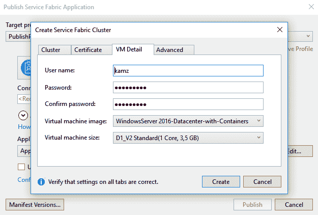

部署 SF 集群可能需要一些时间，所以请耐心等待。一旦完成，您可以在 Azure 门户中查看，确认整个生态系统的所有部分都已部署。然而，当您进入 Azure 中的 SF 集群时，您会看到它没有任何应用程序或节点附加。这是因为我们刚刚创建了它，并没有部署任何内容。因此，我们需要返回 Visual Studio，再次点击“发布”，这次选择我们刚刚创建的集群：

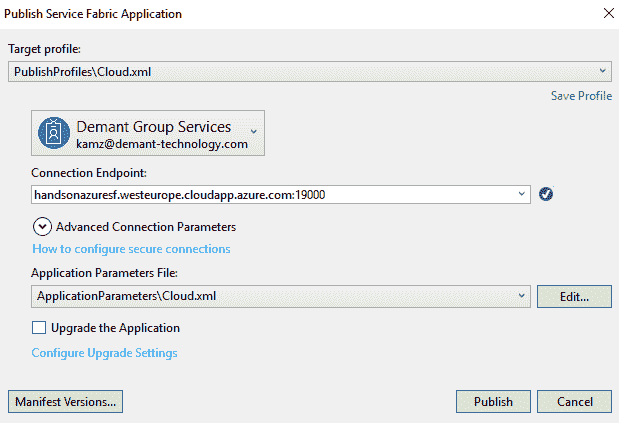

现在，让我们去 Azure 并探索我们的应用程序。在我们的 SF 实例的概览页面上，有一个“Explorer”按钮：

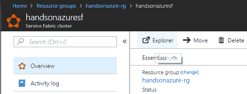

当您点击它时，新的窗口将在您的浏览器中打开，您将被要求选择一个证书，该证书将用于安全连接。记得选择在 SF 集群创建过程中创建并导出的那个证书。接受后，您应该能够看到 Service Fabric Explorer：

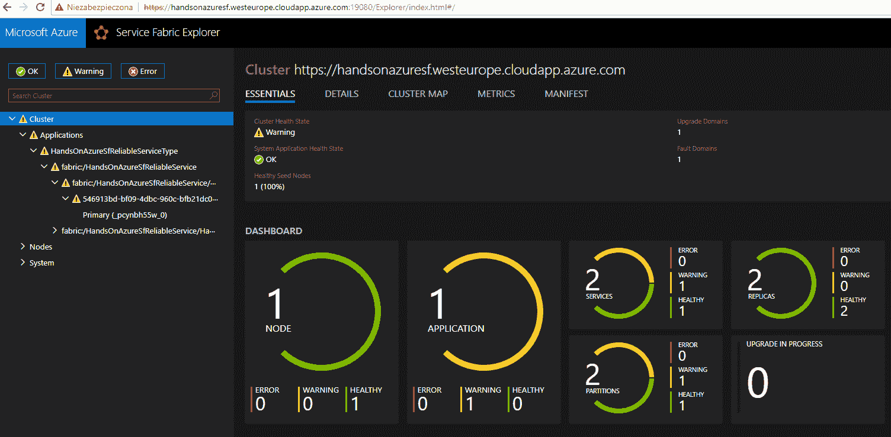

恭喜——您刚刚使用 SF 创建了您的第一个微服务架构！

# 可靠演员

在上一节中，我们创建了一个由两个服务组成的应用程序——一个有状态服务和一个无状态服务。在 SF 中，有许多不同的框架来构建系统——另一个是可靠演员。它旨在创建一个可以并发和独立运行的分布式服务平台——因为每个演员是隔离的，一个实例的问题不会影响其他正在运行的实例。您可能会想知道什么时候选择可靠服务，什么时候选择可靠演员？经验法则可以这样定义：

+   如果您需要将工作分配给多个工作者（例如成百上千个），请选择“可靠演员”

+   如果你想隔离你的工作并希望一个单线程环境以简化操作，选择可靠演员

+   如果你的业务领域要求在事务中执行工作，选择可靠服务

+   如果你的服务必须是可靠且高可用的，选择可靠服务

当然，上述原因并不能涵盖所有可能的场景，但你现在应该能够理解它们之间的区别了。一般来说，你不能期望演员们会非常耐用，因为其核心思想是生成新的演员，并将工作负载转移给它们，而不是确保它们能够无限期地工作。

# 创建一个演员项目

我们将通过在 Visual Studio 中创建一个全新的项目来开始我们与可靠演员的旅程——为此，点击文件 | 新建项目，再次选择 SF 模板。在“新建服务”屏幕中，选择“演员服务”模板并点击确定：

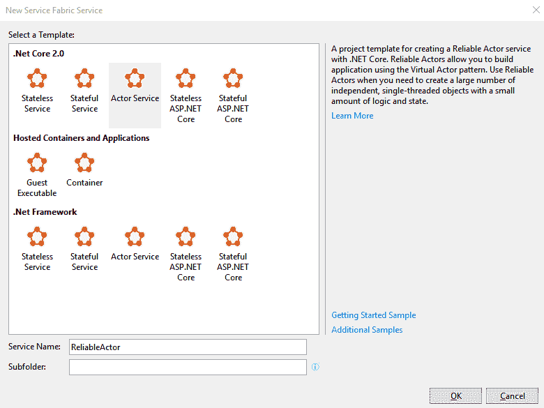

在你的项目初始化后，你会发现它与可靠服务的项目略有不同——最重要的是，它现在包含了 `.Interfaces` 项目，目前该项目仅包含一个文件，内容如下：

```
[assembly: FabricTransportActorRemotingProvider(RemotingListener = RemotingListener.V2Listener, RemotingClient = RemotingClient.V2Client)]
namespace ReliableActor.Interfaces
{
    /// <summary>
    /// This interface defines the methods exposed by an actor.
    /// Clients use this interface to interact with the actor that implements it.
    /// </summary>
    public interface IReliableActor : IActor
    {
        /// <summary>
        /// TODO: Replace with your own actor method.
        /// </summary>
        /// <returns></returns>
        Task<int> GetCountAsync(CancellationToken cancellationToken);

        /// <summary>
        /// TODO: Replace with your own actor method.
        /// </summary>
        /// <param name="count"></param>
        /// <returns></returns>
        Task SetCountAsync(int count, CancellationToken cancellationToken);
    }
}
```

它将作为演员和其客户端之间的通信点。你可以把它看作是一个契约聚合器。现在，检查一下主要演员项目（在我的例子中是 `ReliableActor`）——你会在那里找到之前接口的当前实现。以下是当前代码：

```
namespace ReliableActor
{
    [StatePersistence(StatePersistence.Persisted)]
    internal class ReliableActor : Actor, IReliableActor
    {
        public ReliableActor(ActorService actorService, ActorId actorId) 
            : base(actorService, actorId)
        {
        }

        protected override Task OnActivateAsync()
        {
            ActorEventSource.Current.ActorMessage(this, "Actor activated.");
            return this.StateManager.TryAddStateAsync("count", 0);
        }

        Task<int> IReliableActor.GetCountAsync(CancellationToken cancellationToken)
        {
            return this.StateManager.GetStateAsync<int>("count", cancellationToken);
        }

        Task IReliableActor.SetCountAsync(int count, CancellationToken cancellationToken)
        {
            return this.StateManager.AddOrUpdateStateAsync("count", count, (key, value) => count > value ? count : value, cancellationToken);
        }
    }
}
```

每个演员实现都带有 `[StatePersistence]` 特性。它有三种不同的选项：

+   持久化：在这里，状态会被持久化到磁盘并复制到副本（三个或更多）。这是最耐用的选项，即使在整个集群故障的情况下也能防止丢失数据。

+   易失性：与其将状态持久化到磁盘，不如将其复制并存储在三个或更多副本的内存中。这是一个较不耐用的选项，类似于仅将数据保存在 RAM 中，一旦断电，数据会丢失。

+   无：如果你不需要持久化状态，可以选择此选项。

在这里没有最佳选择——一切取决于你的演员需求。请再注意一点——演员本身并不局限于某种“硬性”契约；你可以自己定义代码，SF 会尽最大努力复制它，持久化状态（如有需要），并进行横向扩展以满足你的需求。目前，我们只有一个工作者——我们还需要一个客户端来测试我们的服务。

# 创建一个演员的客户端

为了创建一个客户端，我们将使用最传统的控制台应用程序。再次点击文件 | 新建项目并搜索，或者直接右键点击解决方案并点击添加 | 新建项目。在我们编写代码之前，你需要再添加两个内容：

+   添加对 `.Interfaces` 项目的引用，因为我们必须知道要调用哪些方法

+   安装 `Microsoft.ServiceFabric.Actors` 包

我们将编写一个简单的应用程序，该应用程序调用我们的 Actor，获取当前的计数值并更新它。以下是我的示例代码：

```
using System;
using System.Threading;
using System.Threading.Tasks;
using Microsoft.ServiceFabric.Actors;
using Microsoft.ServiceFabric.Actors.Client;
using ReliableActor.Interfaces;

namespace ReliableActor.Client
{
    class Program
    {
        static void Main()
        {
            MainAsync().GetAwaiter().GetResult();
        }

        static async Task MainAsync()
        {
            IReliableActor actor = ActorProxy.Create<IReliableActor>(ActorId.CreateRandom(), new Uri("fabric:/ReliableActors/ReliableActorService"));
            while (true)
            {
                var count = await actor.GetCountAsync(CancellationToken.None);
                Console.Write($"Current count is: {count}\r\n");
                await actor.SetCountAsync(++count, CancellationToken.None);

                Thread.Sleep(1000);
            }
        }
    }
}
```

正如你所看到的，我做了三件事：

+   我通过使用`fabric`协议和我创建的特定接口来获取对我的 Actor 服务的引用。

+   为了获取计数值，我在我的引用上调用了`GetCountAsync()`方法。

+   我通过调用`SetCountAsync()`来更新状态。

以下显示了同时运行 Actor 和客户端的结果：

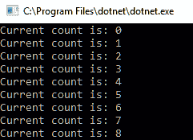

很好——一切按预期工作。你可能会好奇 Actor 实例是如何在 SF 集群中分配的，以及我们是如何实现数百个实例的分配的。其实，这一切都由 SF 运行时处理，它通过对实例进行分区并将它们附加到集群中的不同节点来实现。正因为如此，你可以期待负载会得到平衡——更重要的是，你可以通过 Actor 的 ID 来引用它（与展示的`ActorId.CreateRandom()`方法不同），但并不总是推荐这么做，因为你必须确保不会使某个 Actor 超负荷。

# 服务之间的通信

你现在已经知道如何使用 SF（服务框架）来处理可靠服务和可靠 Actor。下一个重要话题是关于服务实例之间的通信。正如我们在本章开始时讨论的，构建微服务时最好的选择是创建一个平台，使其在选择最佳的通信方式和接受传入请求时保持中立。在 SF 中，你并没有单一的消息交换方式——相反，它为你提供了一个完整的框架，让你可以按照自己的方式进行操作。在这一部分，我们将重点构建一个简单的通信通道来支持你的服务。

# 创建通信通道

要创建一个通道，你需要实现以下接口：

```
public interface ICommunicationListener
{
    Task<string> OpenAsync(CancellationToken cancellationToken);
    Task CloseAsync(CancellationToken cancellationToken);
    void Abort();
}
```

正如你所看到的，关于使用的技术或框架没有任何信息——这完全取决于你。我们将尝试在我们的服务中开启 HTTP 协议。由于本书无法覆盖所有类型的服务，我们将重点介绍无状态服务。如果你从关于它的章节打开项目，在服务的主文件中，你可以找到以下方法：

```
protected override IEnumerable<ServiceInstanceListener> CreateServiceInstanceListeners()
{
  return new ServiceInstanceListener[0];
}
```

目前，它返回的是一个空数组——我们需要提供一个自定义的`ServiceInstanceListener`实现并将其添加到这里。虽然当然可以这么做，但描述它的细节会花费太多时间；因此，我们使用一个 NuGet 包，它包含了一个正确实现的监听器，并且是基于 ASP.NET Core 构建的。

目前，可以使用 Http Sys 或 Kestrel 来解决通信问题。请随意进行实验，因为这些技术有所不同，且它们总是可以互相替代（例如，Http Sys 目前并不适用于有状态服务）。

对于这个练习，请安装以下包：`Microsoft.ServiceFabric.AspNetCore.HttpSys`。安装后，你可以如下修改`CreateServiceInstanceListeners()`方法：

```
protected override IEnumerable<ServiceInstanceListener> CreateServiceInstanceListeners()
{
  return new[]
  {
    new ServiceInstanceListener(serviceContext =>
      new HttpSysCommunicationListener(serviceContext, "ServiceEndpoint", (url, listener) =>
        new WebHostBuilder()
          .UseHttpSys()
          .ConfigureServices(
            services => services
              .AddSingleton<StatelessServiceContext>(serviceContext))
          .UseContentRoot(Directory.GetCurrentDirectory())
          .UseServiceFabricIntegration(listener, ServiceFabricIntegrationOptions.None)
          .UseStartup<Startup>()
          .UseUrls(url)
          .Build()))
  };
}
```

如你所见，它提供了完整的监听器实现和处理请求的管道。你还需要实现`Startup`类，来处理通信：

```
public class Startup
{
  public Startup(IHostingEnvironment env)
  {
  }

  public Startup(IApplicationBuilder appenv, IHostingEnvironment env, ILoggerFactory loggerFactory)
  {
  }

  public void ConfigureServices(IServiceCollection services)
  {
  }

  public void Configure(IApplicationBuilder app)
  {
    app.Run(context => {
      return context.Response.WriteAsync("Hello From Service Fabric!");
    });
  }
}
```

这看起来可能很熟悉，因为这是一个简单的 ASP.NET Core 堆栈，你会以相同的方式实现，创建一个不托管在 SF 中的 Web 应用程序。目前只有一件事需要修改——我们必须修改`ServiceManifest.xml`并指定我们的端点是由服务暴露的：

```
<Resources>
  <Endpoints>
    <Endpoint Name="ServiceEndpoint" Protocol="http" Port="80" />
  </Endpoints>
</Resources>
```

记住，端点名称必须与在代码中定义的名称匹配。

现在，当你运行应用程序时，你应该能够通过使用暴露的端点来调用它，该端点可以在 Service Fabric Explorer 中找到：

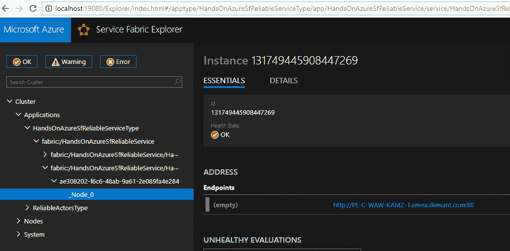

以下是从 Postman 应用程序调用我的服务的结果：

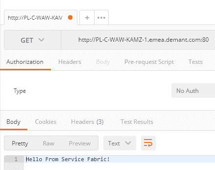

现在的问题是：你可以利用这样的功能做些什么？实际上，有很多可能性——你可以在服务之间交换消息，可以查询某个服务当前执行的任务状态，或者可以更改某个状态，以便在运行工作负载时选择不同的路径。这是一个非常强大的功能，除了 SF 为分布式系统带来的所有优势外，你还可以确保你的通信是可靠的，并且完全在你的控制之下。

# SF 中的集群

我们已经讨论了 SF 中的集群，但你如何真正理解在该服务中的这一概念呢？你可能还记得，在创建集群时，我们需要选择节点类型及其特性——虚拟机的数量及其类型。如果你选择有三个节点，每个节点包含五台机器，那么你最终会得到一个总共十五台机器的集群。SF 会自动进行负载均衡，因此如果你改变集群大小，所有服务将会重新部署，以达到最大利用率。本章将简要讨论安全性、可用功能和可扩展性。

以下是集群组织的概念图：

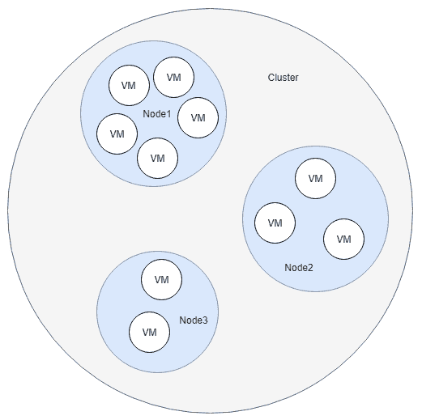

# 集群安全

如果你回到集群的创建过程，你会注意到我们总是需要创建或导入证书——没有它，就无法继续。你必须记住，确保你的环境安全并防止未经授权的访问是你自己的责任。正如文档所述，创建不安全的集群是不可能的——这当然是正确的。然而，如果你将端点公开暴露（特别是在生产工作负载中），总有可能有人会发现它并开始滥用。

# 节点间安全

假设你有三个不同的节点，分别用于不同类型的工作负载：

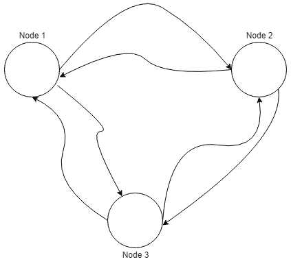

这些节点可能会暴露（或不暴露）给外部网络。现在，你可能会想知道 SF 是如何确保通信以安全的方式处理的。实际上，有两种可能性：

+   **证书安全性**：在这种场景下，客户端（节点）会将凭证附加到每个请求中，并用私钥签名消息

+   **Windows 安全性**：基于 Kerberos 协议

最终的解决方案取决于你的实际需求。

# 客户端与节点的安全性

除了在集群内进行通信外，你还可能需要允许授权用户与单个节点交换消息。事实上，这与 **节点间安全性** 相似——在这种情况下，你可以选择使用证书或 **Active Directory**（**AD**）安全性。在这种场景下使用 AD 的优势是什么？有一个非常重要的方面——在大多数情况下，你不想与客户端共享证书（尤其是当证书数量很多时，这会变得非常繁琐）。AD 安全性可以通过在 ARM 模板中提供额外的选项进行设置：

```
"azureActiveDirectory": {
  "tenantId": "<guid>",
  "clusterApplication": "<guid>",
  "clientApplication": "<guid>"
}
```

# 扩展

扩展是 SF 最重要的功能之一，因为微服务架构的核心就是能够在需要时进行扩展，并在此过程中保持稳定的环境。在大多数情况下，你需要水平扩展（通过增加更多的机器来运行工作负载），但当然，也可以进行垂直扩展（这样更强大的机器就能投入使用，并且在某些情况下，这比水平扩展更合适）。通常，是否选择水平扩展或垂直扩展，取决于你的代码需要执行的工作：

+   如果你的工作可以并行化，选择水平扩展

+   如果你的工作涉及大量计算并且 I/O 密集型，且这些操作无法分布式处理，选择水平扩展

更重要的是，SF 中的每个节点类型都是一个独立的虚拟机扩展集。这意味着你可以根据需要独立地扩展节点。这是一个非常重要的特性——如果只有系统的某一部分需要更多的计算能力，而你还需要更新整个集群，你可能不会很高兴。

在 SF 中，每个节点在扩展时有特定的要求，因为保持正确数量的节点运行生产工作负载是很重要的。详细信息可以在文档中找到；你可以在本章末尾的 *进一步阅读* 部分找到相关链接。

# 扩展集群的规模

一般来说，不建议对集群进行上下扩展，因为这是一项危险的操作（特别是如果你想更改主节点的 VM SKU）。如果你想知道原因，请考虑以下操作——你即将缩减一个节点。这是一项基础设施操作，需要为你的应用程序更改可用硬件。如果你没有正确监控和编排所有操作，你可能会导致你的有状态服务丢失数据（例如，暂时无法访问数据库），甚至无状态服务也可能变得不稳定。实际上，要安全地进行上下扩展，你应该首先创建一个新的节点类型，然后逐渐减少旧节点的实例计数，以便 SF 能够在关闭旧节点之前正确地分发工作负载。

SF 文档指出，在运行主节点的 VM 上更改 SKU 是非常不建议的。然而，当小心操作时，这是可能的；你可以在本章末尾的*Further reading*部分找到一篇指南的链接。

# 监视和诊断

在本章的最后一节，我们将涵盖一些关于在 SF 中监视和诊断你的服务的主题。正如你可能记得的那样，我将这些功能视为微服务中最重要的之一，因为你必须始终能够知道每个服务如何工作，并在需要时执行必要的操作（例如扩展、重启或终止实例）。在 SF 中，有几个监控层次，我们将在这里简要描述。

# 应用程序监控

在大多数情况下，你希望监视你的应用程序如何工作，用户流量是多少，以及你的服务如何相互通信。虽然你可以自己带入框架，但也可以利用**应用程序洞察**（**AI**）集成——这将确保你获取所有必要的日志和可用的诊断消息。你可以在创建 SF 集群时设置 AI 集成：

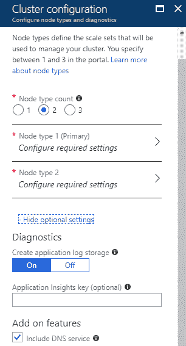

# 集群监控

在工作过程中，你的集群会发出各种事件，这些事件映射到其中的一个特定实体：

+   集群

+   应用程序

+   服务

+   分区

+   副本

+   容器

你可以通过利用 SF 中提供的`EventStore`服务查询这些事件。可以对它们进行关联，以便找出一个实体如何影响其他实体。以下是从特定时间范围返回事件的 API 示例请求：

```
http://{CLUSTER}:19080/EventsStore/Cluster/Events?api-version=6.2-preview&StartTimeUtc=2018-04-03T18:00:00Z&EndTimeUtc=2018-07-04T18:00:00Z
```

# 健康监控

除了监视你的应用程序和集群外，你还需要检查特定服务的工作情况。为了检查其健康状况，SF 引入了 Service Fabric Explorer，你可以访问以验证以下内容的健康状况：

+   节点

+   应用程序

+   服务

+   分区

+   副本

你可以在本地和云端访问 Explorer。它呈现了一个不错的用户界面，显示了大量有用的信息，你可以利用这些信息来确定系统的当前状态，发现潜在问题，并获取必要的细节以进一步调查问题：

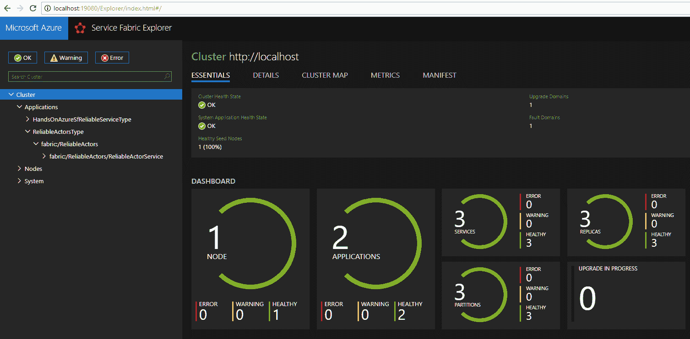

# 总结

本章中，我们只是简单介绍了 SF 及其构建的微服务。你已经学习了 SF 的基本概念，例如可靠服务和可靠演员，以及如何实现一个通信协议以便在服务与客户端之间交换消息。记住，基于微服务构建应用程序并非易事，它要求遵循许多重要规则，以避免处理状态、监控或扩展时出现问题。将 SF 作为构建分布式应用程序的框架，它确保应用程序的可靠性和高可用性。

最后但同样重要的是：如果你在使用 SF 时遇到问题，或者被其众多选项和配置所困扰，不要灰心——这项服务确实有一个相当陡峭的学习曲线，但在阅读完整本章节后，你应该能够毫不费力地开始编写自己的服务。

在第三章《将 Web 应用程序部署为容器》中，你将了解 Azure 中另一个 PaaS 服务：Azure Search，它允许你使用自己的搜索引擎对存储的文档进行索引和查询。

# 问题

1.  可靠服务和可靠演员之间有什么区别？

1.  无状态服务和有状态服务之间有什么区别？

1.  为了在 SF 中引入自己独立的通信通道，必须实现哪些内容？

1.  SF 中的节点类型是什么？

1.  你可以单独扩展（向上/向外）节点类型吗？

1.  创建集群时，你可以选择虚拟机 SKU 吗？

1.  SF 中有哪两种类型的节点安全性？

1.  集群、应用程序、服务、分区和副本之间有什么区别？

1.  为什么 SF 建议创建至少包含五个虚拟机的节点？

1.  SF 中的可靠性等级是什么？

# 进一步阅读

+   [`docs.microsoft.com/en-us/azure/service-fabric/service-fabric-technical-overview`](https://docs.microsoft.com/en-us/azure/service-fabric/service-fabric-technical-overview)

+   [`docs.microsoft.com/en-us/azure/service-fabric/service-fabric-cluster-creation-via-arm`](https://docs.microsoft.com/en-us/azure/service-fabric/service-fabric-cluster-creation-via-arm)

+   [`docs.microsoft.com/en-us/azure/service-fabric/service-fabric-cluster-scaling`](https://docs.microsoft.com/en-us/azure/service-fabric/service-fabric-cluster-scaling)

+   [`docs.microsoft.com/en-us/azure/service-fabric/service-fabric-diagnostics-event-generation-operational`](https://docs.microsoft.com/en-us/azure/service-fabric/service-fabric-diagnostics-event-generation-operational)

+   [`docs.microsoft.com/en-us/azure/service-fabric/service-fabric-work-with-reliable-collections`](https://docs.microsoft.com/en-us/azure/service-fabric/service-fabric-work-with-reliable-collections)
