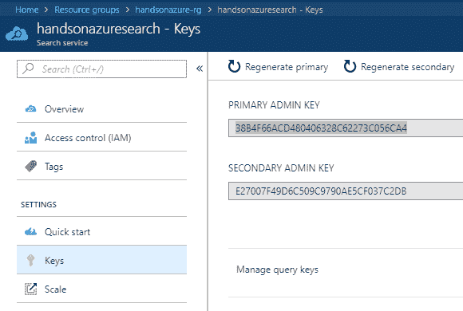

# 第五章：使用 Azure 搜索

当需要使用搜索引擎时，使用那些经过测试且在市场上存在已久的知名解决方案总是一个不错的选择。其中一种解决方案是 Azure 搜索，它提供了一个“搜索即服务”的云解决方案，并为开发者提供了 API，使得用户能够专注于开发一个有效的解决方案，而无需管理基础设施或配置。随着最近加入的认知搜索 API，我们现在可以利用人工智能功能增强搜索功能，从而将非结构化内容转化为可搜索的内容。

本章将涵盖以下主题：

+   在你的项目中使用 Azure 搜索

+   根据需求使用全文搜索

+   使用语言学分析

+   使用索引、索引定义和索引器

+   新的认知搜索 API 支持 AI 的索引工作负载

# 技术要求

要执行本章中的练习，你需要以下资源：

+   访问 Azure 订阅

+   发送 HTTP 请求的工具（cURL 和 Postman）

# 创建 Azure 搜索服务

创建 Azure 搜索是一个简单的任务，不会花费超过几分钟。这里需要记住的重要一点是，如果你需要重新创建服务，那么无法备份和恢复数据——如果你在这里犯错，所有的工作都必须从头开始。

重建的原因通常是更改搜索索引列的数据类型或其他搜索属性。虽然在本次练习中不会有问题，但在创建生产工作负载时请牢记这一点。

# 使用 Azure 门户

与 Azure 中的大多数服务一样，我们将从在门户中创建 Azure 搜索开始。为此，点击 + 创建资源并搜索 `Azure Search`。在介绍页面，点击创建按钮，这将带你进入此服务的配置界面：


如你所见，我们这里提供了相当标准的选项，现在应该不会让你感到困惑。然而，仍然有一个选择定价层级的选项，目前有不同的选项可以选择：

+   免费版：这是最基础的版本，没有可用的副本，且资源是共享的。

+   基础版：该版本提供负载均衡、扩展功能和专用资源。

+   标准版：这是三个不同的层级，提供更多的计算能力和分区。

+   高密度版：与标准版相同，但提供更多的索引（且分区较少）。这个层级特别为 SaaS 开发者设计。

在我们继续之前，你需要了解这些概念：

+   **副本**：这是你的搜索服务的一个单独实例，承载一个索引的副本。如果你有多个副本，可以对查询进行负载均衡。

+   **索引**：你可以将其理解为一个包含多行（或者换句话说，文档）的表格，并带有由服务使用的额外元数据。

+   **搜索单元**（**SU**）：这是 Azure Search 的计费单位，它是副本和分区的组合（*SU = 副本 * 分区*）。

+   **分区**：每个分区为您的 Azure Search 实例提供存储和 I/O，因此扩展此单元将提供更多存储和 I/O。

副本和分区之间的主要区别在于，如果您需要更多的计算资源，可以增加分区，而对于更大的查询量，则需要更多的副本（以便查询能够负载均衡）。

填写完所有字段并选择一个层级后，点击创建按钮，稍等片刻，直到服务创建完成。创建后，点击它并进入概览页面。在那里，选择导入数据，这样我们可以先使用一些示例数据，再深入了解 Azure Search：


在下一个页面上，您将看到多个导入记录的选项——您可以选择数据源和索引，并启用认知搜索，后续章节将讲解这个功能：


请记住，虽然可以删除或更改用于索引数据的字段，但这些操作需要重新索引所有文档。重新索引意味着您需要删除然后重新创建索引。然而，您可以在不重新索引文档的情况下添加新字段——在这种情况下，旧文档中的新列值将为 null。

由于我们选择了示例数据，索引已经填充了一些默认值。当您点击确定时，这些值将被验证，索引器页面将变得可用。您可能会好奇什么是索引器。其定义非常简单——它是一个爬虫，查看您的数据源并根据索引和存储信息之间的映射提取所有内容。例如，如果您选择了名为 `Status` 的字段作为索引的一部分，索引器将搜索所有包含该字段的记录，并将其推送到索引中。

索引器可以配置为一次性抓取数据或按计划抓取。我们将在关于索引和文档索引的部分详细讨论定期索引器。

如果您对导入配置满意，点击确定按钮，稍等片刻，直到数据被导入并索引。现在，我们可以测试服务的运行——在概览页面，您可以找到搜索探索器按钮。当您点击它时，您将看到一个新页面，在那里可以输入查询字符串和请求 URL，您可以在应用程序中使用它们来获取结果：


# Azure Search 中的全文搜索

Azure Search 的强大之处在于，当您需要执行全文搜索以找到满足查询的相关文档时。这项 Azure 服务在底层使用 **Apache Lucene**，这是一个广泛使用的高性能搜索引擎，采用 Java 编写。

你可以在这里找到关于 Lucene 的更多信息：[`lucene.apache.org/core/`](https://lucene.apache.org/core/)。这是一个开源项目，任何人都可以下载。

在本章中，你将学习如何执行全文搜索，了解其语法，并识别潜在问题。

# 发送请求

在本章的第一部分，你创建了 Azure Search 实例并看到了搜索资源管理器，它使你能够发送简单的查询。现在，我们将扩展我们的请求，以便你可以选择哪些字段用于查询分析、过滤结果以及按特定属性排序。以下是你将用于所有请求的基本 URL：

`https://handsonazuresearch.search.windows.net/indexes/realestate-us-sample/docs?api-version=2016-09-01&search=*`

当然，这会根据你的 Azure Search 实例名称、索引名称和使用的版本有所不同。URL 模板可以定义如下：

`https://[service name].search.windows.net/indexes/[index name]/docs?[query parameters]`

正如你所看到的，在这个示例中，我使用了 `*`，这基本上意味着我对所有已编制索引的文档感兴趣。然而，在继续之前，我们需要做一件事——与大多数 API 一样，Azure Search 是有安全保护的，需要一个密钥来授权请求。如果你没有发送密钥，你将收到一个 `HTTP 403 response`。要获取密钥，请访问 Azure Portal 并选择 Keys 面板：



现在，每次向你的 API 发送请求时，你都需要使用 `api-key` 头部并提供适当的值。这里是一个示例：

```
GET /indexes/realestate-us-sample/docs?api-version=2016-09-01&search=* HTTP/1.1
Host: handsonazuresearch.search.windows.net
api-key: 38B4F66ACD480406328C62273C056CA4
Cache-Control: no-cache
```

然而，在大多数情况下，我们并不关心所有可用文档——我们有特定的参数想要使用。假设你想搜索一个特定的城市。在这种情况下，我们必须使用另一个端点并传递有效的负载，这将用于构建查询：

```
POST /indexes/realestate-us-sample/docs/search?api-version=2016-09-01 HTTP/1.1
Host: handsonazuresearch.search.windows.net
api-key: {API_KEY}
Content-Type: application/json
Cache-Control: no-cache

{ 
    "search": "Sammamish", 
    "searchFields": "city"
 }
```

如你所见，我将 `HTTP` 方法改为 `POST`，并为我的请求使用了 `/search` 端点。然而，最重要的是请求体——目前我使用了两个字段：

+   `search`：这是我们的查询字符串，我们用它告诉 Azure Search 我们感兴趣的内容

+   `searchFields`：在这里我们传递了字段，这些字段应包含我们的查询字符串

请记住，请求体中传递的字段是区分大小写的，如果有多个单词，你应该遵循 camel case 规则。

如果你在示例索引上运行前面的查询，你应该能够看到返回的一些结果。如果你搜索的城市不在已编制索引的文档中，你将看到空结果：

```
{
    "@odata.context": "https://handsonazuresearch.search.windows.net/indexes('realestate-us-sample')/$metadata#docs",
    "value": []
}
```

你可能会问，选择搜索字段的规则是什么——唯一的要求是它必须被标记为`Searchable`。看看如果我使用 `beds` 来搜索特定数量的记录会发生什么：

```
{
    "error": {
        "code": "",
        "message": "The field 'beds' in the search field list is not searchable.\r\nParameter name: searchFields"
    }
}
```

看起来我们不能随意使用任何字段。你可以在索引屏幕中查看哪些字段可以用于搜索：


实际上，你不能将任何 `Edm.Int32` 类型的字段用作 `Searchable`。还有其他一些类型也不被支持（例如，`Edm.GeographyPoint`）——你可以在构建或修改用于索引的字段时找到有关它们的信息。

为了解决前面提到的问题，你可以使用过滤器——这些是基于 OData 语法的表达式，你可以利用它们来搜索你感兴趣的实体。唯一的要求是将你想用作过滤器的字段标记为 filterable。在这里，你可以找到所有可以在此类 HTTP 请求中使用的字段：

```
{
  "count": true | false(default),
  "facets": ["facet_expression_1", "facet_expression_2", ...],
  "filter": "odata_filter_expression",
  "highlight": "highlight_field_1, highlight_field_2, ...",
  "highlightPreTag": "pre_tag",
  "highlightPostTag": "post_tag",
  "minimumCoverage": #( % of index that must be covered to declare query successful; default 100),
  "orderby": "orderby_expression",
  "scoringParameters": ["scoring_parameter_1", "scoring_parameter_2", ...],
  "scoringProfile": "scoring_profile_name",
  "search": "simple_query_expression",
  "searchFields": "field_name_1, field_name_2, ...",
  "searchMode": "any" (default) | "all",
  "select": "field_name_1, field_name_2, ...",
  "skip": #(default 0),
  "top": #
}
```

我们不会涵盖所有内容，因为这将占用整个章节，然而，我们将稍微关注一下发送到 Azure Search 的查询的实际语法。你可能还记得，这项服务使用 Lucene 搜索引擎来索引数据并处理请求。Lucene 支持多种不同的查询类型，例如模糊搜索、通配符搜索等。你可以通过发送 `queryType` 参数并选择其中一个可用值——simple 或 full（Lucene），来决定使用哪种解析器。

你可以通过阅读以下页面来了解 Lucene 支持的查询操作：[`docs.microsoft.com/pl-pl/rest/api/searchservice/lucene-query-syntax-in-azure-search`](https://docs.microsoft.com/pl-pl/rest/api/searchservice/lucene-query-syntax-in-azure-search)。

# 全文搜索中的语言分析

在使用全文搜索时，你必须了解执行这些操作的规则。搜索引擎必须对搜索查询进行词法分析，才能提取重要信息并将其传递给查询树。在本节中，我们将讨论最常见的词法分析，即语言分析，帮助你理解 Azure Search 如何工作，以及如何执行正确的查询。

# Azure Search 中的分析器

为了进行语言分析，Azure Search 支持多种不同的分析器，可以在索引定义中指定。然而，在我们开始定义这些分析器之前，你需要了解我们所谈论的内容。在创建索引时，每个搜索服务必须分析所有输入文档，并决定在执行搜索时哪些内容是重要的。

此外，每个搜索查询应该根据一些常见规则进行调整，以便搜索引擎能够理解。必要的操作可以描述如下：

+   所有非必要的词应被删除（例如，英语中的 "the"）。

+   所有单词应转换为小写字母。

+   如果一个词包含多个单词（例如 "up-front"），它应当被拆分成原子单词。

现在，假设你使用以下搜索查询来搜索一个公寓：

```
Spacious apartment with 4 and the Red Kitchen
```

你的分析器必须在将查询传递给搜索引擎之前执行所有上述操作，事实上，这里你可以找到这种分析的结果：

```
{
    "@odata.context": "https://handsonazuresearch.search.windows.net/$metadata#Microsoft.Azure.Search.V2016_09_01.AnalyzeResult",
    "tokens": [
        {
            "token": "spacious",
            "startOffset": 0,
            "endOffset": 8,
            "position": 0
        },
        {
            "token": "apartment",
            "startOffset": 9,
            "endOffset": 18,
            "position": 1
        },
        {
            "token": "with",
            "startOffset": 19,
            "endOffset": 23,
            "position": 2
        },
        {
            "token": "4",
            "startOffset": 24,
            "endOffset": 25,
            "position": 3
        },
        {
            "token": "and",
            "startOffset": 26,
            "endOffset": 29,
            "position": 4
        },
        {
            "token": "the",
            "startOffset": 30,
            "endOffset": 33,
            "position": 5
        },
        {
            "token": "red",
            "startOffset": 34,
            "endOffset": 37,
            "position": 6
        },
        {
            "token": "kitchen",
            "startOffset": 38,
            "endOffset": 45,
            "position": 7
        }
    ]
}
```

如你所见，每个单词都有其特定的位置和偏移量。为了获得与之前相似的结果，你可以发送以下查询：

```
POST /indexes/[index name]/analyze?api-version=2016-09-01 HTTP/1.1
Host: [service name].search.windows.net
api-key: [api key]
Content-Type: application/json
Cache-Control: no-cache

{
  "text": "Spacious apartment with 4 and the Red Kitchen",
  "analyzer": "standard"
}
```

在请求的正文中，你必须提供要分析的文本并使用分析器。请注意，我在这里使用了`standard`，这意味着使用的是标准的 Lucene 分析器。

Azure Search 支持多种不同语言的分析器——更重要的是，Microsoft 和 Lucene 版本都可用。要获取完整的列表，请访问文档页面：[`docs.microsoft.com/pl-pl/rest/api/searchservice/language-support`](https://docs.microsoft.com/pl-pl/rest/api/searchservice/language-support)。

如果你精通语言分析和语法，你可以创建一个自定义分析器用于文本分析。此类分析器可以在索引创建时定义，然而，我们在本书中不会讨论这个主题，因为它是一个高级练习，超出了我们目前的范围。你可以在本章的*进一步阅读*部分找到该教程的链接。

# 分析器选择

你可以在创建索引时或在编辑索引时为特定字段选择一个分析器。如果你进入 Azure 门户并选择你的 Azure Search 实例*，*你可以点击一个索引并选择“字段”部分。它应该显示该索引中所有字段的列表：


现在，当你向下滚动时，你会看到你能够添加一个新字段。如果你想选择一个分析器，你需要执行以下操作：

1.  在该界面顶部选择复选框分析器

1.  将“可搜索”选项选择为该字段的选项

现在，你应该看到一个下拉列表，你可以从中选择一个与自定义分析器不同的分析器：


请注意，当字段包含多种语言时，选择不同于自定义分析器的分析器非常重要。在这种情况下，你应该选择适合所使用语言的分析器。

# 在 Azure Search 中进行索引

索引是 Azure Search 中最重要的构造之一。我们将其定义为包含所有导入文档的表格，表格中定义了可搜索的数据。在本章的开头，你学习了如何创建它并添加或编辑字段。在本节中，你将进一步了解如何修改它，因为索引并不是一个无法更改的固定实体，你可以根据需要进行调整。

# 导入更多数据

总是需要将更多数据推送到你的索引中——随着应用程序的发展，你的文档存储会越来越大，尤其是当你正在创建文档库，并且希望能够在最新的文档中找到你所搜索的内容时。实际上，有两种方式可以向你的索引中添加数据：

+   推送模型

+   拉取模型

我们将在接下来的章节中讲解它们。

# 推送模型

推送模型是满足低延迟要求的应用程序的最佳解决方案。与拉取模型不同，对于推送模型，在使用 RESTful API 推送文档后，您的文档将立即被索引。

目前，除使用 RESTful API 或.NET SDK 执行操作外，无法使用其他方法实现推送模型。在拉取模型中，也可以使用 Azure 门户获取数据。

在这里，您可以找到推送文档的示例请求：

```
POST /indexes/realestate-us-sample/docs/index?api-version=2016-09-01 HTTP/1.1
Host: [service name].search.windows.net
api-key: [api key]
Content-Type: application/json
Cache-Control: no-cache

{ 
  "value": [ 
    { 
      "listingId": "12344234",
      "@search.action": "upload", 
      "price": 250.0, 
      "description": "The very apartment in Warsaw", 
      "city": "Warsaw", 
      "tags": ["pool", "view", "wifi", "gym"], 
      "beds": 4, 
      "location": { "type": "Point", "coordinates": [52.237049, 21.017532] } 
    } 
  ] 
}  
```

如果一切正确，您应该能够看到成功的结果：

```
{
    "@odata.context": "https://handsonazuresearch.search.windows.net/indexes('realestate-us-sample')/$metadata#Collection(Microsoft.Azure.Search.V2016_09_01.IndexResult)",
    "value": [
        {
            "key": "12344234",
            "status": true,
            "errorMessage": null,
            "statusCode": 201
        }
    ]
}
```

现在，我想检查我的文档是否已被索引并可用：

```
POST /indexes/realestate-us-sample/docs/search?api-version=2016-09-01 HTTP/1.1
Host: [service name].search.windows.net
api-key: [api key]
Content-Type: application/json
Cache-Control: no-cache

{ 
    "search": "Warsaw", 
    "searchFields": "city"
} 
```

结果应为包含我们在推送请求中传递的所有字段的文档。

# 拉取模型

拉取模型与推送模型略有不同，因为它使用索引器来实际获取数据。在使用它时，您需要配置数据源以及数据拉取的频率。与推送模型不同，拉取模型可以在使用 Azure 门户时进行配置和访问。

请注意推送和拉取之间的一个重要区别——在使用推送时，您可以使用任何您想要的数据源。而在使用拉取模型时，您仅限于 Blob 存储、表存储、CosmosDB 和 SQL 数据库（无论是 Azure 上的还是虚拟机中的）。

在这里，您可以找到当使用表存储作为数据源时，拉取数据的索引器配置：


请记住，在使用示例数据时，无法配置拉取策略。

更重要的是，您可以通过点击“索引器”按钮，在概述面板中访问索引器配置和当前状态：


# 认知搜索 – 为索引工作负载添加 AI

创建和管理索引时，您始终需要确保已选择所有必需字段，并在需要时将其标记为可搜索。此外，我们受到当前服务功能的限制，因此无法使用图像或自然语言处理等功能。幸运的是，Azure 服务即将开始支持认知搜索功能，它将 AI 添加到您的索引操作中，从而使用更多的向量进行更丰富的分析。在本章中，您将学习如何配置它，以便从一开始就能开始使用。

# 配置认知搜索

认知搜索可以在导入数据时为您的服务进行配置。当您点击“导入数据”按钮时，您会看到其中一个可用的部分正是该功能：


在撰写本文时，此功能仅在美国南中部和西欧地区可用。

有一份可以用于为数据编制索引的认知技能列表。是否使用这些技能取决于你的实际需求——在本练习中，我选择了检测语言。你还可以自定义字段的名称；如果你的索引中包含另一个同名字段，这一点尤为重要，因为它将被添加到查询结果中。当你完成索引配置后，可以将之前的索引与通过 AI 丰富的最新索引进行比较：


如你所见，由于我们没有使用语言字段，因此这里缺少该字段。让我们将其与最新的索引进行比较：


此外，当我使用较新的索引查询服务时，结果中会包含已填充的语言字段：

```
{
(...)
"location": {
  "type": "Point",
  "coordinates": [
    -122.388,
    47.576
  ],
  "crs": {
    "type": "name",
    "properties": {
      "name": "EPSG:4326"
    }
  }
},
"price": 762048,
"thumbnail": "https://searchdatasets.blob.core.windows.net/images/bd2bt2apt.jpg",
"tags": [
  "condominium",
  "dream home",
  "lake access",
  "no outlet",
  "miele appliances",
  "wall of windows",
  "guest room"
],
"language": "en"
}
```

# 总结

Azure 搜索是一个出色的服务，适合你拥有自己的搜索解决方案，并且不打算维护其基础设施和配置。凭借其灵活性和直观性，你可以快速开发应用程序，利用推送/拉取模型、定时索引或支持不同数据源等功能。此外，即使对于生产工作负载，从免费层开始也能逐步进展，随着需求的变化调整成本，按实际需求扩展解决方案。在第六章，《使用通知中心的移动通知》中，我们将讨论如何通过 Azure 通知中心处理移动应用程序和推送通知的相关主题。

# 问题

1.  什么是索引？

1.  推送模型和拉取模型有什么区别？

1.  是否可以使用自定义间隔安排索引器？

1.  Azure 搜索默认使用什么分析器？

1.  是否可以实现自定义分析器并在 Azure 搜索中使用？

1.  分区和副本之间有什么区别？

1.  用于授权请求到 Azure 搜索的头部名称是什么？

# 进一步阅读

+   Azure 搜索文档：[`docs.microsoft.com/zh-cn/azure/search/`](https://docs.microsoft.com/en-us/azure/search/)

+   Azure 搜索的认知技能：[`docs.microsoft.com/zh-cn/azure/search/cognitive-search-predefined-skills`](https://docs.microsoft.com/en-us/azure/search/cognitive-search-predefined-skills)

+   Apache Lucene 文档：[`lucene.apache.org/core/`](https://lucene.apache.org/core/)

+   Azure 搜索中的筛选器：[`docs.microsoft.com/zh-cn/rest/api/searchservice/odata-expression-syntax-for-azure-search`](https://docs.microsoft.com/en-us/rest/api/searchservice/odata-expression-syntax-for-azure-search)
