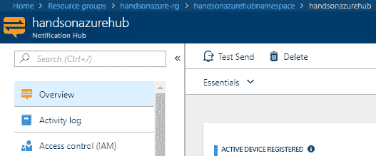

# 使用通知中心进行移动通知

推送通知是许多移动应用的主要功能之一。它们帮助用户了解等待操作的通知，或者关于仅在应用内存在几分钟的临时折扣。虽然每个移动操作系统供应商都有自己的通知服务，但将此类功能集中配置在一个地方总是很好的，这样我们就不必担心底层 API 或所需参数的变化。Azure 通知中心通过提供一个单一的服务，作为我们移动应用的单一端点，极大简化了开发和测试过程。

本章将涵盖以下主题：

+   通知中心及其好处

+   通知架构以及发送通知到移动应用的最佳模式

+   在通知中心注册设备并保持注册信息

+   向多个供应商发送通知

+   通过通知中心发送富媒体内容的通知

# 技术要求

要进行本章的练习，你需要以下资源：

+   一个有效的 Azure 订阅

+   安装了通用 Windows 应用工具的 Visual Studio 2017

+   一个 Windows Store 账户

# 使用通知中心的理由

如果你曾经有机会开发一个与任何通知系统集成的应用程序，你可能会了解在创建这样的产品时所面临的挑战。在本章中，我将尝试向你介绍一些基本概念，如 PNS、推送通知和设备注册。这样，我们就能轻松开始开发利用通知中心功能的应用程序，专注于学习细节和隐藏功能。

本章的练习是为**通用 Windows 平台**（**UWP**）应用程序编写的——不过，所介绍的概念也适用于其他平台，如 Android 或 iOS。

# 应用设计的挑战

假设你有如下架构：


在这里，我们有一个后端系统，将消息发送到三个不同的平台：

+   iOS

+   Android

+   Windows

现在，如果这些消息是推送通知，我们的后端将需要与三个不同的服务进行通信：

+   **苹果推送通知服务**（**APNS**）

+   **Firebase 云消息推送**（**FCM**）

+   **Windows 通知服务**（**WNS**）

这些服务被称为**平台通知服务**（**PNS**）。它们的责任是接受发送通知的请求并将其发送到相应的设备。它们还处理希望接收通知的设备的注册（例如，APNS 中的令牌）。这种解决方案的缺点是，这些服务没有共同的接口——我们无法在后台引入一个简单的封装器以相同的方式处理每个请求。解决这种问题的方法是稍微调整我们的架构，使其包含一个能够汇总每个 PNS 逻辑并与其通信的服务：


通知中心就是这样一个服务；它是不同平台通知服务（PNS）的抽象层，能够处理不同的设备注册。我们还可以考虑另外两个问题——扩展性和路由。需要知道的是，根据 PNS 的指南，设备令牌必须在每次应用启动时刷新。现在，如果这是你的后台责任，你可能最终会得到一个试图处理刷新请求的解决方案，而不是专注于业务逻辑。

此外，如果你想向特定设备发送通知，你必须将其标识符存储在某个地方，以便能够将消息路由到该设备。所有这些责任都可以转移到通知服务上，这样所有的额外负担都可以从后台移除。

# 推送通知架构

创建一个完全依赖推送通知的系统并不是一件简单的事。除了确保你不单独处理每个 PNS 的逻辑，并提供可靠的设备注册和路由系统外，你还必须引入一个消息传递管道，将消息从系统的一个部分传递到最终设备。在本节中，我们将重点介绍如何将通知中心集成到几个参考架构中，这将帮助你理解它的作用以及不同云服务之间的连接。

# 直接连接

我们能想到的最简单架构是后台与通知服务之间的直接连接：


在这种情况下，每个发送通知请求都由通知服务处理，该服务与不同的 PNS 进行通信。每个 PNS 单独处理请求，并将通知发送到已注册的设备。设备注册由通知服务处理——每个设备必须在通知服务中注册，才能接收通知。请注意，即使在这种简单的场景中，通知服务（在我们的案例中是通知中心）也负责两件重要的事情：

+   为不同的 PNS 提供统一接口

+   处理设备注册和路由

设备永远不会直接与 PNS 本身通信——它们仅通过向通知服务发送请求来接收推送通知。

# 排队通信

有时，将 Notification Service 暴露给后端并不是最佳选择——它可能变得无响应，出现性能问题，或者只是过载。在这种情况下，拥有一个可以缓存消息并在所有问题解决之前存储它们的服务总是好的。让我们通过添加一个服务来修改之前的架构：


通过引入带有读取器的队列，你可以将后端从处理与 Notification Service 的通信中解脱出来，并将消息传递的责任转移给它们。现在，后端不需要知道如何处理未发送的消息，也不会知道存储它们的存储位置。这个解决方案比之前的方案更容易扩展，因为你不必担心丢失消息——队列应该能够根据需要缓存它们。

确保你的缓存机制在你所处理的业务领域中是合理的。例如，缓存一个通知请求一天，并在那时之后发送通知，在诸如地理定位、特定时间或短期折扣等场景中可能没有意义。

# 触发的通信

有时，你可能希望根据一些特定的参数或事件触发来发送通知。假设你希望每次上传照片到存储时发送通知：


在这个异步场景中，你有一个事件监听器，它监听事件发布，并根据传递的元数据执行相应的操作。它向 Notification Service 发送请求，后者与 PNS 通信，发送包含适当内容（可能是关于上传状态的信息）的通知。再次，我们看到了拥有作为 PNS 代理服务的优势——整个通信可以是异步的，每个组件都有自己的职责。

# 在 Notification Hub 中注册设备

要能够实际发送通知，你必须在 PNS 中注册一个设备。如果不使用类似 Notification Hub 这样的服务，你将不得不了解每个 PNS 的个别逻辑，并将设备数据存储在某个地方。这样的挑战在大多数情况下是有问题的，因为通常你不希望自己处理外部依赖关系；而是你的目标是简化整体系统逻辑。在本节中，你将学习如何在 Notification Hub 中处理设备注册以及如何监控它。

# Notification Hub 设备注册

当你在 Notification Hub 中注册设备时，实际上是将设备与通知模板和标签关联起来。为了创建这样的链接，你需要一个 PNS 句柄，可以理解为一个特定厂商的标识符（例如令牌或 GCM 注册 ID）。事实上，注册设备有两种方式：

+   **使用注册**：你需要传递标识符、标签和模板

+   **使用安装**：增强的注册，包含一组额外的与推送相关的属性

请注意，目前，如果您想使用安装功能，是无法使用 .NET SDK 的—您只能使用服务的 REST API。

我们还需要描述标签和模板，以便充分理解这一过程：

+   **标签**：这是一种将通知路由到特定设备组（或所有设备）的方法。它允许您对用户进行分段，从而轻松决定谁是消息的接收者；例如，您可以使用 `version_Beta` 将通知发送到使用您应用程序预览版本的有限设备组。

+   **模板**：这是一种特定的数据模式，设计用于发送到客户端应用程序。它根据使用的推送通知服务（PNS）有所不同，从 JSON 数据到 XML 文档不等。通过使用通知中心，您可以创建一个平台无关的模板，这个模板可以在不同平台之间重复使用。

现在我们将尝试使用两种方法注册设备，并了解它们之间的区别。

# 创建通知中心

在我们开始发送通知之前，我们必须先有一个已配置并正常运行的通知服务。要创建一个通知中心实例，进入门户并点击 + 创建资源按钮。搜索“通知中心”并点击“创建”。在这里，您可以看到一个已完成的配置：


如您所见，屏幕上没有什么意外情况—需要澄清的唯一事项是定价层级和命名空间：

+   命名空间：您可以在同一个命名空间中拥有多个通知中心。命名空间是您通知中心的逻辑容器，并持有可用推送次数的限制。

+   定价层级：根据选择的层级（免费、基础或标准），您将拥有不同的功能和不同数量的可用推送次数。此外，它还定义了额外推送次数的价格和激活设备的数量。更重要的是，标准层级提供了便利的企业功能，如多租户或定时推送。

对于本次练习，免费层级就足够了。一旦您对配置满意，点击创建按钮，并等待片刻，直到服务创建完成。当创建完成后，您可以进入其页面，看到概览页面：


在那里，您可以点击您创建的中心，查看其功能。我们将在本章稍后介绍这些功能。

# 在应用程序中注册

在这一部分，我们将尝试使用 Visual Studio 中的 UWP 应用程序进行注册。首先，从本章的源代码中打开 `HandsOnAzureApp` 项目—您应该能看到一个带有基本代码的空白 UWP 应用程序。

我们在这里将使用一个 UWP 应用程序，因为它是开始使用和操作通知中心的最简单方式。然而，如果你是移动开发者，你可以使用任何你想要的项目类型。

要开始注册，你需要安装一个包来与通知中心进行交互——使用 NuGet 包管理器，搜索`WindowsAzure.Messaging.Managed`包，该包包含了本练习所需的所有组件。在`App.xaml.cs`文件中，你需要添加以下代码：

```
private async void RegisterADevice()
{
  var channel = await PushNotificationChannelManager.CreatePushNotificationChannelForApplicationAsync();
  var hub = new NotificationHub("<hub-name>", "<connection-string>");
  var result = await hub.RegisterNativeAsync(channel.Uri);

  if (result.RegistrationId == null) return;

  var dialog = new MessageDialog("Registration successful: " + result.RegistrationId);
  dialog.Commands.Add(new UICommand("OK"));
  await dialog.ShowAsync();
}
```

我们在这里做的事情可以描述如下：

1.  我们正在创建一个通知通道，用于注册

1.  我们正在定义一个中心，供我们处理通知和注册

1.  我们正在注册一个设备，并在操作成功时显示一个对话框

你可能想知道如何获取用于通信的连接字符串；要获取它，请前往 Azure 门户，选择你的通知中心命名空间，然后点击访问策略（Access Policies）选项卡——在那里你会看到一个名为`RootManageSharedAccessKey`的策略，你可以从中复制连接字符串。

我仅为本练习使用根策略。在生产环境中，最好为每个应用程序创建一个独立的策略，并仅选择所需的权限。

当你输入你的中心名称并粘贴连接字符串后，调用`RegisterADevice()`方法，放在`OnLaunched()`中。现在，你可以尝试启动应用程序。如果一切顺利，你应该会看到一个类似于我屏幕的界面：


恭喜你——你刚刚在通知中心注册了你的第一个设备！

# 检查可用的注册

一旦注册了设备，你需要确保它确实在通知中心中可用。最简单的方式是使用服务器资源管理器（Server Explorer）检查设备注册情况，可以通过在视图（View）菜单中点击它（视图 | 服务器资源管理器）或使用*Ctrl* + *W* + *L*快捷键组合来访问：


现在，当你双击你想要检查的通知中心实例时，你会看到一个新屏幕，包含两个标签——测试发送（Test Send，稍后我们会讲解）和设备注册（Device Registrations）。

通过点击后者，你可以验证所有可用的注册：


# 使用安装

安装是一个较新的功能，它允许你使用稍有不同的语法和工具处理每个设备注册。它相较于注册有几个重要的优势：

+   虽然可以重复注册（通过两次注册相同的设备），但安装是幂等的。这意味着多次发送相同的安装不会导致创建多个注册记录。

+   使用`HTTP PATCH`，你可以更新安装中的特定参数。

+   执行单个推送操作更为简单，因为每个安装包会自动标记安装标识符。在注册时，您需要自己创建这样的标签，并以某种方式维护它，以便获得相同的功能。

正如我在本书的前面部分所说，目前不能在客户端使用 .NET SDK 来使用安装包——要检查此功能，我们必须使用通知中心 RESTful API 或使用后台 SDK。这里，您可以找到调用 API 方法的示例请求：

```
PUT /<hub>/installations/12234?api-version=2015-01 HTTP/1.1
Host: <namespace>.servicebus.windows.net
Authorization: <authorization token>
Content-Type: application/json
Cache-Control: no-cache

{ 
    "installationId": "12234", 
    "platform": "wns", 
    "pushChannel": "<push channel>", 
    "templates": { 
        "myTemplate" : { 
            "body" : '<toast><visual lang="en-US"><binding template="ToastTest01"><text id="1">$myTextProp1</text></binding></visual></tile>',
            "headers": { "X-WNS-Type": "wns/toast" }, 
            "tags": ["foo", "bar"] 
            } 
        } 
} 
```

要生成授权令牌，您需要生成一个 SAS 令牌。您可以在这里找到如何生成它的指南 [`msdn.microsoft.com/library/azure/dn495627.aspx`](https://msdn.microsoft.com/library/azure/dn495627.aspx)。

# 发送通知

通知中心的主要功能是将通知发送到一组已注册的设备。您会看到，使用它的 SDK 和门户，您可以轻松开始使用此功能，而无需了解不同推送通知服务（PNS）的内部逻辑。通过这一部分，您应该能够顺利使用通知中心并将其集成到您的应用程序中。

# 发送测试通知

在开发应用程序时，您总是需要一种测试它的方法。使用通知中心时，您有两种发送测试通知的选择——要么使用门户，要么使用其 SDK。这两种方式都能达到类似的效果；然而，使用 SDK 更加灵活，因为它能更轻松地找到您希望发送通知的所有设备，或者添加任何逻辑。

# 在 Azure 门户中的测试通知

当您进入已创建的中心时，您会看到在页面顶部有一个 Test Send 按钮：



当您点击它时，您会看到一个用于测试发送功能的屏幕。这里有一些字段，所有这些字段都依赖于所选的平台。以下是 Windows 平台的示例请求：


现在，如果您点击“发送”按钮，通知中心将选择十个不同的已注册设备，这些设备将接收到通知。如果您愿意，您可以更改发送的类型和负载。更重要的是，您还可以通过指定“发送到标签表达式”选项，将消息发送给特定的设备集合。

# SDK 中的测试通知

也可以使用通知中心 SDK 发送测试通知。要使用它，您需要安装以下包：`Microsoft.Azure.NotificationHubs`。请参考以下示例：

```
var hub = NotificationHubClient.CreateClientFromConnectionString(
                "<connection string>",
                "<hub>", true);
```

最后一个参数允许发送测试通知。这意味着，每次您使用 SDK 发送通知时，它将发送到最多十个已注册的设备。此外，您还会看到每个操作的结果（是否成功或失败）。

请记住，当启用测试模式时，每个对通知中心的请求都会被限流。这意味着您无法过度加载通信通道，因为发送操作将被排队并以受控方式执行。

您可以通过检查 `NotificationHubClient` 对象上的一个属性来检查是否启用了测试发送：

```
var hub = NotificationHubClient.CreateClientFromConnectionString(
                "<connection string>",
                "<hub>", true);
if (hub.EnableTestSend)
{
    // Do something....
}
```

# 使用 SDK 发送通知

通知中心 SDK 提供了许多不同的方法来发送通知，具体取决于配置和期望的输出。在这里，您可以找到 SDK 中所有可用的方法：

```
hub.SendAdmNativeNotificationAsync();
hub.SendAppleNativeNotificationAsync();
hub.SendBaiduNativeNotificationAsync();
hub.SendDirectNotificationAsync();
hub.SendNotificationAsync();
hub.SendTemplateNotificationAsync();
hub.SendGcmNativeNotificationAsync();
hub.SendWindowsNativeNotificationAsync();
```

如您所见，我们有两种不同的类别：

+   **原生通知**：仅用于向特定平台发送通知的方法

+   **通用通知**：一组用于向特定标签发送通知的方法

我强烈建议您尝试和测试不同的可能性，因为每种方法略有不同。这里您可以看到调用 `SendAppleNativeNotificationAsync()` 并序列化输出的结果：

```
var hub = NotificationHubClient.CreateClientFromConnectionString(
                "<connection string>",
                "<hub>", true);
hub.SendAppleNativeNotificationAsync("{\"aps\":{\"alert\":\"Notification Hub test notification\"}}");
```

在我的情况下，结果将如下所示：

```
{
  "Result": {
    "Success": 8,
    "Failure": 0,
    "Results": [{
      "ApplicationPlatform": "apple",
      "PnsHandle": "<pns handle>",
      "RegistrationId": "1013412858828458675-3388525925469165319-3",
      "Outcome": "The Notification was successfully sent to the Push Notification System"
    }, {
      "ApplicationPlatform": "apple",
      "PnsHandle": "<pns handle>",
      "RegistrationId": "4629243313258036270-2338090353657828558-2",
      "Outcome": "The Notification was successfully sent to the Push Notification System"
    }, {
      "ApplicationPlatform": "apple",
      "PnsHandle": "<pns handle>",
      "RegistrationId": "5538320565569680693-6905916546981709583-3",
      "Outcome": "The Notification was successfully sent to the Push Notification System"
    }, {
      "ApplicationPlatform": "apple",
      "PnsHandle": "<pns handle>",
      "RegistrationId": "5711668963446635284-8967913844749790004-1",
      "Outcome": "The Notification was successfully sent to the Push Notification System"
    }, {
      "ApplicationPlatform": "apple",
      "PnsHandle": "<pns handle>",
      "RegistrationId": "5728263539515349341-3583197654290557965-2",
      "Outcome": "The Notification was successfully sent to the Push Notification System"
    }, {
      "ApplicationPlatform": "apple",
      "PnsHandle": "<pns handle>",
      "RegistrationId": "6986970356553456728-8953287549645821249-1",
      "Outcome": "The Notification was successfully sent to the Push Notification System"
    }, {
      "ApplicationPlatform": "apple",
      "PnsHandle": "<pns handle>",
      "RegistrationId": "7231787013272625417-8398074035919763615-3",
      "Outcome": "The Notification was successfully sent to the Push Notification System"
    }, {
      "ApplicationPlatform": "apple",
      "PnsHandle": "<pns handle>",
      "RegistrationId": "8026985566358875763-8860727728212773916-1",
      "Outcome": "The Notification was successfully sent to the Push Notification System"
    }]
  },
  "Id": 9,
  "Exception": null,
  "Status": 5,
  "IsCanceled": false,
  "IsCompleted": true,
  "CreationOptions": 0,
  "AsyncState": null,
  "IsFaulted": false
}
```

如您所见，我们得到了向一组注册设备发送通知的完整结果。您可以利用该输出与您的应用程序进行交互，例如显示适当的状态或报告。

# 富内容通知

在本章的最后部分，我们将讨论另一种类型的通知，称为 **富内容通知**。有时您可能希望发送的不仅仅是纯文本。在通知中心中，您可以发送例如图像来增强应用程序的外观和感觉。

请注意，接收富内容通知需要在客户端进行更改。我们将在本章中不涉及该内容，但在章节结束时，您将找到一个链接，其中详细描述了如何进行此类操作。

# 创建并发送富内容通知

要创建并发送富内容通知，您需要两个东西：

+   通知模型

+   通知负载和内容

这个思路是以一种方式发送通知，使客户端应用程序能够获取富内容并在客户端处理。事实上，最简单的方法是拥有一个 API 提供两个操作：

+   发送通知

+   获取通知数据

在接下来的内容中，您可以找到两个操作的示例代码：

```
public class HubController : ApiController
{
  public static Lazy<NotificationHubClient> Hub = new Lazy<NotificationHubClient>(() =>
    NotificationHubClient.CreateClientFromConnectionString("<connection string>", "<hub>"));

  [HttpPost]
  public async Task<HttpResponseMessage> Send()
  {
    var notification = new Notification("Hey, check this out!");
    var fullNotification = "{\"aps\": {\"content-available\": 1, \"sound\":\"\"}, \"richId\": \"" + notification.Id +
            "\", \"richMessage\": \"" + notification.Message + "\", \"richType\": \"" +
            notification.RichType + "\"}";

    await Hub.Value.SendAppleNativeNotificationAsync(fullNotification, "<tag>");
    return Request.CreateResponse(HttpStatusCode.OK);
  }

  public HttpResponseMessage Get(string id)
  {
    var image = Notification.ReadImage(id);
    var result = new HttpResponseMessage(HttpStatusCode.OK) {Content = new StreamContent(image)};
    result.Content.Headers.ContentType = new System.Net.Http.Headers.MediaTypeHeaderValue("image/{png}");

    return result;
  }
}
```

如您所见，我们需要做的唯一事情就是保持正确的架构，以便向特定的 PNS 发送通知。在之前的示例中，我使用了 APNS，但当然也可以使用其他供应商（只要他们的软件支持通过推送通知接收图像或音频）。您可以在本章的源代码中找到示例。

# 总结

在本章中，你已经了解了什么是通知中心，以及如何使用它将推送通知集成到应用程序中。我们介绍了一些参考架构和可能的场景，这应该有助于你理解该服务的目的，并且当向多个 PNS 和设备发送通知时，它是如何解决问题的。

本章结束了本书的第一部分。在接下来的章节中，我们将重点介绍无服务器组件和架构。

# 问题

1.  什么是 PNS？

1.  不同平台（iOS、Android 和 Windows）是否有不同的 PNS？

1.  注册和安装之间有什么区别？

1.  在免费和基础套餐中，你能否注册相同数量的设备？

1.  检查通知中心中已注册的设备的最简单方法是什么？

1.  如何发送测试通知？

1.  什么是富媒体内容通知？

# 深入阅读

+   Azure 通知中心文档: [`docs.microsoft.com/zh-cn/azure/notification-hubs/`](https://docs.microsoft.com/en-us/azure/notification-hubs/)

+   IOS 推送通知: [`docs.microsoft.com/zh-cn/azure/notification-hubs/notification-hubs-aspnet-backend-ios-apple-push-notification-service-apns-rich`](https://docs.microsoft.com/en-us/azure/notification-hubs/notification-hubs-aspnet-backend-ios-apple-push-notification-service-apns-rich)

+   Azure 通知中心中的注册管理: [`docs.microsoft.com/zh-cn/azure/notification-hubs/notification-hubs-push-notification-registration-management`](https://docs.microsoft.com/en-us/azure/notification-hubs/notification-hubs-push-notification-registration-management)
