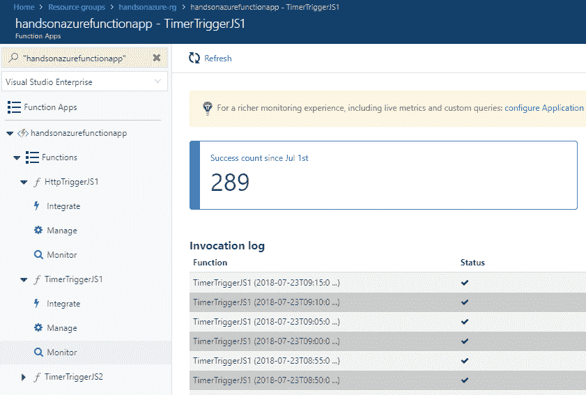

# 第七章：无服务器和 Azure Functions

Azure Functions 是 Azure 无服务器架构的主要产品。它们允许在完全托管的运行时内执行小段代码，因此我们不需要关心性能和可扩展性。它们是开源的，支持扩展，并建立在 App Services 之上，因此它们提供类似于 WebJobs 的体验。微软非常重视 Azure Functions 的新特性开发，并且在社区的极大支持下，它是快速开发简单和复杂应用程序的最佳工具之一。

本章将涵盖以下主题：

+   理解 Azure Functions

+   配置本地开发环境以开发 Azure Functions

+   创建一个函数

+   Azure Functions 特性

+   Azure Functions 中的工作流——持久化函数

+   将函数与其他服务集成

# 技术要求

要开始使用 Azure Functions 并执行本章中的练习，你需要以下内容：

+   已安装 Azure 工作负载的 Visual Studio 2017

+   Azure Functions 和 Visual Studio 的 WebJobs 工具扩展

# 理解 Azure Functions

Azure Functions 是 Azure 云中可用的所谓无服务器组件的一部分。在你开始学习这个特定服务之前，你需要理解无服务器究竟意味着什么。虽然最初你可能会认为这个概念意味着完全没有服务器，但你很快会重新评估自己的思维方式（毕竟，我们距离完全不使用任何类型的机器来处理我们的应用和工作负载还有一段距离）。

# 实现“无服务器”

你可以轻松找到许多描述“无服务器”这一术语的不同文章——老实说，我不想推动一种唯一正确的定义，因为这个话题目前仍然模糊，很难找到最好的描述。然而，我的目标是给你一些提示和最佳实践，帮助你以最适合自己的方式理解它。

# 云供应商的责任

我们将从以下截图开始：


在之前的截图中，你可以看到关于供应商责任的无服务器架构与两种最流行的云模型的比较。我使用五个不同的领域进行了对比：

+   **数据中心**：数据中心基础设施、安全性、维护和人员配置

+   **网络安全**：实现有关网络的正确和安全的解决方案（防火墙、渗透测试和抗 DDoS 解决方案）

+   **操作系统**：更新、维护和配置

+   **开发工具**：为程序员和管理员开发和交付多个功能（例如 IDE 扩展、管理门户以及管理服务的相关工具）

+   **应用托管**：托管和运行我们应用的特定运行时（例如应用服务计划）

正如您所看到的，唯一的区别（至少在使用描述的特征时）是应用主机。在涉及无服务器组件时，您向解决方案提供的唯一内容是您的代码（或某种配置，用于设置服务）—其余内容由您的云供应商提供和处理。当然，这不是定义这个想法的唯一方式。

# 定价模型

无服务器服务和架构最受欢迎的功能之一是支付执行次数和使用的计算能力的可能性。这种定价模型与最常见的预付费模型完全相反，在预付费模型中，您根据一组配置字段（如使用的 VM 数量或集群大小）支付固定价格。在这里，您可以找到描述 Azure Functions 定价的表格：

| 计量单位 | 价格 | 免费赠款（每月） |
| --- | --- | --- |
| 执行时间 | €0.000014/GB/s | 400.000 GB/s |
| 总执行次数 | €0.169 每百万次执行 | 100 万次执行 |

现在，您可能想知道如何理解这一点，以便计算您解决方案的预估成本。为了使您的计算正确，您必须理解两件事：

+   **执行**：这是一个持续*N*秒的单个函数执行

+   **消耗**：这定义了您的函数在固定时间内消耗的资源（CPU 和内存）

现在，如果您将前述术语与表格进行比较，您将看到它们略有不同。这是因为 Azure Functions 的定价不直接定义消耗的价格，而是使用执行时间。

您可能已经注意到定价表中的免费赠款列。请记住，它仅适用于消费模型—对于预付费模型不起作用。

现在，让我们假设您已经估算了以下内容：

+   您每月需要对您的函数进行 1000 万次执行

+   每次执行持续约 80 毫秒

+   每次执行您使用 145 MB 的内存

要计算使用 Azure Functions 的整体价格，您可以使用以下公式：


在前面的公式中，适用以下内容：

+   **Rc**：资源消耗定义为消耗的内存和执行时间的乘积（以 GB/s 为单位）

+   **Te:** 总执行次数（以百万为单位）

现在，如果您输入正确的值并计算公式，您将得到以下结果：


这将为您带来以下费用：5.19 欧元。然而，您可能会发现之前的公式有点令人困惑——为什么我使用*256*（而不是 128）作为内存消耗量，*1 Ms*（而不是 800 Ks）作为执行时间？嗯，在使用消费计划时有一件重要的事情要记住：最小执行时间为 100 毫秒，而在资源消耗方面，总是**向最近的 128 MB 四舍五入**。

实际上，在函数执行时，你无法低于 100 毫秒和 128MB 的内存使用量。这在计算可能的成本优化时非常重要，因为通常你不应专注于优化函数，而应集中精力于整体算法的改进（例如批处理或更好的序列化方法）。

# Azure Functions 概念

现在你对无服务器架构有了些许了解，我们可以开始学习 Azure Functions 的其他内容。为了继续，你需要理解以下主题之间的区别：

+   函数应用

+   函数

+   触发器和绑定

# 函数应用

多个函数的逻辑容器称为函数应用。一个函数应用可以托管一个或多个函数，它们将共享配置、设置和运行时版本。可以在同一个函数应用中使用多种语言运行函数。

在这里，你可以看到一个单独的函数应用的样子，里面托管着多个独立的函数：


如果你需要同时使用两种定价计划（按需计费和应用服务），你必须创建两个不同的函数应用，因为单个函数应用不支持这种场景。

# 函数

托管你代码的 Azure Functions 的单个可执行部分称为**函数**。每个函数都可以执行用不同支持的语言编写的代码（有的可以使用 C#，而其他的则可以利用 Python 的特性）。目前支持的语言如下：

+   C#

+   JavaScript

+   F#

在第二版运行时（v2）中，Java 也应该可以使用。

请注意，在本书编写时，v1 版本是唯一支持生产工作负载的版本。

还有使用其他语言（例如 Powershell、PHP 或 Batch）的可能性，但它们处于实验模式，不应在生产环境中使用。这里，你可以看到一个包含一些模板代码的示例函数：

```
[FunctionName("QueueTrigger")]
public static void Run(
  [QueueTrigger("myqueue-items")] string myQueueItem, 
  TraceWriter log)
{
  log.Info($"C# function processed: {myQueueItem}");
}
```

请注意，之前的代码是使用 Visual Studio 生成的——在 Azure Portal 中生成的模板代码看起来稍有不同。

如你所见，一个函数由以下组件构成：

+   **函数装饰器**：`[FunctionName]`，它允许运行时找到一个函数，并提供所需的元数据

+   **触发器**：`[QueueTrigger]`——每个函数都需要配置触发器才能正确运行

+   **附加绑定**：`TraceWriter`，将在运行时注入

+   **函数代码：** 每次调用函数时将执行的实际逻辑

当然，函数的某些部分会根据你使用的功能有所不同——在之前的示例中，我们使用了 Azure 存储队列的触发器，但也有其他可能性（例如 HTTP 请求、Azure 服务总线或 Azure CosmosDB）；此外，你可以使用其他绑定，并在每次调用时提供自定义代码。我们将在本章的后续部分介绍所有这些主题。

# 触发器和绑定

Azure Functions 的强大之处在于考虑到所有可能的集成，它们可以无缝地使用，并且几乎无需额外的工作。事实上，可用的触发器和绑定的列表相当令人印象深刻：

+   Azure Storage

+   Azure CosmosDB

+   Azure Event Grid

+   Azure Event Hub

+   HTTP

+   Microsoft Graph

+   Azure Mobile Apps

+   Azure Notification Hub

+   Azure Service Bus

+   定时器

+   Twilio

+   SendGrid

此外，你还可以访问一些实验性的触发器和绑定，虽然这些可能不被官方支持，但如果你决定使用，它们可以在你的应用程序中使用（例如外部文件和外部表）。

请记住，一些实验性的触发器和绑定永远不会达到 GA（正式发布）状态，因为有一些特定的建议（例如使用**Azure Logic Apps**），在大多数情况下应遵循这些建议。

当然，你可以引入自定义触发器和绑定，因为 Azure Functions 提供了完整的 SDK，可以用于扩展运行时。但是，这属于高级主题，本书中不会涉及——你可以在*进一步阅读*部分找到相关教程的参考。在这里，你可以找到一个自定义绑定的示例，供我用于用户授权：


# 定价模型

在 Azure Functions 中，有两种定价模型可供选择：

+   **消费模型**：在前面部分已经描述过，你按函数的执行次数和使用的计算能力付费

+   **应用服务计划模型**：在这里，你选择一个应用服务计划版本，无论你执行多少次函数，都有固定的价格

# 扩展

服务器无状态组件和架构最重要的特点之一是，它们能够随着负载的增加而扩展。与传统的 PaaS 服务不同，你通常需要担心可用实例或扩展配置。无服务器架构允许无缝处理传入的请求，即使服务遭遇意外的高流量。在这一部分中，我们将讨论 Azure Functions 的扩展能力，重点讲解消费模式和应用服务模型之间的差异。

# 消费模型下的扩展

当你在 Azure Functions 中使用消费模型时，你并未为服务定义任何可用实例，也无法配置自动扩展设置。事实上，在该模型中，你完全无法知道有多少台机器在运行你的工作负载（不过，如果你将函数与 Azure Application Insights 集成，你将能够查看通过查看**实时流**面板，了解创建了多少实例）。

在消费模型下，每次执行函数时，内存有固定的限制——为 1.536 MB。函数是否能扩展，取决于当前内存和 CPU 的利用率。

该计划的优势在于能够轻松扩展到数百个函数，同时并行运行相同的代码。当然，这一切都取决于函数使用的实际触发器——例如，使用 HTTP 触发器时，必须扩展才能处理多个请求，而使用事件中心触发器时，则会自动增加每个分区使用的工作实例数量。另一方面，你不能总是依赖消费计划来确保不会出现响应延迟或暂时不可用的情况——即使是即时扩展，也不一定能得到保证，因此，当你的应用需要应对快速流量高峰时，这种定价计划并不总是最好的解决方案。

请记住，当前扩展函数应用的最大限制为 200。此外，还值得注意的是，运行时将在每 10 秒内分配新的实例。

# 应用服务模型中的扩展

使用应用服务模型有其优势，尤其是在处理消费计划未涵盖的某些扩展情况时。如前所述，如果你必须确保能够处理传入的负载，通常使用这种特定模型是一个更好的选择，因为它确保为你的函数应用提供某些固定资源。此外，你可以 100%确保为你的应用提供的硬件是经过预配的——这在消费模型中并不总是如此，因为你无法获得有关所提供的机器及其特性的保证。更重要的是，你可以确保你的运行时始终运行——因为在消费模型中，当函数未被使用时，其资源将被解除分配，你可能会遇到如冷启动等常见问题。

# 配置本地开发环境以开发 Azure 函数

要开始使用 Azure Functions，我们需要一个环境，它能让我们测试函数并快速、无缝地开始开发。幸运的是，这项 Azure 服务配备了多种工具，帮助我们在本地编程和运行函数。我还将描述一些额外的应用程序，它们应有助于你分析和调试可能的问题，并在部署到云端之前测试触发器。

# 在本地开始使用 Azure Functions

如果你已经安装了本章开头提到的所有必需软件，你应该能够在无需额外配置的情况下开始开发。为了开始，我们将创建一个简单的函数，并尝试运行它，以确保一切都已设置好并准备就绪。

打开你的 Visual Studio 实例后，点击文件 | 新建项目。在新屏幕中，搜索 Cloud | Azure Functions 模板：


这是确保你这边一切配置正确的第一步。当你点击 OK 时，你将看到另一个屏幕，允许你选择一些不同的选项：

+   **运行时版本**：你可以选择 v1 或 v2。在本书中，我们将专注于 v1，因为 v2 仍处于预览阶段。

+   **触发器类型**：根据你所拥有的 SDK 版本，你将会有不同的选项。当然，这不是 Azure Functions 可用触发器的完整列表。

+   **存储账户**：大多数函数都需要一个存储账户才能正常工作。幸运的是，你可以在本地使用 Storage Emulator，它是一个在你计算机上安装的 `LocalDB` 实例下运行的简单数据库。

Azure 的新版本 SDK 应该会自动安装 Storage Emulator。如果由于某些原因你没有安装它，可以访问以下页面并安装缺失的组件：[`docs.microsoft.com/en-us/azure/storage/common/storage-use-emulator#get-the-storage-emulator`](https://docs.microsoft.com/en-us/azure/storage/common/storage-use-emulator#get-the-storage-emulator)。

为了本练习的目的，我选择了 HTTP 触发器，并将所有字段保持为默认值：


当你点击 OK 并稍等片刻，你将看到一个新的函数文件已被创建，并且一些模板代码已插入。由于我将在下一节解释如何创建函数及其特性，所以此时我不会详细解释。为了确保一切正常工作，按下 *F5* 并等待项目编译完成。你将注意到两点：

+   Storage Emulator 将在后台启动以处理函数请求。

+   将打开一个带有控制台应用程序的新窗口，显示一些关于 Azure Functions 的诊断消息。

前者是实际的 Azure Functions 运行时，它在你与函数通信时处理所有工作。在这里，你可以看到它在我的计算机上的样子：


需要注意几点：

+   它显示了运行时监听传入请求的端口。

+   它告诉你配置文件是从哪个位置获取和加载的。

+   它会通知你已加载的自定义扩展（正如我所说，确实可以引入自定义绑定，它们将在运行时加载）。

+   它显示了所有找到的函数的名称（以及在 HTTP 触发器的情况下，URL）。

当你向下滚动时，你应该能看到你刚刚创建的函数的端点：


现在，我们将尝试调用它，看看它是否能正常工作（我正在使用 Postman，但你可以使用任何你熟悉的工具）：


正如你所看到的，它工作正常——它返回了一个结果（尽管结果本身不是成功的——我们缺少一个必需的字段，但现在这不是问题）。如果你发送相同的请求，你应该能够看到相同的结果。如果由于某种原因你无法这样做，请按照以下步骤操作：

+   确保你的函数主机仍在工作并且没有显示错误

+   确保运行时监听传入请求的端口是开放的

+   确保 Azure Functions CLI 没有被防火墙阻塞

+   确保你正在调用正确的端点

在接下来的部分中，我将详细描述函数的结构，这样你就能继续进行更高级的场景和功能。

# 创建一个函数

我们讨论了整体的无服务器（serverless）方法，并通过本地配置来确保我们对 Azure Functions 有一些基本的了解，并知道如何开始使用它们。在本章的接下来的部分，我将向你展示这个服务究竟提供了什么，以及如何在日常工作中使用它。这将帮助你开始开发完整的项目，涵盖从最简单到最先进的功能。

# 使用 Visual Studio

在前面的部分中，你使用 Visual Studio 的向导创建了一个函数。如果你返回到这个特定的项目并打开它的文件，你会看到一些常见的代码，这些代码是使用这个特定模板创建的。在这里，你可以找到相同的代码，但没有它所引入的自定义代码：

```
using System.Net.Http;
using System.Threading.Tasks;
using Microsoft.Azure.WebJobs;
using Microsoft.Azure.WebJobs.Extensions.Http;
using Microsoft.Azure.WebJobs.Host;

namespace HandsOnAzure.Function
{
    public static class Function1
    {
        [FunctionName("Function1")]
        public static async Task<HttpResponseMessage> Run(
            [HttpTrigger(AuthorizationLevel.Function, "get", "post", Route = null)]
            HttpRequestMessage req, TraceWriter log)
        {
        }
    }
}
```

正如你所看到的，我删除了整个函数体——这是唯一不属于服务的部分（还记得我们的 IaaS、PaaS 与无服务器的对比吗？）。我们可以看到一些属性，它们装饰了 C# 方法及其参数——这些都是运行你函数的运行时的一部分。让我们将其与一个由 Azure 存储队列触发的函数进行比较：

```
using Microsoft.Azure.WebJobs;
using Microsoft.Azure.WebJobs.Host;

namespace HandsOnAzure.Function
{
    public static class Function2
    {
        [FunctionName("Function2")]
        public static void Run([QueueTrigger("myqueue-items", Connection = "connection-string")]
            string myQueueItem, TraceWriter log)
        {
        }
    }
}
```

在这里，你可以看到我们仍然有`[FunctionName]`属性和某种触发器属性。不同之处在于触发器参数的类型——在 HTTP 中，我们使用的是`HttpRequestMessage`，而在队列中，我们使用一个简单的`string`参数。这个参数（及其类型）直接定义了传递给函数的消息类型。总的来说，这是很清楚的——每个 HTTP 请求都会被反序列化并作为`HttpRequestMessage`（例如在 Web API 中）传递，而每个队列服务和每个消息都是一个字符串。然而，以下签名又如何呢：

```
using System.Net.Http;
using Microsoft.Azure.WebJobs;
using Microsoft.Azure.WebJobs.Extensions.Http;
using Microsoft.Azure.WebJobs.Host;

namespace HandsOnAzure.Function
{
    public static class Function3
    {
        [FunctionName("Function3")]
        public static HttpResponseMessage Run(
            [HttpTrigger(AuthorizationLevel.Function, "get", "post", Route = "Function3/name/{name}")]
            HttpRequestMessage req, string name, TraceWriter log)
        {
        }
    }
}
```

正如你所看到的，前面的示例引入了一个额外的参数——`name`，它是一个字符串，尽管整个函数是由 HTTP 请求触发的。这个特定的参数将在绑定过程中使用，绑定过程会发现该函数的路由在其 URL 模板中包含它。这与传统的 MVC/Web API 框架中的模型是完全一样的，它们提供相同的功能。

绑定过程本身相当复杂，主要取决于使用的触发器类型。不幸的是，这超出了本书的范围，所以我不会详细介绍——幸运的是，Azure Functions 是开源的，因此您可以直接查看主机是如何工作的。

如果您想快速将新函数添加到您的项目中，请执行以下步骤：

1.  在 Visual Studio 中右键单击您的项目，然后搜索**添加 | 新建 Azure 函数...**菜单项。

1.  这将显示一个屏幕，您可以在其中输入新的函数名称。

1.  当您点击**添加**时，您将看到另一个屏幕，允许您选择函数类型，比我们最初看到的选项更多：


# 使用 Azure 门户

与所有其他 Azure 服务一样，您也可以通过直接在 Azure 门户中创建来创建一个函数应用实例：

1.  登录后，点击**+ 创建资源**并搜索**函数应用**。

1.  当您点击**创建**时，您将看到一个屏幕，里面有几个字段需要在处理之前填写：


如您所见，前面的表单与我们在创建应用服务实例时使用的表单相似。这是因为，从底层上讲，Azure Functions 由这个特定服务提供支持，多个可用功能在它们之间共享。如您所见，您可以选择**操作系统**，这决定了您将能够使用的运行时。

如果您有兴趣使用 .NET Core，您可以将操作系统设置为 Linux。目前这是预览版，但它允许使用 v2 版本的运行时。它有许多增强功能，并使用最新的 .NET 技术栈，因此在许多情况下，它比 v1 更快。

在**托管计划**下拉菜单中，您可以选择是否使用**按需计划**或**应用服务**模型进行定价。我们在本章前面部分讨论了这两者的区别，所以您应该能够自己决定使用哪一个。记住，您至少需要选择**B1**等级。

Azure 门户不允许您使用**共享**或**免费**等级，因为 Azure Functions 需要启用**始终在线**功能——您可能还记得，只有基本等级及更高级别才可用。虽然可以使用，例如，**免费**等级（通过 ARM 模板等）创建函数应用，但它不会正常工作。

这个向导还为您提供了启用**应用程序洞察**集成的选项。由于我们尚未讨论这个特定服务，我将在本章中跳过它。不过，如果您有兴趣监控您的函数，它比集成的**监视**功能要好得多——它能提供更多细节，并且在日常工作中更加直观。

启用 Application Insights 对于你的 function app 来说，可能会显著改变整个服务的费用，因为最初每个函数都会生成许多不同的追踪和日志。对于生产环境，始终建议降低日志消息的严重性—你可以在此处找到更多关于配置的信息：[`docs.microsoft.com/en-us/azure/azure-functions/functions-monitoring`](https://docs.microsoft.com/en-us/azure/azure-functions/functions-monitoring)。

当你对设置满意时，可以点击 Create。Azure 门户将验证所有字段并启动服务提供程序的过程。几秒钟后，你的 function app 应该就绪。当你进入它时，你将看到仪表板，这是访问所有 Azure Functions 功能的起点：


现在，如果你想创建一个函数，将鼠标光标移动到 Functions 部分并点击加号 (+)。这将显示一个新的向导页面，你可以选择从一个预制的函数开始，或者创建一个自定义的函数。为了完成本练习，我选择了一个用 JavaScript 编写的定时器函数：


点击 Create this function 按钮后，你会看到一些函数代码已经生成。Azure 门户还允许你直接在浏览器窗口中编辑函数，因此如果你想尝试一些自定义代码，完全没有阻碍：


此外，你可以点击运行—这就是所谓的**手动触发**，它使你能够立即启动一个函数。运行函数的结果将在 Logs 窗口中显示：

```
2018-07-22T09:15:36  Welcome, you are now connected to log-streaming service.
2018-07-22T09:15:57.252 [Info] Function started (Id=63d9f8ff-b807-4805-8b24-5f90edfc0134)
2018-07-22T09:15:57.377 [Info] JavaScript timer trigger function ran!: 2018-07-22T09:15:57.377Z
2018-07-22T09:15:57.377 [Info] Function completed (Success, Id=63d9f8ff-b807-4805-8b24-5f90edfc0134, Duration=128ms)
2018-07-22T09:17:36  No new trace in the past 1 min(s).
2018-07-22T09:18:36  No new trace in the past 2 min(s).
```

恭喜你—你已经学会了如何通过 Visual Studio 和 Azure 门户创建函数。在下一节中，我将介绍更多高级场景，并重点讲解进一步了解 Azure Functions 特性。

# Azure Functions 特性

Azure Functions 不仅仅是提供可执行代码，这些代码将由运行时处理。它还支持更高级的场景，使得这个服务成为你希望快速开始开发并且配置最小的理想选择。在本节中，我将展示如何利用函数的更多高级功能，并帮助你在使用这个 Azure 组件时不断提升技能。

# 平台特性

如你所知， Azure Functions 是建立在 App Service 之上的，这使得你可以使用多个已知的功能，如 自定义域、应用设置和身份验证/授权。要访问所有可用的 平台特性，进入你的 function app 在 Azure 门户中，并点击相应的标签：


正如你所见，我们提供了多种不同的功能——你关注的内容完全取决于你的具体需求。然而，有一个特定于功能的特性我想描述一下：函数应用设置。

当你点击这个链接时，新的标签页会打开，里面包含一些可以设置的关键选项：


在前面的截图中，你可以看到大多数功能要么未启用，要么不可用。这取决于你的函数应用的状态——设计上，所有有问题的功能都是可选择退出的，因此它们不会干扰你的函数。不管怎样，我会在这里描述它们，以便你决定是否需要它们。

+   每日使用配额（GB-秒）：如果你想为函数应用使用设置硬性限制，可以在这里设置。这样，你可以确保它不会超出你预定的配额。

+   运行时版本：此设置定义了当前你的函数应用所使用的运行时版本。请注意，无法将 v1 更改为 beta（此情况下为 v2），因为更新的版本可能会引入一些变化，从而破坏你的应用。

+   函数应用编辑模式：如果你决定通过任何形式的 CI/CD 管道部署你的函数，这个设置会自动被设置为“只读”。这样可以确保在运行时不会进行更改，除非通过自动化流程。

+   插槽（预览）：如果你想执行蓝绿部署（以便在出现问题时快速回滚），这可以让你将新版本作为新实例进行部署，并立即与现有实例交换。

# 安全性

我们还没有涉及另一个重要话题——Azure 函数的安全性。虽然可以使用例如 Azure Active Directory 或社交提供商作为身份来源（从而为函数应用添加身份验证），但默认情况下，函数是通过其密钥进行保护的。你可以在点击“管理”标签时查看可用的密钥：


根据函数触发的方式，可能会有不同的选项可用。在这里，你可以看到另一个由 HTTP 触发器而非定时器触发的函数应用：


如你所见，我们有两种类型的密钥可供选择：

+   函数密钥：这些是为特定函数设计的

+   主机密钥：这些密钥允许调用函数应用中的任何函数

你可以使用密钥作为一种简单的方式来实现函数应用的授权。你可以为每个客户端生成新的密钥，撤销它们，并设置特定的值。

请注意，函数密钥是为由 HTTP 请求触发的函数设计的——无法用于其他类型的触发器。

使用函数密钥授权请求有两种方式。你可以将它们放入查询字符串中：

```
https://handsonazurefunctionapp.azurewebsites.net/api/HttpTriggerJS1?code=awKhkdPqyQvYUwzn6zle6V4hqk460YwOBs9RyaQUthX/AWGBMjtRIA==
```

或者，你可以使用标头并引入`x-functions-key`标头，其中将包含一个密钥：

```
GET /api/HttpTriggerJS1 HTTP/1.1
Host: handsonazurefunctionapp.azurewebsites.net
Content-Type: application/json
x-functions-key: awKhkdPqyQvYUwzn6zle6V4hqk460YwOBs9RyaQUthX/AWGBMjtRIA==
Cache-Control: no-cache
```

# 监视

每次调用和执行函数都会被监控并保存。当你点击“监视”标签时，你将看到一个屏幕，显示下次执行以及一些诊断数据。

如果你没有看到列表，可能会提示你启用 Application Insights 集成。要访问标准视图，点击“切换到经典视图”按钮。

在这里，你可以看到由定时器触发的函数执行日志：



如你所见，它包含了每次执行的相关信息，包括成功和错误计数以及调用详情。当你选择一个特定项时，你还将看到该函数的所有日志。

“监视”功能对于快速分析问题非常有用。对于更详细的错误和日志，你需要启用 Application Insights 并使用其功能。

# Host.json

当你创建一个函数时，会看到一个`host.json`文件被自动创建。虽然最初为空，它是一个全局配置文件，用于定义触发器和函数的行为。在这里，你可以找到一个包含大多数功能的示例文件，例如绑定配置和通用功能：

```
{
    "aggregator": {
        "batchSize": 1000,
        "flushTimeout": "00:00:30"
    },
    "applicationInsights": {
        "sampling": {
          "isEnabled": true,
          "maxTelemetryItemsPerSecond" : 5
        }
    },
    "eventHub": {
      "maxBatchSize": 64,
      "prefetchCount": 256,
      "batchCheckpointFrequency": 1
    },
    "functions": [ "QueueProcessor", "GitHubWebHook" ],
    "functionTimeout": "00:05:00",
    "healthMonitor": {
        "enabled": true,
        "healthCheckInterval": "00:00:10",
        "healthCheckWindow": "00:02:00",
        "healthCheckThreshold": 6,
        "counterThreshold": 0.80
    },
    "http": {
        "routePrefix": "api",
        "maxOutstandingRequests": 20,
        "maxConcurrentRequests": 10,
        "dynamicThrottlesEnabled": false
    },
    "id": "9f4ea53c5136457d883d685e57164f08",
    "logger": {
        "categoryFilter": {
            "defaultLevel": "Information",
            "categoryLevels": {
                "Host": "Error",
                "Function": "Error",
                "Host.Aggregator": "Information"
            }
        }
    },
    "queues": {
      "maxPollingInterval": 2000,
      "visibilityTimeout" : "00:00:30",
      "batchSize": 16,
      "maxDequeueCount": 5,
      "newBatchThreshold": 8
    },
    "serviceBus": {
      "maxConcurrentCalls": 16,
      "prefetchCount": 100,
      "autoRenewTimeout": "00:05:00"
    },
    "singleton": {
      "lockPeriod": "00:00:15",
      "listenerLockPeriod": "00:01:00",
      "listenerLockRecoveryPollingInterval": "00:01:00",
      "lockAcquisitionTimeout": "00:01:00",
      "lockAcquisitionPollingInterval": "00:00:03"
    },
    "tracing": {
      "consoleLevel": "verbose",
      "fileLoggingMode": "debugOnly"
    },
    "watchDirectories": [ "Shared" ],
}
```

正如你所看到的，它包含了日志记录设置、函数超时值和特定触发器配置等内容。在*进一步阅读*部分，你将找到一个链接，详细描述了`host.json`文件的每个部分。

# 发布

Azure Functions 的发布方式与 App Service 完全相同，因为它们共享许多共同的部分。如果你在 Visual Studio 中右键单击你的函数项目并选择“发布”，你将看到一个与我们在处理 App Service 时看到的界面相似的屏幕：


传统上，你可以选择创建一个新的函数应用或使用现有的。当你使用现有的并点击“发布”按钮时，你将能够在特定的资源组中找到一个函数应用：


现在，当你点击“确定”时，一个新的发布配置文件将被创建，整个应用程序将被部署。

# Azure Functions 中的工作流 – 持久化函数

在大多数情况下，处理函数的最佳方法是保持它们无状态。这样可以简化许多操作，因为你不必担心共享资源和存储状态。然而，也有一些情况你可能需要访问并在不同实例之间分配它。在这种情况下（例如编排工作流或调度任务），一个更好的起点是利用持久化函数的能力，这是一种对主运行时的扩展，它会稍微改变你的工作方式。

它改变了 Azure Functions 的工作方式，因为它允许你从执行暂停或停止的地方恢复，并引入了将一个函数的输出作为输入传递给另一个函数的可能性。我们不会详细讨论这个内容，因为这本书不仅仅是关于 Azure Functions，但你会略知一二，这将帮助你自己启动它。

要开始，你不需要任何额外的扩展——你唯一需要的是一个额外的 NuGet 包，名为`Microsoft.Azure.WebJobs.Extensions.DurableTask`。

# 协调过程和活动

Durable Functions 的主要元素是协调过程和活动。它们之间有一些显著的区别：

+   `协调过程`：这些旨在协调不同的活动。它们应该是单线程的并且具有幂等性，它们只能使用非常有限的一组异步方法。它们的扩展基于内部队列的数量。此外，它们控制一个或多个活动的执行流。

+   `活动`：这些应该包含你应用程序的大部分逻辑。它们像典型的函数一样工作（没有协调的限制）。它们会扩展到多个虚拟机。

在这里，你可以找到两种类型函数的代码：

```
[FunctionName("Orchestration")]
public static async Task Orchestration_Start([OrchestrationTrigger] DurableOrchestrationContext context)
{
  var payload = context.GetInput<string>();
  await context.CallActivityAsync(nameof(Activity), payload);
}

[FunctionName("Activity")]
public static string Activity([ActivityTrigger] DurableActivityContext context)
{
  var payload = context.GetInput<string>();
  return $"Current payload is {payload}!";
}
```

如你所见，它们都被 `[FunctionName]` 属性装饰，就像典型的函数一样——不同之处在于使用的触发器。

# 协调器客户端

要开始一个协调过程，你需要为它提供一个主机。在 Durable Functions 中，这个主机是协调器客户端，它使你能够对协调过程执行以下操作：

+   启动它

+   终止它

+   获取其状态

+   触发事件并将其传递给协调过程

客户端的基本代码非常简单：

```
[FunctionName("Orchestration_Client")]
public static async Task<string> Orchestration_Client(
  [HttpTrigger(AuthorizationLevel.Anonymous, "post", Route = "start")] HttpRequestMessage input,
  [OrchestrationClient] DurableOrchestrationClient starter)
{
  return await starter.StartNewAsync("Orchestration", await input.Content.ReadAsStringAsync());
}
```

从上面的代码可以看到，我们通过提供名称并传递一些有效载荷来启动一个协调过程，这些有效载荷将被反序列化并解码。在这里，你可以找到一个客户端的示例，它已被托管，通过传递其标识符来终止一个实例：

```
[FunctionName("Terminate")]
public static async Task Terminate(
  [HttpTrigger(AuthorizationLevel.Anonymous, "post", Route = "terminate/{id}")] HttpRequestMessage input,
  string id,
  [OrchestrationClient] DurableOrchestrationClient client)
{
  var reason = "Manual termination";
  await client.TerminateAsync(id, reason);
}
```

# 协调历史记录

Durable Functions 的工作方式确保，如果任何活动被重放，它的结果将不会再次被评估（这就是协调过程必须具有幂等性的原因）。在这里，你可以找到一张图表，展示框架如何详细工作：


长话短说，我将过程分为四个部分：

+   **调度器**：这是框架的内部部分，负责调用协调过程、执行重放并保存状态

+   **协调器函数**：这是一个调用活动的协调过程

+   **存储**：这是一个存储协调历史记录的地方

+   **队列**：这是一个内部队列（使用 Azure 存储队列实现），用于控制协调过程的执行流

Durable Functions 的工作方式如下：

1.  调度器运行一个协调过程，它调用`Activity1`并等待其结果

1.  控制权返回给调度器，调度器提交工作流历史中的状态并将消息推送到队列中。

1.  在此期间，工作流被解除分配，从而节省内存和处理器资源。

1.  从队列中获取消息并完成任务后，调度器会重新创建工作流并重新播放所有活动。

1.  如果它发现这个特定的活动已经完成，它只获取其结果并继续到下一个活动。

前述过程持续进行，直到所有活动都被处理完毕。执行历史的信息可以在名为`DurableFunctionsHubHistory`的表中找到，该表存储在你函数应用使用的 Azure 表存储中。

# 计时器

有时，你可能想要在特定的延迟后安排工作。使用传统函数时，你必须创建一个自定义解决方案，以便在特定时间触发工作流。而在持久化函数中，这就像写一行代码一样简单。考虑以下示例：

```
[FunctionName("Orchestration_Client")]
public static async Task<string> Orchestration_Client(
  [HttpTrigger(AuthorizationLevel.Anonymous, "post", Route = "start")] HttpRequestMessage input,
  [OrchestrationClient] DurableOrchestrationClient starter)
{
  return await starter.StartNewAsync("Orchestration", null);
}

[FunctionName("Orchestration")]
public static async Task Orchestration_Start([OrchestrationTrigger] DurableOrchestrationContext context, TraceWriter log)
{
  log.Info($"Scheduled at {context.CurrentUtcDateTime}");

  await context.CreateTimer(context.CurrentUtcDateTime.AddHours(1), CancellationToken.None);
  await context.CallActivityAsync(nameof(Activity), context.CurrentUtcDateTime);
}

[FunctionName("Activity")]
public static void Activity([ActivityTrigger] DurableActivityContext context, TraceWriter log)
{
  var date = context.GetInput<DateTime>();
  log.Info($"Executed at {date}");
}
```

在前面的示例中，我使用了`context.CreateTimer()`方法，它允许在函数执行中创建延迟。如果先前的工作流已执行，等待计时器后，它将把控制权返回给调度器。得益于此，你不会为这次特定的函数执行收费，因为它将在等待特定时间间隔后被解除分配并重新创建。

# 外部事件

在持久化函数中，可以在继续执行工作流之前等待外部事件。这对于创建交互式流程特别有用，在这种流程中，你可以在一个地方启动一个过程，并要求等待某人的决定。要触发一个事件，可以使用以下函数：

```
[FunctionName("Orchestration_Raise")]
public static async Task Orchestration_Raise(
  [HttpTrigger(AuthorizationLevel.Anonymous, "post", Route = "start_raise/{id}/{event}")] HttpRequestMessage input,
  string id,
  string @event,
  [OrchestrationClient] DurableOrchestrationClient starter)
{
  await starter.RaiseEventAsync(id, @event, await input.Content.ReadAsStringAsync());
}
```

这里是一个等待事件的示例：

```
[FunctionName("Orchestration")]
public static async Task<string> Orchestration_Start([OrchestrationTrigger] DurableOrchestrationContext context)
{
  var @event = await context.WaitForExternalEvent<int>("Approved");

  if (@event == 1)
  {
    var result = await context.CallActivityAsync<string>(nameof(Activity), @event);
    return result;
  }

  return "Not Approved";
}
```

这个工作的方式可以描述如下：第一个函数允许你通过传递适当的参数来触发自定义事件。第二个函数在等待`context.WaitForExternalEvent()`函数时被暂停。如果你发送一个`Approved`类型的事件，函数将恢复并继续执行。此外，你还可以传递事件的有效载荷，该载荷将作为`WaitForExternalEvent()`的结果传递。此方法的工作方式与计时器和其他持久化函数相同，这些函数可以在`DurableOrchestrationType`中使用——在等待期间，控制权返回到调度器，并且函数本身被解除分配。

# 与其他服务集成函数

在本章的最后部分，我们将稍微关注一下 Azure Functions 如何与其他 Azure 服务集成。我们将查看可用的触发器和绑定，并尝试弄清楚它们的最佳使用场景以及它们的实际工作原理。本节的设计旨在通过对 Azure Functions 工作方式的共同理解，帮助你进一步探索。

# 函数文件

当您查看您的`bin`目录时，您会发现其中的结构与传统应用程序有所不同，其中包含已编译的函数。

在这里，您可以找到我在本章练习中的文件夹：


如您所见，它包含了`Function1`目录，其中有一个名为`function.json`的文件。在这里，您可以找到它的内容：

```
{
  "generatedBy": "Microsoft.NET.Sdk.Functions-1.0.14",
  "configurationSource": "attributes",
  "bindings": [
    {
      "type": "httpTrigger",
      "methods": [
        "get",
        "post"
      ],
      "authLevel": "function",
      "name": "req"
    }
  ],
  "disabled": false,
  "scriptFile": "../bin/HandsOnAzure.Function.dll",
  "entryPoint": "HandsOnAzure.Function.Function1.Run"
}
```

它定义了一些元数据，稍后将被函数的运行时和`bindings`字段使用，后者是已使用触发器的定义。如果将其与代码属性进行比较，您会发现它们非常相似：

```
[FunctionName("Function1")]
public static async Task<HttpResponseMessage> Run(
  [HttpTrigger(AuthorizationLevel.Function, "get", "post", Route = null)]
  HttpRequestMessage req, TraceWriter log)
{
}
```

当您编译项目时，编译器会为代码中定义的每个函数生成一个`function.json`文件。在这里，您可以找到事件中心触发器的输出：

```
{
  "generatedBy": "Microsoft.NET.Sdk.Functions-1.0.0.0",
  "configurationSource": "attributes",
  "bindings": [
    {
      "type": "eventHubTrigger",
      "path": "myhub",
      "connection": "EhConnection",
      "name": "myEventHubMessage"
    }
  ],
  "disabled": false,
  "scriptFile": "..\\bin\\FunctionsTest.dll",
  "entryPoint": "FunctionsTest.Hub.Run"
}
```

如您所见，它有相同的结构，只有`bindings`字段不同，因此它反映了另一个触发器类型。

请注意，`function.json`的内容和结构可能会根据使用的 SDK 版本而有所不同。为了避免出现缺乏向后兼容性的问题，请不要直接在您的应用程序中使用它。

# 输入/输出绑定

一些绑定是双向的，而一些只能单向使用。更重要的是，并非每个绑定都能作为触发器使用。一个既是双向的又是触发器绑定的例子是 Azure Blob Storage*.* 在这里，您可以找到一个作为触发器工作方式的示例：

```
[FunctionName("BlobTriggerCSharp")] 
public static void Run([BlobTrigger("my-blobs/{name}")] Stream myBlob, string name, TraceWriter log)
{
}
```

将其与一个由队列触发但接受 Blob 作为输入的函数示例进行比较：

```
[FunctionName("BlobInput")]
public static void BlobInput(
  [QueueTrigger("myqueue-items")] string myQueueItem,
  [Blob("samples-workitems/{queueTrigger}", FileAccess.Read)] Stream myBlob,
  TraceWriter log)
{
}
```

如您所见，除了一个细节外，我在这两种情况下都使用了相同的语法——我声明了`FileAccess.Read`，以告诉运行时这不是一个触发器。这里是另一个输出示例：

```
[FunctionName("ResizeImage")]
public static void ResizeImage_Run(
  [BlobTrigger("sample-images/{name}")] Stream image,
  [Blob("sample-images-sm/{name}", FileAccess.Write)] Stream imageSmall,
  [Blob("sample-images-md/{name}", FileAccess.Write)] Stream imageMedium)
{
  // There goes your code...
}
```

如您所见，语法仍然相似——唯一改变的是`FileAccess`的值。还有其他使用函数返回值的可能性。在这里，您可以了解如何使用属性来定义结果：

```
[FunctionName("QueueTrigger")]
[return: Blob("output-container/{id}")]
public static string QueueTrigger_Run([QueueTrigger("myqueue")] string input, TraceWriter log)
{
  return "Some string...";
}
```

# 自定义绑定

虽然 Azure Functions 为许多不同的场景提供了各种不同的绑定，但有时您可能需要一种没有现成提供的自定义功能。在这种情况下，您可以创建一个自定义绑定，正如我在本章前面提到的。要生成它，您需要以下内容：

+   使用`[Binding]`属性装饰的属性

+   `IBindingProvider`接口的实现

+   `IBinding`接口的实现

+   `IExtensionConfigProvider`接口的实现

通过提供所有前面的实现，您的绑定将会被运行时自动获取并启用。如果一切设置正确，您将在运行时启动时收到通知：


在前面的截图中，您可以看到运行时从我的代码中提取了`IdentityExtensionConfig Provider`，这个将被用于稍后解析我的自定义绑定。

# 总结

在本章中，你已经学到了很多关于 Azure Functions 的内容，以及如何使用这个无服务器组件。你阅读了定价模型的差异、可扩展性问题，以及基本的触发器和绑定。我们探讨了有关监控、部署和开发这个 Azure 服务的一些简单场景。

在本书的后续章节中，你将学到更多关于无服务器服务的知识。接下来我们将更深入地探讨函数，因为它是 Azure 中最受欢迎的组件之一，可以轻松与其他工具和产品集成。

# 问题

1.  App Service 和消费定价模型有什么区别？

1.  什么是 GB/s？

1.  你可以使用 Azure Functions 创建有状态的服务吗？

1.  用于函数的容器叫什么名字？

1.  你可以在 Azure Functions 中使用 Python 吗？

1.  一个绑定可以同时充当触发器和输出吗？你能提供一个例子吗？

1.  为什么有时候会将一个 function app 模式设置为只读？

1.  你可以像在 App Services 中一样使用 Application Settings 功能吗？

# 深入阅读

+   Azure Functions 概述：[`docs.microsoft.com/zh-cn/azure/azure-functions/functions-overview`](https://docs.microsoft.com/zh-cn/azure/azure-functions/functions-overview)

+   `host.json` 描述：[`docs.microsoft.com/zh-cn/azure/azure-functions/functions-host-json`](https://docs.microsoft.com/zh-cn/azure/azure-functions/functions-host-json)

+   `functions.json` 文件的架构：[`json.schemastore.org/function`](http://json.schemastore.org/function)

+   Azure Functions 的触发器和绑定：[`docs.microsoft.com/zh-cn/azure/azure-functions/functions-triggers-bindings`](https://docs.microsoft.com/zh-cn/azure/azure-functions/functions-triggers-bindings)

+   Durable Functions：[`docs.microsoft.com/zh-cn/azure/azure-functions/durable-functions-overview`](https://docs.microsoft.com/zh-cn/azure/azure-functions/durable-functions-overview)
