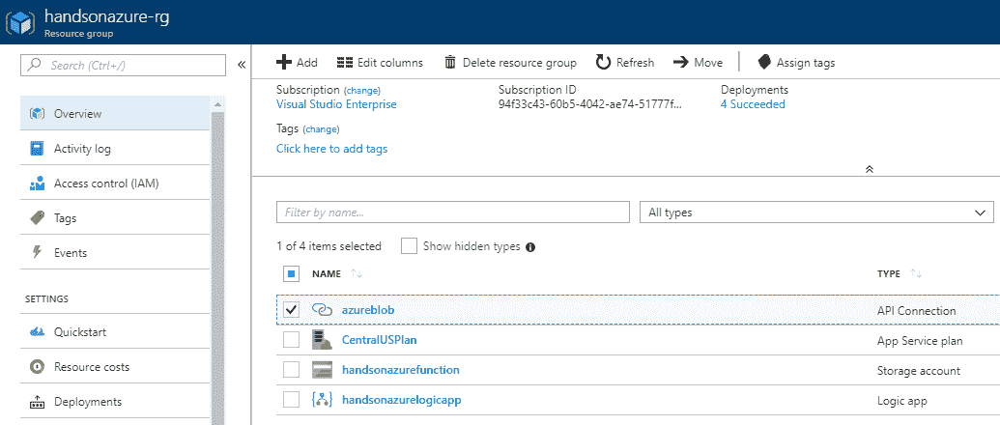
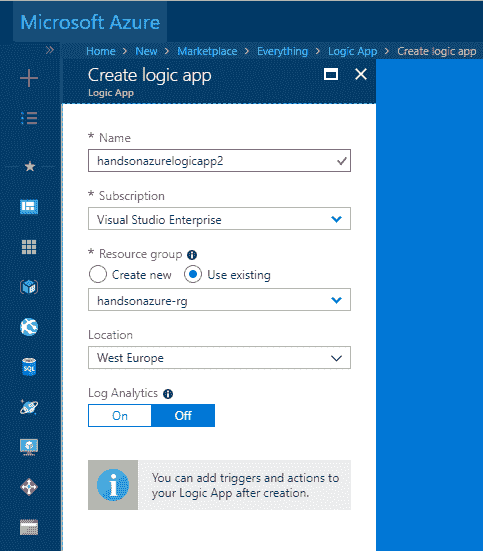
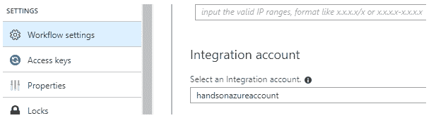

# 第八章：使用 Logic Apps 集成不同的组件

Logic Apps 是一种主要的企业级集成服务，允许我们将组织内的流程作为工作流进行自动化。它们允许通过多个连接器简单地连接不同的服务和应用程序。此外，通过利用无服务器模型，它们减少了成本并缩短了开发有效解决方案所需的时间。

本章将涵盖以下主题：

+   什么是 Azure Logic Apps，它是如何工作的

+   Logic Apps 的连接器

+   创建一个 Logic App 并将其与其他服务集成

+   B2B 集成及其工作原理

# 技术要求

要执行本章的练习，你需要以下内容：

+   Visual Studio 2017

+   Azure SDK 2.9.1 或更高版本

+   Azure Logic Apps for Visual Studio: [`marketplace.visualstudio.com/items?itemName=VinaySinghMSFT.AzureLogicAppsToolsforVisualStudio-18551#overview`](https://marketplace.visualstudio.com/items?itemName=VinaySinghMSFT.AzureLogicAppsToolsforVisualStudio-18551#overview)

# 什么是 Azure Logic Apps？

有时你需要集成多个服务并自动化任务，例如发送电子邮件、创建文件或根据某些输入数据（可能是数据库表或社交媒体数据）生成报告。如果你使用的是特定的云供应商（在本例中是 Microsoft Azure），能够快速开发可以版本控制并与多个云服务原生集成的工作流就显得至关重要，而且这种工具不需要学习许多不同的概念就能上手。这样的服务就是 Azure Logic Apps，你将在本章中学习到它。

# Azure Logic Apps——它是如何工作的

在上一章中，你了解了 Azure Functions，它需要触发器来执行。Azure Logic Apps 的情况类似——你需要定义特定的标准，告诉运行时何时应执行 Logic App 实例。在执行过程中，还会执行更多操作：

+   输入数据会被转换，以满足初始要求

+   所有条件流都会执行，以便评估特定的执行流程

+   临时变量被赋予值

以下展示了一个每日执行的流程示例，它会设置一个变量，用于移除过时的 blobs：


如你所见，它包含三个不同的块，这些块是流程的初始部分（事实上，整个工作流要大得多，因为它包含了循环、不同的条件和动作——我们稍后会介绍这些内容）：

+   第一个定义了 Logic App 实例应该多频繁执行

+   第二个定义了一个变量，该变量被后续步骤使用——它指定了 Azure Blob 存储中文件的最大年龄

+   第三个将一个可用 blob 列表传递给下一个步骤（`for each` 循环），以供特定存储帐户和容器使用

你可能注意到的另一点是——工作流是通过图形块构建的，这些块可以通过定义多种关系来连接。虽然这种解决方案在创建和修改 Logic Apps 时非常方便，但在进行版本控制和团队开发时可能会有问题。幸运的是，每个流程也可以通过 JSON 来定义：

```
{
    "$connections": {
        "value": {
            "azureblob": {
                "connectionId": "/subscriptions/<subscription-id>/resourceGroups/handsonazure-rg/providers/Microsoft.Web/connections/azureblob",
                "connectionName": "azureblob",
                "id": "/subscriptions/<subscription-id>/providers/Microsoft.Web/locations/westeurope/managedApis/azureblob"
            }
        }
    },
    "definition": {
        "$schema": "https://schema.management.azure.com/providers/Microsoft.Logic/schemas/2016-06-01/workflowdefinition.json#",
        "actions": {
            "For_each": {
                "actions": {
                    "Condition": {
                        "actions": {
                            "Delete_blob": {

  (...)
              }
            }
          }
        }
      }
    }
  }
}
```

借助这样的表示方法，你可以将你的 Logic Apps 添加到任何版本控制系统（例如 Git 或 SVN）中，并在需要时进行修改。此外，你还可以通过即时生成代码文件来自动创建不同的 Logic Apps。

# Azure Logic Apps – 优势

你可能会好奇，当你有其他选择（如 Azure Functions 和自定义工作流）时，Azure Logic Apps 的实际应用场景是什么。如果你仔细查看其功能，你会注意到以下几点：

+   你不必是云开发者才能开发工作流——即使是非技术用户（如 IT 专业人员、IT 管理员和数据科学家）也能在不需要学习太多关于该服务的知识的情况下创建所需的工作流。

+   你无需担心扩展问题——因为 Azure Logic Apps 也是 Azure 中无服务器服务的一部分，你可以专注于提供业务价值，而不是服务器配置和能力。

+   一般来说，你不需要编写代码——然而，你并不局限于一个“无代码”环境，因为它也可以托管在 Azure Functions 中，并根据需要执行。

+   你能够实现 B2B 集成，利用与消息交换和通信相关的企业标准，如 AS2 或 EDIFACT

以下是 Azure Logic Apps 的当前定价：

+   每个操作执行的费用为 $0.000025

+   每个连接器执行的费用为 $0.000125

为了充分理解这一点，我们需要描述这两个术语：

+   **操作**：这是触发器之后执行的每个步骤（例如，列出文件、调用 API 或设置变量）

+   **连接器**：这是绑定到多个外部服务（如 Azure Service Bus、SFTP 或 Twitter），你将在工作流中使用它们

请注意，当频繁执行复杂工作流时，Azure Logic Apps 可能会非常昂贵。在这种情况下，可以考虑使用其他服务（如 Azure Functions），这些服务当然需要更多的开发时间，但另一方面提供更好的定价。

# Logic Apps 的连接器

Azure Logic Apps 的主要概念是连接器。连接器既是操作也是触发器，你可以在工作流中使用它们来获取数据、转换数据，并扩展你应用程序的当前功能。目前，Azure Logic Apps 提供 200 种不同的连接器，允许你与多个 Azure 服务（如 Azure API 管理或 Azure Functions）、其他系统（如 OneDrive 和 Salesforce）甚至本地系统进行集成。

# 连接器类型

在 Azure Logic Apps 中，连接器分为两类：

+   **内置** **连接器**：这些连接器旨在与 Azure 服务一起工作，创建工作流，并围绕处理应用程序逻辑和数据进行组织

+   **托管** **连接器**：这些连接器简化了与其他系统和服务的集成

托管连接器被划分为更加详细的组别：

+   托管的 API 连接器

+   本地连接器

+   集成账户连接器

+   企业连接器

在这一节中，我们将通过多个不同类型的连接器示例，使你能够理解它们的使用场景和功能。

# 内置连接器

以下是你可以在 Azure Logic Apps 中使用的内置连接器的示例：

+   **计划**：用于在特定时间表上运行 Logic Apps 或暂停它们的执行

+   **HTTP**：用于通过 HTTP 协议与端点通信

+   **请求**：用于使 Logic App 可被其他服务调用或发送响应

+   **批处理**：用于批量处理消息

+   **Azure Functions**：用于运行自定义代码片段

+   **Azure API Management**：用于集成其他服务定义的触发器和操作

+   **Azure App Services**：用于调用 API 应用和 Web 应用

+   **Azure Logic Apps**：用于调用其他 Logic Apps

如你所见，我们这里有更多通用的连接器（如计划、HTTP 和请求）以及那些特定于某个服务的连接器（如 Azure Functions 或 Azure App Services）。通常，这些连接器构成了大多数 Azure Logic Apps 的基础——在创建工作流时，我们通常需要调用 API 或执行其他 HTTP 请求。

请注意，每个连接器都有详细的文档，描述了其使用场景以及如何使用它开发工作流。你可以在本章的*进一步阅读*部分找到相关链接。

# 托管 API 连接器

使用托管的 API 连接器时，你将能够集成需要配置连接的服务和系统；这些连接器可以在执行 Logic App 实例时使用。以下是一个 Logic App 在资源组中与定义为 API 连接的附加资源的示例：



在文档中，描述了许多不同的 API 连接器——我们来回顾一些示例：

+   Azure Service Bus

+   SQL Server

+   Office 365 Outlook

+   Azure Blob 存储

+   SFTP

+   SharePoint Online

如你所见，使用这些连接器，我们可以访问多种不同的 Azure 服务和其他系统（这里是 Office 365 和 SharePoint），这些都可以在工作流中被利用，以扩展你的应用程序逻辑。

# 本地连接器

正如我之前所描述的，使用 Azure Logic Apps，你还可以集成本地服务，如不同的数据库系统（Oracle、MySQL 和 SQL Server）、商业分析系统（Teradata）或文件系统。

要访问本地数据，你需要创建一个名为本地数据网关的资源。关于如何操作的说明可以在此找到：[`docs.microsoft.com/en-us/azure/logic-apps/logic-apps-gateway-connection`](https://docs.microsoft.com/en-us/azure/logic-apps/logic-apps-gateway-connection)。

# 集成帐户连接器和企业连接器

Azure 逻辑应用还允许你使用集成帐户和利用各种高级连接器构建所谓的 B2B 解决方案，例如 XML 转换和 X12 编码/解码，甚至访问企业系统如 SAP。对于大多数用户来说，这些功能并不是特别有用（因为这些是相对高级的话题，大多数人并不熟悉），但能够构建允许合作伙伴之间无缝通信的逻辑应用是一个有趣的功能。我们将在本章末尾详细讨论 Azure Logic Apps 中的 B2B 集成。

# 创建逻辑应用并集成服务

由于 Azure Logic Apps 也面向非开发人员，创建实例和使用它们的过程相当简单。在本章的这一部分，你将学习如何在 Azure 门户和 Visual Studio 中使用它们，如何集成多个服务并使用操作来控制工作流。

# 在 Azure 门户中创建逻辑应用

要创建一个逻辑应用实例，请按照以下步骤操作：

1.  点击 + 创建资源，然后搜索 Logic App。当你点击“创建”按钮时，你将看到一个简单的表单，允许你创建一个新的逻辑应用实例：



1.  实际上，你在这里唯一可以配置的额外项是启用 Azure 日志分析。由于本书中不会涉及此特定服务，我将在本章跳过它。当你点击“确定”按钮时，Azure 将开始创建一个新的逻辑应用。

1.  创建完成后，你可以进入该服务，查看它最初的样子：


1.  现在你可以点击左侧的 Logic App Designer 按钮，进入一个新的面板，允许你创建全新的工作流。最初，你将看到很多不同的模板可用—如果你对这个服务不熟悉，这些模板是一个很好的起点，它展示了许多不同的可能性和配置，你可以通过 Azure Logic Apps 实现这些功能。要开始，请在**模板**部分，从类别下拉菜单中选择“计划”选项，然后选择“调度器 - 添加消息到队列”：


1.  当你点击“使用此模板”时，你将看到一个设计窗口，在那里你可以完成工作流的配置。请注意，最初我们看不到所有的模块——我们需要先设置所有缺失的配置值（如队列名称或消息），然后才能继续。配置完成并准备就绪后，你可以点击“继续”，这将允许你开始处理你的工作流：


创建与 Azure Queue 的连接将要求你创建一个存储帐户。如果你不熟悉该服务，请参阅第十一章，*使用 Azure 存储 - 表、队列、文件和 Blob*，了解 Azure 存储的相关内容。

1.  要完成配置，你需要输入所有缺失的值——队列名称和消息。一旦你完成这些设置，就可以保存 Logic App，并尝试运行它。

这个特定的连接器如果队列不存在，不会创建队列。确保在启动 Logic App 实例之前已有队列。如果你不知道如何操作，请参阅第十一章，*使用 Azure 存储 - 表、队列、文件和 Blob*，我们将在该章节中讨论 Azure 存储功能和队列。

如果你点击“运行”按钮，你将能够看到整个工作流的执行过程：


我们可以将之前的执行与失败的执行进行比较，这样你可以看到它们之间的差异（例如消息内容或在工作流执行过程中创建的动态变量）。Logic Apps 的调试非常迅速，因为它们提供了详细的错误消息，并直接指向出现问题的地方：


恭喜，你已经创建了你的第一个 Azure Logic App！在下一部分，你将看到如何在 Visual Studio 中使用它。

# 在 Visual Studio 中使用 Azure Logic Apps

虽然通过 Azure Portal 使用 Logic Apps 是完全可以的，但你并不总是想要登录并使用它的 UI。由于可以安装 Microsoft Visual Studio 扩展，使你能够与 Azure Logic Apps 配合使用，我们将在本章中检查它的工作原理：

1.  要在 Visual Studio 中开始使用 Logic Apps，你需要打开 Cloud Explorer（视图 | Cloud Explorer）窗口。它将显示可用的订阅和其中的资源列表。

如果 Cloud Explorer 窗口为空，请确保你安装了最新版本的 Visual Studio 和 Azure SDK，并且已经登录到你的 Azure 帐户。

1.  在其他服务类型中，你应该能够找到 Logic Apps 部分：


这是主要视图，允许你开始使用特定的 Azure 组件。当你点击感兴趣的实例时，你将看到一个附加菜单，显示在资源下方。

你也可以右键点击你想要使用的资源——它会显示一个包含可用操作的菜单。

1.  如下截图所示，我点击了“用 Logic App 编辑器打开”，它显示的是你在门户中看到的相同视图：


你可以像在 Azure 门户中一样，在 Visual Studio 中使用你的 Logic App。此外，你还可以查看它的历史记录，并禁用或删除它。

当你双击运行历史中的一个项目时，你将看到与 Azure 门户中相同的视图，在那里你可以调试特定的调用。这非常有帮助，因为你可以快速开发和测试你的 Logic Apps，并且可以在不离开 IDE 的情况下处理应用程序的其他部分。

我强烈建议你自己在 Visual Studio 中稍微试用一下 Azure Logic Apps，因为这是对整个服务的一个极好补充，并且感觉和门户一样。

# B2B 集成

在本章中，我们已经略微涉及了 Azure Logic Apps 的 B2B 集成，但我想提供更多关于这个话题的信息，因为这个服务并不总是被认为是一个企业集成工具。令人惊讶的是，Azure Logic Apps 在交换信息和数据方面，尤其是在合作伙伴之间，提供了许多有趣的功能，相关细节可以在本节中找到。

# 在 Azure Logic Apps 中启动 B2B 集成

要开始 B2B 集成，你需要一个集成账户——这是你将要使用的集成工件的特殊容器。通常，它允许你将各种不同的项目（证书、架构和协议）存储在一个地方，以便在 Azure Logic Apps 中使用。

要创建这样的账户，请点击“+ 创建资源”，然后搜索集成账户：


如你所见，它提供了一个简单的表单，事实上，你需要做的唯一事情就是选择正确的定价层级。

选择的层级会改变最大存储的工件数量。当然，你可以稍后更改它。

一旦你有了集成账户实例，你需要将其与 Logic App 链接。为此，请在你的 Azure Logic Apps 实例中进入“工作流设置”面板，并搜索集成账户部分：



现在你应该能够使用需要集成账户才能工作的连接器了。

通常，如果你的 Logic App 没有链接集成账户，当你添加需要此功能的步骤时，你需要提供一个自定义名称。一旦连接可用，你将不再需要提供额外信息。

在本章的*进一步阅读*部分，你将找到更多链接，帮助你获取关于 Azure Logic Apps 中 B2B 集成的更多信息。

# 总结

在本章中，你已经了解了 Azure Logic Apps，这是一项简单但非常有用的服务，其使用并不限于 Azure 高手。你阅读了关于不同连接器的信息，并且学习了多种与 Logic Apps 配合工作的方式——通过 Azure 门户（包括设计器和代码编辑器）以及 Visual Studio。此外，你还应该了解有关该服务中的 B2B 集成及其启动方法的一些知识。

在第九章，*瑞士军刀 - Azure Cosmos DB*，我们介绍了 Azure CosmosDB——一个无服务器数据库，允许用户在同一服务中使用不同的数据库模型。

# 问题

1.  Azure Logic Apps 的定价模式是什么？

1.  我们可以在 Logic App 工作流中使用循环吗？

1.  在 Visual Studio 中打开 Logic App 需要什么？

1.  我们如何调试某个特定的 Logic App 执行？

1.  Logic App 能否直接将消息推送到队列，例如 Azure Service Bus 或 Azure Storage Queue？

1.  我们如何对多个 Logic App 进行版本控制？

# 进一步阅读

获取更多信息，你可以参考以下链接：

+   Azure Logic Apps 概览：[`docs.microsoft.com/en-us/azure/logic-apps/logic-apps-overview`](https://docs.microsoft.com/en-us/azure/logic-apps/logic-apps-overview)

+   交换 AS2 消息：[`docs.microsoft.com/en-us/azure/logic-apps/logic-apps-enterprise-integration-as2`](https://docs.microsoft.com/en-us/azure/logic-apps/logic-apps-enterprise-integration-as2)

+   将 Azure Logic Apps 与企业解决方案集成：[`docs.microsoft.com/en-us/azure/logic-apps/logic-apps-enterprise-integration-overview`](https://docs.microsoft.com/en-us/azure/logic-apps/logic-apps-enterprise-integration-overview)

+   Azure Logic Apps 连接器：[`docs.microsoft.com/en-us/connectors/`](https://docs.microsoft.com/en-us/connectors/)
