# 使用 Event Grid 的响应式架构

Azure Event Grid 是 Azure 中另一个代表无服务器服务的云组件。它可以被视为事件网关，既能加速我们的解决方案，又能反转控制，使得我们的服务不必等待其他服务，从而避免浪费可用资源。它也是一个很棒的路由工具，能够快速分配负载并进行扩展，帮助任务更快完成。

本章将涵盖以下内容：

+   Azure Event Grid 与响应式架构

+   通过 Azure Event Grid 连接到其他服务

+   Azure Event Grid 的安全功能

+   向 Azure Event Grid 发布自定义事件

+   将 Azure Functions 与 Azure Event Grid 集成

# 技术要求

要完成本章中的练习，你需要：

+   一个 Azure 订阅

+   一个兼容 Visual Studio 2017 的 IDE

# Azure Event Grid 与响应式架构

在云中使用多个服务时，通常需要一个集中式服务，负责将事件路由到不同的端点。这使得数据交换变得非常简单——你不需要维护不同的 API URL，因为可以利用通用的事件架构和基于事件类型等的自定义路由配置。在 Azure 中，这样的服务被称为 Azure Event Grid——一个无服务器事件网关，是可用的较新云组件之一。采用按需付费的定价模式，你可以快速构建一个响应式架构，反转服务之间的通信，使它们变得被动。在本章中，你将学习如何使用 Event Grid，并将其与其他 Azure 组件集成。

# 响应式架构

要开始使用，让我们考虑以下架构图所示的内容：

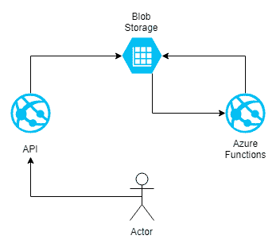

在此图中，你可以看到上传示例流，比如从用户上传头像图像。文件通过**Azure App Service** 传输，并存入**Azure Blob Storage**。然后，它被**Azure Functions** 处理。虽然这样的设置完全可以，但考虑以下缺点——为了处理图像，**Azure Functions** 必须收到有关新文件已上传的通知。

由于**Azure Blob Storage** 无法做到这一点（至少在公开功能中无法实现），实现这一目标的唯一方式是轮询存储并以某种方式保持已处理的文件。尽管从概念上讲，这不是高科技，但你必须记住，在云中，使用资源时需要为所消耗的时间付费。因此，在前述场景中，即使没有文件上传到存储，你也需要支付费用，因为**Azure Functions** 中的触发器（这里是 Blob 触发器）必须保持文件的状态，并定期检查是否有新内容出现，因此你往往会为无事发生的情况付费。现在，考虑以下更改：

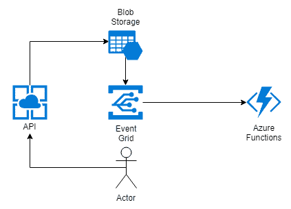

如你所见，我在**Azure Blob 存储**和**Azure Functions**之间放置了一个**Azure Event Grid**。它改变了什么呢？好吧，处理 Blob 的函数不再需要轮询存储以获取上传文件的信息。这是由于 Azure Storage 的版本 2（你可以在*进一步阅读*部分找到描述的链接）支持的功能——它可以将事件发布到**Azure Event Grid**，然后这些事件可以被转发到所有该事件类型的订阅者。感谢这一点，**Azure Functions**可以保持被动——它们会在需要时由**Azure Event Grid**调用，因此如果没有上传文件，你就不需要支付费用。当然，这也是无服务器架构的一个元素——按需付费使得这种设置成为可能。

记住，如果你只使用 Azure Functions 的消费计划，你将不会被收费。如果你必须为函数使用应用服务计划，那么你将无法通过前面的架构节省资金——另一方面，你将节省一些计算资源，这些资源可以用于其他工作负载，因此反应式架构的概念仍然有效。

这就是我们所说的**反应式架构**——一种模型，在这种模型中，组件可以保持空闲状态，等待即将到来的请求。

# 主题和事件订阅

在使用**Azure Event Grid**时，有五个主要的主题：

+   事件

+   事件处理程序

+   事件源

+   主题

+   事件订阅

在本节中，我们将逐一了解这些服务，以更好地理解该服务。

# 事件源

目前，**Azure Event Grid**支持以下事件源：

+   Azure Blob 存储

+   Azure 媒体服务

+   Azure 订阅

+   资源组

+   Azure 事件中心

+   Azure IoT 中心

+   Azure 服务总线

+   自定义主题

+   容器注册表

+   存储**通用版本 v2**（**GPv2**）

如你所见，在使用 Event Grid 时，集成了许多不同的服务并且可以使用。虽然我们知道可以使用哪些事件源，但我们仍然没有定义什么是**事件源**。请看下面的图示：

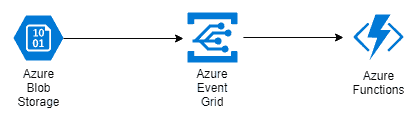

在这种场景下，上传到**Azure Blob 存储**的文件触发一个事件，然后该事件被**Azure Event Grid**获取并进一步传递给消费者。**事件源**是事件的来源，之后由 Event Grid 处理。当使用此服务时，所有事件源都有发布事件并与**Azure Event Grid**进行通信的方法。还有一个额外的事件源——自定义主题。你可以将自己的自定义事件直接发布到 Event Grid 端点——我们将在本章后面介绍这个。

# 事件处理程序

在前面的示例中，我们介绍了事件源。我们来看看一个类似的场景：

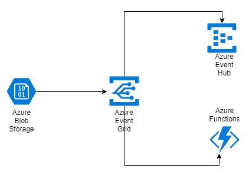

再次强调，我们有 **Azure Blob Storage** 作为发布者，但这一次，事件被转发到 **Azure Functions** 和 **Azure Event Hub**。在该架构中，右侧展示的服务是事件处理器。以下是当前支持的服务列表：

+   Azure Functions

+   Azure Logic Apps

+   Azure 自动化

+   WebHooks

+   Azure Queue Storage

+   混合连接

+   Azure Event Hubs

+   Microsoft Flow

那么，事件处理器究竟是什么？你可以把它看作是一个事件处理器——根据配置，Azure Event Grid 会将事件转发到处理器，在那里它们将被反序列化和分析。

通常，Azure Event Grid 在将事件传递给处理器时使用通用的事件模式。更重要的是，它可以一次交付多个事件——你需要准备好可能收到一批事件。

# 主题和订阅

主题是一个通用的消息传递概念，允许一对多的通信。它与订阅的工作方式如下——你将消息发布到消息服务中的一个主题，然后让消费者订阅它。在 Azure Event Grid 中，你负责创建一个主题——这意味着你必须发布一个自定义应用程序来处理发布者和 Event Grid 端点之间的通信。你可以有一个应用程序，或者多个应用程序——这取决于你的设计和预期吞吐量。此外，你还需要配置订阅——在下一节中，你将看到如何做这一步，并设置适当的过滤条件。一般结构可能如下所示：

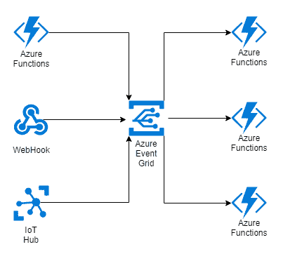

上图的左侧代表发布者和主题（发布者与 **Azure Event Grid** 之间的连线）以及带有处理器的订阅。每条线代表一个不同的主题和订阅。整个配置和路由都位于 Event Grid 内，可以在这里进行管理。

Azure Event Grid 会处理未送达消息的重试。可以通过自定义策略配置重试规则。此外，当使用自定义主题时，事件必须以批量方式发布，才能正常工作。

总结一下，我们可以像下面这样定义一个主题和一个订阅：

+   **主题**：服务与 Azure Event Grid 之间的一个通道，允许前者将事件推送到 Azure 服务。

+   **订阅**：Azure Event Grid 和服务之间的一个通道，用于从前者检索事件。

# 通过 Azure Event Grid 连接服务

现在你已经了解了一些关于 Azure Event Grid 的知识以及它的工作原理，我们将尝试测试它并创建一个有效的解决方案。我们将从在 Azure Portal 中创建实例并配置它以接收和路由事件开始。你还将看到事件的模式是什么，以及如何利用它发送自定义事件，这些事件将由 Event Grid 处理。

# 在 Azure Portal 中创建 Azure Event Grid

要开始使用 Azure Event Grid，请在 Azure Portal 中执行以下操作：

1.  点击“+ 创建资源”，然后搜索 `Event Grid`。从列表中选择 Event Grid 主题并点击“创建”。

1.  你会看到一个非常简单的表单，在其中你需要输入服务实例的名称：

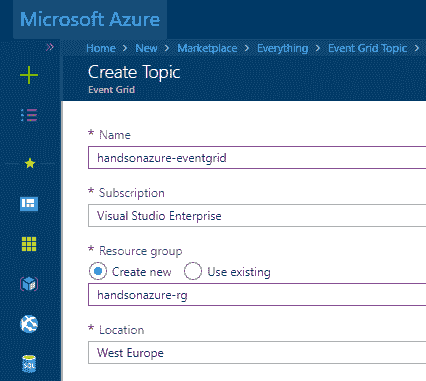

1.  当你点击“创建”并稍等片刻后，服务实例将被创建。完成后，你可以进入你的资源查看空实例：

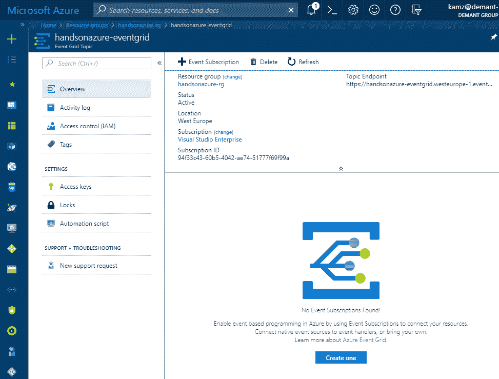

如你所见，尚未创建订阅。而且，更重要的是，也没有主题，主题才是发送事件到我们实例的地方。在我们继续之前，先来看一下“概述”面板。除了创建订阅的选项外，还有另一项重要内容——主题端点。你将使用它来发布来自自定义主题的事件。还有一个重要的面板——访问密钥。点击它，你将看到两个密钥，可以用来授权访问 Azure Event Grid：

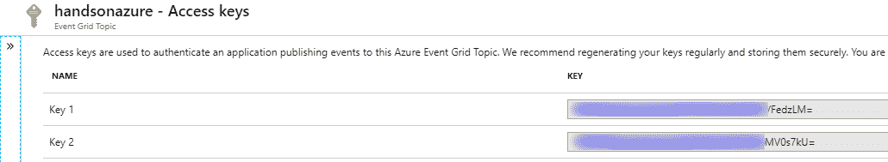

现在，让我们尝试创建一个带有订阅的主题。为此，我们将使用以下代码片段：

```
$myEndpoint = "<my-endpoint>"

Set-AzureRmContext -Subscription "<subcription-name>"

New-AzureRmEventGridSubscription `
  -Endpoint $myEndpoint `
  -EventSubscriptionName "<event-subscription-name>"
  -ResourceGroupName "<rg-name>"
```

这段 PowerShell 代码应创建一个资源组主题，将事件推送到 `$myEndpoint` 变量中定义的端点。然而，如果你执行这段代码，以下错误将发生：

```
New-AzureRmEventGridSubscription : Long running operation failed with status 'Failed'. Additional Info:'The attempt to validate the provided endpoint <your-endpoint>. For more details, visit https://aka.ms/esvalidation.'
```

发生了什么？嗯，事实证明我们无法创建订阅，因为我们的端点没有经过验证。我们该如何验证端点，以便能够创建订阅呢？我会很快解释。

# Azure Event Grid 安全性

除了访问令牌，Azure Event Grid 还会检查端点是否有效且安全。以下处理程序类型将不会进行验证：

+   Azure 逻辑应用

+   Azure 自动化

+   当使用 `EventGridTrigger` 时的 Azure Functions

其余的端点（尤其是那些通过 HTTP 请求触发的端点）必须进行验证才能使用。下面是这种类型的验证是如何处理的：

1.  首先，`SubscriptionValidationEvent` 会发送到一个包含多个字段的端点，比如主题、验证代码等。此外，还会发送一个特殊的 `aeg-event-type: SubscriptionValidation` 头部。

1.  其次，Event Grid 期望收到一个成功响应，响应中包含请求中发送的验证代码。

这是一个验证事件的示例：

```
[{
  "id": "3d178aaf-364c-67b-bq0c-e34519da4eww",
  "topic": "/subscriptions/xxxxxxxx-xxxx-xxxx-xxxx-xxxxxxxxxxxx",
  "subject": "",
  "data": {
    "validationCode": "512d38b6-c7b8-40c8-89fe-f46f9e9622b6",
    "validationUrl": "<validation-url>"
  },
  "eventType": "Microsoft.EventGrid.SubscriptionValidationEvent",
  "eventTime": "2018-08-10T10:20:19.4556811Z",
  "metadataVersion": "1",
  "dataVersion": "1"
}]
```

在这种情况下，要验证一个端点，你需要返回以下响应：

```
{
  "validationResponse": "512d38b6-c7b8-40c8-89fe-f46f9e9622b6"
}
```

之后，你应该能够创建一个订阅。

正如你可能已经注意到的，验证事件中还包含了 `validationUrl` 属性。它允许你手动验证订阅，而不是重新部署带有正确应用逻辑的代码。

# 创建订阅

现在你已经熟悉了端点验证主题，我们可以再次尝试创建订阅：

1.  为此，我创建了一个由 HTTP 请求触发的函数。我在 CSX 中快速写了它，这样就不需要手动编译和部署：

```
#r "Newtonsoft.Json"

using System.Net;
using Newtonsoft.Json;

public static async Task<HttpResponseMessage> Run(HttpRequestMessage req, TraceWriter log)
{
 var @event = JsonConvert.DeserializeObject(await req.Content.ReadAsStringAsync());
 log.Info(@event.ToString());

 return req.CreateResponse(HttpStatusCode.OK);
}
```

多亏了前面的代码，我可以看到一个验证事件被发送到一个端点。现在，根据你拥有的工具集版本，你将在负载中看到 `validationUrl` 的值。

1.  要利用此功能，你必须为 Azure CLI 2.0 安装 Event Grid 扩展——下载链接可以在 *进一步阅读* 部分找到。要在没有此功能的情况下继续进行，我们将需要稍微修改一下我们的函数代码：

```
#r "Newtonsoft.Json"

using System.Net;
using Newtonsoft.Json;

public static async Task<HttpResponseMessage> Run(HttpRequestMessage req, TraceWriter log)
{
 var @event = JsonConvert.DeserializeObject<ValidationEvent[]>(await req.Content.ReadAsStringAsync())[0];

 return req.CreateResponse(HttpStatusCode.OK, new {validationResponse = @event.Data.ValidationCode} );
}

public class ValidationEvent {
 public ValidationEventData Data {get;set;}
}

public class ValidationEventData {
 public string ValidationCode {get;set;}
}
```

1.  请注意，我正在将验证事件反序列化为 `ValidationEvent[]`，所以它实际上是一个事件数组。记住这一点很重要，以避免可能出现的问题。

如果事件被发送到一个未经验证的端点，批处理将被分为两部分，一部分包含一个单独的验证事件，另一部分包含实际的事件。

1.  现在，如果你执行之前失败的 PowerShell 代码，你应该能够创建一个订阅。为了检查是否一切正常，你可以运行以下命令：

```
Get-AzureRmEventGridSubscription
```

1.  在这里，你可以看到我这边的结果：

```
PS C:\Users\kamz> Get-AzureRmEventGridSubscription

 Name Topic ProvisioningState SubjectBeginsWith SubjectEndsWith Endpoint
 ---- ----- ----------------- ----------------- --------------- --------
rg-subscription /subscriptions/<id> Succeeded https://handsonazure-function.azurewebsites.net/api/HttpTriggerCSharp1
```

请注意，通过 API 创建的订阅在门户中是不可见的。这应该很快就会改变，但在这个问题没有解决之前，主要还是依赖 **命令行界面** (**CLI**) 来维护 Azure Event Grid。

1.  现在，假设你在资源组中创建了一个将事件发布到 Event Grid 的资源，类似以下的事件将会发生：

```
 {
    "subject": "/subscriptions/.../Microsoft.Storage/storageAccounts/handsonazure",
    "eventType": "Microsoft.Resources.ResourceWriteSuccess",
    "eventTime": "2018-08-10T08:51:32.3888833Z",
    "id": "37f85f91-1af9-4ee3-84a6-ee1955c74edc",
    "data": {
      "authorization": {
        "scope": "/subscriptions/.../handsonazure-rg/providers/Microsoft.Storage/storageAccounts/handsonazure",
        "action": "Microsoft.Storage/storageAccounts/write",
        "evidence": {
          "role": "Subscription Admin"
        }
      },
      "claims": {
        "aud": "https://management.core.windows.net/",
        (...)
    } 
  }
}
```

1.  也可以在没有 CLI 的情况下创建这样的连接——如果你进入你的资源组，你将看到 Eventsblade：

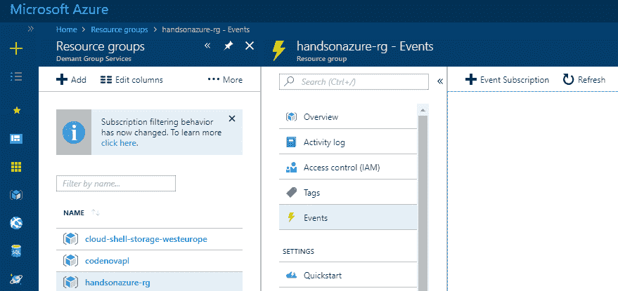

1.  当你点击 + 事件订阅按钮时，你将看到一个表单，使整个过程变得更加简便。如果你更喜欢在门户中配置服务，而不是使用 CLI，可以使用这个表单：

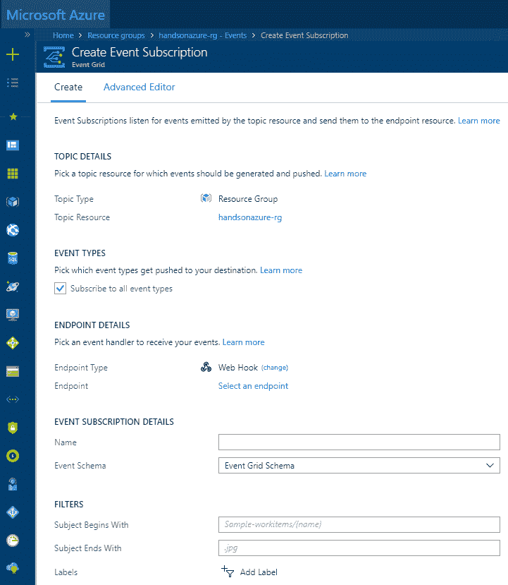

# 将自定义事件发布到 Azure Event Grid

到目前为止，我们已经讨论了如何通过已经内置的发布者和主题来集成 Azure Event Grid，使用资源组作为示例。我在本章开始时提到过，这个服务能够处理自定义主题，使其成为一个非常灵活的解决方案，可以作为事件网关。在本节中，我们将讨论这个话题，并尝试使用 Event Grid 作为我们的路由器来处理和维护事件的路由。

# 事件网关概念

让我们看看以下的图示：

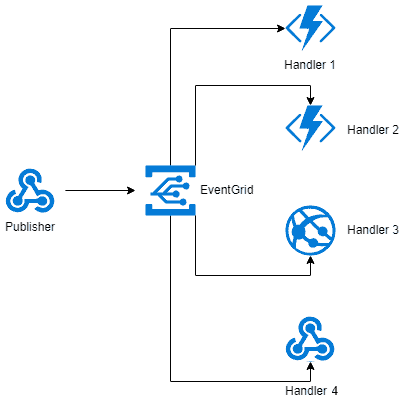

在这里，你有一个单一的事件生产者和四个不同的处理器。现在，如果你想象一下**Publisher**仅发布自定义事件，你会看到 Event Grid 能够将它们分发到`N`个不同的处理器（这些处理器不必是相同类型——它们可以是任何支持的处理器的混合）。当然，这个概念也可以用于像资源组、Azure Blob Storage 或 Azure Event Hub 这样的发布者——就个人而言，我认为它对自定义场景更有用。让我们举个例子——你正在发布一个`OrderCreated`事件。通过 Azure Event Grid，你现在可以将其分发到不同的处理器：

+   `OrderConfirmation`：例如，用于通过邮件发送确认。

+   `OrderProcessor`：用于处理订单的实际逻辑。

+   `OrderNotification`：用于通知某人有一个需要验证的订单。

当然，前面的步骤仅依赖于你的逻辑——不过，它应该能给你一个关于如何使用 Azure Event Grid 进行事件路由和分发的提示。

# 处理自定义事件。

在我们发送自定义事件之前，我们需要查看 Event Grid 事件架构：

```
[
  {
    "topic": string,
    "subject": string,
    "id": string,
    "eventType": string,
    "eventTime": string,
    "data":{
      object-unique-to-each-publisher
    },
    "dataVersion": string,
    "metadataVersion": string
  }
]
```

如你所见，它是一个简单的 JSON 数组，包含许多不同的事件。让我们在这里描述每个字段：

+   `topic`：这定义了一个事件源的完整路径（例如，Azure Blob Storage）。

+   `subject`：这定义了事件主题的路径（因此，在发布来自资源组的事件的情况下，这可能是指向 Azure 资源的完整路径，或者在 Azure Blob Storage 的情况下，这将是一个 Blob 路径）。

+   `id`：这是事件的唯一标识符。

+   `eventType`：已发布事件的类型（例如`Microsoft.Resources.ResourceWriteSuccess`）。

+   `eventTime`：这定义了事件发布的时间，使用发布者的 UTC 时间。

+   `data`：事件的有效载荷。

+   `dataVersion`：由发布者定义的事件架构版本。

+   `metadataVersion`：由 Event Grid 提供的事件元数据架构版本的修订号。

现在，如果你想发布一个事件，你需要做以下操作：

+   即使你发布的是单个事件，也始终使用事件数组。

+   要么使用一个空的主题，要么使用以下语法，它反映了每个主题也是一个 Azure 资源`/subscriptions/<subscription-id>/resourceGroups/<resource-group>/providers/Microsoft.EventGrid/topics/<eventgrid-name>`

+   使用`aeg-sas-key`或`aeg-sas-token`通过提供访问密钥中的密钥来授权请求。

这里，你可以找到一个请求示例：

```
POST /api/events HTTP/1.1
Host: handsonazure-eventgrid.westeurope-1.eventgrid.azure.net
Content-Type: application/json
aeg-sas-key: <sas-key>
Cache-Control: no-cache

[
  {
    "subject": "example",
    "id": "1",
    "eventType": "SectionFinished",
    "eventTime": "2018-08-12T07:41:00.9584103Z",
    "data":{
      "section": 3
    },
    "dataVersion": "1"
  }
]
```

如果一切正常，你应该会看到一个`HTTP 200`响应。现在，你可能会想知道如何接收这样的请求。如果你进入你的 Azure Event Grid 实例并点击+事件订阅按钮，你会看到一个可以创建新订阅的表单：

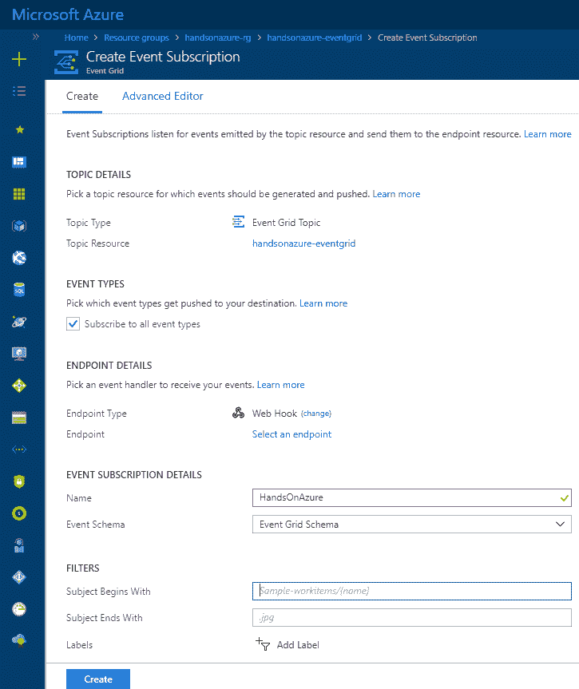

你之前见过这个表单，当我们讨论如何直接从资源组创建订阅时。 然而，有一些重要的事项需要提到：

+   订阅所有事件类型**：**你可以选择将所有事件类型路由到终端，或者仅将你定义的事件类型路由到终端（取消勾选复选框后，你可以输入任何你想要的事件类型）。这对于正确的事件路由非常有用。

+   终端类型：你可以选择不同的终端类型，包括 WebHook、Azure Event Hub 和混合连接。

+   事件模式：你可以选择使用 Event Grid 模式或更常见的 Cloud Events 模式，后者是一个开放的标准规范，可以用于为系统中的所有组件引入自定义模式。

+   过滤器：你还可以通过过滤主题字段值来进一步过滤特定类型的事件。

当你填写所有值后，点击**创建**按钮来实际创建它。

记住，必须验证终端才能成功创建订阅！

现在，如果你发送一个示例请求，你应该能够在你的处理程序中接收到它（在我的案例中是 Azure Functions）：

```
2018-08-12T08:17:25.263 [Info] Function started (Id=8216a64d-19c5-436f-8cce-69fc49a3cff2)
2018-08-12T08:17:25.404 [Info] [
  {
    "subject": "example",
    "id": "1",
    "eventType": "SectionFinished",
    "eventTime": "2018-08-12T07:41:00.9584103Z",
    "data": {
      "section": 3
    },
    "dataVersion": "1",
    "metadataVersion": "1",
    "topic": "/subscriptions/.../resourceGroups/handsonazure-rg/providers/Microsoft.EventGrid/topics/handsonazure-eventgrid"
  }
]
2018-08-12T08:17:25.404 [Info] Function completed (Success, Id=8216a64d-19c5-436f-8cce-69fc49a3cff2, Duration=138ms)
```

你可能会想，如果事件处理程序没有返回成功响应给 Azure Event Grid，会发生什么？在这种情况下，将执行重试操作。

Azure Event Grid 只将 `HTTP 200` 和 `HTTP 202` 响应视为成功。

默认情况下，Event Grid 使用指数回退重试策略。这意味着每次连续的重试将在前一次和下一次重试之间增加延迟。你可以通过提供自定义重试策略来定制此行为。关于该功能的链接可以在*进一步阅读*部分找到。

# 将 Azure Functions 与 Azure Event Grid 集成

我们将要讨论的 Azure Event Grid 的最后一个内容是与 Azure Functions 的集成。如前所述，如果你使用 Event Grid 向由 HTTP 触发器触发的 Azure Functions 发布事件，你必须验证终端。这并不是最佳解决方案，但幸运的是，使用 `EventGridTrigger` 是可行的，它允许我们在配置服务时跳过终端验证步骤。这个话题本身非常大，因此我们不会覆盖所有可能的问题；不过，我会将你指引到文档的特定部分，帮助你更好地理解这个主题。

# Azure Functions 中的 EventGridTrigger

一般来说，将 Azure Functions 与 Azure Event Grid 集成的最简单方法是使用 `HttpTrigger`：

```
[FunctionName("HttpTriggerCSharp")]
public static async Task<HttpResponseMessage> Run(
    [HttpTrigger(AuthorizationLevel.Function, "get", "post", Route = null)]HttpRequestMessage req, 
    TraceWriter log)
{
    (...)
}
```

这是最通用的设置。它提供了对请求消息的直接访问，并使你能够控制其特定部分。然而，也有一个替代方案——我们可以使用 `EventGridTrigger`：

```
[FunctionName("EventGridTriggerCSharp")]
public static void Run([EventGridTrigger]JObject eventGridEvent, TraceWriter log)
{
  log.Info(eventGridEvent.ToString(Formatting.Indented));
}
```

在这里，使用`EventGridTrigger`，您可以直接访问请求的有效负载，这对于不关心其余部分的情况非常有用。此外，您不需要验证端点。如果使用 Azure Functions 运行时的版本 2，前面的函数可以稍作不同：

```
[FunctionName("EventGridTest")]
public static void EventGridTest([EventGridTrigger]EventGridEvent eventGridEvent, TraceWriter log)
{
  log.Info(eventGridEvent.Data.ToString());
}
```

如您所见，这里您可以访问一个明确定义的`EventGridEvent`，而不是绑定到`JObject`。

即使在 Azure Functions 运行时版本 1 中，也可以使用`EventGridEvent`。为此，您需要通过安装`Microsoft.Azure.EventGrid` NuGet 包来手动引用`Microsoft.Azure.EventGrid.Models.EventGridEvent`。

您可以通过 Azure 门户轻松创建一个由 Event Grid 触发的函数，如下所示：

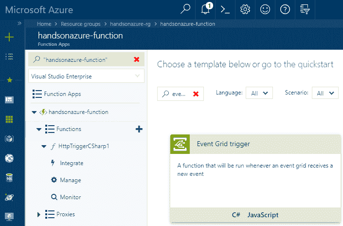

创建函数后，您将看到一个代码片段，可以从这里开始编写函数。重要的是添加事件网格订阅，您需要用它来将函数与 Azure Event Grid 集成：

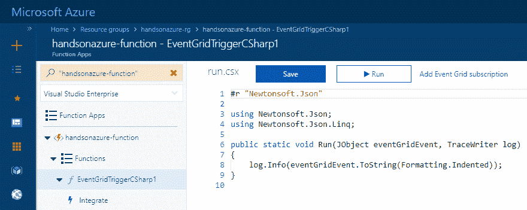

生成的代码取决于您的 Function App 的运行时版本——在我的示例中，我使用的是版本 1，因此我使用了`JObject`而不是`EventGridEvent`。

当您点击它时，您将看到一个表单，您可以填写该表单来创建订阅。实际上，它非常类似于您在 Event Grid 实例中创建订阅时看到的表单：

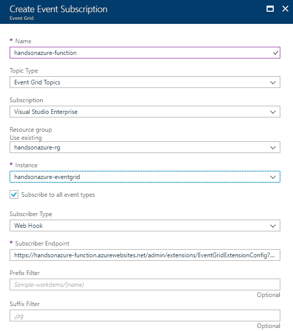

唯一的区别是一些字段会自动填充。创建订阅后，您可以通过向 Event Grid 发送例如自定义事件来进行测试。更重要的是，刚创建的订阅应能在您的 Azure Event Grid 实例的概览页面上看到：

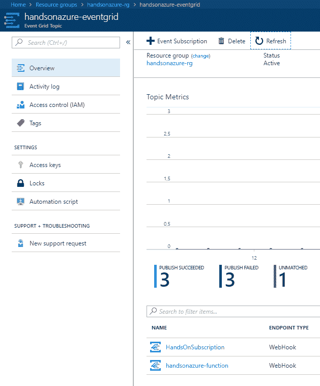

# 测试 Azure Event Grid 和 Azure Functions

您可能在考虑如何在本地测试 Azure Event Grid 和 Azure Functions。事实上，当前您有两种方法可以实现这一点：

+   捕获并重新发送事件到您的应用程序

+   使用 ngrok（可在[`ngrok.com/`](https://ngrok.com/)上找到）将请求转发到本地计算机

您选择的这些方法将取决于您的能力（例如，ngrok 会暴露您计算机的端口，这可能带来安全问题），因此您需要自己判断哪种选项最适合。两种方法在*进一步阅读*部分提到的链接中都有描述。然而，Azure Functions 有一个有趣的功能，可以用来在本地测试 Event Grid。它可以通过以下端点找到：

```
http://localhost:7071/admin/extensions/EventGridExtensionConfig?functionName={functionname} 
```

这里是一个请求的示例：

```
POST /admin/extensions/EventGridExtensionConfig?functionName=Function1 HTTP/1.1
Host: localhost:7071
Content-Type: application/json
aeg-event-type: Notification
Cache-Control: no-cache

[
  {
    "subject": "example",
    "id": "1",
    "eventType": "SectionFinished",
    "eventTime": "2018-08-12T07:41:00.9584103Z",
    "data":{
      "section": 3
    },
    "dataVersion": "1",
  }
]
```

这里有一个重要的事项——您必须将`aeg-event-type`设置为`Notification`。如果未设置，您将收到`HTTP 400`响应。通过这样的设置，您可以模拟您的函数在部署到 Azure 时的行为。

# 总结

本章介绍了什么是反应式架构以及如何与 Azure Event Grid 一起使用。你将不同的事件生产者与事件处理程序集成，并使用自定义主题发布自定义事件。此外，你现在还掌握了如何将 Azure Event Grid 与 Azure Functions 集成并进行本地测试的知识。

本章结束了本书的第二部分，内容涉及无服务器服务和架构。在下一部分中，我们将介绍不同的存储选项、消息传递和监控服务，这将进一步拓宽你在 Azure 上的专业技能。

# 问题

1.  Azure Event Grid 中支持的事件模式有哪些？

1.  如何在发布自定义事件时授权请求访问 Event Grid 端点？

1.  验证端点时需要返回什么？

1.  何时不需要验证端点？

1.  如果端点没有返回成功响应，会发生什么？

1.  如何在 Azure Event Grid 中过滤事件？

1.  如何测试 Azure Event Grid 与 Azure Functions 的集成？

# 进一步阅读

+   Azure 存储 V2 账户: [`docs.microsoft.com/en-us/azure/storage/common/storage-account-options#general-purpose-v2-accounts`](https://docs.microsoft.com/en-us/azure/storage/common/storage-account-options#general-purpose-v2-accounts)

+   Azure CLI: [`docs.microsoft.com/en-us/cli/azure/azure-cli-extensions-list?view=azure-cli-latest`](https://docs.microsoft.com/en-us/cli/azure/azure-cli-extensions-list?view=azure-cli-latest)

+   CloudEvents 标准规范: [`cloudevents.io/`](https://cloudevents.io/)

+   Azure Event Grid 中的事件传递: [`docs.microsoft.com/en-us/azure/event-grid/manage-event-delivery`](https://docs.microsoft.com/en-us/azure/event-grid/manage-event-delivery)

+   Azure Function 与 Azure Event Grid 绑定: [`docs.microsoft.com/en-us/azure/azure-functions/functions-bindings-event-grid`](https://docs.microsoft.com/en-us/azure/azure-functions/functions-bindings-event-grid)
