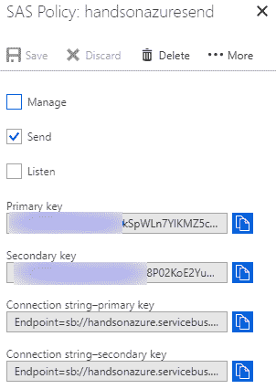

# 大数据管道 - Azure Event Hub

Azure Event Hub 是引入几乎无限吞吐量入口点的最佳解决方案之一。它专为大数据工作负载设计，能够处理每秒数百万条消息。它提供了非常简单的配置，并且凭借可用的 SDK，您可以轻松地将其调整为几乎任何在云中开发的解决方案。它还与其他 Azure 组件本地集成，使得创建托管在云中的完整平台变得轻而易举。

本章将涵盖以下主题：

+   高效使用 Azure Event Hub

+   不同的概念，例如发布者、分区、吞吐量单元或消费者组

+   Azure Event Hub 安全概念

+   Azure Event Hub 捕获功能

# 技术要求

要执行本章中的练习，您需要以下内容：

+   Microsoft Azure 订阅

+   Visual Studio 2017

# Azure Event Hub 服务和概念

如今，我们收集越来越多的数据，这些数据必须进行聚合、处理并存储到某个地方。这意味着需要使用能够处理不断增加的负载、适应日益增长的需求并提供最小延迟的服务。所有这些要求在构建所谓的大数据管道时都会被提到——这是一个旨在处理尽可能多数据的系统部分，以便以后可以通过 Hadoop、Spark、ML、AI 等工具访问。如果您正在寻找一个能够处理每秒数百万条消息的 Azure 服务，Azure Event Hub 是正确的选择。在本章中，您将学习此 Azure 组件的基础知识，并熟悉 Azure 中的消息传递解决方案。

# Azure Event Hub 概念

一般来说，Azure Event Hub 是一个简单的服务，基于两个概念构建：

+   事件发布者

+   事件处理器主机

当然，这些并不是我们在这里将讨论的唯一主题。不过，在继续之前，我想先稍微关注一下发布者和处理器之间的区别：

+   **发布者**：这是向 Azure Event Hub 实例发送数据的实体。它可以使用两种可用协议（HTTP 或 AMQP），并且不关心当前 Event Hub 的能力。

+   **处理器**：一个从 Azure Event Hub 中读取事件的实体，它在事件可用时读取。它使用 AMQP 进行通信，并依赖于诸如消费者组和分区等附加概念。

以下展示了 Azure Event Hub 的工作原理：


如您所见，这里还提到了另外两个概念：

+   **分区**：每个分区是一个独立的事件日志，单独存储数据。一般来说，Event Hub 负责确保每个共享相同分区键的事件按顺序存储在同一个分区内。当然，您可以自行设置这个值——在这种情况下，您必须确保不会过度负载某个特定分区。

+   **消费者组**：如果你希望允许不同的处理器分别消费事件，你必须使用不同的消费者组来实现。

如你所见，Azure Event Hub 并未使用诸如实例主题之类的方式来分配数据——它充当一个单一的事件管道，你可以随时以高吞吐量进行读取。为了定义这一值，Event Hub 使用一个名为**吞吐量单元**（**TU**）的概念。1 TU 的定义如下：

+   最多 1MB/s 或 1,000 个事件的入站

+   最多 2MB/s 或 4,096 个事件的外发

请注意，Azure Event Hub 为你使用的所有消费者组共享 TU。如果你有 1 个 TU 和 5 个消费者组，最大外发量将会在所有消费者之间进行分配（因此，当所有 5 个消费者同时读取事件时，每秒最多将有 400 个事件可用）。

如果你恰好超过了可用的限制，Event Hub 将开始限制你的请求，最终返回`ServerBusyException`。然而，这仅适用于传入事件——对于外发，你不能读取超过当前 TU 值允许的数量。

默认情况下，每个 Event Hub 命名空间最多不能有超过 20 个 TU。然而，这只是一个软限制——你可以通过联系 Azure 支持来扩展它。

现在，让我们稍微关注一下分区。Event Hub 中的每个 Hub 最多可以有 32 个分区。你可能会想知道这意味着什么——实际上，这提供了一些额外的选择：

+   由于每个分区都可以有一个对应的消费者，默认情况下，你可以使用 32 个消费者并行处理消息。

+   因为在 Hub 创建后不能更改分区数，你必须在最初阶段仔细设计。

+   默认使用最大数量的分区并不总是最佳选择——它应当反映你计划支持的读者数量。如果你选择的分区数过多，它们会开始争夺分区的租赁。

以下是数据在 Hub 内不同分区之间如何全球存储的示意：


如前所述，每个分区可以独立增长——更重要的是，每个分区都有一个独立的`offsetvalue`。什么是`offsetvalue`？你可以将其视为日志中的某个特定位置的指针——如果它存储的是从 1 到 10,000 的事件，并且你已经读取了 1,000，那么`offsetvalue`将是 1,001。在这种情况下，意味着读者应从第 1,001 个事件开始读取数据。

事实上，`offset`和消费者组在概念上是相互关联的——每个消费者组都有一个独立的`offset`值；这就是为什么通过引入它，你可以再次读取所有可用日志的原因。

然而，记住，为了设置偏移量，消费者必须执行一个**检查点**。如果没有执行，下一次连接时，它将重新读取所有数据。如果你想避免处理重复数据，这一点非常重要——你要么需要实现一个非常可靠的事件处理过程，以确保即使出现故障也能执行检查点，要么你需要有一个机制来检测重复数据。

如果有需要，你可以通过在启动处理器时提供你感兴趣的偏移量值，轻松读取以前的事件。

目前需要考虑的最后一件事是 Azure Event Hub 对存储事件的保留策略。默认情况下（或者换句话说，使用基础层时），事件只能存储 24 小时以供消费；超过这个时间后，事件会丢失。当然，通过使用标准层，你可以延长保留时间，最多可延长至事件保留后的 7 天。一般来说，你应该避免将此服务作为标准队列或缓存使用——它的主要目的是提供每秒聚合数千条消息并进一步推送的功能。

# Azure Event Hub 的耐久性

在许多场景中，Azure Event Hub 是系统的主要入口点之一，成为一个关键组件，应该进行复制并确保高可用性。在这个特定的服务中，地理灾难恢复功能在选择标准层时可用，并且需要你设置并配置合适的环境。为此，你需要理解以下主题：

+   **别名**：你可以使用别名来通过一个稳定的连接字符串进行连接，而不是提供多个连接字符串。

+   **故障转移**：这是在命名空间之间发起切换的过程。

+   **主/辅助命名空间**：在使用 Azure Event Hub 的地理灾难恢复功能时，你必须定义哪个命名空间是主命名空间，哪个是辅助命名空间。这里需要注意的是，你可以将事件发送到两个命名空间，但第二个命名空间保持**被动**——这意味着来自活动命名空间的事件不会被转移。

现在，为了在事件中心实现这个功能，你需要做两件事：

+   监控你的主命名空间以检测任何异常

+   启动故障转移

当然，如果发生灾难，完成故障转移后，你需要创建一个新的配对。

你必须知道“停机”和“灾难”之间的区别，停机通常是指数据中心内部的临时问题，而灾难通常意味着永久性损坏和可能的数据丢失。地理灾难恢复功能是为灾难设计的；在停机情况下，你应该实施其他处理方式，如本地缓存数据。

# 使用 Azure Event Hub

现在，您已经熟悉了一些基本概念，我们可以继续并开始使用真实的 Azure Event Hub 实例。在这一部分，您将学习如何在 Azure 门户中创建和访问 Event Hub，并使用其 SDK 进行操作。实际上，使用此服务既可以通过门户进行（因为许多 Azure 组件与之无缝集成，且无需额外配置），也可以通过提供自定义实现的消费者来读取和进一步处理数据。

# 在 Azure 门户中创建 Azure Event Hub

要创建一个 Azure Event Hub，我们将像大多数情况下那样，点击 + 创建资源 按钮。输入 `Event Hub` 并从搜索结果中选择该服务。在这里，您可以看到我 Event Hub 实例配置的示例：


现在让我们全球聚焦于我们所拥有的内容：

+   名称：这是您的 Event Hub 实例的唯一名称。请注意，它必须在所有 Azure 支持的实例中是唯一的。

+   定价层：您可以选择 Basic 和 Standard 层。实际上，还有一个额外的层——Dedicated，不过仅在您直接申请时才可使用。Basic 和 Standard 层之间在功能和吞吐量上差异很大；我们稍后会详细介绍。

+   启用 Kafka：这是一个新功能，允许您将 Azure Event Hub 用作 **Apache Kafka** 实例。通过这个功能，您可以在不重新配置与 Kafka 实例通信的应用程序的情况下，切换到此 Azure 服务。

+   使此命名空间具备区域冗余：如果您愿意，可以为 Event Hub 利用可用性区域，使整个命名空间具备区域冗余。这可以提高服务实例的可用性且无需额外费用（不过，您仍然需要为额外的实例付费）。目前，此功能已在三个位置启用——美国中部、美国东部 2 和法国中部。

+   订阅：将在其中创建实例的订阅。

+   资源组：在此资源组中将创建 Event Hub 实例。

+   区域：Azure Event Hub 将在此区域创建。

+   吞吐量单位：此设置定义了整个命名空间的吞吐量。在 Azure 中，每个 Event Hub 实例将在命名空间内与其他所有 Hub 共享可用的 TUs。根据需要，您可以稍后更改该值。

+   启用自动扩展：您可以启用自动扩展，而不是手动调整命名空间的吞吐量。此功能会随着负载增长自动扩展命名空间。但请注意，它不会自动缩减。通过启用该功能，您还可以定义最大 TUs 值，因此您不会被收取超过预期的费用。

请记住，您会为每个 TU 付费——这意味着如果您选择了 Basic 层并且需要 10 个 TUs，那么您每月需要支付 9.41 EUR * 10 = 94.1 EUR！

当您点击 Create 按钮时，Azure 将为您创建一个 Azure Event Hub 实例。

# 在门户中使用 Azure Event Hub

以下截图显示了一个全新的 Azure Event Hub 实例：


如您所见，它包含一些基本信息，如指标、元数据和连接字符串的访问权限。当然，这是命名空间的视图——我们还没有创建任何 Event Hub。在此之前，我想先关注一下我们当前拥有的内容。在左侧，您可以找到 SETTINGS 部分，其中包含附加功能：

+   共享访问策略：在 Azure Event Hub 中，访问策略有两个级别——它们可以分配给命名空间或集线器。通过这些策略，您可以与三种权限组合共享访问密钥——管理（Manage）、监听（Listen）和发送（Send）。

+   扩展：如果您觉得需要更多的吞吐量，您可以转到此页面并将命名空间的规模扩大（或者如果需要更少的 TUs，则缩小）。在该屏幕上，您还可以更改层级——例如，选择 Standard，以便启用自动扩展（Auto-Inflate）。

+   地理恢复（Geo-recovery）：如果您需要使 Event Hub 高可用并且选择了 Standard 层级，您可以通过此页面启动与其他区域的配对。

现在让我们创建一个集线器：

1.  点击 Event Hubs 页面：


1.  点击 + Event Hub 按钮，查看一个表单，该表单允许您配置新的集线器实例：


请注意，某些字段目前是灰色的。这是因为我在此示例中使用了 Basic 层级； Message Retention（允许您将事件可用期延长至最多七天）和 Capture（将在后面描述）是 Standard 层级的功能。

1.  点击 Create 按钮以启动创建一个集线器的过程。

一旦集线器创建完成，您可以点击它并访问它，如下所示：


请注意，这个视图与命名空间的视图略有不同；虽然它也包含一些元数据和指标，但可用的附加功能是有限的。

请注意，对于 Basic 层级，消费者组（consumer groups）也不可用。使用该层级时，只有默认组—命名为 `$Default`—可以使用。

# 使用 Azure Event Hub 开发应用程序

我们在 Azure 门户中创建并配置了我们的 Azure Event Hub 实例；现在是时候使用我一开始提到的概念——Event Processor Host。在本节中，您将学习：

+   如何将事件发送到 Azure Event Hub

+   如何通过实现您自己的 Event Processor Host 来接收事件

然而，在我们开始编写代码之前，你必须理解这一概念背后真正的原理。与竞争消费者不同，后者每个消费者都使用相同的消息通道，Azure Event Hub 采用了事件处理器主机（Event Processor Host）的概念，这是一个智能代理，能够在不同的分区消费者之间分配事件。你可能会好奇，当这个概念被实现时是如何工作的；为了理解这一点，你可以看到第一个场景的示意图：


在这个示意图中，你可以看到有一个**生产者**和四个不同的**消费者**。每个消费者都实现了 `IEventProcessor`——这是 SDK 提供的一个接口，使得接收事件成为可能。每个**消费者**覆盖一个**分区**并获得对该分区的租约。现在让我们查看另一个场景：


唯一的变化是**分区**的数量——现在 Event Hub 有八个。事件处理器主机确保负载被均匀分配，每个**消费者**将消费两个**分区**。为了让事情更加复杂，我们还需要考虑第三个场景：


这一次，我们有更多的**消费者**而不是可用的**分区**。在这种情况下，你会注意到一种情况，某个**消费者**无法工作，因为没有它可以处理的**分区**。在这种情况下还有一个需要注意的地方；因为租约持续时间（一个分区与特定**消费者**关联的时间）不是无限的，在某个时刻，当前处于空闲状态的**消费者**可能会剥夺其他消费者的控制权，并接管一个分区。现在，当我们描述了事件处理器主机的概念后，我们可以检查如何编写一些代码来与 Azure Event Hub 交互。以下是一个事件生产者的代码：

```
using System;
using System.Text;
using Microsoft.ServiceBus.Messaging;

namespace HandsOnAzure.Sender
{
    internal class Program
    {
        private const string ConnectionString = "<connection-string>";

        private static void Main()
        {
            var eventHubClient = EventHubClient.CreateFromConnectionString(ConnectionString);

            try
            {
                var message = Guid.NewGuid().ToString();
                Console.WriteLine("{0} > Sending message: {1}", DateTime.Now, message);
                eventHubClient.Send(new EventData(Encoding.UTF8.GetBytes(message)));
            }
            catch (Exception exception)
            {
                Console.ForegroundColor = ConsoleColor.Red;
                Console.WriteLine("{0} > Exception: {1}", DateTime.Now, exception.Message);
                Console.ResetColor();
            }

            Console.ReadLine();
        }
    }
}
```

要使用这个代码示例，你需要一个连接字符串。为了获取它，我访问了我的 Hub 实例，进入了共享访问策略（Shared access policies）界面，并创建了一个仅具有发送权限（Send）的新策略：



现在，当我执行我的应用程序时，我会看到它成功发送事件：

```
23.08.2018 11:20:50 > Sending message: 1a09038b-1aeb-4729-ace0-104f26c7d376
```

我们有一个生产者，现在我们需要一个消费者！我再次创建了一个访问策略，这次仅用于监听（Listen）：


要创建一个消费者，你需要 `Microsoft.Azure.ServiceBus.EventProcessorHost` NuGet 包。安装后，你将能够像这样实现 `IEventProcessor`：

```
public class MyFirstEventProcessor : IEventProcessor
{
  private Stopwatch _checkpointStopWatch;

  public Task OpenAsync(PartitionContext context)
  {
    Console.WriteLine("SimpleEventProcessor initialized. Partition: '{0}', Offset: '{1}'", context.Lease.PartitionId, context.Lease.Offset);
    _checkpointStopWatch = new Stopwatch();
    _checkpointStopWatch.Start();
    return Task.FromResult<object>(null);
  }

  public async Task ProcessEventsAsync(PartitionContext context, IEnumerable<EventData> messages)
  {
    foreach (var eventData in messages)
    {
      var data = Encoding.UTF8.GetString(eventData.GetBytes());
      Console.WriteLine($"Message received. Partition: '{context.Lease.PartitionId}', Data: '{data}'");
    }

    if (_checkpointStopWatch.Elapsed > TimeSpan.FromMinutes(5))
    {
      await context.CheckpointAsync();
      _checkpointStopWatch.Restart();
    }
  }

  public async Task CloseAsync(PartitionContext context, CloseReason reason)
  {
    Console.WriteLine("Processor Shutting Down. Partition '{0}', Reason: '{1}'.", context.Lease.PartitionId, reason);

    if (reason == CloseReason.Shutdown)
    {
      await context.CheckpointAsync();
    }
  }
}
```

如你所见，它有三个方法：`OpenAsync`、`ProcessEventsAsync` 和 `CloseAsync`。为了能够实际使用这样的处理器，你需要启动整个事件处理主机：

```
using System;
using Microsoft.ServiceBus.Messaging;

namespace HandsOnAzure.Receiver
{
    internal class Program
    {
        private const string EventHubConnectionString = "<connection-string>";
        private const string EventHubName = "<event-hub-name>";
        private const string StorageAccountName = "<storage-account-name>";
        private const string StorageAccountKey = "<storage-account-key>";

        private static void Main()
        {
            var storageConnectionString =
                $"DefaultEndpointsProtocol=https;AccountName={StorageAccountName};AccountKey={StorageAccountKey}";

            var eventProcessorHostName = Guid.NewGuid().ToString();
            var eventProcessorHost = new EventProcessorHost(eventProcessorHostName, EventHubName, EventHubConsumerGroup.DefaultGroupName, EventHubConnectionString, storageConnectionString);
            Console.WriteLine("Registering EventProcessor...");

            var options = new EventProcessorOptions();
            options.ExceptionReceived += (sender, e) => { Console.WriteLine(e.Exception); };
            eventProcessorHost.RegisterEventProcessorAsync<MyFirstEventProcessor>(options).Wait();

            Console.WriteLine("Receiving. Press enter key to stop worker.");
            Console.ReadLine();
            eventProcessorHost.UnregisterEventProcessorAsync().Wait();
        }
    }
}
```

现在，当你运行应用程序时，你应该能够看到传入的事件。

请注意，事件处理器主机需要你创建一个存储帐户实例。它用于内部管理租约和偏移量。

在这里，你可以看到来自我的处理器的日志：

```
Registering EventProcessor...
Receiving. Press enter key to stop worker.
MyFirstEventProcessor initialized. Partition: '4', Offset: ''
MyFirstEventProcessor initialized. Partition: '9', Offset: ''
MyFirstEventProcessor initialized. Partition: '11', Offset: ''
MyFirstEventProcessor initialized. Partition: '8', Offset: ''
Message received. Partition: '9', Data: '5e0b2a73-ca9d-418d-8d47-43c7b7feb17e'
Message received. Partition: '4', Data: '1a09038b-1aeb-4729-ace0-104f26c7d376'
Message received. Partition: '4', Data: '859cce28-76e1-4a68-8637-a2349d898e8b'
MyFirstEventProcessor initialized. Partition: '15', Offset: ''
Message received. Partition: '15', Data: '36f13819-46d6-42c9-8afe-6776264e7aab'
MyFirstEventProcessor initialized. Partition: '1', Offset: ''
MyFirstEventProcessor initialized. Partition: '5', Offset: ''
MyFirstEventProcessor initialized. Partition: '0', Offset: ''
MyFirstEventProcessor initialized. Partition: '7', Offset: ''
MyFirstEventProcessor initialized. Partition: '12', Offset: ''
MyFirstEventProcessor initialized. Partition: '3', Offset: ''
MyFirstEventProcessor initialized. Partition: '14', Offset: ''
MyFirstEventProcessor initialized. Partition: '10', Offset: ''
MyFirstEventProcessor initialized. Partition: '2', Offset: ''
MyFirstEventProcessor initialized. Partition: '6', Offset: ''
MyFirstEventProcessor initialized. Partition: '13', Offset: ''
```

注意，一个接收方如何处理我为这个特定中心使用的所有 16 个分区。现在你可以查看如果我引入另一个消费者会发生什么：

```
Microsoft.ServiceBus.Messaging.ReceiverDisconnectedException: New receiver with higher epoch of '4' is created hence current receiver with epoch '3' is getting disconnected. If you are recreating the receiver, make sure a higher epoch is used. TrackingId:628871df00003ffd002d0cc25b7fd487_C1655342710_B13, SystemTracker:handsonazure:eventhub:handsonazurehub~2047|$default, Timestamp:8/24/2018 9:49:09 AM
   at Microsoft.ServiceBus.Common.AsyncResult.EndTAsyncResult
   at Microsoft.ServiceBus.Messaging.MessageReceiver.RetryReceiveEventDataAsyncResult.TryReceiveEnd(IAsyncResult r, IEnumerable`1& messages)
   at Microsoft.ServiceBus.Messaging.MessageReceiver.EndTryReceiveEventData(IAsyncResult result, IEnumerable`1& messages)
   at Microsoft.ServiceBus.Messaging.EventHubReceiver.<ReceiveAsync>b__61_1(IAsyncResult result)
   at System.Threading.Tasks.TaskFactory`1.FromAsyncCoreLogic(IAsyncResult iar, Func`2 endFunction, Action`1 endAction, Task`1 promise, Boolean requiresSynchronization)
--- End of stack trace from previous location where exception was thrown ---
   at System.Runtime.CompilerServices.TaskAwaiter.ThrowForNonSuccess(Task task)
   at System.Runtime.CompilerServices.TaskAwaiter.HandleNonSuccessAndDebuggerNotification(Task task)
   at Microsoft.ServiceBus.Common.TaskHelpers.EndAsyncResult(IAsyncResult asyncResult)
   at Microsoft.ServiceBus.Messaging.IteratorAsyncResult`1.<>c.<CallTask>b__24_1(TIteratorAsyncResult thisPtr, IAsyncResult r)
   at Microsoft.ServiceBus.Messaging.IteratorAsyncResult`1.StepCallback(IAsyncResult result)
Processor Shutting Down. Partition '0', Reason: 'LeaseLost'.
```

如你所见，`Partition 0`已经被另一个接收方占用，该接收方将开始从该分区处理事件：

```
Registering EventProcessor...
Receiving. Press enter key to stop worker.
MyFirstEventProcessor initialized. Partition: '0', Offset: ''
Message received. Partition: '0', Data: '3c3bb090-2e0c-4d06-ad44-1d0ad4a106a7'
Message received. Partition: '0', Data: '54fed07a-a51e-4f36-8f26-f2ded2da9faa'
Message received. Partition: '0', Data: '69b8b291-8407-466a-a2c1-0b33a2ef03ad'
Message received. Partition: '0', Data: 'ec45d759-01bb-41db-ab51-de469ee5da55'
Message received. Partition: '0', Data: 'fcf41b0e-cd6b-465a-ac20-100ba13fd6af'
Message received. Partition: '0', Data: '2f05104a-c4a2-4a8f-8689-957f2dca6c71'
Message received. Partition: '0', Data: '63d77b4c-584f-4db3-86d0-9f73179ccb9f'
Message received. Partition: '0', Data: '03c70d22-4efa-4bd6-9c5c-f666c2922931'
Message received. Partition: '0', Data: '96f4c8be-831c-415c-8aa7-0a5125458f16'
Message received. Partition: '0', Data: 'af2e8a21-d9ce-4256-a8eb-73483387912c'
Message received. Partition: '0', Data: '73d9f92b-686b-44d1-b01a-50c0c63426ee'
Message received. Partition: '0', Data: 'bf53ea8f-dd34-405f-a6a6-0e947ce2473b'
```

它将逐渐接管一半可用分区，直到负载平衡。

# Azure Event Hub 安全

我们已经涵盖了使用和开发应用程序时与 Azure Event Hub 相关的一些话题——现在是时候深入了解该服务的安全功能了。在本章的前面部分，你使用了共享访问策略，这是当你想要限制对中心的访问时最简单的选项（例如收听事件、发送事件或管理 Event Hub）。现在，我将向你展示更多关于安全模型的内容，并通过 IP 过滤来限制对整个命名空间的访问。

# 事件发布者

在创建 Event Hub 命名空间实例时，你需要选择一个层级——可以选择`Basic`和`Standard`层级。除了诸如消费者组或消息保留等功能外，`Standard`层级还提供了一项额外功能——创建事件发布者的能力。事件发布者作为发送消息到中心的虚拟端点。事实上，它通过将 SAS 令牌与发送者的身份结合来增强安全性。要生成令牌，你必须使用以下方法：

```
public static string SharedAccessSignatureTokenProvider.GetSharedAccessSignature(string keyName, string sharedAccessKey, string resource, TimeSpan tokenTimeToLive)
```

要正确执行它，你将需要：

+   **密钥名称**：SAS 策略的名称

+   **共享访问密钥**：为策略生成的密钥

+   **资源**：命名空间的 URL，格式如下：`sb://<NAMESPACE>.servicebus.windows.net/<EVENT_HUB_NAME>/publishers/<PUBLISHER_NAME>`

+   **令牌有效期**：令牌的有效时间

记住，`PUBLISHER_NAME`对于每个客户端来说应该是唯一的。

当你生成令牌时，它将采用以下格式：

```
SharedAccessSignature sr=%2f%2fZvZExXejq40LO5vmRIikSpWLn9YlKMZ5cwC2Nk83%2bnE%3d.servicebus.windows.net%2fhandsonazurehub%2fpublishers%2fhandsonazurepublisher&sig=UraqQnVck9O64h3pd8dcX9KdZZa2rb%2bxfR%2blyod2Ep2Q%3d&se=1535279857&skn=handsonazuresend
```

为了能够实际使用它，你需要使用`EventHubSender`而不是`EventHubClient`：

```
private static EventHubSender CreateSender()
{
  var publisher = "handsonazurepublisher";
  var token = SharedAccessSignatureTokenProvider.GetSharedAccessSignature(KeyName, SASKey,
    $"sb://{Namespace}.servicebus.windows.net/{HubName}/publishers/{publisher}", TimeSpan.FromHours(24));
  var connectionString =
    ServiceBusConnectionStringBuilder.CreateUsingSharedAccessSignature(
      new Uri($"sb://{Namespace}.servicebus.windows.net"), HubName, publisher, token);
  var eventHubSender = EventHubSender.CreateFromConnectionString(connectionString);
  return eventHubSender;
}
```

这是因为使用事件发布者时，你只能发送事件——它们不能用于其他 Event Hub 操作。

请注意，一般情况下，客户端不应该了解此类生成的 SAS 令牌所提供的额外功能。最重要的是，它们**不应该由客户端生成**；相反，你应该引入一个服务，客户端可以在其中请求完整的连接字符串并使用它。

现在，当你控制谁或什么可以访问 Azure Event Hub 时，还有一件事你可以做——撤销发布者，以使其无法再访问中心。为此，你将需要以下方法：

```
var nsm = NamespaceManager.CreateFromConnectionString(manageString);
nsm.RevokePublisher(eventHubName, publisherId);
```

一旦你撤销一个发布者，它在尝试发送事件时会收到`PublisherRevokedException`。

# IP 过滤

通过引入 IP 过滤器，可以限制对 Azure Event Hub 的访问；这个功能（如下所示）允许你通过知道哪些 IP 地址应该被拒绝，来保护整个命名空间。默认情况下，IP 过滤器是空的，这意味着 Event Hub 接受任何连接（这相当于将其设置为批准 `0.0.0.0/0` IP 地址）：


你可以通过点击 **+ 添加 IP 过滤规则** 来轻松创建规则：


当我限制对我计算机 IP 的访问时，当我尝试发送事件时，将收到以下消息：

```
25.08.2018 13:11:39 > Sending message: 0a7dd971-6600-458c-816d-fbbbee0d81cb
25.08.2018 13:11:40 > Exception: Ip has been prevented to connect to the endpoint. TrackingId:9421f06c-3a1c-4e4e-8a25-fb76f1cacee6, SystemTracker:AmqpGatewayProvider, Timestamp:8/25/2018 11:11:36 AM
```

你可以选择限制来自某些特定 IP 地址的访问，或者允许一个特定的子集。

# Azure Event Hub Capture 特性

Azure Event Hub 有一个功能需要单独一节来深入描述。它就是 Capture，一个允许你使用预定义的存储解决方案（如 Azure Storage 或 Azure Data Lake）自动存储事件并进一步处理的功能。不幸的是，这个特性常常被误用，因为它的使用场景并不那么明显；此外，它的工作原理有时也可能不太清楚。

# Azure Event Hub Capture 如何工作

在 Event Hub 的常见使用场景中，你需要一个 **生产者** 和一个 **消费者** 来获取数据并处理它。让我们考虑以下场景：


在这种情况下，我们有两个消费者：

+   **消费者 1** 用于一些通用处理

+   **消费者 2** 用于事件归档

我们还引入了 **存储** 来存储事件日志。如你所见，那个解决方案的缺点是，你需要维护两个消费者——两个代码库和两个实例。使用 Event Hub Capture 后，我们现在考虑的场景会发生一点变化：


现在我们不再需要额外的消费者，因为将由 Event Hub Capture 负责存储数据。你可能会想知道，在这种情况下，数据是如何存储的；一般来说，它是基于一个时间窗口，当时间窗口结束时，会触发数据捕获。

这个场景可以通过一个例子来轻松描述。假设你将时间窗口设置为 10 分钟；在该时间间隔之后，所有存储在 Azure Event Hub 中的数据将被捕获并使用 **Apache Avro** 格式存储到选定的数据库中。

一个重要的事情是 Capture 的定价；它的费用是每个吞吐单元每小时 €0.085。这意味着，如果你有启用了 Capture 的 Azure Event Hub 和 1 个吞吐单元，你将支付 80 欧元，而不是 18 欧元。若有 2 个吞吐单元，则需支付 160 欧元，而不是 37 欧元。

# 启用 Event Hub Capture

Event Hub Capture 是单个 Event Hub 的功能，而不是整个命名空间的功能。要启用它，你需要进入你的 Hub 并搜索 Capture 页签。

现在，当你启用 Capture 时，你将看到该功能的完整配置，我们现在将尝试理解它：


如你所见，它包含以下设置：

+   **时间窗口**：它定义了多少分钟后触发捕获。

+   **大小窗口**：或者，可以在窗口达到大小限制后触发捕获。是否触发取决于时间或大小，哪一个先达到限制。

+   **捕获提供者**：你可以选择 Azure Storage 和 Azure Data Lake Store。选择权在你，因为这并不意味着额外的功能或限制。

+   **Azure Storage 容器/数据湖存储**：根据你的选择，你需要选择不同类型的容器。

+   **捕获文件名格式**：此 Event Hub 功能有一组预定义的文件存储格式。不幸的是，无法完全自定义它，因为它必须包含`{Namespace}`、`{EventHub}`、`{PartitionId}`、`{Year}`、`{Month}`、`{Day}`、`{Hour}`、`{Minute}`和`{Second}`字段。

一旦你对选择满意，就可以保存表单。在一段时间后，你的生产者发送数据，你会看到每个分区的数据被捕获：


更重要的是，它们包含以下格式的数据文件：

```
Objavro.codecnullavro.schema{"type":"record","name":"EventData","namespace ":"Microsoft.ServiceBus.Messaging","fields":[{"name":"SequenceNumber","type ":"long"},{"name":"Offset","type":"string"},{"name":"EnqueuedTimeUtc","type ":"string"},{"name":"SystemProperties","type":{"type":"map","values":["long ","double","string","bytes"]}},{"name":"Properties","type":{"type":"map","v alues":["long","double","string","bytes","null"]}},{"name":"Body","type":[" null","bytes"]}]}
```

这些数据可以轻松转换为 JSON：

```
{
  "definitions" : {
    "record:Microsoft.ServiceBus.Messaging.EventData" : {
      "type" : "object",
      "required" : [ "SequenceNumber", "Offset", "EnqueuedTimeUtc", "SystemProperties", "Properties", "Body" ],
      "additionalProperties" : false,
      "properties" : {
        "SequenceNumber" : {
          "type" : "integer",
          "minimum" : -9223372036854775808,
          "maximum" : 9223372036854775807
        },
        "Offset" : {
          "type" : "string"
        },
        "EnqueuedTimeUtc" : {
          "type" : "string"
        },
        "SystemProperties" : {
          "type" : "object",
          "additionalProperties" : {
            "oneOf" : [ {
              "type" : "integer",
              "minimum" : -9223372036854775808,
              "maximum" : 9223372036854775807
            }, {
              "type" : "number"
            }, {
              "type" : "string"
            }, {
              "type" : "string",
              "pattern" : "^[\u0000-y]*$"
            } ]
          }
        },
        "Properties" : {
          "type" : "object",
          "additionalProperties" : {
            "oneOf" : [ {
              "type" : "integer",
              "minimum" : -9223372036854775808,
              "maximum" : 9223372036854775807
            }, {
              "type" : "number"
            }, {
              "type" : "string"
            }, {
              "type" : "string",
              "pattern" : "^[\u0000-y]*$"
            }, {
              "type" : "null"
            } ]
          }
        },
        "Body" : {
          "oneOf" : [ {
            "type" : "null"
          }, {
            "type" : "string",
            "pattern" : "^[\u0000-y]*$"
          } ]
        }
      }
    }
  },
  "$ref" : "#/definitions/record:Microsoft.ServiceBus.Messaging.EventData"
}
```

你可以在*进一步阅读*章节中了解更多关于 Avro 的信息。

# 总结

在本章中，你已学到许多关于 Azure Event Hub 的内容——它是如何工作的，分区的用途，以及如何利用更高级的功能，如消费者组或 Event Hub 捕获功能。我强烈建议你尝试一下，亲自体验这个 Azure 服务，因为它是一个处理每秒成千上万事件的强大工具。它也非常易于使用，且不需要花费太多时间来上手。

在下一章，你将了解另一项处理大量事件的服务，并且能够实时分析和转换它们——Azure Stream Analytics。

# 问题

1.  消费者组是做什么的？

1.  使用 1 TU 每秒可以处理多少事件？

1.  每个 Event Hub 应该使用多少个分区？

1.  TUs 是分配给命名空间还是特定的 Event Hub？

1.  你可以为访问策略分配哪三种不同的权限？

1.  事件发布者可以使用其令牌监听传入的事件吗？

1.  如果消费者数量超过分区数量，会发生什么？

# 进一步阅读

Event Hub 灾难恢复的完整文档可以在这里找到：[`docs.microsoft.com/en-us/azure/event-hubs/event-hubs-geo-dr`](https://docs.microsoft.com/en-us/azure/event-hubs/event-hubs-geo-dr)。

Apache Avro 文档可以在这里找到：[`avro.apache.org/`](https://avro.apache.org/)。
