# 第十三章：实时数据分析 - Azure Stream Analytics

虽然一些 Azure 组件使我们能够将数据传输到云中，但在大多数情况下，我们还需要某些专门用于分析和查询流数据的工具。其中一个服务是 Azure Stream Analytics，它是一个实时数据分析工具，能够读取所有通过 Event Hub 等传送的消息，并使用预定义的输出之一进行转换和保存。

本章将涵盖以下主题：

+   与 Azure Stream Analytics 的协作

+   可用的输入和输出类型

+   使用查询语言查询数据

+   确保传入数据的正确顺序，并执行检查点或重播操作

# 技术要求

要进行本章的练习，你将需要：

+   Visual Studio 2017 实例

+   一个 Azure 订阅

+   Azure Stream Analytics 工具—[`docs.microsoft.com/en-us/azure/stream-analytics/stream-analytics-tools-for-visual-studio-install`](https://docs.microsoft.com/en-us/azure/stream-analytics/stream-analytics-tools-for-visual-studio-install)

# Azure Stream Analytics 介绍

在上一章中，我们讨论了 Azure Event Hub，这是一个用于接收和处理每秒数千条消息的解决方案，介绍了事件处理器主机的实现。尽管它非常适合大数据管道或物联网场景等工作负载，但它并不是所有问题的解决方案，尤其是当你想避免托管虚拟机时。扩展此类架构可能会繁琐且不直观；这就是为什么有 Azure Stream Analytics，它是一个为大量数据设计的事件处理引擎。它弥补了其他服务（如 Event Hub 或 IoT Hub）表现不佳的空白（或者如果要做到这一点，它们需要更多的技能和/或更复杂的架构），特别是在实时分析、异常检测和地理空间分析方面。它是一个为高级任务设计的先进工具，将大大提高你的云技术和消息处理能力。

# 流式数据摄取与流式分析

为了开始，我们将比较两个主题：

+   **流摄取**：这是一个引入服务/API 用于接收来自生产者的消息的过程。这类服务只设计用于摄取数据—它不做其他事情（如转换或分析）。要对摄取的数据执行任何分析，你必须引入自己的处理器。

+   **流分析**：这是一个实际分析数据的过程。你会搜索异常、重复或格式错误的数据，处理它，并将其推送到其他服务进行存储、展示和触发其他操作。

为了更清楚地说明这一点，我们可以查看以下图示：

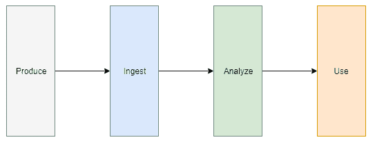

它展示了数据处理的四个步骤：

+   **生成**：数据实际上是由不同的服务、设备和客户端产生的地方

+   **摄取**：这是从不同的来源消费数据的过程

+   **Analyze**: 在此步骤中，数据被分析、转换并路由到适当的服务和组件。

+   **Use**: 在其他服务中进一步存储、显示和处理数据，例如 PowerBI、Azure Functions 等等。

在 Azure Event Hub 或 Azure IoT Hub 作为摄入步骤的一部分时，Azure Stream Analytics 负责**分析**。

请注意，在摄入数据时，您并不限于 Azure 服务。在这种情况下，只要它能够处理每秒数千个事件，您也可以使用任何类型的队列或 API。

# Azure Stream Analytics 概念

在 Azure Stream Analytics 中，最重要的概念是**流**。您可以将其视为携带数据的许多事件的流——它们不一定相同或共享架构。分析这样的流不是一件简单的任务。如果您需要解码数十万个事件，该过程必须快速、稳健且可靠。我们将讨论该服务的主要概念，以验证它是否能够作为我们的分析解决方案和主要事件处理器：

+   **Fully managed**: Azure Stream Analytics 是一个完全托管的平台即服务（PaaS），因此您无需担心资源配置和扩展问题——运行时会自行处理，这样您就可以专注于为数据分析提供最佳查询。

+   **An SQL-based query language**: 为了分析数据，Azure Stream Analytics 使用基于 SQL 的查询语言，使开发人员能够快速构建高级程序，从流中精确提取所需内容。此外，您可以引入自己的扩展，如 ML 解决方案或用户定义的聚合，以执行额外的计算，使用服务不可用的工具。

+   **Performance**: Azure Stream Analytics 专注于**流单元（SUs）**而不是一些硬编码的 CPU 或内存值。这是因为它设计用于提供稳定的性能和反复执行时间。此概念使得您可以轻松扩展解决方案以满足需求。

+   **Low cost of ownership**: 在 Azure Stream Analytics 中，您只需支付您选择的内容。由于定价取决于每小时的 SUs 数量，因此在总体付款中不会增加额外费用。

在本章后续部分，我们将涵盖一些额外的技术概念（例如输入/输出类型、检查点或重播）。要了解使用 Azure Stream Analytics 的整个管道的全貌，请查看以下图片：

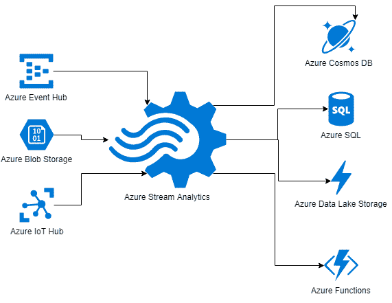

当然，在这张图片上可能还有其他参考信息（附加服务、用户功能和分析器），但为了简单起见，我没有包括它们。

# 输入和输出类型

Azure Stream Analytics 提供与一些本地 Azure 服务的无缝集成，例如 Azure Event Hub、Azure IoT Hub 或 Azure Blob Storage。此外，它还可以轻松配置，将数据输出到 SQL 数据库、Blob 或 Azure Data Lake Store。为了利用这些功能，你需要定义你感兴趣的输入和输出类型。这使得数据可以轻松地以流的形式被接收，从而你的作业可以在数千个事件上进行工作，进行分析和处理。在本节中，你将学习如何开始使用 Azure Stream Analytics，并定义输入和输出。

# 在 Azure 门户中创建 Azure Stream Analytics

要开始使用，你需要创建一个 Azure Stream Analytics 实例。为此，你需要点击+ 创建资源并搜索`Stream Analytics job`。这将显示一个表单，你可以在其中输入所有必要的数据来创建一个服务：

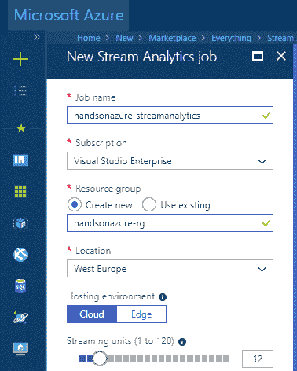

有两个字段，初看之下你可能会忽视它们：

+   托管环境：Azure Stream Analytics 可以通过两种方式托管：作为本地 Azure 服务或部署到本地 IoT Edge 网关设备。IoT Edge 是本书超出范围的主题，因此自然的选择将是云。

+   流处理单元（1 到 120）：你需要选择为一个作业分配多少个 SUs 来处理事件。所需的 SUs 数量取决于你作业的特性，并且可能会根据你选择的输入类型有所变化。在*进一步阅读*部分有一个链接，详细描述了你可能需要多少 SUs 来处理你的作业。

记住，你将为每个选择的 SU 支付€0.093/小时，即使它没有在作业上工作。

一旦你点击创建并打开概览面板，你将看到一个空的仪表盘：

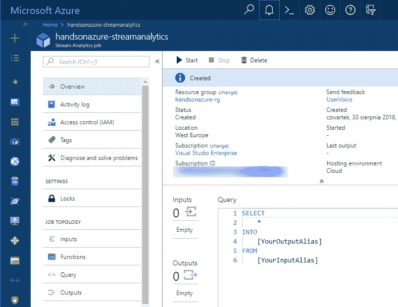

如你所见，Inputs 和 Outputs 目前都是空的——我们需要更改这些设置，这样我们才能在查询中使用它们。两项功能可以在左侧的 JOB TOPOLOGY 部分找到：

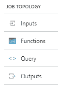

# 添加输入

要添加输入，点击 Inputs 面板。它将显示一个空白的屏幕，你有两种选择：

+   + 添加流输入：在这里，你可以添加一个链接，连接到支持流数据接收的服务。目前可用的 Azure 组件包括 Azure Event Hub、Azure IoT Hub 和 Azure Blob Storage。输入可以是实时的（也可以不是），并且这种连接支持压缩（例如，你可以传输使用 GZip 或 deflate 压缩的流）。

+   + 添加引用输入：您不仅可以从实时流中获取数据，还可以使用 Azure Blob Storage 并添加对其的引用，从而获取所谓的引用数据。在这种情况下，Azure Stream Analytics 会将整个数据加载到内存中，以便进行查找。这是处理静态或变化缓慢的数据的理想解决方案，并且支持最大为 300 MB 的数据。

在这里，您可以找到将 Event Hub 配置为输入的示例：

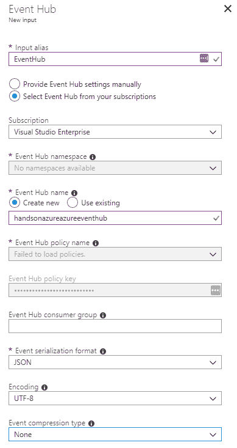

根据您的选择（是否在您的订阅中有 Event Hub，是否存在 Event Hub），会有不同的选项可用。在之前的示例中，我配置了一个新的 Hub（它是不存在的）作为我的数据来源。下面有一些字段，我现在想解释一下：

+   Event Hub 消费者组：如果您希望 Azure Stream Analytics 从头开始读取数据，请在此输入消费者组。默认情况下，它将使用 `$Default`，这是 Azure Event Hub 中的默认消费者组。

+   事件序列化格式：您可以选择 JSON、Avro 和 CSV。这可以根据使用的序列化格式自动反序列化事件。

+   事件压缩类型：如果您使用的是 GZip 或 Deflate，在这里您可以选择正确的选项，这样输入将会自动反序列化。

请注意，您需要一个实际的 Azure Event Hub 命名空间，才能通过 Azure Stream Analytics 自动创建一个 Hub。

填写所有必填字段后，您将能够点击“创建”按钮，初始化创建一个新的输入。当然，您可以添加多个输入，因为它们都会出现在输入流中，您将能够处理传入的事件。在开始作业之前，您至少需要一个输出，接下来我们将添加输出。

# 添加输出

要添加输出，您必须点击“输出”页面。它类似于“输入”页面，但有不同种类的输出可用：

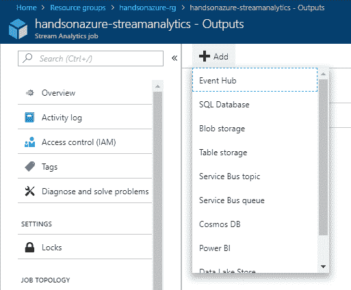

如您所见，有许多不同类型的输出可用，这使得 Azure Stream Analytics 在将获取的数据推送到不同服务时非常灵活。我们可以将它们分为不同类别：

+   存储：SQL 数据库、Blob 存储、Table 存储、Cosmos DB 和 Data Lake Store

+   报告：Power BI

+   计算：Azure Functions

+   消息传递：Event Hub、Service Bus

根据类别，您将有不同的选项可以对处理过的事件进行操作：

+   存储：用于进一步操作、归档和事件日志的数据存储

+   报告：近实时报告

+   计算：实现无限集成能力的简单解决方案

+   消息传递：将事件推送到不同的管道和系统

在这里，您可以找到将 Azure Table 存储配置为输出的示例：

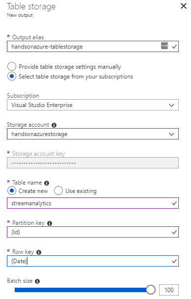

可用字段很大程度上取决于所选的输出类型，因此我在本章中不会重点讨论这些内容。你可以在*进一步阅读*部分找到相关参考。

# Azure Stream Analytics 查询语言

除了 Azure Stream Analytics 丰富的 Azure 服务选择，可以无缝集成外，其强大之处还在于查询语言，它允许你轻松地分析输入流并将其输出到所需的服务。由于它是类似 SQL 的语言，它应该对大多数使用该服务的开发者来说直观且容易学习。即使你不熟悉 SQL，提供的许多示例和简单的语法也应该使你容易掌握。

# 编写查询

在 Azure 门户中，Azure Stream Analytics 的查询窗口可以在概览或查询面板中找到：

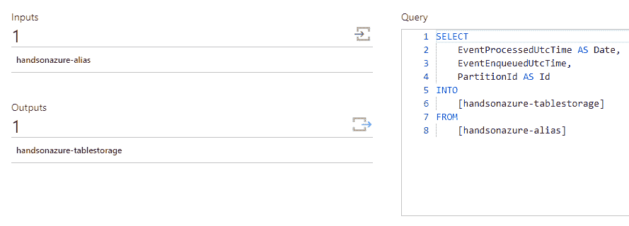

在上面的示例中，你可以看到一个简单的类似 SQL 的查询，它执行以下三项操作：

+   使用给定的别名从输入中选择数据

+   选择特定的列

+   将它们推送到特定的输出中

你也可以点击“编辑查询”链接，这样你将被引导到查询页面：

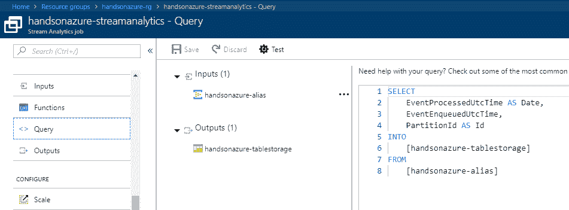

如你所见，要实际使用查询，你需要同时拥有输入和输出，否则你将无法保存它。一般来说，查询由三个元素组成：

+   `SELECT`：你从输入中选择你感兴趣的列

+   `INTO`：你告诉引擎你感兴趣的输出

+   `FROM`：你选择要从中提取数据的输入

当然，上述语句并不是唯一可用的—你可以使用许多不同的选项，如 GROUP BY、LIKE 或 HAVING。一切取决于输入流和传入数据的模式。对于某些任务，你可能只需要进行简单的转换并提取必要的列；而对于其他任务，你可能需要更复杂的语法来精确获取所需内容。你可以在*进一步阅读*部分的链接中找到常见的查询模式。在上面的示例中，在查询的 `SELECT` 部分，我选择了三个在分析 Azure Event Hub 事件时可用的列。而且，我使用了 `AS` 构造，告诉引擎实际重命名字段以匹配 Outputs 部分中定义的字段。当我运行作业时，我可以看到它确实将事件传递给了我的表：

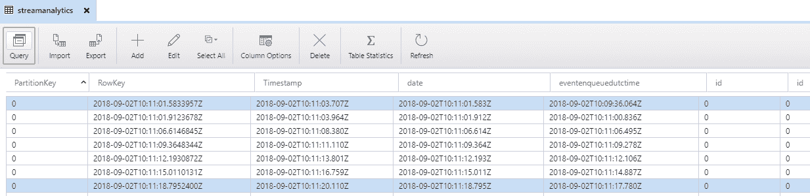

然而，当前配置存在一些问题：

+   我们依赖于 Event Hub 字段，这些字段未来可能会发生变化。

+   我们缺少事件的实际数据。

+   存在重复的列。

假设每个事件具有以下结构：

```
 {"Id":"165e0206-8198-4f21-8a6d-ad2041031603","Date":"2018-09-02T12:17:48.3817632+02:00"}
```

当然，特定数据会随时间变化。我们可以快速修改查询：

```
SELECT
    PartitionId,
    Id,
    Date
INTO
    [handsonazure-tablestorage]
FROM
    [handsonazure-alias]
```

并调整配置，稍微改变输出：

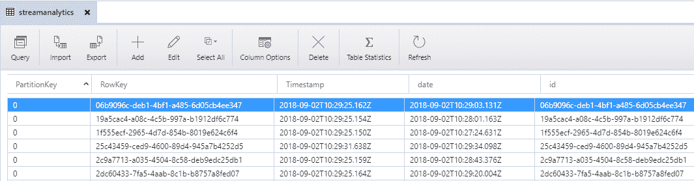

然而，基本构造只占该服务整体能力的一小部分。还有一些内置函数，可以在每个查询中轻松使用以增强查询，具体如下：

1.  数学函数：

```
SELECT FLOOR(input.x) AS "The FLOOR of the variable x" FROM input
SELECT SQUARE(input.x) AS "The SQUARE of the variable x" FROM input 

```

1.  聚合函数：

```
SELECT COUNT(*) FROM Input
SELECT SUM (Income) FROM Input
SELECT AVG (Income) FROM Input

```

1.  分析函数：

```
SELECT ISFIRST(mi, 10) as first FROM Input 
```

1.  地理空间函数：

```
SELECT ST_DISTANCE(input.pos1, input.pos2) FROM input 
```

1.  字符串函数：

```
SELECT SUBSTRING (SerialNumber ,1,3 ), FROM Input
```

除了这些，还有一些其他函数，如记录函数、日期/时间函数、转换函数或数组函数。上述示例当然并不是所有可用的函数。你可以在*进一步阅读*部分找到所有的函数。这里需要记住的重要一点是，某些函数是确定性的（这意味着，如果使用相同的输入值，它们总是返回相同的结果），而有些则不是——这在处理高负载并试图避免可能的异常时尤其重要。

记住，你可以合并不同的数据流并将它们推送到单个输出（或者反过来——有一个输入并将其分发到多个输出）。这是此服务的一个非常强大的功能，使得数据的摄取和处理变得更加容易。

# 事件排序、检查点和重放

在前面的章节中，我们介绍了 Azure Stream Analytics 的一些基础主题：如何配置输入和输出、查询数据以及使用该服务。在本章的最后部分，我将向你展示它的一些更高级的功能，如事件排序、检查点和重放，这些功能确保事件以你预期的方式被精确处理。这些话题实际上是许多不同消息传递解决方案中的常见内容，因此你可以将本章中的知识应用到其他项目中。

# 事件排序

在事件排序时有两个概念：

+   应用时间（或事件时间）

+   到达时间

它们之间有明显的区别：

+   **应用时间**：这是事件在客户端（或应用程序）端生成的时间戳。它告诉你事件发生的确切时间。

+   **到达时间**：这是一个系统时间戳，在原始负载中不存在。它告诉你事件何时被服务接收并开始处理。

根据输入类型， 到达时间和 应用时间将是不同的属性（`EventEnqueuedUtcTime`或`EnqueuedTime`表示到达时间，而应用时间通常将是一个通用属性）。你需要记住的是，根据所选择的场景，你可以按顺序处理事件但有延迟，或者按乱序处理事件。这个可以通过以下事件序列轻松描述：

1.  **到达时间**：`2018-09-02T12:17:49` **应用时间**：`2018-09-02T12:17:48`

1.  **到达时间**：`2018-09-02T12:17:50` **应用时间**：`2018-09-02T12:17:44`

1.  **到达时间**：`2018-09-02T12:17:51` **应用时间**：`2018-09-02T12:17:46`

如果按事件流到来的顺序处理，它们将被**无序处理**——实际上，它们发生的顺序不同，因此有可能某些数据会变得过时。另一种选择是按应用时间对事件进行排序；在这种情况下，处理会延迟，但顺序将得以保留。

是否需要按顺序处理事件，取决于数据模式和已处理事件的特征。按顺序处理事件更耗时，但有时你根本无法采用其他方式。

**Azure Stream Analytics** 具有一个名为事件排序的功能，允许你决定如何处理无序或过时的事件：

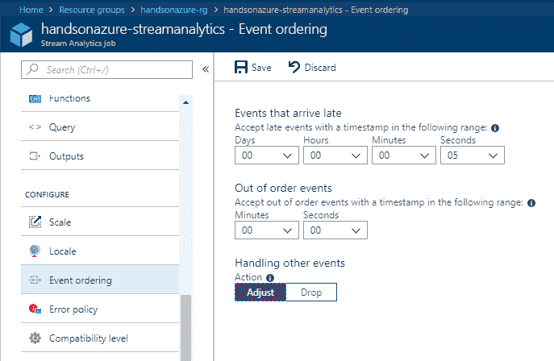

有两种可用选项：

+   延迟到达的事件：这一选项允许你在定义的时间窗口内处理过时的事件（即应用时间与最后处理的事件时间不匹配的事件）。

+   无序事件：可能会发生**Azure Stream Analytics** 将一些事件视为无序事件的情况（例如，如果发送方的时钟不一致）。在这种情况下，你可以设置一个时间窗口，在该时间窗口内可以接受此情况。

此外，你可以定义一个操作，如果事件迟到或无序，则会执行该操作——对于丢弃（Drop）操作，它将被简单移除，如果选择调整（Adjust），当这种情况发生时，处理将暂停一段时间。

# 检查点和重放

实际上，**Azure Stream Analytics** 是一个有状态服务，能够跟踪事件处理进度。这使得它适用于以下场景：

+   作业恢复

+   有状态查询逻辑

+   不同的作业启动模式（现在、自定义和上次停止时）

当然，在检查点之后和重放时，情况是有所不同的。当检查点中存储的数据不足时，可能需要进行完整的重放；然而，这取决于你的查询。实际上，它依赖于查询的并行化因素，可以通过以下公式描述：

*[输入事件速率] x [间隔长度] / [处理分区数]*

处理器越多，出现问题时恢复得越快。一个好的经验法则是，当作业失败并且你需要快速填补间隙时，增加更多的 SUs。

重放数据时需要考虑的重要因素是查询中使用的窗口函数（滚动窗口、跳跃窗口、滑动窗口或会话窗口）——它们允许你在不同类型的窗口中处理数据，但也使得重放机制变得复杂。

# 总结

在本章中，我们介绍了 Azure Stream Analytics，这是一个用于近实时处理数据流的服务。你已经了解了可用的输入和输出，并学习了如何配置它们。而且，你也能够编写你的第一个查询，并查看查询语言如何用于分析和处理传入事件。如果你需要一个能够快速读取和转换事件，并将其推送到多个不同 Azure 服务的 PaaS，Azure Stream Analytics 就是你需要的服务。

在下一章，我们将讲解 Azure Service Bus，这是一种企业级的消息传递解决方案，实际上是我们之前讨论的 Azure Event Hub 的基础。

# 问题

1.  Azure Stream Analytics 的付费模型是什么？

1.  流和引用输出有什么区别？

1.  应用时间和到达时间有什么区别？

1.  需要使用哪个查询构造来选择输入中的 ID 并将其推送到输出？

1.  你能在同一个查询中处理不同的输入吗？

1.  何时认为事件是无序的？

1.  是否可以从查询中的某个属性提取子字符串？如果可以，应该使用哪个函数？

# 进一步阅读

+   扩展和 SUs：[`docs.microsoft.com/en-us/azure/stream-analytics/stream-analytics-streaming-unit-consumption`](https://docs.microsoft.com/en-us/azure/stream-analytics/stream-analytics-streaming-unit-consumption)

+   不同的输出类型： [`docs.microsoft.com/en-us/azure/stream-analytics/stream-analytics-define-outputs`](https://docs.microsoft.com/en-us/azure/stream-analytics/stream-analytics-define-outputs)

+   常见查询模式：[`docs.microsoft.com/en-us/azure/stream-analytics/stream-analytics-stream-analytics-query-patterns`](https://docs.microsoft.com/en-us/azure/stream-analytics/stream-analytics-stream-analytics-query-patterns)

+   窗口函数：[`docs.microsoft.com/en-us/azure/stream-analytics/stream-analytics-window-functions`](https://docs.microsoft.com/en-us/azure/stream-analytics/stream-analytics-window-functions)
