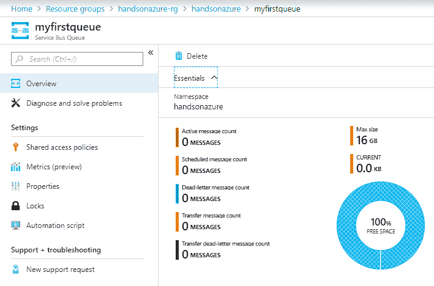

# 企业级集成 - Azure Service Bus

有时候，为了使用消息传递解决方案集成我们的应用程序，我们需要的不仅仅是一个简单的管道，因为管道在分发数据和过滤数据时功能有限。Azure Service Bus 提供了主题、过滤器等更多功能，是一个为提供可靠、可扩展和高效的消息发送方式而设计的企业级解决方案，可以向多个接收者发送消息。

本章将涵盖以下主题：

+   使用 Azure Service Bus 进行工作

+   基础知识——队列、主题和中继

+   保护 Azure Service Bus 安全

+   高级功能，如地理复制、会话或死信队列

+   处理停机和灾难

# 技术要求

要完成本章的练习，你将需要：

+   访问 Microsoft Azure 订阅

+   一个 Visual Studio 2017 实例

+   Visual Studio Code（如果你没有 Visual Studio 2017 实例）

# Azure Service Bus 基础

你已经学习了其他消息传递解决方案，这些方案帮助你简化了服务之间的通信，它们都有不同的特性。在 Azure Event Hub 中，你能够每秒处理数千条消息，而在 Azure 存储队列中，你得到了一个可靠且持久的解决方案，可以用于异步处理接收到的数据。在本章中，我们将讨论 Azure Service Bus，这是一种多租户云消息传递服务，引入了先进的概念，如先进先出（FIFO）消息传递、死信队列或事务。它是一个企业级的云组件，能够集成许多不同的服务和应用程序。

# Azure Service Bus 与其他消息传递服务的对比

在前几章中，我们讨论了以下服务，它们允许我们处理消息：

+   Azure Event Hub

+   Azure 存储队列

+   Azure Event Grid

它们都有相似之处，但设计上服务于不同的功能并提供不同的能力。我们经常交替使用事件和消息这两个概念。实际上，它们之间有细微的区别，理解这一点对于成功使用不同的消息传递服务至关重要：

+   **事件**：它携带某些事情发生的信息——某人或某物产生了一个事件，并不意味着对事件的处理有任何预期。一般来说，事件是轻量级的信息载体，不会将完整的数据传递给接收者。

+   **消息**：与事件不同，当生产者发送消息时，它对消息的处理有一定的预期（因此生产者和消费者之间存在某种契约）。而且，消息携带的是原始数据，而事件表示某事发生了；消息表明组件已初始化通信，应该以常规方式处理。

现在，您可以回想一下您所学的内容，例如，Azure Event Grid 或 Azure Event Hub——它们的名称中都有“事件”二字，但工作方式却大不相同：

+   **Azure Event Grid**：它旨在分发事件并响应变化。它仅传递元数据，实际的消息必须单独获取；因此，可以说它分发的是事件。

+   **Azure Event Hub**：它作为大数据管道工作，将事件流式传输到其他服务。根据您的实现方式，它可以同时流式传输事件和消息。

现在，让我们来对比一下 Service Bus：

+   **Azure Service Bus**：它是为支持关键业务流程而创建的，这些流程对处理顺序和消息服务的可靠性有很高要求。您可以在消息不能丢失或重复的情况下使用它。它不涉及“事件”的概念——相反，它允许您推送整个数据，供消费者读取。

# Azure Service Bus 和 Azure Storage Queues

您可能会想，Azure Service Bus 和 Azure Storage Queues 有什么区别。事实上，它们都是消息传递解决方案，可靠、持久并且能够同时处理多条消息。然而，仔细观察，您会发现它们是完全不同的服务，采用不同的概念并且有不同的目的：

+   Azure Storage Queues 强制轮询队列以接收消息，而通过 Azure Service Bus，您可以通过 TCP 建立长轮询接收操作。

+   在 Azure Storage Queue 中，您可以存储最多 64 KB 的消息——而 Azure Service Bus 将该限制提升至 256 KB。

+   Azure Service Bus 队列的存储数据量小于 Azure Storage Queues——最大支持 80 GB。

+   Azure Service Bus 支持批量消息消费。

+   在 Azure Storage Queues 中，安全模型相对简单——Azure Service Bus 在保障队列安全时支持 RBAC 模型。

+   Azure Storage Queues 不支持事务行为。

如您所见，Azure Service Bus 提供了许多高级功能，这些功能对于集成不同系统和应用程序的应用非常有帮助，也适用于第三方应用。当然，这些附加功能需要额外费用，因为它们要求使用更贵的服务层级。在 Azure Service Bus 中，您有三种服务层级可供选择：

+   **基础版**：仅支持队列和定时消息。

+   **标准版**：所有功能均可用。

+   **高级版**：最大消息大小扩展至 1 MB，并且包含代理连接。此级别还保证更高的吞吐量和更好的性能。

如果您只需要基本功能（不需要主题、事务或会话），那么 Azure Service Bus 实例可能比使用 Azure Storage Queues 更便宜。具体取决于您的系统需求。

# Azure 门户中的 Azure Service Bus

要创建一个 Azure 服务总线实例，你需要在市场中搜索`Service Bus`服务。你将看到一个简短的表单，在其中填写最关键的信息，如服务名称、定价层级和位置：


目前，你只需填写这些内容——点击创建按钮，稍等片刻，服务就会创建完成。概述面板显示了更多信息，但如你所见，它与在使用 Azure 事件中心时看到的非常相似：


在前面的截图中，你会看到+ 主题按钮被灰色禁用——这是因为我为本次练习选择了基本层。点击+ 队列按钮，你将能够创建一个新的队列：


这里的事情变得有些复杂：

+   名称：这是队列的唯一名称。

+   最大队列大小：你可以决定队列的最大大小（与 Azure 存储队列中的固定 80 GB 大小不同）。

+   消息存活时间：在 Azure 存储队列中，消息的最大存活时间为 7 天。在这里，你可以指定消息在被删除（或移动到死信队列）之前的自定义存活时间。

+   锁定持续时间：当消费者提取消息时，消息会在固定时间段内被锁定，以避免重复读取。在这里，你可以自定义锁定时间（最多为 5 分钟）。

+   启用重复检测：如果你想确保在固定时间段内实现“恰好一次”的投递模式，可以启用此选项。它允许你配置一个重复检测窗口，在该窗口内会保留已处理消息的历史记录。

+   启用消息过期时的死信处理：如果消息过期，它会被自动删除。若要将其推送到死信队列，而不是删除，请启用此选项。

+   启用会话：Azure 服务总线中的会话确保 FIFO（先进先出）消息处理。为了确保最早推送到服务的消息是最先处理的消息，请启用此功能。

+   启用分区：此选项将队列从单一的消息存储中分离出来，实际上你将得到多个队列。此选项确保即使存储出现故障，整个队列或主题也不会出现停机。然而，关于此功能有一些限制——其中之一是启用分区后，你不能在单个事务中发送属于不同会话的消息。更重要的是，每个命名空间最多只能拥有 100 个分区队列或主题。

在 Azure 服务总线的高级层中，不支持分区队列和主题。

启用分区时，队列的样子如下：



如你所见，队列的最大大小显示为 16 GB——这是因为启用分区后，我们将得到 16 个分区，每个分区托管一个最大为 1 GB 的队列。

由于单个队列的最大大小被设置为 5 GB，你可以通过使用分区来实现最大大小 80 GB。启用此功能后，最大大小将为 5 GB * 16 个分区 = 80 GB。

# 队列、主题和中继

Azure Service Bus 支持三种不同类型的实体：

+   队列

+   主题

+   中继

这三种方式为你提供了不同的通信处理选项。

# 队列

队列是服务中最简单的实体。你可以如下定义它：


在前面的示例中，你可以看到我们有以下概念：

+   **生产者**：一个应用程序或服务，将消息推送到队列

+   **队列**：消息容器

+   **消费者**：一个应用程序或服务，通过拉取模型从队列读取消息

拉取模型意味着生产者实际上需要向队列请求接收消息。当然，可以有多个生产者和多个消费者——此时锁定持续时间功能特别有用，因为它确保在任何时刻只有一个消费者读取消息。

# 主题

主题与队列略有不同，因为它们允许你实现发布/订阅通信模型。当队列是点对点通信时，主题让你有机会将不同的消息分发到不同的队列：


这种模型使得可能对消息进行过滤并将其隔离，以便消费者只读取他们感兴趣的消息。

请记住，主题在基础层不可用——你必须至少使用标准层。

# 中继

队列和主题都是模型，旨在仅提供单向通信——生产者发送消息，接收者读取消息。如果你想实现双向通信，你需要使用中继：


Azure Relay 实际上是一个独立的服务，我们不会在本章中讨论它。然而，仍然有许多很棒的功能，你可能会在应用程序中找到它们的帮助：

+   它旨在安全地暴露托管在公司网络内的服务。

+   它允许不同的通信模型，如单向、发布/订阅和双向通信。

+   它不像 VPN 那样改变网络，因此更加稳定，并且限制于单个应用程序端点。

# Azure Service Bus 设计模式

Azure Service Bus 通常是许多不同云服务的集成中心——它可以用于多种场景，包括数据集成、信息广播，甚至双向通信。由于该服务具有丰富的功能，你可以使用它实现各种责任。在本章的*进一步阅读*部分，你可以找到许多 Azure Service Bus 设计模式的示例。

# 使用 Azure Service Bus SDK 开发解决方案

GitHub 上有一个丰富的数据库，包含许多不同的示例，用于与 Azure 服务总线合作（你可以在*进一步阅读*部分找到链接），所以我们将在本章中只介绍基本的示例。这里是将消息发送到队列的最简单方法：

```
using System.Text;
using System.Threading.Tasks;
using Microsoft.Azure.ServiceBus;

namespace HandsOnAzure.ServiceBus
{
    internal class Program
    {
        private static void Main()
        {
            MainAsync().GetAwaiter().GetResult();
        }

        private static async Task MainAsync()
        {
            var client = new QueueClient("<connection-string>", "<queue-name>");
            var message = "This is my message!";

            await client.SendAsync(new Message(Encoding.UTF8.GetBytes(message)));
        }
    }
}
```

如你所见，所需的只是使用一个`QueueClient`实例（至少要实现基本功能）。如果你想使用主题，则可以使用`TopicClient`：

```
var client = new TopicClient("<connection-string>", "<topic-name>");
```

事实上，你需要做的就是安装`Microsoft.Azure.ServiceBus`NuGet 包。在我运行上述代码三次并检查我的队列后，我在门户中看到的内容如下：


如你所见，有三条活跃消息。这意味着我已经成功发布了它们，并且它们准备好被拉取。有多种不同的拉取消息方式——这里有一个使用`PeekAsync`的示例：

```
using System;
using System.Text;
using System.Threading.Tasks;
using Microsoft.Azure.ServiceBus.Core;

namespace HandsOnAzure.ServiceBus.Reader
{
    internal class Program
    {
        private static void Main()
        {
            MainAsync().GetAwaiter().GetResult();

            Console.ReadLine();
        }

        private static async Task MainAsync()
        {
            var receiver =
                new MessageReceiver(
                    "<connection-string>",
                    "<queue-name>");

            while (true)
            {
                var message = await receiver.PeekAsync();
                if(message == null) continue;

                Console.WriteLine($"New message: [{message.ScheduledEnqueueTimeUtc}] {Encoding.UTF8.GetString(message.Body)}");
                await Task.Delay(100);
            }
        }
    }
}
```

然而，如果你只是查看消息，而不是接收消息，你将不会创建消息存储。要做到这一点，你必须使用`ReceiveAsync`：

```
var message = await receiver.ReceiveAsync();
```

当你使用两种方法读取消息时，差异会变得明显。`PeekAsync`不会改变消息的状态（即使你将`ReceiveMode`选项设置为`ReceiveAndDelete`，它们仍然会显示为活跃）。`ReceiveAsync`将使用`ReceiveMode`选项的值，并可能充当原子操作`CompleteAsync`。

在使用`PeekAsync`后，要将消息标记为已读，**你可以使用`CompleteAsync`**。

本章稍后我们将讨论更高级的场景。

# Azure 服务总线安全性

由于 Azure 服务总线被描述为一个企业级的云服务，旨在集成不同的服务，因此对其提供的安全功能有很高的期望。除了共享访问令牌外，预览版中还有一些新功能，使访问管理更加灵活。

# 托管服务身份

**托管服务身份**（**MSI**）是 Azure 云中的一个功能，它简化了服务之间的身份验证，而无需在代码中存储凭证。完整描述可以在*进一步阅读*部分的链接中找到。当涉及到与 Azure 服务总线一起使用时，不需要额外的面板——你需要做的只是找到访问控制（IAM）面板中的身份：


现在，你可以使用以下代码，而不是使用 SAS 令牌或访问策略：

```
var tokenProvider = TokenProvider.CreateManagedServiceIdentityTokenProvider();
var sendClient = new QueueClient($"sb://{namespace}.servicebus.windows.net/", {queue-name}, tokenProvider);
await sendClient.SendAsync(new Message(Encoding.UTF8.GetBytes(messageInfo.MessageToSend)));
await sendClient.CloseAsync();
```

如你所见，流程变得更简单了，因为你不需要存储凭证或密钥，而是让提供商来处理身份验证。

# RBAC

在 Azure Service Bus 中，您还可以利用在 Azure AD 中定义的角色授予服务访问权限。整个功能依赖于一个假设，即用户能够负责授予访问 Service Bus 实例的权限。第一步与 MSI 认证完全相同：您需要将用户添加到服务中，以便它可以获得访问权限并开始推送和接收消息。完整的说明可以在 *进一步阅读* 部分找到。

请注意，通过明确告诉用户或应用程序如何访问 Azure Service Bus，您可以更好地控制消息的发布和接收。这是相较于 Azure Storage Queues 的一个重要改进，因为在 Azure Storage Queues 中没有此类功能。

还可以使用 RBAC 认证来授予一个服务访问另一个服务的权限（如果 MSI 不可用）。在这种情况下，将不需要交互式登录，因为所有操作都由 Azure AD 处理。

即使需要交互式登录，它也不会由应用程序处理，因此您可以确保它不会直接处理任何凭据。

# Azure Service Bus 的高级功能

我们已经涵盖了 Azure Service Bus 的一些基础知识，如 SDK、最重要的概念和安全性考虑事项。现在我们将更多地关注一些更高级的用例，如死信、性能、会话和事务。所有这些话题对于开发一个可靠且重要的服务（集成多个不同的应用程序和系统）至关重要。同时，别忘了查看 *进一步阅读* 部分中的 Azure Service Bus 示例，它指向一个 GitHub 仓库，您可以在其中找到许多使用此服务时的不同用例和概念。

# 死信

一般来说，死信指的是队列中被认为是“死”的消息（因为没有接收者愿意拉取它们），而且您有两种选择来处理这些消息：

+   或者将它们永久删除

+   将它们推送到一个额外的队列，名为死信队列

在 Azure Service Bus 中，您有两种选择将消息推送到死信队列：

+   设置消息的最大生命周期—一旦过期，它将自动移到死信队列

+   使用 `DeadLetterAsync` 方法在 `MessageReceiver` 上，如下所示：

```
await receiver.DeadLetterAsync("<lock-token>", "<reason>");
```

这里您可以找到完整的示例，并可以找到锁定令牌：

```
while (true)
{
  var message = await receiver.ReceiveAsync();
  if(message == null) continue;

  Console.WriteLine($"New message: [{message.ScheduledEnqueueTimeUtc}] {Encoding.UTF8.GetString(message.Body)}");

  await receiver.DeadLetterAsync(message.SystemProperties.LockToken, "HandsOnAzure - test");
  await Task.Delay(100);
}
```

一旦您将消息推送到死信队列，其状态将在门户中显示：


当然，您也可以从死信队列中提取消息。要获取队列名称，您可以使用以下方法：

```
var deadLetterQueueName = EntityNameHelper.FormatDeadLetterPath("<entity-path>");
```

# 灾难恢复

当发生灾难时，您可能会丢失部分或全部数据。一般来说，灾难是指整个服务的暂时性或永久性丧失，且无法保证它会再次可用。此类灾难包括洪水、地震或火灾，仅举几例。灾难通常发生在单一区域（不同区域同时发生灾难的概率非常小），因此，通常您需要两个不同的数据中心来实现灾难恢复（DR）。

请记住，如果两个数据中心彼此距离较近，单靠这两个数据中心可能不足够——您必须选择能够满足您需求的两个数据中心，但同时它们之间的距离应尽可能远。

在实现 Azure Service Bus 中的灾难恢复时，流程与 Azure Event Hub 中的流程相同：

+   创建主区域

+   创建辅助区域

+   创建配对

+   定义故障转移触发器

通常，要创建配对，您需要以下代码片段：

```
var client = new ServiceBusManagementClient(creds) { SubscriptionId = subscriptionId };

var namespace2 = 
  await client.Namespaces.CreateOrUpdateAsync(
  "<resource-group-name>", 
  "<secondary-namespace>", 
  new SBNamespace { ... params ... });

ArmDisasterRecovery drStatus = 
  await client.DisasterRecoveryConfigs.CreateOrUpdateAsync(
            "<resource-group-name>",
      "<primary-namespace>",
      "<alias>",
      new ArmDisasterRecovery { PartnerNamespace = namespace2.Id })
```

上述示例使用了`Microsoft.Azure.Management.ServiceBus` NuGet 包来操作命名空间。

一旦配对配置并创建完毕，您需要触发并启动故障转移。为此，您只需要以下代码：

```
client.DisasterRecoveryConfigs.FailOver("<resource-group-name>", "<secondary-namespace>", "<alias>");
```

请注意，故障转移是在辅助区域启动的——这一点至关重要，因为在执行操作时，主区域可能不可用。

一旦故障转移完成，您可以开始使用辅助区域处理消息。然而，有一件重要的事情需要记住：如果再次发生故障，您希望能够再次进行故障转移。因此，设置另一个辅助命名空间（并将当前命名空间设为主命名空间）并重新配对以确保安全也非常重要。

# 会话

在 Azure Service Bus 中，会话用于实现 FIFO 保证。一般而言，服务不控制消息之间的关系，因此即使在大多数情况下顺序得以保持，但并不保证。要将消息放入会话中，您必须利用`SessionId`属性：

```
await client.SendAsync(new Message(Encoding.UTF8.GetBytes(message)) { SessionId = Guid.Empty.ToString()});
```

要在接收方处理会话，必须在`QueueClient`实例上使用`RegisterSessionHandler`方法：

```
var client = new QueueClient("<connection-string>", "<queue-name>");
client.RegisterSessionHandler((session, message, ct) => Task.FromResult(new SessionHandler()), args => Task.CompletedTask);
```

此外，您还必须实现`IMessageSession`**。

# 事务

Azure Service Bus 中的事务是一个广泛的话题，涉及许多不同的实体，您可以在此服务中与之进行交互：

+   客户端（`QueueClient`、`TopicClient`）

+   消息（通过使用诸如`Complete`、`Defer`、`Abandon`等操作）

+   会话（`GetState`/`SetState`）

如您所见，这里没有列出接收操作；这是因为假设它们在设计时是原子的。

通常，在拉取消息并在循环或`OnMessage`回调中打开事务范围时，要求使用`ReceiveMode.PeekLock`模式。

您可以参考以下代码片段，以便更好地理解我们在本节中讨论的内容：

```
var message = receiver.Receive();
using (scope = new TransactionScope())
{
   var newMessage = // transfer

   sender.Send(newMessage);
   message.Complete();

   scope.Complete();
}
```

在上述示例中，处理器（同时负责生成消息）将消息标记为完成，同时将新消息传输到另一个队列。整个模型利用了 Azure Service Bus 的自动转发功能。以下是主题的一个示例：

```
var subscription = new SubscriptionDescription(sourceTopic, subscriptionName);
subscription.ForwardTo = destinationTopic;
namespaceManager.CreateSubscription(subscription);
```

当执行事务时，只有当整个事务成功时才会提交到队列日志中；否则，处理过的消息将不会留下任何痕迹。

# 处理停机和灾难

如果你将 Azure Service Bus 作为架构的中心 —— 一个负责集成数十个服务和处理通信的服务，你必须确保其进行了复制并且不易受到灾难影响。这里有两个主题需要考虑：灾难恢复和处理停机。由于这些术语是完全不同的概念，你必须理解它们并能够在意外问题和事故发生时实施解决方案。在本章的最后一节，你将学习如何将 Azure Service Bus 打造成一个可靠的云组件，你和你的应用都可以依赖它。

# 处理停机

尽管灾难通常意味着部分数据丢失，停机可能被描述为服务暂时不可用。这就是为什么一旦解决了这个问题，你可能希望同步两个服务总线命名空间。尽管这个过程是自动的，但可能需要一些时间。文档中指出，每分钟只能传输 50-100 个实体。因此，你可能需要考虑主动/被动复制的概念：

+   **主动模式**：在这种方法中，你拥有两个活动的命名空间，可以主动接收消息。然后接收者始终接收两者中的消息 —— 你必须使用相同的唯一标识符正确标记它们，以便检测重复（你可以使用`MessageId`或`Label`属性中的任何一个）。

+   **被动模式**：与同时使用两个队列（或主题）相比，只有在无法将消息传递到主要命名空间时，才会使用第二个。然而，这种方法也有其注意事项：可能会导致消息传递延迟（甚至丢失）或重复。

在这里，你可以找到被动复制的一个例子：

```
private async Task SendMessage(BrokeredMessage message1, int maxSendRetries = 10)
{
  do
  {
    var message2 = message1.Clone();
    try
    {
      await _activeQueueClient.SendAsync(message1);
      return;
    }
    catch
    {
      if (--maxSendRetries <= 0)
      {
        throw;
      }

      lock (_swapMutex)
      {
        var client = _activeQueueClient;
        _activeQueueClient = _backupQueueClient;
        _backupQueueClient = client;
      }

      message1 = message2.Clone();
    }
  }
  while (true);
}
```

如你所见，这清楚地展示了消息副本如何传递到备份队列。主动复制的一个例子略有不同：

```
var task1 = primaryQueueClient.SendAsync(m1);
var task2 = secondaryQueueClient.SendAsync(m2);

try
{
  await task1;
}
catch (Exception e)
{
  exceptionCount++;
}

try
{
  await task2;
}
catch (Exception e)
{
  exceptionCount++;
}

if (exceptionCount > 1)
{
  throw new Exception("Send Failure");
}
```

在这里，我们将同一消息发送到两个命名空间，即使其中一个失败。处理停机的另一个需要考虑的事情是使用分区发送者（尽管高级版中不可用）。使用它们时，一旦单个消息存储停机，你仍然可以使用其他分区发送和接收数据。以下示例展示了在主题上启用分区：

```
var ns = NamespaceManager.CreateFromConnectionString(myConnectionString);
var td = new TopicDescription(TopicName);
td.EnablePartitioning = true;
ns.CreateTopic(td);
```

# 摘要

在这一简短的章节中，你学习了 Azure Service Bus 的基本概念，包括队列、主题、SDK 以及更高级的功能，如死信、会话和事务。还有许多内容需要学习：异步消息传递、**高级消息队列协议**（**AMQP**）以及高级事务场景。总体来说，这是一个非常适合简单和关键场景的优秀服务，因为它为大多数应用提供了足够的灵活性，同时也很容易学习如何入门。记住，你可以使用基础层来处理最简单的用例，它为你提供了一个便宜且可靠的解决方案，比 Azure 存储队列提供了更加丰富的选项。在下一章中，我们将重点介绍使用 Azure Application Insights 进行监控服务*。

# 问题

1.  队列和主题有什么区别？

1.  你可以在基础层中使用主题吗？

1.  使用死信队列的原因是什么？

1.  Azure Service Bus 中的会话是什么？

1.  启用分区的队列的最大大小是多少，当单个队列的最大大小为 1 GB 时？

1.  活跃复制和被动复制有什么区别？

1.  如何在 Azure Service Bus 中实现灾难恢复？

# 深入阅读

+   MSI 概述：[`docs.microsoft.com/pl-pl/azure/active-directory/managed-identities-azure-resources/overview`](https://docs.microsoft.com/pl-pl/azure/active-directory/managed-identities-azure-resources/overview)

+   RBAC 认证：[`docs.microsoft.com/en-us/azure/service-bus-messaging/service-bus-role-based-access-control`](https://docs.microsoft.com/en-us/azure/service-bus-messaging/service-bus-role-based-access-control)

+   Service Bus 示例：[`github.com/Azure/azure-service-bus/tree/master/samples/DotNet`](https://github.com/Azure/azure-service-bus/tree/master/samples/DotNet)

+   Azure Service Bus 设计模式：[`msdn.microsoft.com/en-us/magazine/mt845652.aspx`](https://msdn.microsoft.com/en-us/magazine/mt845652.aspx)
