# 第十五章：使用应用程序洞察监控你的应用程序

Azure 不仅仅是关于开发应用程序。一旦我们将解决方案部署到云端，我们就必须以某种方式进行监控和诊断。Azure 应用程序洞察服务提供了一个完整的工具集，用于维护应用程序，提供多种语言和平台的 SDK，警报，查询语言，并与许多本地 Azure 服务集成。它简化了应用程序的登录，并消除了在使用来自多个地方的数据分析问题时的多个数据源。

本章将涵盖以下主题：

+   使用 Azure 应用程序洞察服务

+   监控不同的平台

+   使用分析模块

+   自动化 Azure 应用程序洞察

# 技术要求

要执行本章的练习，你将需要：

+   一个 Azure 订阅

+   安装了以下工作负载的 Visual Studio——ASP.NET、Web 开发和 Azure 开发

# 使用应用程序洞察服务

在开发应用程序时（尤其是托管在云中的应用程序），最重要的功能之一就是能够轻松地进行监控，并在早期阶段检测到任何潜在问题或缺陷。为此，你需要一个完整的日志记录、存储和报告工具的架构，这些工具需要集成、配置并每天维护。这要求你的团队具备额外的技能，当然也需要时间——你的应用程序越大，所需的工作量就越多。使用 Azure 应用程序洞察，所有这些操作变得更加简单：你只需要一个服务和一个端点来记录所有需要的信息，剩下的工作自动完成。

# 在云中记录数据

假设你有以下架构：

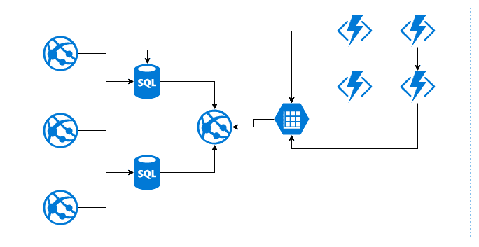

它包含了许多不同的 Web 应用程序、不同的存储能力（如 SQL 数据库或 Azure 存储），还有 Azure Functions。如果我们希望能够监控所有这些服务，我们将需要以下组件：

+   一种保存日志的工具（能够使用不同的输出，如存储或文件，可能是跨平台的）

+   能够存储数 GB 日志数据的存储

+   某种仪表板，将从存储中获取数据，并使用不同的筛选器和参数显示它

考虑到所有这些因素后，你可能会发现以下一些警告：

+   存储原始数据是不够的，因为你还需要某种投影视图，能够快速提取，并且不需要额外的转换或处理。

+   你需要找到一种存储数据的方法，使得用户可以根据不同的向量随意查询——追加日志可能非常适合检查最近的记录，但对于创建动态参数的索引却不太理想。

+   你需要实施某种数据保留策略——大多数日志在固定时间段后就没有用了。

+   应用程序和报告解决方案的性能应具有可重复性，并且不应随时间变化（例如，存储的数据量增加时）。

+   为问题跟踪设置专门的团队可能并不是最合理的资源分配——具有报告和数据分析技能的人在处理实际业务数据时会更有价值。

对于前述问题，理想的解决方案是一个能够完成我们之前提到的所有任务的单一组件：

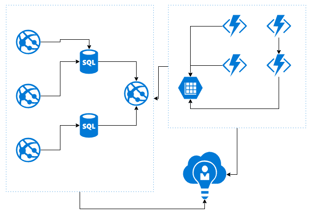

在 Azure 中，类似的组件是 Azure Application Insights，我们将在本章中介绍。

# Azure Application Insights 基础知识

连接到 Azure Application Insights 服务可能会因您的情况而异。通常，您在集成该服务时有多种选择：

+   与门户的无缝集成——无需额外的步骤，您只需启用并配置一个功能，剩下的已经实现

+   根据平台使用适当的 SDK

+   将遥测事件直接发送到服务端点

根据您使用的概念，将使用不同的配置：

+   对于门户，您无需额外的步骤，因为您已通过身份验证，并且可以从下拉菜单中选择一个资源。

+   对于 SDK，您需要一个仪表密钥，可以在门户中找到——我们将在本章后续部分讨论这一话题。

+   使用 REST API，有多种选项可用，例如 App ID、密钥或 OAuth2 流程。

请注意，根据使用的日志记录方法，可能会有不同的功能和能力。这对于发送自定义事件或自定义日志逻辑尤其如此——此类操作通常需要使用专用的 SDK。

除了一些显而易见的功能（如记录和存储有关请求或异常的信息的能力），Azure Application Insights 还实现了许多不同的功能：

+   **请求遥测**：您可以自动收集有关请求次数、平均延迟和失败率的信息。例如，如果您将此服务与 Azure App Services 一起使用，只需实现 SDK 即可获得对您的 Web 应用程序的全面洞察。

+   **依赖项**：除了常规的遥测信息，Azure Application Insights 还可以提供有关您的依赖项（如 Azure Table Storage 和 Azure SQL）如何执行的信息。如果您集成了多个服务，并且想知道哪个服务对延迟的影响最大，这一点尤为重要。

+   **异常**：获取有关失败请求或依赖项的信息是一回事，但显示有关错误的汇总数据的详细仪表板则更有用。在 Azure Application Insights 中，您可以轻松查看哪些类型的错误与某些特定子集的请求相关联。这使您更好地理解应用程序内部发生了什么，并知道从哪里开始修复。

+   **用户遥测**：你想知道到底有多少用户吗？你是否对他们使用应用时的流程感兴趣？在 Azure Application Insights 中，还有其他功能可以提供关于用户和会话数量、他们的行为以及整体活动的信息。

当然，我没有列出所有可用的功能——还有更多的功能，比如收集有关 AJAX 调用、页面视图和网页性能的信息；性能计数器（用于虚拟机），以及来自 Docker 的主机诊断。实际上，功能的可用性也取决于你选择的服务——为 Azure Functions 和 Azure App Services 收集的遥测数据是不同的。

实际上，你可以通过类似的图表和诊断，使用大多数服务实现与你的日志相同粒度的分析。不同的是所需的工作量——一个服务与 Azure Application Insights 集成得越少，你需要做的事情就越多。

# 在门户中创建 Azure Application Insights

要创建一个 Azure Application Insights 实例，你需要在市场中搜索该服务。

你需要填写以下简单的表单以继续操作：

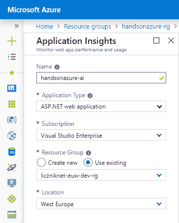

事实上，它包含了一个你可能还没遇到过的字段：

+   应用类型：根据你的选择（ASP.NET Web 应用、Java、App Center、Node.js 或通用），将选择不同的图表集。这个选项不会影响服务的可用功能。它只是确保，对于特定实例，你将只看到你最感兴趣的信息。

你的实例能够做的其他事情完全取决于与它集成的服务以及发送到它的数据量。

与大多数 Azure 服务不同，在 Azure Application Insights 中，并没有要求为所有实例提供一个全球唯一的服务名称——在这里，你只需要避免在一个服务内为多个实例使用相同的名称。这是因为它不使用 DNS 名称来工作并与其他应用连接。

当你点击**创建**时，应该不会花费太长时间来配置一个新的服务实例，它看起来应该与以下内容相似：

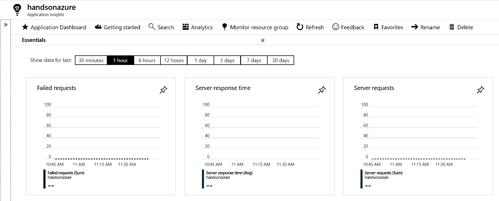

如你所见，有一个默认隐藏的 Essentials 部分——它包含一些常见的元数据，更重要的是，包含一个仪器密钥——以及一个标识符，它唯一地标识你的服务实例。我们将使用它来实际连接到 Azure Application Insights——本章后续会详细介绍其他功能。

# 监控不同平台

Azure Application Insights 的优势在于它能够同时监控不同平台。你可以选择从 ASP.NET 页面、Java、Node.JS，甚至是 Python 或 Ruby（不过，有些语言和框架是 Application Insights 团队官方支持的，有些则是社区支持的）。关键是，它是与平台无关的。实际上，当你需要实现通信通道时，只需提供一个仪表密钥，就可以轻松将数据发送到服务实例，而无需额外的密钥和复杂的配置。在本节中，我们将专注于从不同平台发送信息，因此你将能够轻松开始在自己的项目中进行集成。

# .NET

在 .NET 应用程序中，开始的唯一操作是安装最新的`Microsoft.ApplicationInsights`包。最简单的方法是使用以下代码片段：

```
TelemetryConfiguration.Active.InstrumentationKey = "<instrumentation-key>";
var telemetryClient = new TelemetryClient();
```

这段代码做了两件事：

+   通过提供仪表密钥来设置当前配置。连接到服务所需的全部内容。

+   初始化一个`TelemetryClient`实例——这个类是一个代理，用于与服务进行通信。

然后，你可以使用不同的方法来记录一些数据：

```
telemetryClient.TrackTrace("Hello World!");
telemetryClient.TrackException(new Exception());
telemetryClient.TrackDependency(new DependencyTelemetry());
```

当然，还有更多可用的方法——你可以在*进一步阅读*部分找到它们。在第一个代码片段中，我们使用了`TelemetryConfiguration`类型——实际上，它提供的配置中存储的数据最初是从`ApplicationInsights.config`文件中获取的——它看起来可能是这样的：

```
<?xml version="1.0" encoding="utf-8"?>
<ApplicationInsights >
  <InstrumentationKey>8sad7asd-asd876asf-jr323jsd-3hshjahj</InstrumentationKey>
  <TelemetryInitializers>
    <Add Type="Microsoft.ApplicationInsights.DependencyCollector.HttpDependenciesParsingTelemetryInitializer, Microsoft.AI.DependencyCollector"/>
  </TelemetryInitializers>
  <TelemetryModules>
    <Add Type="Microsoft.ApplicationInsights.DependencyCollector.DependencyTrackingTelemetryModule, Microsoft.AI.DependencyCollector">
      <ExcludeComponentCorrelationHttpHeadersOnDomains>
      </ExcludeComponentCorrelationHttpHeadersOnDomains>
      <IncludeDiagnosticSourceActivities>
        <Add>Microsoft.Azure.ServiceBus</Add>
        <Add>Microsoft.Azure.EventHubs</Add>
      </IncludeDiagnosticSourceActivities>
    </Add>
  </TelemetryModules>
  <TelemetryChannel Type="Microsoft.ApplicationInsights.WindowsServer.TelemetryChannel.ServerTelemetryChannel, Microsoft.AI.ServerTelemetryChannel"/>
</ApplicationInsights>
```

如果文件不存在（或者它没有包含所有值），配置将不正确；在这种情况下，你需要手动提供它。

请注意，上述指令仅适用于使用 .NET 框架的情况。

这里值得提一下的是，设置在不同平台之间有所不同。我们讨论了最基本的（控制台应用）设置，但我们还可以使用其他应用类型，比如 Windows 桌面应用：

```
public partial class Form1 : Form
{
  private TelemetryClient _telemetryClient = new TelemetryClient();

  private void Form1_Load(object sender, EventArgs e)
  {
    _telemetryClient.InstrumentationKey = "<instrumenation-key>";

    _telemetryClient.Context.User.Id = Environment.UserName;
    _telemetryClient.Context.Session.Id = Guid.NewGuid().ToString();
    _telemetryClient.Context.Device.OperatingSystem = Environment.OSVersion.ToString();

    _telemetryClient.TrackPageView("Form1");
  }
}
```

或者我们可以使用与 Azure Application Insights 无缝集成的 Web 应用。

# Node.js

要在 Node.js 中开始使用 Azure Application Insights，你需要以下命令：

```
npm install applicationinsights
```

它将安装一个 NPM 包——Application Insights，这个包允许你与该服务进行交互。以下是这个包接口的完整示例：

```
let http = require("http");
let appInsights = require("applicationinsights");

appInsights.setup("<instrumentation-key>");
appInsights.start();
let client = appInsights.defaultClient;

client.trackEvent({name: "my custom event", properties: {customProperty: "custom property value"}});
client.trackException({exception: new Error("handled exceptions can be logged with this method")});
client.trackMetric({name: "custom metric", value: 3});
client.trackTrace({message: "trace message"});
client.trackDependency({target:"http://dbname", name:"select customers proc", data:"SELECT * FROM Customers", duration:231, resultCode:0, success: true, dependencyTypeName: "ZSQL"});
client.trackRequest({name:"GET /customers", url:"http://myserver/customers", duration:309, resultCode:200, success:true});

http.createServer( (req, res) => {
  client.trackNodeHttpRequest({request: req, response: res});
}).listen(1337, "127.0.0.1");

console.log('Server running at http://127.0.0.1:1337/');
```

尝试运行示例并查看洞察结果——你会看到最初的请求已经被记录：

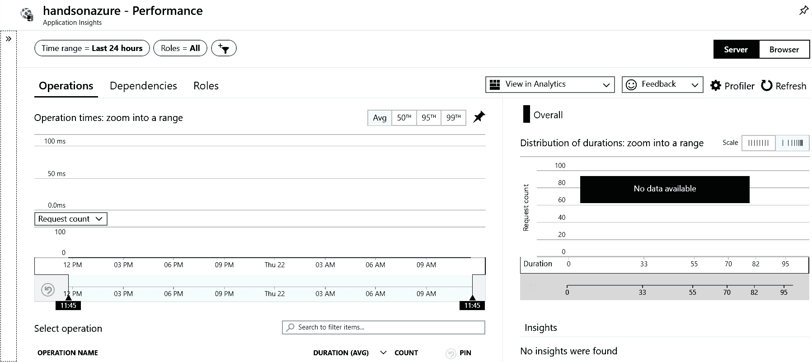

# Azure Functions

Azure Application Insights 还提供与另一个 Azure 服务——Azure Functions 的无缝集成。启用集成有两种方式：在创建服务时开启，或者通过在设置中手动提供仪表密钥。

以下是可以启用此功能的表单：

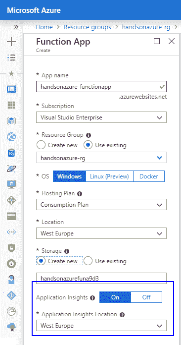

然而，这种设置有一个警告：如果你已经有一个服务实例，则无法选择另一个实例。要做到这一点，你需要通过在功能应用的设置中提供`APPINSIGHTS_INSTRUMENTATIONKEY`来手动启用集成。

还有一个选项。你可以点击任何功能的“监视”标签，然后点击“配置”，而不是手动提供密钥。如果经典视图尚未启用，这个选项将会可用。

启用集成后，你将能够分析所有查询的执行情况：

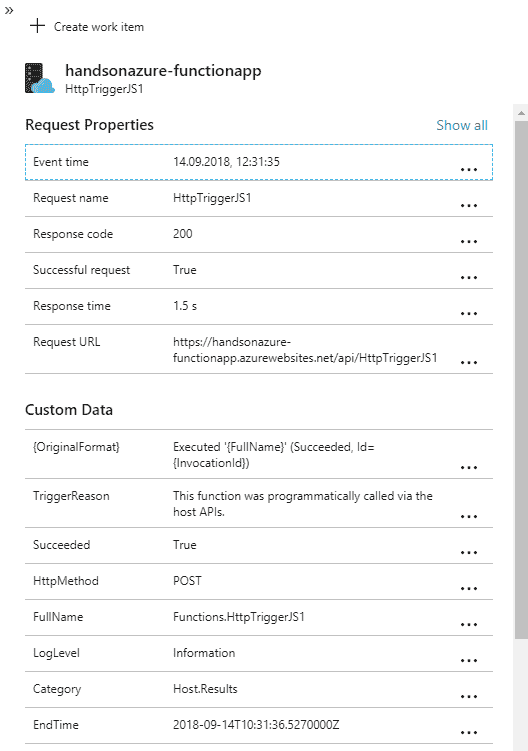

# 分析模块

将 Azure Application Insights 与不同服务（以及自定义应用程序）集成的多种方式并不是此服务的唯一大特点。另一个重要且至关重要的部分是分析模块中提供的分析语言。这是一种交互式查询语言，使你能够使用简单直观的语法轻松探索日志数据。它的另一个优点是，你不需要任何额外的工具就可以开始使用——一旦存储了跟踪、异常或请求数据，它就可以开箱即用——你需要做的唯一事情就是编写查询。在本节中，我们将介绍查询语言和模块，这样你就可以开始编写自己的查询，并发现存储日志中可用的许多不同维度。

# 访问分析模块

使用分析模块非常简单。转到你的 Azure 应用程序分析实例的概览页面，然后点击分析按钮：

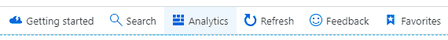

它会显示一个新窗口，显示新的选项，例如输入查询、使用预定义的查询，或者仅仅探索可用的不同维度：

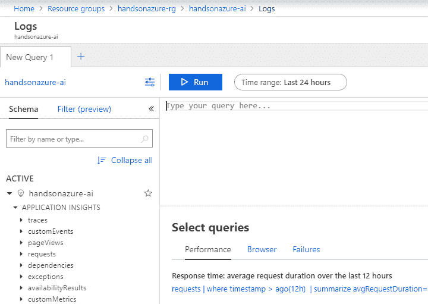

这里最重要的是查询窗口。它是一个交互式功能，使你能够编写查询，并提供额外的功能，如语法验证器和建议。我们先从一个简单的查询开始，显示过去几天的请求计数：

```
requests
| summarize totalCount=sum(itemCount) by bin(timestamp, 30m)
| render timechart
```

如你所见，它分为三个部分：

+   `requests`：你查询的维度

+   `summarize`：定义你想从该维度获取的数据的函数

+   `render`：一个可选函数，根据数据绘制图表

当然，查询可以有不同的结构；你可以找到一个稍微复杂一点的查询：

```
requests
| summarize RequestsCount=sum(itemCount), AverageDuration=avg(duration), percentiles(duration, 50, 95, 99) by operation_Name
| order by RequestsCount desc
```

从前面的示例来看，将不会显示图表——相反，它会显示一个表格：

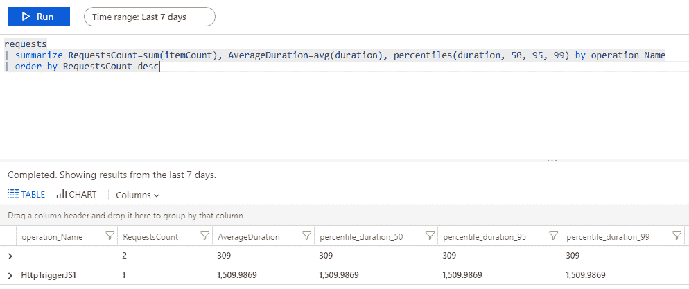

重要的是查询的日期范围，因为在这个范围内你可以过滤数据。你必须选择你感兴趣的日期。为此，点击“时间范围”按钮，该按钮位于“运行”按钮旁边，然后选择正确的选项：

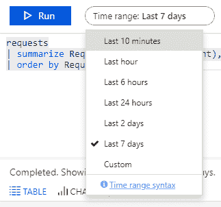

Azure 应用分析中的查询语言非常丰富，它定义了许多不同的数据类型和操作的函数（例如，您可以使用许多不同的窗口函数，像是`next()`）。相关的参考资料可以在*进一步阅读*部分找到。

此外，当执行查询时，您可以为其选择一个额外的过滤器（基于结果），从而选择特定的记录：

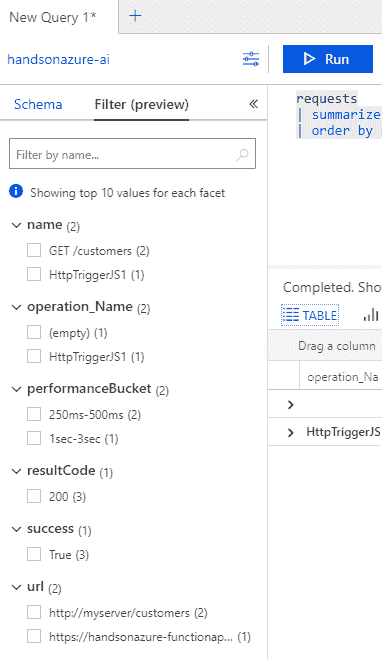

另一个有用的分析模块功能是智能分析。它是一组附加功能，通过在数据分析中引入机器学习元素来扩展分析能力。目前，提供以下功能：

+   **自动聚类**：此功能自动将数据分成若干集群，以便更易于理解。

+   **篮子**：此功能会自动在查询结果中寻找有趣的数据。

+   **差异模式**：此功能操作于存储真/假数据的列上，并尝试找到对应于它们之间差异的模式。

+   **定时系列**：此功能（`make-series`）将数据转换为单行，便于分析问题的根本原因。

+   **线性回归**：使用此功能，您可以轻松地根据结果（例如，异常数量是否增长）找到数据趋势。

+   **异常值检测**：此功能可以发现数据中某个值与其他值的异常差异。

使用这些高级功能，您可以大大提高数据分析的效果。它们结合了许多有用的功能，使整个服务更加灵活。而且，您不必是数据科学家就可以进行数据分析，发现趋势和异常。

# 应用洞察自动化

监控并不是您每天都愿意花时间做的事。事实上，服务的自动化程度越高，您可以获得的结果就越好。让机器查看不同的维度并根据预设规则找出问题，总是比自己来做更快捷、更细致。在 Azure 应用洞察中，您有许多自动化选项：ARM 模板、门户中的警报，或者集成外部服务（例如 Microsoft Flow）。在本章的最后部分，您将学习如何开始使用自动化，并确保将精力集中在开发上，而不是日志分析和服务维护。

# 警报

警报是一项功能，可以在发生异常时通知您。在设置警报时有很多不同的选项，首先从 ARM 模板开始：

```
{
  "name": "[variables('myFirstAlertName')]",
  "type": "Microsoft.Insights/alertrules",
  "apiVersion": "2014-04-01",
  "location": "[parameters('appLocation')]",
  "dependsOn": [
    "[resourceId('Microsoft.Insights/components', parameters('myApplicationName'))]"
  ],
  "tags": {
    "[concat('hidden-link:', resourceId('Microsoft.Insights/components', parameters('myApplicationName')))]": "Resource"
  },
  "properties": {
    "name": "[variables('responseAlertName')]",
    "description": "response time alert",
    "isEnabled": true,
    "condition": {
      "$type": "Microsoft.WindowsAzure.Management.Monitoring.Alerts.Models.ThresholdRuleCondition, Microsoft.WindowsAzure.Management.Mon.Client",
      "odata.type": "Microsoft.Azure.Management.Insights.Models.ThresholdRuleCondition",
      "dataSource": {
        "$type": "Microsoft.WindowsAzure.Management.Monitoring.Alerts.Models.RuleMetricDataSource, Microsoft.WindowsAzure.Management.Mon.Client",
        "odata.type": "Microsoft.Azure.Management.Insights.Models.RuleMetricDataSource",
        "resourceUri": "[resourceId('microsoft.insights/components', parameters('myApplicationName'))]",
        "metricName": "request.duration"
      },
      "threshold": "[parameters('responseTime')]",
      "windowSize": "PT15M"
    },
    "actions": [{
      "$type": "Microsoft.WindowsAzure.Management.Monitoring.Alerts.Models.RuleEmailAction, Microsoft.WindowsAzure.Management.Mon.Client",
      "odata.type": "Microsoft.Azure.Management.Insights.Models.RuleEmailAction",
      "sendToServiceOwners": true,
      "customEmails": []
    }]
  }
}
```

虽然最初这样的 ARM 模板可能有些令人生畏，但实际上它包含了一组固定的参数，可以通过资源浏览器轻松找到（您可以在*进一步阅读*部分找到相关链接）。在这里，您可以了解如何发现现有的警报规则：

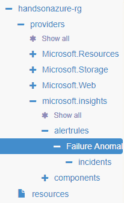

在上面的截图中，我展示了在一个特定资源组内创建的 Azure Application Insights 实例中可用的警报规则。当你点击它时，你将看到 Azure 中该资源的完整描述。

资源浏览器是一个非常好的工具，尤其是在使用 ARM 模板并寻找某个特定资源的引用时。它显示了从 ARM 视角描述服务的所有参数。

在这里，你可以找到服务部署时创建的默认警报：

```
{
  "id": "/subscriptions/.../resourceGroups/handsonazure-rg/providers/microsoft.insights/alertrules/Failure Anomalies - handsonazure-ai",
  "name": "Failure Anomalies - handsonazure-ai",
  "type": "Microsoft.Insights/alertRules",
  "location": "West Europe",
  "properties": {
    "name": "Failure Anomalies - handsonazure-ai",
    "description": "",
    "isEnabled": true,
    "condition": {
      "$type": "Microsoft.WindowsAzure.Management.Monitoring.Alerts.Models.ThresholdRuleCondition, Microsoft.WindowsAzure.Management.Mon.Client",
      "odata.type": "Microsoft.Azure.Management.Insights.Models.ThresholdRuleCondition",
      "dataSource": {
        "$type": "Microsoft.WindowsAzure.Management.Monitoring.Alerts.Models.RuleMetricDataSource, Microsoft.WindowsAzure.Management.Mon.Client",
        "odata.type": "Microsoft.Azure.Management.Insights.Models.RuleMetricDataSource",
        "resourceUri": "/subscriptions/.../resourcegroups/handsonazure-rg/providers/microsoft.insights/components/handsonazure-ai",
        "resourceLocation": null,
        "metricNamespace": null,
        "metricName": "...",
        "legacyResourceId": null
      },
      "operator": "GreaterThan",
      "threshold": 2,
      "windowSize": "PT1H",
      "timeAggregation": null
    },
    "action": null,
    "lastUpdatedTime": "2018-09-14T12:04:57.6355645Z",
    "provisioningState": "Succeeded",
    "actions": [
      {
        "$type": "Microsoft.WindowsAzure.Management.Monitoring.Alerts.Models.RuleEmailAction, Microsoft.WindowsAzure.Management.Mon.Client",
        "odata.type": "Microsoft.Azure.Management.Insights.Models.RuleEmailAction",
        "sendToServiceOwners": true,
        "customEmails": []
      }
    ]
  }
}
```

为了让事情更容易理解，我们来看一下如何在门户中设置警报。你可以在“配置”部分访问“警报”面板：

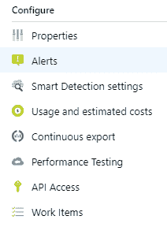

要开始，你需要点击“+ 新建警报规则”按钮。你将看到一个详细的向导，提供设置警报的快捷方式。这里最重要的是条件——它们定义了警报的触发方式：

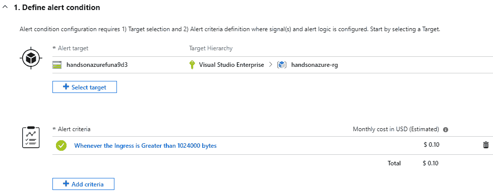

当然，警报可以有多个触发条件，因为这取决于它的特性。更重要的是，条件可以非常复杂；它们可以涉及多个资源，并引入复合警报规则的概念。接下来在这里定义的是警报的详细信息——你需要提供一些描述它们的元数据：

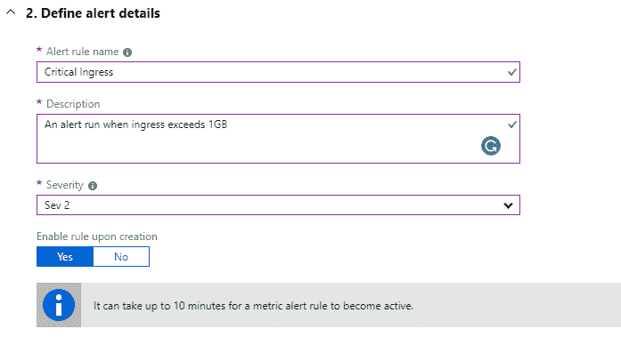

重要的事项是警报的严重性：它越高，警报就越重要。向导的最后一部分是实际的操作，你可以选择多个选项：

+   邮件/SMS/推送/语音

+   Azure Function

+   LogicApp

+   Webhook

+   ITSM

+   自动化运行簿

其中一些要求你已经有一个处理警报的服务——你需要选择最适合你需求的选项。当你创建一个警报时，它将会处于活动状态，并在服务中可见：

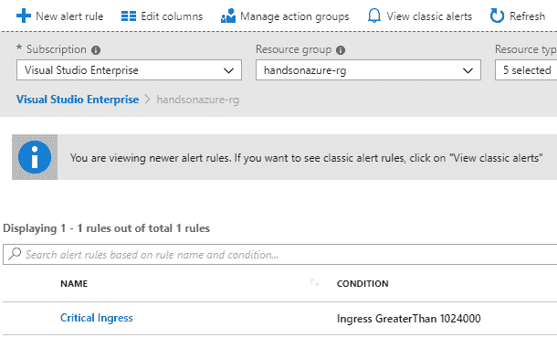

# 总结

在本章中，你了解了一个适用于 Azure 的监控解决方案：Azure Application Insights。我们讨论了资源的配置、创建警报以及与其他服务的集成等内容。除了本章中提到的功能外，这个 Azure 组件还提供了许多附加功能——例如智能检测、数据的持续导出和详细的使用日志。我强烈鼓励你进一步探索它，因为它极大地简化了监控活动和解决问题的过程。在下一章中，我们将介绍本书范围内的最后一个 Azure 服务：Azure SQL，它是一个 PaaS 服务，是 Azure 版本的知名数据库引擎。

# 问题

1.  识别 Azure Application Insights 实例并连接到它需要什么？

1.  是否可以在 Node.js 应用程序中使用 Azure Application Insights？

1.  什么是智能分析模块？

1.  如何查询存储在 Azure Application Insights 中的日志？

1.  如何在服务中自动创建警报？

1.  是否可以将短信作为触发警报的动作？

# 进一步阅读

+   TelemetryClient 参考: [`docs.microsoft.com/pl-pl/dotnet/api/microsoft.applicationinsights.telemetryclient?view=azure-dotnet`](https://docs.microsoft.com/pl-pl/dotnet/api/microsoft.applicationinsights.telemetryclient?view=azure-dotnet)

+   Azure 日志分析参考: [`docs.loganalytics.io/index`](https://docs.loganalytics.io/index)

+   智能分析: [`docs.loganalytics.io/docs/Learn/Tutorials/Smart-Analytics/Understanding-Autocluster`](https://docs.loganalytics.io/docs/Learn/Tutorials/Smart-Analytics/Understanding-Autocluster)

+   资源浏览器: [`resources.azure.com/`](https://resources.azure.com/)
