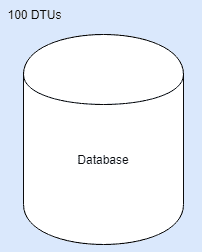
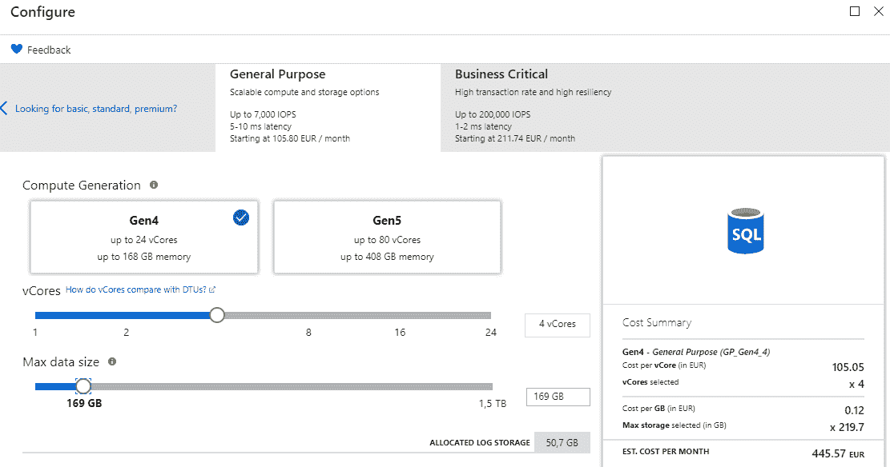
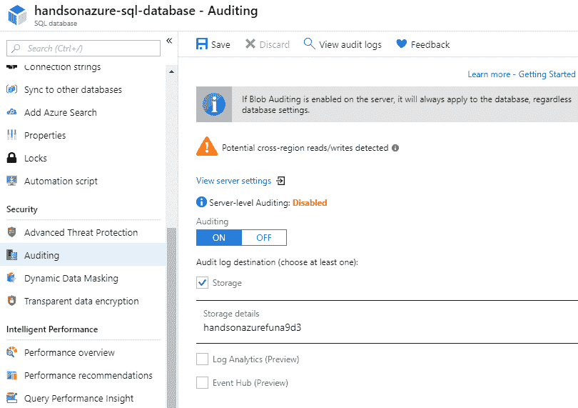
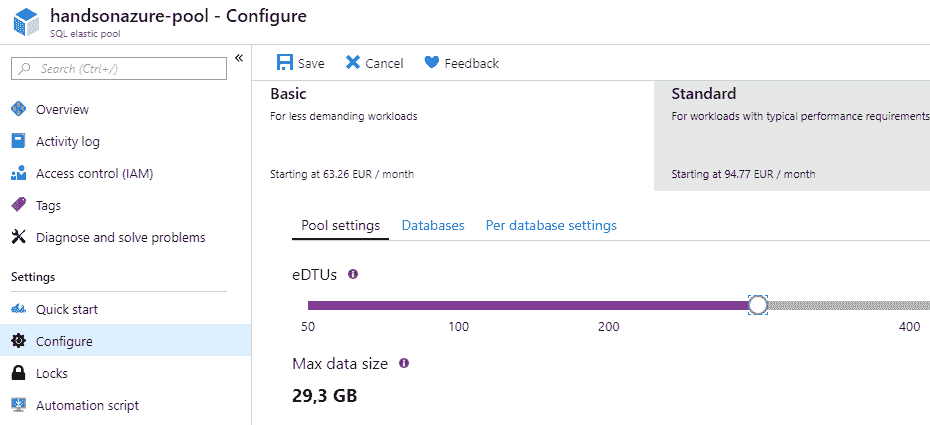

# 第十六章：Azure 中的 SQL - Azure SQL

Microsoft SQL Server 是最流行的数据库之一，通常是许多流行应用程序的核心。借助 Azure，我们可以跳过整个集群设置、安装和维护的过程，使用 Azure SQL —— 这是 SQL Server 的云版本，具有相同的功能。得益于灵活的定价，我们可以根据性能和可用功能选择任何我们想要的选项。我们也不需要担心地理复制和存储备份 —— 所有这些功能都可以在云中轻松配置和自动化。

本章将涵盖以下主题：

+   Microsoft SQL Server 和 Azure SQL 之间的差异

+   在 Azure 门户中使用 Azure SQL

+   Azure SQL 的安全特性

+   扩展和监控 Azure SQL

# 技术要求

要执行本章中的练习，你将需要：

+   一个 Azure 订阅

# Microsoft SQL Server 和 Azure SQL 之间的差异

**Microsoft SQL Server** 是一个广为人知且广泛使用的 SQL 数据库服务器，已经获得了很高的流行度，并且被认为是许多项目的默认选择，这些项目从非常简单的网站到处理高负载并对业务至关重要的企业级服务都有。随着云技术的日益流行，随着这种情况的自然发展，人们期望通过将应用程序迁移到 Azure，数据库也能够随之迁移。为了满足这种需求，微软开发了 Azure SQL Service —— 一种微软 SQL Server 的 PaaS 版本，由他们的团队进行管理和升级；你需要负责的只有配置和数据管理。Azure 还提供了另一种选项，即 SQL Server VMs，这是在云中使用该数据库的另一种方式。在本节中，我们将重点讨论这两种服务的区别，并尝试识别它们的不同使用场景。

# Azure SQL 基础知识

通过使用云中的 PaaS 服务，你正在稍微转移一些责任：

+   你不再是基础设施的维护者

+   当软件被考虑时，你不再需要负责不同的更新

+   通过与提供商签署 SLA，提供商负责确保服务正常运行

相反，你应该专注于以下几点：

+   正确配置服务，以满足你的性能目标和法律要求

+   集成不同的服务和应用程序，以便它们在与服务通信时能够体现最佳实践

+   实现 HA/DR 场景，以确保某一地区的故障或灾难不会影响你的系统

使用 Microsoft SQL Server 时，你完全在你自己的机器或租赁机器上，这些机器需要你自己维护和监控。虽然在许多场景下这种情况是合理的（因为可能有一些法律要求禁止你将数据存储在自己的数据中心以外，或者由于某些原因 Azure 无法提供你期望的性能），但在许多情况下，使用 PaaS 实例的 SQL 数据库是一个巨大的改进。事实上，使用此服务时，你有几个不同的选择：

+   具有隔离资源的单一数据库

+   弹性池中的池数据库

+   托管实例，这是与本地 SQL Server 最相似的模型

需要了解的重要一点是，所有新功能和更新都会部署到托管在 Azure 中的 SQL 数据库。这相比传统的 Microsoft SQL Server 给你带来了优势，因为你始终保持最新：你不需要自行安排服务器上的更新。

你拥有的服务器和数据库越多，更新它们的过程就变得越复杂和困难。比较这两种产品时，请考虑这一点。

另一个谈论 Azure SQL 时至关重要的方面是其购买模型。目前，你有两个选项：

+   **基于 DTU**：DTU 是计算、内存和 I/O 资源的混合，这些资源分配给你的数据库

+   **基于 vCore**：这个选项允许你自己选择所有内容（包括 vCore 数量、内存大小和存储性能）。

你可能会想知道 DTU 如何反映实际的硬件；有一篇很好的文章试图在本章的*进一步阅读*部分解释这些度量标准。

在大多数情况下，使用 DTU 作为度量标准是更好的选择——因为很难预测应用程序的确切硬件需求。当你是高级 SQL Server 用户并且知道自己究竟需要多少核心或内存时，可以使用基于 vCore 的模型。

你可能会想，Azure SQL Service 的扩展能力是什么？当然，你可以为你的数据库分配更多（或更少）资源，但有些场景下这会使事情变得更加复杂（或者你的应用程序在数据库性能方面有不同的需求，这种模型根本行不通）。为了应对这些情况，你可以选择使用弹性池。这个概念相当简单——通常，你为单个数据库分配资源：



使用弹性池时，你稍微改变了模型，池中的资源被分配，具体如下：


这有什么变化呢？这为你提供了更多的灵活性；你不再需要托管一个庞大的单一数据库（在资源分配方面），你可以轻松地进行扩展，使其与其他实例共享负载。而且，它在成本控制方面也更具优势；你可以同时扩展多个数据库，而不需要控制它们各自的需求。

扩展 Azure SQL 是一个重要的课题，需要最初的很多关注——我们将在本章末尾回到这个话题。

除了性能和不同的扩展能力外，Azure SQL 还提供了许多在考虑将其作为数据存储时非常重要的附加功能。因为没有存储在数据库中的信息，通常情况下一个应用程序是没有意义的，因此可用性也是非常重要的。幸运的是，Azure SQL 实现了许多出色的功能，使其成为一个成熟的存储选项：

+   **自动备份**：在本地环境中，配置和管理备份要复杂得多，因为你需要了解服务器配置并找到存储它们的地方。而在 Azure 中，事情变得非常简单，因为 Azure Storage 集成了自动备份，确保性能和可靠性。

+   **地理复制**：即使单个区域出现故障，你仍然可以为客户提供数据。通过 Azure SQL，你可以配置一个次级读取区域，确保在故障解决之前你能保持在线。

+   **故障转移组**：你不需要自己实现故障转移能力和逻辑，可以依赖 Azure SQL 当前提供的功能。这使得创建全球分布的应用程序变得更加容易，因为你只需要关注配置，而不需要担心基础设施。

要准确了解 Azure SQL 与 Microsoft SQL Server 的区别，可以参考以下链接：[`docs.microsoft.com/en-us/azure/sql-database/sql-database-features`](https://docs.microsoft.com/en-us/azure/sql-database/sql-database-features)。

# 高级 Azure SQL 特性

除了一些确保 Azure SQL 是一个完整的关系型数据库并且可以依赖构建系统的基本功能外，还有许多附加功能，使得使用这个服务变得非常有趣：

+   **自动监控和调优**：你有没有遇到过这样的情况，在使用数据库几个月后，数据库里充满了过时的索引、存储过程和函数？Azure SQL 通过主动监控你如何使用和维护数据库，并在有改进的空间时给出建议，使这一过程变得更加简单。我发现这个功能非常有帮助——如今，开发速度特别快，且重点在于为市场提供新价值，很容易迷失方向，忽视应该从数据库中移除的内容。借助服务推荐来删除索引、改进模式和查询参数化，我发现大多数时候我的存储状态更好了。

+   **自适应查询处理**：虽然 SQL Server 也有这个功能，但在 Azure SQL 中使用它是对其他性能推荐的一个重要补充。基本上，当启用此功能时，服务器引擎会尝试找到查询的最佳执行计划。

+   **安全性和合规性功能**：确保你存储的数据是安全的，并且所有漏洞能够尽早被发现是非常重要的。在 Azure SQL 中，提供了很多额外功能，旨在从敏感性和合规性的角度分析你的数据。有内建工具会搜索任何可能影响数据完整性或导致数据泄露的异常和威胁。此外，Azure SQL 与 Azure **Active Directory** (**AD**) 集成，并支持 **多因素认证** (**MFA**)——这使得审计和授权等操作变得更加简单，无需额外努力。

Azure SQL 的安全功能将在本章后续部分进行描述，这样你可以全面了解该服务的功能。

# SQL Server 在虚拟机上

如果你不想完全使用 PaaS，你可以创建一个已经内置 SQL Server 镜像的虚拟机。在这种选项下，服务的性能将依赖于虚拟机的性能——如果你发现数据库的 CPU 或内存资源不足，唯一需要做的就是扩展虚拟机。要在门户中创建虚拟机，你需要搜索运行在你选择操作系统上的 SQL Server，如下所示：


如你所见，提供了免费的 SQL Server 许可证，而且更重要的是，更新的版本可以在 Linux 机器上运行。一旦你选择了感兴趣的镜像，你可以点击“创建”按钮开始配置虚拟机。

如下截图所示，有许多字段需要填写，才能实际使用该服务：


当然，这与 SQL 服务器在 Azure 中的 IaaS 模型相关。配置向导将为你提供关于虚拟机默认大小和其他所需参数的建议。一旦配置完成，你将能够通过 RDP 或安全的 SSH 隧道连接到它。

如果你想远程连接到 SQL 服务器，记得打开 `1433` 端口。

# 创建和配置 Azure SQL

在阅读本章开头后，你应该能够感知到 Azure SQL 如何工作以及它为你提供了什么。尽管一些理论始终是有益的，但实践才能勾画出完整的图景，并让你完全理解这个话题。在本节中，我们将专注于在门户中创建和配置 Azure SQL，并尝试识别所有前述功能。你还将看到，管理这个 PaaS 服务与本地版本的区别，特别是在使用其功能时。

# 创建 Azure SQL 实例

在 Azure 门户中，当你搜索 `Azure SQL` 时，你将看到许多不同的选项，如 SQL 数据库、SQL 服务器（逻辑服务器）或 SQL 弹性数据库池。虽然它们都允许你创建一个数据库，但开始使用该服务的最简单方法是使用 **SQL 数据库** ——这仍然需要创建一个服务器。在下面的截图中，你可以看到我的服务器配置：


以下是我的数据库配置：


这里重要的是选择源——你有三个选项：

+   空白数据库：在大多数情况下，这是你最感兴趣的第一个选项

+   示例：我已经使用它，因此我的数据库中已经有数据

+   备份：如果你想从现有的备份中恢复一个数据库，这是一个很好的选项

对于空白数据库选项，你还可以选择排序规则；在下拉菜单中，选择适合你数据的选项。我们还将稍微关注一下定价配置：


如你所见，使用 DTU 模型时，你可以选择三个不同的层级：

+   基本：适用于较小的工作负载

+   标准：在成本和性能之间提供最佳平衡

+   高级：适用于需要大规模性能能力的所有工作负载

根据层级，你将获得固定的 DTU 数量（对于基本层），或者你需要选择你感兴趣的数量：


这里重要的是，大部分数据库成本都是基于资源分配的——记得选择你能选择的最大数据库大小（例如，在标准层并选择 400 DTU 时，100 MB 和 250 GB 之间的定价没有差异）。

当然，你还可以在基于 DTU 的模型和 vCores 选择之间切换：



使用 vCore 时，选择“最大数据大小”会影响定价。此外，这里你可以选择两个不同的定价层：

+   一般用途：适用于大多数常见场景，无需特别的弹性和流量需求

+   业务关键：此级别提供更好的性能和更低的延迟（且价格显著更高）

当你对配置满意后，可以点击“创建”按钮，开始资源配置过程。配置完成后，你可以通过访问“概览”面板来查看基本信息：


现在我们将尽量介绍大部分功能，以便你更好地理解如何使用此服务。

# Azure SQL 功能在门户中

我们将从“配置”面板开始——当你点击它时，你将看到它允许你设置数据库的等级和定价模型。当你想提高数据库的性能时，这个选项特别有用；你可以轻松更改为其分配的 DTU 或 vCore 数量，使其可以更快速地处理查询。

正如我之前提到的，配置单一数据库适用于较简单的场景，在这些场景中，你可以轻松监控数据库，且性能需求不会快速变化。在所有其他情况下，更好的选择是使用弹性池。

当你进入“地理复制”面板时，你将看到一个类似于测试时在 Azure Cosmos DB 中看到的地图：


在此页面上，你可以快速创建一个次级区域，以便在需要时执行故障转移。为此，点击你感兴趣的区域，接着将显示“创建次级”屏幕：


你将需要再次创建一个服务器（如果该区域内还没有现有的服务器）以及定价层（当然，次级数据库的定价层可以不同）。此外，在此面板中，你可以启用数据库的故障转移组——为此，请点击以下面板：


通过实现故障转移组，你可以为你的数据库引入自动故障转移：


然而，如果你想执行强制故障转移，你可以点击次级数据库，这将显示一个允许执行该操作的屏幕：


请记住，执行故障转移可能需要一些时间才能完全传播——确保你已做好准备。

当你进入连接字符串面板时，你将看到一个适用于不同环境的连接字符串模板：


你还可以下载不同的驱动程序，如 ADO.NET、JDBC、ODBC 或 PHP。

请记住，该服务仅提供连接字符串的模板——您必须设置用户名和密码才能使其工作。

目前，我们正在探索 Azure 中的 SQL 数据库——让我们看看当前 SQL 服务器的具体情况。您可以通过点击“概览”面板上的服务器名称找到它。最初，屏幕看起来一样，但您很快会意识到它提供了许多不同的功能：


不幸的是，我们无法覆盖所有功能，但我会尽量为您描述其中的大部分。当我们查看“设置”部分时，我们可以看到以下面板：

+   故障转移组：如前所述，要引入自动故障转移，您必须创建一个故障转移组。一个组由主服务器和备用服务器组成，具有定义好的故障转移策略和宽限期——这个设置定义了从故障检测到实际故障转移之间的时间。

+   管理备份：要为您的服务器配置备份（例如，启用长期保留（LTR）），您可以访问此面板。它还显示所有可用的备份。

+   活动目录管理员：可以使用定义在活动目录用户中的用户设置服务器管理员。当然，您可以为此设置多个用户——窍门是使用组而不是单个帐户。

+   SQL 数据库：要快速访问由此特定服务器提供的数据库，请使用此面板。

+   SQL 弹性池：与 SQL 数据库类似，此面板显示可用的弹性池。要创建新的池，请转到“概览”面板并点击“+ 新建池”按钮。

+   删除的数据库：即使数据库从服务中删除，您仍然有机会恢复它。在这种情况下，请查看该面板以查看所有可恢复的数据库。

+   导入/导出历史：所有对数据库进行的导入和导出操作将在此处显示。这是一个很好的审计工具，因此您不会错过任何未经通知的数据库导出情况。

+   DTU 配额：如果您有兴趣查看服务器的 DTU/vCore 配额，可以访问此面板。

# 安全

关于 Azure SQL 功能，有多种不同的选项可以用来确保您的解决方案安全。诸如防火墙、完整的操作审计和数据加密等功能是此服务的常见功能，甚至在基础层也可以使用。在本节中，我们将重点学习上述功能，以确保您的实例得到保护并免受大多数威胁。

# 防火墙

浏览 SQL 数据库时，您可能注意到在“概览”面板上有一个“设置服务器防火墙”按钮：


这是设置允许流量进入 Azure SQL 防火墙规则的最简单方法。

在 Azure SQL 中，所有流量默认被拒绝——您必须将所有应允许与服务器通信的计算机的 IP 列入白名单。

在我们开始配置防火墙之前，您必须了解我们为什么真的需要它。如果我尝试使用 Microsoft SQL Server Management Studio 连接到我的服务器，这里会发生什么：


如您所见，它自动检测到我的 IP 地址没有被列入白名单，因此服务器拒绝与我通信。我们需要在此添加一个特定的 IP 地址，这样通信就会被允许。

实际上，默认情况下，只有托管在 Azure 内的机器被允许与 Azure SQL 通信。如果您希望从本地计算机连接到服务器，您必须设置防火墙规则。

在门户中，您可以通过点击设置服务器防火墙按钮来添加规则——这将显示一个屏幕，您可以在其中明确设置一个应能够与服务器通信的 IP 地址：


在此屏幕上，您还可以防止 Azure 服务与您的 Azure SQL 实例通信。此外，您可以在此处添加虚拟网络——借助此功能，您可以创建包含应用程序和数据库的整个生态系统，从而通过一套非常严格的规则保护它免受访问。

# 高级威胁保护

**高级威胁保护**（**ATP**）是 Azure SQL 的一个高级功能，默认情况下在服务中未启用。目前，它提供 60 天的免费试用期，您可以在此期间测试此功能是否适合您。您可以通过**高级威胁保护**面板启用它：


如您所见，它由三个独立的功能组成：

+   数据发现与分类：用于从敏感性和法律分类（例如—GDPR 要求）角度分析数据

+   漏洞评估：这使用 SQL Server 的最佳实践检查您的数据库是否存在可能的漏洞

+   威胁检测：一个主动监控数据库中可疑活动并为您记录的功能

在下文中，您可以看到 Azure SQL 如何对示例数据进行分类：


结果是，它自动检测了信息类型并声明了其敏感性标签。然后，它显示了一个摘要，向您提供存储在数据库中的数据形态的整体概览。

这个功能是分析大型数据库是否符合新规定的一个极好的工具——如果您不确定自己是否存储了敏感数据，可以使用它。

在漏洞评估方面，以下是我数据库示例扫描的结果：


扫描完成后，系统会给出安全检查结果——它检查诸如数据分类、是否启用审计或谁可以访问数据等事项。例如，如果你有许多用户并分配了广泛的权限，则会对此发出警报。在扫描过程中将检查近 50 条规则，这是对其他所有安全功能的一个重要补充。

更多的安全指南可以在*进一步阅读*部分的相关链接中找到。

# 审计

如果你想确切知道服务器内部发生了什么，你必须启用审计：



这将记录所选存储中的所有操作（当然，如果你选择了存储选项的话）。目前，有三种不同的存储审计日志选项：

+   存储

+   日志分析（预览版）

+   事件中心（预览版）

虽然存储选项有点静态，但你可以使用剩下的两个选项进行更动态的集成（尤其是在使用 Azure 事件中心时）。一旦启用审计，你就可以在点击查看审计日志按钮时看到所有已记录的操作：


# 动态数据掩码

有时你可能希望允许某人读取数据库中的数据，但同时又不希望他或她读取更敏感的数据（例如出生日期、地址或姓氏）。在 Azure SQL 中，有一个名为动态数据掩码（Dynamic Data Masking）的功能可以实现这一点：


有两种方法可以添加掩码——要么使用推荐方法，要么点击+ 添加掩码按钮手动添加：


你需要做的是选择模式、表格、列以及掩码字段格式——一旦配置这些并保存规则，非管理员用户将看到掩码后的值。以下显示的是管理员的值：


以下显示的是没有管理员权限的用户的值：


如你所见，`LastName`和`Email`对于非管理员用户是被掩码的，正如计划所示。

# 扩展 Azure SQL

数据库的性能需求可能会根据应用程序的时间和当前状态而有所不同。这时，扩展功能就显得至关重要——你可以根据服务的需求调整成本和可用资源。在 Azure SQL 中，有多个不同的场景需要考虑：你是使用单一数据库还是弹性池，是否需要扩展读取，或者是否需要在任何地方都能使用所有功能。在这一小节中，我将向你展示如何快速做出决策以及在哪里可以找到扩展工具。

# 单一数据库

正如我们之前提到的，单一数据库的扩展非常简单——只需进入 Configure blade 并选择您感兴趣的新层级。您可以通过观察数据库性能轻松决定是否需要扩展数据库：


如果您看到数据库的使用率不断激增，或者数据库的利用率已经接近最大值，增加一些 DTU 或其他资源总是一个好主意。

请记住，您可以在使用率达到上限时设置警报，因此有一些方法可以自动化这一过程。

# 弹性池

启用弹性池后，情况会有所不同——例如，您不再是单个数据库操作一个 DTU，而是可以选择一个弹性池，这引入了一个稍微不同的弹性 DTU 模型：



在这种模型中，您将使用弹性池配置来扩展数据库。对于单一数据库，您只能更改可用的最大数据大小（该大小也受到池所设置值的限制）。

# 读取扩展

有时您只需要扩展数据库的读取能力。这种情况发生在您更倾向于提供内容而不是修改它时（例如，您有一个非常受欢迎的门户，虽然管理单一位置，但内容却是全球提供的）。在 Azure SQL 中，您可以只扩展服务的某一部分——即负责为您管理读取操作的部分。

请注意，您需要选择 Premium/Business Critical 层级才能使此功能生效。

要启用数据库的读取扩展，您可以使用 REST API：

```
HTTP PUT https://management.azure.com/subscriptions/{SubscriptionId}/resourceGroups/{GroupName}/providers/Microsoft.Sql/servers/{ServerName}/databases/{DatabaseName}?api-version= 2014-04-01-preview

Body:
{
   "properties":
   {
      "readScale":"Enabled"
   }
}
```

或者，您可以使用 PowerShell：

```
Set-AzureRmSqlDatabase -ResourceGroupName <my-resource-group> -ServerName <my-server> -DatabaseName <my-database> -ReadScale Disabled
```

# 分片

扩展数据库的另一种方式是使用分片。与弹性池不同，通过使用分片，您为每个数据库分配独立的资源。它也是一种横向扩展模型（即，您会更倾向于提供另一个数据库，而不是扩展现有的数据库）。

请注意，您还可以通过使用弹性数据库拆分合并工具来为弹性池使用分片：[`docs.microsoft.com/en-us/azure/sql-database/sql-database-elastic-scale-overview-split-and-merge`](https://docs.microsoft.com/en-us/azure/sql-database/sql-database-elastic-scale-overview-split-and-merge)。

通常情况下，如果您：

+   数据量过大，无法通过单个实例处理

+   想要进行负载均衡请求

+   想要实现数据的地理分布

这里的关键是每个分片的数据结构必须相同。您可以在本章的 *进一步阅读*部分找到有关分片的完整文档。

# 监控与调优

本章我们讨论的最后一项内容是 Azure SQL 的监控与调优。由于数据库通常是许多应用程序的核心，因此快速诊断性能或使用方面的问题并在需要时轻松调整至关重要。Azure SQL 提供了多种不同的功能，您可以利用它们从您的实例中获取洞察。

# 监控

要监控您的 SQL 数据库，您可以使用警报（假设您已经阅读了上一章，第十五章，*使用应用程序洞察监控您的应用程序*）。您可以通过点击警报面板访问此功能：


这里有两种可用的警报类型：

+   添加指标警报（经典）

+   添加活动日志警报

它们的工作方式稍有不同——指标警报是基于 CPU 百分比、死锁或数据库总大小等值触发的，而活动日志警报则是在发生事件时触发。您可以同时使用它们来覆盖以下内容：

+   性能不足（指标）

+   无效查询（指标）

+   配置问题（指标）

+   整体服务健康状况（指标）

+   即将进行的维护活动（活动日志）

+   实际服务问题（活动日志）

+   服务健康建议（活动日志）

# 调优

有一个叫做智能性能的功能组，它允许您监控和调优 SQL 数据库的性能：


现在让我们查看性能建议：


虽然最初此功能为空，但在使用 Azure SQL 时，它会显示不同的建议。这里的重点是我们可以自动化操作——只需点击自动化按钮，显示另一个屏幕，您可以在其中选择感兴趣的内容：


这个屏幕实际上是之前展示的自动调优面板。您可以使用它来自动执行诸如管理索引或强制查询计划之类的操作。

# 总结

Azure SQL 是一个非常复杂且扩展的服务，工作方式与其本地版本 Microsoft SQL Server 类似。虽然它是一个完整的 PaaS Azure 组件，但仍然支持许多高级操作，如分片、多租户、AD 集成、故障转移和地理复制。除了托管在云中，您仍然可以像使用独立版本的 SQL Server 一样使用它。在下一章，我们将讨论本书中提到的最后一个 PaaS 服务，即 Azure Data Lake Storage。

# 问题

1.  在更新策略方面，Azure SQL 与 Microsoft SQL Server 有何不同？

1.  什么是分片？

1.  您在 Azure SQL 中创建了一个新的 SQL 数据库，但服务器拒绝连接到它。可能是什么问题呢？

1.  Azure SQL 的两种购买模式是什么？

1.  什么是弹性池？

1.  DTU 和 eDTU 之间有什么区别？

1.  如何在 Azure SQL 中屏蔽特定字段？

1.  可用的审计日志目标有哪些？

# 进一步阅读

+   如何理解 DTU：[`sqlperformance.com/2017/03/azure/what-the-heck-is-a-dtu`](https://sqlperformance.com/2017/03/azure/what-the-heck-is-a-dtu)

+   性能建议：[`docs.microsoft.com/en-us/azure/sql-database/sql-database-advisor`](https://docs.microsoft.com/en-us/azure/sql-database/sql-database-advisor)

+   自适应查询处理：[`docs.microsoft.com/pl-pl/sql/relational-databases/performance/adaptive-query-processing?view=sql-server-2017`](https://docs.microsoft.com/pl-pl/sql/relational-databases/performance/adaptive-query-processing?view=sql-server-2017)

+   SQL 数据库安全性：[`docs.microsoft.com/en-us/azure/sql-database/sql-database-security-overview`](https://docs.microsoft.com/en-us/azure/sql-database/sql-database-security-overview)

+   读取扩展：[`docs.microsoft.com/en-us/azure/sql-database/sql-database-read-scale-out`](https://docs.microsoft.com/en-us/azure/sql-database/sql-database-read-scale-out)

+   分片：[`docs.microsoft.com/en-us/azure/sql-database/sql-database-elastic-scale-introduction`](https://docs.microsoft.com/en-us/azure/sql-database/sql-database-elastic-scale-introduction)
