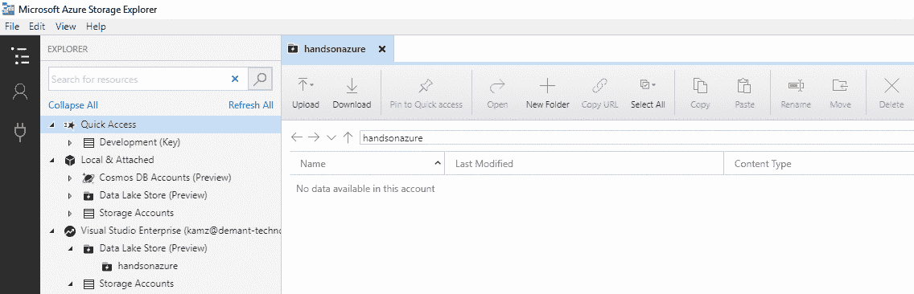

# 大数据存储 - Azure Data Lake

有时，我们需要存储无限量的数据。这种情况涵盖了大多数大数据平台，其中即便是一个软限制最大容量也可能会在应用的积极开发和维护中引发问题。得益于 Azure Data Lake，我们在存储结构化和非结构化数据方面拥有无限的可能性，所有这些都拥有高效的安全模型和出色的性能。

本章将涵盖以下主题：

+   Azure Data Lake Store 基础

+   存储数据到 Azure Data Lake Store

+   安全特性与关注点

+   使用 Azure Data Lake Store 的最佳实践

# 技术要求

要完成本章的练习，你将需要：

+   访问 Azure 订阅

# 了解 Azure Data Lake Store

在考虑存储解决方案时，你必须考虑你希望存储的数据量。根据你的需求，你可能会选择 Azure 中不同的服务选项——Azure Storage、Azure SQL 或 Azure Cosmos DB。也有各种数据库可以作为虚拟机的镜像（如 Cassandra 或 MongoDB）；这个生态系统相当丰富，所以每个人都能找到所需的东西。当你没有存储数据量的上限，或者在考虑到当今应用的特点时，数据量增长得如此迅速，以至于没有可能声明一个永远不会达到的安全上限时，就会出现问题。对于这种情况，有一种专门的存储方式，叫做 Data Lakes。它们允许你以数据的自然格式存储数据，因此不需要对存储的信息进行任何结构化。在 Azure 中，针对这种问题的解决方案叫做 Azure Data Lake Store；在本章中，你将学习该服务的基础知识，从而能够深入了解并根据自己的需求进行调整。

# Azure Data Lake Store 基础

Azure Data Lake Store 被称为超大规模数据存储库并非没有原因——在存储文件时没有限制。它可以支持任何格式、任何大小，并存储以不同方式结构化的信息。这也是大数据分析的一个理想模型，因为你可以根据自己的处理服务需求来存储文件（有些人更喜欢少量的大文件，有些人则喜欢很多小文件——选择最适合你的方式）。对于关系型、NoSQL 或图形数据库等其他存储解决方案来说，这是不可行的，因为它们在保存非结构化数据时总是存在某些限制。让我们看一个关于 Azure Data Lake Store 与 Azure Storage 的比较示例：

|  | **AZDS** | **Azure Storage** |
| --- | --- | --- |
| **限制** | 无文件大小/文件数量限制 | 最大账户容量为 500 TB，文件的最大大小 |
| **冗余** | LRS | LRS/ZRS/GRS/RA-GRS |
| **API** | WebHDFS | Azure Blob Storage API |

这里最重要的是冗余——目前，Azure Data Lake Store 支持的唯一模型是 LRS。这意味着在发生灾难时，可能会丢失存储在单个数据中心的数据。为了避免这种情况，你必须实施自己的策略将数据复制到副本中。实际上，你有两种模型可以选择——同步复制，如下所示：


或者你可以选择异步复制，如下所示：


这两种解决方案有一些明显的优缺点：

+   **同步**：确保数据已保存到副本中，考虑到重复数据时更难处理，且性能较低。

+   **异步**：数据可能会丢失（因为在灾难发生之前，你不会将数据移到副本），但性能更好（因为你只需保存数据而不等待复制），且更容易处理。

虽然复制看起来对 Azure Storage 更有利，但请记住，Azure Data Lake Store 文件系统基于 HDFS——这使得与许多开源工具的无缝集成成为可能，例如：

+   Apache Hive

+   Apache Storm

+   Apache Spark

+   MapReduce

+   Apache Pig

+   还有更多...！

这为你提供了一个更好的生态系统和工具。如果你想将数据存储在 Azure Data Lake Store 中，并希望使用 HDInsights 来对你的文件进行分析和转换，而不是使用其他 Azure 工具，你可以轻松连接到你的实例并开始工作。

请注意，目前 ADLS 支持 HDInsight 3.2、3.4、3.5 和 3.6 版本。

在访问存储在 Azure Data Lake Store 实例中的文件时，它采用了类似 POSIX 的权限模型；你基本上会操作三种不同的权限，这些权限可以应用于文件或文件夹：

+   **读取 (R)**：用于读取数据

+   **写入 (W)**：用于写入数据

+   **执行 (E)**：适用于文件夹，用于授予文件夹上下文中的读写权限（例如创建子文件夹或列出文件）

我们将在安全部分讨论更多的安全概念。

# 创建一个 Azure Data Lake Store 实例

要创建一个 Azure Data Lake Store 实例，你需要在门户中搜索 `Azure Data Lake`，并填写以下表格：


然而，你需要考虑以下几点：

+   位置：目前有四个不同的可用位置——美国中部、美国东部 2、北欧和西欧。请记住，在数据中心之间传输数据会额外收费，所以如果计划使用此服务，请仔细规划您的架构。

+   定价包：有两种可用的定价模型——按使用付费和固定月度承诺。它们各有优缺点（固定定价通常更便宜，但当您的应用程序增长时，它不那么灵活，有时很难提前规划所需的容量），因此请尽量了解您的应用程序使用该服务的特性，以选择最适合您的那种。

+   加密设置：默认情况下，新帐户的数据加密已启用。虽然可以禁用它，在大多数情况下您将保持默认设置。此外，有两种加密模式——要么让服务为您管理加密密钥，要么提供您自己的密钥（存储在 Azure 密钥保管库中）。

由于轮换加密密钥是个好主意，您可能会遇到问题，即使由于故障，您的数据的冗余副本也无法访问。虽然可以从备份数据中恢复，但您需要一个旧密钥来解密它。因此，建议在意外中断时存储旧密钥的副本。

当您点击“创建”按钮时，您的服务将被配置好—您可以访问它以查看概览：


由于它是新创建的，我们看不到描述我们存储了多少数据的不同指标。而且，当前成本为 0 美元——这当然是我们预期的，因为没有文件上传到服务中。从用户界面的角度来看，目前我们无法做太多事情；一些额外功能，如“防火墙”，将在本章后面描述。除了门户，您还可以通过使用 Microsoft Azure 存储资源管理器轻松访问您的 Azure 数据湖存储实例：



当您有多个文件和文件夹并尝试浏览它们时，这将使事情变得更加容易。

# 在 Azure 数据湖存储中存储数据

因为 Azure 数据湖存储的全部关注点是存储数据，在本章的这一部分中，您将看到如何存储不同的文件，使用权限限制对其的访问，并组织您的实例。在这里需要记住的重要事情是，您不仅限于使用大数据工具来存储或访问存储在服务中的数据——如果您设法与 Azure 数据湖存储协议通信，您可以轻松地使用 C#、JavaScript 或任何其他类型的编程语言操作文件。

# 使用 Azure 门户进行导航

要开始在 Azure 门户中使用文件，您需要点击“数据浏览器”按钮：


一旦您点击它，您将看到一个新屏幕，在那里您可以选择许多不同选项来创建文件夹、上传文件或更改访问属性。虽然这个工具不是管理成千上万个文件的最佳方式，但它可以让您了解存储了什么以及如何存储：


门户中提供的用户界面的缺点是，它有时会卡顿，尤其是在你拥有数百个文件时。如果你存储了数 GB 的数据，一些操作（如删除文件夹）也可能会失败。在这种情况下，最好使用 PowerShell 或自定义流程来执行操作。

现在我们将讨论用户界面上可用的选项。

# 筛选器

当你点击“筛选器”按钮时，你将看到一个屏幕，显示你感兴趣的文件：


这是快速限制文件夹内显示文件的最简单方法，但当然也有一些限制——例如，你不能使用通配符只筛选特定的文件扩展名。

要移除筛选器，请点击筛选器屏幕上的重置按钮。

# 新文件夹

这个简单的选项让你有可能创建一个新文件夹：


请注意，默认情况下，只有你可以访问新文件夹——为了让其他人可见（并允许他们读取），你必须显式地为其分配特定的用户组。

# 上传

使用“上传”功能，你可以直接从本地计算机将文件上传到云端：


你选择的文件将被上传到你当前浏览的文件夹中。还可以选择允许覆盖现有文件；如果你决定不覆盖并上传重复文件，你将看到以下错误：


# 访问权限

Azure 数据湖存储的最重要特点之一是能够完全声明对存储在其中的特定资源的访问权限：


默认情况下，只有你可以访问文件或文件夹。要添加新的用户或组，可以点击“+ 添加”按钮：


我想在这里讨论一些重要的内容：

+   权限：请记住，要授予某人列出文件夹内文件的权限，你需要分配两个权限：读取和执行。创建文件夹内的子项时也适用相同的要求。

+   添加到：可以将特定权限集传播到不仅是单个文件夹，而是文件夹内的所有文件夹。当你希望快速允许某人列出某个父目录下的文件和文件夹时，这尤其有用。

+   添加为：你可以将一组权限添加为默认权限条目（默认分配给文件夹的所有其他用户）或访问权限条目（指定某人如何访问它）。你也可以结合使用这两种方式以加快操作。

# 文件和文件夹

在每个可见的文件和文件夹旁边，你可以看到一个图标，点击该图标会显示一个菜单，提供额外的选项：


事实上，这些选项与我们刚刚讨论的相同——它们只是应用于特定的文件夹和文件。

# Microsoft Azure Storage Explorer

大多数前述选项都可以通过 Microsoft Azure Storage Explorer 来执行：


不幸的是，它不提供为文件和文件夹分配权限的功能。不过，它在浏览存储数据时是一个更好的选择——更重要的是，它会自动显示分配给项目的一组所需权限。

# 使用 SDK

管理文件和你的 Azure Data Lake Store 实例的最灵活（也是最先进）选项是使用适合你当前语言的 SDK。目前，官方支持三种不同的语言：

+   .NET 平台

+   Java

+   Python

还可以使用 REST API，基本上你可以使用任何语言连接它。以下代码片段可以让你连接到服务：

```
var client = AdlsClient.CreateClient("<account-name">, <credentials>);
```

在进行身份验证以连接到你的服务时，有两种可用的选项：

+   终端用户身份验证

+   服务到服务的身份验证

这两种场景在*进一步阅读*部分的文档中有详细描述。无论你选择哪种选项，最终都会使用生成的 OAuth 2.0 令牌。在这里，你可以找到一个简单的服务提供者，它利用了所描述的方法，并允许你轻松创建新文件夹并向文件中追加数据：

```
public class DataLakeProvider : IDisposable
{
   private readonly DataLakeStoreFileSystemManagementClient _client;

    public DataLakeProvider(string clientId, string clientSecret)
    {
        var clientCredential = new ClientCredential(clientId, clientSecret);
        var creds = ApplicationTokenProvider.LoginSilentAsync("domainId", clientCredential).Result;
        _client = new DataLakeStoreFileSystemManagementClient(creds);
    }

    public Task CreateDirectory(string path)
    {
        return _client.FileSystem.MkdirsAsync("datalakeaccount", path);
    }

    public async Task AppendToFile(string destinationPath, string content)
    {
        using (var stream = new MemoryStream(Encoding.UTF8.GetBytes(content)))
        {
            await _client.FileSystem.ConcurrentAppendAsync("datalakeaccount", destinationPath, stream, appendMode: AppendModeType.Autocreate);
        }
    }

    public void Dispose()
    {
        _client.Dispose();
    }
}
```

你可以在*进一步阅读*部分提到的博客文章中阅读更多关于如何编写这种提供者的内容。

使用 SDK 的一个重要优点是能够抽象化许多操作并自动化它们——你可以轻松地递归删除文件或动态创建文件。使用 UI 时，这些操作是无法实现的，而大多数严肃的项目开发人员宁愿编写代码，也不愿依赖手动文件管理。

# 安全性

Azure Data Lake Store 提供了一种与其他 Azure 存储选项不同的安全模型。实际上，它为你提供了一个复杂的解决方案，包含身份验证、授权、网络隔离、数据保护和审计。由于它被设计为数据驱动系统的基础，因此在保护谁（或什么）以及如何访问存储的信息时，必须扩展常见的功能。本节将介绍不同的安全功能并详细描述它们，让你熟悉它们并了解如何使用。

# 身份验证和授权

为了验证谁或什么可以访问存储的数据， Azure Data Lake Store 使用 Azure Active Directory 来识别当前访问数据的实体。为了授权它，Azure 通过 **基于角色的访问控制**（**RBAC**）来保护资源本身，并使用 POSIX ACL 来保护数据。

了解这两个术语之间的区别非常重要：

+   **身份验证**：这决定了谁或什么尝试访问特定的资源。

+   **授权**：通过限制仅将资源的访问权限分配给已被分配特定权限集的人员，从而保护资源。

重要的是要记住，如果你有多个订阅承载着不同的资源，并希望它们访问 Azure Data Lake Store，你必须将相同的 Azure AD 实例分配给它们所有——如果没有这样做，其中一些将无法访问数据，因为只有在分配给 ADLS 的目录中定义的用户和服务才能通过身份验证并获得访问权限。

让我们查看 RBAC 和 POSIX 模型之间的区别。

# RBAC

RBAC 控制谁可以访问 Azure 资源。它是一个独立的角色和权限集合，与存储的数据无关。要检查此功能，请点击**访问控制（IAM）**刀片：


在前面的屏幕上，你可以看到我为资源分配了三个不同的应用程序（服务）和一个用户。他们还具有不同的角色：

+   所有者：完全访问权限，包括确定谁可以访问该资源

+   贡献者：完全访问权限，除非确定谁可以访问该资源

如果你点击**角色**按钮，你将看到 ADLS 可能角色的完整列表：


使用**访问控制（IAM）**刀片，你可以轻松控制谁能访问你的 Azure Data Lake Store 实例以及如何访问——每当你想更改权限或访问它的用户/服务集合时，使用它。

一个好的做法是管理组而不是单独的实体——这让你可以在一个地方（Azure AD）添加/移除用户或实体，而不必浏览资源及其 RBAC。

# POSIX ACL

如前所述，你可以通过提供一组定义为**读取**、**写入**和**执行**的权限来管理对你实例中数据的访问。它们是 POSIX **访问控制列表**（**ACL**）的一部分，而 ACL 是 Hadoop HDFS 的一部分，HDFS 是此 Azure 服务的引擎之一。如果你曾使用过 FTP 服务器，可能已经处理过文件系统权限；它们通常被描述为包含`r`、`w`、`x`和字符`-`的数字或字符串。以下是一个示例：

+   `-rwx------`等同于`0700`，并仅声明所有者具有读取、写入和执行权限。

+   `-rwxrwxrwx`等同于`0777`，并声明每个人都可以读取、写入和执行权限。

+   `-rw-rw-rw-`等同于`0666`，并声明所有人均可读取和写入权限。

你可以在**进一步阅读**部分中找到更多关于 POSIX ACL 模型的信息。

# 网络隔离

我之前提到了**防火墙**刀片，但我们跳过了它，目的是让你在熟悉该服务后能学到一些东西。当你点击**防火墙**刀片时，你会看到一个屏幕，允许你指定哪些 IP 地址可以访问你的实例：


这里最重要的是能够阻止其他 Azure 服务访问您的数据——如果您有要求必须禁止任何人读取存储在 ADLS 中的信息，这一点非常有用。您可以在 *进一步阅读* 部分的链接中了解更多关于安全功能的信息。

# 最佳实践

Azure Data Lake Store 在访问存储的数据以及执行读写操作时与其他服务有所不同。由于此服务旨在存储 PB 级别的数据，了解如何存储数据的最佳实践非常重要，这样可以避免像需要重新组织所有文件或读取/写入速度慢等问题。这还包括安全功能（如前所述），因为它是整个解决方案的重要组成部分。在本节中，我们将重点讨论多个关于 ADLS 的建议，帮助您在使用时更加得心应手，并能够利用最佳实践。

# 性能

许多存储解决方案的一个重要特性是它们的性能。通常，我们期望无论负载高低、单个记录大小如何，数据库都能正常工作。对于 ADLS，您需要考虑以下因素：

+   **并行性**：正如文档中所述，在执行读写操作时，确保提供一定程度的并行性非常重要。每个核心的理想线程数被定义为 8-12。

+   **文件大小**：虽然不同的数据分析解决方案可能会根据文件大小的不同而有不同的表现，但同样重要的是要知道，ADLS 也有一个最佳的文件大小。由于它基于 HDFS，并利用 POSIX 模型来处理权限，它更倾向于使用较大的文件（几百兆字节）而不是较小的文件，以避免在复制、连接和身份验证检查时出现问题。

+   **I/O 限制**：虽然 Azure Data Lake Store 在吞吐量方面没有启用硬性限制，但当您的作业在容量上非常苛刻时，仍然可能会遇到一些问题。重要的是要记住，即使在这个服务中，您仍然可能会遇到一些软限制，这些限制可以在联系 Azure 支持后解除。如果遇到 429 错误，可能是由于限流。

+   **批处理**：在许多面对高吞吐量的情况下，使用批处理来减少写入操作可能是有益的。在 ADLS 中，批处理的最佳大小被定义为 4 MB —— 通过执行这种大小的写入操作，您可以减少所需的 IOPS，并提升服务的整体性能。

# 安全性

我们之前稍微讨论过这个话题，在这里我们做个总结。当使用 ADLS 并考虑其安全功能（如身份验证、授权和文件访问）时，重要的是要记住以下几点：

+   **优先使用组而不是用户/服务**：虽然最初将单个用户分配到资源或文件夹可能更容易，但一旦对数据感兴趣的人数迅速增长，您将迅速面临问题。这就是为什么最好使用 Azure AD 组来确定对资源本身的 RBAC 访问以及对文件和文件夹的 POSIX ACL。它还提高了解决方案的性能，因为检查实体是否属于组比遍历长用户列表更快。

+   **最小权限集合**：与其他服务一样，始终从访问您的 Azure 数据湖存储实例所需的最小权限集合开始。不要为仅读取数据的用户分配**写入**权限，或者为仅在文件夹中读取单个文件的服务分配**执行**权限。

+   **启用防火墙**：通常情况下，您不希望允许任何人访问存储在 ADLS 中的数据。为了保护您的解决方案，使只有子集 IP 地址能够访问信息，启用防火墙，以便拒绝名单之外的任何人。

# 弹性

确保数据安全存储并且在 DC 内部出现问题时不会丢失是至关重要的。正如本章开头所提到的，ADLS 不支持地理冗余性——您必须自行实施。为此，您必须集成一个工具，允许您按照需要复制数据。文档中提到了三种不同的工具——Distcp、Azure 数据工厂和 AdlsCopy，当然，您也可以使用任何其他能够连接到 Azure 数据湖存储并与服务集成的工具。

在考虑 Azure 数据湖存储的灾难恢复（DR）或高可用（HA）时，考虑诸如 RPO、不一致性和执行故障切换时的复杂数据合并问题等因素。有时，等待服务恢复而不是切换到次要副本可能更好。

# 数据结构

您将根据不同的使用场景选择不同的数据结构——对于 IoT 数据，它将非常细粒度：

```
{Vector1}/{Vector2}/{Vector3}/{YYYY}/{MM}/{DD}/{HH}/{mm}
```

另一方面，用于存储用户数据的结构可能完全不同：

```
{AppName}/{UserId}/{YYYY}/{MM}/{DD}
```

这完全取决于您当前的需求。在计划对存储的文件执行分析时，数据结构至关重要——它直接影响文件的大小和数量，进而可能影响您的活动可能工具集。

这里另一个重要的事项是法律要求——如果您使用任何敏感数据作为文件夹或文件名，您必须能够在用户告诉您希望被遗忘或要求删除账户时有效地执行清理。

# 概要

在本章中，你已经学习了一些关于 Azure Data Lake Store 的知识，它是一个旨在存储几乎无限数据量的 Azure 服务，并且不影响数据的结构。我们已经讨论了数据结构、安全功能和最佳实践等内容，因此你应该能够开始构建自己的解决方案，基于这个特定的 Azure 组件。请记住，Azure Storage 可能很容易替代它——这完全取决于你的需求和期望。如果你需要更灵活的安全模型、更好的性能和更高的限制，ADLS 就是你的选择。这部分书籍到此结束，涵盖了存储数据的服务、监控服务以及它们之间的通信。下一章，你将学习更多关于 Azure 的扩展性、性能和可维护性方面的知识。

# 问题

1.  哪种安全模型更好——管理安全组还是单独管理实体？为什么？

1.  RBAC 和 POSIX ACL 之间有什么区别？

1.  ADLS 中的文件最大可以有多大？

1.  哪种数据结构更好——一个包含成千上万文件的单一文件夹，还是一个包含多个文件的文件夹层级结构？

1.  Azure Data Lake Store 可以与任何编程语言一起使用吗？

1.  ADLS 和 Azure Storage 有什么区别？

1.  如何确保基于 ADLS 的解决方案具有地理冗余性？

# 进一步阅读

+   终端用户认证：[`docs.microsoft.com/en-us/azure/data-lake-store/data-lake-store-end-user-authenticate-net-sdk`](https://docs.microsoft.com/en-us/azure/data-lake-store/data-lake-store-end-user-authenticate-net-sdk)

+   服务到服务认证**(authentication)**：[`docs.microsoft.com/en-us/azure/data-lake-store/data-lake-store-service-to-service-authenticate-net-sdk`](https://docs.microsoft.com/en-us/azure/data-lake-store/data-lake-store-service-to-service-authenticate-net-sdk)

+   编写 Data Lake Store 提供程序：[`blog.codenova.pl/post/azure-functions-webjobs-and-data-lake-writing-a-custom-extension-2`](http://blog.codenova.pl/post/azure-functions-webjobs-and-data-lake-writing-a-custom-extension-2)

+   Data Lake Store 操作.NET：[`docs.microsoft.com/en-us/azure/data-lake-store/data-lake-store-data-operations-net-sdk`](https://docs.microsoft.com/en-us/azure/data-lake-store/data-lake-store-data-operations-net-sdk)

+   POSIX ACL：[`hadoop.apache.org/docs/current/hadoop-project-dist/hadoop-hdfs/HdfsPermissionsGuide.html#ACLs_Access_Control_Lists`](https://hadoop.apache.org/docs/current/hadoop-project-dist/hadoop-hdfs/HdfsPermissionsGuide.html#ACLs_Access_Control_Lists)

+   安全概述：[`docs.microsoft.com/en-us/azure/data-lake-store/data-lake-store-security-overview`](https://docs.microsoft.com/en-us/azure/data-lake-store/data-lake-store-security-overview)

+   最佳实践：[`docs.microsoft.com/en-us/azure/data-lake-store/data-lake-store-best-practices`](https://docs.microsoft.com/en-us/azure/data-lake-store/data-lake-store-best-practices)
