# 第十八章：扩展 Azure 应用

在云中谈论可靠和稳定的应用程序时，扩展是必不可少的。虽然在**基础设施即服务**（**IaaS**）或本地部署的模型中，这个过程可能显得有些复杂且笨重，但 Azure 提供了多种不同的方式，可以快速扩展我们的应用程序，且没有停机时间。

本章将涵盖以下主题：

+   自动扩展、向上扩展、向外扩展

+   扩展 Azure 应用服务

+   扩展 Azure 函数

+   扩展 Azure 服务结构

# 技术要求

要执行本章的练习，您将需要以下内容：

+   访问 Azure 订阅

# 自动扩展、向上扩展、向外扩展

云计算的核心是扩展——这是此类设置相比本地部署设置的最重要优势之一。云能够快速适应新需求，尤其是流量的增加，而云所提供的灵活性使您能够创建更稳定的服务，减少意外负载峰值和硬件性能不足的风险。在本章中，我们将深入探讨扩展主题，帮助您深入理解 Azure 中不同服务的行为，并确保扩展功能是自动化的，并且尽可能少需要关注。

# 自动扩展

您可以按以下方式定义许多服务的自动扩展功能：

自动扩展是一项功能，允许服务、机器或应用程序根据预定义的参数（如 CPU 利用率、内存使用情况或人工因素，如吞吐量单元或工作者利用率）自动向上或向外扩展。

通常，您可以按以下方式描述自动扩展：

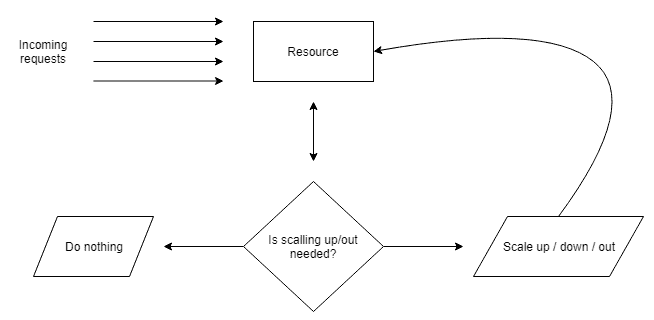

前面的图示可以按以下方式描述：

+   资源正常接受传入请求

+   同时，有一个实体监控资源——它会根据扩展规则检查资源，并决定是否需要执行扩展操作。

+   一个实体根据设置决定是否扩展资源，它可以将资源向上/向下扩展或向外扩展。

当然，除了优点，扩展也有其缺点：

+   它可能会使您的应用程序变得无响应。

+   它需要额外的资源来进行负载均衡（如果是向外扩展）。

+   这需要时间，具体取决于扩展特性。因此，必须在设计阶段规划此类操作。

+   在许多情况下，这会使您的解决方案变得更加昂贵。

服务如何扩展完全取决于服务本身。让我们看一些例子：

+   Azure 事件中心可以手动/自动扩展（使用自动膨胀功能）。您可以为实例分配更多的**吞吐量单元**（**TUs**），使其能够接收更多的消息。自动缩减扩展尚未实现。

+   Azure 应用服务可以手动和自动扩展（取决于您选择的层级）。您可以使用多个不同的参数，缩小扩展也会自动进行。

+   Azure Cosmos DB 依赖于分配给实例的**请求单元**（**RU**）。

+   Azure SQL 有不同的扩展模型——你可以使用**数据库事务单元**（**DTUs**）或虚拟核心（vCores）。

+   Azure Functions 通过内部的工作者和扩展控制器机制自动扩展。

+   Azure 存储不支持扩展。

如你所见，在 Azure 中没有单一的扩展解决方案——你必须为每个组件单独实现可行的解决方案。经验法则是，你对资源的控制越少，扩展将越自动化。而对于 IaaS 场景，你必须操作虚拟机的数量，而在**PaaS**中，你将最终得到虚拟核心或其他单元。这里你可以找到按扩展复杂度从左到右排列的不同云模型（其中**IaaS**具有最复杂的模型）：

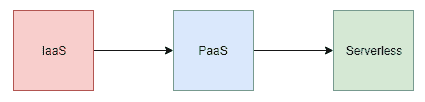

# 向上扩展与向外扩展

有两种不同类型的扩展（至少在 Azure 中是这样）：

+   **水平扩展**：通过升级硬件/增加一个层级来进行扩展

+   **水平扩展**：添加服务的实例

向上扩展可以如下呈现：

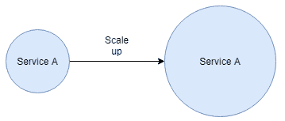

而为了进行比较，水平扩展的描述如下：

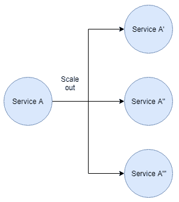

因此，在第一个场景中（向上扩展），你将从单个实例中获得更好的性能，而**水平扩展**则允许你并行处理工作。两种选项的使用场景不同，基本上取决于你计划运行的工作负载。这些是一些例子：

+   如果你的代码是顺序执行且无法并行化，使用**向上扩展**。

+   如果你的代码在单位时间内需要大量的计算能力，而不是将其分配到多台机器上，使用**向上扩展**。

+   如果你有方法对负载进行负载均衡，使用**水平扩展**。

+   如果你能够在多台机器上执行相同的工作，并且没有碰撞的风险，使用**水平扩展**。

使用**水平扩展**可以比作多线程——但当然是在一个更大的规模上。事实上，问题非常相似。如果你的机器有多个核心，并且能够同时执行你的代码，那么你必须引入非常相似的约束。

水平扩展的常见问题通常是由访问状态引起的——无论它是通过任何类型的存储共享，还是在多台机器之间分布。在使用此功能之前，请确保了解这些问题。

在 Azure 中，多个服务的扩展方式不同。我们将重点讨论其中三个，以便更好地理解这一主题。

# 扩展 Azure 应用服务

我们通过学习一些基本的 Azure 应用服务 开始了在 Microsoft Azure 上的旅程。这是一个非常常见的 PaaS 组件，在许多 Azure 用户中被广泛使用，适用于非常简单的网站和要求高性能与高可靠性的复杂系统。为了确保您的 Web 应用 始终在线，或者检查它是否面临压力，您需要实施某种扩展规则。对于此服务，您有两个选择——要么使用手动扩展（并实现某种警报，以便知道何时执行此操作），要么使用自动扩展功能，这样在维护方面会更轻松。在本节中，我们将介绍并比较这两者。

# 手动扩展

手动扩展是从基础层开始提供的功能——它不适用于免费的或共享的服务。根据所选择的实际层级，您的应用服务可以使用不同数量的实例。

在这里，您可以查看 B2 层的情况：

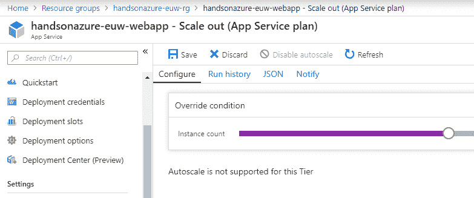

在前面的配置中，最大可用实例数设置为三。 However，如果我将扩展到标准层，结果如下：

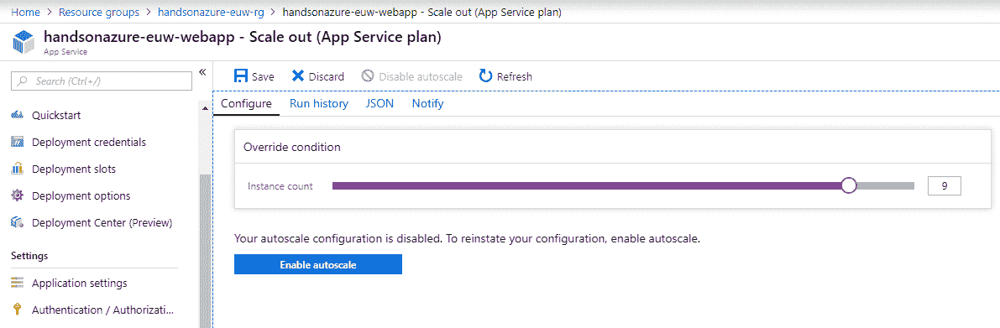

情况看起来有些不同——两个功能发生了变化：

1.  我可以将实例数量设置为最多 10 个

1.  可以启用自动扩展

请注意，将扩展到高级层将允许您为应用服务设置最多 20 个实例。

# 自动扩展

虽然手动扩展对于需求较低的网站和系统可能是合适的（因为它们在发生事件时不需要迅速采取行动），但如果您的应用程序是一个受欢迎的电子商务网站，您希望操作快速执行，包括扩展。例如，让我们尝试现在启用自动扩展——这将显示一个表单，允许您管理这些设置：

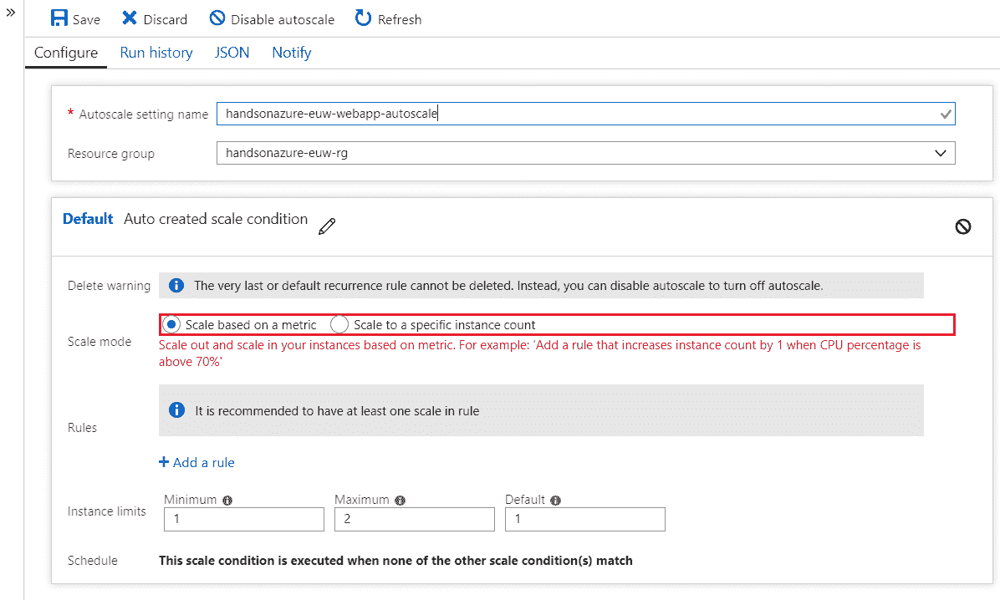

事实上，您在这里有两个选择：

1.  基于指标扩展：允许您选择一个指标，该指标将作为自动扩展的触发条件

1.  扩展到特定的实例数：默认情况下执行（因此应该与基于指标的扩展一起使用）

要根据指标配置自动扩展，您需要一个规则。您可以通过点击 + 添加规则链接来添加该规则。这样做将显示另一个表单（比当前的表单复杂得多），您可以在其中选择所有对您有意义的内容：

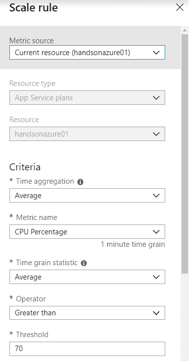

在前面的截图中，您可以看到一个规则，当 CPU 使用率在 10 分钟内超过 70% 时，会触发自动扩展。一旦满足所有条件，运行时将向应用服务添加另一个实例。更重要的是，如果条件在 5 分钟后仍然成立（冷却时间（分钟）期间），将再次触发扩展操作。这将一直持续，直到达到您设置的最大实例数为止。

请记住，你可以为应用程序设置多个规则。而且，似乎创建一个按规则减少实例数的规则是个好主意，这样当负载恢复正常时，它会移除多余的实例。

一旦添加了规则，你可以点击保存以确认更改——现在，每当规则被认为是激活状态时，你的应用程序就会自动扩展。在继续之前，我想向你展示另外两件事。你可能注意到在扩展页面上有两个额外的部分：JSON 和 Notify。它们在管理服务时提供了一些额外的选项：

+   JSON: 这会生成一个 JSON 模板，可以与 ARM 模板一起使用，以自动配置你的资源。当创建服务时，它会自动添加扩展规则。

+   Notify: 这使你能够在 Azure 中自动向资源管理员发送通知，当出现问题时通知他们。

这里你可以看到为我的规则生成的 JSON：

```
{
    "location": "West Europe",
    "tags": {
        "$type": "Microsoft.WindowsAzure.Management.Common.Storage.CasePreservedDictionary, Microsoft.WindowsAzure.Management.Common.Storage"
    },
    "properties": {
        "name": "handsonazure-euw-webapp-autoscale",
        "enabled": true,
        "targetResourceUri": "/subscriptions/1a2d5d1c-dee5-4deb-a93a-366cc83feb46/resourceGroups/handsonazure-euw-rg/providers/Microsoft.Web/serverfarms/handsonazure-euw-appserviceplan",
        "profiles": [
            {
                "name": "Auto created scale condition",
                "capacity": {
                    "minimum": "1",
                    "maximum": "10",
                    "default": "1"
                },
                "rules": [
                    {
                        "scaleAction": {
                            "direction": "Increase",
                            "type": "ChangeCount",
                            "value": "1",
                            "cooldown": "PT5M"
                        },
                        "metricTrigger": {
                            "metricName": "CpuPercentage",
                            "metricNamespace": "",
                            "metricResourceUri": "/subscriptions/1a2d5d1c-dee5-4deb-a93a-366cc83feb46/resourceGroups/handsonazure-euw-rg/providers/Microsoft.Web/serverFarms/handsonazure-euw-appserviceplan",
                            "operator": "GreaterThan",
                            "statistic": "Average",
                            "threshold": 70,
                            "timeAggregation": "Average",
                            "timeGrain": "PT1M",
                            "timeWindow": "PT10M"
                        }
                    }
                ]
            }
        ],
        "notifications": [],
        "targetResourceLocation": "West Europe"
    },
    "id": "/subscriptions/1a2d5d1c-dee5-4deb-a93a-366cc83feb46/resourceGroups/handsonazure-euw-rg/providers/microsoft.insights/autoscalesettings/handsonazure-euw-webapp-autoscale",
    "name": "handsonazure-euw-webapp-autoscale",
    "type": "Microsoft.Insights/autoscaleSettings"
}
```

# 扩展 Azure Functions

使用 PaaS 服务时，你可以配置当 CPU 使用率达到最大允许值，或请求数超过阈值时，应用程序的行为。然而，Azure 还提供了其他模型的服务——其中最有趣的是无服务器架构，它进一步抽象了控制，旨在提供更简便的配置、最小的维护以及专注于提供业务价值的能力。

在本节中，你将看到 Azure 应用服务和 Azure Functions 在扩展方面的不同，从技术和概念的角度来看。

# 扩展无服务器应用程序

当使用无服务器服务（例如 Azure Functions、Azure Cosmos DB 或 Azure Event Grid）时，配置该功能的选项非常有限。例如：

+   在 Azure Functions 中，你依赖于定价模型（消费计划与应用服务计划）

+   在 Azure Cosmos DB 中，你修改 RU 的数量

+   在 Azure Event Grid 中，你无法定义服务如何扩展。

这一切的原因是你无法控制应用程序主机——底层服务引擎与应用程序完全分离，无法直接修改。你能做的是间接控制它，要么通过改变处理单元的数量，要么通过可用的配置选项，这些选项可以被解释并应用。

请注意，无服务器是一个模型，你与运行时（在某些情况下甚至与云服务提供商）是隔离的。如果这种缺乏控制不适合你，最好尝试 PaaS 或 IaaS 模型和服务。

# 扩展 Azure Functions

在 Azure Functions 中，至少在消费计划下，不可能进行扩展。当然，使用 App 服务计划时，您可以进行扩展并获得更好的硬件，但这不会影响服务本身。相反，它会创建更多的资源来消耗。另一方面，您不能手动扩展。唯一的可能性是让 Azure Functions 自动扩展。为此，该服务实现了扩展控制器的概念。这是一个内部功能，它持续监控承载函数运行时的特定工作进程的行为，如果其中一个似乎过载，则会向工作集添加另一台机器。

Azure Functions 的扩展行为非常复杂且仅部分描述，因为它包含了开源部分或未公开的部分。我将在本章中尽力详细描述，以便您了解做出扩展决策的准确算法。

在您的 Azure Functions 实例做出扩展决策之前，它会检查以下内容：

1.  **扩展间隔**：扩展仅在经过特定时间间隔后发生。

1.  **当前工作进程数**：如果工作进程的数量（运行函数宿主的工作进程）超过了配置的最大值，系统会决定从工作集移除一个工作进程。

1.  **负载因子**：如果负载因子接近最大值，则会添加一个新的工作进程。相反，如果负载因子下降，则会移除一个工作进程。

1.  **繁忙工作进程比例**：如果繁忙的工作进程数超过了配置的最大值，则会向工作集添加另一个工作进程。

1.  **空闲工作进程**：如果空闲工作进程的数量大于定义的最大值，系统会从工作集移除其中一个工作进程。

上述操作的定义值可以如下找到：

```
public const int DefaultMaxWorkers = 100;
public const int DefaultBusyWorkerLoadFactor = 80;
public const double DefaultMaxBusyWorkerRatio = 0.8;
public const int DefaultFreeWorkerLoadFactor = 20;
public const double DefaultMaxFreeWorkerRatio = 0.3;
public static readonly TimeSpan DefaultWorkerUpdateInterval = TimeSpan.FromSeconds(10);
public static readonly TimeSpan DefaultWorkerPingInterval = TimeSpan.FromSeconds(300);
public static readonly TimeSpan DefaultScaleCheckInterval = TimeSpan.FromSeconds(10);
public static readonly TimeSpan DefaultManagerCheckInterval = TimeSpan.FromSeconds(60);
public static readonly TimeSpan DefaultStaleWorkerCheckInterval = TimeSpan.FromSeconds(120);
```

上述值来自 Azure Functions Host 的 GitHub 仓库。这些值可能会在一段时间后更改，但如果您有兴趣，可以查看以下项目：[`github.com/Azure/azure-functions-host`](https://github.com/Azure/azure-functions-host)

此外，您可以通过在应用程序设置中提供 `WEBSITE_MAX_DYNAMIC_APPLICATION_SCALE_OUT` 值来控制实例的最大数量：

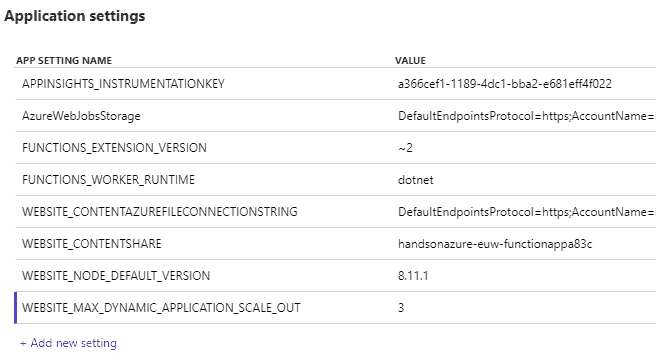

更重要的是，如果您将 Function App 实例连接到 Azure Application Insights 实例，您将能够通过检查 Live Metrics Stream 功能查看它有多少个工作进程：

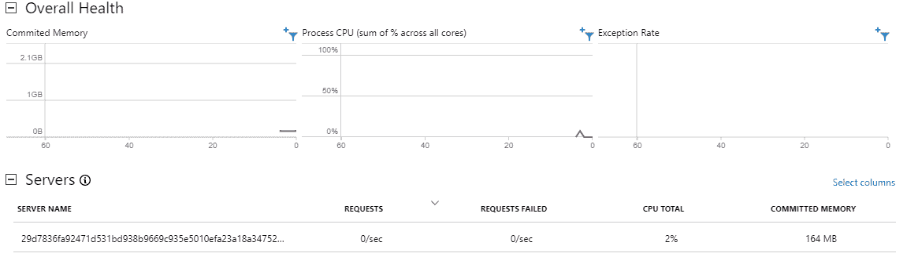

# 扩展 Azure Service Fabric

我们已经讨论了通过与两个不同的 Azure 服务合作来扩展的两种不同模型；Azure 应用服务和 Azure Functions。

在添加新实例或提升硬件性能方面，它们有很大的不同，因为它们引入了多个概念，并提供了不同的灵活性。在本章的最后部分，我们将介绍另一个服务——Azure Service Fabric。这个 Azure 产品在进行垂直或水平扩展时行为略有不同，因为它要求你管理虚拟机。此外，执行这一操作需要一组独特的技能，以确保操作顺利且正确。

# 手动扩展集群

在 Azure Service Fabric 中，集群可以通过两种方式进行缩放：

+   **手动**：通过在集群配置中选择适当的选项

+   **程序化**：通过使用 Azure SDK

实际上，集群的特性在一开始就已经选定，当你选择节点类型及其配置时，如下截图所示：

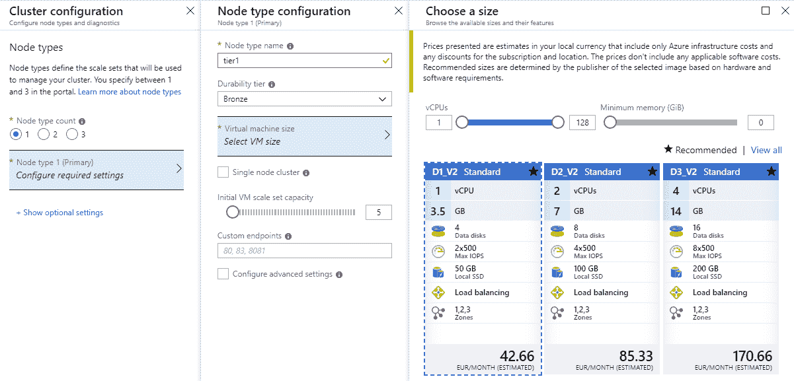

扩展 Azure Service Fabric 服务类似于扩展虚拟机，因为它基于包含不确定数量虚拟机的节点，这意味着你实际上依赖于扩展集。

最好在一开始就搭建一个能够处理计划负载的集群，而不是在压力下进行缩放，尤其是当你需要严格的事务保证时，这可能会影响缩放时间。请查看*进一步阅读*部分，那里有一篇文章描述了高效的集群规划。

在使用 Azure Service Fabric 扩展时，请记住，向扩展集添加机器总是需要时间。因此，请考虑提前规划此类操作，以便将对当前操作的影响降至最低。要实际扩展你的集群，你需要使用创建时就配置的扩展集的扩展功能，如下图所示：

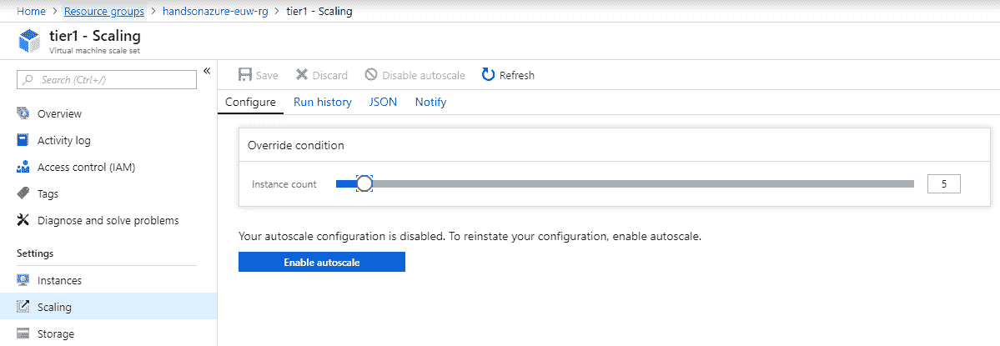

执行此操作的另一个选项是使用 ARM 模板，代码片段如下：

```
"resources":[
    {
      "type":"Microsoft.Compute/virtualMachineScaleSets",
      "apiVersion":"2017-03-30",
      "name":"[parameters('<scale-set-name>')]",
      "location":"[resourceGroup().location]",
      "sku":{
        "name":"[parameters('<sku>')]",
        "tier":"<tier>",
        "capacity":"[parameters('<capacity>')]"
      }
    }
]
```

通过提供`<capacity>`值，你可以轻松更改为你的 SF 集群提供计算的虚拟机数量。

# 使用 Azure SDK 来扩展你的集群

另一个缩放集群的选项是使用 Azure 计算 SDK。你可能会想，这个特性有哪些使用场景——毕竟，我们已经有了手动/自动缩放功能。然而，仍然有一些更高级的场景，可能适合使用自己的控制器进行缩放：

+   使用自定义度量进行扩展，而这并不适用于自动扩展。

+   在缩放操作之前可以执行额外的操作。

+   在关键工作负载的情况下，完全控制缩放操作。

要获取 Azure 计算 SDK，你需要下载以下 NuGet 包：Microsoft.Azure.Management.Fluent，网址为：[`www.nuget.org/packages/Microsoft.Azure.Management.Fluent/`](https://www.nuget.org/packages/Microsoft.Azure.Management.Fluent/)。其他语言（如 Java 或 Python）也有类似的库，你可以在*进一步阅读*部分的链接中找到它们。

要扩展集群的规模，你可以使用以下代码片段：

```
var vmScaleSet = AzureClient.VirtualMachineScaleSets.GetById(ScaleSetId);
var capacity = (int)Math.Min(MaximumNodeCount, vmScaleSet.Capacity + 1);
vmScaleSet.Update().WithCapacity(capacity).Apply(); 
```

同样的方式也适用于 Java：

```
vmScaleSet.update().withCapacity(capacity).apply();
```

如你所见，这段代码非常简单—你只需要获取当前的规模集 ID 来引用它，然后修改其容量。在这个示例中，我使用了值 `1`，但没有任何限制，阻止你使用其他数字。

通过前面的示例，你也可以缩减集群的规模。然而，请记住，你不应该将集群缩减到低于其可靠性层级。如果这样做，你将无法再依赖它，甚至可能导致集群不稳定。

如果你使用的是比**铜**更高的可靠性层级，那么你不需要担心未使用的机器，因为它们会被自动移除。否则，你需要手动处理。为此，你需要知道哪些虚拟机当前没有被使用。要移除不再需要的节点，你可以使用以下操作：

```
await client.ClusterManager.DeactivateNodeAsync(node.NodeName, NodeDeactivationIntent.RemoveNode);
scaleSet.Update().WithCapacity(capacity).Apply(); 
await client.ClusterManager.RemoveNodeStateAsync(node.NodeName);
```

它们基本上做三种不同的事情：

1.  停用并从集群中移除节点

1.  减少规模集容量

1.  删除节点状态

要找到要移除的节点，你必须查询集群并查找最近添加的机器：

```
using (var client = new FabricClient())
{
    var node = (await client.QueryManager.GetNodeListAsync())
        .Where(n => n.NodeType.Equals(NodeTypeToScale, StringComparison.OrdinalIgnoreCase))
        .Where(n => n.NodeStatus == System.Fabric.Query.NodeStatus.Up)
        .OrderByDescending(n =>
        {
            var instanceIdIndex = n.NodeName.LastIndexOf("_");
            var instanceIdString = n.NodeName.Substring(instanceIdIndex + 1);
            return int.Parse(instanceIdString);
        })
        .FirstOrDefault();
}
```

你可能会想，为什么最近添加的机器会成为扩展操作的受害者？这是因为在集群利用率较高时，工作被委派给了它。它最初并不属于该规模集，完成任务后可以移除。

# 总结

在本章中，我们涵盖了三种完全不同的服务扩展—Azure App Service、Azure Functions 和 Azure Service Fabric。你看到这种操作如何适应不同的应用模型—有时你扩展服务实例、虚拟机，或者干脆不控制它，而是让运行时为你处理。实际上，在云中进行服务扩展比使用自有服务器要容易得多。你无需重新配置负载均衡器、防火墙、路由器和服务器。使用扩展功能时，始终尽量自动化这一过程—手动扩展仅适用于非常简单的场景，而且容易让服务器处于低效使用状态。

在接下来的两章中，我们将介绍另外两个 Azure 服务：Azure CDN 和 Azure Traffic Manager，它们帮助确保你的应用在高负载下仍然可用。

# 问题

1.  扩展和扩展的区别是什么？

1.  扩展的使用场景有哪些？

1.  在无服务器服务中可以进行扩展吗？

1.  在 Azure App Services 中，扩展是否会影响服务的定价？

1.  为什么在 Azure Service Fabric 中，扩展操作可能是危险的？

1.  手动扩展的缺点是什么？

1.  如果你想在 CPU 使用率达到 80% 时自动扩展你的 Azure 应用服务，应该怎么做？

# 进一步阅读

+   Service Fabric 集群规划：[`docs.microsoft.com/en-us/azure/service-fabric/service-fabric-cluster-capacity`](https://docs.microsoft.com/en-us/azure/service-fabric/service-fabric-cluster-capacity)

+   Service Fabric 集群扩展：[`docs.microsoft.com/en-us/azure/service-fabric/service-fabric-cluster-scaling`](https://docs.microsoft.com/en-us/azure/service-fabric/service-fabric-cluster-scaling)

+   Azure SDK：[`docs.microsoft.com/en-us/azure/index#pivot=sdkstools&panel=sdkstools-all`](https://docs.microsoft.com/en-us/azure/index#pivot=sdkstools&panel=sdkstools-all)
