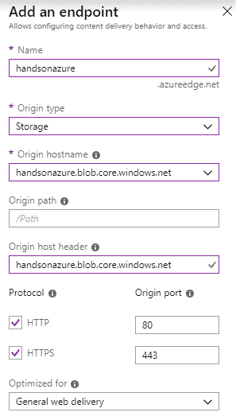

# 使用 Azure CDN 提供静态内容

托管许多静态文件，尤其是在我们开发一个非常受欢迎的应用程序时，是一项严峻的任务，它影响着我们的 Web 服务性能和整体用户体验。如果我们加载图片、文件或文档的速度过慢，客户可能会选择我们的一位竞争对手，他们提供类似的功能，但表现更好。得益于像 Azure **内容交付网络**（**CDN**）这样的云服务，我们能够快速处理大带宽的内容，这是因为它与 Azure 存储的集成，并使用 Azure 的本地组件。

本章将涵盖以下主题：

+   CDN

+   使用和配置 Azure CDN

+   使用 Azure CDN 优化静态内容的提供

+   使用 Azure CDN 开发应用程序

# 技术要求

要完成本章的练习，您将需要以下内容：

+   一个 Azure 订阅

+   Visual Studio 2017

# Azure CDN 基础

如果您托管的是一个包含许多静态文件的热门网站，您可能会想知道如何优化这些文件的提供给用户。当寻找解决方案时，您必须考虑许多不同的因素；如 HTTP 协议规范、浏览器能力、服务器性能、网络延迟等。整个问题远非简单，并且需要大量资源才能以正确的方式实现。为了解决这些困难，CDN 的概念应运而生。CDN 代表内容分发网络，概括了一个复杂服务的概念，该服务负责将内容提供给所有浏览您网站的用户。在本章中，您将学习 Azure CDN，这是一个 Azure 组件，旨在为所有列举的问题提供快速且可靠的解决方案。

# 使用 CDN

当用户访问您的网站时，必须获取为特定页面提供的所有静态内容。这意味着以下操作：

+   浏览器必须请求网页所需的所有图片、文件和脚本

+   请求必须排队，因为浏览器对单个域的请求次数是有限制的

+   在大多数情况下，页面必须逐步呈现，因为内容是从服务器获取的

+   如果服务器当前负载过重，它可以限制请求

+   浏览器必须遵循所有已实现的缓存机制，当然，前提是您的网站告诉它如何执行

我们可以将整个过程描述如下：

在前面的场景中，**用户**的每个请求直接路由到**网站**，然后与**服务器**连接以获取数据。当然，我们可以想象文件由不同的服务器托管的情况，如下图所示：

这种替代方案可以稍微提高性能（因为服务器将使用不同的域名进行识别），但它增加了维护和配置的复杂性。而且，如果你面临网络延迟问题，这种设置并不是正确的解决方案（因为增加一个服务器不会产生太大差异）。在我们讨论不同架构时，你可能开始想象另一种可能产生区别的设置。

作为 **网站** 和 **服务器** 之间的代理，负责适当的缓存，它可以轻松地扩展，并且具有高可用性，如下图所示：

CDN 正是我们所说的代理。它们提供以下功能：

+   如果负载超过预期，它们可以轻松地进行扩展

+   它们可以缓存请求，从而减少最终服务器的负载

+   它们尊重缓存控制头，因此可以轻松提供资源的 **生存时间** (**TTL**)

+   它们通过同时为多个用户提供内容，提高了你网站的响应能力

在本章后续，你将学习如何利用这些服务，通过使用 Azure CDN。

# 在门户中创建 Azure CDN

创建 Azure CDN 的过程与本书中其他服务的创建过程相似。首先，你需要点击 + 创建资源按钮，并搜索 `Azure CDN`。从搜索结果中选择 CDN。这将带你进入一个表单，你可以在其中输入有关新服务的所有必要信息：

这里有两点值得一提：

+   定价层：与其他 Azure 服务相比，定价层略有不同，因为你不再可以选择 Basic、Standard 和 Premium 选项。在这里，你需要决定将使用哪种 产品——你可以从包含 Verizon、Akamai 和 Microsoft 等提供商的列表中选择。它们提供不同的功能，如动态站点加速、视频流优化和资产预加载。完整的列表可以在本章的 *进一步阅读* 部分找到。

+   现在创建一个新的 CDN 端点：如果你知道你的源（一个缓存资源的端点）是什么，你可以立即为整个服务创建它。

要快速查看特定定价层中提供的内容，你可以点击 查看完整定价详情链接：

如你所见，你需要为每 GB 的出站数据传输付费，根据选择的提供商，价格可能差异近五倍。当你点击 创建按钮时，服务创建过程将开始。创建完成后，你可以访问你自己的 Azure CDN 实例：

如果你决定不与服务一起创建端点，你将看到一个与我的类似的页面， 端点 部分为空。让我们点击 **+ 端点** 按钮来实际创建一个。如前所述，端点是 CDN 的元素，它缓存数据并用于特定目的。在接下来的部分，你可以看到我为第一个端点设置的示例：

如你所见，我选择了 Storage 作为源类型。为了能够这么做，你必须在与你的 CDN 位于同一资源组中实际拥有一个 Azure Storage 实例。你还可以选择其他可用类型，如 Cloud Service、Web App 或自定义源。一旦添加了端点，你将能够通过点击 概述 选项卡上的端点来管理它。

# 优化与缓存

CDN 的核心是优化内容并进行缓存。通过这种方式，它们提升了你网站的性能和用户体验。在上一节中，你了解了内容分发网络（CDN）的概念，并配置了你的 Azure CDN* 实例。现在我们将尝试学习一些更高级的功能，例如压缩、缓存规则和优化。

# 配置端点

要访问端点配置，你必须在 概述 选项卡上点击它：

这将显示一个新页面，在该页面中你可以找到关于特定 CDN 端点的所有信息，如其主机名、可用协议以及配置的内容优化规则。事实上，该页面看起来与前一个页面非常相似——它只提供了一些附加选项：

现在我们将讨论可用于端点的不同功能。

# 压缩

CDN 的基本功能之一是压缩——它们允许你动态压缩不同类型的文件，例如降低文件大小并减少网络延迟：

启用后，你可以选择你感兴趣的 MIME 类型。如果你计划支持其他类型，也可以添加新的类型。

记住，文件必须被 CDN 缓存，才能在动态过程中进行压缩。

# 缓存规则

默认情况下，CDN 根据你提供的 Cache-Control 头部缓存内容。然而，你可以明确地定义它应该如何行为，如果：

+   缺少头部信息

+   引入了查询字符串

+   特定的匹配条件匹配

在这里，你可以找到此功能的基本设置：

如你所见，它为你提供了对服务行为的很大控制，尤其是通过自定义缓存规则。

# 地理过滤

有时，你需要为特定国家/地区屏蔽特定的内容。没有 CDN，这样的功能可能会遇到问题——你必须通过编程控制谁可以根据地理位置访问特定的图像或文件。使用 Azure CDN，你可以在几秒钟内启用该功能：

在 Geo-filtering 面板上，你可以为特定国家/地区配置不同的规则，阻止或允许访问 CDN 中的文件夹或特定文件。

# 使用 Azure CDN 开发应用程序

Azure CDN 本身并没有提供什么特殊功能——它只是缓存内容，并负责无延迟地提供它。然而，重要的是要了解如何在你的应用程序中使用它。在 Azure 中，集成 Azure CDN 和例如 Azure App Services 是小菜一碟。只需几次鼠标点击，你就可以让你的 CDN 与现有的 Web 应用程序协同工作。在本章的最后一节，你将看到配置集成所需的步骤，并能够提升你网站的性能。

# 配置 Azure App Service 与 Azure CDN

要配置 Azure App Service 使其与 Azure CDN 实例一起工作，你需要找到 Networking 面板。它让你能够启用不同的 Web 应用功能，包括 CDN：

当你点击为应用程序配置 Azure CDN 时，你将看到另一个屏幕，在那里你可以配置 Azure App Service 和 Azure CDN 之间的链接。

Azure CDN 将自动开始缓存静态文件，这些文件可以在你的网站中找到。此时发布应用程序是一个好主意，这样你就不必等到过程结束之后再发布。

事实上，你现在有两个选项可以继续：

+   使用现有的 CDN 配置文件（如果你已经完成了本章前面部分的练习，你应该已经创建并准备好使用 CDN）

+   创建一个全新的配置文件

在接下来的部分，你可以找到我的配置（我选择了一个现有的端点来加速进程）：

一旦你的端点创建完成，你可以检查它是否工作。你可以例如检查我的应用程序的资源，如我所做的那样：

为了本次练习，我使用了模板中的一个示例应用程序。如你所见，配置了 CDN 后，我的应用程序的源自动被修改——所有静态内容都通过我的 Azure CDN 端点提供，而不是我的服务器。

# 总结

在本章中，你了解了什么是 CDN，以及它们如何帮助你为 Web 应用程序实现更好的性能和用户体验。我们已经配置了 Azure CDN 实例，并看到了如何通过压缩内容来优化内容的提供。阅读完本章后，你应该能够为特定国家/地区过滤特定内容，并能够制定合适的缓存规则，从而定义你的实例将如何表现。

在本书的下一章中，这是描述 Azure 服务的最后一章，我们将介绍一个更高级的场景——使用 Azure Traffic Manager 分配负载并保护数据免受故障的影响。

# 问题

1.  使用 Azure CDN 可以解决哪些问题？

1.  Azure CDN*可用的 CDN 提供商有哪些*？

1.  CDN 的起源是什么？

1.  压缩在 Azure CDN 中是如何工作的*？*

1.  存储在 Azure CDN 中的内容的默认 TTL 是多少？

# 进一步阅读

+   CDN 功能：[`docs.microsoft.com/en-us/azure/cdn/cdn-features`](https://docs.microsoft.com/en-us/azure/cdn/cdn-features)
