# 使用 Azure 流量管理器分配负载

有时我们希望根据后端的性能来分配负载，或者在某些服务器正在维护时将用户路由到不同的服务器。如果没有一个能无缝、快速完成这项任务的服务，这可不是一件容易的事。感谢**Azure 流量管理器**，我们能够提高关键应用的可用性，在执行大型复杂部署时分配流量，或者在进行维护时避免停机。

本章将涵盖以下主题：

+   使用 Azure 流量管理器

+   不同的路由方法

+   端点监控

# 技术要求

要进行本章的练习，您需要以下内容：

+   访问 Azure 订阅

# Azure 流量管理器基础

假设以下情况——您有一个需要全球服务的应用。为了保证全球所有客户的最佳性能，您在不同的区域（一个在北美，一个在欧洲，一个在非洲）提供了不同的服务实例。然而，有一个问题。您必须明确告诉客户访问应用的特定实例——即离他们位置最近的那个实例。

虽然这当然是可行的（只需提供正确的 URL），但这个解决方案并不理想。例如，如果您的客户去度假，并在接下来的两周里呆在欧洲而不是非洲怎么办？为了克服这种问题，您可以在 Azure 中利用一个名为**Azure 流量管理器**的服务，它会处理来访请求的正确路由，并允许您在应用中实现高可用性。

# Azure 流量管理器的功能

您可以将**Azure 流量管理器**视为一个在 DNS 层级上工作的负载均衡器。为了理解这个概念，请看以下示例。默认情况下，如果没有像**Azure 流量管理器**这样的服务，您的**客户**将使用端点 URL 将请求从**客户端应用**发送到**服务器应用**：

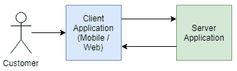

如果您想要对来访请求进行负载均衡，您必须在架构中引入另一个元素，来负责将请求路由到正确的后端（并可能确保它们是健康的）：

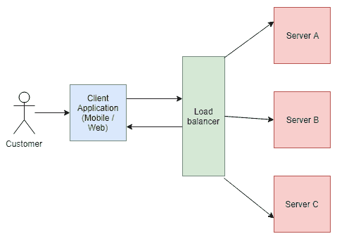

这种设置的缺点是可能会引入延迟。更重要的是，在这种情况下，您的客户直接通过**负载均衡器**连接，这并没有解决全球分配入口点的问题。

上面的示例是使用反向代理时常见的解决方案，反向代理充当您系统的网关。

上述场景定义了一种解决方案，其中负载均衡基于基于 TCP/UDP 分配流量，因此它比 DNS 层级要低得多。当使用**Azure 流量管理器**时，请求的流动方式完全不同：

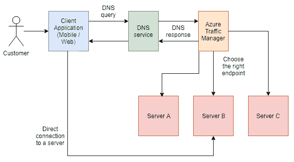

流程可以描述如下：

1.  向**DNS 服务**发送**DNS 查询**以获取服务器地址。

1.  **DNS 服务**被配置为指向**Azure 流量管理器**，而不是直接指向某个服务。

1.  **Azure 流量管理器**根据查询特征选择正确的端点，并返回一个包含正确服务器地址的**DNS 响应**。

1.  客户端接收到**DNS 响应**并使用它连接到正确的服务器。

实际上，客户端需要执行两个请求：

+   获取服务器的 URL。

+   发送实际请求

虽然这看起来可能有些开销，但实际上，这种影响是不可察觉的。

请注意，采用这种解决方案的优势在于能够直接将请求发送到服务器，而没有参与通信的中介服务。

# 在 Azure 门户中创建 Azure 流量管理器。

要在门户中开始使用 Azure 流量管理器，您需要点击+ 创建资源按钮并搜索 `traffic manager`。然后在搜索结果中选择流量管理器配置文件。您将看到一个表单，您需要在其中填写所有必填字段才能创建服务：

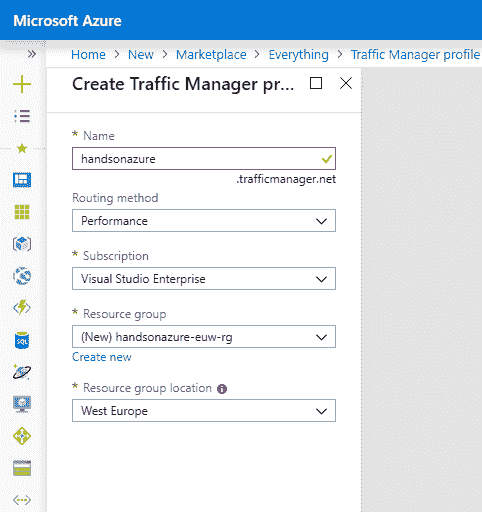

虽然大多数选项应该不言自明，但有一个下拉框需要我们特别关注，即路由方法。这里有六种不同的可用方法：

+   性能

+   权重

+   优先级

+   地理位置

+   MultiValue

+   子网

在描述每个选项之前，您需要理解**路由方法**到底是什么。之前我提到过，Azure 流量管理器决定将用户路由到哪个端点。这个路由操作可能会根据选择的方法给出不同的结果。让我们考虑以下场景：

+   您的应用程序实例在全球分布，您希望将用户路由到离其最近的实例。

+   您的应用程序实例提供不同的性能，您希望将用户路由到提供最佳用户体验的实例。

+   您有一个处理所有流量的主要区域，并希望在发生故障或临时问题时将用户路由到次要区域。

+   您希望均匀分配流量，或者按照设定的权重分配流量。

+   您希望将用户的 IP 地址映射到特定实例。

根据选择的场景，应该选择不同的**路由方法**。接下来我将详细描述它们。

# 路由方法 – 性能

当使用性能路由方法时，用户将被路由到“最接近”的端点。需要记住的是，这个“最接近”的端点可能不是地理上最接近的，因为此方法考虑的是性能而非距离。假设内部的 Azure 流量管理器存储了关于配置的端点以下信息：

| **端点** | **区域** | **延迟** |
| --- | --- | --- |
| 服务器 A | 西欧 | **12 毫秒** |
| 服务器 B | 东部美国 2 | 67 毫秒 |

在前面的场景中，表现更好的端点是 **服务器 A**。当选择性能路由方法时，用户将被路由到该服务器。

需要记住的是，在性能路由方法下，Azure 流量管理器会检查响应的延迟，并考虑发送请求的 DNS 服务器的 IP 地址，而不是客户端的 IP 地址。

# 路由方法 - 权重

当你想要均匀分配流量或基于预定义权重分配流量时，权重路由方法是你要寻找的解决方案。使用该方法时，你需要定义权重，在决定请求应该路由到哪里时，这些权重将被考虑在内。让我们来看一下以下表格：

| **端点** | **权重** | **状态** |
| --- | --- | --- |
| 服务器 A | 100 | **在线** |
| 服务器 B | 100 | 降级 |
| 服务器 A - staging | 5 | **在线** |

在前面的例子中，我们有三个端点，其中一个报告了问题。尽管 **服务器 A** 和 **服务器 B** 的权重相同，但由于服务器 B 的状态报告为降级，它将不会被视为健康的端点，因此用户将不会被路由到它。剩下的两个服务器有不同的权重。在这种情况下，Azure 流量管理器将随机将用户分配到一个端点，其概率由该端点的权重决定。如果我们假设有 105 个请求，其中 100 个会被路由到 **服务器 A**，其余的路由到 **服务器 A – staging**。

权重路由方法是进行 A/B 测试的绝佳选择，你可以随机将用户路由到包含新特性的应用程序新实例。如果用户喜欢新特性，你可以调整权重并将其余流量路由到该实例。

# 路由方法 - 优先级

优先级路由方法是最简单的方法，适用于一个简单的场景，其中你有一个主区域托管你的应用程序，并且你希望确保在出现问题时可以轻松地切换到次要区域。让我们考虑以下场景：

| **服务器** | **优先级** | **状态** |
| --- | --- | --- |
| 服务器 A | 1 | **在线** |
| 服务器 A - 辅助 | 2 | 在线 |

在前面的例子中，所有流量将被路由到服务器 A，原因如下：

+   它的优先级设置为`1`

+   它的状态被认为是在线的

现在发生了一些事情，主副本宕机了：

| **服务器** | **优先级** | **状态** |
| --- | --- | --- |
| 服务器 A | 1 | 降级 |
| 服务器 A - 次要 | 2 | **在线** |

由于服务器 A 被认为不健康，所有流量将被路由到辅助实例，直到主实例恢复正常。

请记住，客户端可能会缓存 DNS 响应，这会延长你的端点对它们不可用的时间。

# 路由方法 - 地理位置

有时候你需要将用户路由到特定区域，考虑到它的位置。这样做有多个原因，例如：

+   法律要求

+   内容本地化

+   从最接近的服务器提供应用程序，考虑到距离因素

请记住，最靠近用户的区域可能并不是网络延迟最小的区域。不要过度使用此路由方法来实现最佳的用户体验。

使用地理路由方法时，你将区域分配给已配置的端点：

| **服务器** | **区域** |
| --- | --- |
| 服务器 A | 法国 |
| 服务器 B | 亚洲 |
| 服务器 C | 全球 |

现在，为了将用户路由到正确的服务器，Azure 流量管理器尝试通过读取源 DNS 服务器的 IP 地址来确定其位置。它从州/省（如果不支持，则为国家/地区）开始，最终确定在全球值上。

使用地理路由方法时，Azure 流量管理器会返回一个端点，不论其是否健康。利用嵌套配置文件来扩展路由方法并实现高可用性是非常重要的。

# 路由方法 – 多值

多值路由方法与其他路由方法略有不同，因为它允许返回多个健康的端点，并让客户端选择使用哪个端点。这种场景适用于当你不知道如何将用户路由到服务端，但同时你希望确保用户被路由到健康端点的情况。

为确保该路由方法能够返回端点，必须将其设置为“外部”并分配 IPv4 或 IPv6 地址。

# 路由方法 – 子网

最后一种路由方法是最复杂的，因为它允许你将特定的 IP 地址（或一系列 IP 地址）映射到特定的端点。

该方法的使用案例可能有所不同，例如：

+   你想要阻止使用特定 ISP 的用户

+   你希望将来自公司网络的用户路由到应用程序的内部实例

+   你已经为应用程序设置了品牌，并希望将来自不同公司网络的用户路由到特定的品牌实例

使用子网路由方法时，确保覆盖所有可能的 IP 地址，因为如果未能做到这一点，将会返回 `NODATA` 响应，导致客户端返回错误。

一旦你对选择的路由方法满意，可以点击“创建”按钮，在 Azure 中创建资源。

# 在 Azure 门户中使用 Azure 流量管理器

当你访问你的 Azure 流量管理器实例时，你会看到一个包含服务概览的默认屏幕：

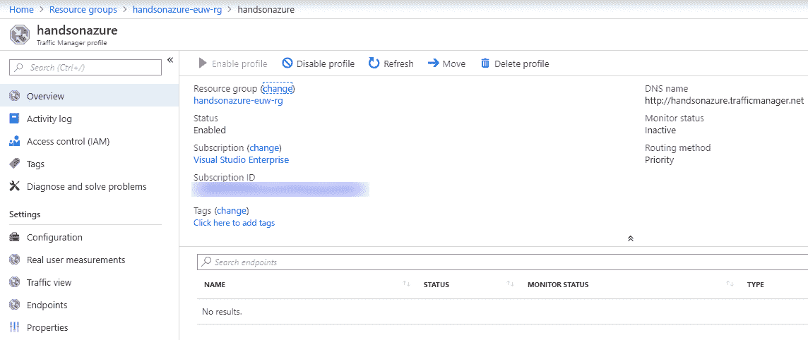

由于当前没有端点附加到这个特定配置文件，显示的端点列表为空。在添加新端点之前，我们先简单了解一下其他服务功能。

# 配置

当你访问配置面板时，你将看到 Azure 流量管理器实例的完整配置：

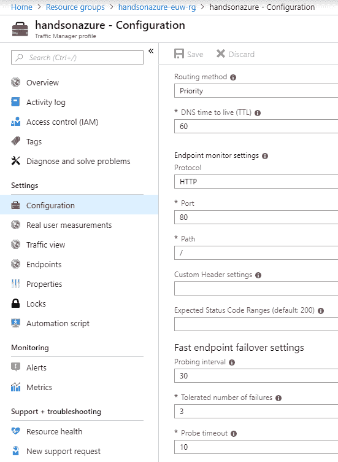

它包含诸如路由方法（默认显示您在创建服务时选择的那个）、端点监控设置和快速端点故障转移设置等内容。从此屏幕，您基本上可以控制 Azure Traffic Manager 的行为。例如，假设您的每个端点都有一个自定义的`/status`端点，专为与服务配合使用而设计。默认情况下，Azure Traffic Manager 检查默认端点 URL（在此设置为`/`），因此您需要更改路径字段，如下所示：

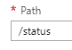

对于期望的状态码也是如此。如果您的端点可以返回一系列 HTTP 状态码，并且每一个都应该被视为成功，您可以在“期望状态码范围”字段中输入该范围：

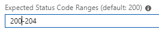

您可以在此尝试不同的设置，以便它们能够反映您需要覆盖的实际场景。

# 真实用户测量

使用性能路由方法时，Azure Traffic Manager 会检查 DNS 请求的来源，并将结果转换为一个内部表格，反映不同终端用户网络的网络延迟。虽然此选项适用于大多数用例，但有时您可能希望能够告诉 Azure Traffic Manager 实际的延迟。通过“真实用户测量”功能，您可以将 JavaScript 代码注入到客户端端点，直接将延迟信息发送到此 Azure 服务。

为此，请转到“真实用户测量”选项卡，并点击**生成密钥**按钮：

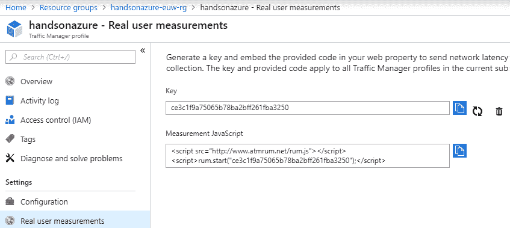

您将看到两个字段：

+   密钥：存储生成的密钥

+   测量 JavaScript：保存应注入到客户端应用程序中的脚本。

一旦使用生成的脚本，它将开始向您的 Azure Traffic Manager 实例发送有关延迟和客户端网络的附加信息，从而提高服务做出决策的准确性。

准确性改进不是即时的——Azure Traffic Manager 需要从不同网络收集大量数据，以提高性能。

# 端点

Azure Traffic Manager 的主要功能是配置它所处理的端点。您可以通过 Endpoints 选项卡访问它：

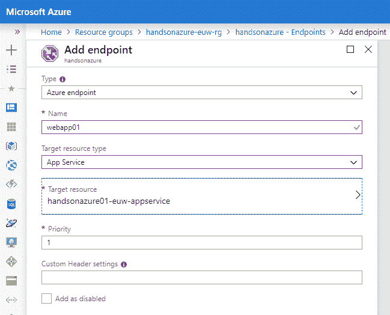

要添加一个端点，您必须输入以下值：

+   **类型**：您可以选择 Azure 端点、外部端点和嵌套端点三种类型。不同的选择会影响整个表单——选择 Azure 端点时，您可以选择一个 Azure 服务；选择外部端点时，您需要提供一个完全合格的域名或 IP 地址；而选择嵌套端点时，您可以指向另一个 Traffic Manager 配置文件。

+   **名称**：端点的唯一名称。

+   **目标资源类型/FQDN 或 IP/目标资源**：根据 Type 值，您需要选择不同的值来配置端点。

+   **Priority**：因为我的路由方法是 Priority，我必须为这个特定的终端输入正确的值。如果选择了其他方法，您可能会在此处看到其他字段。

在以下示例中，我选择了一个 Azure 端点，并将配置指向我的一个 Azure 应用服务。我执行了两次操作，并向我的应用程序的两个实例添加了两个不同的端点：

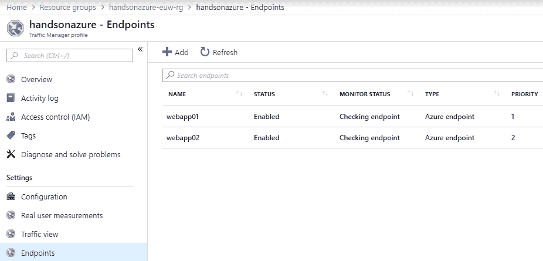

记住，您不能将指向同一区域的服务域添加到单一的 Azure Traffic Manager 配置文件中。

如您所见，在添加终端后，它们的状态显示为“检查终端”。这意味着 Azure Traffic Manager 正在尝试收集关于它们健康状况的信息。如果有问题，您会看到“降级”状态：

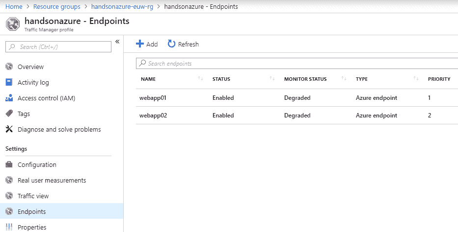

就我而言，问题是由于配置无效导致的，因为我将 Configurationblade 中的**Path**字段设置为`/status`，结果发现这是一个无效值（在我的应用中，我将该端点实现为`/api/status`）。在主服务中修正配置后，其状态显示为在线：

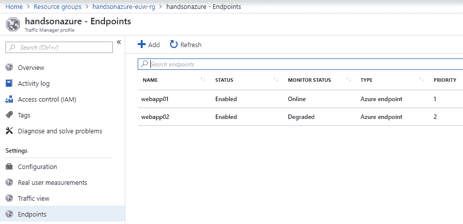

最后需要配置的是在 DNS 服务器上设置 DNS 记录，指向您的 Azure Traffic Manager 实例（通过使用可以在 Overview blade 上找到的 DNS 名称）。

# 监控

除了将流量路由到不同的终端，Azure Traffic Manager 还提供了一些额外的监控功能。除了传统的 Metrics blade 外，还有一个额外的功能叫做流量视图，它使您能够进行监控。此外，您可以使用许多不同的内建机制（如 Windows 操作系统中的`nslookup`），来检查服务的当前配置。

# Nslookup

要使用 `nslookup`，您必须使用管理员帐户在 Windows 中运行命令行。加载完成后，输入以下命令：

```
nslookup <Traffic-Manager-DNS-name>
```

稍等片刻，它应该返回一个结果，显示命令解析：

```
DNS request timed out.
 timeout was 2 seconds.
DNS request timed out.
 timeout was 2 seconds.
Non-authoritative answer:
Name: waws-prod-db3-119.cloudapp.net
Address: 40.85.74.227
Aliases: handsonazure.trafficmanager.net
 handsonazure02-eun-appservice.azurewebsites.net
 waws-prod-db3-119.sip.azurewebsites.windows.net
```

如您所见，它指向我的应用程序的第二个实例（`handsonazure02`，托管在北欧区域）。我得到这个响应的原因是，主端点被认为已经降级。一旦它重新上线，我再次运行了命令，得到了一个截然不同的响应：

```
Name: waws-prod-am2-229.cloudapp.net
Address: 104.40.250.100
Aliases: handsonazure.trafficmanager.net
 handsonazure01-euw-appservice.azurewebsites.net
 waws-prod-am2-229.sip.azurewebsites.windows.net
```

现在它返回了主服务器（如预期，使用的是 Priority 路由方法）。

记住，您必须等待固定时间，才能使所有 DNS 更改传播。这个时间值可以在 Configurationblade 中配置，方法是修改 DNS 生存时间字段（DNS time to live）。

# 流量视图

流量视图是一个附加的监控功能，允许您查看所选路由方法在 DNS 层面的具体工作情况。它提供了额外的有用信息，例如：

+   实际延迟级别

+   流量量级

+   用户位置

记住，此功能最多需要 24 小时才能传播并收集所有必要的信息。

默认情况下，该功能的屏幕如下所示：

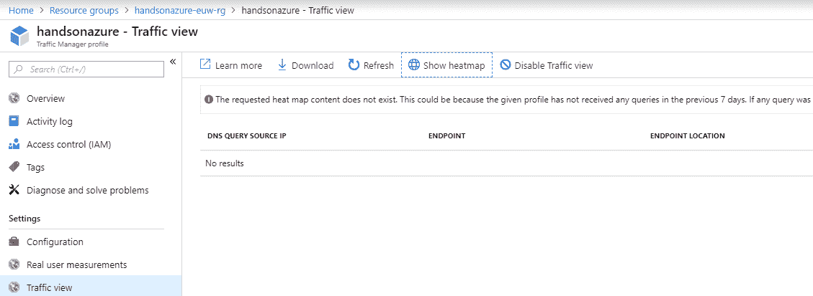

一旦收集到信息，你可以利用图形化的数据展示，更好地理解所选路由方法的行为（并可能加以改进）。

# 总结

这是本书的最后一章，介绍了 Azure 服务之一——Azure Traffic Manager 的基础知识。你已经学习了流量分配的基本概念和多种路由方法，这些方法涵盖了许多实际的使用案例，可能会在你的日常工作中遇到。现在你应该理解这个特定的 Azure 服务是如何工作的，以及如何通过正确使用其功能（如配置、真实用户测量和监控）来实现预期目标。在下一章（也是最后一章）中，我将为你展示一些在 Azure 门户和不同云组件上工作的实用技巧，进一步提升你的技能。

# 问题

1.  Azure Traffic Manager 支持哪些路由方法？

1.  如何使用真实用户测量功能？

1.  你可以链接不同的 Azure Traffic Manager 配置文件吗？

1.  是否可以使用外部终端节点？

1.  客户端是否直接连接到 Azure Traffic Manager 返回的终端节点？

1.  网关和 Azure Traffic Manager 之间的主要区别是什么？

1.  Azure Traffic Manager 可以用来实现高可用性吗？如果可以，如何实现？

# 进一步阅读

+   使用 Azure DNS 和 Traffic Manager 进行灾难恢复：[`docs.microsoft.com/en-us/azure/networking/disaster-recovery-dns-traffic-manager`](https://docs.microsoft.com/en-us/azure/networking/disaster-recovery-dns-traffic-manager)

+   它是如何工作的：[`docs.microsoft.com/en-us/azure/traffic-manager/traffic-manager-how-it-works`](https://docs.microsoft.com/en-us/azure/traffic-manager/traffic-manager-how-it-works)
