# 第二十一章：Azure 提示和技巧

做事总有不止一种方式。这句话在 Azure 生态系统中尤为真实，我们在配置资源、管理服务和开发应用程序时，提供了多种工具和快捷方式。本章将向读者展示如何进一步提高生产力，并缩短交付可用解决方案所需的时间。

本章将涵盖以下主题：

+   Cloud Shell 和 Azure CLI

+   锁定资源

+   正确的命名规范

+   Azure 中的资源

# 技术要求

为了进行本章的练习，你将需要以下内容：

+   Azure 订阅

+   Azure CLI，访问 [`docs.microsoft.com/en-us/cli/azure/install-azure-cli?view=azure-cli-latest`](https://docs.microsoft.com/en-us/cli/azure/install-azure-cli?view=azure-cli-latest)

# Azure CLI 和 Cloud Shell

使用 Azure 门户执行所有操作，如配置资源、修改配置或查找特定值，确实是管理订阅和已部署服务的最简单方式之一。然而，当你有数十个或数百个不同的订阅、资源组和实例时，这可能会变得繁琐。在这种情况下，能够访问脚本和命令来加速操作并实现自动化（如果需要）是更好的选择。在本节中，我们将介绍 Azure 提供的两种基本工具：Azure CLI 和 Cloud Shell，当仅使用门户不足以满足需求时，你可以使用这两种工具。

# Azure CLI

Azure CLI 是一款跨平台的命令行工具，你可以将其安装在本地以管理 Azure 资源。通常，命令的格式如下：

```
$ az [resource] [command] -param1 "Foo" -param2 123
```

例如，你可以使用 Azure CLI 创建一个函数应用，如下所示：

```
$ az functionapp create --name "handsonazureapp" --storage-account "handsonazurestorage" --consumption-plan-location "westeurope" --resource-group "myResourceGroup"
```

安装 Azure CLI 的说明可以在*技术要求*部分找到。该部分指向一篇文章，描述了多个不同平台的安装过程，例如 Windows、macOS 和 Linux。安装完 Azure CLI 后，打开命令行终端并输入以下命令：

```
$ az login
```

片刻后，你应该会看到类似于我的结果，系统会要求你在本地验证 Azure CLI：

```
$ az login
To sign in, use a web browser to open the page https://microsoft.com/devicelogin and enter the code DRXXXXXXX to authenticate.
```

要验证工具，请访问显示的网页并输入显示的代码。如果一切正确，命令将成功结束，结果会显示与你的帐户关联的所有订阅信息。使用 Azure CLI 时，你不需要记住所有命令——你可以使用以下命令来查找相关命令：

```
$ az find -q "query"
```

假设你现在想要使用 Azure Functions。要查询与该服务相关的所有命令，我可以使用以下查询：

```
$ az find -q function
`az functionapp create`
 Create a function app.
 The function app's name must be able to produce a unique FQDN as
 AppName.azurewebsites.net.

`az functionapp list`
 List function apps.

`az functionapp delete`
 Delete a function app.

`az functionapp stop`
 Stop a function app.

`az functionapp start`
 Start a function app.

`az functionapp restart`
 Restart a function app.

`az functionapp update`
 Update a function app.

`az functionapp`
 Manage function apps.

`az functionapp config`
 Configure a function app.

`az functionapp show`
 Get the details of a function app.
```

如你所见，这非常简单——你可以快速部署新资源，而无需触碰 Azure 门户。在这里，你可以找到创建函数应用的完整示例说明：

```
$ az storage account create --sku Standard_LRS --kind Storage --resource-group handsonazure-euw-rg --name handsonazurestorage
$ az functionapp create --name handsonazure-euw-functionapp --storage-account handsonazurestorage --resource-group handsonazure-euw-rg --consumption-plan-location westeurope
```

在上面的示例中，我跳过了创建资源组的过程。如果你想创建一个新的资源组，只需使用`az group create`命令。

# Cloud Shell

使用 Azure CLI 的替代方法是一个名为 Cloud Shell 的工具。你可以通过点击 Azure 门户中的 Cloud Shell 按钮直接访问它：

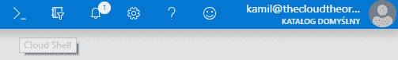

当你打开 Cloud Shell 时，门户底部将显示一个欢迎屏幕，询问你选择感兴趣的 shell：

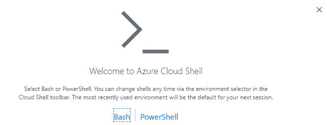

选择并不重要，因为你可以随时更改所选选项。由于我个人更喜欢 PowerShell 而非 Bash，因此我的默认选项是前者。

Bash 和 PowerShell 脚本在功能上是对等的。你应该选择一个你更喜欢使用的 shell。

如果这是你第一次使用 Cloud Shell，你还需要挂载一个存储账户，该账户可以与此功能一起使用。Cloud Shell 用它在会话之间保持文件。这里有两个选择；你可以让它为你创建一个存储账户，或者点击“显示高级设置”按钮选择特定选项：

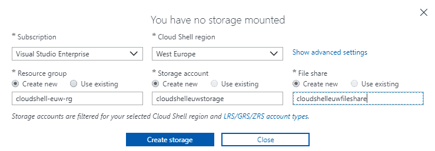

一旦一切配置正确，Azure 将尝试初始化你的 Cloud Shell 账户：

```
Your cloud drive has been created in:

Subscription Id: <subscription-id>
Resource group: cloudshell-euw-rg
Storage account: cloudshelleuwstorage
File share: cloudshelleuwfileshare

Initializing your account for Cloud Shell...\
Requesting a Cloud Shell.Succeeded.
Connecting terminal...

Welcome to Azure Cloud Shell

Type "dir" to see your Azure resources
Type "help" to learn about Cloud Shell

MOTD: Switch to PowerShell from Bash: pwsh

VERBOSE: Authenticating to Azure ...
VERBOSE: Building your Azure drive ...
Azure:/
PS Azure:\>
```

使用 Cloud Shell 类似于浏览文件系统。你的 Azure 资源以目录的形式呈现，可以通过常见的命令行命令如`dir`或`cd`访问。你可以通过输入以下命令选择你希望使用的订阅：

```
PS Azure:\> cd <subscription-name>
```

然后，你可以通过以下命令轻松浏览其中的所有资源：

```
PS Azure:\> cd AllResources
PS Azure:\> dir
```

请注意，你可以通过 Cloud Shell 访问的资源是有限制的——目前你可以使用它操作以下服务：

+   资源组

+   Web 应用

+   存储账户

+   虚拟机

例如，要获取 Azure Files 的连接字符串，你可以使用类似这样的命令：

```
PS Azure:\> cd StorageAccounts\<storage-account-name>\files
PS Azure:\> dir
```

当然，在 Cloud Shell 中，你可以同时使用 Azure PowerShell 命令和 Azure CLI。如果你在命令行中输入`az`命令，你将看到以下结果：

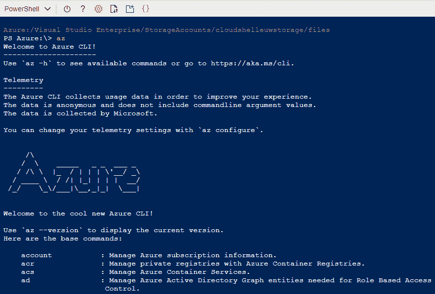

基本上，你在上一节中学到的所有内容都可以在这里应用。这是一个很棒的工具，一旦你习惯使用命令代替浏览 Azure 门户，它将大大提高你的工作效率。

# 锁

当利用可用的各种命令时，创建和管理 Azure 资源变得更加简单，这些命令可以让您工作更快，同时还能够自动化流程。然而，当您部署数百个资源时，可能会出现错误 —— 您可能会意外移动、重命名甚至删除不应该被触碰的资源。为了防止这种情况发生，可以使用锁定功能 —— 一种简单的功能，可以阻止您执行禁止的操作。在本节中，您将学习如何创建它们，并根据自己的需求使用它们。

# 创建和管理锁定

锁定几乎所有资源在门户上是可用的。您只需点击**锁定**选项卡即可访问它们：

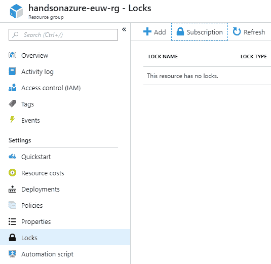

在上述示例中，假设我想要保护我的资源组并禁止删除它。为此，我必须单击“+ 添加”按钮和相应的锁定类型：

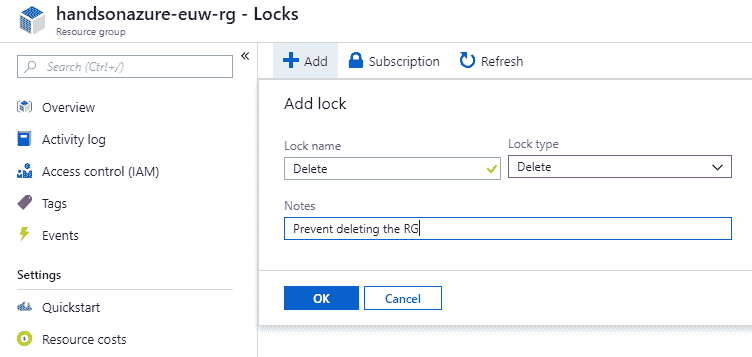

现在，如果我尝试删除一个资源组，我将收到以下错误：

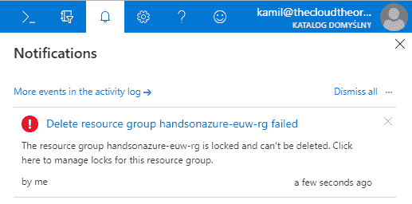

正如您可能注意到的，有两种类型的锁定；删除和只读。

只读锁定会阻止我对资源进行更改 —— 对于资源组来说，例如，我无法添加新服务：

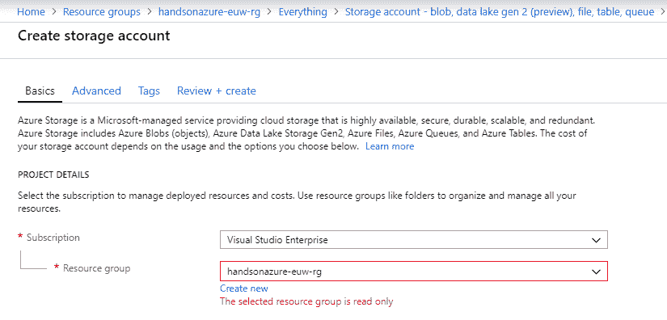

当然，只读锁定对不同的资源起作用方式不同。如果我向我的 Azure 存储帐户引入一个只读锁定，它将阻止我对服务配置进行任何更改：

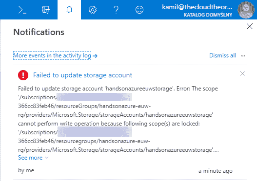

锁定也是 Azure 资源，这意味着您可以通过 Azure Powershell 命令（例如`Get-AzureRmResourceLock`）或 ARM 模板来管理它们。

# 命名约定

如果您不引入简单、直观且易于遵循的命名约定，那么在 Azure 中治理和管理资源可能会变得具有挑战性。在软件开发领域，服务的适当命名尤其困难，因为您必须考虑不同的区域、环境和实例。在本节中，我们将尝试探讨命名约定的不同概念，您可以根据需要应用或调整。

# 查找最佳命名约定

在 Azure 中，您必须考虑资源的以下方面：

+   部署资源的区域

+   资源类型

+   资源名称

+   资源实例类型/环境

我们将从资源组开始。默认情况下，您可以按以下方式命名它：

```
MyNewService
newPortal
oldplatform
```

一个经验法则是选择一个自解释的名称。例如选择一个名为`MyNewService`的名称是可以的，但它并没有提供以下信息：

+   资源组所在的位置

+   它代表什么环境（测试/生产/暂存等等）

更重要的是，如果你例如列出你订阅中的资源，你将无法知道`MyNewService`是什么资源类型，除非选择其类型。当然，像`az group list`这样的命令会为你提供资源的完整信息，如果你只想导出资源名称，你需要额外添加一个字段。在这种情况下，值得在资源组名称中注解资源类型，格式如下：

```
MyNewServiceResourceGroup
newPortal-resourceGroup
oldplatform-rg
```

到目前为止，情况不错——资源的名称现在看起来好多了。接下来，让我们考虑添加位置：

```
MyNewResourceResourceGroupEastUS2
newPortal-westEurope-resourceGroup
oldplatform-eun-rg
```

现在情况好多了——我们立刻知道我们正在考虑什么资源类型以及它位于哪里。有了这些信息，浏览不同服务变得更加容易。最后可以添加的内容是环境：

```
MyNewResourceResourceGroupEastUS2Test
newPortal-westEurope-prod-resourceGroup
oldplatform-staging-eun-rg
```

现在信息已完整。当然，一切取决于你的个人设置，因为你可能决定将所有环境存储在一个单一的资源组中。即便如此，还是值得包含其余的数据，以便为所有已提供的资源创建一致的名称。

记住，不同的 Azure 资源在命名时有不同的限制。虽然 Azure App Services 对此可能较为宽松，Azure Storage 则不允许使用字母和数字以外的字符。

实际上，你对命名约定的要求将决定资源名称中需要包含的内容，例如：

+   是否在不同地区部署资源

+   是否使用多个环境来开发你的应用

+   是否为多个环境使用单一资源组

一般规则是使用你喜欢的，并且足够灵活的命名约定，以便几年后仍然能涵盖部署到 Azure 的服务。这里最糟糕的情况是，过一段时间不得不更改它，因为它无法反映你业务的变化。

# Azure 中的资源

Microsoft Azure 的核心就是资源——你直接或间接地管理它们，但无论如何，你接触的大多数内容都是某种形式的资源。无论它是某个特定服务（如 Azure Functions 或 Azure Traffic Manager），它的某个部分（如 Azure App Services 的应用设置），还是某个独立功能（如本章讨论的锁定功能），你都可以通过 Azure 资源管理器（通常简称为 Azure RM）来管理它们。在本章的最后部分，我们将讨论如何访问 Azure 资源的属性，以便你可以利用这些属性来调查配置并自动化流程，例如部署或监控。

# Azure 资源浏览器

访问 Azure 资源的最简单方法是使用**Azure 资源浏览器**。你可以通过访问[`resources.azure.com/`](https://resources.azure.com/)来使用它。

你的默认界面将类似于我的界面：

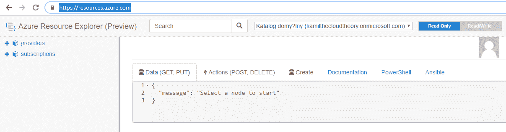

要浏览您的资源，您必须展开左侧可用的节点。最初，您可以访问两种不同的节点类型：

+   提供者：这些与特定的 Azure 服务相关，例如 Azure Cosmos DB 或 Azure Storage。

+   订阅：由于订阅本身也是一个 Azure 资源，因此您可以使用 Azure 资源浏览器来浏览它。

这两种节点类型使您能够进行不同类型的操作；提供者是特定 Azure 服务的高级表示，而订阅包含有关其中配置资源的信息。更重要的是，它使您可以直接查看资源的参数：

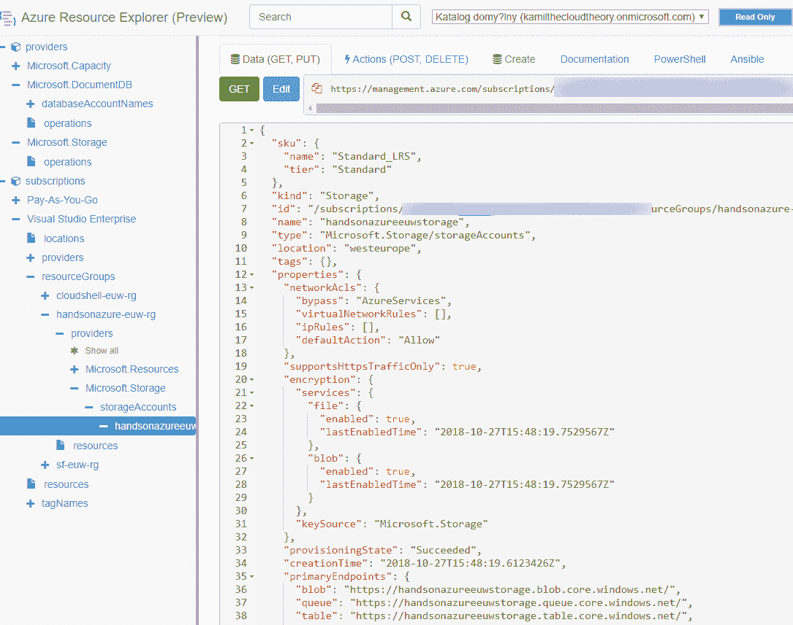

收集到的信息可以用于在 ARM 模板中输入所需的信息。您可以随时根据 Azure 资源浏览器中的可见结果进行参考。此工具还允许您直接编辑资源参数（通过点击“编辑”按钮），并生成一个 PowerShell/Ansible 脚本，该脚本可以用于管理资源。以下是为我的 Azure 存储账户生成的 PowerShell 命令示例：

```
# PowerShell equivalent script

# GET handsonazureeuwstorage
Get-AzureRmResource -ResourceGroupName handsonazure-euw-rg -ResourceType Microsoft.Storage/storageAccounts -ResourceName "handsonazureeuwstorage" -ApiVersion 2017-10-01

# SET handsonazureeuwstorage
$PropertiesObject = @{
  #Property = value;
}
Set-AzureRmResource -PropertyObject $PropertiesObject -ResourceGroupName handsonazure-euw-rg -ResourceType Microsoft.Storage/storageAccounts -ResourceName "handsonazureeuwstorage" -ApiVersion 2017-10-01 -Force

# DELETE handsonazureeuwstorage
Remove-AzureRmResource -ResourceGroupName handsonazure-euw-rg -ResourceType Microsoft.Storage/storageAccounts -ResourceName "handsonazureeuwstorage" -ApiVersion 2017-10-01 -Force

# Action ListAccountSas
$ParametersObject = @{
  signedServices = "(String)"
  signedResourceTypes = "(String)"
  signedPermission = "(String)"
  signedIp = "(String)"
  signedProtocol = "(String)"
  signedStart = "(String)"
  signedExpiry = "(String)"
  keyToSign = "(String)"
}

Invoke-AzureRmResourceAction -ResourceGroupName handsonazure-euw-rg -ResourceType Microsoft.Storage/storageAccounts -ResourceName handsonazureeuwstorage -Action ListAccountSas -Parameters $ParametersObject -ApiVersion 2017-10-01 -Force

# Action ListServiceSas
$ParametersObject = @{
  canonicalizedResource = "(String)"
  signedResource = "(String)"
  signedPermission = "(String)"
  signedIp = "(String)"
  signedProtocol = "(String)"
  signedStart = "(String)"
  signedExpiry = "(String)"
  signedIdentifier = "(String)"
  startPk = "(String)"
  endPk = "(String)"
  startRk = "(String)"
  endRk = "(String)"
  keyToSign = "(String)"
  rscc = "(String)"
  rscd = "(String)"
  rsce = "(String)"
  rscl = "(String)"
  rsct = "(String)"
}

Invoke-AzureRmResourceAction -ResourceGroupName handsonazure-euw-rg -ResourceType Microsoft.Storage/storageAccounts -ResourceName handsonazureeuwstorage -Action ListServiceSas -Parameters $ParametersObject -ApiVersion 2017-10-01 -Force

# Action listKeys
Invoke-AzureRmResourceAction -ResourceGroupName handsonazure-euw-rg -ResourceType Microsoft.Storage/storageAccounts -ResourceName handsonazureeuwstorage -Action listKeys -ApiVersion 2017-10-01 -Force

# Action regenerateKey
$ParametersObject = @{
  keyName = "(String)"
}

Invoke-AzureRmResourceAction -ResourceGroupName handsonazure-euw-rg -ResourceType Microsoft.Storage/storageAccounts -ResourceName handsonazureeuwstorage -Action regenerateKey -Parameters $ParametersObject -ApiVersion 2017-10-01 -Force
```

正如您所见，您无需自己编写这样的脚本，您可以直接使用 Azure 资源管理器，复制它们，并根据需要进行调整。

# 总结

在本书的最后一章中，我们讨论了与特定服务无关的主题，而是扩展了您当前的知识，并使您成为 Microsoft Azure 平台上更好的用户、开发人员和架构师。您已经学会了如何使用 Azure CLI 和 Cloud Shell 来简化管理操作，如何利用锁来保护所有脆弱的资源，以及如何读取 Azure 服务配置。我们还讨论了采用适当命名约定的好处以及它们如何影响您在 Azure 上部署的应用程序。这是一次激动人心的 Azure 云之旅，您发现了来自该平台的许多不同 PaaS 服务。Azure 是一个极好的生态系统，允许您构建小型网页和复杂的企业级平台。而且，它也非常动态——这就是为什么我强烈建议您查看本书中详细列出的*进一步阅读*部分，以便您能获得更多经验，熟悉更高级的概念。这里重要的一点是，您要不断更新自己的知识，无论是通过阅读博客、参加聚会或会议，还是阅读文章和书籍。由于云计算是近年来软件开发中的一个主要话题，熟悉它并建立自己的技能集是至关重要的，这将帮助您在日常工作中得心应手。

# 问题

1.  在 Azure 中，资源的两种不同锁类型是什么？它们是如何工作的？

1.  您可以在 Cloud Shell 中使用 Azure CLI 吗？

1.  您可以从哪里获得有关您在 Azure 中配置资源的详细信息？

1.  合适的命名规范能带给你哪些好处？

1.  为什么 Cloud Shell 需要配置存储账户？

# 深入阅读

+   请参考 Azure 博客：[`azure.microsoft.com/en-us/blog/`](https://azure.microsoft.com/en-us/blog/)。
