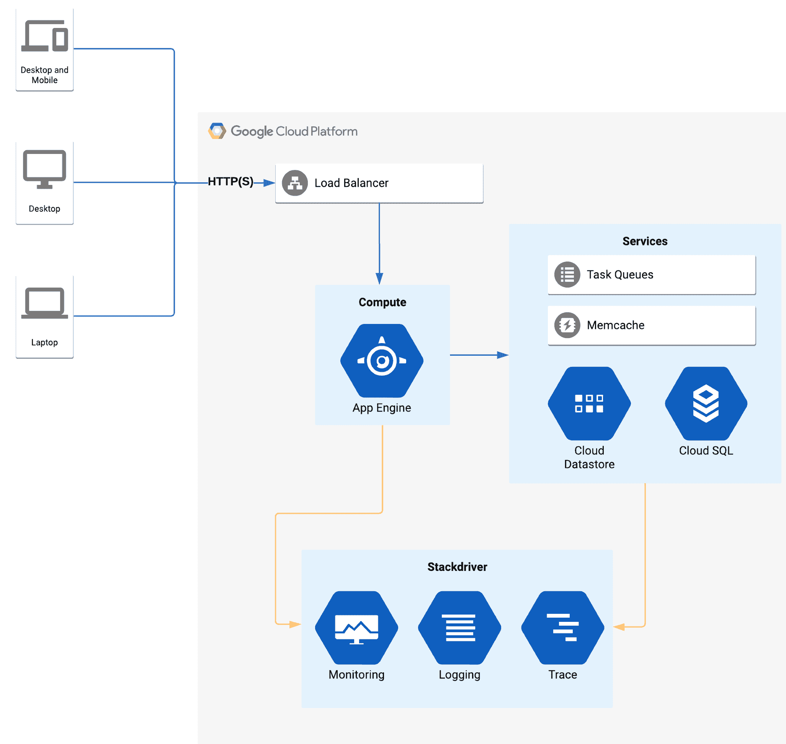

# 第一章：介绍 App Engine

在本章的第一部分，我们将讨论**Google App Engine**（**GAE**）的主要特性及其**平台即服务**（**PaaS**）方法。自 2008 年起，GAE 提供了一个无服务器环境，用于部署基于 HTTP/网页的应用程序。

在本章中，我们将探索 GAE 的框架和结构，了解如何在此平台上实现高可扩展的应用程序。作为其中的一部分，我们将考虑如何在 GAE 上集成标准的网页基本功能，如流量分配和 API 管理。到本章结束时，你应该已经掌握了使用 GAE 快速构建基于网页的应用程序的坚实基础。

简而言之，本章将涵盖以下主题：

+   介绍 GAE

+   了解 GAE 框架

+   定义 App Engine 组件

+   了解 GAE 的功能

# 介绍 GAE

在软件工程创新方面，显然 Google 拥有丰富的历史。这一创新贯穿于多个成功的项目，包括多个拥有数十亿用户的产品，如 Google 搜索、Android 和 YouTube。Google Cloud 及其充满活力的服务生态系统提供了为这些关键项目打造的工具，现在你也可以将你的应用托管在同一个平台上。

GAE 旨在托管基于网页的应用程序，并优雅地处理请求/响应通信。了解如何在 Google Cloud 上实现这一点，对于构建一致且高效的应用程序至关重要，这样可以通过其响应性让最终用户感到满意。

在深入探讨 GAE 的细节之前，我们将花一些时间讨论应用平台背后的基本原理。在接下来的段落中，我们将概述 GAE 的主要元素，为我们提供足够的知识，以便做出明智的决策，了解哪些类型的应用程序适合在 GAE 上运行，哪些则不适合。

为了开始我们的旅程，我们将通过回答以下问题来建立对 GAE 应用平台提供的共享理解：

+   为什么选择 App Engine 的无服务器架构？

+   App Engine 的底层框架是什么？

+   App Engine 如何处理自动扩展？

+   目标受众是谁？

# 为什么选择 App Engine 的无服务器架构？

在互联网上提供服务需要仔细考虑，以最大限度减少系统被攻击的潜在风险和相关的安全隐患。所有指向 App Engine 的应用程序流量都通过**Google Front End**（**GFE**）服务进行传递，以减少访问协议遭到破坏的风险。

GFE 为所有 GAE 注册的路由 Web 流量提供 **传输层安全**（**TLS**）终止。作为保护层，GFE 能够为 Google Cloud 项目执行多个基本的安全服务。从安全角度来看，它提供了公共 DNS 名称的公共 IP 托管和 **拒绝服务**（**DoS**）保护。此外，GFE 还可以作为可扩展的反向代理供内部服务使用。

在 Google Cloud 中，常提到的一个术语是 **深度安全**。这种方法提供了多个并行的保障措施，以应对那些试图滥用你服务的恶意行为者。这些安全措施中的许多已经内置于平台中，因此开发者无需额外努力。

GAE 提供了一个完全托管的应用平台，使开发人员只需专注于构建他们的应用程序。对于计算和存储等低层次基础设施的管理问题，服务会自动处理。在这一点上，像 GAE 这样的无服务器解决方案提供了将焦点集中在开发过程上的能力，并将运营事务交给服务提供商处理。

GAE 使开发人员能够利用一个简化的无服务器环境，在 Google Cloud 上托管 Web 应用程序和 API 服务。通过提供一个显著简化的环境，目的是通过吸引更多开发人员进入云端来增加云平台的采用率。在大多数情况下，当开发人员使用这样的系统时，他们可以立即看到在这样的环境中工作所能带来的高效潜力。

在下面的示意图中，我们概述了基于 GAE 的环境的典型工作流程的逻辑视图。从图示中我们可以看到，所有外部通信都使用 HTTP(S) 协议进行，并通过 **Cloud Load Balancer**（由 GFE 提供）进行路由。在这种场景下，前端设备暴露一个单一的服务名称，封装了部署的应用资源。该服务使得 GAE 可以动态地将接收到的流量引导到多个后端资源组件。GAE 负责确定这些组件执行的角色，并确保每个组件在标识上保持独立：

后端服务通信使用 HTTP/HTTPS 协议，这意味着 GAE 假设一个基于互联网的环境（即，假设你可以访问一个面向公众的互联网连接）。应用请求处理由部署的默认实例执行，该实例会根据系统工作负载阈值进行自动扩展。

采取上述方法能够使工作负载在应用实例之间无缝地进行负载均衡，同样无需开发人员进行任何额外的配置。标准的工作负载操作活动，如 TLS 终止和 DNS 解析，也无需进一步的用户配置。这些活动的加入为开发者提供了显著的好处。由于应用工作负载受到独立实例的约束，意味着应用也能够实现巨大的规模，而无需任何实质性的工作。

除了标准保护外，GFE 的加入还提供了与安全交付协议（如 gRPC）无缝兼容的功能（[`grpc.io/blog/principles/`](https://grpc.io/blog/principles/)）。gRPC 协议使用 RPC 框架在转发服务请求时提供层隔离。此外，通信默认保持加密，以避免在进行服务间通信时被窃听或设备被攻击。

最近，行业的采用使得 gRPC 得到了更广泛的应用，且在多个服务间的兼容性得到了更广泛的拓展。例如，RPC 安全协议在 Google 被广泛使用，用于保护 API 访问。在跨互联网使用通信协议时，有许多标准存在。通过将所有与服务相关的流量路由通过 GFE，意味着可以提供一个极其灵活和可扩展的前端，而无需额外的工作。

App Engine 有两个版本：

+   App Engine Standard

+   App Engine Flex

两个版本有许多共同点，本章中大多数内容都适用于这两个版本。然而，在考虑这两种环境时，有一些关键属性需要特别指出，以下图表中将重点展示：

在上述图表中需要特别指出的一点是，App Engine Standard 可以缩放至零。然而，App Engine Flex 环境的最小缩放值为一个实例。因此，如果您的主要考虑是成本，使用 App Engine Standard。能够缩放至零相较于 App Engine Flex 环境提供了真正的优势，后者始终会有一定的成本。

GAE Standard 能够缩放至零是由于使用了沙箱环境。使用专用沙箱提供了更快的响应速度，即更快的启动时间和自动扩展响应。以秒为单位测量部署时间，也可能是考虑到不同应用增长模式所需的灵活性时的一个优势。

与标准环境不同，GAE Flex 使用 **Google Compute Engine** (**GCE**)，更具体地说是 **托管实例组** (**MIGs**)，来实现自动扩展。在这个环境中，GAE Flex 始终有一个计算实例的开销。由此产生的费用还需要考虑 GAE Flex 所需的计算资源。维持在此环境中的应用程序也意味着初始化时间更长（即冷启动），因为需要启动一个 GCE 实例以及为任何基于灵活部署的应用程序提供容器环境。

在应用环境中还存在其他差异。然而，前述特性是当开始在 GAE 上构建应用时，通常影响决策的因素。

# 目标受众是谁？

在 GAE 完全托管的无服务器应用平台上工作，消除了与构建互联网规模应用相关的许多历史性限制。使用这种新范式，开发人员可以专注于构建复杂的 Web 应用和 API，而无需了解后端服务和低级别的网络或基础设施。

构建无服务器应用程序意味着敏捷的代码可以快速部署到云端。Web 应用（例如，参见以下列表）无疑是这种解决方案的最佳应用领域：

+   Web 应用

+   移动后端

+   HTTP API

+   **业务应用程序** (**LOB**) 应用

如果这听起来是你的工作负载可以从中受益的领域，那么你就是目标受众。在一个无需关心创建或维护基础设施的环境中工作，对于大多数开发人员来说是非常理想的。GAE 正是基于这一前提构建的，并为开发人员提供了出色的开发和部署体验，无需关注底层技术。

在概述了为 App Engine 提供的不同环境后，我们可以开始探索是什么让这个产品如此迷人。

# 理解 App Engine 框架

探索 App Engine 的一般架构揭示了其底层框架已经实现了多少，旨在为 Web 应用开发提供集成的工作流。

Google 将许多内部服务捆绑在一起，以最大限度地减少开发人员将其应用程序转为云原生应用所需的努力。再加上 GAE 服务固有的自动扩展能力，服务创建者无需采取额外措施即可实现这一点。

在这个平台上创建一个 Web 应用程序可以像将代码部署到 App Engine 环境一样简单。然而，在幕后，实际发生了许多活动，以确保应用程序能够成功部署、基础设施得到配置，并且整个系统最终能够智能地扩展。接下来，我们通过下面的图示，展示了 App Engine 框架中的底层工作原理，并介绍了支持 App Engine 的可选组件：

从更广泛的视角审视 GAE，可以看出有许多高级组件被用来构建完全托管的应用平台。当然，作为一个无服务器环境，你实际上不需要了解幕后发生了什么。

对任何平台的概念性理解在开发过程中是非常有用的。无论服务如何试图将信息从你那里抽象出来，若你理解各种组件如何集成，解决技术问题就会变得无比容易。

除了标准环境外，GAE Flex 还支持自定义容器运行时环境。自定义容器部署在 GCE 上，使开发者能够构建自己的环境。通过这样做，突然间可以获得更高水平的定制化，极大地拓宽了 GAE 吸引更广泛受众的能力。容器的普及使得引入 GAE Flex 环境成为一个具有吸引力的选项，特别是在需要更多控制时。

然而，相比标准环境，使用 GAE Flex 也有一些性能和成本的影响。理解这些限制对于应用开发者至关重要，这些内容在 GAE 的规范中有明确说明。清楚了解设计考量中的各种优缺点，将帮助解决任何疑虑，并使选择最合适的环境变得更容易。有关详细的差异，请参阅本章的 *支持的运行时语言* 部分。

除了前面提到的 GAE 环境之外，还有一些其他重要的组成组件在后台工作。服务层增强了 GAE 的计算功能，并提供了存储、队列、缓存以及与 Google Cloud API 进行身份验证的通信能力。

# App Engine 组件

在接下来的几个小节中，我们将探讨与这些服务层组件相关的主要内容。

# 任务队列

通过使用额外的解耦算法来管理信息流，系统保持响应性。GAE 使用消息队列来保持 Web 流量的亚秒级响应率。长时间处理的任务会被移交给任务队列系统，以释放请求/响应周期。

在更细粒度的层面上，任务队列采用两种方法来管理与网页请求/响应周期相关的异步信息处理：

| **服务调度** | **描述** |
| --- | --- |
| 推送队列（HTTP 请求） | 调度请求。保证任务执行。用例：将短期任务排队，这些任务可以在一段时间内完成，或在涉及特定时间动作的情况下执行，类似于定时事件任务执行。 |
| 拉取队列（请求处理器） | 租赁机制。提供比调度请求更多的灵活性。为任务提供生命周期。用例：批处理，可以一次性完成，而无需逐项处理信息。 |

任务队列提供了一种与网页流量事务隔离的调度机制。在此服务中，我们将与网页请求相关的信息处理部分隔离，以最小化请求与响应之间的完成时间。添加任务队列使 HTTP 请求/响应周期能够保持高效。

# Memcache

GAE 环境的一个重要特性是包含了 memcache。Memcache 被抽象为持久化存储的外部缓冲区，以提供快速的数据访问。为应用添加一个低延迟的数据层，为重复的访问请求建立一致的机制。Memcache 提供了一个基于内存驻留（in-memory）的临时数据存储的便捷数据访问层。

为服务层定义了两个级别的 memcache 服务：

+   **共享 memcache**：这是 GAE 的默认设置。共享 memcache 提供了默认的访问模式。在大多数情况下，无需更改应用使用的缓存级别，因为默认设置已经足够满足大多数工作需求。

+   **专用 memcache**：这是一个高级设置，用于保留专用的应用内存池。

专用 memcache 服务为应用提供了更大的效率范围。作为一种快速数据检索机制，缓存用于访问临时数据，如果数据访问是应用的核心，那么探索此选项可能会非常有用。

请注意，后一种选项是付费服务，不同于默认的缓存设置。然而，这个选项可以保证为可能需要高频数据访问的应用保留更大的内存空间。

当处理一个主要以读取模式为主的应用时，对于待消费的数据，保持 memcache 和数据存储同步是有益的。读取模式可能是大多数 GAE 开发者遇到的最常见用例，对于这种场景，GAE 完全能够满足大多数应用需求。

存在更复杂的使用场景，例如需要同时进行读写同步的数据库模式。在缓存层和后端数据库之间，需要考虑如何管理缓存层和 Datastore 的集成。在与 Datastore 交互为优先事项的情况下，Cloud NDB 缓存提供了一种适用于更高级需求的配置。在这种使用场景中，进行一定的调查以优化数据管理和数据刷新将是有益的。在这种情况下，底层系统只能提供有限的优化，进一步提高效率将需要在迭代应用开发生命周期中进行额外的设计。

# 数据存储

GAE 提供了多种数据存储选项，包括无模式和关系型数据库存储。后端数据存储（如 Datastore/Firestore 或 Cloud SQL）使开发者能够在广泛的用例中提供一致的访问，并与 GAE 无缝集成。

以下表格提供了无模式和关系型数据库之间映射的高层次概述：

| **Cloud SQL（关系型）** | **Cloud Datastore（无模式）** |
| --- | --- |
| 表 | 种类 |
| 行 | 实体 |
| 列 | 属性 |
| 主键 | 键 |

App Engine 提供多种选项，赋予开发者根据应用程序的需求使用后端存储的能力。在大多数情况下，考虑如何在选定的 Datastore 中存储信息也是至关重要的。与任何开发一样，理解底层数据及其访问方式也非常关键。

# Cloud Datastore

Cloud Datastore 将是任何 GAE 开发的标准组件。与其他应用平台类似，开发初期几乎不需要理解数据库管理。作为一种托管的无模式（NoSQL）文档数据库，Datastore 在大多数情况下已经足够使用。

以下高层次要点最为关键，适用于将 Datastore 与 GAE 一起使用：

+   Datastore 是一个 NoSQL 无模式数据库。

+   App Engine API 访问。

+   设计用于自动扩展到大规模数据集（即低延迟的读取/写入）。

+   存储有关请求处理的信息。

+   所有查询均由先前构建的索引提供服务。

作为 App Engine 的核心组件，Cloud Datastore 适用于高性能、应用开发和自动扩展。一旦 Datastore 初始化完成，就可以开始使用数据。处理存储在 Cloud Datastore 中的数据非常简单，因为不需要提前将数据附加到后端。如果你来自关系型数据库背景，这种方式可能会令人不适应。

在创建数据库时，值得考虑如何为信息建立索引，以确保无论使用情况如何，访问性能始终保持良好。有许多很好的参考资料可以帮助建立适合访问数据的机制，例如如何创建基本索引和复合索引。熟悉这些内容将为你提供持续的帮助，特别是在出现问题时，例如在 GAE 上托管的应用出现性能延迟时。

必须考虑如何存储 Datastore 中的信息。如果你的 Datastore 不是应用程序的核心，创建以数据为中心的应用时，数据管理问题将不再相关。由于数据布局效率低下导致的 Datastore 性能下降，需要考虑如何设计数据表示，以便在后期节省大量重构工作。

目前，了解无模式数据库非常适合大多数 App Engine 的需求，并且 Cloud Datastore 是一种文档数据库，这为它们的使用场景提供了极大的线索。超越存储文档数据的初步条件（例如，实体和种类）时，仔细考虑合适的访问方法，将随着应用复杂性的增加而带来更多的好处。

# Cloud SQL

在使用 Cloud SQL 时，Google Cloud 当前提供两种产品，即 MySQL 和 Postgres。这两种选项都提供了与 GAE 配合使用的托管关系型数据库。需要澄清的是，*托管*在此语境下意味着服务提供商负责备份和更新的维护，而无需用户的干预。

Cloud SQL 提供了支持事务的关系模型。如果你的应用部署在 App Engine 上，且需要关系型数据库，那么可以考虑使用 Cloud SQL。处理多个数据库类型可能会令人困惑，因此，在开始开发活动之前，务必清楚选定的 Datastore 应该如何使用。一个关键优先事项是确保设计能够代表应用如何使用信息。

尝试将 Datastore 用作 **在线事务处理** (**OLTP**) 后端是一个不必要的任务。同样，尝试在没有相关模式或规范化的情况下使用无模式数据存储在 Cloud SQL 数据库中，也无法获得最佳性能。

虽然花时间定义要应用的模式规范化是至关重要的，但这一要求可能会随着时间的推移而发生变化。处理数据从来不是简单地上传内容然后忘记它，因此在应用开发生命周期中，特别要关注这一部分，以便获得最大的效益。

# 处理 App Engine 上的自动扩展

在本节中，我们将讨论 App Engine 如何处理自动扩展。在大多数情况下，GAE 会通过其分布式架构处理任何工作负载。当然，如果你有更高级的需求，那么了解 GAE 如何执行实例自动扩展是值得的。

在 GAE 中，实例扩展的定义包含在配置文件中。以下两个配置项尤其相关，并在此进行了概述（即扩展类型和实例类别）：

| **扩展类型** | **实例类别** | **描述** |
| --- | --- | --- |
| 手动 | 固定 | 提供多个预配置的实例。修改实例数量需要系统管理员的手动干预。 |
| 自动扩展 | 动态 | 根据从系统收集的遥测数据（例如响应延迟和请求率），自动扩展决定是否增加/减少实例数量。 |

在考虑自动扩展服务时，必须考虑如何设计应用程序以充分利用各组成部分。以下是构建可扩展解决方案时需要考虑的一些因素：

+   负载测试对于建立应用程序的最佳性能设计至关重要。在大多数情况下，使用真实世界的流量进行测试提供了检测系统瓶颈的最佳场景。

+   Google Cloud 对所有项目实施配额限制，因此在创建应用程序时要注意这一点。配额限制适用于 API 调用和计算资源。

+   在大多数情况下，一个任务队列就足够了。然而，GAE 确实提供了在长时间运行的任务需要更高处理吞吐量时对任务队列进行分片的功能。

在下一部分，我们将从 App Engine 的整体架构转向讨论实现的具体细节。在这部分讨论中，将概述支持的语言。

# 定义 App Engine 组件

本节的目的是描述 GAE 的详细信息。GAE 应用平台的性质是提供一个无服务器的应用环境，能够支持多种语言的运行时。运行时支持要求存在两个版本的 App Engine。两个环境之间的关键区别与所支持的语言运行时相关。

# 支持的运行时语言

历史上，GAE 运行时仅支持有限数量的语言，但随着时间的推移，已扩展到提供更广泛的语言支持。语言限制曾是 GAE 初版发布时最常见的批评之一。这一情况在过去几年中有了显著改善，现在支持更多的运行时环境，包括以下内容：

+   Python 2.7/3.7

+   Java, Node.js 8/10

+   PHP 5.5/7.2

+   Go 1.9/1.11/1.12

# App Engine – 标准

在此环境中，沙盒包装提供了应用程序隔离并限制对特定外部资源的访问。根据选择的运行时，安全措施强制执行沙盒环境，例如应用访问控制列表，以及替换语言库。

在下图中，GAE Standard 使用沙盒环境，支持在单一可用区内运行 0-N 实例：

当使用需要运行时语言的应用程序时，如 Python、Java、Node.js 或 Go，GAE Standard 是最佳选择。GAE Standard 在沙盒环境中运行，确保实例可以缩减至零。缩减到零意味着在这种情况下的成本非常低。

# App Engine – 灵活环境

在 GAE Flex 环境中，容器驻留在 GCE 实例上。虽然在某些方面，这与 GAE Standard 提供了相同的服务访问，但从沙盒迁移到 GCE 存在一些缺点，特别是实例的预热速度和成本。

在下图中，GAE Flex 使用容器环境来创建资源，支持在区域 MIG 中运行 1-N 实例：

居住在 GCE 上的容器基于 Docker 镜像，提供了一种替代前述沙盒环境的方式。使用 GAE Flex 需要在速度和成本上做出一定的妥协。速度的牺牲源于需要通过 Cloud Build 过程启动容器以将代码部署到 GAE 环境中。由于至少需要保持一个实例处于活动状态，这意味着这种情况下始终会产生一定的成本。

尽管 GAE 隐藏了构建过程，但与沙盒方法相比，构建自定义运行时所需的时间并不容忽视。完成构建过程后，镜像会被发布到 Google Cloud Build，并准备在应用程序内部署。那么，GAE 的主要特点是什么呢？接下来的章节将介绍 GAE 的主要属性。

# 了解 App Engine 特性

在接下来的几个小节中，我们将描述 GAE 的一些关键方面，从应用程序版本管理开始。

# 应用程序版本管理

GAE 使用配置文件来管理要部署的应用程序版本。例如，针对 Python 部署的运行时，`app.yaml` 配置文件包含与应用程序相关联的版本 ID。除了版本之外，应用程序默认还指定了系统的主实例。

每个部署的应用版本将保持其独特的 URL，开发者可以同时查看多个版本。同样，发布版本可以根据所选的部署方案进行升级或回滚。当新的代码部署时，会为配置代码应用一个独特的索引，以确保每个应用修订版能够成功区分已部署的旧版本和新版本。

在下图中，三个版本的应用程序已经在 GAE 上部署。然而，除非应用管理员另有说明，否则流量只会路由到默认版本：

GAE 采用的方式意味着部署管理非常简便，系统管理员可以一键更新。类似地，他们也可以通过控制台执行更复杂的部署，而不失去对应用程序先前修订版的访问。

除了内置工具外，App Engine 还支持源代码版本控制。使用版本控制中存储的代码与使用本地文件的方式非常相似。系统代码访问的决策由开发者决定；例如，他们可能选择使用 Cloud Source Repositories 来部署代码。

如果你不熟悉 Google Cloud Source Repositories，它本质上是与项目环境直接关联的 Git 仓库。如果你熟悉 Git，那么你将能够迅速使用 Google Source Repositories 启动工作。从这里开始，你完全可以从外部源（如 Bitbucket、GitLab 或 GitHub）镜像代码。

对于更简单的使用场景，从本地文件部署可能足以满足大多数实例的需求。然而，采用更一致的方法有助于管理项目中的代码。一旦应用成功部署，接下来的步骤是决定如何管理流量流向这个新部署的应用。

# 流量分配

流量分配提供了一种有效的方式来在版本之间切换。GAE 提供了几种选项来简化这一过程。此外，你不需要跟踪当前已部署的应用版本。

GAE 流量分配可用的选项如下：

+   **IP 流量**：使用源 IP 来确定从哪个实例提供响应

+   **Cookie 分配**：根据名为 `GOOGAPPUID` 且值在 0-999 之间的 Cookie 来应用会话亲和性

+   **随机**：使用随机算法根据前述选项来提供内容

在下图中，流量路由到 GAE 后会被分配到两个实例。在这种情况下，基于 IP 地址可以明显看出 50% 的流量分配：

部署命令确保了一个简单的过程，使得从一个版本切换到另一个版本成为可能。作为一个完全托管的应用平台，App Engine 的责任是简化如何根据定义的流量拆分偏好来部署应用。

在进行新部署的情况下，可以告诉 App Engine 应该将多少流量发送到更新后的应用部署。例如，这种技术在进行 A/B 测试时非常有用，可以对比两个不同版本的部署。使用此功能可以在部署新版本时，开启许多不同的部署和测试方法。如果实现的代码出现问题，有许多工具可用来帮助调查。一个这样的工具是 Stackdriver，我们将在下一节更详细地了解这个产品。

# 监控、日志记录和诊断

Stackdriver 是 Google Cloud 的默认监控解决方案。在观察与 GAE 相关的信息时，可以使用 Stackdriver 中的资源类型 `gae_app` 来过滤专门与环境数据相关的信息。在下面的图示中，我们可以看到项目的流量由 GCE 管理，GCE 负责与其他服务的连接，例如 **任务队列**、**Memcache** 和 **Stackdriver**：

Stackdriver 日志记录作为标准功能适用于任何 GAE 环境，提供了实时查看应用程序中正在执行的操作的能力。通过应用程序生成的日志可以根据需要进行查询。这个日志记录过程不需要额外的配置，并且适用于所有可用的与应用程序相关的日志。供参考，当使用 GAE 中的记录时，必须注意 Stackdriver 中可用的以下数据源：

+   **请求日志**：这些提供了与对应用程序发出的请求相关的默认信息。此日志的资源名为 `request_log`。你可以在 Stackdriver 日志查看器中的 `appengine.googleapis.com/request_log` 过滤器下查看。

+   **应用日志**：这些提供了补充请求日志的额外应用信息。

+   **第三方日志**：这些是特定于应用的，除此之外还有前述的日志。可能会有特定包的信息被发送到系统日志。如果存在此类信息，可以通过 API 在日志查看器中访问相应的条目。

Stackdriver Trace 同样不需要额外的工具来与 App Engine 一起工作。使用这个解决方案时，自动启用应用程序跟踪数据的监控。数据会被集成到默认的 GAE 设置中，并可以在 Stackdriver 环境中访问。

在使用 App Engine Flex 环境时，日志通过 Google Cloud 客户端库或 `stdout`/`stderr` 捕获与应用程序相关的信息，并推送到集中式 Stackdriver 日志系统。

# 总结

本章介绍了完全托管的应用平台 App Engine 的高层次概况。在这个环境中，许多与开发相关的基础设施任务会自动执行，开发人员无需过多干预。

一般来说，GAE 部署是一个完全托管的活动，构建、托管或执行代码时几乎不需要任何交互。该环境通常由负载均衡器、计算层和服务层组成，这三者协同工作，为开发人员提供集成的应用平台。GAE 提供了一个低投入的开发环境，旨在为开发人员完成大部分繁重的工作。

现在我们对 App Engine 环境有了大致了解，下一章将通过代码示例进一步完善我们的经验和技能。

# 问题

1.  任务队列支持哪种类型的服务调度？

1.  Memcache 支持的两个服务级别是什么？

1.  Cloud Datastore 是什么类型的数据库？

1.  列举 GAE 支持的运行时语言之一。

1.  GAE 支持哪些形式的流量分割算法？

1.  GFE 与 GAE 的关系是什么？

1.  列举 GAE 支持的三种扩展方式。

1.  为提高效率，使用了哪种机制将长期运行的工作负载与 HTTP 请求/响应生命周期隔离？

# 进一步阅读

+   **选择应用引擎环境**：[`cloud.google.com/appengine/docs/the-appengine-environments`](https://cloud.google.com/appengine/docs/the-appengine-environments)

+   **gRPC**：[`grpc.io/blog/principles/`](https://grpc.io/blog/principles/)

+   **NDB 缓存**：[`cloud.google.com/appengine/docs/standard/python/ndb/cache`](https://cloud.google.com/appengine/docs/standard/python/ndb/cache)

+   **Datastore 和 Firestore 模式**：[`cloud.google.com/datastore/docs/firestore-or-datastore`](https://cloud.google.com/datastore/docs/firestore-or-datastore)

+   **Cloud Source Repositories 和 App Engine**：[`cloud.google.com/source-repositories/docs/quickstart-deploying-from-source-repositories-to-app-engine`](https://cloud.google.com/source-repositories/docs/quickstart-deploying-from-source-repositories-to-app-engine)
