# 第二章：使用 App Engine 进行开发

在使用 Google Cloud 时，你自然需要访问云环境。在接下来的章节中，我们将学习如何构建部署在 Google Cloud 上的 App Engine 应用。

现在我们对构成**Google App Engine** (**GAE**) 环境的各个组件有了较为深入的了解，在本章中，我们将探讨如何使用 GAE 来开发满足定义要求的应用。我们将从构建一个简单的应用开始，演示在 App Engine 上部署代码的过程。接着我们将学习如何执行应用更新。最后，我们将探索如何使用 Stackdriver Logging 的功能来帮助分析缺陷。所有这些课程都将附有示例和活动，帮助你独立应用这些 GAE 的概念和原则。

GAE 支持多种语言运行时；在本章中，我们将利用 Python 来演示 Google Cloud 的能力。使用不同语言进行开发可能会让人感到畏惧；然而，本章的目的不是教你 Python，而是探讨在不同场景下使用 GAE。

在本章中，我们将涉及以下内容：

+   在 GAE 上构建应用

+   理解部署策略

+   排查 App Engine 部署问题

# 在 GAE 上构建应用

为了开始，我们将考虑构建第一个 GAE 示例应用所需要的工具和资源。

在本节中，我们将把源代码部署到 GAE 上。作为这一过程的一部分，我们将探讨应用结构以及它与已部署系统的关系。在使用代码时，我们将观察在 Google Cloud Console 中显示和提供的信息。

此外，我们还将探讨如何部署应用（讨论默认版本的含义）、这与代码的关系，以及如何部署多个版本。最后，我们将对部署到系统中的代码执行回滚操作，演示如何完成这项任务，以及这在可用版本方面的含义。但首先，让我们了解一下我们将在本章中使用的 Qwiklabs 环境。

# Qwiklabs

Qwiklabs ([`qwiklabs.com`](https://qwiklabs.com)) 提供了一个 Cloud 沙盒，Google Cloud 项目可以在其中运行。使用像 Qwiklabs 这样的环境的目的是给你提供一个接近真实世界工具和服务的体验。为了方便这一过程，Google Cloud 提供了一个临时帐户，并分配了一个时间限制的沙盒环境。一旦创建，Google Cloud 项目将为你提供所有相关的访问权限和服务，这些是你在典型方式下创建的项目所应具备的。

# 入门指南

我们假设你已经在 Google Cloud 上注册，或者拥有一个有效的 Qwiklabs 账户，能够访问 Google Cloud 沙盒环境。如果没有账户，依然可以跟随操作，但如果能够参与我们讨论中的练习，将会更加有趣。

初次看到 Google 的 Cloud Console 可能会让人感到有些压倒性；然而，界面提供了一个很好的方式来导航众多的服务。在左侧导航菜单中启动 App Engine，我们将带你进行一场体验之旅。

为了开始开发，让我们使用 Google 提供的现有 App Engine 代码，理解一个基础应用程序应该是什么样子。按照以下步骤操作：

1.  从你的 Google Cloud 账户中，选择 App Engine 菜单项开始创建应用程序。

1.  初始屏幕将显示为 **仪表盘**，在这里你可以看到与 App Engine 相关的所有内容的汇总，例如服务、任务队列和防火墙规则。

1.  现在选择“创建应用程序”按钮：

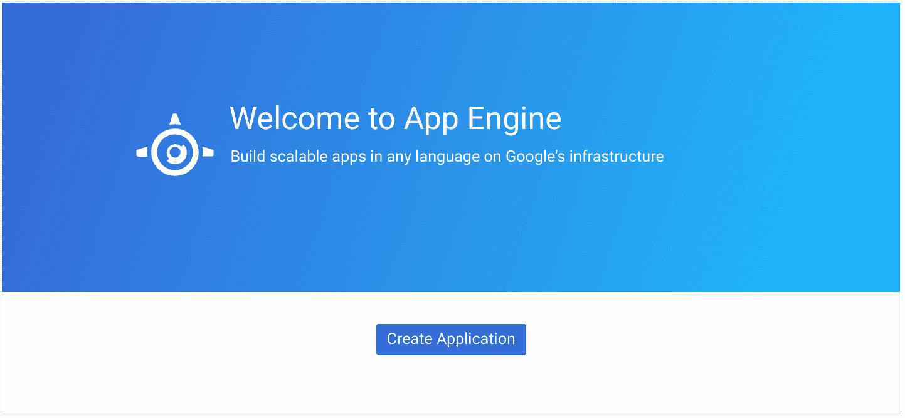

接下来我们需要决定的是应用程序将在哪个区域运行。让我们看看接下来如何操作。

# 选择一个区域

从下面的屏幕列表中可以看到，有很多选项可供选择。通常，标准做法是选择一个尽可能靠近数据访问位置的区域。在本示例中，这一标准不适用，因此请执行以下步骤：

1.  选择 us-east1 作为区域。

1.  选择“创建应用程序”按钮：

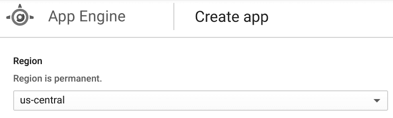

现在我们需要决定使用哪种语言运行时。

# 选择语言运行时和环境

对于我们的第一个简单示例，我们将使用 Python 运行时。按照以下步骤操作：

1.  选择“语言”下拉列表。

1.  从出现的各种语言中，点击 Python。

1.  从“环境”下拉列表中选择“标准”（这是默认选项，但也可以在开发周期的后期进行更改）：

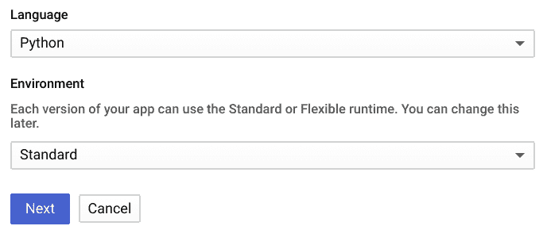

请注意，有多种语言运行时可供选择。如果你不熟悉 Python，别担心：它的布局和特性非常易于理解。在大多数情况下，使用其他语言将遵循我们所概述的相同过程；但是，语言规范会与 Python 示例中描述的有所不同。

完成后，我们可以开始使用 **Google Cloud SDK**（**GCloud SDK**）。

# 使用 GCloud SDK

GCloud SDK 提供了一种简单的方式来对 Google Cloud 进行身份验证。将 SDK 安装在本地（即本地环境）提供了显著的好处，因此，如果你希望与其他 Google Cloud 服务集成，它是一个非常好的选择：

1.  从 Google Cloud Console 左侧选择 App Engine 菜单选项。

1.  在接下来的屏幕中，我们需要选择项目所需的资源：

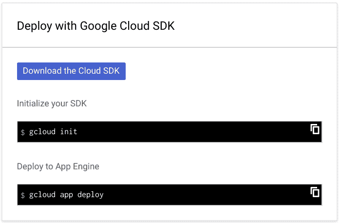

1.  我们不需要 Cloud SDK，因为我们将使用包含预加载 Cloud SDK 的 Cloud Shell。所以通过选择 “I'LL DO THIS LATER” 来跳过这个屏幕。

从前面的部署屏幕中，你还会获得一个命令行提示，使用 `gcloud` 命令部署代码。强烈建议学习如何使用 `gcloud sdk` 命令执行不同的任务。

恭喜！此时，你已经成功在 Google Cloud 上创建了你的第一个 GAE 应用程序。正如你所见，这个过程非常简单，旨在确保开发人员尽量减少基础设施管理所需的时间：

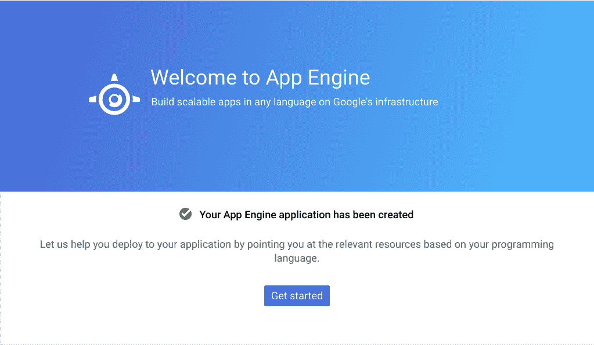

请花一点时间记住，对于每个创建的应用程序，都需要类似的过程来创建基础设施。正如你所看到的，这个过程并不复杂；成功完成后，它会输出一条重要的消息，指示整体状态。

# 构建和部署示例应用程序

在本节中，我们将部署一个标准的 `Hello World` 应用程序到 GAE。幸运的是，Google 的工程师们为我们提供了帮助，我们可以使用一些示例代码。在接下来的构建和部署阶段，我们将研究这些示例代码。

要开始这个过程，请按照以下步骤操作：

1.  在你的项目中打开 Cloud Shell 窗口，并从 Google Cloud 仓库克隆 App Engine 的示例代码。

如果你需要在 Google Cloud 上编码一个应用程序，首先查看 Google 的示例仓库，看是否已有现成的示例代码作为模板，这样会更加高效。

1.  从打开的 Cloud Shell 窗口中，在命令行输入以下内容：

```
git clone https://github.com/GoogleCloudPlatform/python-docs-samples
```

1.  代码位于一个名为 `hello_world` 的目录中。所以，输入以下命令以进入正确的源代码目录：

```
cd python-docs-samples/appengine/standard/hello_world
```

1.  现在我们有了一些源代码，接下来让我们通过在 Cloud Shell 提示符下执行目录列表命令来查看该目录中的内容：

```
ls -la
```

值得注意的是，这里有两个 Python 文件和一个 `app.yaml` 文件。这样的结构很常见，所以值得概述一下这些文件的作用：

| **文件名** | **用途** | **描述** |
| --- | --- | --- |
| `main.py` | 应用程序 | 这个用 Python 编写的文件表示要运行的源代码，并向用户输出一条 `Hello, World!` 消息。 |
| `main_test.py` | 单元测试 | 这个文件是主源文件的测试用例，用于确保返回的响应符合预期。 |
| `app.yaml` | 配置文件 | 这个文件是应用程序的配置文件。数据的内容包括对语言运行时、API 版本和要访问的 URL 的引用。 |

1.  要将源代码部署到 GAE，请在 Cloud Shell 命令行中输入以下内容来使用你的代码：

```
gcloud app deploy ./app.yaml
```

1.  当部署命令处理配置信息时，完成后会提供一个 URL，通过该 URL 可以访问正在运行的应用程序：

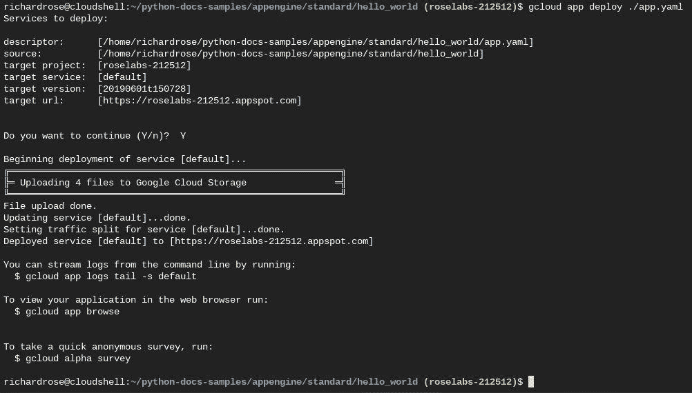

要查看已部署的应用程序，可以从 Cloud Shell 使用`gcloud app browse`，或者使用 App Engine 仪表板查看分配的 URL。

一旦 App Engine 完成部署，应用程序就可以从浏览器访问。通常，访问已部署应用程序的 URL 将是`[PROJECT_ID].appspot.com`的形式。如果你使用了自定义域名，则`PROJECT ID`部分将被自定义域名替换。

1.  通过浏览器访问此 URL；这将显示来自我们应用程序的`Hello, World!`消息，如下图所示：

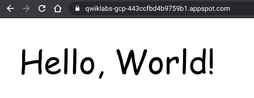

1.  现在看看更新后的 GAE 仪表板，观察一旦应用程序部署后出现的变化：

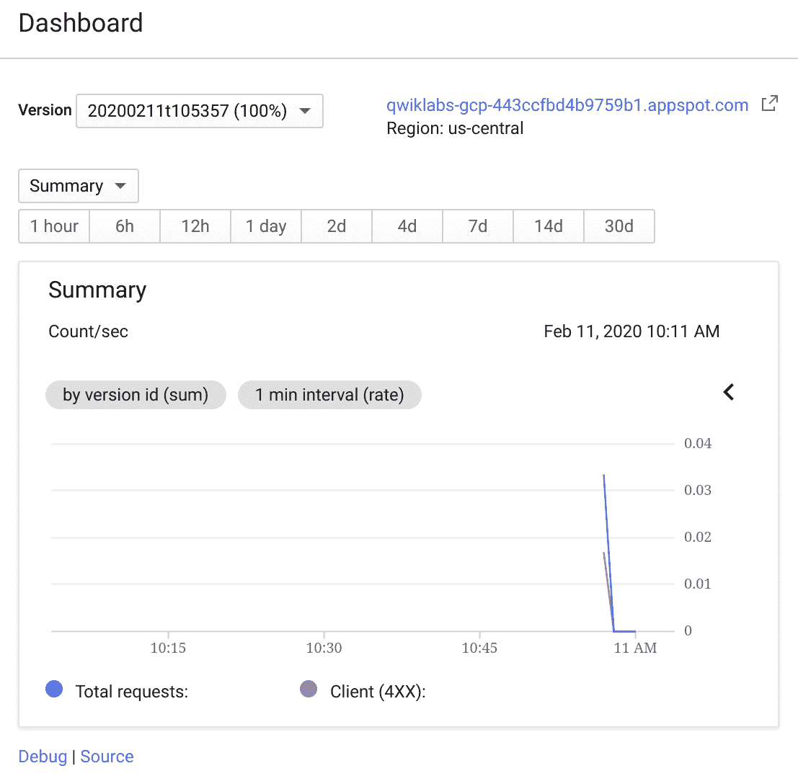

1.  从仪表板上，我们可以看到应用程序的所有相关遥测数据。我们现在对 GAE 有了出色的工作知识，并了解如何在 Google Cloud 上部署一个简单的应用程序。

干得好！我们已经快速浏览了很多信息，现在让我们慢下来一点，回顾一下本章到目前为止学到的内容。

# 总结

在`Hello World!`示例中，我们了解了在 GAE 上部署代码的以下方面：

+   我们查看了如何创建一个简单的 GAE 应用程序；我们使用 Google Cloud 控制台启动构建和部署过程。

+   我们看到有多个可用区域，并了解了可以访问这些信息的地方。

+   我们为应用程序选择了 GAE 标准环境和 Python 语言运行时，注意到如果需要，我们也可以选择其他替代方案。

+   我们克隆了 Google Cloud 存储库，以便访问一些基于 Python 的示例代码。

+   我们浏览了目录中的系统，看到我们有三个可用的文件，并花时间概述了每个源文件的用途。

+   最后，我们通过 Cloud Shell 部署了代码，并通过部署过程完成时显示的 URL 通过浏览器界面访问了正在运行的应用程序。

正如你在 App Engine 的第一部分中看到的，部署代码是一个非常简单的过程。在这个环境中，使用 GAE 提供了开发人员所渴望的简洁性。

避免基础设施管理开销的能力可以显著提高效率，并使我们能够更加专注于特定的开发活动。在接下来的部分中，我们将探索 GAE 如何处理各种部署策略。

# 理解部署策略

GAE 允许部署新版本，并执行更多复杂的操作，例如流量分配。由于我们已经通过命令行部署了一个简单的应用，现在让我们继续使用这个代码库，看看如何通过 GAE 管理控制台实现新版本。

理解控制代码流动的 GAE 控制台背后的机制是非常宝贵的。能够通过发布操作部署新系统为应用环境提供了良好的控制层级。更进一步，我们还可以在版本之间分配流量，以执行复杂的 A/B 测试。

# 创建新版本

回到 Cloud Shell，仍然在处理我们的源代码，我们将编辑`main.py`文件，并将消息修改为：`Hello, Serverless World!`。这些简单的更改将代表我们的新版本应用。

Google Cloud Shell 还包括一个基于 Eclipse Orion 的代码编辑器，用于进行简单的文件编辑。这个编辑器的引入对于需要查看项目中文件的情况非常有帮助。或者，Cloud Shell 也包括其他编辑器（例如 Vim 和 Nano），所以你可以根据个人喜好选择使用。

在上一节中，你可能注意到，在编辑源文件后，我们使用 GCloud SDK 部署了代码。现在我们已经修改了源代码，请按照相同的流程再次操作：

1.  在 Cloud Shell 中，运行以下命令：

```
gcloud app deploy ./app.yaml
```

1.  新的应用版本已经部署，无需额外的工作。

1.  回到 Google Cloud Console 和版本菜单。

我们可以看到，新的应用版本已经部署，并且可以从列表中获取：

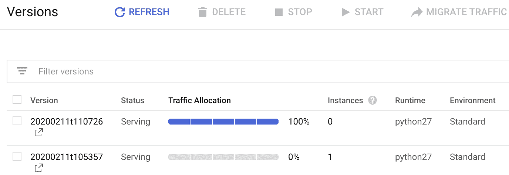

请注意，在前面的输出中，流量分配已经自动切换到新版本。这种行为在大多数情况下是可以接受的；然而，如果你不希望流量自动升级到最新版本来部署新代码，请使用`--no-promote`标志选项。

请注意，使用的版本字符串代表应用的时间戳。此外，应用的两个版本仍然可以轻松地从控制台访问——默认版本会跟踪流量使用的修订版。如果你希望切换到特定的版本字符串，可以在部署过程中使用`--version`标志选项指定。

在这一点上，你可能想将这个简单的部署过程与典型的基础设施项目进行对比，在这些项目中，易用性并不像这里这么明显。GAE 部署的简便性令人惊叹，其精心设计使得只暴露出开发所需的部分。

现在我们已经完成部署，可以查看一些 App Engine 默认提供的优秀功能，从流量管理开始。

# 流量分配

现在我们有两个版本在运行，如果我们能将流量在它们之间分配岂不是很棒吗？考虑到这种选项在测试环境（例如 A/B 测试）或生产环境（例如分阶段发布）中的实用性。再次强调，这种简单性不应被误解；这是一种非常强大的选项，毫无疑问，它将被一次又一次地使用。

要拆分流量，请按照以下步骤操作：

1.  进入 GAE 云控制台，在“版本”菜单下，查找特定版本的“拆分流量”选项并选择它。

1.  现在，将会提供一系列选项来拆分我们的流量，正如前一章所述（即 IP 地址、Cookie 或随机）：

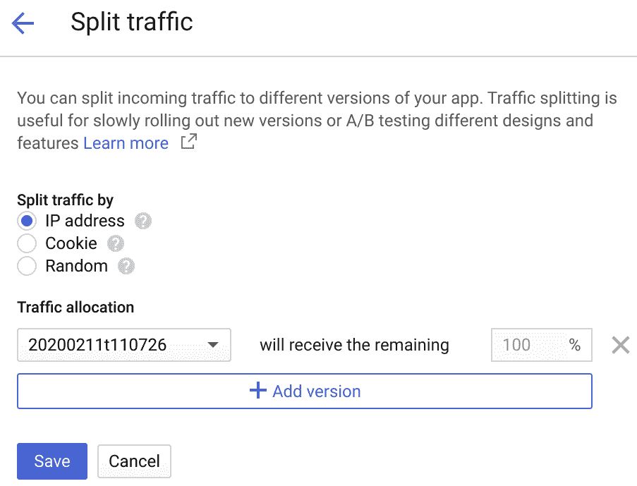

我们可以看到我们的新应用版本已默认接受 100%的流量分配。为了演示，我们希望它只接收 25%的流量。为此，请执行以下步骤：

1.  点击“添加版本”按钮，选择将消耗 75%流量的备用应用版本。你会看到我们仍然有原始版本的已部署应用可用，所以让我们将流量导向它。

1.  现在从版本旁边的框中选择剩余的百分比：

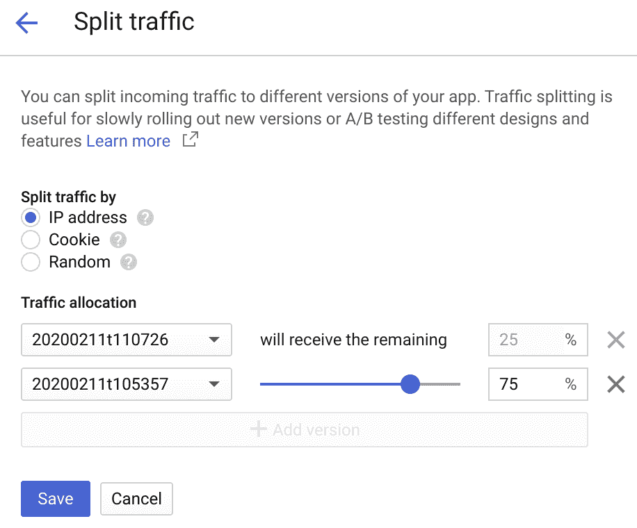

1.  一旦选择了流量拆分比例，点击保存按钮，GAE 会显示它正在动态更新项目中的流量拆分配置。

1.  返回到“版本”屏幕，查看项目实际上在已选择的应用程序之间按之前选定的比例划分流量：

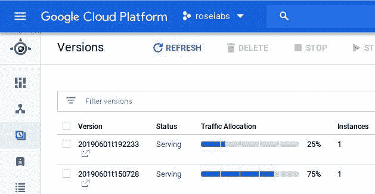

正如我们预期的那样，前面的操作，例如流量拆分，也可以通过 GCloud SDK 来实现。要通过 SDK 实现相同的结果，请使用`gcloud app set-traffic`选项，以便从脚本或命令行界面获得灵活的方式来实现预期的结果。

现在我们知道如何在应用版本之间启动流量拆分，接下来我们来看看如何迁移流量。

# 迁移流量

最后，在这一部分，我们希望将所有流量迁移回我们应用的原始已部署版本。到现在为止，我猜你已经有了如何实现这一目标的想法。

在“版本”屏幕的顶部，有一个“迁移流量”选项。我们将使用它将所有现有流量流量迁移回原始版本，如下图所示：


注意，原始应用程序当前接受 75%的流量，新版本只接受 25%的流量。

迁移将确保流量被定向到选定的默认版本。在这种类型的迁移中，目标实例只能是单一版本：

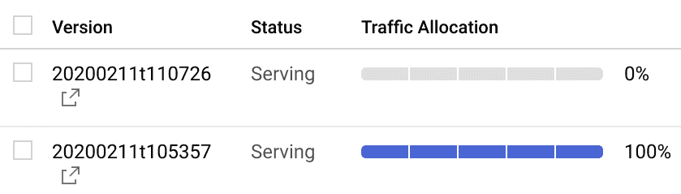

使用 GAE 进行应用程序版本之间的流量迁移非常简单。为了巩固我们的理解，接下来我们将总结所学内容。

# 总结

在本节中，我们学习了如何在 GAE 上控制部署。我们使用了几个内置工具，并学习了在处理应用程序时如何使用它们：

+   我们看到了 GAE 如何对应用程序进行版本控制。

+   我们观察了 GAE 上实时流量分割，只需点击按钮即可访问。

+   我们使用迁移流量选项来执行简化的应用程序回滚。

在本节中，我们探讨了流量分割如何成为一个宝贵的开发者工具，用于测试应用程序功能。在这方面，使用 GAE 显得格外简单，因为它提供了一种复杂的方式来执行 A/B 测试，无需任何额外的设置或要求。

此外，我们执行了版本回滚，允许我们快速在不同的流量服务版本之间切换，并返回到指定的默认版本。在这种情况下，我们无需考虑如何管理底层基础设施；GAE 为我们完成了繁重的工作。下一节中，我们将探讨如何让构建和部署过程更加一致，减少出错的可能性。

# 故障排除 App Engine 部署

在本节中，我们将通过使用 Stackdriver Logging 更详细地检查应用程序故障排除。Stackdriver 将应用程序信息汇总到一个*单一视图*中，方便开发者分析数据。

调试应用程序可能非常耗时，需要一定的技能来从噪声中找出有用的信号。GAE 的日志在 Stackdriver 中完全可用，学习如何使用该工具可以为识别应用程序中的缺陷提供宝贵的帮助。

# 构建与部署

打开 Google Cloud 控制台中的 Stackdriver Logging，展示与 Google Cloud 上汇总的日志相关的主要信息页面。Stackdriver Logging 有两种模式：

+   基本模式

+   高级筛选器

基本模式是默认模式，在我们的示例中，我们将使用它来展示部署应用程序的一些关键信息。高级筛选器使用户能够创建自定义筛选器，用于分析日志中的信息。

# 基本模式

在 Stackdriver Logging 中，我们首先需要筛选信息，并将其限制为 GAE 应用程序相关的数据，这样它就专门与我们关注的系统部分相关：

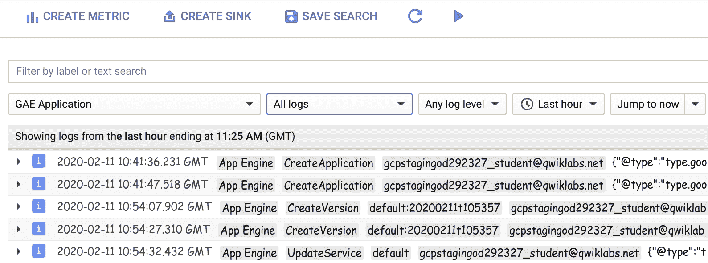

在前面的截图中，过滤器的修改包括 GAE 应用和所有日志。从显示的信息可以看出，这是对在 GAE 上发生的活动的非常详细的概述。例如，我们可以看到几个与 `CreateApplication`、`CreateVersion` 和 `UpdateService` 活动相关的条目。每个活动都有一个相关的有效载荷，其中包含更多的详细信息，因此在需要时可以进一步获取信息。

此外，页面接收到的（HTTP）响应代码也会显示在日志中，这意味着可以轻松创建基于日志信息的应用程序可用性监控指标。例如，*过去一小时内收到过多少次 404 错误* 是一个非常有用的指标。聚合指标是一种智能的应用程序分析方法，因此只有事件发生的频率可以作为调查的基础。

# 高级过滤器

在某些情况下，调查 GAE 上的操作时需要一个更定制的过滤器。在这种情况下，使用高级过滤器。通过下拉过滤器访问高级日志过滤器，它提供了一个更高效的界面，您可以在其中选择从 Stackdriver 中获取的日志信息。

例如，在此模式下，选择 `CreateApplication` 项会填充高级过滤器，并根据用户提交的标准显示一个更有针对性的条目列表。

Stackdriver 是一个非常有价值的服务，用于主动管理应用程序：

+   **Stackdriver Logging**：访问日志信息以进行问题分析

+   **Stackdriver Monitoring**：访问监控信息以解决一般问题

+   **Stackdriver Trace**：访问延迟问题的追踪信息

+   **Stackdriver Debug**：访问应用程序详细信息以解决缺陷问题

第一层防御涉及集成日志记录，以提供已部署应用程序的详细和准确视图。此类示例包括 Stackdriver 监控、追踪和调试，它们利用关于应用程序的信息来帮助进行持续的维护活动和已部署构件的改进。

# 总结

在本节中，我们重点介绍了将 Stackdriver Logging 与 GAE 配合使用的第一步。随着我们深入更高级的主题，我们将进一步探讨 Stackdriver 的这一功能：

+   我们创建了一个 *基本* 模式过滤器，以查看特定的 GAE 信息。

+   我们切换到 *高级* 过滤器，以更细粒度地查看 GAE 应用程序日志信息。

+   我们概述了一些 Stackdriver 功能，并在高层次上讨论了如何使用这些关键特性。

学会如何在 Google Cloud 上使用 Stackdriver 是提高开发者生产力的基础。随着应用程序复杂性的增加，能够在一个易于访问的仪表盘中聚合来自多个服务的信息，既令人信服又非常有用。

# 小结

在本章中，我们涵盖了许多内容，以便处理使用 GAE 的一些典型示例。到现在为止，您应该已经很好地理解了架构及其相关组件如何交互，并能够避免在特定情况下重复造轮子。

我们从讨论如何在 GAE 环境中部署应用程序开始。还涉及了如何使用版本控制和源配置来支持多个环境。最后，我们探讨了不同的部署策略，并首次了解了 Stackdriver Logging。

我们已经看到，GAE 非常适合托管需要 HTTP(s)/API 访问的解决方案的应用程序。无论是 GAE Standard 还是 Flex，都为 Google Cloud 中的无服务器应用程序提供了有力的支持。从开发者的角度来看，几乎不需要进行基础设施管理。

在下一章，我们将扩展对 Google Cloud 无服务器产品的理解，并开始关注基于事件的选项。在选择替代方案时，考虑某种用例相较于其他用例的优势总是一个好主意。现在我们已经探讨了应用程序，我们将关注更细化的需求，并通过函数引入事件处理。

# 问题

1.  GAE 有三个版本。对还是错？

1.  GAE 提供哪些流量拆分选项？

1.  Stackdriver Logging 提供了哪些过滤日志选项？

1.  在创建 App Engine 应用程序时，您需要选择一个区域。对还是错？

1.  流量迁移提供了一种简单的应用程序回滚方法。对还是错？

1.  执行 GAE 命令行部署的命令是什么？

1.  App Engine 部署的 URL 中包含哪些常见属性？

# 进一步阅读

+   **Google Cloud Shell**: [`cloud.google.com/shell/docs/launching-cloud-shell`](https://cloud.google.com/shell/docs/launching-cloud-shell)

+   **Google Cloud Shell Editor**: [`cloud.google.com/blog/products/gcp/introducing-google-cloud-shels-new-code-editor`](https://cloud.google.com/blog/products/gcp/introducing-google-cloud-shels-new-code-editor)

+   **Google 应用服务**: [`cloud.google.com/sdk/gcloud/reference/app/services/`](https://cloud.google.com/sdk/gcloud/reference/app/services/)
