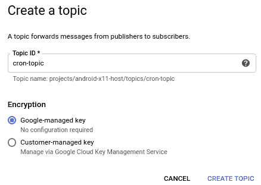
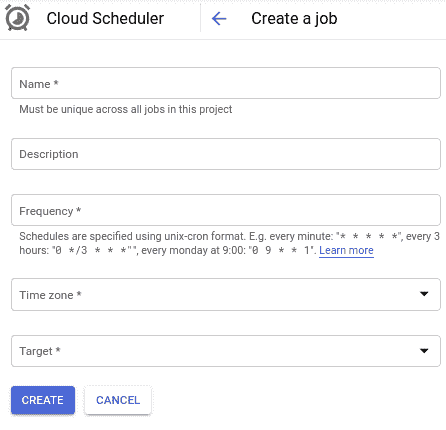
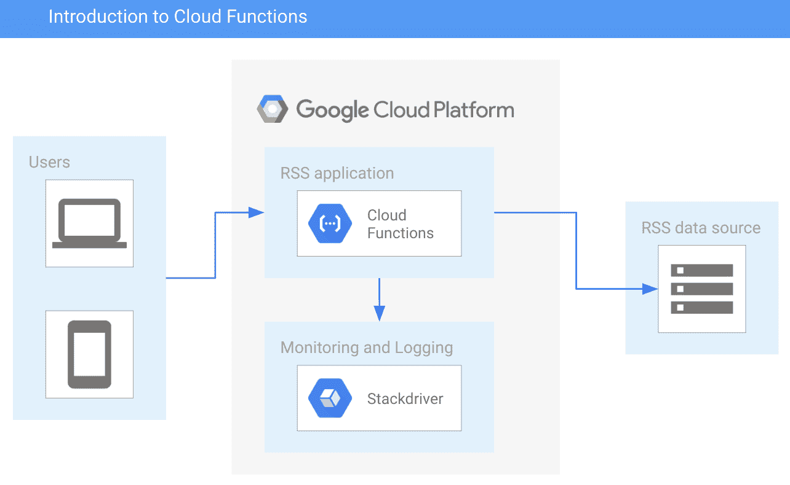
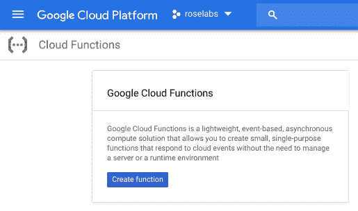
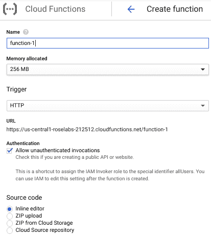
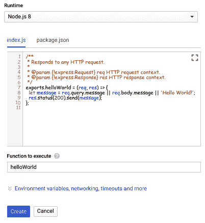
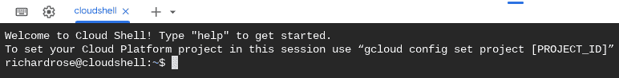
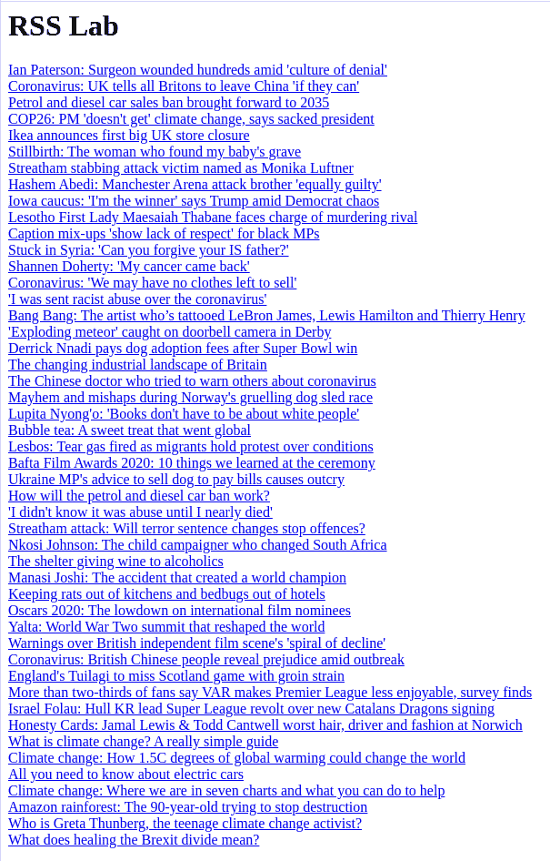

# 第三章：介绍轻量级函数

在简要介绍了**Google App Engine**（**GAE**）之后，我们现在可以将注意力转向完全托管的事件处理。本章中，我们将开始使用 Google Compute Engine，并探索如何在我们的环境中集成无服务器操作管理工具。更具体地说，事件处理的内容，包括 Cloud Functions，从这里开始。

本章将首先简要概述 Cloud Scheduler 和 Cloud Tasks，它们是为 Google Cloud 提供支持的服务，接着介绍 Cloud Functions，然后我们将开发一个小应用来利用这些服务。

在本章中，我们将讨论以下主题：

+   操作管理工具

+   Cloud Tasks 和 Cloud Scheduler

+   Cloud Functions 简介

+   开发一个 Cloud Functions 应用

# 技术要求

为了完成本章中的练习，您需要一个 Google Cloud 项目或 Qwiklabs 账户。

您可以在本书的 GitHub 仓库中找到本章的代码文件，位置在 `ch03` 子目录下，链接为 [`github.com/PacktPublishing/Hands-on-Serverless-Computing-with-Google-Cloud/tree/master/ch03`](https://github.com/PacktPublishing/Hands-on-Serverless-Computing-with-Google-Cloud/tree/master/ch03)。

在您阅读本书中的代码片段时，您会注意到在某些情况下，代码/输出中的几行被删除，并用省略号（`...`）替代。省略号的使用仅用于显示相关的代码/输出。完整的代码可在前面提到的 GitHub 链接中找到。

# 操作管理工具

能够响应外部生成的事件提供了一种灵活的机制，用于构建易于扩展和增强的系统。考虑一下，您如何设计一个解决方案，根据提交的图形表示生成缩略图。首先，我们需要一些磁盘存储来保存图像，然后我们需要处理图像以生成缩略图，最后我们需要更多的磁盘存储来保存输出。

该活动的每个阶段都需要状态变化和响应。状态变化是与服务调用相关联的通知，用于指示资源的状态；例如，图像已存储，图片已更改，或者处理已完成。

在本章后面介绍的 Cloud Functions 示例中，一个事件触发了在**Google Cloud Storage**（**GCS**）中新项目的存储。该函数通过事件触发器被提醒，并能在此事件的响应中执行一系列指令。在这些指令的开始阶段，转换后的图像（现在是缩略图）会提供给最终用户。

在这一点上，经过前面基于 GAE 的章节，你已经对 Cloud Tasks 有了一定的了解。选择服务之前，始终考虑目标是很重要的。采取这一步骤将帮助你判断该技术是否适合你的需求。

因此，本节不会进行详细探讨，因为这些是使 Google Cloud 上无服务器工作负载成为可能的辅助服务。相反，我们将概述关键点，以提供背景和可能的用例。通过这种方式，处理本节内容应该有助于做出关于是否纳入这些服务的智能决策。在许多情况下，会存在模糊地带，以及没有明确选择的情况。幸运的是，这些情况会是例外，因此我们可以在很大程度上概括如何处理这种类型的情况。我们的讨论从 Cloud Tasks 开始。

# Cloud Tasks

我们已经在第一章《介绍 App Engine》和第二章《使用 App Engine 进行开发》中回顾了使用 Cloud Tasks 与 GAE 的好处。许多这些优势在与 HTTP 目标协作时仍然存在，例如通过将长期请求卸载到工作进程来减少应用程序延迟，或者减少面向用户任务的流量峰值。

分布式任务在 Google Cloud 上的服务专门用于管理任务的执行、调度和交付。其理念是，能够卸载、隔离并管理 HTTP 请求以最小化延迟是更可取的。这个异步工作流在处理需要响应式接口的用户面向应用时尤其有用。为任务所做的消息负载请求必须包括 POST 或 PUT 作为要处理的 HTTP 方法。

Cloud Tasks 提供了除了异步卸载任务的优势之外的多个好处。此外，它还允许开发人员配置与数据传输相关的各种属性。这可能包括复杂的策略，如应用重试或在任何数据契约上设置速率限制。

简而言之，以下元素是 Cloud Tasks 的重要特性，并为使用该服务提供了有力的理由：

+   异步任务卸载

+   可配置的重试策略

+   可配置的速率限制

+   延迟调度

+   解耦服务

+   提高对失败的抗压能力

+   可扩展且完全托管

+   HTTP 目标

+   保证交付

+   支持多种流行语言

通过构建一个数据元素队列，Cloud Tasks 为工人处理信息提供了一种高效的方式。每个队列都有速率限制，决定了每个队列将执行多少任务。由于应用了保证交付机制，如果发布的消息的响应不符合应用要求，则会重试。一般来说，响应代码遵循 HTTP 规范，其中 2xx 范围的状态代码表示成功。

分布式任务队列使应用程序在执行异步操作时更加响应。任务队列能够通过利用关键产品功能，如调度、去重、重试策略和版本重定向，来组织和控制请求。

解耦服务（例如 Cloud Tasks 和 Cloud Pub/Sub）可以提供更好的结构和应用扩展性，特别是在使用微服务时。在这种情况下，任务处理程序将驻留在每个专用服务中，以便微服务能够独立扩展。因此，资源消耗的管理控制确保了更好的负载动态，从而实现更流畅的服务访问，例如速率限制队列。

此外，在优雅地处理发布和事件时，请求可以暂停、重试并重定向到新版本。如果你曾使用过 Cloud Pub/Sub，那么这种解耦方式可能非常熟悉。这两种服务之间的主要区别在于调用方式。Cloud Tasks 使发布者能够控制执行，即端点。而 Cloud Pub/Sub 使订阅者能够控制消息传递。

要了解这两项服务之间的差异，请阅读关于*选择 Cloud Tasks 和 Pub/Sub 之间的文档*，参考链接：[`cloud.google.com/tasks/docs/comp-pub-sub`](https://cloud.google.com/tasks/docs/comp-pub-sub)。

# Cloud Scheduler

将 Cloud Scheduler 看作是云中的 cron 作业。如果你不熟悉 cron 作业，它们代表了一种基于时间表在机器上安排活动的简单方式。作为一个统一的管理界面，Cloud Scheduler 使用户能够从一个地方管理他们所有的自动化需求。创建 Cloud Scheduler 作业只需少量元素即可运行。

如果你处于需要自动化某些云基础设施操作的场景中，那么这是实现该目标的完美方式。作为一项完全托管的服务，Cloud Scheduler 提供了一个简单的界面，你可以通过它来设置和配置你的自动化需求，具体如下：

1.  确定任务运行和触发的频率。

1.  确定如何调用 Cloud Scheduler（即 Pub/Sub、App Engine HTTP 或 HTTP）。

1.  部署服务后，任务将在计划时间自动触发。

1.  通过 Cloud Scheduler 控制台页面查看每次调用的结果，或者通过 Stackdriver Logging 访问它。

Cloud Scheduler 提供了一种简单有效的方式来定期执行任务。如果你曾经需要运行备份或下载更新等任务，你就会知道这个应用程序有多么有用和强大。作为一款企业级产品，Cloud Scheduler 提供的本质上是基于云的 crontab。这个产品的魅力在于，它使用户能够在现有的 Google Cloud 目标服务中触发任务。拥有这些集成目标提供了一个高可靠性的机制，确保定期执行的任务能够支持现有的使用模式。

除此之外，Cloud Scheduler 还提供了一些关键元素，下面的列表中会涵盖：

+   保证可靠的交付，即至少保证一个作业目标的交付（这确实带来了一些复杂性，例如数据排序可能成为一个问题，类似于使用诸如 Cloud Pub/Sub 之类的消息解决方案）。

+   支持广泛的服务目标，如 App Engine、Cloud Pub/Sub 和 HTTP 端点。

+   重试和回退机制为作业需求确定合适的重试策略。

+   与 Stackdriver Logging 的集成捕获与任务执行和性能相关的信息。

+   支持 Unix cron 格式，因此你现有的知识是可以迁移的。

所以现在我们知道了这些，我们可以快速创建一个 Cloud Scheduler 演示，展示如何使用它。在以下示例中，Cloud Scheduler 将使用 Cloud Pub/Sub 来说明它如何与定义的端点进行交互。

第一个任务是创建一个 Pub/Sub 主题。Pub/Sub 主题将根据分配的订阅者整理准备分发的消息，如下所示：

1.  在 Google Cloud Console 菜单中，选择 Pub/Sub 选项。

1.  在 Pub/Sub 屏幕中，选择创建主题菜单选项。

1.  在创建主题屏幕上，输入主题 ID 为`cron-topic`。

1.  保留加密设置为以下默认选项：Google 管理的密钥；然后选择 CREATE TOPIC 按钮：



一旦我们定义了主题，接下来需要为其建立订阅。对于任何可用的消息，我们可以使用拉取或推送机制来访问与主题相关的数据负载：

1.  现在我们需要为主题创建一个订阅，因此请从左侧菜单中选择订阅选项。

1.  在屏幕顶部，选择 CREATE SUBSCRIPTION 选项。

1.  输入订阅 ID 为`cron-sub`。

1.  输入主题名称为`projects/<project-id>/topics/cron-topic`，将`<project-id>`替换为你系统中的 Google Cloud 项目 ID。

1.  然后选择屏幕底部的 CREATE 按钮。

最后，我们需要定义将使用之前创建的 Pub/Sub 作为端点的 Cloud Scheduler。每次 Cloud Scheduler 任务调用时，它将向 Pub/Sub 发送负载：

1.  选择 Cloud Scheduler 选项（位于工具下），然后选择 CREATE JOB 选项。

1.  结果应类似于以下屏幕：



1.  填写以下表格中的字段：

| **字段** | **内容** |
| --- | --- |
| 名称 | `cron-task` |
| 描述 | `Google Cloud 上 Cloud Scheduler 的演示` |
| 频率 | `* * * * *` |
| 时区 | 英国（格林威治标准时间） |
| 目标 | Pub/Sub |
| 主题 | cron-topic |
| 负载 | `Yeah Cloud Scheduler Rocks` |

1.  完成填写上述字段后，选择“创建”按钮，将你的 Cloud Scheduler 任务添加到活动作业列表中。

示例代码将每分钟运行一次，但为了简洁起见，请按下“立即运行”按钮。从 Cloud Scheduler Jobs 页面，你将看到结果类别被记录为成功，并显示任务最后一次运行的时间。如果你现在查看 Cloud Pub/Sub 队列并点击 `cron-topic`，在“查看消息”选项下，你可以获取在 Cloud Scheduler 中添加的负载信息。或者，你也可以使用 Cloud Shell，通过以下 `gcloud` 命令访问 Pub/Sub 订阅：

```
gcloud pubsub subscriptions pull cron-sub --limit 10
```

恭喜！如你所见，Cloud Scheduler 实现了与 Pub/Sub、App Engine 和 HTTP 的简单集成。

现在我们已经讨论了启动任务和调度活动的方法，接下来可以开始考虑使用功能处理信息的更广泛的系统需求。

# 介绍 Cloud Functions

Cloud Functions 平台提供了一种有效的方式，在云中运行单一功能的代码。记住，独立服务不需要管理服务器或其相关的运行时环境。事件通知的发生会触发单一功能。轻量级的 Cloud Functions 平台为基于事件驱动的无服务器计算提供了基础。

构建独立调用的单一功能提供了一个高度可用的架构，用于构建你的服务。将这些功能组合起来是一种扩展云服务的优秀方式。这些单一功能提供了轻量级组件，从而为维护应用程序提供了一种更自然的方式。没有服务器配置和补丁/更新周期的部署和维护简化，可以成为设计解决方案的有效方式。

连接云服务并与不同接口（如 Webhooks、API 以及 **物联网**（**IoT**）设备）进行交互的能力是非常理想的。Google 使得 Cloud Functions 的接口非常易于使用；你可以构建单一功能，唯一的限制是你的想象力。

在书中的后面章节，我们将讨论如何使用 Functions Framework 开发代码，创建轻量级的函数。Functions Framework 是一个开源项目，它可以实现跨多个环境（例如 Google Cloud Functions、Cloud Run 和 Knative）的无缝兼容。目前请注意，在构建函数时，这种方法提供了一种兼容性，使你可以在技术栈之间无缝切换。

无服务器计算平台广泛的应用场景使其成为一个具有吸引力的选择。通常，它作为服务和 API 之间的粘合剂被部署，Cloud Functions 为任何希望在以下领域使用 Google Cloud 的人提供了一个可扩展的层：

+   实时文件处理

+   事件驱动的提取、转换和加载管道

+   无服务器 IoT 后台

+   通过 API 进行第三方集成

典型的使用场景可能包括以下内容：

+   **物联网（IoT）**：与设备的无服务器交互，通过事件流处理信息。Cloud Functions 提供一个简化的接口，可以作为一个强大的工具，用于收集和分发批量或实时信息，利用像 Cloud Pub/Sub 这样的服务。

+   **API**：HTTP 触发器可以设计聚合逻辑来响应应用程序调用。这种轻量级的 API 非常适合抽象事件链中更复杂的处理，如存储或队列需求。构建此类 API 可以通过事件驱动接口和 HTTP 来实现。

为了说明如何创建一个简单的 Cloud Functions 应用程序，在下一节中，我们将详细讲解这个过程的主要步骤。

# 开发基于 Cloud Functions 的应用程序

为了帮助我们理解之前讨论的服务，我们将开发一个小型应用程序来利用这些服务。我们的 Cloud Function 将展示一个简单的网页，其中一些基于 Web 的信息显示输出。为了展示之前讨论的每个函数的强大功能，下面表格中的每个*需求*里程碑将逐步改变并改善整体设计。

我们的应用程序将使用 Google Cloud Functions 进行开发，并在屏幕上显示一些信息。顺便提一下，如果你需要托管类似静态网站的内容，可以通过使用 GCS 存储桶快速完成。存储桶非常灵活。有关如何实现它们的更多信息，请查看文档：[`cloud.google.com/storage/docs/static-website`](https://cloud.google.com/storage/docs/static-website)。

我们将在接下来的几个章节中开发一个 RSS 阅读器应用程序。我们的高级需求是将来自特定网站的信息以 HTML 网页的形式呈现。我们的高级需求如下：

| **参考** | **需求** | **描述** |
| --- | --- | --- |
| 1 | 开发一个 Cloud Function。 | 部署一个单一函数应用。 |
| 2 | 从 RSS 网站读取内容。 | 以 BBC 的 RSS 订阅源为例。 |
| 3 | 将数据渲染为 HTML。 | 将需要消费的信息以 HTML 格式呈现。 |
| 4 | 刷新数据。 | 使数据能够按照自动化的时间表刷新。 |

现在我们已经准备好了所有要求，可以继续构建应用程序的第一次迭代。

# 应用程序版本 1 – 引入 Cloud Functions

在这个示例中，我们将一步步演示如何使用 Cloud Functions 作为应用程序的基础。这个过程包括以下步骤：

1.  **创建函数**：从一个简单的 Cloud Function 开始。

1.  **添加函数框架**：了解在将代码迁移到 Cloud Shell 时如何添加其他库。

1.  **部署生成的代码**：学习如何通过命令行部署代码。

从 Cloud Functions 开始变得更加容易，因为它提供了多种语言的模板代码。包含这些模板代码对于开始时非常有帮助，并使开发者能够快速尝试该服务，而不必花时间设置环境。

在处理高层次需求时，从外部网站检索 RSS 源似乎是一个关键活动。这个任务看起来也像是一个已有的模式，可以用来实现所需的结果。

作为开发的第一步，快速浏览一下互联网寻找灵感总是值得的。对于这个任务，有相当多现有的包能够访问 RSS 源。构思一个初步设计有助于我们思考想要设计的内容：



在上面的示意图中，我们可以看到 Cloud Functions 被用来访问后端的 RSS 数据源。同时，用户可以访问 HTTP 端点来检索从后端获取的 RSS 信息。

以下示例将使用 Google Cloud 中的 Cloud Functions 选项。为了加速开发周期，我们将利用现有组件来构建应用程序，并尽量减少需要编写的代码量。为了处理 RSS 源，我们将使用一个现有的包来处理所有的处理工作。该包还需要能够访问 RSS 源中的元素。在本示例中，我将使用 Node.js；不过，你也可以使用其他语言，如 Python 或 Go。

在这一点上，我们将使用 Cloud Console 来编写和部署代码到 Cloud Functions：



我们从使用 Cloud Functions 提供的标准模板代码开始，来创建一个应用程序。使用这个模板可以创建 Cloud Functions 并附加不同的属性：



选择 Google Cloud Console 中的 Cloud Functions 选项并打开一个新的 Cloud Function 后，选择 Node 作为运行时语言，这样应用程序代码就会预填充示例的模板代码，如下图所示：



要通过 Cloud Functions 将一些任意文本打印到控制台日志中，我们可以执行以下操作：

1.  编辑 Cloud Functions 模板中呈现的 `index.js` 文件。我们将通过修改 Google 提供的蓝图代码并添加一些代码来执行以下任务，来启动我们的应用程序：

```
/**
* Responds to any HTTP request.
*
* @param {!express:Request} req HTTP request context.
* @param {!express:Response} res HTTP response context.
*/
exports.helloRSS = (req, res) => {
  console.log('helloRSS - display some info');
  res.status(200).send('helloRSS');
};
```

在前面的代码中，我们引入了 `console.log` 语句，它将信息写入日志基础设施。对于 Google Cloud 来说，这将是 Stackdriver Logging。

1.  要部署前面的代码，我们需要点击屏幕底部显示的“创建”按钮。

部署此代码会返回一个 `helloRSS` 消息作为 HTTP 响应。此外，这些信息还可以在 Stackdriver 中查看，因为它作为所有捕获日志的集中存储库。

1.  要从 Stackdriver 获取信息，请使用 `resource.type = cloud_function` 过滤器来访问与程序执行相关的特定数据。

第二章，*使用 App Engine 开发*，有一节内容概述了如何在 Stackdriver 中进行过滤。如果你需要提醒如何执行这个任务，可以查看这一部分。

现在我们有了一个非常基础的功能。为了在接下来的部分进行扩展，我们将引入一些外部包来渲染视图。

# 应用程序版本 2 – 迁移到 Cloud Shell

随着我们的代码变得更加复杂，我们应该抓住机会将开发迁移到更便捷的地方。这里的“便捷”当然是指命令行。现在我们已经了解了如何通过控制台使用 Cloud Functions，接下来的步骤是使用 Google Cloud 上的 Cloud Shell：



当我们使用 Cloud Shell 时，它会提供许多有用的提示。例如，在前面的截图中，Cloud Shell 表示它不知道应该关联哪个 Google Cloud 项目。为了解决这个问题，可以使用 `gcloud config set [PROJECT_ID]` 命令。

如果你不知道正确的 `PROJECT_ID`，可以在 Google Cloud Console 的主屏幕下的项目信息部分找到此信息。

如果你在本书中的任何应用程序代码上遇到困难，还可以使用每一章开始时提供的代码库版本链接。现在我们已经打开了 Cloud Shell，按照以下步骤从头开始重建应用程序：

1.  首先，为你的 Node 代码创建一个新的目录来存放代码。我们称之为 `ch03`。

在 Cloud Console 中，两个代码文件，`index.js` 和 `package.json`，作为我们 Cloud Function 的一部分进行部署。可以在 Cloud Functions 控制台查看每个文件的内容。使用你喜欢的编辑器，我们将重新创建这个应用程序。

在后续章节中，我们将更详细地讨论本地开发的其他选项，但现在我们将专注于如何将代码迁移到 Cloud Shell。

1.  在新的目录中，从云函数控制台窗口复制现有的`index.js`函数代码，并将其粘贴到位于 Cloud Shell 中的`ch03`子目录内的新`index.js`文件中。

1.  对`package.json`文件做同样的操作，现在你应该在`ch03`开发目录中拥有两个源文件（`index.js`和`package.json`）。

1.  此外，我们还需要安装任何所需的包。让我们添加`functions-framework`包：

```
npm install @google-cloud/functions-framework
```

如果你偷偷查看目录，会突然发现比我们创建的两个源文件还多了文件。别担心，暂时不用关心。需要提到的关键点是，`functions-framework`被包含在`package.json`配置文件中。我们将在下一章关于云函数的内容中更详细地讲解这一点。

现在我们的代码已经在 Cloud Shell 中很好地打包好了，我们可以做一些高大上的事情，例如将其保存到版本控制的仓库中。但我们将继续测试文件是否按预期工作，这意味着我们需要部署代码。

1.  让我们继续停留在 Cloud Shell 中，使用以下命令部署我们的代码：

```
gcloud functions deploy tempest --entry-point helloRSS --runtime nodejs8 --trigger-http
```

系统会询问是否允许未经身份验证的调用；请选择“是”。太棒了，恭喜你！你已经通过命令行部署了一个名为`tempest`的云函数！目前它的功能不多，但仍然值得庆祝。接下来，我们将扩展应用程序，让它做一些更有用的事情。

# 应用版本 3 – 添加视图

在我们的应用程序中，我们希望扩展代码以读取 RSS 源。为了在现有代码的基础上进行构建，我们应该加入一些改进，使其更接近我们的应用需求：

+   显示一些静态内容。

+   利用 HTTP 响应以 HTML 页面形式展示。

为了实现这一点，我们将执行以下步骤：

1.  引入一个 NPM 对等包来执行必要的 RSS 交互。对等包是一个在`package.json`文件中声明的 Node 依赖项。快速搜索 NPM 包后，我们发现`rss-parser`正是满足我们需求的理想选择。

使用包的一个好处是，它会包含所有关于配置的相关信息。当安装完成时，Node 会自动更新`package.json`文件。通过添加 RSS 组件，我们能够以最少的代码快速满足读取 RSS 源的需求。

一项好的实践是检查可用的源代码/库。我们永远不应盲目相信包，因此在将第三方代码纳入项目时，必须保持警觉。始终留意显示的与安全相关的漏洞和警告。

查看 NPM 网站上的`rss-parser`页面（[`www.npmjs.com/package/rss-parser`](https://www.npmjs.com/package/rss-parser)），在版本部分，我们可以看到当前版本（写作时）是 3.7.2。

1.  从命令行，我们可以通过执行以下命令来安装这个包：

```
npm install rss-parser
```

1.  现在，通过查看`package.json`文件，我们可以看到它已被更新，以包括相关的包和版本。

```
{
  "name": "sample-http",
  "version": "0.0.1",
  "dependencies": {
    "@google-cloud/functions-framework": "¹.3.2",
    "rss-parser": "³.7.3"
  }
}
```

1.  现在`package.json`文件已经更新以包含`rss-parser`，在 JavaScript 文件`index.js`中，我们将声明一个新的异步函数来完成所有繁重的工作，并获取 RSS 代码以输出结果。

我们正在使用异步函数，因为网络调用可能需要一段时间才能处理；我们不希望在请求/响应生命周期的 UI 处理上造成不必要的延迟。

1.  在这个新函数中，我们首先要引入`rss-parser`包（[`www.npmjs.com/package/rss-parser`](https://www.npmjs.com/package/rss-parser)），通过声明一个新对象来消费 RSS 数据源。我们还添加了一个新的后台异步函数，用于处理相关的 RSS 源解析。

我们不再将数据返回给原始函数`helloRSS`，而是将所有与网络相关的活动处理交给`asyncBBCFeed`函数。

1.  向`index.js`添加以下代码，如下所示：

```
let Parser = require('rss-parser');
let parser = new Parser();
// New background function - Async
async function asyncBBCFeed(req, res) {
    let feed = await parser.parseURL('http://feeds.bbci.co.uk/news/rss.xml');
    console.log (feed.title);
    var testString = '';
    // Title
    testString = '<h1>RSS Lab</h1></p>'

    // Loop through the content
    feed.items.forEach(item => {
      console.log(item.title + ':' + item.link);
     // Create a link per title
     testString = testString + '<a href="' + item.link + '">'+item.title + '</a>' + '</br>';
    });
    // Display the feed returned
    res.status(200).send(testString);
}
```

1.  现在更新`helloRSS`函数，使其如下所示：

```
/**
* Responds to any HTTP request.*
* @param {!express:Request} req HTTP request context.
* @param {!express:Response} res HTTP response context.
*/
exports.helloRSS = (req, res) => {
 var testMessage = '';
 console.log('helloRSS - display some info');
 asyncBBCFeed(req, res);
};
```

1.  返回 Cloud Shell，部署更新后的代码：

```
gcloud functions deploy tempest --entry-point helloRSS --runtime nodejs8 --trigger-http
```

部署代码后，查看 Cloud Console 中的 Cloud Functions 界面。在这里，我们可以看到应用程序的版本已增至 2。继续触发该函数，查看我们所添加的异步调用的结果。太棒了！一些漂亮的头条已经从 RSS 源中提取出来，如下图所示：



与外部数据源进行交互将是日常使用的一个场景，因此理解如何操作这一点非常重要，同时也要考虑相关设计的关键方面。在应用程序的第二个版本中，我们希望将 HTML 输出到我们的网站。同样，这仍然是一个日常使用场景，且我们没有开发额外的代码，而是使用现有的 Node 组件来为我们处理这一任务。引入异步任务将减少网络交互带来的延迟。

从代码来看，HTML 与系统代码紧密耦合，因此这需要解决。在开始解决这个特定问题之前，是时候将我们的代码从 Cloud Console 移到命令行了。在下一部分，我们将专注于仅使用 Cloud Shell。

# 应用版本 4 – 解耦 HTML 输出

正如我们现在从使用 Node 中了解到的，它意味着我们可以访问大量的包来做一些酷的事情。对于我们的应用程序，我们可以使用一个名为`pug`的包，以更可管理的方式渲染 HTML。将给定的文本从 RSS 数据中解耦，给了我们一个机会，以一种不那么复杂的方式展示信息，而无需重新编写 Cloud Function 的主要部分：

1.  在 Cloud Shell 中，按照之前的示例，我们需要向`package.json`文件添加一个新的对等依赖：

```
npm install pug
```

1.  Pug 将使先前嵌入在 JavaScript 中的 HTML 被分离到一个单独的文件中：

```
{
    "name": "sample-http",
    "version": "0.0.1",
    "dependencies": {
        "@google-cloud/functions-framework": "¹.1.1",
        "rss-parser": "³.7.2",
        "pug": "².0.4"
    }
}
```

1.  在 `index.js` 文件中，我们需要在应用程序中添加对 `pug` 对象的引用：

```
let pug = require('pug');
```

1.  接下来，我们在渲染 HTML 输出时，使用 `index.pug` 文件启动程序化视图（即页面渲染后的样式）。在 `asyncBBCFeed` 函数中添加以下内容：

```
const pugInputFile = pug.compileFile('index.pug');
```

1.  我们还需要更新响应对象，以指示：

+   +   成功处理

    +   要渲染的视图，即 `index.pug`

    +   值的插值，在我们的例子中，是从异步调用返回的 `feed.items`：

```
res.status(200).send(pugInputFile({
    items: feed.items
}));
```

1.  最后，我们来去掉一些不再需要处理 feed 项目的样板代码。

在更新前面步骤中概述的更改后，我们的 `index.js` 应如下所示：

```
let Parser = require('rss-parser');
let parser = new Parser();
let pug = require(‘pug');

// New background function - Async
async function asyncBBCFeed(req, res) {
    let feed = await parser.parseURL('http://feeds.bbci.co.uk/news/rss.xml');
    // Use an external pug file
    const pugInputFile = pug.compileFile('index.pug');
    // console.log(feed.items)
    // Display the feed returned
    res.status(200).send(pugInputFile({
        items: feed.items
    }));
}
/**
* Responds to any HTTP request.
*
* @param {!express:Request} req HTTP request context.
* @param {!express:Response} res HTTP response context.
*/
exports.helloRSS = (req, res) => {
    asyncBBCFeed(req, res);
};
```

1.  为了渲染视图，我们现在需要在 `view` 目录中创建一个名为 `index.pug` 的新文件，并添加以下内容：

```
html
  head
    title Template - This is a Pug generated output
  body
    header
      p RSS Lab
    section
    each item in items
      a(href='' + item.link) #{item.title} <br>
```

1.  返回 Cloud Shell，部署更新后的代码：

```
gcloud functions deploy tempest --entry-point helloRSS --runtime nodejs8 --trigger-http
```

测试已部署的代码应该会产生与前面 *应用版本 3 - 添加视图* 部分中所示的相同输出。

但是，请注意，我们的应用复杂性显著降低了。而且，我们甚至不需要写太多代码。更新应用程序以应用前面的代码更新后，借此机会尝试另一种部署方式：

1.  从 Cloud Shell 压缩开发目录的内容到一个 ZIP 文件中。

1.  让我们在你的项目中创建一个 Cloud Storage 存储桶（存储桶名称需要全球唯一，因此选择一个适合你的名称，并将 `[BUCKET_ID]` 替换为你的唯一标识符）。

1.  将文件上传到你的存储桶。

1.  从 Cloud Function 界面，选择 `Create` 函数，并从 Cloud Storage 中选择 ZIP 文件。

1.  从存储桶位置选择 ZIP 文件，并且不要忘记更改 **执行的函数** 设置——我们使用名为 `helloRSS` 的函数。

1.  最后，选择“创建”选项，并为从存储桶中提取的代码选择“创建新函数”选项。

如果你像我一样，手动部署代码的乐趣不会持久。在这种情况下，使用 Cloud Build 会引起你的兴趣。

与事件处理一起工作提供了一种简单有效的机制，用来设置在响应刺激时执行的动作。在我们应用的初步修订中，我们引入了 Cloud Functions。利用模板代码，我们能够将系统适配为消费 RSS feed，并将内容输出到应用程序日志中。

在示例代码中，我使用了 BBC RSS Feed 网站作为源材料，因为它有很多选项，且是一个足够稳定的网站，可以作为演示的基础。然而，尽管如此，你可以随意替换这个站点，只要它遵循相同的标准规范，这不应影响所展示的代码。

做得很好：在 Google Cloud 上工作提供了很多选择。在下一节中，我将给你一个可选挑战，帮助你在此基础上构建你到目前为止学到的所有内容。

# 应用程序版本 5 – 扩展 RSS 阅读器

在这个应用程序的最终版本中，我将给你一个挑战！我们的应用程序已经可以获取 RSS 源数据并以 HTML 格式显示。然而，如果能够展示更多信息，甚至可能包括另外一个或两个源，那就更好了。

通过扩展需求，我们现在有了以下任务列表：

| **Ref** | **需求** | **描述** |
| --- | --- | --- |
| 1 | 开发一个云函数。 | 部署一个单一功能的应用程序。 |
| 2 | 从 RSS 网站读取内容。 | 例如，BBC 的 RSS 源。 |
| 3 | 将数据呈现为 HTML。 | 将信息以 HTML 格式呈现。 |
| 4 | 刷新数据。 | 使数据能够在自动化计划下进行刷新。 |
| 5 | 从 RSS 网站读取内容。 | 查找另一个 RSS 网站并将其添加到应用程序中。 |
| 6 | 改进 HTML 布局。 | 向输出中添加一些图片，并从 RSS 源中添加更多数据。 |

大部分代码你应该已经非常熟悉，但如果不熟悉也不用担心。这个挑战应用的目的是测试你的理解力并建立你的信心，让你能够应对越来越复杂的代码。

记住，如果你发现这个练习有挑战性，解决方案可以在书籍的代码库中的 `ch03/solution` 子目录下找到。

在这个例子中，值得注意的是，构建一个单一功能的应用程序可以被视为无服务器函数的反模式。另一种方法可能是创建一个用于数据访问的读取函数，以及一个用于数据渲染的展示函数。这可能会导致状态迁移到其他服务，例如 Firestore（甚至只是保存到 GCS）。此外，添加一个 Cloud Scheduled 任务可能用于刷新数据。刷新后的数据可以存储在后端，如 Firestore 中。然后，我们可以使用写入触发器来触发事件驱动函数，渲染更新后的 HTML，甚至可能将数据写入 GCS 或其他缓存。采用这种方法，在没有获取 RSS 源的延迟情况下，我们可以为成千上万的前端请求提供服务，同时将工作负载解耦成小而易懂的代码。

# 总结

在本章中，你将会意识到，在 Google Cloud 上构建解决方案并不需要大量的知识就能达到一个**最小可行产品**（**MVP**）。投入时间让自己能够快速迭代多个版本是值得的，并且这能带来整体设计上的显著改进。

通过本章的学习，您现在应该对可用服务的性质有所了解。您会发现，将不同的产品组合在一起，几乎像积木一样，变得更加容易。在这方面，最初清晰地了解最终解决方案的样子至关重要。借此机会构建轻量级函数，而不是单体架构，通常可以简化整体设计；但一定要确保这是您的解决方案所需要的。如您现在所知，有许多场景下，无服务器事件处理是非常有益的。

这就结束了我们对三种无服务器工作负载事件处理服务的初步概述。所讨论的功能的多功能性满足了各种不同的使用场景。在设计应用程序时，值得考虑预期的使用方式。设计迭代是件好事，应该能带来更好的效率。随着我们进入更复杂的系统，了解适当的使用场景和相关设计模式会让构建系统变得更加自然。在下一章中，我们将专注于云函数。使用方面还有很多内容需要涵盖，我们还需要讨论使它们如此有用的触发事件。

# 问题

1.  云任务是否支持速率限制？（是或否）

1.  描述云任务的延迟调度。

1.  云调度器是否支持重试和退避机制？（是或否）

1.  云调度器的工作方式是否与 cron 类似？（是或否）

1.  我们使用什么触发器来部署 HTTP 端点？

1.  云函数的日志发送到哪里？

1.  什么命令可以启用从命令行部署云函数？

1.  云函数的入口点是什么，为什么它很重要？

# 进一步阅读

+   **选择云任务与 Pub/Sub 的区别**：[`cloud.google.com/tasks/docs/comp-pub-sub`](https://cloud.google.com/tasks/docs/comp-pub-sub)

+   **静态网站示例与技巧**：[`cloud.google.com/storage/docs/static-website`](https://cloud.google.com/storage/docs/static-website)

+   **NPM pug 包**：[`www.npmjs.com/package/pug`](https://www.npmjs.com/package/pug)

+   **分布式计算**：[`en.wikipedia.org/wiki/Fallacies_of_distributed_computing`](https://en.wikipedia.org/wiki/Fallacies_of_distributed_computing)
