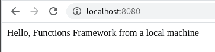
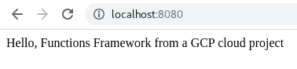

# 第四章：开发 Cloud Functions

在本章中，我们将提供 Google Cloud Functions 的概述。它将帮助您深入了解 Google Cloud Functions 的背景、原因及其工作原理。了解任何技术及其用例的基础将有助于在现实世界中进行集成和应用。

为了实现这一目标，我们将通过本章节构建一个应用程序，以展示 Cloud Functions 的一些关键方面。

本章涵盖的主题包括以下内容：

+   介绍 Google Cloud Functions

+   使用 Functions Framework 进行开发

+   探索 Cloud Functions 的工作流程

+   理解 HTTP 协议

# 技术要求

在本章中，要完成练习，您将需要一个 Google Cloud 项目或一个 Qwiklabs 账户。

您可以在 GitHub 书籍存储库的`ch04`子目录中找到本章的代码文件，链接为[`github.com/PacktPublishing/Hands-on-Serverless-Computing-with-Google-Cloud/tree/master/ch04`](https://github.com/PacktPublishing/Hands-on-Serverless-Computing-with-Google-Cloud/tree/master/ch04)。

当您阅读本书中的代码片段时，您会注意到在一些情况下，代码/输出的几行已被删除并替换为省略号（`...`）。省略号的使用是为了只展示相关的代码/输出。完整的代码可在上述链接的 GitHub 上找到。

# 介绍 Google Cloud Functions

Google Cloud 上关于 Cloud Functions 的描述表明，这是一个事件驱动的无服务器计算平台。这意味着函数通过 HTTP 端点或通过后台服务（例如 Google Cloud Storage 或 Cloud Pub/Sub 以及 Google Cloud 内的其他源）触发。在操作上，Cloud Functions 是*单次使用*的代码片段，部署迅速，并在多个服务之间提供*粘合*。Cloud Functions 的有趣之处在于，它们可以像传统应用程序一样轻松地进行组合。例如，完全可以创建几个 HTTP 端点函数，链接到 Cloud Pub/Sub 后端，通过保持服务简单，可以快速完成构建。

虽然函数的默认设置是公开的，但可以为功能启用身份验证以确保其运行环境的安全性。Cloud Functions 使用服务账号执行，并可通过 Google Cloud **身份和访问管理**（**IAM**）进行配置。需要注意的是，函数不共享内存空间，这意味着每个执行实例都处于隔离的上下文中。

此外，需要注意的是函数具有无状态性质；因此，不应期望在 Cloud Function 中保留信息。

这个场景的例外情况是像持久化数据库连接这样的操作，这些连接应该在代码中全局存储。这样做意味着下次调用云函数时，不需要引入额外的延迟来获取连接信息。

此外，以下属性是云函数 DNA 的核心：

+   它们在安全的操作环境中运行。

+   它们在函数之间不共享内存。

+   没有状态保持。

使用云函数提供了一种极好的方式来执行单一目的的云函数，而无需耗费大量时间编写应用程序代码。更多的使用场景将在以下部分中介绍。

# 定义使用场景

随着开发人员对云基础设施的了解加深，一个令人兴奋的结果是轻量级函数的演变。想想你每天使用的应用程序，它们是如何随着时间的推移而发展的。现在有多少个应用程序带有可以独立于应用程序使用的 HTTP 端点？如果一切都变成 API，那会怎样？这就像日志处理的情况，记录曾经以专有格式保存在内部。后来有人想到将应用程序数据导出到集中式解决方案来捕获信息。出现了一个转折点，我们都接受了这个典型的模式，成为了日志管理的事实标准。

回到云函数—考虑一下，当你拥有可以轻松集成的标准解决方案和模式时，开发一个应用程序会变得多么方便。同时，考虑一下为了确保应用程序保持一定的兼容性，前期需要设计多少内容。使用像 HTTP 这样的协议提供了一个广泛被认可的、易于理解的接口。拥有一个典型的参考框架为推动行业发展提供了极好的方法，而 HTTP 恰恰是推动抽象接口开发的载体。因此，在接下来的几节中，我们将讨论云函数最适合的使用场景。

# 处理后端服务

后端无服务器计算由像 Cloud Pub/Sub 和 Cloud Storage 这样的服务触发。这些服务的范围因能够将不同的 Google Cloud 服务与云函数集成而变得更加有趣。

我们已经知道可以在许多场景中使用 Cloud Functions。如前文的用例介绍所述，无服务器后端处理是这个解决方案的一个优秀应用场景。在这种情况下，Cloud Function 的设计旨在处理请求并提供特定信息。此请求展示了服务的特定签名，封装了完成处理一些任意数据所需的信息。在处理开始时，函数会响应并指示其已完成分配的任务。响应可以标明成功或失败；然而，就服务而言，它的生命周期已经结束，且将不再存在。

# 处理实时数据

另一个非常适合无服务器计算的场景是实时数据处理。在这种情况下，Cloud Functions 的按需提供能力使其能够满足设计要求较低延迟的服务的处理需求。正如我们在本书前面所讨论的，理解几个关键属性可能对开发解决方案非常有帮助。能够在短时间内快速提供基础设施是需要实时处理的解决方案中的一个重要因素。Cloud Functions 支持在内存分配小于 1,024 MB 的情况下启动时间少于 2.5 秒，这在需要立即处理的应用程序中尤为有益。随着许多系统从批处理转向近实时处理，采用这些能力的情况将变得越来越普遍。因此，理解如何在设计的服务中适应并结合这些模式变得越来越重要。

除了前面章节中提到的示例场景外，还有许多其他的用例。使用 Cloud Functions 可以最大限度地减少集成代码所需的工作，并且消除了提供相关基础设施的义务。

使用 Cloud Functions 几乎不需要额外了解后端架构。事实上，只要你熟悉某种语言运行时环境，就可以非常快速地开始使用。尽管如此，我们仍然应该花时间解释一下后台发生了什么，以及如何扩展这些功能以满足你的需求。

在接下来的章节中，我们将继续讨论函数框架。Google Cloud 极力确保开发者能够获得优秀的体验。实现这一目标通常意味着允许开发者在他们现有的环境中工作。那么，如何在本地工作同时又能够将代码部署到云环境中呢？

# 使用函数框架进行开发

此时，请花点时间考虑我们一直在讨论的 Functions Framework 的好处——Google Cloud 上的各种选项，意味着我们可以在不同的环境中运行代码。作为一个以开发者为中心的平台，允许工程师在不同的上下文中使用他们的代码是非常有利的。

# 介绍 Functions Framework

Functions Framework 是一个开源项目，可以让您在多种环境中构建函数，例如本地环境。就像任何魔术一样，美丽之处不在于理解幻觉的机制，而是它让你感受到的方式。在这个例子中，让我们拉开帷幕看看这个特定魔术是如何完成的，以及在 Cloud Functions 方面意味着什么。

那么为什么我们需要类似这样的东西呢？嗯，在本地工作，通常是高度定制化的环境，为开发者提供了友好的舒适区。您工作的上下文将会是熟悉的，并且工具、位置和访问都可以轻松检查和验证。在这种方式下工作具有固有的舒适感。转向云端会从用户那里移除一些心理上的舒适感。

尽管与在云中运行代码的最终目标相悖，但具备在本地工作的能力是开发人员想要做的事情。能够使用 Cloud Functions 在多种环境中工作将我们带到了 Functions Framework。这个框架是一个轻量级的依赖项，允许开发人员在一系列设置中运行简单的接口，例如以下设置：

+   云函数

+   本地开发

+   Cloud Run 和 Cloud Run for Anthos

+   Knative 环境

建立在**函数即服务**（**FaaS**）平台上为 Google Cloud，此框架的可用性提供了跨多个环境实现可移植性的简单机制。要将代码整合到项目中，只需添加相关的包。在接下来的部分，我们将通过一个简单的示例来演示其在项目中的使用。在下面的案例中，我们创建一个基本的 Node 应用程序来处理一些基于 web 的信息。

# 在本地部署应用程序使用 Functions Framework

大多数开发人员更喜欢在开发环境中工作的本地体验。Functions Framework 为 Cloud Functions 开发人员提供了在本地工作环境中继续使用这种能力，并无缝地将其代码传播到云端的能力：

1.  首先，为要构建的示例代码创建一个目录并初始化环境。在我的示例中，我创建了一个名为`functions-framework`的目录，并将其用于开发我的代码。

需要注意的是，在我的本地环境中，我正在使用 Node v10+，这是使用 Functions Framework 的要求。此外，我在测试机上安装了 npm v6.9.0。

1.  要检查您环境中的 Node 版本，请运行以下命令：

```
node -v
```

1.  使用编辑器创建一个名为`index.js`的文件，并添加以下内容：

```
exports.helloWorldLocal = (req, res) => {
    res.send('Hello, Functions Framework from a local machine');
};
```

1.  要创建一个模板`package.json`文件，从命令行运行`npm init`。根据需要编辑内容：

```
{
    "name": "lab01_FF",
    "version": "1.0.0",
    "description": "Example use of the Functions Framework (FaaS)",
    "main": "index.js",
    "scripts": {
    "test": "echo \"Error: no test specified\" && exit 1"
    },
    "author": "Rich Rose",
    "license": "ISC"
}
```

如上面的代码片段所示，我已经在我的文件中添加了最基本的内容。

1.  接下来，安装`functions-framework`包。我假设这个包尚未安装在你的本地机器上。要安装此包，你将使用`npm`来获取必要的包信息：

```
npm install @google-cloud/functions-framework
```

1.  完成此命令后，你会看到`package.json`文件已经更新，包含对 Functions Framework 的引用，位于`dependencies`类别下，如下所示：

```
{
    "name": "lab01_FF",
    "version": "1.0.0",
    "description": "Example use of the Functions Framework (FaaS)",
    "main": "index.js",
    "scripts": {
        "test": "echo \"Error: no test specified\" && exit 1"
    },
    "author": "Rich Rose",
    "license": "ISC",
    "dependencies": {
        "@google-cloud/functions-framework": "¹.1.1"
    }
}
```

现在我们的环境已经准备好构建函数了，接下来让我们创建一个非常简单的应用程序来测试我们的环境。

1.  通过我们新的代码，我们需要告诉应用程序在运行时执行一个脚本。在现有的`package.json`中，添加以下代码来调用 Functions Framework 并传递一个`target`函数：

```
{
    "name": "lab01_FF",
    "version": "1.0.0",
    "description": "Example use of the Functions Framework (FaaS)",
    "main": "index.js",
    "scripts": {
        "start": "functions-framework --target=helloWorldLocal"
        "test": "echo \"Error: no test specified\" && exit 1"
    },
    "author": "Rich Rose",
    "license": "ISC",
    "dependencies": {
        "@google-cloud/functions-framework": "¹.1.1"
    }
}
```

做得好；现在我们已经准备好使用 Functions Framework 的`index.js`和`package.json`文件。

1.  使用标准的调用方法从命令行运行应用程序`npm start`，本地运行应用程序。

1.  注意，在我们的示例环境中，运行的应用程序绑定到 HTTP 协议上的端口`8080`。打开浏览器并访问此 URL `http://localhost:8080`，以查看应用程序的输出，截图如下所示：



使用这个框架，在开发机器上运行本地代码是微不足道的。然而，如果我们想要部署到云端，这种场景会有什么不同呢？在下一节中，我们将探讨如何将代码部署到云端。

# 使用 Functions Framework 将应用程序部署到云端

当将本地应用程序迁移到云环境时，令人惊讶的是，在准备工作方面，我们需要做的事情很少。在这个例子中，我假设你已经安装并初始化了 Google Cloud SDK，以便你能够连接和配置 Google Cloud 上的资源。

为了更清晰地说明，我将创建另一个说法稍有不同的函数；不过，你可以使用之前代码中定义的相同云函数：

1.  在`index.js`文件中，创建一个名为`helloWorldCloud`的第二个函数。

1.  给这个新函数赋予之前定义的属性；不过，我们将使用不同的信息来说明调用的是不同的函数：

```
exports.helloWorldCloud = (req, res) => {
    res.send('Hello, Functions Framework from a Google Cloud project');
};
```

1.  保存新应用程序的内容并进行测试，确保它像上次运行时一样正常工作。

1.  从命令行运行`npm start`。记住，我们在这个版本中唯一更改的是代码库。

1.  运行`npm start`命令后，我们可以浏览到`localhost:8080`并看到来自我们应用程序的信息。


1.  现在，我们希望通过部署云函数在云端运行我们的代码库。在这个实例中，我们依赖 Cloud SDK 将我们的代码运行在 Google Cloud 项目中。运行以下命令：

```
gcloud functions deploy helloWorldCloud --runtime nodejs10 --trigger-http --region us-central1
```

1.  为了确认上传的源信息是否成功创建，请查看正在运行的云函数源代码。这里，我们可以看到它包含了与上传到 Google Cloud 的已归档源代码相同的内容。然而，显示结果中显示的是与我们新函数相关的消息。



到目前为止，我们已经了解了如何将代码部署到本地环境，并使用云函数将其部署到 Google Cloud 项目中。但云函数究竟是做什么的，它能做什么呢？在下一节中，我们将进一步探讨该服务的相关好处和使用场景。

# 探索云函数工作流

所以，看来云函数非常有用，并且与函数框架结合使用时，似乎是一对天作之合。而且，这种整体方法看起来非常具有扩展性，与 Google Cloud 内的其他产品和服务协作也变得大大简化。所以，如果你已经在*Google Cloud 团队*中，使用云函数显然是个明智的选择。

对于那些不在*Google Cloud 团队*或可能持观望态度的朋友，这背后还有更多的故事。无服务器（Serverless）是一个通用术语，多年来曾受到一些批评。对大多数人来说，无服务器意味着部署代码时无需管理基础设施。对其他人来说，这意味着服务能立即可用，并能够根据应用需求进行合适的调整，并具备自愈能力。

根据你的角度，云函数可能满足或不满足你的需求。人们常提到的主要问题是部署代码所花费的时间。*为什么函数不能立即可用？*，*为什么内存受到限制？*，等等——*当我使用供应商 X 时，服务能立即使用，内存没有限制，而且每次部署时他们还会提供茶水和蛋糕！*

在深入了解云函数之前，现在似乎是个不错的时机来讨论一下在我们将代码部署到云端时，幕后发生了什么。Google 为数据处理管道的关键产品绘制了一张出色的架构图。数据生命周期从架构的角度来看非常有用，它概述了能够呈现管道中特定方面的产品。就数据摄取、存储、处理和分析这些常见主题而言，这种方法提供了一种令人兴奋的方式来分解组件架构。

那么，如何创建一个函数呢？让我们在下一节中详细探讨。

# 云函数属性

如前所述，Cloud Functions 支持 Google Cloud 上的多种运行时，包括 Node.js、Python、Go、Java 和 Ruby。开始使用 Cloud Functions 如同访问 Google Cloud 控制台并选择最合适的运行时一样简单。每个运行时都包括模板代码，提供了一个主要 Cloud Function 的蓝图以及运行该示例所需的所有辅助系统代码。

代码的一个关键考虑因素是算法处理所需的时间以及这一点有多重要。例如，如果算法是用户体验的一部分，那么任何处理延迟都可能会被最终用户察觉。异步代码允许将长期的处理操作从主线程中卸载并在后台执行。采取此行动对于保持整个应用程序性能至关重要，因为它提供了在需要快速响应和缓慢响应的资源之间进行区分的能力。

此外，正如你现在所知道的，函数通常是无状态的应用程序，不应持久化任何信息。作为一般规则，这意味着该服务采用一个短生命周期，其中数据处理和任务完成。在代码中使用异步调用来减少长期的请求和响应周期，能够减少潜在的延迟。

对于有状态的应用程序，维护信息的需求在数据持久化相关的潜在延迟方面提出了问题。应该清楚，任何需要读/写周期的操作，如果不在内存中，将会引入一定的延迟。尽量减少这种延迟提出了一个有趣的设计问题，最终取决于你愿意放弃什么，以及你希望在性能、松耦合、数据设计等方面走多远。

要调用函数，Google Cloud 上的事件通知机制是触发器。触发器是开始开发 Cloud Function 时需要考虑的重要因素。函数设计确实需要一些思考，以确定需要哪些组件来交付一个合适的模型。作为事件驱动架构，提供了一些可用的选项，如下表所示：

| **触发器** | **事件** | **目标** |
| --- | --- | --- |
| HTTP | HTTP | URL |
| Cloud Pub/Sub | 主题 |  |
| Cloud 存储 |

+   完成/创建

+   删除

+   存档

+   元数据

| 存储桶 |
| --- |
| Cloud Firestore |

+   写入

+   创建

+   更新

+   删除

|  |
| --- |
| Google Analytics for Firebase | 日志 | 日志事件名称 |
| Firebase 身份验证 |

+   创建

+   删除

|  |
| --- |
| Firebase 实时数据库 |

+   写入

+   创建

+   更新

+   删除

| 数据库 |
| --- |
| Firebase 远程配置 | `remoteconfig.update` |  |

除了运行时之外，在创建 Cloud Function 时还包括其他一些属性。内存分配是一个重要的考虑因素，因为预期的处理是在内存中进行的。Cloud Functions 提供从 128 KB 到 2 GB 的内存分配，开发者可以根据应用程序的需求进行调整。

在进入更一般的选项之前，值得简要了解身份验证及其与 Cloud Functions 的关系。

# 身份验证

Cloud Functions 的默认身份验证代表公共访问；也就是说，任何人都可以访问。从 Cloud Functions 的配置屏幕中，选择允许未经身份验证的调用以创建一个公开暴露的端点。`allUsers`的 IAM 设置为与 Cloud Function 相关联的服务账户提供公共访问权限。函数的调用依赖于服务账户的关联。服务账户是一个用于非交互式访问的特定账户，就像入口是为另一台计算机而不是人类设计的。用户账户被分配角色权限，并绑定到服务上。默认情况下，Cloud Functions 绑定了`allUser`权限，但在函数创建之前或之后可以进行更改。

请注意，初始的功能指定允许通过 IAM 设置进行调整。这种方法使 Cloud Functions 与 Google Cloud 上的其他服务保持一致。本书后续将讨论 Cloud Functions 的安全性，并涉及与 Cloud Functions 相关的服务账户配置，以限制权限。

现在，让我们继续讨论有关访问函数源版本的选项。

# 源代码管理

使用源代码时会面临许多挑战。幸运的是，Cloud Functions 提供了几种集成源代码的选项。可以通过以下来源访问 Cloud Functions 的源代码：

+   **内联编辑器**：在 Google Cloud 控制台中创建和修改函数代码。

+   **ZIP 上传**：将本地 ZIP 文件上传到中介的 Cloud Storage 存储桶。

+   **来自 Cloud Storage 的 ZIP**：使用位于 Cloud Storage 存储桶中的现有 ZIP 文件。

+   **Cloud Source 仓库**：使用源代码版本控制。

对于快速开发，内联编辑器非常有用；然而，在编写更复杂的代码时，使用其他多种选项可能更有意义。在大多数情况下，您可以继续使用自己喜欢的编辑器，并通过符合需求的任何方法上传代码。

了解如何上传源代码之后，我们可以顺利进入下一个话题，即选择语言运行时。

# 使用不同的运行时语言

在接下来的几段中，我们将概述使用 Node、Python 和 Go 的基本函数，并讨论各种运行时语言之间的高层次差异。

# Node.js

我们的讨论从 Node.js（v10）开始。在这个模板代码中，我们可以看到实际的函数由几行代码组成。就 Node.js 而言，使用的具体框架是 Express.js。Express.js 是一个简洁的框架，与 Node.js 配合使用，通过增加如路由中间件和 HTML 渲染等功能来增强其功能。

在下面的示例代码中，我们可以看到一个基于 `exports.helloWorld` 的函数定义。`exports` 关键字表示该函数会在部署后执行（即，作为可调用函数暴露）。还要注意，待导出的服务需要两个参数，分别映射到 HTTP 请求和响应的值。

默认的 Google Cloud Function（用 Node.js 编写）如下所示：

```
1\. /**
2\. * Responds to any HTTP request.
3\. *
4\. * @param {!express:Request} req HTTP request context.
5\. * @param {!express:Response} res HTTP response context.
6\. */
7\. exports.helloWorld = (req, res) => {
8\.     let message = req.query.message || req.body.message || 'Hello World!';
9\.     res.status(200).send(message);
10.};
```

函数体检查所做的请求，以确定是否添加了查询消息或消息体。

查阅 Express.js 文档让我们了解更多关于消息赋值语句的访问要求。对于 GET 消息，我们了解到查询可以将附加数据传递给函数。

如果没有，则会返回默认的 `Hello World` 消息到消息变量。接下来，`res.status` 被设置为 200 的值，并将消息变量添加到响应中。记得在前面讨论的 HTTP 响应码中，200 表示交易成功。

# Python

目前在 Google Cloud 上支持的 Python 版本是 3.7。从示例代码中我们看不到的是 Flask 包处理了 HTTP 通信。一眼看上去，Node.js 示例中显然包含了比这更多的代码。

首先，我们定义我们的函数，并且可以看到命名约定的一个明显不同之处。在 Python 中，我们将服务命名为 `hello_world`，这与 Node.js 示例中的命名不同。你可以自由更改名称以保持一致，但这并不影响最终结果。确保你使用正确的函数名称执行，因为这是一个可能很难修复的错误：

```
def hello_world(request):
""" Responds to any HTTP request.
    Args:
        request (flask.Request): HTTP request object.
        Returns:
    The response text or any set of values that can be turned into a
    Response object using
    `make_response
    <http://flask.pocoo.org/docs/1.0/api/#flask.Flask.make_response>`.
"""
request_json = request.get_json()
if request.args and 'message' in request.args:
    return request.args.get('message')
elif request_json and 'message' in request_json:
    return request_json['message']
else:
    return f'Hello World!'
```

在函数体内，我们可以看到调用返回一个 JSON 对象。类似于 Node.js Cloud Function，我们检查传递的消息参数，看看是否要覆盖默认消息。为了确保兼容性，我们再次确保这个示例适用于 GET 和 POST 消息。最后，如果用户没有按要求格式添加消息，我们将返回默认的 `Hello World!` 消息。

# Go

Go 目前在 Google Cloud 上支持版本 1.11 及以上。如你所料，每个版本发布时都会保持修订的兼容性，因此建议保持与新版本的兼容性。

在下面的示例代码中，我们导入了一些包，以使我们的应用程序能够执行必要的 HTTP 和 JSON 访问。函数签名保持不变，使用请求和响应参数，作为函数的入口。

对于函数体，如果程序未提供信息，我们的代码将默认显示标准消息：

```
// Package p contains an HTTP Cloud Function.
package p
    import (
        "encoding/json"
        "fmt"
        "html"
    "net/http"
)
// HelloWorld prints the JSON encoded "message" field in the body
// of the request or "Hello, World!" if there isn't one.
func HelloWorld(w http.ResponseWriter, r *http.Request) {
    var d struct {
        Message string 'json:"message"'
    }
    if err := json.NewDecoder(r.Body).Decode(&d); err != nil {
        fmt.Fprint(w, "Hello World!")
        return
    }
    if d.Message == "" {
        fmt.Fprint(w, "Hello World!")
        return
    }
    fmt.Fprint(w, html.EscapeString(d.Message))
}
```

使用 Cloud Functions，我们看到，无论选择哪种运行时语言，许多属性仍然是共享的。在语言方面，我们还观察了用于 Node、Python 和 Go 的不同形式的示例代码。

在编写我们的函数时，寻找设计模式将帮助我们避免重复造轮子。我们了解了更多关于可用语言运行时的信息，并看到了与每个运行时相关的样板代码示例。要测试该函数，我们需要一个触发事件，在下一节中，我们将讨论这种情况的处理方法。

# 测试运行时触发事件

为了测试函数，我们可以创建一些数据来确认我们服务的成功标准。同样，Cloud Functions 可以通过允许在测试窗口中直接传递 JSON 数据给函数来帮助完成这项任务：

1.  云函数的典型 URL 将类似于以下链接的语法。访问端点将访问与 Cloud Function 关联的默认信息：

```
https://[REGION]-[PROJECT].cloudfunctions.net/[CLOUD-FUNCTION]
```

1.  对于模板代码，我们可以通过添加一些额外信息到 URL 来替换新消息，具体如下：

```
https://[REGION]-[PROJECT].cloudfunctions.net/[CLOUD-FUNCTION]?message=Yo%20Gabba %20Gabba!
```

在此示例中，`req.query`属性返回一个包含信息的对象，本例中是要显示的消息，代替默认的`Hello World!`。

1.  如果您继续执行此函数而不输入任何额外的参数，则将显示`Hello World`消息，并生成`200`响应代码。通过这种方式触发事件类似于直接访问函数 URL，因此不会将任何其他信息合并到查询中：

| **消息** | **触发事件** | **输出** | **响应返回码** |
| --- | --- | --- | --- |
| 1 | `{}` | `Hello World!` | `200` |

1.  或者，通过添加一些参数到触发事件，运行函数时可以输出特定的字符串。

| **消息** | **触发事件** | **输出** | **响应返回码** |
| --- | --- | --- | --- |
| 2 | `{"message":"Yo Gabba Gabba!"}` | `Yo Gabba Gabba!` | `200` |

在上述示例中显示的触发事件中添加了一个 JSON 字符串。在这种情况下，函数的输出将更改以显示之前输入的字符串。与之前一样，生成的返回代码是`200`。

能够测试应用程序对任何开发者工作流程都是基本的。然而，同样重要的是能够引用日志和应用程序特定信息以进行监控。在 Google Cloud 中，我们使用 Stackdriver 来实现这一点。

# Stackdriver

每次流量到达终端时，关于云函数的信息会自动在 Stackdriver 中捕获。如果你不熟悉 Stackdriver，它是 Google Cloud 的集中式日志记录和监控系统。我们将在本书的第十章“*Cloud Run 实验室*”中深入讨论 Stackdriver；然而，当前要知道的是，这里是访问函数实时信息的地方。要搜索函数执行，可以在 Stackdriver 中使用过滤器，如下所示：

| **字段** | **示例内容** |
| --- | --- |
| `resource.type` | `cloud_function` |
| `resource.labels.function_name` | `function-1` |
| `resource.labels.region` | `us-central1` |
| `labels.execution_id` | `4ubpvdgz7c8w` |

选择使用哪种运行时语言的决定因素在很大程度上取决于你个人的经验。我在本书中使用了 Node.js，因为它非常易于上手。它的界面简单高效，理解代码不需要太多思考。当然，你可能有自己的最爱，且希望在那些运行时语言中也有类似的包可用。

使用模板代码是你旅程的开始，所以不要害怕尝试不同的方法和技巧。在接下来的部分，我们将概述 HTTP 协议。

# 理解 HTTP 协议

在我们讨论云函数的背景下，理解 HTTP 协议的工作原理至关重要——学习 API 的基础，以便实现请求与响应之间的通信。

HTTP 动词，如 GET、PUT、POST、DELETE 等，为 HTTP 协议执行其各种功能提供了基础。这种契约的设计经过了时间的考验，随着更高级用例的出现，它变得越来越普及。通常运行在 TCP 上，该协议需要一个可靠的媒介来传输消息——利用像 TCP 这样的契约为数据传输和机器间通信时的确认建立了一定的弹性。在常见的使用方法中，GET 和 POST 是应用中最常用的方法。

在接下来的部分，我们将简要概述这些方法，以帮助理解它们的使用。

# 定义 GET/POST 方法

访问网页通常使用 GET 方法来获取存储在远程服务器上的内容。每当你浏览互联网并查看各种网站的内容时，HTTP GET 方法都会被用来实现这一点。GET 方法在最基本的形式上是 HTTP 的幂等获取机制。将 GET 方法看作一个简单的获取机制，也就是*从远程服务器获取这些信息*。向远程服务器发送这个命令，它会提供一个消息响应。

GET 方法也允许将查询信息发送到远程服务器；然而，这些信息会显示在 URL 中。消息负载通常以字节流的形式提供，之后远程服务器会关闭开放的 TCP 连接，表示事务已完成。

在处理网页时，除了使用 GET 方法从网站获取信息外，还有 POST 方法。POST 方法提供了将额外信息作为查询的一部分发送到远程服务器的能力。与 GET 方法不同，查询信息不会通过 URL 暴露，并且请求是非幂等的。这些特性使得 POST 方法更适合用于发送不应通过 URL 曝露的内容，并且可能发生变化的信息。这类方式的典型应用是 Web 表单，其中字段值作为 HTTP 请求查询的一部分发送。

一旦请求/响应周期完成，系统将返回一个表示事务状态的状态码。在接下来的主题中，HTTP 代码的概述将概述这些常见类别。

# 解码 HTTP 响应码

一个 HTTP 响应的三位数响应码表示通信是否成功。这些响应码对于确保任何基于 HTTP 的应用服务器的顺利运行至关重要。

如果你曾经需要配置或维护一个 Web 服务器，以下信息对你来说无疑会非常熟悉：

| **返回值** | **类型** | **描述** |
| --- | --- | --- |
| 1xx | 信息 | 一个信息性响应码，表示请求已被理解。 |
| 2xx | 成功 | 确认请求成功的最常见方式是返回此状态码。 |
| 3xx | 重定向 | 与客户端请求相关的重定向；通常不需要用户交互，因为重定向会自动执行以完成操作。 |
| 4xx | 客户端错误 | 基于请求的错误，表示客户端发送到服务器的信息有问题。 |
| 5xx | 服务器错误 | 与服务器端通信响应相关的错误，表示请求无法完成。 |

HTTP 状态码的完整列表由**互联网编号分配局**（**IANA**）维护。与 HTTP 状态码相关的广泛类别确保在处理此领域时能涵盖大多数情况。

另一个可能对扩展理解有帮助的领域是如何跨域处理网页内容。在接下来的章节中，我们将简要概述跨域资源共享（CORS）。

# 使用跨域资源共享（CORS）

在 HTTP 头中启用 CORS 可以实现跨域执行一系列操作。添加这个功能提供了一种超越传统单域客户端与服务器信息交换的额外能力。正如你所预期的，客户端的责任是发起请求，并在请求中指明方法和头部要求。从服务器的角度来看，头部属性的范围更多，允许实现更丰富的功能集。

一个应用可能并不总是在同一域中执行。在这种情况下，CORS 提供了跨域通信的能力：

| **客户端** | **服务器** |
| --- | --- |

|

+   起源

+   Access-Control-Request-Method

+   Access-Control-Request-Headers

|

+   Access-Control-Allow-Origin

+   Access-Control-Allow-Credentials

+   Access-Control-Expose-Headers

+   Access-Control-Max-Age

+   Access-Control-Allow-Methods

+   Access-Control-Allow-Headers

|

最后，我们概述了与 Cloud Functions 相关的事件驱动触发器。通过查看这些选项，可以清楚地看到，这些触发器能够满足许多构建系统时相关的用例。将事件和触发器视为*胶水*或*乐高*积木是一个很好的比喻，能够帮助理解这些组件的使用。当涉及到构建新组件或设计无服务器应用时，通常令人惊讶的是这些构建块能如此轻松地协同工作。但事情并不止于此——想象一下，超越 Google Cloud，使用其他云服务商的服务。无服务器为现有设计和应用开发过程带来了真正激动人心的变革。专注于提供清晰接口并具有明确输入和输出的单次使用功能，可以提高交付和维护效率。

逐一讨论了每个选项时，我们讨论了如何在构建无服务器应用时充分发挥其重要作用。为了实现这一点，一种适应性的架构不仅仅需要云函数（例如，在集成认证（通过 Firebase）、代理访问（通过 Cloud Endpoints）或临时存储（通过 Google Cloud Storage）时），还需要更多的东西。遵循最佳实践并结合不同的方法并非“一刀切”的事宜，你能够无缝地使用开源和商业软件，超越无服务器平台，关注系统的更广泛方面。虽然无服务器提供了一种实现扩展的简便方法，但在你其他部分引入网络扩展时，仍然需要仔细规划。

# 总结

在本章中，我们概述了 Cloud Functions 的整体情况，并讨论了它在 Google Cloud 无服务器产品中的位置。此外，我们还查看了几个与使用 FaaS 相关的边缘话题，例如 HTTP2 和数据生命周期。

通过探索运行时，并观察整章关联的代码，我们现在知道如何在多种语言中构建云函数。我们还了解到通过将监控和日志记录纳入开发工作流程，如何测试和解决问题。正如您所知，Google 提供了一整套工具和服务，让您能够迅速开发**最小可行产品**（**MVP**）。

在下一章中，我们将更深入地讨论一些示例。构建应用程序是学习无服务器应用程序环境关键要素的绝佳方式。

# 问题

1.  Cloud Functions 运行在哪个端口？

1.  Cloud Pub/Sub 使用的是哪种触发器？

1.  Google Cloud Functions 支持哪些运行时语言？

1.  成功的 HTTP 响应代码是什么？

1.  客户端错误的 HTTP 响应代码是什么？

1.  服务器端错误的 HTTP 响应代码是什么？

1.  CORS 的目的是什么？

1.  如何启用 CORS？

# 进一步阅读

+   **HTTP/2 简介**：[`developers.google.com/web/fundamentals/performance/http2`](https://developers.google.com/web/fundamentals/performance/http2)

+   **HTTP/2 负载均衡与 Ingress**：[`cloud.google.com/kubernetes-engine/docs/how-to/ingress-http2`](https://cloud.google.com/kubernetes-engine/docs/how-to/ingress-http2)

+   **函数框架**：[`cloud.google.com/functions/docs/functions-framework`](https://cloud.google.com/functions/docs/functions-framework)
