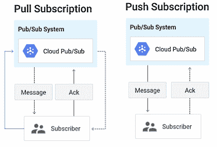
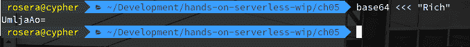
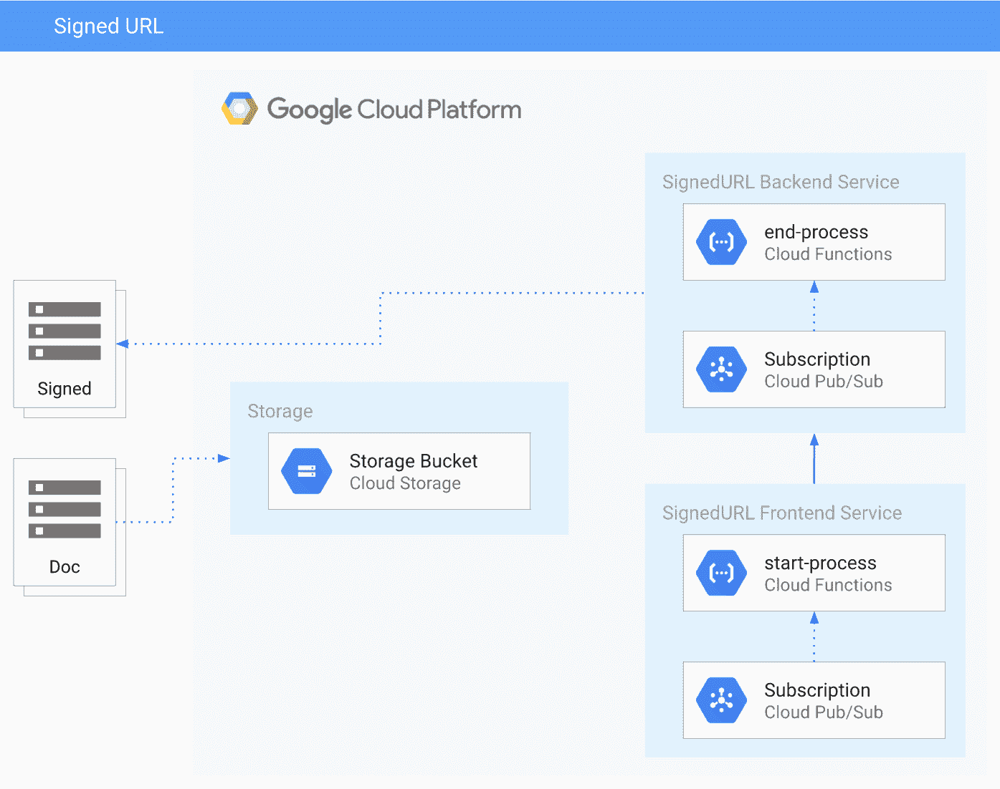
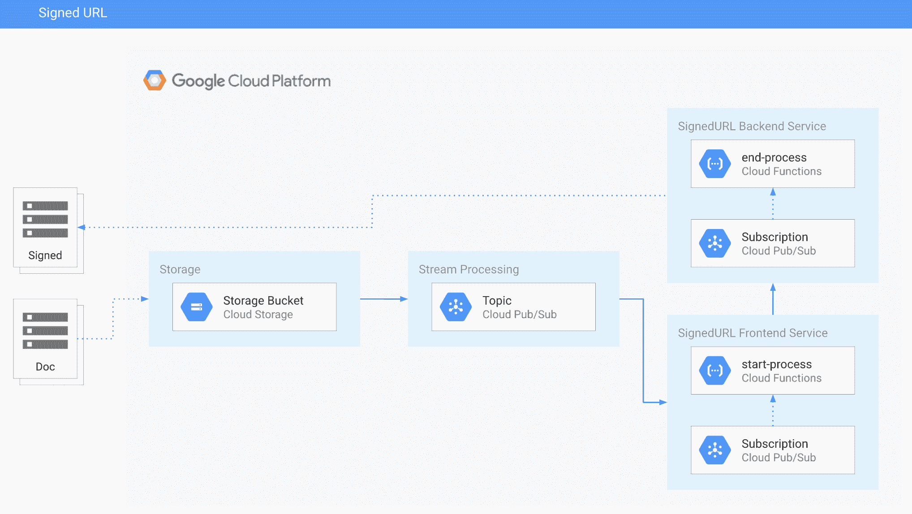

# 第五章：探索函数即服务（Functions as a Service）

在本章中，我们将深入研究 Google Cloud 上的 Cloud Functions。我们已经涵盖了相当一部分内容；然而，还有很多知识需要了解和学习。到目前为止，我们的主要关注点是理解 HTTP 端点，并构建一些简单的应用程序，以展示其相关功能。除了令人兴奋的 HTTP 事件功能外，还有后台功能，即那些不需要访问外部 HTTP 端点的功能。

为了加深我们对这些类型函数的理解，我们将在本章中构建几个工具，以说明各种概念和技术。我们将继续利用 Functions 框架创建代码，并开始集成外部系统，以展示构建满足我们需求的工具的简便性。

在本章稍后，我们将基于创建`SignedURL`函数，利用 Google API 来构建一个简单的应用程序，提供一种建立时间限制 URL 的方式。源数据将存储在 Cloud Storage 上，我们将扩展我们的函数，添加一个简单的前端。最后，我们将继续使用 Functions 框架，使我们能够在本地工作并保持与 Google Cloud Functions 的兼容性。

在本章中，我们将学习以下主题：

+   开发 HTTP 端点应用程序

+   探索 Cloud Functions 和 Google API

+   探索 Google Cloud Storage 事件

+   构建增强的签名 URL 服务

# 技术要求

为了完成本章的练习，你需要一个 Google Cloud 项目或一个 Qwiklabs 账户。

你可以在书籍的 GitHub 代码库中找到本章的代码文件，位于`ch05`子目录下，链接为[`github.com/PacktPublishing/Hands-on-Serverless-Computing-with-Google-Cloud/tree/master/ch05`](https://github.com/PacktPublishing/Hands-on-Serverless-Computing-with-Google-Cloud/tree/master/ch05)。

当你在书中浏览代码片段时，你会注意到在一些情况下，代码/输出中的几行已被移除，并用省略号（`...`）替代。使用省略号仅是为了显示相关的代码/输出。完整代码可以在 GitHub 上找到，链接已在前文提到。

# 开发 HTTP 端点应用程序

使用 Cloud Functions 可以让独立和孤立的组件创建扩展功能。这些组件或微服务提供了一个出色的方式来构建解耦的架构。在这个例子中，我们将回到基础，学习如何扩展我们的知识，以调用 Google Cloud API。

事件提供了响应与提供者相关的系统通知的能力。如前几章关于 Google Cloud 所述，这些提供者通过定义的提供者接口（如 Cloud Pub/Sub 和 Cloud Storage）呈现多个扩展服务的选项。

我们已经看过通过 URL 调用的 HTTP 函数。利用相同的语义标记（例如，GET/POST）和签名（例如，请求/响应）进行 HTTP 通信，这些类型的函数已经得到广泛理解，并可以在现有知识的基础上构建。由于 HTTP 的复杂性随着时间的推移逐渐抽象化，HTTP 构造的普遍理解代表了一个被广泛理解的 API。

然而，并非所有内容都支持 HTTP 端点；因此，需要另一种将提供者与现有服务集成的方法。后台（即异步）功能扩展了 Cloud Functions 模型，通过参数建立中间件接口，能够在不同组件之间传递数据。这类提供者的示例包括 Cloud Pub/Sub 和 Cloud Storage，它们都提供了丰富的消息传递和事件通知接口。在这两种情况下，任何呈现的数据都必须符合支持的标准模式，才能响应提供者接口。

此外，还需要定义触发器以调用后台 Cloud Functions。然而，集成机制会根据使用的触发器而变化。在接下来的章节中，我们将重点讨论 Google Cloud 上可用的不同类型的触发器。对于后台功能，Cloud Pub/Sub 和 Cloud Storage 将是主要讨论的领域；然而，还有许多其他触发器类型可供应用程序使用。

# 触发 Cloud Pub/Sub

Cloud Pub/Sub 触发器基于消息队列，在该队列中信息在发布者和订阅者之间传递：

+   *发布者* 负责与主题一起传播消息的模式。

+   *主题* 表示信息消费所在的可用队列。

+   消息队列的 *订阅者*（消费者）可以读取队列中关联的信息。

值得指出的是，一般来说，订阅分为拉取订阅和推送订阅，如下图所示：



在前面的图表中，您可以看到拉取和推送订阅类型的概述。

对于需要高吞吐量的场景，当前拉取机制是管理此类需求的最有效方式。

发布者和订阅者共同工作，使消息队列的两端能够将有效载荷从源头传送到目标。Cloud Pub/Sub 使用多种场景来提供信息的双向传输，确保源和目标之间的一致性。如你所料，Cloud Pub/Sub 关联了许多设计模式，确保数据传输按照所需的服务计划定期进行。

消息的分发使用全球分布的消息总线，使得系统之间能够交换信息。在这种情况下，Cloud Pub/Sub 的事件系统使用推送机制与 Cloud Functions 触发消息。定义了 `google.pubsub.topic.publish` 的触发器类型，用于管理 Cloud Functions 使用的事件，使你能够完全控制事件的发布。每次发布消息时，事件通知会确定要发布的消息负载。

除此之外，Cloud Pub/Sub 支持根据你的需求不同的设计模式。订阅者会为每个处理过的消息提供确认。若订阅者在 `ackDeadline` 阈值内未能确认消息，则该消息负载会被重新发送。根据你的使用场景，以下模式是考虑将 Cloud Pub/Sub 纳入设计时的良好示例：

| **模式** | **描述** |
| --- | --- |
| 直通处理 | 简单的队列机制——从主题到订阅。 |
| 多个发布者 | 同一主题的多个发布者——这使得源消息可以并发处理。 |
| 多个订阅者 | 同一订阅的多个订阅者——这使你可以为通过订阅消费的原始主题设置不同的订阅者。 |

Cloud Pub/Sub 的事件具有定义的触发器值 `google.pubsub.topic.publish`。当有效负载消息发布到与 Cloud Function 关联的事件类型时，事件通知会被触发。输入数据将包含传递的消息负载，并执行指定的 Cloud Function，以将数据传递给任何设置为接收信息的订阅者。

以下示例说明了如何使用 Cloud Pub/Sub 和后台函数；展示的蓝图代码代表了 Google 使用的默认函数：

```
/**
* Triggered from a message on a Cloud Pub/Sub topic.
*
* @param {!Object} event Event payload.
* @param {!Object} context Metadata for the event.
*/
exports.helloPubSub = (event, context) => {
  const pubsubMessage = event.data;
  console.log(Buffer.from(pubsubMessage, 'base64').toString());
};
```

如你所见，背景函数定义的签名保持一致。我们定义了一个 `exports` 函数，触发器在此上定义了相应的操作。与事件信息相关的服务需要参数，即事件负载数据和事件元数据。在 Cloud Pub/Sub 的 Cloud Functions 示例中，该函数将获取消息队列的输入并将内容显示为日志条目。

创建 Cloud Pub/Sub 类型的事件触发器需要在函数初始化时创建一个主题。创建后，测试该服务展示的属性与我们之前看到的 HTTP 触发器相同，例如区域、内存分配、超时和最后的部署。然而，在这里，HTTP 端点被 Cloud Pub/Sub 的触发器类型及其关联的定义主题所替代。

测试该功能时，需要记住一个重要事项，那就是 Cloud Pub/Sub 期望其数据格式为 `base64`。请按照以下两个步骤进行操作：

1.  将数据转换为`base64`以触发来自 Cloud Functions 测试页面的事件。幸运的是，你可以通过在命令行输入以下内容，在 Google Cloud Shell 中完成此操作：

```
base64 <<< "Rich"
```

1.  前面命令的输出显示了输入文本的`base64`等效形式：



在前面的示例中，我们需要手动使用`base64`转换信息。如果你使用 Cloud Pub/Sub 菜单项或`gcloud pubsub topics publish`命令，这两个工具将自动转换你的文本消息。

从前面的内容中，你可以看出这个事件类型的原始力量，因为它可以在多个服务之间传递信息。例如，Stackdriver 支持 Cloud Pub/Sub 接口（Stackdriver 接收端）。了解这一点意味着可以使用 Cloud Pub/Sub 来在服务之间调用，例如，在 Stackdriver 中发布信息，并在 BigQuery 或 Cloud Storage 等服务中消费这些数据。

现在我们对 Cloud Pub/Sub 的功能和多样性有了更多了解，我们可以将注意力转向 Cloud Storage。

# 触发 Cloud Storage

如前几章所述，Cloud Storage 是一个具有生命周期和事件通知的对象数据存储。通常被称为桶（bucket），Cloud Storage 为你的工具库添加了一个高功能的通知机制。能够将中间存储集成到应用程序中，开辟了更多可能性，并且通过支持的关联事件类型，提供了将阶段门控应用于任何处理过程的手段。这种解决方案的灵活性意味着它是一个值得熟悉的服务，因为这种存储可以适用于多种场景。

存储的典型用例是临时存储（即应用程序可能需要存储一个中间文件，如音频或文本输出），或者作为一种廉价的存储形式，用于像静态网站这样的东西。在本章稍后，我们将展示一个示例，构建一个简单的网站，基于定义的模板来显示信息。

Cloud Storage 可以以多种不同的方式使用；然而，在这里，我们将主要集中在将其用作存储。事件类型关注的是通知诸如`finalize`、`delete`、`archive`和`metadataUpdate`等操作。需要注意的是，存储的通知机制利用 Cloud Pub/Sub 通知，以确保可扩展和灵活的消息传递。

在本节中，我们将涵盖 Cloud Storage 的一些最常见的用例。除此之外，事件类型还提到，你仍然可以保留所有现有的好处，例如生命周期访问、API 访问、支持不同存储类别以及安全/持久存储。

Google 提供了丰富的 API，学习如何访问这些 API 为您提供了访问不同服务的机会。由于 Cloud Storage API 的丰富性，支持许多事件类型。最常见的事件类型可能是 Cloud Storage 中对象的创建：

```
/**
* Triggered from a change to a Cloud Storage bucket.
*
* @param {!Object} event Data payload.
* @param {!Object} context Metadata for the event.
*/
exports.helloGCS = (event, context) => {
  const gcsEvent = event;
  console.log(`Processing file: ${gcsEvent.name}`);
  console.log(`Event Type: ${context.eventType}`);
};
```

在前面的例子中，当存储桶对象生成 *对象创建* 事件时，会触发通知。在设置函数时，一个关键要求是指定一个存储桶，函数将在其上响应操作。

值得注意的是，支持多个参数，使应用程序能够获取调用对象状态的进一步信息。如果事件传递了附加的元数据，这些高级事件元数据（如调用信息类型）也可以访问。此外，后台函数可以利用其他属性，如包含要处理的消息的数据。

从函数发出的通知在每种通知类型中都有类似的模式。您应该熟悉这种事件结构，因为无论使用何种服务，函数的使用模式都是非常一致的。

Google Cloud Storage 事件所引用的具体功能被捕获在事件参数中，这些参数会在服务运行时传递给 Cloud Function。前面列出的蓝图代码将记录已处理的事件通知以及存储在存储桶中的文件名。除此之外，更为关键的服务包括 Firebase Authentication 等额外触发器。然而，这些函数的模式在这里有所展示，随着其他触发器的可用，您应该能够平滑过渡并使用它们：

+   Google Cloud Firestore

+   Google Analytics for Firebase

+   Firebase Authentication

+   Firebase Realtime Database

+   Firebase Remote Config

到这时，您应该开始思考如何将这些触发器类型纳入到您的应用程序中。在使用函数时，重要的是要记住，服务应该是短暂的，并围绕轻量级组件构建。显然，有很多创新且实用的案例和示例将展示如何在实际应用中使用这些代码。Cloud Functions 的文档极其详细，能够回答您在实现过程中可能遇到的许多问题。

本章稍后，我们将查看一些使用这些通知类型的案例。首先，我们将看看如何利用 Google API 的丰富软件库。

# 探索 Cloud Functions 和 Google APIs

在这个例子中，我们将构建一个使用 Cloud Pub/Sub 提供弹性文档访问的应用程序。之前，我们介绍了我们的新朋友，Google Cloud Pub。现在我们将看到如何将此功能作为一个简单解决方案的一部分来利用。

我们的应用程序将创建一个时效性链接指向一个文本文件，只有经过身份验证的源才能访问。这个功能实际上是一个常见的日常用例，用于通过互联网安全地传输数据。

# 通用架构

要创建一个签名 URL，我们需要一个已经上传到存储桶中的现有文件。为了这个示例，我们将采取以下方法来开发所需的功能：



从前面的图示来看，我们将创建两个服务来创建一个签名 URL：

1.  **前端服务**：一个基于 HTTP 端点的简单服务，并将公开可用。

1.  **后端服务**：第二个服务，用于执行创建签名 URL 的后台功能。

接下来，让我们更详细地了解每个服务。

# 前端服务

我们的主要导出函数名为`gcpSecureURL`，它接受请求和响应参数，表明这是一个 HTTP 函数。这个签名在所有 Cloud Functions 中是一致的，提供了一种通用的方式来传递和接收应用程序中的信息。

从之前展示的架构图中，应该能明显看出我们的前端服务使用了 Cloud Pub/Sub。如本章前面所述，我们可以使用 Pub/Sub 向应用程序提供信息。在本例中，我们使用初始请求信息并将其添加到 Cloud Pub/Sub 的消息队列中。

首先，我们需要再次初始化我们的环境：

1.  创建一个名为`ch05`的新目录，并将其设为当前目录。

1.  创建一个名为`frontend-service`的新子目录。

1.  创建一个名为`backend-service`的第二个新子目录。

1.  到此时，您将拥有以下目录结构：

```
.
└── ch05
├── backend-service
└── frontend-service
```

1.  将`frontend-service`设置为当前目录。

1.  初始化该目录的`npm`包，即`npm init --yes`。

1.  然后，添加`pubsub`包，即`npm install @google-cloud/pubsub`。

为了处理前端呈现的信息，我们需要创建一个新的应用程序：

1.  创建一个名为`index.js`的新文件。

1.  将以下代码添加到`index.js`：

```
const {PubSub} = require('@google-cloud/pubsub');
const pubsub = new PubSub();

async function gcpCreatePayload(message) {
 const payload = Buffer.from(JSON.stringify(message));
 console.log ('Information passed: ' + message);
 await pubsub.topic('start-process').publish(payload);
}

exports.gcpSecureURL = async(req, res)=> {
 const message = req.query.message || req.body.message || 'google-cloud.png';
 await gcpCreatePayload(message);
 res.status(200).send('Creating a secure URL for:' + message);
}
```

代码的入口点是`gcpSecureURL`函数。以下是此应用程序活动的概述：

1.  在这里，我们使用一个示例文件名（例如，`google-cloud.png`）调用`gcpCreatePayload`函数。

1.  `gcpCreatePayload`函数执行一个单一任务，用于创建一个新主题并将文件名发布到该主题。

1.  执行此操作后，应用程序将返回一个`200` HTTP 响应代码，并输出一条消息，指示已为文件名创建了一个安全 URL。

要部署该函数，我们按照 HTTP 端点的常规步骤操作，即以下步骤：

```
gcloud functions deploy gcpSecureURL — trigger-http --runtime nodejs8
```

如前所述，我们将使用 Cloud Pub/Sub，因此我们需要创建一个主题以便进行通信：

```
gcloud pubsub topics create start-process
```

恭喜！前端应用程序已成功部署，并准备将文件名传递给 Cloud Pub/Sub。

# 后端服务

现在，我们已经创建了前端服务，接下来该做什么？到目前为止，我们基本上是在创建一个待处理文件的队列。在这一部分，我们将开始处理已添加到消息队列中的文件名。

再次，我们需要重新初始化我们的环境——这一次，集中精力在`backend-service`子目录：

1.  移动到之前创建的`backend-service`子目录。

1.  为此目录初始化`npm`包，即执行`npm init --yes`。

1.  添加`pubsub`包，即执行`npm install @google-cloud/pubsub`。

1.  然后，添加云存储包，即执行`npm install @google-cloud/storage`。

为了处理后端展示的信息，我们需要创建一个新的应用程序：

1.  创建一个新的文件，命名为`index.js`。

1.  将以下代码添加到`index.js`中：

```
exports.gcpCreateSignedURL = (event, context)=> {
  // Get the file to be processed
  const payload = JSON.parse(Buffer.from(event.data, 'base64').toString());

  // Debug message
  console.log ('Creating a Signed URL: ' + payload);
}
```

在前面的代码中，我们将从消息队列中获取信息，并将其从`base64`格式转换。展示的信息应代表传递的示例文件名。通过控制台日志消息，我们可以确认信息已正确访问。部署此代码的初始版本，以便验证我们的假设：

```
gcloud functions deploy gcpCreateSignedURL --trigger-topic start-process --runtime nodejs8
```

到目前为止，我们已经在 Google Cloud 上部署了两个云函数：

| **名称** | **功能类型** |
| --- | --- |
| `gcpSecureURL` | HTTP 端点函数 |
| `gcpCreateSignedURL` | 背景函数 |

可以通过 Cloud Console 使用`trigger`命令来测试这些函数。进入 Google Cloud 的 Cloud Functions 选项，并选择需要的命令函数：

1.  从菜单中选择触发器，并选择与`gcpSecureURL`相关的 URL。

1.  函数将显示消息`Creating a secure URL for: google-cloud.png`。

1.  现在选择第二个`gcpCreateSignedURL`函数。

1.  从调用列表中可以看到，这个函数已经被调用。

1.  然后，选择查看日志选项，以查看相关的日志消息。

1.  在日志中观察到消息`gcpCreateSignedURL: google-cloud.png`。

恭喜！`gcpCreateSignedURL`（后端）服务已成功部署，并开始接收来自`gcpSecureURL`（前端）服务的消息。

在开发过程中，我们毫不掩饰地使用未经身份验证的函数调用，因为这使开发过程更加直接。在生产环境中，这种方法是不可接受的。由于前端和后端都有组件，一种方法是修改权限，使得只有`gcpSecureURL`能够调用`gcpCreateSignedURL`服务。在本章的后面部分，我们将得出不同的结论，来解决这个特定问题。

我们的应用程序进展得相当迅速。现在，我们需要将签名 URL 处理功能添加到现有的`gcpCreateSignedURL`后端代码中。

为了处理后端提供的信息，我们需要创建一个新应用：

1.  编辑 `index.js` 文件。

1.  将以下代码添加到现有 `index.js` 文件的顶部：

```
async function gcpGenerateSignedURL() {
  // Get a signed URL for the file
  storage
    .bucket(bucketName)
    .file(filename)
    .getSignedUrl(options)
    .then(results => {
      const url = results[0];

      console.log('The signed url for ${filename} is ${url}.');
    })
    .catch(err => {
      console.error('ERROR:', err);
    });
}
```

在前面的代码中，为了简洁，我们对存储桶和文件名做了一些假设。如你所见，函数执行的任务是创建一个签名 URL。再次强调，我们使用 `console.log` 函数进行调试。

此外，我们还需要向代码中添加一些定义。

1.  将以下代码添加到现有 `index.js` 文件的顶部：

```
const {Storage} = require('@google-cloud/storage');
const storage = new Storage();

const bucketName = 'roselabs-cloud-functions';
const filename = 'google-cloud.png';

// These options will allow temporary read access to the file
const options = {
      action: 'read',
      // MM-DD-CCYY
      expires: '11-23-2019',
};

async function gcpGenerateSignedURL() {
…
}
```

在代码片段中，我们需要确保项目中存在变量名 `bucketName` 和 `filename`，在运行应用程序之前检查这一点。此外，**确保过期日期设置为未来的日期**，并注意格式要求。我们会在后续版本中修复这个问题；不过现在，只需要记住这些属性对你的项目是有效的。

最后，我们想在子目录 `backend-service` 中引用我们的新 `SignedURL` 函数：

1.  编辑 `index.js` 文件并修改入口函数：

```
…
exports.gcpCreateSignedURL= (event, context)=> {
  const payload = JSON.parse(Buffer.from(event.data, 'base64').toString());
  console.log ('gcpCreateSignedURL: ' + payload);
  gcpGenerateCreateSignedURL();
}
```

1.  基于之前的改进，我们现在准备部署更新版本的 `gcpCreateSignedURL`（即 `backend-service`）。

```
gcloud functions deploy gcpCreateSignedURL --trigger-topic start-process --runtime nodejs8
```

为了测试新部署的 `backend-service`，我们重复之前的过程。前往 Google Cloud 中的 Cloud Functions 选项，并通过按下 Cloud Console 中的关联 URL 来调用 `frontend-service`。然后，观察 `backend-service` 的日志，查看信息是如何处理并记录的。

恭喜！日志中包含了指向所展示文件签名 URL 的引用。我们在这一部分涵盖了很多重要的上下文。继续到下一部分，使用云存储进行示例操作。

# 探索 Google Cloud Storage 事件

在这个例子中，我们希望扩展对后台函数的理解。特别是，我们将与 Cloud Storage 集成，以实现自动化对象生命周期管理。

利用现有的功能（例如，包和库）是构建应用程序的绝佳方式。在这个例子中，我们将利用默认加密的 Google Cloud Storage 来开发一个安全的数据解决方案。

# 一般架构

与我们之前的 Cloud Pub/Sub 示例的主要区别在于我们将通知附加到 Cloud Storage。在这个示例中，我们希望存储桶发起请求来提供 `SignedURL` 函数，而不是手动调用我们的函数。请记住，在我们应用程序的第一个版本中，存储桶和 `frontend-service` 之间没有事件通知——我们来修复这一点：



从图表中，我们将引入一个额外的服务来响应存储事件通知（即，创建/完成）：

+   **存储**：文件已上传到存储桶。

+   **流处理**：生成通知以及包含文件名的有效负载。

+   **签名 URL 前端服务**：此服务保持对主题的订阅，并在接收到新有效负载时调用其函数。

+   **签名 URL 后台服务**：执行创建签名 URL 的后台功能。

我们需要对现有代码进行两处修改，以启用此功能。首先，我们需要修改前端服务：

1.  **前端服务**：修改代码。

1.  **存储服务**：设置新的通知。

# 前端服务

如你所猜测的，Cloud Storage 触发器的签名与 HTTP 端点不同。因此，`frontend-service`子目录中的代码需要做一个小的修改，以保持兼容性。我们需要修改应用程序代码，以便正确处理信息：

1.  在`frontend-service`子目录中，编辑`index.js`文件。

1.  移除现有的`gcpSecureURL`函数，因为它与 HTTP 端点相关。

1.  添加以下代码，以便处理 Cloud Storage 触发器：

```
exports.gcpSecureURL = (data, context)=> {
  // Get the file to be processed
  const message = data;

  // Create a pubsub message
  gcpCreatePayload(message.name);
};
```

注意，`gcpSecureURL`的签名现在使用了数据和上下文，因为我们现在引用的是 Cloud Storage 中的信息。与之前使用 HTTP 触发器的请求和响应相比，请进行对比。

恭喜！`gcpSecureURL 前端服务`现在能够接受来自 Cloud Storage 的通知。让我们继续为我们项目中使用的存储桶建立合适的触发器。

# 存储服务

为了启用存储服务，与前一部分不同，我们需要让 Google Cloud Storage 知道我们想接收通知。由于与存储相关的 API 功能非常丰富，我们还需要使用另一个命令`gsutil`。

从命令行，我们需要告诉存储桶我们希望监控哪些通知事件。此外，我们还希望它在发生某些事件时通知我们。第四章，*开发云函数*，包含了 Cloud Storage 支持的触发器。具体来说，和我们任务相关的是`google.storage.object.finalize`（即`finalize`/`create`活动），它包括基于存储桶内对象创建的事件：

1.  删除现有的`gcpSecureURL`云函数。

1.  使用基于存储桶资源的触发器部署`frontend`函数：

```
gcloud functions deploy gcpSecureURL \
 --runtime nodejs10 \
 --trigger-resource gs://roselabs-signed-upload \
 --trigger-event google.storage.object.finalize
```

在上面的代码中，我的存储桶被定义为`roselabs-signed-upload`，这是我应用程序独有的。在你的项目中，存储桶的名称应根据你的 Google Cloud 项目设置进行命名。

1.  向存储桶上传一个文件。这可以是你手头的任何文件。

1.  `gcpSecureURL`将通过 Cloud Pub/Sub 通知被调用。

恭喜你，将通知集成到应用程序中是一个巨大的时间节省。在下一部分中，我们将增强功能，学习如何将其与 Google Cloud 服务集成。

# 构建增强版签名 URL 服务

在应用程序的最终修订中，我们将修复一些明显的问题，特别是 Cloud Function 的问题。需要解决的主要问题是存储桶引用、文件名和到期日期的硬编码。一个可选方案是为应用程序提供一个漂亮的图形前端界面。然而——剧透警告——我们在这里不会采用这种方法。

为了完成应用程序，我们需要纠正三件事，以使 Cloud Function 更加有用：

1.  文件名

1.  存储桶引用

1.  到期日期

小的改变可能带来实质性的影响，这三项修改将大大改善应用程序。为了进行这些修改，我们需要同时修改两个服务，并从一个服务传递额外的变量到另一个服务。记住，我们之前已经实现了 Cloud Pub/Sub 来在服务之间传递信息。现在我们需要扩展这一方法。但这会使任务更难吗？通过逐步增强组件并讨论其影响，我们将在开始前端服务的增强之旅时解答这个问题。

# 前端服务

就前端服务而言，应用程序当前将文件名作为负载发送。然而，我们在这里漏掉了一个技巧，因为 Cloud Storage 数据对象实际上包含一些非常有用的信息。

**Cloud Storage 上下文对象**：

以下表格包含与上下文对象相关的信息。

| **Object** | **Field** |
| --- | --- |
| `Context` | `eventId` |
| `Context` | `eventType` |

**Cloud Storage 数据对象**：

以下表格列出了与数据对象相关的信息。如你所见，这里有一些可以在应用程序中使用的有用信息。

| **Object** | **Field** |
| --- | --- |
| `data` | `bucket` |
| `data` | `name` |
| `data` | `metageneration` |
| `data` | `timeCreation` |
| `data` | `updated` |

根据前面的信息，我们需要的很多数据都可以在数据对象中找到。在这种情况下，我们可以将该对象传递到消息队列中，供后端进一步处理：

1.  进入 `frontend-service` 子目录。

1.  修改 `entrypoint` 函数，其修改如下：

```
exports.gcpSecureURL = async (data, context)=> {
  // Get the file to be processed
  const message = data;

  // Create a pubsub message based on filename, bucketname
  await gcpCreatePayload(message);
}
```

1.  然后，按如下方式修改 `gcpCreatePayload` 函数：

```
async function gcpCreatePayload(message) {
  // Process a Pub/Sub message - amend to a JSON string
  const payload = Buffer.from(JSON.stringify(message));

  console.log ('Information passed: ' + payload);

  // Pass the Topic and the payload
  await pubsub.topic('start-process').publish(payload);
}
```

恭喜！`gcpSecureURL` 函数现在将数据对象转发到 Cloud Pub/Sub。我们不再需要编写额外可能复杂的代码，而是利用 Cloud Pub/Sub 消息传递在服务之间传递数据。

# 后端服务

后端服务将不会向 `entrypoint` 函数提供数据对象。我们需要从数据对象中提取文件名和存储桶名称，而不是直接访问文件名：

1.  进入 `backend-service` 子目录。

1.  修改 `gcpCreateSignedURL` 函数，修改内容如下：

```
exports.gcpCreateSignedURL= (event, context)=> {
  // Get the file to be processed
  const payload = JSON.parse(Buffer.from(event.data, 'base64').toString());

  // Debug message
  console.log ('gcpCreateSignedURL: ' + payload.name + ' ' + payload.bucket);

  // Call the function
  gcpGenerateSignedURL(payload.name, payload.bucket);
}
```

1.  修改 `signedURL` 函数：

```
async function gcpGenerateSignedURL(filename, bucketName) {
  // Get a signed URL for the file
  storage
    .bucket(bucketName)
    .file(filename)
    .getSignedUrl(options)
    .then(results => {
      const url = results[0];
      console.log('The signed url for ${filename} is ${url}.');
      // gcpMessageQueue(url);
    })
    .catch(err => {
      console.error('ERROR:', err);
    });
}
```

当我们处于`backend-service`子目录时，我们还可以修复硬编码的过期日期。解决过期日期问题的一种简单方法是为签名 URL 添加标准时长。添加时长意味着我们可以自动提供一个未来的日期，届时提供的 URL 将自动过期：

1.  转到`backend-service`子目录。

1.  在`gcpGenerateSignedURL`函数上方添加一个过期日期函数：

```
function gcpExpirationDate(duration) {
  const ExpirationDate = new Date();

  ExpirationDate.setDate(ExpirationDate.getDate() + duration);
  futureDate = ((ExpirationDate.getMonth()+1) + '-' + ExpirationDate.getDate() + '-' + ExpirationDate.getFullYear());

  console.log ('Expiration date: ${futureDate}');

  return (futureDate);
}

async function gcpGenerateSignedURL(filename, bucketName) {
…
}
```

1.  修改`options`对象，以便调用`gcpExpirationDate`函数：

```
const MAX_DURATION_DAYS = 7

const options = {
      action: 'read',
      // MM-DD-CCYY
      //expires: '11-23-2019',
      expires: gcpExpirationDate(MAX_DURATION_DAYS),
};
```

与其添加复杂的代码，我们传递 Cloud Storage 提供的当前信息，这使得我们的服务能够利用完整的数据集。此外，我们现在为签名 URL 设置了一个固定的时长，因此整个过程从头到尾完全自动化。

继续删除项目中的现有 Cloud Functions，并清空存储桶中的内容。我们将重新部署函数，这是最后一次部署。然而，这次当被问及是否允许未经身份验证的调用时，请选择**否**：

1.  部署更新后的前端服务：

```
gcloud functions deploy gcpSecureURL \
 --runtime nodejs8 \
 --trigger-resource gs://roselabs-signed-upload \
 --trigger-event google.storage.object.finalize
```

1.  部署后端服务：

```
gcloud functions deploy gcpCreateSignedURL --trigger-topic start-process --runtime nodejs8
```

1.  一旦 Cloud Functions 部署完成，上传一个新文件到存储桶。

一旦用户将文档上传到存储桶，自动化流程就会接管。我们的功能仍然有效，因为它们使用与项目关联的服务帐户。Cloud Functions 不再允许未经身份验证的调用访问。

Cloud Storage 的数据对象提供了我们服务所需的所有信息，以实现完全自给自足（即文件名和存储桶名称）。现在，应用程序通过服务帐户无缝地在服务之间传递信息，我们不再需要过多担心以下问题：

+   Cloud Functions 的安全性，由服务帐户管理它们

+   用户验证，因为存储桶中的信息在文件上传时会自动提供

+   扩展我们的功能，因为数据使用了 Cloud Storage 和 Cloud Pub/Sub

恭喜！现在`backend-service`正在使用从 Cloud Pub/Sub 消费的数据对象。在我们结束这一话题之前，请花一点时间思考一下我们的解决方案变得多么灵活。我们从一个简单的需求开始，通过进行一些小的增量更改，现在我们已经拥有了一个完全自动化的服务。由于同时包含了 Cloud Pub/Sub 和 Cloud Storage，我们还拥有一个可扩展的解决方案，并且内建了弹性。架构保持了各功能之间的松散耦合，因此我们可以继续迭代设计，而不必担心破坏与组件之间的链接，这得益于 Cloud Pub/Sub 消息的引入。

# 总结

到这一点，你应该对 Cloud Functions 提供的一般架构和组件有一个合理的理解。虽然 Cloud Functions 的典型用例是使用 HTTP 端点，但拥有后台功能（例如 Cloud Pub/Sub 和 Cloud Storage）来集成不同的服务，通过标准化接口进行集成，也是非常有用的。我们使用 HTTP 端点和后台功能，成功地从本地开发环境中原型化了一个简单的服务应用程序来创建 `signedURL` 函数。在前几章所学的基础上，我们已经能够完成大部分工作。

云函数开发应用程序的过程展示了一个简单的解决方案如何能够快速构建和扩展。Cloud Pub/Sub 需要定义一个消息队列，提供将不同服务集成的能力。能够解耦数据的后台处理使得解决方案能够松散耦合，更容易与更广泛的技术解决方案集成。在许多情况下，Cloud Pub/Sub 作为 Google Cloud 的粘合剂，提供多种服务之间的数据交换。Cloud Storage 提供了一种简单而有效的方式，允许用户上传数据，而无需暴露门户或创建复杂的生命周期管理代码。

在下一章中，我们将创建一些通用示例，以便在我们迄今为止学到的技术基础上继续构建。我们的重点将继续放在 Cloud Functions 和构建组件上，以激发我们开发更完整、更具挑战性的应用程序的兴趣。本章内容的重点将是提供一系列更全面的示例，并涵盖一些将 Cloud Functions 纳入你的项目组合所必需的元素。

# 问题

1.  Cloud Pub/Sub 支持哪些订阅类型？

1.  列出三种 Cloud Pub/Sub 的消息设计模式？

1.  与 HTTP 相关的动词有哪些？

1.  如果我希望用户数据能在 URL 中访问，我应该使用 GET 还是 POST？

1.  哪个 Cloud Storage 属性维护关于数据内容的信息？

1.  如果我的代码响应一个 5xx 错误代码，我应该在何处找到这个错误？

1.  Google Cloud 是否支持 OAuth v2？

1.  如果一个 Cloud Pub/Sub 消息在截止时间前没有被确认，消息会丢失吗？

# 进一步阅读

+   **认证开发人员、函数和最终用户**: [`cloud.google.com/functions/docs/securing/authenticating`](https://cloud.google.com/functions/docs/securing/authenticating)

+   **使用 OAuth 2.0 和 Google Cloud Functions 访问 Google 服务**: [`cloud.google.com/community/tutorials/cloud-functions-oauth-gmail`](https://cloud.google.com/community/tutorials/cloud-functions-oauth-gmail)

+   **理解 OAuth2 并将基本授权服务部署到云函数**: [`cloud.google.com/community/tutorials/understanding-oauth2-and-deploy-a-basic-auth-srv-to-cloud-functions`](https://cloud.google.com/community/tutorials/understanding-oauth2-and-deploy-a-basic-auth-srv-to-cloud-functions)

+   **保护 Google Cloud 函数**: [`cloud.google.com/functions/docs/securing/`](https://cloud.google.com/functions/docs/securing/)
