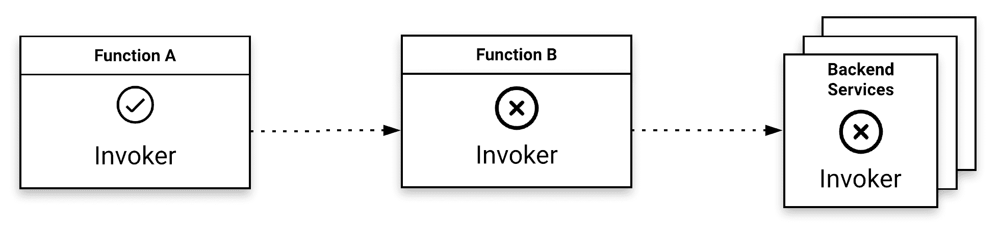
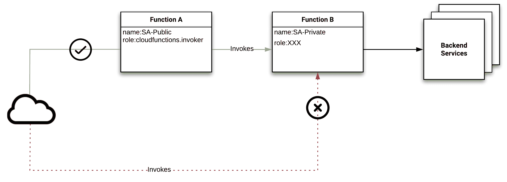

# 第六章：云函数实验

在上一章中，我们通过构建一个访问签名 URL 的应用程序，掌握了一些有用的技能。最常见的例子之一就是构建一个网站。因此，我们将通过创建一个基于静态网站的示例数据库，扩展我们的技能库，内容将围绕漫威电影展开。到本章结束时，你将理解如何通过丰富的代码示例增强之前介绍的各种技术。

在我们的示例中，我们将探讨如何将数据整合进来，并首次审视服务账户的安全性。除此之外，我们将查看静态网站的主要组件以及如何可能提升这些组件的功能。

本章将涵盖以下主题：

+   构建静态网站

+   服务账户安全

# 技术要求

为了完成本章的练习，你需要一个 Google Cloud 项目或 Qwiklabs 账户。

你可以在本书的 GitHub 仓库中的`ch06`子目录找到本章的代码文件，网址为[`github.com/PacktPublishing/Hands-on-Serverless-Computing-with-Google-Cloud/tree/master/ch06`](https://github.com/PacktPublishing/Hands-on-Serverless-Computing-with-Google-Cloud/tree/master/ch06)。

在阅读书中的代码片段时，你会注意到，在少数情况下，代码/输出的某些行已被删除，并用省略号（`...`）代替。省略号的使用是为了仅展示相关的代码/输出。完整的代码可以通过前述链接在 GitHub 上获取。

# 构建静态网站

在下面的示例中，我们将构建一个应用程序，在这个应用程序中，我们熟悉的函数基线代码将调用一个外部数据源（基于 JSON），并输出一个通过 HTML 模板渲染的视图。

# 环境配置

我们之前在其他 Node.js 应用程序中看过这种布局（例如，第三章，*介绍轻量级函数* 和 第四章，*开发云函数*），所以在本章中，重点将放在构建我们网站所需的代码上。

首先，按照以下步骤操作：

1.  创建一个全新的目录来托管我们的代码。

1.  在新目录中，通过在命令行中执行`npm init --yes`来初始化环境，以初始化我们的新开发环境。

1.  根据下表完成生成的`package.json`：

| **字段** | **响应** |
| --- | --- |
| 包名称： | `marvel-website` |
| 版本： | 1.0.0 |
| 描述： | 这是一个使用云函数构建的示例网站 |
| 入口点： | `index.js` |
| 测试命令： | 空白 |
| Git 仓库： | 空白 |
| 关键词： | 空白 |
| 作者： | 输入你的名字 |
| 许可证： | ISC |

如在第四章 *开发云函数*和第五章 *探索函数即服务*中所述，为了本地运行，我们可以使用`functions-framework`包。此外，我们还需要安装`pug`包，用于渲染 HTML 的视图模板。

1.  从命令行安装必要的包，使用以下命令：

```
npm install @google-cloud/functions-framework
npm install pug
```

1.  接下来，创建几个新的子目录，用于存放与该功能相关的`views`和`data`：

```
mkdir data && mkdir views
```

1.  到此为止，您的目录结构应类似于以下内容：也就是说，两个文件（`package.json`和`package-lock.json`）和三个子目录（`data`、`views`和`node_modules`）：

```
.
├── data
├── node_modules
├── package.json
├── package-lock.json
└── views
```

请记住，为了在您的应用程序中使用 Functions Framework，您需要修改`package.json`文件，以包含一个`start`属性。

1.  编辑`package.json`文件，并按照这里所述的方式添加对 Functions Framework 的引用：

```
  0 { 
  1   "name": "marvel-website", 
  2   "version": "1.0.0", 
  3   "description": "This is an example website built on Cloud Functions with Nodejs", 
  4   "main": "index.js", 
  5   "scripts": { 
  6     "start":"functions-framework --target=filmAPI", 
  7     "test": "echo \"Error: no test specified\" && exit 1" 
  8   }, 
  9   "author": "Rich Rose", 
 10   "license": "ISC", 
 11   "dependencies": { 
 12     "@google-cloud/functions-framework": "¹.2.1", 
 13     "pug": "².0.4" 
 14   } 
 15 }
```

*第 6 行*中突出显示的信息显示了必要的启动命令。请注意，目标入口点名为`filmAPI`，这意味着我们应用程序中导出的函数也需要匹配这个签名。

很好！我们现在已经创建了应用程序的基本结构。接下来，我们将注意力转向提供信息的源头，这些信息将在应用程序中展示。

# 创建数据源

现在，我们将注意力转向数据目录，下一步是创建一个**JavaScript 对象表示法**（**JSON**）文件来存储我们的数据。使用 JSON 是一种快速而简单的方式来创建外部数据源，如下所示：

1.  在`data`子目录中创建一个名为`films.json`的新文件。这个文件将存储我们的电影信息。

1.  对于第一部电影，添加以下表格中的内容：

为了解释所使用的架构，让我们先看看文本的内容。主要结构是一个数组，我们将在其中创建多个占位符，用于表示电影的对象。电影对象将暴露几个字段：

| **字段** | **类型** | **注释** |
| --- | --- | --- |
| `title` | 字符串 | 电影标题 |
| `director` | 字符串 | 电影导演的名字 |
| `release` | 字符串 | 电影的发布日期 |
| `description` | 字符串 | 电影情节的总体概述 |
| `bgImage` | 字符串 | 电影海报的 URL |

直接查看 JSON 文件，我们可以看到数据在文件中的表示方式：

请注意代码块末尾的逗号；这表示我们将要在文件中添加进一步的内容。如果我们不添加其他内容，则在电影对象后面不会加逗号（请参见*The Avengers*对象的比较）。

```
{
  "movies": [
  {
    "title": "Iron Man",
    "director": "Jon Favreau",
    "release": "2008",
    "description": "Iron Man",
    "bgImage": "https://upload.wikimedia.org/wikipedia/en/7/70/Ironmanposter.JPG"
  }, 
```

1.  添加像`The Incredible Hulk`这样的额外内容可以通过在数组记录末尾追加内容来实现：

```
  {
    "title": "The Incredible Hulk",
    "director": "Louis Leterrier",
    "release": "2008",
    "description": "The Incredible Hulk",
    "bgImage": "https://upload.wikimedia.org/wikipedia/en/8/88/The_Incredible_Hulk_poster.jpg"
  },
```

1.  为`Iron Man 2`添加一条新记录：

```
  {
    "title": "Iron Man 2",
    "director": "Jon Favreau",
    "release": "2010",
    "description": "Iron Man 2",
    "bgImage": "https://upload.wikimedia.org/wikipedia/en/e/ed/Iron_Man_2_poster.jpg"
  },
```

1.  基于`Thor`添加一条新记录：

```
  {
    "title": "Thor",
    "director": "Kenneth Branagh",
    "release": "2011",
    "description": "Thor",
    "bgImage": "https://upload.wikimedia.org/wikipedia/en/f/fc/Thor_poster.jpg"
  },
```

1.  为`Captain America`添加一条新记录：

```
  {
    "title": "Captain America: The First Avenger",
    "director": "Joe Johnston",
    "release": "2011",
    "description": "Captain America: The First Avenger",
    "bgImage": "https://upload.wikimedia.org/wikipedia/en/3/37/Captain_America_The_First_Avenger_poster.jpg"
  },
```

1.  最后，为`The Avengers`添加一条新记录：

```
 {
    "title": "The Avengers",
    "director": "Joss Whedon",
    "release": "2012",
    "description": "Marvel's The Avengers",
    "bgImage": "https://upload.wikimedia.org/wikipedia/en/f/f9/TheAvengers2012Poster.jpg"
  }
  ]
}
```

基于前面的代码，我们已经创建了六个新的记录，用于在数组中保存数据。目的是让这些数据作为我们即将创建的云函数的输入。在实际应用中，更可能使用数据库来满足这种访问方式。然而，在这个示例中，简洁是我们的朋友，JSON 也是！

现在我们已经创建了数据源，接下来需要实现屏幕上的展示，以呈现要显示的信息。

# 设计前端

使用 HTML 制作前端应该不会带来太大的挑战，因为有很多优秀的示例可供参考。在这一部分，我们将采用我们的模式并将其显示在屏幕上。所使用的模板将在`views`子目录中创建，并以一个名为`index.pug`的新文件形式呈现，文件内容如下：

+   头部定义

+   卡片定义

+   Release 定义

+   描述定义

+   Body 定义

根据前面的要点，让我们来看一下每个部分的内容：

1.  头部定义使用标准的 HTML 来结合样式内容。在示例中，我们创建了一个新的头部样式，用于更改文本的字体和对齐方式：

```
#message
html
  head
    style.
      .header {
         text-align: center;
         font-family: roboto;
      }
```

1.  `card`定义创建了一个新的样式，视觉上看起来像一个屏幕上的卡片：

```
      .card {
         box-shadow: 0 4px 8px 0 rgba(0, 0, 0, 0.2);
         max-width: 600px;
         margin: auto;
         text-align: center;
         font-family: roboto;
      }
```

1.  `release`定义创建了颜色和字体的增强效果：

```
      .release {
         color: grey;
         font-size: 22px;
      }
```

1.  `description`定义通过参考颜色、字体大小和内边距等内容，对与该样式相关的任何元素进行增强：

```
     .description {
         color: black;
         font-size: 18px;
         padding: 8px;
      }
```

1.  `body`定义提供了通过云函数导入数据的主要布局考虑：

```
 body

    div.header
      H1 Functions Framework Example
      H3 Google Cloud - Cloud Functions
    div.card
      img(src=items.bgImage style="width:100%")
      h1 #{items.title}
      div.release
        h3 Released: #{items.release} <br>
        h3 Director: #{items.director} <br>
      div.description
        p #{items.description}
```

让我们分解一下：

| **名称** | **类型** | **备注** |
| --- | --- | --- |
| H1 | 主要标题 | 页面标题 |
| H3 | 子标题 | 页面的子标题 |
| img | 图片链接 | 图片的 URL 链接 |
| p | 段落 | 描述文本 |

在创建视图时，我们使用从云函数传递过来的信息来填充屏幕上的视图。具体来说，我们从 JSON 数据文件中的模式信息中提取标题、发布日期、导演和描述等内容。

在这个示例的这个阶段，基于我们在示例中创建的文件，我们应该已经有了以下的目录结构：

```
├── data
│ └── films.json
├── node_modules
├── package.json
├── package-lock.json
└── views
    └── index.pug
```

我们还创建了一个基于 JSON 文件的数据源，其中包含关于电影的信息。添加新电影、移除电影和更改电影相关信息的方法应该很直观，数据文件为管理外部数据提供了一个方便的方式。而且，视图是与主功能分离的；因此，作为额外的好处，展示层独立运行，方便进行修改。最后，我们需要创建服务来实现数据和视图之间的集成，并生成适当的 HTTP 响应。

# 分析云函数

我们定义的云函数没有太多的代码与之相关。我们的云函数中包含以下元素：

+   变量定义

+   私有函数

+   公共函数

为了解释我们在这里概述的各种元素，让我们花一点时间更详细地探讨每个组件。

变量定义如下：

+   **第 1 行**：函数以声明包含我们的临时数据存储开始，其中存储了电影信息。同样，这是一种将数据整合到应用程序中的简单方式，无需额外的基础设施支持。

+   **第 2 行**：使用`pug`包依赖并声明在函数中使用：

```
  0 // Define dependencies 
  1 var data = require('./data/films.json'); 
  2 var pug = require('pug'); 
```

私有函数的工作原理如下：

+   **第 6 行**：声明要根据`index.pug`文件中定义的外部视图进行渲染的视图

+   **第 11 行**：根据 HTTP 状态响应码 200 以及基于用户在查看初始页面时选择的项目创建响应对象：

```
  3 
  4 // Function: marvelFilm Detail 
  5 // Description: Show the information for the film selected 
  6 function filmDetail(req, res, movieRef) { 
  7   // Define the view to be displayed 
  8   const pugInputFile = pug.compileFile('views/index.pug'); 
  9 
 10   // Create the HTML view 
 11   res.status(200).send(pugInputFile({ 
 12     // Pass data object [movies] to Pug 
 13     items : data.movies[movieRef] 
 14   })); 
 15 } 
```

公共函数的工作原理如下：

+   **第 31 行**：调用`filmDetail`函数时，传递请求、响应和数据对象：

```
 16 
 17 // Entrypoint: marvelFilmAPI 
 18 // Description: This is the Cloud Function endpoint 
 19 exports.filmAPI= (req, res) => { 
 20   // Define the default view to be displayed 
 21   let filmNum = req.query.film || '00'; 
 22 
 23   // Translate string to int 
 24   var movieRef = parseInt(filmNum, 10); 
 25 
 26   // Simple validation 
 27   if (movieRef > 5 || movieRef < 0) 
 28     movieRef = 0; 
 29 
 30   // Display the relevant film 
 31   filmDetail(req, res, movieRef); 
 32 }; 
```

运行上述应用程序（即从命令行运行`npm start`）时，将显示 JSON 电影列表数组的详细信息。

请注意，查询字符串 URL 可以用于访问第一部电影之外的信息。像这样的 HTTP 查询机制在向子组件传递附加参数时非常有用。在此示例中，我们使用这些参数来选择显示不同的页面，而无需修改现有的函数代码。

要从可用电影数组中选择另一部电影，请使用 URL 查询设置来访问电影数据库中保存的任何电影，如下表所示：

| **电影** | **URL** |
| --- | --- |
| 1\. 铁人 | `http://localhost:8080` |
| 2\. 无敌浩克 | `http://localhost:8080/?film=1` |
| 3\. 钢铁侠 2 | `http://localhost:8080/?film=2` |
| 4\. 雷神 | `http://localhost:8080/?film=3` |
| 5\. 美国队长：复仇者先锋 | `http://localhost:8080/?film=4` |
| 6\. 复仇者联盟 | `http://localhost:8080/?film=5` |

如果你从云终端运行此应用，请注意 URL 会与上面显示的不同。但你仍然可以附加查询设置，例如`https://mydomain-dot-devshell.appspot.com/?authuser=0&environment_id=default&film=2`来显示第二部电影。

当向应用程序提交不同的查询对象时，您将看到不同的页面。

这个例子展示了如何通过查询参数扩展 GET HTTP 方法。正是这种灵活性使得 HTTP 成为如此广泛采用的方法，并展现了该协议的优势。我们的示例展示了如何使用云函数开发一个简单的 Web 应用程序。这个例子当然可以扩展到其他更复杂的用例。我将把根据前几章所学的知识构建下一个大项目的任务留给你发挥想象力。

现在我们将注意力转向 Cloud Functions 安全这一关键话题。在接下来的部分，我们将讨论在使用 Cloud Functions 时可以应用的各种安全技术。

# 服务账户安全

最后，在本章中，我们将介绍关于**身份访问管理**（**IAM**）的最小权限概念，并解释如何将其应用于 Cloud Functions。我们将探讨一些可以保障使用 Cloud Functions 的应用程序安全的方法。

本章稍后将讨论服务账户；然而，首先简要看一下如何限制已部署的 Cloud Functions 的调用者状态。Cloud Functions 使用服务账户而非用户账户来管理服务。在这方面，服务账户扮演了用户的角色，而无需实际的人类参与此过程。

关于用户账户，每个已部署的函数将分配一个服务账户来负责权限。服务账户可以手动创建，也可以自动创建；无论哪种方式，都需要定义角色和权限。当函数被部署时，通常会为服务账户应用 `cloudfunctions.invoker` 权限。该权限授予服务账户调用/触发 Cloud Functions 的能力。

除了此权限外，调用者还需要对该函数进行正确的身份验证。如果默认设置保持不变，则 `allUser/public` 接口将绑定到该服务，意味着任何人都可以调用该函数。HTTP 函数通常会使用默认的 `allUsers` 策略绑定进行部署，这意味着任何人都可以调用该服务。这样，任何人都可以通过暴露的端点来调用我们的函数。开放访问为我们的应用程序带来了潜在的安全漏洞，需要一个解决方案来减轻这一风险。如果您希望限制对该函数的访问，请将其限制为安全账户访问，例如 `allAuthenticated` 或通过其 IAM 账户指定的特定用户。

尽管 Cloud Functions 的运行时间较短，但它们仍然容易受到安全风险的威胁，例如恶意代码或服务拒绝攻击。

请注意，关于拒绝服务攻击，Cloud Functions 位于 Google 前端后面，该前端用于缓解和吸收许多 4 层及以下的攻击，例如 SYN 洪水、IP 分片洪水、端口耗尽等。

有许多不同类型的漏洞可能对基于 Web 的服务构成问题。由于该主题的复杂性，我们无法提供超出当前防护措施的更多概述。潜在的漏洞范围似乎在不断增加，例如恶意代码、拒绝服务攻击或事件资源瓶颈等。

以下部分详细介绍了一些技术，用于缓解 Cloud Functions 的安全问题。

# 经济限制

正如我们现在所知，serverless 提供了在 Cloud Functions 中实现可扩展性的能力。然而，集成了 Cloud Functions 的服务可能无法应对这种级别的扩展。在您的应用中，如果需要，您可以限制可用实例的最大数量。

应用连接性限制可以减轻负担，并防止服务遭遇过多无法成功处理的请求。通过设置实例的可用数量阈值，意味着在部署时可以限制该功能，如以下命令所示：

```
gcloud beta functions deploy … \
--max-instances 4
```

在这里的受限场景中，启用了排队机制，以确保所施加的限制不会妨碍信息处理到您的服务。限制实例阈值是确保服务调用安全的一个良好开端。另一种变体则关注如何获取访问资源所需的凭证。

# 不安全的凭证存储

凭证存储是确保各种服务安全性时日益重要的话题。重要凭证（或密钥），例如数据库用户名/密码/发布凭证或存储在代码中的密钥，需要一个解决方案，以确保这些信息只能被经过身份验证的组件访问。

许多行业解决方案将提供必要的保护，包括 Google Cloud **密钥管理服务** (**KMS**)，它支持使用 Google 或客户提供的密钥。此外，一些通用产品如 HashiCorp Vault 也为存储信息提供了类似级别的安全保护。

因此，凭证提供了更好的保护并允许服务得到安全保障。当与多个集成服务一起工作时，如何管理工作流以达到所需的安全级别呢？

# 执行流操作

执行流基本上是描述您的应用程序功能工作流的方式。在您有多个功能的场景中，组件之间可能会进行信息交接，它们交换信息或提供对后端服务（如数据库）的访问。

在这种情况下，任何功能都不应被拦截或接受来自未经身份验证的外部来源的通信。这样做将降低工作流的完整性。像这样的情况会给应用程序带来实质性的安全风险（例如，信息被篡改）。

为了防止这种类型的漏洞，我们可以利用最小权限安全设置来管理服务帐户，并建立按功能的授权机制来验证调用。默认情况下，所有功能/应用程序/容器可以共享相同的服务身份，并分配角色，如项目编辑者。然而，身份管理也可以按功能进行设置，以建立最小权限。对于云功能，可以在部署时附加服务帐户来控制功能。

在下面的图示中，能够调用 Cloud Function 的服务帐户标记为**Function A**：



服务帐户部署为我们的其他服务提供了一个公共接口。我们还将为**Function B**创建第二个服务帐户来管理后台；该服务帐户将没有调用者权限，并且不会公开。最后，**后端服务**不会向公众互联网开放。除此之外，它们还将可以从 Function B 访问。这种安排相对常见，例如在堡垒主机上，堡垒主机面对互联网，且只有主机有权限与庄园中的其他机器连接。

根据谷歌的说法，服务帐户是一种特殊帐户，它可以在没有用户参与的情况下调用 Google API。这些计算机帐户是非常有用的功能，并通过 IAM 权限进行定义。我们可以使用以下 `gcloud` 命令创建一个新的服务帐户，该帐户将提供对该功能的访问权限：

1.  创建服务帐户—`Function A`：

```
gcloud iam service-accounts create publicCloudFunction
```

1.  将角色绑定到服务帐户，使其能够使用 `invoker` 角色：

```
gcloud functions add-iam-policy-binding SaveData \
--member='serviceAccount:publicCloudFunction@projectid.iam.gserviceaccount.com' \
--role='roles/cloudfunctions.invoker'
```

启动 Cloud Functions 需要 `cloudfunctions.invoker` 角色，我们将此权限绑定到我们的新服务帐户。通过这样做，我们的服务帐户现在可以调用 Cloud Functions。

现在我们已经创建了具有必要权限的服务帐户，我们可以通过附加帐户名称来使用新服务帐户部署功能。

1.  在部署 Cloud Function 时应用新的服务帐户：

```
gcloud functions deploy …\
--service-account account-privilege@projectid.iam.gserviceaccount.com
```

为了完成我们的示例，我们将创建一个与第二个功能相关的第二个服务帐户。对于此服务帐户，我们将不应用 `invoker`（`cloudfunctions.invoker`）角色，从而限制谁可以启动该功能。

1.  创建服务帐户—`Function B`：

```
gcloud iam service-accounts create saveData
```

如同我们在第一个服务帐户中所做的那样，我们需要绑定一些权限。在这个例子中，我们使用的是 Cloud SQL 权限。

1.  将角色绑定到服务帐户：

```
gcloud projects add-iam-policy-binding projectid \
--member='serviceAccount:saveData@projectid.gserviceaccount.com' \
--role='roles/cloudsql.client'
```

最后，我们可以使用最近创建的服务帐户来部署该功能。

1.  在部署的功能上应用服务帐户：

```
gcloud functions deploy saveData \
--service-account saveData@projectid.gserviceaccount.com
```

到此为止，我们已经对应用程序进行了简单的修改，以确保函数执行流程符合我们的需求。**Function A** 是我们的入口函数，并为我们的应用提供前端。现在，**Function B** 仅通过 **Function A** 访问，从而确保了从 A 到 B 的执行流程的安全性。同时请注意，现在 **Backend Services** 仅通过 **Function B** 访问。根据前面步骤中指定的更改，我们现在有了以下布局：



在最后一个要讨论的领域中，我们将通过策略控制来研究安全控制。

# FunctionShield

Google Cloud Functions 还支持诸如 FunctionShield 等第三方解决方案。通过这些解决方案，采用严格的安全控制，确保对已部署的函数应用策略。具体来说，这些保护措施适用于四个不同的领域：

+   安全策略允许禁用出口互联网连接。当服务不需要外向流量时，限制出站流量是一个好习惯，因为大多数服务通常只需要启用入口/入站流量。

+   如前所述，Cloud Functions 是轻量级的无状态函数。在这方面，应该尽可能限制本地存储需求。因此，FunctionShield 可以禁用对 `/tmp` 目录的读写操作，该目录通常用于中介存储需求。

+   在没有被调用的函数要求时，应尽量减少和限制子进程的线程执行。能够执行子进程带来了一个真实的安全风险，一旦启动，没有充分的保护措施很难追踪和追溯。

+   通过中央控制台限制对函数源代码的访问。当源代码具有一定价值或关联**知识产权**（**IP**）时，这可以作为一种额外的保障措施，应用于要部署的系统源代码。

FunctionShield 解决方案是一个免费产品，可以部署到多个云提供商，因此它是一个灵活的解决方案，我们可以用它来确保在无服务器环境中应用标准策略。部署到应用程序中不需要修改函数代码。一个基于行为的专有运行时在无服务器环境中建立保护。云函数的可观察性保持清晰，并且可以通过标准机制获取：Google Cloud 上的 Stackdriver。

# 总结

本章已结束我们在 Google Cloud 上对 Cloud Functions 的探索。过去几章涵盖了很多关于如何开发 Cloud Functions 的内容。在第一个示例中，我们继续使用 Cloud Functions 探讨如何基于外部视图和数据模板构建一个网站。在这个示例中，我们总结了一些关于代码组织和依赖隔离的技巧。

在完成这个示例后，我们得到了一个易于维护的网站，利用 Cloud Functions 提供了一个可扩展的轻量级站点访问基础。我们学习了最小权限的原则，以及它如何应用于 Cloud Functions。同时，我们还学习了一些基本方法，能够通过与 Google Cloud 服务账号协作来确保我们的 Cloud Functions 安全。

在这个阶段，你应该已经能够熟练构建集成了 Google API 的 web 应用程序和服务。还有更多内容可以学习，不过我们在这本书中没有足够的时间或篇幅来涵盖。Cloud Build、GKE、数据库、物联网以及第三方服务都是进一步探索的潜在方向。这就结束了我们关于 Google Cloud 上 Cloud Functions 的介绍。在接下来的章节中，我们将把注意力转向 Google Cloud 上最新的无服务器迭代：Cloud Run 和 Cloud GKE。

# 问题

1.  Cloud Function 需要什么权限才能被调用？

1.  Google KMS 提供什么功能？

1.  `allUsers` 权限的实际含义是什么？

1.  `allAuthenticated` 权限的实际含义是什么？

1.  限制 Cloud Function 可用实例数的参数是什么？

1.  哪个命令允许将角色绑定到服务账号？

1.  用于创建服务账号的命令是什么？

1.  什么是堡垒主机，它有什么用？

# 进一步阅读

+   **Google 服务账号**: [`cloud.google.com/iam/docs/service-accounts`](https://cloud.google.com/iam/docs/service-accounts)

+   **使用 Cloud IAM 为 Cloud Functions 设置最小权限**: [`cloud.google.com/blog/products/application-development/least-privilege-for-cloud-functions-using-cloud-iam`](https://cloud.google.com/blog/products/application-development/least-privilege-for-cloud-functions-using-cloud-iam)

+   **控制扩展行为**: [`cloud.google.com/functions/docs/max-instances`](https://cloud.google.com/functions/docs/max-instances)

+   **Google Cloud 密钥管理服务**: [`cloud.google.com/kms/`](https://cloud.google.com/kms/)
