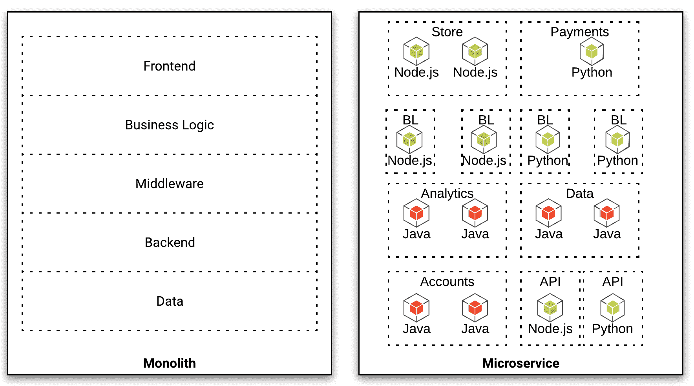
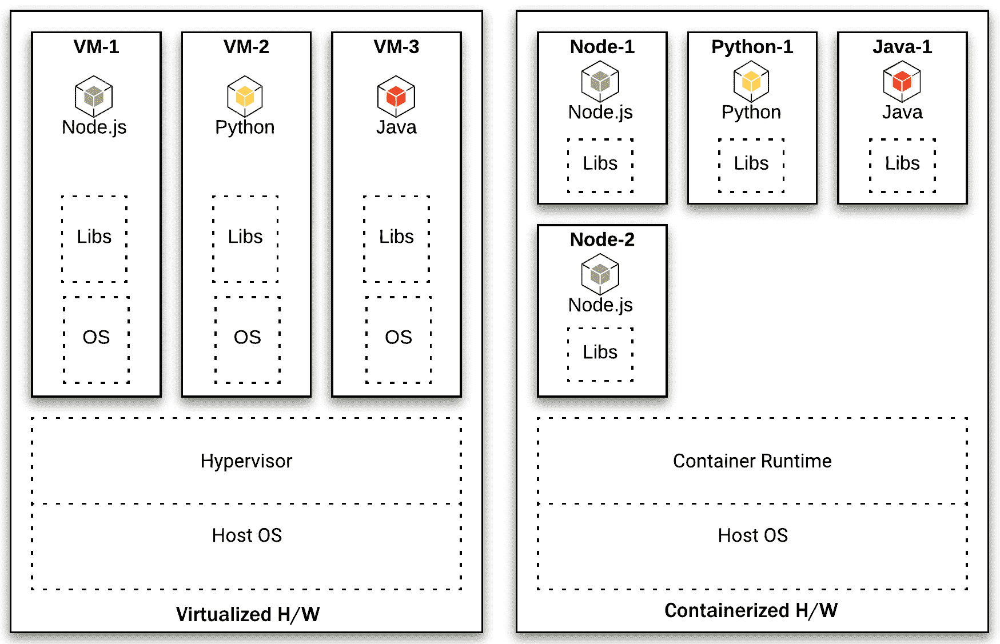
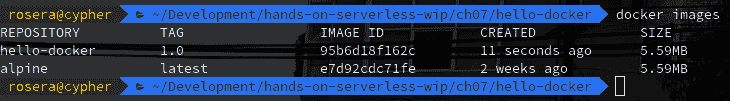
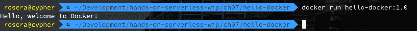
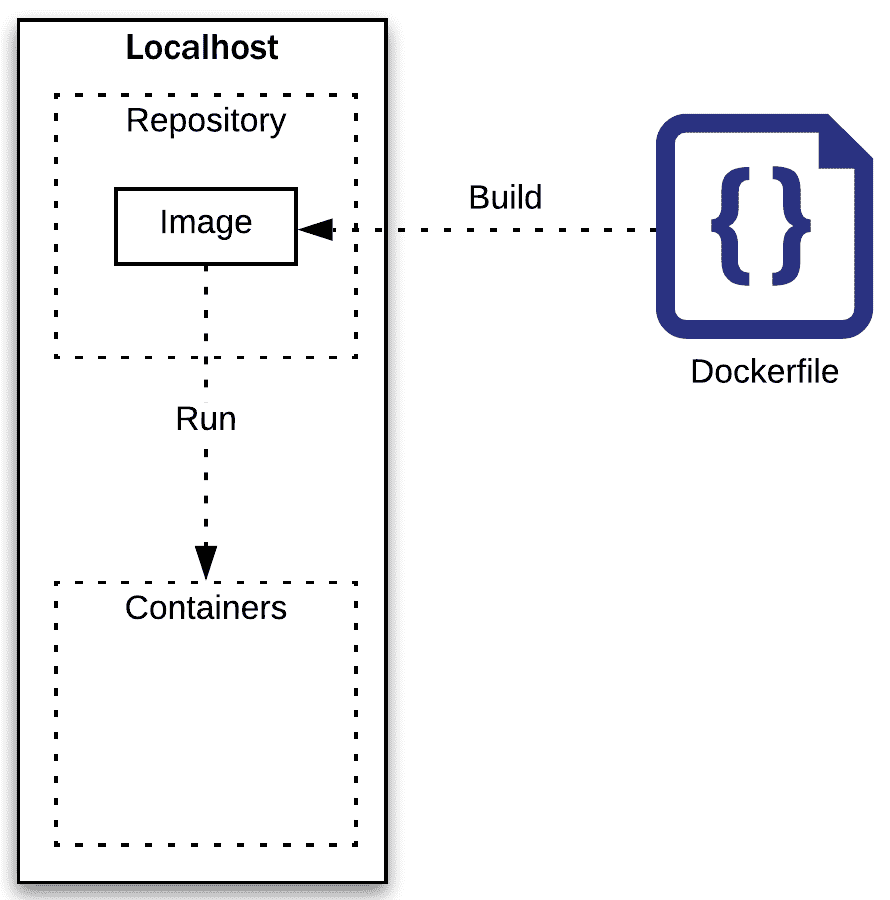
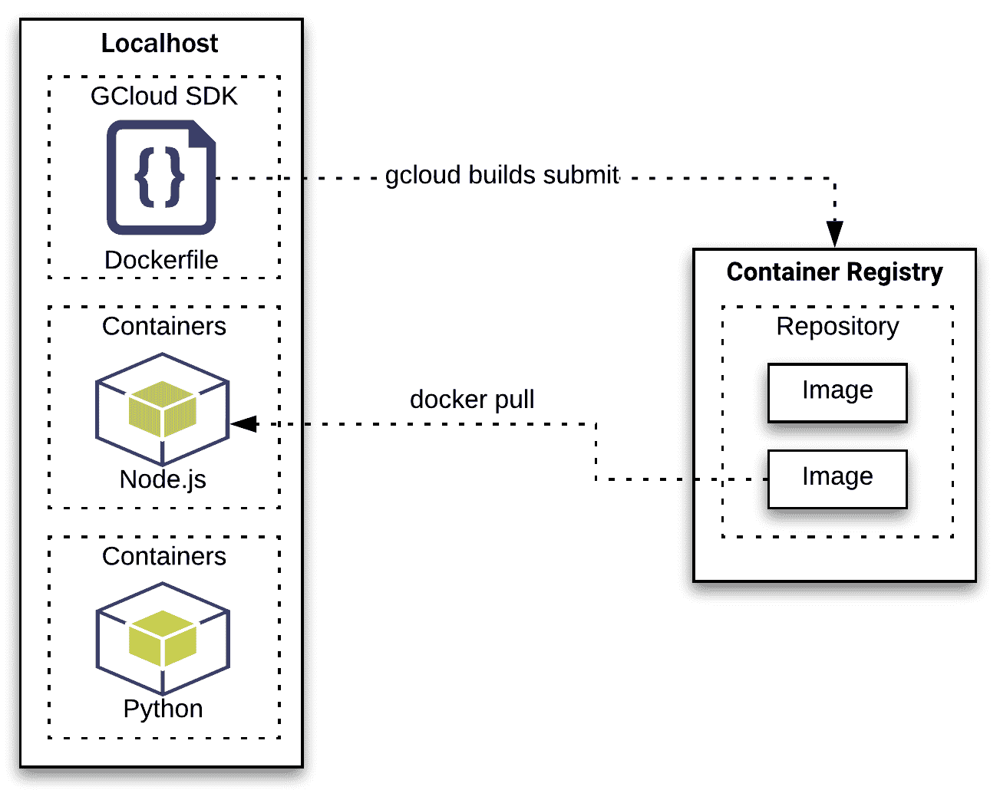
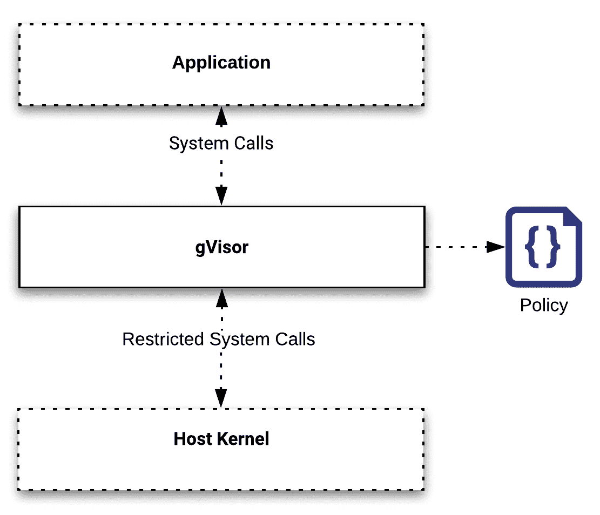
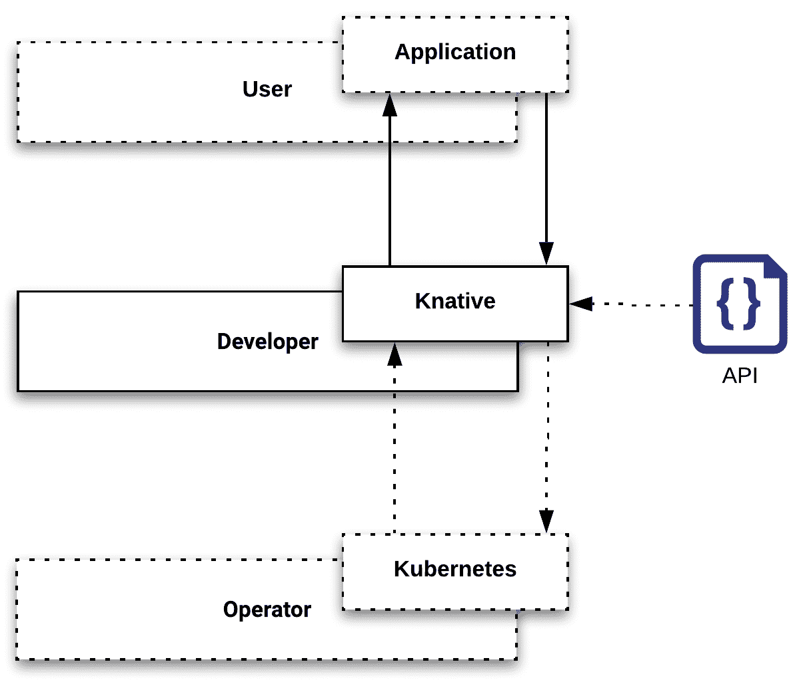
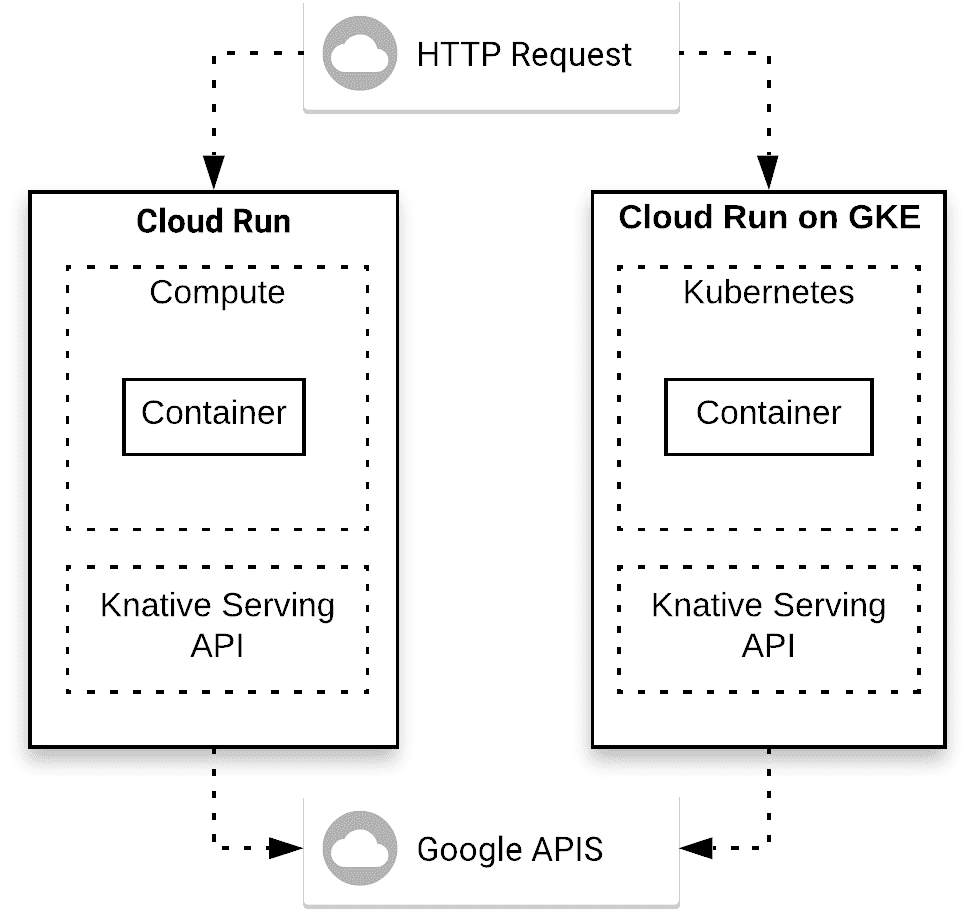

# 第七章：介绍 Cloud Run

到目前为止，在本书中我们讨论了许多与构建云端无服务器技术相关的内容。在本章中，我们将重点介绍 Google 最新推出的产品，它为你的应用提供了一个无状态的环境。与 Cloud Functions 不同，Cloud Run 明确利用容器技术为 HTTP 端点提供受限环境。而 Cloud Functions 则为无服务器工作负载提供了一种有局限性的视角，例如，运行时语言的限制。Cloud Run 则去除了许多这些限制，以便更好地满足开发者的需求。如果你仔细研究这些内容，你会发现容器和 Kubernetes 是任何云计算专业人士的必备技能。

为了开始我们的讨论，我们将概述 Cloud Run 组件架构。在此过程中，我们将讨论几个主题，以便为 Cloud Run 设置背景。本章的主要目标是介绍支持技术。你应该花时间理解这些使用案例，并了解 Cloud Run 如何利用每个技术。

在继续讲解 Cloud Run 组件架构之前，我们将先奠定一些基础，概述一些关键技术。为了开始这个讨论，我们将从微服务谈起。

简而言之，本章将涵盖以下主题：

+   使用微服务

+   使用容器

+   介绍 Cloud Run

+   Cloud Run 与 Cloud Run for Anthos 的区别

# 技术要求

要完成本章的练习，你需要一个 Google Cloud 项目或一个 Qwiklabs 账户。

你可以在本书的 GitHub 仓库中找到本章的代码文件，位于`ch07`子目录下，网址是[`github.com/PacktPublishing/Hands-on-Serverless-Computing-with-Google-Cloud/tree/master/ch07`](https://github.com/PacktPublishing/Hands-on-Serverless-Computing-with-Google-Cloud/tree/master/ch07)。

在阅读本书中的代码片段时，你会注意到，在一些情况下，代码或输出的某些行被删除并用省略号（`...`）替代。使用省略号只是为了展示相关的代码或输出。完整的代码可以在之前提到的 GitHub 链接中找到。

# 使用微服务

关于单体架构与微服务架构的关键优势，已经有了大量的讨论。创建更小的代码包的可能性显然具有优势，因为它们通常更容易调试，更简单集成，且具有一致的消息接口。然而，这些优势本身并不足以促使我们完全迁移到微服务架构。

在下图中，我们将典型的单体软件结构与微服务架构进行对比。首先要注意的是，微服务架构提供了更多可用的组件服务。需要特别指出的一点是，将单一应用程序解构为专注于业务操作的服务交付。在接下来的几段中，我们将讨论这种方法背后的逻辑，以及在迁移到云运行等环境时它的好处（以及高度相关性）：



首先，微服务应该是自主的；也就是说，它们提供一个隔离且独立的组件。提供标准化接口可以让微服务无缝地参与到更广泛的生态系统中。确保各个组件之间能够实现通信，为构建可扩展且灵活的解决方案提供了基础。

从微服务的角度来看，它们通常服务于多个已经部署在松耦合架构中的容器组件。每个微服务代表了一个应用程序被分解成一系列功能的过程。考虑到我们如何专注于为云函数（参考第三、四和五章）构建具有单一目的的轻量级任务。在这里，我们将容器提升为首选工件。所使用的通信机制在某些情况下提供一致的组件间通信，充当**应用程序编程接口**（**API**）。容器的使用提供了一个抽象层，确保与任何运行时语言的兼容性。

与单一的单体应用程序对比，后者通常有紧密耦合的组成组件。紧密耦合意味着将各种模块拆开或创建新的集成会变得非常困难。由于单体结构，语言运行时通常在整个单体中保持一致。无法使用不同的运行时语言可能会导致问题，因为无法使用最适合任务的选项。类似地，当遇到特定的性能瓶颈时，扩展性也可能成为问题。

前面图示的应用程序架构模式是至关重要的考虑因素，因为我们将使用容器来进行云运行。这样做时，我们承诺继续构建轻量级且松耦合的功能。这将帮助你巩固对构建过程的理解，以及在完成本章的其余部分时所采取的具体设计方法。

当然，这并不是说微服务适用于每一种场合。有些情况下，"一刀切"的做法并不适用。从务实的角度选择架构和方法有助于设计出更好的应用，并提升设计者的技能。微服务远非易写，并不适用于每一种场合。如果你希望获得我们之前所提到的好处，建模服务、正确的范围和内容对于微服务来说是一个重大挑战。

为了帮助这一过程，考虑微服务设计模式如何满足需求并帮助你构建可扩展的解决方案通常是非常有帮助的。正如你所预期的，这个主题既广泛又多样，已经在许多演讲和书籍中得到覆盖，试图定义一个关于该主题所需基础知识的共识。由于我们将主要处理与 HTTP 相关的通信，我们将快速概述我们需要考虑的事件处理模式。这些模式如下：

+   异步事件处理模式

+   同步事件处理模式

这些模型是你将会经历的最相关的通信类型。

# 异步事件处理模式

虽然平台上没有明确指出，但事实上，你已经对大多数模式十分熟悉。异步通信通常会利用发布者/订阅者模式。在这个模式中，监听者通过它们订阅的事件被激活。此模式中的消息适合一对多关系。在 Google Cloud 上，Cloud Pub/Sub 提供了此服务，它通过定义的主题和订阅者提供信息，所有匹配的事件都由发布者呈现。在这种情况下，像 Cloud Pub/Sub 这样的服务需要一个类似的模型，以提供适用于信息流的异步通信模式。

如果需要批量导向或一对一的通信流，则作业队列模式更为合适。在这种（赢家通吃）模型中，队列机制用来存储信息，而队列消费者决定何时取回信息。

# 同步事件处理模式

需要注意的是，任何设计方法都无法为每种情况创造完美的解决方案。以这种方式泛化代码可能会导致内容/代码的重复，这有时是不可避免的。关注保持微服务的隔离性和独立性应是首要任务，你需要接受始终会有例外情况。对于同步事件处理，有两种模式你需要熟悉：

+   请求/响应模式

+   蛇形模式

对于同步消息传递，调用服务对即时响应的需求会提供确认。这通常与 HTTP 模型相关，是大多数人熟悉的模式。在这种请求/响应的情境中，消息作为点对点通信的一部分被消费。

管理的另一种状态是观察而非消费同步通信。这被称为**侧滑**模式，如果有多个端点准备好消费消息，它可能会很有用。然而，只有一个特定的端点地址可以负责生成响应。

在深入讨论 Cloud Run 之前，我们将快速浏览容器并解释为什么它们是一个关键技术。为了讨论这一主题，我们将专注于 Docker 容器；然而，值得知道的是，其他容器也存在，并且提供类似的好处。

# 使用容器

虽然应用程序可以在任何地方运行，但在不同环境中工作传统上会导致一致性方面的问题。从一个环境部署代码到另一个环境时，常常会遇到由于变化导致与底层基础设施不兼容的问题。行业对从单体应用转向小型集成组件（即微服务）的关注，通常会导致考虑生成松耦合的工件。

基于虚拟化硬件的传统开发提供了一个成熟的平台，在这个平台上有许多成功的部署。然而，部署微服务组件的低效性意味着这种方法由于底层资源的重复使用而变得不那么具有吸引力：



在前面的图示中，可以看到，对于虚拟化硬件，每次虚拟机调用都需要为操作系统和库复制资源。尽管虚拟机继续为大规模机器提供优势，但对于基于微服务的架构，更轻量级的方法是更理想的。

容器通过共享资源模型提供对底层硬件的访问。这种允许主机硬件在容器之间共享现有资源的方法更具吸引力。通过使用容器，主机可以将其资源分配给将在此环境中执行的容器。如果你正在使用微服务的环境，那么这个环境很可能是希望提供容器相关的效率。

持续构建这些组件只是故事的一半；如何确保工件在每次部署中保持一致？为此，我们使用容器来定义一个软件包，在其中可以控制环境（例如，内存、磁盘、网络、文件系统等）。底层云环境利用现有的文件系统创建一个分区，专门为你的容器执行隔离。因此，与其将应用程序直接安装到主机上，不如安装容器并在主机上运行它。由于应用程序存在于主机中，任何不兼容性很可能是与平台相关的。这样一来，你的应用程序现在可以在部署之间保持一致性。

在接下来的章节中，我们将快速概述 Docker 以及如何与 Google Cloud 一起使用它。在本讨论中，我们将覆盖基础内容，以便那些不熟悉容器的朋友能够迅速了解。

# 利用 Docker

实现容器的最常见方式之一是使用 Docker 容器运行时。Docker 提供了容器的所有优点。它提供了一个简单的界面，可以用来管理应用程序在容器内运行时的状态。为了简洁起见，我们将重点讨论在 Linux 环境中使用 Docker。然而，请记住，其他选项也存在，并且同样有效。

通常，容器有三个主要元素需要考虑。首先，容器使用一个基础镜像来运行应用程序。基础镜像代表应用程序将运行的操作系统，例如，Debian、Ubuntu 或 Alpine。此外，基础镜像的依赖包也需要安装，以确保环境能够与应用程序兼容。这些包通常是与容器兼容的库，例如 SSL、cURL 和 GCloud SDK。最后是命令执行，它表示在执行时会运行什么。添加入口点定义了容器运行时会发生什么。

正如我们之前提到的，容器是隔离应用程序功能的绝佳方式。然而，它们也提供了一种优雅的方式来定义应用程序的签名。你可能会想我说的是什么意思。想象一下，我们有一个应用程序在容器内运行。镜像是使用一个文件构建的，这个文件用于定义应用程序应运行的环境。在这种情况下，镜像代表了可执行的包，并包含了应用程序所需的依赖项。通过完成必要的过程，我们将应用程序的需求隔离到一个可传输的环境（容器镜像）中。这样做非常强大。但理论讨论到此为止——我们来构建一些东西。

我们首先从清单开始。清单表示镜像规范，包括要创建的应用程序。此环境包含一个基础镜像（例如，Scratch、Alpine、Ubuntu、Debian 等），通过 `FROM` 语句表示。选择基础镜像本身就是一个话题，但请注意，镜像越轻量，部署工作负载就越容易。

除了基础镜像，我们还将集成执行任务所需的包和库。如果你正在使用现代编程语言，可能这些信息已经存在，因为它们已经在本地安装（感谢 Node.js）。如果你是在从其他人的应用程序构建镜像，这是关系可能变得复杂的地方。在我们的示例中，我们不会安装任何额外的包；相反，我们将使用基础 Alpine 镜像的现有能力。

最后，在我们的配置中，我们将定义当应用程序容器启动时，镜像应该执行什么操作。`ENTRYPOINT` 命令表示容器启动时的调用。`CMD` 标签表示传递给入口点的参数。请注意，此配置用于允许扩展镜像，以便它可以打印其他消息。强烈建议阅读有关 `ENTRYPOINT` 和 `CMD` 的使用，它们在处理命令时可以节省大量时间。

在此过程结束时，你将拥有一个包含所有这些元素的清单文件。为了我们这个示例，我们可以创建一个简单的 Dockerfile。按照以下步骤进行：

1.  创建 Dockerfile 清单文件：

```
FROM alpine 
ENTRYPOINT [ "echo" ] 
CMD [ "Hello, welcome to Docker!" ]
```

如果我们构建前面的清单，它将根据我们制定的指令，并基于每一行清单内容创建镜像。思考一下前述语句，这对我们意味着什么；我们已经为一个单一应用程序构建了一个基于文件的主机机器。

看一下前面的清单内容，我们可以从中了解应用程序的需求，但对执行过程了解甚少。从清单中，我们可以看到基础镜像（即操作系统）、依赖关系（即库/包）以及要执行的命令（即要运行的应用程序）。下一步是运行构建过程，将这个清单转化为代表文件中信息的镜像。

构建 Docker 镜像是通过命令行管理的。将清单转化为有用的东西意味着我们需要生成一个镜像。构建过程会逐行处理清单，并将其添加到最终镜像中。在构建过程中，每一行会创建一个归档层，表示执行的命令。通过之前提供的示例清单，我们可以为我们的应用程序构建一个镜像。

1.  构建 Dockerfile 清单文件：

```
 docker build -t hello-docker:1.0 .
```

在上述命令中，我们告诉 Docker 我们希望通过使用动词 `build` 启动过程来创建镜像。Docker 默认假设当前目录中有一个名为 `Dockerfile` 的本地文件。如果您希望使用不同的清单命名约定，您可以在命令行中附加 `-f [FILENAME]`，这种情况下，您需要使用以下命令，技术上等同于*步骤 2*。

1.  构建一个名为 `myDockerfile` 的清单文件：

```
 docker build -t hello-docker:1.0 -f myDockerfile .
```

在 `build` 参数后，我们通过使用 `-t [label]` 命令告诉 Docker 为镜像添加标签。在这个例子中，我们为将要生成的镜像提供了名称和版本。

将所有创建的镜像进行版本管理被认为是一种良好的实践。

最后，我们通过在命令末尾添加一个句号（句点），指示新镜像将在本地目录中查找清单，从而表明本地目录包含源信息。如果需要，您可以将其替换为更具体的目标位置。

运行上述命令将启动用于构建本地清单的 Docker 工具。此过程成功完成后，我们可以通过让 Docker 列出可用镜像来确认新镜像已存在于我们的机器上。

1.  列出本地存储的镜像：

```
 docker images
```

在这里，您可以查看输出的样子：



从生成的列表中，我们将看到我们的镜像已经成功创建，并且现在可以访问。此外，最新的 alpine 镜像已被下载并用作新镜像的基础镜像。恭喜——从清单构建镜像是一项了不起的成就，并且提升了您对多个主题的整体理解。作为参考，容器是运行在 Linux 子系统上的镜像，并共享主机机器的内核。从这一点来看，我们可以看到容器为在主机上运行独立进程提供了一种轻量级的机制。

现在您已经知道如何构建镜像，我们可以继续在主机上运行容器。刚开始使用容器时，一个常见的困惑是区分“镜像”和“容器”这两个术语。作为参考，镜像指的是一个未运行的容器。镜像一旦运行，就变成了一个容器。这两个术语经常互换使用，但现在您知道它们的区别了。请放心，不必为此烦恼。

要在主机上运行容器，我们需要告诉 Docker 启动哪个镜像，并指定应用程序运行所需的参数。最少，我们需要用于在主机上启动容器的 Docker 命令。

1.  运行镜像：

```
 docker run hello-docker:1.0 
```

在这里，您可以查看输出的样子：



在上面的命令中，我们使用动词 `run` 来告诉 Docker 启动一个镜像。请注意，此时镜像的位置（即本地或远程）并不重要。如果镜像在本地找不到，系统会自动进行远程仓库搜索。最后，如果镜像在本地或远程都不存在，则会返回错误。

请注意，前面的应用程序实际上非常有用。如果你指定了额外的参数，它将打印该参数，而不是命令默认的消息。试试 `docker run hello-docker:1.0 "I love working on Google Cloud"`

在本节的早些时候，我们构建了我们的镜像，这意味着它应该可以被 Docker 访问。这个过程可以在下面的图示中看到：



在前面的图示中，我们可以看到一个容器，它处于运行状态，并且已分配了容器 ID。

到目前为止，我们已经执行了以下步骤：

1.  1.  创建了一个清单文件（例如，Dockerfile）

    1.  从清单构建镜像

    1.  运行镜像以创建一个容器

希望这些操作对你来说是清晰的，你可以看到将 Docker 融入你的开发工作流是多么简单。由于容器在宿主机上运行，它与宿主共享资源。为了确认 Docker 容器是否成功启动，你需要使用 Docker 进程命令来列出所有正在运行的容器。

1.  列出宿主上所有可用的 Docker 进程：

```
 docker ps -a
```

`ps` 命令选项与 Docker 应用程序启动的进程相关。在这个例子中，我们希望查看宿主上所有活跃的容器。能够跟踪宿主上当前正在运行的进程非常重要。在上面的命令中，我们列出了 Docker 命名空间中的所有进程。这样做可以让我们看到宿主上哪些是活跃的，并为我们提供有关宿主上动态进程的宝贵洞察。在本地主机上运行操作并不是没有代价的。持有活跃容器的机器资源状态需要被停止，以恢复机器的整体资源。

回到微服务的话题，在这个例子中，我将信息输出到屏幕上。对于大多数情况，可能更希望不要将状态输出到屏幕上。除非你确实需要输出状态（例如，它是前端 HTTP 应用程序），否则尽量避免通过屏幕提供反馈。将信息直接发送到日志基础设施是一种更具可扩展性的方法。在接下来的章节中，我们将处理更复杂的例子，这些例子需要特定的网络端口暴露，并将信息直接写入日志。在使用容器的初期阶段采用这种最佳实践是一种很好的习惯，它可以最大程度地减少与移除屏幕内容相关的潜在返工。

在释放与容器相关的资源之前，先花点时间查看正在运行的应用程序生成的日志。为此，我们需要使用特定的命令，并插入正在运行进程的实际容器 ID。

1.  显示与特定容器相关的日志：

```
 docker logs <CONTAINER ID>
```

通过这种方式访问容器日志是一个很好的策略，特别是当我们想要调查容器在活动生命周期中的运行情况时。在运行时信息无法直接输出的情况下，可以使用 Docker 来了解应用程序的运行状态，以便解决出现的任何错误。现在我们已经检查了活动容器的属性，接下来我们应该看看如何释放资源。

要停止一个活动容器，我们需要使用一个特定的命令来停止正在运行的进程。在命令行中输入以下命令，将停止在主机上运行的活动容器。

1.  停止在主机上运行的容器：

```
 docker stop <CONTAINER_ID>
```

在前面的命令中，容器标识符是我们之前通过 `ps` 命令获得的标识符。每当 Docker 请求标识符时，它很可能是在引用这个有用的参考标题，以便将其与活动组件区分开来。一旦容器停止，与我们简单容器示例相关的资源将被释放回主机机器。现在你已经了解了如何构建和调用镜像，我们可以通过引入两个开发者工具来提升生产力：**Google Cloud Build** 和 **Container Registry**。

# 填充容器注册表

在上一节中，我们提供了对 Docker 和容器的高层次介绍。在本节中，我们将进一步扩展这个话题，探讨 Google 开发者工具及其如何提升开发者生产力。

在继续之前，让我们列出本节的假设条件，因为接下来会涉及一些依赖项。首先，你的环境应该已经配置好使用 GCloud SDK，并且指向 Google Cloud 上的一个有效项目。此外，Docker 应用程序应已安装，并能够构建镜像。

下图展示了一个典型的开发环境：



如你所见，我们并没有使用本地仓库，而是定义了一个基于**Google 容器** **注册表**（**GCR**）的远程仓库。这个远程仓库替代了 Docker Hub 在 Google 项目中的使用，并为我们提供了一个多区域的仓库。在这个例子中，我们将使用一个简单的清单来构建一个小镜像，并填充到 Google Cloud 仓库中。让我们开始吧：

1.  创建一个 Dockerfile 清单文件：

```
FROM alpine 
ENTRYPOINT [ "echo" ] 
CMD [ "Hello Container Registry Repo!" ]
```

从这里，我们可以启动一个本地构建，使用 `build` 目录中的默认 Dockerfile 来测试清单文件。

1.  构建 Docker 镜像：

```
 docker build -t hello-docker:1.1 .
```

该过程的第一个不同点是根据构建输出填充仓库。手动实现这一过程的方法是将图像打上仓库端点的标识符标签。我们需要应用一个 `tag`，以指示创建的工件位于 GCR 中。我们通过附加 `gcr.io/[PROJECT_ID]` 标签来完成这一操作。这将告诉 GCloud SDK 使用美国仓库并指向特定的 Google Cloud 项目。

1.  给 Docker 图像打标签：

```
 docker tag hello-docker:1.1 gcr.io/[PROJECT_ID]/hello-docker:1.1
```

现在，图像已经正确标注，我们可以将图像推送到 Google Cloud 的远程仓库。

1.  将图像推送到 GCR：

```
 docker push gcr.io/[PROJECT_ID]/hello-docker:1.1
```

在这一点上，本地存储的图像将被推送到 GCR，因此可以远程访问。如果我们希望在本地检索该图像，则需要使用 `pull` 命令。需要注意的是，身份验证访问使用 IAM 来控制访问（即使您将仓库设为公开）。

1.  从 GCR 拉取图像：

```
 docker pull gcr.io/[PROJECT_ID]/hello-docker:1.1
```

看看前面的示例，显而易见，这个过程与构建和使用 Docker Hub 仓库非常相似。存储在本地的图像需要占用存储空间，这意味着在磁盘空间紧张的情况下，将图像托管在远程仓库是一个值得尝试的方案。正如我们之前学到的，Docker 图像非常灵活，而远程仓库的便利性提供了更灵活的部署策略。

查看远程仓库以及如何填充容器注册表让我们了解到，这个过程涉及一些额外的步骤。幸运的是，Google 创建了一个名为 Cloud Build 的多功能工具，帮助我们减少这些工作量。

# 使用 Cloud Build

为了增强构建过程，像 Cloud Build 这样的工具可以帮助我们构建更复杂的脚本来创建图像。Cloud Build 是一款开发者工具，尽管它不常被广泛关注，但它对于卸载和自动化一些琐碎的任务（如构建图像）非常有帮助。在图像创建方面，构建的图像将存储在 Google Container Registry 中，并保存在项目相关的仓库中。这些仓库中存储的信息可以单独声明为公开或私有，这为管理构建过程生成的图像提供了简单而有效的方式。

Cloud Build 非常容易集成到您的开发工作流程中。该软件包被描述为一种与语言无关的清单，用于编写所需的自动化流程脚本。Cloud Build 的一些关键特性如下：

+   原生 Docker 支持

+   支持多个仓库（例如 Cloud Source Repositories、Bitbucket 和 GitHub）

+   自定义管道工作流

+   定制化包支持（例如 Docker、Maven 和 Gradle）

+   本地或云端构建

+   包漏洞扫描

现在，我们将使用其中一些工具来构建我们的镜像，并将它们添加到托管在 Google Cloud 上的远程仓库中。首先，我们将再次更新我们的示例清单，并通过命令参数修改消息的输出。让我们开始吧：

1.  创建 Docker 清单文件：

```
FROM alpine 
ENTRYPOINT [ "echo" ] 
CMD [ "Hello Cloud Build!" ]
```

当使用 Cloud Build 时，我们不再直接从命令行调用 Docker。相反，它使用 GCloud SDK 命令在远程仓库上创建镜像作为构建工件。默认的 Dockerfile 需要本地存在，并应作为镜像创建的基础。

1.  根据 Docker 清单文件启动构建过程：

```
 gcloud builds submit --tag gcr.io/[PROJECT_ID]/hello-docker:1.2 .
```

Cloud Build 显示价值的另一个选项是，我们还可以创建一个文件来自动化构建过程。创建一个 `cloudbuild.yaml` 文件允许开发人员指定一系列步骤作为构建过程的一部分。此过程的参数包括一个丰富的功能集，超越了 Docker。强烈建议您闲暇时进行深入研究。在下面的示例中，我们基本上复制了 `docker` 命令以构建我们的镜像，并告诉它将输出保留在 Cloud Repository 中。`images` 行表示与构建工件相关联的标签。完成后，将创建一个新版本（即 `hello-docker:1.3`），并在容器注册表上可用。

1.  创建 Cloud Build 清单文件：

```
steps: 
- name: 'gcr.io/cloud-builders/docker' 
  args: [ 'build', '-t', 'gcr.io/$PROJECT_ID/hello-docker:1.3', '.' ] 
images: 
- 'gcr.io/$PROJECT_ID/hello-docker:1.3'
```

要使用 Cloud Build 构建上述文件，我们需要从命令行运行以下命令。

1.  使用 Cloud Build 构建镜像并将镜像提交到 Google Container Registry：

```
 gcloud builds submit --config cloudbuild.yaml
```

在前面的示例中，我们概述了将 Docker 清单纳入 Cloud Build 的简单方法。有多种方法可以增强此模型，以便可以结合更复杂的选项。就目前而言，这是我们需要涵盖的关于建立 Docker 工作流的全部内容。在加强了我们对 Docker 的一般理解以及与 Google Cloud 相关的一些开发工具之后，我们将转向 Cloud Run。

# 介绍 Cloud Run

Cloud Run（以及 Cloud Run for Anthos）是一种基于容器的无服务器技术。这里的一个明显优势是，容器化是一种被广泛采用的方法。能够将您的应用程序打包为容器，然后在不需要任何额外工作的情况下迁移到完全托管的无服务器环境，这是一个理想的方案。

在使用任何技术时，理解组成部分总是很重要的。在这方面，Google Cloud 选择基于几种开源技术来构建其技术，社区可以对其进行贡献。经常会低估在不同云提供商之间移动的能力。在开发应用程序时，重要的考虑因素是该产品/服务技术如何适应以及它将获得的支持。

除了在云中运行容器的基本命题外，Cloud Run 还提供了一个完全托管的无服务器执行环境。与 App Engine 和 Cloud Functions 类似，Google 已经完成了基础设施管理的大部分工作。我之所以这么说，主要是因为 Cloud Run for Anthos 的包含，它需要增加一个 Kubernetes（Google Kubernetes Engine）集群。

构建全栈无服务器应用程序现在已成为现实，能够让你利用这些工具和模式的机会触手可及。与其他服务和平台的集成不应需要大量的代码重写。同样，基于标准组件和兼容的架构平台时，跨不同产品和云提供商的迁移不应成为问题。

在我们继续讨论 Cloud Run 之前，我们先来关注一些用于启用这种灵活无服务器环境的关键特性。

# gVisor

gVisor 开源项目为容器提供了一个沙盒化的运行时环境。在这个环境中，创建的容器是在用户空间内核中运行的，兼容性是通过使用**开放容器倡议**（**OCI**）运行时规范实现的。拦截应用程序系统调用提供了一层隔离，以便可以与受控主机进行交互。这种方法的核心原则是限制系统调用的表面面积，以最小化攻击范围。对于容器环境，能够利用内核空间就意味着可以访问主机机器。为了减少这种情况的可能性，gVisor 力求限制这种访问并限制不受信任的用户空间代码。如下面的图所示，gVisor 使用沙盒化技术为应用程序执行提供虚拟化环境：



如我们所见，来自应用程序的系统调用会传递到 gVisor，在这里决定这些调用是否被允许。通过 gVisor 限制系统调用意味着仅在**主机内核**级别上给予经过验证的访问权限。这样的做法被描述为深度防御，意味着使用多个层次来提供与主机的增强隔离。

建立这样一个环境使我们能够运行不受信任的容器。在这个实例中，gVisor 通过使用独立的操作系统内核，限制了与主机内核的可能交互。OCI 的美妙之处在于，它使这种集成成为可能，并为如 Docker 和 gVisor 这样的解决方案提供了一种优雅的方式，实现无缝的互换。

# Knative

为了开始我们的讨论，我们将深入探讨 Knative 提供的功能，然后简要概述项目中的组件。Knative 为开发人员和运维人员提供了紧密集成 Kubernetes 平台的 API。我强烈建议进一步阅读这一领域的内容，以便获得比本书简短概要所能提供的更深入的理解。

Knative 通过提供一系列组件为 Kubernetes 平台提供多方面的解决方案。这些组件负责许多在平台上工作的标准方面，例如部署、路由和扩展。正如你可能预期的，作为与 Kubernetes 相关的东西，这些组件在框架和应用层之间提供兼容性，使其相对容易融入任何设计中：



在前面的图表中，我们可以看到不同的角色参与 Kubernetes 工作流。运维人员通常负责基础设施维护。开发人员则专注于创建驻留在平台上的应用工作负载，并与 API 进行交互。正是在这一层次，Knative 使开发人员能够为其应用提供更高的效率。

讨论 Knative 时，通常将其描述为中间件，因为它位于 Kubernetes 平台和应用之间。在本章的前面，我们介绍了微服务设计模式；Knative 本质上是这种面向无服务器工作负载的方式的完全实现。在这种关系中，两个主要组件对于讨论至关重要，即 Knative Serving 和 Knative Events：

+   Serving 涉及访问控制工作负载与底层 Kubernetes 集群交互的**自定义资源定义**（**CRDs**）。此服务的支持计算资源将能够扩展至零。请注意，在 Kubernetes 上，这与资源有关，而不是集群。与平台 API 的交互为我们提供了实施更细粒度控制的机会。在这方面，能够控制服务、路由、配置和修订等元素是通过 Knative serving 实现的。每个元素都用于提供特定的状态管理和通过设定规则进行通信。

Knative Serving 能够抽象不同环境和云提供商之间的服务，例如 ingress。通过这样做，应用开发人员与 Kubernetes 之间的交互变得更加直接和简便。

+   事件遵循生产者和消费者的概念，其中共享活动需要负责。启用生成的工件的延迟绑定使我们能够整合一个松耦合的服务，该服务能够与其他服务进行交互。事件工件列表使用事件注册表，从而允许消费者在无需引用其他对象的情况下被触发。在这方面，事件消费者必须是可寻址的；也就是说，他们必须能够接收并确认消息。

说到 Knative，我简要提一下 Istio，Istio 是一个服务网格，提供策略执行和流量管理等功能。那么，什么是服务网格呢？服务网格代表一个通常部署在 Kubernetes 上的微服务网络。Istio 提供了多个复杂的功能，包括支持整体管理网格网络的指标。对于在 Cloud Run for Anthos 上部署的无服务器工作负载，Knative 与 Istio 一起提供了 Kubernetes 平台的扩展，以实现对微服务架构更细粒度的控制。

这简要概述了低级组件的内容，应能为您提供一些关于底层 Cloud Run 架构的额外背景。接下来的部分，我们将回到 Cloud Run 和 Cloud Run on Anthos 的话题，对这两个产品进行简要比较。

# Cloud Run 与 Cloud Run for Anthos

从根本上讲，Cloud Run 是一个无服务器平台，适用于无状态工作负载。对于此解决方案，不需要基础设施管理。或者，您可能有一个现有的 Kubernetes 集群。在这种情况下，所有工作负载都在该环境中运行。此外，您可能需要一些功能，如命名空间、对 Pod 合作放置的控制或额外的遥测。在这种情况下，Cloud Run on Anthos 提供了一个更为周到的选择。在这两种情况下，要部署的工作负载保持不变，因此作为开发人员，相关工作量不会增加，尽管在部署平台上看似存在差异。

为了理解我们在 Cloud Run/Cloud Run for Anthos 中的意思，让我们从一个图表开始。这将帮助我们观察每个技术栈，从而理解工作流程：



在前面的图表中，可以清晰地看出两种 Cloud Run 形式之间有很多相似之处。在通信的前端是一个用于消费 HTTP 流量的网关。在这里，我们可以将流量路由到基础产品。

在图表的开始，我们可以分辨出 HTTP 流量被路由到我们的环境。流量到 Google 环境通常通过**Google 前端**（**GFE**）路由。对于 Cloud Run for Anthos 流量，基于 Google Cloud 负载均衡器的附加路由配置在网络层激活（并可能有一个 Istio 网关）。

从容器的角度来看，我们可以看到一个关键的区别。在这一层次上，工件的管理有明确的依赖关系，平台的优先级就是基于这些依赖关系来决定的。这是用于运行对象的计算平台的一个核心区别。在 Kubernetes 上，部署过程使用 **Google Kubernetes Engine**（**GKE**）。正如我们之前讨论的，所部署的容器工件使用 OCI 来提供运行时和镜像规范。为了访问 Google 的更广泛服务，使用 Knative Serving API 来与 Google API 通信。

我们已经知道，Knative 被用来提供一个可移植和可扩展的 API，支持不同运行时环境，以开发无服务器应用程序。利用 Knative Serving API 来提供可移植性并访问 Google 后端 API 是 Cloud Run 的内在特性。不要低估可移植性的力量，无论你是否已经在享受 Kubernetes 的好处，还是仍在犹豫不决；拥有一个核心组件来无缝管理过渡是一个值得欢迎的补充。我们在本章早些时候提到过 Knative 的一些高层次内容；然而，结合这一能力使得我们可以使用一个出色的平台，扩展应用程序以利用编排工作负载的优势。

既然我们已经了解了底层架构，我们知道，Google Cloud 提供这一无服务器架构的背后有许多相互协作的组件。在接下来的几章中，我们将把注意力转向 Cloud Run 和 Cloud Run for Anthos 的具体内容。

# 总结

在本章中，我们从高层次讨论了 Cloud Run，并介绍了使这一切成为可能的组成部分。就像 Google 的其他无服务器产品一样，Cloud Run 可以伸缩至零，唯一不同的是，这里的部署工件现在是一个容器。利用容器工件带来了额外的好处，因为 Cloud Run 可以在有 Kubernetes 或没有 Kubernetes 的情况下部署。此外，任何语言的运行时都可以使用，这使得它成为一个非常灵活的产品。

熟悉容器环境（例如 Docker）在这里是一个很大的优势，但 Cloud Run 消除了部署代码的许多复杂性。一旦容器成功构建，它就可以被部署。Cloud Run 内建对无服务器请求/响应消息的支持，因此总是有一种简单且一致的方法来开发组件。对于那些之前不熟悉容器的朋友，希望你们现在已经了解足够多，能够利用它们了。

在本章中，我们为使用 Cloud Run 和容器提供了一个共同的基础。无论你是否相信容器是未来的趋势，它们都是一个需要掌握的重要话题。现在我们已经掌握了 Cloud Run 的基础知识，可以进入更有趣的项目了。在下一章中，我们将继续深入研究这个无服务器产品，并构建一些示例项目。

# 问题

1.  描述一下单体应用和微服务应用之间的一些区别。

1.  GFE 执行什么功能？

1.  请列举两种同步事件处理模式。

1.  使用 Docker 时，`ENTRYPOINT` 关键字的作用是什么？

1.  用于构建镜像的 Docker 命令是什么？

1.  你能说出 Google Cloud 用于镜像管理的产品是什么吗？

1.  Cloud Build 的目的是什么？

1.  为什么 Knative API 是 Cloud Run 的一个重要组成部分？

1.  什么是 OCI，它有什么用途？

1.  你能列举一些支持容器的不同操作系统吗？

# 进一步阅读

+   **在 GKE 上将单体应用迁移为微服务**: [`cloud.google.com/solutions/migrating-a-monolithic-app-to-microservices-gke`](https://cloud.google.com/solutions/migrating-a-monolithic-app-to-microservices-gke)

+   **Knative**: [`cloud.google.com/knative/`](https://cloud.google.com/knative/)

+   **gVisor**: [`gvisor.dev/`](https://gvisor.dev/)

+   **Istio**: [`istio.io/docs/concepts/`](https://istio.io/docs/concepts/)

+   **Google 基础设施安全设计概述**: [`cloud.google.com/security/infrastructure/design/`](https://cloud.google.com/security/infrastructure/design/)

+   **Google Load Balancing**: [`cloud.google.com/load-balancing/`](https://cloud.google.com/load-balancing/)

+   **Docker 快速入门**: [`cloud.google.com/cloud-build/docs/quickstart-docker`](https://cloud.google.com/cloud-build/docs/quickstart-docker)
