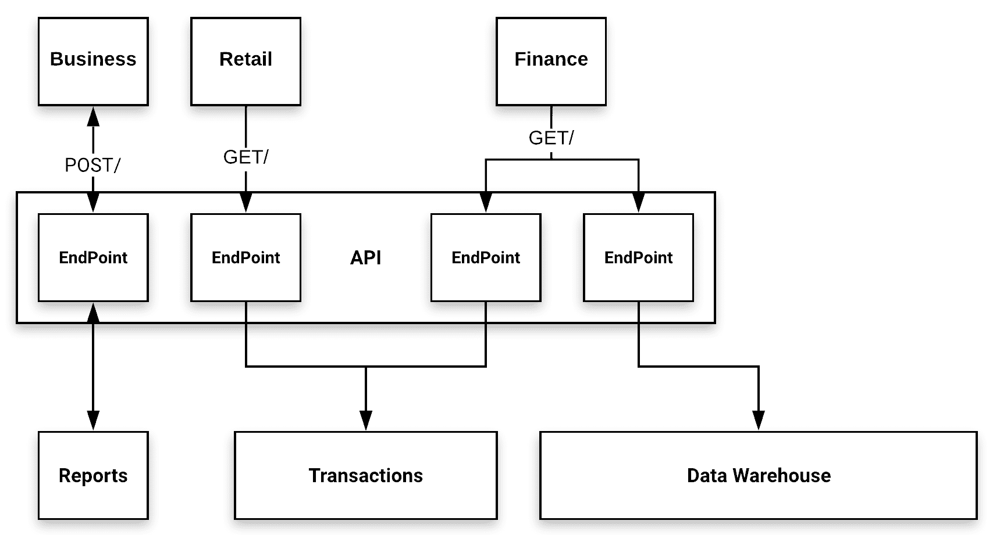

# 第八章：使用 Cloud Run 开发

在本章中，我们将深入探讨 Cloud Run 的功能集。正如我们在 第七章《介绍 Cloud Run》中所看到的，*Cloud Run 允许无状态容器在基于 Google Cloud 的无服务器基础设施上进行部署和运行*。在本章中，我们将重点介绍如何使用 Cloud Run 以及如何利用一些可用的开发工具来开发无服务器应用程序。

Cloud Run 是一个更广泛生态系统的一部分，提供了在大规模上构建 web 服务的手段。有趣的是，它也可以在 Kubernetes 生态系统内运行，而无需对工件配置进行任何更改。如果你之前使用过 Docker 或 Cloud Functions，那么支持 Cloud Run 的大部分环境对你来说是熟悉的。在撰写本文时，Cloud Run 刚刚变得普遍可用；然而，Google Cloud 控制台的一些组件仍处于 alpha 或 beta 阶段，因此可能会发生变化。

本章将涵盖以下主题：

+   探索 Cloud Run 仪表板

+   使用 Cloud Run 开发

+   构建 **表示性状态转移** (**REST**) API

+   开发人员生产力

# 技术要求

要完成本章中的练习，你需要一个 Google Cloud 项目或 Qwiklabs 帐号。

你可以在本书的 GitHub 仓库中找到本章的代码文件，位于 `ch08` 子目录下，链接地址为 [`github.com/PacktPublishing/Hands-on-Serverless-Computing-with-Google-Cloud/tree/master/ch08`](https://github.com/PacktPublishing/Hands-on-Serverless-Computing-with-Google-Cloud/tree/master/ch08)。

在阅读本书中的代码片段时，你会注意到在一些情况下，代码/输出中的某些行被移除，并用省略号（`...`）替代。省略号的使用仅仅是为了展示相关的代码/输出。完整的代码可以在之前提到的 GitHub 链接中找到。

# 探索 Cloud Run 仪表板

Google Cloud 上的 Cloud Run 界面有几个可用的选项。这些选项与构建过程有关，包括构建触发器和先前构建的历史视图等信息。从 Cloud Run 仪表板开始，此菜单选项依赖于在项目内触发的构建。在撰写本文时，该页面正在进行测试，因此随着产品的成熟，预计会有进一步的更改：


如果你不熟悉 Cloud Build 触发器，我们将在本章后面详细介绍它们。目前，你只需要知道它们是一种自动启动构建的方式，并且在使用 Cloud Run 时它们将是关键。

# 使用 Cloud Run 开发

从最基本的角度来看，Cloud Run 允许基于容器的 HTTP 端点在云中启动和运行。在上一章中，我们学习了如何创建容器以及如何构建一个与该环境兼容的简单应用程序。了解容器可以让我们选择任何我们想要的运行时语言，并围绕我们的用例创建一个工件。此时，我们将利用这个机会构建我们的第一个 Cloud Run 应用程序，以便熟悉环境和产品。

在这个第一个练习中，我们将调用一些现有代码，并重新回顾静态网站示例（参见 第六章，*Cloud Functions 实验*）。在这里，我们将探讨如何将现有应用程序进行打包。请记住，在这个示例中，应用程序是基于 Node.js 并且包含对等依赖项的。让我们开始吧：

1.  要启动项目，我们需要使用以下命令从 GitHub 仓库获取代码：

```
git clone https://github.com/PacktPublishing/Hands-on-Serverless-Computing-with-Google-Cloud-Platform.git
cd ch08
```

这款最初构建为 Cloud Functions 应用程序的 web 应用程序，现在将过渡到 Cloud Run。首先，我们将查看这两种产品之间的兼容性。需要注意的是，我们不需要更改应用程序，因为它之前就是使用 Functions Framework 构建的。

1.  我们已经看到，创建容器需要创建一个 Dockerfile 清单。这个示例应用程序运行在 Node.js 上，因此我们可以走捷径，使用一个与这个框架兼容的现有清单模板。采取这种方式意味着我们不需要再去弄清楚哪些软件包是必需的，可以快速将它们集成到我们的应用程序需求中：

```
FROM node:12-slim
LABEL MAINTAINER Rich Rose

# Create a work directory
WORKDIR /usr/src/app

# Add packages
COPY package.json package*.json ./
RUN npm install --only=production

# Bundle app source
COPY . .

# Export application PORT
EXPOSE 8080
```

1.  为了与我们的 web 应用程序建立兼容性，我们需要更新清单，使其能够识别我们所期望的应用程序配置。我们只需要做最少的更改，就能实现与应用程序的兼容：

```
FROM node:12-slim
LABEL MAINTAINER Rich Rose

# Create a work directory
WORKDIR /usr/src/app

# Add packages
COPY package.json package*.json ./
RUN npm install --only=production

# Bundle app source
COPY . .

# Export application PORT
EXPOSE 8080

# Create start command
CMD ["npm", "start"]
```

首先，我们需要安装对等依赖项（例如，`functions-framework` 和 `pug`）。

1.  要安装对等依赖项，请运行以下命令：

```
npm install @google-cloud/functions-framework
npm install pug
```

这样做意味着我们在创建的镜像中已经包含了这些软件包。此外，我们通过使用`npm start`命令正确地调用了应用程序。除此之外，清单仍然是一个相当标准的 Node 清单。这些更改是必需的，以便镜像我们在通过命令行运行时可能进行的更改。

在前面的示例中，有一点需要指出的是，指定的端口是`8080`；这是 Cloud Run 应用程序的默认网络端口。截止到本文写作时，我了解到正在进行进一步的工作，以支持使用替代端口。一旦这个功能可用，似乎在部署时指定端口需求将变得更加实际。因此，包含这一行代码提供了一个潜在的好处。

1.  为了构建镜像，我们将使用 Cloud Build 而不是 Docker。我们这么做是因为我们将利用 Google 生态系统来管理我们的构件。你可以继续使用 Docker 来构建，但你需要标记并上传你的镜像到 Google 容器注册表。作为复习，Cloud Build 允许我们在 Google Cloud 上安全地执行持续集成。这意味着构建过程可以在本地或云端进行。Cloud Build 使用 GCloud SDK 来启动构建并将生成的构件上传到容器注册表。我们可以通过以下命令来构建镜像，其中我们构建一个 Docker 镜像并标记资源：

```
gcloud builds submit --tag gcr.io/[PROJECT-ID]/hello-cloudrun:1.0
```

一旦构建成功完成，我们将能够在容器注册表中看到前面命令的输出。将资源保存在仓库中可以为项目提供广泛的共享选项，无论是内部的还是外部的。

1.  现在容器镜像已存在，它会自动添加到镜像仓库。下一步是部署代码。只需引用我们之前保存在仓库中的构件即可。请注意，访问已保存的镜像时，需要使用给定对象的完整标签：

```
gcloud run deploy hello-cloudrun --image gcr.io/$PROJECT_ID//hello-cloudrun:1.0 --platform managed --region us-central1 --allow-unauthenticated
```

一旦应用成功部署，它的响应方式与云函数的部署非常相似。需要注意的关键点是，从云函数到 Cloud Run 的过渡几乎不需要做太多工作，只需使用一个 Dockerfile 清单。在这种情况下，清单非常简单，并且不需要太多额外的考虑就能使其运行。在此时，当我们返回到 Cloud Run 控制台时，我们不仅能看到已部署的应用程序，还能看到一些附加信息。让我们花点时间来探讨这些新信息。

在这一部分，我们简要浏览了 Cloud Run 界面，并了解了各个组件的用途。然后，我们构建了一个简单的容器来渲染屏幕上的信息。通过这样做，我们可以通过创建更具吸引力的示例来发展我们的知识和技能。

在处理容器时，特别是在 Cloud Run 上工作时，能够整合现有应用程序是至关重要的。创建一个既有信息性又有教育性的用例是一项艰巨的任务，因此非常感谢 Google Cloud Run 团队提供的 PDF 示例。如果你之前没有看到过这个示例，我强烈建议你观看 Next 19 无服务器技术会议的视频，因为这些视频完美地展示了 Cloud Run 的简便性和强大功能（参考链接）：

[`www.youtube.com/playlist?list=PLIivdWyY5sqLYz6HIadOZHE9PsKX-0CF8`](https://www.youtube.com/playlist?list=PLIivdWyY5sqLYz6HIadOZHE9PsKX-0CF8)

要删除现有服务，请使用以下命令：

`**gcloud run services delete hello-cloudrun --platform managed --region us-central1**`

在下一节中，我们将对本节中讨论的例子进行适应，以便加入额外的处理能力。希望这能突出显示 Google Cloud 环境的强大功能和灵活性。

# 构建表示状态转移（REST）API

提供一个可扩展的 API 为我们提供了将其他软件集成到我们应用中的机会。我们已经看过如何在开发无服务器应用程序时将构建块组合在一起。通过 Cloud Run，我们可以扩展这些知识，构建可扩展的接口，以暴露对应用程序特定部分的访问。如果你来自 GNU/Linux 背景，这一点会显而易见，并且可能会被视为理所当然。对其他人来说，这可能是一个清晰的时刻，在这个时刻，某个应用程序允许你做出超出预期的事情。有时，我们甚至不知道一个实现支持用于某个任务的接口。

在这个例子中，我们将构建一个基本的 API，使用 REST 来演示如何使用 Cloud Run 来满足这一需求。如果你还没有接触过 REST API 这个术语，通常它指的是无状态操作，其中最常见的是 GET 和 POST。该 API 使用这些操作来通过 Web 资源检索和发送信息。

我们的第一个例子将构建一个基本的 REST API，它基于 Cloud Run 来提供对后端数据的访问。它将包括以下组件：

+   **一个基本的 API**：用于检索零售数据。

+   **可用商品列表**：API 将提供一个代码，并检索相关的对象信息。

从前面的例子中，我们可以清楚地看到，API 为我们提供了一个简单的机制，可以用来检索与数据对象相关的信息。如果我们扩展数据对象，仍然可以访问这些数据，无需对 API 做任何修改——也就是说，将信息访问与数据分离，从而能够独立增强其功能：



从上面的图示中，我们可以看到，已经定义了多个 API 调用来调用各个端点。每个 API 端点都有特定的任务；例如，检索管理报告、处理事务信息和将信息存储到数据仓库。在这里，我们可以看到，**业务端点**使用的是 POST API 调用，表示将信息（可能是一组过滤信息）发布到端点进行进一步处理。**零售**和**财务**端点调用使用 GET 方法来拉取**交易**和**数据仓库**的信息。

以下是一些帮助定义良好实践的通用规则，当构建引人注目的 REST API 时，我们希望介绍的关键原则如下：

+   基础 URL

+   API 一致性

+   错误处理

+   API 版本控制

为了更深入地理解背后的理论和通用规则，我们将探讨上述关键原则。这将帮助我们在本章后面设计 API 时。

# 基础 URL

我们希望基础 URL 对查询名称具有意义。一个好的起点是考虑基础 URL 应该代表什么，以及如何将其建模以代表底层数据。

# 要求

在开发周期的这个阶段，拥有访问所有数据集合的手段似乎是非常合理的。能够通过相同的 API 调用将集合中的元素隔离开来也显得非常有用。

如果我们考虑这些要求，需求一个直观的基础 URL 以满足我们的需求应该变得更加明显。在接下来的图表中，我们可以看到在两个查询的帮助下，如何使这个 API 工作：


这里，查询执行以下操作：

+   查询 A 将能够获取集合中存储的所有书籍。

+   查询 B 将能够从集合中获取特定项目。

上面的图表展示了一种情况，其中基础 URL 涵盖了数据访问的两个用例：

+   `/[集体名词]`：访问集合；例如，检索所有书籍

+   `/[集体名词]/[元素]`：访问集合中的一个元素；例如，检索标签为 `1234` 的书籍

使用集体名词来对基础 URL 进行分类，可以让我们访问整个集合和单个项目。现在，我们需要简化基础 URL；我们接下来的考虑是如何实现更高的一致性 API。在接下来的子章节中，我们将探讨如何使用 Cloud Run 来实现这一点。

# 实现基础 URL

我们的第一项任务是实现一个基础 URL。幸运的是，在我们的案例中，工作相对简单；然而，它也说明了我们试图表达的观点。让我们开始吧：

1.  在 `ch08` 文件夹中创建一个名为 `baseURL` 的新目录并进入：

```
npm init --yes
npm install express 
```

1.  编辑生成的 `package.json` 文件，并在脚本部分添加以下行：

```
...
"start", "node index.js",
...
```

1.  创建一个名为 `index.js` 的新文件，并添加以下代码：

```
const express = require('express');
const app = express();
const port = process.env.PORT || 8080;

app.listen(port, () => {
  console.log('Pet Theory REST API listening on port', port);
});
app.get('/books', async (req, res) => {
  res.json({status: 'running'});
});
```

1.  创建一个名为 `Dockerfile` 的新文件，并添加以下内容：

```
FROM node:12-slim
WORKDIR /usr/src/app
COPY package.json package*.json ./
RUN npm install --only=production
COPY . .
CMD [ "npm", "start" ]
```

在 Cloud Shell 中工作提供了许多容易被忽视的功能。一个特别的功能是当前项目标识符。要在命令行中获取此值，请执行以下操作：

**`gcloud config get-value project`**

更好的是，你可以通过以下方式将其分配给环境变量：

**`PROJECT_ID=$(gcloud config get-value project)`**

1.  基于应用程序构建镜像（请注意，`$PROJECT_ID` 是一个已设置为我的 Google 项目标识符的环境变量）：

```
gcloud builds submit --tag gcr.io/$PROJECT_ID/base-url
```

1.  将镜像部署到 Cloud Run。注意此命令返回的 `SERVICE_URL`：

```
gcloud run deploy base-url --image gcr.io/$PROJECT_ID/base-url --platform managed --region us-central1 --allow-unauthenticated
```

1.  一旦应用程序部署完成，我们可以通过以下命令在 Cloud Shell 中测试我们的 API：

```
curl [SERVICE_URL]/books
```

从前面的代码可以看到，要实现基本 URL，我们需要选择一个与我们的 API 互补的东西。在此示例中，集合名词 `books` 也很适合作为基本 URL。

在考虑如何开发 URL 时，值得考虑 API 的使用场景，并应用一些逻辑来确定如何合理地应用模式。现在我们已经定义了基本 URL，接下来可以看看如何为 API 开发一致的接口。

# API 一致性

API 一致性的目标是简化对公开信息的访问：

| **资源** | **POST** | **GET** | **PUT** | **DELETE** |
| --- | --- | --- | --- | --- |
| `/books` | 创建新书籍 | 列出书籍 | 批量更新 | 删除书籍集合 |
| `/books/1111` | 无效 | 显示一本书 | 无效 | 删除一本书 |

在我们的示例中，集合和元素可以通过使用 HTTP 动词来访问，如前表所示。

# 要求

从前面的信息中，注意到 API 是如何与 HTTP 动词相关联使用的。例如，我们知道以下内容是正确的：

+   POST 事件用于发送数据。

+   GET 事件用于列出（查询）数据。

+   PUT 事件用于批量更新。

+   DELETE 事件用于删除项目。

我们如何将这些功能与我们的书籍 API 一起使用呢？如前表所示，所呈现的 API 提供了一个一致的接口，用于预期的结果。然而，这种实现会是什么样子呢？我们将在下一小节中讨论这个问题。

# 实现 API 一致性

一致性是所有 API 开发者所追求的目标。为了实现这一目标，我们需要考虑 API 将如何被使用。在我们的示例中，我们将更新 API，提供一个 GET 请求来获取所有书籍以及单本书籍。我们开始吧：

1.  编辑 `index.js` 文件。

1.  添加 HTTP `GET ID`：

```
app.get ('/books/:id', async(req, res) => {
  res.json({status: 'GET ID'});
});
```

1.  添加 HTTP `POST`：

```
app.post ('/books', async(req, res) => {
  res.json({status: 'POST'});
});
```

1.  添加 HTTP `DELETE`：

```
app.delete ('/books', async(req, res) => {
  res.json({status: 'DELETE'});
});
```

1.  添加 HTTP `DELETE ID`：

```
app.delete ('/books/:id', async(req, res) => {
  res.json({status: 'DELETE ID'});
});
```

1.  添加 HTTP `PUT`：

```
app.put ('/books/:id', async(req, res) => {
  res.json({status: 'PUT'});
});
```

1.  通过运行以下命令来更新构建镜像：

```
gcloud builds submit --tag gcr.io/$PROJECT_ID/base-url
```

1.  使用以下命令重新部署镜像到 Cloud Run：

```
gcloud beta run deploy base-url --image gcr.io/$PROJECT_ID/base-url --platform managed --region us-central1 --allow-unauthenticated 
```

现在，我们可以使用 `curl` 命令来测试我们对 API 所做的增强：

| **HTTP 动词** | **测试 /books 端点** | **测试结果** | **测试 /books/:id** | **测试结果** |
| --- | --- | --- | --- | --- |
| `GET` | `curl [SERVICE_URL]/books` | `{"status":"GET"}` | `curl [SERVICE_URL]/books/1111` | `{"status":"GET ID"}` |
| `POST` | `curl --data "author=atwood" [SERVICE_URL]/books` | `{"status":"POST"}` | N/A | N/A |
| `PUT` | N/A | N/A | `curl -X PUT --data "author=atwood" [SERVICE_URL]/books` | `{"status":"PUT"}` |
| `DELETE` | `curl -X [SERVICE_URL]/books/1111` | `{"status":"DELETE"}` | `curl -X [SERVICE_URL]/books/1111` | `{"status":"DELETE ID"}` |

从这些变化中，我们可以看到 API 调用现在是一致的，即获取单个书籍或书籍集合的调用都使用相同的接口类型。接口调用之间的共性提供了调用之间的连续性，从而确保 API 开发者能够理解所进行的调用的含义。

现在我们知道了构成 API 的要素，接下来我们来处理错误。

# 错误处理

在代码中处理错误情况可能相当复杂。虽然有很多 HTTP 状态码，但这并不意味着一个 API 应该使用所有状态码。从很多方面来看，如果只使用其中的一部分来指示发生了错误，反而会更加清晰。

# 要求

从高层次来看，有三个特定的结果是必须映射的，如下所示：

+   `200`: 应用程序按预期工作，一切正常。

+   `400`: 应用程序没有按预期工作。发生了客户端错误；也就是说，客户端数据有误。

+   `500`: API 没有按预期工作。发生了服务器错误；也就是说，服务器进程有误。

这个列表可以扩展以包括更详细的分析，但前面的消息为进一步的 API 开发提供了一个良好的基础。

# 错误处理

理解 API 管理的错误类型并保持一致和清晰是非常重要的。在我们的示例中，我们将采用之前映射的三种结果。让我们开始吧：

1.  修改每个 API 调用，加入 `success` 状态调用，如下所示：

```
res.status(200).json("{status: 'PUT'}");
...
res.status(200).json("{status: 'GET'}");
...
```

1.  添加客户端和服务器端错误响应状态（请注意，我们没有服务器端资源，因此此代码仅作为示例使用）：

```
app.use (function(req, res) {
  if (some_server_side_test_fails)
    res.status(500).send("Server Error");
  else
     res.status(404).send("Page not found");
});
```

通过进行前述代码更改，我们可以看到，当返回适当的状态码时，API 调用的状态更加清晰明了。能够实现一个清晰的接口，并且响应一致，使得开发者能够对所提供的代码的使用充满信心。本节的最后部分将介绍如何处理版本控制。

# API 版本控制

一个好的经验法则是始终在即将发布的 REST API 签名中包含版本号。为 API 添加版本号有助于管理缺陷并保持向后兼容性。我们可以采取多种策略在 URL 中加入版本控制；然而，一个好的起点是使用序数来表示接口，如以下示例所示：

```
/v1/books
```

在前面的例子中，我们将 API 与 `v1` 版本相关联，这意味着我们可以清楚地看到查询所应用的版本。如果我们引入 `v2` API，用户仍然可以清楚地知道正在使用哪个版本，而无需额外的支持。版本变更通常是为了保持向后兼容性或表示底层 API 的变化。为开发者提供更新代码的机会，而不破坏现有的集成，对于任何使用该 API 的人来说都是至关重要的。

# 要求

我们希望有一个能够让多个版本共存的 API，像这样：

```
(v1/books or /v2/books/1111)
```

如果我们需要集成不同版本的 API，这是一种行得通的方法。

# 使用路由的 Express 版本控制

当然，我们也应该将版本控制作为 API 的一部分。这里，我们需要更新代码以反映该代码基于书籍 API 的 `v1` 版本，利用 express 提供的一个很棒的功能——**路由**。让我们开始吧：

1.  将 `index.js` 复制到 `bookapi_v1.js`。

1.  编辑 `index.js` 文件并添加以下声明：

```
const apiBooks_v1 = require("./bookapi_v1.js");
```

1.  删除所有 `app.put`、`app.get`、`app.delete` 和 `app.post` 函数。你的代码库应该看起来像这样：

```
const express = require('express');
const app = express();
const port = process.env.PORT || 8080;
const apiBooks_v1 = require("./bookapi_v1.js");

app.listen(port, () => {
  console.log('Pet Theory REST API listening on port', port);
});

app.use (function(req, res) {
  if (some_server_side_test_fails)
    res.status(500).send("Server Error");
  else
     res.status(404).send("Page not found");
});
```

接下来，我们需要更新代码，使其引用新的书籍版本。按照以下步骤操作：

1.  1.  编辑 `bookapi_v1.js`。

    1.  删除所有 `app.listen` 和 `app.use` 函数，以及 `const` 端口定义。

    1.  现在文件应该是这样的：

```
const express = require ('express');

app.put () {...}

app.delete() {...}
...
app.get(){...}
```

1.  在 `express` 变量后添加一个 `Router` 的定义：

```
const bookapi_v1 = express.Router();
```

1.  将所有 `app.` 重命名为 `bookapi_v1`。

1.  在文件底部添加以下引用：

```
module.exports = bookapi_v1
```

重新构建镜像并部署。你会注意到需要在 URL 中添加版本号；例如，`[SERVICE_URL]/v1/books`。现在 API 已经集成到查询中，更容易确认调用的是哪个版本。随着 API 的成熟，它可能会加入新的特性或替换现有的功能。这些变化可能并非总是向后兼容的，这意味着 API 开发者需要了解任何不兼容的地方。如果你希望管理预期并在 API 开发过程中获取功能集，版本管理是一种不错的策略。

此时，你应该对创建自己 API 时需要考虑的事项有很好的理解。在下一部分，我们将学习如何使用 Cloud Run 开发应用。

# 开发者生产力

在我们的第二个例子中，我们将探讨随 Cloud Run 环境提供的开发工具。创建 PDF 是现在大多数人都会做的事情，它是分享文档的最简单方法之一。许多企业利用服务向客户发送发票或类似的信息。

类似于 Cloud Functions，熟悉环境并建立开发工作流可以提高你的生产力水平。在这一部分，我们还将看看如何集成其他开发者工具，如 Cloud Run、Cloud Build、源代码库和容器注册表，因为这些在 Google Cloud 上开发时能带来极大的帮助。

在我们开始查看示例之前，先花点时间来探索一个典型的开发工作流。对许多开发者来说，他们的工作流大致像下面这样：

+   代码保存在一个仓库中，例如 GitHub、Bitbucket 或 Source Repository

+   启动构建过程

# Cloud Source Repository

Cloud Source Repository 如果你想要为你的代码拥有一个私有仓库，它非常有用。不过，它也可以用来镜像公共仓库，这样代码资产就可以在你的项目中使用。一旦仓库在 Google Cloud 上被镜像，任何推送的提交将会自动同步到 Cloud Source Repository。这一点很重要，因为它意味着你可以继续使用原始仓库，而不必担心任何维护任务，确保仓库保持同步。

# Cloud Build

构建源代码是一个枯燥的活动。不管是小的还是大的组件，过程无非是一个重复的循环。然而，Cloud Build 可以接管这个过程，释放出一些时间。虽然主要的示例集中在构建 Dockerfile 清单上，但 Cloud Build 实际上可以构建许多其他东西（例如命令、`git`、`go`、`gcloud`、`gradle`、`kubectl` 和 `npm`）。更棒的是，它可以通过使用开源构建器来扩展构建其他内容。社区构建器已经可以用于 Helm、Flutter 和 Android，且列表还在持续增长。

通过对仓库所做的更改触发构建事件，此时会启动一系列预定义的过程。在 Cloud Build 历史页面（目前仍处于 alpha 阶段）中，可以访问到之前的构建记录。该页面包含了一些具有代表性的数据字段，如构建、源、提交、创建时间/日期和构建时长。还有 13 个额外的信息字段以及一个可应用的筛选器，用于生成报告。

触发器页面是魔法发生的地方；如果您以前使用过 Cloud Build，那么这个页面对您来说一定很熟悉。虽然目前处于测试阶段，但该页面为活动和非活动仓库分别指定了两个视图。活动仓库有触发器与之关联，而非活动的工件仓库则没有。一个典型的触发器是 **推送到任意分支**，这意味着每次向指定仓库中的分支添加新代码时，都会生成一个事件。该事件与构建过程相关联，从而触发各种预定义和自定义处理。我们将在本章稍后讨论更多关于触发器的内容。

最后是设置页面，您可以在此页面查看服务账号管理的详细信息。为了使用 Cloud Build，您需要将服务账号绑定到项目中的权限。通常，进一步访问所需的额外服务账号权限需要使用 IAM。请记住，除了屏幕，绝大多数角色都可以直接从 Google Cloud 控制台的 IAM 部分进行管理。之前，我们回顾了在 Google Cloud 上使用容器的一些核心基础。为了建立我们对这一点的共同理解，在接下来的部分中，我们将从对 Cloud Run 的简单介绍开始，并看看如何将这些知识融入到进一步的示例中。

# 持续集成示例

在以下示例中，我们将创建一个实例，构建一个开发工作流，利用仓库并展示在 Cloud Build 中创建这样一个工作流的简便性。假设某个代码存在于一个仓库中，并且我们已经为其预定义了一个触发器。每次将代码提交到仓库时，都会向 Cloud Build 发送一个信号，以启动与镜像仓库相关联的事件。在前面的示例中，我们看到支持多种编程语言。在我们的案例中，我们将启动一个在 Cloud Build 环境中定义的操作，这将替代从本地开发机器手动启动构建过程。为了触发自动化构建，我们需要将代码推送到仓库，这在典型情况下也是如此。

我们的应用程序是一个简单的示例；本例的重点将放在工具上，而非代码。在 `ch08` 目录下，将当前文件夹更改为 `node-ci`：

```
cd node-ci
```

在目录中，注意到有一个 `cloudbuild.yaml` 文件。正是这个文件确保了构建步骤的执行。文件的内容如下：

```
steps:
- name: 'gcr.io/cloud-builders/npm' 
  args: ['install']
- name: 'gcr.io/cloud-builders/npm' 
  args: ['audit','fix']
- name: 'gcr.io/cloud-builders/docker' 
  args: ['build', '-t', 'gcr.io/$PROJECT_ID/node-ci:0.1', '.']
images:
- 'gcr.io/$PROJECT_ID/node-ci:0.1'
timeout: "600s"
```

在前面的示例中，我们省略了测试，因为我们没有定义任何测试。不过，如果您希望将测试包括在内，请添加以下行：

`- name: 'gcr.io/cloud-builders/npm'`

`args: ['test']`

请注意，在此文件中定义了三个步骤，所有这些步骤都有助于我们的构建过程：

1.  **Npm 包安装**：安装依赖包

1.  **Npm audit fix**：执行检查，查看包是否可以自动修复

1.  **Docker build**：基于 Dockerfile 使用节点应用程序构建镜像

最后一行表示 `cloudbuild.yaml` 文件的超时设置和构建最大持续时间。截至撰写本文时，设置为 10 分钟。如果我们运行前面的命令，它将基于给定的代码输出一个新的构建镜像。我们可以从命令行手动调用构建器，如下所示：

```
gcloud builds submit --config cloudbuild.yaml .
```

然而，我们不希望手动运行 `build` 命令；它应该在我们将代码推送到仓库时自动运行。

为了确保仓库按我们希望的方式响应，我们需要添加 Google Cloud Build 操作。在 Google Cloud 控制台中，找到 Cloud Build 选项。从弹出的菜单中，选择触发器（Triggers）选项：


如果你以前没有创建过触发器，屏幕将类似于此图形（如果你已经配置了现有触发器，它们将在此屏幕中显示）。


创建触发器会在源仓库和 Cloud Build 之间建立链接。以下图示说明了创建新触发器所需的信息。应用程序的设置高度可定制，但让我们以一个基本案例作为示例。首先，我们需要在仓库中启用 Google Cloud Build。在这个示例中，请注意使用的源仓库是 GitHub。


当你添加应用程序时，系统会请求你授权访问仓库，并选择应授予访问权限的仓库。需要记住的一点是，并非所有仓库都需要对应用程序开放：


现在我们已经授予了访问权限，在 Google Cloud 中，我们可以使用 Cloud Build（Alpha）基于我们刚配置的仓库创建新的触发器事件。使用连接仓库选项，设置应用程序，以便每当分支更新时，触发器将被触发。默认设置基于仓库中的任何分支更新，但这可以修改为标签或拉取请求。此外，构建配置也可以从实现自动检测功能更改为使用 Dockerfile 或 Cloud Build 配置文件（YAML 或 JSON）。

一旦你设置好这个，更新代码以推动更改。你将看到后端代码被自动触发。恭喜！你刚刚通过推送代码，自动创建了一个构件，从而提高了生产力。在下一章，我们将探讨这个工作流程的一个更复杂的例子，涉及多个服务。

# 总结

在本章中，我们深入探讨了 Cloud Run 的关键方面，并处理了一些常见的使用场景。在此过程中，我们观察到许多关键概念，例如如何将 Cloud Build 和容器注册表开发工具整合到我们的工作流中。对于那些不熟悉这些工具的用户，希望你现在足够了解它们，以便在日常任务中使用它们。基于我们对容器化环境（例如 Docker）的介绍，我们了解了 Cloud Run 如何去除许多关于部署一致且隔离代码的复杂性。一旦容器成功构建，它就可以被部署。与 Google 其他无服务器产品类似，Cloud Run 可以扩展到零。

Cloud Run 内建支持无服务器请求/响应消息，因此开发组件的方式始终一致且简单。此外，添加新的语言运行时可以不受干扰地实现，同时不妥协服务的灵活性。通过利用容器制品，Cloud Run 可以轻松增强并整合 Kubernetes。

在下一章中，我们将继续我们的 Cloud Run 之旅，并探索在 Kubernetes 平台上工作的关键差异。

# 问题

1.  什么是基础 URL？

1.  为什么 API 版本管理很重要？

1.  在 REST API 中，你预计哪些动词是可用的？

1.  什么时候应该返回 HTTP 状态码 4xx？

1.  Cloud Build 的最大持续时间设置是什么？

1.  Cloud Build 可以用于 Android 吗？（正确或错误）

1.  Cloud Build 的错误显示在哪里？

# 进一步阅读

+   **Google Cloud 上的 CI/CD**: [`cloud.google.com/docs/ci-cd/`](https://cloud.google.com/docs/ci-cd/)

+   **创建和管理构建触发器**: [`cloud.google.com/cloud-build/docs/running-builds/create-manage-triggers`](https://cloud.google.com/cloud-build/docs/running-builds/create-manage-triggers)

+   **创建 GitHub 应用触发器**: [`cloud.google.com/cloud-build/docs/create-github-app-triggers`](https://cloud.google.com/cloud-build/docs/create-github-app-triggers)

+   **Google Cloud APIs**: [`cloud.google.com/apis/docs/overview`](https://cloud.google.com/apis/docs/overview)

+   **Google Cloud 播客 – 与 Ilya Grigorik 讨论 HTTP/2、SPDY 和 QUIC**: [`www.gcppodcast.com/post/episode-6-http2-spdy-and-quic-with-ilya-grigorik/`](https://www.gcppodcast.com/post/episode-6-http2-spdy-and-quic-with-ilya-grigorik/)

+   **容器注册表**: [`cloud.google.com/container-registry/`](https://cloud.google.com/container-registry/)

+   **无服务器会议 - Google Cloud Next '19**: [`www.youtube.com/playlist?list=PLIivdWyY5sqLYz6HIadOZHE9PsKX-0CF8`](https://www.youtube.com/playlist?list=PLIivdWyY5sqLYz6HIadOZHE9PsKX-0CF8)
