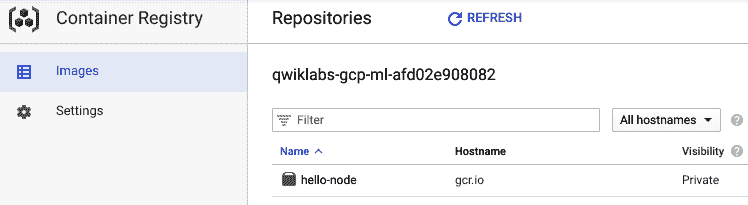
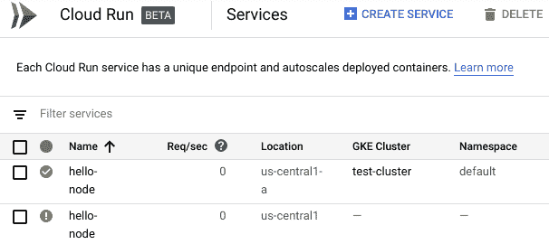
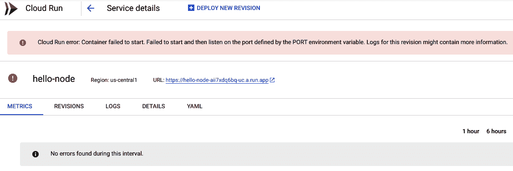

# 第九章：使用 Cloud Run for Anthos 开发

在本章中，我们将探索如何利用更复杂的工具和服务来提供生产级别的环境管理。Kubernetes 是一个广泛且令人着迷的主题，超出了本书的范围。然而，了解一些背景和关键元素将使你更容易过渡到这一平台。

如前面章节所述，Cloud Run 和 Kubernetes 的介绍将涵盖技术的关键方面。在这方面，如果你对该主题不熟悉，通过第一部分的学习应该为你提供一个关于 **Google Kubernetes Engine**（**GKE**）的入门知识。使用 Cloud Run for Anthos 可以充分利用 Kubernetes 的许多优势。本章将提供足够的信息帮助你入门。如果你已经熟悉 GKE，那么可以跳过初始部分，直接进入 Cloud Run for Anthos 的具体内容。

本章将涵盖以下主题：

+   设置身份和策略管理

+   使用环境监控

+   创建自定义网络

+   建立域名

# 技术要求

要完成本章的实践练习，你需要一个 Google Cloud 项目。

你可以在本书的 GitHub 仓库中找到本章使用的代码文件，路径为 `ch09` 子目录：[`github.com/PacktPublishing/Hands-on-Serverless-Computing-with-Google-Cloud/tree/master/ch09`](https://github.com/PacktPublishing/Hands-on-Serverless-Computing-with-Google-Cloud/tree/master/ch09)。

# 身份与策略管理

理解 Google Cloud 上的身份和策略安排是大多数用户的主要学习曲线。身份访问管理是一个重要组件，甚至可以单独作为一本书的主题。简而言之，IAM 在项目上提供策略，以赋予与角色相关的权限。

在 Google Cloud 上，管理操作通常通过服务帐户执行。在与 Google Cloud 目录配合使用时，IAM 角色定义了针对各种用户需求的解决方案。

# IAM 对象

从高层次来看，Google Cloud 使用由组织、文件夹、项目和资源组成的层次结构来管理访问权限。

+   组织节点是 Google Cloud 资源的根节点，包含所有的项目和资源。

+   文件夹是可选的，用于将项目分组到组织下。一个文件夹可以包含项目和其他文件夹。可以使用 IAM 策略来控制对文件夹中资源的访问。

+   Google Cloud 资源始终与项目相关联。Google Cloud 允许你跟踪资源和配额使用情况、启用计费、管理权限和凭证，并启用服务和 API。

在前述列表中定义的层次结构与成员（即**用户**或**服务账户**）和角色结合使用，以根据定义的访问权限将项目访问权限限制到特定组。

# 成员

成员账户很重要，因为它们提供对组织的访问权限。可以将成员账户视为提供域访问权限，用于确定在使用 Google Cloud 提供的服务时可以执行的操作。在处理成员账户时，有两种类型需要考虑：

+   **成员角色**：通过授予角色来赋予成员权限。角色定义了授予哪些权限。Google Cloud 提供了预定义角色，并且还可以创建自定义角色。

+   **服务账户**：这些账户允许我们控制服务器之间的交互。通常用于验证一个服务对另一个服务的访问，并控制服务可以执行的应用操作。Google 上的服务账户通过 `gserviceaccount.com` 域中的电子邮件地址来引用。

一旦定义了成员账户，下一步是为该成员分配角色。实际上，这就是提供执行项目内操作的权限。

# 角色

在 Google Cloud 上，角色提供了一种非常灵活的方式来授予对资源的访问权限。在这种情况下，访问权限作为一个范围提供，其中范围从粗粒度（在 Google Cloud 中称为原始角色）到细粒度（在 Google Cloud 中称为自定义角色），具体取决于使用场景。以下列表概述了三种角色类型。在大多数情况下，将使用这些角色类型的混合体来提供所需的访问类型：

+   **原始**：在 Cloud IAM 引入之前存在的最基础角色。定义在项目级别，这些角色提供粗粒度的访问控制，例如 Owner、Editor 和 Viewer 角色。

+   **预定义**：预定义的 IAM 角色用于提供比原始角色更细粒度的访问控制。每个 Google Cloud 服务都包含预定义角色。这些角色用于映射到某个工作职能，例如 Compute Network Admin、Security Reviewer。

+   **自定义**：由用户定义的包含权限和资源的定制角色。

学习上述角色类型将使得在 Google Cloud 上的工作变得更加容易，因为每个定义的项目将遵循我们所概述的结构。在下一部分，我们将查看 GKE，并了解它如何与 Cloud Run 配合使用。

# Google Kubernetes 引擎概述

希望你听说过 Kubernetes，并理解这个平台在技术环境部署中的重要性。对于那些不熟悉 Kubernetes 的人，本节将为你提供关键部分的概述。

Kubernetes 是一个容器编排平台，能够使得调度和维护由系统自动完成，而不是由用户手动进行。

在前几章关于 Cloud Run 的内容中，我们讨论了容器的重要性。我们尚未讨论的是，一旦开始使用容器，如何以更适合生产环境的方式（即一致性和可靠性）来协调这一管理。

正如你想象的那样，容器和 Kubernetes 是互补的技术，它们建立了一个可以扩展运行应用的环境。平台本身可以运行在多种 Linux 服务器上，包括 **虚拟机**（**VMs**）、云实例，甚至裸金属服务器。作为一个开源项目，开发的速度令人惊叹，贡献的质量也同样出色。

要在 Google Cloud 上使用 Kubernetes，我们使用 GKE。这为 Kubernetes 提供了一个托管环境。为了访问该环境，我们使用名为 `kubectl` 的命令，也称为 Kubernetes 控制命令。配置和维护 Kubernetes 集群超出了本书的范围，但我们将在将工件部署到 GKE 集群时引用底层构件。

了解产品的使用场景可以节省构建解决方案的工作量。此时，值得概述 Cloud Run 与 Cloud on GKE 之间的关键差异（除了对 Kubernetes 的需求）。

# 区分 Cloud Run 与 Cloud Run for Anthos

Cloud Run for Anthos 提供了许多 Cloud Run 的优势。在下表中，我们列出了一些用户应了解的关键差异：

|  | **Cloud Run** | **Cloud Run for Anthos** |
| --- | --- | --- |
| **计费** | 按使用量计费 | 配置的集群资源 |
| **机器定制** | 内存 | 内存、CPU、GPU、网络 |
| **URL 和 SSL** | 自动 HTTPS URL | 手动 SSL 证书 |
| **身份和策略** | 公共，调用者 IAM 角色，CICP | 公共或内部 |

尽管前面表格中列出了差异，但这些服务实际上可以通过简单的部署选项轻松部署，无需任何更改。开发可以在 Cloud Run 上开始。如果需要与 Kubernetes 相关的平台资源，可以迁移到 Cloud Run for Anthos。两者之间还有许多共享的功能：

+   对于任何部署的服务，都可以进行自动扩展（GKE 受使用的集群限制）。

+   轻松地通过 TCP 端口 `8080` 运行基于 HTTP 的应用和服务。

+   基于容器的简单开发者体验，使用清单文件。

+   选择任何语言或任何可以打包到容器中的库。

+   在无需配置环境的情况下，使用自定义域名。

现在我们对 GKE 有了大致了解，可以在接下来的章节中应用我们的知识，使用 Cloud Run for Anthos。

# 使用 Cloud Run for Anthos

如前所述，使用 Cloud Run for Anthos 提供了利用 Kubernetes 许多好处的能力。在本节中，我们将探讨这些功能的一些内容。我们先从创建（即配置）一个具有 Cloud Run 访问权限的 GKE 集群开始。

# 配置 GKE

Cloud Run for Anthos 需要一个 Kubernetes 集群。从高层次来看，Kubernetes 提供了一个平台，用于管理（或*编排*）容器。阐述 Kubernetes 的价值超出了本书的范围，但可以简单地说，它是一个非常值得投入时间的技术。

要将代码部署到 Cloud Run for Anthos，假设已有一个 GKE 集群。Cloud Run for Anthos 在部署之前需要一些预先存在的基础设施。在本节中，我们将启动一个集群，然后将我们的应用程序部署到该集群上，以探索 Cloud Run for Anthos 与 Cloud Run 之间的过程差异。

以下示例使用 Cloud Shell 进入命令行并启用项目中所需的服务。

1.  要配置集群，可以使用**Google Cloud 控制台**或**Cloud SDK**（**GCloud**）。在本示例中，将使用 Cloud SDK，以便可以查看底层命令。本节中访问的许多功能将提到 beta/alpha，因为在编写本文时，它们仍处于该状态。由于 Cloud Run 使用 Google 容器注册表和 Cloud Build API，因此需要在项目中启用这些服务。可以通过控制台或使用 Cloud SDK 启用相关的`googleapis`：

```
gcloud services enable container.googleapis.com containerregistry.googleapis.com cloudbuild.googleapis.com
```

1.  在集群上启用 Cloud Run 的 beta 版本意味着，当它变为**正式发布**（**GA**）版本时，命令的通用格式可能会发生变化。如果你使用 Cloud Shell 运行 Cloud SDK 命令，请注意此环境会定期自动更新，以纳入最新的 SDK 更改。其他环境可能需要手动更新，以确保已安装正确的组件版本。在这里，我们将存储将要使用的集群名称和区域，因为此信息既在集群创建时需要，也在`build`命令中需要：

```
export CLUSTER_NAME="test-cluster"
export ZONE="us-central1-a"
```

请注意，通常建议设置一些本地环境变量，用于存储常见参数，作为一种便利措施。确保环境变量采用大写字母格式，使它们在命令行脚本中更加突出。要访问变量的值，只需在变量名之前加上`$`符号——例如，`echo $CLUSTER_NAME` 将显示与集群关联的名称。

1.  对于 Cloud Run for Anthos，额外需要的元素是 Cloud Run 插件。我们将在这里第一次使用环境变量。要引用这个变量，我们在变量前加上`$`符号，例如，`$CLUSTER_NAME`。要配置集群，我们使用以下命令来启动部署 Cloud Run 的环境：

```
gcloud beta container clusters create $CLUSTER_NAME \
--addons=HorizontalPodAutoscaling,HttpLoadBalancing,Istio,CloudRun \
--machine-type=n1-standard-2 \
--cluster-version=latest --zone=$ZONE \
--enable-stackdriver-kubernetes \
--scopes cloud-platform
```

请注意，集群名称有一定的限制，因此在创建之前请检查所使用的细节是否符合要求。以下是应用的限制；即它们必须匹配正则表达式`(?:a-z?)`，这意味着以下内容：

+   +   只允许字母数字和`-`

    +   以字母开头，以字母或数字结尾

    +   不超过 40 个字符

当集群被创建时，我们需要向命令提供一些参数，如果你之前使用过 GKE，这些参数会很熟悉。一个标准集群需要以下内容：

+   +   机器规格—指示每个节点分配的计算机类型的参考

    +   集群版本—表示将分配给 Kubernetes 集群的版本

    +   区域—将创建计算资源的区域

    +   附加组件—提供额外功能的辅助命令

在配置过程中，GKE Cloud Console 选项中有一个更交互式的命令行版本，显示正在执行的操作。然而，除了出于好奇心，实际上没有必要使用这个命令行版本。

1.  一旦集群配置过程完成，它将表示已创建的配置。作为一个选项，我们还可以在此阶段为项目设置`gcloud`命令的默认值：

```
gcloud config set run/cluster $CLUSTER_NAME
gcloud config set run/cluster_location $ZONE
```

1.  为了确认集群已成功创建，使用`kubectl`命令与 GKE 进行交互。Kubectl 是与已创建集群直接交互的主要方式。为了检查节点，我们需要发出以下命令：

```
kubectl get nodes
```

前一个命令的输出将显示信息，如部署的 Kubernetes 节点的名称、状态、年龄和版本。在这个上下文中，Kubernetes 集群本质上是我们定义的节点作为一个单元协同工作。

在我们的 GKE 集群中，我们现在拥有了部署 Cloud Run 的基础平台。在接下来的部分中，我们将花一些时间探索如何将代码部署到这个环境中。此外，我们还将查看一些工作流技巧，以帮助提高开发生产力。

# GKE 上的自定义网络

在 GKE 上使用 Kubernetes 时，了解它会创建一个自定义网络是很有帮助的。需要特别注意的是，Kubernetes 将利用 IP 地址来协助其所有资源（例如 Pod、节点和服务等）之间的通信。

# 内部网络

GKE 集群中最小的元素被称为**pod**。Pod 用于运行容器，数量可以是一个或多个，具体取决于为给定应用使用的模式。Pods 位于网络命名空间内，用于在 Kubernetes 关联的虚拟网络中隔离访问。

Pods 被调度到节点，并且可以与任何其他 Pod 通信，除非特别限制。因此，Pod 之间的通信是默认的，即使它们被动态删除和重新创建。然而，由于 Pod 是短暂的，外部访问需要一个单独的机制，称为服务（service），以提供一致的访问点。服务使用标签，基本上是 Kubernetes 资源的键值对。这样的服务保持一致的 IP 地址和端口，以便从外部访问时，可以将其作为逻辑单元来访问一组 Pods。

# 外部网络

对于集群外的流量，情况是以不同的方式管理的。Kubernetes 使用三种不同的机制来提供对内部网络资源的访问。

NodePort 和 ClusterIP 提供了通过 HTTP 负载均衡器的访问。Ingress 访问资源需要定义服务，原因如前所述。然后，通信确保流量被引导到标记为该服务的逻辑组。

需要注意的主要一点是，只要流量保持在集群内部，资源之间的通信就可以启用并得到支持。如果需要外部流量，则应该提供服务和某种形式的负载均衡访问。

# 部署 Cloud Run for Anthos

既然我们已经创建了集群，我们可以开始思考如何部署应用程序。本节的主要重点是涵盖部署应用程序到 GKE 集群的过程。谷歌非常有意识地使 Cloud Run 命令尽可能相似。和前一节一样，我们将构建一个简单的 Node.js 容器，并将其推送到 GKE。

为了展示我们新 GKE 集群的能力，我们将部署 `hello-node` Node.js 应用程序。我们的 `hello-node` 应用程序只是简单地将一条消息打印到屏幕上，所以无需担心代码复杂性。实际上，我们已经在仓库中提供了代码，所以让我们从现有的 Cloud Shell 环境中克隆它：

1.  克隆 GitHub 仓库：

```
git clone [github repo]/ch09/hello-node
```

再次提醒，`hello-node` 应用程序并没有做什么特别的事情，它只是将 `Hello World!` 输出到 `8080` 端口。它已经打包好（也就是打包成 `cloudbuild.yaml` 文件和 Dockerfile），并准备好用于将镜像推送到容器仓库。

1.  要开始 Cloud Build 过程，运行以下命令：

```
gcloud builds submit --config cloudbuild.yaml
```

在构建过程中，我们将使用 Google 容器注册表，而不是 Docker 注册表。注册表本质上是一个存储镜像的位置，可以用来推送和拉取存储的镜像。使用注册表的好处是，它提供了一个集中存储区域，可以共享你的镜像。

默认情况下，存储在容器注册表中的镜像被标记为私有，需要 IAM 权限才能访问内容。或者，镜像也可以标记为公开，这意味着它们可以在不需要额外身份验证的情况下与项目外部共享。

1.  一旦构建过程成功完成，生成的镜像将存储在当前的 Google Cloud 项目下，并根据 `cloudbuild.yaml` 文件中指定的标签进行命名。

在这里需要特别注意的是与镜像关联的标签，因为这是在从仓库拉取镜像时引用该工件的方式：



查看 Google Cloud 容器注册表，以查看上一步构建的镜像。选择注册表中的镜像将显示更多详细信息，包括重要的标签引用。

从容器注册表中，我们可以看到镜像，以及应用的主机名和可见性级别（即，私有/公开）。主机名提供了镜像关联的区域，具体如下：

+   +   `gcr.io`：当前位于美国，但位置可能会变化。

    +   `us.gcr.io`：美国

    +   `eu.gcr.io`：欧盟

    +   `asia.gcr.io`：亚洲

在构建镜像时，最好选择距离数据最近的位置，以最大化整体性能。原因是，在拉取镜像（即获取过程）时，您希望尽量减少注册表源和目标主机之间的距离。

镜像的可见性可以是项目私有的，也可以是公开的（即，任何人都可以访问）。默认情况下，镜像设置为私有；不过，如果需要，也可以轻松更改可见性。

此时，镜像已经存在于项目注册表中，集群也可以访问它。在部署镜像之前，让我们花一点时间了解一些用于部署的标准命令中的术语：

+   +   `SERVICE`：表示要与部署的镜像关联的名称。

    +   `IMAGE`：一个在容器注册表中可用的工件，将作为服务进行部署。

    +   `CLUSTER-NAME`：与先前创建的集群关联的名称，即 `$CLUSTER_NAME`。

    +   `CLUSTER-LOCATION`：这是分配给集群的区域，即 `$ZONE`。

请注意，`IMAGE` 标签必须与容器注册表中的标签完全匹配（如果有版本号，也要包括）。如果不确定使用哪个标签，请访问 Cloud Console，选择所需的镜像以查看相关标签详情。

部署后的容器将显示服务名称、修订版（即唯一引用）以及流量服务的 URL。到目前为止，我们已经为要运行的服务创建了一个占位符。为了将容器作为命名服务访问，我们需要部署它。在实际操作中，之前的活动很可能是一次性的任务，并且可以轻松自动化。

1.  要将工件部署到 GKE 集群，我们使用 `gcloud run deploy` 命令，方式如下：

```
gcloud run deploy [SERVICE] --image [IMAGE] --platform gke --cluster [CLUSTER-NAME] --cluster-location [CLUSTER-LOCATION]
```

现在服务已经部署，关于应用程序运行的大量信息突然变得可用。有两个地方值得关注，关于 GKE 上运行的工作负载的信息：

+   第一个是 Kubernetes 引擎工作负载页面，其中可以查看 GKE 部署的详细信息。如果您对发送到集群的部署或工作负载的状态感兴趣，这里是获取信息的地方。从这里，您可以深入了解部署的各个方面。

+   第二个是 Stackdriver。在下一节中，我们将更新应用程序，查看这对数据展示的影响，并了解如何在出现问题时跟踪信息。

现在我们对部署有了基础了解，可以考虑如何利用 Google Cloud 提供的工具集来自动化这一过程。

# 持续部署

如我们所见，与 Cloud Run 相比，启动 Cloud Run for Anthos 的工作量要大得多。如果我们想要部署代码的另一个修订版本会发生什么？我们需要再次走一遍整个过程吗？其实不需要：服务的部署是唯一需要重复的方面。花些时间更详细地探索这一点会很有意思，并且有助于理解在集群中存在多个修订版本时，发生了什么：

1.  我们之前的镜像是版本 0.1，因此让我们进行一个小的改动（我在响应字符串中添加了 `+1`），看看这对部署过程以及向集群推出的影响：

```
const express = require('express');
const app = express();
const port = process.env.PORT || 8080;
app.get('/', (req, res) => res.send('Hello World! +1'));
app.listen(port, () => console.log(`Example app listening on port ${port}!`));
```

1.  接下来，使用以下命令更新 Container Registry 中存储的镜像：

```
gcloud builds submit --config cloudbuild.yaml
```

1.  最后，我们希望在集群中部署更新后的镜像：

```
gcloud beta run deploy [SERVICE] --image [IMAGE] --platform gke --cluster [CLUSTER-NAME] --cluster-location [CLUSTER-LOCATION]
```

第一步是确认新服务是否已成功部署，可以通过查看命令输出进行确认。要获取 Cloud Run 服务的状态，Cloud 控制台的工作负载页面始终会显示更新的状态，并在变更启动时显示相应信息。

不幸的是，每次我们想要部署某些内容时，都需要执行这些操作，实在是有点麻烦。不过不用担心：有一种更实用的方式来部署我们的代码，它允许我们的可靠伙伴——服务账户和 Cloud Build，处理所有繁琐的部分。

在 Cloud Build 设置中，修改 Cloud Run 服务账户（Cloud Run 管理员）和服务账户（服务账户用户）为启用状态。在左侧面板中，选择触发器选项并连接到有效的仓库。

请注意，如果已经建立了与 GitHub 的连接，必须完成此操作才能成功完成设置。

可以为特定分支或所有推送到仓库的推送设置触发器。请注意，触发器类型会尝试自动检测配置文件。在作者的情况下，`cloudbuild.yaml` 文件被重命名为 `cloudbuild.github`，这样就很明显应该使用哪个环境文件。

选择创建按钮，触发器将为选定的仓库激活。

1.  回到源代码，让我们再对源代码进行一次修改，做一个简单的变更，以便可以明显看到已部署版本之间的区别。更新高亮的行，使其反映如下更改：

```
const express = require('express')
const app = express()
const port = process.env.PORT || 8080;
app.get('/', (req, res) => res.send('Hello World! GitHub Build'))
app.listen(port, () => console.log(`Example app listening on port ${port}!`))
```

1.  最后，我们需要修改 `cloudbuild.github.yaml` 文件，以优化我们的构建过程。更新后的配置文件将类似于以下所示：

```
steps:
  # Build the container image
- name: 'gcr.io/cloud-builders/docker'
  args: ['build', '-t', 'gcr.io/$PROJECT_ID/hello-node', '.']
  # push the container image to Container Registry
- name: 'gcr.io/cloud-builders/docker'
  args: ['push', 'gcr.io/$PROJECT_ID/hello-node']
  # Deploy container image to Cloud Run
- name: 'gcr.io/cloud-builders/gcloud'
  args: ['beta', 'run', 'deploy', 'hello-node', '--image', 'gcr.io/$PROJECT_ID/hello-node', '--platform', 'gke', '--cluster', 'test-cluster', '--cluster-location', 'us-central1-a']
images:
- 'gcr.io/$PROJECT_ID/hello-node'
timeout: "600s"
```

仔细查看前面代码块中列出的构建文件，我们可以看到 Cloud Builds 的灵活性，因为它允许直接启动命令。进一步检查这些命令，突出显示以下活动：

+   +   **构建容器镜像**：`build` 命令本质上是标准的 `docker build` 命令，它会使用适当的命名约定为镜像打标。

    +   **将容器镜像推送到容器注册表**：一旦 `docker build` 过程完成，构建的镜像将被推送到 Google 容器注册表，并使用指定的标签。再次使用标准的 Docker 命令将镜像发送到仓库。

    +   **将容器部署到 Cloud Run**：打标的镜像被部署到集群中。

这种布局为基于 Docker 的环境提供了一个常见的构建模式。

1.  要启动构建，我们再次需要从命令行启动构建过程：

```
gcloud builds submit --config cloudbuild.github
```

然而，前述的手动步骤不再必要！该代码库现在已直接与 GitHub 关联，因此每当检测到分支更改时，构建过程会自动启动。使用 Cloud Build 可以节省大量精力，只需极少的配置，非常值得花时间去了解它是如何工作的。

在成功构建了一个服务之后，在下一部分我们将快速了解域名以及在使用 Cloud Run 时如何将其应用于 Google Cloud。

# 应用域名

一旦服务被部署，Google Cloud 提供了许多选项来管理相关的域名。简而言之，域名提供了将服务 IP 地址映射到互联网并使用人类可读的名称访问的能力。因此，我们可以在浏览器中输入 `www.google.com` 而不是访问 IP `216.58.206.110` —— 我将留给你考虑哪个更容易记住。

注册域名变得越来越容易，许多公司提供购买自己互联网一部分的机会。一旦你拥有了一个域名，你实际上可以将其映射到你的 Cloud Run 服务。

如果你不想购买域名，Google Cloud 集成了三个外部通配符 **域名系统** (**DNS**) 测试网站，这些网站可以与部署的 Cloud Run 服务关联，如下所示：

| **DNS 服务** | **信息** |
| --- | --- |
| `nip.io` | [`exentriquesolutions.com/`](https://exentriquesolutions.com/) |
| `xip.io` | [`basecamp.com/`](https://basecamp.com/) |
| `sslip.io` | [`github.com/sstephenson`](https://github.com/sstephenson)[`github.com/cunnie/sslip.io`](https://github.com/cunnie/sslip.io) |

或者，如果你已经拥有一个域名，也可以将其设置并用于替代默认的域名。当你没有运行实时服务时，拥有自己的域名可能不会太重要。然而，一旦你的产品进入生产环境，拥有一个域名看起来就会更加专业。

Cloud Run for Anthos 默认使用的域名实际上是 `example.com`。当你更改域名时，例如，更改为测试站点，已部署的服务将注册到所选的名称系统中，例如 `xip.io`。更改 DNS 设置需要使用配置映射来告诉 Kubernetes 如何配置域名：

在接下来的部分，我们将捕获输出到环境变量中。这样做的目的是我们不需要不断地发送 API 请求来确认值。

1.  获取当前使用 `default.com` 的服务 URL，例如：

```
SERVICE_URL=$(gcloud beta run services describe [SERVICE-NAME] --platform gke --cluster [CLUSTER-NAME] --cluster-location [ZONE] --format "value(status.url)")
```

1.  获取已部署服务的外部 IP 地址：

```
ISTIO_INGRESS=$(kubectl get svc istio-ingress -n gke-system -o json | jq -r '.status.loadBalancer.ingress[0].ip')
```

1.  使用 Istio Ingress IP 作为外部 IP，应用补丁到配置映射：

```
kubectl patch configmap config-domain --namespace knative-serving --patch \
'{"data": {"example.com": null, "[EXTERNAL-IP].[DNS-SERVICE]": ""}}'
```

1.  更新服务 URL 环境变量：

```
SERVICE_URL=$(gcloud beta run services describe [SERVICE-NAME] --platform gke --cluster [CLUSTER-NAME] --cluster-location [ZONE] --format "value(status.url)")
```

`gcloud sdk` 和 `kubectl` 命令提供多种格式的信息，包括 JSON。学习如何解析 JSON 是开发命令行脚本时一个非常实用的技能。

恭喜！你已经为你的服务启用了自定义域名。现在，服务将不再显示 `default.com`，而是会注册到选定的域名。

在下一部分，我们将讨论应用程序的监控，并提供一些有用的信息见解。

# 使用 Stackdriver 进行故障排除

前面的章节已经讨论了 Cloud Run 的许多关键细节。到目前为止，我们已经在 GKE 上配置了集群，部署了我们的应用程序，并利用 Cloud Build 提高了我们的生产力。在此时，我们可能还需要讨论当出现问题时该怎么办。

Google Cloud 提供了很多环境信息，特别是对于基于计算的资源，如 GCE 和 GKE。幸运的是，对于无服务器工作负载，我们也可以利用这些关键数据点：

1.  首先，让我们继续使用我们的 `hello-node` 应用程序，并向代码中引入一个错误。访问 `index.js` 的源代码，并将以下错误条目保存到代码中：

```
const express = require('express')
const app = express()
const port = process.env.PORT || 8080;
oops
app.get('/', (req, res) => res.send('Hello World! GitHub Build'))
app.listen(port, () => console.log(`Example app listening on port ${port}!`))
```

1.  在上述代码中，我们故意添加了一个代码缺陷，以便我们可以在 Stackdriver 中跟踪此问题。我们可以再次运行 `cloudbuild.github` 来为我们完成所有繁重的工作。然而，这次部署任务会失败！要查看失败的详细信息，我们应该进入 Cloud Run 界面并调查现有服务。

1.  从 Cloud Run 仪表板视图中，我们可以看到一个绿色圆圈和勾号，表示 `hello-node` 服务已经成功部署并在预期的参数内运行。与此相比，我们最新部署的 `hello-node` 服务出现了错误，图中间有一个红色圆圈和感叹号。另外，GKE 集群或命名空间详情没有显示，意味着镜像尚未部署到最终目标位置。

1.  选择带有错误的应用程序以显示服务详情页面上的更多信息，如下所示：



在深入探讨如何进一步了解显示的错误信息之前，我们应当花点时间来重点介绍 Cloud Run 服务详情页以及从该页可以访问到的信息。

每次部署服务时，都会进行大量的信息交换，其中许多操作是在后台完成的。使用 Google Cloud 的一个重要方面是资源相关数据的集中管理。与项目中部署的服务或资源相关的很多信息将被捕获到 Stackdriver 中。幸运的是，Google 的工程师将 Stackdriver 中最常用的元素提取出来，并将其添加到一个便捷的仪表板中，涵盖了 METRICS、REVISIONS、LOGS、DETAILS 和 YAML，具体如下：



让我们逐一探索这些仪表板元素：

+   **度量（METRICS）**: 度量屏幕提供了应用程序常用的一系列数据，例如请求计数。此外，展示的信息也可以按时间段进行过滤（例如 1 小时、6 小时、7 天或 30 天）。从这个屏幕中，应用程序的状态可以轻松查看，并可以开始调查与服务性能相关的问题。因此，如果你遇到与服务性能相关的问题，例如延迟或瓶颈，这就是查看应用程序属性以了解发生了什么的地方。

+   **修订（REVISIONS）**: 展示已部署的修订版本概览，包括环境变量和 Cloud SQL 连接情况。

+   **日志（LOGS）**: 访问服务的日志信息。这里提供的详细信息基于系统日志，因此应用程序捕获的信息也会出现在此处。

+   **详情（DETAILS）**: 在此页面中，服务连接和认证信息将会共享。

+   **YAML**: 最后一页提供了与当前查看的服务相关的 YAML 概览。

记住，在写这本书的时候，仪表板功能仍在修订中，因此你可能会看到一些细微（甚至是明显的）变化。

现在，我们已经概述了仪表板的相对功能，接下来我们可以开始解决我们的服务错误。

你可能还记得，我们早些时候更新了应用程序并引入了一个错误。在 Cloud Run 的主仪表板上，我们可以看到我们的服务未成功。

在本章中，我们从一个简单的应用程序开始，然后将其纳入了持续集成构建过程。传统上，我们使用日志来深入了解那些未按标准流程运行的应用程序。由于我们已将构建过程的许多环节交给自动化流程，因此每个阶段的日志也理应集中存储：

1.  转到 Stackdriver。那些本应在开发者本地可用的日志现在集中存储在一个中央仓库中。

1.  在 Cloud Run 仪表盘中，选择显示错误的项目，重新进入服务详情页面。

1.  在这里，选择 LOGS 选项卡，仔细查看日志进程捕获了哪些信息。

请注意，Stackdriver 中的每一条日志项都带有时间戳，并且与此相关的是返回状态更新的某种命令。

通过屏幕上显示的内容，我们可以看到应用程序是通过`index.js`命令节点执行的。如果你不明白为什么，是因为这与我们在`package.json`文件中输入的启动命令有关。

在列表的进一步查找中，我们看到提到了`/usr/src/app/index.js:5`。这表明在`index.js`的第五行发生了一些有趣的事情。在接下来的日志中，系统显示了一个有趣的提示：在源文件中发现了`oops`。显然，这不是我们想要的内容，因此我们找到了拼写错误。

1.  现在我们已经通过日志探索到了有价值的线索来修正我们的应用缺陷，回到源代码并删除`index.js`文件中第五行的拼写错误。

1.  将更改后的代码重新提交到一个分支，并再次查看代码是否自动更新以反映所做的更改。

1.  此时，代码应根据所做的更新成功工作。通过检查显示的文本是否与当前版本源代码中显示的内容相同来确认代码是否正常运行。

希望通过这个示例，调试应用程序的过程变得更加清晰。通过将开发工作流提前融入 Cloud 流程，它使整体集成更加完整。能够利用内建工具，如 Stackdriver，提供了一个更容易的途径来提高生产力。

# 删除集群

为了完成这一章，最后一个活动是删除集群。删除集群并不是一个常见的操作；事实上，之所以在这里展示，是为了说明这一过程。正如我们现在所知道的，集群包含了所有与 Kubernetes 相关的基础功能。在 GKE 上，我们的集群是受管理的；也就是说，你不需要担心诸如节点创建、TLS 证书创建等低级别的活动。

话虽如此，要删除之前创建的集群，请使用以下命令：

```
gcloud beta container clusters delete CLUSTER_NAME
```

为了澄清，在撰写时，`cluster delete`命令处于测试阶段，因此将来可能会有一些变化。

一旦我们开始删除集群，它会移除所有相关的工作负载，即已部署的容器。要重新启动，需要创建一个新集群以便部署 Cloud Run for Anthos。

# 摘要

在本章中，我们介绍了 Kubernetes 的高级概念，并探讨了如何使用 Cloud Run for Anthos。如果你的首选平台是 Kubernetes，那么 Cloud Run for Anthos 就是你应该选择的路径。正如我们所看到的，非 Kubernetes 环境与 Kubernetes 环境之间的迁移无需额外配置，因为交付工件是基于容器的。

通过本章内容，我们发现了一种更高效的方式将 Cloud Build 融入开发者工作流。利用 Google 提供的开发者工具是减少构建和部署过程中重复性工作的明智方式。

在下一章中，我们将开发几个 Cloud Run 示例来说明一些关键功能。通过一些示例用例，将有助于说明如何在自己的项目中使用 Cloud Run。

# 问题

1.  使用 Cloud Run for Anthos 时可以进行哪些类型的机器定制？

1.  使用 Cloud Run for Anthos 时，SSL 证书是自动生成的还是手动生成的？

1.  部署到 Cloud Run for Anthos 时需要哪些平台标志？

1.  使用 Cloud Run for Anthos 时，服务访问使用哪个端口？

1.  使用 Cloud Run for Anthos 需要预先配置集群吗？（正确或错误）

1.  使用 Cloud Run for Anthos 需要哪些附加组件？

1.  哪个命令用于从命令行管理 GKE 集群？

1.  什么是 pod？

1.  GKE 如何支持外部流量？

# 深入阅读

+   **Istio**: [`cloud.google.com/istio/`](https://cloud.google.com/istio/)

+   **Cloud Run 身份验证**: [`cloud.google.com/run/docs/authenticating/overview`](https://cloud.google.com/run/docs/authenticating/overview)

+   **Google Kubernetes Engine**: [`cloud.google.com/kubernetes-engine/`](https://cloud.google.com/kubernetes-engine/)

+   **映射自定义域名**: [`cloud.google.com/appengine/docs/standard/python/mapping-custom-domains`](https://cloud.google.com/appengine/docs/standard/python/mapping-custom-domains)

+   **通过 gcloud、Google Cloud 的命令行界面进行过滤和格式化的乐趣**: [`cloud.google.com/blog/products/gcp/filtering-and-formatting-fun-with`](https://cloud.google.com/blog/products/gcp/filtering-and-formatting-fun-with)

+   **JQ 教程**: [`stedolan.github.io/jq/tutorial/`](https://stedolan.github.io/jq/tutorial/)
