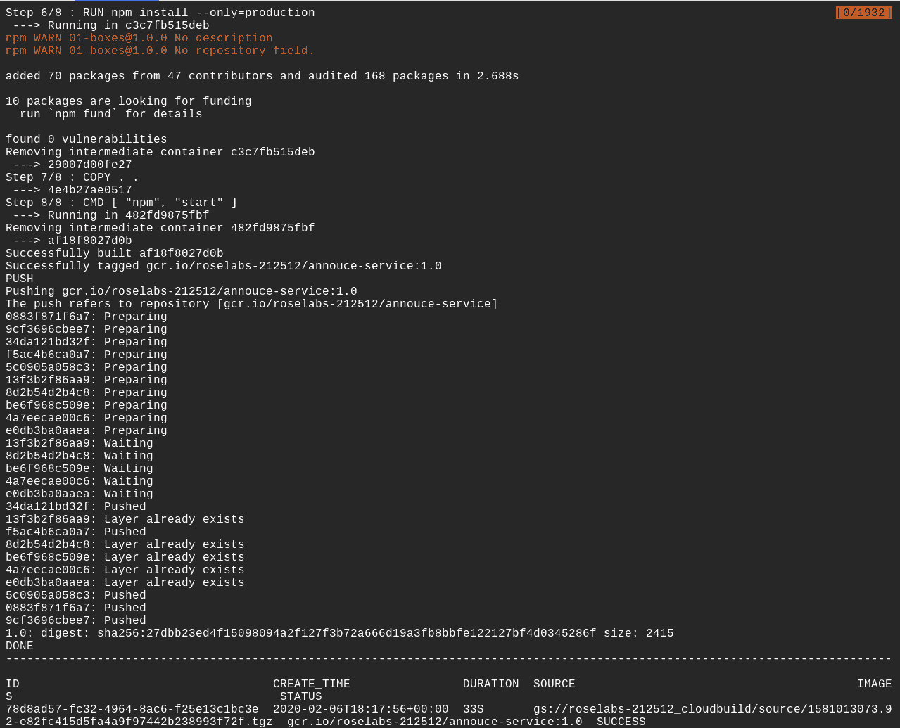
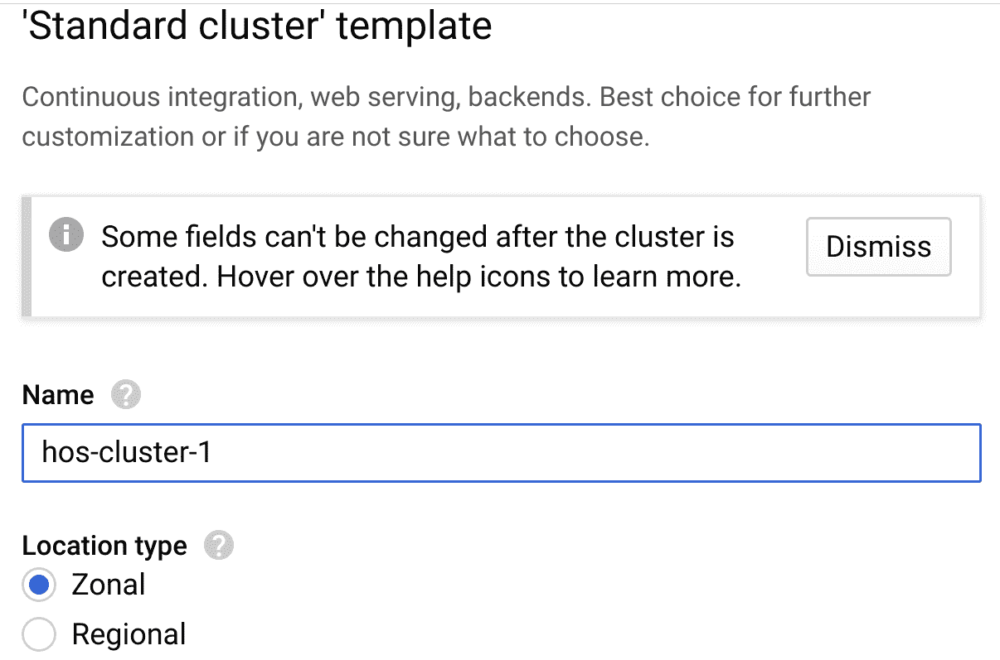
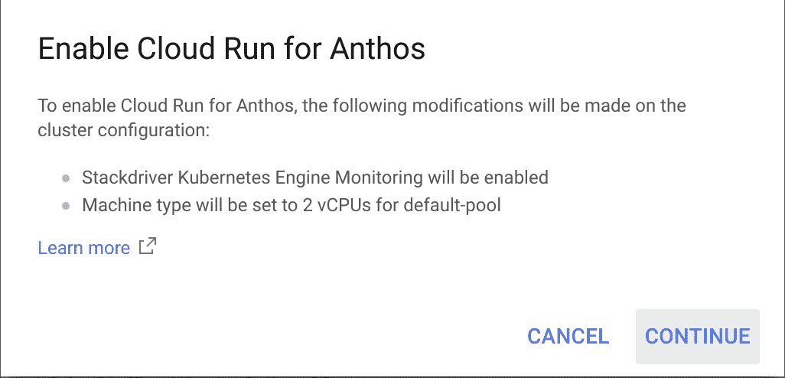
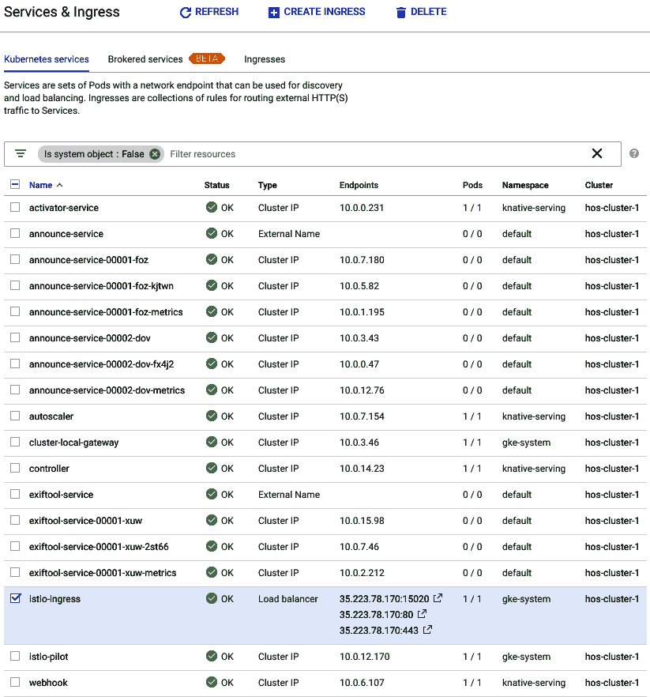
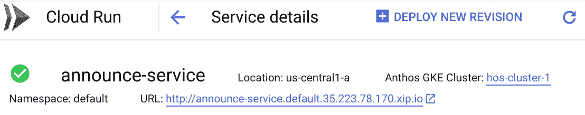
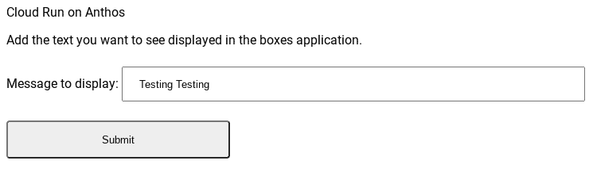
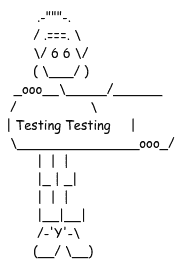
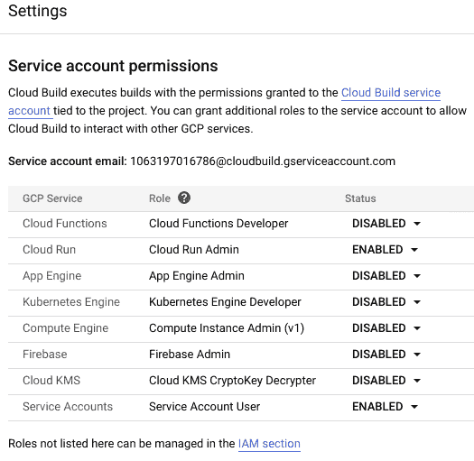
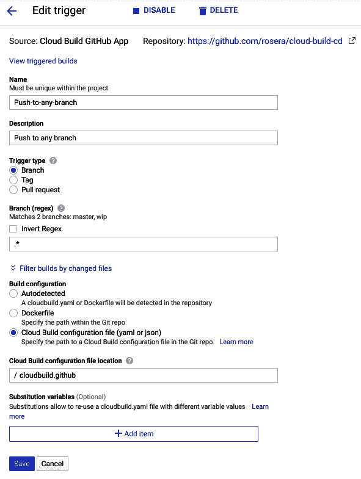

# Cloud Run 实验室

在本章中，我们将探讨一些使用案例，看看如何在**Google Kubernetes Engine**（**GKE**）上部署 Cloud Run。最常见的使用案例围绕着构建 Web 应用程序、执行部署以及需要**持续集成**（**CI**）。

本章的重点是展示使用 Cloud Run 时可以实现的广泛使用案例。本章还将展示在使用该平台时，如何执行部署容器所需的许多活动。

在本章过程中，我们将讨论以下主题：

+   构建容器

+   在 GKE 上部署 Cloud Run

+   创建一个简单的 Web 应用程序

+   GKE 上的 CI

# 技术要求

为了完成本章中的练习，你将需要一个 Google Cloud 项目或一个 Qwiklabs 账户。

你可以在本书的 GitHub 仓库中找到本章的代码文件，位于 `ch10` 子目录下，链接为 [`github.com/PacktPublishing/Hands-on-Serverless-Computing-with-Google-Cloud/tree/master/ch10`](https://github.com/PacktPublishing/Hands-on-Serverless-Computing-with-Google-Cloud/tree/master/ch10)。

当你浏览本书中的代码片段时，你会注意到，在一些实例中，代码或输出的某些行已被删除，并用省略号（`...`）替代。省略号仅用于显示相关的代码或输出。完整的代码可以在之前提到的 GitHub 链接上找到。

# 构建容器

到目前为止，构建应用程序的容器应该是本书中的一个熟悉的活动。大多数情况下，在构建镜像时，我们通常可以依赖现有的知识来确定如何整合运行时语言或软件包。从个人角度来看，我喜欢将应用程序容器化，因为这提供了一种一致且易于理解的接口。从系统更新和其他变化对应用程序产生影响的隔离是维护计算机时非常常见且令人烦恼的一个方面。

此时的假设是，构建镜像已是驾轻就熟，接下来的挑战是部署容器。你的容器实际要做什么，可能会影响运行容器的复杂性。例如，运行一个带图形用户界面的容器（潜在地）会比一个使用命令行界面的容器面临更多问题。在本章中，我们将通过几个示例，介绍如何执行这个过程。

# 创建服务

我们将使用 Cloud Shell 或本地开发环境（Cloud SDK）来创建下一个示例，这是一个有趣的示例，用于展示如何构建在容器中运行的应用程序。在这个示例中，我们将开发一个简单的应用程序，名为**announce**（基于命令行工具**Boxes**），它将在命令行上显示一条消息。

如果你不熟悉 Boxes，它会在文本周围绘制 ASCII 艺术。首先，我们想要创建一个能够调用 Boxes 应用程序来输出一些任意文本的应用程序。

为了开始示例，让我们初始化环境，准备好构建我们的应用程序。

1.  初始化`npm`包：

```
npm init --yes
```

1.  编辑`package.json`以添加`start`命令：

```
...
"scripts": {
"start": "node index.js",
"test": "echo \"Error: no test specified\" && exit 1"
},
...
```

1.  安装`npm`包：

```
npm install express
npm install util
npm install child-process
```

1.  创建并编辑一个名为`index.js`的文件：

```
const {promisify} = require('util');
const exec = promisify(require('child_process').exec);
const express = require('express');
const app = express();
const port = process.env.PORT || 8080;

app.listen(port, () => {
  console.log('Listening on port', port);
});
```

1.  将主要功能添加到`index.js`文件：

```
app.get('/', async (req, res) => {
  try {
    let message = req.query.message;
    console.log ('Message: ' + message);
    const cmd='echo ' + message + ' | boxes -d boy';
    const {stdout, stderr} = await exec(cmd);
    if (stderr) {
      throw stderr;
    }
    res.status(200).send("<pre>" + stdout + "</pre>");
  }
  catch (ex) {
    console.log(`${ex}`);
    res.status(500);
  }
});

```

你可以通过在命令行中运行`npm start`来检查你的应用程序。它不会做任何惊人的事情，但它会给你机会修正代码中可能存在的任何问题。如果你没有在本地安装`boxes`，输出将类似于以下内容：

`Message: undefined`

`Error: Command failed: echo undefined | boxes -d boy`

不用担心——这是预期的，随着我们应用程序镜像的创建，这个问题会被修正。

1.  创建一个 Dockerfile：

```
FROM node:12-slim
LABEL MAINTAINER Rich Rose
RUN apt-get update -y && apt-get install -y boxes && apt-get clean
WORKDIR /usr/src/app
COPY package*.json ./
RUN npm install --only=production
COPY . .
CMD [ "npm", "start" ]
```

1.  构建镜像：

```
gcloud builds submit --tag gcr.io/$GOOGLE_CLOUD_PROJECT/announce-service:1.0
```

一旦构建过程启动，类似以下内容的输出将显示：



将镜像推送到容器注册表意味着我们可以更好地控制镜像的访问方式和位置。现在镜像已经构建完成，我们可以通过在本地部署它来进行初步的容器测试。

# 测试公告服务

将容器部署到容器注册表只是完成工作的一部分。接下来，我们需要从存储的镜像中运行容器。Cloud Run 容器运行在`8080`端口，因此我们应该为从存储库中提取的镜像启用端口映射：

1.  从命令行运行容器：

```
docker run -d -p 8080:8080 gcr.io/$GOOGLE_CLOUD_PROJECT/announce-service:1.0
```

1.  测试应用程序的输出：

```
curl 127.0.0.1:8080
```

1.  测试向应用程序发送消息：

```
curl 127.0.0.1:8080/?message=cloud+run+on+anthos
```

1.  停止本地计算机上运行的 Docker 容器：

```
docker stop $(docker ps -aq)
```

恭喜你，现已成功部署并测试了应用程序，能够从容器中生成盒子 ASCII 艺术。在下一部分，我们将把应用程序部署到**Google Kubernetes Engine**（**GKE**）并从集群中访问该服务。

# 在 GKE 上部署 Cloud Run

现在我们知道如何创建应用程序的镜像，这如何转化为在 GKE 上运行镜像呢？幸运的是，我们已经知道如何在 Cloud Run 上部署容器，这意味着我们已经掌握了在 GKE 上部署所需的大部分内容。

从外部来看，我们通过 Cloud Run 服务 URL 与之交互。内部运行在 GKE 上时，实际上在后台发生了更多的事情。然而，我们将专注于如何在作为服务运行时复制我们的应用程序。

# 配置 GKE 集群

在我们将应用程序部署到 GKE 上的 Cloud Run 之前，我们需要创建一个 GKE 集群。那么，让我们开始吧：

1.  在这个示例中，我们使用了标准的集群定义。因此，创建一个名为`hos-cluster-1`的 GKE 集群：



选择启用“Anthos 的 Cloud Run”选项非常重要。

以下截图表示 Cloud Run for Anthos 已为集群启用。默认情况下，创建的集群启用了监控：



我们还可以使用命令行在 Google Cloud 上创建集群并执行任务。在此实例中，创建集群需要很长的命令，因此我通常通过 Cloud Console 进行此操作。

将要创建的 Kubernetes 集群是标准的，除了集群配置页面底部的复选框。为了在集群中启用 Cloud Run，必须选中此框。

1.  集群成功配置后，配置`kubectl`以连接到该集群：

```
gcloud container clusters get-credentials hos-cluster-1 --zone us-central1-a --project $GOOGLE_CLOUD_PROJECT
```

1.  将服务部署到`hos-cluster-1` Kubernetes 集群中。请注意，现在我们指定了 GKE 作为平台，以及集群和集群位置：

```
gcloud run deploy announce-service \
--platform gke \
--cluster hos-cluster-1 \
--cluster-location us-central1-a \
--image gcr.io/$GOOGLE_CLOUD_PROJECT/announce-service
```

1.  创建一个名为`ANNOUNCE_URL`的环境变量，用于存储已部署服务的 URL：

```
ANNOUNCE_URL=$(gcloud beta run services describe announce-service --platform gke --cluster hos-cluster-1 --cluster-location us-central1-a --format "value(status.url)")
```

通过 Istio 为 Cloud Run 服务提供外部访问，Istio 部署在另一个命名空间中。已部署的命名空间会显示在 Cloud Console 中。然而，如果你从默认命名空间的命令行执行`kubectl get service`，则不会看到 Istio 的引用。要从命令行访问 Istio 网关服务，我们需要指明要使用`gke-system`命名空间。

# 测试 GKE 服务

我们已经部署了一个服务，但需要知道如何访问它。GKE 上的 Cloud Run 使用 Istio Ingress 来启用外部访问 GKE 集群：

1.  要显示 Istio Ingress（即在`gke-system`命名空间中创建的`loadBalancer`）的详细信息，请使用以下命令：

```
kubectl get svc istio-ingress -n gke-system
```

1.  将`loadBalancer.ingress`地址分配给`ISTIO_INGRESS`环境变量：

```
ISTIO_INGRESS=$(kubectl get svc istio-ingress -n gke-system -o json | jq -r '.status.loadBalancer.ingress[0].ip') 
```

在以下截图中，我们可以看到集群的结果。我们需要的信息被标记为`istio-ingress`：



从`kubectl`命令返回的信息可以进行过滤，只显示所需的字段。例如，在此情况下，我们只需要 IP 地址。如果我们想要过滤输出并返回特定信息，可以使用 JQ 过滤出所需的信息。

JQ 是一个轻量级命令行工具，用于处理 JSON 对象。使用此工具，可以像使用`sed`或`awk`一样操作 JSON 对象。有关此神奇工具的更多信息，请访问[`stedolan.github.io/jq/`](https://stedolan.github.io/jq/)。

1.  可以通过访问 Cloud Run 服务页面或使用`curl`命令访问与 Cloud Run 控制台中显示的 istio-ingress 关联的外部 IP 来测试集群中运行的应用。例如，在我的案例中，它是`announce-service.default.35.223.78.170.xip.io`：

```
curl -v http://announce-service.default.[EXTERNAL_IP].xip.io
```

默认命名空间可以在 Cloud Run 的服务详情页面看到，如下所示：



对于已部署的服务，你可能已经注意到与我们服务关联的域名注册为 `xip.io`。Cloud Run 在 GKE 上使用的默认域名实际上是 `example.com`。那么，这个地址是如何被分配给已部署的服务的呢？在测试时，可以从默认域名切换到其他域名。Google 目前提供了三个可以与 Cloud Run 服务一起使用的通配符 DNS 测试站点：

+   `nip.io`

+   `xip.io`

+   `sslip.io`

上述网站提供了一种简单有效的方式，用于注册临时域名以进行测试。

# 应用自定义域名

或者，如果你拥有一个域名，也可以将其设置为默认域名的替代选项。更改为使用免费的 DNS 站点之一需要执行以下操作：

1.  通过修补集群的 `configmap`，设置集群使用自定义域名：

```
kubectl patch configmap config-domain --namespace knative-serving --patch \
 '{"data": {"example.com": null, "[EXTERNAL-IP].xip.io": ""}}'
```

要确定 GKE 上 Cloud Run 服务的外部 IP，请记住这指的是 Istio Ingress 的外部 IP。一旦 DNS 更新完成，你将看到已部署服务的地址将使用新的 DNS 引用。

除了替代域名，可能还需要为使用的集群加入 HTTPS。对于大多数情况，建议在集群上使用像 Let's Encrypt 这样的服务。请注意，在使用 Google 服务时，可能需要 HTTPS，因此了解如何将其应用到你的环境中，以确保身份验证方法按预期工作是非常重要的。

控制台输出包含服务和入口的引用。已部署的服务 URL 将在 Cloud Run 控制台中可用。外部可用的 IP 仅对负载均衡器类型的 Istio Ingress 可用。请注意，内部地址范围，即 `10.0.x.x`，对 `curl` 命令不可访问。

1.  访问服务 URL 并将其存储在环境变量中：

```
SERVICE-URL=$(gcloud beta run services describe password-service --platform gke --cluster hos-cluster-1 --cluster-location us-central1-a --format "value(status.url)")
```

1.  列出与 `gke-system` 命名空间相关的 `istio-ingress` 信息：

```
kubectl get svc istio-ingress -n gke-system
```

1.  获取与 `istio-ingress` 端点关联的外部 IP：

```
ISTIO_INGRESS=$(kubectl get svc istio-ingress -n gke-system -o json | jq '.status.loadBalancer.ingress[0].ip')
```

1.  使用 Istio Ingress 的外部 IP 来修补端点以进行测试：

```
kubectl patch configmap config-domain --namespace knative-serving --patch \
 '{"data": {"example.com": null, "[EXTERNAL_IP].xip.io": ""}}'
```

1.  接下来，我们需要生成一个数字 SSL 证书。我们可以通过使用 `Certbot` 工具来实现。Certbot 使用 Let's Encrypt 作为其后端来自动化证书生成。下载 Certbot 应用程序（[`certbot.eff.org/`](https://certbot.eff.org/)）并使用它生成数字 SSL 证书：

```
wget https://dl.eff.org/certbot-auto
chmod a+x ./certbot-auto
./certbot-auto --help
```

1.  将 SSL 证书添加到域名，以为该域名提供 SSL 访问：

```
./certbot-auto certonly --manual --preferred-challenges dns -d '*.default.[EXTERNAL_IP].xip.io'
```

恭喜！我们已经成功地在 GKE 上的 Cloud Run 部署并构建了一个简单的服务。然而，为了使用它，我们需要添加一些额外的组件。在接下来的章节中，我们将扩展这个示例，说明应用组件是如何集成的。

# 创建一个简单的 Web 应用

现在我们已经知道如何在 GKE 上构建和部署 Cloud Run，下一步是探索如何将其与其他服务连接，创建一个应用程序。将我们的应用程序部署到 GKE 后，我们现在需要配置 Cloud Storage 和 Cloud Pub/Sub。

对于我们的示例，我们将构建一个表单来调用我们的宣布服务：

1.  创建一个名为`simple-form`的新目录：

```
mkdir simple-form && cd $_
```

1.  初始化环境：

```
npm init --yes
```

1.  编辑`package.json`文件并添加`start`命令：

```
…
"scripts": {
"start": "node index.js",
"test": "echo \"Error: no test specified\" && exit 1"
},
...
```

1.  安装`npm`包（`pug`和`express`）：

```
npm install pug
npm install express
```

在以下代码中，我们将调用我们的`announce-service:1.0`。将服务的 URL 端点替换为在 Google Cloud 上为您的 Cloud Run 部署生成的地址。

要获取已部署服务的列表，请使用以下命令：

`gcloud run services list --platform managed`

在下表中，列出了用于部署的命令供参考。请注意平台命令，因为它决定了目标系统：

| **平台** | **命令** |
| --- | --- |
| Cloud Run | `gcloud run deploy SERVICE --platform managed --region REGION` |
| Cloud Run for Anthos (Google Cloud) | `gcloud run deploy SERVICE --platform gke --cluster CLUSTER-NAME --cluster-location CLUSTER-LOCATION` |
| Cloud Run for Anthos (VMware) | `gcloud run deploy SERVICE --platform kubernetes --kubeconfig KUBECONFIG-FILE` |

1.  创建一个`index.js`文件，并添加以下内容：

```
const express = require('express');
const pug = require('pug');
const app = express();
const port = process.env.PORT || 8080;

app.get("/", function(req, res) {
  const pugTemplate = pug.compileFile('./views/index.pug');
  res.status(200).send(pugTemplate({
    service_url: 'http://do.com'}));
});

app.listen(port, () => {
  console.log('Listening on port', port);
});
```

1.  为`pug`视图创建一个新目录：

```
mkdir views && cd $_
```

1.  在`views`目录下创建一个`index.pug`文件，并添加以下样式内容：

```
html
head
style.

  input[type=text], select {
    width: 100%;
    padding: 12px 20px;
    margin: 8px 0;
    display: inline-block;
  }

  input[type=submit] {
    width: 20%;
    padding: 14px 20px;
    border-radius: 4px;
  }
```

1.  将表单控件添加到`index.pug`文件中（将`ANNOUNCE_URL`替换为项目中先前识别的`announce-service` URL）：

```

body
  div.header Cloud Run for Anthos:
  p
  div.card
    p.
    Add the text you want to see displayed in the boxes application.
    form(action="[ANNOUNCE_URL]/?message" method="get" target="_blank")
      label Message to display: <input type="text" name="message"><br>
      p
      input(type='submit', value='Submit')
```

1.  运行应用程序进行测试，查看表单是否调用服务并显示消息：



输入信息并按下提交按钮后，表单将调用`announce-service`并显示输入的消息，如下图所示：



恭喜！此时，当输入信息时，它将调用与`ANNOUNCE_URL`相关的服务。由于服务 URL 已经暴露，我们可以通过 Web 表单或其他围绕该服务构建的简单应用程序轻松集成其他应用程序或服务。

现在我们已经看过了与部署 Web 应用程序相关的常规接口，让我们将注意力转向 CI。在接下来的部分中，我们将了解如何自动化构建过程。

# 在 GKE 上的 CI

正如我们之前看到的，启动 GKE 上的 Cloud Run 相较于 Cloud Run 需要更多的工作。此外，我们还需要在开发周期中进行迭代，以确保构建、测试和部署过程的一致性。

幸运的是，有一个机制可以帮助开发生命周期管理。Cloud Build 用于自动化开发任务，并且可以轻松扩展以自动化与开发代码相关的许多任务。转向使用容器带来了许多好处，但也增加了确保镜像反映最新变化所需的额外工作层。一个典型的生命周期可能如下所示：

1.  修改代码。

1.  构建代码。

1.  测试代码。

1.  将代码推送到版本控制。

此外，可能还需要应对不同的环境、工具和流程，这些都超出了开发人员管道中典型阶段门的范围。然而，通过使用 Cloud Build，我们可以轻松创建一个 CI 管道，它可以在提交代码后启动构建功能。

定义管道包括三个部分：

+   服务账户权限

+   构建触发器

+   Cloud Build 文件

要开始使用 Cloud Build，需要为 Cloud Run 服务账户（Cloud Run Admin）授予一些额外的权限，并且需要启用服务账户（Service Account User）：

1.  可以在 Cloud Build 界面中查看权限状态：



1.  触发一个信号，指示应启动构建：



创建推送触发器可以针对特定分支或所有推送到仓库的代码进行设置。请注意，触发器类型会尝试自动检测配置文件。

1.  构建过程步骤在 `cloudbuild.yaml` 文件中定义：

```
steps:
# Build the container image
- name: 'gcr.io/cloud-builders/docker'
args: ['build', '-t', 'gcr.io/$PROJECT_ID/hello-node', '.']
# push the container image to Container Registry
- name: 'gcr.io/cloud-builders/docker'
args: ['push', 'gcr.io/$PROJECT_ID/hello-node']
# Deploy container image to Cloud Run
- name: 'gcr.io/cloud-builders/gcloud'
args: ['beta', 'run', 'deploy', 'hello-node', '--image', 'gcr.io/$PROJECT_ID/hello-node', '--platform', 'managed', '--region', 'us-central1', '--quiet']
images:
- 'gcr.io/$PROJECT_ID/hello-node'
timeout: "600s"
```

显然，使用 Cloud Build 可以节省大量精力，几乎不需要配置。使用这些类型的开发工具对 Google Cloud 也有很高的回报，因为该工具可以适应运行广泛的软件包。实际上，Cloud Build 项目的社区相当庞大，涵盖了本书范围之外的许多不同的运行时语言。可以说，投资时间去了解它的工作原理是非常值得的。在第十二章中，提供了一个完整的示例，展示了如何将 Cloud Build 融入到这种类型的 CI 管道中，*通过 REST API 消费第三方数据*。

# 总结

在本章中，我们强调了迁移到 GKE 上 Cloud Run 的初步元素。容器是与 Kubernetes 协作的基础，提供了一个坚实的基础，帮助我们建立经验和专业知识。为了积累平台经验，我们部署了一个简单的 Web 应用，展示了许多需要掌握的常见元素，这些元素是开发 GKE 上的 Cloud Run 应用时不可或缺的。

管理 Kubernetes 环境的额外复杂性不应阻止你使用这个平台。尽管无服务器架构已经提供了本书中提到的许多好处，但拥有一个支持关键基础设施的自愈平台应当能带来更多的安心。当能够在 Cloud Run 和 Cloud Run for Anthos 之间无缝切换时，确保了无论何时需要，都可以访问到这个选择。

本章结束了我们对 Cloud Run 和 GKE 的简要介绍。在接下来的几章中，我们将再次改变节奏。我们将介绍两个案例研究，以说明无服务器架构的强大，并扩展我们在前几章中获得的一些技术。

# 问题

1.  使用容器注册表（Container Registry）相比于其他注册表的一个主要优势是什么？

1.  使用像 `$GOOGLE_CLOUD_PROJECT` 这样的环境变量何时有用？

1.  Cloud Build 支持哪些触发器类型？

1.  Cloud Build 服务帐户使用哪个域名？

1.  Cloud Build 支持哪些构建配置类型？

1.  谁提供本章示例中使用的 Certbot SSL 证书？

# 深入阅读

+   **Cloud SDK**: [`cloud.google.com/sdk`](https://cloud.google.com/sdk)

+   **创建和使用 SSL 证书**: [`cloud.google.com/load-balancing/docs/ssl-certificates`](https://cloud.google.com/load-balancing/docs/ssl-certificates)

+   **Certbot**: [`certbot.eff.org/instructions`](https://certbot.eff.org/instructions)

+   **Let's Encrypt**: [`letsencrypt.org/`](https://letsencrypt.org/)
