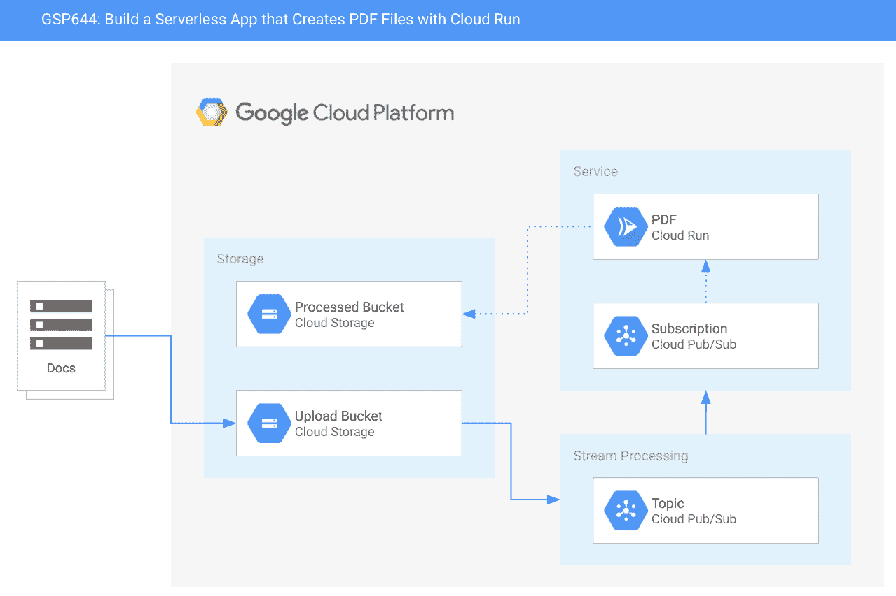
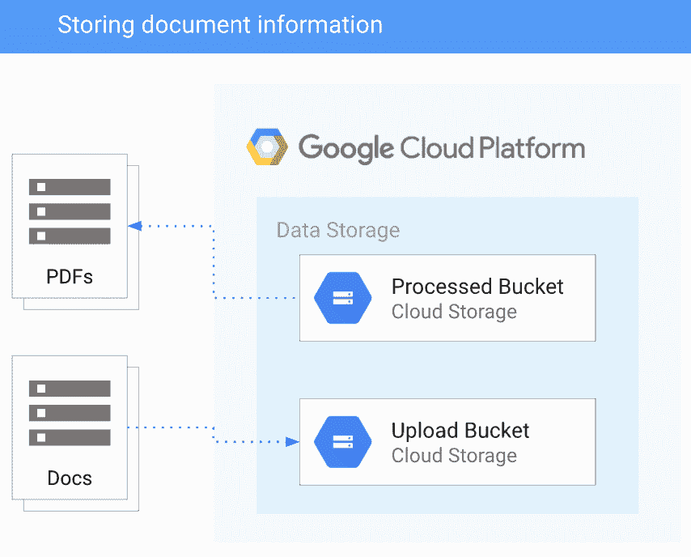
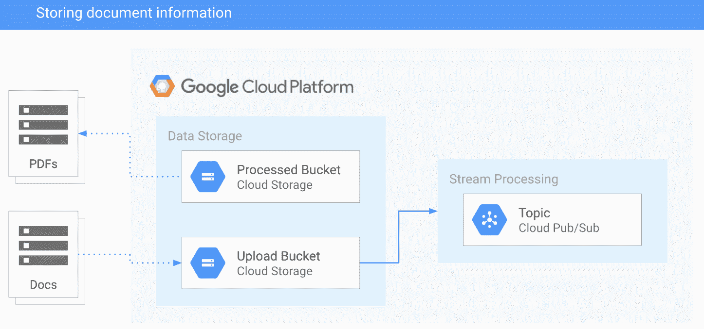
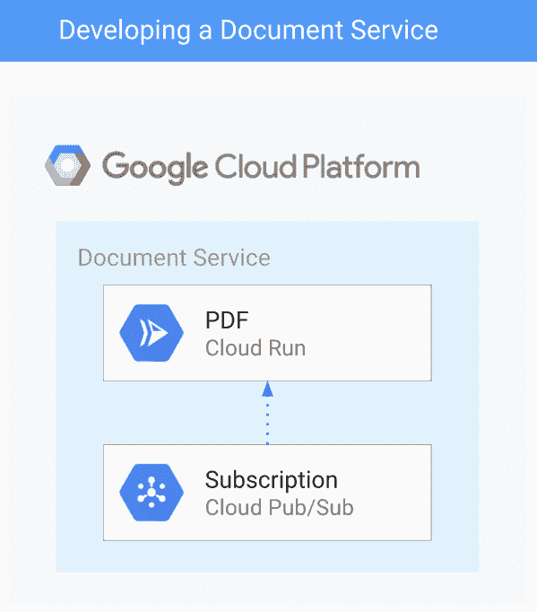
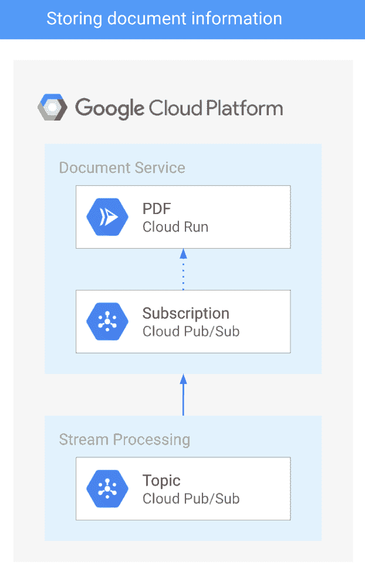
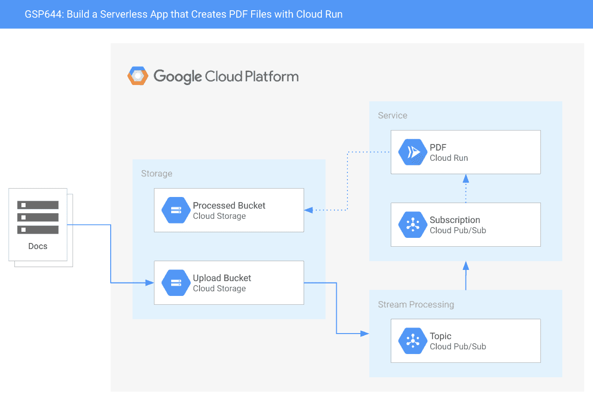
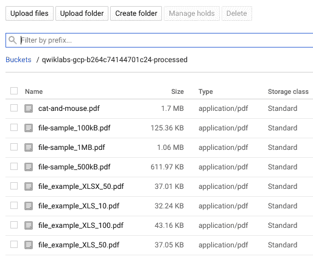

# 第十一章：构建 PDF 转换服务

在前面的章节中，我们讨论了在 Google Cloud 上使用无服务器计算的相对优点。在本章和下一章中，我们将通过案例研究来探讨如何部署解决方案。通过实际操作这些示例，将演示如何使用我们之前讨论的许多技巧。

为了实现这一目标，我们将使用一个基于 Pet Theory 的示例案例研究，这是一家假设的兽医诊所，正在过渡到在 Google Cloud 上使用无服务器技术。

在本章中，我们将讨论以下主题：

+   设计文档服务

+   开发文档服务

+   开发 Cloud Run 服务

+   保护服务访问

+   测试文档访问

# 技术要求

为了完成本章的练习，你需要一个 Google Cloud 项目或 Qwiklabs 账户。

你可以在本书的 GitHub 仓库中找到本章的代码文件，路径为 `ch11` 子目录，地址是 [`github.com/PacktPublishing/Hands-on-Serverless-Computing-with-Google-Cloud/tree/master/ch11`](https://github.com/PacktPublishing/Hands-on-Serverless-Computing-with-Google-Cloud/tree/master/ch11)。

在你阅读本书中的代码片段时，你会注意到在某些情况下，部分代码行或输出已被删除，并用省略号（`...`）代替。使用省略号的目的是仅展示相关的代码或输出。完整的代码可以在之前提到的 GitHub 链接中找到。

# Pet Theory 案例研究概述

对于我们的案例研究，我们将探讨 Pet Theory 兽医诊所。在这个场景中，企业希望过渡到无服务器技术，并提供一些实用方法，以便将 Google Cloud 及其产品融入到业务中。

完整的 Pet Theory 案例研究包含了多个不同的场景，展示了如何使用无服务器技术解决典型的现实世界问题。要查看完整的场景，请访问 Qwiklabs 网站并搜索 *Serverless Workshop: Pet Theory Quest*（[`www.qwiklabs.com/quests/98`](https://www.qwiklabs.com/quests/98)）以查看相关实验。

在本章和下一章中，我们将通过两个实验示例来展示无服务器技术的强大和灵活性。在本章的第一个示例中，我们将看看 Pet Theory 如何通过基于文档自动转换的统一文档流程进行迁移。为了开始我们的回顾，我们将概述所提议的架构试图实现的目标以及涉及的组件角色和需求。

# 设计文档服务

Pet Theory 在现有的文档管理流程中遇到了一些问题。目前，他们在业务中使用多种文档格式，并希望统一规范，采用单一的标准方法。经过一些咨询，他们决定过渡到**可移植文档格式**（**PDF**），这样他们在向客户和供应商电子发送信息时，仍然可以使用丰富的媒体内容。

就需求而言，Pet Theory 团队决定他们需要一个能够实现以下功能的系统：

| **需求** | **组件** |
| --- | --- |
| 存储文档信息 | 存储 |
| 处理请求 | 处理 |
| 确保服务访问安全 | 安全 |
| 处理文档转换 | 服务 |

现在我们已经有了应用的高层次需求，我们应该通过描述每个需求来进一步完善我们的理解。

# 存储文档信息

从前面的信息来看，我们知道存储是我们架构中的关键组件，因为文档需要存储在某个地方。我们还知道，Google Cloud 有许多产品适合这种需求。

通常，存储的明显选择是使用磁盘或共享文件系统将数据持久化。但是，在这种情况下，这种存储方式可能并不是最适合当前情形。总体要求是尽量减少基础设施的维护，而在托管基础设施上创建传统数据库无法满足这一要求。

根据我们对 Google Cloud Storage 的了解，我们知道短期对象存储可以用于临时信息存储。我们还知道，Cloud Storage 提供了一个事件框架，支持与无服务器计算的交互。因此，Cloud Storage 似乎是一个能够满足我们存储需求的良好候选者。

# 处理处理请求

处理请求可以通过多种方式进行。在这个示例中，我们将构建一个可以按需扩展的解决方案。为此，我们希望将存储需求与处理组件解耦，这意味着我们需要添加一些中间件，能够高效地处理信息。

在我们的应用中，我们已经决定使用云存储，因此我们需要一种机制来异步地与后端处理进行通信。应用需要尽可能自主运行，以减少用户交互和错误发生的可能性。

将 Cloud Pub/Sub 添加到应用程序中使其能够定义一个一致且可扩展的消息传递服务。该服务可以从 Cloud Storage 中获取信息，并将这些信息传播到执行后端处理的组件。在这一点上，你可能会认为 Cloud Tasks 是一个不错的替代方案。然而，Cloud Tasks 的用例表明，它更适用于需要控制执行时机（即速率限制）的场景。在我们的场景中，我们不需要那种执行控制级别。我们需要的是通用的数据摄取和分发，而 Cloud Pub/Sub 产品更适合这种需求。

在使用 Cloud Pub/Sub 时，我们需要提供与主题相关的信息，这些信息是要传输的数据。在我们的应用程序中，这将包含与上传到 Cloud Storage 存储桶的文件相关的信息。为了消费与主题相关的信息，我们还需要创建一个订阅，它会根据向主题添加新消息来接收事件通知。

# 确保服务访问安全

作为我们需求的一部分，我们还需要实施服务访问的安全权限，以确保只有授权的帐户可以调用新服务。我们对这个服务的假设是，我们可以使用一个帐户来管理必要的权限。在与 Cloud Functions 和 Cloud Run 相关的章节中，我们已经看到这些服务帐户对于非交互式解决方案是多么宝贵。为了实现这一要求，我们可以使用服务帐户，并为其分配与适当角色相关的必要权限。

# 处理文档转换

为了选择能够执行文档转换的服务，请花点时间回顾 Google Cloud 上可用的无服务器选项的相对优点：

| **产品** | **场景** | **典型用例** |
| --- | --- | --- |
| App Engine | 无服务器 HTTP 应用程序 | Web 应用程序 |
| Cloud Functions | 无服务器函数和事件 | 基于事件的函数 |
| Cloud Run | 无服务器 HTTP 容器 | 完全托管的 HTTP 请求-响应容器 |

除了原始要求外，Pet Theory 团队还希望能够完成以下任务：

+   以可扩展的方式处理信息

+   在实际可行的情况下，利用现有代码/应用程序

+   最小化应用程序维护

+   尽可能利用公司内部的知识和技能

一位团队成员发现 LibreOffice 应用程序能够处理文档转换为 PDF。将这个应用程序打包成 Docker 镜像，将使团队能够轻松地在项目中复用和标准化集成。

从前面的段落来看，Cloud Run 似乎非常适合当前的需求。正如我们所了解到的，Cloud Run 支持无状态 HTTP 和自定义库。此外，与 Cloud Pub/Sub 等服务的集成意味着它非常适合我们提出的解决方案。一旦初始构建经过测试和验证，该解决方案可以通过利用 Google 开发者工具，如 Cloud Build，进一步增强，以实现持续集成。

做得好！我们已经进行了高层次的需求分析，将其拆解成组件，现在已经掌握了解决方案的精髓。为了确认我们的理解，以下图表展示了我们设计的解决方案：



在这个图表中，我们定义了三个在 Google Cloud 上运行的不同阶段，这些阶段代表了我们之前定义的组件，用于管理文档处理。我们的架构可以通过以下步骤来描述：

1.  一个源文档上传到系统存储（即一个云存储桶）。

1.  触发生命周期事件并生成一个新的负载，发送到 Pub/Sub 主题。

1.  一个 Pub/Sub 订阅轮询新数据通知。

1.  一个 Cloud Run 服务处理上传的内容并创建 PDF。

请注意，在前面的图表中，主要框体是一般的抽象，用来表示服务隔离。对于我们简单的服务来说，这应该有助于澄清每个处理阶段以及负责的组件。此外，我们还可以看到，大部分处理并不需要创建代码来处理存储事件通知和消息队列数据对象。我们的努力主要集中在创建服务上，我们明智地选择了一个现有的应用程序来处理 PDF 转换。

基于这一讨论，我们现在对提交给我们服务的文档的 PDF 创建过程有了一个大致的了解。在接下来的部分，我们将开始着手开发 PDF 服务的实际要素，以满足需求。

# 开发文档服务

在前一部分中，我们概述了无服务器应用程序的架构。在这个分析阶段，我们确定了所需的高层次组件，并推测了所需的活动类型。创建文档服务需要创建一个 Cloud Run 服务，以便从 Cloud Pub/Sub 订阅中获取信息。由于我们选择最小化代码开发过程，我们的生产力得到了显著提高。复杂的通知和消息队列的代码已推迟到 Google Cloud 管理的现有机制中。相反，我们将专注于构建满足需求的特定元素，例如 PDF 转换。

在你的 Google Cloud 项目中，打开 Cloud Shell，并确保可以使用`Chap11`实验室仓库的克隆版本。

# 存储文档信息

为了启动项目，我们需要为应用程序创建存储。在以下示意图中，我们可以看到该解决方案使用了两个存储桶。第一个存储桶存储文档上传，第二个存储桶存储输出，即处理后的 PDF 文件：



在 Google Cloud 上创建存储桶很简单，此时无论是从控制台还是 Cloud Shell 执行，都应该是一个熟悉的操作。对于本示例，我们将使用 Cloud Shell 来完成任务：

1.  为上传的文件创建一个多区域存储桶：

```
gsutil mb gs://$GOOGLE_CLOUD_PROJECT-upload
```

1.  为处理后的文件创建一个多区域存储桶：

```
gsutil mb gs://$GOOGLE_CLOUD_PROJECT-processed
```

Google Cloud Storage 提供了启用与 Pub/Sub 相关的通知事件的功能。事件通知系统非常强大，将用于为每个存入上传桶的文档生成新消息。

看一下以下架构图，它显示了当数据被添加到上传桶时，我们会自动收到通知。以这种方式将 Cloud Storage 和 Cloud Pub/Sub 结合在一起，提供了一种合理的使用模式，可以在其他项目中使用，以指示数据的可用性：



现在，每当一个文件存入上传桶时，一个新的 Pub/Sub 主题消息将被排队，表示新内容已经可用。

要在现有桶上设置通知机制，我们使用 `gsutil` 命令。该命令需要知道触发哪种通知，并且还需要创建一个新的主题供上传桶使用。

1.  当文件添加到上传桶时，创建一个名为 `new-doc` 的 Pub/Sub 主题通知：

```
gsutil notification create -t new-doc -f json -e OBJECT_FINALIZE gs://$GOOGLE_CLOUD_PROJECT-upload
```

在前面的命令中，我们使用了 `OBJECT_FINALIZE` 命令，这表示一个新对象被提交到 Google Cloud Storage 存储桶。请注意，生成的信息使用 JSON 格式将信息传递给 `new-doc` 主题。

只有在部署 PDF 服务后，我们才会收到有关已上传文件的通知（因为对于此新主题没有有效的订阅）。

做得好！我们现在已经启动并运行了数据存储和流处理服务。接下来，我们将看到如何使用 Cloud Run 构建 PDF 服务。

# 开发 Cloud Run 服务

构建一个服务可能既令人生畏又充满挑战。在本节中，我们将通过一个示例展示如何基于现有应用程序构建服务。在此示例中，我们将使用 LibreOffice 来创建 PDF。

需要提到的一点是，如何轻松集成外部应用程序来构建一个简单的服务。应用程序（特别是 Linux）具有很高的灵活性，这意味着它们通常提供了一个很好的方式将这些应用程序集成到解决方案中。例如，Inkscape 可以用来将 SVG 转换为 PNG，而 Calibre 可以将 EPUB 转换为 PDF。在决定开发应用程序之前，最重要的是调查现有的应用程序可以实现什么功能。

回到服务的创建过程，为了构建我们的应用程序，我们将把 LibreOffice 封装在一个 Docker 镜像中。服务的信息通过一个 Cloud Pub/Sub 订阅提供，封装了 Cloud Storage 通知事件。

我们的应用程序将使用 Node.js 构建，并展示如何访问消息队列信息。尽管代码库相对简短，但它演示了如何将外部应用程序集成到 Cloud Run 中。请记住，当探索替代应用程序时，Cloud Run 应用程序应该是无状态的，并且利用 HTTP。

文档服务通过 Cloud Pub/Sub 的订阅接口接收 HTTP，这意味着它提供了一种简单的机制来交换产品之间的数据。此外，数据交换相关的请求-响应生命周期并不需要状态信息。然而，使用 LibreOffice 处理文件时，将使用分配给 Cloud Run 的`/tmp`目录临时存储输出文件的信息。

为了使 Cloud Run 执行文档转换，我们将使用来自 Cloud Storage 的通知消息，如下所示：



构建 Cloud Run 服务包括一个 Node.js 应用程序来处理信息，并创建一个 Docker 容器。与之前的示例一样，我们从`package.json`文件开始，并安装包以启用访问额外资源（例如，Cloud Storage 和 Express.js）。

# 开发服务

首先，我们需要用正确的信息填充配置文件：

1.  修改`package.json`文件，添加一个`start`脚本，如下所示：

```
...
"scripts": {
 "start": "node index.js",
 "test": "echo \"Error: no test specified\" && exit 1"
 },
...
```

1.  添加转换过程使用的包：

```
npm install express
npm install body-parser
npm install child_process
npm install @google-cloud/storage
```

1.  编辑`index.js`文件，添加所需的引用和额外的代码。将以下包依赖添加到代码文件的顶部：

```
const {promisify} = require('util');
const {Storage} = require('@google-cloud/storage');
const exec = promisify(require('child_process').exec);
const storage = new Storage();
```

1.  用下面的代码替换现有的`app.post`函数：

```
app.post('/', async (req, res) => {
 try {
 const file = decodeBase64Json(req.body.message.data);
 await downloadFile(file.bucket, file.name);
 const pdfFileName = await convertFile(file.name);
 await uploadFile(process.env.PDF_BUCKET, pdfFileName);
 await deleteFile(file.bucket, file.name);
 }
 catch (ex) {
 console.log(`Error: ${ex}`);
 }
 res.set('Content-Type', 'text/plain');
 res.send('\n\nOK\n\n');
})
```

1.  添加`downloadFile`函数：

```
async function downloadFile(bucketName, fileName) {
 const options = {destination: `/tmp/${fileName}`};
 await storage.bucket(bucketName).file(fileName).download(options);
}
```

下一个函数是我们程序中魔法发生的地方。从以下代码片段中，我们可以看到 LibreOffice 以无头模式（即没有图形界面）被调用来生成 PDF。生成的文件存储在`/tmp`目录中，以便后续处理。

1.  添加`convertFile`函数：

```
async function convertFile(fileName) {
 const cmd = 'libreoffice --headless --convert-to pdf --outdir /tmp ' +
 `"/tmp/${fileName}"`;
 console.log(cmd);
 const { stdout, stderr } = await exec(cmd);
 if (stderr) {
 throw stderr;
 }
 console.log(stdout);
 pdfFileName = fileName.replace(/\.\w+$/, '.pdf');
 return pdfFileName;
}
```

1.  添加`deleteFile`函数：

```
async function deleteFile(bucketName, fileName) {
 await storage.bucket(bucketName).file(fileName).delete();
}
```

1.  添加`uploadFile`函数：

```
async function uploadFile(bucketName, fileName) {
 await storage.bucket(bucketName).upload(`/tmp/${fileName}`);
}
```

干得好！现在我们有一个能够根据传递给它的对象生成 PDF 的应用程序。下一步是创建一个 Docker 镜像，该镜像将在容器运行时启动应用程序。

# 部署服务

要为应用程序创建 Dockerfile 清单，请遵循以下步骤：

1.  将安装 `libreoffice` 包的定义添加到 Dockerfile 中：

```
FROM node:12
RUN apt-get update -y \
 && apt-get install -y libreoffice \
 && apt-get clean
WORKDIR /usr/src/app
COPY package.json package*.json ./
RUN npm install --only=production
COPY . .
CMD [ "npm", "start" ]
```

1.  在命令行中，构建服务，从清单创建镜像，并将其存储在 `gcr.io` 中：

```
gcloud builds submit \
 --tag gcr.io/$GOOGLE_CLOUD_PROJECT/pdf-converter
```

1.  一旦构建过程成功完成，部署该服务：

```
gcloud beta run deploy pdf-converter \
 --image gcr.io/$GOOGLE_CLOUD_PROJECT/pdf-converter \
 --platform managed \
 --region us-central1 \
 --memory=2Gi \
 --no-allow-unauthenticated \
 --set-env-vars PDF_BUCKET=$GOOGLE_CLOUD_PROJECT-processed
```

上述 Cloud Run 属性概述了典型部署所涉及的关键属性。由于转换过程占用大量内存，因此我们增加了为 Cloud Run 分配的内存。

1.  创建一个新的环境变量来保存 `SERVICE_URL` 参数：

```
SERVICE_URL=$(gcloud beta run services describe pdf-converter --platform managed --region us-central1 --format "value(status.url)")
```

我们现在已经在 Google Cloud 中构建并存储了一个镜像。该镜像保存在容器注册表中，且可以通过指定额外的内存和运行区域等属性进行部署。特别地，在实例运行时，我们需要指定一个环境变量，该变量用于指定数据输出的桶名称。

作为本次构建和部署部分的最后一步，我们获取分配给已部署 Cloud Run 实例的服务 URL。获取服务 URL 使用户能够通过环境变量访问该服务。稍后我们将在本练习中使用该环境变量。

恭喜——现在 Google Cloud 上已经存在一个能够根据上传的文件自动生成 PDF 的服务。

# 确保服务访问

服务成功启用后，我们将重点关注访问安全。为此，我们将创建一个新的服务账户，专门负责管理新服务的调用。

回想一下原始设计，服务实际上是通过 Cloud Pub/Sub 而不是用户调用的。由于我们已经串联了一系列事件，我们可以利用这一点来最小化能够启动我们新服务的外部来源。以下步骤展示了如何创建一个服务账户，专门负责调用新的 Cloud Run PDF 服务实例。

# 创建服务账户

要创建一个服务账户，请遵循以下简单步骤：

1.  创建一个新的服务账户：

```
gcloud iam service-accounts create pubsub-cloud-run-invoker --display-name "PubSub Cloud Run Invoker"
```

1.  授予服务账户调用 Cloud Run 的权限：

```
gcloud beta run services add-iam-policy-binding pdf-converter --member=serviceAccount:pubsub-cloud-run-invoker@$GOOGLE_CLOUD_PROJECT.iam.gserviceaccount.com --role=roles/run.invoker --region us-central1
```

1.  创建一个环境变量来保存 `PROJECT_ID`：

```
PROJECT_NUMBER=$(gcloud config get-value project)
```

1.  允许项目创建 Cloud Pub/Sub 身份验证令牌：

```
gcloud projects add-iam-policy-binding $GOOGLE_CLOUD_PROJECT --member=serviceAccount:service-$PROJECT_NUMBER@gcp-sa-pubsub.iam.gserviceaccount.com --role=roles/iam.serviceAccountTokenCreator
```

恭喜——使用服务账户来管理资源符合 Google Cloud 提供的最佳实践指南。遵循这些简单步骤确保身份和访问权限仅限于需要访问的服务账户。

现在，我们已经将后端服务限制为仅通过服务账户进行调用，我们可以设置消息队列来处理请求。

# 处理处理请求

最后的开发任务是向解决方案中添加一个订阅。该订阅用于从 Cloud Pub/Sub 上选定的主题中消费信息。像这样的简单机制可以让信息在不同的服务之间轻松流动。

在下图中，我们将 Pub/Sub 的推送端点绑定到 `SERVICE_URL`，并将函数的调用与我们之前创建的服务账户绑定。幸运的是，在 Google Cloud 上启动这样的处理请求非常简单：



要在现有的 Cloud Pub/Sub 主题上启动订阅，请执行以下操作：

1.  创建一个新的 Pub/Sub 订阅，并绑定到 `SERVICE_URL`：

```
gcloud beta pubsub subscriptions create pdf-conv-sub --topic new-doc --push-endpoint=$SERVICE_URL --push-auth-service-account=pubsub-cloud-run-invoker@$GOOGLE_CLOUD_PROJECT.iam.gserviceaccount.com
```

1.  现在已经声明了订阅，将信息传递到 `new-doc` 主题时，Cloud Pub/Sub 会自动将其推送到订阅者：

```
{
  "message": {
    "attributes": {
      "key": "value"
    },
    "data": "V2VsY29tZSB0byBHb29nbGUgQ2xvdWQgU2VydmVybGVzcwo=",
    "messageId": "123456789012"
  },
  "subscription": "projects/[PROJECT_ID]/subscriptions/[SUBSCRIPTION_ID]"
}
```

消息对象同时表示订阅和消息。订阅的键/值对定义了在消息队列中使用的项目和订阅 ID。此外，还包括一个消息对象，详细说明了分配给待发送数据的属性、数据和消息 ID 的键/值对。

1.  在前面的示例中，一旦消息/数据成功检索，端点将使用 base64 解码传递的消息。

`PROJECT_ID` 和 `SUBSCRIPTION_ID` 的值需要对正在使用的 Google Cloud 项目有效。

如果你想知道，前面示例中显示的数据值是经过 base64 编码的消息。要编码一条消息，可以使用 base64 应用程序；例如，`echo "Welcome to Google Cloud Serverless" | base64`。

要解码一条消息，请在应用程序命令行中添加`-d`参数；例如，`echo "V2VsY29tZSB0byBHb29nbGUgQ2xvdWQgU2VydmVybGVzcwo=" | base64 -d`

HTTPS 请求将传递到预定义的端点，并在收到后确认。如果传递的对象未被确认成功，将启用重试机制，表明该消息需要重新发送。重试过程将由默认的确认截止时间来协调，这意味着端点需要在超时生效前作出响应。

在使用 Cloud Pub/Sub 时，值得注意的是 Google Cloud 无服务器系统（即 App Engine、Cloud Functions 和 Cloud Run）使用推送机制。由于流量控制是自动建立的，客户端只需指示消息处理的成功/失败。

恭喜你——创建 PDF 服务已经使用 Google Cloud 无服务器技术完成设计和开发。这标志着开发阶段的结束，我们现在可以开始测试我们的新服务。

# 测试文档服务

一旦服务成功配置完成，我们可以开始测试该服务。在开始这一活动之前，让我们先花点时间查看已构建的服务架构：



尽管我们的服务很简单，但其组成部分去除了与信息处理相关的大部分复杂性。使用云存储避免了与数据库打交道的需要，并为存储中内容变化提供了有效的事件通知系统。

一旦数据上传，事件通知会生成一条新的云 Pub/Sub 消息，其中包含上传文件的相关信息。同样，我们不需要做任何处理就能实现这一结果。Topic/Subscription 机制提供了所需的所有消息处理能力。

最终，表示新文件已上传的消息到达我们的 PDF 后端服务。这时我们会看到之前构建的图像被包含在内。当 Cloud Run 执行时，它会接收来自 Cloud Pub/Sub 的有效负载，然后无缝地处理信息。

为什么值得回顾我们所做的工作呢？嗯，这应该表明在我们定义的端到端过程里，我们实际上需要测试的内容非常少。基本上，我们需要确认以下几点：

+   存储服务使用的是一个托管活动

+   流处理服务使用的是一个托管活动

+   PDF 服务基于我们的代码

那么，我们该如何测试 PDF 服务呢？

服务的基本测试可以通过检查服务是否在线，以及将文档添加到指定的上传存储桶来进行。

为了测试 PDF 服务是否正常工作，我们将使用 cURL 程序来获取授权令牌：

1.  首先，测试服务是否已成功部署：

```
curl -X POST -H "Authorization: Bearer $(gcloud auth print-identity-token)" $SERVICE_URL
```

现在我们知道服务已上线，可以开始测试服务了。请记住，我们已经为上传存储添加了一个 Pub/Sub 通知事件。一旦数据被添加，消息队列将更新，并向服务发送请求以转换数据文件。

1.  通过上传一些公共的 Qwiklabs 示例文件来测试转换过程：

```
gsutil -m cp gs://spls/gsp644/* gs://$GOOGLE_CLOUD_PROJECT-upload
```

1.  要确认文件是否已被处理，请检查处理过的云存储桶：



在前面的截图中，你会注意到原始文件现在已经转换成了 PDF。花一点时间检查一下 Cloud Storage 中的原始上传文件夹，注意到上传文件夹现在已经为空。那些已经上传的文件都去哪了？嗯，应用程序包含了一个清理元素，它会在文件成功处理后自动删除这些文件。因此，上传文件夹只包含那些尚未转换的文件。

这个场景涉及了很多工作；然而，由于你已经完成了本书中各章节的学习，所呈现的技术现在应该不再陌生。恭喜你成功创建了 PDF 服务——学习如何构建组件服务将使得更复杂的系统随着时间的推移得以开发。

# 总结

在本章中，我们详细介绍了如何使用 Google Cloud 无服务器技术来实现项目需求。在这个过程中，我们将初步的客户需求分解，并将其与现有的 Google Cloud 产品相匹配。采取这种方法大大缩短了我们的开发周期，并减少了所需的测试量。

在 Google Cloud 上使用无服务器架构为构建一些令人兴奋的应用程序提供了许多机会。正如我们在本章中看到的，设计和开发过程可以非常有回报。在大多数情况下，与系统合作，减少开发的代码量和应用程序的复杂度，都是值得花时间去做的。我们的应用程序示例清楚地展示了如何使用现有的软件包显著提高整体生产力并满足客户需求。希望本章激发了你的想象力，并为你提供了构建下一个伟大应用程序的灵感。

在下一章中，我们将介绍一个更高级的示例，其中多个服务同时运行。

# 问题

1.  使用什么命令可以从命令行访问 Google Cloud Storage？

1.  Stackdriver 日志记录在什么情况下最有用？

1.  Docker 清单文件的作用是什么？

1.  Cloud Build 会将它创建的镜像存储在哪里？

1.  `curl` 命令可以测试 GET 和 POST 请求吗？（对还是错）

1.  为什么要使用带有 `-m` 参数的 `gsutil` 命令？

1.  调用服务需要什么类型的权限？

# 进一步阅读

+   **连接到 Cloud Storage 存储桶**: [`cloud.google.com/compute/docs/disks/gcs-buckets`](https://cloud.google.com/compute/docs/disks/gcs-buckets)

+   **Stackdriver 日志记录**: [`cloud.google.com/logging/docs/view/logs_index`](https://cloud.google.com/logging/docs/view/logs_index)

+   **Qwiklabs 无服务器工作坊**: [qwiklabs.com/quests/98](http://qwiklabs.com/quests/98)
