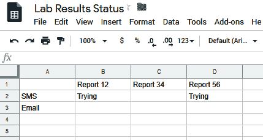

# 通过 REST API 获取第三方数据

在第十一章中，*构建一个* *PDF 转换* *服务*一节中，我们学习了如何使用 Cloud Run 创建一个 PDF 服务。在本章的最后，我们将增加复杂性，基于 Pet Theory 案例研究构建一个更复杂的示例。要求是在 Google Cloud 上使用多个服务实现一个无服务器解决方案。

通过本章的学习，您对无服务器工作负载的知识以及实现真实世界企业产品所需的经验将面临挑战。到本章结束时，将创建一个真实世界的应用程序，展示在 Google Cloud 上无服务器工作负载的关键方面。

在本章中，我们将讨论以下主题：

+   Pet Theory 案例研究概述

+   设计实验室报告解决方案

+   开发实验室解决方案

+   电子邮件和短信通信

+   持续集成工作流程

+   测试实验室服务

# 技术要求

为了完成本章的练习，您将需要一个 Google Cloud 项目或一个 Qwiklabs 账户。

您可以在本书的 GitHub 仓库中找到本章的所有代码文件，位于 `ch12` 子目录下，链接为：[`github.com/PacktPublishing/Hands-on-Serverless-Computing-with-Google-Cloud/tree/master/ch12`](https://github.com/PacktPublishing/Hands-on-Serverless-Computing-with-Google-Cloud/tree/master/ch12)。

当您浏览本书中的代码片段时，您会注意到，在一些实例中，部分代码/输出行已被删除并用省略号（`...`）替代。使用省略号仅是为了展示相关的代码/输出，完整代码可在 GitHub 上的前面提到的链接中找到。

# Pet Theory 案例研究概述

根据前一章的内容，我们的案例研究基于 Pet Theory 兽医诊所。完整的 Pet Theory 案例研究包括多个不同的场景，展示了如何使用无服务器技术解决典型的真实世界问题。要查看完整的场景，请访问 Qwiklabs 网站，并参考 Pet Theory Quest，以查看相关的实验室。

在本次练习中，Pet Theory 管理团队表达了他们对处理实验室报告所需人工工作量的担忧。目前，来自第三方实验室的临床报告以电子方式接收，然后由内部管理团队手动处理。报告的管理过程实际上是下载信息并将其添加到报告中，随后通过电子邮件或短信与宠物主人沟通。由于兽医诊所越来越成功，涉及该过程的报告数量已变得难以管理。

为了解决与处理实验室报告相关的问题，提出应构建一个概念验证。初步修订应展示如何自动化处理接收到的实验室报告，并分发报告信息。

为了开始我们的审查，我们将概述一下提议的架构应实现的目标以及相关组件的角色和要求。

# 设计实验室报告解决方案

在此场景中，Pet Theory 团队希望探索如何使用无服务器技术自动化接收和处理实验室结果。目前，实验室报告是以电子方式接收的，然后必须手动发送给客户。根据之前的示例，执行的活动重点是展示如何用最少的开发工作替换现有任务。此外，所使用的组件应该是松耦合的，以便于进一步的增强，且无需大量返工。

根据已声明的需求，Pet Theory 团队已决定他们需要一个能够满足以下要求的系统：

| **需求** | **服务** |
| --- | --- |
| 报告整理 | 报告 |
| 消息处理 | 消息 |
| 电子邮件通信 | 电子邮件 |
| 短信通信 | 短信 |
| 测试数据捕获 | 测试 |

让我们通过描述每个需求来加深理解。

# 报告整理

实验室报告通过 HTTP(S) POST 命令直接发送到 Pet Theory 的 Web 端点。接收到的信息采用 JSON 格式，外部应用程序已就传递的消息内容达成一致。

Cloud Run 和 Cloud Functions 都提供了消费 Web 端点的能力。除了消费消息外，报告服务还需要能够将消息传播到下游服务。

# 消息处理

Pet Theory 已经遇到过类似的实验室需求，该需求在第十一章中有所讨论，*构建 PDF 转换服务*。在那个例子中，发送者和接收者通过 Cloud Pub/Sub 使用异步消息传递来实现他们的目标。

在这种情况下，实验室报告将被传送到电子邮件和短信服务进行进一步处理。

# 电子邮件通信

电子邮件服务代表了一项新需求，能够使用现有的电子邮件解决方案与客户沟通。信息将通过 Cloud Pub/Sub 订阅传递给该组件。

# 短信通信

类似于电子邮件通信，短信组件提供了一种在接收测试结果时与客户沟通的替代方式。

现在，我们对架构的关键组成部分有了共同的理解，构建解决方案所需的要素应该更加清晰。从概览角度来看，我们的解决方案架构可以通过以下步骤描述：

1.  一份 JSON 格式的实验室报告被提交到 Pet Theory 的 HTTP(S) 端点。

1.  一个报告服务消费该 JSON 消息。

1.  JSON 消息中的实验信息发布到 Cloud Pub/Sub 主题。

1.  一个订阅通知被电子邮件服务接收。

1.  一个订阅通知被 SMS 服务接收。

此外，我们还可以看到以下组件是必需的：


需要注意的是，还有许多其他方式可以解决这里概述的需求。

在前面的图表中，我们定义了多个组件以满足我们的初步需求。记住，Pet Theory 是一个小型组织，因此它不会想要不必要地承担开发成本。

在本示例中，我们将实现多个服务，每个服务将执行特定的任务。因此，在本练习后期，我们将查看如何通过增强它们来测试各个组件，以便在文档中写入状态更新。

基于我们刚刚覆盖的内容，我们现在对处理提交到我们服务的报告的实验报告解决方案有了一个大致的理解。在接下来的章节中，我们将开始查看开发解决方案的实际要素，以满足需求。

# 开发实验解决方案

本章将涵盖一些高级主题，因此强烈建议先完成前几章中呈现的示例。在之前的章节中，已介绍了 Google Cloud 及其无服务器产品组合，以帮助你完成此过程。

使用你的 Google Cloud 账户，打开 Cloud Shell，并确保可以访问`Chap12`实验仓库的克隆。

与前面章节不同，本章不会详细介绍某些活动。相反，本章致力于汇总一个骨架解决方案，展示如何构建一个满足要求的应用程序。如果你遇到困难或需要帮助，别忘了可以查阅解决方案目录。

# 链接到 Google Docs

除了使用像 Stackdriver 这样的集中式服务外，我们还可以引入替代工具。在本节中，我们将演示如何集成 Google Docs（特别是 Google Sheets）。

当你在 Google Sheets 中创建电子表格时，默认情况下，只有创建者有权限读取和写入该表格。为了允许 Cloud Run 应用程序访问该表格，我们需要授予它访问权限。正如你可能猜到的，对于这项任务，我们将使用服务账户。

从 Cloud Shell 中，我们需要检索我们项目的服务账户名称：

```
gcloud iam service-accounts list --filter="Compute Engine default service account" --format='value(EMAIL)'
```

现在，我们可以使用这些信息链接到 Google Docs：

1.  在 Google Sheets 中创建一个新的电子表格（即，[`docs.google.com/spreadsheets`](https://docs.google.com/spreadsheets)）。

1.  点击默认电子表格名称`无标题电子表格`。

1.  将电子表格重命名为`实验结果状态`。

1.  点击共享按钮，并输入我们之前检索到的服务账户电子邮件地址。

太棒了！我们现在有一个与我们的服务账户项目关联的电子表格。要将新的电子表格与我们的服务连接，我们需要使用`SHEET-ID`变量。`SHEET-ID`变量是文档的唯一标识符，可以通过访问 Google Sheet 的 URL 来获取，示例如下：


从前面的图示中，我们可以看到`SHEET-ID`已被清楚标出。现在，我们需要将该标识符整合到我们的应用程序代码中。

执行以下步骤，以通过 Cloud Run 访问电子表格：

1.  访问我们创建的电子表格的 URL。

1.  复制从`spreadsheets/d/`之后开始，到`/edit`之前结束的字符串，如前面的截图所示。

1.  现在，返回 Cloud Shell 并编辑名为`pet theory/lab05/common/sheet.js`的文件。

1.  将`SHEET-ID`变量替换为从 URL 复制的值。

很好！现在，可以使用我们的 Cloud Run 应用程序访问该电子表格。

# 报告整理

根据我们之前讨论的实验服务架构，我们知道要创建的第一个服务与报告整理相关。如果我们专注于此处理阶段的需求，可以看到我们需要处理一个从外部来源接收到的 JSON 文件：


在本练习的这个阶段，让我们利用这个机会创建一个 Cloud Pub/Sub 话题，如下所示：

1.  运行以下命令：

```
 gcloud pubsub topics create new-lab-report
```

Cloud Pub/Sub 话题将用于在报告整理服务和后端电子邮件/SMS 服务之间传递实验报告。

1.  安装实验报告所需的`npm`包依赖：

```
 npm install express
 npm install body-parser
 npm install @google-cloud/pubsub
 npm install googleapis
```

1.  修改`package.json`文件，以包含一个`start`命令：

```
 "scripts": {
  "start": "node index.js",
   "test": "echo \"Error: no test specified\" && exit 1"
 },
```

1.  创建一个`index.js`文件，内容如下：

```
const sheet = require('./common/sheet.js');
const {PubSub} = require('@google-cloud/pubsub');
const pubsub = new PubSub();
const express = require('express');
const app = express();
const bodyParser = require('body-parser');
app.use(bodyParser.json());
const port = process.env.PORT || 8080;

app.listen(port, () => {
  console.log('Listening on port', port);
});
```

1.  将以下内容追加到`index.js`：

```
app.post('/', async (req, res) => {
  try {
    await sheet.reset();
    const labReport = req.body;
    await publishPubSubMessage(labReport);
    res.status(204).send();
  }
  catch (ex) {
    console.log(ex);
    res.status(500).send(ex);
  }
})
```

1.  最后，在`index.js`中添加以下函数，然后关闭文件进行编辑：

```
async function publishPubSubMessage(labReport) {
  const buffer = Buffer.from(JSON.stringify(labReport));
  await pubsub.topic('new-lab-report').publish(buffer);
}
```

1.  复制包含 Google API 代码的`common`目录：

```
 cp -R ../pet-theory/lab05/common/ .
```

稍等片刻，查看`index.js`源代码，并注意以下元素：

+   +   `request.body`属性表示要处理的实验报告。

    +   此时不需要与实验报告相关的模式。

    +   实验报告的数据被添加到名为`new-lab-report`的 Cloud Pub/Sub 话题中。

    +   一旦话题发布，服务返回 HTTP 状态码 204（即，成功但没有数据返回）。

    +   如果发生错误，将返回 HTTP 状态码 500（服务器错误）。

除了报告服务的 Node.js 源代码外，我们还需要在相同目录下创建一个 Dockerfile。

1.  创建如下的 Dockerfile：

```
 FROM node:12
 WORKDIR /usr/src/app
 COPY package.json package*.json ./
 RUN npm install --only=production
 COPY . .
 CMD [ "npm", "start" ]
```

此清单的内容在此阶段应该已经熟悉，无需进一步解释。当我们在后续步骤中讨论组件部署时，我们将部署该清单。

恭喜！能够消费外部实验室报告的报告服务的代码定义已准备好并可以部署。一个 Cloud Pub/Sub 已被配置并准备好接收来自外部第三方的信息。

接下来，我们将更仔细地查看电子邮件和短信服务，并回顾与其实现相关的说明。

# 电子邮件/短信通信

为了简化概念验证，我们的电子邮件和短信服务将使用相似的代码库来演示如何在 Google Cloud 中设计后台服务。虽然这些组件旨在提供独立的服务，但在我们的示例中，我们将使用共享代码来演示它们的功能。在实际应用中，通信组件提供了一个机会，可以为不同的解决方案（例如，电子邮件、机器人、短信、寻呼机等）复制/扩展共享代码库。

我们之前创建的 Cloud Pub/Sub 主题将数据推送到通信组件进行消费。在这个实例中，实验室报告数据对象表示一个 JSON 文件，用于传递实验室结果：


值得指出的是，我们实际上并没有引用实验室报告中传递的数据，也不知道正在使用的内容架构。相反，我们将其视为一个黑盒，因此没有对内容进行数据验证。采取这一措施将减少开发周期后期需要执行的测试级别。

在 Cloud Run 消息处理的背景下，使用 Cloud Pub/Sub 时，将会观察到以下过程：

+   Cloud Pub/Sub 继续负责推送消息。

+   订阅者负责消费消息。

+   一个服务与订阅者对齐，接受消息负载。

再次提醒，我们正在使用的技术现在应该已经熟悉，因为这些设计模式在使用 Cloud Pub/Sub 进行资源间交互时是很常见的。

# 电子邮件

从`email-service`目录开始，我们需要执行几个操作。如果你不确定具体的命令，请参考本章前面的*设计实验室报告解决方案*部分：

1.  修改`package.json`文件，加入一个启动`index.js`的 node 语句。

1.  添加`express`、`body-parser`和`googleapis`的包依赖。

1.  创建一个`index.js`文件，并填入以下代码：

```
const sheet = require('./common/sheet.js');
const util = require('./common/util.js');
const express = require('express');
const app = express();
const bodyParser = require('body-parser');
app.use(bodyParser.json());

const port = process.env.PORT || 8080;
  app.listen(port, () => {
  console.log('Listening on port', port);
});
```

1.  添加`index.js`文件，并填入以下额外代码：

```
app.post('/', async (req, res) => {
  const labReport = util.decodeBase64Json(req.body.message.data);
  try {
    await sheet.update('email', labReport.id, 'Trying');
    const status = await util.attemptFlakeyOperation();
    await sheet.update('email', labReport.id, status);
    res.status(204).send();
  }
  catch (ex) {
    await sheet.update('email', labReport.id, ex);
    res.status(500).send();
  }
})
```

1.  复制包含 Google API 代码的`common`目录：

```
cp -R ../pet-theory/lab05/common/ .
```

再次，花些时间观察`index.js`源代码，并注意以下关键要素：

+   +   `request.body`属性通过`decodeBase64`解码 Cloud Pub/Sub 消息。

    +   数据处理使用了`console.log`语句。

    +   服务返回一个 HTTP 状态码`204`（即成功，但没有数据返回）。

    +   如果发生错误，将返回`500`的 HTTP 状态码（即发生了不成功的服务器错误）。

我们还需要一个 Dockerfile 清单，稍后将用于构建 Node.js 应用的镜像。

1.  为`Node.js`应用创建一个 Dockerfile。

很好！我们继续。

# 短信服务

在短信服务目录中，我们需要执行相同的步骤。如果你不确定具体命令，可以参考本章前面“开发*实验室解决方案*”部分的内容：

1.  修改`package.json`文件，加入一个用于启动`index.js`的 Node 语句。

1.  为`express`、`body-parser`和`googleapis`添加包依赖。

1.  创建一个`index.js`文件，并填入以下代码：

```
const sheet = require('./common/sheet.js');
const util = require('./common/util.js');
const express = require('express');
const app = express();
const bodyParser = require('body-parser');
app.use(bodyParser.json());

const port = process.env.PORT || 8080;
  app.listen(port, () => {
  console.log('Listening on port', port);
});
```

1.  添加`index.js`文件，并填入以下附加代码：

```
app.post('/', async (req, res) => {
  const labReport = util.decodeBase64Json(req.body.message.data);
  try {
    await sheet.update('sms', labReport.id, 'Trying');
    const status = await util.attemptFlakeyOperation();
    await sheet.update('sms', labReport.id, status);
    res.status(204).send();
  }
  catch (ex) {
    await sheet.update('sms', labReport.id, ex);
    res.status(500).send();
  }
})
```

1.  复制包含 Google API 代码的`common`目录：

```
cp -R ../pet-theory/lab05/common/ .
```

添加一个 Dockerfile 清单，稍后将用于构建 Node.js 应用的镜像。

1.  为`Node.js`应用创建一个 Dockerfile。

恭喜！电子邮件和短信服务现在已经可用，并准备好进行部署。现在我们已经看过了整体代码库，接下来可以考虑如何高效构建为这个解决方案所需的多个组件。

# 持续集成工作流

在构建组件时，使用手动方法看似是一个不错的技巧，因为它实现简单。在本章中，我们将自动化这一过程。这样做的原因是需要构建和部署多个代码库，如果手动操作，可能会在过程中出现不必要的错误。

我们将焦点转向一个开发工具，以处理这个重复的构建和部署过程，而不是使用手动构建。在我们的项目中，我们打算使用 Cloud Build 来管理 Google Cloud 上的构建工作流。要使用 Cloud Build，理解实际需要自动化的过程非常重要，因为所需的配置通常只是手动步骤的近似。

在这个项目中，我们的开发人员工作流可以通过以下步骤来定义：

1.  开发人员使用`git`提交他们的代码。

1.  代码提交会通知源代码库。

1.  当匹配模式被找到时，Cloud Build 会触发。

1.  如果构建过程失败，开发人员需要修正代码（返回到*第 1 步*）。

1.  如果构建过程成功，镜像将被添加到容器注册中心。

1.  **质量保证**（**QA**）团队成员随后可以访问新的镜像。

正如你所看到的，这个过程涉及多个步骤，并且在任何一个阶段都可能发生错误。在这个过程中引入自动化可以通过一致性帮助修复任何错误，并使项目的整体维护更加简便。

已定义的步骤提供了一种常见方法，确保软件构建能够以迭代的方式进行。使用如 Cloud Build 这样的开发工具可以确保构建过程保持一致性和灵活性，并且该过程是通过外部构建文件进行管理的。构建文件可以轻松地在团队成员之间共享，并且意味着更新和构建配置可以在版本控制下进行管理。

开发人员是基于代码提交的持续反馈工作流的一部分，这意味着他们控制代码提交，并且可以直接响应任何问题。构建过程的启动基于代码提交，反馈会告知相关组件提交的成功或失败。

看一下下面的图表，了解这个过程在实际操作中是如何工作的：


一旦代码组件成功构建，它将被存储在容器注册表中。此时，QA 团队成员可以访问最新的已验证镜像，并能够独立测试每个镜像，而无需参考开发团队。通过这种方式，替代版本如开发版、预发布版和生产版可以作为不同的阶段门进行部署和测试。

# 配置实验服务 CI

要了解这个过程如何应用于我们的示例，我们可以基于一个基本的 Cloud Build 脚本为 Pet Theory 创建一个配置。

你可以参考本章结尾的*进一步阅读*部分，获取关于账户权限的更多信息。

要开始，请返回到`lab-service`目录。这是我们将创建基本 Cloud Build 配置的地方：

1.  为`lab-service`创建并编辑一个新的`cloudbuild.yaml`文件：

```
steps:
# Build the container image
- name: 'gcr.io/cloud-builders/docker'
args: ['build', '-t', 'gcr.io/$PROJECT_ID/lab-service', 'lab-service/.']
# Push the container image to Container Registry
- name: 'gcr.io/cloud-builders/docker'
args: ['push', 'gcr.io/$PROJECT_ID/lab-service']
# Deploy the image to Cloud Run
- name: 'gcr.io/cloud-builders/gcloud'
args: ['beta', 'run', 'deploy', 'lab-service', '--image', 'gcr.io/$PROJECT_ID/lab-service', '--region', 'us-central1', '--platform', 'managed', '--no-allow
-unauthenticated']
images:
- 'gcr.io/$PROJECT_ID/lab-service'
timeout: "600s"
```

接下来，我们将为我们的项目设置 Google Source Repositories。我们需要创建一个临时仓库来托管我们的代码，并展示 Google Cloud 的一些附加功能。

1.  创建 Cloud Source Repositories 配置：

```
 gcloud source repos create pet-theory-test
```

1.  克隆新创建的仓库，请注意你需要提供你的项目身份作为参数：

```
 gcloud source repos clone pet-theory-test --project=[PROJECT_ID]
```

1.  将子目录（即`email-service`、`sms-service`、`lab-service`和`common`）复制到新的 Google Source 仓库目录中。你的新`pet-theory-test`目录应该像这样：

```
.
├── common
│ ├── sheet.js
│ └── util.js
├── email-service
│ ├── index.js
│ ├── node_modules
│ ├── package.json
│ └── package-lock.json
├── lab-service
│ ├── cloudbuild.yaml
│ ├── Dockerfile
│ ├── index.js
│ └── package.json
│ └── package-lock.json
└── sms-service
├── index.js
├── node_modules
├── package.json
└── package-lock.json
```

1.  检查`git`目录的状态，确保你有作为未跟踪文件的常见`email-service`、`lab-service`和`sms-service`子目录：

```
 git status
```

1.  将修改后的文件添加到`git`中：

```
 git add .
```

1.  使用你的电子邮件地址设置电子邮件凭证：

```
 git config --global user.email "EMAIL"
```

1.  使用你的用户名设置名称凭证：

```
 git config --global user name "MY NAME"
```

1.  向仓库添加提交信息：

```
 git commit -m "Initial commit - Pet Theory CH12"
```

1.  将代码直接提交到主分支：

```
 git push origin master
```

1.  在控制台中检查 Cloud Source Repositories，以确保代码现在可用。

恭喜！了解如何使用 Cloud Source Repositories 可以在 Google Cloud 中托管代码时节省时间。通常，能够使用基于 Git 的解决方案能更好地保障代码的安全性。

# 触发 Cloud Build

现在，既然我们已经将代码放入了 Cloud Source Repositories，如何让它使用 Google Cloud 开发者工具自动构建呢？为了在提交时自动构建代码，我们可以使用我们的老朋友 Cloud Build。为了演示构建过程，我们将使用`lab-service`目录：

对于本示例，请确保您位于`pet-theory-test`/`lab-service`目录中。Cloud Build 的初始步骤需要选择一个代码库。

1.  从 Cloud Console 中访问 Cloud Build（位于开发工具选项下）。

1.  选择触发器菜单选项和创建触发器选项。

1.  使用以下信息设置触发器：

| **字段** | **值** |
| --- | --- |
| 名称 | `trigger-lab-service` |
| 描述 | `推送到 lab 分支` |
| 触发器类型 | `Branch` |
| 分支（正则表达式） | `^([lL]ab)/\w+` |
| Cloudbuild 配置 | `lab-service/cloudbuild.yaml` |
| 替代变量 | `N/A` |

1.  选择屏幕底部的创建触发器按钮来启用触发器。

Cloud Build 触发器表中的正则表达式分支是过滤应构建内容的常见方式。在许多情况下，开发者只希望构建特定的分支，使用正则表达式有助于隔离特定的分支。

要测试触发器是否已成功设置，请向`lab-service`触发器提交代码更改。按照以下步骤操作：

1.  在`cloudbuild.yaml`文件中添加注释：

```
steps:
# comment
# Build the container image
- name: 'gcr.io/cloud-builders/docker'
args: ['build', '-t', 'gcr.io/$PROJECT_ID/lab-service', 'lab-service/.']
# Push the container image to Container Registry
- name: 'gcr.io/cloud-builders/docker'
args: ['push', 'gcr.io/$PROJECT_ID/lab-service']
# Deploy the image to Cloud Run
- name: 'gcr.io/cloud-builders/gcloud'
args: ['beta', 'run', 'deploy', 'lab-service', '--image', 'gcr.io/$PROJECT_ID/lab-service', '--region', 'us-central1', '--platform', 'managed', '--no-allow
-unauthenticated']
images:
- 'gcr.io/$PROJECT_ID/lab-service'
timeout: "600s"
```

1.  将更新后的文件添加到`git`：

```
 git add cloudbuild.yaml
```

1.  添加提交信息：

```
 git commit -m "Add updated cloudbuild.yaml"
```

1.  将更改推送到 Cloud Source Repositories：

```
 git push origin lab/fix-1
```

在最后一个命令中，我们使用了一个特殊的正则表达式命令，表示该更改与`lab-service`触发器相关。当我们设置触发器时，我们使用了正则表达式，只查看标记为`lab`的分支：


一旦代码提交，检查 Cloud Build 历史记录将显示新的构建任务已开始。在每次 Git 提交到一个分支后，我们的组件将自动触发构建过程。现在我们知道构建配置正常工作，让我们将相同的更改推广到电子邮件和 SMS 目录。我们将确保每个构建都保持在单独的分支上，以最小化代码合并的潜在问题。

# 触发电子邮件和 SMS

根据我们与`lab-service`触发器一起完成的工作，我们需要设置一个 Cloud Build 触发器。然而，这次我们可以简单地复制现有的`lab-service`触发器：

在本示例中，我们为服务使用了一个单独的代码库。然而，在实际应用中，这种方法并不理想。相反，我建议为每个服务使用一个独立的代码库，以便更好地隔离代码。


要设置触发器，请执行以下步骤：

1.  从 Cloud Console 中访问 Cloud Build（位于开发工具选项下）。

1.  选择三点菜单项以打开弹出菜单，然后选择复制。

1.  选择（三个点菜单）新创建的触发器项以打开弹出菜单，并选择“编辑”。

1.  设置触发器并填写以下信息：

| **字段** | **值** |
| --- | --- |
| 名称 | `trigger-email-service` |
| 描述 | `推送到电子邮件分支` |
| 触发类型 | `Branch` |
| 分支（正则表达式） | `^([eE]mail)/\w+` |
| Cloudbuild 配置 | `email-service`/`cloudbuild.yaml` |
| 替代变量 | 无 |

1.  在屏幕底部选择“保存”按钮以启用触发器。

1.  现在，完全按照相同的步骤操作，但这次要创建一个使用以下详细信息的 SMS 触发器：

| **字段** | **值** |
| --- | --- |
| 名称 | `trigger-sms-service` |
| 描述 | `推送到短信分支` |
| 触发类型 | `Branch` |
| 分支（正则表达式） | `^([sS]ms)/\w+` |
| Cloudbuild 配置 | `sms-service`/`cloudbuild.yaml` |
| 替代变量 | 无 |

1.  在屏幕底部选择“保存”按钮以启用触发器。

创建了三个触发器后，Cloud Build 页面应类似于以下截图：


这些触发器各自独立运行，使用不同的分支来标识在特定服务上执行的工作。通过我们的正则表达式过滤器，每个分支将在代码提交到仓库时进行检查，并创建一个新的构建任务。为了使这个过程有效，我们需要将`cloudbuild.yaml`文件添加到电子邮件和短信目录中，以启动构建过程。

让我们使用`cloudbuild.yaml`创建一些配置：

1.  在`email-service`目录中，创建一个新的`cloudbuild.yaml`文件，内容如下：

```
steps:
# Build the container image
- name: 'gcr.io/cloud-builders/docker'
args: ['build', '-t', 'gcr.io/$PROJECT_ID/email-service', 'email-service/.']
# Push the container image to Container Registry
- name: 'gcr.io/cloud-builders/docker'
args: ['push', 'gcr.io/$PROJECT_ID/email-service']
# Deploy the image to Cloud Run
- name: 'gcr.io/cloud-builders/gcloud'
args: ['beta', 'run', 'deploy', 'email-service', '--image', 'gcr.io/$PROJECT_ID/email-service', '--region', 'us-central1', '--platform', 'managed', '--no-allow-unauthenticated']
images:
- 'gcr.io/$PROJECT_ID/email-service'
timeout: "600s"
```

如果你不记得如何在 Git 中执行这些操作，可以回顾早期的示例，了解如何使用 Google 源代码仓库。命令类似，我们只是在不同的分支上工作。

1.  在`git`中创建一个名为`email/fix-1`的新分支。

1.  使用`git`将更新后的`cloudbuild.yaml`文件添加到`email/fix-1`分支。

1.  添加提交信息：`初始修订 - email/fix-1`。

1.  将`email/fix-1`分支的代码推送到仓库。

1.  在`sms-service`目录中，创建一个新的`cloudbuild.yaml`文件，内容如下：

```
 steps:
 # Build the container image
 - name: 'gcr.io/cloud-builders/docker'
 args: ['build', '-t', 'gcr.io/$PROJECT_ID/sms-service', 'sms-service/.']
 # Push the container image to Container Registry
 - name: 'gcr.io/cloud-builders/docker'
 args: ['push', 'gcr.io/$PROJECT_ID/sms-service']
 # Deploy the image to Cloud Run
 - name: 'gcr.io/cloud-builders/gcloud'
 args: ['beta', 'run', 'deploy', 'sms-service', '--image', 'gcr.io/$PROJECT_ID/sms-service', '--region', 'us-central1', '--platform', 'managed', '--no-allow-unauthenticated']
 images:
 - 'gcr.io/$PROJECT_ID/sms-service'
 timeout: "600s"
```

1.  在`git`中创建一个名为`sms/fix-1`的新分支。

1.  使用`git`将更新后的`cloudbuild.yaml`文件添加到`sms/fix-1`分支。

1.  添加提交信息：`初始修订 - sms/fix-1`。

1.  将`sms/fix-1`分支的代码推送到仓库。

1.  推送最终代码自动启动 Cloud Build 及相关的三阶段脚本。

恭喜！使用 Cloud Build 进行构建过程自动化能够提高开发人员的生产力。现在我们已经集成了基于组件的构建能力，接下来我们可以继续研究如何测试该解决方案的多个组件。

# 测试实验室服务

从技术上讲，如果需要记录信息，正确的答案通常是 Stackdriver，因为它已经集成到 Google Cloud 中。但是，有时可能需要替代解决方案——例如在这种情况下，需要一种快速简便的方法来检查服务。

在本测试部分，我们不会使用*日志记录*将数据发送到 Stackdriver 等集中式系统，而是将数据发布到 Google Sheet。像这样的方案非常实用，因此值得将其整合到我们的解决方案中，以展示如何实现这一目标。

从高层次来看，以下流程适用于测试服务：

1.  向表格写入信息

1.  应用审核

1.  漏洞修复

查看下面的图示，以便理解本解决方案中涉及的组件：


在前面的图示中，我们向现有代码中添加了一个新的服务组件，将信息记录到 Google 电子表格中。能够展示解决方案的韧性是构建概念验证的重要功能。电子表格将由服务完成；因此，如果工作正常，输出将在电子表格中显示。如果由于某种原因服务不可用，则会为无法完成任务的服务写入替代状态消息：



电子表格与每个服务动态关联，并在服务调用时将消息写入电子表格单元格。这个新组件将提供一种简单的方法来单独测试每个服务，并显示服务组件是否按规格运行。现在我们已经有了服务和属性的描述，可以开始开发代码库来满足需求。

# 访问凭据

在这一部分，我们将从访问 Compute Engine 服务账户开始：

1.  列出与项目关联的服务账户：

```
 gcloud iam service-accounts list
```

1.  复制列出的 Compute Engine 服务账户电子邮件地址。

1.  打开一个新的 Google Sheets 文档。

1.  将表格重命名为 `实验结果状态`。

1.  点击共享按钮，并以完全编辑权限添加 Compute Engine 服务账户电子邮件。

接下来，我们需要设置电子邮件 Cloud Pub/Sub 订阅。

# 设置电子邮件 Cloud Pub/Sub 订阅

要设置电子邮件 Cloud Pub/Sub 订阅，请按照以下简单步骤操作：

1.  创建一个具有调用权限的服务账户：

```
gcloud iam service-accounts create pubsub-cloud-run-invoker --display-name "PubSub Cloud Run Invoker"
```

1.  为服务账户授予调用电子邮件服务的权限：

```
gcloud beta run services add-iam-policy-binding email-service --member=serviceAccount:pubsub-cloud-run-invoker@$GOOGLE_CLOUD_PROJECT.iam.gserviceaccount.com --role=roles/run.invoker --region us-central1 --platform managed
```

1.  获取 Google Cloud 项目编号：

```
PROJECT_NUMBER=$(gcloud projects list --format="value(projectNumber)" --filter="projectId=$GOOGLE_CLOUD_PROJECT")
```

1.  使用 `PROJECT_NUMBER` 环境变量创建 `serviceAccountTokenCreator` 的角色绑定：

```
gcloud projects add-iam-policy-binding $GOOGLE_CLOUD_PROJECT --member=serviceAccount:service-$PROJECT_NUMBER@gcp-sa-pubsub.iam.gserviceaccount.com --role=roles/iam.serviceAccountTokenCreator
```

1.  获取电子邮件服务的 `EMAIL_URL` 端点：

```
 EMAIL_URL=$(gcloud beta run services describe email-service --platform managed --region us-central1 --format "value(status.address.url)")
```

1.  创建 Cloud Pub/Sub 订阅：

```
 gcloud pubsub subscriptions create email-service-sub --topic new-lab-report --push-endpoint=$EMAIL_URL --push-auth-service-account=pubsub-cloud-run-invoker@$GOOGLE_CLOUD_PROJECT.iam.gserviceaccount.com
```

做得好！我们现在已经为 Cloud Pub/Sub 设置了电子邮件订阅。接下来，我们需要对 SMS 订阅重复这一过程。

# 设置 SMS Cloud Pub/Sub 订阅

要设置 SMS Cloud Pub/Sub 订阅，请完成以下步骤：

1.  创建 `run.invoker` 的角色绑定：

```
gcloud beta run services add-iam-policy-binding sms-service --member=serviceAccount:pubsub-cloud-run-invoker@$GOOGLE_CLOUD_PROJECT.iam.gserviceaccount.com --role=roles/run.invoker --region us-central1 --platform managed
```

1.  获取 `sms-service` 的 `SMS_URL` 端点：

```
SMS_URL=$(gcloud beta run services describe sms-service --platform managed --region us-central1 --format "value(status.address.url)")
```

1.  创建 Cloud Pub/Sub 订阅：

```
gcloud pubsub subscriptions create sms-service-sub --topic new-lab-report --push-endpoint=$SMS_URL --push-auth-service-account=pubsub-cloud-run-invoker@$GOOGLE_CLOUD_PROJECT.iam.gserviceaccount.com
```

太棒了！我们现在已设置好 Cloud Pub/Sub 的两个订阅。接下来，我们需要测试我们的服务。

# 测试服务

现在，是时候测试服务了。为此，请按照以下步骤操作：

1.  获取 `lab-service` 的 `LAB_URL` 端点：

```
 LAB_URL=$(gcloud beta run services describe lab-service --platform managed --region us-central1 --format "value(status.address.url)")
```

1.  向实验报告服务发送一些数据：

```
curl -X POST \
-H "Content-Type: application/json" \
-d "{\"id\": 12}" \
$LAB_URL &
curl -X POST \
-H "Content-Type: application/json" \
-d "{\"id\": 34}" \
$LAB_URL &
curl -X POST \
-H "Content-Type: application/json" \
-d "{\"id\": 56}" \
$LAB_URL &
```

在下图中，您可以看到向实验服务发送信息的结果：


恭喜！应用程序现在可以响应外部刺激。

为了测试我们的服务的韧性，我们需要添加一个错误，使得该服务无法处理信息。对于这个示例，我们将使用邮件服务来引入一个错误。

1.  切换到 `ch12/email-service` 子目录并编辑 `index.js` 源代码——添加错误的 `oops` 行条目：

```
Add an error in the app.post function
...
app.post('/', async (req, res) => {
oops
const labReport = util.decodeBase64Json(req.body.message.data);
...
```

1.  输入无效代码将确保服务在调用时无法成功完成。

1.  提交更新后的 `email-service` 代码。

1.  代码将自动构建、推送到注册表并部署。

现在，当应用程序运行时，邮件服务将无法完成，因为错误的行条目 `oops` 阻止了服务的正常工作。因此，电子表格中将不会写入任何条目。要验证这一点，请检查 Stackdriver 日志，查看是否显示与输入的缺陷相关的错误。

最后，修正源文件，删除代码缺陷，以恢复正常服务并确保信息成功记录到电子表格中。

恭喜！我们现在已经成功完成了各个组件的测试。接下来，我们将概述本章的内容。

# 总结

在本章的最后，我们构建了一个应用程序来基于 JSON 消费外部信息。值得一提的是，我们使用了一个可扩展且具有弹性的机制来处理消息传递，以便无缝地进行重试。我们还学习了如何结合使用 Google Sheets 来输出信息。像这样的新技术有许多应用，且将一再证明其有用。为了完善我们的应用程序，我们还关注了开发人员的生产力，以便在构建多个组件时可以使用像 Cloud Build 这样的工具。

在本章中，你已经学习了如何与 Google API 集成，启动 Cloud Pub/Sub，以及如何从外部服务获取 JSON 信息。学习如何聚合服务是使用 Google Cloud 无服务器架构的一部分。例如，使用 Cloud Pub/Sub 实现可扩展的应用程序消息传递是非常简单的。前几章中使用的每一个模式都可以轻松地扩展到你的项目中。希望你能够创造下一个大事件，或鼓励你的同事在 Google Cloud 上构建更棒的产品。

# 问题

1.  Google Cloud 上可以用于异步消息传递的产品有哪些？

1.  你能列举一些 Google Cloud Storage 支持的通知吗？

1.  为什么 GCloud SDK 中会有测试版命令？

1.  什么是正则表达式（regex），它为什么对创建分支名称触发器有用？

1.  Cloud Source Repositories 是基于项目的。（对或错）

1.  如果我想对消息启用速率限制，我会使用 Cloud Tasks 而不是 Cloud Pub/Sub。（对或错）

1.  我在哪里可以看到与 Cloud Run 应用程序相关的 HTTP 延迟？

# 进一步阅读

+   **部署构建**：[`cloud.google.com/cloud-build/docs/deploying-builds/deploy-cloud-run`](https://cloud.google.com/cloud-build/docs/deploying-builds/deploy-cloud-run)

+   **Google Docs**：[`www.google.co.uk/docs/about/`](https://www.google.co.uk/docs/about/)

+   **Stackdriver**：[`cloud.google.com/stackdriver/`](https://cloud.google.com/stackdriver/)

+   **Cloud Run API**：[`cloud.google.com/run/docs/reference/rest/`](https://cloud.google.com/run/docs/reference/rest/)

+   **Cloud Run 故障排除 – 完全托管**：[`cloud.google.com/run/docs/troubleshooting`](https://cloud.google.com/run/docs/troubleshooting)

+   **Stackoverflow [google-cloud-run]**：[`stackoverflow.com/questions/tagged/google-cloud-run`](https://stackoverflow.com/questions/tagged/google-cloud-run)
