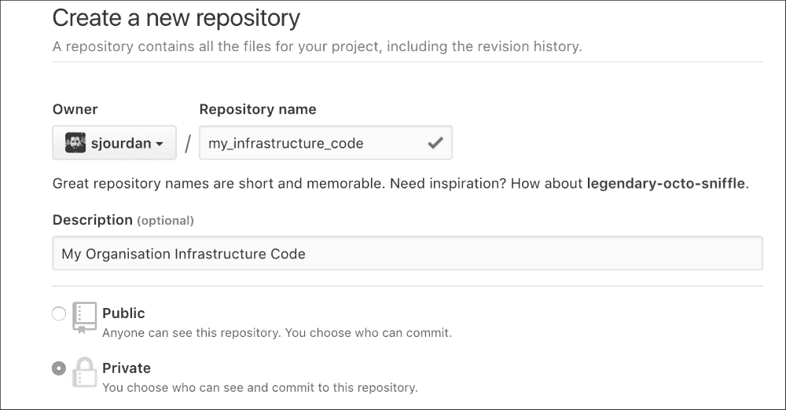
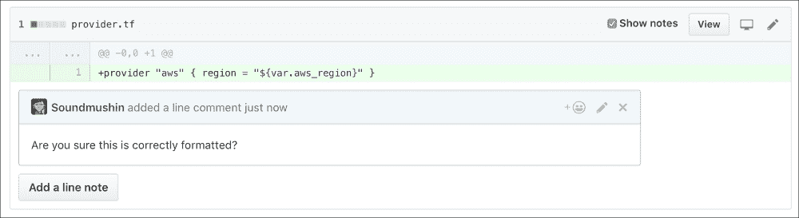

# 第三章：深入了解 Terraform

在本章中，我们将涵盖以下配方：

+   使用 Terraform 处理不同环境

+   使用 Terraform 配置带有 Chef 的 CentOS 7 EC2 实例

+   使用数据源、模板和本地执行

+   使用 Terraform 在引导过程中执行远程命令

+   在 Terraform 中使用 Docker

+   使用 Terraform 模拟基础设施更改

+   团队协作 —— 共享 Terraform 基础设施状态

+   维护清晰且标准化的 Terraform 代码

+   一个 Makefile 来管理所有

+   团队工作流示例

+   使用 Terraform 管理 GitHub

+   与 StatusCake 的外部监控集成

# 介绍

在本章中，我们将超越在第二章中涵盖的 Terraform 使用基础知识，*使用 Terraform 配置 IaaS*。我们将探索许多重要的技巧，如何将 Terraform 与 Docker 和 Chef 等其他工具结合使用，如何在多个环境中使用（如开发/阶段/生产），它如何在管理基础设施以及许多 SaaS 时展现强大的能力，如何将该工具集成到团队工作流中（共享、同步、维护、协调等）。这些话题都同样重要，因为它们将决定我们日常工作的质量以及我们与他人、服务和系统的互动能力。

### 注意

本书使用的 Terraform 版本是 0.7.3。

# 使用 Terraform 处理不同环境

拥有不同的基础设施环境，并使它们具有一定的相似性是常见且推荐的设置。这些环境在公司和项目中可能有很大差异，无论是在名称上还是重点上，但通常可以找到以下几种环境：

+   开发：开发人员可以在此实现并快速测试新功能

+   阶段环境：在比开发环境更一致的环境中测试新功能，有时非常类似于预生产环境

+   预生产环境：此环境与生产环境尽可能相似

+   生产环境：完整功能的实时生产环境

我们将看到，使用基础设施即代码，尤其是 Terraform 如何从根本上帮助构建强大且可复制的环境。这一次，我们将使用 CoreOS AMI 作为改变。

## 准备工作

要执行此配方，您需要以下内容：

+   一个可用的 Terraform 安装

+   配置了 SSH 密钥的 AWS 账户并在 Terraform 中配置（参见第二章，*使用 Terraform 配置 IaaS*的配方）

+   互联网连接

## 如何操作……

使用基础设施即代码，最简单的做法是简单地复制代码以创建所需数量的环境。然而，还有一种更强大的方式，可以充分利用 Terraform 的全部能力。

让我们定义简单目标环境的需求，并将其转换为动态的 Terraform 代码：

| 参数 | 阶段环境 | 生产环境 |
| --- | --- | --- |
| **实例数量** | 1 | 3 |
| **实例类型** | `t2.micro` | `t2.medium` |
| **操作系统** | CoreOS Stable | CoreOS Stable |
| **eu-west-1 区域的 AMI** | `ami-85097ff6` | `ami-85097ff6` |
| **us-east-1 区域的 AMI** | `ami-0aef8e1d` | `ami-0aef8e1d` |
| **S3 存储桶命名** | iacbook-staging | iacbook-production |
| **默认环境** | 是 | 否 |

让我们从在 `variables.tf` 文件中声明这些变量开始，正如我们在第二章中看到的那样，*使用 Terraform 配置 IaaS*，不同的是这次我们将描述像 *staging* 和 *production* 这样的环境，而不是 AWS 区域用于集群大小和实例类型的定义。

定义 CoreOS AMI 变量：

```
variable "aws_coreos_ami" {
  type = "map"

  default = {
    eu-west-1 = "ami-85097ff6"
    us-east-1 = "ami-0aef8e1d"
  }
}
```

根据环境定义集群大小变量：

```
variable "cluster_size" {
  type = "map"

  default = {
    staging    = "1"
    production = "3"
  }

  description = "Number of nodes in the cluster"
}
```

最后，定义不同的 AWS 实例类型：

```
variable "aws_instance_type" {
  type = "map"

  default = {
    staging    = "t2.micro"
    production = "t2.medium"
  }

  description = "Instance type"
}
```

现在让我们在一个高度动态的基础设施代码（`instances.tf`）中使用这些变量，使用 `aws_instance` 资源，并根据环境自动选择正确的集群大小和实例类型，同时根据执行区域选择合适的 AMI：

```
resource "aws_instance" "coreos" {
  count                       = "${lookup(var.cluster_size, var.environment)}"
  ami                         = "${lookup(var.aws_coreos_ami, var.aws_region)}"
  instance_type               = "${lookup(var.aws_instance_type, var.environment)}"
  key_name                    = "${aws_key_pair.admin_key.key_name}"
  associate_public_ip_address = true

  tags {
    Name        = "coreos_${var.environment}_${count.index+1}"
    Environment = "${var.environment}"
  }
}
```

### 注意

我们根据环境和实例计数的数值（即 `coreos_production_2`）构建了每个实例的 `Name` 标签。

我们的规格表还表明我们需要两个不同的 S3 存储桶。让我们在 `s3.tf` 文件中重用一些在第二章中做过的类似操作，*使用 Terraform 配置 IaaS*：

```
resource "aws_s3_bucket" "bucket" {
  bucket = "iacbook-${var.environment}"

  tags {
    Name        = "IAC Book ${var.environment} Bucket"
    Environment = "${var.environment}"
  }
}
```

这里的构建方式相同，每个环境会动态生成一个与其相关联的存储桶。

### 保持 tfstate 文件隔离

强烈建议**不要混合**不同环境的 Terraform 状态文件。为了保持它们良好的隔离，执行 `terraform` 命令时使用以下选项是一个优雅的解决方案：

```
$ terraform apply -state=staging.tfstate

```

你的默认环境（设置为暂存环境）现在将存储在 `staging.tfstate` 文件中。

### 设置生产环境标志

现在我们的暂存基础设施运行顺利，是时候启动正式环境——生产环境了。由于我们已经在使用一个专用的 terraform 状态文件，我们也为生产环境做同样的设置，并通过命令行直接设置 `environment` 变量：

```
$ terraform plan -state=production.tfstate -var environment=production

```

现在，你拥有两个清晰分离的环境，使用相同的代码，但彼此独立运行。简洁而优雅！

# 使用 Terraform 通过 Chef 配置一个 CentOS 7 EC2 实例

一旦 Terraform 生成了底层基础设施，任务可能还没有完成。这时，像 Chef、Ansible 或 Puppet 这样的配置管理工具就派上了用场，来配置虚拟机。幸运的是，Chef 是 Terraform 中的一流配置工具。接下来我们将看到如何通过 Terraform 从头开始在 AWS 上完全引导一个 CentOS 7.2 实例，从空白到一个完全配置的节点，并且在自动部署和注册到 Hosted Chef 之后，优雅地将配置交给 Chef。

如果这是您第一次在 AWS 上启动 CentOS 7 服务器，您必须同意它们的条款和条件，地址是[`aws.amazon.com/marketplace/pp/B00O7WM7QW`](https://aws.amazon.com/marketplace/pp/B00O7WM7QW)。

## 准备工作

要执行此配方，您将需要以下内容：

+   一个有效的 Terraform 安装

+   需要一个配置了 SSH 密钥的 AWS 账户，并且有一个安全组允许外部 SSH 连接（参见第二章，*使用 Terraform 配置 IaaS*配方）

+   一个 Chef 服务器上的账户（我们推荐使用免费的托管 Chef 账户。请参考第六章，*使用 Chef 和 Puppet 管理服务器的基础知识*配方），并且上传了默认的 Cookbook

+   需要一个互联网连接

## 如何操作…

由于涉及到许多来源，让我们将所有所需的信息放入一个表格中（Chef 信息来自 Chef 入门套件，或您的 Chef 服务器，填写您自己的值）：

| **主机名** | `centos-1` |
| --- | --- |
| **实例类型** | `t2.micro` |
| **eu-west-1 中的 AMI** | ami-7abd0209 |
| **us-east-1 中的 AMI** | ami-6d1c2007 |
| **SSH 用户名** | centos |
| **SSH 密钥** | `keys/aws_terraform` |
| **所需 TCP 端口** | 22 |
| **应用的 Cookbook** | starter |
| **Chef 服务器 URL** | [`api.chef.io/organizations/iacbook`](https://api.chef.io/organizations/iacbook) |
| **验证密钥** | `iacbook.pem` |
| **验证客户端名称** | iacbook |
| **Chef 客户端版本** | 12.13.37 |

1.  让我们首先在`variables.tf`文件中声明我们的 AMI 映射：

    ```
    variable "aws_centos_ami" {
      type = "map"

      default = {
        eu-west-1 = "ami-7abd0209"
        us-east-1 = "ami-6d1c2007"
      }
    }
    ```

1.  现在在同一个文件中添加实例类型：

    ```
    variable "aws_instance_type" {
      default     = "t2.micro"
      description = "Instance Type"
    }
    ```

1.  声明我们当前在生产中使用的 Chef 版本，以便它保持稳定并不变：

    ```
    variable "chef_version" {
      default = "12.13.37"
    }
    ```

1.  声明 Chef 服务器的 URL。如果您使用的是书中的托管 Chef 示例，您可以在`knife.rb`文件中找到正确的地址：它就是[`api.chef.io/organizations/<your_organization_name>`](https://api.chef.io/organizations/<your_organization_name>)，否则，使用您自己的 Chef 服务器：

    ```
    variable "chef_server_url" {
      default = "https://api.chef.io/organizations/iacbook"
    }
    ```

1.  最后，添加 Chef 服务器的*验证客户端*名称：

    ```
    variable "chef_validation_client_name" {
      default = "iacbook"
    }
    ```

1.  要连接到实例，我们知道默认的用户名是`centos`，但由于它可能会变化，或者您可能会使用自己的镜像，因此最好也将其固定在变量中：

    ```
    variable "ssh_user" {
      default = "centos"
    }
    ```

### 创建 EC2 实例

我们从之前的示例中知道，运行 CentOS 的基本实例在 Terraform 的 `instances.tf` 中看起来像这样，使用名为 `base_security_group` 的安全组：

```
resource "aws_instance" "centos" {
  ami                         = "${lookup(var.aws_centos_ami, var.aws_region)}"
  instance_type               = "${var.aws_instance_type}"
  key_name                    = "${aws_key_pair.admin_key.key_name}"
  security_groups             = ["${aws_security_group.base_security_group.name}"]
  associate_public_ip_address = true

  tags {
    Name = "CentOS-${count.index+1} by Terraform"
  }
}
```

现在我们需要为 Terraform 文件提供两种信息：在服务器上使用 Chef 的方式，以及如何连接到它。

### 传递连接信息

为了告诉 Terraform 如何连接到新的 EC2 实例，我们在 `aws_instance` 资源内使用 `connection {}` 块，告诉它通过 SSH 使用哪个用户和密钥：

```
connection {
    type     = "ssh"
    user     = "${var.ssh_user}"
    key_file = "${var.aws_ssh_admin_key_file}"
  } 
```

### 向 Chef 提供信息

我们需要向 Terraform 提供一些信息，以便它可以传递给 Chef。这一切都会发生在 `aws_instance` 资源内的 `provisioner "chef" {}` 块中。

使用我们声明的所有变量，下面是它的样子：

```
resource "aws_instance" "centos" {
[...]
  provisioner "chef" {
    node_name              = "centos-${count.index+1}"
    run_list               = ["starter"]
    server_url             = "${var.chef_server_url}"
    validation_client_name = "${var.chef_validation_client_name}"
    validation_key         = "${file("chef/validator.pem")}"
    version                = "${var.chef_version}"
  }
 }
```

### 注意

别忘了使用有效的路径来验证密钥！

现在你可以运行 `terraform apply`，看到从实例创建到 Chef 客户端部署和 cookbook 安装的一切过程。

## 它是如何工作的…

首先，Terraform 创建所需的 AWS 环境（密钥、安全组和实例），一旦实例运行，它会通过 SSH 以正确的凭证连接到它，然后从官方源部署指定的 Chef 客户端版本，最后执行初始的 chef-client 运行，将节点注册到 Chef 服务器并应用请求的 cookbook。

## 还有更多…

对于 Terraform 内部的 Chef 提供者，还可以进行更多的配置选项。例如，可以通过 `client_options` 将所有可用的 chef-client 选项作为数组传递，而 Chef 环境（通常非常重要）则通过 `environment` 作为字符串传递。如果你使用了已经集成 Chef 客户端的自定义镜像，那么你可能会想设置 `skip_install` 为 `true`，以避免重新安装。

# 使用数据源、模板和本地执行

当我们使用 Terraform 部署或更新基础设施时，有时会很享受动态生成一些本地内容。例如，如果你希望使用 Ansible 来配置 Terraform 启动的新虚拟机，那么你可能需要在本地的笔记本电脑上填充一个 `hosts` 文件，内容是该主机的公共 IP 地址。

Ansible 可以通过自身使用一些 AWS 动态库存，但在这里我们将看到如何在 Terraform 中使用模板，并动态填充所需的信息，最终实现一个有效的 Ansible 设置，这都得益于 Terraform。

## 准备就绪

要完成本教程，你需要以下内容：

+   一个有效的 Terraform 安装

+   一个 AWS 账户，已经在 Terraform 中配置了 SSH 密钥，并且安全组允许来自外部的 SSH 连接（参考 第二章，*使用 Terraform 配置 IaaS* 章节）

+   一个互联网连接

## 如何实现…

让我们首先在 AWS 上启动一个标准的 CentOS 7.2，并使用 `variables.tf` 中的一组标准变量：

```
variable "aws_centos_ami" {
  type = "map"

  default = {
    eu-west-1 = "ami-7abd0209"
    us-east-1 = "ami-6d1c2007"
  }
}

variable "aws_instance_type" {
  default     = "t2.micro"
  description = "Instance Type"
}
```

这是启动实例的最简单的 `instances.tf` 文件：

```
resource "aws_instance" "centos" {
  ami                         = "${lookup(var.aws_centos_ami, var.aws_region)}"
  instance_type               = "${var.aws_instance_type}"
  key_name                    = "${aws_key_pair.admin_key.key_name}"
  security_groups             = ["${aws_security_group.base_security_group.name}"]
  associate_public_ip_address = true

  tags {
    Name = "CentOS"
  }
}
```

### 数据和模板

那么，Ansible 的典型 `hosts` 文件是什么样的呢？它看起来像这样：

```
[section_name_1]
1.2.3.4
[section_name_2]
5.6.7.8
a.server.fqdn
```

所以，稍后，Ansible 会根据每个部分的每台服务器应用需要的角色。

在我们的案例中，我们需要一个简单的部分，命名为 `centos7_hosts`，并包含服务器的 IP 地址，如下所示：

```
[centos7_hosts]
1.2.3.4
```

让我们构建第一个名为 `hosts.tpl` 的模板，模板中有一个变量 `host_public_ipv4`，最终会被我们稍后启动的主机的真实 IP 地址替换：

```
[centos7_hosts]
${host_public_ipv4}
```

为了生成这个文件，我们将使用一个包含变量的模板，Terraform 会为我们生成它，使用 `data` 资源在 `data.tf` 中——它简单地包含了我们模板的文件插值，并从我们的 AWS 实例中传递所需的变量：

```
data "template_file" "ansible_hosts" {
  template = "${file("hosts.tpl")}"

  vars {
    host_public_ipv4 = "${aws_instance.centos.public_ip}"
  }
}
```

### 本地执行的 Terraform 配置器

这个过程在内部生成模板，意味着数据已经可用，但不会被直接输出到任何地方。此时，`local-exec` 配置器就派上用场了，它通过简单地将渲染后的模板从数据源回显到我们想要的文件中（在 `data.tf` 中）：

```
resource "null_resource" "generate_ansible_hosts" {
  provisioner "local-exec" {
    command = "echo '${data.template_file.ansible_hosts.rendered}' > hosts"
  }
}
```

### 注意

我们使用 `"null_resource"` 来实现这一目的，这样模板的生成就不依赖于任何其他执行的资源。在其他情况下，我们可以直接在标准资源内部使用 `"local-exec" { }` 配置器。

现在我们可以运行 `terraform apply` 来应用这个配置。我们的 `hosts` 文件看起来如何？像这样：

```
$ cat hosts
[centos7_hosts]
52.17.172.231

```

它已正确填充！

### 应用配置好的 Ansible

我们的代码仓库现在已经准备好供 Ansible 使用了。这里是一个示例 Ansible 角色，简单地安装并启动 Docker，这样我们就可以开始使用它，文件位于 `ansible/main.yml`：

```
---
- hosts: centos7_hosts
  become: yes
  tasks:
    - name: Install EPEL
      yum: name=epel-release state=present
    - name: Install Docker
      yum: name=docker state=present
    - name: Start docker
      service: name=docker state=started enabled=yes
```

现在，只需要在你需要的时候执行 Ansible，一切都已准备好并配置完成！

```
$ ansible-playbook -i hosts -u centos ansible/main.yml
PLAY [centos7_hosts] ***********************************************************
[...]
PLAY RECAP *********************************************************************
52.17.172.231              : ok=4    changed=0    unreachable=0    failed=0

```

# 使用 Terraform 执行远程命令以进行引导

在启动后立即执行一组初始命令是非常常见的做法，甚至在正确的配置管理系统（如 Chef 或 Ansible）接管之前。它可以包括操作系统的完整更新、在发现系统（如 Consul）上的初始注册，或初步添加本地 DNS 服务器。它的目的是将系统交付到一个更高级别和预期的状态，以便下一个配置系统接管。绝对不应替代合适的配置管理工具。

在这个食谱中，我们将启动一个 CentOS 7.2 系统，然后对其进行完全更新，使其尽可能安全，安装 EPEL 以获得更丰富的包库，添加 Puppet Labs Yum 仓库并安装 Puppet 代理，并添加一个不同的名称服务器，以便我们的系统准备好进行下一步（我们在这里不涵盖这个步骤，因为它可能是在执行 Puppet 代码）。

## 准备工作

要逐步完成这个食谱，你将需要以下内容：

+   一个正常工作的 Terraform 安装

+   一个配置了 SSH 密钥的 AWS 账户，在 Terraform 中，并且安全组允许来自外部的 SSH 连接（参见第二章，*使用 Terraform 提供 IaaS* 配方）

+   一条互联网连接

## 如何操作…

在深入到提供部分之前，让我们先在 `instances.tf` 中描述一个经典的 CentOS 7.2 AMI：

```
resource "aws_instance" "centos" {
  ami                         = "${lookup(var.aws_centos_ami, var.aws_region)}"
  instance_type               = "${var.aws_instance_type}"
  key_name                    = "${aws_key_pair.admin_key.key_name}"
  security_groups             = ["${aws_security_group.base_security_group.name}"]
  associate_public_ip_address = true

  tags {
    Name = "CentOS"
  }
}
```

`variables.tf` 文件中的变量如下：

```
variable "aws_centos_ami" {
  type = "map"

  default = {
    eu-west-1 = "ami-7abd0209"
    us-east-1 = "ami-6d1c2007"
  }
}

variable "aws_instance_type" {
  default     = "t2.micro"
  description = "Instance Type"
}
```

现在，我们对这个系统的直接目标是什么？：

+   完全更新：`sudo yum install -y`

+   启用 EPEL 仓库：`sudo yum install epel-release -y`

+   添加自定义名称服务器：`echo "nameserver 8.8.8.8" | sudo tee -a /etc/resolv.conf`

+   添加 Puppet Labs 仓库：`sudo yum install https://yum.puppetlabs.com/puppetlabs-release-pc1-el-7.noarch.rpm -y`

+   安装 Puppet agent：`sudo yum install puppet-agent -y`

+   显示 Puppet 版本：`sudo /opt/puppetlabs/bin/puppet agent --version`

让我们将这些命令添加到 `aws_instance` 资源中的 `remote-exec` 提供者中，并将默认用户名更改为 `centos`：

```
provisioner "remote-exec" {
    inline = [
      "echo \"nameserver 8.8.8.8\" | sudo tee -a /etc/resolv.conf",
      "sudo yum update -y",
      "sudo yum install epel-release -y",
      "sudo yum install https://yum.puppetlabs.com/puppetlabs-release-pc1-el-7.noarch.rpm -y",
      "sudo yum install puppet-agent -y",
      "sudo /opt/puppetlabs/bin/puppet agent --version"
    ]
    connection {
        user = "centos"
      }
  }
```

当你执行 `terraform apply` 时，你将得到一个完全更新的 CentOS 7.2 系统，EPEL 可用，添加了自定义 DNS 服务器，并且安装了 Puppet agent。

为 Puppet 的下一个部署阶段做好准备！

# 使用 Docker 和 Terraform

Terraform 也可以用于操作 Docker。传统的用法是与已经运行的 Docker 服务器进行交互，但在本地使用你自己的 Docker 安装时也可以完全一样。使用 Terraform 控制 Docker，我们将能够动态触发 Docker 镜像更新，执行带有各种选项的容器，操作 Docker 网络，并使用 Docker 卷。

在这里，我们将部署一个孤立的博客容器（Ghost），它将通过 `nginx-proxy` 容器公开服务，并通过 HTTP 提供服务。这个非常有用的 `nginx-proxy` 容器由 InfluxDB 的 Jason Wilder 在他的 GitHub 上提出：[`github.com/jwilder/nginx-proxy`](https://github.com/jwilder/nginx-proxy)。

## 准备工作

要执行此配方，你将需要以下内容：

+   一个正常工作的 Terraform 安装。

+   一个正常工作的 Docker 安装（Mac 的原生 Docker，Linux 上的 Docker 引擎，运行 Docker 的远程服务器等）。本配方使用 Docker 1.12。

+   一条互联网连接。

## 如何操作…

在开始使用 Terraform 编写代码之前，确保你能够连接到任何类型的 Docker 引擎，无论是本地还是远程：

```
$ docker version
Client:
 Version:      1.12.0
 API version:  1.24
 Go version:   go1.6.3
 Git commit:   8eab29e
 Built:        Thu Jul 28 21:15:28 2016
 OS/Arch:      darwin/amd64

Server:
 Version:      1.12.0
 API version:  1.24
 Go version:   go1.6.3
 Git commit:   8eab29e
 Built:        Thu Jul 28 21:15:28 2016
 OS/Arch:      linux/amd64

```

如果此时遇到问题，需要在继续之前解决这些问题。

我们的目标是通过 `nginx-proxy` 容器提供一个博客容器（Ghost），该容器不会直接在网络上提供服务。

如果你连接的是远程 Docker 服务器，你需要配置 Docker 提供者（可能在 `provider.tf` 中）。另外，它也可以使用 `DOCKER_HOST` 环境变量，或者如果没有指定，则使用本地守护进程。对于本练习中的本地使用，你可以直接忽略包含提供者：

```
provider "docker" {
  host = "tcp://1.2.3.4:2375"
}
```

首先，我们在`docker.tf`中声明两个数据源，分别对应我们的 Docker 镜像。`ghost`镜像将使用其`0.10`版本标签，而`nginx-proxy`将使用`0.4.0`版本标签。使用数据源有助于我们稍后操作镜像：

```
data "docker_registry_image" "ghost" {
  name = "ghost:0.10"
}

data "docker_registry_image" "nginx-proxy" {
  name = "jwilder/nginx-proxy:0.4.0"
}
```

现在我们可以访问镜像了，接下来就照做，使用`docker_image`资源。我们将重用我们的数据源所提供的所有信息，如镜像名称或其 SHA256 值，这样我们就知道是否有新镜像可供拉取：

```
resource "docker_image" "ghost" {
  name         = "${data.docker_registry_image.ghost.name}"
  pull_trigger = "${data.docker_registry_image.ghost.sha256_digest}"
}

resource "docker_image" "nginx-proxy" {
  name         = "${data.docker_registry_image.nginx-proxy.name}"
  pull_trigger = "${data.docker_registry_image.nginx-proxy.sha256_digest}"
}
```

现在让我们声明私人 Ghost 容器（没有任何端口映射），使用`docker_container`资源。我们将使用刚才声明的`docker_image`资源中的镜像，并导出一个名为`VIRTUAL_HOST`的环境变量，供 nginx-proxy 容器使用（更多信息请参考 nginx-proxy 文档）。如果你不是在本地 Docker 主机上运行，请替换为你想使用的主机：

```
resource "docker_container" "ghost" {
  name  = "ghost"
  image = "${docker_image.ghost.latest}"
  env   = ["VIRTUAL_HOST=localhost"]
}
```

现在让我们启动`nginx-proxy`容器。我们从它的文档中知道，它需要以只读模式共享 Docker 套接字(`/var/run/docker.sock`)，以动态访问正在运行的容器，并且我们希望它运行在默认的 HTTP 端口(`tcp`/`80`)上。我们来实现这一点：

```
resource "docker_container" "nginx-proxy" {
  name  = "nginx-proxy"
  image = "${docker_image.nginx-proxy.latest}"

  ports {
    internal = 80
    external = 80
    protocol = "tcp"
  }

  volumes {
    host_path      = "/var/run/docker.sock"
    container_path = "/tmp/docker.sock"
    read_only      = true
  }
}
```

现在如果你执行`terraform apply`，你可以访问`http://localhost/admin`（将`localhost`替换为你使用的 Docker 服务器地址），并设置你的 Ghost 博客！


# 使用 Terraform 模拟基础设施变更

在之前的教程中，你已经学会了如何使用 Terraform 管理不同的环境，这很好。但我们如何在应用更改之前测试它们呢？

Terraform 有一个很棒的内部机制，可以通过比较我们的基础设施代码期望的内容和远程状态包含的内容来*规划*变更。这样，我们就能安全地检查，我们认为代码中的小改动是否实际上会带来破坏性影响（有时候，资源中的某些参数会触发资源的完全销毁！）。

我们将介绍如何通过不同的方式预测、模拟和定位基础设施中的变更，这是在正式应用更改之前的一种额外安全检查。

## 准备工作

要按照这个教程进行操作，你需要以下内容：

+   一个可用的 Terraform 安装

+   配置了 SSH 密钥的 AWS 账户（请参阅第二章，*使用 Terraform 配置 IaaS*教程）

+   一个互联网连接

## 如何做到这一点…

我们从一个简单的 CoreOS 机器开始，这台机器部署在 AWS 上。我们知道 AMI ID，我们需要一个单独的`t2.micro`主机。我们把这些信息放到`variables.tf`文件中：

```
variable "aws_coreos_ami" {
  default = "ami-85097ff6"
}

variable "cluster_size" {
  default     = "1"
  description = "Number of nodes in the cluster"
}

variable "aws_instance_type" {
  default     = "t2.micro"
  description = "Instance type"
}
```

我们可以创建的最简单的`aws_instance`资源如下，位于`instances.tf`中：

```
resource "aws_instance" "coreos" {
  count                       = "${var.cluster_size}"
  ami                         = "${var.aws_coreos_ami}"
  instance_type               = "${var.aws_instance_type}"
  key_name                    = "${aws_key_pair.admin_key.key_name}"
  associate_public_ip_address = true

  tags {
    Name = "coreos_${count.index+1}"
  }
}
```

### 规划

到现在为止，我们已经使用`terraform apply`进行即时操作。还有另一个命令：`terraform plan`。它正如其名所示。它会计划变更，但不会应用这些变更：

```
$ terraform plan
Refreshing Terraform state in-memory prior to plan...
The refreshed state will be used to calculate this plan, but
will not be persisted to local or remote state storage.
The Terraform execution plan has been generated and is shown below.
[...]

+ aws_instance.coreos
 ami:                         "ami-85097ff6"
 [...]

+ aws_key_pair.admin_key
 [...]

Plan: 2 to add, 0 to change, 0 to destroy.

```

因此，通过在应用之前进行计划，我们可以知道我们的基础设施将会发生什么变化。我们对将创建一个使用正确 AMI 的实例感到满意，所以让我们执行`terraform apply`。

现在基础设施已经创建完成，如果你再次运行计划，它会说没有需要修改的内容：

```
$ terraform plan
Refreshing Terraform state in-memory prior to plan...
The refreshed state will be used to calculate this plan, but
will not be persisted to local or remote state storage.

aws_key_pair.admin_key: Refreshing state... (ID: admin_key)
aws_instance.coreos: Refreshing state... (ID: i-0f9106905e74a29f7)

No changes. Infrastructure is up-to-date. This means that Terraform
could not detect any differences between your configuration and
the real physical resources that exist. As a result, Terraform
doesn't need to do anything.

```

一个正常运行的基础设施应该始终处于一个状态，`terraform plan`不需要更改任何内容。

现在假设我们需要让我们的基础设施发展，并创建一个 S3 存储桶。这在名为`s3.tf`的文件中应该是这样的：

```
resource "aws_s3_bucket" "bucket" {
  bucket = "iacbook"

  tags {
    Name = "IAC Book Bucket"
  }
}
```

我们不确定即将发生什么，所以让我们使用 Terraform 进行规划，这样它会准确告诉我们它打算做什么：

```
$ terraform plan
Refreshing Terraform state in-memory prior to plan...
[...]

aws_key_pair.admin_key: Refreshing state... (ID: admin_key)
aws_instance.coreos: Refreshing state... (ID: i-0f9106905e74a29f7)

[...]

+ aws_s3_bucket.bucket
 bucket:              "iacbook"
 tags.Name:           "IAC Book Bucket"
 [...]

Plan: 1 to add, 0 to change, 0 to destroy.

```

计划看起来不错——它似乎想创建一个名为我们想要的名字的 S3 存储桶！让我们执行`terraform apply`，然后继续进行。

### 快速模拟更改

我们现在想知道如果我们更改实例数量会发生什么。这是`cluster_size`变量，目前设置为`1`。我们可以直接从命令行测试更改该值的影响，而无需更改代码：

```
$ terraform plan -var 'cluster_size="2"'
[...]
+ aws_instance.coreos.1
 ami:                         "ami-85097ff6"
 instance_type:               "t2.micro"
 tags.Name:                   "coreos_2"
 [...]
Plan: 1 to add, 0 to change, 0 to destroy.

```

好消息！看起来增加`cluster_size`值达到了预期效果：创建了一个新实例。

现在，我们正合理地想知道将实例类型从`t2.micro`更改为`t2.medium`会产生什么影响：

```
$ terraform plan -var aws_instance_type="t2.medium"
[...]
-/+ aws_instance.coreos
 [...]
 instance_type:               "t2.micro" => "t2.medium" (forces new resource)

Plan: 1 to add, 0 to change, 1 to destroy.

```

哎呀！更改实例类型似乎是一个破坏性操作。我们稍后再处理这个问题，并将更改添加到一个名为`plan.tfvars`的新文件中：

```
aws_instance_type="t2.medium"
```

我们知道我们想要提议将实例数量更改为`2`，所以让我们将其添加到同一个文件中：

```
aws_instance_type="t2.medium"
cluster_size="2"
```

现在我们可以使用包含所有更改的文件，使用`-var-file`选项进行测试：

```
$ terraform plan -var-file=plan.tfvars
-/+ aws_instance.coreos.0
 instance_type:               "t2.micro" => "t2.medium" (forces new resource)
 tags.Name:                   "coreos_1" => "coreos_1"
 [...]

+ aws_instance.coreos.1
 instance_type:               "t2.medium"
 tags.Name:                   "coreos_2"
 [...]
Plan: 2 to add, 0 to change, 1 to destroy.

```

很好！你已经了解到我们的第一个实例将会被销毁并重新创建，从`t2.micro`升级到`t2.medium`，并且第二个实例将会使用相同的值被创建。我们暂时不应用这个更改，因为会产生额外费用。

### 定向进行特定更改

我们的同事问我们是否确定我们提出的更改不会对 S3 存储桶产生影响。Terraform 允许我们在计划阶段通过直接定位资源来非常具体地回答这个问题：

```
$ terraform plan -var-file=plan.tfvars -target="aws_s3_bucket.bucket"
[...]
aws_s3_bucket.bucket: Refreshing state... (ID: iacbook)
[...]
No changes. Infrastructure is up-to-date.
[...]

```

我们的同事很高兴，我们现在确定这个更改将完全按预期进行。我们可以提交这个更改进行审核。

# 团队合作 – 共享 Terraform 基础设施状态

你可能与团队一起工作，现在你正在使用 Terraform 管理基础设施，你将面临一个问题：你的团队如何在基础设施即代码方面协同工作？对此有许多答案，一个关键问题需要解决的是：Terraform 状态是如何传递或同步的？

在这里我们将看到如何使用 Git（一个版本控制系统，开发人员可以用来存储代码）、AWS S3（一个使用 HTTP 的亚马逊 Web 服务存储系统）或 Consul（一个服务发现工具和键值存储），在众多其他解决方案中选择一种来共享状态。

## 正在准备中

要执行这个操作，你需要以下内容：

+   一个工作正常的 Terraform 安装

+   一个配置了 SSH 密钥的 AWS 账户在 Terraform 中（参考 第二章，*使用 Terraform 提供 IaaS* 配方）

+   用于 Consul 仿真解决方案的工作 Docker 安装（可选）

+   一条互联网连接

## 如何操作……

让我们从启动一个初始基础设施开始（本例中为一台虚拟机）。以下是 `instances.tf` 中的 `aws_instance` 资源，它基于之前的配方使用了 CoreOS 稳定版本：

```
resource "aws_instance" "coreos" {
  count                       = "${var.cluster_size}"
  ami                         = "${var.aws_coreos_ami}"
  instance_type               = "${var.aws_instance_type}"
  key_name                    = "${aws_key_pair.admin_key.key_name}"
  associate_public_ip_address = true

  tags {
    Name = "coreos_${count.index+1}"
  }
}
```

以下是 `variables.tf` 中的示例变量；可以根据需要进行调整：

```
variable "aws_coreos_ami" {
  default = "ami-85097ff6"
}

variable "cluster_size" {
  default     = "1"
  description = "Number of nodes in the cluster"
}

variable "aws_instance_type" {
  default     = "t2.micro"
  description = "Instance type"
}
```

Terraform 默认将其状态存储在名为 `terraform.tfstate` 的文件中，并且有一个名为 `terraform.tfstate.backup` 的备份文件：

```
$ ls terraform.tfstate*
terraform.tfstate        terraform.tfstate.backup

```

### 通过 Git 共享

所有选项中最简单的是通过 Git 来共享状态文件：你本来就应该对你的基础设施代码进行版本管理！去某个平台创建一个账户。GitHub ([`github.com`](https://github.com)) 不提供免费的私有仓库，但 GitLab ([`gitlab.com`](https://gitlab.com)) 或 BitBucket ([`bitbucket.org`](https://bitbucket.org)) 提供。按照说明操作，使你的 Git 仓库本地工作。

现在，添加 `tfstate` 文件：

```
$ git add *.tfstate*

```

提交文件：

```
$ git commit -m "initial state creating the infrastructure"
[master (root-commit) 6f7e2ba] initial state creating the infrastructure
 2 files changed, 193 insertions(+)
 create mode 100644 terraform.tfstate
 create mode 100644 terraform.tfstate.backup

```

推送提交：

```
$ git push

```

现在，你的同事在应用任何操作之前必须拉取更改，否则灾难可能很快就会发生：

```
coworker@host $ git pull

```

### 使用 S3 进行远程共享

通过 Git 共享状态文件在某种程度上是可行的。最终你会遇到某种情况，有人忘记推送或拉取。在状态文件中合并冲突真的不是一件愉快的事情。

一个解决方案是使用 S3 来共享状态文件，并使用 Terraform 的远程状态功能。

从在 `s3.tf` 中创建一个专门用于此的 S3 存储桶开始，启用版本控制（这样你就可以回滚到基础设施的早期版本）：

```
resource "aws_s3_bucket" "tfstate" {
  bucket = "iacbook-tfstate"

  versioning {
    enabled = true
  }

  tags {
    Name = "IAC Book TFState Bucket"
  }
}
```

让我们 `terraform apply` 这个 S3 存储桶，并继续使用我们的信息进行远程配置：

```
$ terraform remote config -backend=s3 -backend-config="bucket=iacbook-tfstate" -backend-config="key=terraform.tfstate"
Remote state management enabled
Remote state configured and pulled. 

```

你现在可以在 S3 浏览器中看到 Terraform 状态文件：


现在对基础设施进行任何更改，例如添加一个新的 S3 存储桶，以便看到文件变化的效果：

```
resource "aws_s3_bucket" "bucket" {
  bucket = "iacbook-bucket"

  tags {
    Name = "IAC Book Bucket"
  }
}
```

在 `terraform apply` 后，直接推送更改：

```
$ terraform remote push
State successfully pushed!

```

在 S3 浏览器中查看历史记录：


同事必须配置他们的环境并拉取信息：

```
coworker@host $ terraform remote config -backend=s3 -backend-config="bucket=iacbook-tfstate" -backend-config="key=terraform.tfstate"
Initialized blank state with remote state enabled!
Remote state configured and pulled.

```

本地副本现在位于 `.terraform` 文件夹中：

```
$ head .terraform/terraform.tfstate

```

### 使用 Consul 进行远程共享

通过使用 Consul 共享状态文件是一种非常好的方式，Consul 是 Hashicorp 提供的强大键值存储服务（[`consul.io/)`](http://consul.io/))。使用 Consul 存储 Terraform 状态使得与团队协作变得更容易，因为只有一个单一的复制状态。如果我们忘记同步 Git 仓库，就不会有使用旧状态文件的风险。

配置生产环境中的正确 Consul 集群超出了本书的范围，但如果你手头没有 Consul 集群来尝试，可以使用 Docker 和 Consul 镜像快速创建一个：

```
$ docker run -it --rm -p 8400:8400 -p 8500:8500 -p 8600:53/udp -h node1 progrium/consul -server -bootstrap

```

现在，让我们为 Consul 配置 Terraform 远程，并命名为 `terraform/my_customer`，以便可以同时管理多个客户：

```
$ terraform remote config -backend=consul -backend-config="path=terraform/my_customer"
Remote state management enabled
Remote state configured and pulled.

```

工作完成！你的同事现在可以从 Consul 源中推送和拉取了！在生产环境的 Consul 集群中，这意味着每个节点的状态都被复制和同步，同时增加了隐私性。

### 其他状态共享选项

还有许多其他方式可以共享状态，例如在 Azure 上，使用 OpenStack Swift，任何支持 REST 的 HTTP 服务器，CoreOS 自己的 etcd 键值存储，Google Cloud 存储或 Hashicorp 提供的商业解决方案 Atlas。

# 维护一个干净且标准化的 Terraform 代码

每个人都有自己的编码风格，但强制执行标准化和常见的可读风格是顺利协作的关键。这就是为什么 Terraform 提供了一个命令来确保格式和风格都正确。

我鼓励读者广泛使用它，甚至将其集成到 **持续集成** (**CI**) 系统和 Makefile 中。

## 准备工作

要完成这个教程，你将需要以下内容：

+   一个正常工作的 Terraform 安装

+   一个互联网连接

## 如何操作……

我们故意编写一个风格非标准且带有错误（缺失变量）的简单 Terraform 代码。这将帮助我们操作 Terraform 提供的各种工具，以确保代码的最一致性和同质性，从而更快地实现更高质量和更高水平的代码标准化。

让我们在 `provider.tf` 中这样编写一个 AWS 的 provider（故意写在一行中）：

```
provider "aws" { region = "${var.aws_region}" }
```

### 语法验证

尝试验证该文件，它会通知我们缺少一个变量：

```
$ terraform validate
Error validating: 1 error(s) occurred:

* provider config 'aws': unknown variable referenced: 'aws_region'. define it with 'variable' blocks

```

验证失败，返回代码是 `1`：

```
$ echo $?
1

```

让我们将这个变量添加到 `variables.tf` 文件中：

```
variable "aws_region" { default = "eu-west-1" }

```

好极了！`terraform validate` 现在运行正常：

```
$ terraform validate
$ echo $?
0

```

### 样式验证

问题是，我们解决了明显的问题（缺失变量），但样式如何呢？前面的样式完全可行，但可能并不是标准样式。

让我们使用 `fmt` 选项检查样式问题，显示屏幕上的 `diff`，但不自动写入文件：

```
$ terraform fmt -write=false -diff=true
provider.tf
diff a/provider.tf b/provider.tf
--- /var/folders/zn/bx_20cp90bq5_fqqmlvx3tq40000gn/T/598506546  2016-09-10 22:40:35.000000000 +0200
+++ /var/folders/zn/bx_20cp90bq5_fqqmlvx3tq40000gn/T/407676393  2016-09-10 22:40:35.000000000 +0200
@@ -1 +1,3 @@
-provider "aws" { region = "${var.aws_region}" }
+provider "aws" {
+  region = "${var.aws_region}"
+}
variables.tf
diff a/variables.tf b/variables.tf
--- /var/folders/zn/bx_20cp90bq5_fqqmlvx3tq40000gn/T/743564340  2016-09-10 22:40:35.000000000 +0200
+++ /var/folders/zn/bx_20cp90bq5_fqqmlvx3tq40000gn/T/095288323  2016-09-10 22:40:35.000000000 +0200
@@ -1 +1,3 @@
-variable "aws_region" { default = "eu-west-1" }
+variable "aws_region" {
+  default = "eu-west-1"
+}

```

我们发现我们的样式与指南相差甚远。让我们修复它并自动正确地格式化文件：

```
$ terraform fmt
provider.tf
variables.tf

```

我们的两个文件现在已正确格式化！

我强烈建议将这两个命令放入你的 CI 测试中（你是否在 CI 中运行基础设施代码测试？），甚至在到达 CI 之前，如果它在项目的 `Makefile` 中，那会更好。

这是一个简单的 `Makefile` 示例：

```
.DEFAULT_GOAL := all

all:
  terraform validate
  terraform fmt
```

现在，你只需要在 Terraform 目录中输入 `make`，就可以确保你的代码既通过验证，又符合一致的风格。

# 一个 Makefile 控制所有

一些编程语言有环境或版本管理工具，如 Ruby 的 RVM、Node 的 NVM，甚至是 Rackspace 的 Docker 版本管理工具 DVM。

强烈建议锁定 Terraform 的版本，这样团队中的每个人都使用相同的版本，并且更新可以无痛处理。为了做到这一点，我建议使用一个 Terraform 容器，所以我们这里使用的是我自己用的那个：`sjourdan/terraform:<version>`（来自 [`github.com/sjourdan/terraform-docker`](https://github.com/sjourdan/terraform-docker)）。但我理解用 `docker run -it --rm -v `pwd`:/data sjourdan/terraform:0.7.3` 替代简单的 `terraform` 命令可能感觉不太吸引人。这就是为什么我们可以为每个使用 Terraform 的项目使用一个通用的 `Makefile`。

使用一个通用的入口点来操作基础设施代码有助于很多共享实践，执行政策并集成第三方服务，如 CI 系统。

## 准备工作

要执行这个食谱，你将需要以下内容：

+   一个可用的 Terraform 安装

+   配置了 SSH 密钥的 AWS 账户，并在 Terraform 中进行设置（请参考第二章，*使用 Terraform 提供 IaaS*的食谱）

+   一个互联网连接

## 如何做……

让我们首先在 `Makefile` 中设置我们希望使用的 Terraform 版本，这样以后更新时可以轻松操作：

```
TERRAFORM_VERSION = 0.7.3
```

现在让我们创建一个 `TERRAFORM_BIN` 变量，它将包含完整的 Docker 命令，并共享我们的本地文件夹：

```
TERRAFORM_BIN = docker run -it --rm -v "$(PWD)":/data sjourdan/terraform:$(TERRAFORM_VERSION)
```

我喜欢自动化记录我的 `Makefile`，并且我提议使用一种流行的技巧：默认情况下，`make` 会调用 `make help`，然后解析 `Makefile` 中的注释并显示它们。这样，我可以通过简单地添加注释来选择输出内容。它是这样工作的：

```
.DEFAULT_GOAL := help

help:
  @grep -E '^[a-zA-Z_-]+:.*?## .*$$' $(MAKEFILE_LIST) | sort | awk 'BEGIN {FS = ":.*?## "}; {printf "\033[36m%-30s\033[0m   %s\n", $$1, $$2}'
```

现在只需使用这个功能为之前食谱中的验证和格式化创建一个条目：

```
validate: terraform-fmt terraform-validate  ## Validate syntax and format
terraform-fmt:
 $(TERRAFORM_BIN) fmt -list
terraform-validate:
 $(TERRAFORM_BIN) validate

```

如果你只输入 `make`，你将看到自动帮助信息：

```
$ make
validate                       Validate syntax and format

```

现在，简单的 `make validate` 将同时验证语法并格式化代码。

如果能同时拥有 `plan` 和 `apply` 命令会更好，如果你跟随了 Terraform 环境管理的食谱，如果它能直接从 `Makefile` 工作，那就太棒了，这样我们可以节省很多时间。

从创建 `Makefile` 主要的 "help" 入口开始：

```
plan: terraform-validate terraform-plan ## Plan changes
apply: terraform-validate terraform-apply ## Apply Changes

```

### 注意

我们在每一步都加入了验证步骤，这样我们始终可以确保它通过了完整的验证（你也可以添加自己的验证步骤）。

我们来检查一个名为 `env` 的环境变量，它是在 `make` 执行时传递的（例如 `make plan env=staging`），如果没有设置则返回错误：

```
ifndef env
getenv=$(error var:"env=" is not set)
else
getenv=$(env)
endif
```

现在我们可以编写 `terraform-plan` 和 `terraform-apply` 实际执行的内容，带有独立的 Terraform 状态和环境：

```
terraform-plan:
  $(TERRAFORM_BIN) plan -state=$(call getenv).tfstate -var environment=$(call getenv)

terraform-apply:
  $(TERRAFORM_BIN) apply -state=$(call getenv).tfstate -var environment=$(call getenv)
```

顺便说一句，你可以为我们之前的 `terraform-validate` 示例添加环境支持：

```
terraform-validate:
  $(TERRAFORM_BIN) validate -var environment=$(call getenv)
```

根据你的需要向项目的 `Makefile` 添加任意功能；你很快会发现这个简单的工具非常有帮助。

例如，我总是添加一个 `make destroy` 命令，这样我就可以轻松销毁测试基础设施（不过要小心！）：

```
destroy: terraform-destroy  ## Destroy (careful!)
terraform-destroy:
  $(TERRAFORM_BIN) destroy -state=$(call getenv).tfstate -var environment=$(call getenv)
```

我们的 `Makefile` 现在是这样的：

```
$ make
apply                          Apply Changes
destroy                        Destroy (careful!)
plan                           Plan changes
validate                       Validate syntax and format

```

同样，它也可以像这样使用：

```
$ make plan env=staging
$ make apply env=staging

```

### 注意

添加任何能让你们的工作更轻松的内容，比如发布、测试等等。

## 另请参见

+   自动文档化的 Makefile: [`marmelab.com/blog/2016/02/29/auto-documented-makefile.html`](http://marmelab.com/blog/2016/02/29/auto-documented-makefile.html)

+   Rbenv: [`github.com/rbenv/rbenv`](https://github.com/rbenv/rbenv)

+   RVM: [`github.com/rvm/rvm`](https://github.com/rvm/rvm)

+   DVM: [`github.com/getcarina/dvm`](https://github.com/getcarina/dvm)

+   NVM: [`github.com/creationix/nvm`](https://github.com/creationix/nvm)

# 团队工作流示例

与基础设施代码的工作与软件代码的工作非常相似。关于这一主题有无数书籍和方法，而且通常每种方法都有很强的个人观点。

我提出的用于基础设施即代码的简单工作流是基于所谓的 **GitHub Flow**（[`guides.github.com/introduction/flow/`](https://guides.github.com/introduction/flow/)）：


## 准备工作

要按照这个方法步骤执行，你需要以下内容：

+   在某些 Git 托管服务上有一个账户（自托管或商业服务）

+   一个工作中的 Terraform 安装

+   配置了 SSH 密钥的 AWS 账户（参见 第二章，*使用 Terraform 配置 IaaS* 配方）

+   一个互联网连接

## 如何操作…

从为你们的团队创建一个新的仓库开始。使用任何适合你的服务：GitLab、GitHub、BitBucket 等等。这个示例使用的是 GitHub。

### 一个简单的 Git 仓库

在 GitHub 上创建一个新的仓库：

### 注意

我们可能会在该仓库中存储一些机密信息，如 SSH 私钥或密码。现在创建一个私有 Git 仓库可能是一个更安全的选择。



现在在你的工作站上导入这个新的空仓库，放在一个专用文件夹里：

```
$ git clone <your_git_repostory_address>
Cloning into 'my_infrastructure_code'...
remote: Counting objects: 3, done.
remote: Compressing objects: 100% (2/2), done.
remote: Total 3 (delta 0), reused 0 (delta 0), pack-reused 0
Receiving objects: 100% (3/3), done.
Checking connectivity... done.

```

### 初始基础设施代码

创建一个新的 Git 分支来处理初步基础设施：

```
$ git checkout -b new_infrastructure
Switched to a new branch 'new_infrastructure'

```

从之前的配方中添加一些 Terraform 代码，例如单个 CoreOS 实例。为了记录，下面是 `variables.tf` 文件：

```
variable "aws_region" {
  default = "eu-west-1"
}

variable "aws_ssh_admin_key_file" {
  default = "keys/aws_terraform"
}

variable "aws_coreos_ami" {
  default = "ami-85097ff6"
}

variable "cluster_size" {
  default     = "1"
  description = "Number of nodes in the cluster"
}

variable "aws_instance_type" {
  default     = "t2.micro"
  description = "Instance type"
}
```

这里有一个故意格式不正确的 `provider.tf` 文件：

```
provider "aws" { region = "${var.aws_region}" }
```

此外，这里有一个在`instances.tf`中的 CoreOS 实例：

```
resource "aws_instance" "coreos" {
  count                       = "${var.cluster_size}"
  ami                         = "${var.aws_coreos_ami}"
  instance_type               = "${var.aws_instance_type}"
  key_name                    = "${aws_key_pair.admin_key.key_name}"
  associate_public_ip_address = true

  tags {
    Name = "coreos_${count.index+1}"
  }
}
```

### Terraform 代码验证

确保我们的代码是有效的：

```
$ terraform validate

```

幸运的是，它确实有效！

这段代码是否按我们希望的方式执行？看看：

```
$ terraform plan
[...]
+ aws_instance.coreos
[...]
+ aws_key_pair.admin_key
[...]
Plan: 2 to add, 0 to change, 0 to destroy.

```

这看起来正是我们目标的实现。让我们继续。

### 基础设施代码提交

在这个分支上有哪些新文件还没有出现在 master 上？让我们找出来：

```
$ git status
[...]
 instances.tf
 keys.tf
 keys/
 provider.tf
 variables.tf

```

很好，那些是我们刚创建的文件。让我们把它们加入到一个`commit`中：

```
$ git add .
$ git commit -m "an initial infrastructure"
[new_infrastructure 2415ad4] an initial infrastructure
 6 files changed, 65 insertions(+)
 create mode 100644 instances.tf
 create mode 100644 keys.tf
 create mode 100644 keys/aws_terraform
 create mode 100644 keys/aws_terraform.pub
 create mode 100644 provider.tf
 create mode 100644 variables.tf

```

现在让我们把分支推送到上游，这样我们的同事们就能看到我们的工作，尽管它还没有投入生产：

```
$ git push --set-upstream origin new_infrastructure
Counting objects: 9, done.
Delta compression using up to 4 threads.
Compressing objects: 100% (8/8), done.
Writing objects: 100% (9/9), 2.60 KiB | 0 bytes/s, done.
Total 9 (delta 0), reused 0 (delta 0)
To git@github.com:sjourdan /my_infrastructure_code.git
 * [new branch]      new_infrastructure -> new_infrastructure
Branch new_infrastructure set up to track remote branch new_infrastructure from origin.

```

### 提交一个拉取请求

进入你的仓库，你会看到类似下面的截图，显示新推送的分支信息。GitHub 提议轻松创建拉取请求。拉取请求是一个请求，将一个分支的内容合并到另一个分支。在我们的案例中，我们希望请求同事将我们的`new_infrastructure`分支合并到 master 分支，以便进行讨论：


当你打开一个拉取请求时，GitHub 会自动尝试合并请求（在我们的例子中，从我们的分支到 master）。这里没有发现冲突，因此我们可以写一条消息，解释我们的请求内容。拉取请求通常由多个提交组成，所以提供一个总结是非常欢迎的：


现在，你团队中的每个人都可以访问你的工作，并且在必要时可以直接从 GitHub 上进行讨论：


几分钟后，你的一个同事审查了你的代码，并给你发来了评论：



她可能是对的；我们用 Terraform 格式化工具来验证一下：

```
$ terraform fmt
provider.tf

```

看起来是格式化问题！使用`git diff`查看差异：

```
$ git diff
diff --git a/provider.tf b/provider.tf
index 59cdf2a..b54eb94 100644
--- a/provider.tf
+++ b/provider.tf
@@ -1 +1,3 @@
-provider "aws" { region = "${var.aws_region}" }
+provider "aws" {
+  region = "${var.aws_region}"
+}

```

我们对此感到满意，现在可以`add`、`commit`、并`push`。推送到远程分支将自动将我们的提交添加到拉取请求中：

```
$ git add provider.tf
$ git commit -m "fixed bad formatting"
[new_infrastructure b027825] fixed bad formatting
 1 file changed, 3 insertions(+), 1 deletion(-)
$ git push

```

现在，我们的同事可以实时看到我们已经考虑了她的评论，因为 GitHub 会自动将其标记为过时：


现在，我们的同事已经在她那边拉取了更改，并用 Terraform 尝试规划这些更改，她宣布自己也对结果满意：


### 应用这些更改

那我们现在就来做这个：

```
$ terraform apply
aws_key_pair.admin_key: Creating...
[...]
aws_instance.coreos: Creating...[...]
Apply complete! Resources: 2 added, 0 changed, 0 destroyed.

```

我们的仓库里有什么新东西吗？看看：

```
$ git status
terraform.tfstate

```

当然，现在我们必须将我们的基础设施状态推送到拉取请求中：

```
$ git add terraform.tfstate
$ git commit -m "initial terraform state"
$ git push

```

我们的同事看到一切正常，并且她也检查了服务器运行状况。所以，现在她可以合并我们的分支，关闭拉取请求并附上消息，然后删除现在不再需要的分支：


现在我们的代码和修复已经合并到 master 分支，同时更新了基础设施的状态，所有这些都与同事充分协作完成。

对于任何新功能，任何添加到基础设施的内容都应该遵循相同的模式：创建一个分支，插入更改，打开拉取请求，与同事讨论更改，应用更改并合并到 master。master 现在再次成为参考。

# 使用 Terraform 管理 GitHub

使用 Terraform 有很多服务提供商。GitHub 就是其中之一，我们将看到如何通过基础设施代码管理组织成员、不同团队以及控制仓库访问权限。这样，我们就能自动记录谁访问了什么内容。

## 准备中

要完成这个步骤，您需要以下内容：

+   一个正常工作的 Terraform 安装

+   一个 GitHub 账户（带 API 令牌）

+   一个互联网连接

## 如何操作…

我们想要管理一个名为 **ACME** 的 GitHub 组织。以下是用户及其组别：

| GitHub 用户名 | GitHub 团队名称 | 会员级别 | 团队隐私 |
| --- | --- | --- | --- |
| John | 文档 | 成员 | 已关闭 |
| Jane | 工程 | 管理员 | 秘密 |

这是我们决定的有关名为 `infrastructure-repository` 的 Git 仓库的政策：

| GitHub 团队名称 | 仓库权限 |
| --- | --- |
| 文档 | 拉取 |
| 工程 | 管理员 |

### 配置 GitHub

我们从创建一个 `github` 提供程序开始，就像在前面的配方中使用 `aws` 提供程序一样。文档列出了要求：一个 API 令牌和一个组织名称：

```
provider "github" {
  token        = "${var.github_token}"
  organization = "${var.github_organization}"
}
```

在 `variables.tf` 文件中设置通用变量：

```
variable "github_token" {
  default = "1a2b3c4d5"
  description = "GitHub API Token"
}

variable "github_organization" {
  default = "ACME Inc."
  description = "GitHub Organization Name"
}
```

不要忘记在 `terraform.tfvars` 文件中覆盖这些变量，以适应您自己的设置。

### 将用户添加到 GitHub 组织中

我们想要将用户名 `john` 添加为成员，将 `jane` 添加为管理员，文件名可以是 `github.tf`（随着组织的增长，可以将管理的 GitHub 功能拆分成多个更小的文件）：

```
// john is a simple member of the organization
resource "github_membership" "membership_for_john" {
  username = "john"
  role     = "member"
}

// jane is an administrator of the organization
resource "github_membership" "membership_for_jane" {
  username = "jane"
  role     = "admin"
}
```

John 和 Jane 现在是 GitHub 组织的一部分（他们将通过电子邮件收到邀请）。

### 添加 GitHub 团队

我们来创建两个团队——技术写作和工程——并设置各自的隐私设置：

```
// An engineering team
resource "github_team" "engineering" {
  name        = "Engineering Team"
  description = "Our awesome engineers"
  privacy     = "secret"
}

// A documentation team
resource "github_team" "documentation" {
  name        = "Technical Writers Team"
  description = "Our awesome technical writers"
  privacy     = "closed"
}
```

将我们的两个成员分别添加到他们的团队中——Jane 在工程组，John 在文档组：

```
// Jane is a member of the engineering team
resource "github_team_membership" "eng_membership_jane" {
  team_id  = "${github_team.engineering.id}"
  username = "jane"
  role     = "member"
}

// John is a member of the documentation team
resource "github_team_membership" "doc_membership_john" {
  team_id  = "${github_team.documentation.id}"
  username = "john"
  role     = "member"
}
```

### 设置 Git 仓库访问权限

我们设定的政策是，工程组的成员是仓库的管理员，而技术写作人员只能拉取代码：

```
// technical writers can pull the repo
resource "github_team_repository" "infrastructure_doc" {
  team_id    = "${github_team.documentation.id}"
  repository = "infrastructure-repository"
  permission = "pull"
}

// engineers are admin on the repo
resource "github_team_repository" "infrastructure_eng" {
  team_id    = "${github_team.engineering.id}"
  repository = "infrastructure-repository"
  permission = "admin"
}
```

您刚刚设置了管理 GitHub 组织的基础配置，直接通过 Terraform！

# 外部监控与 StatusCake 的集成

外部监控非常有用，因为它提供了从外部、也许是从世界各地多个地方看到的您基础设施的性能洞察。我们可以建立自己的可用性监控系统，也可以使用第三方服务。StatusCake 对我们来说是一个很好的例子，因为它们有良好的 API，并且提供一个免费的服务层供我们用 Terraform 试用。我们将监控两项内容：主机延迟和 HTTP 可用性。

## 准备工作

要完成这个步骤，您需要以下内容：

+   一个正常工作的 Terraform 安装

+   一个 StatusCake 账户 ([`statuscake.com`](https://statuscake.com))

+   可选的，由 Terraform 管理的基础设施（请参见前面的配方）

+   一个互联网连接

## 如何操作…

从设置新的 `statuscake` 提供程序开始，就像我们之前设置 AWS 或 GitHub 一样，使用用户名和 API 密钥：

```
provider "statuscake" {
  username = "${var.statuscake_username}"
  apikey   = "${var.statuscake_apikey}"
}
```

在 `variables.tf` 中声明变量：

```
variable "statuscake_username" {
  default     = "changeme"
  description = "Sets the StatusCake Username"
}

variable "statuscake_apikey" {
  default     = "hackme"
  description = "Sets the StatusCake API Key"
}
```

同时，不要忘记将这些变量设置为您自己的值，并存入 `terraform.tfvars` 文件。

### 创建一个自动化的 ping 监控测试

我们创建一个初步的测试，一个简单的 ICMP ping 到 IP 为 `1.2.3.4` 的服务器，每 5 分钟一次：

```
resource "statuscake_test" "latency" {
  website_name = "My Server Latency"
  website_url  = "1.2.3.4"
  test_type    = "PING"
  check_rate   = 300
  paused       = false
}
```

### 注意

`website_name` 或 `website_url` 可以引用现有的 Terraform 资源。如果我们的 AWS 实例资源名为 `centos`，你可以像这样动态访问该值，而不是使用静态值：

```
website_url = "${aws_instance.centos.public_ip}"
```

如果你的资源有一个 `count` 数量，你可以遍历它，这样所有可用的实例就会自动被监控。它的工作原理是这样的：

```
resource "statuscake_test" "another_latency" {
  website_name = "${element(aws_instance.centos.*.public_ip, count.index)}"
  website_url  = "${element(aws_instance.centos.*.public_ip, count.index)}"
  test_type    = "PING"
  check_rate   = 300
  paused       = false
}
```

另一个有用的功能是在计划的停机时间中将 `paused` 的值切换为 `true`，这样你就不会收到已经知道的警报了。

### 创建 HTTPS 测试

一个我们非常常见的测试是 HTTP 可用性测试。它与 ICMP 检查没有太大区别；

```
resource "statuscake_test" "http" {
  website_name = "www.myweb.com Availability"
  website_url  = "https://www.myweb.com:443"
  test_type    = "HTTP"
  check_rate   = 300
}
```
