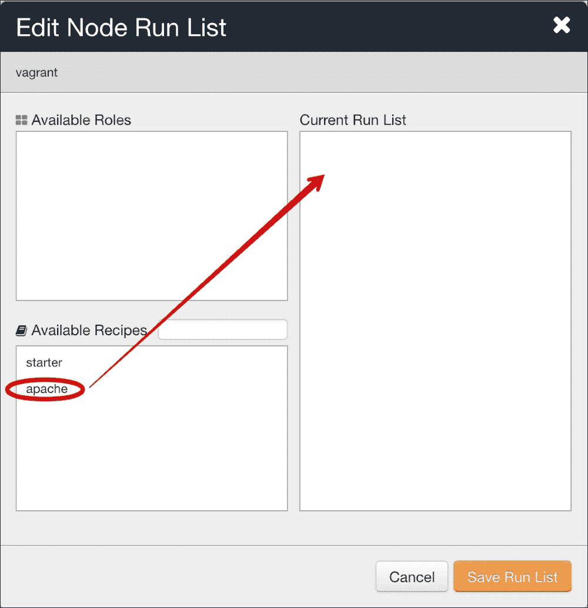

# 第六章。使用 Chef 和 Puppet 管理服务器的基础知识

在本章中，我们将介绍以下配方：

+   入门（概念和工具）

+   安装 Chef 开发工具包和 Puppet 集合

+   创建一个免费的托管服务器 Chef 帐户和一个 Puppet 服务器

+   自动引导 Chef 客户端和 Puppet 代理

+   安装软件包

+   管理服务

+   管理文件，目录和模板

+   处理依赖关系

+   使用通知实现更动态的代码

+   使用 Chef 数据包和 Puppet 中的 Hiera 集中共享数据

+   创建功能角色

+   管理外部 Chef cookbooks 和 Puppet 模块

# 介绍

Chef 是一个用于自动化系统配置的开源工具，与大多数 IaaS（如 Amazon Web Services，OpenStack 或 Google Cloud）很好地集成。使用 Chef，我们在 Ruby 中编写基础设施代码，描述系统的每个方面预期如何根据多种条件行为，然后通过各种客户端工具应用它，以确保应用定义的状态。

在本章中，您将了解使用**Chef 开发工具包**（**Chef DK**）管理服务器的基本知识。您将学习如何在新服务器上引导工作中的 Chef 环境，如何安装软件包和管理服务，如何通过文件和模板生成动态配置，创建有用的功能角色，集中共享数据以动态生成内容，并展示如何表达服务之间的依赖关系，帮助它们互相通知其状态，使整个部署链有序工作。我们还将介绍如何轻松管理这些依赖关系，这将揭示如何处理由 Chef 管理的更复杂的基础设施。

为了说明所有这些特性，在本章中，我们将从头开始在 CentOS 7.x 上构建一个经典的**LAMP**（**Linux**，**Apache**，**MySQL**，**PHP**）服务器，完全自动化，使用 Chef。这样，我们将逐步构建我们的最终项目——一个带有外部依赖关系的工作 LAMP 服务器，最新社区 MySQL 5.7 版本，以及更多功能。

所有的配方都基于 Chef。然而，在可能的情况下，我们将尝试展示与 Puppet 类似工作的方式，作为 Chef 的直接替代。

# 入门（概念和工具）

Chef 是一个非常复杂的系统，有许多概念和术语，一开始可能会令人望而却步。在本章中，我们将介绍所有最重要的概念，因此它也可以作为一个快速查阅表或提醒。

### 运行 Chef

Chef 可以以多种方式使用，最重要的方式如下：

+   **客户端/服务器模式**：每个托管客户端上都运行一个代理，定期从服务器获取更新并应用它们。在此模式下，所有 Chef 代码都从 Chef 服务器分发。

+   Chef-Solo：在这种模式下，Chef 服务器的需求被去除，但代价是失去了一些功能，包括搜索、API、节点信息的持久存储等重要功能。所有 Chef 代码需要以某种方式传输，并手动应用。

### 注意

还存在其他模式，例如 Chef Zero，但它们超出了本书的范围。

多平台客户端是用 Ruby 编写的，而其服务器端则是用 Erlang 编写的。Chef 服务器是开源的（在撰写本书时采用 Apache 许可证），任何人都可以自行托管，Chef 背后的公司也提供了他们自己的托管版本，附加了更多功能和支持。

### 注意

Chef 服务器是多种技术的组合，如 PostgreSQL、RabbitMQ、Redis、Nginx 等。考虑到维护、备份和性能，部署自己的服务器时需要特别留意。

### Chef 插件

Chef 也具有高度的模块化，提供大量插件，这些插件要么来自 Chef 本身，要么来自供应商或社区。插件包括 IaaS 支持，如 AWS、OpenStack、VMware 或 Digital Ocean，到硬件管理，如 Dell、HP 或 IPMI 接口，团队工作流集成，或与系统相关的事务，如日志处理、安全性以及其他类似功能。

### Chef 组织

在 Chef 层次结构的最顶端，我们会找到一个*组织*。不同组织之间不能共享资源，通常这里会定义一个*公司*、不同的*业务单元*，甚至是故意隔离的企业*部门*。这实际上是每个人需要了解什么需要与谁共享，以便知道 Chef 组织将是什么样子的。

### Chef 节点

在 Chef 的术语中，节点是指任何由 Chef 管理的东西，无论是物理的还是虚拟的，每个节点都有一些特征或参数，这些特征或参数将在节点的生命周期中被设置或更改。

### Chef 环境

每个节点都运行在一个环境中。环境通常对应一些概念，如*开发*、*预生产*或*生产*，但也不乏创新用法来管理不同的应用程序或其他兴趣小组。环境还有一套已设置的特征。

### Chef 角色

角色通常是功能性和通用的，而不是围绕某个产品进行组织的。例如，我们会比看到*MySQL*角色更多看到*数据库*角色。其他角色可以是*监控服务器*或*负载均衡器*。

### Chef 资源

这是 Chef 中最重要的概念：资源是任何需要被设置为目标状态的系统部分。这包括需要安装或移除的软件包、需要启用或启动的服务、从模板生成的文件、需要创建或禁用的用户以及系统中的其他预期元素。

### Chef 配方

配方实际上就是普通的 Ruby 文件，其中包含一些 Chef 资源，这些资源描述了一个连贯的目标状态，比如需要安装的软件包、配置文件的编写和需要重启的服务。

### Chef 食谱

Chef 烹饪书用于将多个食谱组合成一个一致的集合，以及使其正常工作的所有其他文件。一个示例烹饪书可以是*mysql*，而这个烹饪书中的两个食谱可以是*mysql::server*来管理服务器，以及*mysql::client*来管理客户端。

### Chef 运行列表

*运行列表*是节点必须应用的角色或食谱的列表。这是由 Chef 服务器根据 chef 客户端的请求发送的。

## 还有更多…

Puppet 是由 Puppet Labs 发布的配置工具，是 Chef 的替代品。

Puppet 也可以像 Chef 一样在独立模式下工作，但我们将重点介绍客户端/服务器架构。

Puppet 基础设施主要由以下部分组成：

+   一个作为主配置服务器的 Puppet 服务器，包含所有的配置代码

+   一个运行在所有基础设施节点上的 Puppet 代理，应用配置

代理与服务器之间的通信通过 HTTPS 进行，Puppet 有自己的 PKI 用于服务器证书和客户端证书（客户端证书用于认证节点到服务器）。

Puppet 拥有自己的**领域特定语言**（**DSL**）。至于 Chef，Puppet 使用资源来安装软件包、管理服务、创建文件等。Puppet 中的一段代码叫做**清单**，它是一个`.pp`扩展名的文件。代码通过模块进行结构化。例如，我们可以想象一个`apache`模块，包含用于 Apache 安装和服务管理的资源。我们还可以有一个`mysql`模块，用于 MySQL 服务器，并包含它自己的资源。

还有一个主清单，位于任何模块之外，它是基础设施节点的列表。对于每个节点，我们可以指定使用哪些模块来执行完整的节点安装。当一个节点从服务器请求其配置时，服务器会编译该节点的*目录*，然后 Puppet 代理应用这个目录。

我们可以编写自己的模块，或使用来自 GitHub 和 Puppet Forge 的现有模块。Puppet Forge 托管了大量社区模块，其中一些由 Puppet Labs 支持。

在本章中，我们将首先编写自己的代码，以学习一些 Puppet DSL 的基础知识。然后，我们将使用来自 Puppet Forge 的模块。

# 安装 Chef 开发工具包和 Puppet 集合

Chef 生态系统的丰富程度与 Chef 本身的复杂性一样；有成千上万的工具，几乎填补了我们能想到的每一个任务。由于 Chef 是用 Ruby 编写的，所以很多这些工具也都是用 Ruby 编写的，多年来，工具、插件、代码和各种 Ruby 版本之间的依赖地狱导致了一个简单的解决方案——Chef DK。Chef DK 还带来了一些很好的工具和环境，这些工具和环境能够很好地协同工作。

我们将看到如何安装 Chef DK，并快速描述它包含的内容。

### 注意

当前的 Chef DK 版本是 1.1.16。

## 准备工作

要完成这个食谱，你将需要以下内容：

+   一个互联网连接

+   一台物理机或虚拟机

## 如何操作…

Chef DK 可以从 [`downloads.chef.io/chef-dk/`](https://downloads.chef.io/chef-dk/) 下载。大多数平台都有对应的版本：Debian、基于 Red Hat 的系统、Ubuntu 和 Windows。只需下载与你的平台相对应的安装包并安装。例如，在使用最新版 Fedora 系统，并安装 Red Hat 包时，安装过程如下：

```
$ sudo dnf install chefdk-1.1.16-1.el7.x86_64.rpm

```

验证安装是否按预期工作：

```
$ chef --version
Chef Development Kit Version: 1.1.16

```

就是这样！我们开始编写 Chef 配方所需的一切都已准备好。

### Chef DK 内容

Chef DK 包含了一些最好的工具，包括以下内容：

+   **Chef**：一个工作流工具

+   **Berkshelf**：一个做得比管理食谱依赖项更多的工具

+   **Test Kitchen**：一个功能齐全的集成测试框架

+   **ChefSpec**：用于 Chef 代码的简易单元测试

+   **FoodCritic**：用于质量和一致性的静态代码分析

Chef DK 还包含所有标准的 Chef 命令（例如，使用 `chef-solo` 或 `chef-client` 在节点上应用食谱，或使用 `knife` 操作开发者工作站上的 Chef 资源，以及其他工具）。

## 它是如何工作的…

整个 Chef 环境及其依赖项都部署在 `/opt/chefdk` 下。我们安装的包在该目录下创建了符号链接到 `/usr/bin`，该路径已在 `$PATH` 中：

```
$ ls -al /usr/bin/chef
lrwxrwxrwx. 1 root root 20 Oct  5 16:36 /usr/bin/chef -> /opt/chefdk/bin/chef

```

这种软件打包方式包括了所有依赖项，由于 Chef 强烈依赖 Ruby，因此 Chef DK 内嵌了一个 Ruby 版本，这个版本与系统中可能已安装的 Ruby 版本不会发生冲突：

```
$ /opt/chefdk/embedded/bin/ruby --version
ruby 2.3.1p112 (2016-04-26 revision 54768) [x86_64-linux]

```

## 还有更多内容…

从 Puppet 4.x 开始，Puppet Labs 提供了用于代理和服务器软件包的仓库。这些仓库被称为 **Puppet Collections**。至于 Chef，提供的包内嵌了 Ruby 版本。

本书中的所有示例都使用 Puppet 4.8（开源版本）开发。软件包可以从 [`docs.puppet.com/puppet/4.8/puppet_collections.html`](https://docs.puppet.com/puppet/4.8/puppet_collections.html) 下载。

首先，你需要在工作站上安装来自 *Puppet Collections* 的 `puppet-agent` 包。即使我们不会使用 Puppet 管理它，这些包也会安装一些在接下来的示例中需要的命令。

一旦安装了该包，所有文件都将部署在 `/opt/puppetlabs` 下：

```
$ ls -la /opt/puppetlabs/bin/puppet
lrwxrwxrwx 1 root root 20 Sep 22 18:42 /opt/puppetlabs/bin/puppet -> ../puppet/bin/puppet
$ /opt/puppetlabs/puppet/bin/ruby -version
ruby 2.1.9p490 (2016-03-30 revision 54437) [x86_64-linux]

```

为了更方便地使用嵌入式 Ruby 版本，你需要将 `/opt/puppetlabs/puppet/bin` 添加到 `$PATH` 环境变量中。例如，在 Linux 系统上，可以通过在家目录中的 `.bashrc` 文件中添加以下行来实现：

```
export PATH=/opt/puppetlabs/puppet/bin:$PATH

```

## 另见

+   Chef DK 安装文档：[`docs.chef.io/install_dk.html`](https://docs.chef.io/install_dk.html)

+   Chef DK 的 Chef 文档：[`docs.chef.io/release/devkit/`](https://docs.chef.io/release/devkit/)

# 创建一个免费的托管服务器 Chef 账户和 Puppet 服务器

在首选的 Chef 客户端/服务器模式中，我们需要一个 Chef 服务器来集中管理所有信息和操作。我们可以自己搭建一个服务器，无论是用于测试还是生产（当然这会有维护开销），或者我们可以使用由 Chef 开发公司托管的*Hosted Chef*服务器。这里你将学习如何创建一个免费的 Hosted Chef 账户，这样我们就可以尽快开始使用 Chef 编程，而无需担心服务器部分。完成这第一步后，我们将下载 Chef *入门套件*，这是一个包含完整工作 Chef 仓库的压缩包，内含示例角色和食谱，我们可以直接使用——我们将通过发送这个示例食谱到服务器，使用第一个`knife`命令。

### 注意

记住：`knife`是开发人员从工作站使用的命令，用于操作 Chef 服务器上的信息和资源。`knife`命令从未在 Chef 节点上使用。

## 准备工作

为了完成这个配方，你将需要以下内容：

+   需要一个互联网连接

+   在工作站上安装一个可用的 Chef DK

## 如何操作…

请按照以下步骤创建免费的托管服务器 Chef 账户以及 Puppet 服务器：

1.  访问[`manage.chef.io/signup`](https://manage.chef.io/signup)。

1.  填写相关信息，使用有效的电子邮件地址并进行验证。

1.  点击电子邮件中的链接以验证你的账户。

1.  创建一个你能记住的密码。

1.  创建一个新的 Chef 组织。

1.  下载*入门套件*。

1.  将入门套件解压到一个安全的位置：

    ```
    $ unzip chef-starter.zip
    Archive:  chef-starter.zip
     inflating: chef-repo/README.md
     inflating: chef-repo/cookbooks/starter/files/default/sample.txt
     inflating: chef-repo/cookbooks/starter/recipes/default.rb
     inflating: chef-repo/cookbooks/starter/attributes/default.rb
     inflating: chef-repo/cookbooks/starter/metadata.rb
     inflating: chef-repo/cookbooks/starter/templates/default/sample.erb
     inflating: chef-repo/cookbooks/chefignore
     inflating: chef-repo/.gitignore
     inflating: chef-repo/.chef/knife.rb
     inflating: chef-repo/roles/starter.rb
     inflating: chef-repo/.chef/iacbook.pem

    ```

1.  使用`knife`命令验证与 Hosted Chef 的连接，并请求，例如，列出所有用户（这将返回你的用户）：

    ```
    $ cd chef-repo
    $ knife user list
    iacbook

    ```

1.  上传初始的`starter`食谱，仍然使用`knife`命令：

    ```
    $ knife upload cookbooks/starter
    Created cookbooks/starter

    ```

## 还有更多内容…

没有提供托管的 Puppet 服务器服务。我们需要部署自己的 Puppet 服务器。为了模拟一个小型基础架构，我们将使用 Vagrant 和 Ubuntu 虚拟机（有关 Vagrant 的更多信息，请参阅第一章，Vagrant 开发环境）。我们从一个单节点基础架构开始，仅包含一个 Puppet 服务器。以下是我们的 Vagrantfile：

```
vm_memory = 2048
vm_cpus = 2

unless Vagrant.has_plugin?("vagrant-hostmanager")
  raise 'vagrant-hostmanager is not installed!'
end 

Vagrant.configure("2") do |config|

    config.hostmanager.enabled = true
    config.hostmanager.manage_guest = true
    config.hostmanager.manage_host = true

    config.vm.define "puppet.pomes.pro" do |puppet|
        puppet.vm.box="bento/ubuntu-16.04"
        puppet.vm.hostname="puppet.pomes.pro"

        puppet.vm.provider :virtualbox do |vb|
                vb.memory = vm_memory
                vb.cpus = vm_cpus
        end

        puppet.vm.network :private_network, ip: "192.168.50.10"
        puppet.hostmanager.aliases = %w(puppet)
        puppet.vm.provision :shell, :path => "puppet_master.sh"

        puppet.vm.synced_folder "puppetcode", "/etc/puppetlabs/code/environments/production"
    end
end
```

这个 Vagrant 文件依赖于`vagrant-hostmaster`插件。如果你还没有安装该插件，你需要手动使用`vagrant plugin install vagrant-hostmanager`来安装它。这个 Vagrant 插件用于在托管的虚拟机和工作站中的`/etc/hosts`文件中创建主机条目。将使用共享文件夹直接从工作站编辑代码。

`puppet_master.sh`配置脚本如下：

```
#!/usr/bin/env bash

# Exit immediately if a command exits with a non-zero status
set -e

# puppetlabs URL
DEBREPO="https://apt.puppetlabs.com/puppetlabs-release-pc1-xenial.deb"

# Install the PuppetLabs repo
echo "Configuring PuppetLabs repo..."
debrepo=$(mktemp)
wget --output-document=${debrepo} ${DEBREPO}
dpkg -i ${debrepo}
apt-get update

# Install Puppet Server from puppetlabs
# This will remove puppet-common package provided by the vagrant box (if any)
echo "Installing Puppet..."
apt-get install -y puppetserver

# For tests, limit memory usage. 512m is enough
sed -i 's/2g/512m/g' /etc/default/puppetserver

# For tests, enable autosign for all csr
echo "autosign=true" | tee --append /etc/puppetlabs/puppet/puppet.conf

# Restart puppetserver
service puppetserver restart

# Ensure puppetserver is running and enable it on boot
/opt/puppetlabs/bin/puppet resource service puppetserver ensure=running enable=true

echo "Puppet server installed!"
```

在此示例中，我们使用的是来自 Puppet Labs 的*Puppet Collections*仓库中的捆绑 Puppet 服务器。为了简化操作并遵循本章中的配方，我们启用了自动签名功能。这意味着，当 Puppet 节点第一次连接服务器时，节点会生成一个 CSR（证书签名请求），并且 Puppet 服务器会自动签署它：随后的请求将被认证和加密。

让我们创建共享文件夹并启动 Vagrant：

```
mkdir puppetcode
vagrant up

```

我们现在有一个监听在 `192.168.50.10` 上的 Ubuntu Puppet 服务器，FQDN 为 `puppet.pomes.pro`。一个简短的名称 puppet 也已可用，并由 `vagrant-hostmanager` 插件填充。

### 注意

根据你的`sudo`配置，Vagrant 可能会要求你输入密码。这是由 `vagrant-hostmanager` 插件请求的，用于在你的工作站的`/etc/hosts`文件中创建条目。

# 自动引导 Chef 客户端和 Puppet 代理

当我们开始使用 Chef 时，首先要做的事情是确保 Chef 客户端已经在目标远程服务器上启动。为了让 Chef 客户端能够应用 Chef 代码，它首先需要在 Chef 服务器上进行配置和注册。幸运的是，这个过程非常简单。

## 准备中

要完成这个食谱，你需要以下内容：

+   一台有 SSH 访问权限的远程服务器和用户

+   工作站上需要有一个有效的 Chef DK 安装

## 如何操作……

假设我们已经有一个在某个地方运行的服务器，并且有一个可用的用户。我们可以构建的最小命令行如下：

+   我们想要配置的主机的 IP 或 FQDN（`1.2.3.4`）

+   在 Chef 服务器上注册节点的名称（`my_node_hostname`）

+   用于连接到服务器的用户名（如果不是 root，则使用 `sudoer`）。

在工作站上导航到 Chef 仓库：

```
$ cd chef-repo

```

现在，让我们从工作站上通过远程方式在远程主机上安装 Chef 客户端，以一个示例的`vagrant`用户为例：

```
$ knife bootstrap 1.2.3.4 -N my_node_hostname -x vagrant --sudo

```

这将首先下载最新版本的 Chef 并安装它。然后，它将执行一次初始的`chef-client`运行，将节点在指定的名称下注册到 Chef 服务器。到这里将停止。

如果我们希望在引导完成后立即运行一个 cookbook（我们大概会想这样做），只需使用 `-r` 选项将 cookbooks 添加到运行列表，这样它们会立即执行。我们可以使用本章之前上传的 `starter` cookbook，但也可以使用任何其他你可能已经同步到 Chef 服务器上的 cookbook。

```
$ knife bootstrap 1.2.3.4 -N my_node_hostname -x vagrant --sudo -r "starter" 
[...]
192.168.146.129 resolving cookbooks for run list: ["starter"]
[...]
192.168.146.129 Recipe: starter::default
192.168.146.129   * log[Welcome to Chef, Sam Doe!] action write

```

## 还有更多……

使用 Puppet，在创建节点后我们需要安装 Puppet 代理。让我们在之前用于 Puppet 服务器的 Vagrantfile 中添加一个新节点：

```
vm_memory = 2048
vm_cpus = 2

unless Vagrant.has_plugin?("vagrant-hostmanager")
  raise 'vagrant-hostmanager is not installed!'
end 

Vagrant.configure("2") do |config|

    config.hostmanager.enabled = true
    config.hostmanager.manage_guest = true
    config.hostmanager.manage_host = true

    config.vm.define "puppet.pomes.pro" do |puppet|
        puppet.vm.box="bento/ubuntu-16.04"
        puppet.vm.hostname="puppet.pomes.pro"

        puppet.vm.provider :virtualbox do |vb|
                vb.memory = vm_memory
                vb.cpus = vm_cpus
        end

        puppet.vm.network :private_network, ip: "192.168.50.10"
        puppet.hostmanager.aliases = %w(puppet)
        puppet.vm.provision :shell, :path => "puppet_master.sh"

        puppet.vm.synced_folder "puppetcode", "/etc/puppetlabs/code/environments/production"
    end

 config.vm.define "web.pomes.pro" do |web|
 web.vm.box="bento/ubuntu-16.04"
 web.vm.hostname="web.pomes.pro"

 web.vm.network :private_network, ip: "192.168.50.11"

 web.vm.provision :shell, :path => "puppet_node.sh"
 end
end
```

如你所见，现在有另一个 shell 脚本 `puppet_node.sh` 用于新节点的配置：

```
#!/usr/bin/env bash

# Exit immediately if a command exits with a non-zero status
set -e

# puppetlabs URL
DEBREPO="https://apt.puppetlabs.com/puppetlabs-release-pc1-xenial.deb"

# Install the PuppetLabs repo
echo "Configuring PuppetLabs repo..."
debrepo=$(mktemp)
wget --output-document=${debrepo} ${DEBREPO}
dpkg -i ${debrepo}
apt-get update

# Install Puppet Agent from puppetlabs
# This will remove puppet-common package provided by the vagrant box
echo "Installing Agent..."
apt-get install -y puppet-agent

# Ensure puppet agent is stopped for our tests
/opt/puppetlabs/bin/puppet resource service puppet ensure=stopped enable=false

echo "Puppet agent installed!"
```

我们现在还拥有一个 Ubuntu Puppet 节点，其 FQDN 为 `web.pomes.pro`，IP 地址为 `192.168.50.11`。默认情况下，Puppet 代理会寻找名为 puppet 的服务器——这就是为什么这个名称被定义为 Puppet 服务器的别名。

### 注意

Puppet 代理已经被明确停止；在示例过程中，我们将根据需要启动它，以查看所有更改。

# 安装软件包

我们需要为服务器安装一些软件包。现在我们的服务器已经配置为使用 Chef 并与 Chef 服务器通信，接下来让我们安装一些软件包，如 Apache 服务器、PHP 和 MariaDB，在 CentOS 7.2 服务器上搭建经典的 LAMP 服务器。

## 准备中

要完成这个食谱，你需要以下内容：

+   工作站上安装了可用的 Chef DK

+   远程主机上的工作 Chef 客户端配置

## 如何操作……

要在基于 Red Hat 的系统上安装软件包，我们将使用`yum`（直到 CentOS 7）或`dnf`（Fedora 22 及其之后版本）。由于我们使用的是 CentOS 7 服务器，Apache2 HTTP 服务器包的名称是`httpd`（在基于 Debian 的系统中是`apache2`）。手动安装时，我们会输入以下内容：

```
$ dnf install httpd
$ yum install httpd

```

让我们看看这如何转化为一个可重复的过程，使用 Chef 食谱。

### 生成一个空的 Apache 食谱

让我们从 Chef 仓库的`cookbooks`文件夹中开始创建一个空的食谱，使用`chef`命令安装 Apache2：

```
$ cd chef-repo/cookbooks
$ chef generate cookbook apache
Generating cookbook apache
[...]
Your cookbook is ready. Type `cd apache` to enter it.
[...]
If you'd prefer to dive right in, the default recipe can be found at:
recipes/default.rb

```

现在我们需要告诉 Chef 使用`package`资源安装一个软件包。

打开`apache/recipes/default.rb`文件并输入以下内容：

```
package "httpd"
```

这是我们告诉 Chef 安装软件包的最基本方法。默认情况下，这将执行`install`操作。为了更加全面一些，我们可以使用完整的代码块来做同样的事：

```
package "httpd" do
  action :install
end
```

### 上传食谱

仍然在 Chef 仓库内，我们现在需要将这个新的`apache`食谱上传到 Chef 服务器，以便我们的服务器可以访问它。为此，我们在工作站上使用`knife`命令：

```
$ knife cookbook upload apache
Uploading apache         [0.1.0]
Uploaded 1 cookbook.

```

我们刚刚在 Chef 服务器上上传了我们的第一个食谱！

让我们确认食谱已经在 Chef 服务器上远程可用：

```
$ knife cookbook list
apache    0.1.0
starter   1.0.0

```

### 应用食谱

现在我们已经远程获得了`apache`食谱，让我们告诉 Chef 服务器，特定的节点必须运行它。这里有两个选项：

+   在 Chef 服务器 UI 中，选择主机并点击**编辑**按钮，在**运行列表**框中，然后将正确的食谱名称拖放到**当前运行列表**列中：

+   从工作站的`knife`命令行界面，运行以下命令：

    ```
    $ knife node run_list add <nodename> apache
    nodename:
     run_list: recipe[apache]

    ```

无论如何，我们刚刚告诉 Chef 服务器在这台特定的服务器上应用`apache`食谱。让我们在远程节点上启动 Chef 客户端：

```
$ sudo chef-client
Starting Chef Client, version 12.15.19
resolving cookbooks for run list: ["apache"]
Synchronizing Cookbooks:
 - apache (0.1.0)
Installing Cookbook Gems:
Compiling Cookbooks...
Converging 1 resources
Recipe: apache::default
 * yum_package[httpd] action install
 - install version 2.4.6-40.el7.centos.4 of package httpd

Running handlers:
Running handlers complete
Chef Client finished, 1/1 resources updated in 32 seconds

```

Chef 已经为我们安装了 Apache HTTP 服务器包！如果我们启动 Chef 客户端，它不会再次安装，因为它知道已经安装了（看看执行时间的巨大差异）：

```
$ sudo chef-client
[...]
Recipe: apache::default
 * yum_package[httpd] action install (up to date)
[...]
Chef Client finished, 0/1 resources updated in 04 seconds

```

验证软件包是否真的安装了：

```
$ which httpd
/usr/sbin/httpd
$ httpd -v
Server version: Apache/2.4.6 (CentOS)
Server built:   Jul 18 2016 15:30:14

```

### 创建 MariaDB 食谱

让我们利用我们的知识，像部署 Apache 一样从 Chef 仓库中创建一个 MariaDB 食谱：

```
$ chef generate cookbook cookbooks/mariadb

```

我们想要安装两个包：`mariadb`用于客户端和库，`mariadb-server`用于服务器。在`mariadb/recipes/default.rb`文件中添加以下内容：

```
package "mariadb" do
  action :install
end

package "mariadb-server" do
  action :install
end
```

或者，由于我们正在编写纯 Ruby 代码，让我们以更符合习惯的方式重写它：

```
%w(mariadb mariadb-server).each do |name|
  package name do
    action :install
  end
end
```

从工作站上传食谱：

```
$ knife cookbook upload mariadb

```

从工作站将`mariadb`食谱添加到远程节点的运行列表中：

```
$ knife node run_list add <nodename> mariadb

```

在远程主机上运行 Chef 客户端：

```
$ sudo chef-client
Starting Chef Client, version 12.15.19
resolving cookbooks for run list: ["apache", "mariadb"]
Synchronizing Cookbooks:
 - apache (0.1.0)
 - mariadb (0.1.0)
[...]
Recipe: mariadb::default
 * yum_package[mariadb] action install
 - install version 5.5.50-1.el7_2 of package mariadb
 * yum_package[mariadb-server] action install
 - install version 5.5.50-1.el7_2 of package mariadb-server
[...]
Chef Client finished, 2/3 resources updated in 25 seconds

```

验证 MariaDB 包是否正确安装：

```
$ which mysql
/usr/bin/mysql
$ mysql --version
mysql  Ver 15.1 Distrib 5.5.50-MariaDB, for Linux (x86_64) using readline 5.1

```

### 创建一个 PHP 食谱

让我们复用我们的知识，创建一个食谱来安装 PHP 支持所需的软件包：

```
$ chef generate cookbook cookbooks/php

```

让我们添加 Chef 代码，在 `cookbooks/php/recipes/default.rb` 文件中安装以下三个包：`php`、`php-cli` 和 `php-mysql` 包（分别支持 PHP、命令行和 PHP/MySQL 支持）：

```
%w(php php-mysql).each do |name|
  package name do
    action :install
  end
end
```

从工作站上传这个新的 `php` cookbook：

```
$ knife cookbook upload php

```

从工作站将 `php` cookbook 添加到远程节点的运行列表：

```
$ knife node run_list add vagrant php

```

在远程节点上运行 Chef 客户端：

```
$ sudo chef-client
$ php --version
PHP 5.4.16 (cli) (built: Aug 11 2016 21:24:59)

```

我们现在已经掌握了部署 cookbooks 和在远程节点上安装包的基本知识，使用 Chef！

## 还有更多……

使用 Puppet，通过 `package` 资源指令进行包的安装。以下示例展示了如何在 Ubuntu 系统上安装 Apache 2.x 服务器：

```
  package { 
      'apache2:
          ensure => installed;
  }
```

为了在 `web.pomes.pro` 服务器上部署 LAMP 服务器，我们需要 Apache2、PHP 和 MariaDB 服务器。为了做一个真实的示例，请执行以下步骤：

1.  使用上一节的 Vagrantfile 启动 Vagrant。

1.  进入 `puppetcode` 目录，这是工作站与 Puppet 服务器之间的共享文件夹：`cd puppetcode`

1.  我们将创建三个模块（`apache`、`php` 和 `mariadb`），因此让我们为它们创建一个简洁的模块布局：

    ```
    mkdir modules/apache
    mkdir modules/apache/manifests
    mkdir modules/apache/templates
    mkdir modules/php
    mkdir modules/php/manifests
    mkdir modules/php/templates
    mkdir modules/mariadb
    mkdir modules/mariadb/manifests
    mkdir modules/mariadb/templates

    ```

1.  创建一个 `module/apache/manifests/init.pp` 清单文件，内容如下：

    ```
    class apache {
            package {'apache2':
               ensure => present,
          }
    }
    ```

1.  创建一个 `module/php/manifests/init.pp` 清单文件，内容如下：

    ```
    class php {
            package {['php','php-mysql','libapache2-mod-php']:
               ensure => present,
          }
    }
    ```

1.  创建一个 `module/mariadb/manifests/init.pp` 清单文件，内容如下：

    ```
    class mariadb {
            package {'mariadb-server':
               ensure => present,
          }
    }
    ```

1.  最后，创建主要的清单 `manifests/site.pp`，内容如下：

    ```
    node 'web.pomes.pro' {
        class {
          'apache':;
          'php':;
          'mariadb':;
        }
    }
    ```

就这些！只需几行代码，所有必要的二进制文件就会被安装。现在我们可以使用 `puppet agent --test` 应用更改：

```
$ vagrant ssh web.pomes.pro
Welcome to Ubuntu 16.04.1 LTS (GNU/Linux 4.4.0-51-generic x86_64)
...
...
vagrant@web:~$ sudo -i
root@web:~# puppet agent --test
Info: Creating a new SSL key for web.pomes.pro
Info: Caching certificate for ca
Info: csr_attributes file loading from /etc/puppetlabs/puppet/csr_attributes.yaml
Info: Creating a new SSL certificate request for web.pomes.pro
Info: Certificate Request fingerprint (SHA256): 12:9E:DD:E5:85:C9:F2:56:92:1B:92:93:0A:3C:7B:00:DE:2A:45:C0:D9:F8:F6:D0:EC:9D:0B:6E:42:7E:74:33
Info: Caching certificate for web.pomes.pro
Info: Caching certificate_revocation_list for ca
Info: Caching certificate for ca
Info: Using configured environment 'production'
Info: Retrieving pluginfacts
Info: Retrieving plugin
Info: Caching catalog for web.pomes.pro
Info: Applying configuration version '1477085080'
Notice: /Stage[main]/Apache/Package[apache2]/ensure: created
Notice: /Stage[main]/Php/Package[php]/ensure: created
Notice: /Stage[main]/Php/Package[php-mysql]/ensure: created
Notice: /Stage[main]/Php/Package[libapache2-mod-php]/ensure: created
Notice: /Stage[main]/Mariadb/Package[mariadb-server]/ensure: created
Notice: Applied catalog in 59.77 seconds

```

### 注意

与你想象的不同，`--test` 选项确实会应用更改。此选项用于在更改后立即测试代码，并且包含其他选项，如 `--no-daemonize`、`--onetime` 和 `--verbose`。如果你只需要进行干运行（dry-run），可以使用 `--noop` 选项并结合 `–test` 使用。

## 另见

+   Chef `package` 资源文档: [`docs.chef.io/resource_package.html`](https://docs.chef.io/resource_package.html)

+   Puppet 包资源文档: [`docs.puppet.com/puppet/4.8/types/package.html`](https://docs.puppet.com/puppet/4.8/types/package.html)

# 管理服务

我们已经看到如何使用 `package` 资源安装系统包。在本节中，你将学习如何使用名为 `service` 的资源来管理系统服务。我们将继续在上一节中开始构建的 LAMP 服务器，通过 Chef 来管理 Apache HTTP 和 MariaDB 服务。这样，我们就可以管理任何可用的服务。

## 准备工作

要完成此食谱，你需要以下内容：

+   在工作站上安装一个正常工作的 Chef DK

+   在远程主机上安装并配置一个正常工作的 Chef 客户端

+   上一节中的 Chef 代码

## 如何做……

`service`资源的结构与`package`资源非常相似。我们希望对服务执行两个操作：**启用**它们在启动时运行，并**立即启动**它们。这转换为一个简单的 Chef 资源，包含一系列操作：

```
service "service_name" do
  action [:enable, :start]
end
```

### 启用并启动 Apache 服务

将此`service`资源添加到`apache/recipes/default.rb`文件中，紧接在`package`资源之后：

```
service "httpd" do
  action [:enable, :start]
end
```

在`apache/metadata.rb`文件中更新食谱版本号：

```
version '0.2.0'
```

这样，Chef 服务器将始终保持版本`0.1.0`，只包含软件包安装，而新版本`0.2.0`则包括服务支持。我们还可以轻松回滚到先前运行的版本。

### 注意

当 Chef 客户端运行时，它默认总是下载并应用最新版本。建议在适当情况下固定（或锁定）版本——特别是在生产环境中。

上传新的食谱版本：

```
$ knife cookbook upload apache

```

现在我们有两个版本的食谱都可用在 Chef 服务器上：

```
$ knife cookbook show apache
apache   0.2.0  0.1.0

```

在远程主机上应用：

```
$ sudo chef-client

```

验证 Apache 服务是否确实在运行：

```
$ systemctl status httpd

```

你还可以通过 HTTP 访问站点的 IP 地址，查看显示的默认页面。

### 启用并启动 MariaDB 服务

对`mariadb/recipes/default.rb`中的 MariaDB 的`mariadb`服务执行完全相同的操作：

```
service "mariadb" do
  action [:enable, :start]
end
```

不要忘记在`mariadb/metadata.rb`中也更新食谱版本：

```
version '0.2.0'
```

将更新后的食谱发送到 Chef 服务器：

```
$ knife cookbook upload mariadb

```

应用新的食谱：

```
$ sudo chef-client

```

确认 MariaDB 服务现在正在运行：

```
$ systemctl status mariadb

```

确认我们可以从节点访问 MariaDB 服务器：

```
$ mysql -e "show databases;"
+--------------------+
| Database           |
+--------------------+
| information_schema |
| test               |
+--------------------+

```

我们刚刚介绍了如何使用 Chef 管理系统服务，现在你知道如何轻松且反复地部署软件包并管理相应的服务。

## 还有更多…

使用 Puppet 时，服务也通过专门的资源指令进行管理。使用前面的示例，我们现在需要确保相应的服务正在运行。

这个资源需要在 Apache 和 MariaDB 模块中都添加。Apache 模块的新清单是：

```
class apache {
        package {'apache2':
           ensure => present,
        }

 service {'apache2':
 ensure => running,
 enable => true
 }
}
```

MariaDB 模块的新清单是：

```
class mariadb {
        package {'mariadb-server':
           ensure => present,
        }

 service {'mysql':
 ensure => running,
 enable => true
 }
}
```

`ensure=>running`属性用于检查服务是否正在运行（如果需要则启动它），而`enable=>true`用于在启动时启动服务。

### 注意

在`service`资源中使用的服务名称与在根 Shell 中停止/启动/重载服务时使用的名称相同。

## 另见

+   Chef `service`资源文档：[`docs.chef.io/resource_service.html`](https://docs.chef.io/resource_service.html)

+   Chef `metadata.rb`资源文档：[`docs.chef.io/config_rb_metadata.html`](https://docs.chef.io/config_rb_metadata.html)

+   Puppet `service`资源文档：[`docs.puppet.com/puppet/4.8/types/service.html`](https://docs.puppet.com/puppet/4.8/types/service.html)

# 管理文件、目录和模板

Chef 的一个非常有用的功能是能够直接通过 Chef 代码管理文件。可以复制普通文件，或通过模板生成动态文件。我们将利用这个功能来创建一个示例 PHP 测试文件，并动态生成 Apache 虚拟主机配置，用于我们的 LAMP 服务器，这样你就可以在其他地方复用它。

## 准备工作

要执行此配方，你需要以下内容：

+   工作站上的有效 Chef DK 安装

+   远程主机上的工作 Chef 客户端配置

+   可选的，之前食谱中的 Chef 代码

## 如何操作…

我们将以两种不同的方式管理两种不同的文件：一个静态文件和一个从模板生成的动态文件，以便涵盖最常见的用例。

### 管理一个简单的静态文件

让我们开始创建一个基本的 PHP 文件，它将仅显示 `phpinfo()` 结果。这是通过简单的 `file` 资源实现的，使用文件路径作为参数，内容直接写在其中。`file` 资源的其他可选属性包括文件的所有者信息或文件权限。将一个 `file` 资源添加到 `php/recipes/default.rb` 配方中：

```
file '/var/www/html/phpinfo.php' do
  content '<?php phpinfo(); ?>'
  mode '0644'
  owner 'root'
  group 'root'
end
```

别忘了在 `php/metadata.rb` 中更新版本号：

```
version '0.2.0'
```

从你的工作站上传新的食谱：

```
$ knife cookbook upload php

```

使用远程节点上的 Chef 客户端进行部署：

```
$ sudo chef-client

```

如果你现在访问 [`node-hostname/phpinfo.php`](http://node-hostname/phpinfo.php)，你将看到 PHP 信息被展示出来。

这是发布普通文件的最静态方式。

### 从模板中管理动态文件和目录

现在让我们创建一个通用的 Apache 虚拟主机，以便全面控制 LAMP 服务器的配置，而不仅仅是使用我们 Linux 发行版自带的默认配置。我们希望网站的根文件夹是 `/var/www/<sitename>`，配置文件将位于 `/etc/httpd/conf.d/<sitename>.conf`。我们还将发布一个示例 HTML 索引文件，以验证我们是否正在运行正确的虚拟主机。

首先，使用 `chef` 命令在 Apache 食谱中生成一个新食谱，以管理默认的虚拟主机：

```
$ chef generate recipe cookbooks/apache virtualhost 

```

现在创建了一个名为 `apache/recipes/virtualhost.rb` 的新文件。

为了存储我们的虚拟主机名称，我们来创建一个 `attribute`。属性类似于持久化的节点设置，它在一个食谱中声明，并存放在 `attribute` 目录下的文件中，之后可以通过许多机制进行覆盖，这些机制我们将稍后学习。首先，使用 `chef` 命令生成一个属性文件：

```
$ chef generate attribute cookbooks/apache default

```

这将创建一个新文件，位于 `apache/attributes/default.rb`。要设置默认值为 `defaultsite` 的 `sitename` 属性，请在此文件中添加以下内容：

```
default["sitename"] = "defaultsite"
```

要创建一个新目录，我们可以使用位于 `apache/recipes/virtualhost.rb` 文件中的名为 `directory` 的资源，并设置标准的访问权限。注意 Ruby 语法 `#{node["sitename"]}`，它用于从字符串内访问节点属性，从现在开始将会频繁使用：

```
directory "/var/www/#{node["sitename"]}" do
  owner 'root'
  group 'root'
  mode '0755'
  action :create
end
```

让我们重新利用 `file` 资源，在 `apache/recipes/virtualhost.rb` 文件中创建一个基本的 `index.html` 文件，文件内容可以是类似 `Hello from Chef!` 的简单字符串，或者是你认为更合适的内容：

```
file "/var/www/#{node["sitename"]}/index.html" do
  owner 'root'
  group 'root'
  mode '0644'
  content '<html><h1>Hello from Chef!</h1></html>'
end
```

让我们再次使用 `chef` 生成器来创建一个新的模板，用于我们的 Apache 虚拟主机配置文件：

```
$ chef generate template cookbooks/apache virtualhost

```

这将创建一个位于 `apache/templates/` 下名为 `virtuahost.erb` 的模板。这是一个标准的 **ERB**（**嵌入式 Ruby**）模板。这个模板文件将包含我们站点的虚拟主机 Apache 配置。

让我们从用一个最小的 Apache 配置文件填充这个 ERB 文件开始，使用一个新的 `website` 变量，我们稍后会设置它。

### 注意

在 ERB 模板中，变量以 `@` 字符作为前缀。

```
<VirtualHost *:80>
        ServerName <%= @website %>
        DocumentRoot /var/www/<%= @website %>
        ErrorLog /var/log/httpd/error-<%= @website %>.log
        CustomLog /var/log/httpd/access-<%= @website %>.log combined
        <Directory /var/www/<%= @website %>/ >
          Options Indexes FollowSymLinks MultiViews
          AllowOverride All
          Order allow,deny
          allow from all
        </Directory>
</VirtualHost>
```

这样，整个配置是动态的；我们可以为任何我们选择的站点名称实例化这个食谱，并且它将专门为该站点服务。

现在让我们使用 `template` 资源，从我们刚刚创建的模板生成一个文件，位于 `apache/recipes/virtualhost.rb` 文件中。这个资源接受一个 `source` 参数，即我们刚刚创建的模板文件，以及需要注入的变量。在我们的例子中，我们希望注入 `sitename` 属性的值，这样模板就可以通过 `@website` 访问它：

```
template "/etc/httpd/conf.d/#{node["sitename"]}.conf" do
  source "virtualhost.erb"
  owner 'root'
  group 'root'
  mode '0644'
  variables(
    :website => "#{node["sitename"]}"
  )
end
```

别忘了在 `apache/metadata.rb` 中更新食谱版本：

```
version '0.3.0'
```

从工作站上传食谱到 Chef 服务器：

```
$ knife cookbook upload apache

```

将新创建的食谱添加到远程节点的运行列表中：

```
$ knife node run_list add <node name> apache::virtualhost

```

在远程主机上应用新的食谱：

```
$ sudo chef-client

```

手动重启 Apache 服务器，以便让更改生效（放心，我们会在接下来的页面中自动化这个过程）：

```
$ sudo systemctl restart httpd

```

验证所提供的页面是否是我们添加的那个：

```
$ curl http://node_ip_or_hostname/
<html><h1>Hello from Chef!</h1></html>

```

干得好！我们刚刚讲解了如何使用 Chef 的纯 Ruby 代码管理文件、目录以及动态模板。

## 还有更多内容……

现在我们已经拥有了一个配置了 Puppet 的 LAMP 服务器，让我们创建一个虚拟主机吧！我们的目标如下：

+   移除 Ubuntu 提供的默认虚拟主机

+   创建我们自己的虚拟主机，指定 `DocumentRoot` 和专用的日志文件

+   部署一个简单的 PHP 页面，显示 `phpinfo()` 函数的结果。

这三个操作将通过 `file` 指令完成。

在 Ubuntu 上，我们需要移除默认的网站，以便让虚拟主机正常运行。这可以在 Apache 清单中轻松完成；通过 `file` 指令删除 `/etc/apache2/site-enabled/000-default.conf`，这将移除符号链接并禁用该站点：

```
class apache {
    package {'apache2':
       ensure => present,
    }

    service {'apache2':
       ensure => running,
       enable => true
    }

 file {'/etc/apache2/sites-enabled/000-default.conf':
 ensure => absent,
 }
}
```

现在让我们为虚拟主机生成创建代码。新虚拟主机的创建必须在 `/etc/apache2/sites-available` 中进行，并将从模板生成。有两种语言可用：

+   ERB 用于嵌入式 Ruby。

+   EPP 用于嵌入式 Puppet（Puppet 4 及以上版本）。让我们选择这个。

我们的 EPP 模板将使用两个参数：站点名称和文档根目录。让我们在 `modules/apache/templates` 目录中创建一个 `vhost.epp` 文件：

```
<VirtualHost *:80>
  ServerName <%=$website%>
  DocumentRoot <%=$docroot%>
  <Directory <%=$docroot%>>
    Order deny,allow
    Allow from all
    AllowOverride All
  </Directory>
  ErrorLog /var/log/apache2/error-<%=$website%>.log
  CustomLog /var/log/apache2/access-<%=$website%>.log combined
</VirtualHost>
```

现在我们需要实例化这个模板。最佳的做法是思考一些我们可以根据需要多次重用的东西（以防我们想要添加更多的站点）。

我们之前使用了一个`class`语句，但 Puppet 中的每个`class`在编译过程中每个清单中只能使用一次（记住，清单是节点编译的结果）。幸运的是，`define`语句用于定义一个可以多次使用的代码块。

所以让我们定义一个文件，`module/apache/manifest/vhost.pp`，它将使用这样的语句：

```
define apache::vhost (
     $website,
     $docroot
) {

  file { "/etc/apache2/sites-available/$website.conf":
     ensure  => present,
     owner   => 'root',
     group   => 'root',
     mode    => '0640',
     content => epp('apache/vhost.epp',
                     {'website' => $website, 
                      'docroot'=>$docroot}),
  }

  file { "/etc/apache2/sites-enabled/$website.conf":
     ensure  => link,
     target  => "/etc/apache2/sites-available/$website.conf",
     require => File["/etc/apache2/sites-available/$website.conf"],
  }
}
```

网站名称和文档根目录是我们`apache::vhost`语句的两个参数，并作为第一个`file`指令中与模板文件名一起传递给`epp`函数。

在 Ubuntu 中，要启用一个站点，必须在`/etc/apache2/site-enabled`中创建一个链接；第二个`file`指令将处理这一操作。

最后，我们需要在`DocumentRoot`目录下部署我们的 PHP 文件。这可以直接在主清单中使用`file`指令来创建`DocumentRoot`目录和文件本身：

```
node 'web.pomes.pro' {
    $website=$fqdn;
    $docroot="/var/www/$fqdn";

    class {
      'apache':;
      'php':;
      'mariadb':;
    }
    apache::vhost {$website:
       website => $website,
       docroot => $docroot,
    }
 file { $docroot:
 ensure => directory,
 owner  => 'www-data',
 group  => 'www-data',
 mode   => '0755',
 }
 file {"$docroot/index.php":
 ensure  => present,
 owner   => 'www-data',
 group   => 'www-data',
 mode    => '0644',
 content => "<?php phpinfo() ?>",
 }
}
```

我们现在可以再次运行 Puppet 代理。暂时，我们需要手动重启 Apache，以便我们的虚拟主机能够运行（至于 Chef，我们将在接下来的页面中自动化这一过程）：

```
root@web:~# service apache2 reload

```

现在，你应该能在`http://web.pomes.pro`看到 phpinfo 页面。

## 另见

+   Chef 文档中的属性：[`docs.chef.io/attributes.html`](https://docs.chef.io/attributes.html)

+   Chef 文档中的目录资源：[`docs.chef.io/resource_directory.html`](https://docs.chef.io/resource_directory.html)

+   Chef 文档中的文件资源：[`docs.chef.io/resource_file.html`](https://docs.chef.io/resource_file.html)

+   Chef 文档中的模板资源：[`docs.chef.io/resource_template.html`](https://docs.chef.io/resource_template.html)

+   Puppet `file`资源文档：[`docs.puppet.com/puppet/4.8/types/file.html`](https://docs.puppet.com/puppet/4.8/types/file.html)

+   使用 Puppet 模板：[`docs.puppet.com/puppet/4.8/lang_template.html`](https://docs.puppet.com/puppet/4.8/lang_template.html)

# 处理依赖关系

Chef 的一个非常巧妙的功能是能够从一个食谱中包含另一个食谱。通过这种方式，我们可以创建具有特定目的的食谱，比如一个产品或一个最终结果。例如，这样的食谱可以是一个名为*MyCloudApp*的应用程序食谱，里面包含对其他食谱（如 Apache、MySQL 等）的调用或引用。

到目前为止，我们一个接一个地将食谱添加到我们主机的运行列表中。这并不理想，特别是在管理大量节点时不太方便。这里的想法是创建一个新的食谱，专门用于一个假想的 MySite 应用程序，这个食谱会引用并依赖于所有其他食谱，这样我们只需要加载这个 MySite 食谱，就能完成所有操作。

## 准备就绪

要执行这个教程，你需要以下内容：

+   工作站上安装了 Chef DK

+   远程主机上有效的 Chef 客户端配置

+   可选地，来自前一个食谱的 Chef 代码

## 如何做到这一点……

我们知道我们想创建一个新的食谱，命名为`mysite`，以便将与使这个应用程序运行相关的所有内容集中在同一个地方。让我们使用`chef`命令来实现这一点：

```
$ chef generate cookbook cookbooks/mysite

```

为了在我们的默认食谱中包含来自另一个食谱的内容，我们将使用`include_recipe`方法，位于`mysite/recipes/default.rb`中：

```
include_recipe "apache"
include_recipe "apache::virtualhost"
include_recipe "mariadb"
include_recipe "php"
```

这告诉 Chef 加载并执行每个食谱的内容。

为了让 Chef 知道这个位置在哪里，我们需要创建对这些食谱的依赖关系。可以在`mysite/metadata.rb`文件中完成：

```
depends "apache"
depends "mariadb"
depends "php"
```

现在，我们的 MySite 食谱有了一个不错的依赖关系图：为了完全工作，它需要 Apache、MariaDB 和 PHP。这个食谱详细列出了需要运行的内容。

由于我们有一个专门为我们的应用程序制作的食谱，让我们尝试为其添加一些自定义。还记得`apache`食谱中的默认`sitename`属性吗？让我们通过在文件顶部（在 apache 食谱包含之前）添加以下内容来覆盖它，以匹配我们自己的值：

```
node.override["sitename"] = "mysite"
```

将食谱上传到 Chef 服务器：

```
$ knife cookbook upload mysite

```

使用`knife node run_list remove <node name> <recipe name>`从节点的运行列表中移除之前的食谱：

```
$ knife node run_list remove vagrant "recipe[mariadb]" "recipe[php]" "recipe[apache]" "recipe[apache::virtualhost]"

```

节点的运行列表现在为空。只需添加新的`mysite`食谱，它包含了运行所需的一切：

```
$ knife node run_list add vagrant mysite

```

下次 Chef 客户端运行时不会更改任何内容，但将来管理起来会更容易！

## 还有更多……

使用 Puppet 时，模块可以在其他模块中使用。根据之前的示例，我们可以考虑一个`mysite`模块，具有以下清单：

```
class mysite (
   $website,
   $docroot
){
    class {
      'apache':;
      'php':;
      'mariadb':;
    }
    apache::vhost {$website:
       website => $website,
       docroot => $docroot,
    }
    file { $docroot:
      ensure => directory,
      owner   => 'www-data',
      group   => 'www-data',
      mode    => '0755',
    }
    file {"$docroot/index.php":
      ensure => present,
      owner   => 'www-data',
      group   => 'www-data',
      mode    => '0644',
      content => "<?php phpinfo() ?>",
    }
}
```

我们节点的主要清单如下所示：

```
node 'web.pomes.pro' {
    class {
      'mysite':
         website     => $fqdn,
         docroot  => "/var/www/$fqdn",
    }
}
```

## 另见

+   Chef 文档关于属性的说明：[`docs.chef.io/attributes.html`](https://docs.chef.io/attributes.html)

+   Chef 食谱`metadata.rb`文档：[`docs.chef.io/config_rb_metadata.html`](https://docs.chef.io/config_rb_metadata.html)

# 使用通知的更动态的代码

如果 Chef 知道在发生变化时如何以及需要重启什么，自动完成重启，这不是很好吗？在之前的示例中，我们向节点添加了一个新的虚拟主机，并且我们不得不手动重启 Apache 以使更改生效。幸运的是，Chef 中有一个名为*notifications*的机制，当资源发生变化时，它可以帮助触发一个操作。通过这种方式，改变虚拟主机可以自动触发 Apache HTTP 服务器的重启。

## 准备工作

要完成这个食谱，你需要以下内容：

+   工作站上有效的 Chef DK 安装

+   远程主机上有效的 Chef 客户端配置

+   来自前一个食谱的 Chef 代码

## 如何做到这一点……

我们将从`apache`食谱开始，继续使用其 0.3.0 版本。现在将其版本提升到`0.4.0`，以便在`apache/metadata.rb`中从头开始：

```
version '0.4.0'
```

每个资源都可以在其状态变化时通知另一个资源执行某些操作，任何资源也可以订阅另一个资源的状态变化。在我们的案例中，我们希望 `template` 资源在虚拟主机模板变化时通知 `httpd` 系统服务重新启动，这样可以确保更改会自动生效。httpd 服务来自默认的 Apache 配方，因此最好现在就在 `apache/recipes/virtualhost.rb` 文件中包含它，这样我们可以确保这个特定的配方独立工作，而不是通过之前的包含副作用产生效果：

include_recipe 'apache::default'

1.  在 `apache/recipes/virtualhost.rb` 文件中，添加以下突出显示的通知部分：

    ```
    template "/etc/httpd/conf.d/#{node["sitename"]}.conf" do
      source "virtualhost.erb"
      owner 'root'
      group 'root'
      mode '0644'
      variables(
        :website => "#{node["sitename"]}"
      )
      notifies :restart, resources(:service => "httpd")
    end
    ```

    ### 注意

    默认情况下，操作会在 Chef 运行结束时*延迟*执行。如果我们希望操作立即发生，尽管有可能会破坏系统状态，我们可以在行末加上 `:immediately` 定时器。

1.  为了验证其工作原理，我们需要更改 `apache/templates/virtualhost.erb` 中的某些内容。在这个示例中，我只是设置了节点正在监听的本地 IP，但你可以根据自己的情况进行调整：

    ```
    <VirtualHost 192.168.146.129:80>
            ServerName <%= @website %>
            DocumentRoot /var/www/<%= @website %>
            ErrorLog /var/log/httpd/error-<%= @website %>.log
            CustomLog /var/log/httpd/access-<%= @website %>.log combined
    </VirtualHost>
    ```

1.  现在上传更新后的食谱（我们已经更新了它）：

    ```
    $ knife cookbook upload apache

    ```

1.  在节点上运行 Chef 客户端，看看魔法是如何发生的：

    ```
    $ sudo chef-client
    [...]
     * template[/etc/httpd/conf.d/defaultsite.conf] action create
     - update content in file /etc/httpd/conf.d/defaultsite.conf from 6f4d47 to 05ea5b
     --- /etc/httpd/conf.d/defaultsite.conf   2016-10-17 01:05:49.243799676 +0000
     +++ /etc/httpd/conf.d/.chef-defaultsite20161017-14052-1xt951m.conf       2016-10-17 01:10:27.452670052 +0000
     @@ -1,4 +1,4 @@
     -<VirtualHost *:80>
     +<VirtualHost 192.168.146.129:80>
     ServerName defaultsite
     DocumentRoot /var/www/defaultsite
     ErrorLog /var/log/httpd/error-defaultsite.log
    [...]
    Recipe: apache::default
     * service[httpd] action reload
     - reload service service[httpd]

    ```

有趣的是，我们甚至可以在日志中看到更改的差异，这样我们始终知道发生了什么更改，还可以看到 `httpd` 服务在更改发生后被重新加载。

我们的系统现在完全动态化，并且可以在每次变化时随意重新加载其配置。

## 还有更多…

Puppet 具有完全相同的功能，使用 `notify` 属性。当 `/etc/apache2/sites-enabled` 的内容被修改时，Apache 配置需要重新加载。

让我们更改 Apache 清单来实现这一点。

当删除默认虚拟主机时，需要重新加载 Apache 配置，因此我们需要在 `modules/apache/manifests/init.pp` 中修改相应的 `notify` 属性：

```
class apache {
    package {'apache2':
       ensure => present,
    }

    service {'apache2':
       ensure => running,
       enable => true
    }

    file {'/etc/apache2/sites-enabled/000-default.conf':
       ensure => absent,
 notify => Service['apache2'],
    }
}
```

同样的逻辑适用于虚拟主机创建（`modules/apache/manifests/vhost.pp`）：

```
define apache::vhost (
     $website,
     $docroot
) {

  file { "/etc/apache2/sites-available/$website.conf":
     ensure  => present,
     owner   => 'root',
     group   => 'root',
     mode    => '0640',
     content => epp('apache/vhost.epp', 
                      {'website' => $website, 
                       'docroot'=>$docroot}),
  }

  file { "/etc/apache2/sites-enabled/$website.conf":
     ensure  => link,
     target  => "/etc/apache2/sites-available/$website.conf",
     require => File["/etc/apache2/sites-available/$website.conf"],
 notify  => Service['apache2'],
  }
}
```

让我们尝试在全新的 Vagrant 虚拟机上运行 Puppet Agent，我们将看到这两项修改会安排重新加载配置，这将在 Puppet Agent 运行结束时执行。（参考包含 `Scheduling refresh of Service[apache2]` 和 `Triggered 'refresh' from 2 events` 的行）：

```
Notice: /Stage[main]/Apache/File[/etc/apache2/sites-enabled/000-default.conf]/ensure: removed
Info: /Stage[main]/Apache/File[/etc/apache2/sites-enabled/000-default.conf]: Scheduling refresh of Service[apache2]
...
...
Notice: /Stage[main]/Main/Node[web.pomes.pro]/Apache::Vhost[web.pomes.pro]/File[/etc/apache2/sites-enabled/web.pomes.pro.conf]/ensure: created
Info: /Stage[main]/Main/Node[web.pomes.pro]/Apache::Vhost[web.pomes.pro]/File[/etc/apache2/sites-enabled/web.pomes.pro.conf]: Scheduling refresh of Service[apache2]
Notice: /Stage[main]/Apache/Service[apache2]: Triggered 'refresh' from 2 events
Notice: Applied catalog in 45.46 seconds

```

现在我们可以访问 `http://web.pomes.pro` 上的 phpinfo 页面，而无需手动重启 Apache。

## 另见

+   Chef 的通知文档：[`docs.chef.io/resource_common.html#notifications`](https://docs.chef.io/resource_common.html#notifications)

+   Chef 的订阅文档：[`docs.chef.io/resource_common.html#subscribes`](https://docs.chef.io/resource_common.html#subscribes)

+   Puppet 的通知资源文档：[`docs.puppet.com/puppet/4.8/types/notify.html`](https://docs.puppet.com/puppet/4.8/types/notify.html)

# 使用 Chef 数据包和 Puppet 的 Hiera 中央共享数据

现在我们已经搭建好了 LAMP 基础设施，让我们通过创建一个 `htaccess` 文件并在其中添加一些授权用户来对其进行一定的安全加固。为了实现这个目标，我们可以使用不同的技术，但 Chef 中的 *数据包* 功能对我们的目标非常方便。数据包就是存储在 Chef 服务器上的 JSON 文件中的数据，可以从食谱中进行搜索。它特别适合存储需要从中心点全局访问的数据（例如用户、服务凭据、版本号、URL，甚至功能标志和其他类似的功能，具体取决于你的使用场景）。

## 准备工作

要完成这个食谱，你需要以下内容：

+   工作站上的 Chef DK 安装

+   远程主机上的工作 Chef 客户端配置

+   前面食谱中的 Chef 代码

## 如何做...

我们的目标是创建两个用户——John 和 Mary。以下是所需信息的表格：

| 用户 | 密码 | 哈希值 |
| --- | --- | --- |
| John | `p4ssw0rd` | `$apr1$AUI2Y5pj$0v0PaSlLfc6QxZx1Vx5Se` |
| Mary | `s3cur3` | `$apr1$eR7H0C5r$OrhOQUTXfUEIdvWyeGGGy/` |

### 注意

要生成加密的密码，你可以使用简单的 `htpasswd` 工具：

```
$ htpasswd -n -b mary s3cur3
mary:$apr1$eR7H0C5r$OrhOQUTXfUEIdvWyeGGGy/

```

我们想将这些信息（用户名和密码）存储在一个实体中：这就是数据包。我们将其命名为 `webusers`，并将用户信息存储在该目录下。

1.  让我们在 Chef 仓库中创建这个目录，以便于我们的版本控制系统（RCS，例如 git）：

    ```
    $ mkdir -p data_bags/webusers

    ```

1.  要在 Chef 服务器上创建数据包条目，请使用以下 `knife` 命令：

    ```
    $ knife data bag create webusers

    ```

1.  正如我们所知，条目是简单的 JSON 结构化数据。让我们将用户 John 的数据包内容写入 `data_bags/webusers/john.json`：

    ```
    {
      "id": "john",
      "htpasswd": "$apr1$AUI2Y5pj$0v0PaSlLfc6QxZx1Vx5Se."
    }
    ```

1.  我们也要在 `data_bags/webusers/mary.json` 中对 Mary 进行相同操作

    ```
    {
      "id": "mary",
      "htpasswd": "$apr1$eR7H0C5r$OrhOQUTXfUEIdvWyeGGGy/"
    }
    ```

1.  现在让我们使用 `knife` 命令将这些数据发送到 Chef 服务器：

    ```
    $ knife data bag from file webusers mary.json
    Updated data_bag_item[webusers::mary]
    $ knife data bag from file webusers john.json
    Updated data_bag_item[webusers::john]

    ```

### 注意

你可以使用 `knife` 命令查看数据包中的当前条目：

```
$ knife data bag show webusers
john
mary

```

现在数据在 Chef 服务器上全局可用，我们如何从代码内部动态访问它呢？这就是 Chef 中的 `search` 功能有用的地方，它可以帮助我们创建动态生成的内容。

在开始 `mysite` 食谱中的任何工作之前，让我们先在 `mysite/metadata.rb` 中更新版本号，确保不会破坏任何内容：

```
version '0.2.0'
```

1.  让我们在 `mysite` 食谱下创建一个新的食谱，命名为 `htaccess.rb`，以便我们可以创建 `/etc/httpd/htaccess` 下的 `htaccess` 文件（这是一个任意位置，可以根据需要进行调整），并在 web 根目录下创建 Apache 配置文件：

    ```
    $ chef generate recipe cookbooks/mysite htaccess

    ```

1.  为了使我们的条目自动填充到 `htaccess` 文件中，我们必须遍历所有现有条目。这是通过 Chef 中的 `search` 来完成的，指定数据包和搜索范围（在我们的情况下是所有内容）。这只是简单地添加到 `mysite/recipes/htaccess.rb` 文件中：

    ```
    users = search(:webusers, "*:*")
    ```

1.  这个变量`users`将被传递到模板文件中，生成内容，就像我们之前做的那样——不过这次我们有多个条目，而不仅仅是一个。我们将使用`htpasswd.erb`文件作为源文件，稍后会创建它：

    ```
    template "/etc/httpd/htpasswd" do
      source "htpasswd.erb"
      owner 'root'
      group 'root'
      mode '0660'
      variables(
        :users => users
      )
    end
    ```

1.  使用`chef`命令生成一个新的`htpasswd`文件模板：

    ```
    $ chef generate template cookbooks/mysite htpasswd

    ```

1.  在`mysite/templates/htpasswd.erb`中的这个 ERB 文件中，输入以下内容：

    ```
    <% @users.each do |user| -%>
    <%= user["id"] %>:<%= user["htpasswd"] %>
    <% end -%>
    ```

    `.each`方法循环遍历我们通过模板传递的`users`变量，依次迭代`user`，并提取我们感兴趣的两个值：`id`和`htpasswd`。

    在此过程中，让我们为`.htaccess`文件创建模板，放在我们的网站根目录下：

    ```
    $ chef generate template cookbooks/mysite htaccess

    ```

    它的内容是我们能找到的最基础的：

    ```
    AuthType Basic
    AuthName "Restricted Area"
    AuthUserFile /etc/httpd/htpasswd
    Require valid-user
    ```

    ### 注意

    目前这个模板中没有变量。因为我知道文件通常最终会变得动态，我总是倾向于将它们作为模板开始，即使当前内容是静态的。很有可能在不久的将来，我们会想为`AuthUserFile`使用变量。

1.  回到我们的`mysite/recipes/htaccess.rb`食谱，接下来我们添加刚刚创建的模板：

    ```
    template "/var/www/mysite/.htaccess" do
      source "htaccess.erb"
      owner 'root'
      group 'root'
      mode '0644'
    end
    ```

别忘了最后一步：我们必须从主食谱`default.rb`中调用这个新食谱！在`mysite/recipes/default.rb`中包含我们的新食谱，这样客户端就会加载它：

```
include_recipe "mysite::htaccess"
```

只需上传新版的食谱即可：

```
$ knife cookbook upload mysite

```

在你的节点上运行完`chef-client`后，网站将会被保护，用户`mary`和`john`将能够使用基本的 HTTP 认证。

## 还有更多内容…

使用 Puppet 时，我们可以通过 Hiera 来实现。Hiera 可以看作是一个数据存储库，将站点信息保存在清单之外。Hiera 可以定制数据的存储方式，但这超出了本章的范围；我们将使用默认配置。

首先，我们需要在 Hiera 中定义数据。这将通过在 Hiera 树中创建`web.pomes.pro.yaml`来完成：

```
$ cd puppetcode/hieradata
$ mkdir nodes
$ cat > nodes/web.pomes.pro.yaml
webusers:
 - id: john
 htpasswd: $apr1$AUI2Y5pj$0v0PaSlLfc6QxZx1Vx5Se
 - id: mary
 htpasswd: $apr1$eR7H0C5r$OrhOQUTXfUEIdvWyeGGGy/
^D

```

这个文件现在包含了授权用户的哈希数组，适用于节点`web.pomes.pro`。

从主清单文件中，我们需要使用以下代码查找 Hiera 数据：

```
$users=hiera('webusers');

```

现在很容易使用新的`apache::htpasswd` `define`语句生成密码文件，我们需要在`modules/apache/manifests/htpasswd.pp`中创建它：

```
define apache::htpasswd (
     $filepath,
     $users
) {

  file { "$filepath":
     ensure  => present,
     owner   => 'root',
     group   => 'root',
     mode    => '0644',
     content => template('apache/htpasswd.erb'),
  }
}
```

对应的模板这次我们使用一个 ERB 模板，位于`modules/apache/templates/htpasswd.erb`：

```
<% @users.each do |user| -%>
<%= user['id'] %>:<%= user['htpasswd'] %>
<% end -%>
```

从主清单文件中，我们现在可以创建密码文件：

```
apache::htpasswd{'htpasswd':
       filepath => '/etc/apache2/htpasswd',
       users    => hiera('webusers'),
}
```

我们还需要创建一个`.htaccess`文件。让我们在`modules/apache/manifests/htaccess.pp`中创建一个新的`apache::htaccess`语句：

```
define apache::htaccess (
     $filepath,
     $docroot
) {

  file { "$docroot/.htaccess":
     ensure  => present,
     owner   => 'root',
     group   => 'root',
     mode    => '0644',
     content => template('apache/htaccess.erb'),
  }
}
```

关联的模板文件位于`modules/apache/templates/htaccess.erb`：

```
AuthType Basic
AuthName "Restricted Area"
AuthUserFile <%= @filepath %>
Require valid-user
```

从主清单文件中，我们现在可以创建`.htaccess`文件：

```
apache::htaccess{"$docroot-htaccess":
   filepath => '/etc/apache2/htpasswd',
     docroot  => $docroot,
  }
```

结果是，以下是`web.pomes.pro`节点的主清单文件：

```
node 'web.pomes.pro' {
    $website=$fqdn;
    $docroot="/var/www/$fqdn";
 $users=hiera('webusers');

    class {
      'apache':;
      'php':;
      'mariadb':;
    }
    apache::vhost{$website:
       website => $website,
       docroot => $docroot,
    }
 apache::htpasswd{'htpasswd':
 filepath => '/etc/apache2/htpasswd',
 users    => hiera('webusers'),
 }
 apache::htaccess{"$docroot-htaccess":
 filepath => '/etc/apache2/htpasswd',
 docroot  => $docroot,
 }
    file { $docroot:
      ensure => directory,
      owner   => 'www-data',
      group   => 'www-data',
      mode    => '0755',
    }
    file {"$docroot/index.php":
      ensure => present,
      owner   => 'www-data',
      group   => 'www-data',
      mode    => '0644',
      content => "<?php phpinfo() ?>",
    }
}
```

运行 Puppet 代理后，`http://web.pomes.pro`现在会要求你输入登录名和密码。

## 另见

+   关于数据包的 Chef 文档：[`docs.chef.io/data_bags.html`](https://docs.chef.io/data_bags.html)

+   Puppet Hiera：[`docs.puppet.com/hiera/3.2/`](https://docs.puppet.com/hiera/3.2/)

# 创建功能性角色

到目前为止，我们已经基于特定技术创建了食谱。我们为 MariaDB 创建了一个食谱，为 Apache HTTPd 创建了一个食谱，也为我们的应用程序（包括所有依赖项）创建了一个食谱。那么这些基础设施元素各自的角色是什么呢？一个*数据库*角色可以包括目前运行我们数据库的 MariaDB，但也许明天它可以运行其他内容（迁移回 MySQL，或切换到 PostgreSQL）。由于 Chef 中的角色有专门的运行列表，通常可以看到一个角色包括产品食谱及与之相关的所有内容，比如监控。例如，角色可以做更多的事情，比如覆盖属性或为每个环境提供不同的运行列表。在这里，我们将创建两个通用的*数据库*和*webserver*角色，稍后可能会简单地在另一个仅需要这些服务的项目中复用它们，以及一个*mysite*角色，它将包括这两个角色。角色可以包括其他角色以及食谱。这样，从功能角度来看，mysite 角色就足够运行我们的基础设施了。

## 准备工作

要完成此配方，您需要以下内容：

+   工作站上的 Chef DK 安装

+   远程主机上的 Chef 客户端配置

+   前面食谱中的 Chef 代码

## 如何做……

创建功能性角色的步骤：

1.  我们可以使用普通的 JSON 或 Ruby 来编写角色。让我们尝试在`roles/webserver.rb`中为`webserver`角色使用 Ruby。它需要一个名称、描述和运行列表。这是最基本的要求：

    ```
    name "webserver"
    description "An HTTP server for our application"
    run_list "recipe[apache]"
    ```

1.  对于我们的`database`角色做同样的事情；目前我们想使用我们的`mariadb`食谱。所以让我们把它写入`roles/database.rb`：

    ```
    name "database"
    description "A database server for our application"
    run_list "recipe[mariadb]"
    ```

1.  最后，让我们写下`mysite`角色，它将包括一个 webserver、一个数据库以及它自己的食谱，写入`roles/mysite.rb`：

    ```
    name "mysite"
    description "MySite role"
    run_list(
      "role[webserver]",
      "role[database]",
      "recipe[mysite]"
    )
    ```

1.  使用`knife`命令将角色发送到 Chef 服务器：

    ```
    $ knife role from file database.rb
    Updated Role database
    $ knife role from file webserver.rb
    Updated Role webserver
    $ knife role from file mysite.rb
    Updated Role mysite

    ```

1.  现在，您可以编辑当前节点的运行列表（如果有的话），只使用这个角色（`role[mysite]`），或者如果您要为服务器引导系统，添加`-r "role[mysite]"`选项将引导 Chef 并执行带有此运行列表的 Chef：

    ```
    $ knife bootstrap 192.168.146.129 -N vagrant -x vagrant --sudo -r "role[mysite]"

    ```

现在，我们可以自由地为我们的角色添加更复杂的功能！

## 还有更多内容……

Puppet 没有提供角色功能。不过，可以通过使用*角色和配置文件*设计模式来添加一层抽象。在此模式中：

+   *角色*是定义行为的类（例如，web 服务器）。这个类需要包括创建该角色所需的所有*配置文件*。

+   *配置文件*是用于管理基础技术的类（例如，安装 Apache）。

+   在主清单中，节点只使用*角色*。

使用此模式，当技术需要更改时，只重构*配置文件*类就更容易了。

## 另请参见

+   Chef 关于角色的文档：[`docs.chef.io/roles.html`](https://docs.chef.io/roles.html)

# 管理外部 Chef 食谱和 Puppet 模块

到目前为止，我们已经编写了自己的 cookbook，它们在当前状态下相当简单。实际上，我们可能会在真实的基础设施中遇到更复杂的配置。为了帮助我们，有两种外部 cookbook 我们可以使用：社区支持的 cookbook 和由 Chef 团队直接编写和维护的 *官方* cookbook。要浏览可用的 cookbook，请访问 Chef Supermarket（可以把它看作是一个 cookbook 商店）：[`supermarket.chef.io/`](https://supermarket.chef.io/)。

问题是，随着我们下载的 cookbook 越来越多，它们每一个都有各自的依赖项，我们的生活会变得越来越复杂。幸运的是，Chef DK 配备了一个非常适合这个用例的工具——Berkshelf。

Berkshelf 允许我们在一个文件中声明 cookbook 的依赖项、版本和位置，并通过一条命令上传运行 cookbook 所需的所有内容。

在这一部分，我们将从发行版默认的、未配置的 MariaDB 包迁移到一个完全配置的 MySQL 5.7——这个工作流非常接近生产环境中使用 Chef 的日常生活。

## 准备就绪

要完成这个配方，你需要以下内容：

+   在工作站上安装一个正常工作的 Chef DK

+   远程主机上配置好的 Chef 客户端

+   之前配方中的 Chef 代码

## 如何操作…

我们从了解 Berkshelf 的工作方式开始。在 `cookbooks/mysite/` 目录下，我们找到一个名为 `Berksfile` 的文件（如果你没有使用 `chef` 工具创建 cookbook，请手动创建该文件）。由于 Berkshelf 是按 cookbook 工作的，我们将在此处声明所有要运行该特定 cookbook 的依赖项，在我们的例子中，当前所有依赖项都是本地的。在这个 `Berksfile` 中，输入以下内容：

```
source 'https://supermarket.chef.io'

metadata

cookbook 'apache', path: '../apache'
cookbook 'php', path: '../php'
cookbook 'mariadb', path: '../mariadb'
```

这告诉我们三件重要的事情：

+   如何找到未知的 cookbooks（在官方的 supermarket 上，我们可以使用我们自己的内部 supermarket，如果我们运行一个的话）

+   找到依赖项的位置：在我们 cookbook 的 metadata 文件中

+   每个 cookbook 存放的位置：在我们的例子中，是本地相对路径

在 `metadata.rb` 中更新 `mysite` cookbook 的版本，这样我们就不会干扰之前的工作，然后在 `mysite` cookbook 目录下，一次性上传我们所有 cookbook 的依赖项：

```
$ berks upload
Uploaded apache (0.5.0) to: 'https://api.chef.io:443/organizations/iacbook'
Uploaded mariadb (0.2.0) to: 'https://api.chef.io:443/organizations/iacbook'
Uploaded mysite (0.3.0) to: 'https://api.chef.io:443/organizations/iacbook'
Uploaded php (0.2.0) to: 'https://api.chef.io:443/organizations/iacbook'

```

现在我们开始意识到，它比手动逐一上传所有 cookbook 要快得多！

### 使用官方的 MySQL cookbook 及其依赖项与 Berkshelf

如我们所知，我们没有对 MariaDB 做任何特殊配置；我们只是从发行版的仓库中安装了它。这个需要改变！我们想要一个完整的 MySQL 部署。在查看 Chef Supermarket 时，我们注意到有一个官方的 MySQL cookbook 由 Chef 团队维护，目前是版本 8.0.4：[`supermarket.chef.io/cookbooks/mysql`](https://supermarket.chef.io/cookbooks/mysql)。它看起来做得很好，有很多配置选项，还有很多其他的功能。页面和页面的经过测试的、可靠的代码可以直接使用！不错。

根据 README 文件的描述，必须使用两个其他 cookbook 作为依赖项——`selinux` 和 `yum-mysql-community`。第一个是为了临时绕过 SELinux，第二个用于管理 RHEL 的官方 MySQL 社区仓库。我们可以手动解决这些依赖项，但我们有一个更好的主意：使用 `Berksfile`！

让我们从 `mysite/Berksfile` 开始，将我们对自己 `mariadb` cookbook 的依赖替换为这个 cookbook：

查找以下代码：

```
cookbook 'mariadb', path: '../mariadb'
```

用以下代码替换先前的代码：

```
cookbook 'mysql', '8.0.4'
```

这样，我们可以确保始终只运行这个特定版本的 cookbook（8.0.4），而不会运行可能在生产环境中导致问题的新版本。

1.  然后，从 `mysql` cookbook 中添加以下两个依赖项：

    ```
    cookbook 'selinux'
    cookbook 'yum-mysql-community', '~> 1.0'
    ```

    在这种情况下，我们声明了对任何版本的 `selinux` cookbook 的依赖，默认使用的是最新版本，并且对 `yum-mysql-community` 1.0 cookbook 的任何次要修订进行了宽松的约束。

1.  在 cookbook 的 `mysite/metadata.rb` 文件中，做相同的操作，并将 `mariadb` 依赖项替换为三个新的依赖项：

    ```
    depends "mysql" , '~> 8.0'
    depends "selinux"
    depends "yum-mysql-community", '~> 1.0'
    ```

1.  从 cookbook 目录中运行 `berks` 命令，获取新的 cookbook 依赖项：

    ```
    $ berks install
    Resolving cookbook dependencies...
    [...]
    Fetching cookbook index from https://supermarket.chef.io...
    Using mysql (8.0.4)
    Using selinux (0.9.0)
    Using yum-mysql-community (1.0.0)
    [...]

    ```

1.  很好！它已自动下载我们的依赖项。现在上传它们：

    ```
    $ berks upload

    ```

1.  现在，我们在 `mysite` cookbook 下创建一个新的配方，命名为 `mysql`，以便为我们的应用部署所需的 MySQL。在我们的例子中，我们需要的是最新的 MySQL 5.7，管理员密码为：`super_secure_password`。

1.  首先，在 `metadata.rb` 文件中将 cookbook 的版本提升到次要版本：

    ```
    version '0.3.1'
    ```

1.  现在生成新的 `mysql` 配方，以便我们可以使用它：

    ```
    $ chef generate recipe cookbooks/mysite mysql

    ```

1.  在新创建的 `mysite/recipes/mysql.rb` 文件中，首先包括文档中描述的所需新配方：

    ```
    include_recipe "selinux::disabled"
    include_recipe "yum-mysql-community::mysql57"
    ```

1.  然后，按照文档说明，添加以下代码块，以便在默认端口（TCP/`3306`）上完全部署 MySQL 5.7：

    ```
    mysql_service 'default' do
      port '3306'
      version '5.7'
      initial_root_password 'super_secure_password'
      action [:create, :start]
    end
    ```

    ### 注意

    这里发生的情况是，官方的 `mysql` cookbook 并没有在 cookbook 中创建任何内容。事实上，它通过提供一个 `mysql_service` 资源扩展了 Chef 的功能。在 Chef 的术语中，这称为 **LWRP**（**轻量级资源和提供者**）。

1.  最后，删除默认 `mysite` 配方中对 `mariadb` 配方的引用，并将其替换为对新 `mysql` 配方的调用：

    ```
    include_recipe "mysite::mysql"
    ```

### 在角色中包含依赖项

为了使我们的环境与 cookbook 中所做的完全匹配，让我们从 `database` 角色中删除对旧的 `mariadb` cookbook 的调用，且由于没有配方可调用（如我们所说，这个 cookbook 只是扩展了 Chef 功能），让我们改为添加文档中所述的两个 cookbook 依赖项，在 `roles/database.rb` 中进行更改：

```
name "database"
description "A database server for our application"
run_list(
  "recipe[selinux::disabled]",
  "recipe[yum-mysql-community::mysql57]"
)
```

使用 `knife` 命令上传更新后的角色：

```
$ knife role from file database.rb
Updated Role database

```

我们运行 `mysite` 角色的节点，调用数据库角色将没有问题。如果我们选择只运行包含 `mysite::default` 配方的节点，它也会正常工作。

### 使用 Berkshelf 上传 cookbook 依赖项

现在导航到`mysite`食谱目录，并使用 Berkshelf 中的`upload`功能，这样它将一次性上传所有必要的食谱：

```
$ berks upload

```

### 注意

使用 Berkshelf 时，依赖项的依赖项也会被上传！

### 测试 MySQL 部署

在节点上运行 chef-client，完成后确保我们可以使用提供的密码连接到本地 MySQL 服务器：

```
$ mysql -h 127.0.0.1 -uroot -psuper_secure_password -e "show databases;"
+--------------------+
| Database           |
+--------------------+
| information_schema |
| mysql              |
| performance_schema |
| sys                |
+--------------------+

```

## 还有更多…

使用 Puppet 时，也有很多现成的代码可以使用。我们可以使用 Puppet Forge 或 GitHub 上的模块。例如，可以使用`puppet module search`命令搜索 Puppet Forge 上的模块：

```
$ puppet module search mysql | head -10
Notice: Searching https://forgeapi.puppetlabs.com ...
NAME                  DESCRIPTION          AUTHOR            KEYWORDS
puppetlabs-mysql      Installs, con...     @puppetlabs       mysql
example42-mysql       Puppet module...     @example42        mysql
gousto-mysql          Installs, con...     @gousto 
ULHPC-mysql           Configure and...     @ULHPC            mysql
aco-mysql_yumrepo     Puppet module...     @aco              mysql
BoxUpp-mysql          A puppet modu...     @BoxUpp           mysql
rgevaert-mysql        Manage your p...     @rgevaert         mysql
rocha-mysql           Resources to ...     @rocha            mysql

```

我们可以安装其中之一：

```
$ puppet module install puppetlabs-mysql
Notice: Downloading from https://forgeapi.puppetlabs.com ...
Notice: Installing -- do not interrupt ...
/Users/me/.puppetlabs/etc/code/modules
└─┬ puppetlabs-mysql (v3.9.0)
 ├── puppet-staging (v2.0.1)
 └── puppetlabs-stdlib (v4.13.1)

```

默认情况下，安装会在主目录下的隐藏文件夹中进行。我们可以看到 Puppet Labs 的 MySQL 模块依赖于另外两个模块。

可以使用多种工具来管理软件包，r10k 就是其中之一。它还可以管理环境（如 staging、development、production），但我们本章将重点讨论软件包管理。

我们需要做的第一件事是安装 r10k。在之前的示例中，我们直接在 Vagrant 使用的共享文件夹中的工作站上编辑代码，因此我们需要直接在工作站上安装 r10k：

```
$ sudo puppet resource package r10k  provider=puppet_gem 
Notice: /Package[r10k]/ensure: created
package { 'r10k':
 ensure => ['2.5.1'],
}
$ r10k version
r10k 2.5.1

```

r10k 使用一个名为`Puppetfile`的文件，在其中声明所有必要的模块。以下是`Puppetfile`的示例：

```
forge 'http://forge.puppetlabs.com'

mod 'puppetlabs/mysql'
```

不幸的是，在写作时，r10k 不支持依赖项，因此我们需要在`Puppetfile`中发现并添加它们。我们可以通过使用`puppet module install`手动安装模块来发现依赖项，就像我们之前所做的那样。不过，这不是很方便，幸运的是，我们可以使用外部工具，例如[`github.com/rnelson0/puppet-generate-puppetfile`](https://github.com/rnelson0/puppet-generate-puppetfile)。

让我们安装它：

```
$ sudo puppet resource package generate-puppetfile provider=puppet_gem
Notice: /Package[generate-puppetfile]/ensure: created
package { 'generate-puppetfile':
 ensure => ['0.10.0'],
}

```

现在，让我们发现 Puppet Labs MySQL 模块的依赖关系：

```
$ generate-puppetfile puppetlabs/mysql

Installing modules. This may take a few minutes.

Your Puppetfile has been generated. Copy and paste between the markers:

=======================================================================
forge 'http://forge.puppetlabs.com'

# Modules discovered by generate-puppetfile
mod 'puppet/staging', '2.1.0'
mod 'puppetlabs/mysql', '3.10.0'
mod 'puppetlabs/stdlib', '4.15.0'
=======================================================================

```

我们现在已经拥有了所有的依赖关系。

假设我们想要使用之前的示例，使用我们为 Apache 编写的代码和官方的 Puppet Labs MySQL 包。

为了做到这一点，让我们调整`Puppetfile`，以便下载 Puppet Labs 的官方 Mysql 模块，并保留我们现有的模块。我们需要通知 r10k 哪些模块是*本地的*。如果不这样做，r10k 将在删除模块目录中的所有内容后进行完整安装。以下是`Puppetfile`：

```
forge 'http://forge.puppetlabs.com'

# Local modules
mod 'apache', :local =>true
mod 'php', :local =>true
mod 'mariadb', :local =>true

# Modules discovered by generate-puppetfile
mod 'puppet/staging', '2.0.1'
mod 'puppetlabs/mysql', '3.9.0'
mod 'puppetlabs/stdlib', '4.13.1'
```

现在我们需要运行 r10k 来安装软件包：

```
$ ls modules/
apache/  mariadb/ php/
$ r10k puppetfile install
$ ls modules/
apache/  concat/  mariadb/ mysql/   php/     stdlib/

```

让我们修改主清单以使用官方的 MySQL 包；我们需要删除对 MariaDB 模块的引用，并使用官方 MySQL 包提供的类：

```
node 'web.pomes.pro' {
    $website=$fqdn;
    $docroot="/var/www/$fqdn";
    $users=hiera('webusers');

    class {
      'apache':;
      'php':;
    }
 class { 'mysql::server':
 root_password => 'super_secure_password',
 }
    apache::vhost{$website:
       website => $website,
       docroot => $docroot,
    }
    apache::htpasswd{'htpasswd':
       filepath => '/etc/apache2/htpasswd',
       users    => hiera('webusers'),
    }
    apache::htaccess{"$docroot-htaccess":
       filepath => '/etc/apache2/htpasswd',
       docroot  => $docroot,
    }
    file { $docroot:
      ensure => directory,
      owner  => 'www-data',
      group  => 'www-data',
      mode   => '0755',
    }
    file {"$docroot/index.php":
      ensure => present,
      owner  => 'www-data',
      group   => 'www-data',
      mode    => '0644',
      content => "<?php phpinfo() ?>",
    }
}
```

让我们开始一个全新的 Vagrant 设置。在应用 Puppet 之后，我们现在可以使用我们在主清单中指定的 root 凭证连接 MySQL 服务器：

```
vagrant@web:~$ mysql -h 127.0.0.1 -uroot -psuper_secure_password -e "show databases;"
+--------------------+
| Database           |
+--------------------+
| information_schema |
| mysql              |
| performance_schema |
+--------------------+

```

如果需要，你可以浏览该模块的在线文档来创建自定义数据库和权限。

## 另见

+   Chef 关于角色的文档：[`docs.chef.io/roles.html`](https://docs.chef.io/roles.html)

+   Chef 超市：[`supermarket.chef.io/`](https://supermarket.chef.io/)

+   Berkshelf 文档: [`berkshelf.com/`](http://berkshelf.com/)

+   MySQL 食谱源代码在 GitHub 上: [`github.com/chef-cookbooks/mysql`](https://github.com/chef-cookbooks/mysql)

+   Puppet r10k: [`github.com/puppetlabs/r10k`](https://github.com/puppetlabs/r10k)

+   Puppet Labs MySQL 模块在 Puppet Forge 上: [`forge.puppet.com/puppetlabs/mysql`](https://forge.puppet.com/puppetlabs/mysql)
