# 第十章：维护 Docker 容器

本章将介绍以下内容：

+   使用 BATS 测试 Docker 容器

+   使用 Docker 和 ServerSpec 进行测试驱动开发（TDD）

+   从 Git 创建自动化 Docker 构建的工作流程

+   连接持续集成（CI）系统的工作流程

+   使用 Quay.io 和 Docker Cloud 扫描漏洞

+   将 Docker 日志发送到 AWS CloudWatch Logs

+   监控和获取 Docker 信息

+   使用 sysdig 调试容器

# 介绍

在本章中，我们将探索一些高级且非常有趣的领域，这些领域可能是今天大多数开发人员已经习惯的。基础设施代码仍然是代码，因此它应该与软件代码没有什么不同；同样的原则应该适用。这意味着 Docker 代码应该是可测试的，构建过程是自动的，CI 系统应连接到我们的 Git 服务器，以便它们可以持续执行这些测试。此外，安全检查应该成为强制发布流程的一部分，日志应易于访问，即使应用程序在多台机器上进行了扩展。还要注意，容器不应是黑箱，我们应该拥有高性能的调试工具来帮助我们完成工作。好消息是，这些话题将在本章中覆盖，因为所有这些都可以轻松实现。

# 使用 BATS 测试 Docker 容器

**BATS**（**Bash 自动化测试系统**）让你可以用非常自然的语言进行快速简便的测试，无需大量依赖项。根据需求，BATS 也可以随着复杂性增加。在这一部分，我们将使用 Docker 和 Docker Compose 来处理构建，并使用 Makefile 将构建过程和 BATS 测试过程之间的依赖关系绑定在一起；这样更容易将该过程稍后集成到 CI 系统中。

## 准备工作

为了进行此操作，你将需要：

+   一个正常工作的 Docker 安装

+   BATS 安装（它适用于所有主要的 Linux 发行版和 Mac OS）

### 注意

本章使用的是 BATS 版本 0.4.0。

## 如何操作……

让我们从这个简单的 Dockerfile 开始，它将安装 Apache 并在清理缓存后运行它：

```
FROM debian:stable-slim
LABEL name="apache"
LABEL maintainer="John Doe <john@doe.com>"
LABEL version=1.0
RUN apt-get update -y \
    && apt-get install -y --no-install-recommends apache2=2.4.10-10+deb8u7 \
    && apt-get clean \
    && rm -rf /var/lib/apt/lists/*
EXPOSE 80
ENTRYPOINT ["/usr/sbin/apache2ctl"]
CMD ["-D", "FOREGROUND"]
```

为了方便起见，让我们创建一个 `docker-compose.yml` 文件，这样就可以轻松构建和运行镜像：

```
version: '2'

services:
  http:
    build: .
    image: demo-httpd
    ports:
      - "80:80"
```

这样，运行 `docker-compose up` 时，如果镜像不存在，它也会进行构建。或者，如果只想构建镜像，可以使用以下命令：

```
$ docker-compose build

```

### 创建 BATS 测试

现在我们将测试该镜像应该执行的两项主要操作：

+   安装 Apache 2.4.10

+   清理 APT 缓存

首先，在我们仓库的根目录创建一个 `test` 文件夹，用于存放 BATS 测试：

```
$ mkdir test

```

我们的第一个测试是验证安装的 Apache 版本是否为 `2.4.10`，这是要求的版本。我们怎么手动验证呢？我们可能会执行以下命令并检查输出：

```
$ apache2ctl -v
Server version: Apache/2.4.10 (Debian)

```

这在 Docker 中与我们的镜像对应的命令如下（`-v` 是 `apache2ctl` `ENTRYPOINT` 指令的命令（`CMD`））：

```
$ docker run --rm demo-httpd:latest -v
Server version: Apache/2.4.10 (Debian)

```

基本上，现在我们只需运行 `grep` 来查找正确的版本：

```
$ docker run --rm demo-httpd:latest -v | grep 2.4.10
Server version: Apache/2.4.10 (Debian)

```

如果 `grep` 成功，它会返回 `0`：

```
$ echo $?
0

```

一个简单的 BATS 测试命令返回码如下：

```
@test "test title" {
  run <some command>
  [ $status -eq 0 ]
}
```

我们现在拥有编写第一个 BATS 测试所需的一切，文件路径为 `test/httpd.bats`：

```
@test "Apache version is correct" {
  run docker run --rm demo-httpd:latest -v \| grep 2.4.10
  [ $status -eq 0 ]
}
```

要执行我们的测试，让我们将包含测试的文件夹作为参数传给 BATS：

```
$ bats test

Ÿ
 Apache version is correct

1 test, 0 failures 

```

好的！我们现在已经确认正确的 Apache 版本已经安装。

让我们确保在构建镜像后清理 APT 缓存，以免浪费宝贵的空间。删除 APT 列表意味着 `/var/lib/apt/lists` 文件夹将变为空，因此，如果你在此之后统计该文件夹中的文件数量，应该返回 `0`：

```
$ ls -1 /var/lib/apt/lists | wc -l

```

然而，我们不能像处理 Apache 版本那样直接将命令发送到容器中；其入口点是 `apache2ctl`，需要在 `docker run` 命令行中通过 `sh` 进行重写。以下是 `apt.bats` 测试文件，执行的是 shell 命令而不是 `apache2ctl`，期望成功执行并返回输出 `0`：

```
@test "apt lists are empty" {
  run docker run --rm --entrypoint="/bin/sh" demo-httpd:latest -c "ls -1 /var/lib/apt/lists | wc -l"
  [ $status -eq 0 ]
  [ "$output" = "0" ]
}
```

执行 BATS 测试：

```
$ bats test
 apt lists are empty
 Apache version is correct

2 tests, 0 failures
```

### 使用 Makefile 将所有内容连接起来

现在这个过程在 CI 中可能有点繁琐，需要在测试之前做一些额外的步骤（比如镜像需要先构建并可用，然后才能进行测试）。让我们创建一个 `Makefile` 来处理这些前置工作：

```
test: bats

bats: build
  bats test

build:
  docker-compose build
```

现在，当你执行 `make test` 命令时，它将启动 `bats` 测试套件，而该套件依赖于通过 `docker-compose` 构建镜像——这是一个更简单的命令，可以更好地集成到你选择的 CI 系统中：

```
$ make test
docker-compose build
Building http
Step 1 : FROM debian:stable-slim
 ---> d2103c196fde
[...]
Successfully built 1c4f46316f19
bats test

. apt lists are empty
. Apache version is correct
 2 tests, 0 failures

```

## 另请参见

+   BATS 的相关信息见 [`github.com/sstephenson/bats`](https://github.com/sstephenson/bats)

# 使用 Docker 和 ServerSpec 进行测试驱动开发（TDD）

Docker 容器可能使用更简化的语言，但最终，通用概念依然是相同的，仍然适用。测试有助于保证质量，而先编写测试可以确保我们编写能够通过测试的代码，而不是在编写完代码后再编写测试，这样可能会错过一些错误。为了帮助我们实现这一点，我们将使用基于 RSpec 的 ServerSpec 来启动 TDD 工作流，同时编写和测试 Docker 容器。以这种方式工作通常能确保非常高的工作质量和非常可持续的容器。

## 准备就绪

为了按照这个步骤操作，你将需要：

+   一个正常工作的 Docker 安装

+   一个可用的 Ruby 环境（包括 Bundler）

## 如何实现…

我们的目标是按照 TDD 原则创建一个 NGINX 容器。在开始编码之前，让我们先设置好我们的环境。

### 使用 Bundler 创建一个 ServerSpec 环境

ServerSpec 作为一个 gem（Ruby 包）提供，并且由于我们将使用 Docker APIs，我们还需要 `docker-api` gem。为了便于部署，让我们创建一个包含依赖的 `Gemfile`，并将其放在 `test` 组中：

```
source 'https://rubygems.org'

group :test do
  gem 'serverspec'
  gem 'docker-api'
end
```

使用 Bundler 安装这些依赖：

```
$ bundle install
Using docker-api 1.33.0
Using serverspec 2.37.2
[...]
Bundle complete! 2 Gemfile dependencies, 18 gems now installed.

```

现在我们将能够在本地环境中使用 Bundler 执行 `rspec`：

```
$ bundle exec rspec

```

### 初始化测试

让我们从创建第一个 Docker Rspec 测试开始，暂时只是初始化所需的库，并在其他任何操作之前构建 Docker 镜像。它在 `spec/Dockerfile_spec.rb` 中看起来是这样的：

```
require "serverspec"
require "docker"

describe "Docker NGINX image" do
  before(:all) do
    @image = Docker::Image.build_from_dir('.')

    set :os, family: :debian
    set :backend, :docker
    set :docker_image, @image.id
  end
end
```

### TDD – 使用 Debian Jessie 基础的 Docker 镜像

我们现在希望为我们的项目使用 Debian 稳定版，目前是 Debian 8。要查看当前 Debian 系统的版本，只需查看 `/etc/debian_version` 文件（在基于 Red-Hat 的系统中，它位于 `/etc/redhat_release`）：

```
$ cat /etc/debian_version
8.6

```

很好！让我们在 ServerSpec 中创建一个定义，通过这个命令检查 Debian 版本：

```
describe "Docker NGINX image" do
[...]
  def debian_version
    command("cat /etc/debian_version").stdout
  end
end
```

现在，`debian_version` 内容可以轻松查询，例如，使用以下检查：

```
  it "installs Debian Jessie" do
    expect(debian_version).to include("8.")
  end
```

如果该系统正在运行 Debian 8，那么测试将通过。如果 `Dockerfile` 为空，则测试将失败：

```
$ bundle exec rspec --color --format documentation
Docker image
 installs Debian Jessie (FAILED - 1)

Failures:

 1) Docker image installs Debian Jessie
 Failure/Error: @image = Docker::Image.build_from_dir('.')
 Docker::Error::ServerError:
 No image was generated. Is your Dockerfile empty?

```

很好！我们的测试失败了。让我们在 Dockerfile 中写下 `FROM` 指令，使其通过；这是因为当前的 Debian 稳定版是版本 8：

```
FROM debian:stable-slim
```

保存文件并再次启动测试：

```
$ bundle exec rspec --color --format documentation
Docker NGINX image
 installs Debian Jessie

Finished in 0.72234 seconds (files took 0.29061 seconds to load)
1 example, 0 failures

```

做得好！我们的测试通过了，意味着这确实是 Debian 8。

### TDD – 安装 NGINX 包

我们的下一个目标是安装 `nginx` 包。让我们在 `Dockerfile_spec.rb` 中编写 Rspec 测试，检查这个问题。

```
describe "Docker NGINX image" do
[...]
  describe package('nginx') do
    it { should be_installed }
  end
end
```

启动测试以确保它失败：

```
$ bundle exec rspec --color --format documentation
Docker NGINX image
 installs Debian Jessie
 Package "nginx"
 should be installed (FAILED - 1)

```

现在是时候在 `Dockerfile` 中添加安装 NGINX 的指令了：

```
RUN apt-get update -y \
    && apt-get install -y --no-install-recommends nginx=1.6.2-5+deb8u4 \
    && apt-get clean \
    && rm -rf /var/lib/apt/lists/*
```

重新启动测试（这需要一些时间，因为它需要构建镜像）：

```
$ bundle exec rspec --color --format documentation
Docker NGINX image
 installs Debian Jessie
 Package "nginx"
 should be installed

Finished in 51.89 seconds (files took 0.3032 seconds to load)
2 examples, 0 failures

```

我们现在可以确定 `nginx` 包已经安装。

### TDD – 运行 NGINX

现在我们已经构建了带有 NGINX 的镜像，接下来执行它。使用 ServerSpec，我们可以通过之前构建的镜像的 `id` 属性启动容器。在 `Dockerfile_spec.rb` 文件中，创建并启动容器：

```
describe "Docker NGINX image" do
[...]
  describe 'Running the NGINX container' do
    before(:all) do
      @container = Docker::Container.create(
        'Image'      => @image.id
        )
      @container.start
    end
  end
end
```

使用标准的 ServerSpec 检查，验证是否有 NGINX 进程在运行：

```
    describe process("nginx") do
      it { should be_running }
    end 
```

我们不能仅停留在这里，还需要清理容器。我们需要在测试完成后停止它并删除它：

```
    after(:all) do
      @container.kill
      @container.delete(:force => true)
    end
```

现在我们可以运行测试，它将执行容器并在检查 `nginx` 进程时失败（因为我们没有写任何启动 `nginx` 的代码）：

```
$ bundle exec rspec --color --format documentation
Docker NGINX image
 installs Debian Jessie
 Package "nginx"
 should be installed
 Running the NGINX container
 Process "nginx"
 should be running (FAILED - 1)

```

现在让我们在容器中执行 `/usr/bin/nginx`，并将其放在前台运行，特别是在 `Dockerfile` 中：

```
EXPOSE 80
ENTRYPOINT ["/usr/sbin/nginx"]
CMD ["-g", "daemon off;"]
```

重新运行测试，检查 `nginx` 进程是否如预期般运行：

```
$ bundle exec rspec --color --format documentation
Docker NGINX image
 installs Debian Jessie
 Package "nginx"
 should be installed
 Running the NGINX container
 Process "nginx"
 should be running

Finished in 1.94 seconds (files took 0.30853 seconds to load)
3 examples, 0 failures

```

为了在 CI 系统中集成这些测试时简化操作，让我们创建一个简单的 `Makefile`：

```
test: rspec
rspec:
  bundle exec rspec --color --format documentation
```

现在，简单的 `make test` 命令将启动 ServerSpec 测试。

做得好！我们已经按照 TDD 原则构建了第一个简单的 Docker 容器。现在我们可以使用这种技术构建更复杂、更安全的容器。

## 另请参阅

+   RSpec 网址：[`rspec.info/`](http://rspec.info/)

+   Docker-api 网址：[`github.com/swipely/docker-api`](https://github.com/swipely/docker-api)

+   ServerSpec 网址：[`serverspec.org/`](http://serverspec.org/)

# 从 Git 创建自动化 Docker 构建的工作流程

构建本地容器是一个不错的选择，但它的广泛分发怎么办呢？我们可以使用 Docker Hub 服务来存储和分发我们的容器（或者其替代品 Quay.io）；然而，手动上传每一个容器及其版本很快就会成为问题。假设你需要紧急重建几十个容器，因为另一个 OpenSSL 安全漏洞的存在；没人愿意一个一个地上传它们，特别是在工作时网络连接不佳。而且，当我们使用分支和标签进行 Docker 代码工作时，看到相同的行为自动反映在远程 Docker 仓库中会非常棒。这包括 Docker Hub（或 Quay.io）的两个功能：在代码发生变化时自动构建 Docker 镜像并将它们服务给全世界。在本节中，我们将完全按照此流程操作：从我们的代码到 GitHub，再到 Docker Hub，创建一个自动构建和分发流水线。

## 准备就绪

要执行此教程，你需要：

+   一个免费的 GitHub 账户

+   一个免费的 Docker Hub 账户

+   一个 Docker 项目

## 如何操作…

我们的目标是获得一个完全工作的 Docker 构建流水线。为了实现这一目标，我们将使用两个免费的流行服务：GitHub 和 Docker Hub。让我们从上一节中帮助我们构建 NGINX 容器的代码开始；我们也可以使用任何包含至少一个可构建的 `Dockerfile` 的 GitHub 仓库。代码需要实际托管在 GitHub 上，而不仅仅是在本地使用 Git 版本控制。仓库应该如下所示：

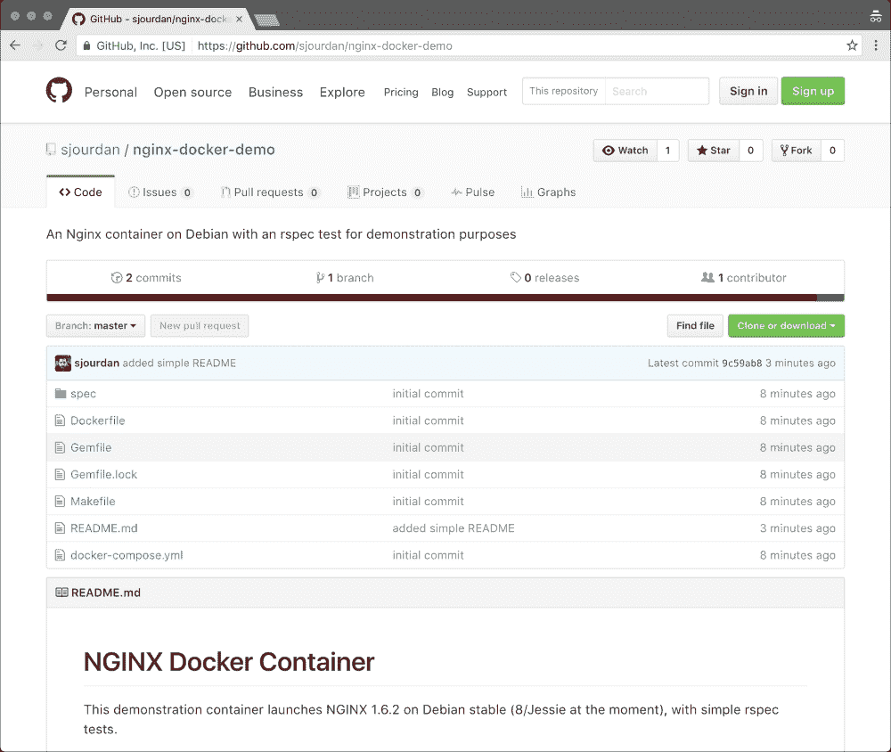

这个仓库已经准备好与其他构建服务进行通信。

### 在 Docker Hub 上创建自动构建

Docker Hub 是由创建 Docker 的公司提供的商业服务之一。它既是一个公共 Docker 镜像仓库服务（根据你的订阅，容器可以是私有的或公共的），也是一个 Docker 镜像构建服务，当代码发生变化时，它可以自动创建新的镜像。访问[`hub.docker.com`](https://hub.docker.com)，登录或者如果你没有账户，创建一个新账户。

在**创建**菜单中点击**创建自动构建**：

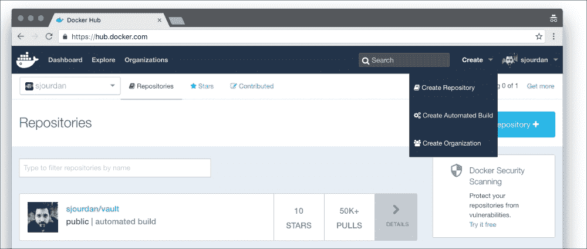

选择托管基础设施代码的提供者；在我们的例子中，是**GitHub**：

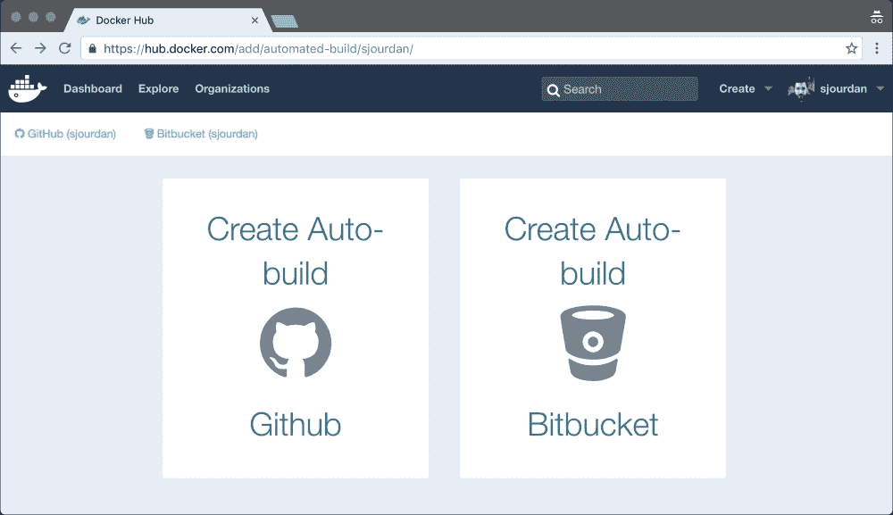

同步完成后，选择 GitHub 仓库：

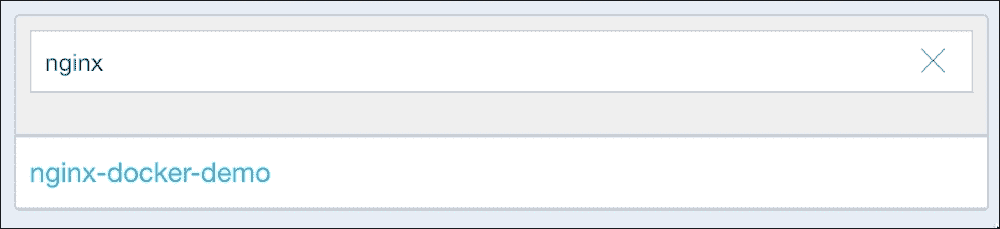

最后，决定镜像的名称（它不必是 GitHub 仓库的名称）和命名空间。命名空间可以是你的用户名，也可以是你的组织名称（如果有的话）。写一个简短的描述，并选择镜像的可见性：私人内容应保持私密，公共内容可以公开。我们在发布内容时要小心：

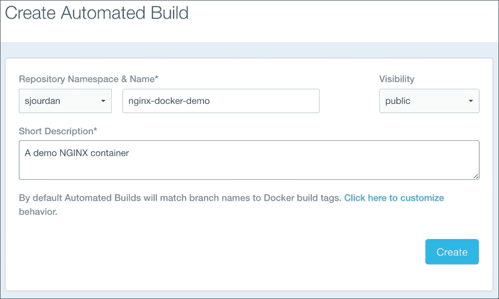

进入我们 Docker Hub 项目的**构建设置**以触发初始构建：

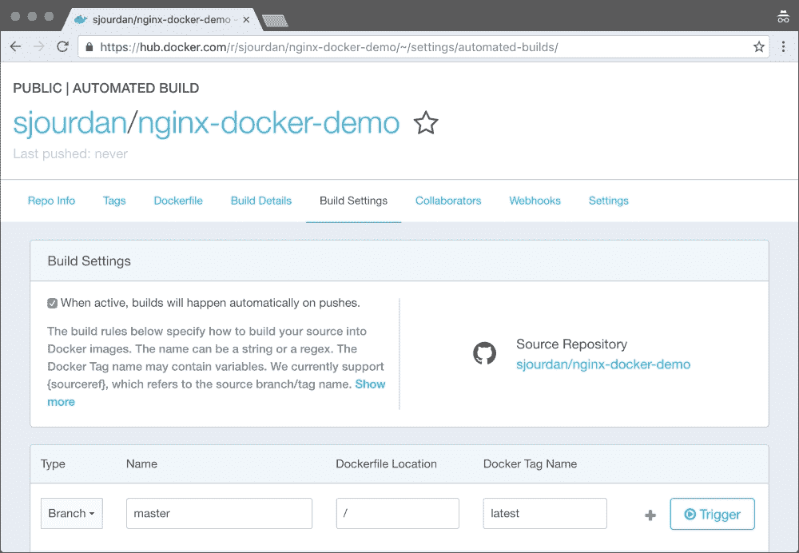

点击**触发**按钮会创建一个构建。这是通过将我们的仓库的**分支**类型设为 `master` 来完成的，并使用 `latest` 标签标记该构建。如果出于某种原因，我们的项目的 `Dockerfile` 不在根目录，我们可以在这里指定它。这个构建还允许我们管理不同的 `Dockerfile`，用于不同的目的，比如分别构建开发和生产容器等选项。

一旦构建完成（应该会在几分钟内完成），进入**标签**标签页会显示可用的标签（**latest**是我们现在唯一拥有的）和镜像的大小：

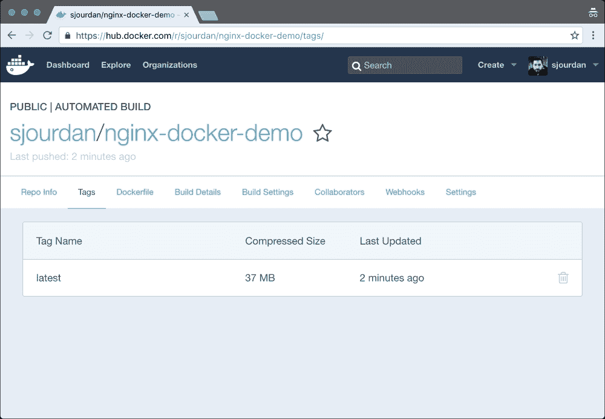

**Dockerfile**标签显示了构建镜像所使用的 `Dockerfile` 内容，而**构建详情**标签将列出所有构建及其详情，包括构建输出。这对于调试出现问题时非常有用。

### 将 GitHub 配置为 Docker Hub 自动构建管道

现在让我们修改 `Dockerfile`，例如，为镜像的名称和版本添加标签：

```
LABEL name="demo-nginx"
LABEL version=1.0
```

提交并推送此更改到 GitHub：

```
$ git add Dockerfile
$ git commit -m "added some missing labels"
[master f20017b] added some missing labels
 1 file changed, 2 insertions(+)
$ git push

```

Docker Hub 上发生了什么？它会在检测到 GitHub 上的变化后自动开始构建新镜像：

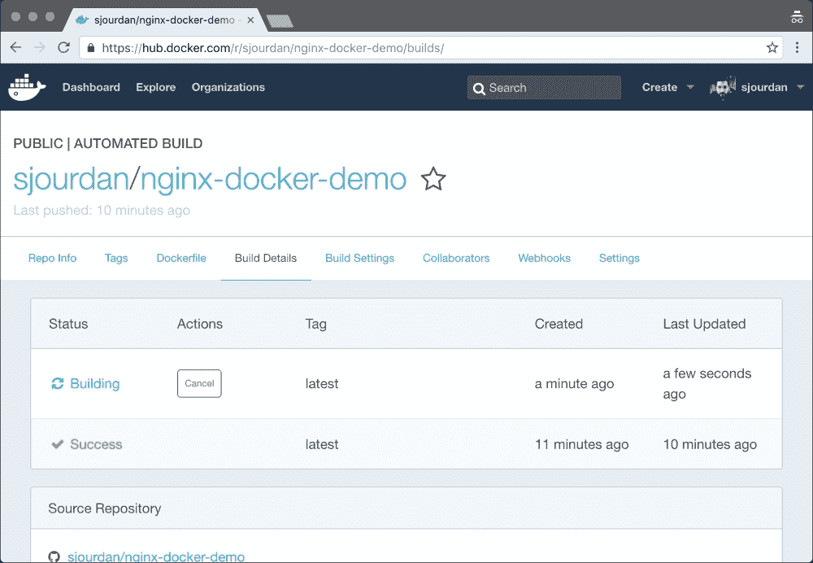

几秒钟后，我们最新的构建可以供大家使用：

```
$ docker pull sjourdan/nginx-docker-demo

```

### 使用 Git 标签构建 Docker 镜像

由于我们对这个版本满意，我们希望它作为 `1.0` 标签发布在 Docker Hub 上。为了做到这一点，我们需要完成两个操作：

+   配置 Docker Hub 根据 Git 标签而非仅仅根据分支来构建和标记

+   在 Git 上标记并推送我们的发布版本

为了让 Docker Hub 构建与我们在 Git 上设置的相同标签的镜像，让我们在**构建设置**标签中添加一个新类型，叫做**标签**。这样，Docker Hub 将会遵循我们在 Git 上设置的标签，它还会构建你将来可能创建的任何其他标签：

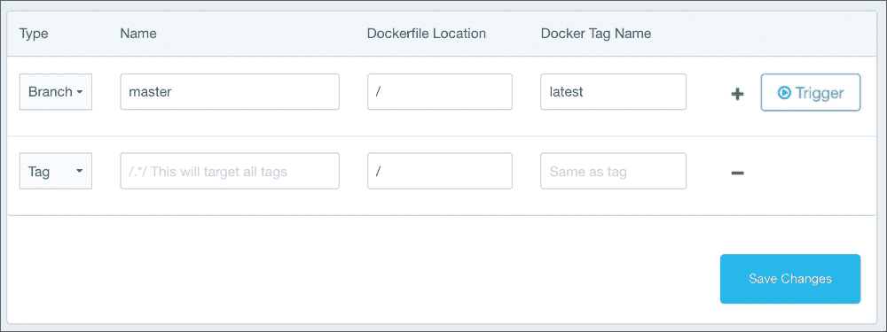

让我们在 Git 上将代码标记为 `1.0`，以便稍后引用：

```
$ git tag 1.0
$ git push --tags
Total 0 (delta 0), reused 0 (delta 0)
To https://github.com/sjourdan/nginx-docker-demo.git
 * [new tag]         1.0 -> 1.0 

```

这刚刚在 Docker Hub 上触发了一个新的构建，使用了我们要求的匹配标签**1.0**：

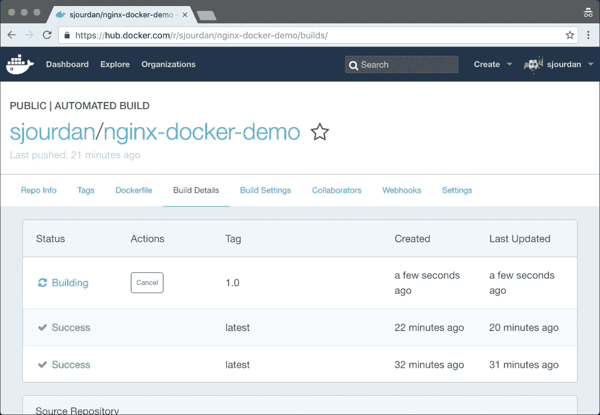

现在每个人都可以引用这个稳定版本，并且使用它时无需担心来自主分支的破坏性变更；这个分支将始终使用最新标签进行构建：

```
$ docker pull sjourdan/nginx-docker-demo:1.0

```

更好的是，从现在开始，我们未来需要同时拥有此容器和稳定性的 Docker 项目，只需在 `Dockerfile` 中加入以下一行即可：

```
FROM sjourdan/nginx-docker-demo:1.0
```

现在我们有了一个不错的初始工作流，用于构建主分支和已标记的稳定版容器。

# 连接持续集成（CI）系统的工作流

作为编写代码和测试代码的人，完全没有理由不在 CI 中执行这些测试。就像每个程序都有语言要求一样，我们的程序也需要能够构建 Docker 容器并执行一些 Ruby 代码。能够在任何代码提交时自动执行一整堆测试，是质量提升的一个重要步骤。没有人能测试每一个可能性、回归和几个月或几年以前的特殊情况。这在软件代码中是如此，在基础设施代码中也是一样。让我们找到一种优雅的自动化方法，系统性地在 CI 中执行我们的基础设施代码测试，这将是与更大蓝图连接的又一个点。

## 准备就绪

为了执行这个教程，你需要：

+   一个正常工作的 Docker 安装

+   一个免费的 Travis CI 账户

## How to do it…

我们希望每次提交 Git 更改时，能够自动执行 RSpec 集成测试。这正是 CI 系统的完美工作，如 Jenkins、Circle CI 或 Travis CI。我们唯一的要求是 CI 平台能够构建并执行 Docker 容器并运行 RSpec 测试。Travis 对 Docker 的支持很好，开箱即用。而 Jenkins 也能在正确配置后，在防火墙后正常工作，就像大多数其他 CI 系统一样。下面是如何配置 CI 平台，在新提交时自动执行测试：

1.  创建一个免费的 Travis CI 账户或使用你自己的账户 ([`travis-ci.org/`](https://travis-ci.org/))。

1.  点击 **+** 按钮以添加一个新的 GitHub 仓库：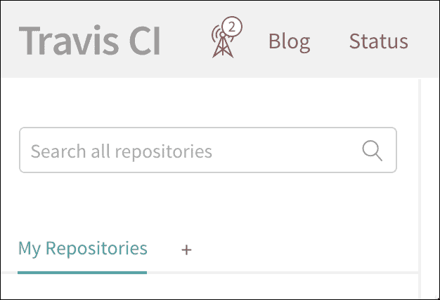

1.  启用 Travis 对仓库的监控：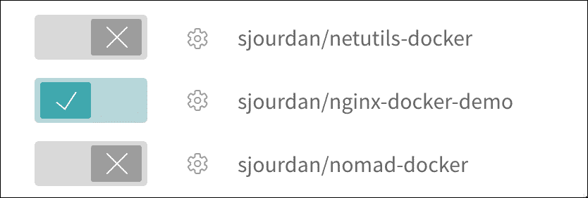

1.  现在，在仓库根目录添加一个名为 `.travis.yml` 的配置文件。这个文件可以包含很多信息来做很多事情，但现在它应该简单地告诉 Travis，我们需要在一个最近的 Linux 发行版中运行 Docker 的 Ruby 环境。同时，它应该执行 `Makefile` 中的 `make test`。在我们的案例中，这个命令将执行 RSpec 测试：

    ```
    sudo: required
    language: ruby
    dist: trusty
    services:
     - docker
    script: make test

    ```

1.  提交并推送这个文件，它将触发我们在 Travis 上的第一次测试：

    ```
    $ git add .travis.yml
    $ git commit -m "added travis.yml"
    $ git push

    ```

1.  返回到 Travis CI，我们可以看到测试开始了：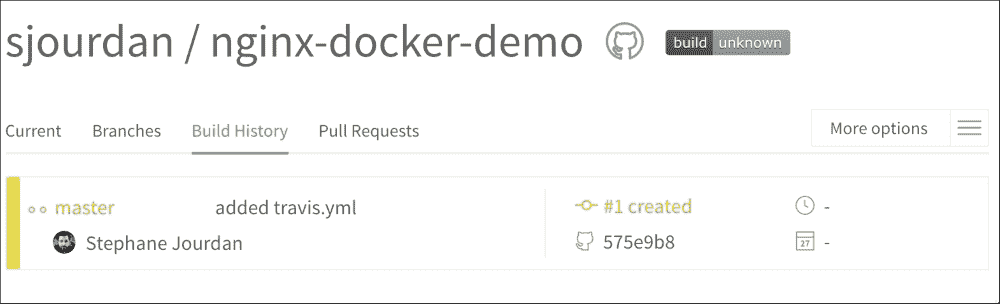

1.  几秒钟后，测试成功通过，确保构建与我们的预期一致。Travis 甚至可以轻松访问命令的输出：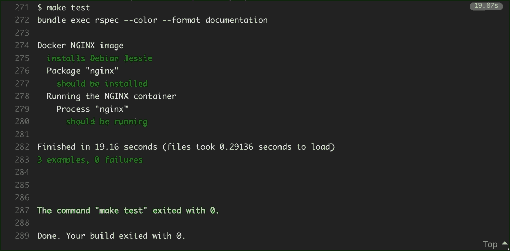

我们刚刚为将自动化测试集成到工作流中启动了新步骤。随着每个项目或团队的发展，这变得越来越重要，向生产环境中发布未经测试的容器变得更加危险。

### 注意

强烈建议你包括任何可以在这个 CI 系统中执行的其他测试，比如本书早些时候提到的 Docker linters 检查。质量只能越来越高：检查越多，效果越好。为更快的反馈循环构建更快速的测试将成为下一个主题。

和每个 CI 系统一样，测试完成后的最后一步是打包、发布和部署容器。尽管这一步令人兴奋，但遗憾的是，已经超出了本书的范围。

# 使用 Quay.io 和 Docker Cloud 扫描漏洞

使用容器时的一个主要问题是它们的弃用和维护成本。容器通常是在某一天构建的，因其正常工作而被推送到生产环境，并且被遗忘直到下一次重建（这可能不会很快发生）。库依然是库，安全修复每天都会推送到发行版的包仓库。系统管理员习惯了修补系统；然而，现在更新运行中的容器完全是反模式。容器需要重新构建，正如开发者习惯于通过更新库来重新构建应用程序以消除有问题的代码。例外的是，我们足够幸运，有工具监控我们每个 Docker 镜像的每一层，并告诉我们如何以及何时它们会变得脆弱，让我们能够简单地重新构建并重新部署它们。

## 准备工作

要完成这个教程，你需要：

+   一个正常工作的 Docker 安装

+   一个免费的 Quay.io 账户和/或 Docker Hub 的付费账户

## 如何操作……

使用免费的 Quay.io 账户（由 CoreOS 团队提供），在通过`docker login`登录后，将镜像推送到他们的 Docker Registry 服务。下面是使用本章早些时候的镜像操作的步骤：

```
$ docker tag sjourdan/nginx-docker-demo:1.0 quay.io/sjourdan/nginx-docker-demo:1.0
$ docker push quay.io/sjourdan/nginx-docker-demo:1.0
The push refers to a repository [quay.io/sjourdan/nginx-docker-demo]
82819c620e5d: Pushed
d07a4f6d2067: Pushed

```

### 注意

Quay.io 有一个非常好的安全功能：由于 Docker 将密码以明文存储在本地工作站上，因此你可以在 Quay.io 账户的**设置**标签页中生成一个加密密码，这个密码不仅可以用于 Docker，也可以用于 Kubernetes、rkt 或 Mesos。这种加密密码是登录服务的一个更好的选择。

稍等片刻，在我们镜像的**Repository Tags**标签页中，我们将看到一个**安全扫描**的总结：

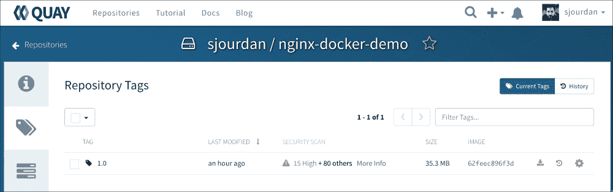

在这个示例中，我们有一些问题需要进一步调查：

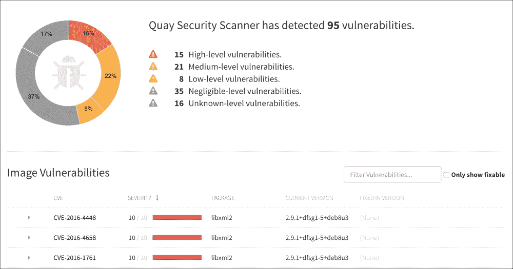

显示了许多漏洞，但不要害怕。实际上，在我们的案例中，没有漏洞是可以修复的（点击**仅显示可修复**查看可以采取的措施）。原因有很多，比如当前没有可用的修复程序，漏洞与我们运行的平台无关，等等。

这是一个非常脆弱的容器的截图，Quay.io 扫描仪提供了关于可用修复的有用建议：

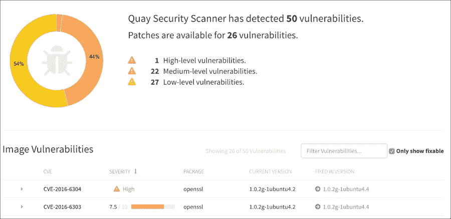

**Quay.io 安全扫描仪**还会通过电子邮件发送提醒，提供在我们账户下托管的所有容器的漏洞总结。这样我们就不必太担心错过重要的安全问题。

### 使用 Docker 安全扫描

Docker Hub 上有一个类似的功能，使用的是付费账户，尽管在撰写本文时仍处于预览阶段。默认情况下，Docker 安全扫描未激活，因此我们需要进入账户界面的账单标签页，并勾选该选项以启用它：


从现在起，每当创建或推送一个新的 Docker 镜像时，系统将迅速扫描并逐个标签报告问题。要访问报告摘要，只需点击 **标签** 标签：

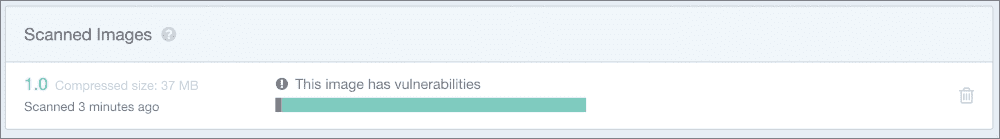

要查看详细信息（以及相应的漏洞），点击标签编号：

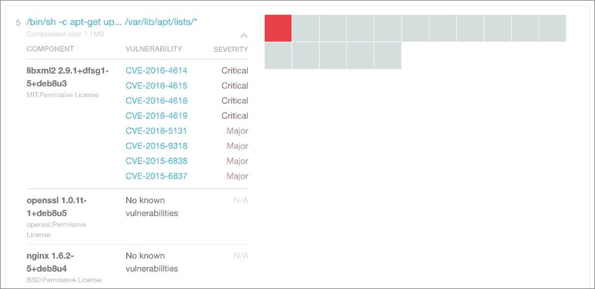

这一层有明显的问题！但不要盲目跟从，要仔细检查所说的漏洞。这个例子中的所有关键问题只涉及 Apple 平台，而我们正在运行 Linux 容器。

## 它是如何工作的…

在幕后，Quay 安全扫描器是基于 Clair 的。Clair 是一个由 CoreOS 开发的开源静态分析漏洞扫描器，我们可以自己运行或基于它构建工具。它目前处理 Debian、Ubuntu、Alpine、Oracle 和 Red Hat 的安全数据源，并提供简单的 API 接口。我们的自定义工具可以发送我们感兴趣的每个 Docker 镜像层，并获取相应的漏洞或修复信息。

## 参见

+   CoreOS Clair 在 [`github.com/coreos/clair/`](https://github.com/coreos/clair/)

# 将 Docker 日志发送到 AWS CloudWatch 日志

当我们在生产环境中运行数十或数百个容器时，尤其是在集群化的容器平台上，阅读、搜索和处理日志变得越来越困难和繁琐——就像以前容器与服务在数十或数百台物理或虚拟服务器上运行时的情况一样。问题在于，传统解决方案并不直接适用于处理 Docker 日志。幸运的是，AWS 提供了一个简单易用的日志聚合服务——AWS CloudWatch。Docker 为此提供了一个专用的日志驱动程序。我们将立刻把 Tomcat 日志发送到它！

## 准备就绪

要执行这个操作步骤，你将需要：

+   一个正常工作的 Docker 安装

+   一个 AWS 账户

## 如何操作…

要使用 AWS CloudWatch 日志，我们需要至少一个 **日志组**。可以使用本书中关于 Terraform 代码的章节来创建一个 CloudWatch 日志组和一个专用的 IAM 用户，或者手动创建二者。

### 注意

一如既往，使用 AWS 时，强烈建议为我们将使用的每对 AWS 密钥使用专用的 IAM 用户。在我们的案例中，我们可以将名为 CloudWatchLogsFullAccess 的预构建 IAM 策略与一个新的专用用户关联，以便快速并安全地启动。

Docker 守护进程需要在内存中运行 AWS 凭证——这些信息不会传递给容器，因为它由 Docker 守护进程的日志驱动程序处理。为了让 Docker 守护进程访问我们创建的密钥，让我们为 Docker 服务在 `/etc/systemd/system/docker.service.d/aws.conf` 中创建一个额外的 `systemd` 配置文件：

```
[Service]
Environment="AWS_ACCESS_KEY_ID=AKIAJ..."
Environment="AWS_SECRET_ACCESS_KEY=SW+jdHKd.."
```

别忘了重新加载 `systemd` 守护进程并重启 Docker 以应用更改：

```
$ sudo systemctl daemon-reload
$ sudo systemctl restart docker

```

我们现在可以通过 Docker 守护进程与 AWS API 进行交互。

### 使用 Docker run

这是一个简单的方式来执行 Tomcat 9 容器，使用 `awslogs` 驱动程序。利用位于 `us-east-1` 数据中心的名为 `docker_logs` 的 CloudWatch 日志组，并自动创建一个名为 `www` 的新日志流：

```
$ sudo docker run -d -p 80:8080 --log-driver="awslogs" --log-opt awslogs-region="us-east-1" --log-opt awslogs-group="docker_logs" --log-opt awslogs-stream="www" tomcat:9

```

在 AWS 控制台中导航，新的日志流将在 **Search Log Group** 下显示：

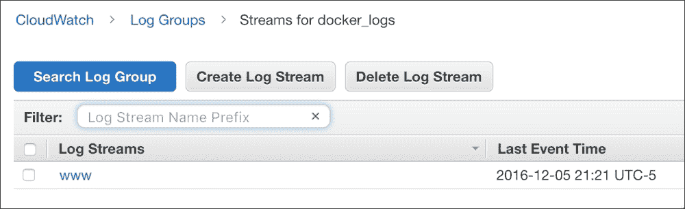

点击日志流名称将使我们能够访问来自 Tomcat 容器的所有输出日志：

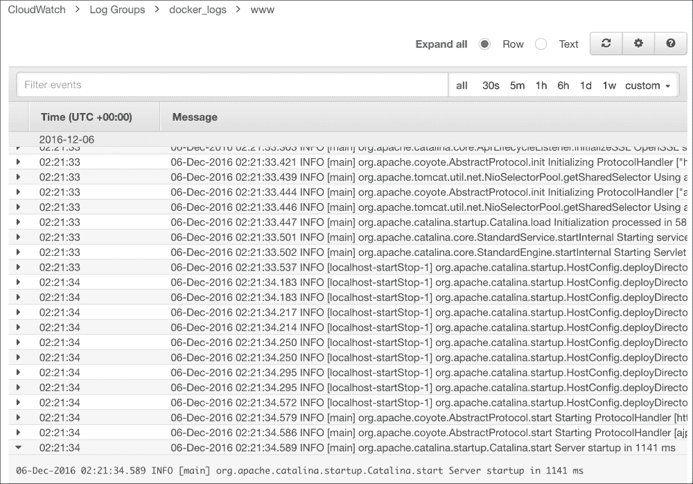

我们现在可以访问无限的日志存储和搜索功能，而且我们付出的努力非常有限！

### 使用 docker-compose

也可以使用 Docker Compose 配置日志驱动程序。以下是如何在 `docker-compose.yml` 中创建一个名为 `tomcat` 的日志流，位于同一个日志组下：

```
version: '2'

services:
  tomcat:
    image: tomcat:9
    logging:
      driver: 'awslogs'
      options:
        awslogs-region: 'us-east-1'
        awslogs-group: 'docker_logs'
        awslogs-stream: 'tomcat'
```

像往常一样启动 Compose：

```
$ sudo docker-compose up
Creating network "ubuntu_default" with the default driver
[...]
tomcat_1  | WARNING: no logs are available with the 'awslogs' log driver

```

`tomcat` CloudWatch 日志流现在自动创建，日志流入其中。

### 使用 systemd

启动容器的另一种有用方法是通过使用 systemd。以下是如何使用 systemd 单元名称（在此示例中为 `tomcat.service`）创建动态命名的日志流。这在使用多个相同容器实例的平台上非常有用，可以让它们分别发送日志。以下是一个正在运行 Docker 并将日志发送到动态分配的日志流名称的工作 Tomcat systemd 服务，在 `/etc/systemd/system/tomcat.service` 中：

```
[Unit]
Description=Tomcat Container Service
After=docker.service

[Service]
TimeoutStartSec=0
Restart=always
ExecStartPre=/usr/bin/docker pull tomcat:9
ExecStartPre=-/usr/bin/docker kill %n
ExecStartPre=-/usr/bin/docker rm %n
ExecStart=/usr/bin/docker run --rm -p 80:8080 --log-driver=awslogs --log-opt awslogs-region=us-east-1 --log-opt awslogs-group=docker_logs --log-opt awslogs-stream=%n --name %n tomcat:9
ExecStop=/usr/bin/docker stop %n

[Install]
WantedBy=multi-user.target
```

重新加载 systemd 并启动 `tomcat` 单元：

```
$ sudo systemctl daemon-reload
$ sudo systemctl start tomcat

```

现在创建了第三个日志流，带有服务名称，并且 systemd 单元的日志正在流入其中。

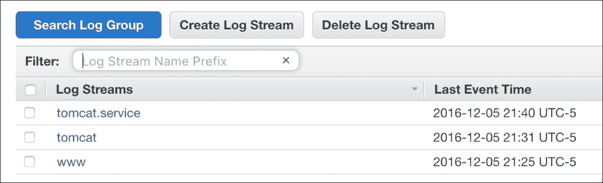

享受一种集中且强大的存储和访问日志的方式，直到最终处理它们！

## 还有更多...

Docker 守护进程不仅可以将日志流传送到 AWS，还可以传送到更常见的 syslog。这提供了许多选项（例如，可以与传统的 `rsyslog` 设置和兼容传统格式的在线服务一起使用）。类似地，它不仅将日志发送到 `journald`，还支持 Graylog 或 Logstash GELF 日志格式。还支持 Fluentd 统一日志层，同时在平台方面，支持 Splunk 和 Google Cloud 以及 AWS CloudWatch 日志。

# 监控并获取 Docker 中的信息

当出现奇怪的问题或系统性能严重下降时，通常需要快速获取一些有用的信息。系统发生了什么问题？是否有某个容器占用了所有内存？也许某个小容器崩溃了并占用了所有的 CPU。所有这些信息都不难获取，但对于构建高质量的容器来说，它们非常宝贵。我们将看到两个非常适合这项工作的工具：第一个工具是 Docker 本身自带的工具，第二个工具是谷歌推出的一个完全不同的工具——cAdvisor，它是一个提供丰富且易于获取信息的 Web 用户界面。

## 准备工作

要按照这个步骤执行，你需要：

+   一个正常工作的 Docker 安装

## 如何操作...

有几种方法可以从 Docker 中获取信息。我们将通过 Docker 主程序探索第一种方法。

### 使用 docker stats

要获取正在运行的容器的实时度量信息（CPU、内存和网络），我们可以使用简单的 `docker stats` 命令：

```
$ docker stats
CONTAINER           CPU %               MEM USAGE / LIMIT     MEM %               NET I/O               BLOCK I/O             PIDS
c2904d5b5c89        0.01%               892.9 MB / 8.326 GB   10.72%              258.2 GB / 10.27 GB   374 MB / 0 B          16
0641790f1b30        3.36%               894.4 MB / 8.326 GB   10.74%              258.2 GB / 11.12 GB   419.1 MB / 0 B        16
bc8d85e05be8        112.65%             891.4 MB / 8.326 GB   10.71%              179.6 GB / 536.5 GB   326.6 MB / 0 B        10
a7be664792b3        0.02%               45.37 MB / 8.326 GB   0.54%               17.85 GB / 17.72 GB   18.78 MB / 110.6 kB   18
ab2d4e922949        2.37%               70.34 MB / 8.326 GB   0.84%               83.15 MB / 550 MB     459.7 MB / 143.4 kB   17
08e685124dfd        0.01%               192 MB / 8.326 GB     2.31%               8.76 MB / 42.11 MB    1.499 MB / 14.05 MB   3
5893c5d6f43f        0.74%               546.1 MB / 8.326 GB   6.56%               46.74 MB / 40.22 MB   160.7 MB / 317.9 MB   74
7f21e405bdee        5.23%               8.184 MB / 8.326 GB   0.10%               30.14 GB / 30.28 GB   8.192 kB / 0 B        7

```

然而，这种方法并不是非常有帮助，因为它使用的是容器的 ID 而非名称，当运行许多容器时，这种方法可能会变得不可读，因此几乎没有用处。所以我们可以使用一个技巧：请求所有正在运行的容器的统计数据（`docker stats`）（`docker ps`）并通过 Go 模板格式化提取容器名称 `(--format)`：

```
$ docker stats $(docker ps --format '{{.Names}}')
CONTAINER                   CPU %               MEM USAGE / LIMIT     MEM %               NET I/O               BLOCK I/O             PIDS
sm_streammachine-slave_2    18.34%              889.4 MB / 8.326 GB   10.68%              258.2 GB / 10.27 GB   374 MB / 0 B          16
sm_streammachine-slave_1    28.39%              900.1 MB / 8.326 GB   10.81%              258.2 GB / 11.12 GB   419.1 MB / 0 B        16
sm_streammachine-master_1   1.89%               890.4 MB / 8.326 GB   10.69%              179.6 GB / 536.5 GB   326.6 MB / 0 B        10
sm_proxy_1                  0.02%               45.37 MB / 8.326 GB   0.54%               17.85 GB / 17.72 GB   18.78 MB / 110.6 kB   18
sm_cadvisor_1               1.62%               70.34 MB / 8.326 GB   0.84%               83.16 MB / 550 MB     459.7 MB / 143.4 kB   17
sm_analytics_1              0.01%               192 MB / 8.326 GB     2.31%               8.76 MB / 42.11 MB    1.499 MB / 14.05 MB   3
sm_elasticsearch_1          0.72%               546.1 MB / 8.326 GB   6.56%               46.74 MB / 40.22 MB   160.7 MB / 317.9 MB   74
sm_streamer_1               8.17%               8.184 MB / 8.326 GB   0.10%               30.15 GB / 30.29 GB   8.192 kB / 0 B        7

```

### 使用谷歌的 cAdvisor 工具

谷歌创建了一个很棒的 Web 工具，用于查看运行容器的机器的状态：**cAdvisor**。它收集、组织并显示有关资源使用的度量数据，按容器逐个列出，适用于给定的主机。尽管它不是交互式的，但由于安装和使用非常简单，它仍然足够强大。要安装和使用它，只需运行 cAdvisor 的 Docker 镜像，并使其能够访问所需的系统信息，像这样：

```
$ sudo docker run \
 --volume=/:/rootfs:ro \
 --volume=/var/run:/var/run:rw \
 --volume=/sys:/sys:ro \
 --volume=/var/lib/docker/:/var/lib/docker:ro \
 --publish=8080:8080 \
 --detach=true \
 --name=cadvisor \
 google/cadvisor:latest

```

或者，如果使用 `docker-compose`：

```
  cadvisor:
    volumes:
      - /:/rootfs:ro
      - /var/run:/var/run:rw
      - /sys:/sys:ro
      - /var/lib/docker/:/var/lib/docker:ro
    ports:
      - "8080:8080"
    image: google/cadvisor:latest
    restart: always
```

使用 Web 浏览器访问主机的 `8080` 端口（或你选择的任何端口）将显示一个 Web 界面，在该界面上我们可以浏览并查看主机上容器使用情况的图形信息：

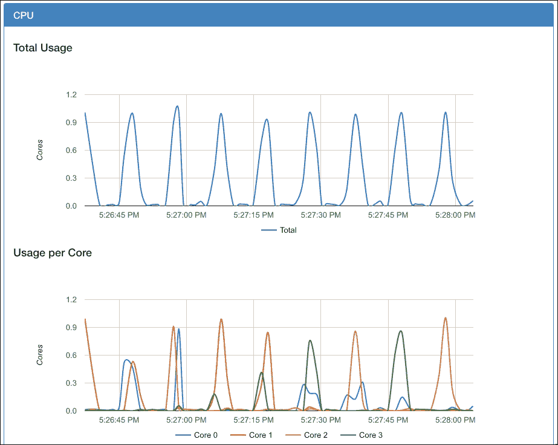

或者，我们可能有一些更通用的指标，用于实时指示资源使用情况：

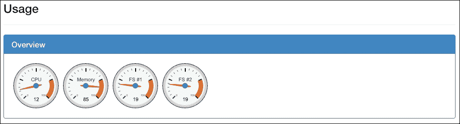

还可以通过具有容器感知上下文的主机进程表获取类似 top 的有用数据。所有这些数据都可以浏览，它们帮助你更深入地了解特定容器及其内容和使用情况：

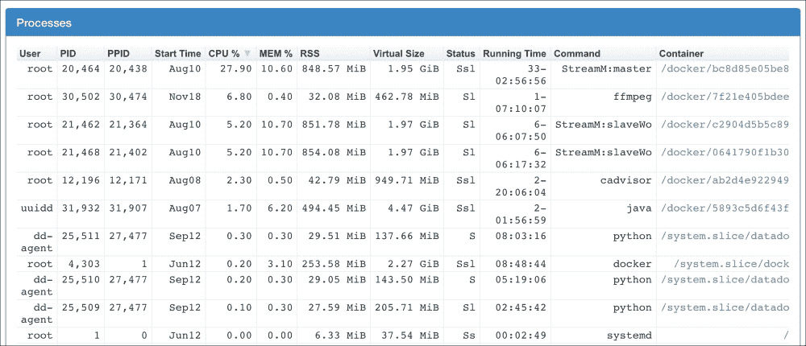

cAdvisor 还可以插入许多后端存储系统，如 Prometheus、ElasticSearch、InfluxDB、Redis、statsD 等。

### 注意

如果你打算让 cAdvisor 永久运行，最好通过简单的 HTTP 身份验证来限制访问。这是 cAdvisor 默认支持的功能，使用 `--http_auth_file /cadvisor.htpasswd --http_auth_realm my_message`。

## 参见

+   cAdvisor GitHub 地址 [`github.com/google/cadvisor`](https://github.com/google/cadvisor)

+   cAdvisor 存储后端在 [`github.com/google/cadvisor/blob/master/docs/storage/README.md`](https://github.com/google/cadvisor/blob/master/docs/storage/README.md)

# 使用 sysdig 调试容器

Sysdig 是一个非常棒的工具，可以用于许多目的，包括监控、日志记录、进程调试、网络分析以及深入探索系统。它还提供了出色的 Linux 容器支持。它是可编程的，并且可以使用已录制的真实流量数据包捕获进行离线分析。它是一个不可思议的工具，每一个与容器打交道的人都应该至少了解它的基本功能，作为习惯使用代码的基础设施开发人员，我们知道调试工具有多么重要。Sysdig 也不例外，现在我们将探索一些与容器相关的精彩功能。

## 准备开始

要按此步骤操作，您需要：

+   一个可用的 Docker 安装

+   Sysdig 已安装并在主机上运行

## 如何实现...

在大多数平台上安装 sysdig 很容易，包括 CoreOS ([`www.sysdig.org/install/`](http://www.sysdig.org/install/))。不过，如果您赶时间，下面是一个一行命令，可以完成在 Linux 主机上安装 Sysdig 的工作。当然，我们可能会选择更好的方式通过编程部署它，比如使用 Ansible 或 Chef，是否通过 Docker 容器部署也无所谓：

```
$ curl -s https://s3.amazonaws.com/download.draios.com/stable/install-sysdig | sudo bash

```

下面是如何获得系统上所有正在运行的容器的类似 htop 的视图：

```
$ sudo csysdig --view=containers

```

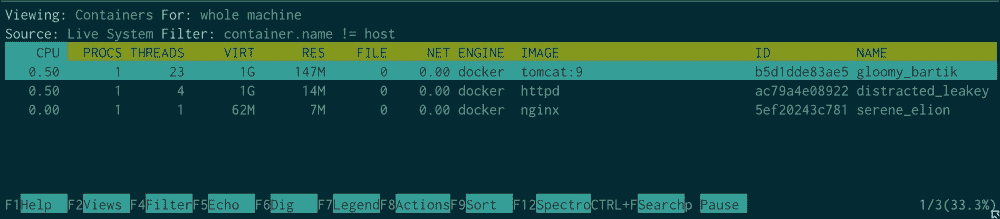

进入 **F2/Views** 菜单可以帮助您进入多个不同的选项，查看正在运行的内容，从进程到 syslog，再到打开的文件，甚至包括 Kubernetes、Marathon 或 Mesos 的集成。想查看哪个容器消耗了所有的 IO？您来对地方了：

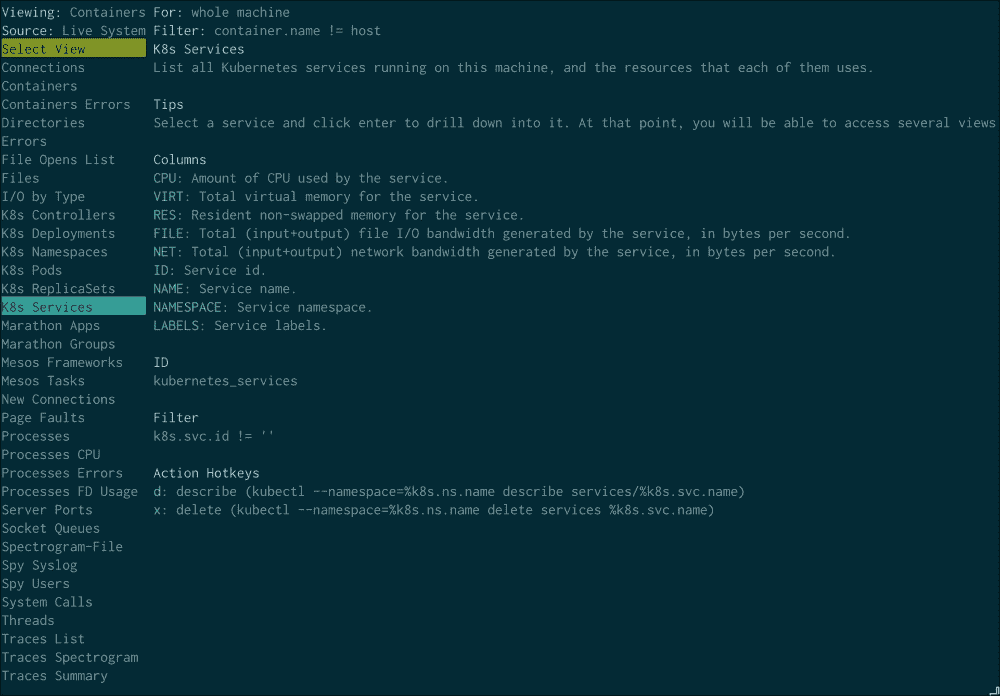

这是一个 Tomcat 容器的示例，展示了所有本地和远程连接、IP、端口、协议、带宽、IO 以及相应的命令——对于查找可疑行为非常有用：

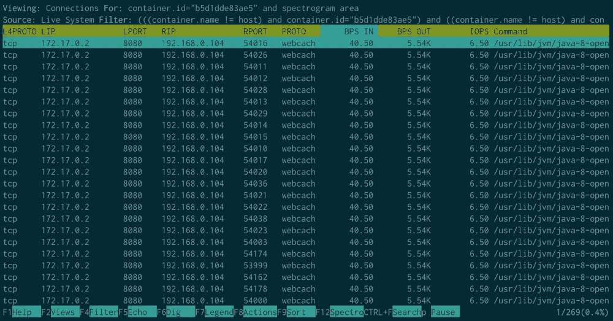

另一个有用的工具是 `F5`/`Echo`，它可以抓取这个容器上正在传输的内容：（解）密内容、日志、输出等。这对于捕捉容器出现异常的情况也非常有用：

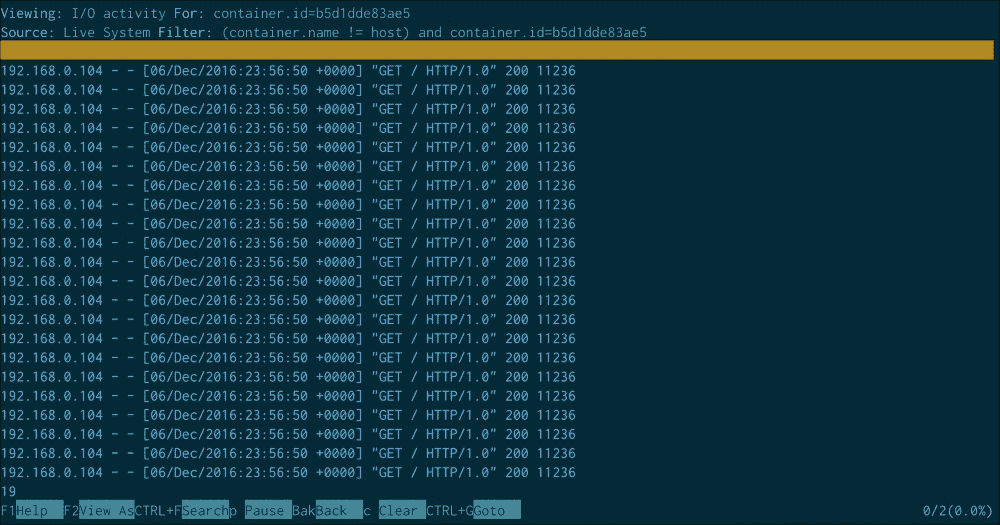

Sysdig 中的另一个非常强大的工具是 `F6`/`Dig`。它基本上提供了一个完整的容器 `strace`；可以想象它强大的调试功能：

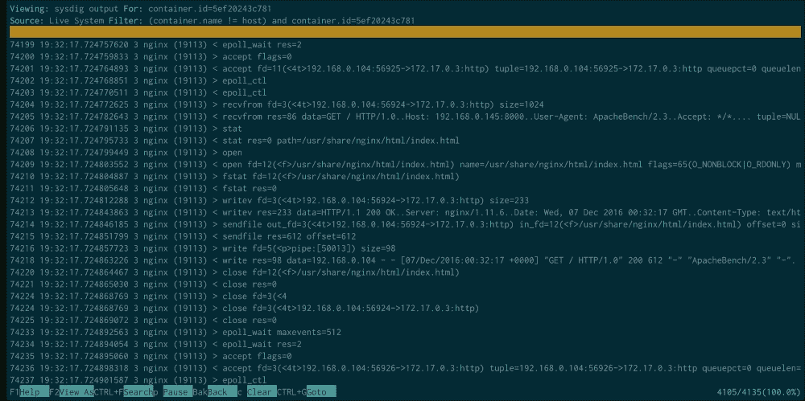

`F8`/`Actions` 功能是一个完整的 Docker 命令集成工具，可以直接在 sysdig 中使用。选择一个容器后，我们可以进入容器，查看日志，查看其镜像历史，杀死容器等：

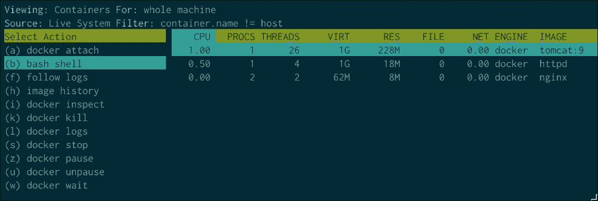

这些命令也可以从主界面直接访问：想要获得这个选定容器的 shell 吗？只需输入 `b`。

这些只是我们使用 Docker 容器与 Sysdig 结合后能够完成的众多强大功能中的一小部分。

## 另请参阅

+   更多的 sysdig 使用示例请参考 [`www.sysdig.org/wiki/sysdig-examples/`](http://www.sysdig.org/wiki/sysdig-examples/)
