# 1

# 理解 Azure Pipelines

本书将成为你在 Microsoft DevOps 世界中的最爱之一，因为它提供了全面的指南，帮助你学习关于 **Azure Pipelines** 的所有知识，并使你成为一名经验丰富的 Azure DevOps 工程师。Azure DevOps 工程师负责设计和实施使用 Azure Pipelines 服务的 **持续集成和持续部署**（**CI/CD**）管道，Azure Pipelines 是 **Azure DevOps** 的一个组件。Azure DevOps 是一组 Microsoft 服务，旨在帮助项目团队实现项目目标。

在本章中，你将更详细地了解 CI/CD 和 Azure DevOps 的概念，并学习使用 Azure Pipelines 创建 CI/CD 管道以支持应用程序部署过程的优势。更具体地说，本章将介绍以下主题：

+   什么是 CI/CD？

+   介绍 Azure DevOps

+   介绍 Azure Pipelines 及其组件

+   将 Azure Pipelines 与其他 CI/CD 工具进行比较

+   设置代理池

+   创建 **个人访问** **令牌**（**PAT**）

+   设置和更新自托管代理

+   设置部署组

# 技术要求

你可以在 [`github.com/PacktPublishing/Implementing-CI-CD-Using-Azure-Pipelines/tree/main/ch01`](https://github.com/PacktPublishing/Implementing-CI-CD-Using-Azure-Pipelines/tree/main/ch01) 找到本章的代码。

# 什么是 CI/CD？

CI/CD 是开发人员应了解的自动化开发和部署的工作流过程，旨在提升技能。

CI 是自动化构建和测试代码的工作流过程，每当团队成员提交更改到 Git 时，就会触发该过程。Git 是一种版本控制工具，运行在源代码控制平台上，如 Azure Repos、GitHub、GitLab 等。CI 为所有开发人员创造了一种现代化文化，鼓励大家分享代码，包括单元测试，通过将所有更改合并到共享版本控制库中，完成一个小任务后就提交。CI 基于提交代码触发器运行，从共享版本控制库中获取最新代码来构建、测试并验证任何他们提交的分支。使用 CI 可以迅速发现错误代码问题并加以修正，确保所有开发人员的代码质量良好。

CD 涉及将 CI 工作流过程自动化，构建、测试、配置并部署到特定环境，如 QA、预生产和生产环境。

以下图示说明了此工作流：

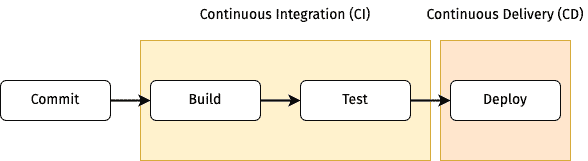

图 1.1 – CI/CD 图示

CI/CD 减少了人为错误，并自动化了手动构建、测试和部署阶段，帮助开发人员专注于应用程序开发。

本书将重点介绍 CI/CD 工具**Azure Pipelines**，这是一个综合性的 DevOps 服务，也是**Azure DevOps**生态系统中的一部分。在深入了解这一工具之前，我们先来介绍一下 Azure DevOps。

# 介绍 Azure DevOps

许多 CI/CD 工具用于支持现代软件开发，如 Azure Pipelines、GitLab CI/CD、GitHub Actions 和 Bitbucket Pipelines。最广泛使用的工具之一是 Azure Pipelines，它是**Azure DevOps**的一部分，包含以下五个服务：

+   **Azure Boards**是 Azure DevOps 的一个子服务，便于在一个地方跟踪与项目相关的所有任务。它适合团队协作。它支持 Kanban 看板、待办事项、团队仪表板和自定义报告，能够在任务和源代码版本库（如 GitHub 或 Azure Repos）之间建立联系，从而促进协作。

+   `https://dev.azure.com/{your-organization}`）。本书将重点关注此服务，因为它具备这样的优势。

+   **Azure Repos**是 Azure DevOps 的一个子服务，用于控制源代码的版本。它使得在一个地方管理代码变得简单。便捷的维护还可以帮助你定义规则，从而安全地将代码部署到所需的环境中，例如团队创建拉取请求后进行合并检查或静态代码分析。本书中的示例将使用 Azure Repos。

+   **Azure Test Plans**是 Azure DevOps 的一个子服务，帮助测试或质量保证团队编写用例场景，轻松将测试结果交付给客户。测试人员或质量保证团队可以在 Azure Test Plans 上创建**系统集成测试**（**SIT**）和**用户验收测试**（**UAT**）。它可以将测试结果显示为仪表板报告，并包含评论或反馈。Azure Test Plans 还帮助团队在同一页面上了解项目的测试过程。

+   **Azure Artifacts**是 Azure DevOps 的一个子服务，允许开发者在一个地方共享和管理所有由构建代码生成的包。开发者可以将包发布到他们的源，并在同一团队、组织内甚至公开分享。开发者还可以从不同的公共仓库加载包，如[`www.nuget.org/`](https://www.nuget.org/)或[`www.npmjs.com/`](https://www.npmjs.com/)。Azure Artifacts 还支持多种包类型，如 NuGet、npm、Python、Maven 和 Universal Packages。

所有这些服务都属于 Azure DevOps 的范畴，涵盖了项目所需的开发流程。你无需使用其他额外的服务来进行开发。

# 介绍 Azure Pipelines 及其组件

Azure Pipelines 是一个用于构建、测试和将代码部署到实时应用程序的 CI/CD 平台。首先，我们来看看它的关键组件。

## 探索关键组件

在创建 Azure 管道时，你需要理解一些关键概念：

+   一个**代理**是运行作业的服务器上的软件。它可以是 Microsoft 托管的代理，也可以是自托管的代理。

+   一个**流水线**是您应用程序开发的 CI/CD 工作流过程。它可以定义如何构建、测试、集成和部署您的项目。

+   一个**触发器**是调用流水线运行的操作。

+   一个**阶段**是流水线中定义的作业流，每个阶段可以包含一个或多个作业。使用阶段的好处是，您可以重新运行该阶段下的作业，而无需重新运行整个流水线。例如，假设开发人员创建了一个包含两个阶段的流水线：**构建阶段**和**部署阶段**。如果部署阶段失败，则可以只重新运行部署阶段下失败的作业。

+   一个**作业**是一组在一个阶段中设置的一个或多个步骤。当您需要在不同操作系统环境中运行一组步骤时，它很有用。

+   一个**步骤**可以是一个任务或脚本，是流水线中的最小单元：

    +   一个**任务**是一个预定义的脚本，您可以通过它来定义您的想法。

    +   一个**脚本**是一个使用**命令行界面**（**CLI**）、PowerShell 或 Bash 的操作。它取决于您为工作选择的操作系统代理。例如，如果您选择在 Linux 代理上使用命令行运行，它将使用 Bash 脚本。PowerShell 在 macOS 代理上运行，并将使用 PowerShell 核心来进行跨平台脚本。

+   一个**目标**是流水线的目的地。它可以是 Azure Artifacts，一个 Azure 资源服务（例如 Azure App Services、Azure Functions、Azure Container Apps、Azure Kubernetes Services 等），或者调用一个 REST API，例如 Microsoft Teams 上的 Webhook。

现在，让我们来看一下这些组件是如何相互作用的：

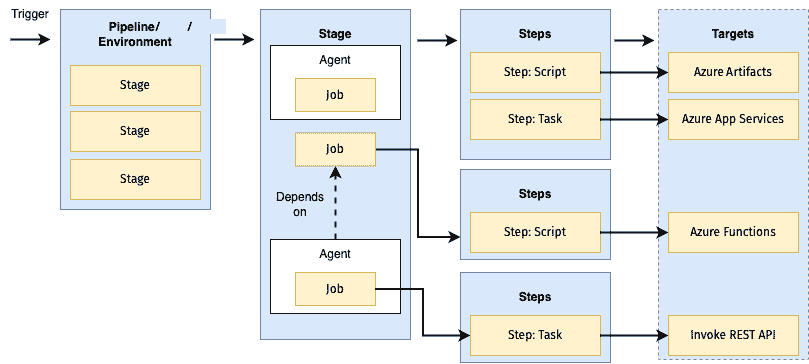

图 1.2 – 关键组件

本节描述了关键对象的含义及其关系。在我们更深入地了解平台的不同方面之前，先来学习如何开始使用它。

## 注册 Azure Pipelines

可以使用两种方法注册：

+   `https://dev.azure.com/{your-organization}`。

+   `{your-organization}`。

注册 Azure Pipelines 账户后，您就可以创建一个新项目，用于构建您的代码并将构建后的代码发布到生产应用程序。

### 创建新项目

创建新项目是注册后的第一步，在创建任何 CI/CD 流水线之前。创建项目后，您可以设置项目可见性：

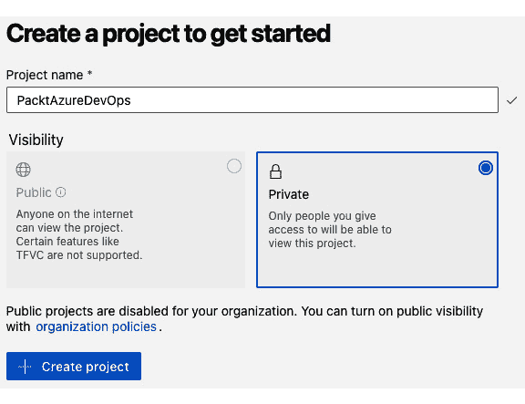

图 1.3 – 创建新项目

您可以输入项目名称并选择**可见性**，然后点击**创建项目**。

### 邀请团队成员

当您需要与团队合作时，必须通过邀请一个或多个团队成员来添加新成员。请按照以下步骤邀请团队成员：

1.  在 Web 门户中点击您的项目名称，然后点击**项目设置**：

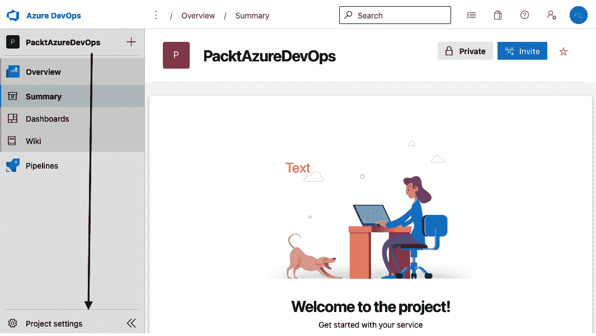

图 1.4 – 项目设置

1.  选择**团队** | **添加**：

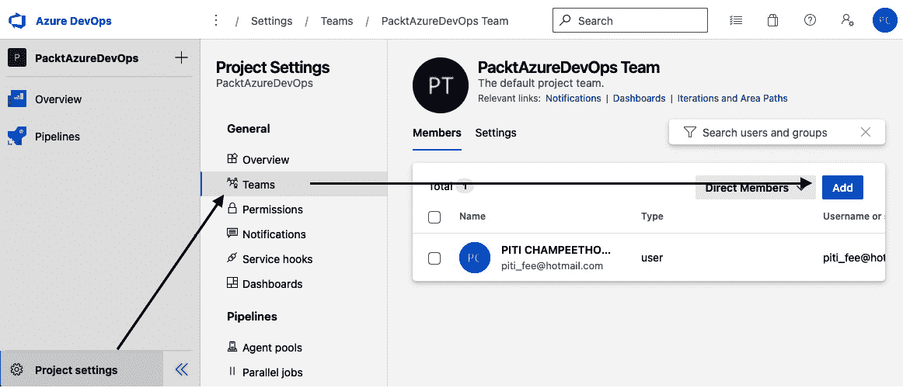

图 1.5 – 添加新团队成员

1.  输入团队成员的电子邮件地址并点击**保存**：

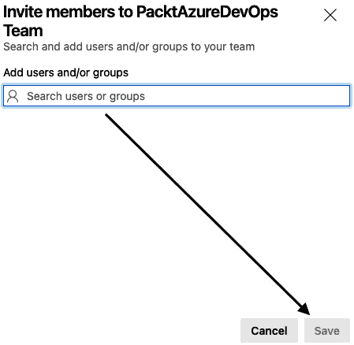

图 1.6 – 邀请团队成员

现在您已经邀请了合作者加入项目，我们来深入了解如何开始使用此服务。

## 创建 Azure 管道

创建 Azure 管道有两种方法：

+   使用**经典界面**（从 Web Azure DevOps 门户创建 Azure 管道），同时按照以下基本步骤进行操作：

    1.  配置 Azure Pipelines 以使用您的 Azure Repos Git 仓库。

    1.  使用 Azure Pipelines 在 Azure DevOps 门户中通过拖放创建并配置您的构建和发布管道。

    1.  将代码推送到您的版本控制库。管道将通过默认触发器自动启动，定义的任务将会执行。

+   通过定义自定义构建，使用`azure-pipelines.yml`文件。

+   将代码推送到您的版本控制库。此操作会运行默认触发器。

为了便于理解，我们来说明 Azure Pipelines YAML 方法：


图 1.7 – Azure Pipelines YAML 步骤

这两种方法都有不同的管道功能可用，其中有些适用于两者，而其他一些仅适用于其中一种。我们将在下一部分详细介绍这些功能。

## 功能可用性

某些管道功能仅在使用经典界面或 YAML 时可用。下表显示了哪些功能适用于这些方法中的哪一种：

| **功能** | **YAML** | **经典** | **描述** |
| --- | --- | --- | --- |
| 代理 | 是 | 是 | 用于定义管道可以运行的资源。 |
| 审批 | 是 | 是 | 用于定义额外验证步骤，在完成部署阶段之前进行检查。 |
| 工件 | 是 | 是 | 用于定义发布或消费不同类型包的库包。 |
| 缓存 | 是 | 是 | 用于定义额外任务，通过允许在代理上存储输出或下载的依赖项并再次重用它们，来减少构建时间。 |
| 条件 | 是 | 是 | 用于定义在运行作业之前的特定条件。 |
| 容器作业 | 是 | 否 | 用于定义在容器中运行的特定作业。 |
| 需求 | 是 | 是 | 用于定义特定管道，以确保在管道阶段运行之前满足要求。 |
| 依赖关系 | 是 | 是 | 用于定义在运行下一个作业或阶段之前的特定验证要求。 |
| 部署组 | 否 | 是 | 用于定义将部署到目标机器的代码的逻辑组。 |
| 部署组作业 | 是 | 是 | 用于定义发布到部署组的作业。 |
| 部署作业 | 是 | 否 | 用于定义部署步骤。 |
| 环境 | 是 | 否 | 定义一组面向部署的资源。 |
| 网关 | 是 | 是 | 支持在完成发布阶段之前自动收集和评估外部健康信号。仅适用于经典发布。 |
| 作业 | 是 | 是 | 定义一组步骤的执行顺序。 |
| 服务连接 | 是 | 是 | 定义连接到执行作业中任务所需的远程服务。 |
| 服务容器 | 是 | 否 | 定义一个服务，你可以用它来管理容器化服务的生命周期。 |
| 阶段 | 是 | 是 | 定义流水线中的作业流。 |
| 任务组 | 否 | 是 | 定义一组顺序任务，作为一个可重用的任务。 |
| 任务 | 是 | 是 | 定义构建流水线的基本单元。 |
| 模板 | 是 | 否 | 定义可重用的内容、逻辑和参数。 |
| 触发器 | 是 | 是 | 定义一个特定事件，触发流水线的运行。 |
| 变量 | 是 | 是 | 定义数据替换的值，并将其传递给流水线。 |
| 变量组 | 是 | 是 | 定义你希望控制并在多个流水线之间共享的值存储。 |

表 1.1 – 流水线功能

除了这些功能外，Azure Pipelines 还可以连接到源版本控制仓库。我们将在下一节中详细讨论这些仓库。

## 源版本控制仓库的可用性

YAML 流水线仅支持某些版本控制仓库。下表展示了哪些版本控制仓库支持哪种方法：

| **仓库** | **YAML** | **经典界面** |
| --- | --- | --- |
| Azure Repos | 是 | 是 |
| GitHub | 是 | 是 |
| GitHub Enterprise Server | 是 | 是 |
| Bitbucket Cloud | 是 | 是 |
| Bitbucket Server | 否 | 是 |
| Subversion | 否 | 是 |

表 1.2 – 比较仓库

在本节中，我们讨论了 Azure Pipelines 的所有可用功能。在下一节中，我们将把 Azure Pipelines 的关键组件转换成 YAML 结构，以便更好地管理。

## 理解 Azure Pipelines 的 YAML 结构

通常，创建一个名为 `azure-pipelines.yml` 的文件可以帮助你记住哪个 YAML 文件用于源代码仓库中的 `azure-pipelines`。基本的 Azure Pipelines YAML 结构如下：

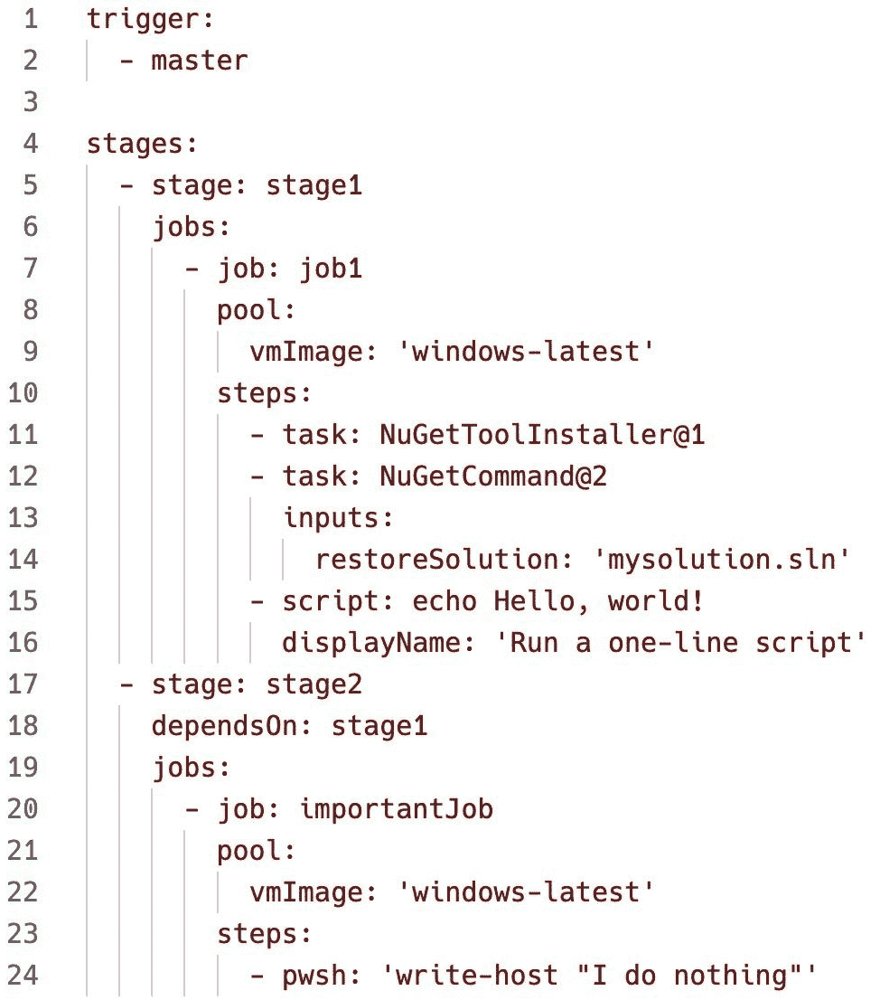

图 1.8 – azure-pipelines.yml 文件

本示例中的 `azure-pipelines.yml` 文件包含一个典型的结构：

+   有两个阶段，`stage1` 和 `stage2`，每个阶段包含一个 `job` 步骤。

+   *第 1-2 行* 显示开发人员在主 (`master`) 分支推送更改时，流水线会运行。

+   *第 8-9 行* 和 *第 21-22 行* 显示流水线使用了一个 Microsoft 托管的代理，操作系统镜像为 `windows-latest`。

+   *第 11 行* 是一个预创建的脚本，用于使用 NuGet 库。你可以在本书 GitHub 仓库中的 `ch1` 文件夹找到这个脚本。

+   *第 12 行*是一个用于使用 NuGet 命令行的预创建脚本。

+   *第 15 行*是运行`echo`命令的命令行。

+   *第 24 行*是一个跨平台的 PowerShell Core 脚本。

正如您所看到的，基本的 YAML 结构相当简单易懂。准备好 YAML 文件后，您可以查看运行状态。我们将在下一节讨论这一点。

## 查看 Azure 管道的状态

Azure 管道的状态显示在 Azure DevOps Web 门户中的运行管道下：

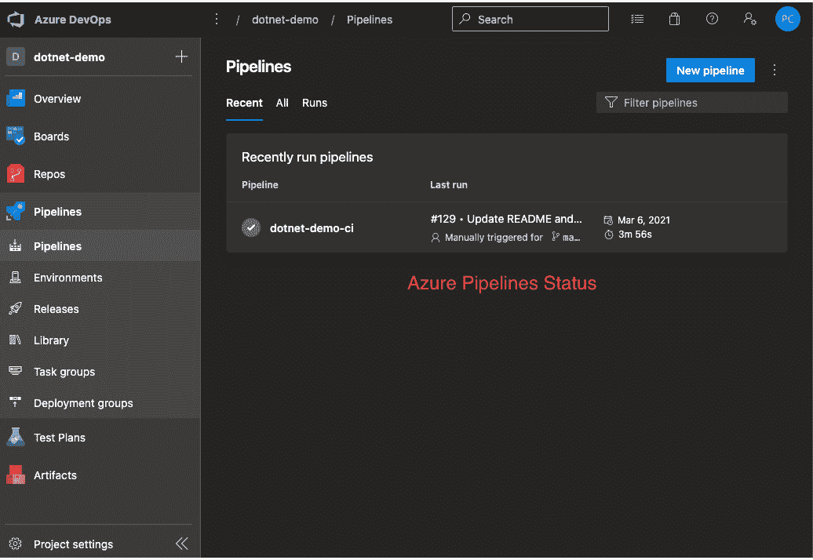

图 1.9 – Azure 管道的状态

单击当前管道状态行将带您查看管道的历史状态。使用两种颜色来指示状态：绿色和红色。分别表示成功和失败的管道。

本节描述了所有组件及其关系。在下一节中，您将了解 Azure Pipelines 与其他常用 CI/CD 工具之间的关键区别。

# 比较 Azure Pipelines 与其他 CI/CD 工具

与目前市场上的其他 CI/CD 服务相比，Azure Pipelines 具有不同的特点。让我们仔细看一下：

| **功能** | **Azure Pipelines** | **GitHub Actions** | **GitLab CI** | **Bitbucket Pipelines** |
| --- | --- | --- | --- | --- |
| `if` 表达式 | X | X | - | - |
| 循环语句 | X | - | - | - |
| 在线服务 – 每月免费 CI/CD 分钟数 | 1,800 | 2,000 | 400 | 50 |
| 在线服务 – 免费包存储 (GB) | 2 | 0.5 | 5 | 1 |
| 自托管代理 | X | X | X | X |
| 免费用户 | 5 | 无限 | 无限 | 5 |

表 1.3 – CI/CD 工具比较

这将帮助您了解在选择适合您的 CI/CD 平台的工具时需要考虑的重要因素。

在开始为应用程序部署构建管道之前，我们必须准备好必要的代理池，如下一节所示。

# 设置代理池

在使用 Azure Pipelines 构建代码和部署代码之前，您需要至少一个**构建代理**。有两种构建代理类型：**微软托管构建代理**，默认包含，和**自托管构建代理**。每种代理类型将位于一个**代理池**下，代理池是构建和发布代理的集合。

一个由微软托管的构建代理将位于名为**Azure Pipelines**的代理池下。您可以为自托管构建代理创建一个新的代理池，并将其分配到该池下。

创建代理池，请按照以下步骤操作：

1.  在 Web 门户中单击您的项目名称，然后单击**项目设置** | **代理池** | **添加代理池**：

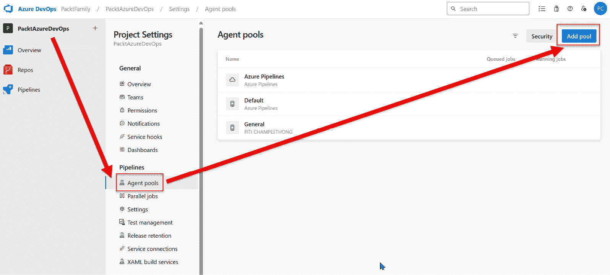

图 1.10 – 添加代理池

1.  输入以下截图所示的信息，然后点击**创建**：

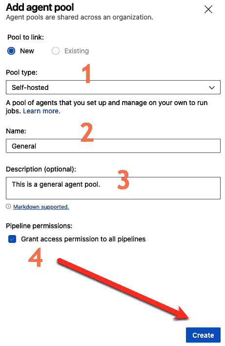

图 1.11 – 创建代理池

1.  最后，您将看到新的代理池：

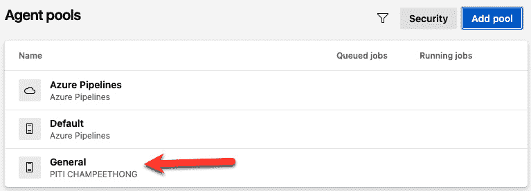

图 1.12 – 显示新的代理池

完成新代理池的创建后，你可以在新的代理池下开始创建和设置自托管代理。接下来的部分将指导你如何创建**个人访问** **令牌**（**PAT**）。

# 创建 PAT

在你的服务器或机器上创建自托管代理之前，必须先创建一个 PAT。请按照以下说明操作：

1.  转到个人图标下的**设置**菜单，然后点击**个人** **访问令牌**：

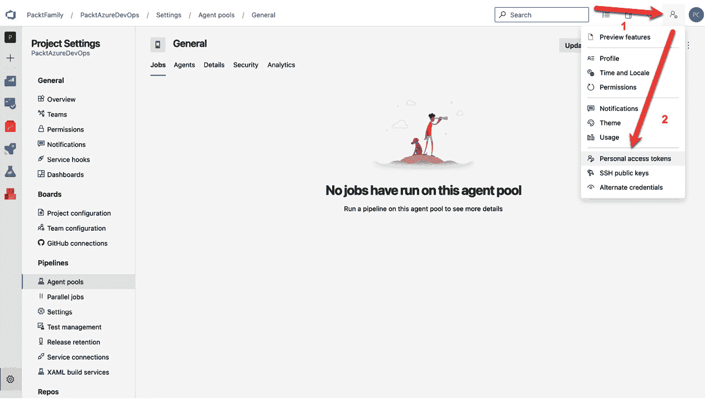

图 1.13 – 创建 PAT

1.  点击**新建令牌**：

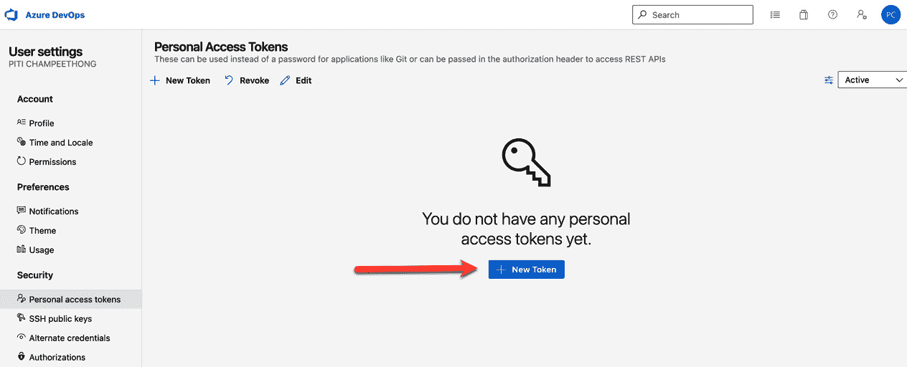

图 1.14 – 新建令牌

1.  输入所需的相关信息：

    +   **名称**：输入你需要的名称

    +   **组织**：选择你将要关联的组织

    +   **过期时间（UTC）**：有四个选项——30 天、60 天、90 天，以及自定义定义但不超过 2 年

    +   **作用域**：选择**自定义定义** | **代理池**，并选中**读取和管理** | **审计**，并勾选**读取** **审计日志**：

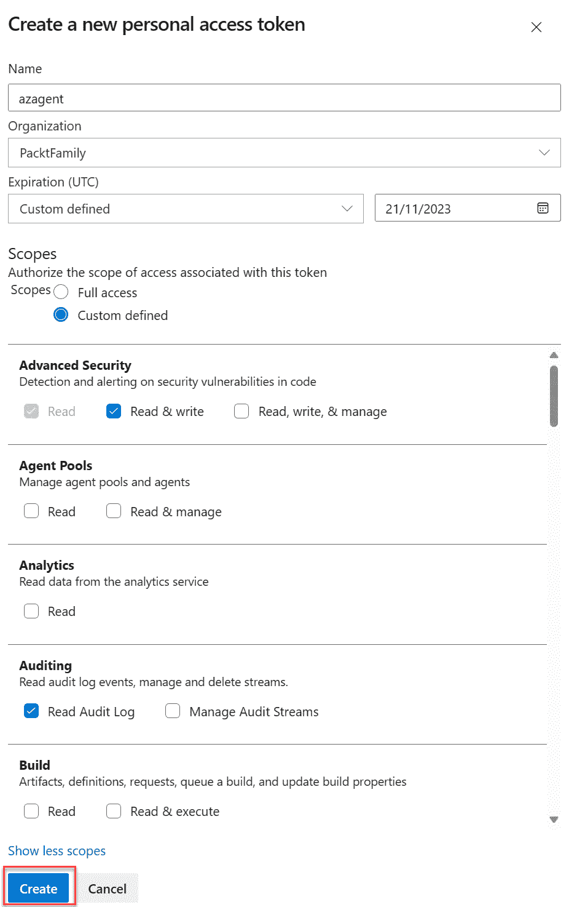

图 1.15 – 输入所需信息

1.  在点击**关闭**按钮之前，请复制 PAT，因为你将无法再次查看它：

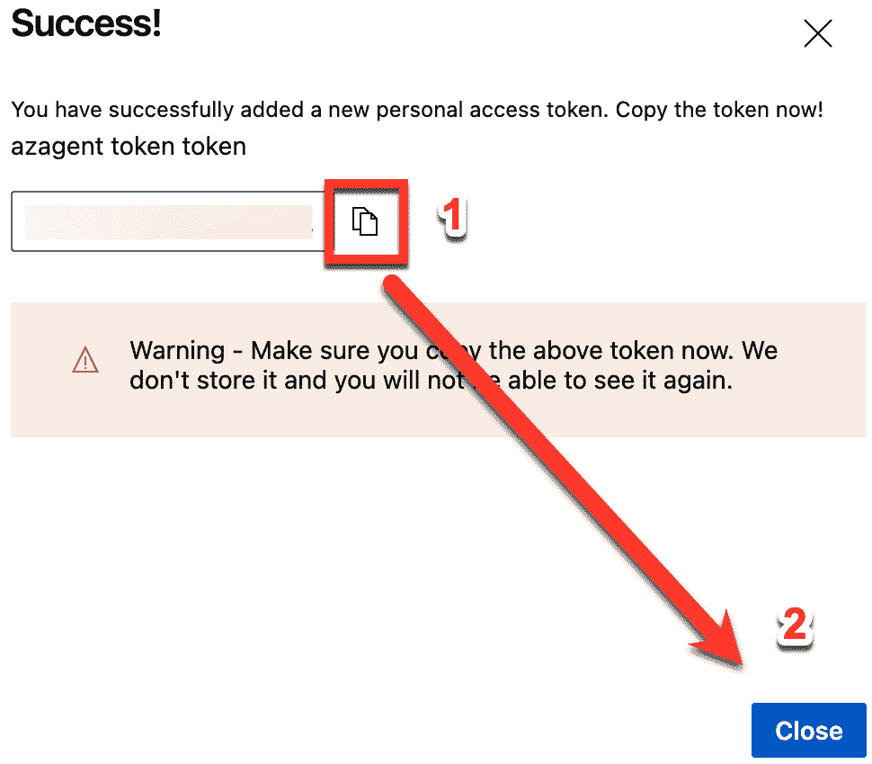

图 1.16 – 复制 PAT

现在，你已经准备好设置自托管代理。

# 设置自托管代理

创建 PAT 后，你可以在新的代理池下创建一个新的自托管代理。按照以下步骤操作：

1.  点击**PacktAzureDevOps** | **代理池** | **常规**：

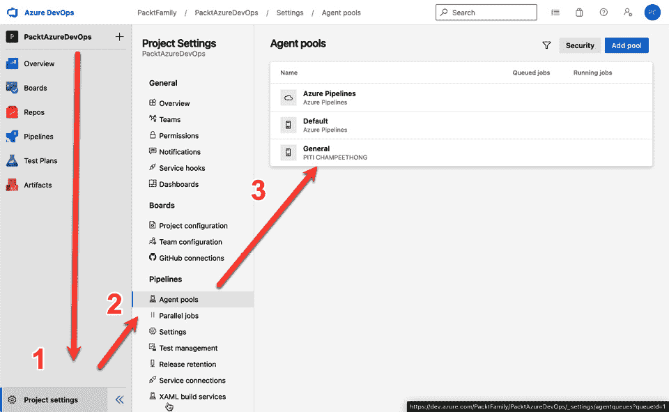

图 1.17 – 输入新的代理池

1.  点击**新建代理**：

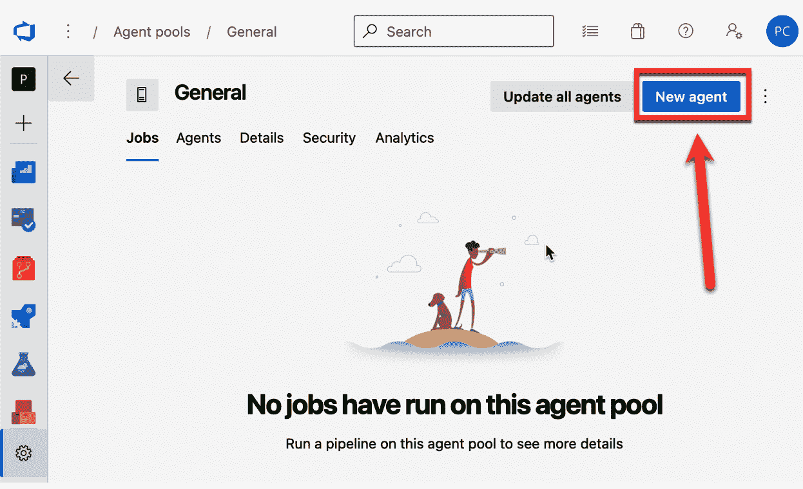

图 1.18 – 输入新的代理

1.  你可以根据操作系统下载自托管代理。以下三种操作系统选项将指导你如何下载并设置它们：

    +   **Windows 用户**可以从**Windows**标签页下载构建代理软件。以下截图展示了两个选项：Windows 64 位（**x64**）和 Windows 32 位（**x86**）：

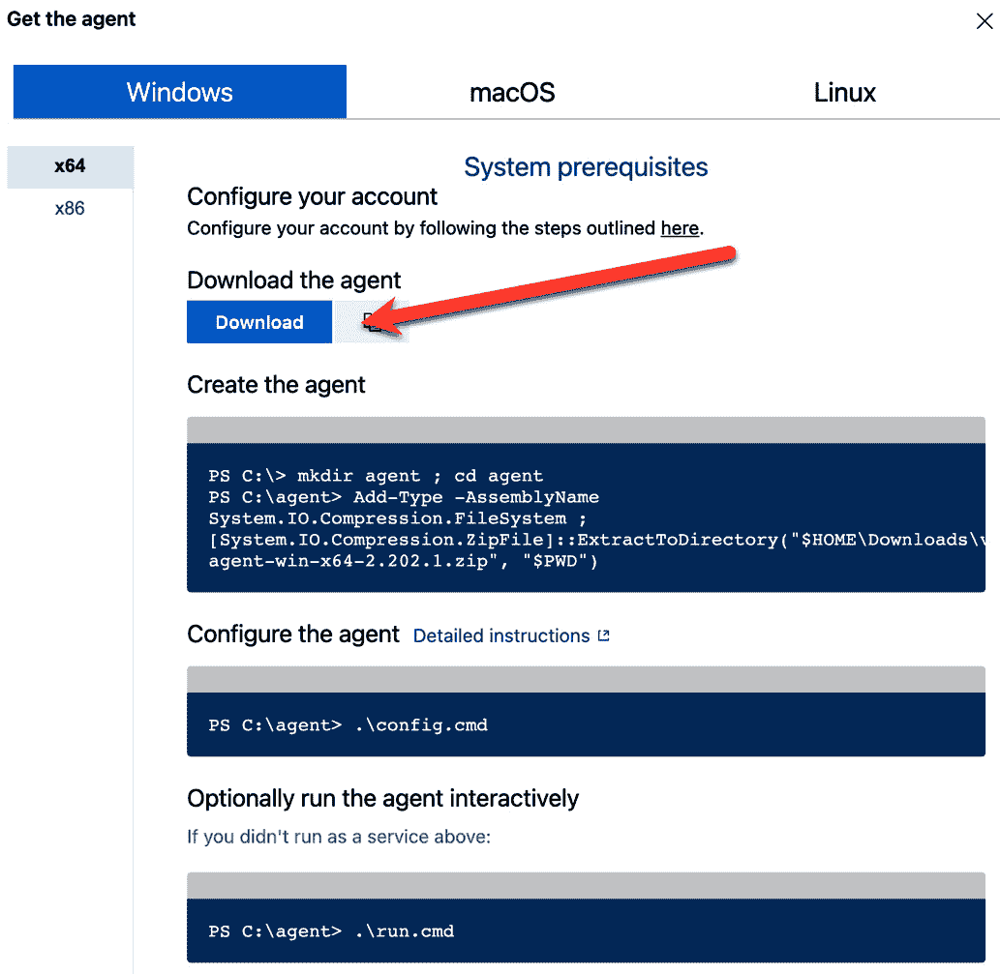

图 1.19 – 设置文件的 Windows 代理

+   要设置 Windows 代理，你需要以管理员身份在 PowerShell 中运行。

+   **Mac 用户**可以从**macOS**标签页下载构建代理软件：

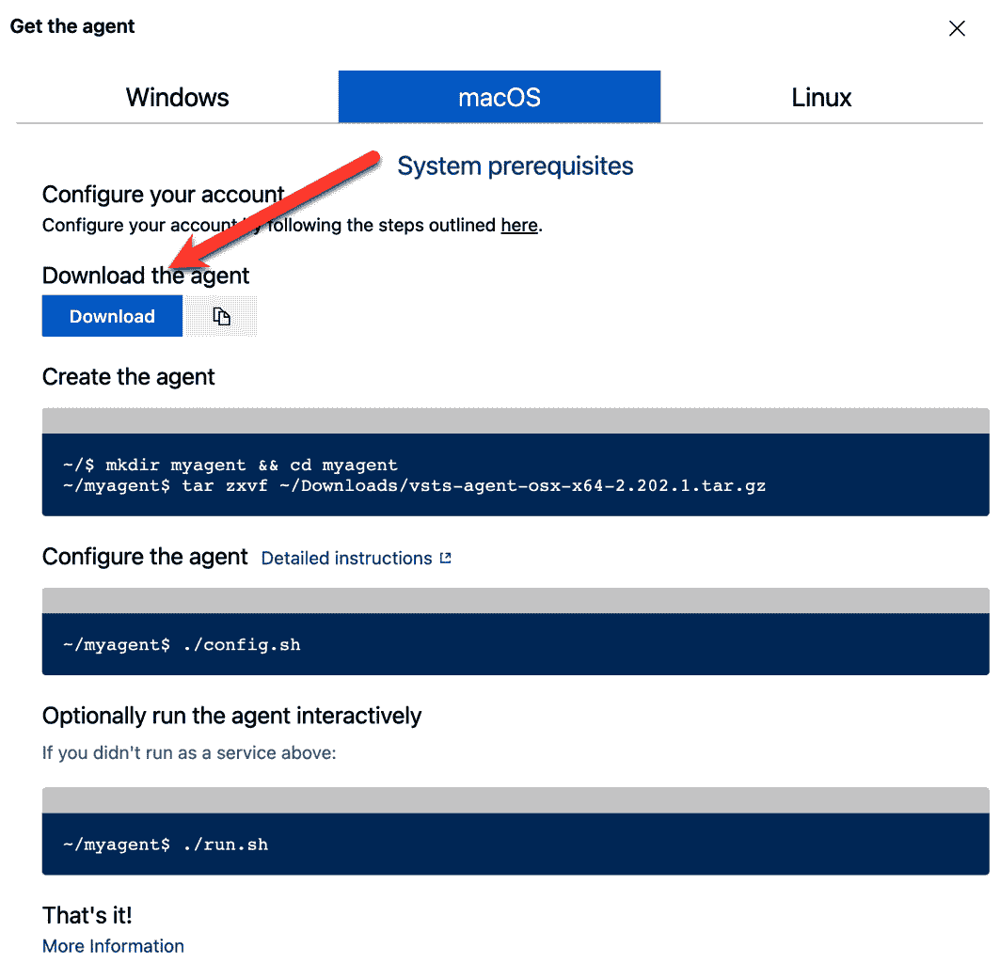

图 1.20 – macOS 代理

+   设置 macOS 代理时，管理员角色下不需要使用`bash`命令。

+   **Linux 用户**可以从**Linux**标签页下载构建代理软件。计算机架构有四个选项：**x64**、**ARM**、**ARM64**和**RHEL6**：

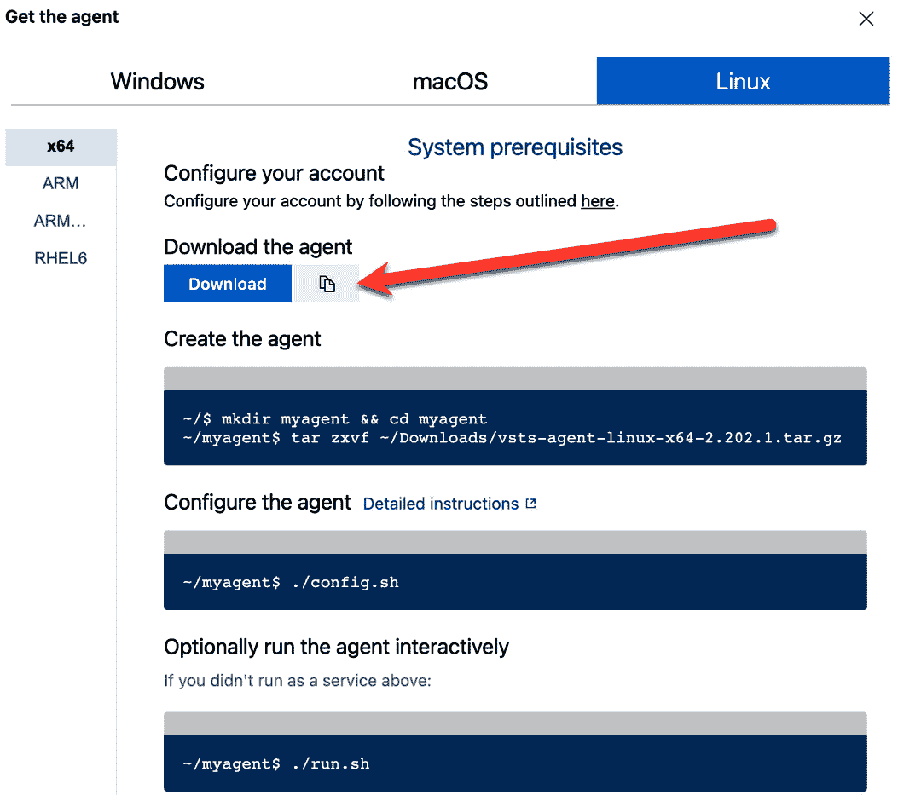

图 1.21 – Linux 代理

+   安装 Linux 代理时，你不需要使用 `root` 用户。

1.  在配置每个操作系统中的代理之后，你必须输入以下信息：

    ```
    Enter (Y/N) Accept the Team Explorer Everywhere license agreement now? (press enter for N) > Y
    Enter server URL > https://dev.azure.com/yourOrganization
    Enter authentication type (press enter for PAT) > [ENTER]
    Enter personal access token > [Personal Access Token]
    Enter agent pool (press enter for default) > General
    Enter agent name (press enter for [computer name]) > agent01
    agent01 is active:
    ```

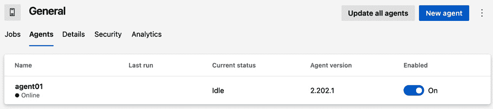

图 1.22 – 代理状态仪表板

1.  你可以看到已经创建的构建代理的**在线**状态：

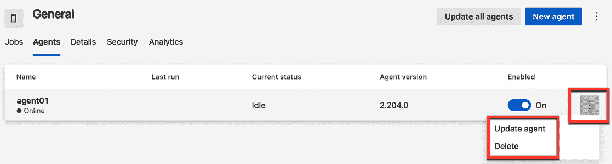

图 1.23 – 代理的操作菜单

1.  你可以通过点击带有省略号或三个点的按钮来删除代理并**更新**到代理的新版本。

现在，你已经准备好在 `agent01` 构建代理上创建构建和部署。然而，你需要设置部署组，以便在本地 web 服务器上部署应用程序，如 Microsoft **互联网信息服务**（**IIS**）。我们将在下一节中进行设置。

# 设置部署组

**部署组**是基于环境对目标机器进行应用程序部署的逻辑代理分组 —— 它们通常根据项目需求和推广级别命名，在应用程序进入生产之前进行部署。每个环境中都安装有代理。部署组下的每个代理仅支持 Windows 和 Linux。

这些部署组可以根据环境进行划分，例如开发（*Dev*）、质量保证（*QA*）、用户验收测试（*UAT*）和生产（*Prod*），如下图所示：

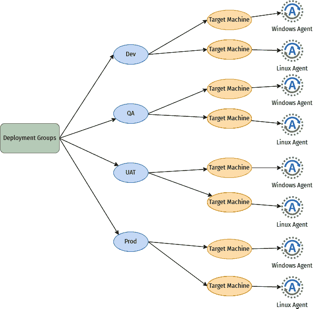

图 1.24 – 部署组概念

要创建部署组，请按照以下说明进行操作：

1.  导航到 **Pipelines** | **部署组** | **组** | **添加一个** **部署组**：

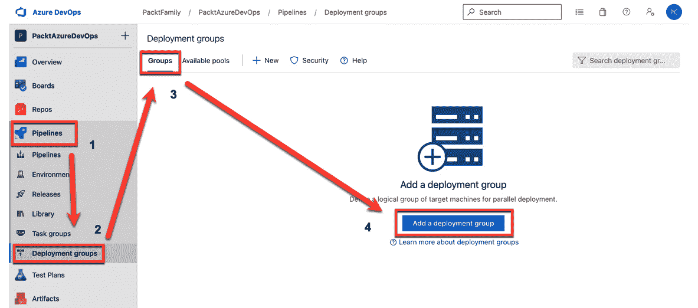

图 1.25 – 添加部署组

1.  输入所需信息并点击**创建**：

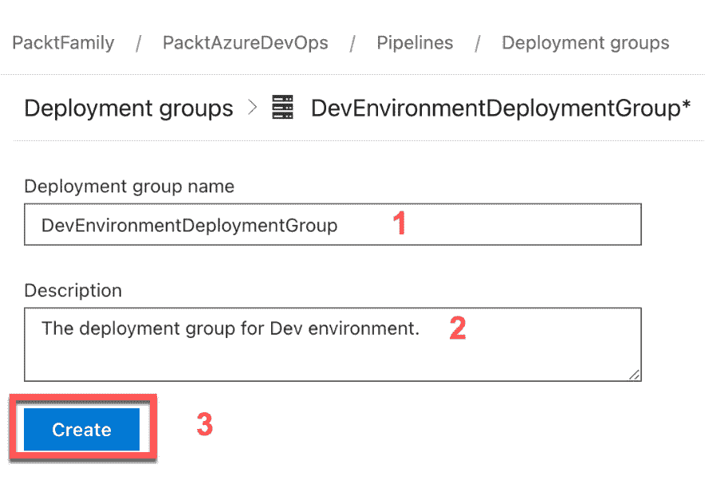

图 1.26 – 输入部署组信息

1.  创建部署组后，你必须在你的部署组下设置部署代理。部署代理支持两种操作系统：

    +   **Windows 用户**可以通过复制 PowerShell 脚本并以管理员命令提示符运行它，来安装部署组的代理：

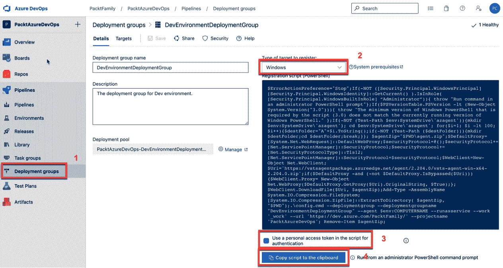

图 1.27 – 在 Windows 上部署代理的脚本

+   **Linux 用户**可以通过复制 bash shell 脚本并以管理员命令提示符运行它，来安装部署组的代理：

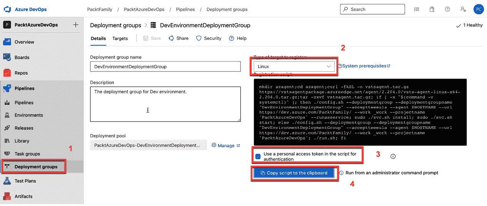

图 1.28 – 在 Linux 上部署代理的脚本

1.  在为部署组设置好代理后，你将看到该部署组的构建代理已经在线：

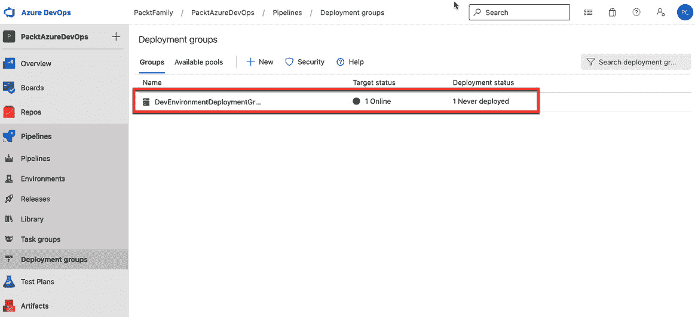

图 1.29 – 部署代理已在线

在自托管计算机上设置构建和部署代理后，你已准备好创建你的第一个 Azure 流水线。

# 总结

在本章中，你学习了与 CI/CD 相关的关键概念，这是微软 Azure DevOps 服务的一部分。你了解了 Azure Pipelines YAML 的基本结构，以及 Azure Pipelines 与市场上其他服务的区别。你还学习了 Azure Pipelines 的基本原理，这将帮助你为本书后续章节中讨论的所有实际场景准备 CI/CD 流水线。最后，你学习了如何设置代理池、部署组和自托管代理，为接下来的实操项目做好准备。

在下一章中，你将把本章学到的知识应用到基本概念和功能上，学习如何创建流水线。
