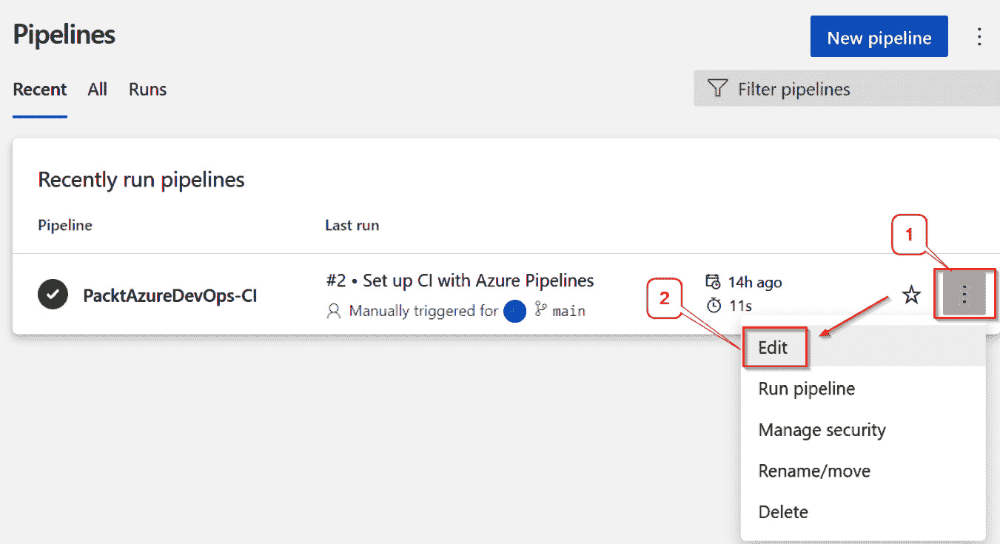
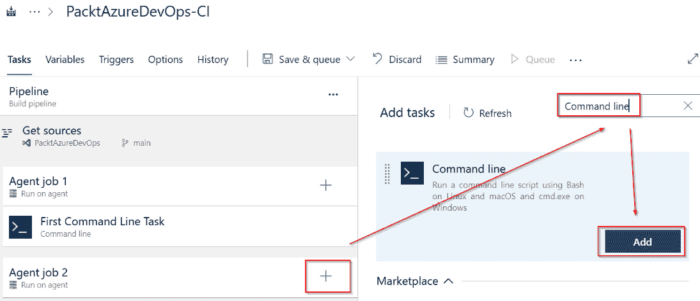
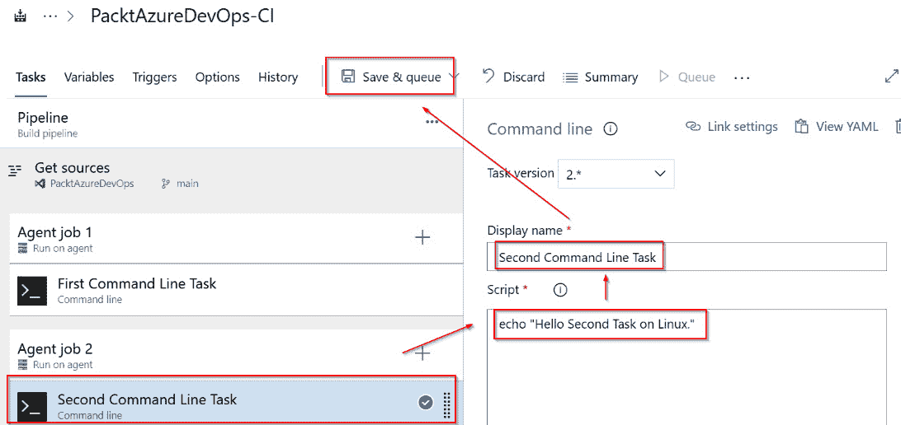

# 2

# 创建构建管道

在上一章中，我们通过准备构建和部署代理、池以及部署组，并解释如何使用它们，为你的 Azure DevOps 之旅打下了基础。本章将迈出下一步，帮助你了解如何创建第一个管道。我们将探讨如何使用任务、触发器、阶段以及如何基于这些概念创建构建管道的基本原理。这将帮助你简化工作流程，减少错误，提高生产力。它还将有助于提高协作效率，让你更好地为实现 CI/CD 等实践做好准备。

本章将涵盖以下主题：

+   创建一个带有单一任务的构建管道

+   创建任务

+   创建多个任务

+   创建触发器

+   创建阶段

# 创建一个带有单一任务的构建管道

在上一章节准备好构建和部署代理之后，本节将介绍如何在 **Azure DevOps** 门户上创建第一个 **构建管道**。在创建第一个构建管道之前，必须创建一个 Azure 仓库作为源代码库。有两种创建构建管道的方式：**经典编辑器**，即通过图形界面编辑器拖放组件来构建管道，和 **另一种标记语言** (**YAML**)，它通过标记语言自定义 Azure 的高级管道。在本章中，我们将重点使用经典编辑器。

让我们创建一个空白任务来看看它是如何工作的：

1.  点击项目名称，然后点击 **管道** | **创建管道**：

图 2.1 – 创建新管道

1.  点击 **使用经典编辑器**：

图 2.2 – 使用经典编辑器

1.  选择 **Azure Repos Git**，这是 Azure DevOps 下的一个现有服务，作为源代码库。它与其他 Azure DevOps 服务（如 Azure Pipelines）高度兼容，这些服务将在本演示中使用。选择下图所示的选项，用于 **团队项目**、**代码库** 和 **手动及定时构建的默认分支** 来启动 Azure 管道，然后点击 **继续**：

图 2.3 – 选择默认分支

1.  点击 **空白任务**。该模板提供了一个单一任务，包含用于管道的任务。我们将从空白任务开始，以便你可以先从菜单中学习基本设置，然后再选择适合每个项目的所有模板。

图 2.4 – 选择构建模板

屏幕截图中显示的其他选项包括以下内容：

+   **.NET 桌面**：用于构建和测试 .NET 桌面解决方案的管道模板

+   **Android**：用于构建管道的模板，用于构建和测试 Android APK 文件以用于 Android 应用程序

+   **ASP.NET**：用于构建管道的模板，用于构建和测试 ASP.NET Web 应用程序

+   **Azure Web App for ASP.Net**：用于构建管道的模板，用于构建、测试和部署 ASP.NET 到 Azure Web App 服务

1.  点击 **保存 &** **队列** 的下拉菜单：

图 2.5 – 保存构建管道

1.  在接下来的屏幕上，你可以选择一个文件夹保存并添加评论。点击 **保存**：

图 2.6 – 确认构建管道

1.  点击 **保存** 后，将显示所有构建管道的列表，如下所示：

图 2.7 – 管道仪表板

1.  创建简单构建管道后，你可以通过点击你想要的管道并点击 **运行管道** 来测试它：

图 2.8 – 运行管道

1.  在运行构建管道之前，你可以设置特定的选项：

    +   **代理池**，在此处你可以选择 Microsoft 托管的代理或自托管代理

    +   **代理规格**，在此处你可以选择一个代理操作系统来运行构建管道

    +   **分支/标签**，在此处你可以选择要运行的构建管道

图 2.9 – 运行管道选项

1.  最后，你可以详细查看构建结果和一些摘要信息。

图 2.10 – 详细的构建结果

你还可以查看构建管道行上的最新状态：

图 2.11 – 带有构建结果的管道

在这一部分，你学会了如何使用经典编辑器来轻松创建一个新的构建管道。在下一部分，我们将描述如何在这个构建管道中创建任务。

# 创建任务

本节将教你如何在作业下创建**任务**。构建管道将包含一个或多个作业，每个作业将包含一个或多个任务。在前一部分中，你创建了一个仅包含一个作业的构建管道。按照以下步骤创建任务：

1.  点击三个点符号来编辑构建管道，然后点击 **编辑**。

图 2.12 – 编辑构建管道

1.  编辑构建管道后，点击搜索框中的 `Command line`，然后点击 **添加**：

图 2.13 – 添加命令行任务

1.  点击 `First Command` `Line Task`

1.  `echo "Hello` `First Task"`:

图 2.14 – 输入命令行任务的详细信息

然后，点击 **保存 &** **队列**。

1.  点击**保存并排队**后，你将看到确认页面。然后，点击**保存** **并运行**：

图 2.15 – 保存并运行构建管道

1.  然而，在保存之前，你还可以选择**高级选项**。在这里，你可以在构建管道时输入变量，而不是提前准备好它们。你可以在下面的截图中看到可用的选项：

图 2.16 – 高级配置

让我们更仔细地看看这些选项：

+   **高级**：

    +   **工作目录**：你可以输入任何路径来运行命令行任务。如果你没有输入路径，它将在根路径下运行。

    +   **标准错误失败**：当你需要在任务中出现任何错误时停止任务时，启用此功能。例如，如果你运行一个命令从互联网读取邮件，而互联网断开连接，这个任务将显示错误。

+   **控制选项**：

    +   **启用**：当你需要启用控制选项时，开启此功能：

    +   **继续出错**：当你需要在发现错误后继续运行下一个任务时，启用此选项。

    +   **任务失败后的重试次数**：输入任务失败后需要重新运行的次数。

    +   **超时**：输入此任务在被取消之前将运行的分钟数。

+   **运行** **此任务**：

    +   **仅当所有前置任务** **成功时**

    +   **即使前置任务失败，除非构建** **被取消**

    +   **即使前置任务失败，即使构建** **被取消**

    +   **仅当前置任务** **失败时**

    +   **自定义条件**：如果上述选项不符合你的需求，你可以在此处创建规则。

+   **环境变量**：你可以在运行命令时添加额外的变量。例如，你可以在运行此命令时添加一个 URL 来下载文件。

+   **输出变量**：你可以将此任务的输出赋值并传递到下一个任务。例如，你可以在此任务的输出变量中传递 token login，以便在下一个任务中成功登录。

1.  一旦你保存了这些选项，你就可以看到构建管道的新历史记录：

图 2.17 – 显示构建管道的历史

1.  点击你想查看任务详情的行。在这里，你将看到每个任务运行命令的输出：

图 2.18 – 作业状态

1.  点击**代理作业 1**以查看作业详情：

图 2.19 – 带有任务的作业详情

在本节中，你学会了如何在构建管道中创建任务并查看作业状态和任务详情。这可以帮助你确保所有任务按预期进行。下一节将教你如何在构建管道中创建多个作业。

# 创建多个作业

有时，当你为需要同时在不同操作系统上构建代码的应用创建构建管道时，你需要为此目的创建另一个任务。任务有两种类型 —— **代理任务**和**无代理任务**。代理任务是需要在代理或目标计算机上运行的任务，而无代理任务将在 Azure DevOps 应用服务器上直接运行。以下步骤描述了如何在构建管道下创建其他代理任务：

1.  通过点击**…**符号，再点击**编辑**来编辑构建管道：

图 2.20 – 编辑构建管道

1.  点击**...**按钮并选择**添加代理任务**：

图 2.21 – 添加代理任务

1.  点击`Agent` `job 2`

1.  **代理池**：**Azure Pipelines**

1.  **代理** **规格**：**ubuntu-latest**

图 2.22 – 添加另一个任务

1.  在搜索框中点击`命令行`，然后点击**添加**按钮：

图 2.23 – 添加新任务

1.  点击包含`2`的行。

1.  `第二个命令行任务`

1.  `echo "Hello Second Task on Linux"`。运行完管道后，这将把这段文本打印到结果页面：

图 2.24 – 更新第二个命令行任务

1.  点击**保存并排队**后，你将看到以下结果：

图 2.25 – 两个代理任务的结果

专业提示

对于错误处理，当你有多个代理任务时，可以在高级配置中设置参数，确保**代理任务 2**会在**代理任务 1**成功完成后运行。

让我们来看一下在**代理任务**属性中可用的一些高级选项，如下图所示：

图 2.26 – 代理任务的高级选项

让我们更详细地了解这些选项：

+   **代理选择**：

    +   **代理池**：选择自定义或默认代理来构建任务。

    +   **需求**：添加条件参数，仅允许符合条件的代理运行此代理任务。例如，只有 Linux 代理才能运行此任务。

+   **执行计划**：

    +   **并行性**：这里提供的选项如下：

        +   **无**：没有任务将并行运行。

        +   **多配置**：当你有不同的配置需要为每个代理任务运行时，启用此选项。例如，你可能需要在三个浏览器上运行测试任务，因此你将需要 Chrome、Edge 和 Firefox 浏览器。

        +   **多代理**：当你有多个代理并需要使用它们来运行代理任务时，启用此选项。

    +   **超时**：输入分钟数；代理任务允许在代理上执行的时间，超过该时间将被取消。

    +   **任务取消超时**：输入在接收到取消请求后，代理任务取消前的分钟数。

+   **依赖关系**：当你需要在运行另一个代理任务之前先完成某个任务时，可以选择之前的代理任务。

+   **附加选项**：

    +   **允许脚本访问 OAuth 令牌**：当你需要使用 OAuth 令牌通过 REST API 传递给另一个代理任务时，打开此选项。

+   **运行** **此任务**：

    +   **仅当所有前置任务** **成功完成时**

    +   **即使前一个任务** **失败时**

    +   **仅当前一个任务** **失败时**

    +   **使用变量表达式的自定义条件**：例如，**succeeded()** 表示如果前一个任务完全成功，代理任务将会运行。

在这一部分，你将学到如何创建第二个任务来分离 Linux 操作系统。两个任务可以同时运行，这种用例适用于在不同操作系统上运行任务，而不互相依赖，比如你在创建一个构建管道时，需要同时将应用程序部署到 Google Play 和 Apple Store，而不是按顺序运行。

以下部分将教你如何创建一个触发器，使构建管道能够自动运行。

# 创建触发器

本部分将教你如何创建一个 **触发器** —— 也就是在你将代码推送到特定分支时使构建管道自动运行：

1.  点击三点菜单编辑构建管道，查看构建管道的详细信息，然后点击 **编辑**：

图 2.27 – 编辑构建管道

1.  点击 **触发器** 并更新以下信息：

    +   **启用持续集成**：开启此选项

    +   **分支过滤器** | **类型**：**包括** | **分支** **规范**：**main**

    如果你在主分支上推送代码，构建管道将自动运行；这就是启用持续集成：

图 2.28 – 启用持续集成

在这一部分，你将学到如何在推送代码后启用自动运行构建管道。这样可以减少每次推送代码到源代码库时手动构建代码的工作量。

以下部分将教你如何创建一个阶段，用于部署环境的任务组。

# 创建阶段

本节将教你如何使用经典编辑器创建一个 **阶段** —— 也就是说，创建一个用于环境目的的任务组，如开发、非功能性测试和生产。每个组都包含为每个环境运行的工作和任务。当我们需要将应用程序部署到多个环境时，使用多个阶段是有优势的。因为如果我们只为开发和生产环境使用一个默认阶段，若开发管道失败，它将继续运行生产管道并导致失败。让我们看看如何创建一个阶段：

1.  点击 **发布** | **新建管道**：

图 2.29 – 创建新管道

1.  输入阶段名称并点击 **保存**：

图 2.30 – 编辑阶段属性

1.  选择相关的仓库文件夹。在我们的案例中，它是一个 Azure Repos 文件夹，包含你的代码和 Azure 管道文件的根文件夹：

图 2.31 – 确认管道

现在你已经学会了如何创建一个包含空工作任务的阶段，让我们总结一下这一章的内容。

# 总结

在这一章中，你学习了创建管道所需的核心功能。你学会了如何创建一个包括工作和任务的构建管道。你还学会了如何设置触发器，以便过滤任何分支来运行构建代理。这些触发器与工作和任务结合，构成了任何有效 CI/CD 管道的基石，使得软件交付能够自动化、高效且可靠。

在下一章，你将学习如何使用 YAML 来增强构建管道，并在代理上运行它。
