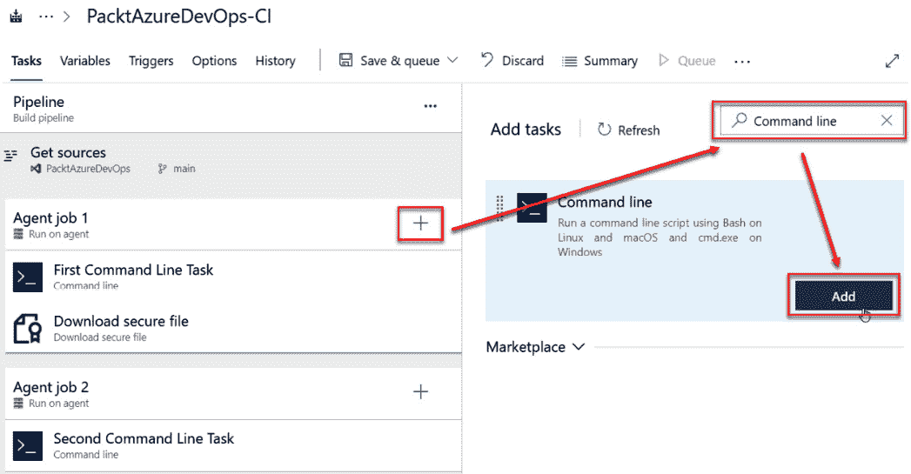
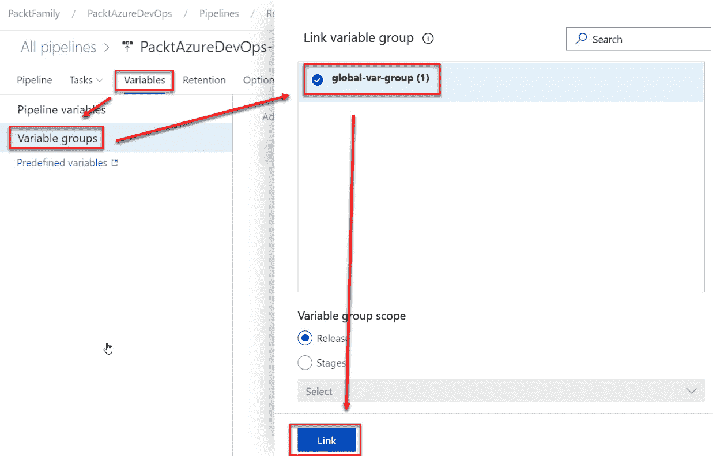
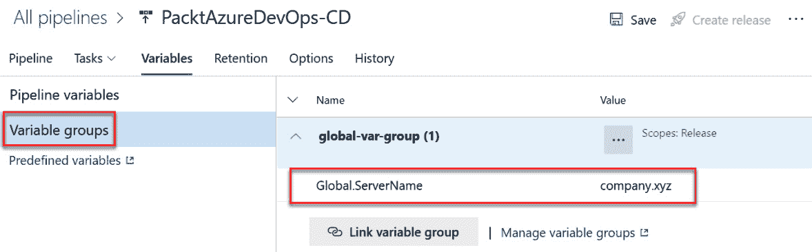

# 第三章：3

# 设置变量、环境、审批和检查

在前几章中，我们通过创建任务和工作来构建了第一个构建流水线，并设置了触发器来自动运行构建流水线。本章将介绍创建发布流水线的下一步。到本章结束时，你将学会如何创建发布流水线，从而在 Azure 上部署应用。这包括设置变量组库，并学习为特定用例（例如移动应用部署）添加和使用机密文件。

本章将涵盖以下内容：

+   为 Azure 资源创建服务连接

+   创建变量组库

+   上传和管理机密文件

+   创建发布流水线。

# 为 Azure 资源创建服务连接

本节将教你如何创建服务连接，以便你可以在 Azure 资源上发布应用。在创建服务连接之前，你需要提供一个 Azure 凭证，可以从 Azure 门户获取。

## 探索 Azure 应用注册

**应用注册**是你可以获取 Azure 凭证的门户部分，允许 Azure Pipelines 将应用部署到 Azure 资源。你可以通过执行以下步骤来创建 Azure 应用注册：

1.  访问 [`portal.azure.com`](https://portal.azure.com) | **Microsoft** **Entra ID**。

1.  点击**应用注册**，然后点击**+** **新建注册**：


图 3.1 – 应用注册页面

1.  点击**注册应用**选项。此时，你需要提供注册应用的名称，之后可以选择四个关于帐户类型的选项。第一个选项是单租户，意味着在一个 Azure 帐户中只有一个身份。第二个选项是多个身份，适用于一个 Azure 帐户中的多个身份。第三个选项是如果有多个身份，包括一个 Azure 帐户中的个人 Microsoft 帐户。最后一个选项仅适用于一个 Azure 帐户中的个人 Microsoft 帐户。选择相关选项后，点击**注册**：


图 3.2 – 注册应用页面

1.  注册应用 ID 后，导航至**证书和机密**以创建机密。点击**+ 新建客户端机密** | **添加客户端机密**。提供描述和到期日期后，点击**添加**：


图 3.3 – 证书和机密

1.  不要忘记复制*密钥*值——它会消失，并且在关闭此页面后无法恢复：


图 3.4 – 客户端机密

1.  复制高亮显示的信息，为创建服务连接做准备：


图 3.5 – 应用注册概览

在接下来的部分中，我们将使用这些信息来创建服务连接。

## 创建服务连接

要在 Azure 上部署应用程序，您需要创建一个服务连接，这是一个服务帐户，允许您访问 Azure 资源。为此，请按照以下说明操作：

1.  在 Azure 门户中创建应用注册后，导航到 Azure DevOps 页面 [`dev.azure.com/`](https://dev.azure.com/) 并点击 **登录**：


图 3.6 – 登录页面

1.  点击 **项目设置** | **服务连接** > **创建** **服务连接**：


图 3.7 – 创建服务连接

1.  选择 **Azure 资源管理器**，然后点击 **下一步**：


图 3.8 – 选择服务连接类型

1.  对于 **身份验证方法**，有四个选项可供选择：

    +   第一个选项涉及自动查找所有 Azure 资源中的服务主体。

    +   第二个选项是手动方法，您可以输入有关应用程序 ID 的所有信息。此选项使您能够轻松连接到 Azure 资源。

    +   第三个选项用于一个已存在的身份，该身份用于另一个系统。

    +   最后一个选项涉及从 Azure 门户页面导出公共配置文件并使用它。

    在本示例中，选择第二个选项，**服务主体（手动）**，然后点击 **下一步**：


图 3.9 – 选择身份验证方法

1.  填写以下所需字段，然后点击 `Azure 云`

1.  `<在` `订阅菜单` `上检查>`

1.  `<在` `订阅菜单` `上检查>`

1.  `<应用注册的` `客户端 ID>`

1.  `<应用注册的` `秘密>`

1.  `<租户 ID 的` `应用注册>`

1.  `sp-for-devops`

1.  **安全性**：开启 **授予所有** **管道** 访问权限。


图 3.10 – 输入 Azure 服务连接详细信息

1.  现在，您可以查看新的服务连接：


图 3.11 – 所有服务连接的列表

在本节中，您学习了如何创建一个用于 Azure 资源连接的服务连接。您将在创建发布管道以部署 Azure 应用程序时使用它。在下一部分中，您将学习如何为项目中所有 Azure 管道创建全局变量和秘密文件。

# 管理全局变量和秘密文件

大多数项目在创建发布管道时会使用相同的值，例如 Azure 服务连接的名称。本节将教你如何创建变量组和秘密文件。这些资源对于在多个管道之间共享公共值至关重要，其中包括例如用于将应用程序部署到 Microsoft Azure 的用户名和密码。

## 创建变量组库

如果某个流水线需要使用 Azure 服务连接，您需要创建一个全局变量并将其链接到所有流水线。使用变量组可以减少错误的发生和在多个流水线中重复赋值的情况。当您需要更新值时，可以在一个集中位置进行更新，而不必在所有流水线中逐一修改。

当您需要创建在所有流水线中共享的变量时，可以按照这些步骤操作：

1.  导航到您的项目并点击**流水线** | **库** | **变量组**：


图 3.12 – 创建变量组

1.  填写所有必填字段；指定**变量组名称**和**名称**，并输入您希望在所有流水线中共享的值，然后点击**保存**：


图 3.13 – 输入变量组详细信息

1.  编辑需要链接到变量组的现有流水线。点击现有流水线的**编辑**选项，导航到**变量** | **变量组** | **链接** **变量组**：


图 3.14 – 选择变量组

1.  选择您刚刚创建的变量组并点击**链接**：


图 3.15 – 链接变量组

1.  审查已分配给变量组的所有值，然后点击**保存 &** **排队**：


图 3.16 – 审查并保存变量组到流水线

在本节中，您学习了如何创建一个变量组，以便在所有流水线中共享。您还学习了如何将变量组链接到现有的流水线。在下一节中，您将学习如何上传密钥文件并将其连接到您的流水线。

## 上传并选择密钥文件

密钥文件通常包含敏感信息，如签名证书、SSH 密钥、许可证文件或移动配置文件。在某些情况下，您需要生成这些文件，而在其他情况下，这些文件是在其他平台上生成的。然后，您必须从该平台下载文件，并使其可供您的 CI/CD 流水线使用。

例如，要部署一个移动应用程序，如 iOS 应用程序，您必须首先生成一个**配置文件**，该配置文件包含关于谁在开发该 iOS 应用的信息，下载该文件，然后将其链接到流水线。

要执行此操作，请按照以下步骤操作：

1.  转到**流水线** | **库** | **+** **安全文件**：


图 3.17 – 安全文件

1.  点击您需要保留为密钥文件的`*.mobileprovision`文件，然后点击**确定**：


图 3.18 – 上传文件

1.  查看您上传的安全文件：


图 3.19 – 查看安全文件

1.  点击`安全`，然后点击**添加**在**下载安全** **文件**任务上：


图 3.20 – 下载安全文件任务

1.  在前面的步骤中，我们在全局部分添加了秘密文件。现在，我们需要在使用时下载它。为此，输入相关的详细信息：


图 3.21 – 输入相关的详细信息

1.  点击`命令行`，然后点击**添加**在**命令行**任务上：



图 3.22 – 添加命令行任务

1.  输入相关的`显示安全文件路径`并输入`echo $(demo.secureFilePath)`。点击**保存并** **排队**：


图 3.23 – 输入命令行任务的详细信息

1.  查看作业以查看**显示安全** **文件**日志：


图 3.24 – 查看安全文件路径

为什么使用安全文件？

这些文件将被安全存储并加密在 Azure DevOps 中，以供你在管道中使用，最大限度减少它们被团队误放或误用的可能性。

本节教会你如何创建安全文件并将其连接到管道。你还学会了如何将安全文件下载到管道并在命令行上显示它们。在下一节中，你将学习如何创建一个包含变量组和安全文件的发布管道。

# 创建发布管道

本节将教你如何创建一个发布管道，以部署从构建管道接收到的工件。

**发布管道**还包括来自库的变量组中的安全文件和变量。

要创建这样的管道，请按照以下步骤操作：

1.  导航到**管道** | **发布** | **新管道**：


图 3.25 – 新管道

1.  点击相关的管道，在此情况下是**release-app-dev**。导航到**管道** | **工件** | **+** **添加**：


图 3.26 – 添加工件

1.  点击**构建**并选择**PacktAzureDevOps-CI**，然后点击**添加**：


图 3.27 – 输入工件数据

1.  转到**变量** | **变量组** | **global-var-group** | **链接**：



图 3.28 – 链接变量组

1.  展开**global-var-group (1)**以查看所有关联的变量：



图 3.29 – 审查变量

1.  点击`demo`下的**引用名称**：


图 3.30 – 添加下载安全文件任务

1.  点击`显示安全文件 &` `变量`

1.  **脚本**:

    ```
    echo $(demo.secureFilePath)
    echo "=============="
    echo $(Global.ServerName)
    ```

这可以在以下截图中看到：


图 3.31 – 添加命令行任务

1.  点击**代理作业**，然后选择以下选项：

    +   **代理池**: **Azure Pipelines**

    +   **代理** **规格**: **ubuntu-latest**

    然后点击**保存**：


图 3.32 – 代理作业属性。

1.  要创建发布流水线，请导航至**发布** | **PacktAzureDevOps-CD** | **发布** | **创建** **发布**：


图 3.33 – 创建发布

1.  你可以保留默认值。你也可以在**发布描述**框中输入信息，描述发布流水线的目的，然后点击**创建**：


图 3.34 – 确认创建发布流水线

前面截图中的默认值有不同的含义；让我们来一一解析：

+   启用了自动触发器的阶段将在发布创建后立即开始。通过此选项，你可以停止阶段在发布创建时自动启动，然后从门户手动启动它。

+   对于**工件**，创建发布时可用的最新版本将是默认选中的选项。这个选项让你有机会选择任何其他可用版本，比如在你想通过部署先前版本来执行回滚的场景中。

1.  现在，你可以看到发布流水线运行的进度：


图 3.35 – 构建发布

1.  你还可以通过点击**显示安全文件 &** **变量**来查看任务列表：


图 3.36 – 查看发布结果

任务结果将显示如下：


图 3.37 – 命令行任务结果

至此，你已经学会了如何创建一个发布流水线，包括一个安全文件和一个变量组库。你可以在创建任何流水线时应用这一模式。

# 摘要

本章介绍了如何创建一个包含变量组库的发布流水线，并上传和管理一个机密文件。这些组件不仅增强了流水线的组织性和安全性，还为高效、一致的部署提供了基础。

理解如何创建这些组件将帮助你协调 Azure DevOps 流水线与 Azure 生态系统之间高效、简洁的交互，这是任何 Azure 开发项目中宝贵的技能。

在下一章中，你将学习如何使用 YAML 自定义构建管道并在代理上运行它。这个 YAML 将创建一个高级构建管道，而不是在 Azure 门户上创建，并且是你可以为构建管道创建参数的地方。
