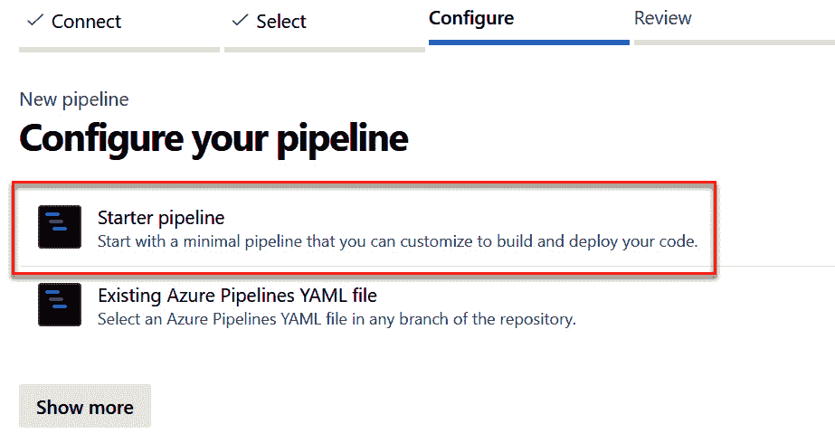
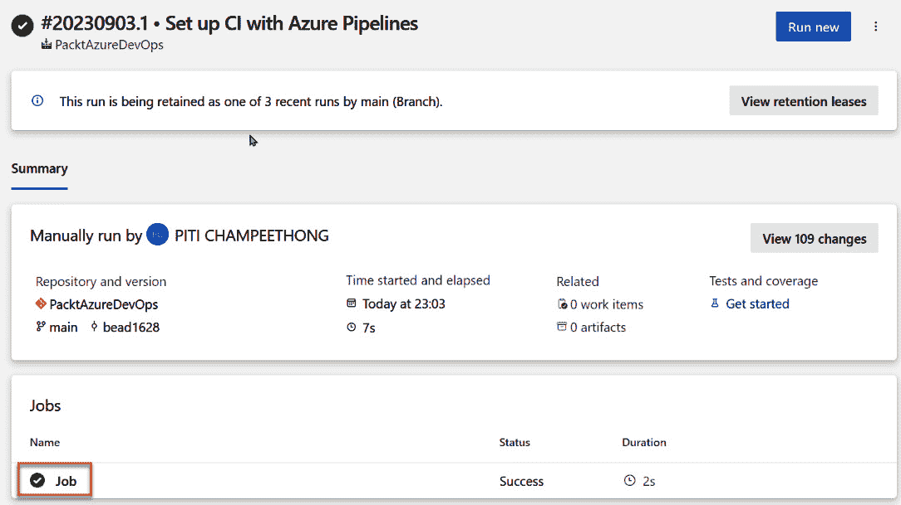
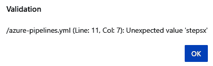
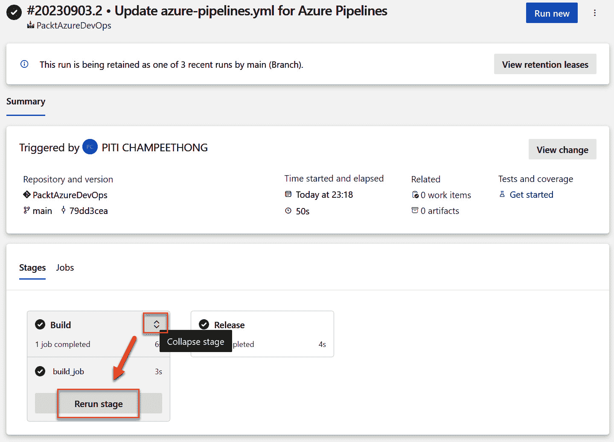

# 4

# 使用 YAML 扩展高级 Azure Pipelines

在上一章中，我们通过创建作业、任务和触发器创建了构建管道。本章将教您如何使用 YAML 自定义 Azure 管道，例如，在设置复杂条件时通过变量组创建条件语句。这也有助于创建一个灵活的管道，而不是经典的在线版本。例如，当您需要同时将移动应用程序部署到 Google Play 控制台和 App Store Connect 时，YAML 可以做到这一点。

在本章结束时，您将学会如何使用 YAML 创建构建和发布管道。您还将学会如何从 Azure DevOps 门户的经典编辑器中克隆、导出和导入 YAML。

我们将涵盖以下主题：

+   使用 YAML 创建构建管道

+   使用 YAML 创建发布管道

+   克隆、导出和导入 YAML 管道

+   复杂的 YAML 配置

+   基于 YAML 的管道的优点和局限性

我们从使用 YAML 语法创建一个管道开始。

# 使用 YAML 创建构建管道

在本节中，您将学习如何使用 YAML 构建一个管道。您还将学习如何在 Azure DevOps 门户中查看 YAML，并将 YAML 文件保存到 Azure Repos。要使用 YAML 创建构建管道，请按照以下步骤操作：

1.  在通过 Azure DevOps 门户登录后，请选择您的组织，然后导航到 **管道** 页面。点击 **新建管道**：

图 4.1 – 新建管道

1.  点击 **Azure Repos Git**，这是演示的源代码仓库：

图 4.2 – Azure Repos Git

1.  点击 **PacktAzureDevOps** 仓库：

图 4.3 – 选择一个仓库

1.  如果您已经有现有的 YAML 文件，您需要选择 **现有的 Azure Pipelines YAML 文件**。但是，由于我们在这里创建一个新的文件，我们将点击 **启动管道**：

图 4.4 – 选择一个启动管道

1.  点击 **保存**，然后您可以查看以 YAML 格式的新管道：

图 4.5 – 保存管道 YAML

1.  输入一个提交信息，以帮助您记住在文件中所做的更改，并选择 **直接提交到主分支** 选项。此选项将把您的文件保存在主分支中：

图 4.6 – 提交 YAML 到 Azure Repos Git

如果您希望将文件保存在新分支中，请选择 **为此提交创建一个新分支**。点击 **保存**。

1.  点击 **保存** 后，您将返回到构建管道的主仪表板结果：

图 4.7 – 构建管道仪表板

1.  点击 **运行管道**：

图 4.8 – 运行构建管道

此后，你可以看到构建管道结果的摘要：

图 4.9 – 构建管道结果

1.  你可以通过点击以下截图中 **Run new** 按钮旁边的省略号 (**…**)，然后选择 **Edit pipeline** 来编辑管道：

图 4.10 – 编辑管道

1.  现在，你可以查看 YAML 文件结构的初始部分。让我们来看看示例 YAML 的结构，并描述每个部分：

    1.  Azure Repos 的 **main** 分支保存 YAML 文件。

    1.  这是一个仓库名称。

    1.  这是一个 YAML 文件名。

    1.  构建管道将在主分支的任何更改上运行。

    1.  构建管道将在 Ubuntu 操作系统上运行。

    1.  脚本任务包含一行代码。

    1.  脚本任务包含多行代码。

    以下截图展示了这些组件：

图 4.11 – YAML 文件结构

1.  你可以通过点击作业来查看运行管道后的结果，该作业基于之前截图中的 YAML 文件：

图 4.12 – 显示作业结果详情

1.  点击 **Run a one-line script**，这将显示 **Hello, world!** 文本。这个示例展示了当你希望在 Azure 管道任务中显示消息时：

图 4.13 – 作业步骤及其结果

本节中你学会了如何使用 YAML 文件创建一个简单的构建管道。Azure Repos 保存了 YAML 文件，并且你可以通过 Git 查看其历史记录。在下一节中，你将学习如何使用包含阶段、作业和任务的 YAML 文件创建发布管道。

# 使用 YAML 创建发布管道

本节将教你如何使用 YAML 创建发布管道。你还将学习如何在 YAML 格式中创建阶段、作业和任务。为此，请按照以下步骤进行：

1.  通过点击省略号 (**…**) 并选择 **Edit pipeline**，可以编辑现有管道：

图 4.14 – 编辑现有管道

1.  如下截图所示，替换现有 `azure-pipelines.yml` 文件的所有内容：

图 4.15 – 带有两个阶段的高级管道

如前面截图所示，有两个阶段：

+   第一个阶段将显示 `Build` `stage job`

+   第二阶段将显示 `Release stage`

该场景展示了适用于构建应用程序（`Build` 阶段）和部署应用程序（`Release` 阶段）的构建和发布阶段。如果构建阶段失败，发布阶段将不会继续运行，因此很容易找到错误或问题。

1.  你可以通过点击 **…** 在 **保存** 旁边并点击 **验证** 来验证 YAML 文件的语法：

图 4.16 – 验证 YAML 文件

1.  如果 YAML 文件有效，你将看到以下消息：

图 4.17 – 有效的 YAML 文件

如果 YAML 文件无效，你将看到以下错误消息，说明哪个行出现了问题：

图 4.18 – 无效的 YAML 文件

1.  点击**保存** | **运行管道**。你可以看到一个包含两个阶段的管道结果：

图 4.19 – 阶段详情

1.  你可以通过展开某个阶段并点击 **重新运行阶段** 来重新运行特定的阶段：

图 4.20 – 重新运行阶段

你已经学会了如何创建一个包含两个阶段的发布管道，并且包含一个作业。你还了解了使用阶段的好处，因为你可以重新运行有问题的阶段，而不需要重新运行整个管道。接下来的章节将教你如何克隆、导出和导入 YAML 来创建一个新管道。

# 克隆、导出和导入 YAML 管道

本节将教你如何从 Azure DevOps 门户中克隆、导出和导入 YAML 管道。这些操作将帮助你节省时间，当你需要复制相同的模板并进行调整时。如果你需要创建新的 Azure 管道，可以通过克隆现有的管道来完成。让我们看看执行这些任务所需遵循的步骤：

+   **克隆**：你可以通过复制和粘贴克隆管道，这是克隆管道的简单快捷方式。

+   **导出和导入**：以下步骤展示了如何从管道中导出整个 YAML 文件：

    1.  你可以通过点击 **编辑** 来导出 YAML 管道：

图 4.21 – 编辑管道

1.  点击 **…** | **下载完整 YAML** 下载文件：

图 4.22 – 下载完整的 YAML 文件

1.  打开已下载的文件，复制并粘贴到你创建的新管道中。

在本节中，你了解了如何轻松下载、复制并粘贴 YAML 文件到新的管道中。现在，让我们来看一下使用基于 YAML 的管道的一些优点和缺点。

# 复杂的 YAML 配置

YAML 语法支持几种复杂的配置，允许 YAML 文件的模块化和重用。比如模板重用和模板表达式的实现。接下来的章节将探讨这些功能是如何工作的。

## YAML 模板重用

在处理大型项目以及由同一团队成员开发的多个应用程序时，定义通用模板以便重用，而不是为每个应用程序的 CI/CD 需求从头开始编写所有内容，这非常有帮助。为此，Azure Pipelines 支持引用模板来重用步骤、作业和阶段。这在减少 YAML 重复性方面尤其有用，因为项目中的所有应用程序或部署过程都是相同的。还可以在模板中包含参数，以传递可用于被引用模板中的值，从而自定义行为。

让我们来看以下场景，其中一个 Azure 管道使用两种不同的构建配置两次构建相同的应用程序，采用 .NET 语言。以下截图显示的文件定义了一个参数 `buildConfiguration`，以及执行 NuGet 工具安装（`NuGetToolInstaller@1`）、NuGet 依赖项恢复（`NuGetCommand@2`）和使用 VS 构建工具（`VSBuild@1`）构建解决方案的三个步骤：

图 4.23 – 带参数的 dotnet-build-steps 模板

在以下示例中，你可以看到相同的 `dotnet-build-steps.yml` 文件现在可以在两个不同的代理 `linux-latest` 和 `windows-latest` 上使用相同的步骤构建相同的应用程序，并且可以在前后添加其他任务：

图 4.24 – 带有模板引用的 Azure 管道

该功能提供了极大的灵活性，减少了 YAML 管道中的重复代码，并实现了管道的标准化，这有助于减少出错的几率。

更复杂的配置还可以包括将所有模板放在一个单独的存储库中，由另一个团队负责将这些构建块整合在一起，帮助负责 CI/CD 管道的团队，正如以下截图所示：

图 4.25 – 来自另一个存储库的模板引用

现在让我们来看一下如何使用模板表达式。

## YAML 模板表达式

**表达式** 是 Azure Pipelines 中的一种自定义语法功能，允许你在运行时动态解析值。可以把它看作是模板执行中的控制逻辑。本章无法涵盖所有表达式类型，但了解以下几点是很重要的：

+   评估字面量和变量

+   使用内置函数，如 `coalesce`、`contains`、`eq`、`format` 等，来评估逻辑条件或转换值

+   使用内置函数来评估作业状态

+   使用条件来有条件地插入变量值或任务

+   使用 `each` 关键字遍历参数

+   评估对前置作业或阶段的依赖关系，如状态或输出变量。

以下截图展示了如何使用两种不同工具集（`msbuild` 或 `dotnet` CLI 工具）来支持执行应用程序的构建和测试，并根据参数选择工具的示例：

图 4.26 – 模板表达式示例

使用表达式时，您可以完全控制如何定义管道，并根据进度动态执行步骤，而不仅仅是简单地定义一组静态步骤。

现在您已经理解了这些复杂的配置，让我们来讨论基于 YAML 的管道的优缺点。

# 基于 YAML 的管道的优缺点

首先，让我们看看使用基于 YAML 的管道的好处：

+   YAML 管道作为代码存储在您的版本控制系统中，如 Azure Repos。这意味着它们可以像其他代码一样进行版本控制、分支和审查，从而提供更好的协作和可追溯性。

+   YAML 管道允许在实施分支策略时以受控方式引入变更，分支策略将不同团队成员的工作隔离开来。这确保了变更在完成之前不会影响其他团队成员，从而进行充分测试。

+   YAML 管道使得在不同环境中一致地重现构建和发布过程变得容易。这有助于减少配置漂移，并确保一致的结果。

+   您可以控制构建和发布过程。您可以定义步骤、依赖关系和条件，使您能够根据特定需求定制管道。

尽管有这些好处，使用这些管道可能会有以下缺点：

+   基于 YAML 的管道需要掌握 YAML 语言和 Azure Pipelines 语法，对于不熟悉 Azure Pipelines 的人来说，这可能是一个学习曲线。

+   基于 YAML 的管道语法仅适用于 Azure Pipelines，无法直接迁移到其他 CI/CD 工具。

+   基于 YAML 的管道对扩展的 YAML 文件大小有 4 MB 的限制，这可能使得极其复杂的 CI/CD 过程难以定义。

+   由于无法将其部署到此类环境中，在发布阶段验证 YAML 管道可能会变得困难或不可能。

现在您已经熟悉了基于 YAML 的管道，让我们结束本章内容。

# 总结

本章讲解了如何使用 YAML 构建和发布管道。与在 Azure DevOps 门户上使用经典编辑器相比，这种方法对开发人员来说更具优势。开发人员可以将 YAML 文件保存在他们的 Azure Repos 中，这有助于他们查看每个版本的管道。使用基于 YAML 的管道，你可以提供更高效、透明和以开发者为中心的 CI/CD 流程。你还学习了复杂场景以及如何简化 YAML、重用模板，并通过表达式添加动态行为。最后，你了解了基于 YAML 的管道的优缺点。

在下一章中，你将深入学习如何使用 YAML 实现构建和发布管道，以及如何使用 Node.js、NPM、.NET 和 Docker 重用构建任务来构建管道。

# 第二部分：Azure Pipelines 的实际应用

现在我们已经学会了基础知识，是时候学习如何使用我们的管道进行构建和部署工作，从应用程序到基础设施的自动化配置和管理，包括这些过程中涉及的测试和安全工具。

本部分包含以下章节：

+   *第五章*，*使用部署任务实现构建管道*

+   *第六章*，*集成测试、安全任务和其他工具*

+   *第七章*，*监控 Azure Pipelines*

+   *第八章*，*使用基础设施即代码（Infrastructure as Code）进行基础设施配置*
