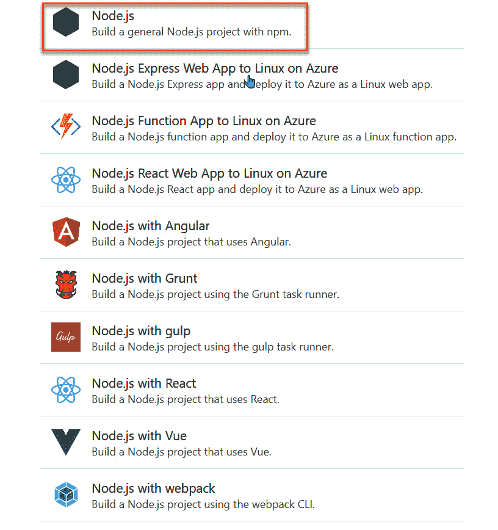

# 5

# 使用部署任务实现构建流水线

在上一章中，我们使用 YAML 创建了一个流水线，并学习了如何在 YAML 格式中创建作业和任务，以及如何导出和导入构建流水线。本章将深入探讨如何使用标准任务创建流水线。到本章结束时，你将学会如何为 Web 应用开发创建构建流水线，包括 Node.js、.NET Core、Docker 和 Microsoft SQL Server，无论是在本地还是 Azure 上，使用初学者友好的任务，使你更容易理解这一概念。

我们将涵盖以下主题：

+   使用 Node.js 和 **Node 包管理器** (**NPM**) 任务

+   使用 .NET Core CLI 任务

+   使用 Docker 任务

+   使用 SQL Server 部署任务

让我们从学习如何使用 Node.js 和 NPM 任务创建流水线开始。

# 使用 Node.js 和 NPM 任务

你需要使用 Node.js 和 NPM 命令来构建和部署 Node.js 应用程序。在 Azure 流水线中，有许多预定义的任务可以构建此类应用程序。按照以下步骤使用 Node.js 和 NPM 任务创建流水线：

1.  登录到 Azure DevOps 门户后，选择你的组织，导航到 **流水线** 页面，然后点击 **新建流水线**：


图 5.1 – 新建流水线

1.  选择 **Azure Repos Git**，这是本演示的源代码库：


图 5.2 – 选择 Azure Repos Git

1.  选择我们在 *第二章* 中创建的 **PacktAzureDevOps** 仓库：


图 5.3 – 选择一个代码库

1.  点击 **显示更多**：


图 5.4 – 显示更多任务

1.  选择 **Node.js** 选项：



图 5.5 – 选择 Node.js

1.  你可以重命名默认文件名 `azure-pipelines-1.yml`，点击它并将其改为 `node.yml`：


图 5.6 – 编辑文件名

1.  点击 **保存并运行** | **保存**：


图 5.7 – 保存流水线文件

在选择了 Node.js 和 NPM 任务模板后，你可以继续修改与 Azure 流水线匹配的默认 NPM 命令，例如选择你需要的 Node.js 版本。接下来的部分将展示如何为 .NET Core 创建任务。

# 使用 .NET Core CLI 任务

对于 .NET 应用程序，你必须使用 .NET Core CLI 命令来构建和部署 .NET 应用程序。在 Azure 流水线中，有许多预定义的任务可以构建 .NET 应用程序。按照以下步骤使用 .NET Core CLI 任务创建流水线：

1.  按照上一部分的 *步骤 1 到 3* 创建 Node.js 和 NPM 任务。

1.  选择 **入门流水线**：


图 5.8 – 选择启动管道选项

1.  将文件从默认名称重命名，以便更容易理解 YAML 文件的用途：


图 5.9 – 重命名管道文件

1.  选择**使用 .NET Core**任务并点击**添加**：


图 5.10 – 选择使用 .NET Core 任务

1.  更新 `version` 属性以使用 .NET 6：


图 5.11 – 更新 .NET 版本

1.  选择**.NET Core**任务并点击**添加**：


图 5.12 – 选择 .NET Core 任务

1.  审查两个预定义的 .NET 任务：

    +   `UseDotNet@2` 用于安装 .NET 编译器版本 6.0.x

    +   `DotNetCoreCLI@2` 是运行特定命令的 .NET 命令，即 `build` 命令

    以下截图显示了这些内容：


图 5.13 – .NET Core 构建任务的视图

在为 .NET CLI 命令创建了启动任务后，您可以继续使用 `DotNetCoreCLI@2` 命令自定义您的任务，该命令指定了用于构建 .NET 应用程序的 `build` 命令，将源代码构建为 .NET 二进制文件。接下来的部分将展示如何处理用于容器化应用程序的 Docker 任务。

# 使用 Docker 任务

对于云原生应用程序，您需要使用 Docker 命令来构建和部署云原生应用程序。在 Azure 管道中，有许多用于构建云原生应用程序的预定义任务。您可以执行以下步骤，通过 Docker 任务创建管道：

1.  按照前一部分中描述的*步骤 1 到 4*，进行 .NET Core CLI 任务的操作。

1.  重命名 Docker 管道的文件：


图 5.14 – 重命名文件

1.  选择 `DockerInstaller@0`：

    ```
    - task: DockerInstaller@0
      inputs:
        dockerVersion: '17.09.0-ce'
    ```

    以下截图展示了如何添加一个**Docker CLI 安装程序**任务并填写任务的详细信息：


图 5.15 – 添加 Docker CLI 安装程序任务

1.  选择**Docker**任务并点击**添加**，您将看到以下代码。这是一个用于在一个任务中构建并推送镜像的 Docker 任务：

    ```
    - task: Docker@2
      inputs:
        command: 'buildAndPush'
        Dockerfile: '**/Dockerfile'
    ```

    以下截图展示了如何添加 Docker 任务并填写详细信息：


图 5.16 – 添加 Docker 任务

为了方便错误处理，您可以将 `buildAndPush` 任务替换为独立的*build*和*push*任务。在*push*任务中，您将 `condition` 值设置为 `succeeded()`，这确保任务仅在前面的步骤（在本例中为构建任务）成功完成时运行。

您可以使用以下代码来替换 `buildAndPush` 任务：

```
  - task: Docker@2
    displayName: 'Build Docker image'
    inputs:
      command: build
      Dockerfile: '**/Dockerfile'
      tags: latest
  - task: Docker@2
    displayName: 'Push Docker image'
    inputs:
      command: push
    condition: succeeded()
```

区别在于，`buildAndPush` 任务将在一个任务中构建并推送镜像，这意味着如果您需要在构建和推送之间添加任务，您是做不到的。

1.  接下来，选择 **命令行** 任务并点击 **添加**。如以下代码片段所示，更新命令行：

    ```
    - task: CmdLine@2
      inputs:
        script: |
          docker login <docker hub url> -u <your username> -p <your password>
          docker push <your repository>:<your tag>
    ```

    以下截图显示了如何添加 **命令行** 任务并填写详细信息：


图 5.17 – 添加命令行任务

运行此管道后，您将在 Docker Hub 上看到 Docker 镜像。

# 使用 SQL Server 部署任务

您需要使用 SQL Server 命令来构建和部署 SQL Server 应用程序。在 Azure Pipelines 中，有许多任务需要完成以构建 SQL Server 应用程序；请按照以下步骤创建一个使用 SQL Server 部署任务的管道：

1.  您可以按照 *步骤 1 到 4*，如 *与 .NET Core CLI* *任务* 部分所述操作。

1.  如以下截图所示，重命名文件：


图 5.18 – 重命名文件

1.  搜索 `SQL Server 数据库`，选择 **SQL Server 数据库部署** 任务，并输入以下内容：

    ```
    - task: SqlDacpacDeploymentOnMachineGroup@0
      inputs:
        TaskType: 'sqlQuery'
        SqlFile: 'migrate.sql'
        ExecuteInTransaction: true
        ServerName: 'localhost'
        DatabaseName: 'your_database'
        AuthScheme: 'sqlServerAuthentication'
        SqlUsername: 'your_username'
        SqlPassword: 'your_password'
    ```

    让我们详细查看每个属性：

    +   `TaskType`：这可以是 `dacpac`、`sqlQuery` 或 `sqlInline`：

        +   `dacpac` 表示此任务将执行 `dacpac` 文件中的 SQL 命令

        +   `sqlQuery` 表示此任务将执行 SQL 文件中的 SQL 命令，如 `SELECT`、`UPDATE`、`INSERT` 和 `DELETE` 命令

        +   `sqlInline` 表示此任务将直接执行 SQL 文件中的 SQL 命令作为 NOT 值

    +   `SqlFile`：这是 SQL 文件的完整路径

    +   `ExecuteInTransaction`：如果设置为 `true`，则任务将在事务范围内执行 SQL 文件

    +   `ServerName`：这可以是数据库服务器名称或 IP 地址

    +   `DatabaseName`：这是执行的数据库名称

    +   `AuthScheme`：这可以是 `sqlServerAuthentication`，使用 SQL Server 的身份验证，或 `windowsAuthentication`，使用 Windows 的身份验证

    +   `SqlUsername`：这是 SQL Server 的用户名

    +   `SqlPassword`：这是 SQL Server 的密码

以下截图显示了如何添加 SQL **数据层应用程序包**（**DACPAC**）部署任务并填写详细信息：


图 5.19 – 添加 SQL Server 数据库部署任务

创建 SQL Server 数据库部署任务后，您可以继续进一步自定义您的任务。例如，您可以指定 `ServerName` 参数，表示数据库主机名或 SQL Server 的服务器名称，该任务将连接到此服务器。完成这些自定义后，您可以保存管道文件。

# 总结

本章向你介绍了如何构建和发布管道，使用标准的 NPM、.NET Core CLI、Docker 和 SQL Server 部署任务。这些预定义任务在构建和部署 Node.js 和.NET 应用程序时非常受欢迎。它们减少了开发人员在运行管道时创建手动命令的时间，从而加快了构建应用程序的过程。

在下一章，你将深入学习如何集成测试和安全任务，以使你的代码和应用程序更加可靠。
